# 第十一章：抗锯齿技术

在本章中，我们将介绍以下食谱：

+   理解采样率技术

+   理解后期处理技术

+   实现快速近似抗锯齿

+   实现自适应抗锯齿

+   实现抗锯齿圆几何形状

# 简介

抗锯齿是计算机图形学中的一种技术，通过最小化锯齿线或阶梯效应来提高屏幕上显示的渲染图像或视频输出的质量。光栅屏幕由成百上千个排列成网格格式的微小正方形像素组成。这些像素在图像光栅化过程中根据几何形状进行采样。基本上，抗锯齿的原因是点采样。这些样本由矩形像素表示，这些像素不足以产生曲线形状。图像中的边缘（圆形而非水平或垂直）负责这种阶梯效应，因为它最终像阶梯一样着色像素。当图像或场景静止时，锯齿问题并不明显，但一旦它们运动起来，锯齿边缘就非常明显。以下图像显示了无限详细等腰直角三角形（**A**）的渲染。光栅化阶段执行采样并在有限的采样网格上显示它。显然，阶梯效应在斜边（**B**）上很容易看到。然而，底边和垂直边的边缘与水平和垂直网格像素（**C**）对齐，因此不会产生锯齿边缘。

然而，一旦三角形旋转，所有边缘都会显示出锯齿效应：

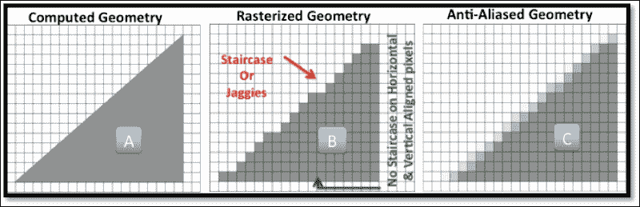

抗锯齿从附近的或背景像素中采样，并将它们与边缘像素的颜色混合，以生成平滑的近似值，从而最小化阶梯效应，使边缘看起来平滑。

抗锯齿可能由其他各种因素引起，例如高光、阴影边界、几何轮廓等，导致颜色频率的快速变化。

抗锯齿技术可以分为两种类型：采样率和后期处理技术。

# 理解采样率技术

在采样率技术中，通过增加像素中样本率的数量来决定像素的颜色，这是基于样本的。这包括诸如超级采样抗锯齿（SSAA）、多采样抗锯齿（MSAA）、覆盖采样抗锯齿（CSAA）等技术，这些技术通常在 GPU 硬件上驱动。

## 如何做...

这一节与其他章节中我们遵循的*如何做...*部分略有不同。在本节中，我们将讨论之前提到的各种采样率技术以及它们之间的程序差异。让我们详细讨论一下。

**超采样抗锯齿**（**SSAA**）：这种技术也被称为**全场景抗锯齿**（**FSAA**）。在这里，场景首先渲染到更高的分辨率，然后通过取其相邻像素的平均值将其下采样到原始分辨率。例如，如果给定的场景需要渲染到 1920 x 1080 的分辨率，它首先在一个离屏表面上渲染到 3840 x 2160 的高分辨率，然后进行下采样。离屏表面是四倍大的，当缩小到原始分辨率时，每个像素产生 2 x 2 样本。FSAA 的逻辑简单，质量细腻，但它的计算成本非常高，因为它需要每个样本都具有颜色和深度信息。这种技术在早期的显卡中可用，但由于其巨大的计算成本，不再在实时应用中广泛使用。

**累积缓冲区**（**AA**）：这种技术与 FSAA 类似，但在这里使用的缓冲区具有与所需图像相同的分辨率，并且比所需图像具有更多的颜色位。为了产生每个像素的 2 x 2 样本，创建了四个图像缓冲区，其中每个图像视图根据需要沿*x*或 y 轴移动半个像素。然后，这些图像在 GPU 的累积缓冲区中相加并平均，以产生抗锯齿输出。现代 GPU 硬件没有累积缓冲区。相反，这可以通过片段着色器来完成。在像素着色器中使用的精度必须更高（每通道 10 到 16 位）以存储累积的结果颜色。8 位精度在混合时可能会导致颜色带状伪影。

**多重采样抗锯齿**（**MSAA**）：由于全采样抗锯齿（SSAA）的计算成本较高，因此出现了多重采样抗锯齿。这种技术产生的可接受质量较低，但它节省了大量的计算成本，并且长期以来一直是 GPU 硬件供应商的首选。多重采样在单次计算过程中对给定像素进行多个样本采样。存在各种像素采样方案，如下面的图像所示：

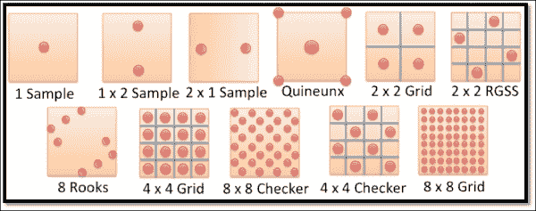

样本率可能因颜色频率变化率的不同而不同。例如，阴影和几何边缘的情况变化较大。因此，需要更多的样本来处理更好的结果。着色是从每个片段只计算一次，这使得它比 SSAA 更快。对于每个样本，相应的颜色和深度信息被分别存储。

下图显示了 1x 和 4x 采样方案。在前者的情况下，采样位置不足以与绿色三角形重叠，因此导致白色着色的像素。然而，在后一种情况下，四个采样位置中有两个成功位于几何形状中。因此，插值后的结果颜色位于这两种颜色之间，最右侧的图像显示了 4x 采样方案的色阶条：

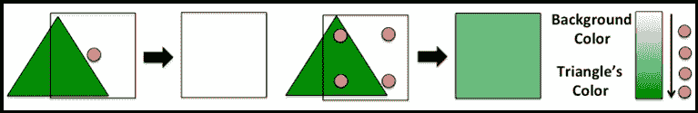

**覆盖采样抗锯齿**（**CSAA**）：这项技术是比 MSAA 改进的版本。MSAA 为每个样本分别存储颜色和深度信息。然而，这种存储是不必要的，并且可以完全避免。CSAA 技术利用这一缺点，避免了颜色和深度信息的单独存储；它采用基于索引的方法。在这种情况下，每个子像素或样本存储一个指向与之关联的片段着色器的索引。所有片段都存储在一个表格格式中，其中包含颜色和深度信息。每个片段通过其唯一的索引来识别。

# 理解后处理技术

在这种技术中，场景被渲染到离屏表面，并使用抗锯齿算法进行处理。处理输出在屏幕表面分割。这种类型的抗锯齿包括 AMD 的形态学滤波（MLAA）、快速近似抗锯齿（FXAA）、子像素形态学抗锯齿（SMAA）等。

## 如何做...

在这里，我们将讨论之前提到的各种后处理技术。

**快速近似抗锯齿**（**FXAA**）：FXAA 是一种后处理过滤技术。此过滤器主要执行两项任务：首先检测边缘，然后对锯齿边缘应用模糊算法。像之前依赖于硬件的技术一样，FXAA 在抗锯齿选项有限的情况下非常有用。FXAA 提供了非常好的性能。与 MSAA 和 SSAA 相比，它更快，因此成为游戏行业的首选选择。这项技术在工作在图像空间中。因此，它可以在任何情况下使用，例如前向渲染图像或延迟渲染图像：

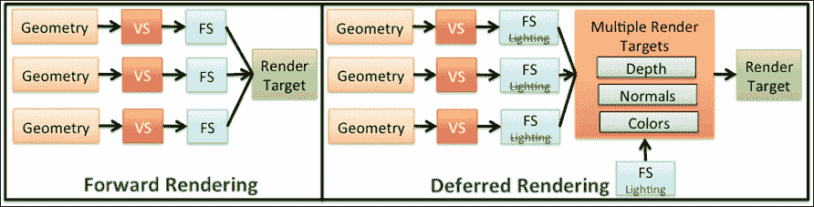

**前向渲染**：这是渲染执行模型的传统路径，其中首先将几何形状输入到顶点着色器，然后是片段着色器。最后，将处理后的视觉效果渲染到目标。整个过程包括四个步骤：

1.  计算几何形状。

1.  材料特性，如法线、双向切线等，被定义。

1.  计算入射光的方向。

1.  对象表面和光线交互被计算。

**延迟渲染**：在延迟渲染技术中，前两步与最后两步分开，在渲染管道的离散阶段执行每个步骤。在这里，场景被分为两个遍历。第一个遍历永远不会用于执行任何类型的着色。然而，在这个遍历期间，用于着色的必要信息（位置、法线、材料和深度）被收集到一组纹理中，并在第二个遍历中使用，在第二个遍历中计算直接和间接光照信息以照亮对象。

# 实现快速近似抗锯齿

在抗锯齿中有两个非常重要的因素：性能和质量。一个好的抗锯齿技术必须快速，并且应该产生可接受的质量结果。FXAA 在这些方面表现非常积极。与 MSAA 相比，它更快，与 SSAA 技术相比，性能开销减少了大约 25%。它以与纹理相同的分辨率工作，这消除了类似于其他技术的额外开销，在这些技术中，纹理被缩放到更高的分辨率然后下采样。

FXAA 作用于图像的特定细节；它系统地检测给定图像中的阶梯效应并将其模糊掉。阶梯效应通过边缘检测算法识别。因此，边缘检测和模糊算法的质量是这里非常重要的因素。一个错误的算法可能会错过重要的边缘或检测到错误的边缘，这可能导致模糊后的质量不令人满意。

## 准备工作

在这个菜谱中，我们将实现 FXAA 技术。让我们从更高层次理解这个实现。

FXAA 技术首先使用**帧缓冲对象**（**FBO**）将场景渲染到离屏表面。与其他基于屏幕空间的技术类似，它操作整个场景，FXAA 技术可以在需要抗锯齿的选定区域运行。FXAA 作为一个后处理着色器实现，它根据像素亮度检测渲染场景中的边缘。然后使用它们的梯度对这些检测到的边缘进行平滑处理。这两个处理都在单次遍历中完成。

这个菜谱就像任何其他后处理菜谱一样：

1.  创建具有所需尺寸的 FBO。

1.  创建一个场景并将其渲染到离屏 FBO 表面。

1.  将 FXAA 技术单次应用到 FBO 纹理场景中。

    ### 注意

    在这个菜谱中，我们将描述第三步，在那里我们将实现片段着色器中的 FXAA 算法。有关后屏幕技术的更多信息，请参阅第九章，《后屏幕处理和图像效果》。

## 如何操作...

以下代码在片段着色器中实现了 FXAA 技术算法；此片段着色器在离屏场景纹理图像上操作：

```java
#version 300 es
precision mediump float;

in vec2             TexCoord;      // Texture coordinates
uniform sampler2D   Tex1;          // FBO texture
uniform float       ScreenCoordX;  // X Screen Coordinate
uniform vec2        FBS;          // Frame Buffer Size
layout(location = 0) out vec4   outColor;

// Calculates the luminosity of a sample.
float FxaaLuma(vec3 rgb) {return rgb.y * (0.587/0.299) + rgb.x;}

void main() {
        float FXAA_SPAN_MAX     = 8.0;
    float FXAA_REDUCE_MUL   = 1.0/8.0;
    float FXAA_REDUCE_MIN   = 1.0/128.0;

    // Sample 4 texels including the middle one.
    // Since the texture is in UV coordinate system, the Y is
    // therefore, North direction is –ve and south is +ve.
    vec3 rgbNW = texture(Tex1,TexCoord+(vec2(-1.,-1.)/FBS)).xyz;
    vec3 rgbNE = texture(Tex1,TexCoord+(vec2(1.,-1.)/FBS)).xyz;
    vec3 rgbSW = texture(Tex1,TexCoord+(vec2(-1.,1.)/FBS)).xyz;
    vec3 rgbSE = texture(Tex1,TexCoord+(vec2(1.,1.)/FBS)).xyz;
    vec3 rgbM  = texture(Tex1,TexCoord).xyz;

    float lumaNW = FxaaLuma(rgbNW);   // Top-Left
    float lumaNE = FxaaLuma(rgbNE);   // Top-Right
    float lumaSW = FxaaLuma(rgbSW);   // Bottom-Left
    float lumaSE = FxaaLuma(rgbSE);   // Bottom-Right
    float lumaM  = FxaaLuma(rgbM);    // Middle

      // Get the edge direction, since the y components are inverted
      // be careful to invert the resultant x
       vec2 dir;
    dir.x = -((lumaNW + lumaNE) - (lumaSW + lumaSE));
    dir.y =  ((lumaNW + lumaSW) - (lumaNE + lumaSE));

      // Now, we know which direction to blur, 
      // But far we need to blur in the direction? 
      float dirReduce = max((lumaNW + lumaNE + lumaSW + lumaSE) * 
      (0.25 * FXAA_REDUCE_MUL),FXAA_REDUCE_MIN);
      float rcpDirMin = 1.0/(min(abs(dir.x),abs(dir.y))+dirReduce);

      dir = min(vec2( FXAA_SPAN_MAX,  FXAA_SPAN_MAX), max(vec2(-
      FXAA_SPAN_MAX,-FXAA_SPAN_MAX), dir*rcpDirMin))/FBS;

      vec3 rgbA = (1.0/2.0)*(texture(Tex1, TexCoord.xy + dir *
      (1.0/3.0 - 0.5)).xyz + texture(Tex1, TexCoord.xy 
      + dir * (2.0/3.0 - 0.5)).xyz);
      vec3 rgbB = rgbA * (1.0/2.0) + (1.0/4.0) * (texture(Tex1, 
      TexCoord.xy + dir * (0.0/3.0 - 0.5)).xyz + texture
      (Tex1, TexCoord.xy + dir * (3.0/3.0 - 0.5)).xyz);

      float lumaB    = FxaaLuma(rgbB);
      float lumaMin   = min(lumaM, min(min(lumaNW, lumaNE),
      min(lumaSW, lumaSE)));
      float lumaMax    = max(lumaM, max(max(lumaNW, lumaNE), 
      max(lumaSW, lumaSE)));

      if((lumaB < lumaMin) || (lumaB > lumaMax)){
        outColor = vec4(rgbA, 1.0);
      }else{
        outColor = vec4(rgbB, 1.0);
      }
}
```

## 它是如何工作的...

FXAA 技术利用了人眼的一个有趣特性，即亮度或颜色亮度；我们对它非常敏感。人眼非常能够注意到亮度最轻微的变化。使用颜色亮度检测边缘与几乎所有类型的走样效果一起工作，例如镜面或几何走样。亮度或灰度图提供了图像中的亮度级别；它在检测图像空间中的亮暗区域时很有帮助。两个样本之间亮度的急剧变化暗示了边缘的存在。

本配方中实现的 FXAA 过滤器在当前 texel 周围进行五次采样，并分析这些采样以检测边缘的存在。以下图像显示了一个斜边受到阶梯效应（**A**）影响的三角形。其边缘的某一部分经过 FXAA 过滤器处理以执行抗锯齿（**B**）。此过滤器进行五次采样并将它们转换为用于边缘检测的发光 texel（**C**）。此信息被模糊算法用于根据相邻样本模糊颜色强度（**D**）：

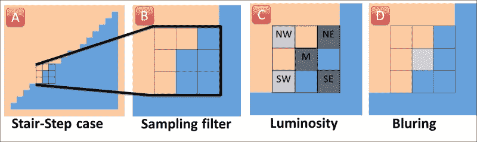

`FBS`包含当前离屏表面纹理（FBO）的大小，其倒数给出单位 texel 的尺寸。这个单位 texel 被添加到当前 texel（**M**）的各个方向（顶部、底部、左侧和右侧），以产生围绕中心 texel（**M**）的新采样 texel **NW**（左上）、**NE**（右上）、**SW**（左下）和**SE**（右下）。由于 UV 坐标系统相对于笛卡尔坐标系统具有反转的**Y**方向，我们需要反转南北方向。因此，你可以看到南北分量的负号：

```java
vec3 rgbNW = texture(Tex1,TexCoord+(vec2(-1.,-1.)/FBS)).xyz;
vec3 rgbNE = texture(Tex1,TexCoord+(vec2( 1.,-1.)/FBS)).xyz;
vec3 rgbSW = texture(Tex1,TexCoord+(vec2(-1., 1.)/FBS)).xyz;
vec3 rgbSE = texture(Tex1,TexCoord+(vec2( 1., 1.)/FBS)).xyz;
vec3 rgbM  = texture(Tex1,TexCoord).xyz;
```

`FXAALuma`函数根据下一图像计算 NW、NE、SW、SE 和 M 样本的发光权重；这些权重用于找到模糊的方向。

```java
   float lumaNW = FxaaLuma(rgbNW);    // Top-Left
   float lumaNE = FxaaLuma(rgbNE);     // Top-Right
   float lumaSW = FxaaLuma(rgbSW);     // Bottom-Left
   float lumaSE = FxaaLuma(rgbSE);     // Bottom-Right
   float lumaM  = FxaaLuma(rgbM);      // Middle
```

以下图像给出了计算边缘方向的公式。如果*x*和*y*分量的结果是非零幅度，则存在边缘。正如你所见，方向公式确定了沿*x*和*y*轴的边缘方向分量。现在，使用这些信息，可以在特定方向上进行模糊处理：

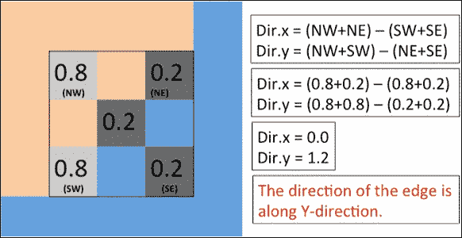

你可能已经注意到*x*的方向被反转（负值）。这是因为用于北和南分量的反转符号在前面代码中提到：

```java
dir.x = -((lumaNW + lumaNE) - (lumaSW + lumaSE)); //Inverted
dir.y =  ((lumaNW + lumaSW) - (lumaNE + lumaSE));
```

我们已经得到了方向。现在，我们必须确定在给定方向上应该模糊多远。为了找到距离，我们大致归一化方向向量，使得最小的分量成为单位。为此，可以通过取最小分量方向向量的倒数来计算这个方向向量的模（`rcpDirMin`）。现在，如果发生除以零的情况，结果将是未定义的。为此，添加了一个 delta 分量。我们称之为减少方向（`dirReduce`）：

```java
float rcpDirMin = 1.0/(min(abs(dir.x),abs(dir.y))+dirReduce);
```

减少方向计算相当简单；它是`FXAA_REDUCE_MUL`常量与所有亮度强度的平均值以及`FXAA_REDUCE_MIN`常量乘积的最大值。这些常量非常依赖于用户的观察。因此，可以将它们定义为 uniforms，以允许进行这些实验：

```java
float dirReduce = max((lumaNW + lumaNE + lumaSW + lumaSE) * 
                     (0.25 * FXAA_REDUCE_MUL),FXAA_REDUCE_MIN);
```

单位方向向量可以计算为`dir = dir * rcpDirMin`，但这里还有一个问题。如果结果乘积非常大，这将产生远离当前 texel 的 texels。我们当然不希望这样，因为我们只对附近的 texels 感兴趣。因此，我们需要使用以下方法将这个结果方向向量的跨度限制在某个有限范围内。`FXAA_SPAN_MAX`是一个常量（8.0）。结果除以 FBS 给出了 UV 方向中单位 texel 在纹理空间的方向：

```java
dir = min(vec2( FXAA_SPAN_MAX,  FXAA_SPAN_MAX), max(vec2(-
              FXAA_SPAN_MAX,-FXAA_SPAN_MAX), dir*rcpDirMin))/FBS;
```

现在，我们有了用于模糊的方向模。为了执行模糊，沿着边缘的相同方向取两个样本。第一个样本`rgbA`使用前向（*dir * (2.0/3.0 - 0.5)）和后向（*dir * (1.0/3.0 - 0.5)）方向（*dir*）从`Tex1`纹理中计算两个样本。结果强度减少到一半：

```java
vec3 rgbA = (1.0/2.0)*(texture(Tex1, TexCoord.xy + dir *
            (1.0/3.0 - 0.5)).xyz + texture(Tex1, TexCoord.xy 
             + dir * (2.0/3.0 - 0.5)).xyz);
```

类似地，另一个样本，即`rgbB`，也包含两个内部样本，它们分别位于当前 texel 的前向（*dir * (3.0/3.0 - 0.5)）和后向（*dir * (0.0/3.0 - 0.5)）方向，各占一半。在这里，结果强度减少到四分之一，并与`rgbA`的结果混合。由于`rgbA`的强度已经减少到一半，因此在混合之前进一步减少到四分之一：

```java
   vec3 rgbB = rgbA * (1.0/2.0) + (1.0/4.0) * (texture(Tex1, 
   TexCoord.xy + dir * (0.0/3.0 - 0.5)).xyz + texture
   (Tex1, TexCoord.xy + dir * (3.0/3.0 - 0.5)).xyz);
```

这两个样本向量（`rgbA`和`rgbB`）用于执行测试，以检查采样纹理是否太远。为此，我们从给定的样本中计算最小和最大亮度，分别存储在`lumaMin`和`lumaMax`中。同样，计算`lumaB`的亮度并将其存储在`rgbB`变量中：

```java
   float lumaB     = FxaaLuma(rgbB);
   float lumaMin   = min(lumaM, min(min(lumaNW, lumaNE),
   min(lumaSW, lumaSE)));
   float lumaMax    = max(lumaM, max(max(lumaNW, lumaNE), 
   max(lumaSW, lumaSE)));
```

如果`rgbB`的亮度小于最小亮度或大于最大亮度，显然它超出了我们采样亮度的预期范围。在这种情况下，我们将使用`rgbA`着色当前片段，它更接近于采样的定向边缘。另一方面，如果亮度范围在预期范围内，则使用`rgbB`颜色：

```java
if((lumaB < lumaMin) || (lumaB > lumaMax)){
       outColor = vec4(rgbA, 1.0);
   }else{
       outColor = vec4(rgbB, 1.0);
}
```

## 更多...

在本节中，我们将讨论使用 FXAA 的优点和缺点：

**优点**:

+   与 MSAA 相比，FXAA 更快，但占用的内存更少。

+   这种技术作为图像空间中的过滤器工作。因此，它很容易集成到着色器中，并且不需要高计算成本。

+   FXAA 平滑了由 alpha 混合纹理和片段着色器效果产生的边缘。它适用于任何技术，例如前向图像或延迟渲染图像。

+   抗锯齿的成本与渲染场景的成本无关。因此，对包含数百万个顶点和数百个纹理的复杂场景进行抗锯齿的执行时间与包含数百个顶点和少量纹理的简单场景相同。

+   FXAA 技术可以与其他后处理过滤技术结合使用。这将完全消除抗锯齿通过的额外成本。

+   如果提前知道哪些场景部分将要进行抗锯齿处理，可以使用诸如剪裁测试、视口信息等特性，将 FXAA 应用于所选区域。

**缺点**:

+   它需要一个高质量的边缘检测算法；一个低质量的算法可能会错过一些需要抗锯齿的边缘。

+   同样，一个好的模糊算法需要模糊出正确的结果。

+   它不处理时间抗锯齿。

    ### 注意

    时间抗锯齿会导致渲染对象跳跃出现，给人一种物体突然跳动的印象，而不是给人一种物体平滑移动的印象。这种行为的背后原因是场景采样的速率；与场景中对象的变换速度相比，采样速率要低得多。为了避免时间抗锯齿效果，场景的采样率必须至少是最快移动对象的两倍。

## 参见

+   请参考第六章的“使用纹理坐标进行过程纹理着色”配方，*使用着色器*

+   请参考第七章的“使用帧缓冲对象实现渲染到纹理”配方，*纹理和映射技术*

# 实现自适应抗锯齿

自适应抗锯齿减轻了在实现进程式着色器过程中产生的锯齿效应。由于进程式着色器是编程来生成动态纹理的，从低频到高频的过渡对程序员来说非常清楚，因为他们是编写它的人。例如，圆点图案的实现使用圆或球体计算逻辑生成点图案。如果片段着色器落在圆内，它将用一种颜色绘制；否则，它使用背景颜色。在这种情况下，程序员非常清楚从一种颜色到另一种颜色的过渡将非常尖锐。这就是自适应抗锯齿发挥作用的地方。它通过在两种颜色之间插值颜色来避免这种尖锐的颜色过渡。这些尖锐的过渡可以通过许多内置的着色语言 API（如 smooth、mix 和 clamp）来使它们更加平滑。

在这个配方中，我们将通过实现抗锯齿的进程式纹理来生成一个动画条纹图案并移除条纹边缘的锯齿效应。

## 如何实现...

使用以下片段着色器来实现自适应抗锯齿：

```java
#version 300 es
precision mediump float;

// Reuse Phong shading light and material properties.
uniform float  Time;

// Flag to enable and disable Adaptive anti-aliasing
uniform int     EnableAdaptiveAA;

layout(location = 0) out vec4 FinalColor;

vec3 PhongShading{
   // Reuse Phong shading code.
}

in float objectY;
float Frequency = 6.0; // Controls number of stripes

// Reference: OpenGL Shading Language by Randi J Rost
void main() {
    if(gl_FragCoord.x < ScreenCoordX+1.0 
             && gl_FragCoord.x > ScreenCoordX-1.0){
        FinalColor = vec4(1.0, 0.0, 0.0, 1.0);
        return;
    }

    float offset    = Time;

    // GENERATE fractional value 0.0, 0.1, ........, 0.9
    float sawtooth  = fract((objectY+offset) * Frequency);

    // Produce values in the range between [-1, 1]
    float triangle  = 2.0 * sawtooth - 1.0;

    // Produce continuous range from [ 1.0 ... 0.0 ... 1.0 ]
    triangle        = abs(triangle);
    float dp        = length(vec2 (dFdx(objectY+offset),
                                          dFdy(objectY+offset)));
    float edge      = dp * Frequency * 4.0;
    float square    = 0.0;

    // Show the difference between aliased and anti-aliased.
    if (gl_FragCoord.x < ScreenCoordX){
        square      = step(0.5, triangle);
    }
    else{
        square      = smoothstep(0.5-edge, 0.5 + edge, triangle);
    }

    FinalColor = vec4 (vec3 (square)*PhongShading(), 1.0);
}
```

## 如何工作...

这个配方实现了动画水平条纹图案。它使用对象坐标的垂直分量来生成这个图案。要生成图案的 3D 网格模型的对象坐标被传递到顶点着色器，在那里它在`objectY`变量中与片段着色器共享。这些对象坐标的垂直分量与`offset`变量相加。`offset`变量是时间的函数。每次渲染新帧时，通过将其从最后的位置移动到某个新位置来通过位移动画条纹图案。这些条纹图案将从顶部到底部方向连续动画。

`Frequency`变量控制对象上的条纹数量。它与对象坐标相乘以缩放其范围。着色语言的`fract()` API 产生一个从 0.0 到 0.9 的小数，产生一个类似于锯齿的图案（**A**）。将这些值乘以 2 并减去 1，我们得到一个限制在-1.0 和 1.0 之间的范围的功能（**B**）。最后，取这些绝对值产生一个从 1.0 到 1.0 的正连续范围（**C**），这些值存储在三角形变量中：

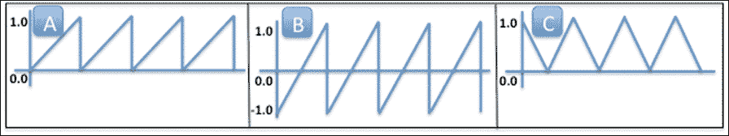

使用 GLSL step API 生成的条纹图案。此 API 如果三角形小于 0.5 则返回 0.0，如果大于则返回 1.0，如下面的图所示（**D**）：

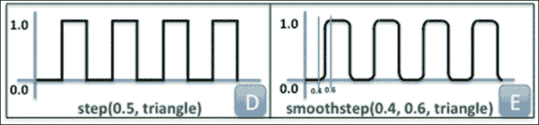

`step` API 生成的输出显示在以下图像中（参考红色线的左侧）。很明显，由于输出值直接从 0.0 切换到 1.0，反之亦然，因此锯齿效应很容易看到。这种锯齿效应可以使用 GLSL 的另一个 API `smoothstep` 来消除。这个 API 接受两个参数作为输入值，并在两者之间执行插值。它避免了尖锐的过渡，并插值出一个平滑的范围，如前图（**E**）所示。`smoothstep` API 中的两个输入参数是对象坐标沿*x*和*y*分量的偏导数的函数：

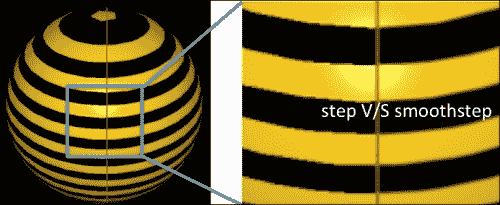

## 参见

+   请参考第六章中的*使用纹理坐标进行程序纹理着色*食谱，*使用着色器*

+   *实现抗锯齿圆几何形状*

# 实现抗锯齿圆几何形状

圆是一个非常常见的几何形状，在各种计算机图形应用中被广泛使用，例如用饼图渲染统计数据、绘制标志牌、动画点图案等等。在本食谱中，我们将借助纹理坐标实现一个抗锯齿圆几何形状，并使用之前食谱中的自适应抗锯齿技术使其更加平滑。

实现抗锯齿圆几何形状的一种方法是在圆的周长上生成一组顶点，其中每两个连续的顶点都连接到中心顶点（原点），形成一个三角形切片。需要多个这样的切片来创建圆的骨架，如图所示。当这些顶点使用三角形原语渲染时，它们会产生一个填充的圆形图案。产生的圆形形状的平滑度高度依赖于沿周长使用的顶点数量。使用更多的顶点可能会降低其性能，因为我们试图在周长上实现更平滑的边缘。

**优点**:

+   由于圆的几何形状是通过顶点本身来表示的，因此碰撞检测和拾取测试将非常准确。

**缺点**:

+   为了使边缘更加平滑，需要越来越多的顶点。最终，这会带来更多性能开销。

+   默认情况下，圆的边缘没有抗锯齿。这类几何技术从实现角度来看可能非常复杂。

+   几何形状尺寸的变化可能会暴露出锯齿边缘：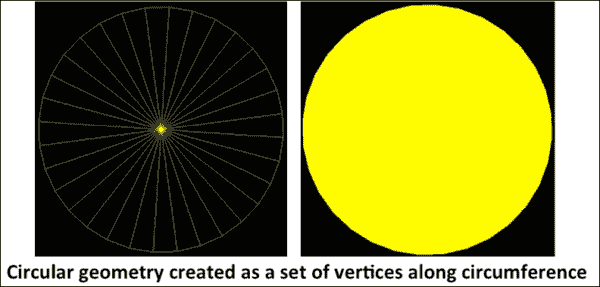

另一种方法是使用程序着色器，借助纹理坐标生成圆形几何形状。需要注意的是，这种技术产生的圆形几何形状实际上并不是真正的圆形；它是一个由四个顶点组成的假几何形状。无论圆的大小如何，它始终使用相同数量的顶点（4 个）来渲染圆形形状。

这种技术的原理非常简单。它使用四个顶点创建一个正方形，并产生一个完美的逻辑圆，该圆内嵌其中。落在该圆内的片段被着色，其余的片段通过 alpha 通道被屏蔽。

通过自适应抗锯齿技术处理，圆的周长或边缘变得更加平滑。在这里，沿着周长的一小部分从内部插值到外部，以产生平滑的渐变。

## 准备工作

让我们看看这个菜谱的高级实现：

1.  创建一个具有顶点的四边形，如下面的图像所示。四边形的中心必须位于原点（0.0, 0.0, 0.0）。

1.  按照以下方式为每个顶点分配一个纹理坐标。根据纹理坐标惯例，原点始终位于四边形的左下角：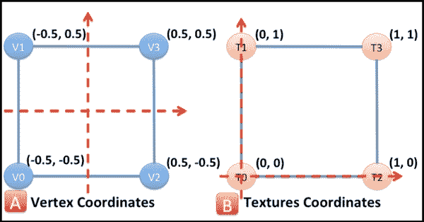

1.  以逆时针方向指定顶点的环绕顺序（**V0** > **V1** > **V2** > **V3**）。

1.  在片段着色器中，将每个纹理坐标与沿 UV 方向的半向量相减。这将使原点从左下角移动到四边形的中心。

1.  检查每个片段与偏移原点的距离。如果当前片段位于外半径范围内（例如 0.5），则用所需颜色绘制它；否则，将片段与背景颜色进行 alpha 混合。

1.  对于抗锯齿，取另一个半径称为内半径，其值小于外半径（例如 0.4），并根据从内半径和外半径之间（[0.4 0.5]）的片段纹理坐标位置计算出的权重来插值颜色值。

## 如何操作...

理解此菜谱逐步实现的步骤如下：

1.  在 `Circle.h`/`.cpp` 中创建一个名为 `Circle` 的类。

1.  在类构造函数中，分别在 `vertices` 和 `texCoords` 变量中定义顶点和纹理坐标：

    ```java
       glm::vec2 texCoords[4] = {
           vec2(0.0f, 0.0f),vec2(0.0f, 1.0f),
            vec2(1.0f, 0.0f), vec2(1.0f, 1.0f)
        };
        memcpy(texCoordinates, texCoords, sizeof(glm::vec2)*4);

        glm::vec3 tempVtx[4] = {
            vec3( -0.5f, -0.5f, 0.0f), vec3( -0.5f,  0.5f, 0.0f),
            vec3(  0.5f, -0.5f, 0.0f), vec3(  0.5f,  0.5f, 0.0f)
        };
        memcpy(vertices, tempVtx, sizeof(glm::vec3)*4);
    ```

1.  创建一个名为 `AACircleVertex.glsl` 的顶点着色器文件：

    ```java
    #version 300 es

    // Vertex information
    layout(location = 0) in vec3  VertexPosition;
    layout(location = 1) in vec2  VertexTexCoord;

    out vec2 TexCoord;

    uniform mat4 ModelViewProjectMatrix;

    void main( void ) {
        TexCoord = VertexTexCoord;
        gl_Position = ModelViewProjectMatrix *
                       vec4(VertexPosition,1.0);
    }
    ```

1.  类似地，创建 `AACircleFragment.glsl` 并添加以下代码：

    ```java
    #version 300 es
    precision mediump float;
    // Texture coordinates
    in vec2 TexCoord;

    uniform vec3        PaintColor;     // circle color
    uniform float       InnerRadius;    // inside radius
    uniform float       OuterRadius;    // outside radius
    layout(location = 0) out vec4   outColor;

    void main() {
       float weight = 0.0f;
        // Displace the texture coordinate wrt 
        // hypothetical centered origin
        float dx     = TexCoord.x - 0.5;
        float dy     = TexCoord.y - 0.5;

        // Calculate the distance of this transformed 
        // texture coordinate from Origin.
        float length = sqrt(dx * dx + dy * dy);

        // Calculate the weights
        weight = smoothstep(InnerRadius, OuterRadius, length );

        outColor = mix( vec4(PaintColor, 1.0), 
                       vec4(PaintColor, 0.0), weight);
    }
    ```

1.  在 `NativeTemplate.cpp` 中定义场景，如下面的代码所示：

    ```java
    Renderer*       graphicsEngine; // Graphics Engine
    Scene*          scene;          // Scene object
    Circle*         circle;
    Camera* camera;
    bool GraphicsInit(){
        // Create rendering engine
        graphicsEngine  = new Renderer();

        // Create the scene
        scene = new Scene("MeshScene", graphicsEngine);

        // Create camera and added to the scene
        camera = new Camera("Camera1", scene);
        camera->SetClearBitFieldMask(GL_COLOR_BUFFER_BIT | 
                                     GL_DEPTH_BUFFER_BIT);
        camera->SetPosition(glm::vec3 (0.00000, 0.0, 2.00000));
        camera->SetTarget(glm::vec3 (0.0, 0.0,0.0));

        // Create a new circle shape object    
        circle = new Circle(scene, NULL, None);
        circle->SetName(std::string("My Circle"));

        scene->addModel(circle);
        graphicsEngine->initializeScenes();
        return true;
    }

    bool GraphicsResize( int width, int height ){
        // Create the view port
        camera->Viewport(0, 0, width, height);
        graphicsEngine->resize(width, height);
        return true;
    }

    bool GraphicsRender(){
        // Rotate the circle
        circle->Rotate(1.0, 1.0, 1.0, 1.0);
        graphicsEngine->render();
        return true;
    }
    ```

## 它是如何工作的...

这个配方主要包含两个部分：创建圆形和光滑创建圆形的边缘。在第一部分，定义了几何形状以创建基础形状。基础形状由四个顶点组成，以创建一个完美的正方形。这些顶点与顶点着色器共享，以产生视点坐标。每个顶点都包含相关的纹理坐标，这些坐标也被传递到顶点着色器并与片段着色器共享。片段着色器以这种方式控制完美正方形的着色区域，使其看起来像一个完美的圆形。所有这些操作都是通过纹理坐标操作完成的。以下图像显示了映射到正方形几何形状上的输入纹理坐标（**A**）。如图所示，第一幅图中的原点出现在左下角。这个原点通过从 UV 方向上纹理坐标跨度的一半减去纹理坐标，逻辑上移动到正方形的中心部分（**B**）。

这样，所有纹理坐标都相对于正方形中心的新的原点发生位移：

```java
 float dx = TexCoord.x - 0.5;
 float dy = TexCoord.y - 0.5;
```

计算并检查位移纹理坐标的距离，并与圆半径进行比较。如果它小于给定的半径，则意味着它在圆内，需要用`PaintColor`进行绘制。内部部分将以 alpha 1.0 着色，以看起来是实心的。如果当前片段纹理坐标的距离看起来在给定的半径之外，则用 alpha 0.0 着色。这将使圆的外部部分消失：

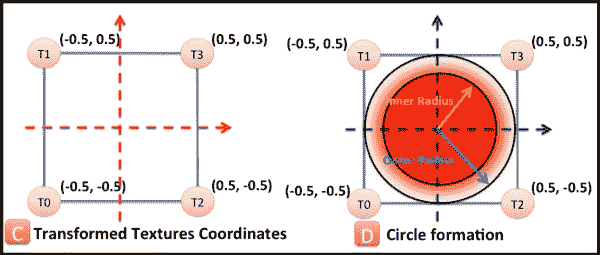

这种技术的第二部分通过自适应抗锯齿处理使其边缘变得柔和。为此，使用两个半径（`InnerRadius`和`OuterRadius`），如图所示的前一个图像（**C**）。位于这两个半径带之下的片段将根据从该带中纹理坐标的位置获得的权重插值其颜色值：

```java
weight    = smoothstep( innerRadius, outerRadius, length );
outColor  = mix( vec4(paintColor, 1.0), 
            vec4(paintColor, 0.0), weight);
```

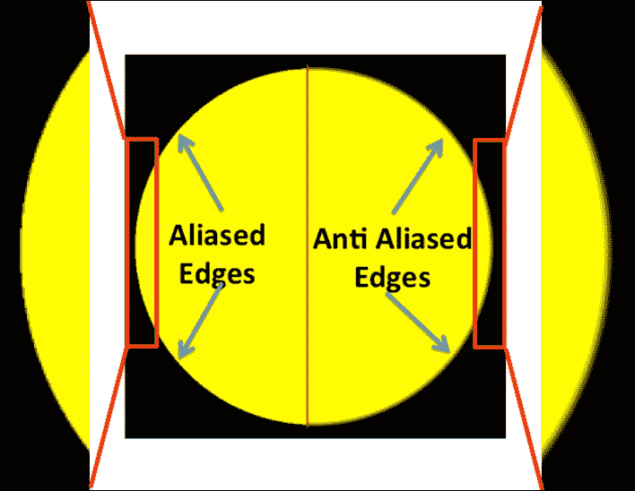

这种技术有一些优点和缺点：

**优点**:

+   这种技术具有很高的性能效率。

+   这种技术可以产生具有平滑边缘的高质量圆形形状。

+   边缘的尖锐度可以在运行时进行调整。

+   圆的边缘可以被渲染。

+   缩放不会影响图像质量。它可以自适应。

**缺点**:

+   这种技术无法以高精度执行碰撞检测或拾取测试。

+   这种技术可以产生具有平滑边缘的高质量形状。

## 参见

+   请参考第六章中关于*创建圆形图案并使其旋转*的配方，*使用着色器*

+   *实现自适应抗锯齿*
