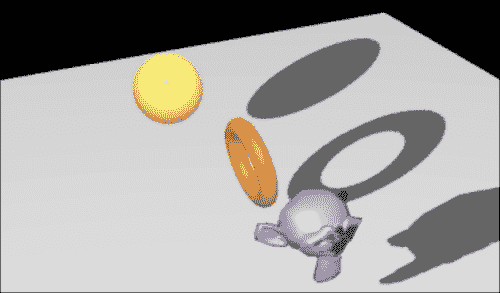
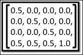
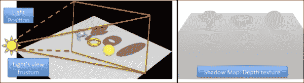
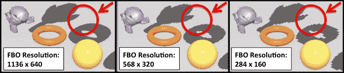
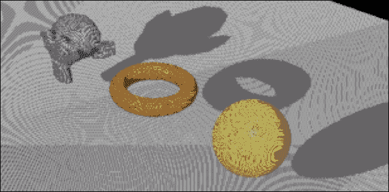
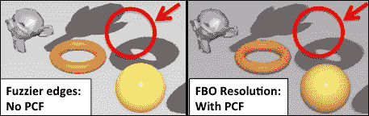
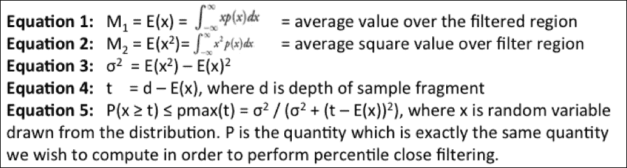
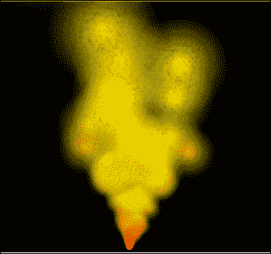
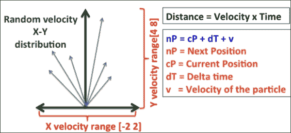
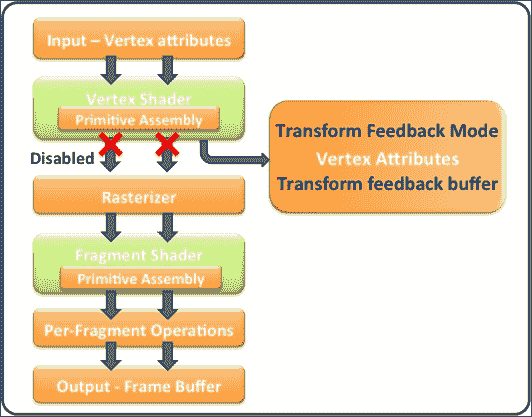

# 第十二章：实时阴影和粒子系统

在本章中，我们将涵盖以下菜谱：

+   使用阴影映射创建阴影

+   使用 PCF 软化阴影边缘

+   使用方差阴影映射

+   模拟粒子系统

+   使用同步对象和栅栏的变换反馈粒子系统

# 简介

阴影在实时渲染中扮演着重要的角色；它们为渲染场景增添了深度。当使用阴影渲染 3D 对象上的感知光信息时，看起来更加逼真。总的来说，阴影提高了渲染场景的真实感，并在物体之间提供了空间关系。渲染平滑且逼真的阴影是计算机图形学领域的一个研究热点。渲染过程消耗了大量的性能。因此，渲染它的方法必须在质量和性能之间进行平衡的权衡。由于内存和性能的限制，这在嵌入式端变得更加具有挑战性。

在本章中，我们将使用阴影映射实现阴影。从性能的角度来看，这种技术相对便宜，并在嵌入式设备上产生良好的效果。我们将使用另一种称为百分位数最近过滤（PCF）的技术来使这些阴影看起来更加平滑。在另一种称为方差阴影映射的技术中，我们将提高生成实时阴影的性能和质量。

本章还将帮助我们理解粒子渲染的基础。我们将实现两种渲染粒子系统的技术。第一种技术绑定在 CPU 上，粒子在 CPU 端更新和处理，仅为了渲染目的发送到 GPU。第二种技术利用 OpenGL ES 3.0 的新特性——变换反馈。这个特性允许你捕获顶点着色器的输出，并将其反馈回 GPU 进行下一帧的渲染。粒子系统在 GPU 端进行处理和渲染。这样，它避免了 CPU 的干预，使得渲染过程非常高效。

# 使用阴影映射创建阴影

在这个菜谱中，我们将使用一种简单且广泛接受的阴影技术——阴影映射，为场景添加更多真实感，以产生实时阴影。这种技术被称为阴影映射，因为它使用场景的深度信息，这些信息存储或映射到一个动态创建的深度缓冲区中，以产生实时阴影。

这种技术分为两个步骤：

+   **第一次遍历**：在第一次遍历期间，从光源视角渲染场景。在这里，场景是从 3D 空间中光源的位置观看的。这样，就可以清楚地确定哪些物体位于光线的路径上。换句话说，它提供了从光源视角直接可见的物体的信息。场景的深度信息记录在 FBO 纹理中；这个纹理被称为阴影图。当然，如果从光源位置发出的光线穿过一个或多个物体，那么从光源视角看深度更高的物体（位于第一个物体后面）将处于阴影中。这种技术严重依赖于阴影图中捕获的深度信息；它存储了可见物体从光源位置的距离或深度。

+   **第二次遍历**：在第二次遍历中，场景从预期的相机位置渲染。在这里，首先将每个片段的深度与存储在阴影图中的深度进行比较。这种比较检查传入的片段是否在光源下。如果片段不在光源下，则用环境阴影颜色着色该片段。

以下图像展示了阴影映射技术产生的阴影渲染效果：



本节提供了关于如何实现阴影映射的高级概述：

+   **创建相机**：这创建了两个相机，一个放置在光源位置，称为光源相机，另一个用于正常场景渲染。

+   **阴影图**：这创建了一个带有深度纹理的 FBO，因为我们只对记录深度感兴趣，这里不需要任何颜色缓冲区。深度纹理的尺寸根据应用程序需求由用户定义。在当前配方中，我们使用了与渲染缓冲区相似的尺寸，这等同于视口尺寸。

+   **从光源视角渲染**：这会将 FBO 附加为当前帧缓冲区，并从光源视角使用第一遍渲染场景，并将深度信息记录在阴影图中。由于我们只对深度值感兴趣，我们可以在第一遍中避免光栅化过程。

+   **渲染正常场景**：这再次渲染场景，但这次是从正常相机视图渲染，并在第二次遍历期间与片段着色器共享生成的阴影图。

+   **顶点变换**：在第二次遍历期间，顶点坐标在顶点着色器中变换两次，以产生以下内容：

    +   **正常场景的视点坐标**：正常场景的 MVP 矩阵用于生成用于`gl_position`的视点坐标。

    +   **从光源视角的视点坐标**：使用光源视角的 MVP 矩阵来生成视点坐标，这与存储在阴影图中的坐标完全相同。这些视点坐标被称为阴影坐标。

+   **齐次到纹理坐标**：阴影坐标位于归一化坐标系[-1, 1]中。这些坐标被转换为纹理坐标空间[0, 1]。这是通过使用基于预乘的矩阵来完成的，其中单位矩阵按因子 0.5 缩放，并在正方向上以半逻辑尺寸偏移：

+   **深度比较**：此转换后的阴影坐标与片段着色器共享，其中当前片段使用`textureProj` API 确定它是否位于阴影下。

以下图像的左侧显示了从光线视角渲染场景的渲染效果，这产生了右侧图像表示的阴影图。阴影图包含 0.0 到 1.0 的深度信息。接近 0.0 的值表示附近的物体。在灰度图像中，出现较暗的物体更靠近光源：



## 准备工作

与之前的配方不同，此配方包含两个用于场景和模型的自定义类，分别称为`CustomScene`和`CustomModel`。自定义模型包含其他网格模型，这使得在`NativeTemplate.cpp`中处理模型渲染变得非常容易。同样，自定义场景类简化了场景的工作，它负责创建阴影图、管理光线和法线视图相机，并以两次遍历的方式执行渲染。

此配方使用 Phong 着色。增加了两个新的统一变量：`LightCoordMatrix`和`ModelMatrix`。前者包含从光线视角的偏置矩阵、投影矩阵和视图矩阵的乘积，而后者包含模型变换。这两个变量的乘积存储在`shadowCoord`中，并与片段着色器共享。`isLightPerspectivePass`统一变量告诉片段着色器它是在第一次还是第二次遍历中。片段着色器包含在`ShadowMap`中的阴影图。

## 如何做...

实现阴影映射的步骤如下：

1.  在 Phong 顶点着色器中进行以下更改。在这里，阴影坐标在`shadowCoord`变量中计算：

    ```java
    // VERTEX SHADER – PhongVertex.glsl
    // Reuse old code.. many lines skipped.
    // Model View Project matrix
    uniform mat4 LightCoordsMatrix, ModelViewMatrix, NormalMatrix;
    uniform mat4 ModelMatrix;

    out vec3 normalCoord, eyeCoord;
    out vec4 shadowCoord;

    void main()
    {
        normalCoord = NormalMatrix * Normal;
        eyeCoord    = vec3 ( ModelViewMatrix * VertexPosition );
        shadowCoord = LightCoordsMatrix 
                             * ModelMatrix * VertexPosition;
        gl_Position = ModelViewProjectionMatrix * VertexPosition;
    }
    ```

1.  类似地，按照以下方式实现 Phong 片段着色器。在这里，片段根据其与光线和场景视角的位移着色：

    ```java
    // FRAGMENT SHADER – PhongFragment.glsl
    // Many line skipped contain Material and light properties
    in vec3  normalCoord, eyeCoord;
    in vec4 shadowCoord;
    uniform lowp sampler2DShadow ShadowMap;

    layout(location = 0) out vec4 FinalColor;
    vec3 normalizeNormal, normalizeEyeCoord, normalizeLightVec, V, R, ambient, diffuse, specular;
    float sIntensity, cosAngle;
    uniform int isLightPerspectivePass;

    vec3 PhongShading(){ /* Reuse existing code */ }

    void main() {
        if(isLightPerspectivePass == 1){ return; }

        vec3 diffAndSpec = PhongShading();
        float shadow = textureProj(ShadowMap, shadowCoord);

        //If the fragment is in shadow, use ambient light
        FinalColor = vec4(diffAndSpec * shadow + ambient, 1.0);

        // Correct the Gamma configuration
        FinalColor = pow( FinalColor, vec4(1.0 / 2.2) );
        return;
    }
    ```

1.  在`CustomScene`函数的构造函数中，创建阴影图缓冲区。为此，使用`FrameBufferObjectSurface`类创建一个具有深度纹理的 FBO。这是一个高级 FBO 类，封装了 FBO 的创建：

    ```java
    CustomScene::CustomScene(std::string name, Object* parentObj)
                :Scene(name, parentObj){
       // Create the FBO
       fbo = new FrameBufferObjectSurface(); 

        // Generate the FBO ID
       fbo->GenerateFBO();

        depthTexture.generateTexture2D(GL_TEXTURE_2D, fbo->
          GetWidth(), fbo->GetHeight(), GL_DEPTH_COMPONENT32F,
          GL_FLOAT, GL_DEPTH_COMPONENT, 0, true, 0, 0,
          GL_CLAMP_TO_EDGE, GL_CLAMP_TO_EDGE,GL_NEAREST,
          GL_NEAREST );

       // Attached Depth Buffer
       fbo->AttachTexture(depthTexture, GL_DEPTH_ATTACHMENT);

       // Check the status of the FBO
       fbo->CheckFboStatus();
       lightPerspective = camera = NULL;
    }
    ```

1.  在`initializeScene()`函数中初始化光线和法线视图相机：

    ```java
    void CustomScene::initializeScene(){
    // Create camera view from lights perspective    lightPerspective = new Camera("lightPerspective", this);
       lightPerspective->SetClearBitFieldMask(GL_DEPTH_BUFFER_BIT);
       lightPerspective->SetPosition
                   (vec3(this->lights.at(0)->position));
        lightPerspective->SetTarget(vec3 (0.0, 0.0,0.0));
        this->addCamera(lightPerspective);

        // Create scene's camera view.
        viewersPerspective = new Camera("Camera1", this);
        viewersPerspective->SetClearBitFieldMask
                (GL_COLOR_BUFFER_BIT | GL_DEPTH_BUFFER_BIT);
        viewersPerspective->SetPosition(vec3 (25.0, 25.0,25.0));
        viewersPerspective->SetTarget(vec3 (0.0, 0.0,0.0));
        this->addCamera(viewersPerspective);
        Scene::initializeScene(); // Call the base class.
    }
    ```

1.  使用光线视角进行第一次遍历，正常进行第二次遍历渲染场景：

    ```java
    void CustomScene::render(){
        // Set Framebuffer to the FBO    
        fbo->Push(); 

        // Render the scene from lights perspective
        lightPerspective->Render();

         // Cull the front faces to produce 
        glEnable(GL_CULL_FACE);
        glCullFace(GL_FRONT);

        glEnable(GL_POLYGON_OFFSET_FILL);
        glPolygonOffset(2.5f, 20.0f);

        for( int i=0; i<models.size();  i++ ){
            currentModel = models.at(i);
            if(!currentModel){ continue; }

           // Set LIGHT PASS (PASS ONE) to True
            ((ObjLoader*)currentModel)->SetLightPass(true);
            currentModel->Render();
        }
        fbo->Pop();// Reset to previous framebuffer

        // Bind the texture unit 0 to depth texture of FBO
        glActiveTexture (GL_TEXTURE0);
        glBindTexture(GL_TEXTURE_2D, depthTexture.getTextureID());

        camera->Render();    // View the scene from camera
        glCullFace(GL_BACK); // Cull objects back face.
        glDisable(GL_POLYGON_OFFSET_FILL);

        for( int i=0; i<models.size();  i++ ){
            currentModel = models.at(i);
            if(!currentModel){ continue; }

            // PASS TWO => Normal scene rendering
            ((ObjLoader*)currentModel)->SetLightPass(!true);
            currentModel->Render();
        }
    }
    ```

## 它是如何工作的...

在阴影映射中，场景在`CustomScene`类中构建。这个类创建一个离屏表面（FBO）来记录场景的深度信息。在初始化（`InitializeScene`）阶段，创建了两个摄像机对象（`lightPerspective`和`viewersPerspective`）。前者摄像机放置在全局光线位置，从该位置对场景进行照明，后者摄像机放置在观众的位置。场景使用两次遍历进行渲染：一次是从光线的视角，另一次是从观众的视角。为了使渲染对象了解当前的遍历，使用`ObjLoader::setLightPass`函数；这个函数确保在这些两个遍历下的对象级别状态。 

给定场景首先使用光线的透视遍历进行渲染，其中它绑定到一个包含深度缓冲区（`depthTexture`）的 FBO。深度缓冲区捕获由放置在光线位置的摄像机生成的视图中的所有渲染对象的 z 级或深度信息。在这个遍历过程中，需要裁剪前表面并启用多边形偏移填充，以避免阴影边缘伪影。有关更多信息，请参阅本食谱末尾的*更多内容…*部分。在顶点着色器中，在`gl_position`中计算眼睛坐标位置并捕获到深度缓冲区。这个着色器还包含计算阴影坐标的计算，这些坐标对于第一次遍历不是必需的，可以避免。我们将这视为一种优化，并将其留给读者来实现。由于第一次遍历只捕获深度信息，因此任何片段着色器操作都是不必要的，因此可以避免光栅化；我们使用一个统一变量（`isLightPerspectivePass`）来绕过片段着色器的渲染。然而，用户也可以使用`glEnable`（`GL_RASTERIZER_DISCARD`）API。此 API 关闭光栅化过程。有关此 API 工作原理的更多信息，请参阅本章后面的*使用同步对象和栅栏的变换反馈粒子系统*食谱。

在第二次遍历中，使用观众的摄像机来渲染场景。这个场景以正常方式渲染，背面裁剪和禁用多边形偏移填充。场景从第一次遍历中共享捕获的深度信息到`sampler2DShadow ShadowMap`统一变量中的片段着色器。

### 注意

`sampler2DShadow`是一种特殊类型的采样器。程序中的采样器代表一个特定类型的单个纹理。`sampler2DShadow`用于表示深度纹理类型，其中包含场景对象的深度信息。正确使用采样器非常重要；使用带有阴影图的普通纹理可能会给出不可预测的结果，因为在这种情况下查找函数是不同的。每个采样器都有一个不同的查找函数，该函数负责根据输入纹理坐标计算结果。

在这个过程中，从光源（已经包含投影和视图信息）归一化的坐标使用本食谱介绍中提到的预乘偏移矩阵转换为纹理坐标空间。这个坐标被输入到`textureProj` API 中，该 API 执行带有投影的纹理查找。从`shadowCoord`消耗的纹理坐标是纹理坐标形式。在`textureProj` API 中，这些坐标被转换为齐次形式，其中`shadowCoord.xyz`被除以最后一个组件，即`shadowCoord.w`。在阴影图中，`shadowCoord`的第三个组件（z）用作深度参考。计算这些值后，纹理查找过程与纹理相同。

如果 z 值大于在给定位置（x，y）存储在阴影图中的值，则认为该物体位于某个表面后面。在这种情况下，它渲染为阴影颜色（环境光）；否则，它将以相应的 Phong 着色渲染。

## 还有更多...

本节将描述阴影映射的一些重要方面和局限性。

### 阴影图分辨率

生成的阴影质量高度依赖于构建阴影图所使用的纹理的分辨率。分辨率的选择取决于各种因素。例如，低规格的硬件可能内存有限或处理能力慢，选择高分辨率阴影图可能会降低性能。在另一种情况下，需要更高的质量，只有高分辨率阴影图才有意义。以下图像显示了使用各种屏幕分辨率生成的阴影质量：



### 采样失真影响

阴影映射技术存在采样失真问题，这在本食谱中给出的各种图像中很容易察觉。这种采样失真的原因是物体颜色到环境阴影颜色的急剧过渡。有各种方法可以减少采样失真，例如增加阴影图的分辨率。参见前面的图像。当分辨率变低时，阴影的质量会下降。这里的缺点是，随着采样次数的增加，性能会降低。另一种有效且流行的修复采样失真伪影的技术称为**百分比更近过滤**（**PCF**）。在这种技术中，通过采样使边缘变软。有关更多信息，请参阅下一食谱*使用 PCF 软化阴影边缘*。

### 阴影噪点

作为实现当前技术结果的一个非常常见的问题是所谓的阴影痤疮。以下图像显示了痤疮效果的外观。这是当第一次遍历启用后向面剔除时发生的。记录的深度纹理存储了前向面的 z 值，后来当与第二次遍历比较时，产生了深度值的大差异。这些大差异是导致阴影痤疮效果的原因。这可以通过仅渲染后向面来消除，这将导致更准确的深度比较。

因此，第一次必须使用前向面剔除来执行。在第一次遍历中使用前向面剔除形成的深度纹理可能仍然与第二次遍历生成的深度纹理不同或足够接近。因此，这导致渲染伪影，其中面显示出淡入淡出的效果。这种视觉上的不愉快可以通过使用(`glEnable( GL_POLYGON_OFFSET_FILL)`)多边形偏移来消除。这个多边形偏移添加了一个适当的偏移(`glPolygonOffset(2.5f, 20.0f)`)，以强制结果 z 值（在遍历 1 中）足够接近（遍历 2）以减轻问题：



## 参见

+   请参阅第五章中的*Phong 着色 - 每个顶点的着色技术*菜谱，*光和材料*

+   *具有同步对象和栅栏的转换反馈粒子系统*

# 使用 PCF 软化阴影边缘

PCF 代表百分比更接近过滤。这是一种众所周知且简单的技术，用于生成平滑的阴影边缘。在之前菜谱中实现的阴影映射技术，在光和阴影像素之间显示了非常尖锐的过渡，从而产生了走样效应。PCF 技术对这些尖锐的过渡进行平均，从而得到更平滑的阴影。与其他提供纹理过滤能力的纹理不同，这基本上是一种平滑方法，用于确定纹理映射像素的颜色，遗憾的是，这种过滤技术不能应用于阴影映射。相反，对每个像素进行多次比较并将它们平均在一起。

如 PCF 的名称所描述的，它使用当前片段对阴影图进行采样，并将其与周围样本进行比较。规则是给予靠近光源的样本更多的权重。换句话说，它计算靠近照亮表面而不是在阴影中的面积百分比。这就是这项技术得名的原因。



## 准备工作

对于这个菜谱，我们重用了阴影映射。以下步骤提供了一个高级概述，说明如何实现这个菜谱：

+   **预过滤阴影图**：在使用之前，需要对这个阴影图进行预过滤。因此，应用线性纹理过滤进行纹理缩小和放大。在上一个配方中，这对应于同一节中的第二步。这次，使用`GL_LINEAR`过滤器创建 2D 深度纹理。

+   **与 PCF 的深度比较**：在片段着色器中共享变换后的阴影坐标用于根据过滤器大小产生多个样本；多个样本总是围绕当前片段。计算所有样本的平均结果，并使用此值来调整当前配方中从 phong 着色计算出的漫反射和镜面反射组件的强度。

+   **过滤器大小**：内核滤波器维度的选择对抗锯齿边缘的质量有很大影响，但这会以性能为代价。过滤器尺寸越大，质量越好，性能越慢。对于嵌入式平台，处理能力是一个重要的因素。因此，根据我们的需求，当前配方使用 2 x 2 的过滤器（四个样本）可以得到可接受的结果。

## 如何做到这一点...

由于这项技术基于阴影图，我们建议您重用之前的配方，并在此节中添加一些更改。以下是实现阴影映射源码的步骤：

1.  在`CustomScene`构造函数中，这次创建具有线性过滤的深度纹理；上一个配方使用的是最近邻选项。这种线性过滤以插值方式采样深度值，根据附近深度样本的采样来降低存储值的锐度：

    ```java
    // Inside CustomScene::CustomScene
    fbo = new FrameBufferObjectSurface();
    fbo->GenerateFBO();

    // Generate the depth texture with linear filtering
    depthTexture.generateTexture2D( GL_TEXTURE_2D, 
       fbo->GetWidth(), fbo->GetHeight(),
       GL_DEPTH_COMPONENT32F, GL_FLOAT, GL_DEPTH_COMPONENT, 
       0, true, 0, 0,GL_CLAMP_TO_EDGE, GL_CLAMP_TO_EDGE,
       GL_LINEAR, GL_LINEAR );

    // Attached the Depth Buffer to FBO's depth attachment
    fbo->AttachTexture(depthTexture, GL_DEPTH_ATTACHMENT);
    ```

1.  取相邻阴影坐标的平均值。在`PhongFragment.glsl`下的主函数中进行以下更改：

    ```java
      // Many lines below skipped, please refer to the recipe code 
      void main() { 
      vec3 diff_Spec = PhongShading();

      // APPLY the Percentage Closer filtering and use sum 
      // of the contributions from 4 texels around it
      float sum = 0.0;
      sum += textureProjOffset(ShadowMap, shadowCoord, ivec2(-1,-1));
      sum += textureProjOffset(ShadowMap, shadowCoord, ivec2(-1,1));
      sum += textureProjOffset(ShadowMap, shadowCoord, ivec2(1,1));
      sum += textureProjOffset(ShadowMap, shadowCoord, ivec2(1,-1));

      ambient    = MaterialAmbient  * LightAmbient;
      // If the fragment is under shadow, use ambient light
      FinalColor = vec4(diff_Spec * sum * 0.25+ ambient, 1.0);

      // Correct the Gamma configuration
      FinalColor = pow( FinalColor, vec4(1.0/2.2) );
     }
    ```

## 它是如何工作的...

在对每个传入片段的百分位数接近过滤技术中，从过滤区域获得一组样本。这些样本中的每一个都投影到包含参考深度的阴影图上，以从底层查找函数中获得二进制深度结果。阴影图纹理包含来自光源的最接近片段。将这些深度比较组合起来，计算过滤区域中比参考路径更近的 texels 的百分比。这个百分比用于衰减光线。

## 参见

+   *使用方差阴影映射*

# 使用方差阴影映射

在上一个配方中，我们了解了 PCF 的实现。它产生高质量的柔和阴影。PCF 的问题在于它需要更多的样本来产生更好的结果。此外，像标准纹理一样，无法使用预过滤的米普映射来加速过程。因此，我们必须采样多个 texels 来平均结果，以计算当前 texel 上的光衰减。渲染阴影的整体过程可能会很慢。

通过使用方差阴影映射可以克服 PCF 的这些缺点。这项技术依赖于切比雪夫概率预测，它利用了平均值和方差。平均值可以从阴影映射纹理中简单地获得，而方差（**σ²**）可以从平均值（**E(x)**）和平均平方值（**E(x²)**）计算得出：



## 准备工作

为了实现这个配方，我们将重用我们关于阴影映射的第一个配方。以下指南将帮助您理解方差阴影映射的整体概念：

1.  创建颜色缓冲区。与通用的阴影映射相比，这个配方使用颜色缓冲区而不是深度缓冲区。因此，现在 FBO 包含的是颜色缓冲区而不是深度缓冲区。

1.  这是第一遍阶段，场景的深度将被记录在颜色缓冲区中，该缓冲区将存储**E(x)**和**E(x²)**值。

1.  计算方差和数量。使用前面的方程式，为第二遍计算方差和数量。

## 如何操作...

在这个配方中，我们将创建一个新的着色器来记录深度信息。以下是实现阴影映射源码的步骤：

1.  在`CustomScene`类中，定义一个新的`Texture`变量`colorTexture`用于颜色缓冲区。在构造函数中，创建一个具有 16 位浮点精度线性过滤的颜色缓冲区。格式类型必须是 RGB 格式：

    ```java
    // Inside CustomScene::CustomScene
    fbo = new FrameBufferObjectSurface();
    fbo->GenerateFBO();

    // Generate the depth texture with linear filtering
    colorTexture.generateTexture2D( GL_TEXTURE_2D, 
       fbo->GetWidth(), fbo->GetHeight(),
       GL_RGB16F, GL_FLOAT, GL_RGB, 
       0, true, 0, 0,GL_CLAMP_TO_EDGE, GL_CLAMP_TO_EDGE,
       GL_LINEAR, GL_LINEAR );

    // Attached the Depth Buffer to FBO's depth attachment
    fbo->AttachTexture(colorTexture, GL_COLOR_ATTACHMENT0);
    ```

1.  创建一个新的顶点着色器`VSMDepthVertex.glsl`，并将计算出的顶点位置与片段着色器共享：

    ```java
    #version 300 es
    layout(location = 0) in vec4  VertexPosition;
    uniform mat4    ModelViewProjectionMatrix;
    out vec4    position;

    void main(){
        gl_Position = ModelViewProjectionMatrix * VertexPosition;
        position = gl_Position;
    }
    ```

1.  同样，创建一个名为`VSMDepthFragment.glsl`的片段着色器，并将深度平方信息存储在输出片段的前两个坐标中：

    ```java
    #version 300 es
    precision mediump float;
    in vec4    position;
    layout(location = 0) out vec4 FinalColor;

    void main() {
        float depth = position.z / position.w ;
        //Homogenous to texture coordinate system ([-1,1]) to [0,1] 
        depth = depth * 0.5 + 0.5;

        float M1 = depth;           // Moment 1
        float M2 = depth * depth;   // Moment 2

        float dx = dFdx(depth);
        float dy = dFdy(depth);
        moment2 += 0.25*(dx*dx+dy*dy) ;

        FinalColor = vec4( moment1,moment2, 0.0, 0.0 );
    }
    ```

1.  执行第一遍并渲染场景到 FBO。这将使用前面的着色器和颜色缓冲区中的深度值。

1.  修改现有的`PhongFragment.glsl`如下。这次，我们将使用 sample 2D 而不是`sampler2DShadow`，因为我们将使用颜色缓冲区来存储深度信息：

    ```java
      // Many line below skipped

    in vec4    shadowCoord;

    uniform sampler2D ShadowMap;
    layout(location = 0) out vec4 FinalColor;

    vec3 PhongShading(){ . . . }
    vec4 homogenShadowCoords;

    float chebyshevComputeQuantity( float distance){
        // Get the two moments M1 and M2 in moments.x 
        // and moment.y respectively
        vec2 moments = texture(ShadowMap,
                        homogenShadowCoords.xy).rg;

        // Current fragment is ahead of the object surface,
        // therefore must be lighted
        if (distance <= moments.x)
            return 1.0 ;

        float E_x2 = moments.y;
        float Ex_2 = moments.x * moments.x;

        // Computer the variance
        float variance = E_x2 - (Ex_2);

        float t = distance - moments.x;
        float pMax = variance / (variance + t*t);

        return pMax;
    }

    void main() {
        vec3 diff_Spec = PhongShading();

        // Calculate the homogenous coordinates
        homogenShadowCoords = shadowCoord/shadowCoord.w;

        // Calculate the quantity
        float shadow = chebyshevComputeQuantity(
                              homogenShadowCoords.z);

        ambient    = MaterialAmbient  * LightAmbient;

        // If the fragment is in shadow, use ambient light only.
        FinalColor = vec4(diff_Spec * shadow + ambient, 1.0);

        // Correct the Gamma configuration
        FinalColor = pow( FinalColor, vec4(1.0 / 2.2) );
        return;
    }
    ```

## 它是如何工作的...

方差阴影映射通过提供可以线性过滤并可用于支持线性数据的算法和现代图形硬件的深度数据形式，克服了 PCF 的限制。像我们的第一个配方一样，整体算法是相同的，除了现在我们将使用两个分量深度及其平方，并将其存储在 16 位精度颜色缓冲区中。在第一遍中，这个颜色缓冲区存储了在过滤区域深度分布中采样的 M1 和 M2 矩。这种计算发生在`VSMDepthFragment.glsl`片段着色器中。

在第二次遍历中，颜色缓冲区与`phongFragment.glsl`片段着色器共享作为样本 2D 均匀量。在执行任何纹理查找之前，将传入的阴影坐标转换为齐次形式。此变换坐标的 z 分量给出了从片段到光线的深度。此深度值用于`chebyshevComputeQuantity`函数中查找纹理。查找值用于根据之前提到的方程式查找方差，即方程 3。最后，使用方程 5 找到精确的量，这是我们希望计算以执行百分位数接近过滤的量。此函数返回的量或权重值用于根据阴影映射产生阴影。

## 参见

+   *使用阴影映射创建阴影*

+   *使用 PCF 软化阴影边缘*

# 模拟粒子系统

在计算机图形学中，模拟粒子系统是对自然现象的模拟，例如灰尘、烟雾、雨、烟花等。此粒子系统包含大量的小粒子，数量可以从几百到几百万不等。每个单元粒子具有相同的特征，如速度、颜色、寿命等。这些粒子每帧更新一次。在更新过程中，计算并更新粒子的相应特征。因此，它们会移动或看起来改变其颜色。

在这个配方中，我们将实现粒子系统。每个粒子由一个四边形组成，并使用半透明纹理进行纹理化。每个粒子具有特定的颜色，该颜色会随着时间的更新而变化。让我们概述这个配方，以了解粒子系统模拟的实现：

+   **定义粒子属性**：这创建了一个数据结构，其中包含顶点的重要属性，包括粒子位置、颜色等。

+   **粒子几何形状**：这定义了单个粒子的几何形状。它由四个构成完美正方形的顶点表示，并包含相应的纹理坐标。此粒子对象与视图-投影矩阵结合使用，在 3D 空间中产生多个粒子实例。

+   **初始化**：此操作为每个粒子的相应属性分配空间并加载纹理。编译顶点和片段着色器。

+   **更新**：此操作在每个帧上更新粒子，计算粒子的新位置和剩余寿命，当较老的粒子死亡时，在每个帧上生成新的粒子

+   **渲染**：此操作渲染更新后的粒子：

## 准备中...

此配方使用以下数据结构来管理粒子属性和几何形状：

+   `Particle`数据结构：

    +   `pos`：这代表当前粒子的位置。

    +   `vel`：这包含粒子的当前速度。

    +   `life`：这代表粒子的剩余生命周期。

    +   `transform`：这包含变换信息。

+   `Vertex`数据结构：

    +   `pos`：这包含 3D 空间中的顶点位置。

    +   `texCoord`：这是与`pos`对应的纹理坐标。

+   `MeshParticle`数据结构：

    +   `vertices`：这包含顶点对象的列表。

    +   `vertexCount`：这表示列表中的顶点数量。

## 如何实现...

实现粒子系统的步骤如下：

1.  创建一个名为`ParticleSystem`的类，它从`Model`类派生。在构造函数中，加载需要纹理化的粒子四边形表面的纹理图像。所有粒子将共享相同的纹理图像：

    ```java
        image = new PngImage();
        image->loadImage(fname);
    ```

1.  创建`ParticleVertex.glsl`顶点着色器。此着色器负责使用变换信息更新顶点位置，并将剩余的生命周期和纹理坐标信息与片段着色器共享：

    ```java
    // ParticleVertex.glsl
    #version 300 es

    // Vertex information
    layout(location = 0) in vec3  position;
    layout(location = 1) in vec2  texcoord;

    uniform mat4 worldMatrix;
    uniform mat4 viewProjectionMatrix;
    uniform float lifeFactor;

    out vec2 texCoord;
    out float life;

    void main( void ) {
        texCoord         = texcoord;
        life             = lifeFactor;
        gl_Position      = viewProjectionMatrix*vec4(position, 1.0 );
    }
    ```

1.  创建`ParticleFragment.glsl`片段着色器。此着色器渲染纹理四边形。此外，它使用生命周期来控制粒子的不透明度。当粒子达到其末端时，它会逐渐消失：

    ```java
    // ParticleFragment.glsl

    #version 300 es
    precision mediump float;

    uniform sampler2D Tex1;
    in vec2 texCoord;
    in float life;

    layout(location = 0) out vec4 outColor;

    void main() {
        // directional light
        vec3 lightDir = normalize( vec3( 1.0, 1.0, 1.0 ) );
        // diffuse
        vec4 diffuseColor = vec4( 1, 1.0 - life, 0, 1 );
        vec4 texColor = texture( Tex1, texCoord );
        diffuseColor *= texColor;

        // final color
        vec4 color = vec4( 0.0, 0.0, 0.0, 1.0 );
        color.rgb = clamp( diffuseColor.rgb, 0.0, 1.0 );
        color.a = diffuseColor.a * life;

        // save it out
        outColor = vec4(texColor.xyz, 1.0);
        outColor = diffuseColor;
    }
    ```

1.  在粒子系统的初始化过程中，使用`DrawShader()`编译和链接着色器程序。同时，使用`InitParticles()`初始化粒子：

    ```java
    void ParticleSystem::InitModel(){
        DrawShader();      // Initialize the shader
        InitParticles();   // Initialize the particles
        Model::InitModel();// Call the base class
    }
    ```

1.  实现`DrawShader`函数；此函数编译和链接着色器。它从顶点和片段着色器程序中加载必要的统一变量：

    ```java
    void ParticleSystem::DrawShader(){

       // Load the shader file here, many lines skipped below
       . . . . . .      

       // Use the compiled program 
       glUseProgram( program->ProgramID );

       // Load the uniform variable from the shader files.
       TEX = GetUniform( program, (char *) "Tex1" );
       worldUniform = GetUniform(program,(char*)"worldMatrix");
       viewProjectionUniform = GetUniform( program, 
       (char *) "viewProjectionMatrix" );
       life = GetUniform( program, (char *) "lifeFactor" );

       // Allocate the memory for Particle System. The
       // particle count are contained in the MAX_PARTICLES.
       particles = (Particle*)malloc(sizeof(Particle)*MAX_PARTICLES);

       // Start position of each particle (0.0, 0.0, 0.0)
       sourcePosition = glm::vec3(0.0, 0.0, 0.0);
    }
    ```

1.  `InitParticles`函数定义粒子的几何形状。不需要为`N`个粒子创建`N`个几何形状。我们将创建一个并重复使用它来处理所有粒子。此外，此函数还初始化所有粒子。它为每个粒子提供随机速度，水平方向上从`-2`到`2`单位每微秒，垂直方向上从`4`到`8`：

    ```java
    void ParticleSystem::InitParticles(){
        // define the type of mesh to use for the particles
        particleMesh        = CreateQuadrilateral();

       // define the type of mesh to use for the particles
        particleMesh        = CreateQuadrilateral();

        float lowestSpeed, highestSpeed, rangeSpeed;
        lowestSpeed = highestSpeed = rangeSpeed = 1.0f;

        for( ii = 0; ii < MAX_PARTICLES; ++ii ){
            Particle* p  = &particles[ ii ];
            p->transform = mat4();
            p->pos       = sourcePosition;
            p->life      = -1.0f;
            p->transform = translate(p->transform,p->pos);
            lowestSpeed  = -2.0;
            highestSpeed = 2.0f;
            rangeSpeed   = ( highestSpeed - lowestSpeed ) + 1;
            float f      = (float)(lowestSpeed + (rangeSpeed * 
                                rand() / (RAND_MAX + 1.0f) ) );
            p->vel.x     = f;
            lowestSpeed  = 4.0;
            highestSpeed = 8.0f;
            rangeSpeed   = ( highestSpeed - lowestSpeed ) + 1;
            f            = (float)(lowestSpeed + (rangeSpeed *
                                rand() / (RAND_MAX + 1.0f) ) );
            p->vel.y     = f;
            p->vel.z     = 0;
        }
    }
    ```

1.  在`CreateQuadrilateral`函数中定义粒子的几何形状：

    ```java
        MeshParticle* ParticleSystem::CreateQuadrilateral( void )
    {
        // Quadrilateral made of 2 triangle=>[0,1,2] & [0,2,3]
        //  1-------0
        //  |     / |
        //  |   /   |
        //  | /     |
        //  2-------3

        // Interleaved square vertices with position & tex 
        const Vertex quadVertices[] ={
        // Triangle 1: Orientation [ 0, 1, 2 ]
        { {  1.0f,  1.0f,  0.0f },  { 1.0f, 1.0f } },
        { { -1.0f,  1.0f,  0.0f },  { 0.0f, 1.0f } },
        { { -1.0f, -1.0f,  0.0f },  { 0.0f, 0.0f } },

        // Triangle 2: Orientation [ 0, 2, 3 ]
        { {  1.0f,  1.0f,  0.0f },  { 1.0f, 1.0f } },
        { { -1.0f, -1.0f,  0.0f },  { 0.0f, 0.0f } },
        { {  1.0f, -1.0f,  0.0f },  { 1.0f, 0.0f } },
        };

        // Allocate memory for particle geometry datastructure
        const int Count   = 6;
        MeshParticle* quad = ( MeshParticle* )malloc
        ( sizeof( MeshParticle ) );
        quad->vertices     = (Vertex*)malloc(sizeof(Vertex) * Count);
        memcpy( quad->vertices, quadVertices, Count*sizeof(Vertex) );
        quad->vertexCount  = quadVertexCount;
        return quad;
    }
    ```

1.  在`Update()`函数中，计算当前帧和上一帧之间的相对差异。这次，这个差异被`EmitParticles`函数用来根据粒子的速度更新给定粒子的新位置：

    ```java
    void ParticleSystem::Update (){
        static clock_t lastTime = clock();
        clock_t currentTime     = clock();
        float deltaTime  = (currentTime - lastTime) /
                           (float)(CLOCKS_PER_SEC);
        lastTime         = currentTime;

        // update attribute for the particle emission 
        EmitParticles( deltaTime );
        return;
    }
    ```

1.  实现如以下代码所示的`EmitParticles()`函数。此函数负责更新粒子。该函数遍历每个粒子并更新其位置和减少其生命周期。当粒子的生命周期变为零或更少时，它被认为是死亡的。在粒子死亡的情况下，新的粒子将被重新生成：

    ```java
    void ParticleSystem::EmitParticles(float elapsedTime ){
        static float fRotation = 0.0f;
        if(fRotation>360.0){
            fRotation = 0.0;
        }

        int spawn   = 0;

        for(unsigned ii = 0; ii < MAX_PARTICLES; ++ii ){
            Particle* p = &particles[ ii ];

            // Living particles
            if(particle->life > 0.0f){
                unsigned int bIsEven = ( ( ii % 2 ) == 0 ) ? 1 : 0;
                particle->transform  = rotate( particle->transform, 
               (bIsEven) ? fRotation : -fRotation, vec3(0.0,0.0,1.0));
               vec3 vel              = p->vel/100.0f * elapsedTime;
                p->pos               = p->pos + vel;

                p->life           -= p->vel.y * elapsedTime;
                p->transform       = translate( p->transform, p->pos);
            }

           // Dead particles. Re-spawn more
            else{
                // Re-Spawn a max of 10 particles every frame
                if( spawn++ > 10 ) { continue; }
                particle->pos       = sourcePosition;
                particle->life      = MAX_LIFE;
                particle->transform = mat4();
            }

            float fScaleFactor = 1.0+(particle->pos.y * 0.25f);
            p->transform = scale(p->transform, 
               vec3( fScaleFactor, fScaleFactor, fScaleFactor ));
        }
    }
    ```

1.  实现`RenderParticles()`。此函数在渲染之前首先更新粒子：

    ```java
    void ParticleSystem::RenderParticles(){
        // Set the shader program
        glUseProgram( program->ProgramID );

        // All the particles are using the same texture, so it
        // only needs to be set once for all the particles
        glEnable(GL_BLEND);
        glBlendFunc(GL_SRC_ALPHA,GL_ONE_MINUS_SRC_ALPHA);
        glActiveTexture( GL_TEXTURE0 );
        if(image){
        glBindTexture( GL_TEXTURE_2D, image->getTextureID() );
        // Apply texture filter, below many lines are skipped...

        }

        glUniform1i( TEX, 0 );
        mat4 viewProj=*TransformObj-> 
                       TransformGetModelViewProjectionMatrix();

        // Loop through the particles
        unsigned int ii = 0;
        for( ii = 0; ii < MAX_PARTICLES; ++ii )
        {
            // Current particle
            Particle* p = &particles[ ii ];

            // Pointer to the particle mesh
            MeshParticle* pMesh = particleMesh;

            // Only draw the particle if it is alive
            if( p->life > 0.0f ){
               // Set the particle transform uniform
                glUniformMatrix4fv( worldUniform, 1, 
               GL_FALSE, ( const GLfloat* )&p->transform );

               // Set view and projection matrices
                glm::mat4 mvp = viewProj * p->transform ;
                glUniformMatrix4fv( viewProjectionUniform, 
                    1, GL_FALSE, ( const GLfloat* )&mvp );

                // Send the remaining life span.
                glUniform1f( life, p->life / MAX_LIFE );

                // Enable and Set the vertex attributes:-
                // position, texture coords
                glEnableVertexAttribArray( VERTEX_POSITION );
                glEnableVertexAttribArray( TEX_COORD );
                glVertexAttribPointer( VERTEX_POSITION, 3, GL_FLOAT, 
                GL_FALSE, sizeof( Vertex ), &pMesh->vertices->pos );
                glVertexAttribPointer( TEX_COORD, 2, GL_FLOAT, 
                GL_FALSE, sizeof( Vertex ), 
                &pMesh->vertices->texCoord );

                glDrawArrays( GL_TRIANGLES, 0, pMesh->vertexCount );
            }
        }
    }
    ```

## 它是如何工作的...

`ParticleSystem` 类管理粒子系统的生命周期。在程序初始化过程中，每个粒子被赋予一个特定的位置、速度、寿命和颜色。系统中的粒子以数组格式存储，形成一个数据池。CPU 负责更新粒子信息，并将更新后的信息发送到 GPU 以在屏幕上渲染。这不是一个非常高效的机制，因为 CPU 在处理粒子并将它们发送到 GPU 上非常忙碌。在下一个菜谱中，你将学习如何使用变换反馈高效地渲染粒子系统。在这里，我们将使用点精灵而不是将它们作为纹理四边形来实现粒子：



在初始化过程中，所有粒子在 `X-Y` 方向上以随机速度分布，范围分别为 `[-2 2]` 和 `[4 8]`。粒子的下一个位置通过将当前位置与时间差（相对于粒子上次更新的时间差）和相应速度的乘积相加来更新。蓝色箭头显示了二维空间中速度向量的随机分布。

每次更新时，每个粒子的生命周期都会缩短，最终达到其消亡点，此时粒子不再活跃或可见于屏幕上。死亡的粒子仍然保留在数据池中，可以重新初始化。这样，我们可以有效地重用相同的内存，而不是分配新的内存。在这个菜谱中，我们在渲染时一次性重新启动 10 个粒子。

粒子的大小会随着它们在 `Y` 方向上的上升而缩放。这个信息是从粒子当前位置的 *y* 分量中收集的。我们使用一些常数和一些调整来控制缩放，以实现可控的机制。最后，当位置更新并应用变换时，粒子可以发送到 GPU 端进行渲染。

## 参见

+   请参阅 *使用 UV 映射应用纹理* 菜谱 第七章，*纹理和映射技术*

# 使用同步对象和栅栏的变换反馈粒子系统

之前的粒子系统示例演示了具有高度 CPU 绑定的操作的粒子动画。通常，顶点的核心参数，如颜色、位置和速度，总是在 CPU 端计算。顶点信息以正向流动。在这里，数据信息始终从 CPU 发送到 GPU，并在后续帧中重复。这种做法会产生延迟，因为必须为从 CPU 到 GPU 的延迟付费。

然而，如果顶点在 GPU 上处理并在下一帧中重用，那将是非常棒的。这就是新 OpenGL ES 3.0 功能变换反馈发挥作用的地方。这是从顶点着色器捕获输出并将其反馈到 GPU 以供下一帧使用的过程。这样，它避免了 CPU 干预，并通过大量的 GPU 并行处理使渲染效率更高。通常，在这个过程中，VBO 缓冲区充当特殊缓冲区，连接到顶点着色器，并在其中收集变换后的原语顶点。此外，我们还可以决定原语是否将继续其常规路线到光栅化器。

在这个配方中，我们将使用变换反馈功能实现粒子系统，其中顶点参数，如速度、寿命、加速度等，在顶点着色器上计算。翻译后的参数存储在 GPU 内存中，并馈送到下一帧迭代。此外，我们将通过使用点精灵而不是四边形来提高效率。

### 注意

此配方还实现了 OpenGL ES 3.0 的另一个新功能，称为同步对象和栅栏。栅栏是一种机制，通过该机制应用程序通知 GPU 等待直到某个 OpenGL ES 特定操作未完成。这样，可以防止 GPU 将更多操作堆积到命令队列中。栅栏命令可以像任何其他命令一样插入到 GL 命令流中。它需要与等待的同步对象关联。同步对象非常高效，因为它们允许您等待 GL 命令的部分完成。

## 准备工作

本节提供了使用变换反馈实现粒子系统的高级概述：

1.  需要两个着色器：`Update`和`Draw`。前者更新或处理粒子的发射数据，后者使用更新后的数据来渲染粒子。

1.  在初始化过程中，分配两个缓冲区对象来存储粒子数据。这包括位置、大小、速度、颜色和寿命。这些缓冲区将以乒乓方式使用，其中一个缓冲区的输出成为下一个循环或帧中另一个缓冲区的输入，反之亦然。

1.  在渲染时，使用一个 VBO 作为输入，另一个作为输出，通过将前者绑定为`GL_ARRAY_BUFFER`，后者绑定为`GL_TRANSFORM_FEEDBACK`。

1.  通过禁用`GL_RASTERIZER_DISCARD`禁止绘制片段。

1.  使用点原语（`GL_POINTS`）执行更新着色器。每个粒子都表示为一个点。顶点着色器从第一个 VBO 接收输入，并将处理后的数据发送到第二个 VBO，该 VBO 充当变换反馈输出缓冲区。

1.  这启用了`GL_RASTERIZER_DISCARD`以丢弃片段绘制。

1.  这使用第二个 VBO，其中包含处理后的数据，并将其作为`GL_ARRAY_BUFFER`边界发送到绘制着色器，以渲染粒子。

1.  最后，一旦渲染了帧，交换两个 VBO。

## 如何操作...

实现变换反馈食谱的步骤如下：

1.  使用以下代码创建名为 `TFUpdateVert.glsl` 的更新顶点着色器。这个着色器定义了用于粒子系统的各种属性；每个属性都分配了特定的位置。这个着色器负责接收属性数据并更新它们。更新后的属性通过输出变量发送到下一个阶段：

    ```java
    #version 300 es
    #define NUM_PARTICLES           200
    #define ATTRIBUTE_POSITION      0                                 
    #define ATTRIBUTE_VELOCITY      1                                 
    #define ATTRIBUTE_SIZE          2                                 
    #define ATTRIBUTE_CURTIME       3                                 
    #define ATTRIBUTE_LIFETIME      4                                 
    uniform float               time;
    uniform float               emissionRate;
    uniform mediump sampler3D   noiseTex;

    layout(location = ATTRIBUTE_POSITION) in vec2   inPosition;
    layout(location = ATTRIBUTE_VELOCITY) in vec2   inVelocity;
    layout(location = ATTRIBUTE_SIZE) in float      inSize;
    layout(location = ATTRIBUTE_CURTIME) in float   inCurrentTime;
    layout(location = ATTRIBUTE_LIFETIME) in float  inLifeTime;

    out vec2    position;
    out vec2    velocity;
    out float   size;
    out float   currentTime;
    out float   lifeTime;

    float randomValue( inout float seed ){                                                                 
       float vertexId   = float(gl_VertexID) / float(NUM_PARTICLES);
       vec3 texCoord    = vec3( time, vertexId, seed );
       seed             += 0.41;//(.10/float( NUM_PARTICLES ));
       return texture( noiseTex, texCoord ).r;
    }                                                                 

    void main(){                                                                 
        float seed      = time;
        float lifetime  = (inCurrentTime - time)*10.0;
        if( lifetime <= 0.0 && randomValue(seed) < emissionRate )
        {
            position       = vec2( 0.0, -1.0 );
            velocity       = vec2( randomValue(seed) * 2.0 - 1.00,
                                  randomValue(seed)  + 3.0 );
            size           = randomValue(seed) * 20.0;
            currentTime    = time;
            lifeTime       = 5.0;
        }
        else{
            position = inPosition; velocity   = inVelocity;
            size      = inSize;  currentTime  = inCurrentTime;
            lifeTime = inLifeTime;
        }
        gl_Position = vec4( position, 0.0, 1.0 );
    }
    ```

1.  创建名为 `TFUpdateFrag.glsl` 的更新片段着色器。这个着色器仅作为片段着色的占位符，以便可以执行着色器的编译。这个着色器永远不会出现，因为在更新期间关闭了光栅化：

    ```java
    #version 300 es                         
    precision mediump float;                
    layout(location = 0) out vec4 fragColor;
    void main(){                                       
      fragColor = vec4(1.0);                
    }
    ```

1.  为渲染阶段创建一个名为 `TFDrawVert.glsl` 的顶点着色器。这个着色器负责在屏幕上渲染更新的数据：

    ```java
    #version 300 es                                              
    #define ATTRIBUTE_POSITION      0                             
    #define ATTRIBUTE_VELOCITY      1                             
    #define ATTRIBUTE_SIZE          2                             
    #define ATTRIBUTE_CURTIME       3                             
    #define ATTRIBUTE_LIFETIME      4                             

    layout(location = ATTRIBUTE_POSITION) in vec2   inPosition;
    layout(location = ATTRIBUTE_VELOCITY) in vec2   inVelocity;
    layout(location = ATTRIBUTE_SIZE) in float      inSize;
    layout(location = ATTRIBUTE_CURTIME) in float   inCurrentTime;
    layout(location = ATTRIBUTE_LIFETIME) in float  inLifeTime;

    uniform float   time;
    uniform vec2    acceleration;
    uniform mat4    ModelViewProjectMatrix;

    void main(){                                                             
      float deltaTime = (time - inCurrentTime)/10.0;
      if ( deltaTime <= inLifeTime ){ 
         vec2 velocity = inVelocity + deltaTime * acceleration;
         vec2 position = inPosition + deltaTime * velocity;
         gl_Position   = ModelViewProjectMatrix
                                    *vec4(position, 0.0, 1.0);
         gl_PointSize  = inSize * ( 1.0 - deltaTime / inLifeTime );
      }                                                           
      else{                                                     
         gl_Position    = vec4( -1000, -1000, 0, 0 );
         gl_PointSize   = 0.0;
      }
    }
    ```

1.  在渲染到 `TFDrawFrag.glsl` 时着色片段：

    ```java
    #version 300 es                                  
    precision mediump float;                         
    layout(location = 0) out vec4 fragColor;         
    uniform vec4 color;
    uniform sampler2D tex;

    void main(){                                                
      vec4 texColor = texture( tex, gl_PointCoord );
      fragColor     = texColor * color;
    }
    ```

1.  从 `Model` 基类派生 `ParticleSystem.h`/`.cpp` 并实现 `EmitShader()` 函数。这个函数将编译 `TFUpdateVert.glsl` 和 `TFUpdateFrag.glsl` 着色器文件：

    ```java
       void ParticleSystem::EmitShader(){
       program = ProgramManagerObj->ProgramLoad((char*) "TFEmit",
       VERTEX_SHADER_PRG_EMIT, FRAGMENT_SHADER_PRG_EMIT);

       glUseProgram( program->ProgramID );
       emitProgramObject = program->ProgramID;

       const char *feedbackVaryings[5] = { "position", "velocity", 
       "size", "currentTime", "lifeTime" };

       // Set vertex shader outputs as transform feedback
       glTransformFeedbackVaryings ( emitProgramObject, 5,
       feedbackVaryings, GL_INTERLEAVED_ATTRIBS );

       // Link program after calling glTransformFeedbackVaryings
       glLinkProgram ( program );

       emitTimeLoc = GetUniform(program,"time");
       emitEmissionRateLoc = GetUniform( program, "emissionRate" );
       emitNoiseSamplerLoc = GetUniform(program, "noiseTex" );
    }
    ```

    着色器编译完成后，使用 `glTransformFeedbackVaryings` API 指定在变换反馈中要捕获的属性：

    +   **语法**：

        ```java
        void glTransformFeedbackVaryings(GLuint program, GLsizei count, const char ** varyings, GLenum bufferMode);
        ```

        | 变量 | 描述 |
        | --- | --- |
        | `program` | 这是程序对象的句柄。 |
        | `count` | 这指定了在变换反馈过程中使用的顶点输出变量的数量。 |
        | `varying` | 这是一个零终止字符串数组，指定了用于变换反馈的变量名称。 |
        | `bufferMode` | 这指定了变换反馈激活时顶点输出变量数据捕获的模式。这个变量可以接受两个枚举：`GL_INTERLEAVED_ATTRIBS` 或 `GL_SEPARATE_ATTRIBS`。前者指定如何在一个缓冲区中捕获输出变量。然而，后者在每个缓冲区中捕获每个顶点变量的输出。 |

    我们感兴趣的是在变换反馈中捕获五个顶点输出变量：`position`、`velocity`、`size`、`currentTime` 和 `lifeTime`。

    ### 注意

    `glTransformFeedbackVarying` 总是在链接程序之前调用。因此，有必要使用 `glLinkProgram` 链接程序对象。

1.  在同一文件中实现 `DrawShader()` 函数。这个函数将编译 `TFDrawVert.glsl` 和 `TFDrawFrag.glsl`：

    ```java
    void ParticleSystem::DrawShader(){
        program = ProgramManagerObj->ProgramLoad((char*)"TFDraw", 
             VERTEX_SHADER_PRG_DRAW, FRAGMENT_SHADER_PRG_DRAW); 
        glUseProgram( program->ProgramID );

        MVP = GetUniform( program,(char*)"ModelViewProjectMatrix");

        // Load the shaders and get a linked program object
        drawProgramObject = program->ProgramID;

        // Get the uniform locations
        drawTimeLoc   = GetUniform(drawProgramObject,"time");
        drawColorLoc  = GetUniform(drawProgramObject,"color");
        drawAccelerationLoc = GetUniform(program, "acceleration");
        samplerLoc  = GetUniform (program, "tex");
    }
    ```

1.  在 `ParticleSystem::InitParticles()` 中初始化粒子系统。这个函数初始化包含各种粒子属性的粒子对象数组。初始化后，这些对象存储在两个不同的 VBO 缓冲对象粒子 VBO 中。这些缓冲区由变换反馈以乒乓方式更新 VBO 中的元素，如前述代码所述：

    ```java
       void ParticleSystem::InitParticles(){

       time        = 0.0f; 
       curSrcIndex  = 0; 
       textureId    = image->getTextureID();

       if(textureId <= 0){ return; }

       // Create a 3D noise texture for random values
       noiseTextureId = Create3DNoiseTexture ( 128, 50.0 );
       Particle particleData[ NUM_PARTICLES ];

       // Initialize particle data
       for ( int i = 0; i < NUM_PARTICLES; i++ ){
          Particle *particle     = &particleData[i];
          particle->position[0]  = 0.0f; 
          particle->position[1]  = 0.0f;
          particle->velocity[0]  = 0.0f; 
          particle->velocity[1]  = 0.0f;
          particle->size         = 0.0f;  
          particle->curtime      = 0.0f;
            particle->lifetime       = 0.0f;
       }

       // Create the particle VBOs
       glGenBuffers ( 2, &particleVBOs[0] );

       for ( int i = 0; i < 2; i++ ) {
       glBindBuffer ( GL_ARRAY_BUFFER, particleVBOs[i] );
       glBufferData ( GL_ARRAY_BUFFER, sizeof ( Particle ) * 
       NUM_PARTICLES, particleData, GL_DYNAMIC_COPY );
       }
    }
    ```

1.  在 `InitModel` 中，初始化系统如下：

    ```java
    void ParticleSystem::InitModel(){
        UpdateShader();
        DrawShader();
        InitParticles();
        Model::InitModel();
        return;
    }
    ```

1.  在 `Emitparticles()` 函数中使用时间和更新粒子系统：

    ```java
        void ParticleSystem::Update (){
        static clock_t lastTime = clock();
        clock_t currentTime     = clock();
        float deltaTime         = (currentTime - lastTime)/
                                   CLOCKS_PER_SEC*0.10;
        lastTime                = currentTime;
        time                    += deltaTime;

        EmitParticles ( deltaTime );
    }
    ```

1.  `Emitparticles()` 函数在每帧渲染时翻转两个 VBO 缓冲区。这样，一个 VBO 成为更新着色器的输入（称为源 VBO），而另一个则捕获处理过的输出变量（称为目标 VBO），反之亦然。使用更新的着色器程序，通过 `glBindBuffer` API 使用 `GL_TRANSFORM_FEEDBACK` 和 `glBindBufferBase` 将源 VBO 数据绑定到目标 VBO 并设置为变换反馈缓冲区，以捕获结果。

    在更新阶段，我们只对计算粒子数据感兴趣。因此，我们可以禁用光栅化过程：

    ```java
        void ParticleSystem::EmitParticles(float deltaTime ){
        //UserData *userData = esContext->userData;
        GLuint srcVBO = particleVBOs[ curSrcIndex ];
        GLuint dstVBO = particleVBOs[ ( curSrcIndex + 1 ) % 2 ];

        glUseProgram ( emitProgramObject );

        // transform feedback buffer
        SetupVertexAttributes ( srcVBO );

        // Set transform feedback buffer
        glBindBuffer(GL_TRANSFORM_FEEDBACK_BUFFER, dstVBO);
        glBindBufferBase (GL_TRANSFORM_FEEDBACK_BUFFER, 0, dstVBO);

        // Turn off rasterization - we are not drawing
        glEnable(GL_RASTERIZER_DISCARD);

        // Set uniforms
        glUniform1f(emitTimeLoc, time);
        glUniform1f(emitEmissionRateLoc, EMISSION_RATE);

        // Bind the 3D noise texture
        glActiveTexture(GL_TEXTURE0);
        glBindTexture(GL_TEXTURE_3D, noiseTextureId);
        glUniform1i(emitNoiseSamplerLoc, 0);

        // Emit particles using transform feedback
        glBeginTransformFeedback(GL_POINTS);
        glDrawArrays(GL_POINTS, 0, NUM_PARTICLES);
        glEndTransformFeedback();

        // Ensure transform feedback results are completed
        // before the draw that uses them.
        emitSync = glFenceSync(GL_SYNC_GPU_COMMANDS_COMPLETE, 0);

        //Allows fragment drawing
        glDisable ( GL_RASTERIZER_DISCARD ); 
        glUseProgram ( 0 );
        glBindBufferBase ( GL_TRANSFORM_FEEDBACK_BUFFER, 0, 0 );
        glBindBuffer ( GL_ARRAY_BUFFER, 0 );
        glBindTexture ( GL_TEXTURE_3D, 0 );

        // Ping pong the buffers
        curSrcIndex = ( curSrcIndex + 1 ) % 2;
    }
    ```

    变换反馈可以使用以下 API 语法开始和结束：

    ```java
    void glBeginTransformFeedback(GLenum primitiveMode);
    void glEndTransformFeedback();
    ```

    | 变量 | 描述 |
    | --- | --- |
    | `primitiveMode` | 这指定了需要在附加到变换反馈缓冲区的变换中捕获的原始类型。可接受的参数是 `GL_POINT`、`GL_LINES` 和 `GL_TRIANGLES`。 |

    确保顶点输出变量写入变换反馈附加缓冲区非常重要，这样绘图命令才能安全地使用它。通过创建栅栏来实现更新操作和绘图操作之间的一致性要求。变换反馈操作激活后立即创建一个栅栏。这个栅栏与一个同步对象相关联，它在渲染例程中等待，直到变换反馈操作未完成。

1.  `RenderParticles()` 函数执行绘图任务。它等待同步对象以确保变换反馈操作成功完成。一旦完成，同步对象被删除，并调用绘图 API 使用粒子系统渲染场景：

    ```java
    void ParticleSystem::RenderParticles(){
        // Make sure that the GL server blocked until
        // transform feedback output is not captured.
        glWaitSync ( emitSync, 0, GL_TIMEOUT_IGNORED );
        glDeleteSync ( emitSync );
        glUseProgram(drawProgramObject);

        // Load the VBO and vertex attributes
        SetupVertexAttributes ( particleVBOs[ curSrcIndex ] );
        glUniformMatrix4fv( MVP, 1, GL_FALSE,(float*) 
          TransformObj->TransformGetModelViewProjectionMatrix());

        glUniform1f ( drawTimeLoc, time );
        glUniform4f ( drawColorLoc, 1.0f, 1.0f, 1.0f, 1.0f );
        glUniform2f ( drawAccelerationLoc, 0.0f, ACCELERATION );

        glEnable ( GL_BLEND );
        glBlendFunc ( GL_SRC_ALPHA, GL_ONE );

        // Bind the texture 
        glActiveTexture ( GL_TEXTURE0 );  
        glBindTexture ( GL_TEXTURE_2D, textureId );

        // Set the sampler texture unit to 0
        glUniform1i ( samplerLoc, 0 );
        glDrawArrays ( GL_POINTS, 0, NUM_PARTICLES );
    }
    ```

## 它是如何工作的...

变换反馈是 OpenGL ES 可编程管道中的一个特殊阶段。它位于顶点着色器之后，如下面的图像所示。当变换反馈被激活时，它将顶点着色器的输出重定向到变换反馈。变换反馈注册了所有需要捕获的顶点输出变量。数据变量在特殊的乒乓 VBO 缓冲区中捕获：



在初始化过程中，创建了两个顶点缓冲对象，并在其中设置了必要的粒子数据。这些 VBOs 被附加到变换反馈中，并且每帧进行交换。这样，一个 VBO 包含输入数据并捕获处理过的变量，反之亦然。

每次执行变换反馈时，都会创建一个相应的栅栏来确认变换反馈的完成。这个栅栏与一个同步对象相关联，它在渲染函数中等待栅栏。当栅栏被信号时，等待结束，并执行渲染命令以渲染粒子系统。

### 注意

粒子用`GL_POINTS`表示，其中每个点代表一个微小的正方形。这个命令告诉 GPU 将每个顶点绘制为一个正方形。点的大小可以通过`gl_PointSize`进行调整。与之前的配方相比，精灵方法将表示四边形所需的顶点数量从四个减少到一个。点精灵是 GPU 内置功能，其中每个点（代表一个正方形）面向相机。这些可以不提供纹理坐标而使用图像进行纹理化，这使得它在粒子渲染中非常高效。

## 参见

+   请参考第六章中的*使用纹理坐标进行过程纹理着色*配方，*使用着色器*

+   请参考第三章中的*简介*部分，*OpenGL ES 3.0 新特性*

+   请参考附录中的*Swizzling*配方，*OpenGL ES 3.0 补充信息*
