# 附录 A. OpenGL ES 3.0 补充信息

在本附录中，我们将涵盖以下配方：

+   固定功能管线和可编程管线架构

+   OpenGL ES 3.0 的软件要求 – Android ADT

+   在 Android Studio 中使用 OpenGL ES 3.0 开发 Hello World 三角形应用程序

+   OpenGL ES 3.0 的软件要求 – iOS

+   在 Android 和 iOS 中打开示例项目

+   拉姆伯特余弦定律的应用

+   计算两个向量之间的余弦值

+   Swizzling

# 固定功能管线和可编程管线架构

在我们深入研究 OpenGL ES 编程之前，了解底层架构是如何堆叠的非常重要。OpenGL ES 有两种类型的架构：固定管线和可编程管线。本节将为您提供一个这些架构的简单概述；这个概述也将帮助我们掌握计算机图形术语的技术术语。

## 固定管线架构

以下图像显示了 OpenGL ES 1.1 固定功能管线架构。它还提供了从输入数据发送到渲染引擎以在屏幕上生成图像的事件序列。

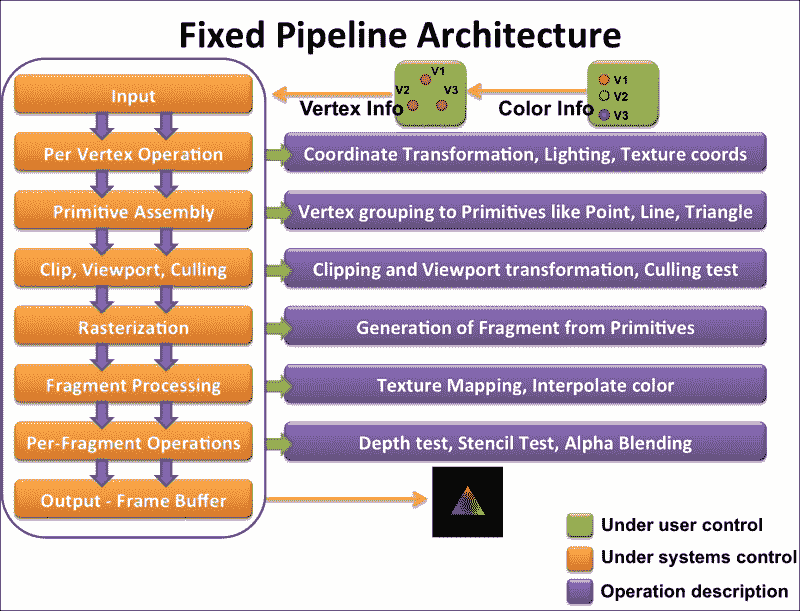

**输入**指的是渲染引擎绘制屏幕上的对象所需的原始数据和绘图信息。例如，前面的图像显示了三个顶点，并提供了三个颜色数据作为原始数据提供给图形引擎。此外，我们还指定了将此原始数据以三角形形式绘制的引擎。

在**顶点操作**中，对输入顶点坐标进行变换。每个几何输入顶点基于相机视图或对象平移进行变换。

更具体地说，在这个阶段，执行建模变换以将对象坐标转换为世界空间坐标。进一步，这些坐标通过视图变换转换为视点空间坐标。对于所有顶点，根据这些变换计算光信息和纹理坐标。第二章，OpenGL ES 3.0 基础知识，涵盖了我们在“使用模型、视图和投影类比进行变换”配方中使用的所有技术术语。

**原始**装配从前一阶段的变换坐标中获取所有坐标，并根据输入阶段提供的指定绘制或原始类型（点、线、三角形）信息进行排列。例如，我们提供了三个顶点，并指示引擎将它们渲染为三角形。OpenGL ES 中基本上有三种原始类型可用：点、线和三角形（以及线和三角形的变体）。这三种基本原始类型可以用来渲染任何复杂的几何形状。

在**裁剪**、**视口**和**剔除**阶段，应用投影变换以生成裁剪空间坐标。在这里，位于相机视锥体外的顶点被丢弃。结果顶点坐标经过透视除法处理，生成归一化设备坐标。最后，应用视口变换将归一化设备坐标归一化，形成屏幕空间像素坐标。基于面方向（如指定给图形引擎的方向），进行面剔除。

光栅化是将变换后的屏幕空间原语（点、线和三角形）转换为称为片段的离散元素的过程。每个片段的输出是屏幕坐标和相关属性，如颜色、纹理坐标、深度和模板。

片段处理阶段处理光栅化阶段生成的每个片段。此阶段使用颜色或纹理信息处理片段的外观信息。

**每片段操作**阶段在屏幕上渲染图像之前执行一些重要的测试。它包括：

+   **像素所有权测试**：这是一个测试，用于检查光栅化阶段生成的像素屏幕坐标是否属于 OpenGL ES 上下文。例如，渲染屏幕可能被一些文本消息覆盖或被其他窗口遮挡。

+   **剪刀测试**：此阶段确保剪刀矩形区域四个值形成的矩形外的片段在渲染时不应被考虑。

+   **模板和深度测试**：此测试检查模板和深度值，以确定片段是否需要被丢弃。例如，如果有两个原语相互遮挡，OpenGL ES 状态将保留顶部的原语片段。然而，属于后面的片段将被丢弃，无论渲染顺序如何。

+   **混合**：这是一个生成新颜色信息的过程，使用之前在同一颜色缓冲区位置指定的颜色。

+   **抖动**：这项技术使用现有颜色来创建其他颜色的效果。例如，可以使用白色和黑色生成的各种图案来产生各种灰度色调。

## 程序化管道架构

与固定功能管道不同，可编程管道架构提供了修改图形管道某些阶段的灵活性。OpenGL ES 2.0 和 3.0 遵循可编程管道架构。这些阶段是通过称为着色器的特殊程序进行修改的。以下图像显示了 OpenGL ES 3.0 的可编程管道架构。2.0 的架构也与以下图像相似，只是它不支持一个称为变换反馈的特殊阶段。变换反馈是 OpenGL ES 3.0 中引入的新阶段。这个阶段负责在几何着色阶段之后捕获处理过的顶点数据缓冲区。以下图像中用绿色框表示的这些可编程阶段。开发者需要编写着色器来使用 OpenGL ES 3.0 渲染对象。

可编程管道架构需要至少两个着色器，即顶点着色器和片段着色器，以在屏幕上渲染几何图形。没有这些着色器，渲染是不可能的。

+   顶点着色器是可编程管道架构中的第一个着色器。它的职责是对顶点坐标进行处理以产生坐标变换。在大多数情况下，它用于从模型、视图和投影信息中计算裁剪坐标。以下是一个顶点着色器的示例：

    ```java
    #version 300 es
    in vec4 VertexPosition;        
    void main() {                  
      gl_Position = VertexPosition;
    };
    ```

+   片段着色器是最后一个在像素级别工作的着色器；它使用光栅化阶段的输出数据，该阶段生成基本片段。这个着色器负责计算屏幕上每个渲染对象的每个片段的颜色。片段着色器还能够将纹理应用于片段着色器。以下是一个片段着色器的示例：

    ```java
    #version 300 es         
    precision mediump float;
    out vec4 FragColor;     
    void main() {           
      FragColor = vec4(0.0, 0.30, 0.60, 0.0);
    };
    ```

    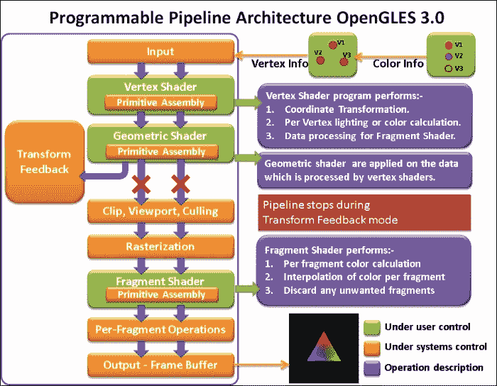

可编程管道架构需要一种特殊的语言来编写着色器。这种语言被称为 OpenGL ES 着色语言。在这本书中，我们将使用 OpenGL ES 着色语言 3.0 的规范。

# OpenGL ES 3.0 的软件要求 – Android ADT

在上一节中，我们已经实现了 OpenGL ES 3.0 中我们的第一个简单程序源代码。我们将使用相同的程序在 Android 和 iOS 平台上渲染输出。本节将涵盖我们在 Android 平台上开发 OpenGL ES 3.0 应用程序所需的所有基本要求。

Android 是一个基于 Linux 的操作系统；因此，其大部分开发和配置都需要基于 UNIX 的工具。本节讨论了在 Android 上开发 OpenGL ES 3.0 的所有先决条件。

Android 支持两种方式开发 OpenGL ES 应用程序：Java 框架 API 和**本地开发工具包**（**NDK**）。OpenGL ES 3.0 的 Java 框架 API 专注于 Java 代码风格开发。因此，如果您完全使用 Java 代码开发应用程序，您可以在基于 Java 的应用程序框架内构建 OpenGL ES 3.0 代码。相比之下，NDK 使用 C/C++语言构建 OpenGL ES 3.0 应用程序。这对于有兴趣使用 C/C++语言开发 OpenGL ES 应用程序的开发者来说更为合适。额外的优势是，相同的代码可以在支持 C/C++语言的多个平台上使用，例如 iOS、BlackBerry、Windows 等。JNI 作为核心 Java 应用程序框架和 NDK C/C++代码之间的接口。

本书侧重于通过 NDK 进行 OpenGL ES 应用程序的本地开发。我们还将看到使用 NDK 相对于 Java 框架 API 的优势。

## 准备工作

在开始开发会话之前，您必须确保您的机器（Windows/Linux/Mac）满足以下先决条件。下载以下包，然后进入下一节：

+   **ADT 包**: [`developer.android.com/sdk/index.html`](https://developer.android.com/sdk/index.html)

+   **Android** **NDK**: [`developer.android.com/tools/sdk/ndk/index.html`](http://developer.android.com/tools/sdk/ndk/index.html)

+   **Cygwin**: [`www.cygwin.com/install.html`](http://www.cygwin.com/install.html) (仅适用于 Windows 用户)

## 如何操作...

**ADT 包**：Android 开发者工具（ADT）是 Android 软件开发工具包的组合集。它为我们提供了构建 Android 应用程序所需的所有 API、调试器和测试应用程序。它包含各种其他工具，帮助我们分析应用程序，并提供在模拟器上运行应用程序的仿真支持。

根据您的操作系统下载 ADT 包。下载的包将以 ZIP 格式存在；解压缩它。这将提取一个名为`adt-bundle-xxxxx`的文件夹。名称取决于操作系统及其版本类型：32/64 位。

此提取的 ADT 包包含以下重要文件夹：

+   **Eclipse 文件夹**：此文件夹包含 Eclipse IDE，这是一个用于开发 Android 应用程序的集成环境。这个特殊的 Eclipse 允许用户快速设置新的 Android 项目，添加框架包，创建 UI，导出`.apk`，并提供许多其他功能。

+   **SDK 文件夹**：此文件夹包含用于开发和调试您的应用程序的工具；支持 Android 平台新特性的工具，示例应用程序，文档，系统映像；以及在新平台发布时可用依赖于 SDK 的工具。有关 SDK 的更多信息，请参阅[`developer.android.com/sdk/exploring.html`](https://developer.android.com/sdk/exploring.html)。

    ### 注意

    为了更好地进行项目管理，请将您的安装保持在中央位置。我们已创建一个名为 Android 的文件夹，并将 ADT 套件提取到该文件夹中。文件夹名称和位置可以根据您的个人喜好设置。

+   **JDK**: 根据 ADT 的要求，您可能需要更新 Java 开发工具包（Java Development Kit）。JDK 包含用于开发、调试和监控 Java 应用程序的工具。

    前往之前提到的网址，下载 JDK。最低要求是 JDK 6.0。然而，更高版本也必须能够使用。下载安装程序，并在您的计算机上安装它。JDK 自动包含 **Java 运行环境**（**JRE**），它包含在您的系统上运行 Java 应用程序所需的所有内容。因此，无需安装任何其他软件包。

+   **NDK**: 本地开发工具包（Native Development Kit）是一组工具，它帮助开发者使用 C/C++ 语言开发 Android 应用程序的部分功能。它提供了一个接口，使 Java 和 C++ 代码能够相互通信。下载最新的 NDK 软件包，并将其解压缩到我们的 Android 文件夹中。

+   **环境变量**：请确保您定义了系统环境变量路径以定位您的 NDK、SDK 和平台工具。这将有助于从命令行终端运行可执行文件。此外，我们还需要定义 `ANDROID_HOME` 以定位 ADT 套件中的 SDK 文件夹。以下示例显示了在 Mac 操作系统下 `.bash_profile` 文件中定义这些环境变量的方法。同样，这些需要在其他操作系统中根据它们定义环境变量的方式来定义：

    ```java
    bash_profile
    PATH=/usr/local/bin:/usr/local/sbin:$PATH

    ANDROID_NDK=/Users/parmindersingh/Dev/Android/android-ndk-r9c
    ANDROID_HOME=/Users/parmindersingh/Dev/Android/adt-bundle-mac/sdk

    PATH=$ANDROID_NDK:$PATH
    PATH=$ANDROID_HOME/tool:$ANDROID_HOME/platform-tools:$PATH
    export ANDROID_HOME
    ```

+   **Android SDK 管理器**：在 ADT 套件文件夹中打开 Eclipse IDE，导航到 **窗口** | **Android SDK 管理器**。安装 Android 4.3 及其相关子组件，如以下截图所示：

    ### 注意

    对于 OpenGL ES 3.0，我们需要 Android 4.3（第 18 级 API）或更高版本。

    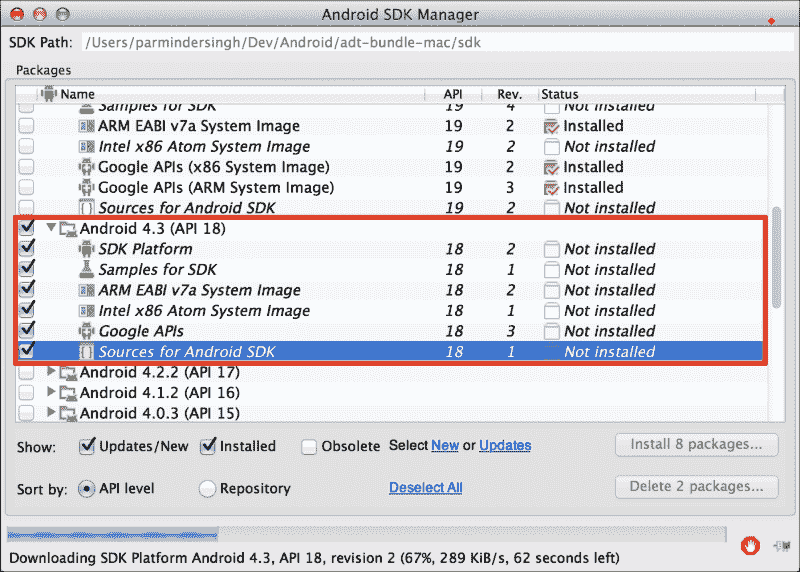

+   **Cygwin**: Cygwin 是一个基于 UNIX 的命令行终端应用程序，它允许 Windows 用户编译和调试基于 UNIX 的应用程序。

    1.  从之前章节中提到的网址下载 `setup.exe` 并执行它。这将打开应用程序的安装界面。在每个窗口上点击默认选择，然后点击 **下一步** 按钮，直到不再出现需要安装的软件包列表。

    1.  搜索 make 并选择 **Devel/make**。同样，搜索 shell，选择 Shells/bash，点击“下一步”，然后点击 **完成**。这将安装一个 Cygwin 终端到您的 Windows 程序列表中。在桌面上创建一个快捷方式以快速启动。请参考以下截图以获取帮助：

    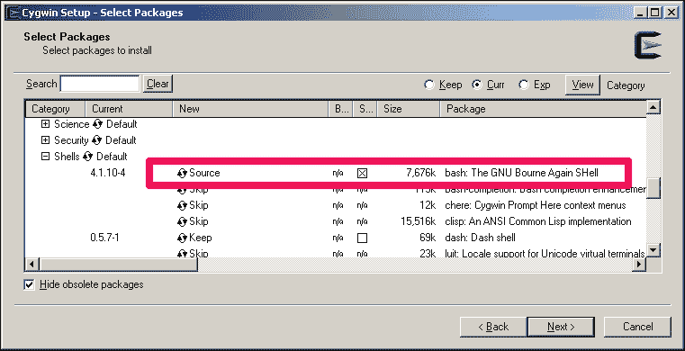

## 工作原理...

Android SDK 提供了一个美丽的模块化包，其中包含构建 Android 应用程序所需的所有工具。SDK 和平台工具与 SDK 平台结合使用，作为 Android 应用程序开发的骨架。它们提供调试、管理和部署 Android 应用程序的服务。它们管理各种 Android 平台和相关 SDK API。此包还包含一个定制的 Android 开发 Eclipse；它有助于快速构建应用程序的用户界面。IDE 提供特殊工具（如 Android SDK Manager），允许您安装新的 Android 平台和许多其他辅助工具。

Android 支持使用 C/C++语言开发其应用程序的部分功能。这种开发方式通过 NDK 工具得到支持；该工具提供了一个名为 Java Native Interface (JNI)的接口，它有助于建立 Java 框架和本地代码之间的通信。NDK 需要基于 Unix 的命令行终端来构建 C/C++库。这种命令行终端在基于 UNIX 的操作系统内是内置的。在 Windows 上，它由 Cygwin 应用程序提供。开发者通过库（`.so`/`.dll`/`.a`）构建代码并导出本地代码功能。Android 应用程序使用这些库以静态形式或以共享形式将其集成到应用程序中。

# 使用 OpenGL ES 3.0 在 Android Studio 上开发 Hello World Triangle 应用程序

Android Studio 是另一个用于 Android 应用程序开发的**集成开发环境**（**IDE**）；社区正在迅速迁移到它。与本书中基于 Android ADT 的其他食谱不同，您还可以使用 Android Studio 开发 OpenGL ES 3.0 应用程序。它使用 Gradle 构建系统创建可扩展的应用程序。基于模板的向导有助于快速设计常见组件和布局。这个 IDE 还有许多其他酷炫功能，可以使开发更快、更健壮、更可靠。

前一个食谱，*OpenGL ES 3.0 的软件要求 – Android ADT*，使用**Android 开发工具**（**ADT**）和 Eclipse ADT 插件来构建基于 Android 的 OpenGL ES 应用程序。本书中实现的所有食谱都使用基于 ADT 的开发系统来编程 OpenGL ES 3.0 应用程序。然而，我们还想为读者提供一个选项，让他们使用 Android Studio 开发自己的食谱。Android Studio 非常易于使用和设置。与 ADT 不同，它提供了一个丰富的界面和内置的 NDK 构建支持。在这个食谱中，我们将重用基于 Android ADT 的第一个食谱：`HelloWorldTriangle`，并使用 Android Studio 创建一个新的食谱。

## 准备工作

按照以下步骤获取和安装 Android Studio：

1.  前往[`developer.android.com/sdk/installing/index.html?pkg=studio`](https://developer.android.com/sdk/installing/index.html?pkg=studio)获取最新的 Android Studio。

1.  使用 SDK Manager 在[`developer.android.com/tools/help/sdk-manager.html`](https://developer.android.com/tools/help/sdk-manager.html)下载最新的 SDK 工具和平台。

1.  您可以在[`developer.android.com/sdk/installing/adding-packages.html`](https://developer.android.com/sdk/installing/adding-packages.html)学习如何安装 SDK 包。对于 Android OpenGL ES 3.0，任何大于 18 的 API 级别都可以完全正常工作。

1.  有关 Android Studio 的概述，请参阅[`developer.android.com/tools/studio/index.html`](https://developer.android.com/tools/studio/index.html)以了解更多信息。

1.  不要忘记设置 Android SDK 路径；设置程序将自动提示您提供 Android SDK 的目录路径。

## 如何操作...

按照给定的步骤在 Android Studio 上创建第一个 Android Hello World 应用程序。希望学习之后，您可以根据自己的需求将其他章节的食谱移植过来。

1.  通过导航到**新建** | **新建项目**来创建一个新的 Android 应用程序项目。

1.  将**应用程序名称**设置为`HelloWorldTriangle`，并将**公司域名**设置为`cookbook.gles`，如图所示：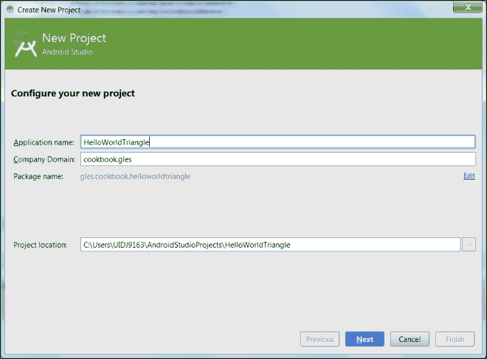

1.  选择目标平台 SDK；我们将使用**API 18: Android 4.3 (Jelly Bean**)。有关更多信息，请参考以下截图：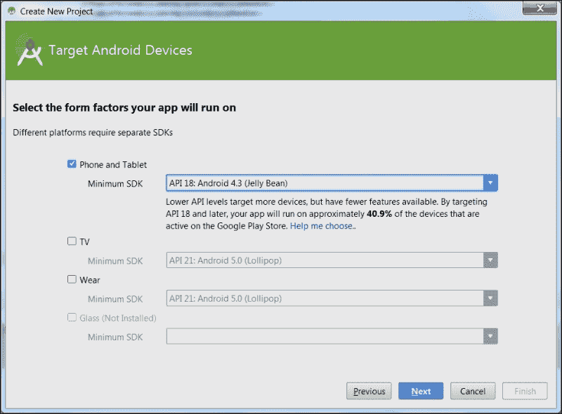

1.  创建**空白活动**，将**活动名称**更改为`GLESActivity`，然后点击**完成**。这将创建项目解决方案，如图所示：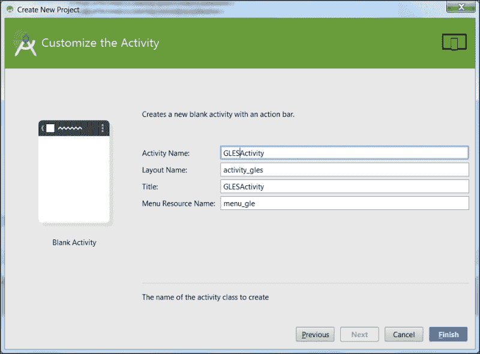

1.  选择当前的`java`文件夹或包名，然后选择**文件** | **新建** | **Java 类**。添加两个新类，分别命名为`GLESView`和`GLESNativeLib`。

1.  使用第一章中的*Programming OpenGL ES 3.0 Hello World Triangle*食谱，将其`JNI`文件夹复制到`<ProjectLocation>\HelloWorldTriangle\app\src\main`位置。此文件夹包含`Android.mk`、`Application.mk`、`NativeTemplate.h`和`NativeTemplate.cpp`。以下截图显示了文件夹结构：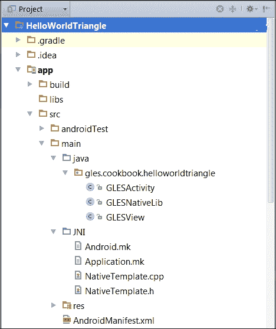

1.  类似地，使用第一章中的*Programming OpenGL ES 3.0 Hello World Triangle*食谱，并将`GLESActivity.java`、`GLESView.java`和`GLESNativeLib.java`的内容重用到本项目的相应文件中。请确保不要替换包名，因为本项目与第一章中的*Programming OpenGL ES 3.0 Hello World Triangle*食谱有不同的包名。有关更多信息，您可以参考附录样本代码中提供的`HelloWorldTriangleAndroidStudio`示例食谱。

1.  前往`NativeTemplate.h`/`.cpp`并修正 JNI 接口的声明和定义。将旧包名替换为新包名。以下示例显示了我们在当前食谱中针对新包名在`init()`函数中做出的更改：

    +   原始声明如下：

        ```java
        JNIEXPORT void JNICALL Java_cookbook_gles_GLESNativeLib_init(JNIEnv * env, jobject obj, jstring FilePath);
        ```

    +   新的声明与新的包名如下所示：

        ```java
        JNIEXPORT void JNICALL Java_gles_cookbook_helloworldtriangle_GLESNativeLib_init(JNIEnv * env, jobject obj, jstring FilePath);
        ```

1.  导航到`Application.mk`并声明用于编译的 SDK 的构建变体和版本。`APP_ABI`告诉 NDK 编译器为每个可能的目标构建共享库。`APP_PLATFORM`通知编译器使用指定的平台进行编译。例如，因为我们使用 API 级别 18；因此，对于 OpenGL ES，EGL 和 GLESv3 库将从平台 API 级别 18 引用：

    ```java
    //Application.mk
    APP_ABI := all
    APP_PLATFORM := android-18
    ```

1.  前往`<ProjectLocation>\HelloWorldTriangle\app\build.gradle4`中的`build.gradle`并做出以下两个更改：

    +   **模块名称**：这告诉 Gradle 系统本地代码模块的名称；这必须与`Android.mk`中指定的模块名称相同：

        ```java
        // Add the same module name present 
        // in the Android.mk file
        ndk{
            moduleName "glNative"
        }
        ```

    +   **NDK 外部构建**：这通过使用`ndk-build`命令手动编译 makefile，正如我们在所有其他 Android 食谱中执行的那样。为此，我们需要通知 Gradle 构建系统不要预构建 NDK。`jni.srcDirs`告诉构建系统不要使用 Android Studio 中的`ndk-build`命令。`jniLibs.srcDir`给出了使用外部 NDK 编译的不同目标的构建库的位置：

        ```java
        // Indicate the Android Studio not to use 
        // NDK from the IDE We will compile the 
        // project manually from Android.mk file.
        sourceSets.main
                {
                    jni.srcDirs = []
                    jniLibs.srcDir 'src/main/libs'
                }
        ```

    参考以下截图，了解我们在`build.gradle`中做出的两个更改：

    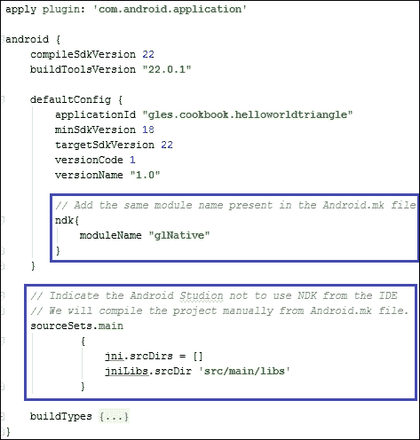

1.  打开命令行终端。导航到当前`JNI`文件夹路径并执行`ndk-build`。此命令在`<Project>\app\src\main\libs\<targetplatform>`文件夹路径下编译源文件并生成共享库，这是通过`Android.mk`帮助完成的。

1.  在构建库之后，使用 Android Studio 并点击**项目执行**按钮以在设备或模拟器上查看输出。以下是在 Hello World 三角形上的输出：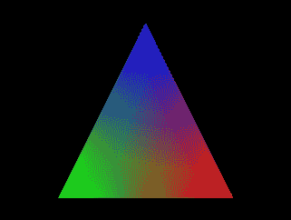

## 工作原理…

本食谱的工作原理与我们在第一章中实现的方式相同，即*在 Android/iOS 上使用 OpenGL ES 3.0*，除了我们现在将使用 Android Studio 来构建项目。请参考*使用 OpenGL ES 3.0 在 Android Studio 上开发 Hello World 三角形应用程序*食谱，并查找*工作原理…*部分。本部分将提供 OpenGL ES 工作所需的必要细节，以及用于 OpenGL ES 3.0 应用程序开发的 Android Java 和本地接口。

## 参见

+   参考第一章*OpenGL ES 3.0 on Android/iOS*中的*在 Android 上使用 JNI 与 C/C++通信*和*开发 Android OpenGL ES 3.0 应用程序*食谱。

# OpenGL ES 3.0 – iOS 的软件要求

OpenGL ES 3.0 的规范在 iOS 7 及更高版本中得到完全支持。iPhone 5s 以及苹果的 A7 GPU 支持 OpenGL ES 3.0 以及更早版本的 OpenGL ES 2.0 和 1.1。苹果 A7 GPU 提供了 OpenGL ES 3.0 所有新特性的可访问性。它还具有更大的渲染资源池。3.0 中的着色器能力在访问纹理资源方面是 OpenGL ES 2.0 的两倍。

## 准备工作

MAC 为 iOS 应用程序的开发提供了 Xcode IDE，它针对 iPhone、iPad 和 iPod。支持 OpenGL ES 3.0 的最低要求是版本 5.0；5.0 以上的所有 Xcode 版本都支持 iOS 7 构建目标。本书将使用 Xcode 5.2 版本进行其示例食谱。

## 如何做...

OpenGL ES 3.0 在 Xcode 5.0 及更高版本上由 iOS 7 SDK 支持。Xcode 5.0 版本包含 iOS 7 SDK。如果您是新手用户，您可以通过您的 App Store 应用程序安装它。如果您正在使用较旧的 Xcode 版本，您必须将其更新到至少 5.0 版本。iOS 7 SDK 及更高版本通过 iOS 7 目标设备支持 OpenGL ES 3.0。

## 它是如何工作的...

在 iOS7 上使用具有强大 GPU 的 OpenGL ES 3.0 可以执行复杂的图形渲染。GPU 能够对屏幕上每个像素的着色器进行高复杂度的计算。OpenGL ES 3.0 是一个基于 C 的 API，无缝集成到 Objective 或 C/C++中。OpenGL ES 规范没有定义窗口层，因为所有操作系统的窗口机制彼此之间非常不同。因此，底层操作系统负责生成渲染上下文以提供窗口层。此外，操作系统还必须提供一个 OpenGL ES 可以渲染的展示层。iOS 提供了 GLKit，通过提供绘制表面来提供展示层。GLKit 是在 iOS 5 中引入的，用于 OpenGL ES 的开发。这是一个用于 OpenGL ES 2.0/3.0 的 3D 图形开发工具包，使用 Objective C/C++编写。这个工具包使得可编程管道架构的编程工作更加容易。更多信息，请参考 Apple 开发者网站[`developer.apple.com/library/ios/documentation/GLkit/Reference/GLKit_Collection/index.html`](https://developer.apple.com/library/ios/documentation/GLkit/Reference/GLKit_Collection/index.html)。

## 更多内容...

GLKit 使用 C/C++ Objective 语言开发。这种语言仅在 Mac 和 iOS 应用程序中得到支持。因此，如果我们希望我们的代码能够在不同平台上移植，我们需要用 C/C++来编程。Objective C 语言在其框架中无缝支持 C/C++语言。

在跨平台中表现良好的游戏引擎实际上使用它们自己的平台无关的框架进行 OpenGL ES 编程。这些框架类似于 GLKit，甚至更强大。在我们的方法中，我们将从头开始使用 C/C++开发自己的引擎，以便为 Android 和 iOS 构建一个可接受的跨平台 3D 图形框架。

## 参见

苹果为在 iOS 上开发 OpenGL ES 应用程序提供了特殊参考。这些参考涵盖了 OpenGL ES 在 iOS 方面的各个方面。更多信息，请访问[`developer.apple.com/library/ios/documentation/3DDrawing/Conceptual/OpenGLES_ProgrammingGuide/Introduction/Introduction.html`](https://developer.apple.com/library/ios/documentation/3DDrawing/Conceptual/OpenGLES_ProgrammingGuide/Introduction/Introduction.html)。

# 在 Android ADT 和 iOS 上打开示例项目

**打开 Android 平台的示例源代码**：

在 Eclipse ID 中，导航到**新建** | **项目** | **从现有代码创建 Android 项目**。点击**下一步**并指定包含`Android.xml`的文件夹路径。打开命令行终端，更改目录路径到`JNI`文件夹，并在终端中执行`ndk-build`命令。使用**运行**或(*Ctrl* + *F11*)作为快捷键从 Eclipse 启动应用程序。

### 注意

项目的路径应该是包含`Android.xml`的目录名。

**打开 iOS 平台的示例源代码**：

打开配方文件夹，找到**<项目名称>.xcodeproj**，双击以在 Xcode 编辑器中打开项目。使用**产品** | **运行**或(*Command* + *R*)启动应用程序。

# 拉姆伯特余弦定律的应用

让我们了解如何从数学上计算余弦角，以便在我们的漫反射光照着色方案中实现拉姆伯特余弦定律。两个向量之间的余弦角可以通过它们之间的点积来计算：

**点积**：

两个向量 P (ai, bj, cz) 和 O (di, ej, fk)的点积可以定义为两个向量的模长乘积以及它们之间的余弦角。

*P.Q = |P|*|Q|*cos(θ)………公式 1*

其中|P|和|Q|是 P 和 Q 的模，可以计算为：

|*P| = √(a*a) +(b*b) +(c*c) 和 |Q| = √(d*d) +(e*e) +(f*f)*

或者，它是 x、y 和 z 分量各自分量的乘积：

*P.Q = (ai, bj, cz) * (di, ej, fk) => (ai*di)+ (bi*ei) +(ci*fi)*

*P.Q = (a*d)*(i*i) + (b*e)*(j*j) +(c*f)*(k*k) = ad + be + ef*

*P.Q = ad + be + ef………公式 2*

将公式 1 和公式 2 相等：

*ad + be + ef = |P|*|Q|*cos(θ)*

如果 P 和 Q 是单位向量，那么公式 1 可以推导为：

*P.Q = cos(θ)………公式 3*

我们也可以通过将|P|*|Q|两边除以来找到余弦角：

*cos(θ) = ( P.Q )/( |P|*|Q| )………公式 4*

# 计算两个向量之间的余弦

这是一个如何计算由平面*x-z*平面上的**0**、**20**和**0**点形成的两个向量之间的余弦角度的示例，以及位于**20**、**20**和**40**的光源，如图所示：

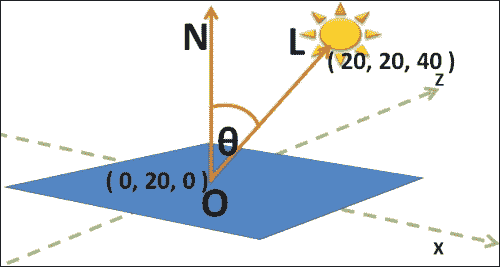

计算 ON 和 OL 向量，如下所示：

```java
   OL = L – O = (20, 20, 40) – (0, 0, 0) => (20-0), (20-0), (40-0) => (20, 20, 40)
ON = N – O = (0, 20, 0) – (0, 0, 0) => (0, 20, 0) 
```

OL 和 ON 的点积如下：

```java
OL . ON = |OL| * |ON| * cos(θ)
```

使用*方程 1*：

```java
OL .ON = (20*0) + (20*20) + (40*0) = 400
```

使用*方程 2*：

```java
|OL|*|ON| = [√ (20*20) + (20*20) + (40*40)] * [ √ (0*0) +(20*20)+(0*0)] = 979.79
```

将两个方程相等，结果如下所示：

```java
400 = 979.79 * cos(θ);
```

这里，`cos(θ) = 0.40`意味着θ是`65.90`度。

# Swizzling

Swizzling 是 GL 着色语言的一个新特性，允许你重新排列向量的组件。例如：

```java
vec4 A (1.0, 2.0, 3.0 , 4.0);
```

在这里，`vec4`由 x、y、z 和 w 组件表示。结果如下：

```java
vec4 B = A.xxzz;
```

现在，B 等价于{1.0, 1.0, 2.0, 2.0}

## 准备工作

着色语言中 vec2/3/4s 数据类型的组件访问可以被视为向量、颜色、纹理坐标或数组：

| 形状类型 | 组件 | 示例：vec4(1.1, 2.2, 3.3, 4.4 ); |
| --- | --- | --- |
| 向量 | `{x, y, z, w}` | `float a = v.x;` `float b= v.y;` |
| 颜色 | `{r, g, b, a}` | `float a = v.r;` `float b= v.g;` |
| 纹理坐标 | `{s, t, p, q}` | `float a = v.s;` `float b= v.t;` |
| 数组 | `[0, 1, 2, 3]` | `float a = v[0];` `float b= v[1];` |

## 如何做到这一点...

Swizzling 是一种通过使用组件名称直接访问组件的机制。例如：

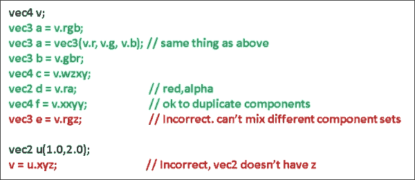

## 还有更多...

在前面的例子中，swizzling 发生在赋值的右侧。然而，swizzling 也可能发生在赋值的左侧：

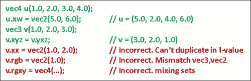
