# 第七章。接口构建器和 WebView – 更多好东西！

*"时间宝贵；明智地利用它。"*

*–*匿名**

在本章中，我们将学习一些使用 RubyMotion 进行 iOS 开发的功能。Xcode 是一个非常先进的 IDE，具有许多优点，我们可以利用这些优点来更快、更好地开发 iOS 应用程序。在本章中，我们还将学习如何使用 **接口构建器** 进行 RubyMotion 的快速开发。我们还将查看 Xcode 的某些关键元素，例如 `.xib`、`.nib` 和 WebView，以创建真实的交互式应用程序。

# 接口构建器

Xcode 的接口构建器允许您通过视觉方式创建应用程序的用户界面，而不是编写代码。接口构建器是一个非常简单易用的工具，对于使 iOS 开发变得非常快速至关重要。因此，与 RubyMotion 一起使用的接口构建器进一步减少了开发时间。我们可以说这些是两个独立的美味食谱，但当它们一起使用时，就是制作美观的 iOS 应用程序的最快终极公式。

接口构建器与 Xcode 一起提供。在我们跳入使用接口构建器之前，重要的是要理解，尽管接口构建器使用拖放机制创建 UI，但它实际上并没有在幕后创建 Objective-C 代码。它创建的是您正在构建的 GUI 的 XML 描述，Cocoa Touch 框架使用该 XML 在运行时实际创建您的应用程序的 UI 元素，例如标签和文本框。我们在接口构建器中做的所有事情都可以通过编写 Ruby 代码来完成——这正是我们从这本书开始一直在做的事情——但很快您将看到使用 GUI 构建器可以使事情变得多么简单。

### 注意

XCode 仅在编辑阶段使用 XML，然后将其编译成 nibs。Cocoa Touch 从不看到 XML 源代码。

在我们开始使用接口构建器之前，让我们了解一些与 XCode 开发相关的术语。GUI 构建器提供了将按钮、表格视图和文本字段拖放到您的应用程序窗口中的选项。生成的界面存储为 `.xib` 文件。`.xib` 文件是您的对象及其实例变量的 XML 表示，当您的应用程序构建时，它被编译成 `.nib` 文件。`.xib` 文件更容易处理，但 `.nib` 文件更小且更容易解析，这就是为什么实际与您的应用程序一起发货的文件是 `.nib` 文件。

### 小贴士

`.nib` 文件代表 NeXT 接口构建器。

## 让我们尝试接口构建器

到目前为止，我们已经通过在 Ruby 中编写代码来创建我们的 **Restro** 应用程序视图。在本节中，让我们使用基于 GUI 的接口构建器创建一个视图。我们将创建一个 **联系我们** 表单，并在我们的应用程序中使用它。

界面构建器集成到 Xcode 中，Xcode 是一个适用于任何苹果相关开发的 IDE，无论是用于 iOS 设备还是 Mac。我们将创建一个`.xib`文件，然后通过以下步骤在 RubyMotion 项目中使用此文件：

1.  打开 Xcode 并点击**创建一个新的 Xcode 项目**。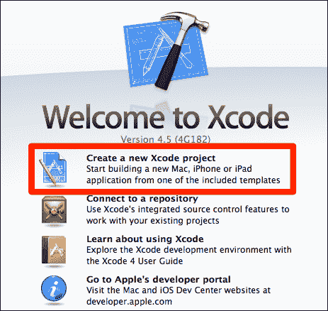

1.  点击**单视图应用程序**，因为我们只需要一个`.xib`文件。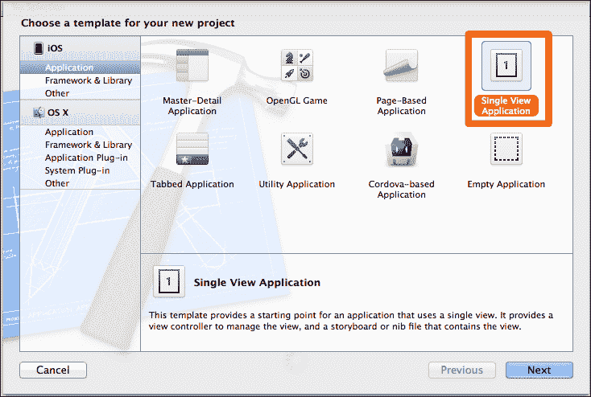

1.  在项目创建向导中输入这些数据。注意，我们已经选择了设备为**iPhone**。我们还可以看到其他选项，如**iPad**和**通用**。如果您想创建一个适用于 iPhone 和 iPad 的单个应用程序，请从下拉列表中选择**通用**选项。另外，取消选择**使用故事板**选项。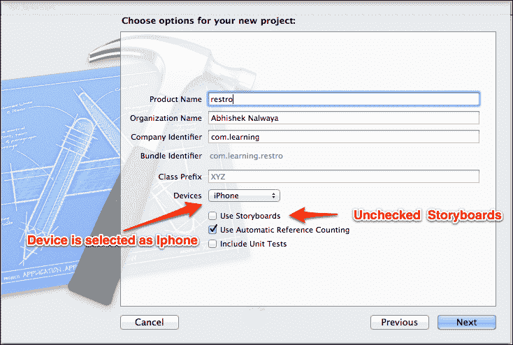

1.  将项目保存到您选择的文件夹中；您的项目将在 XCode 中加载。点击`ViewController.xib`，您将能够看到界面构建器。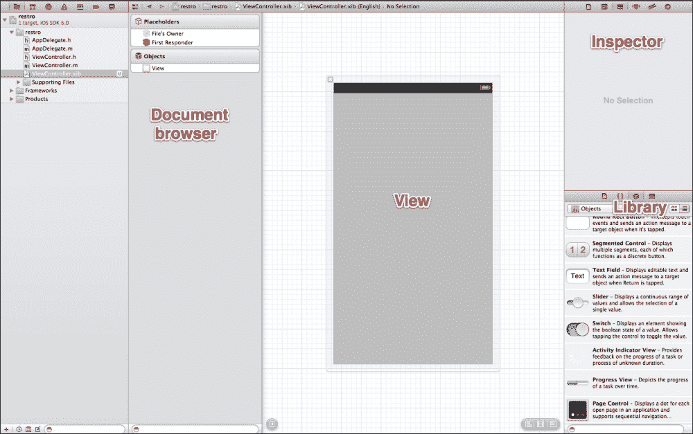

界面构建器有一个相当简单的布局；它由四个主要窗口组成：

+   视图

+   库

+   文档浏览器

+   检查器

视图窗口是您构建界面的地方。您将从库窗口拖放项目到视图窗口以放置它们。文档浏览器允许您以分层方式浏览您在`.nib`文件中放置的元素。最后，检查器窗口显示了所选元素的所有不同属性，并允许您编辑它们。

现在魔法开始了；从库中将**导航栏**拖放到视图中，如图所示：

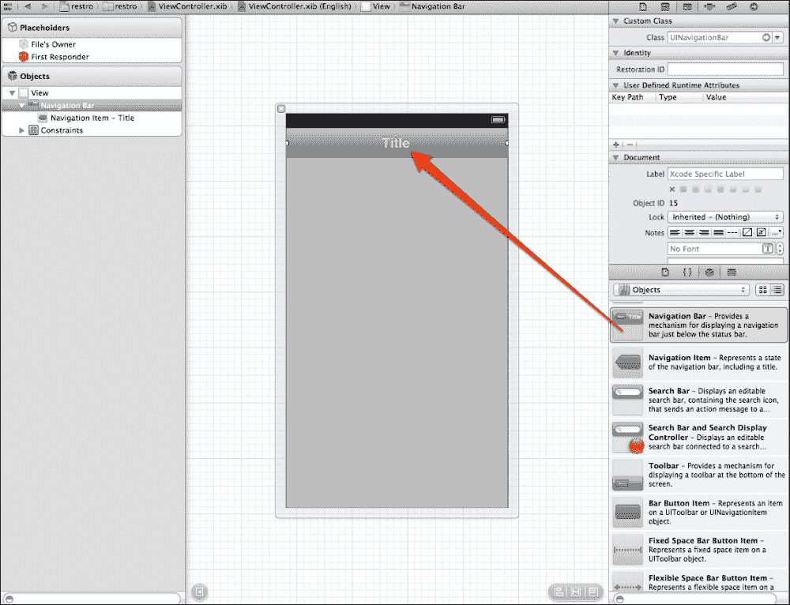

当您选择**导航栏**时，您将在检查器窗口中看到许多属性。在检查器窗口中将标签值更改为**1**。请记住，我们将在 RubyMotion 项目代码中使用此标签值。我们需要连接我们的`View Controller`元素。最简单的方法是使用它的**标签**属性。**标签**是`UIView`类的一个`integer`属性，您可以使用它来识别您的视图。基本上，您必须为每个需要从`UIViewController`元素访问的`UIView`类设置一个唯一的整数。

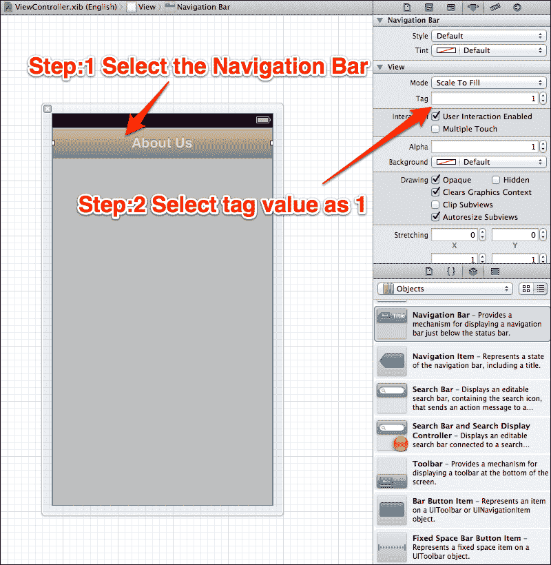

同样，添加一个用于电子邮件的文本框，并将占位符的值更改为`Email`，如以下截图所示。每个库对象都关联着许多属性；例如，在文本框的情况下，我们将键盘值更改为`Email`，因为它符合我们的要求；但您也可以自由地尝试其他属性。使用`Email`将显示一个用于输入电子邮件地址的定制键盘。

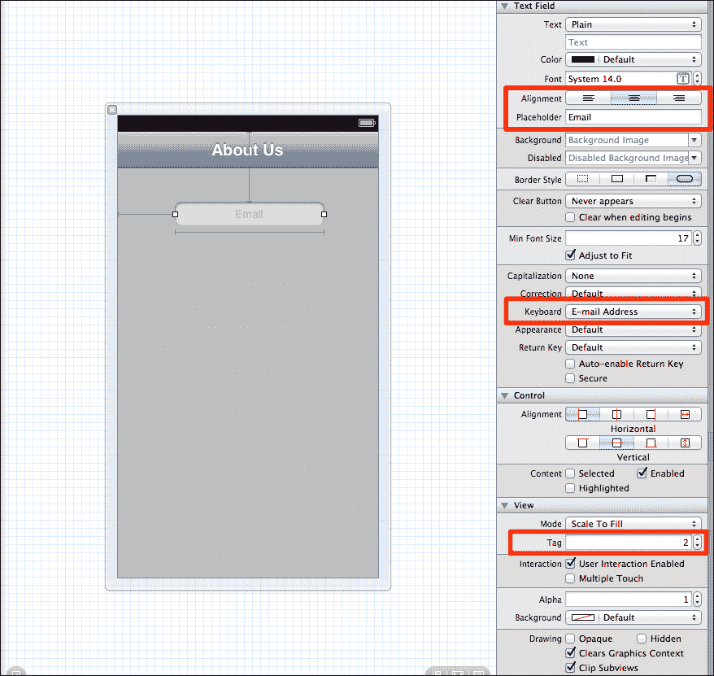

接下来，我们需要一个按钮。让我们将一个按钮拖放到视图窗口中。

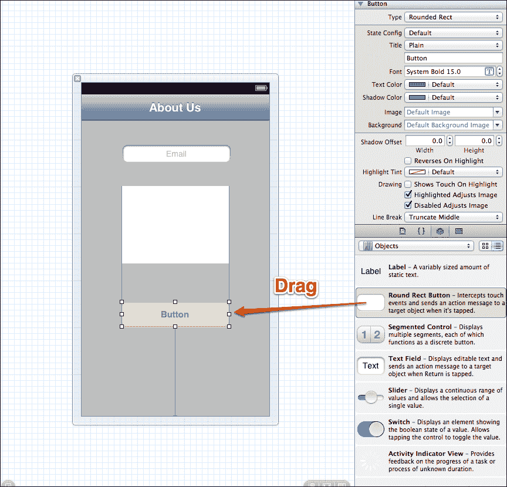

### .xib to RubyMotion

在本节中，我们将我们的 `.xib` 文件导入到 RubyMotion 项目中。打开 Xcode 项目的文件夹，找到 `ViewController.xib`。它位于名为 `en.lproj` 的文件夹中；将其复制到我们在上一章创建的 **Restro** 应用的 `resources` 文件夹中。

更新我们在上一章创建的 `restro` 应用中的 `about_controller.rb` 文件，以下是代码：

```swift
def setupNavigationBar
  back= UIBarButtonItem.alloc.initWithTitle("Back", style:UIBarButtonItemStylePlain,target:nil ,action:nil)
  self.navigationItem.backBarButtonItem = back;
  contact_us_button = UIBarButtonItem.alloc.initWithTitle("Contact Us", style:UIBarButtonItemStylePlain ,target:self, action:"contact_us")
  self.navigationItem.rightBarButtonItem = contact_us_button
end
def contact_us
  contact_us_controller = ContactUsController.alloc.initWithNibName("ViewController", bundle:nil)
  presentModalViewController(contact_us_controller, animated:true)
end
```

由于我们已经将 `.xib` 文件从 Xcode 导入到 RubyMotion 项目中，当使用 `Rake` 命令构建代码时，RubyMotion 会自动创建一个 `.nib` 文件。在这里，我们创建了一个带有初始化器 `initWithNibName` 的 `View Controller` 变量，该初始化器接收一个参数，这个参数将是 `.nib` 文件的名称。这个初始化器的职责是实例化 `.nib` 文件，并将 `View Controller` 变量的 `view` 属性中声明的 `View` 连接起来。

在应用文件夹内创建一个名为 `contact_us_controller.rb` 的文件，具体如下：

```swift
class ContactUsController < UIViewController
end
```

让我们启动终端并使用以下命令运行应用程序：

```swift
$rake

```

以下截图显示了上述命令的输出：

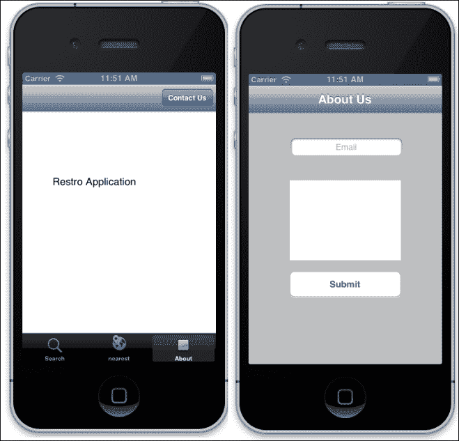

接下来，让我们用以下代码更新 `contact_us_controller.rb`：

```swift
class ContactUsController < UIViewController
  HEADER_TAG = 1
  EMAIL_BOX_TAG = 2
  INFORMATION_BOX_TAG = 3
  SUBMIT_BUTTON_TAG = 4
  def viewDidLoad
    @header = self.view.viewWithTag(HEADER_TAG)
    @email_box = self.view.viewWithTag(EMAIL_BOX_TAG)
    @information_box = self.view.viewWithTag(INFORMATION_BOX_TAG)
    @submit_button = self.view.viewWithTag(SUBMIT_BUTTON_TAG)
    @submit_button.addTarget(self,
            action:"send_message", forControlEvents:UIControlEventTouchUpInside) 
    tapGesture = UITapGestureRecognizer.alloc.initWithTarget(self,
action:"hideKeyboard")
    tapGesture.cancelsTouchesInView = false
    view.addGestureRecognizer(tapGesture)
  end 

  def send_message
    if form_valid?
      puts "Submitted the button with correct values"
      close
    else
      puts "Invalid Values"
    end
  end
  def close
    dismissModalViewControllerAnimated true
  end 

  #method to hide keyboard when user taps on a scrollview
def hideKeyboard
    @information_box.resignFirstResponder
end

def form_valid?
  not @email_box.text.empty? and not @information_box.text.empty? and not @email_box.text.match(/\A([^@\s]+)@((?:[-a-z0-9]+\.)+[a-z]{2,})\Z/i).nil?
end
end
```

使用以下命令启动应用程序：

```swift
$rake

```

在表单中输入几个错误值，你将在终端上看到 **Invalid value** 的输出。一旦你在表单中正确输入值并提交，它将被下拉。

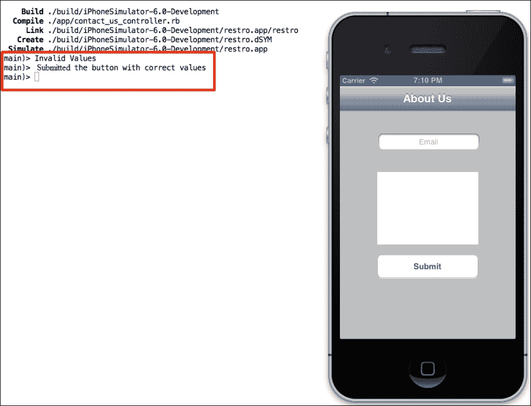

现在我们来理解一下代码。首先，我们将标签分配给了在 Interface Builder 中创建的属性。然后，我们使用这些标签将变量连接到相应的组件。

```swift
self.view.viewWithTag(HEADER_TAG)

```

上述命令将根据其标签检索 `self.view` 的子视图。

我们还为 **Submit** 按钮创建了一个 `action` 项目。这意味着当我们点击 **Submit** 按钮时，它将调用 `send_message` 动作。

```swift
    @submit_button.addTarget(self,
      action:"send_message", forControlEvents:UIControlEventTouchUpInside)
```

在 `send_message` 动作中，我们正在检查表单是否有效。

一些开发者喜欢使用 Interface Builder 设计用户界面；而另一些开发者则更倾向于完全使用代码。其中一个原因是在将 Interface Builder 的出口和动作连接到代码时，很容易出错。这通常会导致一个比如果直接编写整个代码更难调试的错误，因为你必须同时在两个地方（Interface Builder 和你的代码）进行调试，而不是只在代码一个地方。

# UIWebView – 嵌入网页内容

有可能我们需要在我们的应用程序中显示网页内容。`UIWebView` 类帮助我们做到这一点。为此，只需创建一个 `UIWebView` 对象，将其附加到一个窗口上，并发送请求以加载网页内容。我们还可以使用这个类在网页历史记录中前后移动，甚至可以编程设置一些网页内容属性。

现在我们创建一个 `UIWebView` 类，在视图中显示 [www.rubymotion.com](http://www.rubymotion.com)。

使用以下代码更新 `about_controller.rb`：

```swift
def submit_button
  @visitButton = UIButton.buttonWithType(UIButtonTypeRoundedRect)
  @visitButton.frame = [[80,10],[180,37]]
  @visitButton.setTitle("Visit", forState:UIControlStateNormal)
  @visitButton.setTitle("You have clicked me", forState:UIControlStateHighlighted)
  @visitButton.addTarget(self, action:"load_some_view", forControlEvents:UIControlEventTouchDown)
  view.addSubview(@visitButton)
end
def load_some_view
      @my_web_view = UIWebView.alloc.initWithFrame([[0,100],[320,220]])
      @my_web_view.delegate = self
      @my_web_view.scalesPageToFit = "YES"
      view.addSubview(@my_web_view)
      url = NSURL.URLWithString("http://www.rubymotion.com")
      request = NSURLRequest.requestWithURL(url)
      @my_web_view.loadRequest(request)
end
```

现在我们来理解一下代码。看看以下这一行：

```swift
url = NSURL.URLWithString("http://www.rubymotion.com")
```

在这里，`NSURL.URLWithString` 告诉我们的应用程序传入的文本是一个网址或 URL，现在它是一个名为 `url` 的 `NSURL` 对象。

```swift
request = NSURLRequest.requestWithURL(url)
```

`NSURLRequest.requestWithURL` 处理传入请求的 `url` 变量。它现在是一个名为 `request` 的请求对象。

```swift
@my_web_view.loadRequest(request)
```

最后，我们将请求加载到名为 `@my_web_view` 的 WebView 类中。

让我们启动终端并按照以下步骤运行我们的应用程序，以查看结果：

```swift
$rake

```

以下截图显示了上一条命令的输出：

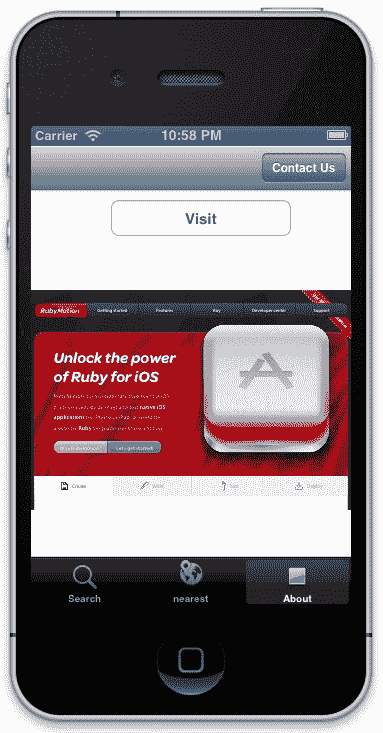

# 概述

让我们回顾一下本章所学的内容：

+   Xcode Interface Builder 与 RubyMotion

+   使用 WebView 在 RubyMotion 应用程序中嵌入网页内容

在下一章中，我们将关注软件开发生命周期中的一个关键部分，即测试。我们将学习如何为 RubyMotion 项目编写测试用例，并在 iOS 设备上测试我们的应用程序。
