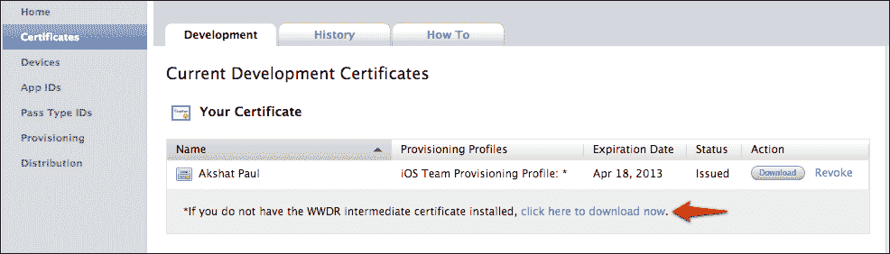
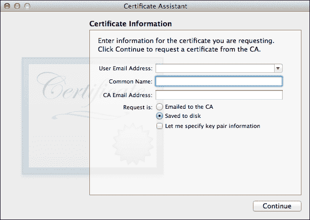
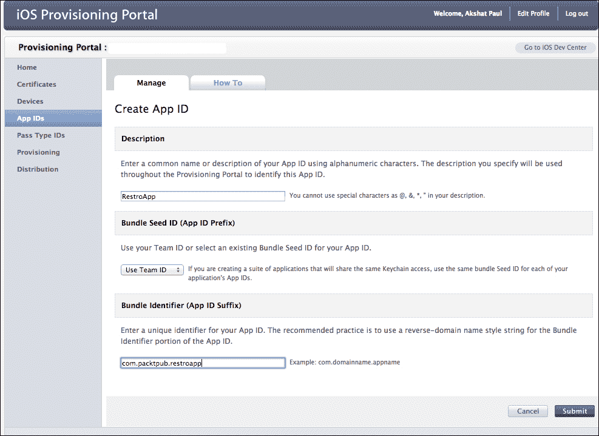
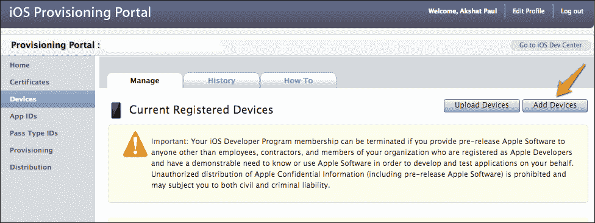
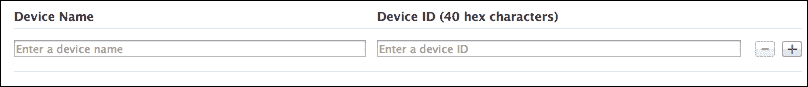
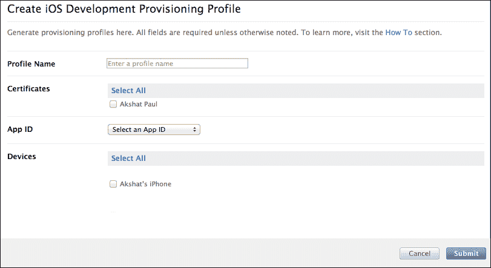
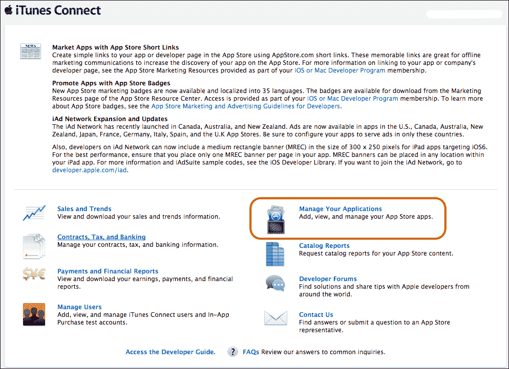
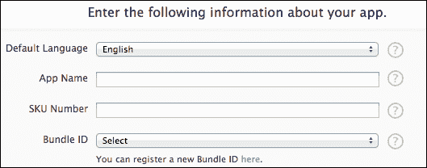
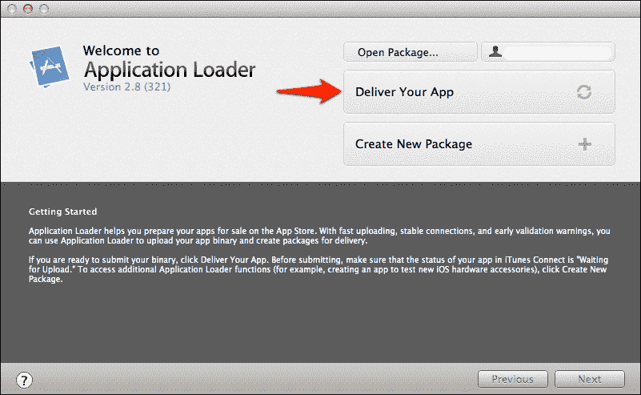

# 第十章。为 App Store 做准备

*"有两种人，那些完成他们开始的事情的人，等等。"*

*罗伯特·拜恩*

我们在学习和使用 RubyMotion 创建 iOS 应用程序方面已经走了很长的路。希望我们现在已经熟练地使用 RubyMotion 开发应用程序。到目前为止，我们已经从创建一个简单的 iOS 应用程序发展到在我们的 RubyMotion 项目中包含 iPhone 和 iPad 的惊人设备功能，然后创建游戏。在前一章中，我们学习了如何编写测试用例并自动测试我们的应用程序。我们现在已经涵盖了软件生命周期的所有部分，除了我们的应用程序尚未投入生产。Apple 有特定的方式将您的完成的应用程序与世界分享。在本章中，我们将介绍如何设置您的 Mac 以创建您的应用程序包，分享它，并通过 Apple App Store 分发您的应用程序。

在本章中，我们将涵盖以下主题：

+   生成证书

+   配置文件门户

+   设置 RubyMotion 项目

+   在设备上测试

+   iTunes Connect

+   提交包

在您开始设置 Mac 以进行应用分发之前，您需要注册到 iOS 开发者的 Apple 开发者计划([`developer.apple.com`](https://developer.apple.com))。注册此计划是强制性的，否则您将无法将您的应用程序构建提交到 App Store。在应用程序发布到 App Store 之前，Apple 会审查每一个应用程序。一旦您拥有会员资格，您还应该查看 iOS 开发者中心的 Apple 审查指南。这些指南对于您应用程序顺利批准非常重要；我们将随着内容的推进覆盖大多数内容，但您也应该自己阅读它们。这些指南还包含**人类界面指南**（**HIG**）；许多人认为这些指南是 Apple 为开发者提供一个受控环境的方式，但这些说明的主要目的是创建符合标准的应用程序，并使它们区别于其他智能手机。到目前为止，Apple 在保持其高标准方面一直很成功。

您还应该在[`itunesconnect.apple.com/`](https://itunesconnect.apple.com/)上设置您的应用个人资料；我们将在本章后面更详细地讨论这一点。

# 生成证书

要将您的应用程序提交到 App Store，您需要一个开发者证书、一个分发证书、一个开发者配置文件和一个分发配置文件。在本节中，我们将通过生成证书将您的 Mac 与 iOS 配置文件门户绑定。

一旦您登录到[`developer.apple.com`](https://developer.apple.com)，请选择 iOS 配置文件门户。从左侧列提供的选项中选择**证书**标签，如图下截图所示：



如果您是首次使用，您需要首先安装**全球开发者关系**（**WWDR**）中间证书；此证书将您的开发者和分发证书绑定到 Apple 证书颁发机构。下载它，它将被安装到您的钥匙串中。

接下来，让我们创建我们的开发者证书。为了生成这个证书，让我们回到我们的钥匙串应用，并导航到**钥匙串访问菜单** | **证书助手** | **从证书颁发机构请求证书**。



在这里，您必须使用您注册开发者账户时使用的相同电子邮件地址。我们必须为这个证书添加一个独特的名称，并将其保存到磁盘上。

现在，让我们回到浏览器中的我们的开发者账户。在**开发**标签页中，我们有一个**请求证书**选项，它显示了我们已经完成并准备好申请证书的所有说明。

一旦上传，您将看到**待处理发行**。没问题；刷新您的浏览器，您的证书将被上传。下载它并运行；它将被存储在您的钥匙串中。同样，按照相同的程序为分发证书执行操作。

在您的钥匙串中，在证书部分，您将看到所有已安装的证书。每个证书都是两件事的组合：一个证书和一个私钥。将其复制并保存在安全的地方是一个好习惯。这样，如果您更换机器，您将能够轻松地下载证书；但没有私钥，它将无法工作。

## 自己动手做

就像用于在开发环境中开发和测试的开发者配置文件一样，我们还有一个用于在 App Store 上分发应用的分发配置文件。

现在您已经知道了如何在 Mac 机器上为您的开发者配置文件生成、上传和安装 Apple 证书，为什么不自己尝试并分发配置文件呢？您只需遵循以下步骤：

1.  使用证书助手生成证书。

1.  在**分发证书**标签页上上传它。

1.  在您的机器上安装它。

# 配置文件

配置文件将许多数字对象，如我们的应用、证书和设备，绑定在一起。配置文件有两个部分：一个是我们的开发配置文件，另一个是分发配置文件。

## App ID

在我们创建新的配置文件之前，让我们首先为我们的应用创建一个 App ID。在配置文件门户中，我们有一个创建 App ID 的部分。为每个应用创建一个新的 App ID 是必要的。然后，在生成新的配置文件时使用此 App ID。



首先，我们添加描述；这是我们将在配置文件门户中识别我们的应用程序 ID 的方式。接下来，我们添加一个种子 ID。（对于首次用户，您将获得生成一个新的选项。）最后，我们添加一个捆绑标识符。我们将在稍后的 RubyMotion 项目的`Rakefile`中使用这个捆绑标识符。捆绑标识符的命名规范是反向域名表示法，其中**com**后面跟着域名。在我们的例子中，我使用了**packtpub**，但你应该在这里添加你的域名。在捆绑标识符的最后部分，添加你的应用程序名称；在这种情况下，我们将使用**Restroapp**。

### 注意

使用捆绑标识符来区分不同的应用程序。我们可以用 `com.domainname.*` 来实现这个目的。一个星号 (`*`) 符号允许我们为多个应用程序使用相同的标识符。但我们建议为每个标识符命名你的应用程序。

## 添加设备

为了开发和测试目的，我们需要在应用程序的**设备**部分添加我们的 iOS 设备。在**设备**部分内，点击**添加设备**，如图所示：



要在您的 iPhone 或 iPad 上测试您的应用程序，只需添加您设备的 UDID 编号和您选择的设备名称。UDID 编号可以在 iTunes 中看到。当您点击 iPhone 名称时，它将显示一个 40 位的序列：



您必须添加所有您想要在开发过程中使用的测试设备。如果想要测试的设备不存在，应用程序将不会安装在该设备上。

### 注意

苹果允许您添加最多 100 个 iOS 设备；这仅限于开发和测试目的。

## 开发者配置文件

现在我们已经准备好创建新的配置文件，让我们通过选择**配置**选项来完成它。**创建新的开发者配置文件**表单分为以下四个部分：

+   **配置文件名称**: 这是一个用于识别配置文件的标签。

+   **证书**: 选择您已在系统上安装的开发者证书。如果像我一样是一个人的工作室，您将只看到一个选项。

+   **App ID**: 选择我们从上一节为该应用程序创建的一个。

+   **设备**: 这些是你想要测试的设备。

提交后，您将看到待处理状态。刷新您的浏览器，您的配置文件将准备好。下载它并点击文件，它将在 Xcode 中安装。您可以通过导航到**Xcode** | **组织者** | **配置文件** | **设备**来访问与此配置文件相关的所有信息。

## 自己动手做

现在您已经知道了如何创建开发者配置文件，为什么不尝试通过执行以下步骤为自己创建分发配置文件呢：

1.  在 **配置** 部分的 **分发** 选项卡中打开。

1.  创建一个新的配置文件。

1.  下载并安装配置文件。

# 设置 RubyMotion 项目

接下来，让我们设置我们的 RubyMotion 项目；它将包括我们之前收集的信息。

## 权限

权限在构建过程的代码签名部分中使用。许多应用程序需要访问设备功能；苹果要求您指定权限，如果您想访问特定的设备功能。这可以在 `Rakefile` 中添加。`Rakefile` 中的权限方法允许您以下方式指定适当的键和值：

```swift
Motion::Project::App.setup do |app|
  # ...
  app.entitlements['keychain-access-groups'] = [
    app.seed_id + '.' + app.identifier
  ]
end
```

在此示例中，如果您的应用程序需要访问密钥链来存储用户凭据，您必须通过传递应用程序配置文件标识符、应用程序标识符以及 `seed_id` 和应用程序标识符来发送 `keychain-access-groups` 请求。

## Info.plist 设置

为了为用户提供最佳体验，iOS 预期每个应用程序都存在元信息。这些信息随后以各种方式使用。其中一些信息会显示给用户，而另一些可能被系统内部使用以识别应用程序。这些配置设置在 `Info.plist` 中定义，该文件位于应用程序的包中。

在 RubyMotion 项目中，`Info.plist` 文件在 `Rakefile` 中以类似哈希的结构定义，其中您有一个键值对。例如，我们在以下示例中定义 `CFBundleURLTypes`：

```swift
Motion::Project::App.setup do |app|
  # ...
  app.info_plist['CFBundleURLTypes'] = [
    { 'CFBundleURLName' => 'com.packtpub.restroapp'}

  ]
end
```

`Rakefile` 并未涵盖所有可能的设置，但它揭示了内部 `Info.plist` 数据结构，如果需要，可以对其进行修改。有关更多信息以及查看其他 `Info.plist` 属性列表，您可以访问苹果开发者参考文档：[`developer.apple.com/library/ios/#documentation/General/Reference/InfoPlistKeyReference/Introduction/Introduction.html`](http://developer.apple.com/library/ios/#documentation/General/Reference/InfoPlistKeyReference/Introduction/Introduction.html)。

## 构建图标

现在我们已经为 App Store 设置了机器，让我们也设置我们的 RubyMotion 项目。这里要做的第一件事是设置构建图标。由于 iOS 设备，如 iPhone、iPad、iPad mini 和视网膜显示屏具有各种屏幕尺寸和显示分辨率，苹果提供了针对每个设备的特定图标创建指南。

对于我们的应用程序图标，只需将这些图标添加到 `resources` 文件夹中。它们可以有任何随机的名称，但根据它们所代表的内容命名是一个好主意，例如 `icon_name-114` 或 `icon-1024`。在这里，`114` 和 `1024` 分别代表标准应用程序图标的大小 114 x 114 和 App Store 图标的大小 1024 x 1024。

接下来，按照以下方式在您的 `Rakefile` 中添加 `icon` 属性：

```swift
Motion::Project::App.setup do |app|
  # Use `rake config' to see complete project settings.
  app.name = 'Restaurant Application'
  app.icons  =  ['icon-114.png']
end
```

默认情况下，这些图标在图像的上半部分具有光泽效果，这是传统的 iPhone 风格。但你可以通过在`Rakefile`中添加以下行来更改此设置：

```swift
Motion::Project::App.setup do |app|
  # Use `rake config' to see complete project settings.
  app.name = 'Restaurant Application'
  app.icons  =  ['icon-114.png']
  app.prerendered_icon = true
end
```

就这样。我们的 RubyMotion 应用程序现在已准备好带有图标。以下是一些设计优秀图标的小贴士：

+   为了获得最佳效果，请寻求专业图形设计师的帮助

+   使用人们容易识别的通用图像

+   欣然接受简单性

+   图标纹理越丰富，看起来越好

+   使图标更加详细和逼真

+   添加细节和深度

由于图标提供了您应用程序的第一印象，您必须投入大量精力确保它们看起来很好。您可以在 Apple 开发者参考中找到有关图标和设计的更多信息，请参阅[`developer.apple.com/library/ios/#documentation/userexperience/conceptual/mobilehig/IconsImages/IconsImages.html`](http://developer.apple.com/library/ios/#documentation/userexperience/conceptual/mobilehig/IconsImages/IconsImages.html)。

除了图标之外，我们还可以拥有其他资源，例如图像和声音文件。这些可以包含在`resources`文件夹中，并且可以在我们的应用程序中使用这些实例。例如，我们可以使用`UIImage.imageNamed("hello")`创建`hello.png`图像的实例。

## 配置您的应用程序

在我们创建将上传到 App Store 审查的包之前，我们需要添加一些配置设置，以便 Apple 可以识别该应用程序来自已注册的来源。在这里，我们将使用我们的配置文件中的信息，以及与我们应用程序相关的某些一般信息。

所有这些设置，再次强调，都包含在我们的`Rakefile`中。需要输入的一些必需设置包括我们正在使用的 iOS SDK 版本和我们的应用程序版本，例如 1.0、1.3 和 2.0，这些版本总是为未来的发布而递增。部署目标是我们要运行我们的应用程序或与之兼容的最小 iOS 版本。我们还需要指定我们的标识符和配置文件详情。以下示例将使这一切变得清晰：

```swift
Motion::Project::App.setup do |app|
app.sdk_version = "6.0"
app.deployment_target = "5.0"
app.version = "1.0"
app.identifier = "com.packtpub.restroapp"
app.provisiong_profile = "/Users/your_name/Provisioning_Profiles/random_sequence.mobileprovision"
end
```

### 注意

配置文件详情在开发和分发时不同。分发配置文件详情仅在我们要提交或测试多个设备上的应用程序时使用。

## 在设备上安装

在您将应用程序提交到 App Store 之前测试您的应用程序是个好主意。现在，所有我们的设置都已就绪，我们只需从控制台运行`rake device`命令。在这样做之前，请确保您在配置门户中注册的设备通过 USB 连接到您的 Mac 机器。以下任何原因都可能导致过程失败：

+   注册的设备未通过 USB 连接到您的计算机

+   已添加错误的标识符或配置文件详情

+   项目使用的是设备上运行的错误 iOS 版本

## iTunes Connect

现在我们已经完成了；但在创建我们的应用程序包并上传之前，我们需要在单独的门户上设置我们的应用程序([`itunesconnect.apple.com`](https://itunesconnect.apple.com))。**iTunes Connect**提供了许多与您的应用程序相关的选项，例如**销售和趋势**、**目录报告**、**开发者论坛**、**支付**、**管理您的应用程序**、**管理用户**等等。但，目前我们只对**管理您的应用程序**选项感兴趣：



一旦您选择了**管理您的应用程序**，点击按钮添加一个新应用程序到您的目录。这将显示以下表单：



在**应用名称**文本框中输入您的应用程序名称。SKU 号码是一个期望的、唯一的字母数字序列，您必须输入。从下拉菜单中选择一个**包标识符**选项；由于您的 iTunes Connect 配置文件与您的配置门户相关联，您将自动在下拉菜单中获得正确的选项。

提交后，您将获得选择何时发布应用程序、选择价格层（免费或付费）以及根据不同国家选择哪个 App Store 将销售应用程序的选项。在此窗口之后，将出现另一个表单，您需要在其中填写您应用程序的描述、上传各种设备的快照、为 App Store 添加图标，并填写其他物流细节，例如在应用程序出现问题时联系谁以获得支持。

现在我们已经在 iTunes Connect 上设置了我们的应用程序，接下来我们将学习如何将我们的应用程序推送到 App Store 进行审查。

# 创建提交包

`rake archive`命令生成一个`.ipa`存档。此包用于将我们的应用程序提交到 App Store。存档包也可以用于对分发设备进行测试的 ad-hoc 分发。

一旦运行`rake archive`命令，我们将获得二进制文件及其相应的分发证书。然后，使用名为**应用程序加载器**的特别 Apple 实用程序将其上传到 iTunes Connect。

在 Xcode 安装过程中，我们自动获得**应用程序加载**实用程序，我们可以从应用程序文件夹中访问它或通过简单的 spotlight 搜索来访问：



选择**交付您的应用程序**选项；这将指示 iTunes Connect 等待上传的应用程序名称。从`./build/iPhoneOs_sdk_verson/Release/your_application.ipa`中选择您的`.ipa`包。一旦完成，您将看到 iTunes Connect 的状态已更改为**已接收二进制文件**。

太好了！终于，我们已经将我们的应用程序提交到了 App Store。苹果 App Store 需要几天时间来审查您的应用程序；几天后，您将看到您应用程序的状态从**等待审查**变为**正在审查**。如果您的应用程序有任何问题，苹果团队将首先使用您在 iTunes Connect 中提供的详细信息与您联系；如果问题未解决，应用程序将被拒绝。如果发生这种情况，您可以解决审查团队遇到的问题，并重新提交应用程序。

# 摘要

本章已经涵盖了 iOS 应用程序生命周期中的最后一步。让我们回顾一下我们学到了什么：

+   如何生成证书

+   如何使用配置文件门户

+   如何设置 RubyMotion 项目

+   如何在设备上进行测试

+   如何使用 iTunes Connect

+   如何创建用于提交的捆绑包

通过本章，我们几乎结束了学习如何使用 RubyMotion 制作 iOS 应用程序的旅程。但这只是冰山一角。我们仍需探索许多 iOS SDK API，以实现我们梦想中的应用程序。RubyMotion 通过使用 gem 使这一部分变得无压力。在最后一章中，我们将学习如何使用一些最受欢迎的 RubyMotion gem，以及如何通过创建我们自己的 gem 来为 RubyMotion 社区做出贡献。
