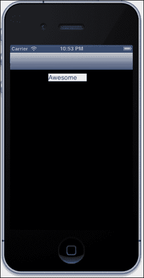
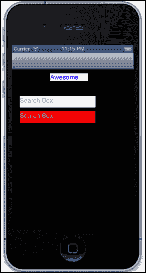
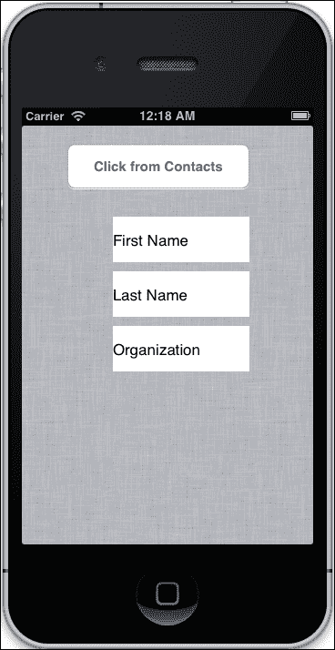
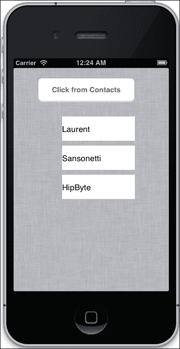

# 第十一章。扩展 RubyMotion

DRY 原则表述如下：

*"系统内每项知识都必须有一个单一、明确、权威的表示。"*

我们现在正接近本书的结尾。到目前为止，我们已经学习了如何快速使用 RubyMotion 制作 iOS 应用程序。为了使这个过程更加迅速，RubyMotion 允许我们使用特殊的 RubyMotion 风格的 gem 和包装器。"gem"和"包装器"是封装成自包含格式的 Ruby 程序。这些通常是开源项目，其他开发者可以在他们的应用程序中使用，甚至可以向这些项目做出贡献。幸运的是，RubyMotion 有一个非常热情的社区；在 RubyMotion 的工具链推出几个月后，就引入了许多 gem，它们可以相当快速地实现许多繁琐的任务。在本章中，我们将学习如何通过使用 RubyMotion 风格的 gem 来增强我们的应用程序。本章将涵盖以下主题：

+   RubyMotion gems

+   CocoaPods

# RubyMotion gems

gem 的使用基于编程实践**不要重复自己**（**DRY**），它指出，当某些代码准备好使用且可用时，为什么还要再次工作呢。RubyMotion 社区可能目前还很年轻，但它已经有一些令人惊叹的 gem，可以让许多繁琐的任务变得非常简单。一些 gem 甚至以非常简单的方式针对具有挑战性的功能。

在本章中，我们将介绍以下具有 RubyMotion 风格的 gem：

+   Teacup

+   BubbleWrap

+   `motion-addressbook`

## Teacup – 再见，Xcode 和 XIB 文件！

为 iOS 应用程序设计 UI 是一项艰巨的任务，尤其是对于之前在易于学习和实现的网络技术方面工作的开发者来说。**Teacup**是一个可以使你的生活变得非常简单的 gem。Teacup 增强了你快速设计和样式 RubyMotion 应用程序视图的能力；你可以在保持代码 DRY 的同时轻松创建布局。

让我们创建一个应用程序，并学习使用 Teacup 有多简单：

```swift
$motion create TeaCupMotion

```

我们将使用**Bundler**（它也是一个 Ruby gem）来安装所有我们的 gem。Bundler 还帮助我们管理应用程序依赖项，以确保应用程序运行所需的 gem 的确切版本可用。

### 提示

Bundler 是 Ruby on Rails 等流行框架的默认依赖项管理器。

让我们将 Bundler 添加到我们的应用程序中：

1.  使用以下代码行更新`Rakefile`：

    ```swift
    $:.unshift("/Library/RubyMotion/lib")
    require 'motion/project'
    require 'bundler'
    Bundler.require

    ```

1.  使用 Bundler，我们需要一个 Gemfile，在其中我们可以提及我们将与我们的应用程序一起使用的 gem 的详细信息。接下来，让我们创建一个 Gemfile，并在其中添加以下代码行：

    ```swift
    source "https://rubygems.org"
    gem "teacup"

    ```

    因此，在未来，如果你想向你的项目添加任何新的 gem，你只需简单地将它添加到这个文件中。

1.  接下来，让我们运行`bundle install`，然后我们就可以开始了：

    ```swift
    bundle install

    ```

    ### 注意

    `bundle install`命令将一个`Gemfile.lock`文件添加到你的仓库中。这确保了你的应用程序上的其他开发者以及你的部署环境都将使用你现在使用的相同第三方代码。

1.  接下来，更新`app_delegate.rb`文件，使用以下代码：

    ```swift
    class AppDelegate
      def application(application, didFinishLaunchingWithOptions:launchOptions)
        @window = UIWindow.alloc.initWithFrame(UIScreen.mainScreen.bounds)
        myNavController = RootController.alloc.init

        @window.rootViewController = UINavigationController.alloc.initWithRootViewController(myNavController)
        @window.rootViewController.wantsFullScreenLayout = true
        @window.makeKeyAndVisible
        true
      end
    end
    ```

在这段代码中，我们只初始化了一个`RootController`实例，就像我们在每个应用程序中做的那样。你可能还记得，控制器是我们所有应用程序逻辑所在的地方。

到目前为止，我们在各个章节中都是用传统方式制作 RubyMotion iOS 应用程序。这次让我们在应用程序中使用 Teacup，并通过使用其层叠样式表（CSS）类型的语法来添加样式。

让我们创建一个名为`style`的目录，并在其中添加一个名为`style.rb`的新文件。将以下代码添加到`style`文件夹中的`style.rb`文件中：

```swift
Teacup::Stylesheet.new(:style) do

  style :your_layout,
    landscape: true

  style UILabel,
    textColor: UIColor.blueColor
  style :label,
    text: 'Awesome',
    backgroundColor: UIColor.whiteColor,
    top: 10,
    left: 100,
    width: 100,
    height: 20

end
```

让我们理解前面的代码：

1.  首先，我们创建了一个名为`style`的样式表。

    ```swift
    Teacup::Stylesheet.new(:style) do
    …
    end
    ```

    这个约定是由 Teacup 提供的，用于创建一个新的样式表。

1.  接下来，我们使用基于 CSS 的语法为你的视图创建了一个特定的布局。

    ```swift
      style :your_layout,
        landscape: true
    ```

    这将创建一个名为`your_layout`的样式，并启用横屏旋转（否则，只启用竖屏方向）。

1.  接下来，我们为所有`UILabel`实例添加了样式。

    ```swift
      style UILabel,
        textColor: UIColor.blueColor
    ```

    前一行代码给所有在样式内定义的`UILabel`实例设置了文本颜色。由于我们在使用`UILabel`时应用了样式，如果我们想对特定元素进行样式化，我们必须添加以下命令：

    ```swift
    style :label,
      text: 'Awesome',
      backgroundColor: UIColor.whiteColor,
      top: 10,
      left: 100,
      width: 100,
      height: 20
    ```

这里，`label`就像一个类。这将为标签进行样式化。

为了更好地理解这一点，让我们创建一个视图。按照以下步骤创建视图：

1.  创建一个名为`root_view_controller.rb`的文件，并将以下代码添加到其中：

    ```swift
    class RootController < UIViewController

      stylesheet :style

      layout :your_layout do
        @label1 = subview(UILabel, :label)

      end

      def shouldAutorotateToInterfaceOrientation(orientation)
        autorotateToOrientation(orientation)
      end

    end
    ```

    由于我们创建了一个新的控制器文件，我们必须对`app_delegate.rb`文件进行相应的更改。按照前几章所示，在`app_delegate.rb`文件中进行这些更改。

    在前面的代码片段中，我们首先给样式表起了一个名字，这是通过`stylesheet:style`完成的，然后我们指定了一个名为`your_layout`的布局，并将`label : @label1 = subview(UILabel, :label)`传递给它。

1.  让我们打开终端并测试我们的应用程序。

    ```swift
    $rake

    ```

    以下是输出结果：

    

    我们可以看到文本**Awesome**出现在模拟器屏幕上，并且它被格式化为我们在样式表中定义的那样。

    ### 小贴士

    Teacup 实现了`viewDidLoad`方法并实例化了任何视图。如果你想实现自己的`viewDidLoad`方法，请确保调用 super。

    我们还可以定义不同的样式表，以在旋转设备时更改尺寸，例如横屏和竖屏模式。让我们在下一个示例中尝试一下。

1.  现在更新样式表，即`style.rb`文件，使用以下代码：

    ```swift
        style :label,
        text: 'Awesome',
        backgroundColor: UIColor.whiteColor,
        top: 10,
        left: 100,
        width: 100,
        height: 20,
     landscape: {
     backgroundColor: UIColor.redColor,
     }

    ```

1.  运行应用程序，并通过导航到 **硬件** | **向左旋转** 从模拟器菜单旋转屏幕。你会看到，随着屏幕的旋转，标签的背景颜色会改变。

1.  现在，让我们在同一个示例中做更多的事情。在 `style.rb` 文件中添加以下代码：

    ```swift
      style UITextField,                # Defining styles based on view
    class instead
      textColor: UIColor.redColor

      style :field,
      left:   10,
      top:    10,
      width:  200,
      height: 30,
      landscape: {
        width: 360  # make it wide in landscape view
      }

      style :search, extends: :field,
      backgroundColor: UIColor.whiteColor,
      left: 20,
      top: 70,
      placeholder: 'Search Box'     
      style :search_new, extends: :field,
      backgroundColor: UIColor.redColor,
      left: 20,
      top: 110,
      placeholder: 'Search Box'
    ```

    这里我们创建了两个文本框。

1.  现在，更新 `root_controller.rb` 文件。

    ```swift
      layout :your_layout do
        @label1 = subview(UILabel, :label)
        @search = subview(UITextField, :search)
        @one_more_search = subview(UITextField, :search_new)

      end
    ```

1.  让我们在模拟器中测试我们的应用程序。

    ```swift
    $rake

    ```

    以下是其输出：

    

通过前面的示例，我们可以看到使用 Teacup 钩子设计视图是多么简单；它提供了一种轻松地以编程方式创建界面的方法。我们已经分享了这个神奇钩子的一些功能；你可以在 [`github.com/rubymotion/teacup`](https://github.com/rubymotion/teacup) 上探索更多。

## BubbleWrap – 使 Cocoa API 更像 Ruby

BubbleWrap 是一组经过充分测试的辅助工具和包装器，用于包装 Cocoa SDK 代码，并为 RubyMotion 提供更多类似 Ruby 的 API。它为许多 iOS Cocoa SDK 代码提供了包装器，例如相机、通知中心、HTTP 等。

我们可以非常容易地做很多事情。例如，要使用 BubbleWrap 执行 `GET HTTP` 请求，我们需要以下简单的代码片段：

```swift
BW::HTTP.get("https://twitter.com/rubymotion") do |response|
  p response.body.to_str
end
```

在 第六章 中，我们学习了设备能力——在您的应用程序中实现相机功能。我们在那里编写了相当多的代码，但有了 BubbleWrap，事情变得非常简化。我们只需要以下代码片段来在我们的应用程序中使用相机：

```swift
BW::Device.camera.front.picture(media_types: [:movie, :image]) do |result|
  image_view = UIImageView.alloc.initWithImage(result[:original_image])
end
```

BubbleWrap 还提供了一个名为 `App` 的模块，可以在运行应用程序时使用。要理解这一点，请执行以下步骤：

1.  首先，创建一个小型的示例应用程序。

    ```swift
    $motion create UseBubbleWrap

    ```

1.  更新 `Rakefile` 以包括 Bundler，这将帮助我们轻松安装 BubbleWrap 钩子。

    ```swift
    require 'bundler'
    Bundler.require
    ```

1.  如上节所示，让我们将以下代码添加到我们的项目中作为 `Gemfile`：

    ```swift
    source :rubygems
    gem 'bubble-wrap'
    ```

1.  运行以下命令来安装 BubbleWrap 钩子：

    ```swift
    $bundle install

    ```

1.  接下来，让我们启动终端来在控制台中测试 `App` 模块：

    ```swift
    $rake

    ```

1.  要使用 `App` 模块，请在 REPL 中运行以下命令：

    ```swift
    (main)> App.name
    => "UseBubbleWrap"

    (main)> App.identifier
    => "com.yourcompany.UseBubbleWrap"

    (main)> App.documents_path
    => "/Users/abhishek/Library/Application Support/iPhone Simulator/6.1/Applications/3CF89A96-F390-4A7D-89B8-2F0E7B54A38A/Documents"

    (main)> App.resources_path
    => "/Users/abhishek/Library/Application Support/iPhone Simulator/6.1/Applications/3CF89A96-F390-4A7D-89B8-2F0E7B54A38A/UseBubbleWrap.app"

    (main)> App.frame
    => #<CGRect origin=#<CGPoint x=0.0 y=20.0> size=#<CGSize width=320.0 height=460.0>>
    (main)> App.states
    => {}

    (main)> App.shared
    => #<UIApplication:0x9530920>

    (main)> App.current_locale
    => #<__NSCFLocale:0x966a040>
    (main)> App.alert("This is nice!!")
    => #<UIAlertView:0xa8433f0>

    (main)>  App.run_after(0.5) {  p "It's #{Time.now}"   }
    => #<__NSCFTimer:0x93760c0>
    (main)> "It's 2013-05-10 18:47:34 +0530"

    ```

1.  还有一个名为 `Device` 的模块，它提供了许多与当前设备相关的选项。让我们再次在终端中启动 REPL 并执行以下命令：

    ```swift
    $rake
    (main)> Device.iphone?
    => true

    (main)> Device.ipad? 
    => false

    (main)> Device.front_camera?
    "This method (front_camera?) is DEPRECATED. Transition to using Device.camera.front?"
    => false

    (main)>  Device.screen.width
    => 320.0

    (main)> Device.screen.height
    => 480.0

    (main)> Device.orientation
    => :portrait

    ```

BubbleWrap 钩子附带了许多辅助工具。如果你查看 [`bubblewrap.io/`](http://bubblewrap.io/) 上的 BubbleWrap 文档，这将对你项目有所帮助。

## motion-addressbook – 轻松访问电话簿

在第六章中，*设备能力 - 力量释放*，我们详细讨论了如何使用 iOS 设备的通讯录技术。在本节中，我们将使用名为`motion-addressbook`的 RubyMotion 特殊 gem，它简化了使用通讯录的过程。

在本节中，我们将执行以下操作：

+   使用`motion-addressbook` gem 创建一个示例应用

+   从设备的通讯录中提取数据

+   在屏幕上显示它

让我们首先执行以下步骤：

1.  创建一个示例应用程序。

    ```swift
    $motion create AddressBook_example

    ```

1.  接下来，让我们在`Gemfile`中包含`motion-addressbook` gem。

    ```swift
    source :rubygems
    gem 'bubble-wrap'
    gem 'motion-addressbook'
    ```

1.  使用命令行运行`bundle install`以将此 gem 包含到我们的项目中：

    ```swift
    $bundle install

    ```

1.  让我们在名为`addressbook_controller.rb`的文件中创建一个文件，我们将在此文件中添加一个按钮和三个标签。通过按钮，我们将访问我们的通讯录并选择所需的联系人。在标签中，我们将显示从通讯录复制的用户数据。在你的`addressbook_controller.rb`文件中添加以下代码：

    ```swift
    def viewDidLoad
        view.backgroundColor = UIColor.underPageBackgroundColor
        load_button
        load_labels
      end

      def load_button

        @phonebook_button = UIButton.buttonWithType(UIButtonTypeRoundedRect)
        @phonebook_button.frame = [[50, 20], [200, 50]]
        @phonebook_button.setTitle("Click from Contacts", forState:UIControlStateNormal)
        @phonebook_button.addTarget(self, action: :addressbook_access, forControlEvents:UIControlEventTouchUpInside)
        view.addSubview(@phonebook_button)

      end

      def load_labels

        @first_name = UILabel.new
        @first_name.text = 'First Name'
        @first_name.frame = [[100,100],[150,50]]

        @last_name = UILabel.new
        @last_name.text = 'Last Name'
        @last_name.frame = [[100,160],[150,50]]

        @organization = UILabel.new
        @organization.text = 'Organization'
        @organization.frame = [[100,220],[150,50]]

        view.addSubview(@first_name)
        view.addSubview(@last_name)
        view.addSubview(@organization)
      end
    ```

1.  在`app_delegate.rb`文件中添加以下代码，以便我们的代理指向我们的通讯录控制器：

    ```swift
    class AppDelegate
      def application(application, didFinishLaunchingWithOptions:launchOptions)

      @window = UIWindow.alloc.initWithFrame(UIScreen.mainScreen.bounds)
      @window.rootViewController = AddressbookController.alloc.init
      @window.makeKeyAndVisible

        true
      end
    end
    ```

1.  让我们打开终端并在模拟器中运行我们的应用，以检查我们是否能够看到三个标签和一个按钮。

    ```swift
    $rake

    ```

    以下是输出结果：

    

1.  在前面的代码片段中，我们提到了一个名为`addressbook_access`的方法。要访问通讯录，我们需要使用`AddressBook`选择器，它允许我们在应用程序中打开设备的通讯录并从中选择数据。使用此方法，我们将执行相同的操作。让我们在我们的`addressbook_controller.rb`文件中创建此方法，并添加以下代码：

    ```swift
      def addressbook_access

        AddressBook.pick { |person|
          if person
             first_name = person.attributes[:first_name]
             last_name = person.attributes[:last_name]
             org = person.attributes[:organization]
             @first_name.text = first_name
             @last_name.text = last_name
             @organization.text = org

          else
            # write some cancel code
          end
        }

      end
    ```

1.  让我们打开终端并在模拟器中运行我们的应用，以检查我们是否能够访问通讯录并将所需的联系人详细信息导入到我们的应用程序中。

    ```swift
    $rake

    ```

    以下是输出结果：

    

1.  一旦我们选择任何联系人，我们将在应用程序中看到其详细信息，如下面的截图所示：

就这样，我们完成了。这与我们在第六章中创建的应用程序相同，*设备能力 - 力量释放*，但使用`motion-addressbook`，我们的代码量大大减少。

让我们了解我们在这里做了什么。`motion-addressbook` gem 为我们提供了许多选项，使我们能够轻松地使用设备的通讯录。在`addressbook_access`方法中，我们通过使用`AddressBook.pick`调用了`AddressBook`选择器，为我们打开了设备的通讯录。一旦我们选择任何联系人，我们就会得到一个包含所选联系人所有属性哈希的`person`对象。

在我们的示例中，我们使用了从选定的`person`对象中获取的`first_name`、`last_name`和`organization`值。然而，`motion-addressbook` gem 有很多更多选项，可以让使用 Address Book 框架更快、更轻松。以下是一些：

+   创建新的联系人。

    ```swift
    AddressBook::Person.new
    #<AddressBook::Person:0xc360bc0 @address_book=nil @ab_person=nil @attributes={}>
    ```

+   从地址簿中拉取所有记录。

    ```swift
    AddressBook::Person.all
    [#<AddressBook::Person:0x9d78c80 @address_book=#<__NSCFType:0xc0db6d0> @ab_person=#<__NSCFType:0x9d77ea0> @attributes={:first_name=>"Abhishek", :last_name=>"Nalwaya", :organization=>"Fun Inc."}>, #<AddressBook::Person:0x78f0a20 @address_book=#<__NSCFType:0xc0db6d0> @ab_person=#<__NSCFType:0x9d78520> @attributes={:first_name=>"Akshat", :last_name=>"Paul", :organization=>"PacktPub"}>, #<AddressBook::Person:0x78a5eb0 @address_book=#<__NSCFType:0xc0db6d0> @ab_person=#<__NSCFType:0x9d788b0> @attributes={:first_name=>"Laurent", :last_name=>"Sansonetti", :organization=>"HipByte"}>, #<AddressBook::Person:0x78c06e0 @address_book=#<__NSCFType:0xc0db6d0> @ab_person=#<__NSCFType:0x9d78700> @attributes={:first_name=>"Manu", :last_name=>"Singhal", :organization=>"Ruby Inc"}>]
    ```

+   根据特定属性获取记录列表。

    ```swift
    AddressBook::Person.find_all_by_organization('HipByte')
    ```

+   根据许多条件获取记录列表。

    ```swift
    AddressBook::Person.where(:email => 'akshatpaul@abc.com', :organization => 'Fun Inc')
    ```

+   创建新的联系人。

    ```swift
    AddressBook::Person.create(:first_name => 'Shi', :last_name => 'Foo', :email => shi@foo.com')
    ```

# CocoaPods – 管理 Objective-C 库

CocoaPods 是管理 Objective-C 项目中库依赖的最佳方式。CocoaPods 最初是为集成到 Objective-C Xcode 项目中而设计的，但它可以通过使用`motion-cocoapods` gem 轻松地在 RubyMotion 项目中使用。

## 使用 RubyMotion 安装 CocoaPods

执行以下步骤以使用 RubyMotion 安装 CocoaPods：

1.  安装 CocoaPods。

    ```swift
     $sudo gem install cocoapods

    ```

1.  设置 CocoaPods。

    ```swift
     $pod setup

    ```

1.  使用 RubyMotion 安装`motion-cocoapods`以进行工作。

    ```swift
    $sudo gem install motion-cocoapods

    ```

现在我们已经准备好在 RubyMotion 项目中使用 CocoaPods 了。在`Rakefile`中添加以下代码：

```swift
Motion::Project::App.setup do |app|
  app.pods do
    dependency 'Reachability'
  end
end
```

因此，下次当你构建代码时，它将自动为你下载库。然后你可以在项目中使用 Objective-C CocoaPods。

关于 CocoaPods 的详细文档，请访问[`cocoapods.org/`](http://cocoapods.org/)。

# 摘要

在本章中，我们学习了以下主题：

+   RubyMotion Gems

    +   Teacup：一个社区驱动的 DSL，用于在 iOS 上创建用户界面。

    +   BubbleWrap：一组（经过测试的）辅助工具和包装器，用于包装 CocoaTouch 代码并提供更多 Ruby-like API。

    +   `motion-addressbook`：一个 gem，可以在 iOS 地址簿上执行不同的操作。

+   CocoaPods：它是管理 Objective-C 和 RubyMotion 项目中库依赖的最佳方式

# 接下来是什么？

恭喜，我们在过去的 11 章中已经涵盖了大量的内容，我们确信你现在对 RubyMotion 的了解比一开始要多得多。

在这个过程中，我们学到了很多东西——从安装 RubyMotion 开始，理解 RubyMotion 文件夹结构，调试我们的应用程序，介绍 RubyMotion 对象，创建 MVC 应用程序，玩转用户界面，使用设备功能，如相机、手势、持久存储，编写测试用例，创建游戏，使用 RubyMotion 风格的 gem，以及将应用程序提交到 App Store。这些都是很多内容！

那么，接下来可以做什么呢？这个问题的答案是*很多事情*！在 RubyMotion 和 iOS SDK 中还有很多东西可以探索；所以从这里开始，我们可以做的第一件事是找一本详细探讨 iOS SDK 的书籍。与 iOS SDK 相关的最佳资源是苹果的[开发者参考](https://developer.apple.com/)。苹果开发者参考中的所有内容都是用 Objective-C 编写的，但现在我们有了将冗长的 Objective-C 代码转换为学习并编写干净的 RubyMotion 代码的技能。

接下来，通过 RubyMotion 博客([`blog.rubymotion.com`](http://blog.rubymotion.com))和开发者中心([`www.rubymotion.com/developer-center/`](http://www.rubymotion.com/developer-center/))来了解 RubyMotion 生态系统中的最新动态。RubyMotion 博客会及时更新 RubyMotion 世界的信息——这个版本有什么新功能，或者 RubyMotion 的未来有哪些期待。开发者中心是 API 参考、一些快速教程和最新技术文章的绝佳来源。对于 RubyMotion 的封装器和库，您可以访问 [`rubymotion-wrappers.com/`](http://rubymotion-wrappers.com/)。这个网页是获取可用封装器详情的一站式商店，并且经常更新。

要讨论任何问题，您必须加入 RubyMotion 社区在 Google 群组([`groups.google.com/forum/?fromgroups#!forum/rubymotion`](https://groups.google.com/forum/?fromgroups#!forum/rubymotion))。这个群组是和充满活力的 RubyMotion 社区互动的绝佳场所。

最后，开始创建应用！没有比在实际场景中自学更好的掌握技术的方法了。您可以通过创建封装器和宝石来为社区做出贡献——这是在特定技术领域获得专业知识的好方法。我们希望您喜欢阅读和学习这本书，并且现在已经成为了一名 iOS RubyMotion 开发者；我们和您一样对 RubyMotion 非常兴奋，期待看到您的工作在 iOS 和 RubyMotion 世界中留下印记。
