# 第六章：更多关于操作符和错误处理

在上一章中，我们学习了操作符及其使用方法。我们学习了操作符如何帮助我们轻松解决复杂问题。我们掌握了操作符及其类型，并详细学习了基本过滤操作符和转换操作符。现在是时候继续学习一些有趣且高级的操作符用法了。

本章我们将涵盖以下主题：

+   组合生产者（Observable/Flowable）

+   分组发射

+   过滤/抑制操作符

+   错误处理操作符

+   实际的 HTTP 客户端示例

那么，我们还在等什么？让我们开始结合生产者（Observable/Flowable）实例。

# 组合生产者（Observable/Flowable）

在开发应用程序时，在开始使用之前结合多个来源的数据是一种常见的情况。其中一种情况是当你遵循离线优先的方法构建某些离线应用程序时，你希望将来自 HTTP 调用的结果数据与来自本地数据库的数据结合。

现在不再浪费时间，让我们看看可以帮助我们组合生产者的操作符：

+   `startWith()`

+   `merge()`，`mergeDelayError()`

+   `concat()`

+   `zip()`

+   `combineLatest()`

基本上，有一些机制可以组合生产者（Observables/Flowables）。它们如下：

+   合并生产者

+   连接生产者

+   生产者组合的歧义

+   压缩

+   组合最新

本章我们将讨论之前提到的所有组合生产者的技术。然而，让我们从一个我们已经熟悉的操作符开始。

# `startWith` 操作符

在上一章中，我们介绍了 `startWith` 操作符，但还有很多内容要介绍。这个操作符还允许你组合多个生产者。看看下面的例子：

```java
    fun main(args: Array<String>) { 
      println("startWith Iterator") 
      Observable.range(5,10) 
        .startWith(listOf(1,2,3,4))//(1) 
        .subscribe { 
           println("Received $it") 
        } 
        println("startWith another source Producer") 
       Observable.range(5,10) 
         .startWith(Observable.just(1,2,3,4))//(2) 
         .subscribe { 
            println("Received $it") 
         } 
   } 
```

我们可以将另一个源 `Observable` 或 `Iterator` 实例传递给 `startWith` 操作符，在它所订阅的源 `Observable` 开始发射之前添加。

在前面的程序中，在注释 `(1)` 处，我们使用了 `startWith` 操作符并将其传递了一个 `Iterator` 实例。`startWith` 操作符内部将传递的 `Iterator` 实例转换为 `Observable` 实例（如果你使用 `Flowable`，它将转换为 `Flowable` 实例）。以下是 `startWith` 操作符的签名：

```java
    fun startWith(items: Iterable<T>): Observable<T> { 
      return concatArray<T>(fromIterable<out T>(items), this) 
    } 
```

从 `startWith` 操作符的前一个签名中，我们也可以看到它内部使用了 `concatArray`，我们将在本章中很快介绍这一点。

在注释 `(2)` 处，我们使用了 `startWith` 操作符并传递了另一个源 `Observable`。

下面是程序的输出：

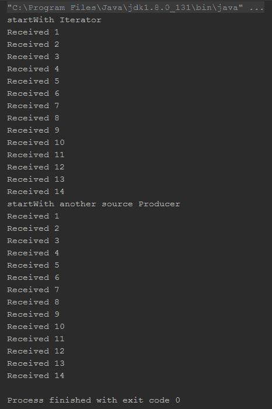

由于我们已经对 `startWith` 操作符有了基本的了解，现在让我们继续学习 `zip` 操作符。`zip` 操作符实现了一种压缩机制来组合生产者。

# 压缩发射 – `zip` 操作符

`zip`操作符非常有趣。想象一下你正在处理多个`Observable`/`Flowables`，并想在每个生产者的每个后续排放上执行某种操作。`zip`操作符允许你正好执行这一点。它通过指定的函数累积多个生产者的排放以创建一个新的排放。所以，让我们通过一个图示来深入了解：

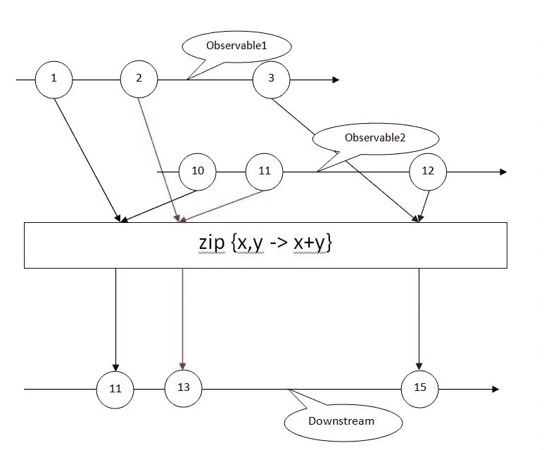

如图片所示，`zip`操作符将多个生产者的排放累积到一个单一的排放中。它还接受一个函数来应用于排放，就像`scan`或`reduce`操作符一样，但它将这些函数应用于来自不同生产者的排放。

为了简化起见，我们在前面的图片和下面的例子中使用了两个`Observable`，但`zip`操作符可以与多达九个`Observables`/`Flowables`一起工作。

考虑以下代码：

```java
    fun main(args: Array<String>) { 
      val observable1 = Observable.range(1,10) 
      val observable2 = Observable.range(11,10) 
      Observable.zip(observable1,observable2,  
      io.reactivex.functions.BiFunction
      <Int, Int, Int> { emissionO1, emissionO2 -> 
      emissionO1+emissionO2 
      }).subscribe { 
          println("Received $it") 
      } 
    } 
```

`zip`操作符定义在`Observable`类的`companion object`（Java 中的`static`方法）中，因此可以直接通过写入`Observable.zip`本身来访问。不需要通过另一个实例来访问。所以，在我们继续之前，让我们看看输出：

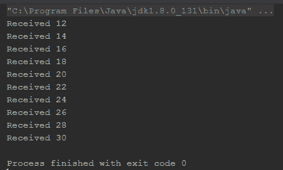

为了更好地理解和使用`zip`操作符，你需要记住以下关于它的要点：

+   `zip`操作符作用于提供的生产者的每个排放。例如，如果你将三个生产者*x*、*y*和*z*传递给`zip`操作符，它将累积*x*的第*n*个排放与*y*和*z*的第*n*个排放。

+   `zip`操作符在应用函数之前等待每个生产者发射。例如，如果你在`zip`操作符中使用`Observable.interval`作为生产者之一，`zip`操作符将等待每个排放，并将累积的值在指定的间隔内发射。

+   如果任何生产者在未发射它所等待的项目的情况下通知`onComplete`或`onError`，那么它将丢弃之后的所有排放，包括来自其他生产者的那个特定排放。例如，如果生产者*x*发射`10`个项目，生产者*y*发射`11`个项目，生产者*z*发射`8`个项目，`zip`操作符将累积来自所有生产者的前`8`个排放，并将丢弃来自生产者*x*和*y*的所有剩余排放。

# `zipWith`操作符

`zip`操作符的实例版本（即函数的副本，应该使用实例而不是静态调用）是`zipWith`，它可以从`Observable`实例本身调用。这个版本唯一的问题是只能传递另一个源`Observable`。如果你需要与三个或更多的`Observable`实例一起工作，你最好考虑使用`zip`操作符而不是`zipWith`。

这里有一个例子：

```java
    fun main(args: Array<String>) { 
      val observable1 = Observable.range(1,10) 
      val observable2 = listOf("String 1","String 2","String 3",
      "String 4","String 5","String 6","String 7","String 8",
      "String 9","String 10").toObservable() 

      observable1.zipWith(observable2,{e1:Int,e2:String -> 
      "$e2 $e1"})//(1) 
        .subscribe { 
            println("Received $it") 
        } 
    }
```

输出如下：

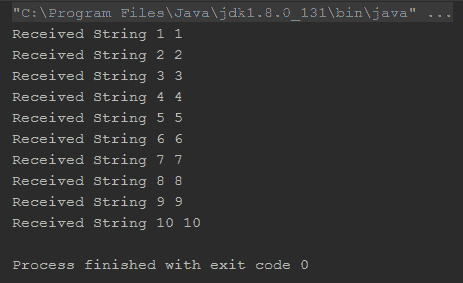

在注释`(1)`中，我们在`Observable`实例`observable1`上使用了`zipWith`操作符，并将另一个`Observable`实例`observable2`传递给它，使用 lambda 表达式来应用发射。从输出中，我们可以看出`zipWith`操作符累积了它订阅的生产者以及它提供给生产者的生产者。

# combineLatest 操作符

`combineLatest`操作符的工作方式与`zip`操作符类似。它累积提供的生产者的发射。`combineLatest`和`zip`之间的唯一区别是，`zip`操作符等待其每个源生产者发射，然后才开始处理所有发射以创建其新的发射，但`combineLatest`操作符在接收到其源生产者中的任何一个发射后立即开始。

为了更好地理解这个操作符，我们将通过`zip`和`combineLatest`操作符的例子来展示。让我们首先尝试使用`zip`操作符的例子，因为我们已经对其有所了解：

```java
    fun main(args: Array<String>) { 
      val observable1 =  
      Observable.interval(100,TimeUnit.MILLISECONDS)//(1) 
      val observable2 =
      Observable.interval(250,TimeUnit.MILLISECONDS)//(2) 

      Observable.zip(observable1,observable2, 
        BiFunction { t1:Long, t2:Long -> "t1: $t1, t2: $t2" })//(3) 
        .subscribe{ 
           println("Received $it") 
        } 

       runBlocking { delay(1100) } 
    } 
```

输出如下。正如预期的那样，它累积了每一个发射并打印出来：

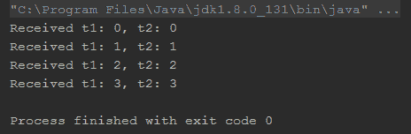

在这个程序中，我们在注释`(1)`中创建了一个具有 100 毫秒间隔的`Observable`。在注释`(2)`中，我们创建了一个具有`250`毫秒间隔的另一个`Observable`。在输出中，我们可以看到有`3`个发射，因为，在压缩后，总间隔变为`350`毫秒，在 1,100 毫秒的延迟内，只有`3`个发射，它们之间有`350`毫秒的间隔。

现在，让我们用`combineLatest`测试相同的代码：

```java
    fun main(args: Array<String>) { 
      val observable1 = Observable.interval(100, TimeUnit.MILLISECONDS) 
      val observable2 = Observable.interval(250, TimeUnit.MILLISECONDS) 

      Observable.combineLatest(observable1,observable2, 
        BiFunction { t1:Long, t2:Long -> "t1: $t1, t2: $t2" }) 
        .subscribe{ 
           println("Received $it") 
        } 

        runBlocking { delay(1100) } 
    }
```

下面是输出：

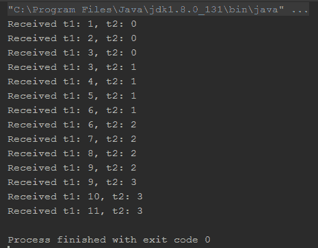

如输出所示，`combineLatest`操作符在接收到其源生产者中的任何一个发射后立即处理并发射值，对于所有其他源生产者使用最后一个发射的值。

现在，让我们在`merge`操作符的帮助下继续合并生产者。

# 合并 Observables/Flowables – merge 操作符

压缩操作将允许你累积发射，但如果你想要订阅所有源生产者的每一个发射呢？比如说，你有两个不同的生产者，并且当订阅它们时应用相同的动作集；没有方法可以混合命令式编程和响应式编程，并使用相同的代码分别单独订阅两个生产者。这也会导致代码冗余。那么，这里的解决方案是什么？你答对了；将所有源生产者的发射合并在一起，并作为一个整体来订阅就是解决方案。

因此，让我们在这里举一个例子：

```java
    fun main(args: Array<String>) { 
      val observable1 = listOf("Kotlin", "Scala",
      "Groovy").toObservable() 
      val observable2 = listOf("Python", "Java", "C++",
      "C").toObservable() 

      Observable 
       .merge(observable1,observable2)//(1) 
       .subscribe { 
          println("Received $it") 
       } 
    } 
```

在这个程序中，在注释`(1)`中，我们将合并两个`observable`并作为一个整体来订阅它们。输出如下：

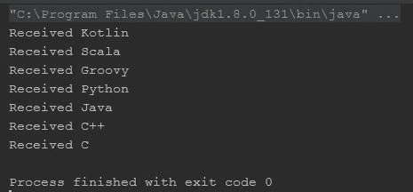

如输出所示，`merge`操作符合并了两个`Observables`，并将两个`Observables`的发射按照发射顺序放置。

然而，合并操作并不保持指定的顺序；相反，它将立即开始监听所有提供的生产者，并在它们从源处发出时立即触发排放。让我们看看一个说明这一点的例子：

```java
    fun main(args: Array<String>) { 
      val observable1 = Observable.interval(500,  
      TimeUnit.MILLISECONDS).map { "Observable 1 $it" }//(1) 
      val observable2 = Observable.interval(100,
      TimeUnit.MILLISECONDS).map { "Observable 2 $it" }//(2) 

      Observable 
        .merge(observable1,observable2) 
        .subscribe { 
          println("Received $it") 
        } 
        runBlocking { delay(1500) } 
     }
```

在前面的例子中，在注释（1）和（2）中，我们使用`Observable.interval`操作符创建了两个`Observable<Long>`实例，然后使用`Observable`编号进行映射，得到了`Observable<String>`的实例。这里`map`操作符的目标是在输出中注入一个`Observable`标识，这样我们就可以轻松地从合并输出中识别`Observable`的来源。

所以，这里就是大家讨论了很多的输出：

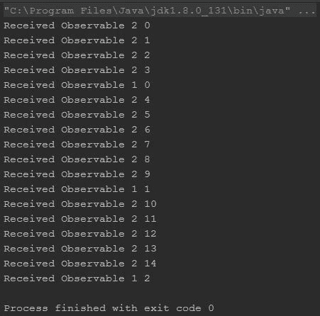

输出清楚地显示，`merge`操作符首先从`observable2`中获取排放，因为它们先到达，尽管我们在`merge`操作符中首先放置了`observable1`。

然而，`merge`操作符支持多达四个参数。作为一个后备方案，我们有`mergeArray`操作符，它接受`vararg`的`Observable`；以下是一个例子：

```java
    fun main(args: Array<String>) { 
      val observable1 = listOf("A", "B", "C").toObservable() 
      val observable2 = listOf("D", "E", "F", "G").toObservable() 
      val observable3 = listOf("I", "J", "K", "L").toObservable() 
      val observable4 = listOf("M", "N", "O", "P").toObservable() 
      val observable5 = listOf("Q", "R", "S", "T").toObservable() 
      val observable6 = listOf("U", "V", "W", "X").toObservable() 
      val observable7 = listOf("Y", "Z").toObservable() 

      Observable.mergeArray(observable1, observable2, observable3, 
        observable4, observable5, observable6, observable7) 
        .subscribe { 
           println("Received $it") 
        } 
    }
```

输出如下：

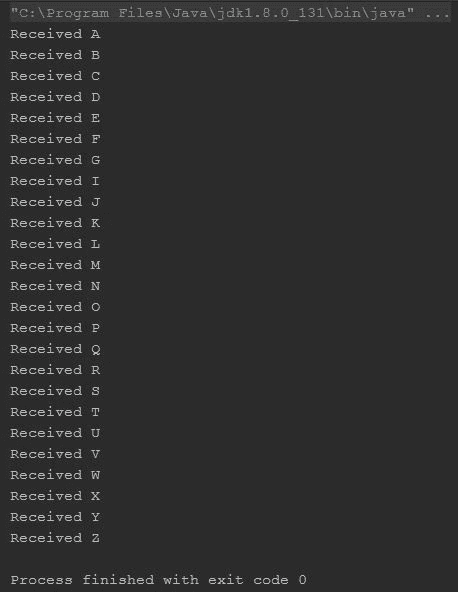

与`zip`操作符一样，`merge`操作符也有一个用于调用`Observable`实例的版本，而不是静态的`mergeWith`；我们可以在`Observable`实例上调用此操作符。所以，让我们看看一个例子：

```java
    fun main(args: Array<String>) { 
      val observable1 = listOf("Kotlin", "Scala",
      "Groovy").toObservable() 
      val observable2 = listOf("Python", "Java", "C++",
      "C").toObservable() 

       observable1 
         .mergeWith(observable2) 
         .subscribe { 
            println("Received $it") 
         } 
    } 
```

程序很简单。我们创建了两个`Observable`实例，然后使用在`observable1`实例上调用的`mergeWith`操作符将`observable1`与`observable2`合并。

输出如下：

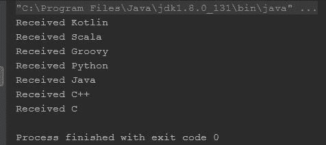

合并的字面意思是将两件事物结合起来创造一个新的事物，不考虑任何顺序；所有合并操作符都做同样的事情。如果你想保持顺序，你必须一个接一个地连接。

# 连接生产者（Observable/Flowable）

连接操作符几乎与`merge`操作符相同，除了连接操作符尊重规定的顺序。它不会一次性订阅所有提供的生产者，而是逐个订阅生产者；只有当它从前一个订阅中收到`onComplete`后，才会这样做。

因此，让我们使用`concatenate`操作符修改我们最后的程序，看看变化：

```java
    fun main(args: Array<String>) { 
      val observable1 = Observable.interval(500, TimeUnit.MILLISECONDS) 
        .take(2)//(1) 
        .map { "Observable 1 $it" }//(2) 
      val observable2 = Observable.interval(100,
      TimeUnit.MILLISECONDS).map { "Observable 2 $it" }//(3) 

     Observable 
       .concat(observable1,observable2) 
       .subscribe { 
          println("Received $it") 
       } 

      runBlocking { delay(1500) } 
    } 
```

正如我们之前提到的，`concat`操作符只有在从当前源`Observable`收到`onComplete`后才会订阅队列中的下一个源`Observable`；我们也知道使用`Observable.interval`创建的`Observable`实例永远不会发出`onComplete`。相反，它们会一直发出数字，直到达到`Long.MAX_VALUE`。因此，作为一个快速修复，我们在注释（1）上使用了`take`操作符，它将从`Observable.interval`中取出前两个排放，然后向其中添加一个`onComplete`通知，这样`concat`操作符也可以开始监听下一个源`Observable`。

我们在本章的 *跳过和获取发射* 部分讨论了 `take` 操作符。别忘了看看。

因此，以下是输出结果：

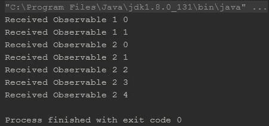

从输出中，我们可以清楚地看到，`concat` 操作符仅在从其第一个 `Observable` 收到 `onComplete` 通知后，才订阅下一个提供的源 `Observable`。

就像 `merge` 操作符一样，`concat` 操作符也有 `concatArray` 和 `concatWith` 变体，它们几乎以相同的方式工作，只是连接而不是合并。

# 模糊组合生产者

生产者的模糊组合可能是所有组合类型中最简单的一种。想象一下，你正在从两个数据源（可能是两个不同的 API 或数据库表）获取数据，并希望使用你得到的第一份数据并丢弃其他数据。在命令式编程技术中，你可能需要编写检查来处理这种情况；然而，使用 RxKotlin，`amb` 操作符就在那里为你提供支持。

`amb` 操作符接受一个 `Observable` 列表（`Iterable<Observable>` 实例）作为参数，订阅 `Iterable` 实例中存在的所有 `Observable`，从它接收到的第一个 `Observable` 发射的项目，并丢弃 `Iterable` 实例上存在的其余 `Observable`。

以下示例将帮助我们更好地理解：

```java
    fun main(args: Array<String>) { 
      val observable1 = Observable.interval(500, 
      TimeUnit.MILLISECONDS).map { "Observable 1 $it" }//(1) 
      val observable2 = Observable.interval(100,
      TimeUnit.MILLISECONDS).map { "Observable 2 $it" }//(2) 

      Observable 
        .amb(listOf(observable1,observable2))//(3) 
        .subscribe { 
            println("Received $it") 
         } 

         runBlocking { delay(1500) } 
    } 
```

因此，在这个程序中，我们在注释 `(1)` 和 `(2)` 分别创建了两个具有 `500` 毫秒和 `100` 毫秒间隔的 `Observable`。在注释 `(3)` 中，我们使用了 `listOf` 函数从这两个 `Observable` 创建了一个 `List<Observable>`，并将其传递给了 `amb` 操作符。以下是输出结果：

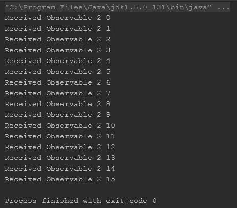

从输出中我们可以看到，`amb` 操作符从 `observable2` 中获取了发射项，并不关心 `observable1`，因为 `observable2` 实例先发射了。

就像其他组合操作符一样，`amb` 也有 `ambArray` 和 `ambWith` 操作符变体。

# 分组

分组是使用 RxKotlin 可以实现的一种强大操作。这个操作允许你根据它们的属性对发射项进行分组。比如说，你有一个发射整数数字（`Int`）的 `Observable` / `Flowable`，根据你的业务逻辑，你为偶数和奇数有一些单独的代码，并希望分别处理它们。在这种情况下，分组是最好的解决方案。

让我们举一个例子：

```java
    fun main(args: Array<String>) { 
      val observable = Observable.range(1,30) 

      observable.groupBy {//(1) 
        it%5 
      }.blockingSubscribe {//(2) 
        println("Key ${it.key} ") 
        it.subscribe {//(3) 
            println("Received $it") 
        } 
      } 
    } 
```

在这个例子中，我根据它们除以 `5` 的余数对发射项进行了分组，所以，基本上应该有 `5` 组（从 `0` 到 `4`）。在这个例子的注释 `(1)` 中，我们使用了 `groupBy` 操作符并将其传递给一个谓词，根据这个谓词进行分组。`groupBy` 操作符根据谓词的结果对发射项进行分组。

在此示例的注释`(2)`中，我们使用了`blockingSubscribe`操作符来订阅新创建的`Observable<GroupedObservable<K, T>>`实例。我们也可以使用简单的`subscribe`操作符；然而，由于我们将输出打印到控制台，使用`subscribe`会使一切看起来都很混乱。主要是因为`subscribe`操作符在接收下一个排放之前不会等待给定的任务完成。另一方面，`blockingSubscribe`将使程序等待直到它完成处理一个排放，然后才会进行下一个。

`groupBy`操作符返回包含我们的组的`Observable`，因此，在`blockingSubscribe`内部，我们需要订阅发出的`GroupedObservable`实例。在注释`(3)`中，我们做了同样的事情，在打印发出`GroupedObservable`实例的`key`之后。

输出如下：

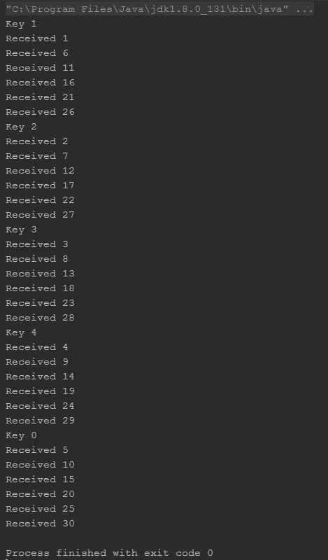

# `flatMap`，`concatMap` – 详细说明

如前一章所承诺的，现在我们将更深入地探讨`flatMap`和`concatMap`操作符，因为我们已经对`merge`和`concat`操作符有了某种程度的了解，并且知道它们之间的区别。

让我们从`flatMap`和`concatMap`之间的区别开始，之后，我们还将讨论它们的理想实现场景。我们还将讨论它们的一些变体，以便更好地了解它们。

在前一章中，我们提到`flatMap`内部使用`merge`操作符，而`concatMap`内部使用`concat`操作符。然而，这有什么区别呢？你刚刚学习了`merge`和`concat`操作符之间的区别，但是基于它们有两个独立的映射操作符有什么意义呢？所以，让我们从一个例子开始。我们将看到一个使用`flatMap`的例子，然后我们将尝试使用`concatMap`实现相同的操作：

```java
    fun main(args: Array<String>) { 
      Observable.range(1,10) 
        .flatMap { 
            val randDelay = Random().nextInt(10) 
            return@flatMap Observable.just(it) 

           .delay(randDelay.toLong(),TimeUnit.MILLISECONDS)//(1) 
         } 
         .blockingSubscribe { 
            println("Received $it") 
         } 
    } 
```

在前面的程序中，我们创建了一个`Observable`实例。然后，我们在它上面使用`flatMap`操作符和`delay`操作符来为排放添加随机延迟。

输出如下：

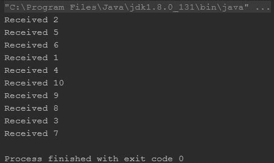

从输出中，我们可以看到下游没有按照规定的顺序接收排放；我想你已经找到了原因，不是吗？没错；背后的原因是简单的`merge`操作符，因为`merge`操作符异步地一次性订阅和重新发射排放，因此顺序没有得到保持。

现在，让我们使用`concatMap`操作符来实现代码：

```java
    fun main(args: Array<String>) { 
      Observable.range(1,10) 
         .concatMap { 
             val randDelay = Random().nextInt(10) 
             return@concatMap Observable.just(it) 
            .delay(randDelay.toLong(), TimeUnit.MILLISECONDS)//(1) 
          } 
         .blockingSubscribe { 
             println("Received $it") 
          } 
     } 
```

输出如下：

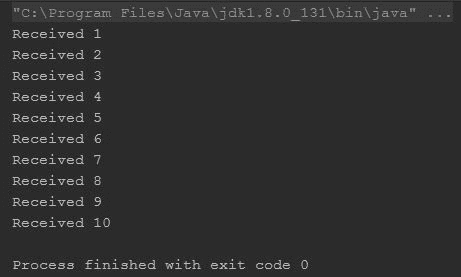

由于`concatMap`操作符内部使用`concat`，它保持了规定的排放顺序。

那么，何时使用哪个操作符呢？让我们看看以下实时场景；所有这些场景都适用，尤其是在你构建应用程序时。

# 何时使用`flatMap`操作符

看看以下列表——它包含了`flatMap`最适合的上下文和情况：

+   当你在页面、活动或片段中处理数据列表，并希望为列表中的每一项发送数据到服务器或数据库时。`concatMap`操作符在这里也会这样做；然而，由于`flatMap`操作符是异步的，它将更快，而且，由于你正在发送数据，顺序实际上并不重要。

+   当你想要在相对较短的时间内异步地对列表项执行任何操作时。

# 何时使用`concatMap`操作符

那么，何时使用`concatMap`？

以下列表包含`concatMap`最适合的上下文和情况：

+   当你正在下载要显示给用户的列表数据时。这里的顺序真的很重要，你当然不希望在不显示第三和第四项之后加载并显示列表的第二项，对吧？

+   在有序列表上执行一些操作，确保列表保持不变。

# 理解`switchMap`操作符

`switchMap`操作符非常有趣。它异步监听源生产者（Observable/Flowable）的所有发射，但只发射时间段内的最新项。让我们进一步解释一下。

当源`Observable`在`switchMap`发射任何项之前连续发射多个项时，`switchMap`将只取最后一个，并丢弃任何介于其间的发射。让我们通过一个例子来更好地理解它：

```java
    fun main(args: Array<String>) { 
      println("Without delay") 
      Observable.range(1,10) 
      .switchMap { 
         val randDelay = Random().nextInt(10) 
         return@switchMap Observable.just(it)//(1) 
       } 
       .blockingSubscribe { 
          println("Received $it") 
        } 
       println("With delay") 
       Observable.range(1,10) 
       .switchMap { 
          val randDelay = Random().nextInt(10) 
          return@switchMap Observable.just(it) 
          .delay(randDelay.toLong(), TimeUnit.MILLISECONDS)//(2) 
       } 
       .blockingSubscribe { 
          println("Received $it") 
       } 
    } 
```

输出如下：

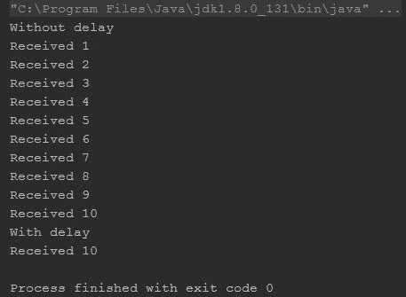

在程序中，我们最初采取了两种方法，我们使用了`delay`操作符，然后我们用`delay`操作符重用了同样的方法。从输出中我们可以看到，对于第二种情况，`switchMap`只发射了最后一个项，因为它在重新发射之前收到了连续的发射。然而，对于第一种情况，它在收到任何进一步的发射之前重新发射了所有项。

仍然感到困惑？让我们进一步修改程序：

```java
    fun main(args: Array<String>) { 
      Observable.range(1,10) 
        .switchMap { 
           val randDelay = Random().nextInt(10) 
           if(it%3 == 0) 
               Observable.just(it) 
           else 
               Observable.just(it) 
               .delay(randDelay.toLong(), TimeUnit.MILLISECONDS) 
         } 
         .blockingSubscribe { 
             println("Received $it") 
         } 
    } 
```

在这个程序中，我们不是对所有发射添加延迟，而是立即发射所有能被`3`整除的数字，并对其余的添加延迟。

输出如下：

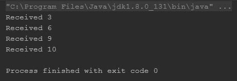

如预期，`switchMap`操作符只发射了那些在源操作符无延迟发射的项，以及源操作符最后发射的项。原因很简单；`switchMap`操作符在接收到下一个项之前就已经能够发射它们。

# 跳过和取发射

就像本章前面使用`take`操作符的情况一样，通常有一些场景，你希望取一些发射并跳过其余的。`skip`和`take`操作符在这些场景中非常有帮助。它们实际上是我们在上一章讨论的过滤操作符的一部分；然而，坦白说，它们确实值得专门的讨论。所以，这就是。

# 跳过发射（skip、skipLast、skipUntil 和 skipWhile）

可能会有这样的需求，你希望跳过开始的一些发射，或者跳过发射直到满足特定条件。你可能甚至需要等待另一个生产者发射后再获取发射并跳过所有剩余的发射。

这些操作符是根据具体场景设计的。它们以各种方式帮助你跳过发射。

RxKotlin 为我们提供了`skip`操作符的许多变体和重载；我们将讨论其中最重要的几个：

+   `skip`

+   `skipLast`

+   `skipWhile`

+   `skipUntil`

我们将逐一查看所有列出的前述操作符。

让我们从`skip`开始：

```java
    fun main(args: Array<String>) { 
      val observable1 = Observable.range(1,20) 
      observable1 
      .skip(5)//(1) 
      .subscribe(object:Observer<Int> { 
         override fun onError(e: Throwable) { 
            println("Error $e") 
         } 

         override fun onComplete() { 
            println("Complete") 
         } 

         override fun onNext(t: Int) { 
            println("Received $t") 
         } 

         override fun onSubscribe(d: Disposable) { 
            println("starting skip(count)") 
         } 

     }) 

     val observable2 = Observable.interval(100,TimeUnit.MILLISECONDS) 
     observable2 
        .skip(400,TimeUnit.MILLISECONDS)//(2) 
        .subscribe( 
            object:Observer<Long> { 
               override fun onError(e: Throwable) { 
                 println("Error $e") 
               } 

               override fun onComplete() { 
                 println("Complete") 
               } 

               override fun onNext(t: Long) { 
                  println("Received $t") 
               } 

               override fun onSubscribe(d: Disposable) { 
                  println("starting skip(time)") 
               } 

            } 
           ) 

           runBlocking { 
             delay(1000) 
           } 

    } 
```

`skip`操作符有两个重要的重载：`skip(count:Long)`和`skip(time:Long, unit:TimeUnit)`；第一个重载基于计数，丢弃前*n*个发射，而第二个重载基于时间，丢弃在指定时间间隔内到达的所有发射。

在这个程序中，在注释（1）处，我们使用了`skip(count)`操作符来跳过前`5`次发射。在注释（2）处，我们使用了`skip(time,unit)`操作符来跳过订阅前`400`毫秒（4 秒）内的所有发射。

下面是输出：

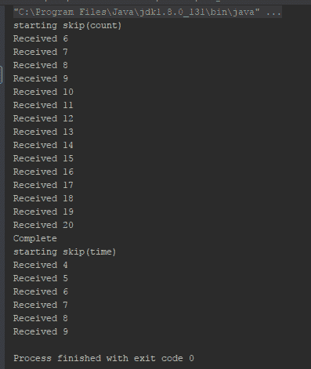

现在，让我们看看`skipLast`操作符是如何工作的：

```java
    fun main(args: Array<String>) { 
      val observable = Observable.range(1,20) 
      observable 
       .skipLast(5)//(1) 
       .subscribe(object: Observer<Int> { 
         override fun onError(e: Throwable) { 
           println("Error $e") 
         } 

         override fun onComplete() { 
           println("Complete") 
         } 

         override fun onNext(t: Int) { 
            println("Received $t") 
         } 

         override fun onSubscribe(d: Disposable) { 
            println("starting skipLast(count)") 
         } 

       }) 
    } 
```

`skipLast`操作符有多个重载，就像`skip`操作符一样。唯一的区别是，这个操作符会丢弃最后的发射。在这个程序中，我们在注释（1）处使用了`skipLast(count)`操作符来跳过最后的`5`次发射。

下面是输出：

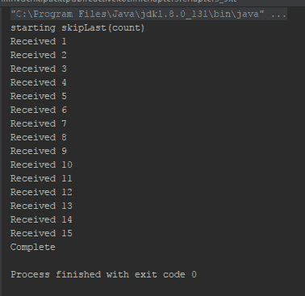

与`skip`和`skipLast`不同，这两个操作符都是基于计数或时间来跳过发射，而`skipWhile`是基于谓词（逻辑表达式）来跳过发射。你需要向`skipWhile`操作符传递一个谓词，就像`filter`操作符一样。它会在谓词评估为 true 时继续跳过发射。一旦谓词返回 false，它将开始将所有发射传递到下游。让我们看看以下代码片段：

```java
    fun main(args: Array<String>) { 
      val observable = Observable.range(1,20) 
      observable 
       .skipWhile {item->item<10}//(1) 
       .subscribe(object: Observer<Int> { 
          override fun onError(e: Throwable) { 
            println("Error $e") 
          } 

          override fun onComplete() { 
            println("Complete") 
          } 

          override fun onNext(t: Int) { 
            println("Received $t") 
          } 

          override fun onSubscribe(d: Disposable) { 
             println("starting skipWhile") 
          } 

        }) 
    } 
```

输出如下：

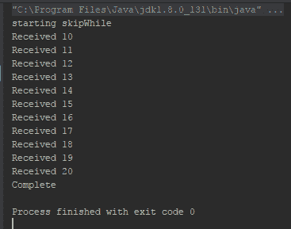

注意，与 filter 不同，`skipWhile`操作符会执行谓词直到它返回 false，并传递所有后续的发射。如果你想检查所有发射的谓词，你更应该考虑`filter`操作符。

想象一个场景，你正在处理两个生产者，producer1 和 producer2，并且希望在 producer2 开始发射时立即开始处理 producer1 的发射。在这种情况下，`skipUntil`可以帮助你。让我们看看这个例子：

```java
    fun main(args: Array<String>) { 
      val observable1 = Observable.interval(100, TimeUnit.MILLISECONDS) 
      val observable2 =
      Observable.timer(500,TimeUnit.MILLISECONDS)//(1) 

      observable1 
        .skipUntil(observable2)//(2) 
        .subscribe( 
           object: Observer<Long> { 
             override fun onError(e: Throwable) { 
                println("Error $e") 
             } 

             override fun onComplete() { 
                println("Complete") 
            } 

            override fun onNext(t: Long) { 
               println("Received $t") 
            } 

            override fun onSubscribe(d: Disposable) { 
               println("starting skip(time)") 
            } 

          } 
         ) 

         runBlocking { delay(1500) } 
    }
```

我们将解释代码，但首先看看输出：

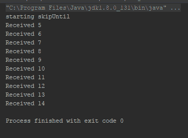

在注释`(1)`中，我们使用`Observable.timer`创建了一个`Observable`实例(`observable2`)，它应该在`500`毫秒后触发发射。在注释`(2)`中，我们使用那个`Observable`实例(`observable2`)作为`skipUntil`操作符的参数，这将使它丢弃`observable1`的所有发射，直到`observable2`发射。

# 取操作符（take、takeLast、takeWhile 和 takeUntil）

`take`操作符与`skip`操作符正好相反。让我们逐个举例说明，了解它们是如何工作的：

```java
    fun main(args: Array<String>) { 
      val observable1 = Observable.range(1,20) 
      observable1 
        .take(5)//(1) 
        .subscribe(object:Observer<Int> { 
           override fun onError(e: Throwable) { 
              println("Error $e") 
          } 

          override fun onComplete() { 
              println("Complete") 
          } 

          override fun onNext(t: Int) { 
              println("Received $t") 
          } 

          override fun onSubscribe(d: Disposable) { 
              println("starting skip(count)") 
          } 

       }) 

      val observable2 = Observable.interval(100,TimeUnit.MILLISECONDS) 
      observable2 
         .take(400,TimeUnit.MILLISECONDS)//(2) 
         .subscribe( 
            object:Observer<Long> { 
               override fun onError(e: Throwable) { 
                  println("Error $e") 
               } 

               override fun onComplete() { 
                  println("Complete") 
               } 

               override fun onNext(t: Long) { 
                  println("Received $t") 
               } 

               override fun onSubscribe(d: Disposable) { 
                  println("starting skip(time)") 
               } 

             } 
           ) 

           runBlocking { 
             delay(1000) 
           } 

     }
```

这个程序几乎和带有`skip`的程序一样。区别在于这里，我们使用了`take`而不是`skip`。让我们检查一下差异，以便更好地理解：

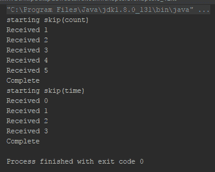

输出清楚地显示了这一点。与`skip`操作符正好相反，`take`操作符将指定的发射传递给下游，并丢弃剩余的。最重要的是，它还在其完成传递所有指定的发射后，向下游发送`onComplete`通知。

让我们用`takeLast`操作符来测试一下：

```java
    fun main(args: Array<String>) { 
      val observable = Observable.range(1,20) 
      observable 
        .takeLast(5)//(1) 
        .subscribe(object: Observer<Int> { 
           override fun onError(e: Throwable) { 
             println("Error $e") 
           } 

           override fun onComplete() { 
             println("Complete") 
           } 

           override fun onNext(t: Int) { 
             println("Received $t") 
           } 

           override fun onSubscribe(d: Disposable) { 
             println("starting skipLast(count)") 
           } 

        }) 
    } 
```

然后，这里是输出；它打印了排放中的最后`5`个数字：

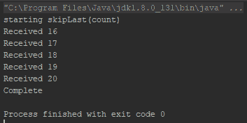

现在看看`takeWhile`：

```java
    fun main(args: Array<String>) { 
      val observable = Observable.range(1,20) 
      observable 
        .takeWhile{item->item<10}//(1) 
        .subscribe(object: Observer<Int> { 
            override fun onError(e: Throwable) { 
              println("Error $e") 
            } 

            override fun onComplete() { 
              println("Complete") 
            } 

            override fun onNext(t: Int) { 
              println("Received $t") 
            } 

            override fun onSubscribe(d: Disposable) { 
               println("starting skipWhile") 
            } 

          }) 
    }
```

输出与`skipWhile`正好相反；它不是跳过前`10`个数字，而是打印它们并丢弃剩余的：

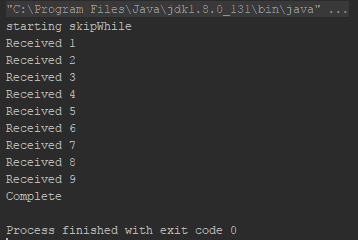

# 错误处理操作符

在开发应用程序时，可能会发生错误。我们必须正确处理这些错误，以确保我们的应用程序在用户端无缝运行。以下程序为例：

```java
    fun main(args: Array<String>) { 
      Observable.just(1,2,3,4,5) 
        .map { it/(3-it) } 
        .subscribe { 
           println("Received $it") 
        } 
    }
```

这里是输出：

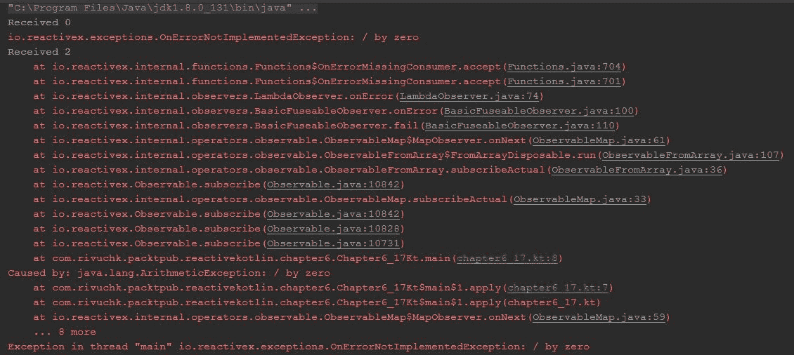

如预期，程序抛出了错误，如果这种情况发生在用户端，那将是一件坏事。所以，让我们看看我们如何以响应式的方式处理错误。RxKotlin 为我们提供了一些错误处理操作符，我们将查看它们。我们将使用之前的程序并将各种错误处理操作符应用到它们上，以便更好地理解它们。

# onErrorReturn – 在错误发生时返回默认值

`onErrorReturn`为你提供了一个技术，以便在上游发生错误时指定一个默认值返回给下游。看看下面的代码片段：

```java
    fun main(args: Array<String>) { 
      Observable.just(1,2,3,4,5) 
        .map { it/(3-it) } 
        .onErrorReturn { -1 }//(1) 
        .subscribe { 
           println("Received $it") 
        } 
    }
```

我们使用`onErrorReturn`操作符在发生错误时返回`-1`。输出如下：

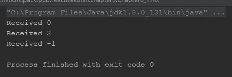

如输出所示，`onErrorReturn`操作符返回指定的默认值。由于上游在发生错误后停止发射项目，下游没有接收到任何其他项目。

如我们之前提到的，`onError`和`onComplete`都是终端操作符，所以一旦它接收了它们中的任何一个，下游就停止监听上游。

# onErrorResumeNext 操作符

`onErrorResumeNext` 操作符可以帮助你在发生任何错误时订阅不同的生产者。

这里是一个例子：

```java
    fun main(args: Array<String>) { 
      Observable.just(1,2,3,4,5) 
        .map { it/(3-it) } 
        .onErrorResumeNext(Observable.range(10,5))//(1) 
        .subscribe { 
           println("Received $it") 
        } 
   }
```

输出如下：

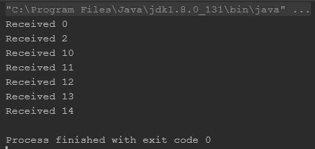

这个操作符在你想在发生任何错误时订阅另一个源生产者时特别有用。

# 错误重试

`retry` 操作符是另一个错误处理操作符，它允许你在发生错误时重新尝试/重新订阅相同的生产者。你只需要提供一个谓词或重试限制，以确定何时停止重试。所以，让我们看看一个例子：

```java
    fun main(args: Array<String>) { 
      Observable.just(1,2,3,4,5) 
        .map { it/(3-it) } 
        .retry(3)//(1) 
        .subscribeBy ( 
            onNext  = {println("Received $it")}, 
            onError = {println("Error")} 
         ) 
         println("\n With Predicate \n") 
        var retryCount = 0 
        Observable.just(1,2,3,4,5) 
        .map { it/(3-it) } 
        .retry {//(2) 
           _, _-> 
           (++retryCount)<3 
        } 
        .subscribeBy ( 
           onNext  = {println("Received $it")}, 
           onError = {println("Error")} 
        ) 
    }
```

在注释 `(1)` 中，我们使用了一个带有重试限制的 `retry` 操作符，在注释 `(2)` 中，我们使用了一个带有谓词的 `retry` 操作符。`retry` 操作符将一直重试，直到谓词返回 true，并且每当谓词返回 false 时，都会将错误传递到下游。

这里是输出：

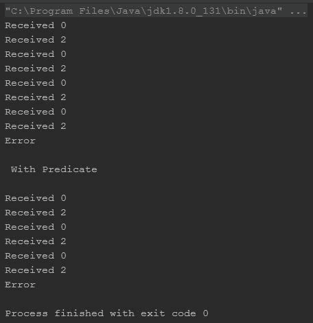

# HTTP 示例

任何学习只有在将其应用于实时场景之后才算完整。到目前为止，你已经学习了响应式编程的许多概念。现在，是时候将它们应用于现实世界的场景了，我们将使用 API 通过 HTTP 请求获取一些数据，并将响应数据打印到控制台。

我们为这个例子使用了一个额外的插件——`RxJava-Apache-HTTP`。如果你使用 Gradle 作为构建工具，请添加以下依赖项：

```java
    //RxJava - Apache - HTTP 
    compile "com.netflix.rxjava:rxjava-apache-http:0.20.7" 
```

这里是代码：

```java
    fun main(args: Array<String>) { 
      val httpClient = HttpAsyncClients.createDefault()//(1) 
      httpClient.start()//(2) 
      ObservableHttp.createGet("http://rivuchk.com/feed/json",
      httpClient).toObservable()//(3) 
        .flatMap{ response -> 
           response.content.map{ bytes -> 
           String(bytes) 
         }//(4) 
       } 
       .onErrorReturn {//(5) 
          "Error Parsing data " 
       } 
       .subscribe { 
          println(it)//(6) 
          httpClient.close()//(7) 
       } 
    }  
```

在这个程序中，我们使用 `HttpAsyncClients.createDefault()` 获取 `CloseableHttpAsyncClient` 的实例。在开始 HTTP 请求之前，我们首先需要启动客户端。我们在注释 `(2)` 中的代码中这样做，使用 `httpClient.start()`。在注释 `(3)` 中，我们创建了一个 GET 请求并将其转换为类型为 `ObservableHttpResponse` 的可观察对象，因此我们使用了 `flatMap` 操作符来访问响应的内容。在 `flatMap` 操作符内部，我们在注释 `(4)` 中使用 `map` 操作符将字节响应转换为 `String`。

在注释 `(5)` 中，我们使用了 `onErrorReturn` 操作符来返回一个默认的 `String`，以防出现错误。

最后，在 `onErrorReturn` 操作符之后，我们订阅了链，并在注释 `(6)` 中打印了响应。我们一完成响应，就关闭了 `httpClient`。

下面的部分是输出截图：

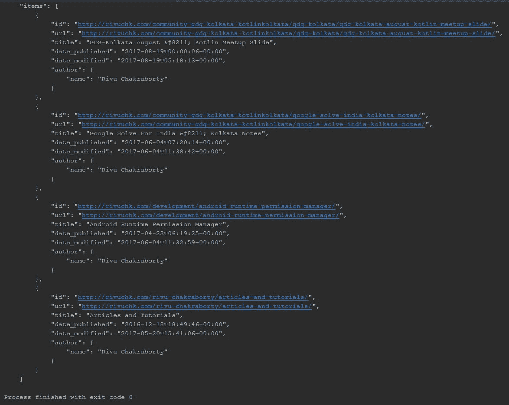

# 摘要

这是一个相当长的章节。你学习了如何组合生产者，并深入了解了 `flatMap`、`concatMap` 和 `switchMap` 操作符。你了解了 `take` 和 `skip` 操作符及其变体。你学习了响应式编程中的错误处理方法。我们还尝试了一个 HTTP 客户端示例，其中我们请求 API 获取 JSON 数据并将其打印到控制台。我们没有尝试解析 JSON 数据，因为这可能会增加这一级别的复杂性。在本书的后面部分，我们肯定会解析数据并正确显示。

虽然第五章，“异步数据操作符和转换”更多地涉及操作符，但下一章第七章，“使用调度器的 RxKotlin 并发和并行处理”主要关注调度器、处理并发和多线程，我们将更深入地探讨使用 RxKotlin 的异步编程。随着我们通过这本书逐渐过渡到更高级的主题和章节，你需要更加关注每一章，以便正确掌握 Kotlin 中反应式编程的各个方面。

那么，你还在等什么？翻到下一页，第七章，“使用调度器的 RxKotlin 并发和并行处理”正在等待着你。
