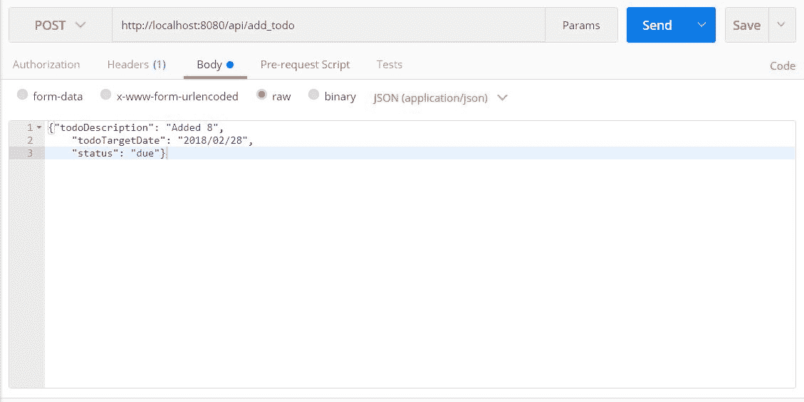
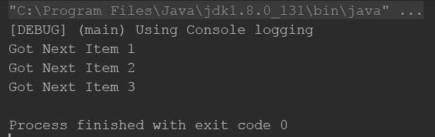
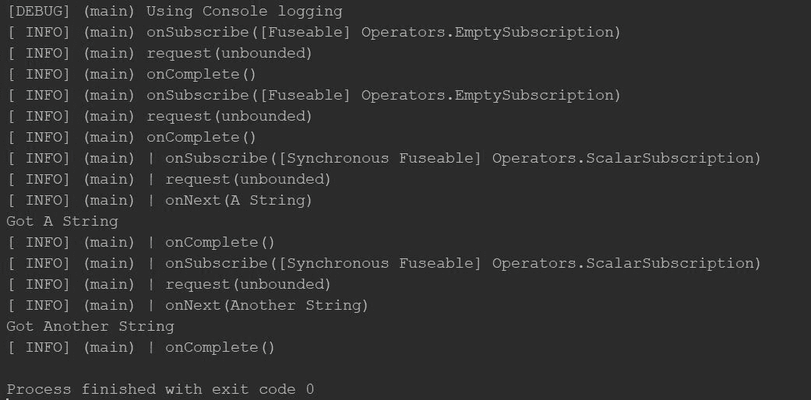

# 第十一章：使用 Spring JPA 和 Hibernate 的 REST APIs

在上一章中，我们学习了如何轻松地创建 REST API。我们学习了如何利用 Spring、Hibernate 和 JPA 的力量，用一行代码就能创建 REST API。那些是强大的 REST API，但它们不是反应式的。本书的主要关注点是教您如何使一切具有反应性，并教您如何创建非阻塞的应用程序和 API。

那么，让我们继续前进。让我们使我们的 REST API 具有反应性。由于 Spring 的强大功能，这一章将会很短。我们将涵盖以下主题：

+   Spring Boot 与 JPA 和 Hibernate

+   使用 Reactor 进行反应式编程

那么，让我们开始使用 Reactor 框架吧。

# 使用 Spring Boot、Hibernate 和 JPA 的 REST API

在上一章中，我们看到了如何创建静态的 RESTful API。现在，我们将学习如何根据 API 请求操作数据库记录。我在这个项目中使用了 MySQL 作为数据库。

在这个项目中，我们将使用 JPA。您可以启动一个新的项目，并将 JPA 作为其中一个依赖项添加。或者，您可以将此添加到您的 Gradle 依赖项列表中：

```java
    compile('org.springframework.boot:spring-boot-starter-data-jpa') 
```

注意：您不需要在此处放置版本和工件，它们将由 Spring Gradle 插件和 Spring Boot 自动管理。

现在，由于您添加了依赖项，您必须添加 `application.properties` 文件。转到资源文件夹，添加一个名为 `application.properties` 的文件，并包含以下内容：

```java
    ## Spring DATASOURCE (DataSourceAutoConfiguration &    
    DataSourceProperties) 
    spring.datasource.url = jdbc:mysql://localhost:3306/tododb 
    spring.datasource.username = root 
    spring.datasource.password = password 

    ## Hibernate Properties 

    # The SQL dialect makes Hibernate generate better
    SQL for the chosen database 
    spring.jpa.properties.hibernate.dialect =    
    org.hibernate.dialect.MySQL5Dialect 

    # Hibernate ddl auto (create, create-drop, validate, update) 
    spring.jpa.hibernate.ddl-auto = update 
```

将 `tododb` 替换为您的数据库名称，将 `root` 替换为您的数据库用户名，将 `password` 替换为您的数据库密码。请注意，您必须在运行此应用程序之前使用提供的数据库名称（在本例中为 `tododb`）创建一个空数据库。

我们对 `Todo` 类进行了一点点修改。请看以下代码片段：

```java
    @Entity 
    data class Todo ( 
      @Id @GeneratedValue(strategy = GenerationType.AUTO) 
      var id:Int = 0, 

      @get: NotBlank 
      var todoDescription:String, 

      @get: NotBlank 
      var todoTargetDate:String, 

      @get: NotBlank 
      var status:String 
    ) { 
        constructor():this( 
        0,"","","" 
        ) 
       } 
```

是的，我们刚刚添加了注解和一个空构造函数，这是 Spring Data 所必需的。那么，让我们看看这些注解及其用途：

`@Entity`：这定义了数据库中的一个新实体，即对于每个用 `@Entity` 注解的类，数据库中都会创建一个表。

`@Id`：这个注解定义了一个表的主键（或多个主键的复合键）。`@GeneratedValue` 注解表示字段值应该自动生成。JPA 有三种 ID 生成策略，如下所述：

+   `GenerationType.TABLE`：这表示主键应该由底层表生成以确保唯一性，即创建一个只有一个列和一个行的表，该表将持有下一个主键值，列名为 `next_val`。每次在目标表（用我们的实体创建的表）中插入一行时，主键将被分配 `next_val` 的值，而 `next_val` 将递增。

+   `GenerationType.SEQUENCE`：这表示主键应该由底层数据库序列生成。

+   `GenerationType.IDENTITY`：这表示主键应该由底层数据库的标识符生成。

+   `GenerationTypeenum`：这也提供了一个额外的选项——`GenerationType.AUTO`，表示应该自动选择适当的自动生成策略。

下一个注解是`@get: NotBlank`，表示表中的字段不应为空。

因此，我们完成了对`Todo`类的更改。我们还需要创建一个`Repository`接口。请看以下接口：

```java
    @Repository 
    interface TodoRepository: JpaRepository<Todo,Int> 
```

是的，如此简短。`@Repository`注解表示此接口应作为项目的存储库（`DAO`类）使用。我们在该接口中实现了`JpaRepository`，它声明了操作表的方法。此接口的第一个泛型参数是`Entity`，第二个是`ID`字段类型的参数。

我们还创建了一个新的类，`ResponseModel`，以结构化我们的响应 JSON。在此处找到类定义：

```java
    data class ResponseModel ( 
      val error_code:String, 
      val error_message:String, 
      val data:List<Todo> = listOf() 
    ) { 
        constructor(error_code: String,error_message:
        String,todo: Todo) 
        :this(error_code,error_message, listOf(todo)) 
      } 
```

此响应模型包含`error_code`和`error_message`属性。让我们描述一下；如果在处理 API 请求时出现错误，`error_code`将包含非零值，而`error_message`将包含描述该错误的消息。`error_message`属性也可以包含通用消息。

`data`属性将包含一个`Todo`对象的列表，该列表将在响应 JSON 中转换为 JSON 数组。`data`属性是可选的，因为此响应模型将用于本项目的所有 API，并且并非所有 API 都返回`Todo`对象的列表或单个`Todo`对象（例如，编辑、添加和删除待办事项的 API 不需要发送`Todo`）。

此 API 的最后一部分是`controller`类。以下是定义：

```java
    @RestController 
    @RequestMapping("/api") 
    class TodoController(private val todoRepository: TodoRepository) { 

      @RequestMapping("/get_todo", method = 
     arrayOf(RequestMethod.POST)) 
      fun getTodos() = ResponseModel("0","", todoRepository.findAll()) 

      @RequestMapping("/add_todo", method = 
      arrayOf(RequestMethod.POST)) 
      fun addTodo(@Valid @RequestBody todo:Todo) = 
      ResponseEntity.ok().body(ResponseModel
      ("0","",todoRepository.save(todo))) 

      @RequestMapping("/edit_todo", method = 
      arrayOf(RequestMethod.POST)) 
      fun editTodo(@Valid @RequestBody todo:Todo):ResponseModel { 
        val optionalTodo = todoRepository.findById(todo.id) 
        if(optionalTodo.isPresent) { 
            return ResponseModel("0", "Edit 
            Successful",todoRepository.save(todo)) 
        } else { 
            return ResponseModel("1", "Invalid Todo ID" ) 
        } 
      } 

      @RequestMapping("/add_todos", method = 
      arrayOf(RequestMethod.POST)) 
      fun addTodos(@Valid @RequestBody todos:List<Todo>) 
            = ResponseEntity.ok().body(ResponseModel
            ("0","",todoRepository.saveAll(todos))) 

     @RequestMapping("/delete_todo/{id}", method = 
     arrayOf(RequestMethod.DELETE)) 
     fun deleteTodo(@PathVariable("id") id:Int):ResponseModel { 
        val optionalTodo = todoRepository.findById(id) 
        if(optionalTodo.isPresent) { 
            todoRepository.delete(optionalTodo.get()) 
            return ResponseModel("0", "Successfully Deleted") 
        } else { 
            return ResponseModel("1", "Invalid Todo" ) 
        } 
     } 

    } 
```

因此，除了`get_todo`端点之外，我们还添加了`add_todo`、`edit_todo`、`delete_todo`和`add_todos`端点。我们将逐一仔细研究它们。然而，首先关注`TodoController`类的构造函数。它接受一个`TodoRepository`参数，该参数将由 Spring 注解注入。我们在所有 API 中使用`todoRepository`属性来读取/写入数据库。

现在，更仔细地看看`get_todo` API。它使用`TodoRepository`的`findAll`方法从数据库中获取所有待办事项。以下是该 API 的 JSON 响应（注意，此响应将根据数据库和`Todo`表的状态而变化）：

```java
    { 
      "error_code": "0", 
      "error_message": "", 
      "data": [ 
        { 
            "id": 1, 
            "todoDescription": "Trial Edit", 
            "todoTargetDate": "2018/02/28", 
            "status": "due" 
        }, 
        { 
            "id": 2, 
            "todoDescription": "Added 2", 
            "todoTargetDate": "2018/02/28", 
            "status": "due" 
        }, 
        { 
            "id": 3, 
            "todoDescription": "Edited 3", 
            "todoTargetDate": "2018/02/28", 
            "status": "due" 
        }, 
        { 
            "id": 4, 
            "todoDescription": "Added 4", 
            "todoTargetDate": "2018/02/28", 
            "status": "due" 
        }, 
        { 
            "id": 5, 
            "todoDescription": "Added 5", 
            "todoTargetDate": "2018/02/28", 
            "status": "due" 
        }, 
        { 
            "id": 7, 
            "todoDescription": "Added 7", 
            "todoTargetDate": "2018/02/28", 
            "status": "due" 
        } 
      ] 
    } 
```

下一个 API 是`add_todo` API：

```java
    @RequestMapping("/add_todo", method = arrayOf(RequestMethod.POST)) 
    fun addTodo(@Valid @RequestBody todo:Todo) = 

      ResponseEntity.ok().body(ResponseModel
      ("0","",todoRepository.save(todo))) 
```

此 API 从`POST`请求体中获取一个`Todo`对象，将其存储并返回一个成功的`ResponseModel`。以下 Postman 截图显示了发送到 API 的请求：



在 JSON 请求中，我们发送了`Todo`的所有详细信息，除了 ID，因为`id`字段将自动生成。

API 的响应如下：

```java
    { 
      "error_code": "0", 
      "error_message": "", 
      "data": [ 
        { 
          "id": 8, 
          "todoDescription": "Added 8", 
          "todoTargetDate": "2018/02/28", 
          "status": "due" 
        } 
      ] 
    } 
```

`add_todos` API 几乎与`add_todo` API 相同，只是在这里它接受任意数量的要添加到数据库中的`Todos`。

`delete_todo` API 与这个项目中所有其他 API 都不同。在这里仔细看看这个 API：

```java
    @RequestMapping("/delete_todo/{id}", method =    
    arrayOf(RequestMethod.DELETE)) 
    fun deleteTodo(@PathVariable("id") id:Int):ResponseModel { 
      val optionalTodo = todoRepository.findById(id) 
      if(optionalTodo.isPresent) { 
         todoRepository.delete(optionalTodo.get()) 
         return ResponseModel("0", "Successfully Deleted") 
      } else { 
         return ResponseModel("1", "Invalid Todo" ) 
      } 
    } 
```

除了`POST`请求之外，这个 API 接受所有其他 API 的`DELETE`请求（原因很简单，它只是删除`Todo`）。

它还从路径变量中获取`todo`的 ID，而不是`RequestBody`；同样，原因很简单，我们只需要在这个 API 中获取一个字段，即要删除的`Todo`的 ID。因此，没有必要将整个 JSON 作为请求体发送。相反，路径变量将非常适合这个 API。

向此 API 发送的示例请求将是此 URL——`http://localhost:8080/api/delete_todo/7`。API 将检查是否存在指定 ID 的`Todo`，如果存在，则删除`Todo`；否则，它将只返回一个错误。

这里是这个 API 的两个理想响应示例：

```java
    { 
      "error_code": "0", 
      "error_message": "Successfully Deleted", 
      "data": [] 
    } 
```

如果找到并删除了`Todo`，您将得到以下响应：

```java
    { 
      "error_code": "1", 
      "error_message": "Invalid Todo", 
      "data": [] 
    } 
```

如果找不到指定 ID 的`Todo`。

现在，既然我们对 Spring 有了些了解，让我们开始学习**Reactor**，这是由**Pivotal**——Spring 的守护者——开发的第四代响应式编程库。

# 使用 Reactor 进行响应式编程

就像**ReactiveX**框架一样，**Reactor**也是一个第四代响应式编程库。它允许您编写非阻塞的响应式应用程序。然而，与**ReactiveX**相比，它有一些显著的不同，如下所示：

+   与支持多个平台和语言的 ReactiveX（例如，RxSwift for Swift、RxJava for JVM、RxKotlin for Kotlin、RxJS for JavaScript、RxCpp for C++等）不同，Reactor 只支持 JVM。

+   如果您有 Java 6+，则可以使用 RxJava 和 RxKotlin。但是，要使用 Reactor，您需要 Java 8 及以上版本。

+   RxJava 和 RxKotlin 不提供与 Java 8 功能 API（如 CompletableFuture、Stream 和 Duration）的直接集成，而 Reactor 则提供了。

+   如果您计划在 Android 中实现响应式编程，您必须使用 RxAndroid、RxJava、RxKotlin（统称为 ReactiveX）或 Vert.X，除非您的最小 SDK 为 Android SDK 26 及以上版本，并且没有官方支持。因为 Reactor 项目在 Android 上没有官方支持，并且它只在 Android SDK 26 及以上版本上运行。

除了这些差异之外，Reactor 和 ReactiveX API 相当相似，所以通过将 Reactor 添加到您的 Kotlin 项目中开始吧。

# 将 Reactor 添加到您的项目中

如果您使用 Gradle，请将以下依赖项添加到您的项目中：

```java
    compile 'io.projectreactor:reactor-core:3.1.1.RELEASE' 
```

如果您使用 Maven，请将以下依赖项添加到`POM.xml`文件中：

```java
    <dependency> 
      <groupId>io.projectreactor</groupId> 
      <artifactId>reactor-core</artifactId> 
      <version>3.1.1.RELEASE</version> 
    </dependency>
```

您还可以从[`central.maven.org/maven2/io/projectreactor/reactor-core/3.1.1.RELEASE/reactor-core-3.1.1.RELEASE.jar`](http://central.maven.org/maven2/io/projectreactor/reactor-core/3.1.1.RELEASE/reactor-core-3.1.1.RELEASE.jar)下载 JAR 文件。

对于更多选项，请查看[`mvnrepository.com/artifact/io.projectreactor/reactor-core/3.1.1.RELEASE`](https://mvnrepository.com/artifact/io.projectreactor/reactor-core/3.1.1.RELEASE)。

因此，在我们将 Reactor Core 添加到我们的项目之后，让我们开始学习`Flux`和`Mono`，Reactor 中的生产者。

# 理解 Flux 和 Mono

正如我说的，Reactor 是另一个像 ReactiveX 一样的第四代响应式库。它最初是 Rx 的一个轻量级版本；然而，随着时间的推移，它逐渐发展，如今它的重量几乎与 ReactiveX 相当。

它也包含生产者和消费者模块，就像 Rx 一样。它有`Flux`，类似于`Flowable`，以及`Mono`作为`Single`和`Maybe`的组合。

注意，当描述`Flux`时，我说的是 Flowable，而不是 Observable。你可能能猜到原因。是的，所有 Reactor 类型都启用了背压。基本上，所有 Reactor 类型都是 Reactive Streams `Publisher` API 的直接实现。

Flux 是一个可以发出*N*个发射并可以成功终止或带有错误的 Reactor 生产者。同样，`Mono`可能或可能不会发出单个项目。那么，我们还在等什么呢？让我们开始学习`Flux`和`Mono`。

考虑以下代码示例：

```java
    fun main(args: Array<String>) { 
      val flux = Flux.just("Item 1","Item 2","Item 3") 
      flux.subscribe(object:Consumer<String>{ 
        override fun accept(item: String) { 
            println("Got Next $item") 
        } 
     }) 
    } 
```

输出如下：



输出以及程序都与 RxKotlin 非常相似，不是吗？唯一的区别是我们使用`Flux`而不是`Flowable`。

那么，让我们来看一个 Mono 的例子。看一下以下示例：

```java
    fun main(args: Array<String>) { 

      val consumer = object : Consumer<String> {//(1) 
        override fun accept(item: String) { 
            println("Got $item") 
        } 
      } 

      val emptyMono = Mono.empty<String>()//(2) 
      emptyMono 
        .log() 
        .subscribe(consumer) 

      val emptyMono2 = Mono.justOrEmpty<String>(null)//(3) 
      emptyMono2 
        .log() 
        .subscribe(consumer) 

      val monoWithData = Mono.justOrEmpty<String>("A String")//(4) 
      monoWithData 
        .log() 
        .subscribe(consumer) 

      val monoByExtension = "Another String".toMono()//(5) 
      monoByExtension 
        .log() 
        .subscribe(consumer) 
     } 
```

在我们逐行描述程序之前，让我们首先关注每个订阅中的`log`操作符。Reactor 框架理解开发者对记录事物的需求，这就是为什么他们提供了一个操作符，以便我们可以在 Flux 或 Mono 中记录每个事件。

在注释`(1)`中，在这个程序中，我们创建了一个`Consumer`实例，用于所有订阅。在注释`(2)`中，我们使用`Mono.empty()`工厂方法创建了一个空的 Mono。正如其名称所描述的，这个工厂方法创建了一个空的 Mono。

在注释`(3)`中，我们使用`Mono.justOrEmpty()`创建了一个另一个空的`Mono`；这个方法使用传递的值创建`Mono`，如果传递的值为 null，则创建一个空的`Mono`。

在注释`(4)`中，我们使用相同的工厂方法创建了`Mono`，但这次传递了一个`String`值。

在注释`(5)`中，我们使用`toMono`扩展函数创建了`Mono`。

这里是程序的输出：



因此，既然你已经学习了 Spring，你也学习了使用 Reactor 的响应式编程；你愿意自己做一些研究并使我们的 API 变得响应式吗？作为一个帮助的举动，我想建议你稍微学习一下 WebFlux。你也可以阅读由 Oleh Dokuka 和 Igor Lozynskyi 编写的《Spring 5.0 中的响应式编程》(*Reactive Programming in Spring 5.0*) ([`www.packtpub.com/application-development/reactive-programming-spring-50`](https://www.packtpub.com/application-development/reactive-programming-spring-50))。

# 摘要

在本章中，我们学习了如何使用 Spring JPA、Hibernate 和 Spring Boot 快速创建 REST API。我们还学习了 Reactor 及其用法。我们为项目创建了 RESTful API，将在下一章创建 Android 应用时使用。

下一章，也就是本书的最后一章，是关于使用 Kotlin 和响应式编程创建 Android 应用。

你即将完成这本书——完成学习《Kotlin 中的响应式编程》。接下来还有一章。所以，快速翻页吧。
