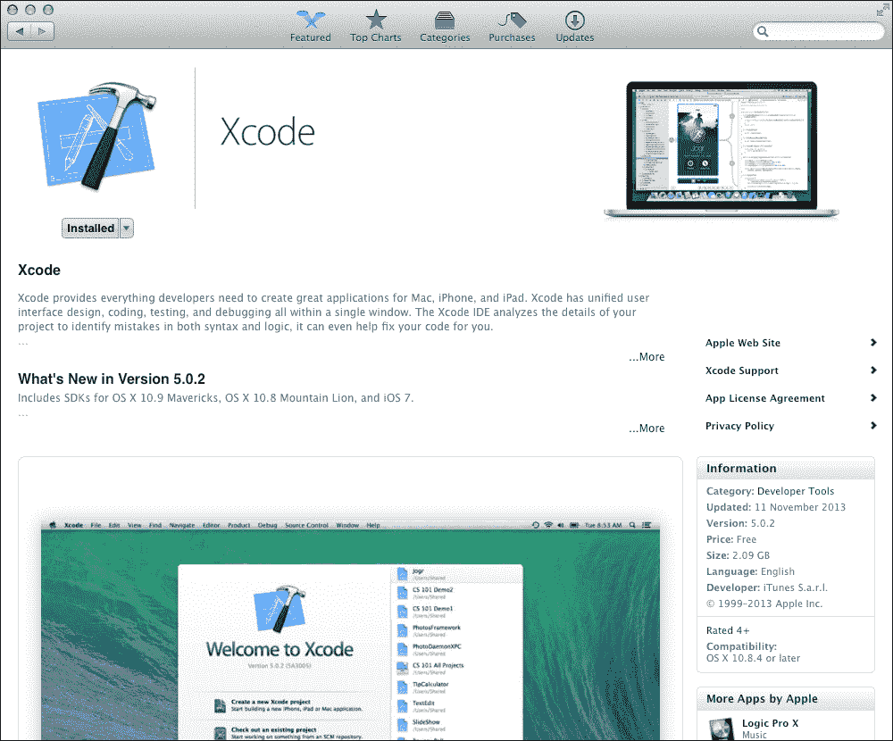
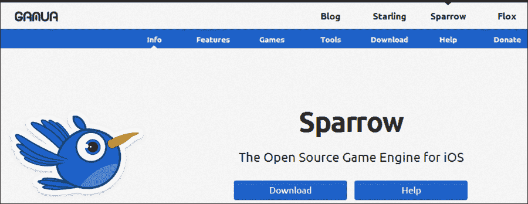
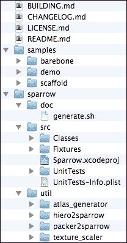
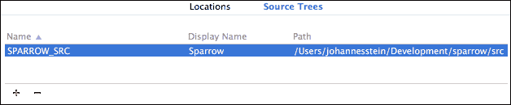
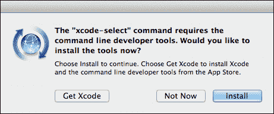
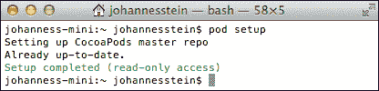
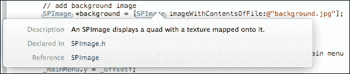

# 第一章. Sparrow 入门

*在我们深入探讨开发概念之前，我们首先需要设置我们的开发环境，并在我们的系统上设置 Sparrow。在本章中，我们将简要了解 Sparrow 实际上是什么，为我们的需求设置 Xcode 和 Sparrow，创建游戏模板，并为我们要开发的游戏设定目标和期望。*

# 理解 Sparrow 的基础知识

Sparrow 是一个游戏框架，对于那些已经有一定 ActionScript、Flash API 和/或 Starling 经验的人来说可能会感到熟悉。与 Starling 的熟悉性并非巧合；Starling 和 Sparrow 的核心开发团队是相同的。Starling 可以被认为是 Sparrow 的 ActionScript 版本。一旦我们详细使用 Sparrow 的不同功能，我们将深入探讨这些方面。

**嵌入式系统开放图形库**（**OpenGL ES**）是适用于移动设备的图形渲染器，可在各种设备上使用，从 iOS 设备到 Android 设备，甚至到 OUYA 这样的游戏机。OpenGL 可以看作是 OpenGL ES 的较老、更大的兄弟。OpenGL 本身适用于所有桌面平台，如 Windows、Linux、Mac OS X 以及下一代游戏机，如 PlayStation 4。

OpenGL 和 OpenGL ES 是那种让我们在屏幕上施展魔法（无论是绘制纹理，还是在屏幕上有某种几何形状或粒子效果）的库。

Sparrow 将所有 OpenGL 组件从开发者那里抽象出来。我们根本不必担心 OpenGL 的内部工作原理。Sparrow 完全专注于 2D 渲染，并将其放入一系列逻辑上结构化的类和方法中。就编程语言而言，性能密集型图形应用程序的选择通常是 C 或 C++，而 Sparrow 使用 Objective-C 来保持对 Mac 和 iOS 开发者的熟悉度。

Sparrow 不仅是一个 2D 图形引擎，它还提供了在屏幕上创建动画的功能——从简单的效果，如淡入淡出对象，到更复杂的行为，如使用弹跳动画将球从屏幕的左侧移动到右侧。这种机制也被称为补间动画。

除了图形相关功能外，Sparrow 还为我们提供了加载音频文件和在游戏中播放音乐和声音的手段。

当与其他游戏框架直接比较时，Sparrow 不会对我们施加特定的工作流程。因此，一些事情需要手动设置，例如为我们的游戏结构化所有需要的资产，以及管理我们的场景。

# 系统要求

从硬件角度来看，任何能够运行最新 Mac OS X 的 Mac 都完全可以胜任。

在软件方面，我们需要最新版本的 Mac OS X，并且所有最新的更新都需要安装。在撰写本书时的最低要求是 OS X 10.8 Mountain Lion。

对于我们将要针对的平台，我们至少需要一个运行 iOS 5.0 和 Xcode 4.0 或更高版本的设备。Sparrow 的最新版本内部使用 OpenGL ES 2.0，这仅支持 iPhone 3GS 或更新的设备。

# 设置 Apple 开发者账户

设置 Apple 开发者账户并加入 iOS 开发者计划对于本书的目的来说是完全可选的，但如果您想在物理设备上测试游戏或将其发布到 Apple App Store，则这是必要的。

随附于 Apple 开发者工具的 iOS 模拟器是一个测试不同功能的好平台。然而，模拟器本身的性能可能会误导。性能是游戏开发中的一个关键因素，因此在实际设备上进行测试应该是优先考虑的。

根据您的 Mac 性能，iOS 模拟器上的应用程序运行速度可能从极慢到相当快。总的来说，不要将模拟器中的性能作为游戏在实际设备上表现良好的参考。

关于 iOS 开发者计划和 Apple 开发者账户的更多信息，请访问 [`developer.apple.com/`](https://developer.apple.com/)。

# 下载 Xcode

**Xcode** 是开发与 Mac 和 iOS 相关所有内容的默认集成开发环境。Xcode 可免费获取，书写此书时的最新版本是 5.0.2。

第一步是从 Mac App Store 下载 Xcode。点击 dock 上的 Mac App Store 图标以打开 Mac App Store。

使用搜索框搜索 `Xcode` 并选择适当的结果。

商店页面可能看起来如下截图所示：



点击位于标志正下方的 **安装** 按钮。（如果 Xcode 已经安装，按钮的标题将更改为 **已安装**。）下载大小约为 2.6 GB，因此根据您的网络连接速度，可能需要一段时间。

总是保持 Xcode 安装更新到最新是一个好主意，因为更新很频繁。

# 下载 Sparrow

现在 Xcode 已经安装并准备就绪，下一步是获取 Sparrow 的最新稳定版本。访问 Sparrow 的官方主页 [`sparrow-framework.org`](http://sparrow-framework.org) 或 [`gamua.com/sparrow/`](http://gamua.com/sparrow/)。

书写此书时的最新 Sparrow 版本是 2.0.1。下载页面看起来可能如下截图所示：



点击大蓝色 **下载** 按钮，下载应该就会开始。

## 克隆 Git 仓库

如果您熟悉版本控制系统 Git，您也可以通过克隆 Git 仓库来获取最新版本。本节是为已经使用过 Git 的高级用户准备的。

Sparrow 的 GitHub 仓库位于 [`github.com/Gamua/Sparrow-Framework/`](https://github.com/Gamua/Sparrow-Framework/)，有关流程的更多信息可以在那里找到。通常，Git 命令在终端中输入：

```swift
git clone https://github.com/Gamua/Sparrow-Framework

```

下载可能需要一些时间；当前进度在终端中显示。下载完成后，您将拥有最新的开发版本。只有当您想在 Sparrow 发布前测试其特定功能或您喜欢冒险时才使用此版本。

请勿使用此版本为即将在苹果 App Store 上发布的游戏的生产代码。

要获取 Sparrow 的最新稳定版本，请查看稳定标签：

```swift
git checkout tags/v2.0.1

```

现在如果我们想更新到最新版本，我们可以这样做。

# Sparrow 包的内容

下载完成后，将文件解压到您选择的地点。我们可以使用 Mac OS X 默认包含的解压程序，但任何第三方解压程序也应该可以工作。让我们看一下以下截图，看看 Sparrow 包提供了哪些内容：



## `samples` 文件夹

`samples` 文件夹包含三个子文件夹，具体如下：

+   `barebone`：这是一个最小化项目，是创建您自己的游戏的好起点，也将作为我们游戏的模板

+   `demo`：这是一个展示 Sparrow 中许多功能的示例应用程序

+   `scaffold`：该模板提供了一些基础类和比 `barebone` 示例更多的样板代码

## `sparrow` 文件夹

`sparrow` 文件夹包含三个子文件夹，具体如下：

+   `doc`：这个脚本用于生成文档

+   `src`：这是 Sparrow 框架本身的全部源代码

+   `util`：这个文件夹包含不同的命令行工具，这些工具将帮助我们处理图形资源时的工作流程

## 根目录下的 Markdown 文件

Markdown 文件本质上是可以渲染成 HTML 文件的文本文件。具体如下：

+   `BUILDING.md`：这提供了如何使用库的快速入门指南

+   `CHANGELOG.md`：这提供了详细的项目列表，说明了版本之间的具体变化

+   `LICENSE.md`：这是 Sparrow 使用的许可协议

+   `README.md`：这是一篇简短的介绍，介绍了 Sparrow 是什么

## License

Sparrow 是一款免费且开源的软件，这意味着其源代码可以被任何人查看和修改。

和 Mac/iOS 宇宙中的许多其他软件一样，Sparrow 在未经修改的两条款简化版 BSD 许可证下授权，这意味着只要版权声明、条件列表和免责声明与源代码或应用程序一起分发，我们就可以使用 Sparrow。

### Note

如果我们要修改源代码，这意味着什么？

修改后的源代码必须包含相同的 `LICENSE.md` 文件，且该文件的内容不允许更改。

如果我们要使用 Sparrow 开发游戏并在苹果的 App Store 上分发游戏，这意味着什么？

游戏需要将 `LICENSE.md` 文件的内容包含在游戏本身中。在选项或致谢屏幕中包含文件内容也是一个有效的解决方案。

# 设置 Sparrow

在你的机器上设置 Sparrow 有两种不同的方式。第一种可能是设置 Sparrow 最简单的方法。

第二种选项是使用**CocoaPods**，这是一个 Objective-C 的依赖管理系统。从长远来看，CocoaPods 可能是更好的选择，尤其是在处理大型项目和多个依赖项时。设置 CocoaPods 比第一个选项需要更长的时间，并且需要一些关于如何使用终端的知识。

虽然这些选项不是相互排斥的，但最好都尝试一下，并坚持使用最吸引你的那个。

## 选项 1 - 源树引用

首先，将下载文件夹内的`sparrow`文件夹复制到您选择的位置。请勿在文件夹名称中使用空格，因为 Xcode 实际上无法在源树中处理它们。

# 行动时间 - 将 Sparrow 添加为源树引用

要将 Sparrow 添加为源树引用，请按照以下步骤操作：

1.  打开 Xcode。

1.  通过顶部菜单栏的**Xcode**打开 Xcode 设置，然后点击**偏好设置…**。

1.  导航到**位置**。

1.  点击**源树**选项卡。

1.  点击加号（**+**）按钮添加一个源树项目。

1.  在**名称**选项卡中输入`SPARROW_SRC`。

1.  在**显示名称**选项卡中输入 `Sparrow`。（或者使用**SPARROW_SRC**作为显示名称也是可以的。）

1.  将我们放置`sparrow`文件夹的绝对路径添加进去。别忘了`src`后缀。



## *发生了什么？*

我们将 Sparrow 源位置作为源树项目添加到 Xcode 中。这只需要做一次，因为所有 Sparrow 项目都使用这个源树项目。

作为下一步，我们将设置我们将贯穿整本书的模板。

# 行动时间 - 使用裸骨项目作为模板

按照以下步骤使用`barebone`项目作为模板：

1.  将**samples** | **barebone**中的`barebone`应用程序复制到您选择的位置。

1.  通过双击`Barebone.xcodeproj`打开 Xcode 中的项目。

1.  点击项目导航器中的项目名称以使其可编辑。

1.  将其重命名为`PirateGame`。

1.  从顶部菜单栏打开**产品**菜单。

1.  选择**方案**和**管理方案**。

1.  将**方案**名称从**Barebone**重命名为`PirateGame`。

1.  通过点击播放按钮在 iOS 模拟器中运行项目。确保选择**PirateGame**而不是**Sparrow**。


## *发生了什么？*

我们复制了`barebone` Sparrow 模板，并将其用作我们游戏的模板。我们重命名了所有项目和方案引用，并运行了模板以查看是否一切顺利。

一切按预期工作时的指示是编译模板时没有错误，屏幕上出现一个红色矩形。

## 选项 2 – CocoaPods

CocoaPods 是 Objective-C 项目的依赖管理器。它可以处理 Mac OS X 和 iOS 依赖项，类似于其他系统的包管理器。它可以与 Ruby 的包管理器 RubyGems 相比 Ruby 平台，或者与 NPM 相比 Node.js。

CocoaPods 需要 Ruby 和 RubyGems 来运行，这没什么好担心的，因为它们都预安装在每台 Mac OS X 机器上。

在我们开始安装 CocoaPods 之前，我们需要确保命令行工具已安装。

# 行动时间 – 安装命令行工具

要安装命令行工具，请按照以下步骤操作：

1.  打开终端。

1.  输入 `xcode-select` 并按 *Enter* 确认。

1.  如果尚未安装命令行工具，将弹出一个对话框。如果没有弹出对话框，则命令行工具已安装，这里没有需要做的事情。

1.  如以下截图所示，单击 **安装** 按钮继续：

## *发生了什么？*

在我们能够安装 CocoaPods 之前，我们需要确保有最新版本的命令行工具。

如果您想触发命令行工具的重新安装，无论它们是否已安装，可以通过输入 `xcode-select --install` 来实现。

现在命令行工具已安装，我们可以开始安装 CocoaPods。

# 行动时间 – 安装 CocoaPods

要安装 CocoaPods，请按照以下步骤操作：

1.  打开终端。

1.  输入 `sudo gem update –system` 并按 *Enter* 确认。

1.  输入 `sudo gem install cocoapods`。

1.  输入 `pod setup`。这可能需要很长时间，所以请耐心等待。



## *发生了什么？*

由于 CocoaPods 需要通过命令行安装，我们的要求是打开一个终端窗口。

在第二步中，我们将更新 RubyGems 到最新可用版本。

之后，我们触发 CocoaPods 的安装。这也会安装所有依赖项。如果有冲突，我们会收到提示来处理这个冲突。如果您不确定该怎么做，在这种情况下只需按 *Enter*，最安全的选项将被选择。

最后一步是设置 CocoaPods 所必需的。建议时不时地运行此命令，因为它会更新本地仓库，包含所有可用的最新库规范。

现在 CocoaPods 已安装，我们可以继续设置我们的 Sparrow 模板。

# 行动时间 – 将 barebone 项目作为模板使用

按照以下步骤使用 `barebone` 项目作为模板：

1.  将 **samples** | **barebone** 中的 `barebone` 应用程序复制到您选择的位置。

1.  打开 Xcode 项目。

1.  在项目导航器中单击项目名称以使其可编辑。

1.  将其重命名为 `PirateGame`。

1.  从顶部菜单栏打开 **Product** 菜单。

1.  选择 **Scheme** 和 **Manage Schemes**。

1.  将 **Scheme** 名称从 **Barebone** 更改为 `PirateGame`。

1.  关闭 Xcode。

1.  打开任何文本编辑器。

1.  输入以下代码：

    ```swift
    platform :ios, '5.0'

    pod 'Sparrow-Framework', '2.0.1'
    ```

1.  将文件保存为 `Podfile`，在最近复制的 `barebone` 文件夹中，与 Xcode 项目文件在同一级别。如果您使用的是 TextEdit（OS X 默认文本编辑器），请确保以纯文本格式保存文件，这可以通过在菜单中将 **Format** 更改为 **Make Plain Text** 来完成。另外，通过导航到 **TextEdit** | **Preferences…** 来禁用 **Smart Quotes**。

1.  打开终端。

1.  导航到复制的 `barebone` 文件夹。

1.  在终端中执行 `pod install` 命令。

1.  使用 Xcode 打开 `PirateGame.xcworkspace`。

1.  通过右键单击并选择 **Delete** 来从项目中移除 `Sparrow.xcodeproj`。

1.  通过点击播放按钮在 iOS 模拟器中运行项目。如果有任何错误，尝试通过在配置中更改 **User Header Search Paths** 中的 **recursive** 为 **non-recursive** 来更改 **Build Settings**。


## *发生了什么？*

我们复制了裸骨 Sparrow 模板并将其用作游戏的模板。我们重命名了所有项目和方案引用。

我们当时需要关闭 Xcode，因为 CocoaPods 将生成一些文件，我们不希望 Xcode 干扰这个过程。

在下一步中，我们必须定义 `Podfile`，这是 CocoaPods 的规范文件。此文件告诉 CocoaPods 要获取哪些依赖项。

规范是用 Ruby 编写的，但对于不了解 Ruby 编程语言的人来说也很容易理解。

第一条语句设置了 iOS 平台的依赖项。如前所述，CocoaPods 可以处理同一项目中的 Mac OS 和 iOS 依赖项，因此它有一个语句来区分它们是有意义的。因为我们只针对 iOS，所以我们不需要担心 Mac OS 依赖项，所以我们将其省略。

在我们的示例中，`Podfile` 的第二部分包含了我们项目中需要的所有依赖项。因为我们只有一个依赖项——Sparrow，所以我们只需要定义这一个。

依赖项的格式如下：

```swift
pod 'name' 'version'
```

所有当前可用的依赖项和版本的存储库可以在 GitHub 上找到，网址为 [`github.com/CocoaPods/Specs`](https://github.com/CocoaPods/Specs)。

在我们的 `Podfile` 编写并保存后，我们需要回到终端，并让 CocoaPods 获取我们的依赖项，这就是 `pod install` 命令所做的事情。CocoaPods 还会生成一个 `Pod` 文件夹，所有依赖项都存储在这里，以及一个 Xcode 工作空间。

从现在开始，我们不需要打开项目文件，而是需要打开工作空间文件，因为这是 CocoaPods 更新和维护的地方。

如果我们打开项目文件并尝试运行应用程序，应用程序将无法编译。

作为最后一步，我们运行我们的示例。一切正常工作的指示是编译模板时没有错误，并且屏幕上出现一个红色矩形。

# 在实际设备上运行模板

尽管我们的模板仍然有点基础，但我们可以在实际设备上运行它。对于本节，我们需要一个 Apple 开发者账户，并且我们需要成为 iOS 开发者计划的成员。

# 行动时间 – 在实际设备上运行模板

要在实际设备上运行模板，请按照以下步骤操作：

1.  通过顶部菜单栏的 **Xcode** 打开 Xcode 设置，然后点击 **偏好设置…**。

1.  导航到 **账户**。

1.  点击加号图标添加一个新账户。

1.  从菜单中选择 **添加 Apple ID…**。

1.  输入所需的凭据，并通过点击 **添加** 来确认。

1.  将您的设备连接到您的 Mac。

1.  通过转到 **窗口** | **组织者** 打开 Xcode 组织者，以检查设备是否已成功检测到。

1.  通过点击应用程序名称并选择正确的设备来从菜单中选择设备。

1.  通过点击播放按钮运行项目。


## *发生了什么？*

我们将一个设备连接到我们的 Mac，并将构建配置设置为设备，以便应用程序在设备上运行而不是在模拟器上。

如预期的那样，红色矩形应该成功显示在设备上，就像在模拟器上一样。

# 获取 Sparrow 文档文件

Sparrow 框架具有文档功能，也称为 docset，可以集成以获取有关 Sparrow 类和方法的更多信息。

要为 Xcode 5 添加 docset，需要一个名为 **Docs for Xcode** 的免费应用程序，可以从 Mac App Store 下载。有关 Docs for Xcode 的更多信息，请参阅 [`documancer.com/xcode/`](http://documancer.com/xcode/)。

# 行动时间 – 将 Sparrow API 文档添加到 Xcode

要添加 Sparrow API 文档，只需按照以下简单步骤操作：

1.  打开 Docs for Xcode（如果您第一次启动 Docs for Xcode，请授予它对文档文件夹的访问权限）。

1.  点击 **添加订阅**。

1.  在文本框中输入 `http://doc.sparrow-framework.org/core/feed/docset.atom` 并通过点击 **添加** 来确认。

1.  重新启动 Xcode（如果 Xcode 已经关闭，请先打开）。

1.  打开一个 Sparrow 项目，通过按 *Alt* 键并点击任何类名或方法来打开内联文档。



## *发生了什么？*

我们在 Xcode 的 Docs 中添加了一个 docset 资源订阅，这样在用 Sparrow 开发时，我们可以获得更精确且始终更新的文档。

# 游戏的想法

找到适合游戏的好想法可能相当棘手。一般来说，找到让你兴奋的东西，以及你可能想玩的东西。一个好的动机是玩游戏，找到你真的很喜欢或可以改进的片段。有一点是肯定的：不要克隆。不要制作克隆，而是创造一些原创的东西。

### 小贴士

**寻找游戏想法**

可能最好的找到游戏想法的方式是在游戏节期间，那时你可以在非常短的时间内开发一个游戏。其中最受欢迎的是 Ludum Dare ([`www.ludumdare.com/compo/`](http://www.ludumdare.com/compo/)) 和 Global Game Jam ([`globalgamejam.org/`](http://globalgamejam.org/))。第一个是一个在线单人竞赛，而 Global Game Jam 你需要团队合作。这两个游戏节共同的特点是提供了一个主题，所有参赛者都应该使用这个主题。

对于不那么具有竞争力的方法，你也可以查看 Twitter `@PeterMolydeux`，这是一个 Fable、Black & White 和 Populous 的创意大脑 Peter Molyneux 的讽刺账户。有一些关于完全疯狂和/或有趣的游戏想法的推文，其中大多数都会非常有趣。

我们正在开发的游戏类型是一种有点像动作游戏的角色扮演游戏元素。玩家将控制一艘装满海盗的船，这些海盗正在等待船只攻击、夺取和掠夺。

在每次任务之后，我们将回到海盗湾，购买更好的物品，如炮弹，或者雇佣一个更有经验的船员。我们的游戏将被称为 "海盗生存实用指南"。然而，由于名字太长，我们只将游戏模板名称保留为 "PirateGame"。

## 设定目标和期望

制定某种计划总是一个好主意。虽然大多数游戏开发都是迭代的，但传达游戏愿景并没有什么坏处。

在开发过程中，最重要的是记住范围。尽可能保持范围尽可能小非常重要；在大多数情况下，你仍然需要在开发周期的后期阶段削减游戏元素。

说我们要创造下一个拥有更多级别的 *愤怒的小鸟*，可能和说我们要仅通过更多武器和任务来开发下一个 *魔兽世界* 一样不切实际。

让我们把我们的目标和期望列成一个清单。以下是这本书我们设定的目标清单：

+   书末完成的游戏

+   对 Sparrow 的开发有了理解

+   例子对于游戏开发和与 Sparrow 合作是相关的

以下是我们对这本书的期望列表：

+   游戏已经足够完善，可以发布到苹果应用商店

+   游戏很有趣

## 检查我们的游戏元素

大多数独立游戏通常专注于一个机制，并将其打磨到极致。"小鸟飞" 和 "快照" 是很好的例子。

就像所有软件一样，总会有变成功能膨胀的危险，这意味着在开发过程中添加各种功能，而没有计划或平衡。最终，游戏可能拥有我们想要的所有功能，但这些功能可能相互排斥，游戏可能不会有趣。

因此，考虑到范围和限制，让我们列出我们游戏的功能和游戏元素列表：

+   攻击敌舰

+   从敌舰收集战利品

+   升级舰船装备

+   招募新船员

# 代码规范

在我们开始编写第一行代码之前，我们应该花点时间确定所有代码示例的代码规范。在 Objective-C 世界中，最常用的代码规范是由苹果公司制定的，我们将尽可能地遵循。

需要记住的最重要规范如下：

+   保持所有方法名使用驼峰命名法（如`myMethodName`）

+   方法名应该是描述性的

+   不要缩写方法名

+   实例变量应该以下划线开头

这些规范的完整指南可在[`developer.apple.com/library/mac/documentation/Cocoa/Conceptual/CodingGuidelines/CodingGuidelines.html`](https://developer.apple.com/library/mac/documentation/Cocoa/Conceptual/CodingGuidelines/CodingGuidelines.html)找到。

## 突击测验

Q1. Sparrow 框架是什么？

1.  一个用于 2D 游戏的框架

1.  一个 3D 图形引擎

1.  一个场景图库

Q2. CocoaPods 是什么？

1.  Objective-C 的源代码控制

1.  Cocoa 的附加库

1.  Objective-C 包的依赖管理器

Q3. 为了使用 Sparrow 2.x 开发游戏，我们需要至少 iOS 5.0 SDK，最好是一个 iPhone 3GS 或更先进的设备。

1.  真的

1.  假的

# 摘要

在本章中，我们关于为 Sparrow 设置开发环境学到了很多。具体来说，我们涵盖了如何设置 Xcode、Sparrow 游戏框架以及创建我们自己的游戏模板。

我们还涉及了一些通用的游戏开发主题，并学习了如何使用 CocoaPods 进行依赖管理。

现在我们已经设置了游戏模板，我们准备好学习关于显示对象及其使用方法了——这是下一章的主题。
