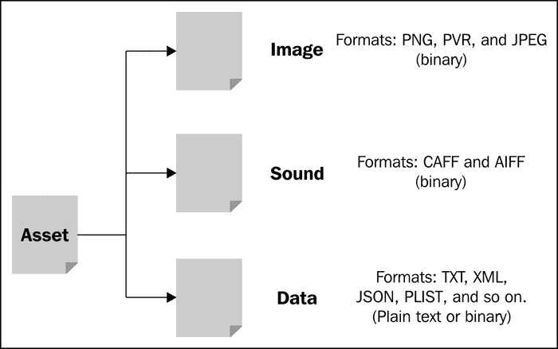
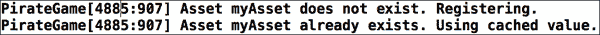
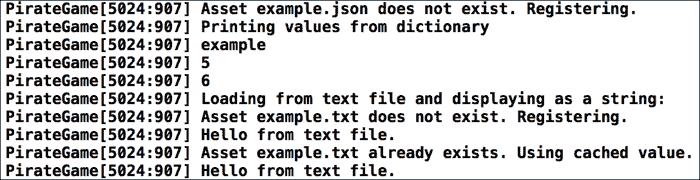
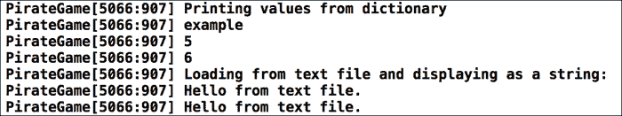

# 第三章。管理资产和场景

*在前一章中，我们在屏幕上绘制了第一个显示对象，在我们的案例中是四边形。我们用四边形制作了一个纸板木偶娃娃，并学习了如何使用宏。在开发我们的海盗游戏之前，我们还需要了解最后一件事。在本章中，我们将学习如何管理我们的资产，例如图像、声音和其他类型的文件。我们还将学习如何将元素分组到场景中并显示这些场景。*

# 与资产一起工作

当我们开发游戏时，我们加载文件。我们可能还加载了很多图像。这些图像显示在屏幕上，是任何 2D 游戏的图形。

我们还需要加载音文件以播放音乐和音效。其他通用文件包括文本文件，这些文件可以是本地化文件或游戏信息文件，例如敌人的生命值、攻击强度或类似影响游戏玩法的数据。

与游戏相关的数据可能包括保存的游戏和关卡数据。这种与游戏玩法相关的数据不一定总是纯文本；在某些情况下，它们是二进制文件或使用 XML 或 JSON 等标记语言。在 iOS 和 Mac 世界中，PLIST 文件格式非常常见，包含一种特殊的 XML 格式。



在一些游戏中，游戏引擎和游戏框架在处理与游戏玩法相关的数据时会更进一步，以实现更动态的效果。它们允许通过 Lua 和 JavaScript 等语言进行脚本编写。这些脚本在运行时加载和执行。

# 管理我们的资产

现在我们知道了什么是资产，我们如何为我们的游戏管理它们？在我们到达那里之前，让我们看看我们已经知道的内容以及有效加载资产的前提条件。

首先，我们知道存在不同类型的资产，可以是纯文本文件或二进制文件。

需要记住的一件事是现在移动设备上的内存。虽然它与几年前桌面设备的内存相同，但并非所有这些内存都保留给我们应用程序。我们还应该记住，磁盘上资产的尺寸在内存中可能不与压缩文件相同，特别是如果文件内容在磁盘上被压缩，但在内存中需要解压缩的话。

因此，我们可以做几件事情，如下所示：

+   限制我们正在加载的资产数量；这可能是一个难题，因为游戏可能需要大量的资产

+   限制当前加载到内存中的资产数量

+   缓存已加载的资产，以便我们不会在内存中有两次相同的内容

让我们创建一个基类来管理一组资产。

# 行动时间 - 创建基类

要创建一个用于管理我们资产的基类，我们需要使用以下步骤：

1.  如果 Xcode 游戏模板尚未打开，请打开它，然后在**Classes**文件夹上右键单击，选择**New Group**，并将组重命名为**Assets**。

1.  右键点击**Assets**组并选择**新建文件...**。

1.  选择**Objective-C 类**并点击**下一步**。

1.  在名称字段中输入`AssetsDictionary`，从**子类为**条目中选择**NSObject**，然后点击**下一步**。

1.  在下一个对话框中，点击**创建**。

1.  打开`AssetsDictionary.h`文件。

1.  添加一个名为`_dict`的实例变量，它是一个指向`NSMutableDictionary`的指针，如下面的代码所示：

    ```swift
    @interface AssetsDictionary : NSObject {
        NSMutableDictionary *_dict;
    }
    ```

1.  添加一个名为`verbose`的属性，其类型为`BOOL`，如下面的代码所示：

    ```swift
    @property BOOL verbose;
    ```

1.  添加一个名为`registerAsset`的实例方法，如下面的代码所示：

    ```swift
    -(id) registerAsset:(NSString *)name withContent:(id)content;
    ```

1.  添加另一个名为`unregisterAsset`的实例方法，如下面的代码所示：

    ```swift
    -(void) unregisterAsset:(NSString *)name;
    ```

1.  添加一个名为`clear`的第三个实例方法，如下面的代码所示：

    ```swift
    -(void) clear;
    ```

1.  现在切换到`AssetsDictionary.m`。

1.  添加一个初始化器，内容如下：

    ```swift
    - (id)init
    {
        if ((self = [super init])) {
            _dict = [[NSMutableDictionary alloc] init];
            _verbose = NO;
        }

        return self;
    }
    ```

1.  使用以下代码实现`registerAsset`方法：

    ```swift
    -(id) registerAsset:(NSString *)name withContent:(id)content
    {
      id result;

      if ([_dict objectForKey:name] == nil) {
        [_dict setObject:content forKey:name];

        result = content;

        if (self.verbose) {
          NSLog(@"Asset %@ does not exist. Registering.", name);
        }
      } else {
        result = [_dict objectForKey:name];

        if (self.verbose) {
          NSLog(@"Asset %@ already exists. Using cached value.", name);
        }
      }

      return result;
    }
    ```

1.  实现名为`unregisterAsset`的方法：

    ```swift
    -(void) unregisterAsset:(NSString *)name
    {
        if ([_dict objectForKey:name] != nil) {
            [_dict removeObjectForKey:name];
        }
    }
    ```

1.  实现一个名为`clear`的方法，该方法应该重置缓存：

    ```swift
    -(void) clear
    {
        [_dict removeAllObjects];
    }
    ```

1.  切换到`Game.m`文件。

1.  在`import`部分导入`AssetsDictionary.h`文件：

    ```swift
    #import "AssetsDictionary.h"
    ```

1.  在`init`方法中，添加以下行：

    ```swift
    AssetsDictionary* assets = [[AssetsDictionary alloc] init];
    assets.verbose = YES;
    [assets registerAsset:@"myAsset" withContent:@"test"];
    [assets registerAsset:@"myAsset" withContent:@"test"];
    ```

1.  运行示例，你将得到以下输出：

## *发生了什么？*

在步骤 1 中，我们从上一章结束的地方打开了我们的 Xcode 模板。然后，我们创建了一个新组，将所有与我们的资源管理相关的所有内容都放在里面。最后，我们将新创建的组重命名。

在步骤 2 中，我们创建了一个新文件。在步骤 3 中，我们从弹出的对话框中选择**Objective-C 类**。我们希望类名为`AssetsDictionary`，这是我们在步骤 4 中输入的；我们还确认了它将在硬盘上的保存位置，这是在步骤 5 中完成的。

接着，我们打开了头文件并创建了一个实例变量来存储资源的名称和内容。为此，我们需要它是一个`NSMutableDictionary`的实例。Objective-C Cocoa 类如`NSDictionary`可以是可变的或不可变的；可变类的内容可以改变，而不可变类的值固定为声明对象时使用的值。

虽然我们将接口部分放在了头文件中，但也可以将其放在实现部分之前。

在第 8 步中，我们添加了一个名为`verbose`的属性，其类型为`BOOL`。如果这个属性设置为`YES`，一旦一个资源被注册，它应该写一条消息告诉我们该资源是否已经在缓存中。可以说其默认值应该是`NO`，这样我们的控制台消息框就不会被消息填满。

我们需要定义我们的方法来处理资产的注册和服务。它接受两个参数：资产的名称和资产的内容。它返回资产的内容。由于资产的内容可以是任何东西——但在大多数情况下是某种类的实例——因此 `id` 类型在这里似乎是最佳选择。`id` 类型可以代表任何类实例；如果用技术术语来说，它被称为动态类型。

然后，我们定义了两个方法；第一个解释了如何从缓存中删除单个资产（步骤 10），第二个方法解释了如何清除所有资产（步骤 11）。

我们的头文件已经完成；现在，让我们着手实际的实现。首先，切换到 `AssetsDictionary.m` 文件。在第 13 步中，我们添加了一个初始化器，它为我们做了以下两件事：

+   设置 `_dict` 字典。

+   使用其实例变量 `_verbose` 将 `verbose` 属性设置为 `NO`。这通常不是必需的，因为 `NO` 是 `BOOL` 的默认值。

在下一步中，我们实现了 `registerAsset` 方法。如果键——我们的第一个参数——在字典中不存在，我们将其添加到字典中并返回资产的内容。如果它存在，我们从字典中查找值并返回它。在这两种情况下，如果 `verbose` 属性设置为 `YES`，我们将打印一条适当的消息来反映资产当前的状态。

在第 15 步中，我们定义了一个方法，允许我们从缓存中删除单个资产。而在第 16 步中，我们定义了一个方法来清除整个缓存。

现在，`AssetsDictionary` 类已经准备好投入使用，让我们对其进行测试。在第 17 步中，我们切换到 `Game.m` 文件，并在第 18 步中随后导入了 `AssetsDictionary` 头文件。

接下来，在我们的 `Game` 类的初始化器中，我们定义了 `AssetsDictionary` 类的一个实例，将 `verbose` 属性设置为 `YES`，并将相同的资产注册两次以查看它是否会被正确缓存。在最后一步中，我们运行了示例并查看了控制台中的输出。

## 来吧，英雄

虽然这个类适用于我们的目的，但我们还可以进一步改进 `AssetsDictionary` 类。以下是一些建议：

+   当获取资产的缓存值时，我们会从字典中查找两次该值：第一次是在检查键是否在字典中时，第二次是在获取实际值时。如果资产数量巨大，这可能会在将资产加载到游戏中时产生性能惩罚。

+   尝试使用 `NSCache` 而不是 `NSMutableDictionary`。

+   如果我们想显示进度条以查看当前加载过程已进行到什么程度，我们需要一种方法来获取当前已注册的资产数量。

+   我们还可以有一个 `exists` 方法，用于检查资产是否已经被注册，并返回检查结果。

+   我们可以添加更多接受 `NSDictionary` 的初始化器，例如。

# 创建一个纹理管理器

当我们在 Sparrow 中加载图像时，我们通常希望它是一个纹理。纹理是构成图像的像素信息。从概念上讲，它与 ActionScript 3 中的`BitmapData`类类似。如果我们想将其显示在屏幕上，它需要放在一个几何表示上，这通常是一个四边形。

我们希望我们的纹理管理器以这种方式工作：传入一个文件名，该文件名将被转换为纹理，然后对我们可用。

让我们为纹理管理器使用`AssetsDictionary`。

# 时间行动 – 管理我们的纹理

要创建我们的纹理管理器，请查看以下步骤：

1.  在**Assets**组中添加一个新的名为`TextureManager`的 Objective-C 类，它继承自`AssetsDictionary`。

1.  添加一个实例方法，它将使用文件名注册一个纹理并返回正确的值，如下所示：

    ```swift
    -(SPTexture *) registerTexture:(NSString *)filename;
    ```

1.  切换到`TextureManager.m`并实现以下内容的方法：

    ```swift
    -(SPTexture *) registerTexture:(NSString *)filename
    {
        if ([_dict objectForKey:filename] == nil) {
        return (SPTexture *) [self registerAsset:filename withContent:[SPTexture textureWithContentsOfFile:filename]];
      } else {
        return (SPTexture *) [self registerAsset:filename withContent:nil];
      }
    }
    ```

1.  切换到`Game.m`文件，并在`import`部分将`AssetsDictionary.h`导入替换为`TextureManager.h`文件。

1.  在`init`方法中，将本章中较早进行的`AssetsDictionary`测试替换为以下行：

    ```swift
    TextureManager* textureAssets = [[TextureManager alloc] init];
    textureAssets.verbose = YES;
    [textureAssets registerTexture:@"Default.png"];
    [textureAssets registerTexture:@"Default.png"];
    ```

1.  运行示例，你将得到以下输出：

## *发生了什么？*

在第一步中，我们创建了一个`TextureManager`类，它是`AssetsDictionary`的子类。在第二步中，我们定义了`registerTexture`实例方法，我们在下一个步骤中实现了它。这一行发生了很多事情，解释如下：

1.  我们使用文件名的内容创建了一个`SPTexture`实例。

1.  我们将此实例注册到我们之前实现的`registerAsset`中。

1.  我们返回了被调用方法的結果。

1.  由于结果是`id`类型，我们将其转换为`SPTexture`——这是我们想要的类型。

现在，我们继续切换到`Game.m`文件。我们将`#import "AssetsDictionary.h"`行替换为`#import "TextureManager.h"`。

然后，我们删除了测试`registerAsset`方法的示例。之后，我们设置了相同的测试；然而，这次我们使用`TextureManager`类和`registerTexture`方法。我们加载了位于`Resources`文件夹中的`Default.png`文件，它目前只是一个黑色图像。`Default.png`文件是 Sparrow 原始骨架模板的一部分。

当我们运行示例时，它第一次从文件中加载图像，然后使用缓存的結果。

# 创建声音管理器

现在我们有了纹理管理器，让我们创建一个与之前的代码非常相似的声音管理器。

# 时间行动 – 实现声音管理器

要实现声音管理器，只需遵循以下简单步骤：

1.  在**Assets**组中添加一个新的名为`SoundManager`的 Objective-C 类。

1.  添加一个实例方法，使用文件名注册声音并返回正确的值，如下所示：

    ```swift
    -(SPSound *) registerSound:(NSString *)filename;
    ```

1.  使用上一步的方法，以下内容：

    ```swift
    -(SPSound *) registerSound:(NSString *)filename
    {
        if ([_dict objectForKey:filename] == nil) {
        return (SPSound *) [self registerAsset:filename withContent:[SPSound soundWithContentsOfFile:filename]];
      } else {
        return (SPSound *) [self registerAsset:filename withContent:nil];
      }
    }
    ```

## *发生了什么？*

在第一步中，我们创建了一个 `SoundManager` 类，它是 `AssetsDictionary` 的子类。在第二步中，我们定义了 `registerSound` 方法，我们在下一步中实现了该方法；该方法从文件中加载声音并返回已注册资产的结果。

它与 `TextureManager` 非常相似，但不同之处在于我们使用 `SPSound` 加载声音，而不是纹理和 `SPTexture`。

目前，我们只对声音和声音管理做了这些，因为我们没有要加载的声音资产。

# 创建文件管理器

现在，我们几乎有了我们想要使用的所有类型资产的经理。我们最后需要的是我们数据的管理器。我们知道数据资产可以是几乎所有东西，因此我们需要缩小管理数据资产的使用场景。让我们看看我们现在需要什么：

+   加载纯文本文件总是一件有用的功能。它可能包含游戏文本或基本关卡布局。

+   `NSDictionary` 和 `NSMutableDictionary` 是我们已使用并将继续使用的类，用于存储数据。我们是否可以加载一个文件，并将其内容转换为类似于 `NSDictionary` 的结构？JSON 格式与我们找到的 `NSDictionary` 结构非常相似，幸运的是，自从 iOS 5 以来，我们可以将 JSON 文件转换为 `NSDictionary`，而无需任何第三方库。

# 行动时间 – 管理剩余的文件类型

要创建文件资产管理器，请按照以下步骤操作：

1.  添加一个新的 Objective-C 类 `FileManager`，它是 **Assets** 组中 `AssetsDictionary` 的子类。

1.  定义一个名为 `registerPlainText` 的实例方法，如下所示：

    ```swift
    -(NSString *) registerPlainText:(NSString *)filename;
    ```

1.  定义另一个实例方法 `registerDictionaryFromJSON`，如下所示：

    ```swift
    -(NSDictionary *) registerDictionaryFromJSON:(NSString *)filename;
    ```

1.  实现 `registerPlainText` 方法，以下内容：

    ```swift
    if ([_dict valueForKey:filename] == nil) {
      NSString *path = [[NSBundle mainBundle] pathForResource:filename];
      NSString *content = [NSString stringWithContentsOfFile:path encoding:NSUTF8StringEncoding error:nil];

      return (NSString *) [self registerAsset:filename withContent:content];
    } else {
      return (NSString *) [self registerAsset:filename withContent:nil];
    }
    ```

1.  实现 `registerDictionaryFromJSON` 方法，以下内容：

    ```swift
    if ([_dict valueForKey:filename] == nil) {
      NSString *path = [[NSBundle mainBundle] pathForResource:filename];

      NSData *data = [NSData dataWithContentsOfFile:path];
      NSDictionary *dict = [NSJSONSerialization JSONObjectWithData:data options:kNilOptions error:nil];

      return (NSDictionary *) [self registerAsset:filename withContent:dict];
    } else {
      return (NSDictionary *) [self registerAsset:filename withContent:nil];
    }
    ```

1.  通过在 `Resources` 文件夹上右键单击并选择 **New File...** 来将 `example.json` 文件添加到 `Resource` 文件夹中。从选项卡中选择 **Other** 并创建一个空文件。用以下内容填充它：

    ```swift
    {
        "name": "example",
        "a": 5,
        "b": 6
    }
    ```

1.  现在，将 `example.txt` 添加到 `Resource` 文件夹中，其内容如下：

    ```swift
    Hello from text file.
    ```

1.  现在我们已经设置了所有数据和 `FileManager` 类，让我们来试一试。切换到 `Game.m`，删除测试我们之前资产管理器的代码片段，并导入 `FileManager` 头文件。

1.  将以下代码段添加到初始化方法中：

    ```swift
    FileManager* fileAssets = [[FileManager alloc] init];
    fileAssets.verbose = YES;
    NSDictionary *data = [fileAssets registerDictionaryFromJSON:@"example.json"];

    NSLog(@"Printing values from dictionary:");
    NSLog(@"%@", data[@"name"]);
    NSLog(@"%@", data[@"a"]);
    NSLog(@"%@", data[@"b"]);

    NSLog(@"Loading from text file and displaying as a string:");
    NSLog(@"%@", [fileAssets registerPlainText:@"example.txt"]);
    NSLog(@"%@", [fileAssets registerPlainText:@"example.txt"]);
    ```

1.  运行示例，并查看以下输出：

## *发生了什么？*

在第一步中，我们创建了一个 `FileManager` 类，它是 `AssetsDictionary` 的子类。

在接下来的两个步骤中，我们定义了两个实例方法：一个用于加载纯文本文件，另一个用于加载 JSON 文件。

在第 4 步中，我们实现了 `registerPlainText` 方法。我们本可以将所有内容放在一行中，但那样会使代码显得有些拥挤，难以阅读。因此，如果资产已注册，我们使用 `registerAsset` 方法返回它。这次我们不需要传递内容，因为内容已经在字典中。如果没有注册，我们需要首先获取文件名路径。像从 **Resource** 文件夹中加载的每个资源一样，不借助第三方库，我们需要获取确切的文件位置。如果传递一个文件名，`[[NSBundle mainBundle] pathForResource]` 方法会给出确切的文件位置。主包代表当前应用程序的应用程序包。在下一行中，我们将文件加载到一个 `NSString` 中，编码为 UTF-8。然后，我们返回通过 `registerAsset` 方法传递的结果。

在下一步中，我们实现了 `registerDictionaryFromJSON` 方法，它的工作方式与 `registerPlainText` 方法几乎相同。然而，我们不是将文件加载到 `NSString` 中，而是使用了一个 `NSData` 对象。然后，我们通过 `NSJSONSerialization` 类转换文件内容，该类提供了 `JSONObjectWithData` 方法。现在我们实际上不需要传递任何特殊选项。

我们添加了一个 `example.json` 文件，它有一个字符串值的键和两个具有数值的键。在 JSON 结构中，键必须用双引号括起来，并且是一个字符串。值可以是数组、字符串、数字、布尔值、null 或对象。如果值是一个对象，它可以有自己的键和值。因此，它可以很好地映射 `NSDictionary` 的结构。

### 注意

关于 JSON 格式的更多信息，请查看 [`json.org/`](http://json.org/)。

在下一步中，我们添加了一个 `example.txt` 文件并添加了一些内容。

在第 8 步中，我们从上一个示例中删除了所有代码片段，并导入了 `FileManager` 头文件。我们像上一个示例中那样设置了文件管理器。然后，我们用 `example.json` 作为参数调用了 `registerDictionaryFromJSON` 方法。我们已经知道，我们可以通过 `objectForKey` 方法从 `NSDictionary` 实例中访问值，但我们也可以使用更简洁、更容易阅读的方括号表示法。只需记住，键的方括号表示法需要一个 `NSString` 实例。另一方面，值可以是任何对象或 `@` 文字，例如 `@YES`、`@1` 或 `@"MyValue"`。然后，我们加载了 `example.txt` 文件，并使用 `NSLog` 显示它。

当我们运行示例时，我们看到了资产何时以及如何被加载，以及加载的资产结果。

我们的 `FileManager.h` 文件将看起来像以下这样：

```swift
#import "AssetsDictionary.h"

@interface FileManager : AssetsDictionary

-(NSString *) registerPlainText:(NSString *)filename;
-(NSDictionary *) registerDictionaryFromJSON:(NSString *)filename;

@end
```

我们的 `FileManager.m` 文件将看起来像以下这样：

```swift
#import "FileManager.h"

@implementation FileManager

-(NSString *) registerPlainText:(NSString *)filename
{
    if ([_dict valueForKey:filename] == nil) {
        NSString *path = [[NSBundle mainBundle] pathForResource:filename];
        NSString *content = [NSString stringWithContentsOfFile:path encoding:NSUTF8StringEncoding error:nil];

        return (NSString *) [self registerAsset:filename withContent:content];
    } else {
        return (NSString *) [self registerAsset:filename withContent:nil];
    }
}

-(NSDictionary *) registerDictionaryFromJSON:(NSString *)filename
{
    if ([_dict valueForKey:filename] == nil) {
        NSString *path = [[NSBundle mainBundle] pathForResource:filename];

        NSData *data = [NSData dataWithContentsOfFile:path];
        NSDictionary *dict = [NSJSONSerialization JSONObjectWithData:data options:kNilOptions error:nil];
        return (NSDictionary *) [self registerAsset:filename withContent:dict];
    } else {
        return (NSDictionary *) [self registerAsset:filename withContent:nil];
    }
}

@end
```

## 来试试吧，英雄

我们的管理器工作方式与我们期望的完全一致。如果我们想要将相同的资产作为纯文本加载并从 JSON 文件转换为`NSDictionary`，则存在一个小问题。由于我们只使用单个字典来处理所有文件元素，如果我们首先使用`registerDictionaryFromJSON`方法加载一个资产，然后使用`registerPlainText`方法再次加载相同的资产，我们将得到将`NSDictionary`转换为`NSString`，而不是直接将文本文件加载并添加到字典中作为`NSString`。

## 基本错误处理

对于文件管理器，我们还没有设置任何错误处理。因此，如果文件不存在，应用程序可能会崩溃，我们将无法猜测为什么没有任何事情发生，没有任何线索说明如何进行。现在，我们将向`registerPlainText`方法添加一些错误处理。

# 是时候开始基本的错误处理了

为了添加一些基本的错误处理，请参考以下步骤：

1.  打开`FileManager.m`文件。

1.  更新`registerPlainText`方法以匹配以下代码片段：

    ```swift
    -(NSString *) registerPlainText:(NSString *)filename
    {
        if ([_dict valueForKey:filename] == nil) {
        NSError *error;

            NSString *path = [[NSBundle mainBundle] pathForResource:filename];
            NSString *content = [NSString stringWithContentsOfFile:path encoding:NSUTF8StringEncoding error:&error];

        if (error != nil) {
     NSLog(@"Error while loading plain text file: %@", error);
     }

            return (NSString *) [self registerAsset:filename withContent:content];
        } else {
            return (NSString *) [self registerAsset:filename withContent:nil];
        }
    }
    ```

## *刚才发生了什么？*

虽然 Objective-C 中提供了 try-catch 块，但通常不建议使用它们，因为它们相当慢，如果嵌套太深，处理起来也会变得相当困难。

我们首先需要一个指向`NSError`的指针作为错误对象。在加载文本文件时，我们应用错误处理。如果在加载文件时出现任何错误，错误对象将不再为 nil。如果是这种情况，我们将记录错误。

## 尝试一下英雄

这是目前最基本的错误处理。以下是一些改进建议：

+   捕获无法加载 JSON 文件的情况

+   捕获处理无效 JSON 文件的情况

+   为文件管理器添加一个`NSError`参数以注册资产

# 将所有内容整合在一起

我们现在有几个不同的资产管理器。是时候将它们整合在一起，这样我们就不必在想要使用资产时实例化不同的管理器。

# 是时候创建资产容器类了

为了将所有的资产管理器放入一个单独的类中，请按照以下步骤操作：

1.  在**Assets**组内创建一个名为`Assets`的新 Objective-C 类，继承自`NSObject`。

1.  为每种资产定义一个静态方法，如下所示：

    ```swift
    +(SPTexture *) texture:(NSString *)filename;
    +(SPSound *) sound:(NSString *)filename;
    +(NSString *) plainText:(NSString *)filename;
    +(NSDictionary *) dictionaryFromJSON:(NSString *)filename;
    ```

1.  在`Asset.m`文件中，导入所有资产管理器，如下所示：

    ```swift
    #import "TextureManager.h"
    #import "SoundManager.h"
    #import "FileManager.h"
    ```

1.  对于每个管理器，添加一个适当的类型的静态变量，并将其值设置为`nil`：

    ```swift
    static TextureManager *textureAssets = nil;
    static SoundManager *soundAssets = nil;
    static FileManager *fileAssets = nil;
    ```

1.  我们需要重写内部的静态`initialize`方法。使用以下代码片段：

    ```swift
    +(void) initialize
    {
        if (!textureAssets) {
            textureAssets = [[TextureManager alloc] init];
        }

        if (!soundAssets) {
            soundAssets = [[SoundManager alloc] init];
        }

        if (!fileAssets) {
            fileAssets = [[FileManager alloc] init];
        }
    }
    ```

1.  使用每个资产管理器中的正确实例方法实现每个静态方法，如下所示：

    ```swift
    +(SPTexture *) texture:(NSString *)filename
    {
        return [textureAssets registerTexture:filename];
    }

    +(SPSound *) sound:(NSString *)filename
    {
        return [soundAssets registerSound:filename];
    }

    +(NSString *) plainText:(NSString *)filename
    {
        return [fileAssets registerPlainText:filename];
    }

    +(NSDictionary *) dictionaryFromJSON:(NSString *)filename
    {
        return [fileAssets registerDictionaryFromJSON:filename];
    }
    ```

1.  切换到`Game.m`文件，并将之前的示例更新为使用静态的`Assets`类：

    ```swift
    NSDictionary *data = [Assets dictionaryFromJSON:@"example.json"];

    NSLog(@"Printing values from dictionary:");
    NSLog(@"%@", data[@"name"]);
    NSLog(@"%@", data[@"a"]);
    NSLog(@"%@", data[@"b"]);

    NSLog(@"Loading from text file and displaying as a string:");
    NSLog(@"%@", [Assets plainText:@"example.txt"]);
    NSLog(@"%@", [Assets plainText:@"example.txt"]);
    ```

1.  运行示例。当我们检查控制台时，我们应该看到以下截图所示的内容：

## *发生了什么？*

在第一步中，我们创建了一个 `Assets` 类，它是 `NSObject` 的子类。

我们为每个资产管理器实例方法定义了一个静态方法，例如 `texture` 用于 `registerTexture`，`sound` 用于 `registerSound`。然后，我们继续到实现部分。

对于每个资产管理器，我们定义了一个静态变量：`textureAssets` 用于我们的 `TextureManager` 类，`textureSounds` 用于我们的 `SoundManager` 类，等等。我们将这些实例设置为 `nil`。

我们已经重写了内部的 `NSObject` 初始化方法，该方法在内部调用一次，我们不需要调用它。

### 注意

关于 `NSObject` 的初始化方法如何工作的更多信息，可以在 Apple 文档中找到，网址为 [`developer.apple.com/library/mac/documentation/cocoa/reference/foundation/classes/NSObject_Class/Reference/Reference.html#//apple_ref/occ/clm/NSObject/initialize`](https://developer.apple.com/library/mac/documentation/cocoa/reference/foundation/classes/NSObject_Class/Reference/Reference.html#//apple_ref/occ/clm/NSObject/initialize)。

在 `initialize` 方法中，如果其值为 `nil`，则分配和初始化每个实例。

在实现下一步中的每个静态方法时，我们需要调用相应的实例方法，例如纹理方法中的 `[textureAssets registerTexture:filename]`，我们不应忘记我们必须返回实例方法的值。

要在我们的游戏文件中使用静态 `Assets` 类，我们需要更新对头文件的引用，并使用静态类中的 `dictionaryFromJSON` 和 `plainText` 方法。

当我们运行示例时，我们看到了与之前示例类似的结果，其中我们通过 `FileManager` 加载文件，但在这个例子中，我们没有关于资产状态的任何消息，因为 `verbose` 标志未设置为 `YES`。

我们的 `Assets.h` 文件将如下所示：

```swift
#import <Foundation/Foundation.h>

@interface Assets : NSObject

+(SPTexture *) texture:(NSString *)filename;
+(SPSound *) sound:(NSString *)filename;
+(NSString *) plainText:(NSString *)filename;
+(NSDictionary *) dictionaryFromJSON:(NSString *)filename;

@end
```

我们的 `Assets.m` 文件将如下所示：

```swift
#import "Assets.h"
#import "TextureManager.h"
#import "SoundManager.h"
#import "FileManager.h"

static TextureManager *textureAssets = nil;
static SoundManager *soundAssets = nil;
static FileManager *fileAssets = nil;

@implementation Assets

+(void) initialize
{
    if (!textureAssets) {
        textureAssets = [[TextureManager alloc] init];
    }

    if (!soundAssets) {
        soundAssets = [[SoundManager alloc] init];
    }

    if (!fileAssets) {
        fileAssets = [[FileManager alloc] init];
    }
}

+(SPTexture *) texture:(NSString *)filename
{
    return [textureAssets registerTexture:filename];
}

+(SPSound *) sound:(NSString *)filename
{
    return [soundAssets registerSound:filename];
}

+(NSString *) plainText:(NSString *)filename
{
    return [fileAssets registerPlainText:filename];
}

+(NSDictionary *) dictionaryFromJSON:(NSString *)filename
{
    return [fileAssets registerDictionaryFromJSON:filename];
}

@end
```

在我们继续进行场景管理之前，让我们看看如何在显示图像时使用静态 `Assets` 类。

# 动手实践 – 显示图像

要显示图像，我们只需遵循以下步骤：

1.  在 `Game` 初始化方法内部，添加以下代码：

    ```swift
    SPImage* image = [SPImage imageWithTexture:[Assets texture:@"Default.png"]]; 
    ```

1.  在初始化方法底部，将图像添加到 `Game` 类的显示树中。

1.  运行示例，你将看到以下内容：

## *发生了什么？*

如我们所知，我们需要 `SPImage` 类来显示纹理。它可以与 `SPQuad` 相比，但它不仅仅显示颜色，还在自身上显示纹理。我们使用 `Assets` 类从 `Resources` 文件夹获取 `Default.png` 图像。

在下一步中，我们使用`addChild`方法将图像添加到游戏类的显示树中。运行示例后，我们应该看到我们的纸板木偶不再可见，因为我们刚刚加载的黑色图像显示在纸板木偶的上方。

我们的`Game.m`文件应该包含以下内容：

```swift
#import "Game.h" 
#import "Assets.h"

@implementation Game

- (id)init
{
    if ((self = [super init]))
    {
        Sparrow.stage.color = 0xffffff;

        SPImage* image = [SPImage imageWithTexture:[Assets texture:@"Default.png"]];

    NSDictionary *data = [Assets dictionaryFromJSON:@"example.json"];

    NSLog(@"Printing values from dictionary:");
    NSLog(@"%@", data[@"name"]);
    NSLog(@"%@", data[@"a"]);
    NSLog(@"%@", data[@"b"]);

    NSLog(@"Loading from text file and displaying as a string:");
    NSLog(@"%@", [Assets plainText:@"example.txt"]);
    NSLog(@"%@", [Assets plainText:@"example.txt"]);

        // Our whole cardboard puppet doll code here

        [self addChild:image];
    }
    return self;
}

@end
```

## 来试试英雄

现在我们已经完成了资产管理系统的设置，让我们讨论一下我们可以改进设置的一些方法，它们是：

+   目前，如果我们将文本文件传递给纹理管理器，它可能会加载，但当我们尝试在屏幕上显示纹理时，可能会得到意外的结果。我们可以检查文件扩展名，并且只有当它具有正确的文件扩展名时才加载资产。

+   如果我们再进一步，我们可以尝试通过其 MIME 类型自动检测我们想要加载的资产，或者如果这还不够，我们可以尝试通过魔数字节检测文件格式。

+   我们测试了资产管理器的功能，但如果我们想要更彻底的测试，我们可能需要求助于单元测试。

# 场景是什么？

在一个典型的游戏中，我们有一个主菜单、一个选项菜单，可能还有一个致谢屏幕，当然还有游戏本身。我们可以将这些所有内容放在一个文件中，但过一段时间后，这将变得难以维护。因此，将它们分组到单独的实体中会是一个好主意，在我们的例子中，这些实体就是场景。

在依赖于许多级别的游戏中，例如点对点游戏，为每个级别创建场景也是一个好主意。

# 是时候实现场景类了

要创建一个场景类，请按照以下步骤操作：

1.  创建一个名为**Scene**的新组。

1.  创建一个新的名为`Scene`的 Objective-C 类，它从`SPSprite`类派生，并将其保存在**Scene**组中。

1.  添加一个名为`guiLayer`的属性，它是一个`SPSPrite`类型，如下面的代码所示：

    ```swift
    @property SPSprite* guiLayer;
    ```

1.  添加另一个属性`name`，它是一个`NSString`，如下面的代码所示：

    ```swift
    @property NSString* name;
    ```

1.  添加一个名为`director`的第三个属性，它是一个`id`，如下面的代码所示：

    ```swift
    @property id director;
    ```

1.  添加一个初始化器来初始化类的属性：

    ```swift
    -(id) init
    {
        if ((self = [super init])) {
            self.guiLayer = [[SPSprite alloc] init];
            self.director = nil;
            self.name = @"scene";
        }

        return self;
    }
    ```

1.  添加一个设置场景名称的第二个初始化器；这应该被命名为`initWithName`：

    ```swift
    -(id) initWithName:(NSString *) name
    {
        self = [self init];
        self.name = name;

        return self;
    }
    ```

## *刚才发生了什么？*

目前，我们没有任何场景，所以我们还不能运行示例。

首先，我们设置了`Scene`类，它需要是`SPSprite`的子类，因为它需要被添加到某个地方，并且我们希望允许所有类型的显示对象被添加到`scene`实例中。

我们定义了三个属性；`guiLayer`应该是所有与用户界面相关的显示对象将被添加到的精灵，`name`应该是场景本身的名称，而`director`应该是其父对象的引用。在`init`方法中，我们为这些属性设置默认值。我们还添加了一个第二个初始化器，它接受一个参数来设置场景的名称。

# 创建场景导演

现在我们有了基本的 `scene` 类，我们需要一些可以实际管理我们想要添加的所有场景的东西。

# 行动时间 - 使用场景导演管理我们的场景

要创建场景导演，请查看以下步骤：

1.  创建一个新的名为 `SceneDirector` 的 Objective-C 类，它从 `SPSprite` 类派生，并将其保存在 **Scene** 组中。

1.  添加一个名为 `_dict` 的实例变量，其类型为 `NSMutableDictionary`。

1.  添加一个实例方法，该方法将场景添加到场景导演中，如下所示：

    ```swift
    -(void) addScene:(Scene *)scene;
    ```

1.  添加第二个实例方法，这次你还可以定义/覆盖场景的名称：

    ```swift
    -(void) addScene:(Scene *)scene withName:(NSString *)name;
    ```

1.  添加一个实例方法，该方法将显示场景并接受 `NSString` 作为其参数，如下所示：

    ```swift
    -(void) showScene:(NSString *)name;
    ```

1.  让我们切换到实现部分。初始化器应该初始化 `_dict` 变量。

1.  实现以下代码的 `addScene:(Scene *)scene withName:(NSString *)name` 方法：

    ```swift
    -(void) addScene:(Scene *)scene withName:(NSString *)name
    {
      scene.name = name;
      _dict[name] = scene;

      scene.director = self;
      [self addChild:scene];
    }
    ```

1.  `addScene:(Scene *)scene` 方法应按以下代码实现：

    ```swift
    -(void) addScene:(Scene *)scene
    {
        [self addScene:scene withName:scene.name];
    }
    ```

1.  `showScene` 方法应包含以下内容：

    ```swift
    -(void) showScene:(NSString *)name
    {
      for (NSString* sceneName in _dict) {
        ((Scene *) _dict[sceneName]).visible = NO;
      }

      if (_dict[name] != nil) {
        ((Scene *) _dict[name]).visible = YES;
      }
    }
    ```

## *发生了什么？*

在第一步中，我们创建了场景导演所需的类。这需要是一个 `SPSprite`，因为我们希望它的实例被添加到 `Game` 类中，场景导演应该管理的场景可以很容易地添加到场景导演中。

我们定义了两个添加场景的实例方法：第一个方法接受场景，第二个方法接受场景和一个名称。

我们还需要一个实例来实际显示场景；它以名称作为其参数。

在下一步中，我们实现了场景导演的初始化器。我们需要初始化我们的 `NSMutableDictionary`。我们可以使用典型的 `alloc`-and-`init` 组合，或者，作为替代，使用更简洁的 `@{}` 语法。

我们首先实现了较长的 `addScene` 方法；我们将场景名称设置为 `name` 参数。这将覆盖场景名称，即使已经给出了一个。然后我们使用方括号表示法将场景添加到字典中，这与 `[_dict setObject:scene forKey:name]` 做的是同样的工作。在下一行中，我们将场景中的 `director` 属性的引用设置为当前场景导演实例。这是必需的；在其他情况下，我们就没有从场景切换到另一个场景的选项。我们还添加了场景到当前 `SceneDirector` 实例的显示树中。

在实现较短的 `addScene` 方法时，我们只需调用较长的 `addScene` 方法，并将当前场景的名称作为其第二个参数传递。

最后一步是展示已指定为参数的场景。首先，我们遍历字典中的所有元素，并将其可见性设置为`NO`，这样它就不会显示在屏幕上；是的，即使是我们要展示的场景。然后，我们在字典中特别寻找我们的场景，并将其可见性设置为`YES`。

## 尝试一下英雄

目前，我们一次性加载所有场景。这目前是可行的，但随着场景数量的增加，我们可能会遇到内存不足的问题。为了解决这个问题，我们可以同时只保留一个场景在内存中。我们可能需要从我们的资产到场景的引用，以便知道哪个资产属于哪个场景。

## 快速问答

Q1. 二进制数据文件可以被视为资产吗？

1.  是的

1.  不是

Q2. 为什么我们应该首先缓存我们的资产以便重用已加载的资产？

1.  减少 CPU 周期

1.  为了节省内存

1.  节省磁盘空间

Q3. 纹理（如`SPTexture`）可以直接绘制到屏幕上吗？

1.  是的

1.  不是

# 摘要

在本章中，我们学到了很多关于资产和场景管理的内容。

具体来说，我们涵盖了如何处理不同类型的资产、缓存已加载的文件以及实现场景和机制来管理这些场景。

我们还涉及了一些主题，例如纹理和屏幕上显示图像。

现在我们已经了解了如何处理资产和场景，我们准备添加游戏的基础内容——这是下一章的主题。
