# 第四章.我们游戏的基础

*在上一章中，我们学习了资源以及如何实现自己的资源管理系统，该系统从应用程序包中加载资源并对其进行缓存。我们使用资源管理系统来加载我们的第一张图像。我们介绍了如何将显示对象分组到场景中，并编写了一个场景导演来管理我们的场景。在本章中，我们将开始设置我们的游戏。我们将了解针对不同设备时应考虑的因素，并开始设置我们的游戏的第一步。这包括创建我们需要的场景和在屏幕上显示静态图像。*

# 注意跨设备兼容性

在开发 iOS 游戏时，我们需要知道要针对哪个设备。除了所有 iOS 设备之间明显的技术差异之外，还有两个因素我们需要积极关注：屏幕尺寸和纹理尺寸限制。

### 注意

要快速了解 iOS 设备之间的差异，请查看[`www.iosres.com/`](http://www.iosres.com/)上的比较表。

让我们更详细地看看如何处理纹理尺寸限制和屏幕尺寸。

## 理解纹理尺寸限制

每个图形卡都有一个最大纹理尺寸的限制，它可以显示。如果一个纹理的大小超过了纹理尺寸限制，它将无法加载，并在屏幕上显示为黑色。纹理尺寸限制具有**2 的幂**维度，是一个正方形，如宽度为 1024 像素，高度也为 1024 像素，或者 2048 x 2048 像素。

当加载纹理时，它们不需要有 2 的幂维度。实际上，纹理不需要是正方形。然而，纹理具有 2 的幂维度是一个最佳实践。

这个限制适用于大图像以及打包在一个大图像中的许多小图像。后者通常被称为精灵表。看看以下示例精灵表，了解其结构：

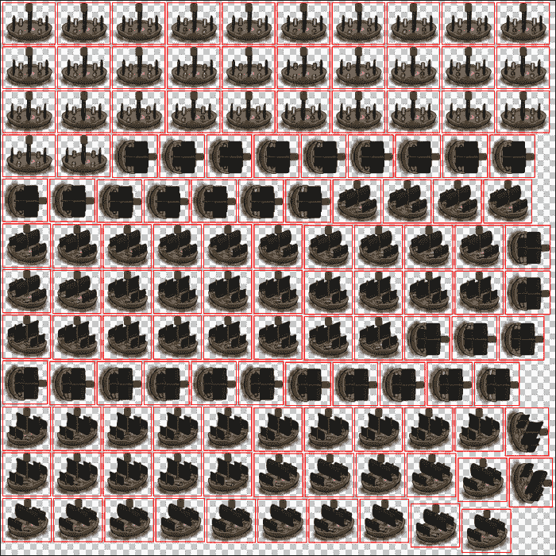

## 如何处理不同的屏幕尺寸

虽然屏幕尺寸始终以像素为单位进行测量，但 iOS 坐标系是以点为单位进行测量的。

iPhone 3GS 的屏幕尺寸为 320 x 480 像素，也是 320 x 480 点。在 iPhone 4 上，屏幕尺寸为 640 x 960 像素，但仍然是 320 x 480 点。因此，在这种情况下，每个点代表四个像素：宽度和高度各两个。一个 100 点宽的矩形在 iPhone 4 上将是 200 像素宽，而在 iPhone 3GS 上则是 100 像素。

对于具有大显示屏的设备，如 iPhone 5，它的工作方式类似。而不是 480 点，它是 568 点。

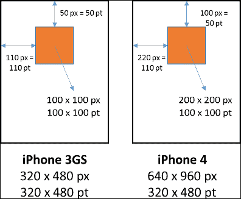

### 缩放视口

让我们先解释一下视口这个术语：视口是整个屏幕区域中可见的部分。

我们需要明确我们希望我们的游戏在哪些设备上运行。我们选择我们想要支持的最大的分辨率，并将其缩放到较小的分辨率。这是一个最简单的选项，但它可能不会产生最佳结果；触摸区域和用户界面也会缩放。苹果建议触摸区域至少为 40 点的平方；因此，根据用户界面，某些元素可能会缩放得太多，以至于难以触摸。

看看下面的截图，我们选择了 iPad Retina 分辨率（2048 x 1536 像素）作为我们的最大分辨率，并将屏幕上的所有显示对象缩放到 iPad 分辨率（1024 x 768 像素）：

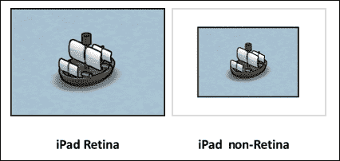

缩放是非 iOS 环境中的一种流行选项，尤其是对于支持从 1024 x 600 像素到全高清分辨率的 PC 和 Mac 游戏。

正如我们将在本章后面学到的那样，Sparrow 和 iOS SDK 提供了一些机制，可以简化处理 Retina 和非 Retina iPad 设备，而无需对整个视口进行缩放。

### 黑色边框

过去有些游戏是为 4:3 分辨率显示器设计的，但后来被修改为在具有更多屏幕空间的宽屏设备上运行。

因此，选择是将 4:3 分辨率缩放到宽屏，这将扭曲整个屏幕，或者将黑色边框放在屏幕的两侧以保持原始的缩放因子。

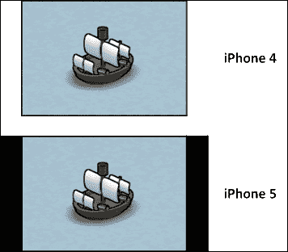

显示黑色边框现在被认为是一种不良做法，尤其是在有那么多游戏能够很好地适应不同屏幕尺寸和平台的情况下。

### 显示非交互式屏幕空间

如果我们的海盗游戏是多人游戏，我们可能会有一个玩家在使用 iPad，另一个玩家在使用 iPhone 5。因此，使用 iPad 的玩家有更大的屏幕和更多的屏幕空间来操控他们的船只。最坏的情况是，如果使用 iPad 的玩家能够将他们的船只移动到 iPhone 玩家看不到的视觉范围之外，这将给 iPad 玩家带来严重优势。

幸运的是，我们不需要竞争性多人游戏功能。然而，为了游戏平衡的目的，我们需要保持一致的屏幕空间，让玩家可以在其中移动他们的船只。我们不想将难度级别与玩家所使用的设备绑定。

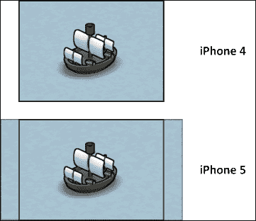

让我们比较之前的截图和黑色边框示例。我们不是展示难看的黑色边框，而是展示更多的背景。

在某些情况下，还可以将一些用户界面元素移动到其他设备上不可见的区域。然而，我们需要考虑我们是否希望在不同设备上保持相同的用户体验，以及移动这些元素是否会给那些没有这种额外屏幕空间的用户带来不利。

### 重新排列屏幕元素

重新排列屏幕元素可能是解决这个问题的最耗时和最复杂的方法。在这个例子中，我们在纵向模式下屏幕顶部有一个大的用户界面。现在，如果我们保持这种状态在横向模式下，屏幕顶部将只是用户界面，留给游戏本身的空间非常有限。

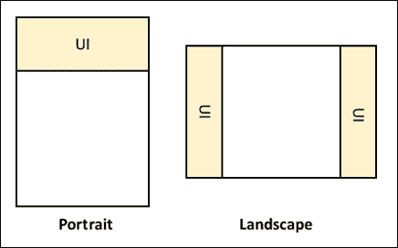

在这种情况下，我们必须明确我们希望在屏幕上看到哪些元素，以及哪些元素占用了过多的屏幕空间。"屏幕空间"（或屏幕空间）是指应用程序或游戏在显示上可用的空间量。然后我们必须重新定位它们，将它们切割成更小的部分，或者两者都要做。

这种技术的最突出例子是 King 的"Candy Crush"（一款流行的热门游戏）。虽然这个概念特别适用于设备旋转，但这并不意味着它不能用于通用应用程序。

### 选择最佳选项

这些选项之间并不相互排斥。就我们的目的而言，我们将显示非交互式屏幕空间，如果事情变得复杂，我们可能还需要根据我们的需求重新排列屏幕元素。

## 不同设备之间的差异

让我们来看看不同 iOS 设备之间屏幕尺寸和纹理尺寸限制的差异：

| 设备 | 屏幕尺寸（以像素为单位） | 纹理尺寸限制（以像素为单位） |
| --- | --- | --- |
| iPhone 3GS | 480 x 360 | 2048 x 2048 |
| iPhone 4（包括 iPhone 4S）和 iPod Touch 第 4 代 | 960 x 640 | 2048 x 2048 |
| iPhone 5（包括 iPhone 5C 和 iPhone 5S）和 iPod Touch 第 5 代 | 1136 x 640 | 2048 x 2048 |
| iPad 2 | 1024 x 768 | 2048 x 2048 |
| iPad（第 3 代和第 4 代）和 iPad Air | 2048 x 1536 | 4096 x 4096 |
| iPad Mini | 1024 x 768 | 4096 x 4096 |

## 利用 iOS SDK

iOS SDK 和 Sparrow 都可以帮助我们创建通用应用程序。通用应用程序是指针对多个设备的应用程序，特别是针对 iPhone 和 iPad 设备系列的应用程序。

iOS SDK 提供了一个方便的机制来加载特定设备的文件。假设我们正在开发 iPhone 应用程序，并且我们有一个名为`my_amazing_image.png`的图像。如果我们将此图像加载到我们的设备上，它将被加载——无需质疑。然而，如果它不是通用应用程序，我们只能使用 iPad 和 iPhone Retina 设备上的常规缩放按钮来缩放应用程序。此按钮位于屏幕的右下角。

如果我们想要针对 iPad 进行开发，我们有两个选择：

+   第一个选项是将图像按原样加载。设备将缩放图像。根据图像质量，缩放后的图像可能看起来很糟糕。在这种情况下，我们还需要考虑设备的 CPU 将执行所有的缩放工作，这可能会根据应用程序的复杂度导致一些减速。

+   第二种选择是为 iPad 设备添加一个额外的图片。这个图片将使用`~ipad`后缀，例如，`my_amazing_image~ipad.png`。在加载所需的图片时，我们仍然使用文件名`my_amazing_image.png`。iOS SDK 将自动检测提供的图片的不同尺寸，并使用适合设备的正确尺寸。

从 Xcode 5 和 iOS 7 开始，可以使用资源包。资源包可以包含各种图片，这些图片被分组到图片集中。图片集包含针对目标设备的所有图片。这些资源包不再需要带有后缀的文件。这些资源包只能用于启动图片和应用程序图标。但我们不能使用资源包来加载 Sparrow 中使用的纹理。

以下表格显示了为哪种设备需要哪种后缀：

| 设备 | Retina | 文件后缀 |
| --- | --- | --- |
| iPhone 3GS | 否 | 无 |
| iPhone 4（包括 iPhone 4S）和 iPod Touch（第 4 代） | 是 | `@2x` `@2x~iphone` |
| iPhone 5（包括 iPhone 5C 和 iPhone 5S）和 iPod Touch（第 5 代） | 是 | `-568h@2x` |
| iPad 2 | 否 | `~ipad` |
| iPad（第 3 代和第 4 代）和 iPad Air | 是 | `@2x~ipad` |
| iPad Mini | 否 | `~ipad` |

这如何影响我们希望显示的图形？非 Retina 图片的宽度将是 128 像素，高度是 128 像素。Retina 图片，即带有`@2x`后缀的图片，将是非 Retina 图片的两倍大小，即 256 像素宽和 256 像素高。

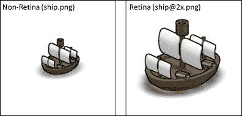

## Sparrow 中的 Retina 和 iPad 支持

Sparrow 支持之前表格中显示的所有文件名后缀，并且对于 iPad 设备有一个特殊情况，我们现在将更详细地探讨。

当我们查看我们游戏源代码中的`AppDelegate.m`时，注意以下行：

```swift
[_viewController startWithRoot:[Game class] supportHighResolutions:YES doubleOnPad:YES];
```

第一个参数`supportHighResolutions`告诉应用程序如果可用，则加载 Retina 图片（带有`@2x`后缀）。

`doubleOnPad`参数是其中一个有趣的参数。如果将其设置为`true`，Sparrow 将为 iPad 设备使用`@2x`图片。因此，我们不需要为 iPad 创建一组单独的图片，而是可以使用 Retina iPhone 图片为 iPad 应用程序使用。

在这种情况下，宽度和高度分别是 512 点和 384 点。如果我们针对的是 iPad Retina 设备，Sparrow 引入了`@4x`后缀，这需要更大的图片，并将坐标系保持在 512 x 384 点。

## 应用程序图标和启动图片

如果我们谈论的是实际游戏内容的不同尺寸的图片，应用程序图标和启动图片也必须以不同的尺寸存在。

**启动图片**（也称为启动图像）是在应用程序加载时显示的图片。这些图片也遵循 iOS 的命名方案，因此对于像 iPhone 4 这样的 Retina iPhone 设备，我们将图片命名为`Default@2x.png`，而对于 iPhone 5 设备，我们将图片命名为`Default-568h@2x.png`。

为了正确的大小应用图标，请查看以下表格：

| 设备 | Retina | 应用图标大小 |
| --- | --- | --- |
| iPhone 3GS | 否 | 57 x 57 像素 |
| iPhone 4（包括 iPhone 4S）和 iPod Touch 第 4 代 | 是 | 120 x 120 像素 |
| iPhone 5（包括 iPhone 5C 和 iPhone 5S）和 iPod Touch 第 5 代 | 是 | 120 x 120 像素 |
| iPad 2 | 否 | 76 x 76 像素 |
| iPad（第 3 代和第 4 代）和 iPad Air | 是 | 152 x 152 像素 |
| iPad Mini | 否 | 76 x 76 像素 |

## 核心内容

我们想要支持的设备越多，需要的图形就越多，这直接增加了应用程序的文件大小。当然，将 iPad 支持添加到我们的应用程序不是一项简单的任务，但 Sparrow 做了一些基础工作。

然而，我们需要记住一件事：如果我们只针对 iOS 7.0 及以上版本，我们不再需要包含非 Retina iPhone 图像。在这种情况下，使用`@2x`和`@4x`就足够了，因为非 Retina 设备的支持将很快结束。

# 从我们游戏开发开始

现在我们已经足够了解 Sparrow 框架的理论和实践经验，让我们将所有这些知识应用到实际中，通过创建我们的海盗游戏来将理论转化为实践。

### 注意

如果你错过了我们游戏的任何开发阶段，游戏的源代码也已在 GitHub 上提供，网址为[`github.com/freezedev/pirategame`](https://github.com/freezedev/pirategame)。

我们的游戏由两个主要游戏玩法部分组成：

+   **战场/竞技场**：这是我们海盗船与其他船只战斗的场景

+   **海盗湾**：海盗湾是与其他船只战斗后的活动中心，如雇佣新船员和升级船只

在本章中，我们将设置所需的场景并加载纹理，将它们显示为图像，并在屏幕上排列实体。

### 注意

游戏的图形也在 GitHub 上：[`github.com/freezedev/pirategame-assets`](https://github.com/freezedev/pirategame-assets)。这些图形是用开源 3D 建模软件 Blender 制作的([`www.blender.org`](http://www.blender.org))；需要 2.69 版本才能打开和编辑这些文件。不用担心，我们不需要更新这些文件来完成本书的目的，但如果你想要寻找灵感，你绝对被鼓励这样做。

让我们通过导航到[`github.com/freezedev/pirategame-assets/releases`](https://github.com/freezedev/pirategame-assets/releases)下载本章所需的图像。这将显示此特定存储库的所有可用版本，如下面的截图所示：

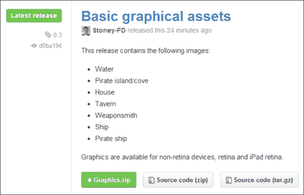

请继续下载`Graphics.zip`包，并将其内容解压缩到你的电脑上的某个位置。此包包含以下图像：

| 文件名 | 描述 |
| --- | --- |
| `water.png` | 这是战场场景的背景。 |
| `island.png` | 这是海盗基地的背景。技术上，它更像是一个岛屿而不是海湾，这就是为什么这个图像被称为岛屿，但其他地方都称之为海盗湾。 |
| `house.png` | 这是我们的海盗的避难所。 |
| `tavern.png` | 这是我们可以雇佣新海盗的建筑。 |
| `weaponsmith.png` | 这将是我们在船上升级额外大炮或弹药的地方。 |
| `ship.png` | 这是我们基本的敌人。 |
| `ship_pirate.png` | 这是我们将要控制的船只。 |

所有资源都在非 Retina 分辨率下，iPad 2、iPad Mini 和 iPhone/iPod Touch 使用`@2x`文件后缀，iPad Retina 设备使用`@4x`。

将文件拖放到 Xcode 项目的`Resources`文件夹中。当弹出对话框时，我们需要勾选**Copy items into destination group's folder (if needed)**，这样我们就不必担心对原始文件的引用。点击**Finish**开始过程。

到目前为止，图像已经针对横幅模式进行了优化，因此我们现在需要暂时禁用纵向模式。我们需要选择**PirateGame**项目，并在**Deployment Info**部分取消勾选**Portrait**和**Upside Down**，如下面的截图所示。确保为 iPhone 和 iPad 都取消勾选。

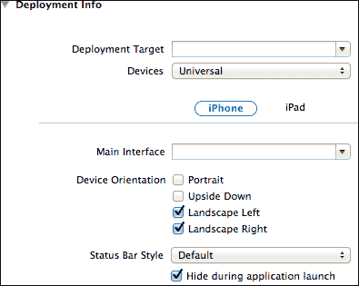

我们还可以安全地删除仍然存在于我们的`Game.m`文件中的纸板木偶代码。

# 创建我们的场景管理器设置

在上一章中，我们创建了一个场景管理器，我们现在将使用它来处理场景。在我们的第一步中，我们需要两个占位符场景，稍后我们将填充它们以包含游戏机制。我们还需要将这些场景添加到场景导演中，并显示这两个场景之一。

# 行动时间 - 创建我们的场景管理器设置

创建我们的场景管理器设置，我们需要遵循以下步骤：

1.  如果尚未打开，请打开您的 Xcode 游戏模板。

1.  右键点击**Classes**文件夹并选择**New Group**。

1.  将组重命名为**GameScenes**。

1.  创建一个新的名为`PirateCove`的 Objective-C 类，它是`Scene`类的子类。

1.  添加一个初始化器，内容如下：

    ```swift
    if ((self = [super init])) {
      NSLog(@"Pirate cove scene created");
    }
    ```

1.  创建另一个从`Scene`类派生的 Objective-C 类。将其命名为`Battlefield`。

1.  添加一个初始化器，内容如下：

    ```swift
    -(id) init
    {
        if ((self = [super init])) {
            NSLog(@"Battlefield scene created");
        }

        return self;
    }
    ```

1.  切换到`Game.m`文件。

1.  将`PirateCove.h`、`Battlefield.h`和`SceneDirector.h`文件添加到`import`部分，如下面的代码所示：

    ```swift
    #import "SceneDirector.h"
    #import "PirateCove.h"
    #import "Battlefield.h"
    ```

1.  在`init`方法中，创建`PirateCove`和`Battlefield`类的实例，并使用`@"piratecove"`和`@"battlefield"`分别作为参数调用`initWithName`方法：

    ```swift
    PirateCove *pirateCove = [[PirateCove alloc] initWithName:@"piratecove"];
    Battlefield *battlefield = [[Battlefield alloc] initWithName:@"battlefield"];
    ```

1.  创建场景导演的实例并将其添加到`Game`类中，如下面的代码所示：

    ```swift
    SceneDirector *director = [[SceneDirector alloc] init];
    [self addChild:director];
    ```

1.  将两个场景添加到场景导演中，并显示海盗湾场景：

    ```swift
    [director addScene:pirateCove];
    [director addScene:battlefield];

    [director showScene:@"battlefield"];
    ```

1.  运行示例，你将得到以下输出：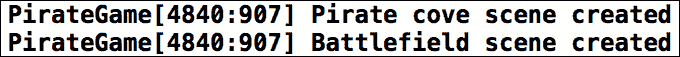

## *发生了什么？*

在步骤 1 中，我们从上一章结束的地方打开了我们的 Xcode 模板。在步骤 2 中，我们创建了一个新组，所有与我们的游戏场景相关的文件都将放入这个组中。在步骤 3 中，我们重命名了新创建的组。

在步骤 4 中，我们创建了一个新的 Objective-C 类，它继承自 `Scene` 类。在下一个步骤中，我们添加了初始化方法，其中添加了一个日志消息以查看场景是否已创建。

在步骤 6 和 7 中，我们对战场场景做了同样的操作。

在步骤 8 中，我们切换到 `Game.m` 文件后，导入了所有需要的源文件，即场景导演的头文件以及我们刚刚创建的两个场景。

在步骤 11 中，我们创建了场景和场景导演的实例。场景导演本身就是一个精灵，因此我们需要将其添加到 `Game` 类中，该类也继承自 `SPSprite`。

在步骤 12 中，我们将场景实例添加到场景导演中，这意味着场景现在已经在显示树中。然后我们调用 `SceneDirector` 实例中的方法来显示战场场景。

当我们运行示例时，屏幕上没有看到任何有价值的内容，因为场景中没有内容，但如果我们查看控制台，我们会看到我们的两个场景已经成功创建。

这里是本例的完整源代码：

| 海盗湾场景 | 战场场景 |
| --- | --- |

| `PirateCove.h`

```swift
#import "Scene.h"

@interface PirateCove : Scene

@end
```

`PirateCove.m`

```swift
#import "PirateCove.h"

@implementation PirateCove

-(id) init
{
  if ((self = [super init])) {
    NSLog(@"Pirate cove scene created");
  }

    return self;
}

@end
```

| `Battlefield.h`

```swift
#import "Scene.h"

@interface Battlefield : Scene

@end
```

`Battlefield.m`

```swift
#import "Battlefield.h"

@implementation Battlefield

-(id) init
{
    if ((self = [super init])) {
        NSLog(@"Battlefield scene created");
    }

    return self;
}

@end
```

|

`Game.m` 文件包含以下代码：

```swift
#import "Game.h" 
#import "SceneDirector.h"
#import "PirateCove.h"
#import "Battlefield.h"

@implementation Game

- (id)init
{
    if ((self = [super init]))
    {
        Sparrow.stage.color = 0xffffff;
    PirateCove *pirateCove = [[PirateCove alloc] initWithName:@"piratecove"];
    Battlefield *battlefield = [[Battlefield alloc] initWithName:@"battlefield"];

    SceneDirector *director = [[SceneDirector alloc] init];
    [self addChild:director];

    [director addScene:pirateCove];
    [director addScene:battlefield];

    [director showScene:@"battlefield"];
    }
    return self;
}

@end
```

# 向战场场景添加图像

现在场景已经准备好使用，让我们向战场场景添加一些船只。

# 实战时间 – 向战场场景添加图像

让我们查看以下步骤，以向战场场景添加图像：

1.  打开 `Battlefield.m` 文件并导入 `Assets` 头文件：

    ```swift
    #import "Assets.h"
    ```

1.  删除日志消息并添加背景图像，如下代码所示：

    ```swift
    SPImage *background = [SPImage imageWithTexture:[Assets texture:@"water.png"]];
    background.x = (Sparrow.stage.width - background.width) / 2;
    background.y = (Sparrow.stage.height - background.height) / 2;
    ```

1.  添加海盗船，如下代码所示：

    ```swift
    SPImage *pirateShip = [SPImage imageWithTexture:[Assets texture:@"ship_pirate.png"]];
    pirateShip.x = (Sparrow.stage.width - pirateShip.width) / 2;
    pirateShip.y = (Sparrow.stage.height - pirateShip.height) / 2;
    ```

1.  使用以下代码添加敌方船只：

    ```swift
    SPImage *ship = [SPImage imageWithTexture:[Assets texture:@"ship.png"]];
    ship.x = 100;
    ship.y = 100;
    ```

1.  将所有子节点添加到显示树中，如下代码所示：

    ```swift
    [self addChild:background];
    [self addChild:pirateShip];
    [self addChild:ship];
    ```

1.  运行示例，你将得到以下输出：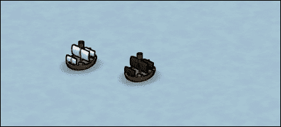

## *发生了什么？*

在步骤 1 中，我们打开了 `Battlefield.m` 文件，因为如果我们想更改战场场景中的任何内容，就需要这个文件，并且我们导入了 `Assets.h` 文件以便使用我们的资产管理系统。

在步骤 2 中，我们准备了背景，它应该位于屏幕中央。我们使用我们的资产管理系统从指定的文件中获取纹理，该纹理返回缓存的或新加载的纹理，然后该纹理将用于在屏幕上绘制 `SPImage`。

在步骤 3 中，我们添加了海盗船，它应该在屏幕中央。在下一个步骤中，我们添加了一艘敌舰，它不应该离我们的船太远。

在步骤 5 中，我们将所有显示对象添加到显示树中，当我们运行示例时，我们在屏幕上看到了两艘船。

`Battlefield.m` 文件将包含以下代码：

```swift
#import "Battlefield.h"
#import "Assets.h"

@implementation Battlefield

-(id) init
{
    if ((self = [super init])) {
    SPImage *background = [SPImage imageWithTexture:[Assets texture:@"water.png"]];
    background.x = (Sparrow.stage.width - background.width) / 2;
    background.y = (Sparrow.stage.height - background.height) / 2;

    SPImage *pirateShip = [SPImage imageWithTexture:[Assets texture:@"ship_pirate.png"]];
    pirateShip.x = (Sparrow.stage.width - pirateShip.width) / 2;
    pirateShip.y = (Sparrow.stage.height - pirateShip.height) / 2;

    SPImage *ship = [SPImage imageWithTexture:[Assets texture:@"ship.png"]];
    ship.x = 100;
    ship.y = 100;

    [self addChild:background];
    [self addChild:pirateShip];
    [self addChild:ship];
    }

    return self;
}

@end
```

# 在海盗湾场景中排列图像

让我们转到海盗湾场景，为我们的海盗提供一个舒适的小家。在这个示例中，我们将添加一个房子、一个酒馆和一个铁匠到场景中。这些将作为我们可以稍后更新我们的船的地方。

# 时间行动 – 在海盗湾场景中排列图像

要将图片添加到海盗湾场景中，请按照以下步骤操作：

1.  打开 `PirateCove.m`。

1.  使用以下代码行导入 `Assets` 头文件：

    ```swift
    #import "Assets.h"
    ```

1.  删除日志消息并添加背景图片，如下面的代码所示：

    ```swift
    SPImage *background = [SPImage imageWithTexture:[Assets   texture:@"cove.png"]];
    background.x = (Sparrow.stage.width - background.width) / 2;
    background.y = (Sparrow.stage.height - background.height) / 2;
    ```

1.  添加我们的海盗船，如下面的代码所示：

    ```swift
    SPImage *pirateShip = [SPImage imageWithTexture:[Assets   texture:@"ship_pirate.png"]];
    pirateShip.x = Sparrow.stage.width - pirateShip.width - 120;
    pirateShip.y = Sparrow.stage.height - pirateShip.height - 10;
    ```

1.  添加一个房子，如下面的代码所示：

    ```swift
    SPImage *house = [SPImage imageWithTexture:[Assets   texture:@"house.png"]];
    house.x = 100;
    house.y = 100;
    ```

1.  添加一个酒馆，如下面的代码所示：

    ```swift
    SPImage *tavern = [SPImage imageWithTexture:[Assets   texture:@"tavern.png"]];
    tavern.x = 220;
    tavern.y = 40;
    ```

1.  添加一个铁匠，如下面的代码所示：

    ```swift
    SPImage *weaponsmith = [SPImage imageWithTexture:[Assets   texture:@"weaponsmith.png"]];
    weaponsmith.x = 350;
    weaponsmith.y = 130;
    ```

1.  将所有图片注册到显示树中：

    ```swift
    [self addChild:background];
    [self addChild:pirateShip];
    [self addChild:house];
    [self addChild:tavern];
    [self addChild:weaponsmith];
    ```

1.  前往 `Game.m` 文件，将默认场景更改为海盗湾，如下面的代码所示：

    ```swift
    [director showScene:@"piratecove"];
    ```

1.  运行示例，你将得到以下输出：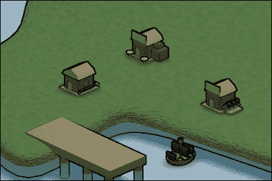

## *发生了什么？*

大多数步骤与战场场景非常相似，所以我们不需要详细解释每个步骤。

在步骤 1 中，我们打开了 `PirateCove.m` 文件，其中应该包含关于海盗湾的所有内容。在这里我们还需要资产管理系统，所以在步骤 2 中我们导入了它。

在步骤 3 中，我们加载了合适的图片，它应该在屏幕中央。在步骤 4 到 7 中，我们加载了我们在屏幕上想要显示的不同实体，例如海盗船和房子。我们在屏幕上随机地定位它们，但留出足够的空间，以免显得杂乱。

在步骤 8 中，我们将所有显示对象添加到屏幕上。请记住，顺序很重要。如果我们最后添加背景图片，我们只能看到背景，什么也看不到。

我们将场景导演设置为加载海盗湾场景而不是战场场景，当我们运行示例时，我们在屏幕上看到了海盗湾。

## 快速问答

Q1. 在开发通用应用程序时，我们需要积极注意哪些方面？

1.  电池电量

1.  屏幕尺寸和纹理尺寸限制

1.  GPU 内存

Q2. 如果我们想显示后缀为 `~ipad` 的图片，它将在哪些设备上加载？

1.  Non-Retina iPad

1.  Retina iPhone

1.  Retina iPad

Q3. 在 iOS 点坐标系统中，256 x 256 像素的图片在 Retina iPhone 上的尺寸是多少？

1.  128 x 128 pt

1.  256 x 256 pt

1.  512 x 512 pt

Q4. 如果将 `doubleOnPad` 参数设置为 `YES`，加载 Retina iPad 上的图片需要哪个后缀？

1.  @2x

1.  @3x

1.  @4x

# 摘要

在本章中，我们学习了 iPad 和 iPhone 设备之间的跨平台设备兼容性。

具体来说，我们涵盖了需要识别的文件名后缀，为哪种设备加载哪个文件，如何在点坐标系统中工作，以及加载图片时的纹理大小限制。

我们还设置了游戏的骨架，其中我们利用我们的资源和场景管理器为不同类型的设备加载了图片。

现在我们游戏的场景已经可用，并且我们在屏幕上放置了一些图片，我们准备美化我们的游戏——这是下一章的主题。
