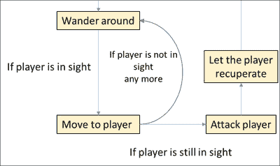

# 第八章。人工智能和游戏进度

*在上一章中，我们学习了如何向我们的游戏添加用户界面元素。我们在船只上方添加了生命值表示，添加了按钮，甚至创建了我们的对话框。*

在本章中，我们将向我们的游戏添加人工智能。以下是我们将要涵盖的主题：

+   模糊逻辑和状态机的概念

+   敌舰应该移动并攻击

+   在游戏中添加某种进步

+   赢得和输掉游戏

然而，在我们实际编码之前，让我们看看我们将要实现的人工智能的概念。

# 理论上的人工智能

敌舰的目标是四处移动，如果它们足够接近，就攻击我们的船只。为了帮助我们实现这一逻辑，我们需要详细研究两个概念；我们将在接下来的章节中讨论这些内容。

## 解释模糊逻辑

让我们以一辆行驶的火车为例。我们可以使用布尔值来描述其状态。如果设置为 true，它正在快速移动；如果设置为 false，它没有快速移动。

然而，这还不够。假设火车以每小时 80 英里的速度行驶，然后以每小时 100 英里的速度行驶。在这两种速度下，我们的布尔值都将为 true，但我们无法进一步区分它。此外，如果火车没有移动，我们也没有状态。

模糊逻辑描述了一个被放入日常用语中的值区间。让我们退一步，将其与数学逻辑进行比较。二进制（二值）逻辑有两个值：true 和 false。一个如*1 + 1 = 2*的表达式评估为“true”。表达式“给一加一很可能是两个”在二进制逻辑中可能没有太多意义，但在模糊逻辑中是可能的。

模糊逻辑没有 true 和 false 这两个值，但它有介于两者之间的值，如 bit、quite 或 about。这与人类的思维相似。

为了进一步说明这一点，让我们看看我们的移动火车示例如果以表格形式呈现会是什么样子：

| 术语 | 速度 |
| --- | --- |
| 未移动 | 0 英里/小时 |
| 非常慢 | 1 至 9 英里/小时 |
| 几乎快 | 10 至 49 英里/小时 |
| 相当快 | 50 至 89 英里/小时 |
| 非常快 | 90 至 119 英里/小时 |

对于我们的游戏，我们可以将此应用于类似的价值：敌舰与我们自己的船只之间的距离。

## 解释状态机

状态机是一系列状态放入顺序逻辑电路中。这听起来很抽象，所以让我们详细解释一下：首先，状态是一个值，如果不同的状态变得活跃，它就会改变。门有两个状态：锁定和未锁定。如果门是锁着的，它会保持锁定状态，直到它被解锁。

这里有一个更接近我们游戏的例子：我们需要多个状态，例如，**移动到玩家**、**等待 3 秒**和**攻击玩家**。

现在，我们需要将这些状态以某种顺序排列。比如说，敌舰首先移动到玩家那里，然后攻击并等待 3 秒钟。然后，过程再次开始，如下面的图表所示：


到目前为止，我们已经了解了状态和状态机。有限状态机是具有有限状态的状态机。前面的图当然是一个简化的有限状态机如何工作的例子。一些模型也有转换来描述从一种状态移动到另一种状态所采取的动作。在插图上，转换通常伴随着条件，例如“玩家是否在视线中？”

大多数简单的 AI 都采用这种策略。最突出的例子之一是**Quake**。公平地说，在更复杂和现代的游戏中，使用的 AI 机制各不相同。一个例子是 AI 适应玩家的动作：如果在策略游戏中，玩家选择攻击一个特定的点，AI 就会根据玩家攻击的频率越来越多地适应防御这个位置。

对于我们的目的，有限状态机已经足够。那么，让我们看看敌舰需要哪些状态：

+   我们希望敌舰四处游荡

+   我们希望敌舰移动到玩家的附近

+   我们希望敌舰进行攻击

+   我们希望敌舰在攻击后稍作等待（让玩家恢复）

让我们将这些状态以如下所示的图表形式表示：



# 让敌舰移动和攻击

现在我们已经了解了模糊逻辑和状态机，我们可以将这些作为人工智能的机制实现。

## 移动舰船

首先，我们希望舰船四处移动——既四处游荡又移动到玩家舰船。

# 行动时间 – 让敌舰移动

为了让敌舰能够移动，我们需要使用以下步骤：

1.  如果 Xcode 项目尚未打开，请打开我们的 Xcode 项目。

1.  打开 `Battlefield.h` 文件。

1.  定义所有 AI 状态为 `enum`，如下面的代码所示：

    ```swift
    typedef NS_ENUM(NSInteger, AIState) {
        StateWanderAround,
        StateMoveToPlayer,
        StateAttack,
        StateRecuperate
    };
    ```

1.  在 `Battlefield` 场景内部，添加一个新的实例变量 `_aiState`，其类型为 `AIState`。

1.  打开 `Ship.h` 文件。

1.  添加一个回调块类型，如下面的代码行所示：

    ```swift
    typedef void(^ShipCallback)(void);
    ```

1.  为 `Ship` 类声明三个新的方法，如下面的代码所示：

    ```swift
    -(void) moveToX:(float)x andY:(float)y withBlock:(ShipCallback) block;
    -(float) checkDistanceToShip:(Ship *)ship;
    -(void) moveToShip:(Ship *)ship withBlock:(ShipCallback) block;
    ```

1.  打开 `Ship.m` 文件。

1.  将 `-(void) moveToX:(float) x andY:(float) y` 方法的内容移动到 `-(void) moveToX:(float)x andY:(float)y withBlock:(ShipCallback) block` 方法中。

1.  在新的 `moveTo` 方法中，在 `[tweenY animateProperty:@"y" targetValue:targetY];` 行之后添加以下代码：

    ```swift
    __block BOOL isTweenXCompleted = NO;
    __block BOOL isTweenYCompleted = NO;

    tweenX.onComplete = ^{
      isTweenXCompleted = YES;

      if (isTweenXCompleted && isTweenYCompleted) {
        if (block != nil) {
          [block invoke];
        }
      }
    };

    tweenY.onComplete = ^{
      isTweenYCompleted = YES;

      if (isTweenXCompleted && isTweenYCompleted) {
        if (block != nil) {
          [block invoke];
        }
      }
    };
    ```

1.  使用以下代码实现 `checkDistanceToShip` 方法：

    ```swift
    -(float) checkDistanceToShip:(Ship *)ship
    {
    SPPoint* p1 = [SPPoint pointWithX:self.x + (self.width / 2) y:self.y + (self.height / 2)];
    SPPoint* p2 = [SPPoint pointWithX:ship.x + (ship.width / 2) y:ship.y + (ship.height / 2)];

    float distance = [SPPoint distanceFromPoint:p1 toPoint:p2];

    return distance;
    }
    ```

1.  `moveToShip` 方法应该具有以下内容：

    ```swift
    -(void) moveToShip:(Ship *)ship withBlock:(ShipCallback)block
    {
        floatrandomX = arc4random_uniform(80) - 40.0f;
        floatrandomY = arc4random_uniform(80) - 40.0f;

        [self moveToX:ship.x + randomX andY:ship.y + randomY withBlock:block];
    }
    ```

1.  重新实现 `moveToX:(float)x andY:(float)y` 方法，如下面的代码所示：

    ```swift
    -(void) moveToX:(float)x andY:(float)y
    {
     [self moveToX:x andY:y withBlock: nil];
    }
    ```

1.  继续到 `Battlefield.m` 文件。

1.  在初始化器内部，将 `_aiState` 实例变量设置为 `StateWanderAround`，如下面的代码行所示：

    ```swift
    _aiState = StateWanderAround;
    ```

1.  移除补间动画和杂技演员。

1.  让我们声明一个辅助方法来获取屏幕上的随机位置，如下面的代码所示：

    ```swift
    -(SPPoint *) randomPos
    {
      return [SPPoint pointWithX:((arc4random() % (int) (Sparrow.stage.width - 80.0f)) + 40.0f) y:((arc4random() % (int) (Sparrow.stage.height - 80.0f)) + 40.0f)];
    }
    ```

1.  定义一个名为 `updateAI` 的方法，如下面的代码所示：

    ```swift
    -(void) updateAI: (Ship *)ship withState: (AIState) aiState
    {
    switch (aiState) {
    caseStateWanderAround: {
    SPPoint *point = [self randomPos];
                [ship moveToX:point.x andY:point.y withBlock:^{
    if ([ship checkDistanceToShip:_pirateShip] < 200.0f) {
                        //In sight
                        [self updateAI:ship withState:StateMoveToPlayer];
                    } else {
                        //Not in sight
                        [self updateAI:ship withState:aiState]
                    }
                }];
            }
    break;
    caseStateMoveToPlayer: {
                [ship moveToShip:_pirateShip WithBlock:^{
    if ([ship checkDistanceToShip:_pirateShip] < 100.0f) {
                        // Attack
                        [self updateAI:ship withState:StateAttack];
                    } else {
                        //Not in sight
                        [self updateAI:ship   withState:StateWanderAround];
                    }
                }];
            }
    break;
    default:
    break;
        }
    }
    ```

1.  在初始化杂技演员之前的位置调用 `updateAI` 方法，如下面的代码所示：

    ```swift
    [self updateAI:_enemyShip withState:_aiState];
    ```

1.  运行示例。

    我们现在看到我们的船和敌船正在各自移动。

    

## *发生了什么？*

在第 1 步，我们打开了我们的游戏项目；在下一步中，我们查看了 `Battlefield.h` 文件。我们之前提到的所有 AI 状态都被放入了 `enum` 中。在第 4 步，我们定义了一个实例变量来保存默认的 AI 状态。

我们已经在 `Ship` 类中有一个 `moveTo` 方法，它允许我们在屏幕上移动任何船。不幸的是，我们目前还没有一种方法来知道移动何时结束。我们可以使用在前面章节中使用过的 Objective-C 语言特性，即块。我们将块定义为参数；当移动结束时，块会被调用。在第 6 步，我们定义了我们的块类型。

在下一步中，我们为我们的 `Ship` 类声明了通用方法：

+   移动到某个位置，并在移动完成后使用回调

+   检查当前船与任何其他船之间的距离

+   移动到另一艘船，并在操作完成后使用回调

然后，我们准备在第 8 步实现这些方法。我们首先将旧 `moveTo` 方法的内容移动到带有回调的新方法中。

然后，我们只需在动画完成后调用回调块。由于补间动画可能根据触摸点与船之间的距离具有两种不同的速度，我们需要记录每个补间动画是否完成，对于两个补间动画都这样做。为了检查补间动画是否实际上已完成，我们在补间的 `onComplete` 属性中添加了一个块。一旦补间完成，该块就会被调用。在这个块内部，我们设置一个布尔值来标记当前的补间已完成，如果两个补间都已完成，我们就调用回调。为了能够在 `onComplete` 块中使用我们的局部变量，我们需要在它们前面加上 `__blocks` 前缀。

在第 11 步，我们实现了一个计算两艘船之间距离的方法：我们取了两艘船的中心，将它们转换为 `SPPoint`，并利用 `SPPoint` 提供的静态 `distanceFromPoint` 方法。我们只需要返回结果。

`moveToShip` 方法调用了带有飞船坐标和附加随机性的 `moveTo` 方法。我们使用了 `arc4random` 函数来获取一个随机值。`arc4random` 函数返回一个介于零和一之间的浮点数。`arc4random_uniform` 函数接受一个参数，并创建一个介于零和传入参数减一之间的随机数。在第 13 步中，没有回调的 `moveTo` 方法只是调用了带有回调的 `moveTo` 版本，回调参数通过 `nil` 传递。

当我们移动到 `Battlefield.m` 文件时，我们将 `_aiState` 实例变量设置为 `WanderState` AI 状态。然后我们安全地移除了之前负责敌人飞船移动动画的补间和 `juggler`。

在第 17 步中，我们实现了一个获取屏幕上随机位置的方法。我们还设置了一个边距，以确保位置肯定在屏幕的边界内。我们使用了 `SPPoint` 类的工厂方法来存储 `x` 和 `y` 位置。

在下一步中，我们实现了更新 AI 的方法：

+   如果飞船正在四处游荡，我们会得到一个随机位置并移动到那里。

+   如果飞船已经移动，它会检查玩家与飞船参数之间的距离是否小于 200 点。然后飞船移动到玩家那里。如果不是这种情况，我们再次调用 `updateAI` 方法，并使用 `WanderState` AI 状态。

+   如果飞船移动到玩家附近，它会再次检查距离。如果距离小于 100 点，它开始攻击，否则它就回到四处游荡的状态。

在初始化器内部，我们使用敌人飞船和我们的默认 AI 状态调用了 `updateAI` 方法。这应该就是我们之前初始化实例变量 `_juggler` 的地方。

当我们运行示例时，如果敌人飞船处于正确的状态，它会四处游荡。如果它在视线范围内，它会移动到玩家飞船那里。如果敌人飞船离玩家太近，它就会停止。

## 攻击其他飞船

现在敌人飞船正在四处游荡，让我们让它攻击我们的飞船。

# 行动时间 - 敌人应该攻击玩家

为了让敌人攻击玩家的飞船，请按照以下步骤操作：

1.  打开 `Ship.h` 文件。

1.  将我们的 `_juggler` 实例变量重构为属性，如下面的代码行所示：

    ```swift
    @property SPJuggler *juggler;
    ```

1.  使用以下代码行，添加一个名为 `shootWithBlock` 的方法，该方法应该射击并带有作为参数的回调：

    ```swift
    -(void) shootWithBlock:(ShipCallback) block;
    ```

1.  打开 `Ship.m` 文件，并将 `shoot` 方法的全部内容移动到 `shootWithBlock` 方法中。

1.  在 `shootWithBlock` 方法中，在 `currentClip` 变量的完整监听器内部调用回调作为其最后一条语句。

1.  将 `shoot` 方法更新为调用 `shootWithBlock` 方法并传递 `nil`。

1.  打开 `Battlefield.m` 文件，并添加一个碰撞检测方法，如下面的代码所示：

    ```swift
    -(void) checkShipCollision: (Ship *) ship1 againstShip: (Ship *) ship2
    {
        SPRectangle *enemyShipBounds = [ship1 boundsInSpace:self];
        SPRectangle *ball1 = [ship2.cannonBallLeft boundsInSpace:self];
        SPRectangle *ball2 = [ship2.cannonBallRight boundsInSpace:self];

        if ([enemyShipBounds intersectsRectangle:ball1] || [enemyShipBounds intersectsRectangle:ball2]) {
            if (ship2.cannonBallLeft.visible || ship2.cannonBallRight.visible) {
                [ship2 abortShooting];
                [ship1 hit];
            }
        }
    }
    ```

1.  在`onEnterFrame`方法内部，将当前的碰撞检测替换为`checkShipCollision`方法，如下面的代码所示：

    ```swift
    [self checkShipCollision:_pirateShipagainstShip:_enemyShip];
    [self checkShipCollision:_enemyShipagainstShip:_pirateShip];
    ```

1.  使用以下代码更新`WanderAround` AI 状态，增加一个额外的攻击机会：

    ```swift
    if ([ship checkDistanceToShip:_pirateShip] < 200.0f) {
     if ([ship checkDistanceToShip:_pirateShip] < 100.0f) {
     // Attack directly
     [self updateAI:ship withState:StateAttack];
     } else {
     //In sight
     [self updateAI:ship withState:StateMoveToPlayer];
     }
    } else {
      //Not in sight
      [self updateAI:ship withState:aiState];
    }
    ```

1.  如以下代码所示，将以下状态添加到我们的`updateAI`方法中的`switch`-`case`语句中：

    ```swift
    case StateAttack: {
      [ship shootWithBlock:^{
        [self updateAI:ship withState:StateRecuperate];
      }];
    }
    case StateRecuperate: {
      [ship.juggler delayInvocationByTime:0.3f block:^{
        [self updateAI:ship withState:StateWanderAround];
      }];
    }
    ```

1.  运行示例以查看结果。

    如果敌舰足够接近我们的船并且在攻击状态中，它开始攻击我们的船。参见图表：

    

## *发生了什么？*

在`Ship.h`文件中，我们将`_juggler`实例变量重构为一个属性，因为我们需要从战场场景中访问它，并且其访问不应仅限于`Ship`实例。我们添加了`shootWithBlock`方法，我们在第 4 步中实现了它，将`shoot`方法的内容移动到新的`shootWithBlock`方法中。

然后，我们调用了应该现在是事件监听器中完成`currentClip`缓动的最后一个回调。在第 6 步中，我们将`shoot`方法更新为调用带有空块的`shootWithBlock`方法，就像我们在上一个示例中所做的那样。

由于我们多次使用了碰撞检测，我们在下一步将其放入一个单独的方法中。现在，我们可以通过调用新的碰撞检测来替换我们旧的碰撞检测逻辑。我们需要调用两次，第一次将`_pirateShip`作为第一个参数，将`_enemyShip`作为第二个参数。当我们第二次调用`checkShipCollision`时，参数的顺序需要相反。

在第 9 步中，我们添加了一个额外的状态转换。如果海盗船和敌舰之间的距离小于 100 点，它将直接攻击而不是先移动到玩家那里。在接下来的步骤中，我们添加了以下两个缺失的状态：

+   在攻击状态中，我们调用了`shootWithBlock`方法，当射击完成时，我们移动到恢复状态

+   在`StateRecuperate` AI 状态中，我们等待了 0.3 秒，然后继续四处游荡

当我们运行示例时，我们的状态机已经完全完成，所有状态都被使用。

## 向 AI 添加模糊值

我们的人工智能目前运行良好，但我们还没有任何模糊逻辑。

# 行动时间 – 使用模糊值增强 AI

要替换我们硬编码的值，我们需要使用以下步骤：

1.  打开`Battlefield.m`文件。

1.  添加一个名为`fuzzyValue`的新方法，如下面的代码所示：

    ```swift
    -(float) fuzzyValue: (NSString *) value
    {
      if ([value isEqualToString:@"Very near"]) {
        return (float) (arg4random() % 40) + 40.0f;
      } else if ([value isEqualToString:@"Quite near"]) {
        result = (float) (arc4random() % 30) + 70.0f;
      } else {
        result = (float) (arc4random() % 50) + 150.0f;
      }
    }
    ```

1.  使用以下代码，将硬编码的值更新为`fuzzyValue`方法中的值：

    ```swift
    if ([ship checkDistanceToShip:_pirateShip] < [self fuzzyValue:@"Near"]) {
    if ([ship checkDistanceToShip:_pirateShip] < [self fuzzyValue:@"Very near"]) {
    if ([ship checkDistanceToShip:_pirateShip] < [self fuzzyValue:@"Quite near"]) {
    ```

1.  运行示例。如果我们插入日志来查看实际的值，我们会看到以下输出：

## *发生了什么？*

本例的目标是将我们的硬编码值替换为类似于模糊逻辑的东西。在步骤 2 中，我们添加了一个检查值并返回新随机值的方法。随机性不是模糊逻辑的必要因素，但在这个案例中使用了它，以便值在特定范围内。

如果我们有多于模糊值，将那些值保存在`NSDictionary`中是个好主意。这个字典将使用口语术语作为键，并为值提供一个块。在块内部将包含返回随机数的逻辑。如果模糊值被传递进来，我们调用块并得到一个随机数。

接下来，我们使用`fuzzyValue`方法更新了硬编码的值，并将其放在每次的口语术语中。

当我们运行示例时，AI 的工作方式与之前一样，但现在有了额外的随机性。

## 来试试英雄

我们可以通过将 AI 逻辑从战场场景移到单独的类中来大大提高 AI。由于我们使用了大量的字符串作为模糊值，可能将它们移动到常量中甚至创建我们自己的宏是个好主意。

# 添加游戏进度

现在我们已经实现了 AI，让我们给我们的游戏添加一些进度。我们需要添加等级。每个等级应该有一个更多的敌舰，我们可以在等级之间升级我们的船的伤害和生命值。

## 添加 World 类

我们需要保留一些值，例如当前级别，在一个单独的实体中，我们将描述为`World`类。

# 行动时间 – 添加 World 类

为了实现我们的`World`类，我们需要使用以下步骤：

1.  添加一个名为`World`的新 Objective-C 类，它从`NSObject`派生。

1.  要添加一个`level`属性，其类型为`int`，请执行以下操作：

    +   在`World.h`中添加一个名为`level`的静态变量，如下面的代码行所示：

        ```swift
        static int level;
        ```

    +   添加一个具有相同名称的静态获取器，它返回静态变量，如下面的代码行所示：

        ```swift
        +(int) level;
        ```

    +   添加一个静态设置器（`setLevel`），它设置静态变量，如下面的代码行所示：

        ```swift
        +(void) setLevel:(int)value;
        ```

1.  对属性`gold`、`hitpoints`和`damage`重复步骤 2。

1.  我们还需要一个`levelMax`属性，但这个属性没有设置器。

1.  我们需要在`World.m`文件中导入`Assets.h`文件。

1.  添加一个需要在`World.h`中声明的静态`reset`方法。它应该看起来像以下代码片段：

    ```swift
    +(void) reset
    {
        level = 1;
        levelMax = 3;
        gold = 200;
        damage = [(NSNumber *) [Assets dictionaryFromJSON:@"gameplay.json"][@"damage"] intValue];
        hitpoints = [(NSNumber *) [Assets dictionaryFromJSON:@"gameplay.json"][@"hitpoints"] intValue];
    }
    ```

1.  我们还需要一个`log`方法。它需要在`World.h`中声明，并看起来像以下代码：

    ```swift
    +(void) log
    {
        NSLog(@"Level %d of %d", level, levelMax);
        NSLog(@"Gold: %d", gold);
        NSLog(@"Players' hit points: %d", hitpoints);
        NSLog(@"Players' damage: %d", damage);
    }
    ```

1.  在`Game.m`中，我们需要在其初始化器中调用`World`方法，如下面的代码所示：

    ```swift
    [director addScene:battlefield];

    [World reset];
    [World log];

    [director showScene:@"battlefield"];
    ```

1.  运行示例以查看结果。我们现在应该在控制台中看到以下输出：

## *刚才发生了什么？*

首先，我们创建了 `World` 类。Objective-C 不支持静态属性。如果我们添加具有 `methodName` 作为名称的静态方法，并返回一个值，我们可以模仿具有静态属性的行为。我们还需要定义一个名为 `setMethodName` 的方法，它有一个参数。现在我们可以像访问属性一样访问 `methodName`。然而，在伪获取器内部，我们只能访问静态变量。

在完成设置后，我们需要在第 5 步中导入 `Assets` 类。之后，我们添加了一个 `reset` 方法，该方法从我们的 `gameplay.json` 文件中加载伤害和生命值。我们将 `gold`、`level` 和 `levelMax` 变量设置为默认值。在我们的例子中，当前级别是第一个；我们最多有三个级别，初始时 `gold` 变量的金额是 200。

我们后来实现的 `log` 方法记录了所有值，除了 `levelMax` 值。在第 8 步中，我们调用了 `reset` 方法，并在之后直接调用了 `log`。当我们运行示例时，我们在控制台中看到了日志输出。

## 勇敢的尝试者

目前，`gold`、`level` 和 `levelMax` 变量是直接在代码中设置的。从 `gameplay.json` 文件中加载它们会更好。

## 更新场景和对话框类

在我们开始实现进度系统之前，还有一些小事情需要重构。让我们解决这些问题：

+   如果场景再次显示，我们无法重置场景

+   对话框中的多行字符串显示不正确

+   我们无法在 `Dialog` 类外部访问对话框的按钮

+   点击按钮后，对话框不会关闭

# 更新场景和对话框类的时间到了

要添加我们的第一个按钮，请按照以下步骤操作：

1.  打开 `Dialog.h` 文件。

1.  使用以下代码为 **是** 和 **否** 按钮添加属性：

    ```swift
    @propertySPButton *buttonYes;
    @propertySPButton *buttonNo;
    ```

1.  切换到 `Dialog.m`。

1.  将所有对局部变量的引用重构为使用属性。

1.  使用以下代码更新 `_title` 和 `_content` 的位置：

    ```swift
    content = [SPTextField textFieldWithWidth:background.width - 96.0f height:background.height - 150.0f text:@"Dialog default text"];
    _content.x = 52.0f;
    _content.y = 66.0f;

    [SPTextField registerBitmapFontFromFile:@"PirateFont.fnt"];

    _title = [SPTextField textFieldWithWidth:background.width * 0.6 height:30.0f text:@"Dialog"];
    _title.fontName = @"PirateFont";
    _title.color = SP_WHITE;

    _title.x = 36.0f;
    _title.y = 26.0f;
    ```

1.  在 `onButtonYes` 和 `onButtonNo` 中，将 `self.visible = NO;` 作为第一条语句添加。

1.  在 `Scene.h` 中，使用以下代码声明一个名为 `reset` 的方法：

    ```swift
    -(void) reset;
    ```

1.  在 `Scene.m` 中，实现一个空的 `reset` 方法。

1.  在 `SceneDirector.m` 中，更新 `showScene` 方法中的这段代码：

    ```swift
    if (_dict[name] != nil) {
      ((Scene *) _dict[name]).visible = YES;
     [((Scene *) _dict[name]) reset];

    }
    ```

1.  运行示例。

    如果我们将 `reset` 方法实现到战场场景中，并向战场场景的 `reset` 方法添加一个日志消息，我们的输出将变为如下：

    

## *发生了什么？*

我们首先解决了对话框问题。在第 2 到 4 步中，我们将按钮移动到属性中，并更新了 `Dialog` 实现内部的所有引用。然后我们更新了标题和消息内容的位置。长字符串不会超过对话框的边界。在第 6 步中，我们在点击任何按钮后隐藏了对话框。

为了使场景能够重置自己，我们首先需要添加 `reset` 方法，并在 `Scene.m` 中将其实现为一个空方法。然后我们需要更新场景导演，在场景变为可见后立即调用当前场景的 `reset` 方法。

如果我们现在运行示例，并且我们在战场场景中实现了 `reset` 方法并添加了日志消息，我们会看到战场场景中的 `reset` 方法实际上会被调用。

## 为海盗湾添加游戏机制

现在我们有了 `World` 类，并且我们已经更新了 `Dialog` 和 `Scene` 类以适应我们的需求，我们可以在海盗湾中添加一些游戏机制。海盗湾是我们升级船只的地方。

# 行动时间 – 使海盗湾可玩

要为海盗湾添加游戏机制，请按照以下步骤操作：

1.  将代码行 `[SPTextField registerBitmapFontFromFile:@"PirateFont.fnt"];` 从 `Dialog.m` 移动到 `Game.m` 文件的开始部分。

1.  在 `PirateCove.m` 中添加一个按钮，如下所示：

    ```swift
    SPButton *buttonBattle = [SPButton buttonWithUpState:[[Assets textureAtlas:@"ui.xml"] textureByName:@"dialog_yes"]; 
    text:@"Begin battle"];

    buttonBattle.y = Sparrow.stage.height - buttonBattle.height - 8.0f;
    buttonBattle.x = (Sparrow.stage.width - buttonBattle.width) / 2;

    [buttonBattle addEventListenerForType:SP_EVENT_TYPE_TRIGGERED block:^(SPEvent *event){
      [((SceneDirector *) self.director) showScene:@"battlefield"];
    }];
    ```

1.  使用以下代码行将按钮添加到显示树中：

    ```swift
    [self addChild:buttonBattle];
    ```

1.  在以下代码中，我们添加了一个文本字段来显示当前的金币数量，首先需要将其声明为实例变量：

    ```swift
    _goldTextField = [SPTextField textFieldWithWidth:Sparrow.stage.width - 16.0f height:30.0f text:@"Gold"];
    _goldTextField.fontName = @"PirateFont";
    _goldTextField.color = SP_WHITE;

    _goldTextField.x = 8.0f;
    _goldTextField.y = 8.0f;
    ```

1.  使用以下代码行将文本字段添加到显示树中：

    ```swift
    [self addChild:_goldTextField];
    ```

1.  添加一个方法来更新屏幕上的金币数量，如下所示：

    ```swift
    -(void) updateGoldTextField
    {
        _goldTextField.text = [NSString stringWithFormat:@"Gold: %d", World.gold];
    }
    ```

1.  在 `PirateCove.h` 文件中，添加一个名为 `_dialogUpdateDamage` 的实例变量，如下所示：

    ```swift
    Dialog *_dialogUpdateDamage;
    ```

1.  添加一个名为 `_goldDamage` 的实例变量，如下所示：

    ```swift
    int _goldDamage;
    ```

1.  在初始化器中，为第一个对话框添加以下代码：

    ```swift
    _dialogUpdateDamage = [[Dialog alloc] init];

    _dialogUpdateDamage.title.text = @"Update damage?";

    _dialogUpdateDamage.x = (Sparrow.stage.width - _dialogUpdateDamage.width) / 2;
    _dialogUpdateDamage.y = (Sparrow.stage.height - _dialogUpdateDamage.height) / 2;

    _dialogUpdateDamage.visible = NO;

    [weaponsmith addEventListenerForType:SP_EVENT_TYPE_TOUCH block:^(SPEvent *event){
      if (World.gold < _goldDamage) {
        _dialogUpdateDamage.buttonYes.enabled = NO;
      }

      _dialogUpdateDamage.visible = YES;
    }];

    [_dialogUpdateDamage addEventListener:@selector(onUpdateDamage:) atObject:self forType:EVENT_TYPE_YES_TRIGGERED];
    ```

1.  使用以下代码行将对话框添加到显示树中：

    ```swift
    [self addChild:_dialogUpdateDamage];
    ```

1.  添加 `onUpdateDamage` 方法，如下所示：

    ```swift
    -(void) onUpdateDamage: (SPEvent *) event
    {
    World.damage = World.damage + (int) (World.damage / 10);
    World.gold = World.gold - _goldDamage;
        [self updateGoldTextField];
    }
    ```

1.  对升级生命值的对话框重复步骤 7 到 11。

1.  按照以下方式为海盗湾场景添加一个 `reset` 方法：

    ```swift
    -(void) reset
    {
        _goldDamage = (150 + (50 * (World.level - 1)));
        _dialogUpdateDamage.content.text = [NSString stringWithFormat:@"Increasing damage costs %d gold. Do you wish to proceed?", _goldDamage];

        _goldHitpoints = (200 + (75 * (World.level - 1)));
        _dialogUpdateHitpoints.content.text = [NSString stringWithFormat:@"Increasing hitpoints costs %d gold. Do you wish to proceed?", _goldHitpoints];

        [self updateGoldTextField];
    }
    ```

1.  更新 `Game.m` 文件中的语句，以在开始游戏时显示海盗湾。

1.  运行示例以查看结果。我们现在可以在海盗湾中升级我们的船只，如下面的截图所示：

## *发生了什么？*

在步骤 1 中，我们将位图字体的注册移动到了 `Game` 类中。我们只需要它一次。由于我们之前只有一个对话框，所以注册字体的位置并不重要。然而，现在我们有多个对话框，对话框的初始化器会多次注册字体。

在第 2 步中，我们添加了一个按钮，当我们点击它时可以切换到战场场景。在将按钮添加到显示树之后，我们还添加了一个文本字段来显示当前的金币数量。随后我们将文本字段添加到显示树中。我们还添加了一个更新文本字段的方法。

在第 6 步到第 11 步中，我们在屏幕上添加了一个对话框，当点击武器师时会弹出。它检查我们是否有足够的金币可以使用，并且如果有的话，允许我们升级我们的伤害。

在第 13 步中，我们实现了`reset`方法。目的是使升级船只的成本随着当前级别的提高而越来越高。

## 添加游戏进度

为添加游戏进度已经一切准备就绪。

## 尝试成为英雄——将我们的游戏变成真正的游戏

让我们继续实现游戏进度。以下是一些你应该记住的事项：

+   在创建战场实例之前需要重置`World`值

+   当玩家达到更高等级时更新金币数量

+   使用战场场景的`reset`方法重置位置和生命值

+   需要有一种方法来跟踪所有沉没的船只

+   敌人可能应该是类似数组的对象

+   当战场初始化时，游戏本身不应启动

在考虑了前面的点之后，游戏应该看起来像以下截图所示：


### 注意

查看如何实现前面的点，并将这些源文件作为以下练习的基础：

+   `Battlefield.h`: [`raw.github.com/freezedev/pirategame/9d5f53b5cb5e2e9bad822f0abd944e539e9bbf58/Classes/Battlefield.h`](https://raw.github.com/freezedev/pirategame/9d5f53b5cb5e2e9bad822f0abd944e539e9bbf58/Classes/Battlefield.h)

+   `Battlefield.m`: [`raw.github.com/freezedev/pirategame/9d5f53b5cb5e2e9bad822f0abd944e539e9bbf58/Classes/Battlefield.m`](https://raw.github.com/freezedev/pirategame/9d5f53b5cb5e2e9bad822f0abd944e539e9bbf58/Classes/Battlefield.m)

+   `Game.m`: [`raw.github.com/freezedev/pirategame/9d5f53b5cb5e2e9bad822f0abd944e539e9bbf58/Classes/Game.m`](https://raw.github.com/freezedev/pirategame/9d5f53b5cb5e2e9bad822f0abd944e539e9bbf58/Classes/Game.m)

+   `Ship.h`: [`raw.github.com/freezedev/pirategame/9d5f53b5cb5e2e9bad822f0abd944e539e9bbf58/Classes/Ship.h`](https://raw.github.com/freezedev/pirategame/9d5f53b5cb5e2e9bad822f0abd944e539e9bbf58/Classes/Ship.h)

+   `Ship.m`: [`raw.github.com/freezedev/pirategame/9d5f53b5cb5e2e9bad822f0abd944e539e9bbf58/Classes/Ship.m`](https://raw.github.com/freezedev/pirategame/9d5f53b5cb5e2e9bad822f0abd944e539e9bbf58/Classes/Ship.m)

+   `gameplay.json`: [`raw.github.com/freezedev/pirategame/9d5f53b5cb5e2e9bad822f0abd944e539e9bbf58/gameplay.json`](https://raw.github.com/freezedev/pirategame/9d5f53b5cb5e2e9bad822f0abd944e539e9bbf58/gameplay.json)

# 添加胜利和失败条件

本章的最后一件事情是为我们的游戏添加赢和输的条件。现在，我们将只显示一个文本字段，显示我们是否赢了或输了。

# 行动时间 – 能够赢或输

为了能够赢或输游戏，请按照以下步骤操作：

1.  在`Ship.h`中，使用以下代码行添加一个回调属性：

    ```swift
    @property (nonatomic, copy) ShipCallbackonDead;
    ```

1.  如果飞船的击中点数等于或小于零，则此回调属性会被调用，如下面的代码所示：

    ```swift
    if (_hitpoints<= 0) {
      self.visible = FALSE;

     if (self.onDead) {
     [_onDead invoke];
     }
    }
    ```

1.  在`Battlefield.h`文件中，为我们的新文本字段添加两个属性，如下所示：

    ```swift
    @property SPTextField *textGameWon;
    @property SPTextField *textGameLost;
    ```

1.  在初始化器中，添加以下代码片段：

    ```swift
    _textGameLost = [SPTextField textFieldWithWidth:Sparrow.stage.width height:Sparrow.stage.height text:@"Game Over"];
    _textGameLost.fontName = @"PirateFont";
    _textGameLost.color = SP_WHITE;
    _textGameLost.visible = NO;

    _textGameWon = [SPTextField textFieldWithWidth:Sparrow.stage.width height:Sparrow.stage.height text:@"You won the game. Well done"];
    _textGameWon.fontName = @"PirateFont";
    _textGameWon.color = SP_WHITE;
    _textGameWon.visible = NO;

    __weak typeof(self) weakSelf = self;
    _pirateShip.onDead = ^{
      weakSelf.textGameLost.visible = YES;
    };
    //...
    [self addChild:_textGameLost];
    [self addChild:_textGameWon];
    ```

1.  在`onEnterFrame`方法内部，通过添加赢的条件来更新进度系统，如下所示：

    ```swift
    if (deadCount == World.level) {
     if (World.level == World.levelMax) {
     self.textGameWon.visible = YES;
     } else {
        World.gold = World.gold + (250 * World.level);
        World.level++;
        self.paused = YES;
        [((SceneDirector *) self.director) showScene:@"piratecove"];
      }
    }
    ```

1.  运行示例以查看结果。

    如果我们现在赢得或输掉游戏，屏幕上会显示一个文本字段，如下面的截图所示：

    

## *发生了什么？*

我们需要知道飞船被摧毁的确切时刻，因此我们在步骤 1 和 2 中添加了一个回调。精确到玩家飞船被摧毁的那一刻，我们想要显示一些信息来告知玩家已经输掉了游戏。

然后，我们在步骤 3 和 4 中添加了文本字段。这里唯一需要考虑的是，我们需要在块内部访问`self`（实例本身）。通常情况下，我们无法在块中访问`self`的任何属性，但我们需要这样做，因为文本字段是实例本身的属性。因此，我们需要使用`__weak`关键字来使用不安全的引用。这是一件应该谨慎使用的事情，通常情况下，只有作为最后的手段。我们还需要确保文本字段作为最后一个元素添加到显示树中，这样它们就始终位于所有其他元素之上。在添加输掉条件后，我们在步骤 5 中添加了赢的条件。当我们运行示例时，如果我们输掉或赢掉游戏，我们会看到文本弹出。

技术上，我们也可以在我们赢了之后动态创建文本字段。然而，最佳实践是在一开始就创建所有内容，尤其是在复杂的项目中。

## 小测验

Q1. `SPPoint`提供了一个方法来获取两点之间的距离。

1.  True

1.  False

Q2. 有限状态机始终需要转换。

1.  True

1.  False

Q3. 如果我们想在块内部修改一个局部变量，我们需要做什么？

1.  使其成为一个弱引用

1.  在变量前加上`__block`

1.  将其重构为属性

# 概述

在本章中，我们学习了人工智能。具体来说，我们涵盖了模糊逻辑和有限状态机，并且还增加了更多的游戏元素。

现在既然我们的游戏功能完整但边缘粗糙，让我们给我们的游戏添加一些音频——这是下一章的主题。
