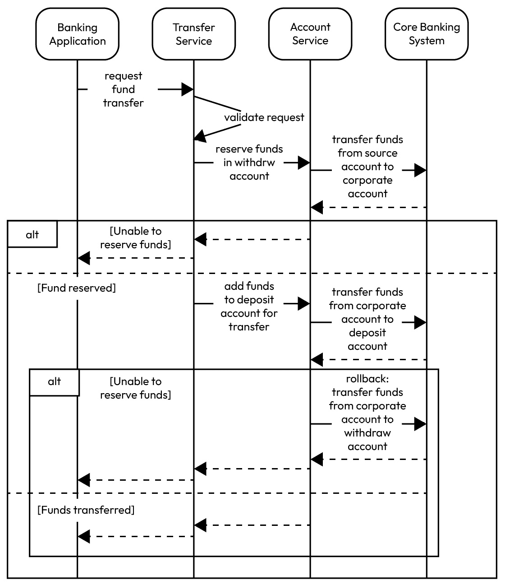
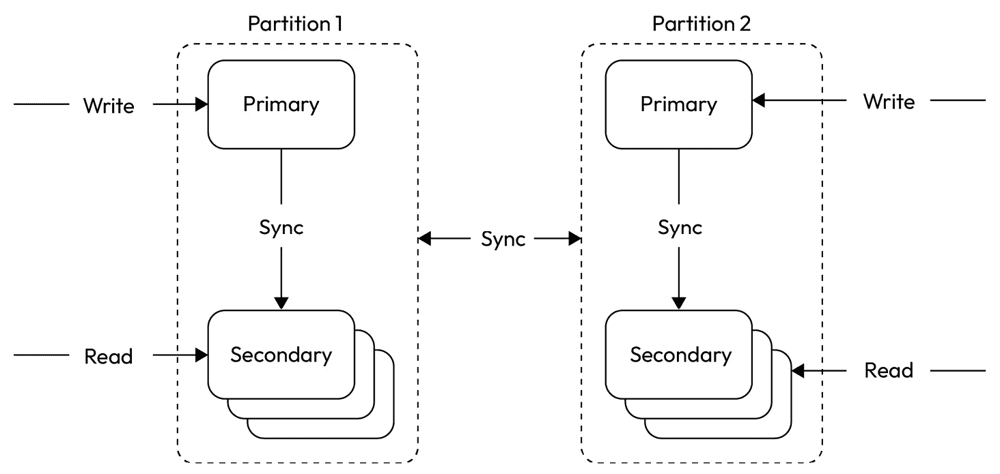
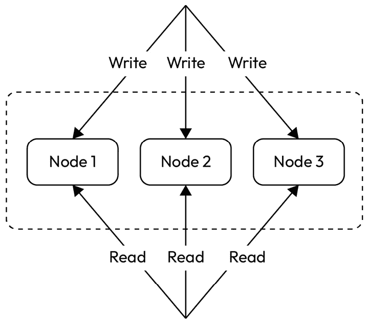
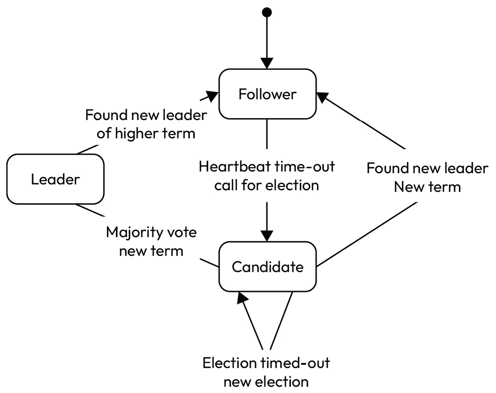

# 第十章：幂等性、复制和恢复模型

分布式系统在现代软件架构中非常普遍。确保数据一致性、容错性和可用性的挑战变得至关重要。本章将涵盖三个关键概念，有助于解决这些挑战：

+   幂等性

+   复制

+   恢复模型

**幂等性**是一个基本的非功能性系统属性，它确保操作可以安全且重复地执行，而不会产生意外的副作用。在分布式系统中，网络故障和系统崩溃是常见的。幂等性对于维护数据完整性和一致性至关重要。通过设计幂等操作，工程师可以构建更具有弹性和容错性的系统，能够在部分故障的情况下恢复，而不会损害整体系统状态。

另一方面，**复制**是一种用于提高分布式系统中数据可用性和持久性的技术。通过在不同节点上维护数据的多个副本，复制提供了冗余，并有助于确保即使在某个或多个节点失败的情况下，系统仍能继续运行。然而，复制引入了自己的挑战，例如确保副本之间的一致性以及高效地管理复制过程。

最后，**恢复模型**定义了在故障或中断后用于恢复分布式系统状态的策略和机制。这些模型可以从简单的备份和恢复方法到更复杂的技术。选择正确的恢复模型对于构建能够应对意外事件并保持高可用性和响应性的弹性分布式系统至关重要。

在本章中，我们将更深入地探讨这些主题，讨论其基本原理、权衡以及在实际分布式应用中应用的最佳实践。在本章之后，你应该能够以适合你系统的水平实现幂等性、复制和恢复模型。

# 技术要求

你可以在 GitHub 上找到本章使用的代码文件：[`github.com/PacktPublishing/Software-Architecture-with-Kotlin/tree/main/chapter-10`](https://github.com/PacktPublishing/Software-Architecture-with-Kotlin/tree/main/chapter-10)

# 幂等性

幂等性是软件工程中的一个概念，它指的是操作的非功能性属性，可以在执行多次的情况下仍然保持与只执行一次相同的效果。换句话说，幂等操作可以安全地重复执行而不会产生副作用。让我们来看一个需要幂等性的简短场景。

## 一个需要幂等性的用例

想象我们正在构建一个在线银行应用程序。一个关键功能是**转账**，其中用户将资金从一个账户转移到另一个账户。这个功能是系统的基础且至关重要的部分，需要以确保用户财务交易完整性和可靠性的方式实现。

如果**转账**操作不具有幂等性，那么用户可能会不小心多次点击**转账**按钮，系统会多次执行转账操作，从而导致源账户不预期的扣款和目标账户相应的贷记。

大多数成熟的用户界面可以通过在收到响应前阻止按钮被按下，来避免这种情况。然而，也有一些 API 集成需要幂等性。

这种结果并不是用户所期望的，它有多重后果。首先，如果用户在第二次及以后的转账中资金不足，用户将会有透支资金，并可能被收取利息。其次，这些事件会触发用户投诉，并可能导致金融监管机构的潜在介入。这不仅会影响用户体验，还会导致银行声誉受损。

为了防止这些问题，**转账**操作应该被设计成具有幂等性。这意味着无论用户点击**转账**按钮多少次，系统都只会执行一次转账，确保账户的最终状态是正确的，并且与用户的意图相匹配。

## 幂等性的关键方面

幂等性是软件开发中的一个重要概念，尤其是在分布式系统、API 和数据处理管道的背景下。以下是幂等性的几个关键方面：

+   **恒定结果**：幂等性操作总是产生相同的结果，无论执行多少次。如果一个操作不具有幂等性，每次后续执行可能会产生不同的结果。

+   **错误处理和重试**：幂等性有助于优雅地处理错误和重试。如果一个操作失败，系统可以安全地重试操作，而不会造成不预期的副作用。

+   **数据一致性**：幂等性操作通过防止在重试非幂等性操作时意外修改或重复数据，确保数据一致性。

+   **可扩展性和可靠性**：在分布式系统中，幂等性至关重要，因为可能存在多个应用程序实例同时处理相同的请求。幂等性操作允许系统进行扩展并处理故障，而不会损害数据完整性。

让我们探讨一些可以应用幂等性的实际场景。

## 场景 1 – 数据库迁移脚本

进化数据库旨在创建可以随着时间的推移而演变和适应变化的数据库系统。它们不是由静态和僵化的模型定义的。数据库模式是通过增量更改构建目标模式的。

考虑 Flyway，这是一个开源的数据库迁移工具。增量更改由 SQL 脚本指定：

```java
V1_create_new_tables.sql
V2_add_new_columns.sql
```

为了简化起见，让我们假设 `V1` 脚本只包含以下创建表的语句：

```java
CREATE TABLE HOUSEHOLD (
id UUID primary key,
name text not null
);
```

如果 `CREATE` SQL 语句中不存在名为 `HOUSEHOLD` 的新表，它将创建该表。否则，将报告错误，并且 `V1` 脚本将失败。换句话说，它不是幂等的，重复执行不会产生相同的结果。以下是脚本的幂等版本：

```java
CREATE TABLE IF NOT EXISTS HOUSEHOLD (
id UUID primary key,
name text not null
);
```

`IF NOT EXISTS` 语法确保如果表不存在，则创建该表，如果表已存在，则不执行任何操作。在两种情况下结果相同，即数据库中存在 `HOUSEHOLD` 表。

执行 `V2` 脚本将向该表添加一个新列作为非空列。一些数据库供应商支持创建非空列并在同一语句中填充值的巧妙 SQL 语句。为了这个论点，让我们假设这不被支持。我们求助于经典的添加可空列、填充值然后设置列为非空的方法。就像修改后的 `V1` 脚本一样，我们可以使其幂等：

```java
ALTER TABLE IF EXISTS HOUSEHOLD ADD COLUMN deleted boolean;
UPDATE HOUSEHOLD SET deleted = false;
ALTER TABLE IF EXISTS HOUSEHOLD ALTER COLUMN IF EXISTS deleted SET NOT NULL;
COMMIT;
```

`IF EXISTS` 语法确保如果表或列存在，则将对其进行修改，如果不存在，则不执行任何操作。结果相同，因此它是幂等的。经典的指导方针会建议 `ALTER TABLE` 是 DDL（数据定义语言），而 `UPDATE` 是 DML（数据操作语言）。这是建议这样做的原因是 DDL 会立即提交，而 DML 需要显式提交。然而，由于幂等性，这不再是问题，因为每个语句都可以重复执行以产生相同的结果。

## 场景 2 – 创建/更新操作

以村民交换服务的现实生活为例，有一个业务案例来确保家庭记录保持在系统记录中。然而，家庭用户不知道家庭记录是否已经被持久化。

基于 CRUD（创建、读取、更新、删除）的系统可能将创建和更新定义为两个独立的操作。这些操作非常适合用户，因为用户希望无论记录是否存在，家庭记录都应持久化。可能发生了网络中断，因此用户可能不知道他们的先前请求是否成功。

换句话说，用户希望一个可以重复执行且产生相同结果的操作。他们需要一个幂等操作来确保即使记录已存在，家庭记录也已存储。

这种操作通常被称为 **upsert**，即 **更新或插入**。upsert 操作的关键特征如下：

1.  **幂等性**: 它可以重复执行而结果相同。如果记录已存在，则更新记录；如果记录不存在，则创建记录。

1.  **原子性**: 操作在序列化隔离的事务中执行。这意味着操作要么完成，要么未发生。

1.  **选项 1 – 悲观锁**: 悲观的方法会检查记录是否存在，以确定是更新操作还是创建操作。

1.  **选项 2 – 乐观锁**: 乐观的方法会假设记录要么存在，要么不存在，并分别执行更新或创建操作。如果更新操作未找到记录，则切换到创建操作。或者，如果创建操作由于违反唯一约束而失败，则切换到更新操作。

这里是一个 SQL 语句中家庭上插操作（upsert operation）的示例。它实现了乐观方法：

```java
INSERT INTO HOUSEHOLD (id, name, email) VALUES ('d0275532-1a0a-4787-a079-b1292ad4aadf', 'Whittington', 'info@ whittington'.com') ON DUPLICATE KEY UPDATE name = 'Whittington', email = 'info@ whittington'.com';
```

此 SQL 语句尝试插入一个新的家庭记录。如果记录不存在，则插入新行。如果执行过程中遇到重复键违反，则变为更新 `name` 和 `email` 的操作。

如果此操作公开为外部 API（即作为 REST 端点），则合同可以用以下方式表达：

1.  `GET`: 在系统状态保持不变的情况下，`GET` 端点的多次调用应返回相同的结果。

1.  `PUT`: `PUT` 端点意味着创建新资源或用请求有效负载替换家庭表示。

1.  `DELETE`: `DELETE` 端点旨在删除资源，无论该资源是否存在。如果未找到资源，则应返回成功的 **超文本传输协议** (**HTTP**) 状态码。

HTTP 方法本身并不保证幂等性。例如，如果 `GET` 端点的响应有效负载包含当前时间或随机值，那么多次调用不会返回相同的结果，因此它不是幂等的。

`POST` 和 `PATCH` 端点未定义为幂等。REST 架构中的 `POST` 端点意味着创建资源的请求，并假设资源不存在。`PATCH` 端点假设资源已存在，以便可以部分更新资源。

HTTP 方法

HTTP 定义了几种方法来对请求进行分类，以便在资源上执行操作。`GET` 方法是一种只读操作，从服务器返回数据。`POST` 方法在服务器上创建资源。`PUT` 方法替换或创建资源。`PATCH` 方法部分更新现有资源。`DELETE` 方法从服务器删除资源。`HEAD` 方法返回资源的头部信息，但不包含正文内容。`OPTIONS` 方法描述了与特定资源通信的选项。最后，`TRACE` 方法是一种诊断操作，通过回显请求的最终接收情况来提供故障排除信息。

## 场景 3 – 按顺序处理事件

通常，从流或主题中消费事件的东西一次处理一个事件，并按顺序处理它们。如果处理的事件序列很重要，那么就需要优雅地处理重复和顺序错误的事件。

事件序列可能受到损害的两个级别是传输级别和应用级别。第一个级别是传输级别，由于网络问题、分区更改或消费者组更改，最后消费事件的偏移量被重置为较旧的事件。第二个级别是应用级别，这是发布者发送较旧事件的地方。

在消费者级别进行应用级去重可以处理在传输或应用级别受损的事件序列。然而，这要求发布者为每个事件提供顺序信息。这可以是事件上的序列号，或者事件发生的时间戳。

消费者可以维护每个发布者的最后处理序列号或时间戳。如果消费者收到一个序列号低于最后处理序列号的事件，或者时间戳早于最后处理时间戳的事件，那么消费者将跳过此事件，直到收到新的事件。

这里是一个事件监听器的示例实现，该监听器防止处理较旧的事件：

```java
class HouseholdEventListener {
    var lastProcessedTime: Instant? = null
    @KafkaListener(
        topics = ["\${household-v1-topic}"],
        clientIdPrefix = "\${client-id}",
        groupId = "\${group-id}",
        containerFactory = "kafkaListenerContainerFactory",
        properties = ["auto.offset.reset=earliest"]
    )
    fun onMessage(
        @Payload(required = false) event: HouseholdEvent?,
        @Header(name = "kafka_eventTime", required = true) key: String,
    ) {
        if (lastProcessedTime != null && event?.time?.isBefore(lastProcessedTime) == true) {
            log.warn { "Skipping event with time ${event.time} because it is before the last processed time $lastProcessedTime" }
            return
        }
        // some processing logic here
        lastProcessedTime = event?.time
    }
}
```

在这里，`HouseholdEventListener` 保存了最后处理事件的戳记。来自 Kafka 的传入事件有一个头部字段，`kafka_eventTime`，由发布者提供。该值是事件发生的时间，而不是事件发布的时间。

第一个事件处理不会执行任何时间戳检查。随后，如果事件头部的时间戳早于最后处理的时间戳，监听器将跳过处理。这表明传入的事件是旧的，可以跳过。

如果事件没有被跳过并且已经完成处理，则最后处理的时间戳将被更新，并且事件将通过 Kafka 代理进行确认。现在，监听器已准备好消费另一个事件。

在生产系统中，最后处理的时间应该持久化到数据库中，并且应该在业务处理发生的同一事务中。当监听器启动时，应该恢复最后处理的时间。这将允许监听器在重启后继续消费事件。

这个实现说明了消费者如何在发布者的帮助下检测到较旧的事件。较旧的事件不会被处理，消费者可以将最后处理的时间戳作为偏移量来验证下一个事件。

为了扩展到这个例子，最后处理事件的戳记可以持久化到数据库中，以便在重启后恢复值。

## 场景 4 – 多个边界上下文的故事

**故事**是**领域驱动设计**（**DDD**）中的一种模式，它涉及分布式事务。挑战是在多个边界上下文中保持数据一致性。

让我们以我们的银行转账为例，其中我们需要幂等操作来确保资金只被转账一次，并且只被转账一次。银行手机应用程序打算向后端服务发送请求。

然而，这个操作涉及多个后端服务。首先，有**转账服务**，它验证请求。

一旦验证，它需要保留提款账户中的金额，直到转账完成。这是通过另一个名为**账户服务**的服务完成的。

**账户服务**通过将资金从客户账户转移到企业账户来协调预留资金。稍后，它通过与企业账户到客户账户的资金转移来协调增加资金。这是通过与遗留的**核心** **银行系统**通信来完成的。

一旦资金被预留，**转账服务**可以通过将资金从企业账户转移到客户账户来请求转账的第二部分。请求由**账户服务**处理，它与遗留的**核心银行系统**通信以转账资金。一旦**核心银行系统**确认并完成转账，**账户服务**将结果返回给**转账服务**，从而完成转账。

这种交互在*图 10.1*中得到了演示：



图 10.1 – 银行转账示例序列

使整个转账操作具有幂等性是复杂的，因为事务分布在多个服务中。此外，我们需要一种方法来识别用户只想转账一次，尽管银行应用程序有多次尝试。

通常情况下，系统的一些部分可能是遗留系统，可能无法轻易增强。在这种情况下，让我们假设**核心银行系统**无法在请求中接受幂等键。

让我们探讨每个参与此过程的组件如何努力实现幂等性。

### 银行应用程序

第一步应该是银行应用程序生成一个**幂等键**，它可以识别属于同一用户意图的多个尝试。理想情况下，幂等键应该携带到所有相关的服务中。

### 转账服务

**转账服务**可以缓存这些幂等键一段时间。在这段时间内，相同的幂等键被视为重复请求。

为了避免并发请求下的不一致性问题，许多系统使用显式锁来确保相同幂等键的请求在多个实例中一次只处理。

服务可以选择跳过与其他服务的剩余交互，并返回之前发送给银行服务的响应。如果我们确信剩余的服务已经确认了请求的完成，这种方法是可以接受的。

例如，如果**转账服务**与**账户服务**通信时出现超时，那么重复与**账户服务**的交互可能是合理的。这允许操作得到修复并继续完成。这种方法还假设**账户服务**可以以幂等的方式处理重复请求。

### 账户服务

在这个操作中，**账户服务**提供两个功能：储备资金和增加资金。为了能够识别重复请求，幂等键应该与持有和移动资金的记录一起持久化。

当**账户服务**处理储备或增加资金的请求时，它必须通过使用幂等键来检查是否存在重复请求。如果存在，**账户服务**将返回记录中的响应，就像这次已经处理过一样。

如果由于资金不足，**核心银行系统**拒绝储备资金请求，**账户服务**需要通过将资金反向退回到提款账户来回滚操作。

与**转账服务**类似，应该有一种形式的显式锁定，以确保在多个实例中一次只处理给定幂等键的一个请求。

### 核心银行系统

**核心银行系统**是一个不支持幂等的遗留系统。它无法接受或处理幂等键。由于**账户服务**是与**核心银行系统**通信的服务，**账户服务**应该将**核心银行系统**的响应与相应的幂等键一起持久化。

如果响应记录已经存在且带有幂等键，**账户服务**将跳过与**核心银行系统**的通信，并使用之前持久化的**核心银行系统**的响应来完成流程。

这变得复杂了，因为可能会有对**核心银行系统**的请求超时。**账户服务**不知道**核心银行系统**是否已处理了转账。**账户服务**需要查询最近的交易历史以识别之前对**核心银行系统**的请求，无论是成功还是失败，以便恢复并继续转账操作。否则，重试可能仍然会导致不一致的状态。

有时，这种恢复甚至可能涉及手动纠正，这容易出错。你可以看到当过程变得复杂得多、效率低下且成本高昂时，它就无法保持幂等性。

有了这些，我们已经探讨了需要幂等性的四个场景，并探索了这些场景的多种方法。现在，让我们深入研究与幂等性相关的一个概念——复制。

# 复制

**复制**作为对潜在故障的防护措施，即使在个别组件出现故障或不可用的情况下，系统也能保持服务的连续性。

复制的这一方面与恢复密切相关，将在本章后面讨论。简而言之，一些复制技术可以防止系统停机，这需要恢复。还有一些复制技术可以启用并增强恢复过程。

复制的另一个方面是，它可以通过将负载分配到多个节点以及允许系统根据流量进行扩展来提高系统性能。

数据或运行实例的副本通常被称为*副本*。有许多领域可以应用复制。让我们看看。

## 数据冗余

多个副本分布在不同的节点或服务器上。如果一个节点失败，数据仍然可以从其他节点上的复制副本中访问。它还防止了某些节点永久不可用时的数据丢失。

这种冗余确保了即使某些节点或组件不可用，整体系统也能继续运行。

这可以应用于关系数据库、NoSQL 数据库、耐用的消息代理、分布式对象缓存以及**对等网络**（**P2P**）中的节点。

## 服务冗余

系统的运行服务实例分布和复制带来了一些关键的好处。

首先，请求可以被路由到最可用和响应最快的副本，从而降低单个节点过载的风险，并提高整体系统性能。这种负载均衡有助于通过防止瓶颈并确保系统可以处理增加的流量或工作量来维持可用性。

第二，它使得系统可以通过增加更多副本或实例来扩展，以满足需求增加。这种水平扩展性使得系统可以处理更高的负载，并在请求或所需资源数量增加时保持可用性。

此外，如果主节点变得不可用，系统可以自动故障转移到次要或备份副本，确保无缝过渡。

次要副本可以接管工作负载，保持服务连续性和高可用性。

复制还促进了更快的恢复，因为系统可以通过提升一个健康的副本成为新的主副本来恢复服务。

数据和服务在多个地理位置和数据中心之间进行复制也很常见。这种做法可以在区域故障或灾难发生时提高可用性。如果一个数据中心或区域发生故障，系统可以使用其他位置的副本继续运行，确保服务对用户始终可用。

## CAP 定理

让我们看看我们应该讨论的几个复制和恢复模型。它们满足各种一致性、可用性和可扩展性非功能性要求的不同级别。

根据 **CAP 定理**，也称为 **Brewer 定理**，分布式系统无法同时提供以下三个非功能性属性：

+   **一致性 (C)**: 系统中的所有节点在相同时间拥有相同的数据。一致性确保数据始终处于有效状态

+   **可用性 (A)**: 每个请求都会收到一个非错误响应，但无法保证它包含最新的数据

+   **分区容错性 (P)**: 即使发生任意消息丢失或系统部分故障，系统仍能继续运行

该定理指出，当节点间的通信失败时，分布式系统只能在三个属性（C、A 或 P）中同时满足两个。这被称为 **CAP 权衡**。

CAP 定理的历史

CAP 定理由 Eric Brewer 在 2000 年的 **分布式计算原理研讨会**（**PODC**）上提出。该定理后来由麻省理工学院的 Seth Gilbert 和 Nancy Lynch 在 2002 年通过他们的论文 *Brewer 的猜想与一致、可用、分区容错 Web 服务可行性* 得到证明。

可能的选择有以下三种：

+   **一致性和分区容错性 (CP)**: 在面对网络分区的情况下，系统牺牲可用性以保持强一致性。这在传统数据库系统中很常见，例如关系数据库。

+   **可用性和分区容错性 (AP)**: 在网络故障期间，系统保持可用但放弃维护一致性。这在 NoSQL 数据库中很常见。

+   **一致性和可用性 (CA)**: 系统提供一致性和可用性，但这仅在无网络分区的完全连接系统中才可能。在实践中，这种情况很少发生，系统必须在一致性和可用性之间做出选择。

虽然有三种组合，但选择更为灵活和情境化。例如，一个系统最初可能是 AP，但随着更多节点的故障，它可能回退到单个节点运行 CA。

CAP 定理是一个帮助开发者理解在设计分布式系统时需要做出的权衡的概念。当您为特定应用程序选择适当的数据存储和处理解决方案时，这是一个重要的考虑因素。

在探索这些模型时，理解并发现系统应追求的非功能性属性非常重要。并非所有模型都适用于所有系统。这关乎根据您的需求和预期场景找到最合适的模型。

## 模型 1 – 主从

**主从**（也称为**单领导者**）复制有一个**主节点**（“领导者”），它处理所有写操作并将数据更改复制到**从节点**（“追随者”）。单领导者复制在*图 10.2*中展示：


图 10.2 – 主从复制

### 读和写操作

**主节点**负责所有写操作。**主节点**或**从节点**是否应该处理读操作对系统质量属性，如一致性、吞吐量、可用性和弹性，有深远的影响。

如果**主节点**处理所有读操作，那么**从节点**可以是冷备份或热备用。冷备份意味着**从节点**没有运行，但数据文件正在复制。热备用意味着**从节点**已启动，但未处理任何请求。

这种设置提供了强一致性，但服务读和写操作意味着**主节点**承担所有负载。这增加了资源消耗，并使得实现高性能更具挑战性。此外，如果**主节点**失败，冷备份启动可能需要一些时间，并可能导致中断。热备用由于**从节点**已经运行，因此具有更好的可用性，但所有对失败主节点的读请求仍然受到影响。这将导致“波动”，直到其中一个**从节点**成为**主节点**。

如果**从节点**处理读请求，读操作的吞吐量会增加。有更多节点可用于处理读请求。如果某些**从节点**失败，其他节点可以继续运行。这种方法带来的权衡是可能的不一致性问题。想象一下，如果其中一个**从节点**未能连接到**主节点**；这个**从节点**将拥有过时的数据，但仍然执行读操作并提供过时数据，这与其他节点不一致。

### 复制

当您从**主节点**复制数据变更到**辅助节点**时，您有两个选项：同步或异步复制。同步过程的示例序列图显示在*图 10.3*中：


图 10.3 – 主-辅助同步 – 同步（左侧）/异步（右侧）

此图垂直分为两种方法。在左侧，我们有同步复制。在这里，写请求被发送到主节点。主节点更新其本地存储中的数据，但不提交事务。然后，它将数据变更发送到所有辅助节点。

这是一个阻塞和同步的过程，其中主节点等待所有辅助节点的响应。如果所有响应都成功，则主节点提交事务并将更改刷新到本地存储。最后，将响应返回给原始请求者。同步方法通过主节点和辅助节点之间的同步通信，以更高的延迟为代价，在所有节点上维护强数据一致性。

在右侧，主节点完成写请求后，数据变更被提交到本地存储，并将响应返回给请求者。数据变更在后台同步，不会阻塞。这可以通过计划的后台进程完成，或者作为发布给辅助节点的事件。这种方法减少了延迟，因为不需要复制来返回响应。然而，它引入了可能出现数据不一致的场景。

如果主节点与某些辅助节点之间的通信失败，一些辅助节点将拥有最新数据，而另一些则不会。同时，所有辅助节点都执行返回相同数据不同版本的读操作。

通过在数据上标注版本号或时间戳可以减轻不一致的风险。任何过时的数据都可以被发现并跳过。

请求者也可以与处理读请求的辅助节点保持粘性连接。返回给请求者的数据将与辅助节点同步变化。这提供了一定程度的可靠性，即请求不会得到一个版本的数据，然后得到一个更早的版本。

### 备用

如果主节点失败，其中一个辅助节点需要成为主节点。新的主节点可以通过轮询规则确定，或者通过可能更复杂的领导者选举算法。

如果数据是异步复制的，丢失主节点可能会导致丢失最新数据。这种情况发生在主节点已更新其本地存储并返回结果，但在通知辅助节点之前失败。

如果失败的主节点被备份但失去了与一些从节点的连接，情况会更糟。在这种情况下，可能已经分配了一个新的主节点。我们现在有一个分裂脑的情况，有两个主节点，从节点是碎片化的。这通常需要手动干预来关闭一个主节点，并将所有从节点重新连接到单一的主节点。

主从复制在高度可用的数据库和消息代理中常用。

## 模型 2 – 分区和分布式

**分区和分布式**（也称为**多主**）复制将数据管理分布到分区中。它允许多个节点同时处理请求。这些节点将更改复制到其他节点，从而实现更高的写入吞吐量和可用性。

通常在数据和服务跨多个地理位置复制时使用，通常在不同的数据中心或云区域。这提供了对区域故障或灾难的可用性和弹性。这在*图 10.4*中有所说明。4*：



图 10.4 – 分区和分布式复制

请求在地理上分区，以便给定区域的用户可以访问该区域对应的服务。在这个区域内，这种分区和分布式复制可以表现得像主从复制一样，其中主节点处理写请求，从节点处理读请求。

在区域之间，发生额外的同步过程，以便一个区域的数据被复制到另一个区域。一些数据是完全分区和区域化的，这意味着在正常情况下，所有对数据的请求都在指定的区域内得到服务。一些数据是共享的，可能需要完全复制。这引入了在两个区域都更新时解决冲突的需求。

与主从复制相比，这种设置更为复杂。然而，如果存在如下非功能性需求，则可以证明其合理性：

+   服务来自多个地理区域的请求

+   面对数据中心完全故障时进行恢复

+   在架构和操作上从特定的云服务提供商解耦

+   支持离线操作

+   支持协作更新操作

另一方面，如果多个区域中的相同数据不能同时更新，将难以保持强一致性。

如果数据中心已经失败，对应分区的请求应该被路由到运行中的数据中心。在运行中的数据中心尚未复制的数据库将会丢失。在这种情况下，客户端可能需要回滚到最后一次复制的状态。

### 解决写冲突和避免丢失更新

分区式和分布式复制需要一些机制来解决同时更新同一份数据并可能不同的情况。让我们用一个现实生活中的例子来说明写冲突的解决。

想象一下，一个村庄中的每一户都有一个其名称和联系电子邮件地址的记录。*Whittington* 家庭在存储库中有一个记录，其电子邮件地址为 *info@whittington.com*。

此记录被暴露给两个不同的客户端。每个客户端都读取了电子邮件地址，*info@whittington.com*。一个客户端已将电子邮件地址更新为 *query@whittington.com*，而另一个客户端已将其更新为 *contact@whittington.com*。两个客户端试图通过提供它们的更新值来更新存储库中的值。存储库将接收这两个客户端的写请求。

两个客户都根据他们收到的当前值确定新值：

+   **客户 A**：将当前电子邮件地址从 *info@whittington.com* 更新为 *query@whittington.com*

+   **客户 B**：将当前电子邮件地址从 *info@whittington.com* 更新为 *contact@whittington.com*

如果客户 A 请求更新早于客户 B，那么将电子邮件地址更新为 *query@whittington.com* 的过程将会丢失。这是因为客户 B 几乎立即用 *contact@whittington.com* 覆盖了该值，而不知道客户 A 也请求了更新。这个问题被称为 **丢失** **更新** 问题。

通常，通过在数据上添加版本号或时间戳来解决此问题。如果传入的请求更新被识别为比系统记录中的更新更旧，那么可以安全地跳过更新。与时间戳相比，单调递增的版本号是一个更受欢迎的方法，因为每个机器的系统时钟可能不同。

我们可以用以下数据类来模拟这种情况：

```java
data class Household(
    val version: Int,
    val name: String,
    val email: String,
)
```

在这里，`Household` 类有一个整型的 `version` 字段。这将在更新操作期间用于比较。还有一个用于处理更新请求的 `Household` 存储库类。以下是代码中模拟的场景：

```java
fun main() {
    val repo = HouseholdRepository()
    val name = "Whittington"
    val email1 = "info@whittington.com"
    val email2a = "query@whittington.com"
    val email2b = "contact@whittington.com"
    val household1 = Household(0, name, email1)
```

首先，创建一个作为版本的 `household` 记录，之后基于它有两个更新：

```java
    repo.create(name) { household1 }
    repo.update(name) { household1.copy(version = 1, email = email2a)}
    repo.update(name) { household1.copy(version = 1, email = email2b)}
    repo.get(name)?.also {
        println("${it.version}, ${it.email}")
    }
}
```

在这种情况下，我们预计第二次更新将被跳过，因为它基于版本零。第二次更新将需要刷新 `household` 记录到版本一，并计算潜在的更新。

存储库中应实施版本检查，以防止丢失更新问题。以下是一个示例实现：

```java
class HouseholdRepository {
    private val values: ConcurrentMap<String, Household> = ConcurrentHashMap()
```

`HouseholdRepository` 类持有 `ConcurrentMap` 接口，使用家庭名称作为键。`create` 函数利用原子的 `putIfAbsent` 函数来确保值不会被错误地覆盖：

```java
    fun create(
        key: String,
        callback: () -> Household
    ): Household {
        val household = callback()
        val result = values.putIfAbsent(key, household)
        return result ?: household
    }
```

`update`函数通过使用原子的`computeIfPresent`函数检查更新的值必须比现有值高一个版本：

```java
    fun update(
        key: String,
        callback: (Household) -> Household
    ): Household? = values.computeIfPresent(key) { _, existing ->
        callback(existing).let { updated ->
            if (updated.version == existing.version + 1) {
                updated
            } else {
                existing
            }
        }
    }
```

为了完整性，还有一个`get`函数，这样我们可以在运行后获取存储在映射中的内容：

```java
    fun get(key: String): Household? = values[key]
}
```

程序的输出如下：

```java
1, query@whittington.com
```

这意味着第二次更新被跳过了。

## 模型 3 – 基于多数派复制

**基于多数派**（也称为**无领导者**）**复制**要求节点在提交写入操作之前就数据的状态达成一致。这确保了即使某些节点失败，也能保持一致性和可用性。

基于多数派复制的关键区别在于没有主节点、领导者或中央协调者。相反，数据是去中心化并在集群中的节点之间分布式存储：



图 10.5 – 基于多数派复制

只有当写入操作被系统中参与节点的多数（多数派）确认时，才被认为是成功的。这个多数派要求确保只有当写入操作被复制到足够的节点时，才会提交，这使得系统对单个节点故障具有弹性。

多数派的大小通常设置为至少超过总节点数的一半，确保即使某些节点失败，系统仍可以继续前进并保持一致状态。同步到节点之间的数据出于以下几个原因进行了版本化：

+   数据同步过程需要识别旧版本的数据，以及增加版本号以指示更新

+   客户端可以读取版本以了解接收到的数据是否过时

例如，在五个节点的集群中，写入操作要成功，需要三个节点的多数派。这样，系统可以容忍多达两个节点的故障，而不会损害数据一致性。

由于所有节点具有相同的状态，实际上没有实际的故障转移机制。相反，每个请求都需要能够删除重复或旧响应。如果数据是分版本的，则可以这样做。

基于多数派复制在分布式数据库、键值存储、P2P 网络、区块链和协调服务中常用，在这些服务中，在节点故障的情况下保持强一致性和可用性至关重要。

## 比较三种复制模型

在数据库或数据系统中选择适当的复制模式取决于几个因素，包括与一致性、可用性、性能和容错性相关的非功能性需求。以下是每种模型的摘要和用例：

| **主从** | **分区和分布式** | **基于多数派** |
| --- | --- | --- |
| 强一致性 | 最终一致性 | 可配置一致性 |
| 简单且易于维护 | 增加的复杂性 | 复杂的多数派维护 |
| 对数据丢失的低容忍度 | 冲突解决挑战 | 容错性 |
| 性能受限于领导者容量和复制延迟 | 性能受限于领导者容量和复制延迟 | 为每个变更实现共识的额外延迟 | 资源使用量更高 |
| 可用性较低 | 高可用性；提供负载均衡器选项 | 取决于可用节点的数量 |
| 存在单点故障 | 没有单点故障 | 没有单点故障 |
| 适用于传统数据库和读操作多于写操作的系统（例如，内容管理系统） | 适用于跨不同地区分布的系统以及协作应用 | 适用于分布式数据存储和不需要低延迟的关键系统 |

故障转移机制是恢复过程的一部分，但它的重点是将工作负载转移到其他正在运行的节点。恢复还包括启动未运行的节点。这些方法将在下一节中介绍。

# 恢复

系统的恢复过程高度依赖于可访问的数据副本，除了无状态系统。这意味着恢复方法高度依赖于复制方法。

## 快照和检查点

最常见的恢复方法是保存最后已知系统状态的快照。定期保存分布式系统状态的过程称为 **检查点**。

在发生故障的情况下，系统可以回滚到最后一个已知的好检查点，以将系统恢复到一致状态。未在快照中持久化的数据将会丢失。数据丢失的数量将取决于快照的频率。

## 变更日志

通过重放分布式系统内所有操作和事务的变更日志，也可以恢复系统状态。

使用检查点和变更日志的组合恢复分布式系统是常见的做法。这与在 *第九章* 中提到的基于事件源恢复方法类似，其中通过重放所有相关事件来存储聚合。

这种方法通过重放遗漏或丢失的操作来帮助从故障中恢复。

## 重新路由和重新平衡

启动节点后，它需要创建或加入一个节点网络。可能需要重新路由请求并重新平衡分区。

这也可能触发新主节点的选举。可以使用如 **Raft** ([`raft.github.io/`](https://raft.github.io/)) 和 **Paxos** ([`www.microsoft.com/en-us/research/publication/part-time-parliament/`](https://www.microsoft.com/en-us/research/publication/part-time-parliament/)) 这样的共识协议来协调其他节点的操作，确保系统在个别节点失败的情况下仍能保持运行。

## 案例研究 – Raft 领导者选举

为了展示恢复的细节，我们将通过一个简化的 **Raft** 领导者选举过程进行说明，如图 *10.5* 所示：



图 10.6 – Raft 领导者选举中的节点状态转换

Raft 使用主从复制，其中主要节点将数据更改复制到所有次要节点。主要节点保持一个名为**Terms**的整数；这个数字在每次选举时增加。每个被主要节点接收到的请求都会被**Terms**标记。

主要节点向所有次要节点广播心跳消息。它们就像脉冲一样，不断宣布主要节点已经启动。

当一个次要节点在配置的时间内没有收到心跳消息时，它将成为一个候选人并要求其他次要节点为自己投票。

其他次要节点可以接受或拒绝他们的投票。当一个候选人在获得最多投票后得到接受，他们将成为主要节点，其他人则恢复为跟随者。

这种机制是并发发生的，意味着将会有冲突需要解决：

+   **冲突选举**：如果所有次要节点的心跳消息超时配置相同，则可能会发生冲突选举。可以通过在每个节点中随机化超时配置来避免这种情况。此外，如果有冲突选举的平局，则取消所有选举，之后可以再次进行选举。

+   **多个领导者**：如果网络的一部分与另一部分断开连接，我们可能会遇到脑裂情况，其中每个相互连接的部分开始自己的选举。由于大多数应该超过节点总数的半数，只有一个部分可以达到多数票并选举出一个领导者。

    如果原始领导者位于网络分裂的小部分中，当整个网络恢复时，将会有多个领导者。在这种情况下，可以使用*Terms*的值让原始领导者下台，因为新领导者的 term 值将高于原始领导者。

+   **过时候选人**：一些次要节点可能在复制上落后于其他节点，但仍然会要求进行选举并将自己作为候选人。如果其中之一成为主要节点，其过时的数据将成为真相的来源，并且一些更新可能会丢失。

为了避免这种情况，次要节点将拒绝那些 Terms 值低于其他候选人且数据未更新的候选人。可以通过变更日志中的项目数量来识别具有过时数据的候选人。

# 摘要

在本章中，我们讨论了三个主题：幂等性、复制和恢复。首先，我们讨论了幂等性有用的四种场景以及如何通过参考实现来实现。

然后，我们简要介绍了如何复制数据和服务的步骤。我们提到了 CAP 定理，其中每个系统都需要考虑权衡。我们还深入探讨了三种复制模型，即主从复制、分区和分布式复制以及基于法定人数的复制。

最后，我们讨论了一些常见的恢复机制，概述了在分布式系统中一个新启动的节点如何成为可操作的。

在下一章中，我们将讨论分布式系统的审计和监控方面。
