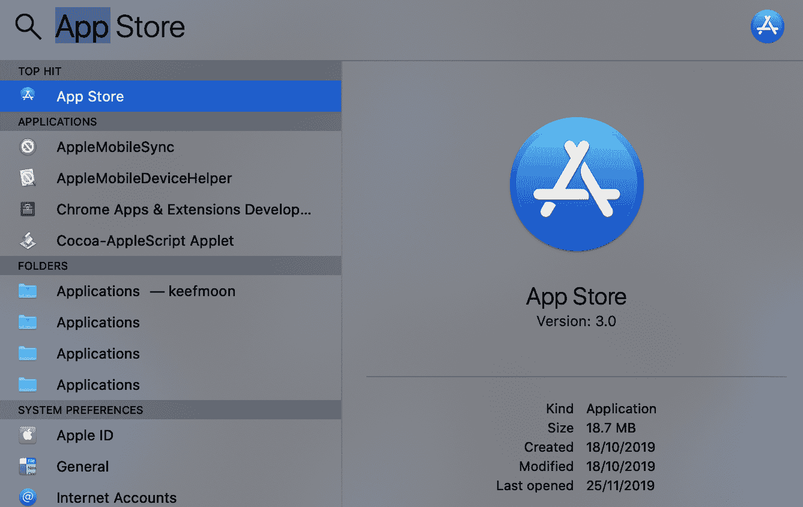
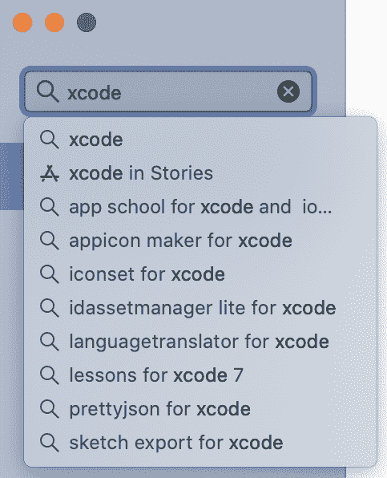
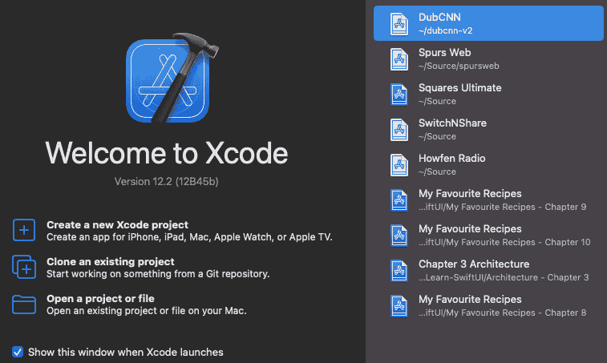
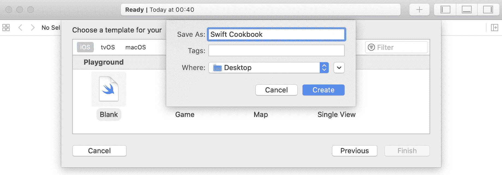
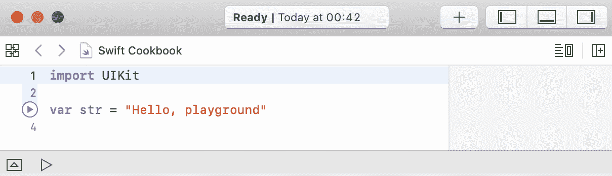
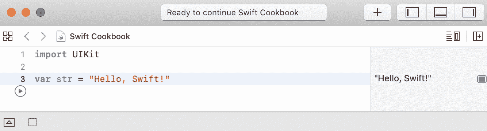
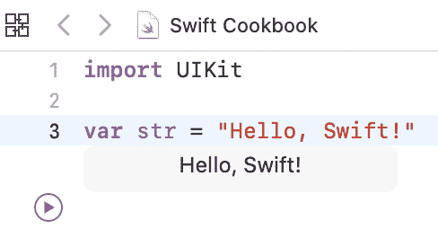
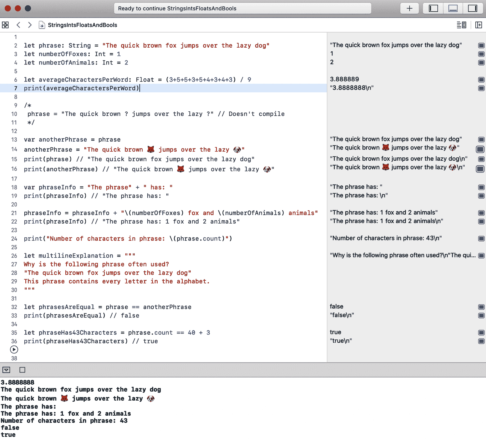

Swift 构建块

自从 Apple 在 2014 年的 WWDC 上宣布 Swift 编程语言以来，它已经迅速成为增长最快的编程语言之一。TIOBE 是一家衡量软件质量并发布编程语言使用排名指数的公司。在撰写本文时，Swift 在这个指数上排名第 11 位。这比本书第一版撰写时上升了两位（访问 [`www.tiobe.com/tiobe_index`](http://www.tiobe.com/tiobe_index)）。

Swift 是一种现代的通用编程语言，它侧重于类型安全和表达性以及简洁的语法。作为 Objective-C 的现代替代品，它已经取代了那种较老的语言，成为 Apple 平台开发的未来。

仅凭这个细分市场就能确保 Swift 作为一种有用且重要的编程语言的地位。然而，Apple 决定开源 Swift，使其影响力超越了 Apple 的生态系统，使其有可能在所有平台上以及任何场景中使用。

自从开源 Swift 以来，Apple 提供了在 Linux 上运行您的 Swift 代码的支持。在后面的章节中，我们将探讨使用 Swift 服务器来执行您的代码。此外，Swift Playgrounds iPad 应用将您的平板电脑变成一个轻量级的 **集成开发环境**（**IDE**）。尽管有这些使用和编写 Swift 代码的替代方法，但最简单的方法还是在 Mac 上使用 Apple 的 Xcode IDE。本书的开头，我们将介绍如何设置它，然后除非另有说明，否则将假设读者使用这个开发环境。Xcode 还提供了探索 Swift 标准库、基础库以及任何其他适用于 iOS 或 Mac 开发的框架的结构和语法的完美方式。

**Swift Playground** 是一个用于执行 Swift 代码的简化环境。就我们的目的而言，Playgrounds 提供了一种创建、运行和理解本书中包含的食谱的理想方式。因此，也将假设读者正在使用 Xcode Playground 来实现本书中包含的食谱，除非另有说明。

Swift 5.3 是一个重要的版本，它添加了许多对 Apple 的 SwiftUI 框架至关重要的语言特性，我们将在第十章 SwiftUI 和 Combine 框架中进行介绍。Swift 5.3 还将与未来的 Swift 版本有更好的兼容性，这意味着现在用 Swift 5.3 编写的代码可以与用 Swift 6 及更高版本编写的代码并行运行。本书将假设读者正在使用 Swift 5.3；所有代码都将与这个版本兼容。

在本章中，我们将探讨 Swift 语言的构建块，检查构成 Swift 语言基础的基本 Swift 组件的语法和功能。

本章将涵盖以下食谱：

+   创建您的第一个 Swift 程序

+   使用 Strings、Ints、Floats 和 Bools

+   解包可选值，以及强制解包

+   在函数中重用代码

+   在对象类中封装功能

+   将值捆绑到 structs 中

+   使用 enums 列举值

+   使用闭包传递功能

+   使用协议定义接口

# 第二章：技术要求

本章的所有代码都可以在书籍的 GitHub 仓库中找到，地址为 [`github.com/PacktPublishing/Swift-Cookbook-Second-Edition/tree/master/Chapter01`](https://github.com/PacktPublishing/Swift-Cookbook-Second-Edition/tree/master/Chapter01)

查看以下视频以查看代码的实际操作：[`bit.ly/3rp0DnJ`](https://bit.ly/3rp0DnJ)

# 创建你的第一个 Swift 程序

在第一个菜谱中，我们将设置我们的开发环境，并使用 Swift Playgrounds 创建我们的第一个 Swift 代码片段。

## 准备工作

首先，我们必须从 Mac App Store 下载并安装 Apple 的 IDE，Xcode：

1.  从 Dock 或通过 Spotlight 打开 Mac App Store：



图 1.1 – App Store

1.  搜索 `xcode`：



图 1.2 – 搜索 xcode

1.  点击 GET，然后安装：


图 1.3 – App Store 中的 Xcode

Xcode 是一个大型下载（近 8 GB），所以这可能会花费一些时间，具体取决于你的网络连接。

1.  下载完成后，从 App Store 或 Dock 中打开 Xcode：


图 1.4 – 打开 Xcode

## 如何操作...

下载了 Xcode 后，让我们创建第一个 Swift playground：

1.  从 Dock 中的图标启动 Xcode。

1.  从欢迎屏幕中选择“使用 playground 开始”：



图 1.5 – Xcode，新项目

1.  从模板的 iOS 选项卡中选择空白，然后按下一步：


图 1.6 – Xcode，选择项目类型

1.  为你的 playground 选择一个名称和位置，然后按创建：



图 1.7 – Xcode，保存项目

Xcode playgrounds 可以基于三个不同的 Apple 平台之一：**iOS**、**tvOS** 和 **macOS**。根据你的选择，playgrounds 提供对 iOS、tvOS 或 macOS 可用框架的完全访问权限。本书将假设使用 iOS playground，主要是因为这是作者的首选平台。除非另有说明，否则在代码具有 UI 组件的情况下，将使用 iOS 平台。

你现在会看到一个看起来像这样的视图：



图 1.8 – Playground – 代码模板

1.  让我们将单词 `playground` 替换为 `Swift!`。点击窗口左下角的播放图标以在 playground 中执行代码：


图 1.9 – 演示场运行/代码执行

恭喜！你已经运行了你的第一行 Swift 代码。

在窗口的右侧，你可以看到演示场中每一行代码的输出。我们可以看到我们的代码行输出了 `Hello Swift!`



图 1.10 – "Hello, Swift!" 演示场

## 还有更多...

如果你将光标移至右侧的输出上，你会看到两个按钮，一个看起来像一只眼睛，另一个是一个圆形的方块：


图 1.11 – 演示场，输出

点击眼睛按钮以获取输出结果的**快速查看**框。这对于文本字符串来说并不特别有用，但对于更直观的输出，如颜色和视图，可能很有用：


图 1.12 – 演示场输出快速查看

点击方块按钮，会在你的代码下方添加一个框，显示代码的输出。如果你想要看到输出如何随着代码的改变而变化，这会非常有用：



图 1.13 – 演示场，内联输出

## 参见

我们将在第七章 Swift 演示场中了解更多关于演示场以及如何进一步使用它们。

# 使用字符串、整数、浮点数和布尔值

任何编程语言中的许多核心操作都涉及操作文本、数字以及确定真伪。让我们通过查看 Swift 的基本类型以及学习如何分配常量和变量来了解如何在 Swift 中完成这些操作。在这个过程中，我们将接触到 Swift 的静态类型和可变性系统。

## 准备中

在 Xcode 中打开一个新的 Swift 演示场。前面的食谱解释了如何做到这一点。

## 如何做到...

让我们运行一些探索基本类型的 Swift 代码，然后我们可以一步一步地分析它：

1.  将以下内容输入到新的演示场文件中：

```swift
let phrase: String = "The quick brown fox jumps over the lazy dog" 
let numberOfFoxes: Int = 1 
let numberOfAnimals: Int = 2 

let averageCharactersPerWord: Float = (3+5+5+3+5+4+3+4+3) / 9 
print(averageCharactersPerWord) // 3.8888888 

/* 
phrase = "The quick brown ? jumps over the lazy ?" // Doesn't compile 
*/ 

var anotherPhrase = phrase 
anotherPhrase = "The quick brown  jumps over the lazy " 
print(phrase) // "The quick brown fox jumps over the lazy dog"
print(anotherPhrase) // "The quick brown  jumps over the lazy "

var phraseInfo = "The phrase" + " has: " 
print(phraseInfo) // "The phrase has: " 

phraseInfo = phraseInfo + "\(numberOfFoxes) fox and \
  (numberOfAnimals) animals" 
print(phraseInfo) // "The phrase has: 1 fox and 2 animals" 

print("Number of characters in phrase: \(phrase.count)")

let multilineExplanation = """
Why is the following phrase often used?
"The quick brown fox jumps over the lazy dog"
This phrase contains every letter in the alphabet.
""" 

let phrasesAreEqual = phrase == anotherPhrase 
print(phrasesAreEqual) // false 

let phraseHas43Characters = phrase.count == 40 + 3 
print(phraseHas43Characters) // true 

```

1.  按下窗口底部的播放按钮以运行演示场并验证 Xcode 没有显示任何错误。你的演示场应该看起来像下面的截图，其中右侧的时间线上有每一行的输出，底部控制台中有打印的值：



图 1.14 – 演示场控制台输出

## 它是如何工作的...

让我们逐行分析前面的代码，以理解它。

在这一行代码中，我们将一些文本分配给一个常量值：

```swift
 let phrase: String = "The quick brown fox jumps over the lazy dog"
```

我们通过使用`let`关键字定义一个新的常量值，并给这个常量起一个名字，`phrase`。冒号`:`表示我们想要定义要存储在常量中的信息类型，并且类型定义在冒号之后。在这种情况下，我们想要分配一个字符串（`String`是大多数编程语言对文本的称呼）。等号`=`表示我们正在将值赋给已定义的常量，而`"The quick brown fox jumps over the lazy dog"`是一个`String`字面量，这意味着它是一种构建字符串的简单方法。Swift 将任何包含在`""`标记内的文本视为`String`字面量。

我们将等号右侧的`String`字面量赋值给等号左侧的常量。

接下来，我们再赋值两个常量，但这次它们是`Int`类型，即整数：

```swift
let numberOfFoxes: Int = 1 
let numberOfAnimals: Int = 2 
```

而不是直接赋值，我们可以将数学表达式的结果赋给常量。这个常量是一个`Float`，即浮点数：

```swift
let averageCharactersPerWord: Float = (3+5+5+3+5+4+3+4+3) / 9 
```

换句话说，它可以存储分数而不是整数。注意，在这个行的右侧时序中，值显示为`3.88889`。

`print`函数允许我们查看打印到控制台或显示在游乐场中的任何表达式的输出：

```swift
print(averageCharactersPerWord)
```

我们将在后面的菜谱中介绍函数，但到目前为止，你需要知道的是，为了使用一个函数，你输入它的名字（在这个例子中是`print`），然后在括号`()`内包含任何函数所需的输入。

当我们的代码调用这个函数时，代码右侧的时间线显示了该语句的输出为`3.88888`，这与它上面的行不同。我们执行的这个数学表达式的实际值是`3.88888888...`，有无限多个 8。然而，`print`函数将其四舍五入到只有五位小数，并且与上面行的时序不同。在处理浮点数时，记住这个真实值与 Swift 语言表示方式之间的潜在差异是很重要的。

接下来，你会看到一些行被涂成灰色：

```swift
/* 
phrase = "The quick brown ? jumps over the lazy ?" // Doesn't compile 
*/
```

游乐场不会为这些行生成输出，因为它们是注释。代码行前的`/*`语法和代码行后的`*/`语法表示这是一个注释块，因此 Swift 应该忽略这个块中输入的任何内容。

移除`/*`和`*/`，你会看到`// 不编译`仍然是灰色。这是因为`//`也代表注释。同一行上此注释之后的内容也将被忽略。

如果你现在尝试运行这段代码，Xcode 会告诉你这一行存在问题，所以让我们看看这一行以确定问题所在。

在等号`=`的左侧，我们有`phrase`，这是我们之前声明的，现在我们正在尝试给它分配一个新值。我们无法这样做，因为我们使用`let`关键字将`phrase`定义为常量。我们只应该使用`let`来定义那些我们知道不会改变的东西。将某物定义为不可变，或**不可变**，是 Swift 中的一个重要概念，我们将在后面的章节中再次讨论它。

如果我们想要定义可以改变的东西，我们可以使用`var`关键字声明它：

```swift
var anotherPhrase = phrase 
```

由于`anotherPhrase`是一个变量，我们可以给它分配一个新值：

```swift
anotherPhrase = "The quick brown  jumps over the lazy "
```

Swift 中的字符串是完全**Unicode 兼容**的，因此我们可以使用表情符号而不是文字。现在，让我们打印出我们字符串的值，看看它们包含什么值：

```swift
print(phrase) // "The quick brown fox jumps over the lazy dog" 
print(anotherPhrase) // "The quick brown  jumps over the lazy "
```

在前面的行中，我们做了以下操作：

+   定义了一个名为`phrase`的字符串

+   将一个名为`anotherPhrase`的字符串定义为与`phrase`相同的值

+   改变了`anotherPhrase`的值

+   打印了`phrase`和`anotherPhrase`的值

当我们这样做时，我们会发现只有`anotherPhrase`打印出了被分配的新值，尽管`phrase`和`anotherPhrase`的初始值是相同的。尽管`phrase`和`anotherPhrase`具有相同的值，但它们之间没有内在的联系；因此，当`anotherPhrase`被分配一个新值时，这不会影响`phrase`。

字符串可以很容易地使用`+`运算符组合：

```swift
var phraseInfo = "The phrase" + " has: " 
print(phraseInfo) // "The phrase has: "
```

这给出了你预期的结果；字符串被连接起来。

你经常会想通过包含从其他表达式派生的值来创建字符串。我们可以使用`String`插值来完成这个操作：

```swift
phraseInfo = phraseInfo + "\(numberOfFoxes) fox and \(numberOfAnimals)
  animals" 
print(phraseInfo) // "The phrase has: 1 fox and 2 animals" 
```

在`\(`和`)`之间插入的值可以是任何可以表示为字符串的东西，包括其他字符串、整数、浮点数或表达式。

我们还可以使用字符串插值来使用表达式，例如显示字符串中的字符数：

```swift
print("Number of characters in phrase: \(phrase.count)") 
```

Swift 中的字符串是集合，是元素的容器；在这种情况下，字符串是一组字符的集合。我们将在下一章更深入地介绍集合，但就目前而言，了解你的集合可以通过它们的`count`属性告诉你它们包含多少元素就足够了。我们使用这个属性来输出短语中的字符数。

可以使用`"""`在字符串的开始和结束处定义多行字符串字面量：

```swift
let multilineExplanation = """
Why is the following phrase often used?
"The quick brown fox jumps over the lazy dog"
This phrase contains every letter in the alphabet.
"""
```

多行字符串的内容必须从开始和结束标记的单独一行开始。在多行字符串字面量中，你可以使用单引号字符`"`而不需要使用额外的转义字符，就像在单行字符串字面量中那样。

布尔值，或`Bool`，表示真或假。在下一行，我们评估布尔表达式的值，并将结果赋给`phrasesAreEqual`常量：

```swift
let phrasesAreEqual: Bool = phrase == anotherPhrase 
print(phrasesAreEqual) // false 
```

在这里，等号`==`比较其左右两侧的值，如果两个值相等则返回`true`，否则返回`false`。

如我们之前讨论的，尽管我们最初将 `anotherPhrase` 赋值为 `phrase`，但我们后来将 `anotherPhrase` 赋值为一个新值；因此，`phrase` 和 `anotherPhrase` 不相等，表达式将值赋为 `false`。

`==` 运算符的每一侧都可以是任何评估为匹配另一侧类型的表达式，就像我们在以下代码中所做的那样：

```swift
let phraseHas43Characters: Bool = phrase.characters.count == 40 + 3  
print(phraseHas43Characters) // true 
```

在这种情况下，`phrase` 的字符计数为 43。由于 `40 + 3` 也等于 43，因此常量被赋予了 `true` 的值。

## 更多...

在这个配方中，我们定义了许多常量和变量，当我们这样做时，我们也明确地定义了它们的类型。例如，考虑以下 Swift 代码行：

```swift
let clearlyAString: String = "This is a string literal" 
```

Swift 是一种静态类型语言。这意味着我们定义的任何常量或变量都必须具有特定的类型，一旦定义，就不能更改为其类型。然而，在前面的一行代码中，`clearlyAString` 常量显然是一个字符串！表达式的右侧是一个字符串字面量，因此我们知道左侧将是一个字符串。更重要的是，Swift 编译器也知道这一点（编译器是将 Swift 代码转换为机器代码的程序）。

Swift 的核心在于简洁性，因此，由于编译器可以推断类型，我们不需要显式地声明它。与前面的代码相比，我们可以使用以下代码，它仍然可以运行，尽管我们没有指定类型：

```swift
let clearlyAString = "This is a string literal" 
```

事实上，我们迄今为止所做的所有类型声明都可以删除！所以，回到我们已编写的代码中，删除所有类型声明（`:String`、`:Int`、`:Float` 和 `:Bool`），因为它们都可以被推断。运行游乐场以确认这仍然是有效的 Swift 代码。

## 参见

有关 Swift 中这些基本类型的更多信息，请参阅 Apple 对 Swift 语言的文档：

+   **整数、浮点数和布尔值**：[`swiftbook.link/docs/the-basics`](http://swiftbook.link/docs/the-basics)

+   **字符串和字符**：[`swiftbook.link/docs/strings`](http://swiftbook.link/docs/strings)

# 解包可选值和强制解包

在现实世界中，我们并不总是知道问题的答案，如果我们假设我们总是知道答案，可能会出现问题。在编程语言中也是如此，尤其是在处理我们可能无法控制的系统时。在许多语言中，没有方法可以指出我们可能在任何给定时间不知道一个值。这可能导致代码脆弱或在使用值之前需要进行大量检查以确保值存在。

编程语言使用术语 `nil` 或 `null` 来表示值的缺失。请注意，这与数字 0 或空（长度为零）的字符串 `""` 不同。Swift 使用 `nil` 来表示值的缺失。因此，将 `nil` 分配给值将移除当前分配的任何值。

由于 Swift 是类型安全的，并且使其编写安全代码更容易，这种歧义必须得到解决，Swift 语言通过一种称为可选性的东西来解决这个问题。在这个菜谱中，我们将探讨 Swift 中的可选性是什么，以及如何安全地处理和使用它们。

## 开始使用

在一个新的 playground 中输入以下内容：

```swift
var dayOfTheWeek: String = "Monday" 
dayOfTheWeek = "Tuesday" 
dayOfTheWeek = "Wednesday" 
dayOfTheWeek = nil 
```

当你尝试运行代码时，你会看到编译器抛出了一个错误，并且不允许你将`nil`赋值给`dayOfTheWeek`变量。这是完全正确的！一周中的某一天可能会改变，但永远不会没有当前的一周。

由于我们声明了类型为`String`，编译器期望的就是这个，而`nil`不是字符串，所以它不能被分配给这个变量。

即使你移除了类型声明，让编译器推断它，就像我们在前面的菜谱中所做的那样，这也同样适用。这是因为类型是在变量声明时推断的，并且由于它被分配了一个字符串值，所以推断出的类型是`String`。所有其他对这个变量的使用都将与这个推断出的`String`类型进行校验。

删除最后一行，因为编译器问题将阻止我们在 playground 中运行进一步的代码。

## 如何做到...

我们将探讨一个适合使用可选变量变量的不同场景。Nick 和 Finn 正在玩游戏。在每一轮中，Finn 会把手放在背后并选择要举起的手指数量，Nick 会猜测这是多少个手指，然后 Finn 会向他展示他选择举起的手指数量。

为了帮助跟踪游戏，Nick 将 Finn 举起的手指数量存储在一个变量中。当 Finn 展示他的手时，Nick 可以输入手指的数量，但当 Finn 的手在背后时，Nick 不知道 Finn 举起的手指数量，因此不能存储一个值。

让我们输入以下代码：

```swift
// Start of the game
var numberOfFingersHeldUpByFinn: Int?
// Finn's hand behind his back
numberOfFingersHeldUpByFinn = nil
// Finn shows his hand
numberOfFingersHeldUpByFinn = 3
// Finn puts hand back behind his back
numberOfFingersHeldUpByFinn = nil
// Finn shows his hand
numberOfFingersHeldUpByFinn = 1
print(numberOfFingersHeldUpByFinn)
// End of the game
let lastNumberOfFingersHeldUpByFinn: Int = numberOfFingersHeldUpByFinn!
```

与一周中的某一天示例不同，这段代码没有问题地编译，尽管我们给变量赋值了`nil`。让我们看看为什么我们能这样做。

## 它是如何工作的...

我们知道在游戏中会有时候我们不知道举起的手指数量，所以这个变量是可选的；它可能是一个`Int`，或者它可能是`nil`。你可能会记得，`nil`并不代表`0`。完全有可能 Finn 举起的是零个手指（即紧握的拳头），这是一个有效的答案。在这种情况下，`nil`代表对手指数量的未知。为了将这个变量声明为可选的，我们定义了期望的类型，但额外添加了一个`?`：

```swift
var numberOfFingersHeldUpByFinn: Int? 
```

在 Swift 中，这被称为可选包裹的`Int`。我们将`Int`类型包裹在可选的概念中。我在强调这个术语**包裹**是因为我们稍后需要**解包**这个可选类型。在游戏开始时，我们不知道有多少手指被举起，所以我们给这个变量赋值`nil`，这是可选变量的允许操作：

```swift
numberOfFingersHeldUpByFinn = nil 
```

一旦芬恩的手被展示出来，我们知道他举起了多少根手指，我们就可以将那个`Int`值赋给变量：

```swift
numberOfFingersHeldUpByFinn = 3 
```

由于变量类型是可选的`Int`，有效的值要么是`Int`，要么是`nil`；如果我们尝试其他类型的值，我们将得到编译器错误：

```swift
numberOfFingersHeldUpByFinn = "three" // Doesn't compile because "three" isn't an Int or nil
```

如我们之前讨论的，Swift 有一个静态类型系统，因此一旦声明了变量类型，就不能更改。因此，尽管我们已经将`Int`类型的值赋给了变量，但这并没有改变变量的类型为非可选的`Int`；它的类型仍然是`Int?`。由于类型仍然是可选的，当芬恩再次将手放在背后时，我们可以将其赋值为`nil`：

```swift
numberOfFingersHeldUpByFinn = nil  
```

当我们打印一个可选变量时，输出会告诉我们它是可选的，例如，`Optional(1)`：

```swift
numberOfFingersHeldUpByFinn = 1 
print(numberOfFingersHeldUpByFinn)  
```

你会注意到编译器在打印行上高亮显示了一个问题，说表达式隐式转换为`Int?`到`Any`。我们之所以看到这一点，是因为我们向打印注释传递了一个可选值，而该注释期望一个非可选值。为了解决这个问题，我们可以提供一个值，如果我们的可选值恰好是`nil`，就会使用这个值。这被称为**空值合并运算符**：

```swift
print(numberOfFingersHeldUpByFinn ?? "Unknown")
```

在游戏结束时，我们希望存储芬恩在游戏最后一轮举起的指数字数。由于我们知道我们将至少玩一局游戏，我们知道必须有一个值代表最后举起的指数字数。因此，我们将`lastNumberOfFingersHeldUpByFinn`变量声明为非可选的`Int`：

```swift
let lastNumberOfFingersHeldUpByFinn: Int = numberOfFingersHeldUpByFinn! 
```

然而，我们的`numberOfFingersHeldUpByFinn`变量是一个可选的`Int`，将可选值赋给非可选变量会导致编译器出现问题，因为它不能确定它将分配一个非空值。为了解决这个问题，我们需要声明这个变量现在是非可选的，尽管我们将其声明为可选的。我们通过在值后添加`!`来实现这一点。

如果你从前面的语句中移除`!`，编译器将抱怨：

```swift
let lastNumberOfFingersHeldUpByFinn: Int = numberOfFingersHeldUpByFinn 
  // Does not compile 
```

在 Swift 术语中，通过添加`!`，我们正在解包可选变量。一旦它被解包，因此不再是可选的，我们就可以将其赋给`lastNumberOfFingersHeldUpByFinn`变量，这个变量也不是可选的。

警告！使用这种强制解包可能很危险。当你强制解包一个可选变量时，你是在声明你确信在该代码执行的该点变量中有一个值。然而，如果变量是`nil`，你的代码运行时将出现错误，并且执行将终止。如果这段代码在一个应用程序中运行，那么应用程序将崩溃。我们将在后面的章节中看到更安全地解包可选值的方法。

让我们看看当我们强制解包一个设置为`nil`的变量时会发生什么。想象一下，我们在第一轮游戏开始之前就结束了游戏：

```swift
// Start of the game 
var numberOfFingersHeldUpByFinn: Int? 
// Hand behind his back 
numberOfFingersHeldUpByFinn = nil 
print(numberOfFingersHeldUpByFinn) // nil 
// End of the game 
let lastNumberOfFingersHeldUpByFinn: Int = numberOfFingersHeldUpByFinn! 
```

此代码可以编译并运行，但在运行时将崩溃，因为当`numberOfFingersHeldUpByFinn`被分配给`lastNumberOfFingersHeldUpByFinn`时，`numberOfFingersHeldUpByFinn`的值是`nil`。

## 还有更多...

到目前为止，我们已经看到了非可选变量，其中必须提供正确类型的值，以及可选变量，其中值可以是基础类型或`nil`。在一个完美的世界中，这将是我们所需要的全部。然而，我们可能需要声明一个变量，即使我们不知道它在声明时的值，也应该被视为非可选。对于这些情况，我们可以在 Swift 中将变量声明为**隐式解包可选**（**IUO**）。

在 playground 中运行以下代码：

```swift
var legalName: String!  
// At birth 
legalName = nil 
// At birth registration 
legalName = "Alissa Jones" 
// At enrolling in school 
print(legalName) 
// At enrolling in college 
print(legalName) 
// Registering Marriage 
legalName = "Alissa Moon" 
// When meeting new people 
print(legalName) 
```

在前面的例子中，我们声明了一个人的法定姓名，这在他们的一生中会在许多地方使用，例如在教育机构注册时。它可以被法律请求或通过婚姻而改变，但你永远不会期望某人的法定姓名不存在。然而，当一个人出生时，这正是发生的事情！当一个人出生时，他们直到出生被注册之前都没有法定姓名。因此，如果我们试图在代码中模拟这种情况，一个人的法定姓名可以表示为**IUO**。

在代码中，我们通过在类型后放置一个`!`符号来声明一个变量为 IUO（不可确定值）：

```swift
let legalName: String!  
```

IUOs 与强制解包具有相同的风险。你承诺变量有一个值，即使它可能是`nil`。尽管变量可能是`nil`，但当尝试访问它时，将有一个值存在。如果变量被访问，但其中不包含值，执行将终止，你的应用将崩溃。

当 IUOs 被分配给其他变量并且类型被推断时，它们的行为有一些微妙之处。用代码来说明这一点最容易，所以请在 playground 中输入以下内容：

```swift
var input: Int! = 5 // Int! 
print(input) // 5 
var output1 = input // Int? 
print(output1 as Any) // Optional(5) 
var output2 = input + 1 // Int 
print(output2) // 5
```

当一个 IUO 被分配给一个新的变量时，编译器无法确定是否已经分配了一个非 nil 值。因此，如果一个 IUO 被分配给一个新的变量，就像这里的`output1`一样，编译器会采取安全措施，并推断这个新变量的类型是可选的。然而，如果 IUO 的值已经被解包，那么编译器就知道它有一个非 nil 值，并将推断出一个非可选类型。当分配`output2`时，输入的值被解包以便将其加`1`。因此，`output2`的类型被推断为非可选的`Int`。

## 另请参阅

有关可选的更多信息，请参阅[`swiftbook.link/docs/the-basics`](http://swiftbook.link/docs/the-basics)。

# 在函数中重用代码

**函数**是几乎所有编程语言的基础构建块，允许定义和重用功能。Swift 的语法提供了一种表达性强的方式来定义你的函数，创建简洁且易于阅读的代码。在本食谱中，我们将遍历我们可以创建的不同类型的函数，并了解如何定义和使用它们。

## 如何操作...

让我们看看如何在 Swift 中定义函数：

```swift
func nameOfFunction(parameterLabel1 parameter1: ParameterType1, parameterLabel2 parameter2: ParameterType2,...) -> OutputType { 

   // Function's implementation 
   // If the function has an output type,  
   // the function must return a valid value 
   return output 
}
```

让我们更详细地看看函数是如何定义的：

+   `func`: 这表示你正在声明一个函数。

+   `nameOfFunction`: 这将是你的函数名称，并且按照惯例，使用驼峰式命名法（这意味着除了第一个单词外，每个单词的首字母都大写，并且所有空格都被删除）。这应该描述函数的功能，并提供一些上下文，以说明函数返回的值（如果有的话）。这将是你从代码的其他部分调用方法的方式，因此在命名时请记住这一点。

+   `parameterLabel1 parameter1: ParameterType1`: 这是函数的第一个输入，或参数。你可以指定任意多的参数，用逗号分隔。每个参数都有一个参数名（`parameter1`）和类型（`ParameterType1`）。参数名是参数值将如何提供给函数实现的方式。你可以选择性地在参数名前提供参数标签（`parameterLabel1`），当你的函数被使用时（在调用点），它将用于标记参数。

+   `-> OutputType`: 这表示该函数返回一个值，并指示该值的类型。如果没有返回值，则可以省略。

+   `{ }`: 大括号表示函数实现的开始和结束；当函数被调用时，其中的任何内容都将被执行。

+   `return output`: 如果函数返回一个值，你输入`return`然后是返回的值。这结束了函数的执行；任何在返回语句之后编写的代码都不会被执行。

现在，让我们将其付诸实践。

想象我们正在构建一个联系人应用程序来保存你家人和朋友的详细信息，我们想要创建一个联系人的全名字符串。让我们探索一些函数可以使用的不同方式：

```swift
// Input parameters and output 
func fullName(givenName: String, 
              middleName: String, 
              familyName: String) -> String {

    return "\(givenName) \(middleName) \(familyName)" 
} 
```

前面的函数接受三个字符串参数，并输出一个字符串，将这些参数组合在一起，并在它们之间添加空格。这个函数唯一做的事情就是接受输入并产生输出，而不产生任何副作用；这种类型的函数通常被称为**纯函数**。要调用此函数，我们输入函数名称，然后在括号`()`内输入输入参数，其中每个参数值前面都跟着它的标签：

```swift
let myFullName = fullName(givenName: "Keith", 
                          middleName: "David", 
                          familyName: "Moon") 

print(myFullName) // Keith David Moon 
```

具有多个参数的函数可能会相当长，因此为了提高可读性，参数可以放在不同的行上，就像前面的例子一样。这适用于函数的定义和调用。惯例是将参数名称的起始部分与第一个参数对齐。

由于函数返回一个值，我们可以将这个函数的输出赋给一个常量或变量，就像任何其他表达式一样。

下一个函数接受相同的输入参数，但它的目的不是返回一个值。相反，它将参数打印出来，作为由空格分隔的一个字符串：

```swift
// Input parameters, with a side effect and no output 
func printFullName(givenName: String, 
                   middleName: String, 
                   familyName: String) { 

    print("\(givenName) \(middleName) \(familyName)") 
} 
```

我们可以像调用前面的函数一样调用这个函数，尽管它不能被赋值给任何东西，因为它没有返回值：

```swift
printFullName(givenName: "Keith", middleName: "David", familyName: 
  "Moon") 
```

以下函数不接受任何参数，因为它执行任务所需的一切都包含在其中，尽管它确实会输出一个字符串。这个函数调用了我们之前定义的`fullName`函数，利用了它能够根据组成部分名称生成全名的能力。重用功能是函数提供的最有用的特性：

```swift
// No inputs, with an output 
func authorsFullName() -> String { 

    return fullName(givenName: "Keith", 
                    middleName: "David",
                    familyName: "Moon") 
}
```

由于`authorsFullName`不接受任何参数，我们可以通过输入函数名后跟空括号`()`来执行它，因为它返回一个值，所以我们可以将`authorsFullName`的结果赋值给一个变量：

```swift
let authorOfThisBook = authorsFullName()
```

我们的最后一个例子不接受任何参数也不返回任何值：

```swift
// No inputs, no output 
func printAuthorsFullName() { 

    let author = authorsFullName() 
    print(author) 
}
```

您可以像调用前面的无参数函数一样调用这个函数，并且没有返回值可以赋值：

```swift
printAuthorsFullName()
```

从前面的例子中可以看出，在定义函数时，不需要输入参数和提供输出值。

## 还有更多...

现在，让我们看看几种使您对函数的使用更加表达性和简洁的方法。

### 默认参数值

Swift 的一个便利之处在于能够为参数指定默认值。这些允许你在调用时省略参数，因为将提供默认值。让我们使用这个配方中早些时候的相同示例，其中我们正在创建一个联系人应用程序来保存有关我们家人和朋友的信息。您的许多家庭成员可能和您有相同的姓氏，因此我们可以将姓氏设置为该参数的默认值。因此，只有当姓氏与默认值不同时才需要提供姓氏。

将以下代码输入到游乐场中：

```swift
func fullName(givenName: String, 
              middleName: String, 
              familyName: String = "Moon") -> String { 

    return "\(givenName) \(middleName) \(familyName)" 
}
```

定义默认值看起来与将值赋给`familyName: String = "Moon"`参数相似。在调用函数时，具有默认值的参数不需要提供：

```swift
let keith = fullName(givenName: "Keith", middleName: "David") 
let alissa = fullName(givenName: "Alissa", middleName: "May") 
let laura = fullName(givenName: "Laura", 
                     middleName: "May", 
                     familyName: "Jones") 
print(keith) // Keith David Moon 
print(alissa) // Alissa May Moon 
print(laura)  // Laura May Jones 
```

### 参数重载

Swift 支持参数重载，这允许函数具有相同的名称，但仅通过它们接受的参数来区分。

让我们通过在游乐场中输入以下代码来了解更多关于参数重载的信息：

```swift
func combine(_ givenName: String, _ familyName: String) -> String {
    return "\(givenName) \(familyName)" 
} 

func combine(_ integer1: Int, _ integer2: Int) -> Int { 
    return integer1+integer2 
} 

let combinedString = combine("Finnley", "Moon") 
let combinedInt = combine(5, 10) 
print(combinedString) // Finnley Moon 
print(combinedInt) // 15 
```

上述两个函数都名为 `combine`，但一个接受两个字符串作为参数，另一个接受两个 Int。因此，当我们调用函数时，Swift 通过我们传递的参数值知道我们想要哪个实现。

在前面的函数声明中，我们引入了新的内容，匿名参数标签：`_ givenName: String`。

当我们声明参数时，我们使用下划线 `_` 作为参数标签。这表示我们不想在调用函数时显示参数名称。这应该只在参数的目的无需标签即可清楚时使用。

## 参见

关于函数的更多信息可以在 [`swiftbook.link/docs/functions`](http://swiftbook.link/docs/functions) 找到。

# 在对象类中封装功能

**面向对象编程**是一种常见且强大的编程范式。其核心是*对象类*。对象允许我们封装数据和功能，然后可以存储和传递。

在这个菜谱中，我们将构建一些类对象，分解它们的组件，并了解它们是如何定义和使用的。

## 如何做到...

让我们编写一些代码来创建和使用类对象，然后我们将逐步分析代码在做什么：

1.  首先，创建一个 `Person` 类对象：

```swift
class Person { 

}
```

1.  在花括号 `{` 和 `}` 内，添加三个代表人名的常量，以及一个代表他们居住国的变量：

```swift
let givenName: String 
let middleName: String 
let familyName: String 
var countryOfResidence: String = "UK"
```

1.  在属性下方，但仍在花括号内，为我们的 `Person` 对象添加一个初始化方法：

```swift
init(givenName: String, middleName: String, familyName: String) { 
    self.givenName = givenName
    self.middleName = middleName
    self.familyName = familyName
}
```

1.  接下来，添加一个变量作为类的属性，具有计算值：

```swift
var displayString: String { 
    return "\(self.fullName()) - Location: \
      (self.countryOfResidence)"
} 
```

1.  在 `Person` 对象内添加一个函数，该函数返回人的全名：

```swift
func fullName() -> String { 
    return "\(givenName) \(middleName) \(familyName)" 
} 
```

1.  接下来，创建一个扩展 `Person` 对象功能的 `Friend` 对象：

```swift
final class Friend: Person { 

} 
```

1.  在 `Friend` 类对象内部，添加一个变量属性来保存用户遇见朋友的位置详情，并重写显示字符串属性以自定义 `Friend` 对象的行为：

```swift
var whereWeMet: String? 

override var displayString: String { 
    let meetingPlace = whereWeMet ?? "Don't know where we met"
    return "\(super.displayString) - \(meetingPlace)" 
} 
```

1.  除了 `Friend` 对象外，创建一个扩展 `Person` 对象功能的 `Family` 对象：

```swift
final class Family: Person { 

}
```

1.  向我们的 `Family` 对象添加一个关系属性，并创建一个初始化方法来填充它，除了来自 `Person` 的其他属性：

```swift
final class Family: Person { 

    let relationship: String 

    init(givenName: String, 
         middleName: String, 
         familyName: String = "Moon",
         relationship: String) { 

        self.relationship = relationship 
        super.init(givenName: givenName, 
                   middleName: middleName, 
                   familyName: familyName) 
    } 
} 
```

1.  给 `Family` 对象一个自定义的 `displayString` 方法，通过在 `Family` 对象定义内（在花括号内）添加此代码来包含 `relationship` 属性的值：

```swift
override var displayString: String { 

    return "\(super.displayString) - \(relationship)" 
} 
```

1.  最后，创建我们新对象的实例，并打印显示字符串以查看其值如何不同：

```swift
let steve = Person(givenName: "Steven", 
                    middleName: "Paul", 
                    familyName: "Jobs") 

let richard = Friend(givenName: "Richard", 
                     middleName: "Adrian", 
                     familyName: "Das") 
richard.whereWeMet = "Worked together at Travel Supermarket" 

let finnley = Family(givenName: "Finnley", 
                     middleName: "David", 
                     relationship: "Son") 

let dave = Family(givenName: "Dave", 
                  middleName: "deRidder", 
                  familyName: "Jones", 
                  relationship: "Father-In-Law") 
dave.countryOfResidence = "US" 

print(steve.displayString) 
// Steven Paul Jobs 

print(richard.displayString) 
// Richard Adrian Das - Worked together at Travel Supermarket 

print(finnley.displayString) 
// Finnley David Moon - Son 

print(dave.displayString) 
// Dave deRidder Jones - Father-In-Law
```

## 它是如何工作的...

类使用 `class` 关键字定义。按照惯例，类名以大写字母开头，类的实现包含在或“范围”在花括号内：

```swift
class Person {
     //...
}
```

对象可以具有属性值，这些值包含在对象内部。这些属性可以有初始值，就像以下代码中的 `countryOfResidence` 一样，尽管请注意，一旦设置了初始值，常量（使用 `let` 定义）就不能更改：

```swift
class Person {
    let givenName: String
    let middleName: String
    let familyName: String
    var countryOfResidence: String = "UK"
    //...
}
```

如果你的类只包含前面的属性定义，编译器会发出警告，因为 `givenName`、`middleName` 和 `familyName` 被定义为非可选字符串，但我们没有提供任何填充这些值的方法。

编译器需要知道对象如何初始化，这样我们就可以确保所有非可选属性确实有值：

```swift
class Person { 
    let givenName: String 
    let middleName: String 
    let familyName: String 
    var countryOfResidence: String = "UK" 

    init(givenName: String, middleName: String, familyName: String) { 
        self.givenName = givenName 
        self.middleName = middleName 
        self.familyName = familyName 
    } 
    //... 
} 
```

`init` 是一个特殊的方法（在对象内部定义的函数称为方法），当对象被初始化时会被调用。在前面的 `Person` 对象中，初始化对象时必须传入 `givenName`、`middleName` 和 `familyName`，我们将这些提供的值赋给对象的属性。使用 `self.` 前缀来区分属性和传入的值，因为它们具有相同的名称。

由于 `countryOfResidence` 有一个初始值，我们不需要为它传入一个值。但这并不是最佳做法，因为当我们创建一个 `Person` 对象时，它总是会将 `countryOfResidence` 变量设置为 `"UK"`，然后我们可能需要在初始化后更改该值。另一种方法是使用默认参数值，如前一个食谱中所示。将 `Person` 对象的初始化修改如下：

```swift
class Person { 
    let givenName: String 
    let middleName: String 
    let familyName: String 
    var countryOfResidence: String 

    init(givenName: String, 
         middleName: String, 
         familyName: String, 
         countryOfResidence: String = "UK") { 

        self.givenName = givenName 
        self.middleName = middleName 
        self.familyName = familyName 
        self.countryOfResidence = countryOfResidence 
    } 
    //... 
} 

```

现在，你可以在初始化时提供一个居住国家，或者省略它以使用默认值。

接下来，让我们看看 `Person` 类的 `displayString` 属性：

```swift
class Person { 
    //... 
    var displayString: String { 
        return "\(self.fullName()) - Location: \
          (self.countryOfResidence)" 
    } 
    //... 
} 
```

这个属性声明与其他的不同。它不是直接分配一个值，而是后面跟着一个包含在大括号内的表达式。这是一个计算属性；它的值不是静态的，而是在每次访问属性时由给定的表达式确定。任何有效的表达式都可以用来计算属性，但必须返回一个与属性声明的类型匹配的值。编译器将强制执行这一点，你不能省略计算属性的变量类型。

在构建上面的返回值时，我们使用了 `self.fullName()` 和 `self.countryOfResidence`。正如我们在前面的 `init` 方法中所做的那样，我们使用 `self.` 来表明我们正在访问 `Person` 对象当前实例的方法和属性。然而，由于 `displayString` 已经是当前实例上的一个属性，Swift 编译器已经知道这个上下文，因此可以省略这些 self 引用：

```swift
var displayString: String { 
    return "\(fullName()) - Location: \(countryOfResidence)" 
} 
```

对象可以根据它们包含的信息执行工作，并且这项工作可以在方法中定义。方法只是包含在类中的函数，并且可以访问对象的所有属性。`Person` 对象的 `fullName` 方法就是这样一个例子：

```swift

class Person { 
    //... 
    func fullName() -> String { 
        return "\(givenName) \(middleName) \(familyName))" 
    } 
    //... 
}
```

函数的所有能力都是可用的，我们在上一个菜谱中已经探索过，包括可选输入和输出、默认参数值和参数重载。

定义了一个`Person`对象后，我们希望扩展`Person`的概念来定义一个朋友。朋友也是一个人物，所以可以合理地推断，任何`Person`对象能做的事情，`Friend`对象也能做。我们通过将`Friend`定义为`Person`的子类来模拟这种继承行为。我们在类名后面，通过冒号`:`来定义我们的`Friend`类继承的类（称为“超类”）：

```swift

final class Friend: Person { 
    var whereWeMet: String? 
    //... 
} 
```

通过从`Person`继承，我们的`Friend`对象继承了其超类中所有的属性和方法。然后我们可以添加任何我们需要的额外功能。在这种情况下，我们添加了一个属性来记录我们是如何遇到这个朋友的。

`final`前缀告诉编译器我们不想让这个类被继承；它是继承层次结构中的最终类。这允许编译器进行一些优化，因为它知道它不会被扩展。

除了实现新的功能外，我们还可以使用`override`关键字覆盖超类的功能：

```swift
final class Friend: Person { 
    //... 
    override var displayString: String { 

        let meetingPlace = whereWeMet ?? "Don't know where we met"
        return "\(super.displayString) - \(meetingPlace)" 
    } 
} 
```

在前面的代码中，我们覆盖了从`Person`继承来的`displayString`计算属性，因为我们想添加“在哪里遇到”的信息。在计算属性中，我们可以通过调用`super.`来访问超类的实现，然后引用属性或方法。

接下来，让我们看看我们如何自定义子类的初始化方式：

```swift
final class Family: Person {

    let relationship: String

    init(givenName: String, 
         middleName: String, 
         familyName: String = "Moon", 
         relationship: String) {

        self.relationship = relationship
        super.init(givenName: givenName, 
                   middleName: middleName, 
                   familyName: familyName)
    }
    //...
}
```

我们的`Family`类也继承自`Person`，但我们想添加一个`relationship`属性，这个属性应该作为初始化的一部分，因此我们可以声明一个新的`init`，它也接受一个关系字符串值。然后传递的值被分配给`relationship`属性，因为调用了超类的初始化器。

子类必须在调用超类的`init`方法之前为其所有非可选属性分配一个值。如果我们忘记为`relationship`分配值，或者在我们调用`super.init`之后分配它，那么我们的代码将无法编译。

在定义了所有类对象之后，我们可以创建这些对象的实例，并调用这些对象的方法和访问它们的属性：

```swift
let steve = Person(givenName: "Steven", 
                   middleName: "Paul", 
                   familyName: "Jobs") 

let richard = Friend(givenName: "Richard", 
                     middleName: "Adrian", 
                     familyName: "Das") 
richard.whereWeMet = "Worked together at Travel Supermarket" 

let finnley = Family(givenName: "Finnley", 
                     middleName: "David", 
                     relationship: "Son") 

let dave = Family(givenName: "Dave", 
                  middleName: "deRidder", 
                  familyName: "Jones", 
                  relationship: "Father-In-Law") 
dave.countryOfResidence = "US" 

print(steve.displayString) 
// Steven Paul Jobs 

print(richard.displayString) 
// Richard Adrian Das - Worked together at Travel Supermarket 

print(finnley.displayString) 
// Finnley David Moon - Son 

print(dave.displayString) 
// Dave deRidder Jones - Father-In-Law
```

要创建一个对象的实例，我们使用对象名就像一个函数一样，传递任何所需的参数。这会返回一个对象实例，然后我们可以将其分配给一个常量或变量。

在创建实例时，我们实际上是在调用对象的`init`方法，你可以像下面这样显式地做：

```swift
let steve = Person.init(givenName: "Steven", 
                        middleName: "Paul", 
                        familyName: "Jobs") 
```

然而，为了简洁，这通常会被省略。

## 还有更多...

类对象是**引用类型**，这是一个指代它们在内部存储和引用方式的术语。为了了解这些引用类型语义是如何工作的，让我们看看当一个对象被修改时它的行为：

```swift
class MovieReview { 
    let movieTitle: String 
    var starRating: Int // Rating out of 5 
    init(movieTitle: String, starRating: Int) { 
        self.movieTitle = movieTitle 
        self.starRating = starRating 
    } 
} 

// Write a review 
let shawshankReviewOnYourWebsite = MovieReview(movieTitle: "Shawshank 
  Redemption", starRating: 3)     

// Post it to social media 
let referenceToReviewOnTwitter = shawshankReviewOnYourWebsite 
let referenceToReviewOnFacebook = shawshankReviewOnYourWebsite 

print(referenceToReviewOnTwitter.starRating) // 3 
print(referenceToReviewOnFacebook.starRating) // 3 

// Reconsider the review  
shawshankReviewOnYourWebsite.starRating = 5 

// The change is visible from anywhere with a reference to the object  
print(referenceToReviewOnTwitter.starRating) // 5 
print(referenceToReviewOnFacebook.starRating) // 5
```

我们定义了一个`MovieReview`类对象，创建了这个`MovieReview`对象的实例，然后将这个评论分配给了两个不同的常量。由于类对象是引用类型，它是对存储在常量中的对象的引用，而不是对象的新副本。因此，当我们重新考虑我们的评论，给《肖申克的救赎》五星（并且理应如此！）时，我们是在更改底层对象。当访问`starRating`属性时，所有访问该底层对象的引用都将接收到更新后的值。

## 参见

+   更多关于类和结构体的信息可以在[`swiftbook.link/docs/classes-and-structures`](http://swiftbook.link/docs/classes-and-structures)找到。

+   在第九章，“Swift 中的性能和响应性”，我们将更详细地探讨引用语义，并看看它如何影响性能。

# 将值捆绑到结构体中

类对象非常适合封装与统一概念（如人）相关的数据和功能，因为它们允许引用单个实例。然而，并非所有事物都是对象。我们可能需要表示逻辑上分组在一起的数据，但除此之外没有更多。它**不是**其部分的简单总和；它是其部分的总和。

对于这一点，有**结构体**。简称为结构体，结构体可以在许多编程语言中找到。与类（引用类型）相对，结构体是**值类型**，当传递时行为不同。在这个食谱中，我们将学习 Swift 中的结构体是如何工作的，以及何时以及如何使用它们。

## 准备工作

这个食谱将在上一个食谱的基础上构建，所以请打开你之前用于上一个食谱的游乐场。如果你没有完成上一个食谱，不要担心，因为这个食谱将包含你需要的所有代码。

## 如何做到这一点...

我们已经定义了一个`Person`对象，它有三个与人的名字相关的独立字符串属性。然而，这三个独立的字符串并不是孤立存在的，因为它们共同定义了一个人的名字。目前，如果你想检索一个人的名字，你必须访问三个独立的属性并将它们组合起来。让我们通过定义一个人的名字为其自己的结构体来整理一下：

1.  创建一个名为`PersonName`的结构体：

```swift
struct PersonName { 

} 
```

1.  向`PersonName`添加三个属性：`givenName`、`middleName`和`familyName`。将前两个设置为常量，最后一个设置为变量，因为姓氏可能会改变：

```swift
struct PersonName { 
    let givenName: String 
    let middleName: String 
    var familyName: String 
} 
```

1.  添加一个方法将三个属性组合成一个`fullName`字符串：

```swift
func fullName() -> String { 
    return "\(givenName) \(middleName) \(familyName)" 
}
```

1.  提供一个方法来更改姓氏属性，并在该方法前加上`mutating`关键字：

```swift
mutating func change(familyName: String) { 
    self.familyName = familyName 
}
```

1.  创建一个包含属性值的个人名称：

```swift
var alissasName = PersonName(givenName: "Alissa", 
                             middleName: "May", 
                             familyName: "Jones")
```

## 它是如何工作的...

定义结构体与定义对象类非常相似，这是故意的。类的大部分功能也对结构体可用。因此，你会注意到，除了使用 `struct` 关键字而不是 `class` 之外，类和结构体的定义几乎相同。

在 `PersonName` 结构体内部，我们有用于名字三个组成部分的属性和之前看到的 `fullName` 方法，用于将三个名字组成部分组合成一个完整的名字字符串。

我们创建的用于更改姓氏属性的方法有一个我们之前没有见过的关键字，`mutating`：

```swift
mutating func change(familyName: String) { 
    self.familyName = familyName 
} 
```

这个关键字必须添加到任何会更改结构体属性的 `struct` 中的方法。这个关键字是为了通知任何使用该方法的人，它将改变，或者说“变异”，结构体。与类对象不同，当你变异一个结构体时，你会创建一个具有更改属性的结构的副本。这种行为被称为**值类型语义**。

为了看到这个行为的效果，让我们首先创建一个结构体，然后检查当我们将其分配给不同的值时，它是否表现如我们所期望：

```swift
let alissasBirthName = PersonName(givenName: "Alissa", 
                                  middleName: "May", 
                                  familyName: "Jones") 
print(alissasBirthName.fullName()) // Alissa May Jones 
var alissasCurrentName = alissasBirthName 
print(alissasCurrentName.fullName()) // Alissa May Jones 
```

到目前为止，一切顺利。我们已经创建了一个名为 `PersonName` 的结构体，将其分配给一个名为 `alissasBirthName` 的常量，然后将该常量分配给一个名为 `alissasCurrentName` 的变量。

现在，让我们看看当我们变异 `alissasCurrentName` 时会发生什么：

```swift
alissasCurrentName.change(familyName: "Moon") 
print(alissasBirthName.fullName()) // Alissa May Jones 
print(alissasCurrentName.fullName()) // Alissa May Moon 
```

当我们在 `alissasCurrentName` 变量上调用可变方法时，只有该变量会发生变化。这种变化不会反映在 `alissasBirthName` 上，即使这些结构体曾经是相同的。如果 `PersonName` 是一个对象类，这种行为将会不同，我们已经在之前的菜谱中探讨了这种行为。

## 还有更多...

我们可以使用这种值类型行为与常量和变量如何交互来限制意外的更改。

为了看到这个行为的效果，首先，让我们将我们的 `Person` 类修改为新的 `PersonName` 结构体：

```swift
class Person { 

    let birthName: PersonName 
    var currentName: PersonName 
    var countryOfResidence: String 

    init(name: PersonName, countryOfResidence: String = "UK") { 
        birthName = name 
        currentName = name 
        self.countryOfResidence = countryOfResidence 
    } 

    var displayString: String { 
        return "\(currentName.fullName()) - Location: \
          (countryOfResidence)" 
    } 
} 
```

我们为我们的新 `PersonName` 结构体类型添加了 `birthName` 和 `currentName` 属性，并在创建 `Person` 对象时用相同的值初始化它们。由于一个人的出生名字不会改变，我们将其定义为常量，但他们的当前名字可以改变，因此它被定义为变量。

现在，让我们创建一个新的 `Person` 对象：

```swift
var name = PersonName(givenName: "Alissa", middleName: "May", familyName: "Jones") 
let alissa = Person(name: name) 
print(alissa.currentName.fullName()) // Alissa May Jones 
```

由于我们的 `PersonName` 结构体具有值语义，我们可以利用这一点来强制执行我们期望我们的模型具有的行为。我们预计无法更改一个人的出生名字，如果你尝试这样做，你会发现编译器不会允许你这样做。

正如我们之前讨论的，更改姓氏会变异结构体，因此会创建一个新的副本。然而，我们将 `birthName` 定义为常量，它不能被更改，因此我们能够更改姓氏的唯一方法是将 `birthName` 的定义从 `let` 更改为 `var`：

```swift
alissa.birthName.change(familyName: "Moon") // Does not compile. 
  // Compiler tells you to change let to var 
```

当我们将`currentName`更改为具有新的姓氏时，我们可以这样做，因为我们将其定义为`var`，它将更改`currentName`属性，但不会更改`birthName`属性，即使这些属性被赋予了相同的值：

```swift
print(alissa.birthName.fullName()) // Alissa May Jones 
print(alissa.currentName.fullName()) // Alissa May Jones 
alissa.currentName.change(familyName: "Moon") 
print(alissa.birthName.fullName()) // Alissa May Jones 
print(alissa.currentName.fullName()) // Alissa May Moon 
```

我们已经使用对象和结构体的组合创建了一个强制执行我们预期行为的模型。这种技术可以帮助减少我们代码中的潜在错误。

## 参见

+   关于结构体的更多信息可以在[`swiftbook.link/docs/classes-and-structures`](http://swiftbook.link/docs/classes-and-structures)找到。

+   在第九章，*Swift 中的性能和响应性*中，我们将更详细地探讨值语义，并了解它如何影响性能。

# 使用枚举枚举值

**枚举**是一种编程结构，允许您定义一个具有有限选项的值类型。大多数编程语言都有枚举（通常缩写为**枚举**），尽管 Swift 语言将这一概念推向了比大多数语言更远的地步。

iOS/macOS SDK 中的一个枚举示例是`ComparisonResult`，您会在排序项时使用它。在排序目的的比较中，比较的结果只有三种可能：

+   `ascending`：项目按升序排列。

+   `descending`：项目按降序排列。

+   `same`：项目相同。

比较结果的可能选项有限；因此，它是一个完美的候选者，可以用枚举表示：

```swift
enum ComparisonResult : Int { 
    case orderedAscending 
    case orderedSame 
    case orderedDescending 
} 
```

Swift 将枚举概念提升为第一类类型。正如我们将看到的，这使得枚举成为建模信息的非常强大的工具。

本菜谱将探讨如何在 Swift 中使用枚举以及何时使用。

## 准备工作

本菜谱将在之前的菜谱之上构建，因此请打开您用于之前菜谱的游乐场。如果您还没有尝试之前的菜谱，不要担心，因为这个菜谱将包含您需要的所有代码。

## 如何做...

在*在对象类中封装功能*的菜谱中，我们创建了一个`Person`对象来表示模型中的人，在*将值打包到结构体中*的菜谱中，我们创建了一个`PersonName`结构体来存储有关人名的信息。现在，让我们将注意力转向一个人的头衔（例如，先生，夫人），它位于某人的全名之前。一个人可能拥有的常见头衔数量有限且有限，因此枚举是表示此类信息的绝佳方式。

1.  创建一个枚举来表示一个人的头衔：

```swift
enum Title { 
    case mr 
    case mrs 
    case mister 
    case miss 
    case dr 
    case prof 
    case other 
} 
```

我们使用`enum`关键字定义我们的枚举并提供枚举的名称。与类和结构体一样，惯例是它以大写字母开头，实现定义在大括号内。我们使用`case`关键字定义每个枚举选项，并且按照惯例，这些选项以小写字母开头。

1.  将我们的`Title`枚举的`mr`情况分配给一个值：

```swift
let title1 = Title.mr
```

枚举可以通过指定枚举类型，然后一个点，然后是情况来分配。然而，如果编译器可以推断枚举类型，我们可以省略类型，只提供情况，前面有一个点。

1.  定义一个 `Title` 类型的常量值，然后使用类型推断将其分配给一个情况：

```swift
let title2: Title 
title2 = .mr
```

## 它是如何工作的...

在包括 C 和 Objective-C 在内的许多编程语言中，枚举被定义为整数之上的类型定义，每个情况都被赋予一个定义的整数值。在 Swift 中，枚举不需要在底层表示整数。实际上，它们不需要由任何类型支持，可以独立存在作为自己的抽象概念。考虑以下示例：

```swift
enum CompassPoint { 
    case North, South, East, West 
} 
```

将罗盘方向映射为整数没有意义，在 Swift 中我们也不必这样做。

注意，我们可以通过逗号分隔在相同行上定义多个情况。

对于 `Title`，基于整数的枚举似乎不太合适；然而，基于字符串的一个可能更好。所以，让我们将我们的枚举声明为基于字符串的：

```swift
enum Title: String { 
    case mr = "Mr" 
    case mrs = "Mrs" 
    case mister = "Master" 
    case miss = "Miss" 
    case dr = "Dr" 
    case prof = "Prof" 
    case other // Inferred as "other" 
} 
```

枚举的原始底层类型在名称和冒号分隔符之后声明。可以用于支持枚举的原始类型仅限于可以表示为字面量的类型。这包括以下 Swift 基本类型：

+   `String`

+   `Int`

+   `Float`

+   `Bool`

这些类型可以用作枚举的底层类型，因为它们符合名为 `RawRepresentable` 的协议。我们将在本章后面介绍协议。

情况可以分配原始类型的值；然而，某些类型可以推断，因此不需要显式声明。对于基于整数的枚举，推断的值从 `0` 开始按顺序分配：

```swift
enum Rating: Int { 
    case worst   // Infered as 0 
    case bad     // Infered as 1 
    case average // Infered as 2 
    case good    // Infered as 3 
    case best    // Infered as 4 
} 
```

对于基于字符串的枚举，推断的值是情况的名称，因此我们 `Title` 枚举中的 `other` 情况被推断为 `other`。

我们可以通过访问其 `rawValue` 属性来获取枚举的底层值：

```swift
let title1 = Title.mr 
print(title1.rawValue) // "Mr" 
```

## 还有更多...

如本食谱介绍中所述，Swift 将枚举视为一等类型，因此它们可以具有在大多数编程语言中不可用的功能。这包括具有计算属性和方法。

### 方法和计算属性

让我们设想，对我们来说知道一个人的头衔是否与该人持有的专业资格相关是很重要的。让我们向我们的枚举添加一个方法来提供这个信息：

```swift
enum Title: String { 
    case mr = "Mr" 
    case mrs = "Mrs" 
    case mister = "Master" 
    case miss = "Miss" 
    case dr = "Dr" 
    case prof = "Prof" 
    case other // Inferred as "other" 

    func isProfessional() -> Bool { 
        return self == Title.dr || self == Title.prof 
    }
}
```

对于我们定义的头衔列表，`Dr` 和 `Prof` 与专业资格相关，因此我们的方法在 `self`（调用此方法枚举类型的实例）等于 `dr` 情况或等于 `prof` 情况时返回 `true`。

在定义此方法时，我们使用了 `||`，这是 OR 逻辑运算符。使用此运算符返回一个 `true` Bool 值，如果左侧的表达式评估为 `true` 或右侧的表达式评估为 `true`。另一个有用的常见运算符是 AND 运算符 `&&`，但这个运算符不适用于此方法。

这种功能感觉更适合作为计算属性，因为`isProfessional`是否是枚举本身的内在属性，我们不需要做太多工作来确定答案。所以，让我们将其改为属性：

```swift
enum Title: String { 
    case mr = "Mr" 
    case mrs = "Mrs" 
    case mister = "Master" 
    case miss = "Miss" 
    case dr = "Dr" 
    case prof = "Prof" 
    case other // Inferred as "other" 

    var isProfessional: Bool { 
        return self == Title.dr || self == Title.prof 
    } 
} 
```

现在，我们可以通过访问其上的计算属性来确定标题是否是专业标题：

```swift
let loganTitle = Title.mr
let xavierTitle = Title.prof
print(loganTitle.isProfessional) // false
print(xavierTitle.isProfessional) // true
```

我们不能在枚举上存储任何额外的信息，除了枚举值本身之外，但能够定义提供额外枚举信息的方法和计算属性是一个真正强大的选项。

### 关联值

我们基于字符串的枚举似乎非常适合我们的标题信息，除了我们有一个名为`other`的情况。如果某人的标题在我们定义枚举时没有考虑，我们可以选择`other`，但这并没有捕捉到其他标题是什么。在我们的模型中，我们需要定义另一个属性来保存为`other`提供的值，但这将我们的标题定义拆分成了两个单独的属性，这可能会导致意外的值组合。

Swift 枚举针对这种情况有一个解决方案，即**关联值**。我们可以选择为每个枚举情况关联一个值，这样我们就可以将非可选字符串绑定到`other`情况。

让我们重写我们的`Title`枚举以使用关联值：

```swift
enum Title { 
    case mr 
    case mrs 
    case mister 
    case miss 
    case dr 
    case prof 
    case other(String) 
} 
```

我们通过在情况声明后用括号括起值的类型来定义`other`情况具有关联值。我们不需要为每个情况添加关联值。每个情况声明可以有不同的关联值类型，或者根本不添加。

包含关联值的枚举不能有原始类型，因为它们现在太复杂，无法由这些基本类型之一表示，所以我们的`Title`枚举不再是基于字符串的。

现在，让我们看看如何分配具有关联类型的枚举情况：

```swift
let mister: Title = .mr
let dame: Title = .other("Dame")
```

关联值在情况之后用括号声明，编译器强制类型与我们在枚举定义中声明的类型匹配。因为我们声明`other`情况具有非可选字符串，所以我们确保不能选择`other`标题而不提供其他标题的详细信息，并且我们不需要另一个属性来完全在我们的模型中代表`Title`。

## 参见

关于枚举的更多信息可以在[`swiftbook.link/docs/enums`](http://swiftbook.link/docs/enums)找到。

# 使用闭包传递功能

**闭包**也被称为**匿名函数**，这是解释它们的最佳方式。闭包是没有名称的函数，就像其他函数一样，它们可以接受一组输入参数，并可以返回输出。闭包的行为类似于其他基本类型。它们可以被分配、存储、传递，并用作函数和其他闭包的输入和输出。

在这个菜谱中，我们将探讨如何在代码中使用闭包以及何时使用。

## 准备工作

我们将继续构建本章前面提到的联系人应用示例，所以你应该使用与之前食谱相同的 playground。

如果你在新的 playground 中实现这个功能，首先添加之前食谱中的相关代码：

```swift
struct PersonName { 
    let givenName: String 
    let middleName: String 
    var familyName: String 

    func fullName() -> String { 
        return "\(givenName) \(middleName) \(familyName)" 
    } 

    mutating func change(familyName: String) { 
        self.familyName = familyName 
    } 
} 

class Person { 

    let birthName: PersonName 
    var currentName: PersonName 
    var countryOfResidence: String 

    init(name: PersonName, countryOfResidence: String = "UK") { 
        birthName = name 
        currentName = name 
        self.countryOfResidence = countryOfResidence 
    } 

    var displayString: String { 
        return "\(currentName.fullName()) - Location: \
          (countryOfResidence)" 
    } 
} 
```

对于代码如何工作的解释，请参阅本章之前的食谱。

## 如何做...

现在，让我们定义多种类型的闭包，然后我们将逐步处理它们：

1.  定义一个打印这位作者详情的闭包，它不接受任何输入也不返回任何输出：

```swift
// No input, no output 
let printAuthorsDetails: () -> Void = { 
    let name = PersonName(givenName: "Keith", 
                          middleName: "David", 
                          familyName: "Moon") 
    let author = Person(name: name) 
    print(author.displayString) 
} 
printAuthorsDetails() // "Keith David Moon - Location: UK" 
```

1.  定义一个创建`Person`对象的闭包。闭包不接受任何输入，但返回一个`Person`对象作为输出：

```swift
// No input, Person output 
let createAuthor: () -> Person = { 
    let name = PersonName(givenName: "Keith", 
                          middleName: "David", 
                          familyName: "Moon") 
    let author = Person(name: name) 
    return author 
} 
let author = createAuthor() 
print(author.displayString) // "Keith David Moon - Location: UK" 
```

1.  定义一个打印个人详情的闭包，以他们的名字的三个组成部分作为`String`输入，但不返回任何输出：

```swift
// String inputs, no output 
let printPersonsDetails: (String, String, String) -> Void = { given, 
  middle, family in 
    let name = PersonName(givenName: given, 
                          middleName: middle, 
                          familyName: family) 
    let author = Person(name: name) 
    print(author.displayString) 
} 
printPersonsDetails("Kathleen", "Mary", "Moon") 
// "Kathleen Mary Moon - Location: UK" 
```

1.  最后，定义一个闭包来创建一个人，将三个名字组成部分作为字符串输入，并返回一个`Person`对象作为输出：

```swift
// String inputs, Person output 
let createPerson: (String, String, String) -> Person = { given, 
  middle, family in 
    let name = PersonName(givenName: given, 
                          middleName: middle, 
                          familyName: family) 
    let person = Person(name: name) 
    return person 
} 
let felix = createPerson("Felix", "Robert", "Moon") 
print(felix.displayString) // "Felix Robert Moon - Location: UK"
```

## 它是如何工作的...

让我们看看我们刚刚实现的不同类型的闭包：

```swift
// No input, no output 
let printAuthorsDetails: () -> Void = { 
    let name = PersonName(givenName: "Keith", middleName: "David", 
      familyName: "Moon") 
    let author = Person(name: name) 
    print(author.displayString) 
} 
```

在 Swift 中，闭包作为一等类型，可以被分配给常量或变量，而常量和变量需要一个类型。为了定义闭包的类型，我们需要指定输入参数类型和输出类型，对于前面代码中的闭包，其类型是`() -> Void`。`Void`类型是“无”的另一种说法，所以这个闭包不接受任何输入并返回无，闭包的功能定义在大括号内，就像其他函数一样。

现在我们已经定义了这个闭包并将其分配给`printAuthorsDetails`常量，我们可以像其他函数一样执行它，但使用变量名，而不是函数名。使用这个闭包，将会打印出这位作者的详情：

```swift
printAuthorsDetails() // "Keith David Moon - Location: UK" 
```

下一个闭包类型不接受任何输入参数，但返回一个`Person`对象，正如你可以从`() -> Person`类型定义中看到的那样：

```swift
// No input, Person output 
let createAuthor: () -> Person = { 
    let name = PersonName(givenName: "Keith", middleName: "David", 
      familyName: "Moon") 
    let author = Person(name: name) 
    return author 
} 
let author: Person = createAuthor() 
print(author.displayString) // "Keith David Moon - Location: UK" 
```

由于它有一个输出，闭包的执行返回一个可以分配给变量或常量的值。在前面代码中，我们执行了`createAuthor`闭包，并将输出分配给`author`常量。由于我们定义了闭包类型为`() -> Person`，编译器知道输出类型是`Person`，因此可以推断出常量的类型。由于我们不需要显式声明它，让我们删除类型声明：

```swift
let author = createAuthor() 
print(author.displayString) // "Keith David Moon - Location: UK"
```

接下来，让我们看看一个接受输入参数的闭包：

```swift
// String inputs, no output 
let printPersonsDetails: (String, String, String) -> Void = { given, 
  middle, family in 
    let name = PersonName(givenName: given, middleName: middle, 
      familyName: family) 
    let author = Person(name: name) 
    print(author.displayString) 
} 
printPersonsDetails("Kathleen", "Mary", "Moon") // "Kathleen Mary Moon 
  - Location: UK" 
```

你会记得，从函数的食谱中，我们可以定义参数标签，这决定了函数使用时如何引用参数，以及参数名称，这定义了函数内部如何引用参数。在闭包中，这些定义略有不同：

+   闭包不能定义参数标签，所以在调用闭包时，必须使用顺序和参数类型来确定应该提供哪些值作为参数：

```swift
(String, String, String) -> Void 
```

+   参数名称定义在大括号内，后面跟着`in`关键字：

```swift
given, middle, family in 
```

将所有这些放在一起，我们可以定义并执行一个带有输入和输出的闭包，如下所示：

```swift
// String inputs, Person output 
let createPerson: (String, String, String) -> Person = { given, middle, 
  family in 
    let name = PersonName(givenName: given, 
                          middleName: middle, 
                          familyName: family) 
    let person = Person(name: name) 
    return person 
} 
let felix = createPerson("Felix", "Robert", "Moon") 
print(felix.displayString) // "Felix Robert Moon - Location: UK"
```

## 还有更多...

我们已经看到了如何存储闭包，但我们也可以将它们用作方法参数。当我们想要在长时间运行的任务完成后得到通知时，这种模式非常有用。

让我们假设我们想要将我们的`Person`对象的详细信息保存到远程数据库中，可能是为了备份或在其他设备上使用。我们可能希望在过程完成后得到通知，因此执行一些额外的代码，比如打印一个完成消息，或者更新一些用户界面。虽然实际的保存实现超出了本食谱的范围，但我们可以修改我们的`Person`类，以允许调用这个保存功能，传递一个在完成时执行的闭包。

添加一个保存到远程数据库的方法，接受一个完成“处理器”，并将其存储以供后续执行：

```swift
class Person { 
    //.... 
    var saveHandler: ((Bool) -> Void)? 

    func saveToRemoteDatabase(handler: @escaping (Bool) -> Void) { 
        saveHandler = handler 
        // Send person information to remove database 
        // Once remote save is complete, it calls saveComplete(Bool) 
        // We'll fake it for the moment, and assume the save is 
          // complete.
        saveComplete(success: true)
    } 

    func saveComplete(success: Bool) { 
        saveHandler?(success) 
    } 
} 
```

我们定义了一个可选变量，在长时间运行的保存操作期间保持保存处理器的状态。我们的闭包将接受一个`Bool`来指示保存是否成功：

```swift
var saveHandler: ((Bool) -> Void)? 
```

现在我们定义一个方法来保存我们的`Person`对象，该方法接受一个作为参数的闭包：

```swift
func saveToRemoteDatabase(handler: @escaping (Bool) -> Void) { 
    saveHandler = handler 
    // Send person information to remove database 
    // Once remote save is complete, it calls saveComplete(Bool)
    // We'll fake it for the moment, and assume the save is complete.
    saveComplete(success: true) 
}
```

我们的函数将给定的闭包存储在变量中，然后开始将数据保存到远程数据库的过程（这个过程的实际实现超出了本食谱的范围）。这个保存过程将在完成后调用`saveComplete`方法。

我们在闭包类型定义之前添加了一个修饰符`@escaping`。这告诉编译器，我们打算将闭包存储起来并在以后使用，而不是在这个方法中使用闭包。闭包将“逃离”这个方法的范围。这个修饰符是必要的，以防止编译器执行某些优化，如果闭包是“非逃离”的，这些优化是可能的。它还有助于让这个方法的使用者理解他们提供的闭包是立即执行，还是稍后执行。

保存操作完成后，我们可以执行`saveHandler`变量，传入`success`布尔值：

```swift
func saveComplete(success: Bool) { 
    saveHandler?(success) 
} 
```

由于我们将闭包存储为可选的，我们需要通过在变量名后添加一个`?`来解包它。如果`saveHandler`有值，闭包将被执行；如果它是`nil`，表达式将被忽略。

现在我们有一个接受闭包的函数，让我们看看如何调用它：

```swift
let fox = createPerson("Fox", "Richard", "Moon") 
fox.saveToRemoteDatabase(handler: { success in 
    print("Saved finished. Successful: \(success)") 
}) 
```

Swift 提供了一种更简洁的方式来向函数提供闭包。当一个闭包是最后一个（或唯一的）参数时，Swift 允许它作为**尾随闭包**提供。这意味着可以省略参数名，闭包可以指定在参数括号之后。因此，我们可以用以下更简洁的语法重写前面的代码：

```swift
let fox = createPerson("Fox", "Richard", "Moon") 
fox.saveToRemoteDatabase() { success in 
    print("Saved finished. Successful: \(success)") 
} 
```

## 参见

关于闭包的更多信息可以在[`swiftbook.link/docs/closures`](http://swiftbook.link/docs/closures)找到。

# 使用协议定义接口

**协议**是描述类型提供的接口的一种方式。它们可以被视为一份合同，定义了你可以如何与该类型的实例交互。协议是抽象“做什么”与“如何做”的一个很好的方式。正如我们将在后续章节中看到的，Swift 向协议添加了功能，使它们比许多其他编程语言中的协议更有用和强大。

## 准备工作

我们将继续构建前一个菜谱中的示例，但如果你还没有遵循这些菜谱，不要担心，因为所有需要的代码都列在即将到来的部分中。

## 如何做到这一点...

在上一个菜谱中，我们向我们的`Person`类添加了一个方法，该方法（给定完整的实现）可以将它保存到远程数据库中。这是一个非常有用的功能，随着我们向我们的应用程序添加更多功能，我们可能还需要将更多类型保存到远程数据库中：

1.  创建一个协议来定义我们将如何与可以通过这种方式保存的任何东西进行接口：

```swift
protocol Saveable {
      var saveNeeded: Bool { get set }
      func saveToRemoteDatabase(handler: @escaping (Bool) -> Void)
}
```

1.  更新我们的`Person`类，使其符合`Saveable`协议：

```swift
class Person: Saveable { 
    //.... 
    var saveHandler: ((Bool) -> Void)? 
    var saveNeeded: Bool = true  

    func saveToRemoteDatabase(handler: @escaping (Bool) -> Void) { 
         saveHandler = handler 
         // Send person information to remove database    
         // Once remote save is complete, it calls 
           // saveComplete(Bool) 
         // We'll fake it for the moment, and assume the save is 
           // complete.
         saveComplete(success: true)
    } 

    func saveComplete(success: Bool) { 
        saveHandler?(success) 
    } 
} 
```

## 它是如何工作的...

协议是用`protocol`关键字定义的，实现包含在大括号内。正如我们看到的其他类型定义一样，通常以大写字母开始协议名称。将协议命名为类型**是**或**做**的事情也是惯例。在这个协议中，我们声明任何类型的实现都是**可保存的**。

符合此协议的类型需要实现接口的两个部分。让我们看看第一个：

```swift
var saveNeeded: Bool { get set }
```

`Saveable`协议声明，任何实现它的类型都需要一个名为`saveNeeded`的变量，它是一个`Bool`。这个属性将指示远程数据库中保存的信息已过时，需要保存。除了通常的属性声明外，协议还要求我们定义属性是否可以访问（`get`）和更改（`set`），这是在类型声明之后的大括号中添加的。移除`set`关键字使其成为只读变量。

将协议属性定义为只读并不能阻止实现类型允许设置该属性，只是该属性的设置没有在接口中定义。

我们协议定义的第二部分是描述我们可以调用的方法，将信息保存到远程数据库中：

```swift
func saveToRemoteDatabase(handler: @escaping (Bool) -> Void)
```

这个`func`声明与我们见过的其他函数声明完全相同。然而，这个函数的实现，本应包含在大括号内，被省略了。任何符合此协议的类型都必须提供这个函数及其实现。

现在我们已经定义了我们的协议，我们需要在我们的`Person`类上实现`Saveable`协议，这是我们在这个章节中一直在使用的：

```swift
class Person: Saveable { 
    //.... 
    var saveHandler: ((Bool) -> Void)? 

    func saveToRemoteDatabase(handler: @escaping (Bool) -> Void) { 
        saveHandler = handler 
        // Send person information to remove database 
        // Once remote save is complete, it calls saveComplete(Bool) 
        // We'll fake it for the moment, and assume the save is 
          // complete.
        saveComplete(success: true)
    } 

    func saveComplete(success: Bool) { 
        saveHandler?(success) 
    } 
} 
```

遵守协议看起来就像我们在本章前面看到的类继承自另一个类一样。协议名称添加在类型名称之后，用冒号`:`分隔。通过添加这个遵守，编译器会抱怨我们的`Person`对象没有实现协议的一部分，因为我们没有声明`saveNeeded`属性。所以让我们添加它：

```swift
class Person: Saveable { 
    //.... 
    var saveHandler: ((Bool) -> Void)? 
    var saveNeeded: Bool = true  

    func saveToRemoteDatabase(handler: @escaping (Bool) -> Void) { 
         saveHandler = handler 
         // Send person information to remove database    
         // Once remote save is complete, it calls saveComplete(Bool) 
         // We'll fake it for the moment, and assume the save is 
           // complete.
         saveComplete(success: true)
    } 

    func saveComplete(success: Bool) { 
        saveHandler?(success) 
    } 
} 
```

我们将添加一个默认值`true`，因为当创建这个对象的实例时，它不会在远程数据库中，因此需要被保存。

## 还有更多...

**协议遵守**可以应用于类、结构体、枚举，甚至其他协议。协议的好处是它允许实例被存储和传递，而不需要知道其底层的实现方式。这提供了许多好处，包括使用模拟对象进行测试和在不改变实现方式和位置的情况下更改实现。

让我们在我们的应用中添加一个功能，允许我们为联系人的生日设置提醒，我们还将希望将其保存到我们的远程数据库中。

我们可以使用协议遵守来为我们的提醒提供相同的、一致的保存功能接口，即使提醒在保存方面可能有非常不同的实现。

让我们创建我们的`Reminder`对象，并让它遵守`Saveable`协议：

```swift
class Reminder: Saveable { 

    var dateOfReminder: String // There is a better way to store dates, 
      // but this suffice currently.  
    var reminderDetail: String // eg. Ali's birthday 

    init(date: String, detail: String) { 
        dateOfReminder = date 
        reminderDetail = detail 
    } 
    var saveHandler: ((Bool) -> Void)? 
    var saveNeeded: Bool = true 

    func saveToRemoteDatabase(handler: @escaping (Bool) -> Void) { 
        saveHandler = handler 
        // Send reminder information to remove database 
        // Once remote save is complete, it calls 
          // saveComplete(success: Bool) 
        // We'll fake it for the moment, and assume the save is 
          // complete.
        saveComplete(success: true)
    } 

    func saveComplete(success: Bool) { 
        saveHandler?(success) 
    } 
} 
```

我们的`Reminder`对象遵守`Saveable`并实现了所有要求。

现在我们有两个代表非常不同事物且具有不同功能的对象，但它们都实现了`Saveable`，因此我们可以以相同的方式处理它们。

为了看到这个功能在实际中的应用，让我们创建一个对象来管理我们应用中的信息保存：

```swift
class SaveManager { 
    func save(_ thingToSave: Saveable) { 
        thingToSave.saveToRemoteDatabase { success in 
            print("Saved! Success: \(success)") 
        } 
    } 
} 
let nick = createPerson("Nick", "Edward", "Moon") // This closure was 
  // covered in the previous recipe
let birthdayReminder = Reminder(date: "12/06/2008", detail: "Nick's 
  Birthday")
let saveManager = SaveManager()
saveManager.save(nick) 
saveManager.save(birthdayReminder) 
```

在前面的例子中，`SaveManager`不知道它被传递的底层类型，但它不需要知道。它接收遵守`Saveable`协议的实例，因此可以使用该接口保存每个实例。

## 参见

关于协议的更多信息可以在[`swiftbook.link/docs/protocols`](http://swiftbook.link/docs/protocols)找到。
