Swift 游乐场

在整本书中，我们一直在使用 Swift 游乐场来处理代码示例，以探索 Swift 语言。游乐场非常适合这种用途，因为它们允许你在不需要 iOS、macOS 或 tvOS 应用程序的基础设施的情况下探索代码和框架 API。

它们的功能超出了我们在本书中迄今为止的使用，在本章中，我们将探索其中的一些功能，从使用额外的代码和资源到创建完全交互式的体验。

在本章中，我们将介绍以下食谱：

+   使用 Swift 游乐场进行 UI 开发

+   将资源导入游乐场

+   将代码导入游乐场

+   多页游乐场

+   在 iPadOS 上使用 Swift 游乐场

# 第八章：技术要求

本章的所有代码都可以在本书的 GitHub 仓库中找到：[`github.com/PacktPublishing/Swift-Cookbook-Second-Edition/tree/master/Chapter07`](https://github.com/PacktPublishing/Swift-Cookbook-Second-Edition/tree/master/Chapter07)

查看以下视频以查看代码的实际效果：[`bit.ly/37t4f0A`](https://bit.ly/37t4f0A)。

# 使用 Swift 游乐场进行 UI 开发

我们可以使用游乐场来实验 UI 并测试自定义视图和界面。在本食谱中，我们将构建一个条形图视图，我们可以用它以图表形式显示数值数据，并使用游乐场来测试它。

## 准备工作

首先，我们将创建一个基于 iOS 的游乐场来构建我们的条形图。在第一章《Swift 基础》中，我们学习了如何创建一个新的游乐场，所以如果你需要复习，请回到那里。

我们将创建一个自定义视图，以条形图的形式显示信息，并使用它来测试游乐场的一些功能。你可以将以下代码输入到一个新的 iOS 游乐场中，或者从本书的 GitHub 仓库下载名为 `Simple_iOS.playground` 的游乐场：

1.  创建一个 `Color` 结构体：

```swift
import UIKit

struct Color {
    let red: Float
    let green: Float
    let blue: Float
    let alpha: Float = 1.0

    var displayColor: UIColor {
        return UIColor(red: CGFloat(red),
                       green: CGFloat(green),
                       blue: CGFloat(blue),
                       alpha: CGFloat(alpha))
    }
}
```

1.  创建一个 `Bar` 结构体和 `BarView`：

```swift
struct Bar {
    var value: Float
    var color: Color
}

class BarView: UIView {

    init(frame: CGRect, color: UIColor) {
        super.init(frame: frame)
        backgroundColor = color
    }

    required init?(coder: NSCoder) {
        super.init(coder: coder)
        backgroundColor = .red
    }
}
```

1.  创建 `BarChart` 视图：

```swift
class BarChart: UIView {

    private var barViews: [BarView] = []
    private var maxValue: Float = 0.0

    var interBarMargin: CGFloat = 5.0

    var bars: [Bar] = [] {
        didSet {
            self.barViews.forEach { $0.removeFromSuperview() }

            var barViews = [BarView]()

            let barCount = CGFloat(bars.count)

            // Calculate the max value before calculating size
            for bar in bars {
                maxValue = max(maxValue, bar.value)
            }

            var xOrigin: CGFloat = interBarMargin

            let margins = interBarMargin * (barCount+1)
            let width = (frame.width - margins) / barCount

            for bar in bars {

                let height = barHeight(forValue: bar.value)
                let rect = CGRect(x: xOrigin, 
                                  y: bounds.height - height, 
                                  width: width, 
                                  height: height)
                let view = BarView(frame: rect, 
                                   color: bar.color.displayColor)
                barViews.append(view)
                addSubview(view)

                xOrigin = view.frame.maxX + interBarMargin
            }
            self.barViews = barViews
        }
    }

    private func barHeight(forValue value: Float) -> CGFloat {
        return (frame.size.height / CGFloat(maxValue)) * 
          CGFloat(value)
    }
}
```

## 如何操作...

在我们定义的 **准备** 部分的代码中，可以使用框架和背景颜色创建 `BarChart` 视图，然后可以通过包含值和颜色的 `Bar` 结构体以条形的形式添加条。`BarChart` 视图使用这些信息来创建正确相对大小和比例的子视图，以表示条形的值。

让我们编写一些代码来利用我们的 `BarChart` 视图：

1.  在游乐场的底部输入以下内容：

```swift
let barView = BarChart(frame: CGRect(x: 0, y: 0, width: 300, height: 
  300))
barView.backgroundColor = .white
let bar1 = Bar(value: 20, color: Color(red: 1, green: 0, blue: 0))
let bar2 = Bar(value: 40, color: Color(red: 0, green: 1, blue: 0))
let bar3 = Bar(value: 25, color: Color(red: 0, green: 0, blue: 1))
barView.bars = [bar1, bar2, bar3]
```

1.  按下游乐场窗口左下角的蓝色播放按钮来执行代码。随着代码的执行，你将看到游乐场侧边栏充满了信息。

1.  在第一章《Swift 构建块》中，我们了解到游乐场有一个时间轴，它提供了关于每行执行的信息。当你将光标移过某行时，你会看到一个眼睛形状的图标，它将显示该行执行的结果预览。如果该行涉及 UI 元素，如`view`，游乐场将渲染该视图并在预览框中显示它：

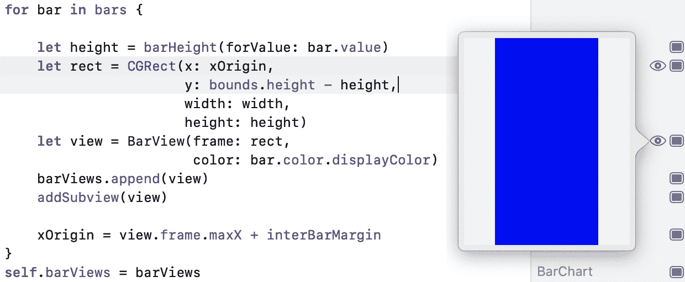

图 7.1 – 柱状图预览框

1.  这同样适用于通过按时间轴中的方形按钮获得的固定内联预览：

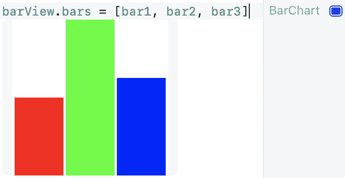

图 7.2 – 柱状图内联预览

这些功能对于测试和调整视图代码非常有用。

如果游乐场的目的是演示或实验自定义视图组件，并且你希望获得更突出的视图输出，你可以使用游乐场的实时视图功能：

1.  在游乐场的顶部导入`PlaygroundSupport`框架：

```swift
import PlaygroundSupport
```

`PlaygroundSupport`框架提供了一系列功能，用于访问游乐场的各种功能。

1.  添加以下内容以设置我们的`BarChart`视图为游乐场的实时视图：

```swift
PlaygroundPage.current.liveView = barView
```

1.  如果游乐场的实时视图不可见，你可以从菜单中显示它。转到编辑器 | 实时视图：

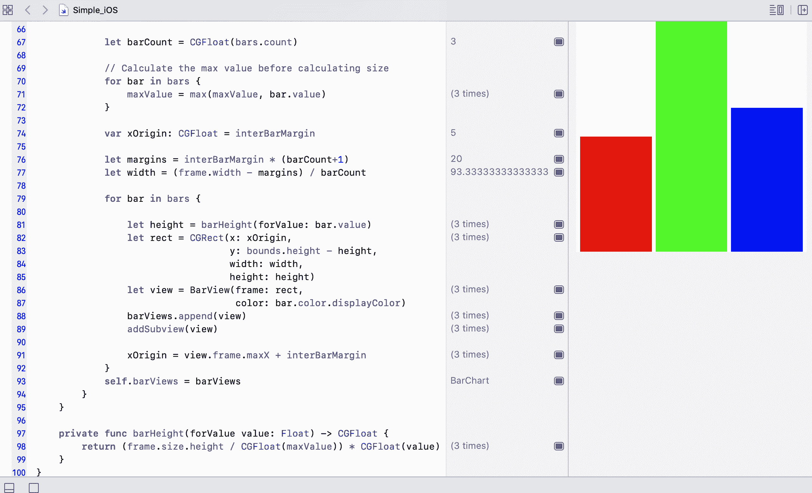

图 7.3 – 实时视图

当游乐场中的代码发生变化时，此视图将更新。尝试更改柱子的值，看看视图如何变化。

## 它是如何工作的...

游乐场的实时视图可以是任何符合`PlaygroundLiveViewable`的组件。在 iOS 上，`UIView`和`UIViewController`都符合`PlaygroundLiveViewable`，macOS 上的等效组件`NSView`和`NSViewController`也是如此。

在前面的代码中，我们构建了一个`BarChart`，它是一个`UIView`，并将其分配给当前`PlaygroundPage`的`liveView`属性。

这些实时视图对触摸事件的响应就像在 macOS 应用程序或 iOS 模拟器中一样。因此，你可以使用它们来测试交互式视图和控制。

不幸的是，游乐场目前不支持界面构建器布局文件，即`.xibs`和`.storyboard`文件。因此，为了使用带有自定义视图的游乐场，你必须以编程方式布局你的视图。

请注意，基于 iOS 的游乐场支持 iOS SDK 中许多但不是所有框架，因此这可能会限制你在游乐场中能做的事情。

## 还有更多...

在前面的示例中，以及本书的大部分内容中，我们专注于基于 iOS 的游乐场。然而，基于 macOS 的游乐场对于 macOS 平台同样有用，也可以用于 UI 测试和实验。

您可以在本书的 GitHub 仓库中找到一个名为`Simple_macOS.playground`的基于 macOS 的游乐场，它也创建了一个简单的条形图视图。[`github.com/PacktPublishing/Swift-Cookbook-Second-Edition/tree/master/Chapter07/01_Using_Swift_Playgrounds_for_UI`](https://github.com/PacktPublishing/Swift-Cookbook-Second-Edition/tree/master/Chapter07/01_Using_Swift_Playgrounds_for_UI)

或者，您也可以创建一个新的基于 macOS 的游乐场，并输入以下代码：

1.  创建一个`Color`结构体：

```swift
import PlaygroundSupport
import Cocoa

struct Color {
    let red: CGFloat
    let green: CGFloat
    let blue: CGFloat
    let alpha: CGFloat = 1.0

    var displayColor: NSColor {
        return NSColor(calibratedRed: red, 
                       green: green, 
                       blue: blue, 
                       alpha: alpha)
    }
}
```

1.  创建一个`Bar`结构体和`BarView`：

```swift
struct Bar {
    var value: Float
    var color: Color
}

class BarView: NSView {

    let color: NSColor

    init(frame: NSRect, color: NSColor) {
        self.color = color
        super.init(frame: frame)
    }

    required init?(coder: NSCoder) {
        self.color = .red
        super.init(coder: coder)
    }

    override func draw(_ dirtyRect: NSRect) {
        super.draw(dirtyRect)
        color.set()
        NSBezierPath.fill(dirtyRect)
    }
}
```

1.  创建`BarChart`视图：

```swift
class BarChart: NSView {

    let color: NSColor

    init(frame: NSRect, color: NSColor) {
        self.color = color
        super.init(frame: frame)
    }

    required init?(coder: NSCoder) {
        self.color = .white
        super.init(coder: coder)
    }

    var bars: [Bar] = [] {
        didSet {
            self.barViews.forEach { $0.removeFromSuperview() }

            var barViews = [BarView]()

            let barCount = CGFloat(bars.count)

            // Calculate the max value before calculating size
            for bar in bars {
                maxValue = max(maxValue, bar.value)
            }

            var xOrigin: CGFloat = interBarMargin

            let margins = interBarMargin * (barCount+1)
            let width = (frame.width - margins) / barCount

            for bar in bars {

                let height = barHeight(forValue: bar.value)
                let rect = NSRect(x: xOrigin, 
                                  y: 0, 
                                  width: width, 
                                  height: height)
                let view = BarView(frame: rect, 
                                   color: bar.color.displayColor)
                barViews.append(view)
                addSubview(view)

                xOrigin = rect.maxX + interBarMargin
            }
            self.barViews = barViews
        }
    }
    var interBarMargin: CGFloat = 5.0

    private var barViews: [NSView] = []
    private var maxValue: Float = 0.0

    override func draw(_ dirtyRect: NSRect) {
        super.draw(dirtyRect)
        color.set()
        NSBezierPath.fill(dirtyRect)
    }

    private func barHeight(forValue value: Float) -> CGFloat {
        return (frame.size.height / CGFloat(maxValue)) * 
          CGFloat(value)
    }
}
```

1.  使用`BarChart`来显示信息：

```swift
let frame = CGRect(x: 0, y: 0, width: 300, height: 300)
let barView = BarChart(frame: frame,
                       color: .white)
PlaygroundPage.current.liveView = barView
let bar1 = Bar(value: 20, color: Color(red: 1, green: 0, blue: 0))
let bar2 = Bar(value: 40, color: Color(red: 0, green: 1, blue: 0))
let bar3 = Bar(value: 25, color: Color(red: 0, green: 0, blue: 1))
barView.bars = [bar1, bar2, bar3]

PlaygroundPage.current.liveView = barView
```

我们自定义的`barView`在 macOS 版本上与 iOS 版本完全相同，基于 macOS 的游乐场的实时视图与其基于 iOS 的对应版本完全相同。

与 iOS 类似，基于 macOS 的游乐场支持许多，但不是所有在 macOS SDK 中可用的框架，因此这可能会限制您在游乐场中能做的事情。

希望您可以从本食谱中看到，Swift Playgrounds 对于在 iOS 和 macOS 上查看 UI 实验确实非常有用。

## 相关内容

Apple 的 Playground Support 框架参考可以在[`swiftbook.link/docs/playgroundsupport`](http://swiftbook.link/docs/playgroundsupport)找到。

# 将资源导入到游乐场中

在构建应用程序时，我们通常会需要包含资源，例如图片。我们如何才能在游乐场中做到这一点，以便我们的 UI 可以包含这些图片？这正是本食谱将要探讨的内容。

我们将通过在上一个食谱中的条形图自定义视图中添加半透明图像来提供纹理，来改进我们的条形图自定义视图。

## 准备工作

对于这个食谱，我们将从上一个食谱中的游乐场开始。这个游乐场的名字是`Simple_iOS.playground`，您可以从本书的 GitHub 仓库中获取它。[`github.com/PacktPublishing/Swift-Cookbook-Second-Edition/tree/master/Chapter07/01_Using_Swift_Playgrounds_for_UI`](https://github.com/PacktPublishing/Swift-Cookbook-Second-Edition/tree/master/Chapter07/01_Using_Swift_Playgrounds_for_UI)

在本食谱中，我们将使用半透明纹理图像。您可以提供自己的图像，或者从这里下载一个示例：[`github.com/PacktPublishing/Swift-Cookbook-Second-Edition/tree/master/Chapter07/02_Import_Resources_into_Playgrounds/EmbeddedResource.playground/Resources`](https://github.com/PacktPublishing/Swift-Cookbook-Second-Edition/tree/master/Chapter07/02_Import_Resources_into_Playgrounds/EmbeddedResource.playground/Resources)

## 如何操作...

让我们看看以下步骤，了解如何将我们的图片添加到游乐场中：

1.  我们需要打开 Xcode 的项目导航器，通常在打开游乐场时默认不可见。要显示项目导航器，从菜单中选择视图 | 导航器 | 项目。或者，您也可以选择 Xcode 窗口左上角的最左侧面板展开按钮：

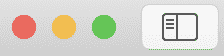

图 7.4 – 项目导航器

Playgrounds 将列在项目导航器的顶部，与展开三角形一起。

1.  选择三角形以显示名为`Sources`和`Resources`的文件夹。

1.  将纹理图像从 Finder 拖入`Resources`文件夹：

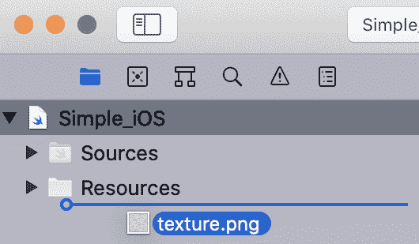

图 7.5 – 向项目中添加文件

现在我们已经将纹理图像嵌入到我们的 Playground 中，我们需要使用它。我们希望条形图中的每个条都有可设置的颜色，但纹理要放在这个颜色之上。

1.  更新我们代码中的`BarView`部分以使用纹理图像：

```swift
class BarView: UIView {

    init(frame: CGRect, color: UIColor) {
        super.init(frame: frame)
        backgroundColor = color
        setupTexture()
    }

    required init?(coder: NSCoder) {
        super.init(coder: coder)
        backgroundColor = UIColor.red
        setupTexture()
    }

    private func setupTexture() {
        guard let textureImage = UIImage(named: "texture") else {
          return }
        let textureColor = UIColor(patternImage: textureImage)
        let frame = CGRect(origin: .zero, size: bounds.size)
        let textureView = UIView(frame: frame)
        textureView.backgroundColor = textureColor
        addSubview(textureView)
    }
}
```

1.  我们可以通过引用图像的文件名（不包含文件扩展名）在`UIImage`初始化器中检索图像，就像在完整的应用程序中做的那样：

```swift
let textureImage = UIImage(named: "texture")
```

当 Playground 执行时，你会看到我们的条形图看起来要有趣得多：

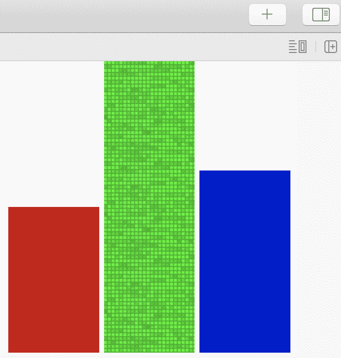

图 7.6 – 纹理条形图

## 它是如何工作的...

要了解我们添加的图像存储在哪里，了解 Playgrounds 的结构很有帮助。

实际上，Playground 是一个文件夹，但具有`.playground`文件扩展名。我们可以通过右键单击或按住*Ctrl*键单击文件来显示上下文菜单。从该菜单中选择“显示包内容”：

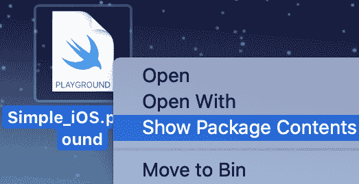

图 7.7 – 查看包内容

这将打开 Playground 作为文件夹，显示其内容。在那里，你会找到许多文件，包括一个名为`Contents.swift`的文件，它包含执行代码的 Swift 文件。还有一个名为`Resources`的文件夹，其中包含我们导入的纹理图像：

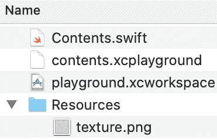

图 7.8 – 包内容

通过将图像拖入文件导航器，Xcode 创建了此文件夹并将图像放入其中。或者，我们也可以手动创建此文件夹并将图像放入其中。Playgrounds 会寻找名为`Resources`的文件夹，并将其中所有资源都提供给 Playground。

## 参见

本食谱的结果可在本书的 GitHub 仓库中找到，位于`chapter 7`文件夹下的`EmbeddedResources.playground`。

# 将代码导入 Playgrounds

正如我们在本章和本书中看到的，Playgrounds 是探索 API、框架和自定义代码的绝佳画布。然而，如果你想探索你自己的代码的用途，似乎你需要将所有需要的代码都包含在 Playground 中，这可能会使它变得很长且难以管理。

不一定需要这样。在本食谱中，我们将看到如何将 Swift 代码嵌入到 Playground 中，并从 Playground 代码中使用它。

## 准备工作

对于这个菜谱，我们将使用上一个菜谱中的游乐场，名为 `EmbeddedResources.playground`，可以从本书的 GitHub 仓库中检索到，网址为 [`github.com/PacktPublishing/Swift-Cookbook-Second-Edition/tree/master/Chapter07/02_Import_Resources_into_Playgrounds`](https://github.com/PacktPublishing/Swift-Cookbook-Second-Edition/tree/master/Chapter07/02_Import_Resources_into_Playgrounds)。

## 如何操作...

我们将把 `BarChart` 自定义视图和相关代码移动到游乐场中嵌入的单独文件中，这样我们就可以自由地使用游乐场来实验我们的自定义视图：

1.  如果游乐场的项目导航器不可见，请从菜单中选择视图 | 导航器 | 项目。

1.  选择 `Sources` 文件夹，然后从菜单中选择文件 | 新建 | 文件来在你的 `**Sources**` 文件夹中创建一个新的 Swift 文件：

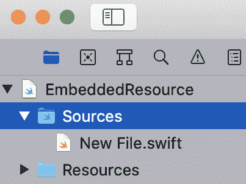

图 7.9 – Sources 文件夹

1.  如果你已经有想要嵌入到游乐场中的 Swift 文件，你可以像我们在上一个菜谱中处理纹理图像那样，将这些文件拖拽到 `Sources` 文件夹中。

1.  将新文件 `Color.swift` 重命名为 `Color`，因为我们将会使用这个文件来存放当前主游乐场内容中的 `Color` 结构体。

1.  将以下代码输入到 `Color.swift` 文件中：

```swift
import UIKit

public struct Color {
    let red: Float
    let green: Float
    let blue: Float
    let alpha: Float

    public init(red:Float, green:Float, blue:Float, alpha:Float = 1) {
        self.red = red
        self.green = green
        self.blue = blue
        self.alpha = alpha
    }

    var displayColor: UIColor {
        return UIColor(red: CGFloat(red),
                       green: CGFloat(green),
                       blue: CGFloat(blue),
                       alpha: CGFloat(alpha))
    }
}
```

注意，我们已经为 `Color` 结构体及其初始化器添加了 `public` 访问控制；随着我们的进展，我们将了解更多关于这一点。

1.  如同我们之前所做的那样，在 `Sources` 文件夹中创建另一个新的 Swift 文件，命名为 `BarChart.swift`，然后输入定义 `BarChart` 自定义视图所需的其余代码，从 `Bar` 结构体开始：

```swift
import UIKit

public struct Bar {
    var value: Float
    var color: Color

    public init(value: Float, color: Color) {
        self.value = value
        self.color = color
    }
}

```

这之后是 `BarView`：

```swift
class BarView: UIView {

    init(frame: CGRect, color: UIColor) {
        super.init(frame: frame)
        backgroundColor = color
        setupTexture()
    }

    required init?(coder: NSCoder) {
        super.init(coder: coder)
        backgroundColor = UIColor.red
        setupTexture()
    }

    private func setupTexture() {
        guard let textureImage = UIImage(named: "texture") else { 
          return }
        let textureColor = UIColor(patternImage: textureImage)
        let textureView = UIView(frame: bounds)
        textureView.backgroundColor = textureColor
        addSubview(textureView)
    }
}
```

最后，我们有 `BarChart`：

```swift
public class BarChart: UIView {

    private var barViews: [BarView] = []
    private var maxValue: Float = 0.0

    var interBarMargin: CGFloat = 5.0

    public var bars: [Bar] = [] {
        didSet {
            self.barViews.forEach { $0.removeFromSuperview() }

            var barViews = [BarView]()

            let barCount = CGFloat(bars.count)

            // Calculate the max value before calculating size
            for bar in bars {
                maxValue = max(maxValue, bar.value)
            }

            var xOrigin: CGFloat = interBarMargin

            let margins = interBarMargin * (barCount+1)
            let width = (frame.width - margins) / barCount

            for bar in bars {

                let height = barHeight(forValue: bar.value)
                let rect = CGRect(x: xOrigin, 
                                  y: bounds.height - height, 
                                  width: width, 
                                  height: height)
                let view = BarView(frame: rect, 
                                   color: bar.color.displayColor)
                barViews.append(view)
                addSubview(view)

                xOrigin = view.frame.maxX + interBarMargin
            }
            self.barViews = barViews
        }
    }

    private func barHeight(forValue value: Float) -> CGFloat {
        return (frame.size.height / CGFloat(maxValue))*
          CGFloat(value)
    }
}
```

1.  在 `Sources` 文件夹中包含的 `BarChart` 实现代码，游乐场内容可以仅用于实验 `BarChart` 自定义视图。移除我们放在其他文件中的代码，你将得到以下内容：

```swift
import PlaygroundSupport
import UIKit

let barView = BarChart(frame: CGRect(x: 0, y: 0, width: 300, height: 
  300))
barView.backgroundColor = .white
let bar1 = Bar(value: 20, color: Color(red: 1, green: 0, blue: 0))
let bar2 = Bar(value: 40, color: Color(red: 0, green: 1, blue: 0))
let bar3 = Bar(value: 25, color: Color(red: 0, green: 0, blue: 1))
barView.bars = [bar1, bar2, bar3]
PlaygroundPage.current.liveView = barView
```

## 工作原理...

在将 `BarChart` 实现移动到嵌入的 Swift 文件中时，我们在想要从游乐场内容中访问的地方添加了 `public` 访问控制。这是因为 `Sources` 文件夹中的代码在访问控制方面充当一种轻量级模块。

任何具有默认 `internal` 访问控制的代码仅对 `Sources` 文件夹内的其他代码可访问。为了使其对主游乐场内容中的代码可访问，它需要声明为 `public` 或 `open`。这非常有用，因为它允许你控制暴露给游乐场内容的内容；因此，你可以提供设计良好的 API，而不暴露底层复杂性。

如果你需要复习访问控制或想了解更多，请查看第二章 *掌握构建块* 中名为 *使用访问控制控制访问* 的菜谱。

## 参见

本菜谱的结果可以在本书 GitHub 仓库的`EmbeddedSources.playground`中找到。

关于 Swift 访问控制的更多信息可以在第二章，*掌握构建块*中找到。

# 多页面游乐场

我们已经讨论了游乐场如何成为探索 API 和实验 UI 的强大工具。然而，游乐场也可以用于记录 API，并提供丰富、可链接的内容。Swift 游乐场在注释和多个页面内容中提供了对丰富文本格式的支持，我们将在本菜谱中探索这些功能。

## 准备工作

我们将从上一个菜谱中使用的游乐场开始，该游乐场显示了我们的自定义`BarChart`视图。你可以从本书的 GitHub 仓库中获取游乐场，名为`EmbeddedSources.playground`，网址为[`github.com/PacktPublishing/Swift-Cookbook-Second-Edition/tree/master/Chapter07`](https://github.com/PacktPublishing/Swift-Cookbook-Second-Edition/tree/master/Chapter07)。

我们将使用我们的`BarChart`视图来显示三种不同的加密货币在 2020 年 1 月至 2020 年 6 月之间的 6 个月期间的价格（美元）。我们可以在不同的游乐场页面上显示每种类型的货币。

如果你想了解更多关于加密货币的信息，你可以观看这个解释视频：

[`swiftbook.link/videos/cryptocurrencies`](http://swiftbook.link/videos/cryptocurrencies)。

## 如何做到这一点...

默认情况下，游乐场只有一个 Swift 内容文件，但为了我们的目的，我们想在游乐场中有三个页面，每个页面对应我们将要记录的三种加密货币：比特币、以太坊和莱特币。让我们开始吧：

1.  如果项目导航器不可见，你应该通过菜单选择视图 | 导航器 | 项目来使其可见。

1.  要创建一个新的游乐场页面，你可以点击项目导航器左下角的加号按钮，或者从菜单中选择文件 | 新建 | 游乐场页面：

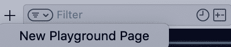

图 7.10 – 新游乐场页面

当创建一个新的游乐场页面时，现有的游乐场内容将成为一个游乐场页面，并且会创建另一个空白页面：

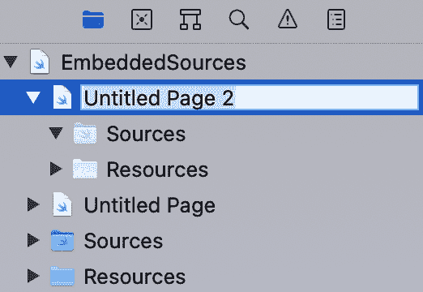

图 7.11 – 在游乐场中创建新页面

1.  创建总共三个页面，因为我们将在三个不同的加密货币上显示数据，并将它们重命名为以下名称：

+   `Bitcoin`

+   `Etherium`

+   `Lightcoin`

每个页面都可以使用我们在上一个菜谱中添加到“源”文件夹中的`BarChart`代码，因此我们可以在每个页面上创建一个`BarChart`视图来绘制每种货币的价值。

1.  将以下代码输入到`Bitcoin`游乐场页面：

```swift
import PlaygroundSupport
import UIKit

let frame = CGRect(x: 0, y: 0, width: 300, height: 300)
let barView = BarChart(frame: frame)
barView.backgroundColor = .white

let green =  Color(red: 0, green: 1, blue: 0)

let jan2020 = Bar(value: 9388.88, color: green)
let feb2020 = Bar(value: 8639.59, color: green)
let mar2020 = Bar(value: 6483.74, color: green)
let apr2020 = Bar(value: 8773.11, color: green)
let may2020 = Bar(value: 9437.05, color: green)
let jun2020 = Bar(value: 9164.54, color: green)

barView.bars = [jan2020,
                feb2020,
                mar2020,
                apr2020,
                may2020,
                jun2020]

PlaygroundPage.current.liveView = barView
```

1.  接下来，将以下代码输入到`Etherium`游乐场页面：

```swift
import PlaygroundSupport
import UIKit

let frame = CGRect(x: 0, y: 0, width: 300, height: 300)
let barView = BarChart(frame: frame)
barView.backgroundColor = .white

let blue = Color(red: 0, green: 0, blue: 1)

let jan2020 = Bar(value: 181.73, color: blue)
let feb2020 = Bar(value: 223.5, color: blue)
let mar2020 = Bar(value: 133.76, color: blue)
let apr2020 = Bar(value: 209.42, color: blue)
let may2020 = Bar(value: 245.76, color: blue)
let jun2020 = Bar(value: 225.71, color: blue)

barView.bars = [jan2020,
                feb2020,
                mar2020,
                apr2020,
                may2020,
                jun2020]

PlaygroundPage.current.liveView = barView
```

1.  最后，将以下代码输入到`Lightcoin`游乐场页面：

```swift
import PlaygroundSupport
import UIKit

let frame = CGRect(x: 0, y: 0, width: 300, height: 300)
let barView = BarChart(frame: frame)
barView.backgroundColor = .white

let red = Color(red: 1, green: 0, blue: 0)

let jan2020 = Bar(value: 67.58, color: red)
let feb2020 = Bar(value: 58.09, color: red)
let mar2020 = Bar(value: 39.13, color: red)
let apr2020 = Bar(value: 46.19, color: red)
let may2020 = Bar(value: 44.23, color: red)
let jun2020 = Bar(value: 41.21, color: red)

barView.bars = [jan2020,
                feb2020,
                mar2020,
                apr2020,
                may2020,
                jun2020]

PlaygroundPage.current.liveView = barView
```

每个页面在运行时都会以条形图的形式显示价值历史，你可以使用项目导航器在它们之间切换。

## 它是如何工作的...

就像我们在之前的菜谱中做的那样，我们可以查看游乐场内部，看看每个游乐场页面是如何表示的。右键点击游乐场，或者按住 *Ctrl* 键点击它。从该菜单中选择显示包内容：

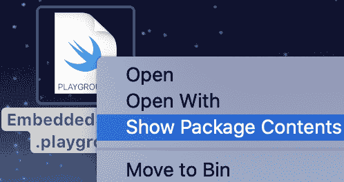

图 7.12 – 查看包内容

你会看到我们之前看到的`Contents.swift`文件夹已经被一个包含三个`.xcplaygroundpage`文件的文件夹所取代，每个文件对应游乐场中的一个页面：

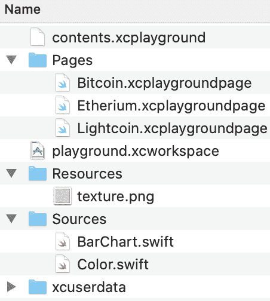

图 7.13 – 提取的内容

这些`.playgroundpage`文件本质上就是一个游乐场。你可以右键点击`.playgroundpage`并选择显示包内容，你将看到我们之前看到的相同的游乐场结构。就像正常的游乐场一样，`.xcplaygroundpage`文件可以包含`Sources`和`Resources`子文件夹，将代码和资源放在这些文件夹中，将使它们仅对该页面可见。

## 还有更多...

由于我们现在可以添加多页内容，并且有嵌入代码和资源的能力，Swift 游乐场在交互式代码文档方面看起来非常有用。为了帮助这个用例，如果我们能对我们的注释的展示有所控制那就太好了；实际上我们可以，因为游乐场支持 Markdown 注释。

Markdown 是一种轻量级文本格式化语法，由*John Gruber*发明，广泛用于编写可以以富文本格式渲染的文本。有关 Markdown 的更多详细信息，请参阅[`swiftbook.link/markdown/docs`](http://swiftbook.link/markdown/docs)。

我们不会深入 Markdown 语法，但你可以在[`swiftbook.link/markdown/cheatsheet`](http://swiftbook.link/markdown/cheatsheet)找到一个有用的速查表。

在我们的游乐场中，通过选择菜单视图 | 检查器 | 文件打开文件检查器窗口，然后在游乐场设置下查看。你会看到一个渲染文档的选项。确保在我们编写一些 Markdown 注释时，这个选项是关闭的：

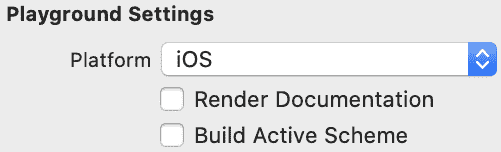

图 7.14 – 游乐场设置

现在让我们在我们的`Bitcoin`页面上添加一些注释：

```swift
/*:
 # Crypto Currencies
 ## Bitcoin
 */

import PlaygroundSupport
import UIKit

/*:
 ### Usage
 * Create Bar Chart
 * Create Bars and add to chart
 * Make Bar Chart the LiveView
 */
let barView = BarChart(frame: CGRect(x: 0, y: 0, width: 300, height: 
  300))
barView.backgroundColor = .white
let green =  Color(red: 0, green: 1, blue: 0, alpha: 1.0)

/*:
 * Note: 
 Bitcoin Price (in USD)
 - Jan 2017 -  $970.17
 - Feb 2017 -  $960.05
 - Mar 2017 - $1203.02
 - Apr 2017 - $1076.90
 - May 2017 - $1390.24
 - Jun 2017 - $2414.11

Taken from [Statista](https://www.statista.com/statistics/326707/bitcoin-price-index)
 */
let jan2017 = Bar(value: 970.17, color: green)
let feb2017 = Bar(value: 960.05, color: green)
let mar2017 = Bar(value: 1203.02, color: green)
let apr2017 = Bar(value: 1076.90, color: green)
let may2017 = Bar(value: 1390.24, color: green)
let jun2017 = Bar(value: 2414.11, color: green)

barView.bars = [jan2017, feb2017, mar2017, apr2017, may2017, jun2017]
PlaygroundPage.current.liveView = barView
```

为了让游乐场知道你的注释包含 Markdown 格式，在注释块的开始后添加一个冒号，`:`。这对于多行注释`/*:`和单行注释`//:`都适用。

在这些注释到位后，让我们将渲染文档功能重新打开，看看注释看起来如何：

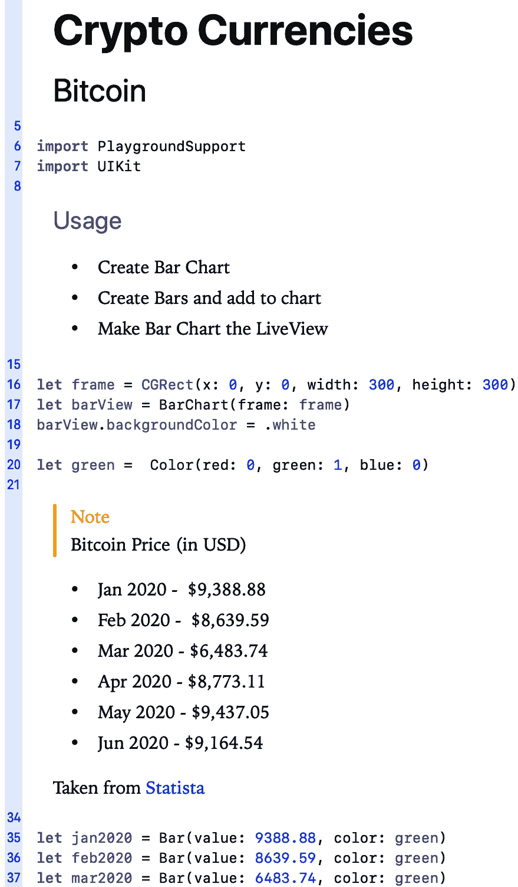

图 7.15 – 渲染的文档

此外，游乐场还支持在游乐场页面之间创建 Markdown 链接；你可以使用`@next`链接到下一页，使用`@previous`链接到上一页。所以，在 Markdown 中，链接将如下所示：

```swift
//: Next page
//: Previous page
```

将添加 Markdown 注释到其他两个页面并建立页面之间的链接，留作读者的练习。

## 参见

本食谱的结果可以在本书的 GitHub 仓库中的`MultiplePages.playground`文件找到，网址为[`github.com/PacktPublishing/Swift-Cookbook-Second-Edition/tree/master/Chapter07/04_Multi-Page_Playgrounds/MultiplePages.playground`](https://github.com/PacktPublishing/Swift-Cookbook-Second-Edition/tree/master/Chapter07/04_Multi-Page_Playgrounds/MultiplePages.playground)。

有关 Markdown 语法的更多信息可以在[`swiftbook.link/markdown/docs`](http://swiftbook.link/markdown/docs)找到。

# 在 iPadOS 上使用 Swift Playgrounds

2016 年，苹果发布了一个仅适用于 iPad 的应用程序，名为 Swift Playgrounds。Swift Playgrounds for iPadOS 借鉴了 Xcode 中 Playgrounds 的成功，并进一步为应用程序添加了一个额外的教育元素。2020 年，苹果还发布了一个 macOS 版本，为教育目的以及那些可能对 Xcode IDE 感到有些畏惧的初学者打开了大门。

在这个食谱中，我们将探讨如何在 iPad 上更轻松地复制类似于第六章中“使用 Swift 构建 iOS 应用程序”的食谱。

## 准备工作

对于这个食谱，你需要一台运行 iOS 14.0 的 iPad 来从 App Store 下载 Swift Playgrounds，或者你也可以从 Mac App Store 下载 macOS 版本，并跟随这个食谱进行操作。

## 如何操作...

1.  我们将首先从你的设备启动 Swift Playgrounds 应用程序。你应该会看到以下内容：

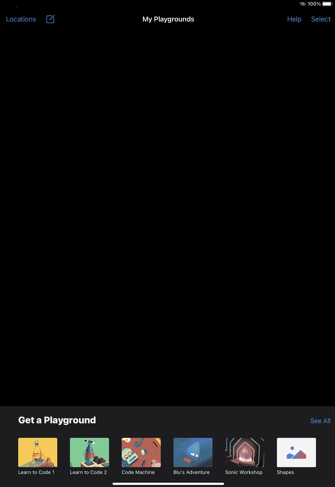

图 7.16 – iPadOS 上的 Swift Playgrounds

1.  接下来，你可以选择滚动浏览“获取游乐场”轮播图，直到看到空白页面，或者点击左上角靠近“位置”的新文档图标。

1.  将创建一个新的文档并将其添加到你的游乐场中。点击它以打开。

欢迎来到游乐场编辑器。这是我们编写代码的地方，你将感受到与在 Xcode 中开发时的熟悉感：

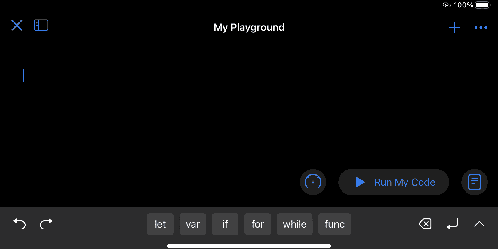

图 7.17 – 我的游乐场

我们将从一个简单的操作开始，只是为了熟悉 IDE（是的，我在称呼它为 IDE——从某种意义上说，它确实如此...）：

1.  点击屏幕以弹出键盘。如果键盘没有弹出，只需按下底部工具栏右侧的箭头键。当你处于那里时，看看一些可用的关键字建议——let、var、if 等等。

1.  前往并点击 let 常量。你会注意到以下内容为你自动填充：

```swift
let name = value
```

1.  在名称占位符高亮显示的情况下，只需开始输入你的变量名，创建一个名为`isSwitchedOn`的变量，然后按*tab*键将高亮显示的占位符移动到`value`这里。然后，输入单词`true`。

就像在 Swift 中预期的那样，类型推断开始工作，我们创建了一个名为`isSwitchedOn`的布尔常量，其值为`true`。

1.  接下来，在新的一行上，点击`if`并完成以下突出显示的代码片段：

```swift
let isSwitchedOn = true
if isSwitchedOn {
 print("Switched On")
}
```

1.  完成后，点击“运行我的代码”按钮，你应该会注意到按钮左侧的图标上出现了一个红色指示器。点击它以显示控制台窗口并检查你的打印语句。

真的很酷啊！好的，那么让我们来做一些更复杂、更有趣的事情。创建另一个项目，并将其命名为`Quotes`（或你喜欢的任何名称）：

1.  首先，如果还没有添加，我们需要添加几个导入：

```swift
import UIKit
import PlaygroundSupport

PlaygroundPage.current.needsIndefiniteExecution = true
```

这后面是第三行，它将游乐场设置为持续运行。我们将在“如何工作...”部分中详细介绍为什么我们需要这样做。

1.  接下来，我们将创建几个结构体，如下所示：

```swift
struct RootResponse: Codable {
    let response: [Response]?
}

struct Response: Codable {
    let id: String?
    let quote: String
}
```

1.  这些与即将调用的 API 的响应类型相匹配。接下来，让我们创建一个类似于`fetchRepos()`函数的函数：

```swift
func fetchQuotes(completionHandler: @escaping ([Response]?) -> Void) 
  -> URLSessionDataTask? {

    var session = URLSession.shared

 let urlString = "https://api.bobross.dev/api/10"

    guard let url = URL(string: urlString) else {
        return nil
    }
    var request = URLRequest(url: url)
    let task = session.dataTask(with: request) { (data, response, 
      error) in

        // First unwrap the optional data
        guard let data = data else {
            completionHandler(nil)
            return
        }

        do {
            let decoder = JSONDecoder()
            let responseObject = try 
              decoder.decode(RootResponse.self, from: data)

            completionHandler(responseObject.response)
        } catch {
            completionHandler(nil)
        }
    }
    task.resume()

    return task
}
```

为了简单起见，我在这里做了一些小的调整，如前述代码中突出显示的那样。我们只是调整了`return`类型，返回我们在上一步中创建的可编码对象。

我们还调用了一个不同的 API，它将返回一个包含引言的数组，我们可以遍历它。

1.  接下来，让我们调用我们的函数：

```swift
fetchQuotes { (response) in
    guard let quotes = response as? [Response] else { return }

    for item in quotes {
        print(item.quote ?? "")
    }
}
```

在这里，我们只是在遍历响应，但你应该看到控制台图标旁边出现以下红色徽章：


图 7.18 – 停止运行按钮

1.  好的，请点击图标并查看结果是否已记录到控制台。如果一切顺利，你现在应该能看到一个包含 10 条引言的列表。

所有这些都工作正常后，让我们看看我们如何更好地组织我们的代码，就像 Xcode 中的 Playgrounds 一样。我们的主要 Swift 文件嵌入在一个根文件中；然而，我们通过添加共享代码文件得到了对**模块**的支持：

1.  要访问这些，请点击右上角靠近关闭按钮的导航图标。按下时，它应该看起来像这样：

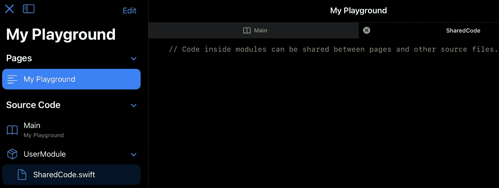

图 7.19 – 项目导航窗口

不要过于担心文件结构，我们将在“如何工作...”部分稍后介绍；现在你需要知道的是，所有可以由游乐场文件使用（或*共享*）的代码都在一个名为 UserModule 的模块中（如果你愿意，可以重命名）。

1.  在这里有一个名为`SharedCode.swift`的文件。突出显示它并将主项目中的可编码结构体剪切并粘贴到这里。如果你喜欢，可以将`SharedCode.swift`重命名为`Models.swift`。

1.  再次运行项目，你会注意到你得到了以下编译器错误——属性不能声明为 public，因为它的类型使用了一个内部类型*.*基本上，由于 Swift Playgrounds 解释外部文件的方式，你需要将结构体声明为 public：

```swift
public struct RootResponse: Codable {
    public let response: [Response]?
}

public struct Response: Codable {
    public let id: String?
    public let quote: String
}
```

再次运行，你会看到逻辑再次以所有它的辉煌工作，但尽管在输出窗口中看到这一点很令人高兴，但让我们再次看看我们如何将其添加到我们的 `liveView` 画布中：

1.  我们首先通过编程创建一个 `TableViewController()`：

```swift
class TableViewController: UITableViewController { }
```

1.  我们将重写 `viewWillLoad()` 并在这里添加我们的代码来调用 `fetchQuotes()` 函数：

```swift
override func viewDidLoad() {
    super.viewDidLoad()

    // Fetch Quotes code to go here

}
```

1.  现在，我们需要添加几个类属性，所以结合以下内容：

```swift
var quotes = [String]()
var session = URLSession.shared
```

`URLSession` 将用于我们的 `fetchQuotes()` 函数，正如我们之前需要的那样。引用数组将是我们存储从 API 响应中获取的所有引用的地方。

1.  接下来，将 `fetchQuotes()` 函数复制到 `TableViewController` 类中（目前这将位于外部）。

1.  现在，我们可以扩展 `viewDidLoad()` 来调用我们的函数：

```swift
override func viewDidLoad() {
    super.viewDidLoad()

 fetchQuotes { (response) in

 guard let quotes = response as? [Response] else { return }
 for item in quotes {
 self.quotes.append(item.quote)
 }
 DispatchQueue.main.async {
 self.tableView.reloadData()
 }
 }

}
```

注意，在前面的代码中，我们不会将输出打印到控制台，而是将其添加到我们的引用数组中。一旦我们的数组被填充，并且我们不再迭代响应，我们就可以在我们的表格视图中调用 `reloadData()`，这需要在 `DispatchQueue.main.async` 中执行以强制在主线程上重新加载（因为我们目前处于来自 API 的异步响应回调中）。

1.  一旦完成，让我们添加一些必要的 `UITableView` 代理，以便我们的表格视图可以显示我们的数据：

```swift
override func numberOfSections(in tableView: UITableView) -> Int {
    return 1
}

override func tableView(_ tableView: UITableView, numberOfRowsInSection section: Int) -> Int {
    return quotes.count
}
```

我们现在需要按任何顺序添加 `numberOfSections()`，它将返回 `1`，然后是 `numberOfRowsInSection()`，它将返回我们数组中的引用数量。

1.  最后，我们需要添加 `cellForRowAt()` 代理：

```swift
override func tableView(_ tableView: UITableView, cellForRowAt indexPath: IndexPath) -> UITableViewCell {

    let quote = quotes[indexPath.row]
    var cell = UITableViewCell()
    if let _ = tableView.dequeueReusableCell(withIdentifier: 
      "table.view.cell") {
        cell = UITableViewCell(style: .default, reuseIdentifier:
          "table.view.cell")
    }

    cell.textLabel?.text = quote
    return cell

}
```

在这里，我们简单地创建一个 `UITableViewCell()` 的实例。如果没有设置重用标识符，我们将为我们的单元格添加一个（我们称之为 `table.view.cell`，但你可以称它为任何你想要的）。然后，使用正在调用的单元格的当前索引，我们从引用数组中获取文本。

1.  最后，我们需要将 `TableViewContoller` 分配给我们的 Live 视图：

```swift
PlaygroundPage.current.liveView = TableViewController()
```

1.  按下“运行我的代码”并你应该看到以下内容：

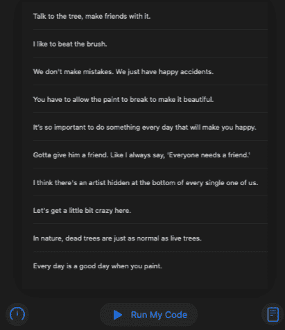

图 7.20 – 结果实时视图

无论你是在 iPad 上使用 Playground 还是通过 Mac App Store，它当然是一个比 Xcode 更强大的替代品。

## 它是如何工作的...

Swift Playgrounds 有一些强大的功能，特别是如果你习惯使用 Xcode，你将立即开始进行比较（我知道我就是这样）。但退一步，看到这一切是如何美妙地交织在一起，确实让我对不仅编写代码，还在 iPad 上进行开发有了新的认识。

让我们看看代码补全。通常，在 Xcode 中，我们期望它在我们在输入时显示，在我们文本旁边的小对话框/表格中，但使用 iPadOS 上的 Swift Playgrounds，我们在屏幕底部得到一个水平滚动条的形式：

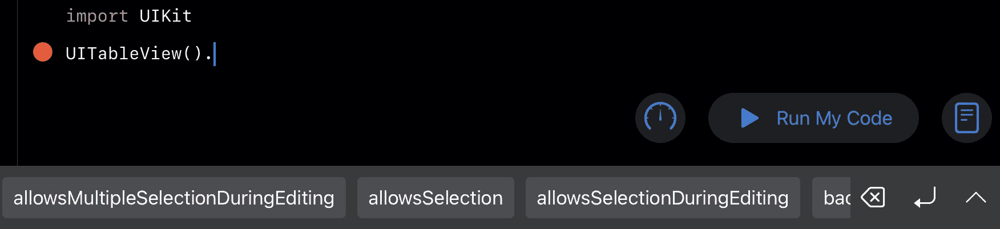

图 7.21 – 语法建议

在这里，我们可以看到一个在`UITableView`上的代码补全示例。注意，我们立即得到了多个仅针对 UITableView 的选项。继续重新实现您之前所做的代理，然后您会在开始输入`numberOf`时看到另一个建议出现 – 它就是那么简单。

另一点需要注意的是编译错误，其显示方式与 Xcode 类似（尽管更符合编辑器中的代码）。当运行您的代码时，将显示以下带有错误描述的红色符号。点击按钮将折叠错误，让您可以更详细地检查您的代码：

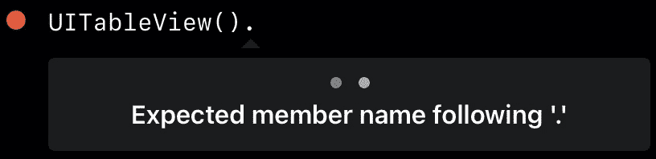

图 7.22 – 错误检查

或者，如果您有很多错误，您可以直接点击菜单栏中+图标左侧的红色图标来显示当前错误列表：

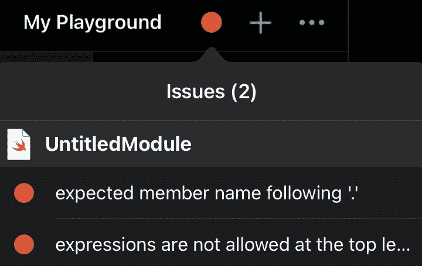

图 7.23 – 错误指示器

有了这个前提，编译器可能并不总是给您错误提示，您可能被迫“逐步执行”您的代码，以找出您的逻辑中究竟发生了什么。如果我们回顾一下*如何做…*部分，您会记得我们需要添加以下代码行来使我们的函数正常工作：

```swift
PlaygroundPage.current.needsIndefiniteExecution = true
```

这是因为我们的沙盒在 API 返回调用之前就完成了执行。让我们暂时注释掉这一行，然后运行我们的代码，您会注意到它从未显示我们的引用列表，但我们想看看发生了什么。

在“运行我的代码”按钮的左侧有一个计时器图标。点击这个图标可以看到以下选项：

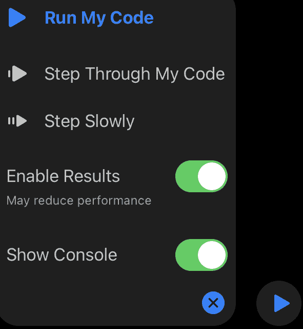

图 7.24 – 运行我的代码选项

**运行我的代码**默认高亮显示，但还有两个额外的选项 – **逐步执行我的代码**和**慢速执行**。这些选项的作用（本质上是一样的，尽管一个执行得比另一个慢）是在代码执行或打算执行时突出显示每一行代码，让您可以跟踪并检查任何潜在的逻辑问题。对于已经熟悉 Xcode IDE 的人来说，这是调试的常见做法。

点击这两个选项之一，并注释掉前面的代码，您会看到我们的代码永远不会结束（因为主同步函数在完成处理程序触发之前就结束了）。如果您尝试几次，您会注意到它偶尔会在完成处理程序的不同点停止。取消注释这一行，然后观察它如何逐步执行到结束。

另一点需要注意的是右上角的对象菜单。按下加号按钮会提供一大堆代码片段供您选择，同时您还可以将图片导入到类似目录的资产中，这样您就可以像在 Xcode 中一样引用图像文字：

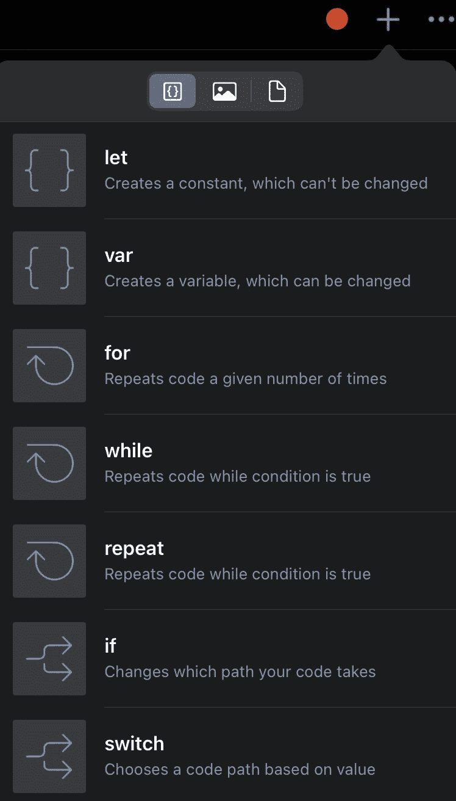

图 7.25 – 布局结果

最后，我想再次提及左侧的文件检查器。如果您再次打开它，您会看到一个编辑按钮，它实际上就是它所说的那样。它允许您编辑、重命名和重新排序项目中的模块的 Swift 文件。

如前所述，Swift Playgrounds 是为 iPadOS 和 macOS 设计的，两者以相同的方式工作，您应该能够在两者上完美地遵循这个食谱（提示，我一半的食谱是在 iPad 上写的，另一半是在 Mac 版本上写的，只是为了测试它！）。

## 还有更多

值得注意的是，最后一个部分是工具部分。点击右上角**+**图标右侧的三个点。现在您应该会看到以下内容：

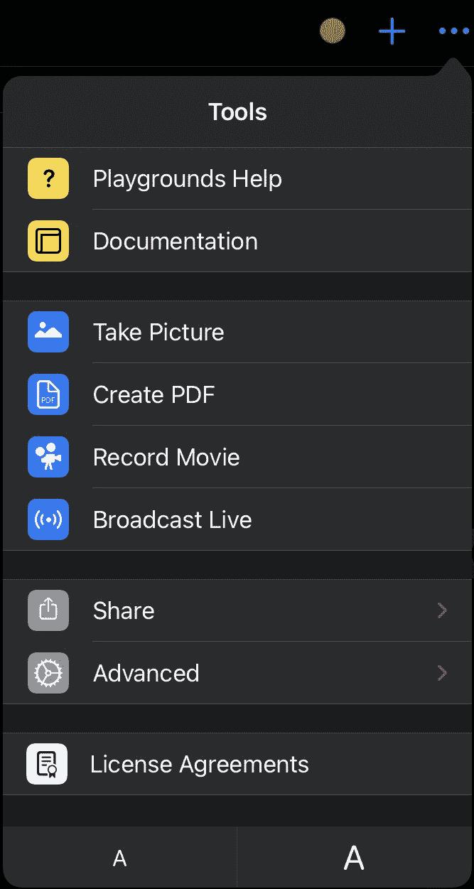

图 7.26 – 操场选项

我们将逐一或集体地过一遍这些内容：

+   **Playgrounds 帮助 / 文档**

如您所预期，帮助功能集中在应用程序/IDE 和界面上，为您提供可用性的概述，而文档则是苹果特定的 API 文档。

+   **拍照 / 创建 PDF**

这些选项共享画布当前状态的截图或 PDF。其他标准的 iPadOS 共享选项也可用。

+   **录制电影 / 直播广播**

录制电影开始一个类似于“屏幕录制”的场景，带有出现在屏幕顶部的停止和录制控制。广播选项可以连接到在 Apple App Store 上可以找到的第三方应用程序，这些应用程序支持广播。

+   **分享 / 高级**

分享将启动默认的 iPadOS 共享表单，以便分享您当前的操作剧本。

高级选项提供两个选项，一个是导出您的操作剧本，另一个是更深入地查看您当前操作剧本的层次结构。

+   **许可协议**

这没有什么值得大书特书的，只是您通常的软件许可协议信息。

## 参见

**苹果的 Swift Playgrounds 页面**：[`www.apple.com/swift/playgrounds/`](https://www.apple.com/swift/playgrounds/)
