# 第三章。创建 iOS Swift 应用程序

2014 年发布 Xcode 6 之后，已经可以构建适用于 iOS 和 OS X 的 Swift 应用程序，并将它们提交到 App Store 进行发布。本章将介绍单视图应用程序和主从视图应用程序，并使用这些应用程序来解释 iOS 应用程序背后的概念，以及介绍 Swift 中的类。

本章将介绍以下主题：

+   iOS 应用程序的架构

+   单视图 iOS 应用程序

+   在 Swift 中创建类

+   Swift 中的协议和枚举

+   使用 `XCTest` 测试 Swift 代码

+   主从视图 iOS 应用程序

+   `AppDelegate` 和 `ViewController` 类

# 理解 iOS 应用程序

iOS 应用程序是一个编译后的可执行文件，以及一个包含在包中的支持文件集。应用程序包被打包成一个存档文件，用于安装到设备或上传到 App Store。

### 小贴士

Xcode 可以用于在模拟器中运行 iOS 应用程序，以及在本地设备上进行测试。将应用程序提交到 App Store 需要一个开发者签名密钥，该密钥包含在 Apple 开发者计划中，请访问 [`developer.apple.com`](https://developer.apple.com)。

到目前为止，大多数 iOS 应用程序都是用 Objective-C 编写的，它是 C 和 Smalltalk 的交叉语言。随着 Swift 的出现，许多开发者可能会将他们应用程序的至少部分迁移到 Swift，以实现性能和维护。

虽然 Objective-C 可能会存在一段时间，但很明显，Swift 是 iOS 开发的未来，也许也是 OS X 的未来。应用程序包含多种不同类型的文件，这些文件在编译时和运行时都会使用。这些文件包括以下内容：

+   `Info.plist` 文件，其中包含有关应用程序本地化语言的信息，应用程序的身份，以及配置要求，例如支持的界面类型（iPad、iPhone 和通用），以及方向（纵向、颠倒、横屏左和横屏右）

+   零个或多个扩展名为 `.xib` 的 *界面构建器* 文件，这些文件包含用户界面屏幕（这取代了之前的 `.nib` 文件）

+   零个或多个扩展名为 `.xcassets` 的 *图像资源* 文件，这些文件存储不同尺寸的相关图标组，例如应用程序图标或用于屏幕显示的图形（这取代了之前的 `.icns` 文件）

+   零个或多个扩展名为 `.storyboard` 的 *故事板* 文件，这些文件用于协调应用程序中不同的屏幕

+   一个或多个包含应用程序代码的 `.swift` 文件

# 创建单视图 iOS 应用程序

单视图 iOS 应用程序是指应用程序在一个屏幕上展示，没有任何过渡或其他视图。本节将展示如何创建一个不使用故事板的单视图应用程序。（关于使用 Swift 和 iOS 的故事板应用程序，请参阅第四章，*使用 Swift 和 iOS 的故事板应用程序*。）

当 Xcode 启动时，它显示一个包含创建新项目能力的欢迎信息。此欢迎信息可以通过导航到**窗口** | **欢迎使用 Xcode**或通过按*Command* + *Shift* + *1*在任何时候重新显示。

使用欢迎对话框中的**创建一个新的 Xcode 项目**选项，或通过导航到**文件** | **新建** | **项目...**，或通过按*Command* + *Shift* + *N*，创建一个新的**iOS**项目，以**单视图应用程序**作为模板，如图所示：

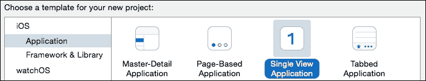

当按下**下一步**按钮时，新项目对话框将要求提供更多详细信息。这里的产品名称是`SingleView`，**组织名称**和**标识符**有适当的值。确保选定的语言是**Swift**，设备类型是**通用**：


### 注意

**组织标识符**是组织的反向域名表示，**捆绑标识符**是**组织标识符**与**产品名称**的连接。发布到 App Store 需要**组织标识符**由发布者拥有，并在[`developer.apple.com/membercenter/`](https://developer.apple.com/membercenter/)的在线开发者中心中进行管理。

当按下**下一步**按钮时，Xcode 将询问项目保存的位置以及是否创建仓库。所选位置将用于创建产品目录，并将提供创建 Git 仓库的选项。

### 提示

在 2014 年，Git 成为了最广泛使用的版本控制系统，超过了所有其他分布式和集中式版本控制系统。在创建新的 Xcode 项目时不创建 Git 仓库是愚蠢的。

当按下**创建**按钮时，Xcode 将创建项目，设置模板文件，然后在本地上或共享服务器上初始化 Git 仓库。

在 Xcode 的左上角按下三角形的播放按钮以启动模拟器：


如果一切设置正确，模拟器将以白色屏幕启动，并在屏幕顶部显示时间和电池：

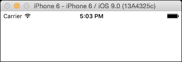

## 移除故事板

单视图应用的默认模板包含一个*故事板*。这将为第一个（唯一）屏幕创建视图，并在幕后执行一些额外的设置。为了理解发生了什么，故事板将被移除，并用代码代替。

### 注意

大多数应用都是使用一个或多个故事板构建的。这里移除它只是为了演示目的；有关如何使用故事板的更多信息，请参阅第四章，*使用 Swift 和 iOS 的故事板应用*。

可以通过前往项目导航器，找到`Main.storyboard`文件，然后按*Delete*键或从上下文相关菜单中选择**Delete**来删除故事板。当显示确认对话框时，选择**Move to Trash**选项以确保文件被删除，而不是仅仅从 Xcode 所知的文件列表中移除。

### 小贴士

要查看项目导航器，请按*Command* + *1*或导航到**View** | **Navigators** | **Show Project Navigator**。

一旦删除了`Main.storyboard`文件，它需要从`Info.plist`中移除，以防止 iOS 在启动时尝试打开它。打开位于`SingleView`文件夹下的`Supporting`文件夹中的`Info.plist`文件。将显示一组键值对；点击**Main storyboard file base name**行将显示(**+**)和(**-**)选项。点击删除图标(**-**)将移除以下行：

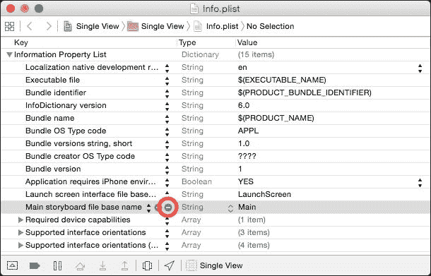

现在当应用启动时，将显示一个黑色屏幕。

### 小贴士

Xcode 模板创建了多个`Info.plist`文件；一个文件用于实际应用，而其他文件用于在运行测试时构建的测试应用。测试将在本章后面的*Swift 中的子类和测试*部分中介绍。

## 设置视图控制器

*视图控制器*负责在激活时设置视图。通常，这是通过故事板或界面文件来完成的。由于这些已经被移除，因此需要手动实例化窗口和视图控制器。

当 iOS 应用启动时，`application:didFinishLaunchingWithOptions:`会在相应的`UIApplicationDelegate`上被调用。可选的`window`变量在从界面文件或故事板加载时自动初始化，但如果用户界面是通过代码实现的，则需要显式初始化。

在`AppDelegate`类中实现`application:didFinishLaunchingWithOptions:`方法如下：

```swift
@UIApplicationMain
class AppDelegate: UIResponder, UIApplicationDelegate {
  var window: UIWindow?
  func application(application: UIApplication,
   didFinishLaunchingWithOptions launchOptions:
   [NSObject:AnyObject]?) -> Bool {
    window = UIWindow()
    window?.rootViewController = ViewController()
    window?.makeKeyAndVisible()
    return true
  }
}
```

### 小贴士

要按名称打开一个类，请按*Command* + *Shift* + *O*并输入类名。或者，导航到**File** | **Open Quickly...**

最后一步是创建视图的内容，这通常在`ViewController`类的`viewDidLoad`方法中完成。作为一个示例用户界面，将创建并添加一个`UILabel`到视图中。每个视图控制器都有一个关联的`view`属性，可以通过`addSubview`方法添加子视图。为了使视图突出，将视图的背景改为黑色，并将文字颜色改为白色：

```swift
class ViewController: UIViewController {
  override func viewDidLoad() {
    super.viewDidLoad()
 view.backgroundColor = UIColor.blackColor()
 let label = UILabel(frame:view.bounds)
 label.textColor = UIColor.whiteColor()
 label.textAlignment = .Center
 label.text = "Welcome to Swift"

 view.addSubview(label)
  }
}
```

这将创建一个标签，其大小为整个屏幕的大小，文字颜色为白色，文字对齐方式为居中。运行时，屏幕上会显示**欢迎使用 Swift**。

### 注意

通常，视图将在它们自己的类中实现，而不是直接内联到视图控制器中。这允许视图在其他控制器中重用。这种技术将在下一章中演示。

当屏幕旋转时，标签将旋转出屏幕。在实际应用中，需要添加逻辑来处理视图控制器中的旋转变化，例如`willRotateToInterfaceOrientation`，并使用视图的`transform`属性适当地添加旋转。通常，会使用界面构建器文件或故事板来自动处理这一点。

# Swift 类、协议和枚举

几乎所有的 Swift 应用程序都将面向对象。第一章，*探索 Swift*，以及第二章，*玩转 Swift*，都展示了函数式和过程式 Swift 代码。使用来自`CoreFoundation`框架的`Process`类，以及来自`UIKit`框架的`UIColor`和`UIImage`类来展示如何在应用程序中使用类。本节描述了如何在 Swift 中创建类、协议和枚举。

## Swift 中的类

在 Swift 中使用`class`关键字创建类，并使用花括号括起来类体。类体可以包含称为*属性*的变量，以及称为*方法*的函数，它们统称为*成员*。实例成员对每个实例都是唯一的，而静态成员在该类的所有实例之间共享。

类通常定义在以类命名的文件中；因此，`GitHubRepository`类通常定义在`GitHubRepository.swift`文件中。可以通过导航到**文件** | **新建** | **文件…**并选择**iOS**下的**Swift 文件**选项来创建一个新的 Swift 文件。确保将其添加到**测试**和**UI 测试**目标中。创建后，按照以下方式实现类：

```swift
class GitHubRepository {
  var id:UInt64 = 0
  var name:String = ""
  func detailsURL() -> String {
    return "https://api.github.com/repositories/\(id)"
  }
}
```

此类可以按如下方式实例化和使用：

```swift
let repo = GitHubRepository()
repo.id = 1
repo.name = "Grit"
repo.detailsURL() // returns https://api.github.com/repositories/1
```

可以创建静态成员，这些成员对于类的所有实例都是相同的。在`GitHubRepository`类中，`api` URL 对于所有调用可能都是相同的，因此它可以重构为一个`static`属性：

```swift
class GitHubRepository {
  // does not work in Swift 1.0 or 1.1
  static let api = "https://api.github.com"
  …
  class func detailsURL(id:String) -> String {
    return "\(api)/repositories/\(id)"
  }
}
```

现在，如果需要更改`api` URL（例如，为了支持模拟测试或支持内部 GitHub Enterprise 服务器），只需在一个地方进行更改。在 Swift 2 之前，可能会显示一个错误信息**类变量尚未支持**。

在 Swift 版本 2 之前使用静态变量，必须使用不同的方法。可以定义*计算属性*，这些属性不是存储的，而是在需要时计算。它们有一个*getter*（也称为*访问器*）和可选的*setter*（也称为*修改器*）。前面的例子可以重写如下：

```swift
class GitHubRepository {
  class var api:String {
    get {
      return "https://api.github.com"
    }
  }
  func detailsURL() -> String {
    return "\(GitHubRepository.api)/repositories/\(id)"
  }
}
```

虽然这在逻辑上是一个只读常量（没有相关的`set`块），但无法使用访问器定义`let`常量。

要引用类变量，使用类型名——在这个例子中是`GitHubRepository`。当`GitHubRepository.api`表达式被评估时，会调用 getter 的主体。

## Swift 中的子类和测试

没有显式父类的简单 Swift 类被称为*基类*。然而，Swift 中的类经常通过在类名后指定一个超类来*继承*另一个类。这种语法的格式是`class` `SubClass:SuperClass{...}`。

Swift 中的测试使用**XCTest**框架编写，该框架默认包含在 Xcode 模板中。这允许应用程序在本地编写和执行测试，以确认没有引入错误。

### 小贴士

XCTest 取代了之前的测试框架 OCUnit。

`XCTest`框架有一个基类叫做`XCTestCase`，所有测试都继承自这个类。在测试用例类中，以`test`开头（且不带参数）的方法在运行测试时会被自动调用。测试代码可以通过调用`XCTAssert*`函数，如`XCTAssertEquals`和`XCTAssertGreaterThan`，来指示成功或失败。

`GitHubRepository`类的测试通常存在于相应的`GitHubRepositoryTest`类中，它将是`XCTestCase`的子类。通过导航到**文件 | 新 | 文件...**并选择**源**类别下的**iOS**中的**Swift 文件**来创建一个新的 Swift 文件。确保选择**Tests**和**UITests**目标，但不选择应用程序目标。它可以实现如下：

```swift
import XCTest
class GitHubRepositoryTest: XCTestCase {
  func testRepository() {
    let repo = GitHubRepository()
    repo.id = 1
    repo.name = "Grit"
    XCTAssertEqual(
      repo.detailsURL(),
      "https://api.github.com/repositories/1",
      "Repository details"
    )
  }
}
```

确保将`GitHubRepositoryTest`类添加到测试目标中。如果文件创建时没有添加，可以通过选择文件并按*Command* + *Option* + *1*来显示**文件检查器**。测试目标旁边的复选框应该被选中。测试永远不会添加到主目标中。`GitHubRepository`类应该添加到两个测试目标中：

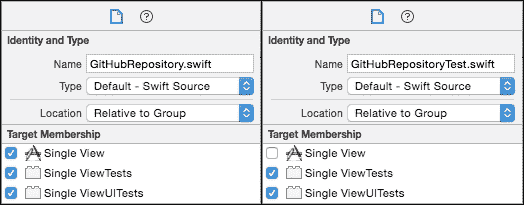

`GitHubDetails`协议可以在与现有 Swift 类型相同的位置用作类型，例如变量类型、方法返回类型或参数类型。

### 注意

总是检查失败的测试是否会导致构建失败；这将确认测试实际上正在运行。例如，在`GitHubRepositoryTest`类中，修改 URL 以从前面删除`https`并检查是否显示测试失败。没有比正确实现但从未运行过的测试更无用的了。

## 在 Swift 中需要理解的最后一种概念是*枚举*，或简称为*enum*。枚举是一组封闭的值，例如`North`、`East`、`South`和`West`，或者`Up`和`Down`。

协议在 Swift 中被广泛使用，以允许来自框架的回调，否则这些框架不知道特定的回调处理程序。如果需要超类，则单个类不能用于实现多个回调。常见的协议包括`UIApplicationDelegate`、`Printable`和`Comparable`。

### 注意

只有当协议被标记为`@objc`属性时，才支持可选协议方法。这表示该类将由`NSObject`类支持，以便与 Objective-C 进行互操作性。纯 Swift 协议不能有可选方法。

在 Swift 中需要理解的最后一种概念是*枚举*，或简称为*enum*。枚举是一组封闭的值，例如`North`、`East`、`South`和`West`，或者`Up`和`Down`。

```swift
protocol GitHubDetails {
  func detailsURL() -> String
  // protocol needs @objc if using optional protocols
  // optional doNotNeedToImplement()
}
```

### 当一个类既有超类又有一个或多个协议时，必须首先列出超类。

协议不能有默认参数的函数。除非使用了`@objc`类属性，否则协议可以与`struct`、`class`和`enum`类型一起使用；在这种情况下，它们只能用于 Objective-C 类或枚举。

Swift 中的协议

### 小贴士

当通过按*Command* + *U*或导航到**产品** | **测试**来运行测试时，测试的结果将显示出来。更改实现或预期的测试结果将演示测试是否正确执行。

```swift
class GitHubRepository: GitHubDetails {
  func detailsURL() -> String {
    // implementation as before
  }
}
```

**协议**在其他语言中类似于接口；它是一个具有方法签名但没有方法实现的命名类型。类可以实现零个或多个协议；当它们这样做时，它们被称为**采用**或**符合**协议。协议可能有一系列方法，这些方法是**必需的**（默认）或**可选的**（用`optional`关键字标记）。

### 注意

类通过在类名后列出协议名称来符合协议，类似于超类。

## 小贴士

Swift 中的枚举

Swift 中的枚举

```swift
enum Suit {
  case Clubs, Diamonds, Hearts // many on one line
  case Spades // or each on separate lines
}
```

与 C 不同，枚举值默认没有特定类型，因此它们通常不能转换为整数值。枚举可以定义具有**原始值**，允许转换为整数值。枚举值使用类型名和`enum`名称分配给变量：

```swift
var suit:Suit = Suit.Clubs
```

然而，如果已知表达式的类型，则不需要显式指定类型前缀；在 Swift 代码中，以下形式更为常见：

```swift
var suit:Suit = .Clubs
```

### 原始值

对于具有特定意义的 `enum` 值，可以从不同的类型扩展 `enum`，例如 `Int`。这些被称为*原始值*：

```swift
enum Rank: Int {
  case Two = 2, Three, Four, Five, Six, Seven, Eight, Nine, Ten
  case Jack, Queen, King, Ace
}
```

可以使用 `rawValue` 属性和可失败初始化器 `Rank(rawValue:)` 将原始值 `enum` 转换为其原始值，如下所示：

```swift
Rank.Two.rawValue == 2
Rank(rawValue:14)! == .Ace
```

### 提示

可失败初始化器返回一个可选的 `enum` 值，因为等效的 `Rank` 可能不存在。例如，表达式 `Rank(rawValue:0)` 将返回 `nil`。

### 关联值

`enum` 还可以有*关联值*，例如其他语言中的值或案例类。例如，可以将 `Suit` 和 `Rank` 的组合组合起来形成 `Card`：

```swift
enum Card {
  case Face(Rank, Suit)
  case Joker
}
```

可以通过将值传递给 `enum` 初始化器来创建实例：

```swift
var aceOfSpades: Card = .Face(.Ace,.Spades)
var twoOfHearts: Card = .Face(.Two,.Hearts)
var theJoker: Card = .Joker
```

一个 `enum` 实例的关联值不能被提取（如 `struct` 的属性那样），但可以通过 `switch` 语句中的模式匹配来访问 `enum` 值：

```swift
var card = aceOfSpades // or theJoker or twoOfHearts ...
switch card {
  case .Face(let rank, let suit): 
    print("Got a face card \(rank) of \(suit)");
  case .Joker: 
    print("Got the joker card")
}
```

Swift 编译器将要求 `switch` 语句是详尽的。由于 `enum` 只包含这两种类型，因此不需要 `default` 块。如果将来在 `Card` 中添加了另一个 `enum` 值，编译器将在该 `switch` 语句中报告错误。

# 创建 master-detail iOS 应用程序

在了解了 Swift 中如何定义类、协议和 `enum` 之后，可以创建一个更复杂的 master-detail 应用程序。master-detail 应用程序是一种特定的 iOS 应用程序，它最初显示主表视图，当选择一个单独的元素时，将显示一个次要的详细信息视图，显示有关所选项目的更多信息。

使用欢迎屏幕上的**创建新 Xcode 项目**选项，或通过导航到**文件** | **新建** | **项目…**或按*Command* + *Shift* + *N*，创建一个新项目，并从**iOS 应用**类别中选择**Master-Detail 应用程序**：

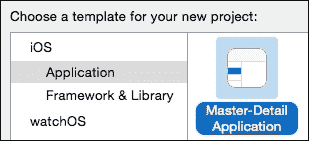

在随后的对话框中，输入项目的适当值，例如名称（`MasterDetail`）、组织标识符（通常基于反向 DNS 名称），确保**语言**下拉菜单读取为**Swift**，并且它针对**通用**设备：

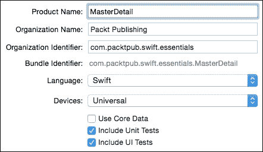

当项目创建时，一个包含由向导本身创建的所有文件的 Xcode 窗口将打开，包括 `MasterDetail.app` 和 `MasterDetailTests.xctest` 产品。`MasterDetail.app` 是一个由模拟器或连接的设备执行的包，而 `MasterDetailTests.xctest` 和 `MasterDetailsUITests.xctest` 产品用于执行应用程序代码的单元测试。

可以通过按 Xcode 左上角的三角形播放按钮或按 *Command* + *R* 来启动应用程序，这将针对当前选定的目标运行应用程序。


在简短的编译和构建周期之后，iOS 模拟器将打开一个包含空表的首页，如下面的截图所示：

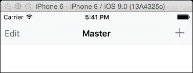

默认的 `MasterDetail` 应用程序可以通过点击屏幕右上角的添加（**+**）按钮来向列表中添加项目。这将向列表中添加一个新的带时间戳的条目。

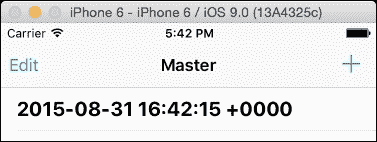

当点击此项目时，屏幕将切换到详情视图，在这种情况下，屏幕中央显示时间：

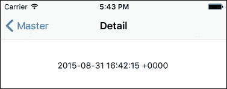

这种主详情应用在 iOS 应用程序中很常见，用于显示顶层列表（如购物清单、一组联系人、待办笔记等），同时允许用户点击查看详情。

主详情应用程序中有三个主要类：

+   `AppDelegate` 类定义在 `AppDelegate.swift` 文件中，它负责启动应用程序并设置初始状态

+   `MasterViewController` 类定义在 `MasterViewController.swift` 文件中，它用于管理第一个（主）屏幕的内容和交互

+   `DetailViewController` 类定义在 `DetailViewController.swift` 文件中，它用于管理第二个（详情）屏幕的内容

为了更详细地了解这些类的作用，接下来的三个部分将依次介绍它们。

### 提示

本节生成的代码是从 Xcode 7.0 创建的，因此如果使用不同版本的 Xcode，模板可能会有所不同。可以从 Packt 网站或本书的 GitHub 仓库 [`github.com/alblue/com.packtpub.swift.essentials/`](https://github.com/alblue/com.packtpub.swift.essentials/) 获取相应的代码的精确副本。

## `AppDelegate` 类

`AppDelegate` 类是应用程序的主要入口点。当一组 Swift 源文件被编译时，如果存在 `main.swift` 文件，它将作为应用程序的入口点运行该代码。然而，为了简化 iOS 应用程序的设置，存在一个 `@UIApplicationMain` 特殊属性，它将生成 `main` 方法并设置关联的类作为应用程序代理。

iOS 的 `AppDelegate` 类扩展了 `UIResponder` 类，它是 iOS 上所有 UI 内容的父类。它还采用了两个协议，`UIApplicationDelegate` 和 `UISplitViewControllerDelegate`，用于在发生某些事件时提供回调：

```swift
@UIApplicationMain
class AppDelegate: UIResponder, UIApplicationDelegate,
   UISplitViewControllerDelegate {
  var window: UIWindow?
  ...
}
```

### 注意

在 OS X 上，`AppDelegate` 类将是 `NSApplication` 的子类，并采用 `NSApplicationDelegate` 协议。

合成的 `main` 函数调用 `UIApplicationMain` 方法，该方法读取 `Info.plist` 文件。如果存在 `UILaunchStoryboardName` 键，并且指向一个合适的文件（在这种情况下是 `LaunchScreen.xib` 接口文件），它将在进行任何进一步工作之前显示为启动画面。在应用程序的其余部分加载完毕后，如果存在 `UIMainStoryboardFile` 键，并且指向一个合适的文件（在这种情况下是 `Main.storyboard` 文件），则启动故事板并显示初始视图控制器。

故事板引用了 `MasterViewController` 和 `DetailViewController` 类。`window` 变量被分配给故事板的窗口。

当应用程序启动后，会调用 `application:didFinishLaunchingWithOptions` 方法。该方法通过一个指向 `UIApplication` 实例的引用和一个字典传递，字典通知应用程序是如何启动的：

```swift
func application(
 application: UIApplication,
 didFinishLaunchingWithOptions launchOptions:
  [NSObject: AnyObject]?) -> Bool {
  // Override point for customization after application launch.
  ...
}
```

在示例 `MasterDetail` 应用程序中，`application:didFinishLaunchingWithOptions` 方法从显式解包的 `window` 中获取对 `splitViewController` 的引用，并将 `AppDelegate` 设置为其代理：

```swift
let splitViewController = 
 self.window!.rootViewController as! UISplitViewController
splitViewController.delegate = self
```

### 小贴士

`… as! UISplitViewController` 语法执行类型转换，以便可以将泛型 `rootViewController` 赋值给更具体的类型；在这种情况下，`UISplitViewController`。一个替代版本 `as?` 提供了运行时检查的转换，并返回一个可选值，该值要么包含正确转换的类型值，要么在否则返回 `nil`。与 `as!` 的区别是，如果项目不是正确的类型，将发生运行时错误。

最后，从 `splitViewController` 获取一个 `navigationController`，它存储了一个 `viewControllers` 数组。这允许 `DetailView` 在必要时在左侧显示一个按钮以展开详细视图：

```swift
let navigationController = splitViewController.viewController
 [splitViewController.viewControllers.count-1]
 as! UINavigationController
navigationController.topViewController
 .navigationItem.leftBarButtonItem =
 splitViewController.displayModeButtonItem()
```

这唯一的区别在于在宽屏设备上运行时，例如 iPhone 6 Plus 或 iPad，在横向模式下视图并排显示。这是 iOS 8 应用程序中的新功能。

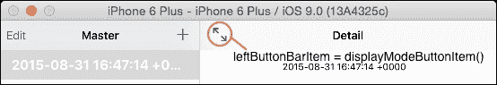

否则，当设备处于纵向模式时，它将渲染为一个标准的后退按钮：

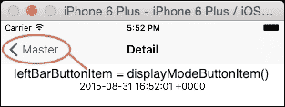

该方法以 `return true` 结束，以让操作系统知道应用程序已成功打开。

## `MasterViewController` 类

`MasterViewController` 类负责协调在第一屏（当设备处于纵向模式时）或屏幕左侧（当大设备处于横向模式时）显示的数据。这是通过 `UITableView` 渲染的，并且数据通过父 `UITableViewController` 类进行协调：

```swift
class MasterViewController: UITableViewController {
  var detailViewcontroller: DetailViewController? = nil
  var objects = [AnyObject]()
  override func viewDidLoad() {…}
  func insertNewObject(sender: AnyObject) {…}
  …
}
```

`viewDidLoad` 方法用于在视图加载后设置或初始化视图。在这种情况下，创建了一个 `UIBarButtonItem`，以便用户可以向表中添加新条目。`UIBarButtonItem` 在 Objective-C 中使用 `@selector`，在 Swift 中被视为可转换为字符串字面量的（因此 `"insertNewObject:"` 将导致调用 `insertNewObject` 方法）。一旦创建，按钮就被添加到右侧的导航中，使用标准的 `.Add` 类型，它将在屏幕上显示为 **+** 号：

```swift
override func viewDidLoad() {
  super.viewDidLoad()
  self.navigationItem.leftBarButtonItem = self.editButtonItem()
  let addButton = UIBarButtonItem(
    barButtonSystemItem: .Add, target: self, 
    action: "insertNewObject:")
  self.navigationItem.rightBarButtonItem = addButton
  if let split = self.splitViewController {
    let controllers = split.viewControllers
    self.detailViewController = (controllers[controllers.count-1] as! UINavigationController).topViewController as? DetailViewController
}
```

这些对象是 `NSDate` 值，作为 `AnyObject` 元素的数组存储在类中。当按下 **+** 按钮时调用 `insertNewObject` 方法，它创建一个新的 `NSDate` 实例，然后将其插入到数组中。`sender` 事件作为 `AnyObject` 类型的参数传递，它将是一个对 `UIBarButtonItem` 的引用（尽管在这里不需要或使用它）：

```swift
func insertNewObject(sender: AnyObject) {
  objects.insertObject(NSDate.date(), atIndex: 0)
  let indexPath = NSIndexPath(forRow: 0, inSection: 0)
  self.tableView.insertRowsAtIndexPaths(
   [indexPath], withRowAnimation: .Automatic)
}
```

### 备注

在 iOS 设备上可用 blocks 之前，就创建了 `UIBarButtonItem` 类，因此它使用较旧的 Objective-C `@selector` 机制。iOS 的未来版本可能提供一个接受 block 的替代方案，在这种情况下，可以传递 Swift 函数。

父类包含对 `tableView` 的引用，该引用由 storyboard 自动创建。当插入一个项目时，`tableView` 被通知有一个新的对象可用。使用标准的 `UITableViewController` 方法从数组中访问数据：

```swift
override func numberOfSectionsInTableView(
 tableView: UITableView) -> Int {
  return 1
}
override func tableView(tableView: UITableView,
 numberOfRowsInSection section: Int) -> Int {
  return objects.count
}
override func tableView(tableView: UITableView,
 cellForRowAtIndexPath indexPath: NSIndexPath) -> UITableViewCell{
  let cell = tableView.dequeueReusableCellWithIdentifier(
   "Cell", forIndexPath: indexPath)
  let object = objects[indexPath.row] as! NSDate
  cell.textLabel!.text = object.description
  return cell
}
override func tableView(tableView: UITableView,
 canEditRowAtIndexPath indexPath: NSIndexPath) -> Bool {
  return true
}
```

在这个例子中，`numberOfSectionsInTableView` 函数返回 `1`，但 `tableView` 可以有多个分区；例如，为了允许联系人应用程序有 A、B、C 到 Z 的不同分区。`numberOfRowsInSection` 方法返回每个分区的元素数量；在这种情况下，因为只有一个分区，所以数组中的对象数量。

### 备注

每个方法之所以被称为 `tableView` 并接受一个 `tableView` 参数，是因为 UIKit 的 Objective-C 继承的结果。Objective-C 中的约定将方法名作为第一个命名参数，因此原始方法是 `[delegate` `tableView:UITableView,` `numberOfRowsInSection:NSInteger]`。因此，第一个参数的名称被重用作 Swift 中方法的名称。

`cellForRowAtIndexPath` 方法预期返回一个 `UITableViewCell` 对象。在这种情况下，通过使用 `dequeueReusableCellWithIdentifier` 方法（该方法在单元格离开屏幕时缓存单元格以节省对象实例化）从 `tableView` 中获取一个单元格，然后使用对象的 `description`（这是对象的 `String` 表示形式；在这种情况下，是日期）填充 `textLabel`。

这足以在表中显示元素，但为了允许编辑（或只是删除，如示例应用程序中所示），还需要一些额外的协议方法：

```swift
override func tableView(tableView: UITableView,
 canEditRowAtIndexPath indexPath: NSIndexPath) -> Bool {
  return true
}
override func tableView(tableView: UITableView,
 commitEditingStyle editingStyle: UITableViewCellEditingStyle,
 forRowAtIndexPath indexPath: NSIndexPath) {
  if editingStyle == .Delete {
    objects.removeObjectAtIndex(indexPath.row)
    tableView.deleteRowsAtIndexPaths([indexPath],
     withRowAnimation: .Fade)
  }
}
```

`canEditRowAtIndexPath` 方法如果行可编辑则返回 `true`；如果所有行都可以编辑，则对于所有值都将返回 `true`。

`commitEditingStyle` 方法接受一个表格、一个路径和一个样式，这是一个枚举，表示发生了哪个操作。在这种情况下，传入 `UITableViewCellEditingStyle.Delete` 以从底层对象数组以及从 `tableView` 中删除项目。（枚举可以缩写为 `.Delete`，因为 `editingStyle` 的类型已知为 `UITableViewCellEditingStyle`。）

## `DetailViewController` 类

在 `MasterViewController` 中选择元素时，将显示详细视图。过渡由故事板控制器管理；视图通过 *segue*（发音为 *seg-way*；基于意大利语中 *follows* 一词的 *segue* 一词的产物）连接。

要在控制器之间传递选定的项目，`DetailViewController` 类中存在一个名为 `detailItem` 的属性。当值更改时，将运行额外的代码，这通过 `didSet` 属性通知实现：

```swift
class DetailViewController: UIViewController {
  var detailItem: AnyObject? {
    didSet {
      self.configureView()
    }
  }
  … 
}
```

当 `DetailViewController` 设置了 `detailItem` 时，将调用 `configureView` 方法。在值更改后，`didSet` 主体将运行，但在设置器返回调用者之前。这是由 `MasterViewController` 中的 `segue` 触发的：

```swift
class MasterViewController: UIViewController {
  …
  override func prepareForSegue(
   segue: UIStoryboardSegue, sender: AnyObject?) {
    super.prepareForSegue(segue, sender: sender)
    if segue.identifier == "showDetail" {
      if let indexPath = 
       self.tableView.indexPathForSelectedRow() {
        let object = objects[indexPath.row] as! NSDate
        let controller = (segue.destinationViewController 
         as! UINavigationController)
         .topViewController as! DetailViewController
        controller.detailItem = object
        controller.navigationItem.leftBarButtonItem =
         self.splitViewController?.displayModeButtonItem()
        controller.navigationItem.leftItemsSupplementBackButton =
         true
      }
    } 
  }
}
```

当用户在表格中选择一个项目时，将调用 `prepareForSegue` 方法。在这种情况下，它从表格中获取选定的行索引，并使用此索引获取选定的日期对象。搜索导航控制器层次结构以获取 `DetailViewController`，一旦获取到，就使用 `controller.detailItem` `=` `object` 设置选定的值，这触发了更新。

标签最终通过 `configureView` 方法在 `DetailViewController` 中显示，该方法将对象的 `description` 打印到中心的 `label` 上：

```swift
class DetailViewController {
  ...
  @IBOutlet weak var detailDescriptionLabel: UILabel!
  function configureView() {
    if let detail: AnyObject = self.detailItem {
      if let label = self.detailDescriptionLabel {
        label.text = detail.description
      }
    }
  }
}
```

当 `detailItem` 发生变化或首次加载视图时，将调用 `configureView` 方法。如果 `detailItem` 未设置，则此操作没有效果。

实现引入了一些新的概念，这些概念值得强调：

+   `@IBOutlet` 属性表示该属性将在界面构建器中公开，并可以连接到对象实例。这将在第四章、*使用 Swift 和 iOS 的 Storyboard 应用程序*和第五章、*在 Swift 中创建自定义视图*中更详细地介绍。

+   `weak` 属性表示该属性不会存储对象的 *strong* 引用；换句话说，详情视图不会拥有该对象，而只是引用它。通常，所有 `@IBOutlet` 引用都应该声明为 `weak` 以避免循环依赖引用。

+   类型定义为 `UILabel!`，这是一个 *隐式解包的可选类型*。当访问时，它会对可选值执行显式解包；否则，`@IBOutlet` 将被连接为一个 `UILabel?` 可选类型。隐式解包的可选类型用于变量在运行时已知永远不会是 `nil` 的情况，这对于 `@IBOutlet` 引用通常是这种情况。通常，所有 `@IBOutlet` 引用都应该使用隐式解包的可选类型。

# 摘要

本章介绍了两个 iOS 应用程序的示例；一个是通过编程创建 UI 的，另一个是从故事板中加载 UI 的。结合对类、协议和枚举的概述，以及解释 iOS 应用程序是如何启动的，本章为理解经常用于启动新项目的 Xcode 模板提供了一个起点。

下一章，*使用 Swift 和 iOS 的故事板应用*，将更详细地介绍故事板的创建方式以及如何从头开始构建一个应用程序。
