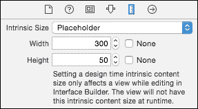

# 第五章. 使用 Swift 创建自定义视图

用户界面可以通过 Interface Builder、Storyboard 编辑器或自定义代码通过组合标准视图和视图控制器来构建。然而，最终可能需要将用户界面分解成更小、可重用且易于测试的片段。这些被称为 *自定义视图*。

本章将介绍以下主题：

+   自定义表格视图

+   构建和布局自定义视图子类

+   使用 `drawRect` 绘制图形视图

+   使用动画创建分层图形

# UIView 概述

所有 iOS 视图都基于一个名为 `UIView` 的 Objective-C 类，该类来自 `UIKit` 框架/模块。`UIView` 类代表一个可能关联到 `UIWindow` 或用于表示离屏视图的矩形空间。执行用户交互的视图通常是 `UIControl` 的子类。`UIView` 和 `UIViewController` 都继承自 `UIResponder` 类，而 `UIResponder` 类又继承自 `NSObject`：


在 Mac OS X 上，视图基于 NSView，来自 `AppKit` 框架。否则，这两个实现非常相似。将使用一个新的 Xcode 项目来创建自定义视图类。创建一个基于 **标签应用** 模板的名为 `CustomViews` 的新项目。要从一个空白表单开始，请从 `Main.storyboard` 中删除生成的视图控制器及其相关的 `FirstViewController` 和 `SecondViewController` 类。

# 使用 Interface Builder 创建新视图

创建自定义视图最简单的方法是使用 Interface Builder 拖放内容。这通常是通过 `UITableView` 和 *原型表格单元格* 来完成的。

## 创建表格视图控制器

从对象库中将 **Table View Controller** 拖放到主故事板中，然后从标签栏控制器拖放到新创建的表格视图控制器中，以创建一个名为 `view controllers` 的关系转换。（转换在 第四章 的 *Storyboards*、*转换* 和 *场景* 部分有更详细的介绍，*Storyboard Applications with Swift and iOS*。）

默认情况下，表格视图控制器将具有 *动态属性内容*——也就是说，它能够显示可变数量的行。这定义在 **表格视图** 部分的 **属性检查器** 中，可以通过从场景导航器中选择 **表格视图** 并按 *Command* + *Option* + *4* 来显示：


### 注意

表格有一个选项可以具有*静态内容*；表格中的固定行数。这在创建可以分割成块的可滚动内容时有时很有用，即使它看起来不像表格。iOS 设置中的大多数元素都表示为固定大小的表格视图。在表格视图的顶部有一个或多个**原型单元格**。这些用于定义表格项的外观和感觉。默认情况下，使用`UITableViewCell`，它有一个标签和一个图像，但可以使用原型单元格向条目添加更多数据。


可以使用原型单元格提供额外的信息或视图。例如，可以将两个标签拖入视图中；一个标签可以居中在顶部，并使用标题字体显示，而第二个可以左对齐。

从对象库中拖动两个**UILabel**到原型单元格中，并使用**Auto Layout**适当地排列它们。

要更改标签的字体，在编辑器中选择标签，然后转到**属性检查器**。在**标签**部分，单击**字体选择器**图标并选择**标题**或**副标题**，根据需要：


完成后，原型单元格将类似于以下截图：


当应用程序运行时，将看到一个空表格。这是因为表格目前没有显示任何条目。下一节将展示如何向表格添加数据，以便将其绑定并显示到原型单元格中。

## 在表格中显示数据

`UITableView`从`UITableViewDataSource`获取数据。`UITableViewController`类已经实现了`UITableViewDataSource`协议，因此只需要实现少量方法来为表格提供数据。

### 小贴士

由于`UITableView`最初是用 Objective-C 实现的，因此协议中定义的方法接受一个`tableView`。因此，Swift 中的所有`UITableViewDataSource`代理方法最终都以`tableView`结尾，并带有不同的参数。

创建一个新的`SampleTable`类，该类继承自`UITableViewController`。按照以下方式实现该类：

```swift
import UIKit
class SampleTable: UITableViewController {
  var items = [
    ("First", "A first item"),
    ("Second", "A second item"),
  ]
  required init?(coder:NSCoder) {
    super.init(coder:coder)
  }
  override func tableView(tableView: UITableView,
    numberOfRowsInSection section:Int) -> Int {
    return items.count
  }
  override func tableView(tableView: UITableView,
    cellForRowAtIndexPath indexPath: NSIndexPath)
     -> UITableViewCell {
    let cell = tableView.
     dequeueReusableCellWithIdentifier("prototypeCell")!

    // configure labels
    return cell
  }
}
```

实现数据源方法后，需要配置标签以显示数组中的数据。需要完成三件事：从`xib`文件中获取原型单元格；提取标签；最后，将表格视图控制器与自定义的`SampleTable`类关联。

首先，`cellForRowAtIndex`函数需要一个可重用单元格的标识符。**标识符**在主故事板中的原型单元格上设置。要设置此标识符，请选择原型单元格，然后转到**属性检查器**。在**表格视图单元格**部分的**标识符**中输入`prototypeCell`：


标识符用于`tableView`的`dequeueReusableCellWithIdentifier`方法中。当使用`xib`来加载单元格时，返回值将要么是之前已经离开屏幕的单元格，要么是从`xib`中实例化出的新单元格。

每个标签都可以分配一个非零整数**Tag**，这样就可以使用`viewWithTag`方法从原型单元格中提取标签：

```swift
let titleLabel = cell.viewWithTag(1) as! UILabel
let subtitleLabel = cell.viewWithTag(2) as! UILabel
```

要为视图分配标签，选择**Heading Label**，导航到**Attributes Inspector**，并将**Tag**更改为`1`。对**Subheading Label**做同样的事情，将**Tag**设置为`2`：


现在，可以设置行的文本值：

```swift
let (title,subtitle) = items[indexPath.row]
titleLabel.text = title
subtitleLabel.text = subtitle
```

最后，需要将`SampleTable`与表格视图控制器关联起来。点击表格，进入**Identity Inspector**，在**Custom Class**部分输入`SampleTable`：


当应用程序运行时，将显示以下视图：


### 小贴士

要隐藏状态栏，在`Info.plist`文件中添加或更改**Status bar is initially hidden**为**YES**，并将**View controller-based status bar appearance**设置为**NO**。请注意，Xcode 7 在使用这些选项时显示`CGContextRestoreGState: invalid context 0x0`错误消息，这是一个已知问题，可能在后续版本中修复。

## 在 xib 文件中定义视图

可以使用**Interface Builder**创建视图，将其保存为`xib`文件，然后按需实例化。这就是`UITableView`背后的操作——存在一个`registerNib:forCellReuseIdentifier:`方法，它接受一个`xib`文件和一个标识符（在先前的例子中对应于`prototypeCell`）。

通过导航到**File** | **New** | **File** | **iOS** | **User Interface** | **View**创建一个名为`CounterView.xib`的新接口文件来表示视图。打开后，它将显示为一个空视图，没有内容，并且在一个 600 x 600 的正方形中。要将大小更改为更合理的尺寸，转到**Attributes Inspector**并将大小从**Inferred**更改为**Freeform**。同时，将**Status Bar**、**Top Bar**和**Bottom Bar**更改为**None**。然后切换到**Size Inspector**并修改视图的**Frame Rectangle**为`300` x `50`：


这应该会调整视图的大小，使其显示为 300 x 50 而不是之前的 600 x 600，并且状态栏和其他栏不应可见。现在，通过从对象库中拖动到视图的左侧添加一个**Stepper**，并将一个**Label**拖到右侧。调整大小并添加缺失的约束，使视图看起来类似于以下截图：


## 连接自定义视图类

创建一个新的 `CounterView` 类，它扩展了 `UIView`，并为 `label` 定义一个 `@IBOutlet`，以及一个接受 `sender` 的 `@IBAction` `change` 方法。

打开 `CounterView.xib` 文件并选择视图。将 **Custom Class** 更改为 `CounterView`。将步进器的 `valueChanged` 事件连接到 `change` 方法，并连接到 `label` 输出：


实现 `change` 函数，以便在选择步进器时更改标签文本：

```swift
import UIKit
class CounterView: UIView {
  @IBOutlet weak var label:UILabel!
  @IBAction func change(sender:AnyObject) {
    let count = (sender as! UIStepper).value
    label.text = "Count is \(count)"
  }
}
```

`CounterView` 将被添加到 `SampleTable` 的 **表头** 中。每个 `UITableViewController` 都有一个对其关联的 `UITableView` 的引用，每个 `UITableView` 都有一个用于整个表格的可选 `headerView`（和 `footerView`）。

### 注意

`UITableView` 还具有 `sectionHeader` 和 `sectionFooter`，它们用于分隔表格的不同部分。一个表格可以有多个部分——例如，每个月一个部分——并且每个部分都可以使用单独的头部和尾部。

要创建一个 `CounterView`，必须加载 `xib` 文件。这是通过使用 `nibName` 和 `bundle` 实例化一个 `UINib` 来实现的。最合适的地方是在 `SampleTable` 类的 `viewDidLoad` 方法中完成这个操作：

```swift
class SampleTable: UITableViewController {
  override func viewDidLoad() {
    let xib = UINib(nibName:"CounterView", bundle:nil)
    // continued
```

一旦加载 `xib`，就必须创建视图。`instantiateWithOwner` 方法允许将 `xib` 中的对象反序列化。

### 注意

在 `xib` 文件中可以存储多个对象（例如，为了定义一个适合小显示设备而不是大显示设备的单独视图）；但通常，`xib` 文件只包含一个视图。

所有权传递给视图，以便可以将任何连接连接到界面的文件所有者。这通常是 `self`，如果没有连接则为 `nil`：

```swift
    // continued from before
    let objects = xib.instantiateWithOwner(self, options:nil)
    // continued
```

这返回一个 `AnyObject` 实例的数组，因此将第一个元素强制转换为 `UIView` 是一个常见的步骤。

### 小贴士

可以使用 `objects[0]`，但如果数组为空，这将导致失败。相反，使用 `objects.first` 来获取包含第一个元素的可选值。

使用 `as?` 强制类型转换，可以将可选值转换为更具体的类型，并从这一点进行到 `tableHeaderView` 的赋值：

```swift
    // continued from before
    let counter = objects.first as? UIView
    tableView.tableHeaderView = counter
  }
```

当在这个模拟器中运行此应用程序时，可以在表格顶部看到以下头部：


拥有一个 `xib` 来表示用户界面的一个优点是，它可以使用单个定义在许多地方重用。例如，可以使用相同的 `xib` 来实例化另一个视图作为表格的底部，如下所示：

```swift
tableView.tableFooterView = 
  xib.instantiateWithOwner(self,options:nil).first as? UIView
```

当应用程序现在运行时，计数器会在表格的顶部和底部创建：


## 处理固有大小

当一个视图被添加到一个使用 **Auto Layout** 管理的视图中时，它将使用其 *固有内容大小*。不幸的是，在 **Interface Builder** 中定义的视图没有方法可以程序化地设置其固有大小或在 Interface Builder 中指定它。**大小检查器** 允许更改此值，但正如 Xcode 所注明的，这在运行时没有任何效果：



如果一个自定义类与视图相关联，则可以定义一个适当的固有大小。向 `CounterView` 添加一个方法，重写 `intrinsicContentSize` 方法并返回一个 `CGSize`，允许一些 `.xib` 自定义，并返回标签的固有大小和某个值（如 `(300,50)`）的最大值：

```swift
override func intrinsicContentSize() -> CGSize {
  let height = max(50,label.intrinsicContentSize().height)
  let width = max(300,label.intrinsicContentSize().width)
  return CGSize(width: width, height: height)
}
```

现在当视图被添加到一个由 Auto Layout 管理的视图中时，它将有一个适当的初始大小，尽管它可以变得更大。

### 注意

大小应该考虑到包含在其中的各种视图的大小，以及任何可能改变视图的字体大小或主题。使用标签的 `intrinsicSize` 来计算最大值是一个好主意。

# 通过子类化 `UIView` 创建新视图

虽然`.xib` 文件提供了一个自定义类的机制，但标准框架之外的大多数 `UIKit` 视图都是通过自定义代码实现的。这使得推理固有大小应该是什么以及接收代码补丁和理解版本控制系统的 `diffs` 变得更容易。这种方法的一个缺点是，在使用 Auto Layout 时，编写约束可能是一个挑战，固有大小通常报告错误或返回未知值：`(-1,-1)`。

自定义视图可以作为一个 `UIView` 的子类来实现。`UIView` 的子类通常应该有两个初始化器，一个接受 `frame:CGRect` 参数，另一个接受 `coder:NSCoder` 参数。`frame` 通常在代码中使用，它指定了屏幕上的位置（`0,0` 是左上角）以及宽度和高度。`coder` 在从 `xib` 文件反序列化时使用。

为了允许自定义子类既可以在 Interface Builder 中使用，也可以从代码中实例化，一个好的做法是确保两个初始化器都创建了必要的视图。这可以通过一个名为 `setupView` 的第三个方法来完成，它从两个地方调用。

创建一个名为 `TwoLabels` 的类，该类在视图中包含两个标签：

```swift
import UIKit
class TwoLabels: UIView {
  var left:UILabel = UILabel()
  var right:UILabel = UILabel()
  required init?(coder:NSCoder) {
    super.init(coder:coder)
    setupView()
  }
  override init(frame:CGRect) {
    super.init(frame:frame)
    setupView()
  }
  // ...
}
```

`setupView` 调用将子视图添加到视图中。这里放入的代码应该只执行一次。没有标准的名称，通常示例代码会将设置放在一个或另一个 `init` 方法中。

通常有一个单独的方法，例如 `configureView`，用于用当前的数据集填充 UI。这可以根据系统的状态重复调用；例如，一个字段可能根据某些条件被启用或禁用。此代码应该是可重复的，以便它不会修改视图层次结构：

```swift
func setupView() {
  addSubview(left)
  addSubview(right)
  configureView()
}
func configureView() {
  left.text = "Left"
  right.text = "Right"
}
```

在显式设置大小环境中（其中文本标签正在设置并放置在特定位置），有一个`layoutSubviews`方法被调用以请求正确布局视图。然而，有一种更好的方法，那就是使用自动布局和约束。

## 自动布局和自定义视图

自动布局在第四章的*使用自动布局*部分中介绍，*使用 Swift 和 iOS 的 Storyboard 应用*。在显式创建用户界面时，必须适当地设置和管理工作视图。管理这些视图的最简单方法是使用自动布局，这需要添加约束来设置视图。

可以在`updateConstraints`方法中添加或更新约束。这通常在调用`setNeedsUpdateConstraints`之后进行。如果视图变得可见或数据发生变化，可能需要更新约束。通常，这可以通过在`setupView`方法末尾放置一个调用来实现，如下所示：

```swift
func setupView() {
  // addSubview etc
  setNeedsUpdateConstraints()
}
```

`updateConstraints`方法需要执行几个操作。为了防止自动调整大小掩码被转换为约束，每个视图都需要调用`setTranslatesAutoresizingMaskIntoConstraints`并传递参数`false`。

### 提示

为了便于在弹簧和支柱（也称为自动调整大小掩码）之间以及自动布局之间进行转换，可以配置视图将弹簧和支柱转换为自动布局约束。默认情况下，对所有视图启用此功能，以提供对现有视图的向后兼容性，但在实现自动布局时应将其禁用。

可以增量更新约束或删除现有约束。`removeConstraints`方法允许首先删除现有约束，如下所示：

```swift
override func updateConstraints() {
  translatesAutoresizingMaskIntoConstraints = false
  left.translatesAutoresizingMaskIntoConstraints = false
  right.translatesAutoresizingMaskIntoConstraints = false
  removeConstraints(constraints)
  // add constraints here
}
```

可以使用`NSLayoutConstraint`类编程添加约束。在 Interface Builder 中添加的约束也是`NSLayoutConstraint`类的实例。

约束表示为一个方程；两个对象的属性以以下形式的等式（或不等式）相关联：

```swift
// object.property = otherObject.property * multiplier + constant
```

要声明两个标签具有相同的宽度，可以在`updateConstraints`方法中添加以下内容：

```swift
// left.width = right.width * 1 + 0
let equalWidths = NSLayoutConstraint(
  item: left,
  attribute: .Width,
  relatedBy: .Equal,
  toItem: right,
  attribute: .Width,
  multiplier: 1,
  constant: 0)
addConstraint(equalWidths)
```

## 约束和视觉格式语言

虽然添加单个约束为我们提供了最大的灵活性，但通过编程设置可能会很繁琐。可以使用*视觉格式语言*向视图添加多个约束。这是一种基于 ASCII 的表示，允许视图在位置上相互关联，并扩展成约束数组。

约束可以水平（默认）或垂直应用。`|`字符可以用来表示包含的父视图的开始或结束，而`-`用来表示在`[]`中命名的视图之间的空间，这些视图在字典中引用。

要约束在视图中相邻的两个标签，可以使用 `H:|-[left]-[right]-|`。这可以读作一个水平（`H:`）从左边距（`|-`）开始，然后是左视图（`[left]`），一个间隔（`-`），一个右视图（`[right]`），最后是一个从右边距的间隔（`-|`）。同样，可以使用 `V:` 前缀添加垂直约束。

`NSLayoutConstraint` 类上的 `constraintsWithVisualFormat` 方法可以用来解析视觉格式约束。它接受一组 `options`、`metrics` 以及一个包含在视觉格式中引用的 `views` 字典。返回一个约束数组，这些约束可以被传递到视图的 `addConstraints` 方法中。

要添加确保 `left` 和 `right` 视图具有相等宽度、它们之间有空间以及视图顶部和标签之间有垂直空间的约束，可以使用以下代码：

```swift
override func updateConstraints() {
  // …
  let options = NSLayoutFormatOptions()
  let namedViews = ["left":left,"right":right]
  addConstraints(NSLayoutConstraint.
    constraintsWithVisualFormat("H:|-[left]-[right]-|",
      options: options, metrics: nil, views: namedViews))
  addConstraints(NSLayoutConstraint.
    constraintsWithVisualFormat("V:|-[left]-|",
      options: options, metrics: nil, views: namedViews))
  addConstraints(NSLayoutConstraint.
    constraintsWithVisualFormat("V:|-[right]-|",
      options: options, metrics: nil, views: namedViews))
  super.updateConstraints()
}
```

### 注意

如果存在模糊的约束，则在视图显示时将在控制台打印错误。包含 `NSAutoresizingMaskLayout` 约束的消息表明视图尚未禁用自动将自动调整大小掩码转换为约束的自动转换。

## 将自定义视图添加到表格中

可以通过将其添加到之前创建的 `SimpleTable` 的页脚来测试 `TwoLabels` 视图。页脚是一个特殊类，`UITableViewHeaderFooterView`，需要创建并添加到 `tableView` 中。然后可以将 `TwoLabels` 视图添加到页脚的 `contentView`：

```swift
let footer = UITableViewHeaderFooterView()
footer.contentView.addSubview(TwoLabels(frame:CGRect.zero))
tableView.tableFooterView = footer
```

现在当应用程序在模拟器中运行时，将看到自定义视图：


# 使用 `drawRect` 绘制自定义图形

`UIView` 的子类可以通过提供一个实现自定义绘图例程的 **drawRect** 方法来实现它们自己的自定义图形。`drawRect` 方法接受一个 `CGRect` 参数，它指示要绘制的区域。然而，实际的绘图命令是在 Core Graphics 上下文中执行的，该上下文由 `CGContext` 类表示，可以通过调用 `UIGraphicsGetCurrentContext` 获取。

Core Graphics 上下文表示 iOS 中的一个可绘制区域，它用于打印以及绘制图形。每个视图都有绘制自己的责任；矩形将是整个区域（例如，视图第一次绘制时）或可能是区域的一个子集（例如，当对话框显示然后随后被移除时）。

*核心图形* 是一个基于 C 的接口（而不是基于 Objective-C），因此 API 以 `UIGraphics` 前缀开始的一组函数的形式公开。与其他绘图 API 一样，程序可以设置当前绘图颜色、绘制线条、设置填充颜色、填充矩形等。

要测试这个，创建一个名为 `SquaresView` 的类，它是 `UIView` 的新子类，在一个新的 Swift 文件中。

所有视图都有标准的`init`方法；将它们委托给超类的实现。最后，创建一个接受`CGRect`的`drawRect`方法。这将是在自定义绘图发生的地方。其骨架如下所示：

```swift
import UIKit
class SquaresView: UIView {
  required init?(coder: NSCoder) {
    super.init(coder:coder)
    setupView()
  }
  override init(frame: CGRect) {
    super.init(frame:frame)
    setupView()
  }
  func setupView() {
  }
  override func drawRect(rect: CGRect) {
    // drawing code goes here
  }
}
```

打开`Main.storyboard`，拖入另一个`UIViewController`，并在**Identity Inspector**中将视图的定制类设置为`SquaresView`。在标签视图控制器和新视图控制器之间拖入一个关系切换，并将标签栏项设置为`Squares`，这将允许测试移动到不同的视图。如果运行应用程序，将在**Squares**标签中看到一个空白视图。

## 在 drawRect 中绘制图形

要在视图中绘制图形，需要获取一个`CGContext`并设置一个绘图（描边）颜色。可以获取一个`UIColor`并将其转换为`CGColor`，以便能够在图形上下文中设置它。

最后，可以使用`CGContextStrokeRect`绘制一个矩形：

```swift
override func drawRect(rect: CGRect) {
  let context = UIGraphicsGetCurrentContext()
  let red = UIColor.redColor().CGColor
  CGContextSetStrokeColorWithColor(context, red)
  CGContextStrokeRect(context, 
    CGRect(x:50, y:50, width:100, height:100))
}
```

当在模拟器中运行时，将在**Squares**标签上显示一个红色矩形。

要在中间绘制一个带有黑色轮廓的绿色正方形，首先需要绘制一个填充的绿色正方形，然后绘制一个黑色正方形。 (以相反的顺序绘制它们将导致实心绿色正方形消除黑色正方形。)

在 Core Graphics 上下文中有两种不同的颜色：*描边颜色*，用于绘制线条和路径，以及*填充颜色*，用于创建填充路径。尽管存在`CGContextSetFillColorWithColor`函数，但在 Swift 中，使用`UIColor`的`setFill`或`setStroke`方法直接设置要简单得多。以下代码将创建一个带有黑色边框的绿色正方形：

```swift
UIColor.greenColor().setFill()
UIColor.blackColor().setStroke()
CGContextFillRect(context,
  CGRect(x:75, y:75, width:50, height:50))
CGContextStrokeRect(context,
  CGRect(x:75, y:75, width:50, height:50))
```

现在当应用程序运行时，将看到以下内容：


## 响应方向变化

当屏幕旋转时，视图被拉伸和挤压，导致正方形变成矩形。当视图改变方向时，不会调用`drawRect`调用；现有的显示会自动被挤压和拉伸。

为了防止这种情况，可以更改视图的*内容模式*。有一个名为`UIViewContentMode`的枚举，可以指定以引起不同的行为。使用`Redraw`将在方向改变或边界大小改变时调用`drawRect`。

### 注意

其他`enum`值在`UIViewContentMode`类型中有所记录，包括缩放选项以及居中或附着到其中一个边缘或角落。

正方形可以居中在屏幕上；而不是从位置`50,50`开始，可以通过访问视图的`center`属性来找出位置。按照以下方式修改代码：

```swift
func setupView() {
  contentMode = .Redraw
}
override func drawRect(rect: CGRect) {
  let context = UIGraphicsGetCurrentContext()
  let red = UIColor.redColor().CGColor
  CGContextSetStrokeColorWithColor(context,red)
  CGContextStrokeRect(context,
    CGRect(x:center.x-50, y:center.y-50, width:100, height:100))
  UIColor.greenColor().setFill()
  UIColor.blackColor().setStroke()
  CGContextFillRect(context,
    CGRect(x:center.x-25, y:center.y-25, width:50, height:50))
  CGContextStrokeRect(context,
    CGRect(x:center.x-25, y:center.y-25, width:50, height:50))
}
```

现在当应用程序运行时，正方形将居中在屏幕上。如果屏幕旋转，`drawRect`将被再次调用，并且显示将被重新绘制。

# 使用图层进行自定义图形

通过重写 `drawRect` 来绘制图形并不太高效，因为所有的绘图例程都是在 CPU 上执行的。将图形绘制任务卸载到 GPU 上既更高效，也更节能。

iOS 有一个层的概念，它们是 Core Graphics 优化的绘图内容。在 *层* 上组成的操作，包括添加 *路径*，可以转换为可以在 GPU 上执行并高效渲染的代码。此外，可以使用 Core Animation 高效地动画化层上的变化。*Core Animation* 由 **QuartzCore** 框架/模块提供；这两个术语可以互换使用。它更普遍地被称为 Core Animation。

在 iOS 中，可以将下载进度图标重新创建为一个包含层（用于圆形轮廓）、一个层（用于中间的方形停止按钮）和一个层（用于进度弧）的 `ProgressView`。最终的视图将组合这三个层以提供完成后的视图。

每个 `UIView` 都有一个隐式关联的层，可以向其添加子层。与视图一样，新添加的层会覆盖现有层。可以使用几个 **核心动画层** 类，它们是 `CALayer` 的子类，具体如下：

+   `CAEAGLLayer` 类提供了一种将 OpenGL 内容嵌入到视图中的方法

+   `CAEmitterLayer` 类提供了一种生成发射效果（如烟雾和火焰）的机制

+   `CAGradientLayer` 类提供了一种创建具有渐变颜色的背景的方法

+   `CAReplicatorLayer` 类提供了一种通过不同的变换复制现有层的方法，这允许显示如反射和 coverflow 这样的效果

+   `CAScrollLayer` 类提供了一种执行滚动的方法

+   `CAShapeLayer` 类提供了一种绘制和动画化单个路径的方法

+   `CATextLayer` 类允许显示文本

+   `CATiledLayer` 类提供了一种在不同缩放级别生成平铺内容的方法，如地图

+   `CATransformLayer` 类提供了一种将层转换为 3D 视图（如 coverflow 风格的图像动画）的方法

## 通过层创建 `ProgressView`

创建另一个名为 `ProgressView` 的视图类，它扩展了 `UIView`。使用默认的 `init` 方法、`setupView` 方法和 `configureView` 方法来设置它：

```swift
import UIKit
class ProgressView: UIView {
  required init?(coder: NSCoder) {
    super.init(coder:coder)
    setupView()
  }
  override init(frame: CGRect) {
    super.init(frame:frame)
    setupView()
  }
  func setupView() {
    configureView()
  }
  func configureView() {
  }
}
```

通过从对象库中将 `UIViewController` 拖动到 `Main.storyboard` 中来创建一个新的 `Layers` `Scene`。通过拖动一个关系 segue 到新创建的 layers 视图控制器来将其连接到标签栏控制器。通过从对象库中拖动一个 **View** 并将其 **Custom Class** 设置为 `ProgressView` 来添加 `ProgressView`。将其大小调整到屏幕中间的大致位置。

现在向 `ProgressView` 类添加一个实例变量 `circle` 并创建一个新的 `CAShapeLayer` 实例。在 `setupView` 中，将 `strokeColor` 设置为 `black`，`fillColor` 设置为 `nil`。最后，将 `circle` 层添加到视图的层中，以便显示：

```swift
let circle = CAShapeLayer()
func setupView() {
  circle.strokeColor = UIColor.blackColor().CGColor
  circle.fillColor = nil
  self.layer.addSublayer(circle)
  configureView()
}
```

`CAShapeLayer` 有一个 `path` 属性，用于执行所有绘图操作。使用它的最简单方法是创建一个 `UIBezierPath`，然后使用 `CGPath` 访问器将其转换为 `CGPath`。

### 注意

*贝塞尔曲线* 是在两点之间表示平滑曲线以及一个或多个控制点的一种方法。这些曲线可以精确缩放，并且在图形卡上易于计算。`UIBezierPath` 提供了一种表示一个或多个贝塞尔路径的方法，从而实现平滑且高效的曲线生成。

与 `UIGraphics*` 方法不同，没有单独的 `draw*` 和 `fill*` 操作；相反，要么设置 `fillColor` 或 `strokeColor`，然后填充或绘制路径（绘制）。`UIBezierPath` 可以通过添加段来构建，但有几个初始化器可以用来绘制特定形状。例如，可以使用 `ovalInRect` 初始化器绘制圆形：

```swift
func configureView() {
  let rect = self.bounds
  circle.path = UIBezierPath(ovalInRect: rect).CGPath
}
```

现在当应用程序运行时，将在 **图层** 选项卡上看到一个小的黑色圆圈：


## 添加停止正方形

可以通过创建另一个图层来添加停止正方形。这将允许根据需要打开或关闭停止按钮。（例如，在下载过程中，可以显示停止按钮，当下载完成后，可以将其动画化消失。）

添加一个名为 `square` 的新常量，类型为 `CAShapeLayer`。它将有助于创建一个常量 `black`，因为它将在本类的其他地方再次使用：

```swift
class ProgressView: UIView {
  let square = CAShapeLayer()
  let circle = CAShapeLayer()
  let black = UIColor.blackColor().CGColor
}
```

现在可以将 `setupView` 方法更新以处理额外的图层。由于通常以相同的方式设置它们，因此使用循环是设置多个图层的快速方法，如下所示：

```swift
func setupView() {
  for layer in [square, circle] {
    layer.strokeColor = black
    layer.fillColor = nil
    self.layer.addSublayer(layer)
  }
  configureView()
}
```

使用 `UIBezierPath` 的 `rect` 初始化器可以创建 `square` 的路径。为了创建一个位于圆内的矩形，请使用 `insetBy` 方法并设置一个合适的值：

```swift
func configureView() {
  let rect = self.bounds
  let sq = rect.insetBy(dx: rect.width/3, dy: rect.height/3)
  square.fillColor = black
  square.path = UIBezierPath(rect: sq).CGPath
  circle.path = UIBezierPath(ovalInRect: rect).CGPath
}
```

现在当应用程序运行时，将看到以下内容：


## 添加进度条

进度条可以绘制为表示已下载数据量的弧线。在其他 iOS 应用程序中，进度条从 12 点位置开始，然后顺时针移动。

有两种方法可以实现这一点：使用绘制到某个特定数量的弧线，或者通过设置表示整个圆的单一路径，然后使用 `strokeStart` 和 `strokeEnd` 来定义应该绘制路径的哪一段。使用 `strokeStart` 和 `strokeEnd` 的优点是它们是 *可动画属性*，这允许一些动画效果。

需要从顶部绘制弧线，顺时针移动到右边，然后再向上。`strokeStart`和`strokeEnd`是介于 0 和 1 之间的`CGFloat`值，因此它们可以用来表示下载的进度。

### 小贴士

**就像π一样简单**

虽然圆通常被分成 360 度（主要是因为 360 有很多因数，很容易被分成不同的数字），但计算机倾向于使用*弧度*。一个圆中有`2pi`弧度；所以半个圆是`pi`，四分之一圆是`pi/2`。

有一个`UIBezierPath`便利初始化器可以绘制弧线；`center`和`radius`被指定，以及一个`startAngle`和`endAngle`点。起点和终点都指定为弧度，0 是 3 点钟位置，顺时针或逆时针，根据指定进行：


要从圆的顶部开始绘制进度，必须将起点指定为`-pi/2`。从这里顺时针绘制整个圆到达`-pi/2 + 2pi`，即`3 * pi/2`。

### 小贴士

计算机大量使用π，定义在`usr/include/math.h`中，它通过`Darwin`模块间接包含在`UIKit`中。常数：`M_PI`，`M_PI_2`（π/2），和`M_PI_4`（π/4），以及它们的倒数：`M_1_PI`（1/π），和`M_2_PI`（2/π），都是可用的。

图表中间可以通过访问`self.center`来计算，圆的`radius`将是`width`或`height`的最小值的一半。要添加路径，创建一个新的`CAShapeLayer`，命名为`progress`，将其添加到层数组中，并可选地给它不同的`width`和`color`以区分背景：

```swift
class ProgressView: UIView {
  let progress = CAShapeLayer()
  var progressAmount: CGFloat = 0.5
  …
  func setupView() {
    for layer in [progress, square, circle] {
      …
    }
    progress.lineWidth = 10
    progress.strokeColor = UIColor.redColor().CGColor
    configureView()
  }
  func configureView() {
    …
    let radius = min(rect.width, rect.height) / 2
    let center = CGPoint(x:rect.midX, y:rect.midY)
    progress.path = UIBezierPath(
      arcCenter: center,
      radius: radius,
      startAngle: CGFloat(-M_PI_2),
      endAngle: CGFloat(3*M_PI_2),
      clockwise: true
    ).CGPath
    progress.strokeStart = 0
    progress.strokeEnd = progressAmount
  }
}
```

当运行时，进度条将显示在圆的后面：


## 视图裁剪

进度线的麻烦在于它延伸到了进度视图的圆形边界之外。一个简单的方法可能是尝试计算从半径到半宽度的距离，然后重新绘制圆，但这很脆弱，因为线宽的变化可能会导致未来的图表看起来不正确。

更好的方法是*遮罩*图形区域，这样绘图就不会超出特定形状之外。通过指定遮罩，任何在遮罩内的绘图都会显示出来；绘制在遮罩外的图形则不会显示。

遮罩可以被定义为矩形区域或填充层的输出结果。创建圆形遮罩需要创建一个新的遮罩层，然后设置一个圆形路径，就像我们之前做的那样。

### 注意

遮罩只能被单个层使用。如果需要为多个层使用相同的遮罩，要么需要复制遮罩层，要么可以将遮罩设置在公共父层上。

创建一个新的`CAShapeLayer`，用于遮罩，并创建一个基于`UIBezierPath`的`ovalInRect`的`path`。然后可以将遮罩分配给`progress`层的`mask`层：

```swift
class ProgressView: UIView {
  let mask = CAShapeLayer()
  func configureView() {
    … 
    mask.path = UIBezierPath(ovalInRect:rect).CGPath
    progress.mask = mask
  }
}
```

现在当显示出现时，进度条不会溢出边缘：


## 在 Xcode 中测试视图

要直接在 Interface Builder 中测试视图，可以将类标记为 `@IBDesignable`。这允许 Xcode 实例化和运行视图，以及更新任何所做的更改。如果类被标记为 `@IBDesignable`，则 Xcode 将尝试加载视图并在故事板和 `xib` 文件中显示它。

然而，当类加载时，UI 不会正确显示，因为框架大小需要正确初始化。重写 `layoutSubviews` 方法来调用 `configureView`，这确保了视图在视图大小改变或首次显示时被正确重绘：

```swift
@IBDesignable class ProgressView: UIView {
  … 
  override func layoutSubviews() {
    setupView()
  }
}
```

现在当 `ProgressView` 被添加或显示在 Interface Builder 中时，它将就地渲染。构建项目后，打开 `Main.storyboard`，点击 **Progress View**；经过短暂延迟后，它将被绘制。

Xcode 还可以用于编辑 Interface Builder 中对象的属性。这允许在不运行应用程序的情况下测试视图。

要允许 Interface Builder 编辑属性，可以将它们标记为 `@IBInspectable`：

```swift
@IBDesignable class ProgressView: UIView {
  @IBInspectable var progressAmount: CGFloat = 0.5 
  …
}
```

构建项目后，打开故事板，选择 **Progress View** 并转到 **Attributes Inspector**。在 **View** 部分上方将有一个 **Progress View** 部分，其中包含基于同名 `@IBInspectable` 字段的 **Progress Amount** 字段：


## 响应变化

如果将 `UISlider` 添加到 **Layers View**，可以通过添加 `@IBAction` 来触发更改，允许 `valueChanged` 事件将值传播给调用者。

创建一个 `@IBAction` 函数，名为 `setProgress`，它接受一个发送者，然后根据发送者的类型提取一个值：

```swift
@IBAction func setProgress(sender:AnyObject) {
  switch sender {
    case let slider as UISlider: progressAmount =
      CGFloat(slider.value)
    case let stepper as UIStepper: progressAmount = 
      CGFloat(stepper.value)
    default: break
  }
}
```

### 小贴士

使用基于类型的 `switch` 语句允许将来添加更多视图。

现在可以将 `UISlider` 上的 `valueChanged` 事件连接到 `ProgressView` 的 `setProgess`。

仅分配 `progressAmount` 值没有可见效果，因此可以使用属性观察器在字段修改时触发显示更改。*属性观察器* 是在属性更改之前（`willSet`）或之后（`didSet`）被调用的代码块：

```swift
@IBInspectable var progressAmount: CGFloat = 0.5 {
  didSet {
    setNeedsLayout()
  }
}
```

现在当应用程序运行并移动滑块值时，视图中的下载量将更新：


### 小贴士

如果滑块值改变时图像没有更新，请检查 `progressAmount` 上的 `didSet` 是否触发了 `setNeedsLayout` 调用，以及 `layoutSubviews` 函数是否正确调用了 `configureView`。

注意到 `progressAmount` 的更改会自动动画化，所以如果快速将滑块从一个端点移动到另一个端点，下载弧将平滑地动画化。

### 小贴士

属性观察者使用`setNeedsLayout`来触发对`layoutSubviews`的调用，以实现显示上的变化。由于只有在尺寸发生变化或属性被更改时才需要检测变化，因此这比实现其他方法（如每次显示需要更新时都会被调用的`drawRect`）更高效。

# 摘要

在本章中，我们探讨了在 iOS 中创建视图的几种不同方法。首先，我们使用 Interface Builder 图形化地构建视图并分析了一些可能引起的问题。然后，我们探讨了通过子类化`UIView`并添加其他视图来构建自定义视图的方法。最后，我们介绍了两种绘制自定义图形的不同方式；首先是通过`drawRect`，然后是通过层。下一章将向您展示如何使用 iOS 中的网络 API 下载网络数据。
