# 第八章：添加手表支持

苹果在 2015 年 4 月发布 Apple Watch 的同时发布了 watchOS。然而，随着 2015 年 9 月 watchOS 2 的发布，开发者能够编写在手表本身上运行的扩展，而不是依赖于可用的配套 iOS 设备。本章将展示如何将手表支持添加到现有的仓库浏览器应用（在第七章 Building a Repository Browser 中创建），即*构建仓库浏览器*。

本章将介绍以下主题：

+   将手表扩展添加到现有项目

+   手表界面的类型

+   使用表格、文本和图像

+   如何在选中上下文之间切换屏幕

+   智能手表应用的最佳实践

# 手表应用

手表应用由可以在手表本身上执行代码组成。手表应用是用 Swift 开发的，并以**手表扩展**和**手表应用**的形式运行。对于 watchOS 2，两者都在手表上运行。（在 watchOS 1 中，手表扩展在配套的 iPhone 上运行。）本章将假设使用 watchOS 2 来直接在手表上运行 Swift 编译的代码。

### 注意

由于第一版 watchOS 不允许在手表上执行代码，代码被打包成一个手表扩展，作为 iPhone 上配套应用的组成部分运行。手表应用包含资源和其他图像，这些图像直接在手表上显示。随着 watchOS 2 的发布，这种分离变得不那么相关。Xcode 或 watchOS 的将来版本可能会导致这两个概念合并。

## 添加手表目标

要为现有应用添加手表支持，必须为手表创建一个新的目标。打开现有的**仓库浏览器**应用，导航到**文件** | **新建** | **目标**，并在**watchOS**部分选择**WatchKit App**：

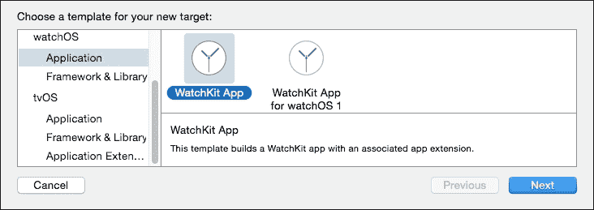

创建完成后，将询问手表应用的名称。这个名字不能与包含的项目同名，因此可以将其命名为`RepositoryBrowserWatch`。语言应该是**Swift**；其他用户界面元素（** complication**、**Glance**和**通知**）与本项目无关，因此可以取消选择：

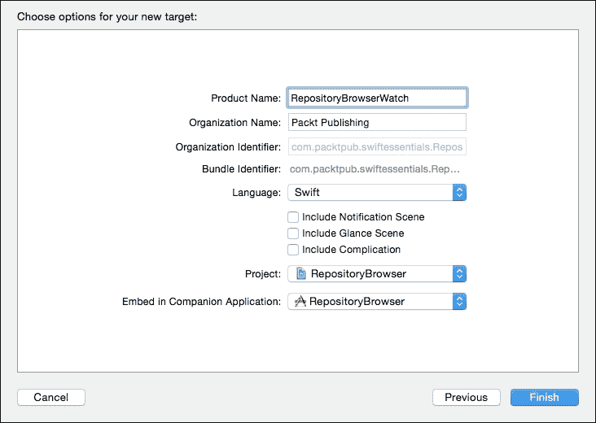

当按下**完成**按钮时，项目中将创建以下新元素：

+   `RepositoryBrowserWatch`：这是手表应用，它提供了应用的界面描述

+   `RepositoryBrowserWatch Extension`：这是对应手表应用可执行代码的内容

+   `InterfaceController.swift`：这是对应自动创建的用户界面元素的 Swift 文件

+   `ExtensionDelegate.swift`：这是对应整个用户应用的 Swift 文件（类似于传统 iOS 应用中的`AppDelegate`）

## 将 GitHubAPI 添加到监视目标

为了允许手表应用程序使用在 第七章 中开发的 `GitHubAPI`，*构建仓库浏览器*，应将以下代码添加到 `ExtensionDelegate`：

```swift
var api:GitHubAPI!
var users:[String] = []
var repos:[String:[[String:String]]] = [:]
func loadReposFor(user:String, fn:([[String:String]])->()) {
  repos[user] = []
  api.withUserRepos(user) {
    results in
    self.repos[user] = results
    fn(results)
  }
}
func addUser(user:String) {
  users += [user]
  users.sortInPlace({ $0 < $1 })
}
```

这将最初生成一个编译时错误，因为 `GitHubAPI` 类（以及相关的类）目前没有与监视目标关联。为了解决这个问题，选择 `GitHubAPI`、`Threads`、`NSURLExtensions` 和 `URITemplate` Swift 文件，并通过按 *Command* + *Option* + *1* 或通过导航到 **视图 | 工具 | 显示文件检查器** 打开文件检查器。确保这些文件通过选择相应的复选框添加到 **RepositoryBrowserWatch 扩展** 目标中：

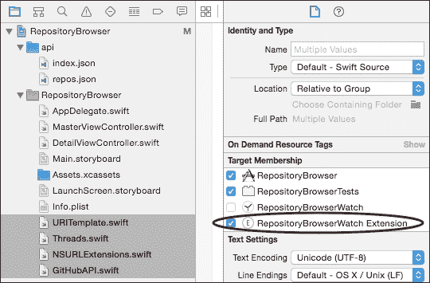

现在当监视目标构建并运行时，手表模拟器将显示一个黑色屏幕，并在应用程序右上角显示时间。如果未显示，请验证所选的目标是否为手表应用程序：

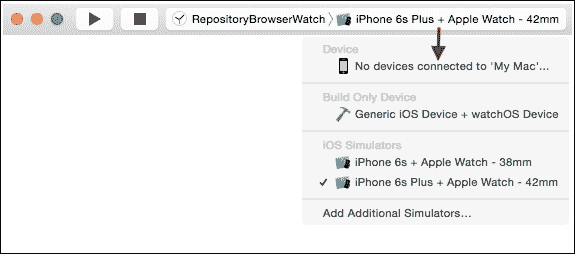

# 创建监视接口

手表的用户界面是以类似于 iOS 应用程序的方式构建的，除了用户工具包是使用 `WatchKit` 而不是 `UIKit` 构建的。与 `UITableView` 等类存在的方式相同，也存在相应的类，如 `WKInterfaceTable`。有一些细微的差异；例如，`UITableView` 将在显示时动态填充元素，但 `WKInterfaceTable` 需要事先知道有多少行以及这些行是什么。

## 将用户列表添加到监视列表

与提供分组行标题的 `UITableView` 不同，`WKInterfaceTable` 只允许一个项目列表。相反，应用程序将被设计成第一个屏幕将显示用户列表，然后第二个屏幕将显示所选用户的仓库。

为了测试目的，将以下内容添加到 `ExtensionDelegate` 类的 `applicationDidFinishLaunching` 方法中：

```swift
api = GitHubAPI.connect()
addUser("alblue")
```

这将允许其他类查询 `ExtensionDelegate` 属性 `users` 来显示一些内容。与 iOS 应用程序的 `AppDelegate` 一样，有一个全局单例可以访问。将以下内容添加到 `InterfaceController`：

```swift
let delegate = WKExtension.sharedExtension().delegate as! ExtensionDelegate
```

要显示用户列表，界面本身必须有一个表格。每一行表格都有一个自己的控制器类，这可以是一个简单的 `NSObject` 子类。要显示用户名列表，创建一个 `UserRowController` 类，它包含一个单独的标签。由于这是 `InterfaceController` 的私有实现细节，将其包含在同一个文件中是有意义的：

```swift
class UserRowController: NSObject {
  @IBOutlet weak var name: WKInterfaceLabel!
}
```

将以下内容添加到 `InterfaceController` 类中，该类稍后将连接到界面：

```swift
  @IBOutlet weak var usersTable: WKInterfaceTable!
```

现在，可以在`awakeWithContext`方法中填充表格。这涉及到设置行数和行的类型。添加以下内容：

```swift
let users = delegate.users
usersTable.setNumberOfRows(users.count, withRowType: "user")
for (index,user) in users.enumerate() {
  let controller = usersTable.rowControllerAtIndex(index) as! UserRowController
  controller.name.setText(user)
}
```

如果此时运行应用程序，将发生几个错误，因为`IBOutlet`引用尚未连接，行类型`user`尚未与`UserRowController`类关联。

## 连接界面

生成用户内容后，界面必须连接到实现细节。在`RepositoryBrowserWatch`文件夹中打开`Interface.storyboard`，并转到**接口控制器场景**。这将显示一个带有时钟和底部显示**任何屏幕尺寸**的黑色手表。像 iOS 应用程序界面一样，它们可以有不同的尺寸（在撰写本文时为 38mm 或 42mm）。

通过按*Command* + *Option* + *Control* + *3*键或通过导航到**视图 | 工具 | 显示对象库**打开对象库。在搜索字段中输入`table`，然后将它拖动到手表界面中：

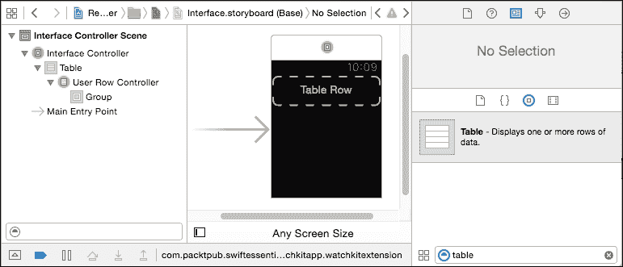

从左侧文档大纲中的**接口控制器**，按*Control*键并向下拖动到表格中，创建一个连接到接口控制器中定义的`usersTable`出口：

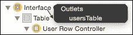

当`InterfaceController`实例化时，`usersTable`将连接到出口。然而，行之间还没有连接。为此，将一个标签拖动到带有**表格行**占位符的虚线区域。为了确保标签占用所有可用空间，将大小设置为**相对于容器**，宽度和高度的因素均为**1**：


为了将标签的文本与`UserRowController`连接起来，必须做两件事。首先，行的类型必须设置为与`UserRowController`类相对应，这将允许标签连接到名称出口。其次，行必须被赋予标识符`user`，以便它可以与之前章节中指定的`rowType`连接。

要设置行控制器的类，通过按*Command* + *Option* + *3*键或通过导航到**视图 | 工具 | 显示身份检查器**打开**身份检查器**。从下拉菜单中选择**UserRowController**，这应该也会设置模块名称**RepositoryBrowserWatch_Extension**。完成此操作后，用户控制器可以通过按*Control*键并拖动到标签，然后选择**name**出口来连接到标签：

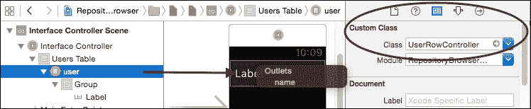

要设置行控制器的类型，通过按*Command* + *Option* + *4*键或通过导航到**视图 | 工具 | 显示属性检查器**切换到**属性检查器**，输入之前使用的`rowType`，即`user`：

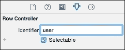

现在当应用程序运行时，应该可以看到用户列表，其中包括`alblue`：

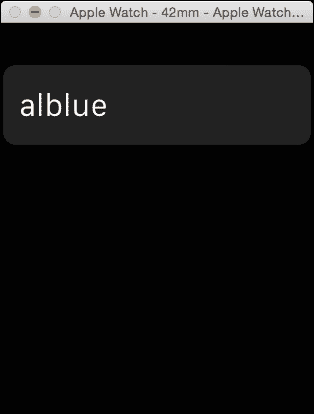

## 添加图片

可以使用现有的 API 为用户返回一张图片，并且可以使用`WKInterfaceImage`以类似文本名称的方式显示它。首先，需要在`UserRowController`中创建一个出口，以便将其连接到界面：

```swift
class UserRowController: NSObject {
  @IBOutlet weak var name: WKInterfaceLabel!
  @IBOutlet weak var icon: WKInterfaceImage!
}
```

界面现在需要更新以添加图片。这可以通过在对象库中搜索**图片**，然后将其拖入用户行来完成。

手表更喜欢提前知道图片大小，因此可以将图片大小固定为 32x32 像素，这对于大尺寸和小尺寸的手表都足够。将图片标记为**填充**将确保图片不会被不恰当地调整大小，并且整个图片都将显示。

### 小贴士

可以点击**+**图标旁边的**大小**，然后为两个不同的手表指定不同的尺寸。

将图片右对齐和居中对齐会给手表的两种尺寸带来相同的印象。将对齐方式更改为**右对齐**和**居中对齐**将允许显示适应不同的尺寸。也可能有必要将用户名称的宽度从**相对于容器**更改为**大小适应**，但这不是严格必要的。最后，使用*控制*和拖动鼠标将来自**用户**行的出口与图片连接，然后选择**图标**出口。结果的用户界面将看起来像这样：

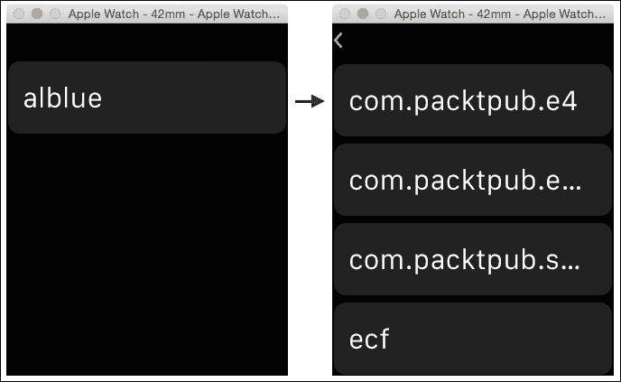

创建并连接好图片后，最后一步是填充数据。在`InterfaceController`方法`awakeFromContext`中，在设置用户名称后，添加对 API 的调用以获取图片，类似于上一章中的`DetailViewController`：

```swift
controller.name.setText(user) // from before
delegate.api.withUserImage(user) {
  image in controller.icon.setImage(image)
}
```

现在当应用程序运行后，经过短暂的暂停，将看到用户的头像：

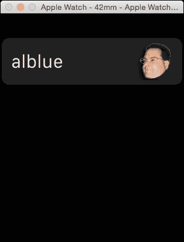

# 响应用户交互

通常，手表用户界面会向用户展示信息，或者让他们以某种方式选择或操作它。当项目以表格形式展示时，自然会让用户轻触行以显示后续屏幕。手表应用程序使用**segues**以类似于 iOS 应用程序的方式从一个屏幕移动到另一个屏幕。

第一步将涉及创建一个新的控制器文件，名为`RepositoryListController.swift`。这将用于存储`RepositoryListController`和`RepositoryRowController`类，与现有的`InterfaceController`非常相似。与其他视图一样，将有一个表格来存储行，并且每一行都将有一个`name`标签：

```swift
class RepositoryRowController: NSObject {
  @IBOutlet weak var name: WKInterfaceLabel!
}
class RepositoryListController: WKInterfaceController {
  let delegate = WKExtension.sharedExtension().delegate as! ExtensionDelegate
  @IBOutlet weak var repositoriesTable: WKInterfaceTable!
}
```

### 小贴士

不要忘记将`RepositoryListController.swift`文件添加到`RepositoryBrowserWatch Extension`目标中，否则将无法将其用作实现类。

一旦创建了这些类，就可以打开 `Interface.storyboard` 并从对象库中拖入一个新的 **Interface Controller**。这将创建一个空白的屏幕，可以添加其他对象。

### 小贴士

确保选择的是 **Interface Controller**，而不是 **Glance Interface Controller** 或 **Notification Interface Controller**，因为这些用于不同的目的。

一旦创建了界面控制器，从对象库中拖动一个 **Table** 到界面控制器，然后以与上一个界面控制器示例相同的方式，从对象库中拖动一个 **Label** 到行占位符。

界面控制器需要更新以指向 `RepositoryListController` 类；这可以通过选择界面控制器并像之前一样转到 **Identity Inspector** 来完成。一旦定义了 `RepositoryListController` 实现，按 *Control* 并从界面控制器图标拖动到表格，并将其连接到 `repositoriesTable`。

### 小贴士

这些连接与上一节中 `usersTable` 的连接方式相同。

行占位符的类可以通过在文档大纲中选择 **Repositories Table** 下的占位符，然后在 **Attributes Inspector** 中将行控制器的身份设置为 `repository` 来定义。这将允许仓库行占位符将名称属性连接到场景中的标签。

最后一个连接是将从用户屏幕到仓库屏幕添加一个 **segue**。按 *Control* 并从 **Users Table** 中的 **user** 行拖动到仓库列表控制器，并在弹出窗口中选择 **Push Segue**。

最后的连接将看起来像这样：

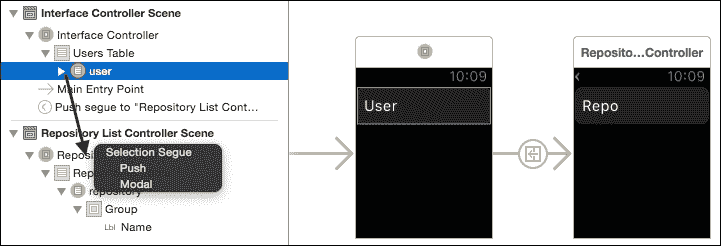

当用户在第一个屏幕中被选中时，第二个屏幕应该滑过。目前这将是空的，但在下一节中会填充仓库。

## 添加上下文并显示仓库

要从一个屏幕传递数据到另一个屏幕，需要设置一个上下文。每个 `WKInterface` 屏幕都有一个 `awakeWithContext` 函数，可以在屏幕显示时将任意对象传递到屏幕中。这可以用来提供一个用户对象，进而可以用来查找一组仓库。

第一个元素是在从屏幕过渡出去时设置上下文对象。在 `InterfaceController` 类中添加一个新方法 `contextForSegueWithIdentifier`，如下所示：

```swift
override func contextForSegueWithIdentifier(
 segueIdentifier: String,
 inTable table: WKInterfaceTable,
 rowIndex: Int) -> AnyObject? {
  return delegate.users[rowIndex]
}
```

现在当 `RepositoryListController` 显示时，当前选定的用户将被传递。为了接收对象，在 `RepositoryListController` 类中创建一个 `awakeWithContext` 方法，如下所示：

```swift
override func awakeWithContext(context: AnyObject?) {
  super.awakeWithContext(context)
  if let user = context as? String {
    print("Showing user \(user)")
  }
}
```

### 小贴士

这将允许在此处调试代码，以验证对象是否按预期传递。

显示仓库列表需要使用 API 生成数据列表，创建适当数量的行，然后设置行内容，就像之前一样。这可以通过更新`RepositoryListController`中的`awakeWithContext`方法来实现，如下所示：

```swift
if let user = context as? String {
  delegate.loadReposFor(user) {
    result in
    self.repositoriesTable.setNumberOfRows(
     result.count, withRowType: "repository")
    for (index,repo) in result.enumerate() {
      let controller = self.repositoriesTable
       .rowControllerAtIndex(index) as! RepositoryRowController
      controller.name.setText(repo["name"] ?? "")
  }
}
```

现在当手表应用程序运行时，如果用户选择了一个仓库，第二个屏幕应该填充了仓库列表：


## 添加详细屏幕

手表应用程序的最后一部分是创建一个类似于 iOS 应用程序中`DetailViewController`的模态屏幕。当用户选择一个仓库时，应该以模态方式展示仓库的详细信息。

这将通过一个新的`RepositoryController.swift`文件来实现，该文件将包含一个`WKInterfaceController`并具有四个可以在界面中连接的标签：

```swift
class RepositoryController: WKInterfaceController {
  @IBOutlet weak var repo: WKInterfaceLabel!
  @IBOutlet weak var issues: WKInterfaceLabel!
  @IBOutlet weak var watchers: WKInterfaceLabel!
  @IBOutlet weak var forks: WKInterfaceLabel!
}
```

### 小贴士

不要忘记将`RepositoryController.swift`文件添加到`RepositoryBrowserWatch Extension`目标中，否则无法将其用作实现类。

要添加屏幕，打开`Interface.storyboard`，从对象库中拖动另一个**界面控制器**到画布上。在**身份检查器**中，将`RepositoryController`设置为**类**类型，这将允许随后连接标签。

将四个**标签**对象拖入观察界面。它们将自动排成一行，一个接一个。这些可以赋予占位文本为`Repo`、`Issues`、`Watchers`和`Forks`——尽管这些内容将程序化地更改。通过从**仓库控制器**拖动并放置到每个标签上，为输出连接设置线路，以便它们可以程序化控制。

最后，连接从仓库列表控制器到过渡，以便当在**仓库表**下选择**仓库**行控制器时，选择**模态**选择过渡。在 Xcode 中，完成的连接应如下所示：

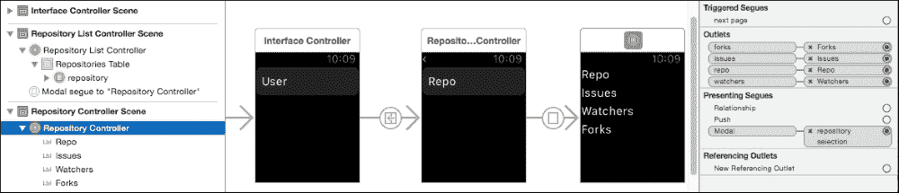

到目前为止，应用程序可以进行测试，选择一个仓库应该过渡到新屏幕，尽管正确的内容尚未显示。

## 填充详细屏幕

要在详细屏幕中连接标签，需要遵循与上一个屏幕类似的过程：需要从过渡屏幕设置上下文，然后将数据填充到接收屏幕中。

在`RepositoryListController`中，需要通过`contextForSegueWithIdentifier`方法传递所选仓库的信息。然而，与`users`列表（在`ExtensionDelegate`中持久化）不同，没有这样的存储仓库数据列表。因此，当屏幕唤醒时，有必要持久化仓库的临时副本。

修改`RepositoryListController`类的`awakeWithContext`方法，以便将条目存储在`repos`属性中，以便在选中时可以用于在退出屏幕时设置上下文：

```swift
var repos = []
override func awakeWithContext(context: AnyObject?) {
  super.awakeWithContext(context)
  if let user = context as? String {
    delegate.loadReposFor(user) {
      // as before
      self.repos = result
    }
  } else {
    repos = []
  }
}
override func contextForSegueWithIdentifier(
 segueIdentifier: String,
  inTable table: WKInterfaceTable,
  rowIndex: Int) -> AnyObject? {
  return repos[rowIndex]
}
```

现在当选择存储库时，键/值对将通过之前缓存的內容传递。

填写详细屏幕的最后一步是使用此上下文对象来设置标签。在`RepositoryController`类中，添加一个`awakeWithContext`方法，该方法接收键/值字典，并使用字段显示有关存储库的信息：

```swift
override func awakeWithContext(context: AnyObject?) {
  if let data = context as? [String:String] {
    repo.setText(data["name"])
    issues.setText(data["open_issues_count"])
    watchers.setText(data["watchers_count"])
    forks.setText(data["forks_count"])
  }
}
```

现在当运行应用时，用户应该能够逐个浏览三个屏幕以查看内容。

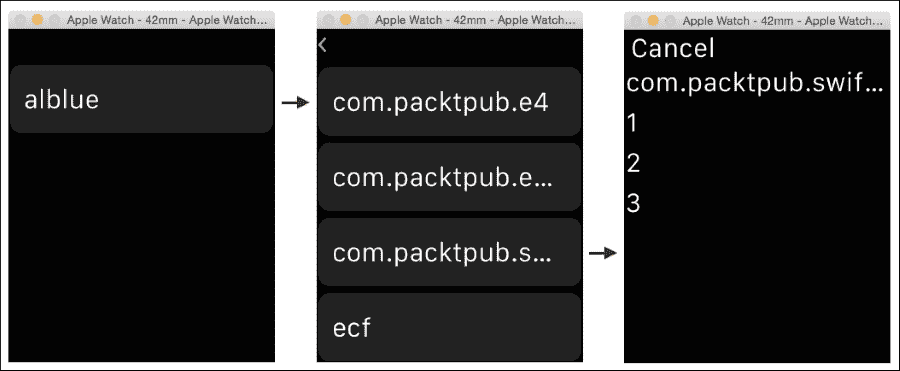

# 手表应用的最佳实践

由于手表是低功耗设备，网络功能有限，因此应尽可能减少网络使用。这里展示的示例应用（使用多个基于 REST 的调用到后端服务器）发送和接收的数据比所需的多；如果这是一个定制应用，那么应该最小化协议以避免不必要的传输。

示例应用还以文本数据列表的形式展示了用户信息，这可能不是展示数据的最佳方式。考虑在适当的情况下使用其他机制以更图形化的方式展示信息。

## UI 线程注意事项

在主线程上执行任何网络操作，如 API 查找和用户仓库查询，通常是不良的做法。相反，查找应该在后台线程中运行，在必要时切换回 UI 线程以执行更新。

例如，在连接的 API 查找中，connect 方法看起来是这样的：

```swift
class func connect(url:NSURL) -> GitHubAPI? {
  if let data = NSData(contentsOfURL:url) {
    ...
  }
}
```

这使用可选初始化器来返回`GitHubAPI`，无论网络连接是否成功。但这意味着在可以使用之前，调用必须阻塞。这意味着在`applicationDidFinishLaunching`中调用的`GitHubAPI()`初始化器会阻塞应用的启动，这不是良好的用户体验。相反，最好是这样做：

```swift
Threads.runOnBackgroundThread() {
  if let data = NSData(contentsOfURL:url) {
    …
    Threads.runOnUIThread() {
      // update the UI as before
    }
  }
}
```

添加后台线程会增加复杂性，但这也意味着应用启动会更快。可能需要更新 UI 初始化逻辑，以便将 API 调用推迟到网络服务可用，或者显示其他加载进度指示器，以向用户提供反馈，表明有操作正在进行。

## 存储数据

示例应用中的用户列表仅存储一个变量，该变量硬编码到应用中。通常情况下不会是这样，但手表并未设置用于数据输入。相反，应使用配套的 iOS 应用来定义用户列表（带有适当的错误检查和界面），然后与手表应用进行通信。

有两种实现方式。最好的方法是使用 iCloud 基础设施，并在 iOS 设备上更新文档，然后自动镜像到手表。这将使用户在未来过渡到新的 iOS 设备或手表时无需重新创建列表。

另一种方法是使用`WatchConnectivity`模块和`WCSession`类型在手表和 iOS 设备之间发送消息。这提供了一个单例，可以通过`WCSession.defaultSession()`访问，可以用来在 iOS 设备和配对的手表之间发送和接收消息。请注意，会话可能不受支持，因此应首先使用`session.isSupported()`进行检查；如果是的话，则必须在发送或接收任何消息之前使用`session.activate()`激活它。传入的消息会被路由到相关的`delegate`。

手表还可以使用会话的`watchDirectoryURL`持久化数据，该 URL 返回可以写入临时数据的位置。这可以用来添加在启动时加载的附加信息。例如，GitHubAPI 可以在最初检索后缓存 API，然后用于后续请求，并在必要时自动重新加载。

## 合理使用复杂功能和快速查看

手表的界面主要使用不同类型的控件来处理不同的交互。一个**复杂功能**是一个显示在手表表盘屏幕上的小型实用控件（例如，升起的太阳或计时器）。一个**通知**是一个简短的信息更新（类似于 iOS 上的通知，如收到的消息），可以用来执行简单的操作（如回答是/否/可能）或启动完整的应用程序。一个**快速查看**是一个简单的基于位置的项目，当用户抬起手腕时，可能会告诉用户附近有什么东西。

根据创建的应用程序类型，可能会有适当的方法来使用这些功能，以便在需要时向用户提供特定信息。然而，它们不应该仅仅为了使用而使用；如果它们不会提供任何有用的信息，则不应使用。

与应用程序交互还有其他方式；例如，watchOS 2 支持直接与数字表冠和强推进行交互。有关更多信息，请参阅 Apple Watch 人机界面指南。

# 摘要

与 iOS 设备上的运行方式相同，手表应用程序也可以运行代码，尽管它们上传到手表的方式略有不同。在模拟器上运行代码与在真实设备上运行非常不同；网络和处理器比桌面级机器（甚至 iOS 设备）预期的要有限得多。因此，在实际设备上进行测试对于测试完整体验是必不可少的。

本章介绍了如何构建手表应用和扩展，如何将它们打包成手表扩展和手表应用的形式，以及它们如何与父应用共享代码以避免代码重复。手表界面演示了如何使用 segues 在屏幕之间切换，以实现上一章创建的 iOS 应用的手表扩展。

# 附录 A. 对 Swift 相关网站、博客和知名 Twitter 用户的引用

学习任何语言最初都集中在语言的语法和语义上，但很快就会转向学习标准库和附加库的套件，这些库使程序员能够高效地工作。一本书不可能列出所有可能需要的库；这本书旨在成为学习旅程的开始。

为了进一步阅读，本附录提供了一些额外的资源，这些资源可能对读者继续这一旅程有所帮助。此外，请注意 Packt Publishing 出版的其他书籍，这些书籍展示了 Swift 的不同方面。这个资源列表必然是不完整的；在本书出版后，新的资源将会出现，但您可以通过关注这里提供的资源的订阅和帖子来找到新的发展。

# 语言

Swift 语言由苹果公司开发，可以在[`developer.apple.com/swift/`](https://developer.apple.com/swift/)的 Swift 开发者页面上找到许多文档。这包括语言参考指南和标准库的介绍：

+   Swift 编程语言可以在[`developer.apple.com/library/ios/documentation/Swift/Conceptual/Swift_Programming_Language/`](https://developer.apple.com/library/ios/documentation/Swift/Conceptual/Swift_Programming_Language/)找到

+   Swift 标准库参考可以在[`developer.apple.com/library/ios/documentation/General/Reference/SwiftStandardLibraryReference/`](https://developer.apple.com/library/ios/documentation/General/Reference/SwiftStandardLibraryReference/)找到

+   Swift 和 Cocoa 的集成可以在[`developer.apple.com/library/ios/documentation/Swift/Conceptual/BuildingCocoaApps/`](https://developer.apple.com/library/ios/documentation/Swift/Conceptual/BuildingCocoaApps/)找到

+   Swifter 提供了所有 Swift 函数的列表，可以在[`swifter.natecook.com`](http://swifter.natecook.com)找到

Swift 语言在 2015 年 12 月开源，并在[`swift.org`](https://swift.org)有一个新的家，同时还有一个新的 Swift 博客在[`swift.org/blog/`](https://swift.org/blog/)。

# Twitter 用户

有很多活跃的 Twitter 用户使用 Swift；在许多情况下，帖子会被标记为`#swift`标签，可以在[`twitter.com/search?q=%23swift`](http://twitter.com/search?q=%23swift)找到。作者关注的流行用户包括（按 Twitter 昵称字母顺序）：

+   `@AirspeedSwift:` 这个推特有关于 Swift 相关主题的好选择和转推

+   `@ChrisEidhof`: 这是《Functional Swift》书籍的作者和`@objcio`的作者

+   `@CodeWithChris`: 这个推特是关于 iOS 编程教程的集合

+   `@CodingInSwift:` 这个推特包含了一系列 Swift 资源的跨帖

+   `@CompileSwift`: 这个推特包含关于 Swift 的文章

+   `@cwagdev`: 克里斯·沃格德撰写了一些与雷·温德利希合作的 iOS 教程

+   `@FunctionalSwift`: 这是一系列功能片段的选择，以及一本《Functional Swift》书籍

+   `@LucasDerraugh`: 这是 YouTube 上视频教程的创作者

+   `@NatashaTheRobot:` 这个推特包含了对正在发生的事情的精彩总结，以及新闻简报和交叉引用

+   `@nnnnnnnn`: 内特·库克，他审阅了本书的早期版本，并提供了刚刚提到的 Swifter 列表

+   `@PracticalSwift`: 这是一个关于 Swift 语言的博客文章好集合

+   `@rwenderlich`: 雷·温德利希有许多与 iOS 开发相关的文章；信息量丰富，最近还涉及 Swift 话题

+   `@SketchyTech`: 这是关于 Swift 的博客文章集合

+   `@SwiftCastTV`: 这些是 Swift 的视频教程

+   `@SwiftEssentials`: 这是本书的推特动态

+   `@SwiftLDN`: 这个推特发布基于伦敦的 Swift 聚会，也邀请了一些优秀的 Swift 演讲者和演示者

除了专注于 Swift 的推特用户外，还有许多其他 Cocoa（Objective-C）开发者定期在 iOS 和 OS X 平台相关主题上写博客。鉴于任何 Objective-C 框架都可以集成到 Swift 应用中（反之亦然），阅读这些帖子通常会提供有用的信息：

+   `@Cocoanetics`: 奥利弗·德罗尼克撰写关于 iOS 并提供培训

+   `@CocoaPods`: CocoaPods 是一个 Objective-C 框架（库）的依赖管理系统，现在正在扩展到 Swift 领域

+   `@Mattt`: 马特·汤普森撰写关于许多 iOS 主题的文章，是 AFNetworking 和 AlamoFire 网络库的作者，后来加入了苹果公司编写 Swift 包管理器

+   `@MikeAbdullah`: 迈克·阿卜杜拉撰写关于通用 iOS 开发的文章

+   `@MikeAsh`: 迈克·阿什知道所有的事情，不知道的事情他会去了解

+   `@MZarra`: 马库斯·S·扎拉写过很多关于 Core Data 和同步的内容

+   `@NSHipster`: 这是马特·汤普森整理的 iOS 和 Cocoa 文章集合

+   `@objcio`: 这是一个关于 Objective-C 话题的月度出版物，其中包含一些 Swift 内容

+   `@PerlMunger`: 马特·朗撰写关于 Swift、Cocoa 和 iOS 的文章

本书的审稿人包括：

+   `@AnilVrgs`: 安尼尔·瓦格谢斯

+   `@Ant_Bello`: 安东尼奥·贝洛

+   `@ArvidGerstmann`: 阿维德·格斯特曼

+   `@jiaaro`: 詹姆斯·罗伯特

+   `@nnnnnnnn`: 内特·库克

作者的个人和书籍推特账号是：

+   `@AlBlue` 是作者的推特账号

+   `@SwiftEssentials` 是这本书的推特账号

类似于 `@SwiftLdn` 的聚会跟踪有趣的 Swift 作者在 Twitter 列表 [`twitter.com/SwiftLDN/lists/swift-writers/members`](https://twitter.com/SwiftLDN/lists/swift-writers/members) 中，这可能比本节有更更新的推荐，以及 Ray Wenderlich 团队 [`twitter.com/rwenderlich/lists/raywenderlich-com-team/members`](https://twitter.com/rwenderlich/lists/raywenderlich-com-team/members)。

# 博客和教程网站

有许多博客涵盖了 Swift 和相关技术。以下是一些你可能感兴趣的精选：

+   [`developer.apple.com/swift/blog/`](https://developer.apple.com/swift/blog/) 是官方的 Apple Swift 博客

+   [`airspeedvelocity.net`](http://airspeedvelocity.net) 是 `@AirspeedSwift` 的博客

+   [`alblue.bandlem.com/Tag/swift/`](http://alblue.bandlem.com/Tag/swift/) 是作者关于 Swift 的博客

+   [`mikeabdullah.net`](http://mikeabdullah.net) 是 Mike Abdullah 的博客

+   [`mikeash.com`](http://mikeash.com) 撰写了关于 iOS 和 OS X 的周五问答系列

+   [`natecook.com/blog/tags/swift/`](http://natecook.com/blog/tags/swift/) 是 Nate Cook 的 Swift 博客

+   [`nshipster.com`](http://nshipster.com) 是 `@NSHipster` 的博客

+   [`objc.io`](http://objc.io) 是 `@objcio` 的博客

+   [`practicalswift.com`](http://practicalswift.com) 由 `@PracticalSwift` 收集

+   [`sketchytech.blogspot.co.uk`](http://sketchytech.blogspot.co.uk) 是由 `@SketychTech` 收集的 Swift 文章博客

+   [`swiftessentials.org`](http://swiftessentials.org) 是本书的配套网站，以及位于 [`github.com/alblue/com.packtpub.swift.essentials/`](https://github.com/alblue/com.packtpub.swift.essentials/) 的仓库

+   [`swiftnews.curated.co`](http://swiftnews.curated.co) 由 `@NatashaTheRobot` 收集

+   [`www.cimgf.com`](http://www.cimgf.com) 展示了 Marcus S Zarra 和其他人关于 Cocoa 的主题集合

+   [`www.raywenderlich.com`](http://www.raywenderlich.com) 收集了关于 iOS 开发的教程，包括 Cocoa 和 Swift

# Meetups

在 Swift 创建之前，存在许多本地的 iOS 开发者小组；它们随后被 Swift 特定的群体所取代。这些小组当然会因地理位置而异，但存在一些聚会网站，例如 EventBrite 在 [`www.eventbrite.co.uk`](http://www.eventbrite.co.uk)，以及 Meetup 在 [`www.meetup.com`](http://www.meetup.com)。

你附近可能也有 Twitter 群组或聚会；例如，在伦敦，有`@SwiftLDN`在[`twitter.com/SwiftLDN`](https://twitter.com/SwiftLDN)，他们定期在[`www.meetup.com/swiftlondon/`](http://www.meetup.com/swiftlondon/)列出会议。在纽约，[`www.meetup.com/NYC-Swift-Developers/`](http://www.meetup.com/NYC-Swift-Developers/)群组相当活跃。在旧金山，[`www.meetup.com/swift-language/`](http://www.meetup.com/swift-language/)和[`www.meetup.com/San-Francisco-SWIFT-developers/`](http://www.meetup.com/San-Francisco-SWIFT-developers/)都是活跃的。

# 后记

*千里之行，始于足下*。你编写优秀的 Swift 应用程序的旅程才刚刚开始。就像任何旅程一样，旅伴可以提供支持、帮助和鼓励；这里提到的许多旅伴可以为你提供通往更多资源的连接。我希望你享受你的旅程。
