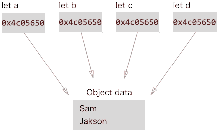

# 第二章：在 Swift 中构建良好的应用架构

Swift 是一种高性能编程语言，正如你在上一章所学。你还了解到，编写良好的代码甚至比编写高性能代码更重要。在本章中，我们将结合 Swift 的所有强大功能来创建一个应用。我们将通过以下主题来实现这一点：

+   编写干净的代码

+   不可变性

+   值类型和不可变性

+   使用类表示状态

+   使用可选表示值的缺失

+   函数式编程

+   泛型

# 创建 Swift 应用

创建良好应用架构的第一步是创建应用本身。我们将创建一个 iOS 日记应用，用于制作日常笔记。我们不会涵盖任何 iOS 特定主题，因此你可以使用相同的代码创建 OS X 应用。

开始吧！打开 Xcode 并创建一个新的 iOS 单视图项目应用。现在，我们准备好编码了。

首先，让我们创建一个`Person`类型，用于日记的所有者，以及一个日记条目类型。我们将使用`Class`类型来创建`Person`和`JournalEntry`。这两个类都非常简单——只是一系列属性和一个初始化器：

```swift
class Person {
  var firstName: String
  var lastName: String

  init (firstName: String, lastName: String) {
    self.firstName = firstName
    self.lastName = lastName
  }
 }

class JournalEntry {
  var title: String
  var text: String
  var date: NSDate

  init (title: String, text: String) {
    self.title = title
    self.text = text
    date = NSDate()
  }
}
```

这是我们需要为应用设置的最小环境。在我们继续前进之前，让我们让代码变得更好。

# 变量和常量的区别

可能是所有编程语言中最常用的功能就是创建和存储值。我们在函数中创建局部变量，并在类和其他数据结构中声明它们；这就是为什么正确地做这件事非常重要。

在 Swift 中，有两种创建和存储值的方式，如下所示：

+   将其改为变量：

    ```swift
    var name = "Sara"
    ```

+   将其改为常量：

    ```swift
    let name = "Sara"
    ```

变量和常量的区别在于，常量值只能分配一次，并且之后不能更改。另一方面，变量值可以随时更改。以下是一个例子：

```swift
var name = "Sam"
name = "Jon"

let lastName = "Peterson"
lastName = "Jakson" //Error, can't change constant after assigning
```

### 小贴士

金规则是始终首先将你的类型声明为常量（如前例中的`let`关键字）。只有在你之后需要它时，才将其改为变量（`var`关键字）。

有一些例外情况，你不能将其声明为常量，例如，在创建`@IBOutles`或`weak`时。另外，可选值必须声明为变量。

使用常量比使用变量有许多好处。常量是一种不可变类型，我们将在后面讨论所有不可变性的好处。最重要的两个好处如下：

+   安全性（防止意外值变化）

+   更好的性能

你应该在声明属性时以及作为函数中的局部常量时使用常量。我们应该应用这条规则，并按照以下方式更改我们的`Person`和`JournalEntry`类：

```swift
class Person {
  let name: String
  let lastName: String
...
}

class JournalEntry {
  let title: String
  let text: String
  let date: NSDate
...
}
```

通常，你会发现自己在变量上使用得比常量多。让我们看看一个你可能认为需要使用变量，但实际上常量会是更好的解决方案的例子。假设你在应用程序中创建了一个新的人，现在你想显示带有性别前缀的全名：

```swift
let person = Person(firstName: "Jon", lastName: "Bosh")
let man = true

var fullName: String
if man {
  fullName = "Mr "
} else {
  fullName = "Mrs "
}

fullName += person.firstName
fullName += " "
fullName += person.lastName
```

如果你再深入思考一下这个问题，你就会意识到人的`fullName`应该是不可变的；它不会改变，应该声明为常量：

```swift
let person = Person(firstName: "Jon", lastName: "Bosh")
let man = true

let gender: String = man ? "Mr": "Mrs"
let fullName = "\(gender) \(person.firstName) \(person.lastName)"
```

# 不可变性

在上一节中，你学习了使用不可变常量的重要性。Swift 中有更多不可变类型，你应该利用它们并使用它们。不可变性的优势如下：

+   它消除了与意外值更改相关的大量问题

+   它是安全的线程访问

+   它使代码推理更容易

+   性能有所提升

通过使类型不可变，你增加了额外的安全级别。你拒绝了对实例进行修改的访问。在我们的日记应用中，一旦创建了实例，就无法更改一个人的名字。如果有人意外地决定将新值分配给人的`firstName`，编译器将显示错误：

```swift
var person = Person(firstName: "Jon", lastName: "Bosh")
p.firstName = "Sam" // Error
```

然而，有些情况下我们需要更新变量。一个例子可以是数组；假设你需要向其中添加一个新项目。在我们的例子中，也许这个人想在应用中更改昵称。有两种方法可以实现这一点，如下所示：

+   修改现有实例

+   使用更新信息创建新实例

在原地修改实例可能导致危险且不可预测的效果，尤其是在你正在修改引用实例类型时。

### 注意

类是引用类型。“引用类型”意味着许多变量和常量可以引用相同的实例数据。对实例数据的更改会反映在所有变量中。

创建一个新实例是一个更安全的操作。它不会对系统中的现有实例产生影响。在我们创建了新实例之后，可能需要通知系统中的其他部分关于这一变化。这是一种更安全的更新实例数据的方式。让我们看看我们如何在`Person`类中实现昵称更改。首先，让我们向`Person`类添加一个昵称：

```swift
class Person {
  let nickName: String
…

func changeNickName(nickName: String) -> Person  {
    return Person(firstName: firstName, lastName: lastName,
                   nickName: nickName)
  }
}

let sam = Person(firstName: "Sam", lastName: "Bosh", 
  nickName:"sam")
let rockky = sam.changeNickName("Rockky")
```

因为我们将`sam`实例变成了常量，所以在更改`nickName`之后，我们无法为其分配新值。在这个例子中，最好将其改为变量，因为我们实际上需要更新它：

```swift
var sam = Person(firstName: "Sam", lastName: "Bosh", 
  nickName:"BigSam")
sam = sam.changeNickName("Rockky")
```

## 多线程

现在，我们越来越多地使用核心处理器，与多线程工作已成为我们生活的一部分。我们有 GCD 和 NSOperation 来在多个线程上执行工作。

多线程的主要问题是同步对数据的读写访问，而不会破坏数据。作为一个例子，让我们创建一个日记条目的数组，并尝试在后台和主线程中修改它。这将导致应用程序崩溃：

```swift
class DangerousWorker {
  var entries: [JournalEntry]

  init() {
    //Add test entries
    let entry = JournalEntry(title: "Walking", text: "I was 
      walking in the loop")
    entries = Array(count: 100, repeatedValue: entry)
  }

  func dangerousMultithreading() {

    dispatch_async(dispatch_get_global_queue(DISPATCH_QUEUE_PRIORITY_BACKGROUND, 0)) {
      sleep(1) //emulate work
      self.entries.removeAll()
    }

    print("Start Main")
    for _ in 0..<entries.endIndex {
      entries.removeLast() //Crash
      sleep(1) //emulate work
    }
  }
}

let worker = DangerousWorker()
worker.dangerousMultithreading()
```

这些问题实际上很难找到和调试。如果你移除`sleep(1)`延迟，某些设备上可能不会发生崩溃，这取决于哪个线程先运行。

当你使你的数据不可变时，它变为只读，所有线程可以同时读取它而没有任何问题：

```swift
let entries: [JournalEntry]

let entry = JournalEntry(title: "Walking", text: "I was walking")
entries = Array(count: 100, repeatedValue: entry)
// entries is immutable now, read-only

dispatch_async(dispatch_get_global_queue(
              DISPATCH_QUEUE_PRIORITY_BACKGROUND, 0)) {

  for entry in self.entries {
    print("\(entry) in BG")
  }
}

for entry in self.entries {
  print("\(entry) in BG")
}
```

但我们经常需要更改数据。而不是直接更改源数据，更好的解决方案是创建新的、更新的数据并将结果传递给调用线程。这样，多个线程可以安全地继续执行读取操作。我们将在第六章中查看多线程数据同步，*为高性能构建应用程序*。

# 值类型和不可变性

Swift 中有两种不同的数据类型：

+   引用类型

+   值类型

让我们来看看这些。

## 引用类型

类是一个引用类型。当你创建一个引用类型的实例并将其赋值给变量或常量时，你不仅赋值了一个值，还赋了一个指向值的引用，该值位于别处（实际上它位于堆内存中）。当你将这个引用传递给其他函数并将其赋值给其他变量时，你创建了多个指向相同数据的引用。如果这些变量中的任何一个改变了数据，这种变化也会反映在其他所有变量中。以下是一个展示这一点的示例：

```swift
let person = Person(firstName: "Sam", lastName: "Jakson")
let a = person, b = person, c = person
```

以下图表显示了这段代码的内存结构：



所有四个常量都会引用同一个对象。这种架构的危险在于，如果其中一个常量更新了实例数据的一部分，其他所有常量也会被更新。以下是一个展示这一点的示例：

```swift
a.firstName = "Jaky"
b.firstName // Jaky
```

有时，这种行为可能是期望的，例如，当许多变量引用同一个窗口对象时。应该只有一个窗口对象，并且在一个地方做出的更改应该在其他地方也得到反映。

## 值类型

相反，结构体是一个值类型。当你创建一个值类型的实例并将其赋值给变量时，你是在分配实际数据。当你将这个实例传递给其他函数和变量时，你是在传递这个值的副本。复制是自动进行的。你可能认为复制值会对性能产生负面影响，但事实上，值类型比引用类型提供更高的性能。值类型足够智能，只在需要时（当数据被修改时）优化数据复制。

如果我们将`Person`类型改为`Structure`类型，相同的代码示例将看起来像这样：

```swift
let person = Person(firstName: "Sam", lastName: "Jakson")
let a = person, b = person, c = person
```

这个结构体常量的内存看起来会是这样：


这种架构的优势在于你的代码组件是隔离的，并且不相互依赖。

引用类型和值类型之间的一大区别如下所述：当你将一个常量作为引用类型创建时，你创建了一个常量引用（这意味着你不能将其更改为指向另一个实例）。但你可以更改实例本身中的数据，就像我们在示例中通过更新人的`firstName`所做的那样。

当你创建一个值类型的常量时，你得到一个不能更改的常量值。

### 结构体的力量

如果你更仔细地查看 Swift 标准库类型定义，你会发现大多数类型都是作为结构体实现的，例如`struct Int`、`struct String`、`struct Array`以及其他。

结构体不仅是一个简单快速的数据结构，而且是一个非常强大的结构体。结构体可以有方法、属性和初始化器，并且可以遵循协议。当你设计应用程序中的实体时，尽量使用结构体作为你的数据模型，通常结构体是首选。现在我们将应用这个建议，并将我们的类型更改为使用结构体而不是类：

```swift
struct Person {
  let firstName: String
  let lastName: String
  let nickName: String

  func changeNickName(nickName: String) -> Person  {
    return Person(firstName: firstName, lastName: lastName,nickName: nickName)
  }
}

extension Person {

  init(firstName: String, lastName: String) {
    self.init(firstName: firstName, lastName: lastName,       nickName:"")
  }
}
```

第一个区别是我们将`class`关键字更改为`struct`。第二个区别更有趣——我们移除了`init`方法。如果你没有定义初始化器，结构体会提供一个默认的成员变量初始化器。成员变量初始化器会取结构体的所有属性。如果你需要除了默认的成员变量初始化器之外的额外初始化器，你可以在扩展中创建它。这样，你将有两个初始化器：

```swift
  Person(firstName: "Sam", lastName:"Niklson", nickName: "Bigsam")
  Person(firstName: "Petter", lastName: "Hanson")
```

### 使用类表示状态

在设计应用程序中的数据模型时，使用值类型。值类型应该是：

+   惰性

+   隔离

+   可交换

值类型不应该有行为，也不应该有副作用。数据上的操作应该进入值层。你可以在 Andy Matuschak 的演讲*Controlling Complexity in Swift*中了解更多关于使用值类型设计数据模型的信息，演讲链接为[`realm.io/news/andy-matuschak-controlling-complexity/`](https://realm.io/news/andy-matuschak-controlling-complexity/)。

相反，类可以有行为和状态。创建一个新的`JournalEntry`的动作是一个行为，例如，它应该在类类型中实现。当前用户的`JournalEntry`列表是一个状态，这也应该存储在类类型中：

1.  首先，我们创建一个`Journal`数据模型作为值类型。它包含数据和操作来处理这些数据（它有`addEntry`方法，该方法创建并添加新条目到日记中）：

    ```swift
    struct Journal {
      let owner: Person
      var entries: [JournalEntry]

      mutating func addEntry(title: String, text: String) {
        let entry = JournalEntry(title: title, text: text)
        entries.append(entry)
      }
    }

    extension Journal {
      init(owner: Person) {
        self.owner = owner
        self.entries = []
      }
    }
    ```

1.  下一步是创建一个作为引用类型的控制器实体，它将在应用程序中保存当前的日记状态并处理添加新条目的动作：

    ```swift
    class JournalController  {
      var journal: Journal

      init(owner: Person) {
        self.journal = Journal(owner: owner)
      }

      func addEntry(title: String, text: String) {
        journal.addEntry(title, text: text);
      }
    }
    ```

# 使用可选值表示值的缺失

让我们回到过去，看看 Objective-C 中如何表示值的缺失，作为一个例子。对于引用类型和简单值类型，没有标准的解决方案来表示值的缺失。有两种不同的方式：

+   `nil`

+   `0`、`-1`、`INT_MAX`、`NSNotFound`等等

对于引用类型，Objective-C 使用`nil`值来表示变量没有值。它指向任何地方。

对于值类型，不存在`nil`这样的值，也无法将`nil`赋值给整型变量。为了实现这一点，Objective-C（以及不仅仅是 Objective-C，还包括 C、Java 和许多其他语言）使用了一些不太可能由特定操作产生的特殊值。例如，`NSArray`的`indexOfObject`方法会返回`NSNotFound`。

### 注意

`NSNotFound`只是一个常量，其值等于`NSIntegerMax`，其值又等于`2147483647`。

Swift 使用可选值以统一的方式表示值类型和引用类型中的值缺失。可选值是一种注释方式，表明值可能不存在。你可以通过两种方式将类型声明为可选：

+   使用可选关键字，即`Optional<Type>`

+   通过在类型末尾添加一个问号，即`Type?`

    ### 提示

    `Type?`是声明可选类型的首选方式。

要表示缺失的值，你可以简单地给可选值赋值`nil`，如下面的示例所示：

```swift
var view: Optional<UIView>
var index: Int?

view = nil
view = UIView()

index = 10
index = nil
```

## 可选类型和非可选类型

在 Objective-C 中，可选值和非可选值都由相同的类型表示，例如`NSInteger, NSString *`。通过查看源代码和方法定义，无法确定一个方法是否可以返回`nil`或`NSNotFound`：

```swift
- (NSUInteger)indexOfObject:(id)anObject;
+ (instancetype)stringWithString:(NSString *)string;
```

### 注意

在 Xcode 6.3 中，我们有了新的 Objective-C 注解`nullable`和`nonnull`，允许我们指定是否可以传递`nil`。这些注解是在 Swift 发布后添加的，以提供更好的 Objective-C 与 Swift 的集成。

Swift 对此更为严格。它既有可选类型也有非可选类型。非可选类型的两个例子是`Int`和`String`。这意味着你不能将`nil`赋值给`Int`变量或传递`nil`给具有`Int`参数类型的函数。另一方面，可选类型允许你使用`nil`：

```swift
var index: Int?
var number: Int = 10

index = nil // Ok
number = nil // Error

func indexOfObject(object: Any) -> Int?
func stringWithString(string: String?) -> String?
```

这项严格的规定使代码的意图非常明确。从 API 中可以看到，要调用`indexOfObject`函数，需要传递一个非可选参数，并且它可能返回`nil`作为结果。

## 安全的`nil`处理

另一个问题在于尝试访问`nil`值。如果你使用过 C、Java 或 Objective-C 编程，你肯定遇到过`NullPointerException`异常或`NSInvalidArgumentException`异常。

通常，访问未初始化的内存是不安全的。例如，在 Objective-C 中将`nil`传递给`initWithString`方法会导致`NSInvalidArgumentException`异常，甚至可能引发应用程序崩溃：

```swift
[NSString initWithString: nil] – crash
```

令人遗憾的是，Objective-C 没有检查`String * type`和`nil`之间的区别。

Swift 中的可选类型不仅清楚地说明了使用`nil`的能力，而且使工作非常安全，避免了崩溃。

## 使用可选类型

现在你已经了解了为什么可选类型被发明出来的背景，让我们继续在我们的应用程序中使用它们。我们有一个`JournalEntry`实体，假设用户可以添加一个创建此条目的位置（这是一个可选功能；一些条目会有，而一些则不会有）。我们需要创建一个新的类型来存储地理位置，并给我们的`JournalEntry`实体添加一个新的`Optional`属性：

```swift
struct Location {
  let latitude: Double
  let longitude: Double
}

struct JournalEntry {
  var location: Location?
...
}
var entry = JournalEntry(title: "Walking", text: "I was walking in the loop")
let location = Location(latitude: 37.331686, longitude: -122.030656)
entry.location = location
```

可选变量默认被分配一个`nil`值，因此我们不需要对我们的`init`方法做任何更多修改（所有属性都已提供了值）。

### 小贴士

`var: Int? = nil`与`var: Int?`相同。如果你在声明可选变量，不要分配一个`nil`值。

当你尝试访问一个可选值时，这会变得更有趣。可选类型就像一个封闭的盒子，里面装着东西。要从中取出值，你必须先打开它。要检查一个可选值内部是否有值，使用`if and == nil`或`!= nil`比较运算符。要从盒子中获取实际数据，你需要使用`! sign`来解包它：

```swift
if entry.location != nil {
  showLocation(entry.location!)
} else {
  //locationNotAvailable
}
```

然而，这不是从可选类型中获取值的最佳方式。更好的方法是使用可选绑定运算符，它会检查可选值是否存在，并一次性解包其值。语法是`if let unwrappedValue = optional`：

```swift
let location = entry.location
if let location = location {
  showLocation(location)
} else {
  //locationNotAvailable
}
```

首先，我们将位置提取到一个局部常量中，它具有`Optional<Location>`类型。接下来，我们应用可选绑定运算符，并将选项中的一个值获取到一个位置常量中。可选值的常量名称与可选名称相同（在这个例子中是`location`）。这种技术被称为**名称遮蔽**。当你将位置作为`showLocation`函数的参数时，你正在使用解包后的常量值。

### 小贴士

当使用可选绑定运算符时，使用名称遮蔽。这使得代码更加易读。以下是未使用名称遮蔽的代码示例：

```swift
if let location = maybeLocation {
  showLocation(location)
}
```

为可选及其解包后的值（在我们的例子中是`maybeLocation`和`location`）使用不同的名称会使代码更加混乱。

在 Swift 中，还有一种可选类型可用——隐式解包可选类型。你用`Type!`来声明它们，例如`Int!`。隐式解包可选类型是一种不需要检查可选内部是否存在值的类型，但允许你像它不是可选类型一样访问数据。以下是一个例子：

```swift
var name: String! = "Jon"
print("My name is" + name)

name = nil
print("My name is " + name) // Crash
```

使用隐式解包的可选类型是不安全的，并且不建议使用。只有极少数情况下你应该使用它们。它们主要用于与 Objective-C API 交互。这是因为 Objective-C 中的许多类型在转换为 Swift 时被转换成了隐式解包的可选类型。

### 小贴士

避免使用隐式解包的可选类型。

## 对可选类型的总结

如果你对于可选类型的概念感到陌生，请不要害怕；你会习惯与它们一起工作，并且你会喜欢它们。以下是一些关于这个主题你应该记住的小提示：

+   在可能的情况下，尽量不要使用隐式解包的可选类型——几乎永远不要！

+   在访问可选类型之前检查它是否有值

+   使用可选绑定和可选变量名的阴影来访问值

+   设计你的 API 的意图，使其对可选和非可选类型清晰可见

# 函数式编程

在函数式编程范式中，一个函数有一个类型，并且它被以与其他类型相同的方式处理，例如 `Int`、`String` 和 `Class`。函数可以被分配给变量，作为另一个函数的参数传递，也可以作为结果类型从函数中返回。主要目标是把代码拆分成小的、独立的函数。完美的函数没有副作用，并且只操作传递给它的参数。

在函数式编程风格中，你描述的是*你想做什么*，而不是*你想怎么做*。

函数式编程非常适合数据转换和数据操作。这是因为你可以将代码拆分成更小的部分。你经常可以重用一些常规的样板代码。

## 函数类型

每个函数都有一个类型。函数的类型由其参数类型和返回类型组成。现在，我们将创建一些具有不同类型的函数并执行一些操作：

```swift
func hello() {
    print("Hello")
}

func add(x: Int, y: Int) -> Int {
    return x + y
}

func subtract(x: Int, y: Int) -> Int {
    return x - y
}

var hi: () -> () = hello
var mathOperation: (Int, Int) -> Int

mathOperation = add 
mathOperation(10, 11) // 21
mathOperation = subtract
mathOperation(10, 11) // -1

hi()
mathOperation = hello // Error, wrong types
```

`hello` 函数具有 `() -> ()` 类型。它不接受任何参数也不返回任何内容。`add` 和 `subtract` 函数有不同的类型：`(Int, Int) -> Int`。在前面的示例代码中，我们将函数分配给了 `hi` 和 `mathOperation` 本地变量。

无法将 `hello` 函数分配给 `mathOperation` 变量，因为它们的类型不同。

## 拆分代码

因为我们可以将一个函数传递给另一个函数，所以我们可以将代码拆分成实际的逻辑和常规工作。让我们实现一个非常常见的操作。任务是数组中每个元素的加倍。在命令式编程中，这个任务将转化为遍历数组中的每个元素，加倍每个元素，并将结果保存到一个新数组中。最后，返回一个所有元素都加倍的结果数组：

```swift
let numbers = [1, 2, 3]

func doubleNumbers(array: [Int]) -> [Int] {

  var result = [Int]()
  for element in numbers {
    result.append(element * 2)
  }
  return result
}

let result = doubleNumbers(numbers) // [2, 4, 6]
```

这段代码的问题在于，只有一行实际执行了工作，那就是 `element * 2`。它不能被重用，因为这种逻辑被硬编码在函数体中。如果我们想将数字乘以三或进行其他转换怎么办？以下是这个任务以函数式方式实现的示例：

```swift
func transform(array: [Int], f: Int -> Int) -> [Int] {

  var result = [Int]()
  for element in array {
    result.append(f(element))
  }
  return result
}
```

这里的唯一区别是 `transform` 函数接受一个转换函数作为参数。转换函数执行所有常规工作，遍历数组，但它将实际转换逻辑留给作为参数传递的函数执行。这样，你可以向 `transform` 函数传递不同的函数：

```swift
func double(x: Int) -> Int {
    return x * 2
}

func triple(x: Int) -> Int {
    return x * 3
}

let result = transform(numbers, f: double)
let result = transform(numbers, f: triple)
```

## 闭包表达式

闭包表达式是一个内联、无名称且自包含的代码块。你可以将闭包表达式视为一个没有名称的函数；它也接受参数，有主体和返回类型。如果你可以使用闭包，那么你可以用闭包代替函数。

闭包表达式的通用语法如下：

```swift
{ (parameter name: type) -> return type in  body }
```

让我们重构我们的 `transform` 函数以使用闭包。以下是结果：

```swift
transform(numbers, f: { (x: Int) -> Int in
  return x * 2
})
```

由于闭包表达式旨在内联使用，它们有许多语法优化，使它们简洁明了。以下是一些这些优化的例子：

+   类型推断

+   隐式返回类型

+   简写参数名

+   尾随闭包语法

### 类型推断

多亏了类型推断，你不需要指定参数类型和返回类型，如下所示：

```swift
transform(numbers, f: { x in
  return x * 2
})
```

### 小贴士

作为一般规则，你应该在可能的情况下避免指定类型。

### 隐式返回类型

闭包具有单表达式主体时，会隐式返回该表达式的结果。在这种情况下可以省略 `return` 关键字：

```swift
transform(numbers, f: { x in x * 2 })
```

在这个例子中，我们不能省略 `return` 关键字，因为有多个表达式：

```swift
transform(numbers, f: { x in
  let result = x * 2
  return result + 10 
})
```

### 简写参数名

你可以从闭包表达式中省略参数名称。在这种情况下，Swift 为每个参数提供了一个默认名称。这个名称由 `$` 符号和参数索引组成，例如，`$0`、`$1`、`$2` 等等：

```swift
transform(numbers, f: { $0 * 2 })
```

### 小贴士

对于非常短的闭包表达式，其中参数只使用一次或两次，简写参数名是首选。在其他情况下，给你的参数一个描述性的名称。

### 尾随闭包语法

当一个函数的最后一个参数是闭包时，你可以将闭包表达式写在函数调用之外：

```swift
transform(numbers) { $0 * 2 }
```

你可以使用所有带有尾随闭包的闭包语法：

```swift
transform(numbers) { x in x * 2 }
```

如果一个函数只有一个参数且它是一个闭包，你不需要在函数调用时指定空括号：

```swift
func map(function: Int -> Int) -> [Int] {
  ...
}
map() { $0 * 2 }
map { $0 * 2 }
```

## 标准库

Swift 的标准库中有许多接受其他函数的函数和方法。以下是一些你应该了解并使用的 `SequenceType` 方法：

+   `map`

+   `reduce`

+   `filter`

+   `sort`

### `map` 方法

`map` 方法将一个 `transform` 函数应用到每个元素上，并返回新的结果集合。这个过程称为映射，其中值 A 映射到 B：

```swift
func map(transform: (Int) -> String) -> [String]
```

### 注意

Swift 的标准库使用泛型函数，但在以下示例中，它们已被更改为实际类型以提供更简单的示例。以下是 `map` 函数的实际定义：

```swift
func map<T>(@noescape transform: (Self.Generator.Element) -> T) -> [T]
```

`map` 方法与我们的 `transform` 函数执行完全相同的任务。因此，你应该使用 `map`：

```swift
let result = numbers.map(double)
let result = numbers.map { $0 * 2 }
```

#### 可选值的 `map` 操作

`Optional` 类型也有 `map` 方法，但在这里它的工作方式不同。它接受一个函数，该函数将可选值映射到另一个值（如果存在）：

```swift
func map<U>(@noescape f: (Wrapped) -> U) -> U?
```

这个 `map` 方法的主体看起来会是这样：

```swift
func map(f: (Wrapped) -> Double) -> Double? {
  switch self {
    case .None: return nil
    case .Some(let x): return f(x)
  }
} 

let number: Int? = 10
let res = number.map { Double($0) * 2.3 }
```

使用 `map` 与可选值可以使你的代码更简洁。考虑以下示例，它使用了 `map` 函数和手动解包可选值：

```swift
// Using the map function 
let doubled = number.map(double)

// Optional binding 
let doubled: Int?
if let number = number {
  doubled = double(number)
} else {
  doubled = nil
}
```

### `reduce` 方法

`reduce` 方法接受初始值和 `combine` 函数。它通过为序列中的每个元素调用 `combine` 函数来聚合结果。`combine` 函数接受前一次调用 `combine` 函数返回的值或第一次调用的初始值以及集合中的一个元素：

```swift
func reduce(initial: Double, combine: (Double, Int) -> Double) -> Double
```

`reduce` 函数最简单的用例可能是计算几个元素的求和。它的实现看起来像这样：

```swift
{
  var result = initial
  for item in self {
    result = combine(result, item)
  }
  return result
}

let sum = numbers.reduce(0) { acc, number in acc + number }
```

你可以通过使用闭包、简写参数名或操作符函数来使这段代码更简洁：

```swift
numbers.reduce(0) { $0 + $1 }
numbers.reduce(0, combine: +)
```

### 注意

`+` 操作符被定义为操作符函数，可以在需要函数的任何地方使用。

```swift
infix operator + {
    associativity left
    precedence 140
}
func +(lhs: Int, rhs: Int) -> Int
```

### 过滤方法

`filter` 方法通过询问 `includeElement` 函数哪些元素需要保留来从源集合中过滤元素。`includeElement` 函数会对源集合中的每个元素进行调用，并返回一个布尔值，表示该元素是否应该保留或删除：

```swift
func filter(includeElement: (Int) -> Bool) -> [Int]
```

实现看起来像这样：

```swift
{
  var filtered = [Int]()
  for item in self {
    if includeElement(item) {
      filtered.append(item)
    }
  }
  return filtered
}

let evenNumbers = numbers.filter { $0 % 2 == 0 }
```

函数式编程是一个非常广泛的话题。如果你感兴趣，你可以在 Chris Eidhof、Florian Kugler 和 Wouter Swierstra 的《Swift 函数式编程》中了解更多信息。你可以从 [`www.objc.io/books/`](http://www.objc.io/books/) 获取它。

# 泛型

泛型是一种编写通用、可重用代码的方式，而不需要指定类型。你可以编写一个可能不限于一种类型的 `generic` 函数。你可以创建 `generic` 函数以及添加类型限制的 `generic` 类型。即使你没有注意到，你在这本书中已经使用了 `generic` 类型。

泛型背后的主要思想是，而不是指定一个类型，你使用一个泛型类型占位符。泛型是消除代码重复和使代码可重用的强大工具。

第一步是确定可以泛化的代码。最好的方法是问，“这个功能是否仅限于这种类型？”如果你意识到它不是，你应该考虑将其泛化。

### 提示

只有在你需要这样做并且你打算用不同的类型使用它们时，才使函数泛化。使它们泛化可能会对性能产生轻微的负面影响。

让我们创建我们的第一个简单的泛型函数。我们的 `printMe` 函数目前只能处理整数，但让它能够处理所有类型会更好：

```swift
func printMe(x: Int) {
  print("Me - \(x)")
}
```

要获取一个泛型函数或类型，你需要在尖括号 (`<T>`) 中指定一个泛型类型参数，并使用该类型而不是实际类型：

```swift
func printMe<T>(x: T) {
  print("Me - \(x)")
}

printMe(10.0)
```

### 提示

类型参数的命名约定是驼峰式。在简单情况下，当泛型类型没有特殊含义时，使用单字符名称 `T`。在复杂情况下，你可以给出描述性的名称，例如 `Key` 或 `Value`。

## 泛型函数

我们编写的 `transform` 函数是泛型函数的绝佳候选者。它不执行任何需要特定类型的计算。我们唯一需要做的是为数组类型和转换函数使用占位符类型名称，而不是 `Int` 类型：

```swift
func transform<T>(array: [T], function: T -> T) -> [T] {

  var result = [T]()
  for element in array {
    result.append(function(element))
  }
  return result
}
```

现在我们可以使用我们的转换函数与任何类型：

```swift
let numbers = [1, 2, 3]
let increasedNumbers = transform(numbers) { $0 + 1}

let names = ["Jon", "Sara", "Sam"]
let formattedNames = transform(names) { "Name: " + $0 }
```

## 类型约束

你不能对泛型类型 `T` 的变量执行任何操作，因为 Swift 对该类型一无所知。如果你尝试比较两个类型为 `T` 的参数，Swift 将显示以下错误：**找不到接受提供的参数的重载 '<'**：

```swift
func minElem<T>(x: T, _ y: T) -> T {
  return x < y ? x : y
}
```

比较运算符 `<` 在可比较协议中定义。我们需要指定我们的泛型类型 `T` 应该遵守可比较协议。使用类型约束，你可以指定一个类型必须遵守一个协议或继承自一个类。要做到这一点，你需要在泛型名称定义后的冒号（`:`）后面列出约束：

```swift
<type parameter : constraint >

func minElem<T : Comparable>(x: T, _ y: T) -> T {
  return x < y ? x : y
}
```

现在我们的 `minElem` 函数可以与任何遵守可比较协议的类型一起工作，例如 `Int` 和 `String`：

```swift
minElem(10, 20)
minElem("A", "B")
```

将 `minElem` 制作为一个具有 `constraint` 协议的泛型函数的伟大之处在于它不仅限于仅与现有类型一起工作。我们不需要对其进行任何更改即可使其与新类型一起工作。假设我们想找到最小的 `JournalEntry` 实体。我们唯一需要做的是确保它遵守可比较协议。

### 注意

可比较协议要求在你的类型中实现两个函数运算符：`==` 和 `<`：

```swift
func ==(lhs: Self, rhs: Self) -> Bool
func <(lhs: Self, rhs: Self) -> Bool
```

假设我们想找到最小的 `JournalEntry` 实体。我们唯一需要做的是确保它遵守可比较协议：

```swift
extension JournalEntry : Comparable {
}

func == (lhs: JournalEntry, rhs: JournalEntry) -> Bool {

  return lhs.title == rhs.title &&
    lhs.text == rhs.text &&
    lhs.date == rhs.date
}

func < (lhs: JournalEntry, rhs: JournalEntry) -> Bool {
  return lhs.text < rhs.text
}
```

### 小贴士

在类型扩展中遵守协议。这样，你可以将代码分成功能部分。

当你在类型声明中遵守协议时，类型声明变得难以阅读，并且包含太多信息：

```swift
struct JournalEntry : Comparable, Hashable, CustomStringConvertible { 
...
}
```

现在，我们可以创建两个 `JournalEntry` 实体并调用一个 `minElem` 函数。`minElem` 函数将使用 `<` 运算符函数来比较两个日志条目：

```swift
let walking = JournalEntry(title: "Walking", text: "It was a great weather")
let goal = JournalEntry(title: "Read", text: "Read a book")
let smaller = minElem(walking, goal)
```

## 泛型类型和集合

泛型另一个很好的用途是创建泛型类型。`Array`、`Dictionary` 和 `Set` 都被实现为泛型类型：

```swift
struct Array<T> ...
struct Dictionary<Key : Hashable, Value> ...
struct Set<T : Hashable> ...
```

这使我们能够将任何类型存储在集合中，并使它们成为单类型集合。这意味着我们无法将错误类型存储在其中：

```swift
var numbers = [1, 2, 3] // [Int]
numbers.append(10)
numbers.append("Name") //Error, Can't add String to [Int] array
```

你可以创建自己的自定义泛型类型。规则与声明泛型函数相同；你指定一个泛型类型在尖括号中，并在任何地方将其用作类型名称。例如，我们可以创建自己的简单泛型栈，如下所示：

```swift
struct Stack<T> {
  private var items: [T]

  mutating func push(item: T) {
    items.append(item)
  }

  mutating func pop() -> T {
    return items.removeLast()
  }

  init() {
    items = []
  }
}

var s = Stack<Int>()
s.push(10) // 10
//s.push("Name") // Error
s.push(4)  // 10, 4
s.pop()    // 10
```

# 安全性

Swift 是为了安全而设计的。它消除了许多编译时的问题。以下是一些 Swift 为你处理的事情列表：

+   **类型安全**：Swift 是一个非常强类型的语言。如果一个函数有`Int`参数，你必须在使用时传递`Int`作为参数。这个规则也适用于运算符。Swift 不允许使用错误类型：

    ```swift
    func increase(x: Int) -> Int {
      return x + 1
    }

    let x = 10
    let percent = 0.3
    let name = "Sara"

    x + name //Error, can't apply + operator for Int and String
    x * percent //Error, can't apply * to Int and Double
    Double(x) * percent // 3

    increase(x) // 11
    increase(percent) // Wrong type
    increase(name) // Wrong type
    ```

+   **变量必须在使用前初始化**：访问未初始化的内存是一种危险操作。Swift 以非常优雅和安全的方式处理这个问题。当你尝试这样做时，它不会编译：

    ```swift
    var y: Int
    //y + 10 //Error, variable 'y' used before being initialized
    y = 1
    y + 10
    ```

    常量值在设置后不能更改，但你可以在声明常量时不设置初始值，稍后设置它：

    ```swift
    let z: Int

    if y == 2 {
      z = 10
    } else {
      z = 0
    }
    z + 10
    ```

    如果你移除了`else`分支，Swift 编译器将会显示错误，因为在这些情况下，当`y != 2`时，`z`将不会被初始化。

+   **安全的`nil`处理**：正如你所看到的，Swift 有一个可选类型用于安全的`nil`处理和值不存在处理。

## 危险操作

仍然有一些情况我们需要小心，因为我们可能会犯错并导致应用程序崩溃。以下是一些情况列表：

+   **隐式解包的可选值**：解包可选值（`!`运算符）是一个可能危险的操作。你应该只在确认可选值有值时进行解包。实际上，使用可选绑定会更好。

    使用隐式解包的可选值也是一个非常危险的操作。它们的行为与非可选类型（在访问值之前不需要解包）类似，但与`nil`值一起使用时会导致崩溃：

    ```swift
    var x: Int?
    x! + 10 // Crash! Unwrapping optional that does not have value.

    var y: Int!
    y + 10 // Crash! Implicitly unwrapped optional has nil value.
    ```

+   **类型转换**：在某些情况下，你可能希望存储基类对象的任何对象，并在稍后检查该对象是否具有特定的类型。你可以使用`is`关键字安全地检查对象的类型：

    ```swift
    var view: UIView = UIImageView()
    if view is UIImageView {
      print("yes")
    } else {
      print("no")
    }
    ```

    通常，你不仅需要检查变量是否为某种类型，还需要将其转换为相应的类型。你可以通过两种方式来完成：安全和不可安全。你应该始终使用安全的方式。

    不安全的类型转换与可选值的解包非常相似。它试图在不检查是否可行的情况下进行类型转换，这可能会导致崩溃：

    ```swift
    let imageView = view as! UIImageView
    ```

    安全的类型转换类似于可选绑定。首先，它会检查一个视图是否实际上是`UIImageView`类型，然后进行类型转换。最后，它将转换结果保存在一个`view`常量中：

    ```swift
    if let view = view as? UIImageView {
      view.image = UIImage(named: "image")
    }
    ```

    ### 小贴士

    总是使用安全的类型转换！

+   **不安全类型和操作**：你会在 Swift 的标准库中找到许多以单词`Unsafe*`开头的类型和方法。这些操作尤其危险，你可以从它们的名称中理解这一点。通常，你会使用不安全类型来与 C 函数一起工作。让我们看看 C 中`count`函数的一个例子，它以`Int`的指针作为参数：

    ```swift
    int count(int *a); // C function
    ```

    C 中的`count`函数在 Swift 中将以这种类型可用：

    ```swift
    count(a: UnsafeMutablePointer<Int32>)
    ```

    你不需要创建一个 `UnsafeMutablePointer<32>` 变量。你可以通过引用将一个 `Int32` Swift 变量作为 in-out 参数传递：

    ```swift
    var x: Int32 = 10
    count(&x)
    ```

    你也可以直接操作指针的内存，但这是一个非常危险的操作，应该避免：

    ```swift
    let pointer = UnsafeMutablePointer<Int>.alloc(1)
    pointer.memory = 10
    pointer.memory // store Int value - 10
    pointer.dealloc(1)
    ```

    ### 小贴士

    避免使用不安全的数据类型。唯一的使用场景是与 C 函数和核心库进行交互。

+   **访问数组元素**：尽管与数组一起工作通常是安全的，但它有一个你应该注意的不安全操作——访问超出其范围的元素。例如，让我们创建一个包含三个元素的数组。Swift 仍然允许我们尝试访问索引为 10 的元素，这将导致崩溃。Swift 会检查数组边界，并且不允许我们在数组外部使用或更新内存。这可以防止内存损坏问题，但它并不能防止应用程序崩溃：

    ```swift
    let numbers = [1, 2, 3]

    numbers.count
    numbers[1]
    numbers[10] //Crash
    ```

    为了安全起见，在访问元素之前检查边界数组：

    ```swift
    if numbers.count > 10 {
      numbers[10]
    }
    ```

# 摘要

在本章中，我们介绍了 Swift 的一些最重要和最强大的功能。现在你应该有信心使用它们。此外，本章还为你提供了一些关于如何使用这些功能并创建稳固应用程序的建议。

在下一章中，你将学习不同的调试技术，这些技术将帮助你识别缓慢的代码。正如你已经学到的，在执行任何优化之前，识别导致性能问题的原因非常重要。
