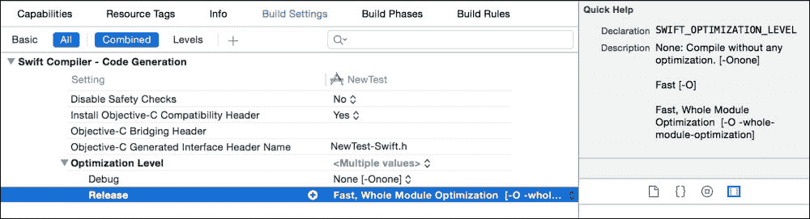
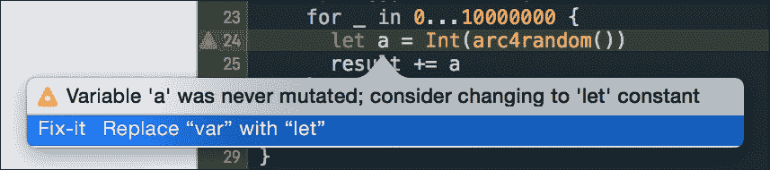
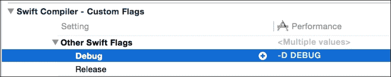

# 第四章. 提高代码性能

实现良好的代码性能是一项重要且令人向往的任务。每个人都希望拥有性能良好的应用程序。在本章中，我们将讨论以下性能主题：

+   理解性能优化

+   优化清单

+   常量和变量

+   方法调用

+   智能代码

+   值对象和引用对象

+   Swift 数组和不受保护的 C 数组

+   避免使用 Objective-C

# 理解性能优化

优化的第一规则是——不要优化。您应该始终记住唐纳德·诺伊曼（Donald Knut）的这句话：

> *过早优化是万恶之源*

这是一个非常真实且正确的陈述。您应该在看到性能问题并找到导致问题的原因后才开始进行性能优化。

有两种类型的性能优化：

+   显式

+   隐式

## 显式

显式性能优化是一种针对特定慢速代码片段的技术。此类优化需要显著的代码更改，可能会降低代码的可读性。您可以通过将算法更改为更有效的一种来执行显式性能优化。使用更多内存作为缓存也可能提高性能。

## 隐式

隐式性能优化是应用语言特定（在我们的例子中是 Swift 特定）功能以实现更好性能的技术。隐式代码性能不需要显著的代码更改。它不会对代码的可读性产生任何负面影响，有时甚至会使代码更好。我称之为隐式，因为您可以在代码的任何地方应用它，经过一段时间后，它对您来说就变得不可见了。

显式性能优化是一个非常流行且广泛的话题，在许多关于算法和数据结构的书籍中都有涉及。另一方面，隐式与 Swift 编程语言直接相关，是一个非常有趣的话题，我们将对其进行探讨。

# 优化清单

在进行任何优化和性能测量之前，您应遵循以下步骤：

1.  启用**发布**模式：Swift 编译器在**发布**模式下进行大量的代码优化，并提高性能。要启用**发布**模式，请转到**产品** | **方案** | **编辑方案** | **运行**，选择**信息**选项卡，并在**构建配置**设置中选择**发布**。

1.  禁用安全检查：禁用安全检查可能会提高应用程序性能；但正如其名所示，它会影响安全性，禁用并不完全安全，应谨慎应用。Swift 执行的一个安全检查示例是在访问内存之前检查数组边界。如果您禁用安全检查，Swift 不会执行此操作。

    禁用安全检查是**Swift 编译器 - 代码生成**设置，可在目标**构建设置**中找到。要禁用安全检查，请选择**项目** | **构建设置**，然后搜索**禁用安全检查**设置，并将其设置为**发布**模式的**是**。 

1.  启用**快速、整个模块优化**级别：默认情况下，Swift 编译器一次只对单个文件进行优化。它就像为每个文件在沙盒环境中执行一样。一个文件的优化对其他文件没有影响。

**整个模块优化**一次对模块中的所有源文件进行优化。所有源文件一起评估和优化。这非常有用，因为我们经常在一个文件中声明一个类型并在另一个文件中使用它。**整个模块优化**所做的优化之一是搜索没有在任何地方覆盖的`internal`类型的声明，并为它们添加`final`声明优化。

要启用**整个模块优化**，请在**构建设置**中为 Swift 编译器选择**优化级别**，并为**发布**模式选择**快速、整个模块优化 [-O -whole-module-optimization**]选项。

启用此设置会增加构建时间。您应该用于发布构建和性能测试。在开发和调试时，最好禁用此设置以加快编译时间。

Xcode 中提供了两种不同类型的优化级别设置，具有不同的目的和选项：

+   **Apple LLVM – 代码生成**

+   **Swift 编译器 – 代码生成**

如果您选择**优化级别**设置，您可以在**实用工具**面板的**快速帮助**部分看到所有可用选项的详细描述。



默认情况下，在**发布**模式下，Xcode 使用以下设置：

+   **Apple LLVM, GCC_OPTIMIZATION_LEVEL**: **最快、最小 [-Os**]

+   **Swift 编译器，SWIFT_OPTIMIZATION_LEVEL**: **最快 [-O**]

您可以尝试启用其他优化设置。例如，使用**最快、最激进的优化**[**-Ofast**]可以提高应用程序性能。

# Swift 代码编译

LLVM 首先将您的源代码转换为伪代码。在下一步中，它被优化并编译成汇编代码。

您可以通过使用 Swift 编译器中的`swiftc`在命令行手动执行这些代码处理步骤。要查看 Swift 编译器所有可用选项，请打开`Terminal.app`并执行`--help`命令：

```swift
xcrun swiftc --help

```

您将看到可用的编译模式和选项。我们正在寻找的是：

+   `-emit-assembly`

+   `-emit-ir`

+   `-emit-silgen`

+   `-emit-sil`

这些编译模式允许您将不同的编译步骤应用于 Swift 源文件。例如，我们可以使用此命令将`sourceFile.swift`输出到规范 SIL 表示形式，并将结果写入`outputFile`：

```swift
swiftc -emit-sil sourceFile.swift -o outputFile

```

我们将在第八章*发现所有底层的 Swift 力量*中更详细地介绍编译过程。

# 常量和变量

使用常量会影响代码的可读性。它使代码更清晰、更安全。使用常量而不是变量也可能带来性能上的好处。当你使用常量时，你给编译器一个明确的提示，表明这个值不会改变。Swift 编译器可以对常量的值进行内联优化，而不为其分配内存。

在简单的例子中，Swift 编译器也可以对变量执行相同的优化。让我们分析这个简单示例的结果，迭代并计算总和。在这个例子中，变量和常量的性能相同。

```swift
var result = 0
for _ in 0...10000000 {
  let a = Int(arc4random())
  result += a
}
// Average Time - 0.162666518447804

var result = 0
for _ in 0...10000000 {
  var a = Int(arc4random())
  result += a
}
// Average Time - 0.160957522349781
```

如果我们查看一个更复杂的例子，我们会看到常量表现得和变量一样，甚至更好。可能看起来使用变量的版本应该运行得更快，因为不需要在每次操作时为新的常量分配内存，但 Swift 编译器足够智能，能够执行智能优化，使它们表现得一样。

```swift
var result = 0
for _ in 0...100000000 {
  let a = Int(arc4random_uniform(10))
  let b = a + Int(arc4random_uniform(10))
  let c = b * Int(arc4random_uniform(10))

  result += c
}
// Average Time - 12.6813167635002

var result = 0
for _ in 0...100000000 {
  var a = Int(arc4random_uniform(10))
  a += Int(arc4random_uniform(10))
  a *= Int(arc4random_uniform(10))
  result += a
}
// Average Time - 12.6813167635102
```

因此，一般的建议是：优先使用常量。它们使代码更安全、更清晰，并且对性能也有积极的影响。在某些情况下，变量也可能提高代码的可读性，就像前面的例子中，我们不得不做一些数学计算，而改变变量的值实际上使代码更清晰。

常量比变量好得多，以至于当 Xcode 检测到一个从未被修改的变量时，它会显示警告，并建议你将其更改为常量。



# 方法调用

在讨论 Swift 方法调用优化之前，查看不同类型的方法调用实现将非常有用。

方法调用主要有两种类型：

+   **静态**：静态方法绑定意味着，当你对一个对象调用方法时，编译器知道你正在调用这个类上的确切方法。C 是一个具有静态方法绑定的语言的例子。

+   **动态**：另一方面，动态方法与对象之间的绑定较弱。当你对一个对象调用方法时，没有保证对象能够处理这个方法调用。Objective-C 有动态方法绑定。这就是为什么你会在 Objective-C 中看到“对象没有响应选择器”的错误。

Objective-C 是一种动态类型语言，它有一个动态运行时。调用方法被称为**消息发送**。你向目标发送一个消息。

```swift
[dog bark] // dog is a target and bark is a message
```

这看起来像是一个正常的方法调用，但在编译后，它实际上会看起来像：

```swift
objc_msgSend(dog, @selector(bark))
```

Objective-C 使用动态方法绑定。这意味着消息和接收者被分别存储。当你向 `dog` 对象发送一个 `bark` 消息时，狗类必须查找它是否有 `bark` 方法以及它是否能够处理这个方法。这个过程被称为动态方法绑定。实现方式可能如下所示：

```swift
id objc_msgSend ( id obj, SEL _cmd, ... )
{
    Class c = object_getClass(obj);
    IMP imp = CacheLookup(c, _cmd);
    if (!imp) {
        imp = class_getMethodImplementation(c, _cmd);
    }
    jump imp(obj, op, ...);
}
```

Swift 使用静态方法绑定。它使用 vtable（虚拟方法表）来存储方法。vtable 是一个函数指针数组。这意味着一个类有一个其方法列表及其方法实现的内存地址。当你调用 Swift 中的方法时，你是在调用特定类型的方法。方法与调用该方法的对象之间的绑定非常强，并且是在编译时完成的。

让我们看看相同的代码在 Swift 中的表现：

```swift
dog.bark()
```

因为 Swift 知道你想要在 `Dog` 类上调用 bark 方法，所以它不需要为方法信息进行任何额外的查找。它将获取函数地址并调用它：

```swift
methodImplementation = dog->class.vtable[indexOfBark] methodImplementation()
```

Swift 可以对方法调用进行更复杂的优化。如果方法没有被覆盖，这意味着对 `bark` 方法的调用将始终解析为相同的函数调用。Swift 编译器可以跳过 vtable 中的函数查找并内联直接函数调用：

```swift
_TFC12methodsCalls3Dog4barkfS0_FT_T_()
//this method is equal to- methodsCalls.Dog.bark()
```

### 注意

这是 `bark` 方法的混淆名称。我们将在第八章发现所有 Swift 的底层力量中了解更多，*发现所有 Swift 的底层力量*。

汇编代码中的 `_TFC12methodsCalls3Dog4barkfS0_FT_T_()` 直接函数调用被翻译成简单的命令。以下是汇编伪代码的示例：

```swift
rbx = __TFC11Performance3DogCfMS0_FT_S0_(); // Create dog instance
r15 = *(*rbx + 0x48); //get the location of bark method
(r15)(rbx); // call the method
```

让我们比较 Swift 静态方法调用与 Objective-C 动态方法调用的性能差异。让我们创建一个简单的 `Number` 类，它有一个 `add` 方法，用于将两个数字相加（Swift 解决方案）：

```swift
class Number {

  func add(x: Int, y: Int) -> Int {
    return x + y
  }
}
```

对于时间测量，我们使用上一章中的 `measure` 函数：

```swift
let number = Number()
measure("Sum", times: 20) {
  var result: Int = 0
  for i in 0...1000000000 {
    result += number.add(i, y: i + 1)
  }
  print(result)
}
```

结果：`平均时间 - 1.45391867654989`。

让我们看看 Objective-C 的解决方案：

```swift
//  KKNumber.h
@import Foundation;

@interface KKNumber : NSObject

- (NSInteger)add:(NSInteger)num number:(NSInteger)num2;

@end

//  KKNumber.m
#import "KKNumber.h"

@implementation KKNumber

- (NSInteger)add:(NSInteger)num number:(NSInteger)num2 {
  return num + num2;
}

@end

KKNumber *number = [[KKNumber alloc] init];

[Measure measure:20 call:^{
  NSInteger result = 0;
  for (int i  = 0; i < 1000000000; ++i) {
    result += [number add:i number:i + 1];
  }
  NSLog(@"Result %ld", (long)result);
}];
```

结果：`平均时间 - 2.974986`。

如你所见，即使在 Swift 中一个非常简单的函数调用也要快两倍。现在你已经了解了 Swift 方法和函数调用实现的细节，是时候转向更实际的例子了。

## 函数和方法

你可以通过以下四种方式之一创建函数或方法来使代码可重用：

+   全局函数

+   类型方法

+   静态和最终方法

+   实例方法

### 全局函数

全局函数是最简单的一种。它们不能被覆盖和更改。全局函数存储为内存中的命名指针。当你调用全局函数时，它会被翻译为直接内存调用，而不需要在 vtable 中进行查找。这应该是最快的方式。调用全局函数的汇编代码如下：

```swift
call       __TZFC4test3Dog5speakfMS0_FT_T_
```

### 类型方法

类型方法操作的是类型本身，而不是该类型的实例。类方法存储在该类的 vtable 中。类方法可以被子类覆盖。因为类方法可以被覆盖，Swift 编译器有时无法像全局函数那样优化类方法调用为直接函数调用。为了更好地理解原因，让我们看看这个简单的覆盖类方法的例子：

```swift
class Dog {
  class func bark() {
    print("Bark")
  }
}

class BigDog: Dog {
  override class func bark() {
    print("big loud BARK")
  }
}

func getDog() -> Dog.Type {
  return arc4random() % 2 == 0 ? Dog.self : BigDog.self
}

let dog = getDog()
dog.bark()
```

我们创建了两个简单的类：`Dog` 和 `BigDog`。`getDog` 函数返回一个 `Dog.Type` 类类型，但它也可以返回 `BigDog.Type`。因此，`dog` 变量可以是 `Dog.Type` 或 `BigDog.Type`。正因为如此，Swift 编译器不能直接在行内进行函数调用。它必须查找虚表中的函数指针，这是一个非常便宜的操作。这个伪汇编代码将看起来像这样：

```swift
rax = __TF4test6getDogFT_MCS_3Dog(); // call getDog()
*__Tv4test3dogMCS_3Dog = rax;    // convert result to Dog.Type.
(*(rax + 0x48))(rax);         // call bark method, vtable lookup
```

当你明确指定类型时，Swift 编译器可以对重写的方法进行行内直接函数调用。在这个例子中，我们调用 `Dog` 类上的 `bark` 方法，Swift 编译器会跳过虚表查找：

```swift
Dog.bark()

// Pseudo assembly code
__TTSf4d___TZFC4test3Dog4barkfMS0_FT_T_
```

### 静态方法

你可以在类、结构和枚举中声明静态类型方法。在类中声明类型方法时，使用 `static` 关键字与使用 `final class` 关键字相同。这两个方法声明是等价的：

```swift
static func speak() {}
final class func speak() {}
```

静态方法不能在子类中被重写。因为它们不能被重写，所以不需要存储在虚表中。静态方法的实现细节与全局函数非常相似。在汇编代码中，它将被翻译为直接函数调用，与全局函数相同。让我们给我们的狗类添加一个静态函数，并探索它如何翻译成汇编代码：

```swift
class Dog {

  static func speak() {
    print("I don't speak")
  }
}

Dog.speak()
BigDog.speak()
```

`Dog` 和 `BigDog` 类中 `speak` 方法的两次调用都被翻译成一条汇编指令。

```swift
call       __TZFC4test3Dog5speakfMS0_FT_T_
```

### 实例方法

类型方法和实例方法之间的主要区别在于实例方法可以操作实例常量和变量。实例方法可以被重写，并且需要存储在虚表中。让我们给我们的 `Dog` 类添加一个 `name` 变量和一个 `changeName` 实例方法：

```swift
class Dog {
  var name = ""

func changeName(name: String) {
    self.name = name
  }
}

let someDog = Dog()
someDog.changeName("Cocoa")
```

`changeName` 方法将被翻译成以下汇编代码。从虚表中获取方法地址，并传递参数来调用它：

```swift
rbx = __TFC4test3DogCfMS0_FT_S0_(); // Create Dog()
*__Tv4test7someDogCS_3Dog = rbx;  //Assign Dog instance to a someDog variable
r15 = *(*rbx + 0x68);    // Get changeName method, vtable lookup
(r15)("Coca", 0x4, 0x0, rbx); // call method and pass arguments
```

### 比较函数速度

现在你已经知道了函数和方法是如何实现以及它们是如何工作的。让我们比较那些全局函数和不同方法类型的性能速度。对于测试，我们将使用一个简单的 `add` 函数。我们将将其实现为一个全局函数、静态、类类型和实例，并在子类中重写它们：

```swift
func add(x: Int, y: Int) -> Int {
  return x + y
}

class NumOperation {

  func addI(x: Int, y: Int) -> Int
  class func addC(x: Int, y: Int) -> Int
  static func addS(x: Int, y: Int) -> Int
}

class BigNumOperation: NumOperation {

  override func addI(x: Int, y: Int) -> Int
  override class func addC(x: Int, y: Int) -> Int
}
```

对于测量和代码分析，我们使用一个简单的循环来调用这些不同的方法：

```swift
measure("addC") {
  var result = 0
  for i in 0...2000000000 {
    result += NumOperation.addC(i, y: i + 1)
    // result += test different method
  }
  print(result)
}
```

结果：

所有这些方法的表现方式完全相同。此外，它们的汇编代码看起来也完全一样，除了函数调用的名称：

+   **全局函数**：`add(10, y: 11)`

+   **静态**：`NumOperation.addS(10, y: 11)`

+   **类**：`NumOperation.addC(10, y: 11)`

+   **子类静态**：`BigNumOperation.addS(10, y: 11)`

+   **子类重写类**：`BigNumOperation.addC(10, y: 11)`

这些函数的汇编伪代码看起来是这样的：

```swift
r14 = 0x0;
do {
  rbx = "Function name Here"(r14 + 0x1, r14) + rbx;
  r14 = r14 + 0x1;
} while (r14 != 0x3ea);
```

即使直接调用 `BigNumOperation` 的 `addC` 类函数会重写 `NumOperation` 的 `addC` 函数，也不需要进行虚表查找。

实例方法调用看起来略有不同。

+   **实例**：

    ```swift
      let num = NumOperation()
      num.addI(10, y: 11)
    ```

+   **子类重写实例**：

    ```swift
      let bigNum = BigNumOperation()
      bigNum.addI()
    ```

唯一的不同之处在于它们需要初始化一个类并创建对象的实例。在我们的例子中，这并不是一个昂贵的操作，因为我们是在循环外部进行的，并且只发生一次：

```swift
if (rax == 0x0) {
  rax = _swift_getInitializedObjCClass (
    objc_class__TtC4test12NumOperation);
  *__TMLC4test12NumOperation = rax;
}
var_78 = _swift_allocObject(rax, 0x10, 0x7);
```

调用实例方法的循环看起来完全一样，所以我们不再列出它。

正如你所见，全局函数和静态及类方法之间几乎没有什么区别。实例方法看起来略有不同，但这不会对性能产生太大影响。尽管这在简单用例中是正确的，但在更复杂的例子中，它们之间还是有区别的。让我们看看这个例子：

```swift
let baseNumType = arc4random_uniform(2) == 1 ? 
  BigNumOperation.self : NumOperation.self

  for i in 0...loopCount {
    result += baseNumType.addC(i, y: i + 1)
  }
  print(result)
```

这里的唯一区别是，我们不是在编译时指定 `NumOperation` 类类型，而是在运行时随机返回它。正因为如此，Swift 编译器在编译时不知道应该调用哪个方法——`BigNumOperation.addC` 还是 `NumOperation.addC`。这个小小的改动对生成的汇编代码和性能有影响。

## 函数和方法使用总结

全局函数是最简单的，提供最佳性能。全局函数太多会使代码难以阅读和跟踪。

不能被重写的静态类型方法与全局函数具有相同的性能，但它们还提供了一个命名空间（类型 `name`），因此我们的代码看起来更清晰，且不会损失任何性能。

可以被重写的类方法可能会导致性能损失，应该在你需要类继承时使用。在其他情况下，静态方法更受欢迎。

实例方法操作对象的实例。当你需要操作该实例的数据时，使用实例方法。

当你不需要重写方法时，将方法设置为 `final`。这告诉编译器，由于这个原因，优化和性能可能会提高。

# 智能代码

由于 Swift 是一种静态和强类型语言，它可以很好地读取、理解和优化代码。Swift 尝试移除所有不必要的代码执行。为了更好地解释，让我们看看一个简单的例子：

```swift
class Object {

  func nothing() {  
  }
}

let object = Object()
object.nothing()
object.nothing()
```

我们创建 `Object` 类的实例并调用一个 `nothing` 方法。`nothing` 方法是空的，调用它没有任何作用。Swift 编译器理解这一点，并移除了这些方法调用。之后，我们只剩下一行代码：

```swift
let object = Object()
```

Swift 编译器还可以避免创建从未使用过的对象。它减少了内存使用和不必要的函数调用，这也有助于减少 CPU 使用。在我们的例子中，在移除 `nothing` 方法调用和创建 `Object` 之后，`object` 实例不再被使用，因此可以省略 `Object` 的创建。这样，Swift 就移除了所有三行代码，最终我们没有代码要执行。

Objective-C 无法进行此优化。因为它有动态运行时，`nothing` 方法的实现可以在运行时更改以执行一些工作。这就是为什么 Objective-C 无法删除空方法调用。

这种优化可能看起来并不起眼，但让我们看看另一个稍微复杂一些的例子，它使用了更多的内存：

```swift
class Object {
  let x: Int
  let y: Int
  let z: Int

  init(x: Int) {
    self.x = x
    self.y = x * 2
    self.z = y * 2
  }

  func nothing() {
  }
}
```

我们向我们的 `Object` 类添加了一些 `Int` 数据来增加内存使用。现在 `Object` 实例至少使用 24 字节（3 倍的 `Int` 大小；在 64 位架构中 `Int` 使用 4 字节）。让我们也通过添加更多指令来尝试增加 CPU 使用率，通过循环实现：

```swift
for i in 0...1_000_000 {
  let object = Object(x: i)
  object.nothing()
  object.nothing()
}
print("Done")
```

### 注意

整数字面量可以使用下划线 (`_`) 来提高可读性。1_000_000_000 与 1000000000 相同

现在我们有三百万条指令，我们使用了 2400 万字节，大约 24 MB。这对于实际上什么也不做的操作类型来说相当多。如您所见，我们没有使用循环体的结果。对于循环体，Swift 执行与上一个例子相同的优化，我们最终得到一个空的循环：

```swift
for i in 0...1_000_000 {
}
```

空循环也可以跳过。结果，我们节省了 24 MB 的内存使用和三百万次方法调用。

## 危险的函数

有些函数和指令有时对应用程序没有任何价值，但 Swift 编译器无法跳过它们，它们可能会对性能产生非常负面的影响。

### 控制台打印

将语句打印到控制台通常用于调试目的。在发布模式下，`print` 和 `debugPrint` 指令不会被从应用程序中移除。让我们看看这段代码：

```swift
for i in 0...1_000_000 {
  print(i)
}
```

Swift 编译器将 `print` 和 `debugPrint` 视为有效且重要的指令，不能跳过。尽管这段代码实际上什么也不做，但它无法被优化，因为 Swift 不移除 `print` 语句。因此，我们有一百万条不必要的指令。这个汇编代码如下：

```swift
mov        qword [ss:rbp+var_20], rbx                 
inc        rbx                //increase i
mov        rdi, r14          // save stack state for function call                  
mov        rsi, r15                                   
call       __TFSs5printurFq_T_   //call print
cmp        rbx, 0xf4241      // check loop condition i > 1_000_000
jne        0x100155fb0      // continue loop if condition is true
```

如您所见，即使是非常简单的使用 `print` 语句的代码也可能非常大幅度地降低应用程序的性能。包含 1_000_000 个 `print` 语句的循环需要五秒钟，这已经很多了。如果在 Xcode 中运行，它将需要长达 50 秒。

如果你在前一个例子中的 `Object` 类的 `nothing` 方法中添加一个 `print` 指令，情况会更糟：

```swift
func nothing() {
  print(x + y + z)
}
```

在这种情况下，由于 `print` 指令，我们创建 `Object` 实例并调用 `nothing` 的循环无法消除。尽管 Swift 无法完全消除该代码的执行，但它通过移除创建实例和调用 `nothing` 方法来进行优化，将其转换为简单的循环操作。优化后的编译代码将如下所示：

```swift
// Initial Source Code
for i in 0...1_000 {
  let object = Object(x: i)
  object.nothing()
  object.nothing()
}

// Optimized Code
var x = 0, y = 0, z = 0
for i in 0...1_000_000 {

  x = i
  y = x * 2
  z = y * 2

  print(x + y + z)
  print(x + y + z)
}
```

如您所见，这段代码远非完美，提供了很多实际上对我们没有任何价值的指令。有一种方法可以改进这段代码，以便 Swift 编译器能够执行最优化的代码优化。

### 移除打印日志

为了解决这个性能问题，我们必须在编译之前从代码中删除 `print` 语句。有几种方法可以做到这一点。

#### 注释掉

第一个想法是在发布模式下的代码中注释掉所有的 `print` 语句。

```swift
//print("A")
```

这将有效，但下次你想启用日志时，你需要取消注释那段代码。这是一个非常糟糕且痛苦的做法。有一个更好的解决方案。

### 小贴士

注释掉的代码通常是不良实践。你应该使用源代码版本控制系统，如 Git，而不是这样做。这样，你可以安全地删除不必要的代码，并在需要时在历史记录中找到它。

#### 使用构建配置

我们可以仅在 **Debug** 模式下启用 `print`。为此，我们将使用构建配置来有条件地排除一些代码。首先，我们需要添加一个 Swift 编译器自定义标志。为此：

选择项目目标— **构建设置** – **其他 Swift 标志** 设置在 **Swift 编译器 – 自定义标志** 部分，并为 **Debug** 模式添加 **–D DEBUG** 标志：



在此之后，你可以使用 `DEBUG` 配置标志来仅启用调试模式下的代码。我们将定义自己的 `print` 函数，该函数仅在调试模式下生成打印语句。在发布模式下，该函数将为空，Swift 编译器将成功将其删除：

```swift
func D_print(items: Any..., separator: String = " ", terminator: String = "\n") {
  #if DEBUG
    print(items, separator: separator, terminator: terminator)
  #endif
}
```

在任何地方，我们都会使用 `D_print` 替代 `print`：

```swift
func nothing() {
  D_print(x + y + z)
}
```

### 小贴士

你也可以创建一个类似的 `D_debugPrint` 函数。

Swift 非常智能，做了很多优化，但我们还必须使代码对人们阅读和编译器优化来说清晰易懂。

### 小贴士

使用预处理器会增加代码的复杂性。明智地使用它，并且仅在正常 `if` 条件无法工作的情况下使用，就像我们的 `D_print` 示例中那样。

## 使用不可优化的常量

一些类型不能像其他类型那样优化，使用该类型的常量不能防止 Swift 编译器删除代码。

让我们看看这个简单的例子：

```swift
class Optimizable {
  let x = 10
}

// Use-case
let o = Optimizable()
```

Swift 编译器可以删除此代码。让我们看看一个更复杂的例子：

```swift
class Optimizable {
  let x = 10
  let a = ""
}

// Use-case
let o = Optimizable()
```

此代码不能完全被 Swift 编译器删除。通过添加一个非常简单的 `String` 常量，我们已经向源代码中添加了更多的复杂性。要理解为什么会发生这种情况，我们需要探索汇编代码：

```swift
if (*__TMLC4test11Optimizable == 0x0) {
  *__TMLC4test11Optimizable = _swift_getInitializedObjCClass();
  // Initialize objc_class__TtC4test11Optimizable
}
rax = _swift_allocObject();
*(rax + 0x10) = 0xa;
*(rax + 0x18) = "";
```

从 `getInitializedObjCClass` 的名字中，我们可以假设这个方法执行了一些 Objective-C 类类型的初始化。这可能会显得非常奇怪，因为我们没有在我们的代码中使用任何 Objective-C 类型。我们添加了一个简单的空字符串常量：`let a = ""`。

问题是 Swift 的 `String` 提供了与 Objective-C 的 `NSString` 类型无缝互操作性。正因为如此，当我们使用 Swift 的 `String` 时，它会分配一些额外的数据来执行到 `NSString` 的桥接。以下是这个元数据 `objc_class__TtC4test11Optimizable` 的样子：

```swift
objc_class__TtC4test11Optimizable:
dq         __TMmC4test11Optimizable; metaclass,
dq         _OBJC_CLASS_$_SwiftObject; superclass
dq         __objc_empty_cache; cache
dq         __objc_empty_vtable; vtable
dq         0x1001bf7e1; data (Swift class)
```

有更多类型，当与简单的常量一起使用时，Swift 编译器无法简单地消除：

+   字符串

+   数组

+   自定义类对象

+   闭包

+   集合

+   字典

    ```swift
    class NotOptimizableTypes {

      let a: String = ""
      let b: String? = nil
      let c: Array<Int> = [1]
      let obj = Object()
      let d: Int -> Int = { $0 + 1 }

      let e: Set<Int> = [1]
      let f: Dictionary<Int, Int> = [1 : 1]
    }
    ```

如果我们尝试在结构体而不是类中使用这些类型，会发生有趣的行为。我们观察到不同的行为，因为 Swift 结构体没有暴露给 Objective-C 使用。这就是为什么 Swift 编译器可以消除其中许多类型：String、Array、Class 和 Closures。即使它们在结构体中使用，Set 和 Dictionary 也不会被消除。

```swift
struct NotOptimizableInStruct {

  let a: String = ""
  let b: Array<Int> = [1]
  let obj = Object()
  let c: Int -> Int = { $0 + 1 }
}
```

将这些常量移动到初始化器并不能解决问题。

解决这个问题的方法是您不应该使用任何未使用且不提供任何价值的常量。

# 提高速度

有几种技术可以简单地提高代码性能。让我们直接跳到第一种。

## 最终

您可以使用`final`属性来创建函数和属性声明。添加`final`属性使其不可覆盖。子类不能覆盖那个方法或属性。当您使方法不可覆盖时，没有必要将其存储在虚表中，可以直接调用该函数而无需在虚表中查找任何函数地址：

```swift
class Animal {

  final var name: String  = ""
  final func feed() {
  }
}
```

正如您所看到的，`final`方法比非`final`方法运行得更快。即使这样的优化也能提高应用程序的性能。它不仅提高了性能，而且使代码更安全。这样，您禁用了方法被覆盖，并防止了意外和不正确的行为。

启用**整个模块优化**设置可以达到非常相似的优化结果，但最好将函数和属性声明明确标记为`final`：这可以减少编译器的工作量并加快编译时间。在 Xcode 7 Beta 6 中，具有**整个模块优化**的大项目的编译时间可能长达五分钟。

## 内联函数

正如您所看到的，Swift 可以进行优化并使一些函数调用内联。这样调用函数就不会有任何性能损失。您可以使用`@inline`属性手动启用或禁用内联函数：

```swift
@inline(__always) func someFunc () {
}

@inline(never) func someFunc () {
}
```

尽管您可以手动控制内联函数，但通常最好将其留给 Swift 编译器来处理。根据不同的优化设置，Swift 编译器会应用不同的内联技术。

`@inline(__always)`的使用场景非常简单，即您希望始终内联的一行函数。

# 值对象和引用对象

在上一章中，您学习了使用不可变值对象的好处。值对象不仅使代码更安全、更清晰，而且使代码运行更快。值对象的速度性能优于引用对象，原因如下。在本章中，我们将使用结构体作为值对象的示例。

## 内存分配

值对象可以在栈内存上分配，而不是在堆内存上。引用对象需要分配在堆内存上，因为它们可以被许多所有者共享。因为值对象只有一个所有者，所以它们可以安全地分配在栈上。栈内存比堆内存快得多。

第二个优点是值对象不需要引用计数内存管理。因为它们只有一个所有者，所以值对象没有引用计数。使用**ARC（自动引用计数**），我们不需要过多考虑内存管理，对我们来说它看起来大多是透明的。尽管使用引用对象和值对象的代码看起来相同，但 ARC 为引用对象添加了额外的保留和释放方法调用。让我们看看一个表示数字的结构和类的非常简单的例子：

```swift
struct NumberValue {
  let x: Int
}

class NumberReference {
  let x: Int
  init(x: Int) {
    self.x = x
  }
}
```

作为例子，我们将使用`NumberValue`和`NumberReference`编写完全相同的代码，并比较生成的汇编代码：

```swift
var x = NumberValue(x: 1)
var xres = x.x
x = NumberValue(x: 2)
xres += x.x

var y = NumberReference(x: 10)
var yres = y.x
y = NumberReference(x: 20)
yres += y.x
```

创建和使用`NumberValue`结构的三行代码看起来非常简单。在汇编中，它有三行代码执行以下操作：

+   创建`NumberValue`对象

+   将其分配给`x`变量

+   将`x`数字保存到`xres`变量中

    ```swift
    rax = __TFV4test11NumberValueCfMS0_FT1xSi_S0_(0x1);
    *__Tv4test1xVS_11NumberValue = rax;
    *__Tv4test4xresSi = rax;

    // NumberValue(x: 2)
    rax = __TFV4test11NumberValueCfMS0_FT1xSi_S0_(0x2);
    *__Tv4test1xVS_11NumberValue = rax;
    *__Tv4test4xresSi = *__Tv4test4xresSi + rax;
    ```

如您所见，创建第一个数字对象和第二个对象的代码看起来完全相同。现在让我们看看`NumberReference`对象的汇编代码：

```swift
rax = __TFC4test15NumberReferenceCfMS0_FT1xSi_S0_(0xa);
*__Tv4test1yCS_15NumberReference = rax;
*__Tv4test4yresSi = *(rax + 0x10);
```

如您所见，前三条线看起来几乎相同。它创建了一个`NumberReference`实例，将其分配给变量，获取 x 数字，并将其保存到`yres`变量中。创建第二个实例的代码更有趣：

```swift
// NumberReference(x: 10)
rax = __TFC4test15NumberReferenceCfMS0_FT1xSi_S0_(0x14);
rdi = *__Tv4test1yCS_15NumberReference;
*__Tv4test1yCS_15NumberReference = rax;
_swift_release(rdi, r14);
rax = *__Tv4test1yCS_15NumberReference;
*__Tv4test4yresSi = *__Tv4test4yresSi + *(rax + 0x10);
```

如您所见，它比`NumberValue`多了三条线。我们将新的实例分配给了`y`变量；旧的`NumberReference`超出了作用域，需要释放。这三条线与`_swift_release`函数有关。如果您进一步分析处理引用对象的汇编代码，您还会发现另一个 ARC 函数：`_swift_retain;`。

现在您已经知道了值类型和引用类型之间的主要性能差异，让我们看看它们的性能表现。为此，让我们使用数字类型并在循环中进行一些计算。

```swift
var result = NumberValue(x: 0)
for i in 0...1_000 {
  var x = NumberValue(x: result.x + i)
  result = x
}

print(result)

var refResult = NumberReference(x: 0)
for i in 0...1_000 {
  var x = NumberReference(x: refResult.x + i)
  refResult = x
}
print(refResult)
```

输出：

```swift
NumberValue: 500500
NumberReference: 500500

```

第一个使用`NumberValue`结构的循环在编译时被 Swift 编译器完全消除。计算循环被转换为一个简单的整数结果；十六进制的 500500 等于 0x7a314。以下是第一个循环的汇编伪代码：

```swift
var_30 = 0x7a314;                          // save 500500
__TFSs5printU__FQ_T_(var_30, 0x1001ba538); // call print
```

如您所见，没有循环执行，结果是在编译时评估的。

使用`NumberReference`引用对象的第二个循环不能在编译时消除。汇编伪代码结构与源代码完全相同：

```swift
if (r14 == 0x0) {
  r14 = _swift_getInitializedObjCClass();
  *__TMLC4test15NumberReference = r14;
}
r15 = _swift_allocObject();
*(r15 + 0x10) = 0x0;
rbx = 0x0;
do {
  r13 = rbx + 0x1;
  rbx = rbx + *(r15 + 0x10);
  r12 = _swift_allocObject();
  *(r12 + 0x10) = rbx;
  _swift_release(r15, 0x18);
  r15 = r12;
  rbx = r13;
} while (r13 != 0x3e9);
var_38 = r12;
__TFSs5printU__FQ_T_(var_38, r14);
```

如您所见，使用值对象带来了更大的性能提升。作为一个例子，让我们测量该操作的性能，但将循环迭代次数增加到 1_00_000_000：

```swift
NumberValue Time - 0.000438838000263786
NumberReference Time - 8.49874957299835
```

这并不是一个公平的性能测量，因为具有值对象的变体实际上并没有执行任何操作。为了比较实际的执行速度，让我们以调试模式运行此代码：

### 小贴士

你不应该在调试模式下测量性能。

结果如下：

```swift
NumberValue Time - 4.31753185200068
NumberReference Time - 15.4483174900015

```

差异仍然令人印象深刻；值对象的速度快至四倍

# Swift 数组和非安全 C 数组

每个人都知道 C 是一种超级快的编程语言，当遇到性能问题时，人们会求助于 C。在 Objective-C 中，使用 C 函数和类型非常容易；其名称就说明了这一点——C with Objects。

Swift 还支持与 C 类型和指针交互。尽管它可用，但被认为是一种危险的操作，因为你需要手动进行内存管理。你需要分配和销毁内存。这些类型在 Swift 中被称为 **Unsafe**，并以 `Unsafe` 前缀开头——例如：

+   `UnsafePointer`

+   `UnsafeMutablePointer`

+   `UnsafeBufferPointer`

    ### 小贴士

    避免在 Swift 中使用 C 指针。它会给代码增加很多复杂性。

`UnsafePointers` 有三个主要的使用场景：

+   函数参数

+   创建指向现有变量的指针

+   为指针分配内存

## 函数参数

首先，让我们学习如何使用指针。当你在 Swift 中设计 API 时，你不应该使用 `UnsafePointers`，但你可能会遇到需要与 C API 交互的情况：例如 Core Foundation。C 指针将暴露给 Swift，如下所示：

+   `const Int *` 作为 `UnsafePointer<Int>`

+   `Int *` 作为 `UnsafeMutablePointer<Int>`

当你在 Swift 中调用带有 `UnsafePointer` 参数的函数时，你可以通过使用 `&` 符号或数组将相同类型的变量作为输入输出参数传递：

```swift
var num = 10
var ar = [1, 2]

func printNumber(x: UnsafePointer<Int>) {
  x.memory
}

printNumber(&num)
printNumber(ar)
```

也可能传递 `nil`，但那样的话，我们的函数将会有一个空指针作为参数，访问其内存会导致应用程序崩溃：

```swift
printNumber(nil)
```

你将在屏幕上看到以下内容：

```swift
Execution was interrupted, reason: EXC_BAD_ACCESS (code=1, address=0x0).

```

使用 `UnsafeMutablePointer` 非常相似。`UnsafeMutablePointer` 和 `UnsafePointer` 之间的主要区别在于，可变指针可以修改其所指向变量的值。当使用数组作为具有 `UnsafeMutablePointer` 参数的函数的参数时，它们也需要作为输入输出参数传递。

```swift
func changeNumber(x: UnsafeMutablePointer<Int>) {
  x.memory = 9901
}

changeNumber(&num)
changeNumber(&ar)
num // 9901
ar // [9901, 2]
```

## 创建指向现有变量的指针

当你创建指针时，你可以使用 `initialize` 方法将其连接到现有变量。`initialize` 方法将返回一个函数，可以用来设置该变量的新值。

```swift
var num = 10
var ar = [1, 2]

var numPtr = UnsafeMutablePointer<Int>.initialize(&num)
numPtr(10)
num //10

var numArPtr = UnsafeMutablePointer<[Int]>.initialize(&ar)
numArPtr([1])
ar  //[1]
```

## 为指针分配内存

与指针一起工作的另一种方式是为它们分配内存。`alloc` 方法有一个参数：它将为多少个对象分配内存。在为指针分配内存后，你可以使用它。最后，你需要释放指针使用的内存。

```swift
var numberPtr = UnsafeMutablePointer<Int>.alloc(1)
numberPtr.memory = 20
numberPtr.memory // 20
numberPtr.dealloc(1)
```

`UnsafeMutablePointer`有许多有用的方法可供使用，例如用于移动指针前后移动的`successor`和`predecessor`方法，用于访问随机指针索引的`subscript`，以及其他许多方法。

你可以在[`developer.apple.com/library/ios/documentation/Swift/Conceptual/BuildingCocoaApps/InteractingWithCAPIs.html`](https://developer.apple.com/library/ios/documentation/Swift/Conceptual/BuildingCocoaApps/InteractingWithCAPIs.html)了解更多关于与 C 指针交互的信息。

现在，你已经学会了如何在 Swift 中处理 C 指针，让我们跳到我们的主要目标：测量使用指针数组工作的速度。

## 比较 Swift 数组和未安全 C 数组

为了比较，我们将创建一个随机数字数组并对它们进行排序。主要目标不是找到在数组中排序数字的最有效方法，而是比较使用 C `UnsafePointers`和 Swift 数组类型时的性能。

首先，让我们使用`UnsafeMutablePointer`创建一个 C 样式的变体：

```swift
let count = 3_000_0
measure("C Arrays") {
  let array = UnsafeMutablePointer<Int>.alloc(count)
  for a in 0..<count {
    array[a] = Int(arc4random())
  }

  // Sort
  for _ in 0..<count {
    for j in 0..<count - 1 {
      if array[j] > array[j + 1] {
        swap(&array[j], &array[j + 1])
      }
    }
  }
  array.dealloc(count)
}
```

结果是：`平均时间 - 1.31680929350041`。

现在，让我们使用 Swift 数组来做出相同的解决方案：

```swift
let count = 3_000_0
measure("Swift Arrays") {
  var array = Array(count: count, repeatedValue: 0)

  for i in 0..<count {
    array[i] = Int(arc4random())
  }

  // Sort
  for _ in 0..<count {
    for j in 0..<count - 1 {
      if array[j] > array[j + 1] {
        swap(&array[j], &array[j + 1])
      }
    }
  }
}
```

结果是：`平均时间 - 1.30709397329978`。

Swift 数组在处理`UnsafePointers`时的性能与之前相同。

如你所见，代码看起来非常相似。数组的初始化和排序算法在两种变体中看起来完全相同。这是因为`Array`和`UnsafeMutablePointer`都有子脚本方法。唯一的区别在于我们创建数组的方式：

对于`UnsafeMutablePointer`：

```swift
let array = UnsafeMutablePointer<Int>.alloc(count)
...
array.dealloc(count)
```

对于 Swift 数组：

```swift
  var array = Array(count: count, repeatedValue: 0)
```

通常，Swift 数组提供了更多的功能，并且与它们一起工作要容易得多。例如，数组有排序、过滤和其他许多方法，但`UnsafeMutablePointer`没有。

### 指针操作总结

简而言之——Swift 数组更受欢迎，以下是原因。

与指针一起工作是一个不安全且危险的操作。你需要手动分配和释放内存。使用指针访问内存也非常危险，因为你可能会访问不属于你的其他内存。

`UnsafePointers`和 Swift 数组具有相同的性能特征。

# 避免使用 Objective-C

你已经了解到，在大多数情况下，Objective-C（及其动态运行时）比 Swift 运行得慢。Swift 与 Objective-C 之间的互操作性做得非常无缝，有时我们可以在 Swift 代码中使用 Objective-C 类型及其运行时，而不知道这一点。

当你在 Swift 代码中使用 Objective-C 类型时，Swift 实际上使用 Objective-C 运行时进行方法调度。正因为如此，Swift 不能对纯 Swift 类型进行相同的优化。让我们看看一个简单的例子：

```swift
  for _ in 0...100 {
    _ = NSObject()
  }
```

让我们阅读这段代码，并对 Swift 编译器如何优化这段代码做出一些假设。`NSObject`实例在循环体中从未使用过，因此我们可以消除创建对象。之后，我们就会有一个空循环，也可以将其消除。因此，我们会从执行中移除所有代码。

让我们通过查看生成的汇编伪代码来看看现实中发生了什么：

```swift
rbx = 0x65;
  do {
    rax = [_OBJC_CLASS_$_NSObject allocWithZone:0x0];
    rax = [rax init];
    [rax release];
    rbx = rbx - 0x1;
    COND = rbx != 0x0;
  } while (COND);
```

如你所见，没有代码被消除。这是由于 Objective-C 类型使用动态运行时调度方法，称为消息发送。

所有标准框架，如 Foundation 和 UIKit，都是用 Objective-C 编写的，所有类型，如 NSDate、NSURL、UIView 和 UITableView，都使用 Objective-C 运行时。它们的性能不如 Swift 类型，但我们可以在 Swift 中使用所有这些框架，这是非常好的。

在 Swift 中无法从 Objective-C 类型中移除 Objective-C 的动态运行时调度，所以我们唯一能做的就是学习如何明智地使用它们。

## 避免暴露 Swift 到 Objective-C

我们无法从 Objective-C 类型中移除运行时行为，但我们可以阻止 Swift 类型使用 Objective-C 运行时。

当 Swift 类继承自 Objective-C 类时，它也会继承其动态运行时行为。这也使其在 Objective-C 代码中使用变得可能。因为它继承了动态行为，所以 Swift 编译器无法执行最优化的优化（如前面示例中 `NSObject` 在循环中的情况所示）。让我们创建一个继承自 Objective-C 的简单类，并探索其行为：

```swift
class MyNSObject: NSObject {
}

for _ in 0...100 {
  _ = MyNSObject()
}
```

这段代码无法被消除，其汇编代码看起来与前面示例中的非常相似。我们可以通过简单地移除 `NSObject` 继承来改进这种行为。我们可以在本例中这样做，因为我们没有使用 `NSObject` 的任何功能。

```swift
class MyObject {
}

for _ in 0...100 {
  _ = MyObject()
}
```

在这种情况下，Swift 编译器能够执行最优化的优化，并从执行中消除所有代码。它移除了循环中创建的 MyObject，并在之后消除了空循环。

正如你所见，在 Swift 中使用 Objective-C 类会使 Swift 编译器变得不那么强大。只有在以下情况下才继承和使用 Objective-C 类：

+   将 Swift 类型暴露给 Objective-C

+   需要继承自 Objective-C 类，例如 UIView、UIViewController 等。只有在真正需要时才进行子类化

### 动态

有一个更危险的属性会给你的类型添加 Objective-C 的动态运行时行为：`dynamic` 关键字。当你使用 `dynamic` 修饰符声明成员时，它会将 Objective-C 运行时添加到类中。对该成员的访问永远不会被静态内联，而总是通过使用 Objective-C 的 Target-Action 机制动态调度。让我们来看一个简单的例子：

```swift
class MyObject {
  dynamic func getName() -> String {
    return "Name"
  }

  dynamic var fullName: String {
    return "Full Name"
  }
}

let object = MyObject()
object.fullName
object.getName()
```

即使这样一个小的例子也做了很多工作。应用 `dynamic` 关键字会导致许多问题：

+   使用 `_objc_msgSend` 进行动态消息发送

+   类型转换

+   因为我们使用了 Objective-C 的动态调度方法，我们需要将我们的 "Name" Swift 字符串类型转换为 NSString；当我们从该函数调用中获取结果并返回到 Swift 代码时，我们需要进行一次从 NSString 到 Swift String 的额外转换

+   没有优化和函数调用内联

+   由于方法总是动态调度的，Swift 编译器无法进行内联优化或消除空方法。

## 避免使用 Objective-C 的总结

你应该避免使用 Objective-C 及其运行时行为来实现高性能。

你应该不惜一切代价避免使用 `dynamic` 关键字。你几乎永远不应该使用它。

只有在你需要那个类行为时才从 Objective-C 类继承，例如 UIView。只有在你需要将你的类型暴露给 Objective-C 时才使用 `@objc` 属性。

# 总结

在本章中，我们讨论了许多与 Swift 性能相关的话题。首先，我们需要了解我们需要改进什么，并启用优化设置以获得最佳性能。

内存使用对于实现高性能非常重要。首先，我们讨论了使用常量如何对性能产生积极影响。第二个且更为重要的例子反映了使用值类型和结构体如何减少内存使用，并通过使用快速栈内存来提高性能。

我们讨论的第三个重要主题是方法调度。我们分析了比较了 Objective-C 的动态调度和 Swift 的静态调度。通过查看汇编代码，我们看到了 Swift 实际上是如何进行方法调度的，以及它是如何通过提高性能来受益的。

我们还讨论了一些可能降低性能的危险操作，这些操作应该避免。

在下一章中，我们将学习更多关于不同数据结构的知识：它们之间的差异和性能特征。
