# 第一章. 使用 Xcode 和 Swift 入门

在本章中，我们将涵盖以下食谱：

+   从 App Store 安装 Xcode

+   下载 Xcode 图像

+   开始一个 Swift 项目

+   使用 Swift 项目选项

+   创建条件代码

+   将现有项目迁移到 Swift 2.0

+   添加开发者账户

+   从命令行编译

+   将 Swift 作为解释器使用

+   向现有项目添加版本控制系统

# 简介

在本章中，我们将学习使用 Swift 创建项目的基础知识。即使你已经创建了你的项目，阅读本章的食谱也是值得的。你将学习如何与 Xcode 交互，如何从命令行测试你的代码，最后，我们将回顾这门语言的基础知识。

在下载 Xcode 之前，请注意 Swift 需要 Xcode 6.0 来支持 Swift 1.0，以及 1.2 或 Xcode 7.0 来支持 Swift 2.0 和 2.1。我们将安装 Xcode 7.0（截至本文写作时的最新版本）。要安装 Xcode 7.0 版本，你必须至少有 OS X Yosemite（OS X 10.10），所以在安装之前满足这些要求。

# 从 App Store 安装 Xcode

安装 Xcode 的第一种方式是从 App Store 下载。这种方法的优势是，你会在下载开始之前收到更新警告，并且会检查系统要求。

## 准备工作

要从 App Store 下载任何程序，你必须有一个 Apple ID；它是免费的，设置起来也不会花很长时间。

## 如何操作...

1.  要从 App Store 下载 Xcode，只需从你的 dock 或应用程序文件夹中打开 **App Store**。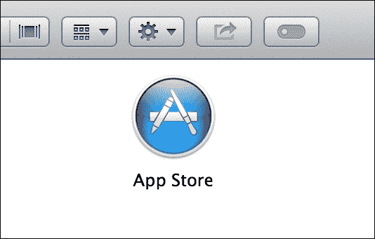

1.  第一次打开 App Store，它会要求你提供 Apple ID 详细信息（电子邮件和密码）。打开此应用程序后，只需在应用程序右上角的文本框中搜索 `xcode`。

1.  确保你从正确的供应商（Apple）安装 Xcode；有时我们会得到一些结果，让我们认为它们是我们想要的，但事实并非如此。

1.  一旦你找到了 Xcode 应用程序，只需点击 **安装** 按钮，下一步就是去喝杯咖啡，或者你可以叫一个朋友，因为 Xcode 有 2.2 个吉字节，这意味着下载需要一段时间，所以现在休息一下。

1.  要检查 Xcode 是否已完成安装，你只需打开 **应用程序** 文件夹或启动盘应用程序，然后查看 Xcode 图标下是否有进度条。

## 它是如何工作的...

就像你将从 App Store 安装的其他任何应用程序一样，你只需要打开 App Store 应用程序，搜索它，然后安装它。

## 还有更多...

如果你买了一台新电脑，你会看到 Xcode 会被推荐安装到你的新机器上。这是因为苹果会跟踪你已经安装的应用程序。

# 下载 Xcode 图像

安装 Xcode 的第二种方式是下载来自 Apple 开发者中心的镜像；这一步骤不是免费的，仅限于 Apple 开发者计划的成员（每年大约 99 美元）或在该计划成员公司工作的人。

## 准备工作

对于这个菜谱，你需要有 2.2 GB 的空闲空间，除了已安装的 Xcode 所占用的空间，但我假设你不会遇到这个问题。

下载 DMG 文件的优势在于你可以将其保存到 DVD 上作为备份（你永远不知道 Xcode 这个版本何时会被从 App Store 中移除）。此外，如果你在一个团队中工作，确保每个成员使用相同的 Xcode 版本非常重要。另外，如果你想安装任何 Xcode 的测试版，它只能通过 Apple 开发者中心获取。

## 如何操作……

要下载 Xcode 镜像，请按照以下步骤操作：

1.  第一步是打开你的网页浏览器；访问 [`developer.apple.com/xcode`](http://developer.apple.com/xcode)，然后点击网页右上角的下载按钮。你将被带到一个新的页面，有两个下载选项：最新的测试版构建或指向 Mac App Store 的链接。如果你选择下载测试版构建，需要登录。登录后，下载将立即开始。否则，你可以在 Mac App Store 中免费下载最新的公共构建。

    ### 小贴士

    你可以在一台机器上安装多个版本的 Xcode；具体来说，是公共发布版和苹果提供的任何测试版。

1.  下载 DMG 文件后，双击它，将 Xcode 图标拖到你的 **应用程序** 文件夹中。记住，你需要管理员权限才能将文件复制到 **应用程序** 文件夹中。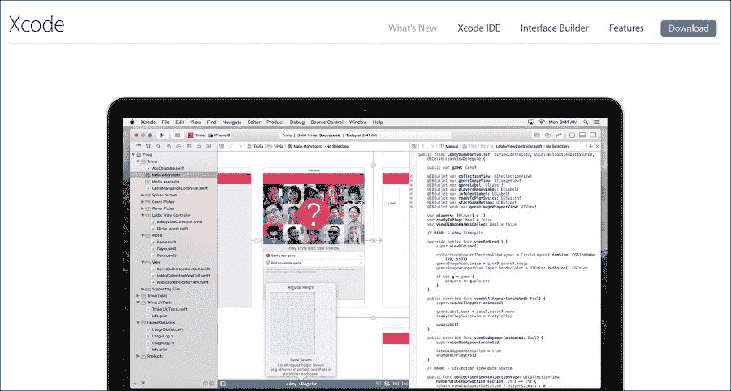

1.  你也可以将 Xcode 安装到不同的路径，比如你的主目录，但如果不是必要的，我不建议这样做。

    ### 小贴士

    不要在搜索引擎中搜索“下载 Swift”，因为还有一种也叫 **Swift** 的编程语言，它与苹果设备无关。

## 它是如何工作的……

DMG 文件确保你可以始终拥有这个 Xcode 版本的备份，所以如果你未来版本的 Xcode 出现任何问题，你可以安装之前的版本。也可能在你的电脑上安装多个 Xcode 版本。

## 还有更多……

Apple 开发者中心是一个获取 Xcode 资源的好网站。在这里，你可以找到视频、指南、代码示例和附加组件。

# 开始 Swift 项目

通常，开始 Swift 是一件非常直接的事情；然而，了解每一步发生的事情是很好的。

## 准备工作

在您开始项目之前，请确保您知道项目名称以及它将保存在哪个文件夹中。更改此类参数可能会在项目创建后造成问题。一旦您安装了 Xcode，您可以从应用程序文件夹、启动台或甚至从您的坞站打开它，如果您已经将 Xcode 添加到坞站的话。由于我非常懒惰，我更喜欢后者；它对我来说更快，因为它在我的坞站上。

## 如何操作…

当您第一次打开 Xcode 时，它可能会要求您安装一些额外的包，所以请这样做。这些包中的一些对于您正在开发的应用程序类型很重要，而其中一些对于访问某些设备（主要是最新设备）是必要的。

1.  现在，Xcode 正在询问您想要启动或打开的项目。请选择显示为**创建一个新的 Xcode 项目**的选项。![如何操作…]

    如果由于任何原因，此窗口没有显示给您，您始终可以选择转到**文件**（在菜单栏上）| **新建** | **项目**。

1.  下一步是选择您想要开发的项目类型。在这个例子中，我将使用 iOS 的**单视图应用程序**，但如果有任何不同之处，我会对 OS X 应用程序或其他类型的项目进行注释。![如何操作…]

    下一个对话框将要求您提供一些项目信息，其中一个例子是您想要使用的编程语言。在这个例子中，我们将使用 Swift。

    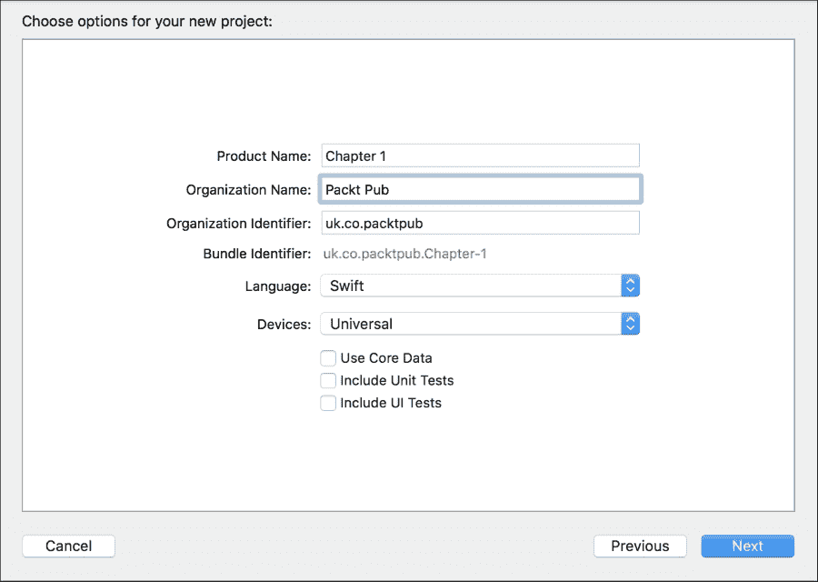

1.  选择 Swift 作为语言，它将使用其代理创建带有 Swift 代码的应用程序。请确保**使用 Core Data**选项未被勾选，以防止其代码出现在应用代理中。

    您还会注意到，Swift iOS 应用程序现在没有名为`main.m`、`main.mm`或`main.swift`的文件。OS X 应用程序有一个`main.swift`文件，但它比之前的`main.m`文件小。

    正如您应该已经知道的，产品名称是您的应用程序名称，组织名称是此软件的所有者，组织标识符是反向的互联网域名，例如，`uk.co.packtpub`而不是`packtpub.co.uk`。

    ### 注意

    注意现在没有创建单元测试的复选框，因为默认情况下，它使用 XCTest 为您创建。如果您不想使用它，只需从您的项目中删除该组即可。我不会删除它，它通常不会造成伤害。

1.  现在，是时候选择一个文件夹来存储我们的项目了。记住，在开发过程中，您可以添加文件，这些文件将存储在不同的位置。我不推荐这种做法，但如果您必须这样做，尽量让您的项目靠近这些文件。

1.  我还建议您检查使用 Git 仓库的选项，除非您有子版本仓库，当然。即使您是唯一的开发者，拥有版本控制系统也很重要。请记住，我们是人类，有时我们会犯错误，因此需要回滚。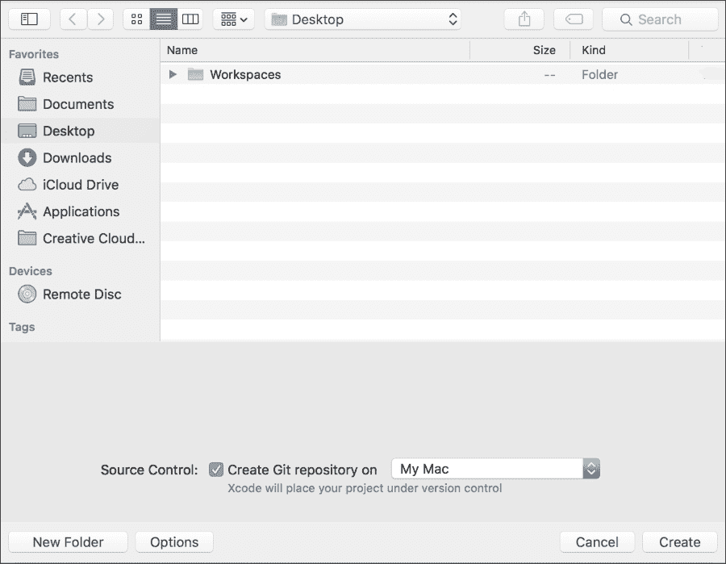

1.  一旦你创建了项目，按下播放按钮看看它是否在运行。如果你是第一次安装 Xcode，它将显示一个对话框要求你启用开发者模式。如果你有管理员密码，请点击 **启用** 按钮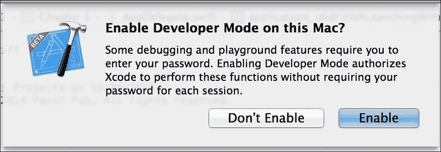

1.  好的！现在你的项目已经启动并运行。

## 它是如何工作的…

创建一个项目并不是什么困难的事情；你只需要注意一些步骤。确保你已经选择了 Swift 作为主要编程语言；否则，你会看到很多与 Objective-C 相关的内容。

注意你将创建项目的文件夹。Xcode 会为你创建一个以项目名称命名的另一个文件夹，并在其中，Xcode 会创建项目包，一个包含源代码的文件夹。如果你想复制你的项目，确保你复制包含所有内容的文件夹。

## 还有更多…

如果你想要在一个已经启动项目的团队中工作，你可能会使用 **检出现有项目** 选项来克隆项目。你将使用 Git 或子版本库，并将你的代码与其他团队成员同步。Xcode 为我们提供了与 **VCS**（**版本** **控制系统**）一起工作的基本工具；这些工具足以完成我们 80%的任务。

# 使用 Swift 项目选项

Xcode 项目有很多选项。在这里，我们将了解其中的一些，主要是 Swift 特定的选项。

## 准备工作

要执行这个菜谱，只需创建一个新的项目，如前一个菜谱所示。

## 如何操作…

1.  一旦你创建了一个项目，点击导航器项目图标或如果你更喜欢键盘快捷键，按 *command + 1*，然后点击你的项目图标（第一个图标）。现在，点击 **构建设置**。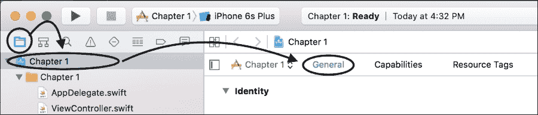

1.  查找 **嵌入式内容包含 Swift 代码**；在这种情况下，我们将选择 **否**，但当然，如果你知道有任何使用 Swift 创建的额外内容，你应该选择 **是**。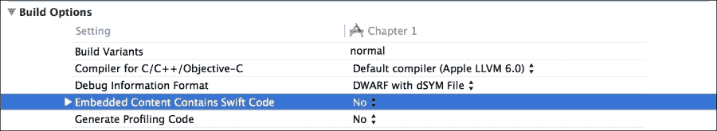

1.  前往 **通用** 选项卡并向下滚动；你可以看到你可以添加嵌入式二进制文件的地方。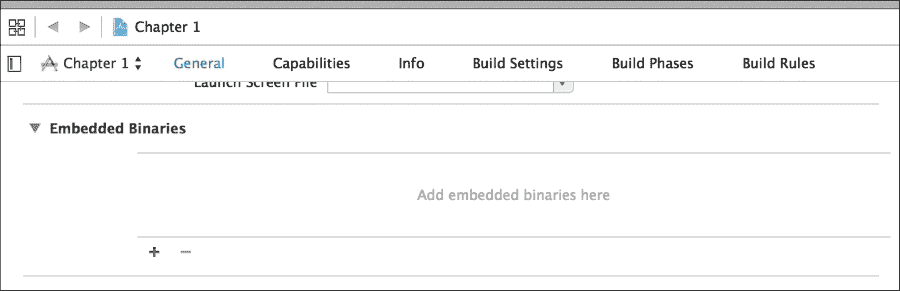

1.  现在，查找 **优化级别**。这里是你告诉编译器它应该花费多少时间来尝试使你的代码更快或压缩它的地方。通常，当我们开发（调试模式）时，我们设置为无优化（-O0）；然而，当我们准备创建最终产品（发布模式）时，我们通常会设置一个优化级别，例如 Os，这意味着最快和最小。

    ### 注意

    有时候，在使用 Objective-C 时，当你曾经设置过高级别的优化时，调试器会丢失一些变量值。我还没有在 Swift 中看到这种现象，但最好心中有数。

1.  另一个重要的选项是**导入路径**。这告诉 Swift 在哪里查找 Swift 模块。如果你正在将你的项目与外部库链接，你可能需要指定`module.map`文件的位置。如果你有多个路径要搜索，你需要逐行设置它们。如果你为调试和发布有不同的路径，你仍然可以使用变量，例如`$(CONFIGURATION)`或`$(TARGET)`。

    ### 小贴士

    你可以使用绝对路径或相对路径，但我更倾向于相对路径。

## 它是如何工作的…

更改设置主要是当你的项目开始增长时必须做的事情。有一些选项你为调试和发布配置设置了不同的值。

## 还有更多…

Xcode 有很多配置设置；展示所有这些设置超出了本书的范围。我建议你至少查看其中的一些，尤其是如果你想处理大型项目。在这里我的主要建议是：不要在没有与你的团队其他成员（主要是项目经理）同步的情况下更改你的设置。如果你与 VCS 发生冲突，修复它可能会很困难。

# 创建条件代码

通常在我们开发时，我们有一些情况，我们希望根据我们的需求有不同的代码片段。例如，让我们想象一下，我们想要比较我们编写的某些函数与在第三方库中创建的等效函数的性能。在这种情况下，我们可以创建一些宏，用于仅使用我们的函数或仅使用第三方函数，这样我们就可以让同一个应用程序以两种不同的方式工作。

在这个菜谱中，我们将向你展示如何根据平台创建日志，我们还可以根据执行是否受到日志过多的影响来启用或禁用它。

## 准备工作

创建一个名为`Chapter 1 Conditional Code`的新项目，如之前所示，让我们编写一些代码。

## 如何做到这一点…

1.  在创建一个新的项目后，让我们通过导航到**文件** | **新建** | **文件...**来创建一个新的文件。现在，选择**Swift 文件**并将其命名为`CustomLog.swift`。

    ### 小贴士

    不要将你的文件保存在与项目不同的文件夹中；这将来可能会给你带来问题。

1.  现在，添加以下代码：

    ```swift
    func printLog(message: NSString){
        #if VERBOSE_LOG
            #if os(OSX)
                let OS="OS X"
            #else
                let OS="iOS"
            #endif

            #if arch(arm) || arch(arm64)
                let devicetype = "Mobile device"
            #elseif arch(x86_64) || arch(i386)
                let devicetype = "Computer"
            #else
                let devicetype = "Unkown"
            #endif

            NSLog("%@ on a %@ - %@", OS, devicetype, message)
        #endif
    }
    ```

1.  现在，前往你的视图控制器的`viewDidLoad`方法，并添加对这个函数的调用，如下所示：

    ```swift
    printLog("Hello World")
    ```

1.  现在尝试点击播放；你看到了什么？答案是——什么都没有！原因是编译器对宏`VERBOSE_LOG`一无所知，这意味着这个宏被解释为*false*，唯一创建的就是一个空函数。

1.  现在，回到你的项目构建设置，搜索其他 Swift 标志，并添加`-DVERBOSE_LOG`，如下面的截图所示：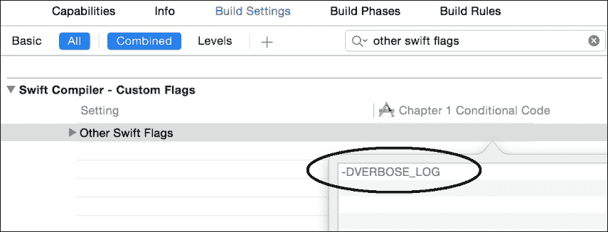

1.  再次点击播放，你会看到日志消息。

## 它是如何工作的…

目前，Swift 编译器定义了两个宏：`os()` 和 `arch()`。第一个可以接收 OS X 或 iOS 作为参数，第二个可以接收 x86_64、arm、arm64 和 i386。这两个宏都将返回一个布尔值。您也可以创建自己的宏，在构建设置中定义它。

被评估为 `true` 的块将被编译，其他块则不会编译；这样，您可以拥有调用 OS 特定功能的代码。

### 注意

我想强调，主要是针对那些习惯于使用 C 项目开发的开发者，苹果的文档明确指出 Swift 没有预处理器；它只在编译时使用一个技巧，因此您不能像在 C 或 Objective-C 中那样使用宏。您唯一能做的就是查看它们是否已设置。

## 更多内容…

如果需要，您可以使用此处所示的运算符 `&&`、`||` 和 `!`：`#if arch(arm64) && os(iOS)`，但不能使用任何比较运算符，如 `==`、`<` 等。

如果您想了解更多可以添加到其他 Swift 标志的选项，请查看本章中的 *从命令行编译* 菜谱。

# 将现有项目迁移到 Swift 2.0

如果您有一个用 Swift 2.0 或更低版本编写的现有项目，苹果已经为 Xcode 7 提供了一些方便的工具，帮助您轻松地将项目迁移到 Swift 2.0。

## 准备工作

对于这个菜谱，您需要一个用 Swift 1.2 或更低版本编写的现有 Xcode 项目。

## 如何操作…

按以下步骤迁移现有项目：

1.  定位您的现有 Xcode 项目，并打开 `.xcodeproj` 或 `.xcworkspace` 文件以自动打开 Xcode 7。一旦项目或工作区加载，Xcode 将显示以下消息，提示您转换为最新的 Swift 语法：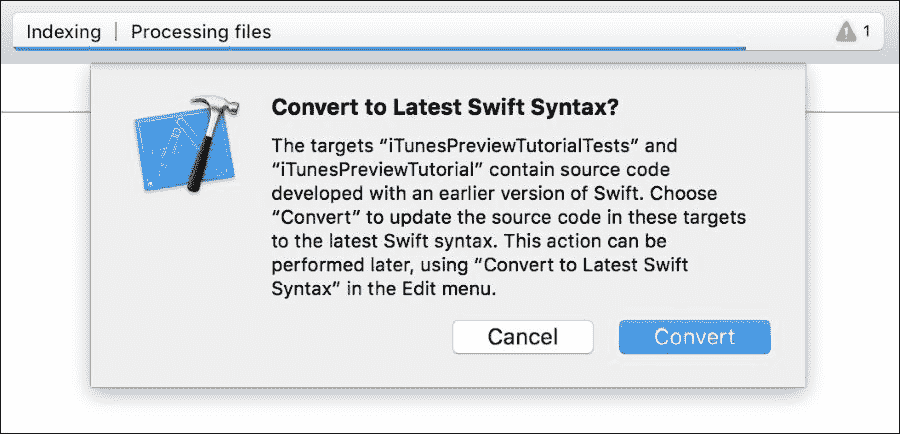

1.  点击**转换**，您将被带到一个新的屏幕。此屏幕显示有关转换过程的一些信息。选择**下一步**以继续。

1.  您现在将被要求选择要更新到 Swift 2.0 的目标。如果您需要保留任何目标处于当前状态，这将非常有用。请审查您的目标列表，取消选中您不希望更新的目标，然后选择**下一步**。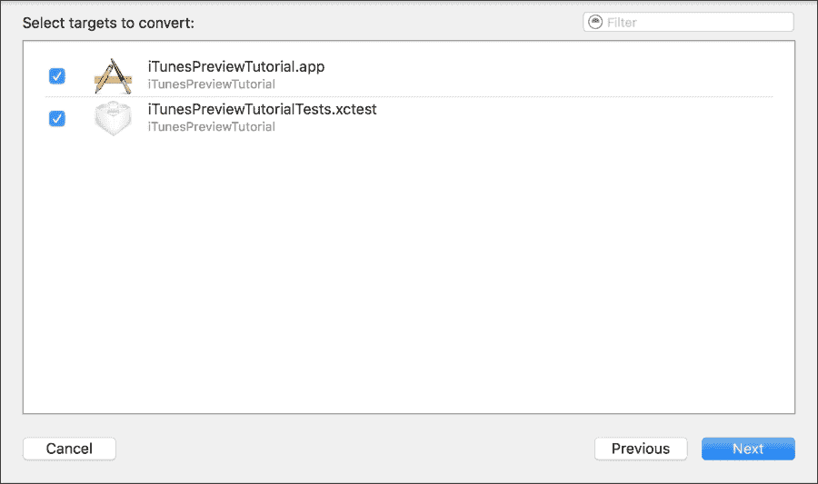

1.  您将看到一个新屏幕，类似于辅助编辑器，比较迁移后的结果与您的代码当前状态。在左侧的远端面板中，您将看到一个将接受更改的所有文件的列表，并且可以手动选择不更改的文件。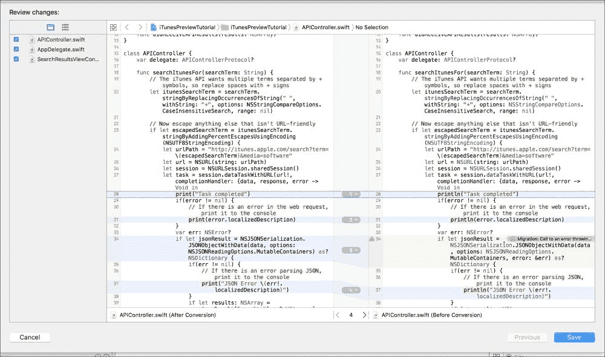

    ### 小贴士

    如果有任何文件您希望**不**迁移，只需从左侧文件列表中取消选中它们。

1.  一旦您已验证或修改了所有更改，请选择**保存**。Xcode 将更新所有更改，您将准备好继续使用 Swift 2.0 进行开发。

## 工作原理…

苹果已经使 Xcode 在代码迁移方面非常灵活。幸运的是，这大多数都简化了迁移到 Swift 2.0 的过程，并允许你直接编写更多代码。然而，迁移过程并不完美，对于复杂的项目可能需要手动更改。

## 还有更多…

如果由于任何原因迁移提示没有自动显示，你仍然可以自己开始这个过程。从菜单栏导航到**编辑** | **转换** | **转换为最新 Swift 语法**。你将被直接带到这个菜谱的第 2 步。

# 添加开发者账户

通常，苹果公司通过改进 Xcode 和创建工具来让开发者的生活变得更简单，但在谈到证书时，有一个例外。如果你想在一个物理设备（iPhone、iPad 或 iPod）上测试你的应用，你需要一个证书。如果你想将其上传到 App Store，你也需要这个证书。

证书的想法是为了保护你的代码免受恶意代码或签名后的修改，但这种想法是有代价的。要获取证书，你需要注册苹果开发者计划。

## 准备工作

我们假设如果你继续这个菜谱，你已经注册了这个计划。让我们回收之前的工程；打开它，然后开始。

## 如何做到这一点...

按照以下步骤添加苹果开发者账户：

1.  一旦你打开了项目，点击项目导航器，然后点击显示我们项目的组合框，如果尚未选择，请选择目标`第一章`。

1.  现在，看看名为**团队**的选项。在编写 Mac 应用程序的情况下，这个组合框只有在选择将签名选项设置为 Mac App Store 或开发者 ID 时才会启用。

1.  通常，团队选项开始时是**无**被选中的。点击这个组合框并选择**添加账户**。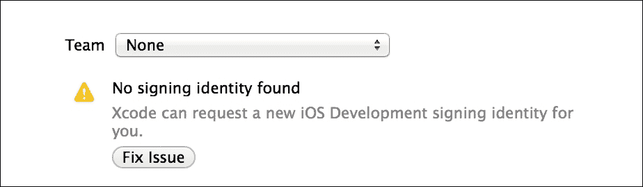

1.  在选择添加账户后，Xcode 将要求你提供苹果开发者计划的登录数据（电子邮件和密码）。如果你没有，你有选择加入该计划。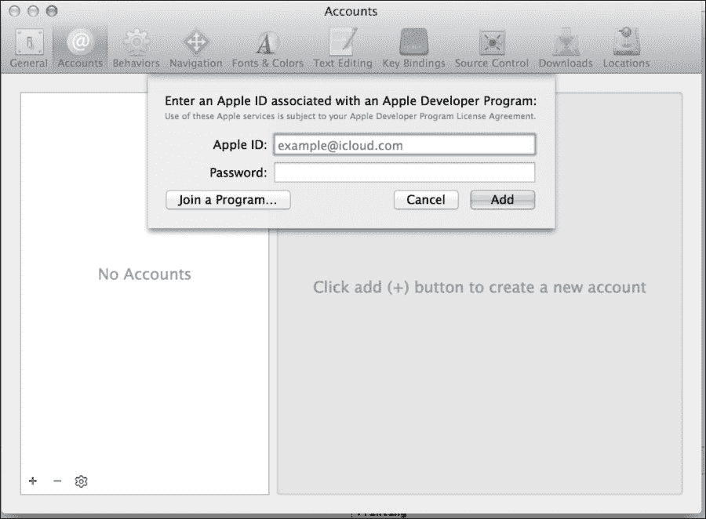

1.  一旦添加了这些，你应该使用你的账户并运行你的应用。如果你将设备连接到 Mac，你可以转到菜单栏上的**窗口**选项，然后选择**设备**选项。

    ### 注意

    你的设备应该会出现在对话框中。Xcode 可能需要一段时间来读取设备的符号。在首次连接此设备的情况下，你会看到你需要请求更改此设备的状态为开发者模式。

1.  当你得到绿灯时，这意味着你的设备已准备好用于开发；现在，回到你的项目，从模拟器切换到你的设备。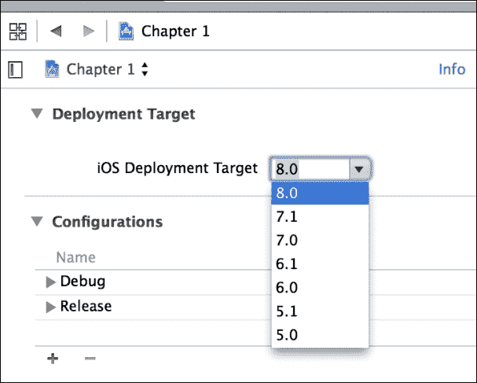

1.  如果设备已启用但未在 Xcode 中列出，这可能意味着你必须降低**iOS 部署目标**，这可以在项目设置下的**信息**选项卡中找到。

    ### 提示

    将 **iOS 部署目标** 降低到最小值是程序员中非常普遍的想法，以覆盖最大类型的设备。这样做将防止你的开发使用新功能。首先检查你需要的功能，然后更改你的 **iOS 部署目标**。

## 它是如何工作的...

签署代码是为了安全考虑；主要限制是你必须与苹果开发者计划保持最新。苹果允许每个账户最多 100 个设备。

## 还有更多...

有时候，证书会给我们带来一些头疼。如果它要求你撤销证书，你可能需要在苹果开发者中心创建一个新的，如果你在一个团队中工作，你可能需要等待管理员的批准。

有几次你需要更改构建设置中的代码签名选项；这通常发生在你从另一个组织 ID 获取代码时。

在设备上测试你的代码是非常有用的；这是你可以测试真实用户体验的地方。无论何时你有某些低级代码，例如汇编代码或用 C 语言编写的使用类型大小或字节序的代码，在设备上测试你的项目都是好的。记住，苹果的设备基于 ARM 和 ARM64 的 CPU，这与在 Mac 电脑上使用的 Intel CPU 不同。

# 从命令行编译

我知道现在很多用户，甚至开发者，认为使用命令行是过去的事情。现实是，即使今天，很多可以通过命令行完成的任务，主要是自动化任务，如持续集成，必须使用命令行来完成。

这个菜谱将向你展示这并不困难，而且更好，你将更深入地理解 Xcode 幕后操作的概念。

### 小贴士

如果你从未使用过命令行，我建议你读一本关于它的书；在我看来，*Linux Shell Scripting Cookbook*，*Packt Publishing* 是一本很好的书，即使知道一些命令是 Linux 特定的。

## 准备工作

使用键组合 *command* + *Shift* + *U* 打开一个 **Finder** 窗口，或者打开你的 **Launchpad** 并点击 **其他** 文件夹。在这里，你可以看到一个名为 **终端** 的图标，打开它，你应该会看到一个类似于以下窗口的窗口：

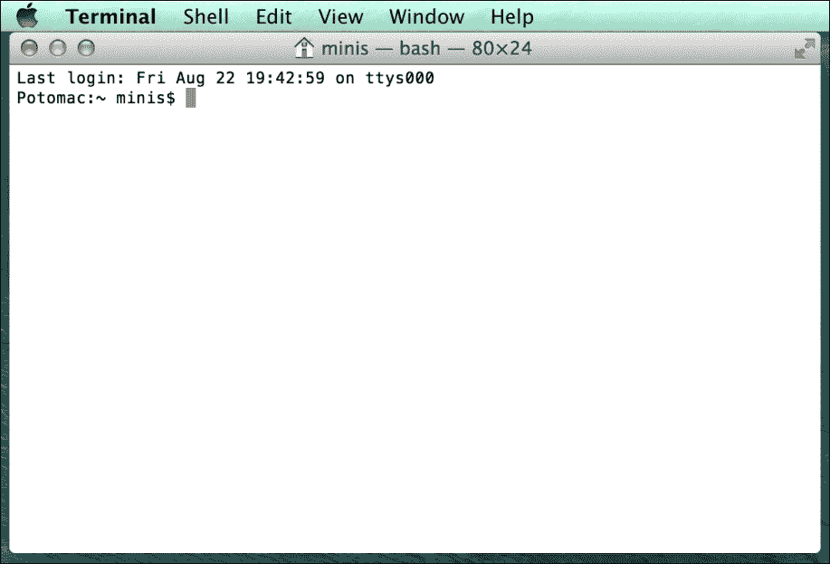

## 如何操作...

1.  输入 `xcode-select -p`；这应该会给出一个路径，例如，`/Applications/Xcode.app/Contents/Developer`。如果你在机器上没有安装更多的 Xcode 版本，你不需要担心路径；它可能就是正确的。如果由于任何原因你在机器上安装了多个 Xcode，你需要通过输入 `xcode-select -s /Applications/XCODE VERSION.app/Contents/Developer` 来更改它。

    ### 小贴士

    记住，切换 Xcode 是一项只能由管理员完成的任务，并且它将影响每个用户。

1.  现在，转到你的项目目录并输入以下命令：

    ```swift
    xcodebuild -target "Chapter 1" -configuration Debug 

    ```

之后，你会在屏幕上看到很多命令，但最重要的信息是最后一条，应该是 `** BUILD SUCCEEDED **`；这意味着项目构建没有错误。

## 它是如何工作的...

当你输入一个命令时，你的系统会使用 `PATH` 变量指定的路径来查找这个命令。你可以通过输入 `echo $PATH` 来检查包含在你的 `PATH` 变量中的目录。默认情况下，目录 `/usr/bin` 被包含在内。

此目录包含 Xcode 命令，例如 `xcodebuild`。当你想要使用来自其他 Xcode 版本的命令时，你需要使用 `xcode-select` 来覆盖这些文件以使用你想要的版本。

一旦设置好，你就可以编译你的项目。由于你的项目是一组很多文件，如源代码、图像等，如果我们必须逐个执行每个动作（编译、复制文件、代码签名等），这将是一项艰巨的工作。这就是为什么请求 Xcode 使用 `xcodebuild` 命令自己执行它更容易的原因。

`xcodebuild` 命令有很多参数，因此你可以指定配置为 Debug 或 Release，你想要编译的目标，以及许多其他选项。输入 `xcodebuild -help` 以获取选项列表。

### 小贴士

`-help` 参数在 Xcode 命令中非常常见。当你有任何疑问时，尝试使用它。

## 还有更多...

关于 `xcodebuild` 命令的另一个优点是它显示了使用所有参数的命令。因此，当你编译 Objective-C 项目时，Xcode 使用 clang 编译器，但当你有一个 Swift 项目时，Xcode 使用 `swiftc` 命令。输入 `swiftc -help` 并提供其完整路径以检查其选项，并在其他 Swift 标志的构建选项中使用它们。

请记住，`xcodebuild` 将会寻找一个名为 `project.pbxproj` 的文件，该文件位于你的 `.xcodeproj` 目录内。此文件包含每个文件、设置和创建项目所需的步骤；如果出现语法错误或错误引用，`xcodebuild` 和 Xcode IDE 将不会编译项目。除了这个修复之外，这个文件可能很费时。由于这些原因，我不会手动更改此文件，并且我也会尝试避免与版本控制系统发生冲突。

# 使用 Swift 作为解释器

就像一些其他脚本语言一样，你可以在命令行上使用 Swift 和它的解释器。有时这非常有用，主要是在你想要测试代码但又不想创建一个新的游乐场时。

## 准备工作

打开一个终端窗口，如前一个菜谱所示。

## 如何做到这一点...

按照以下步骤使用 Swift 作为命令行解释器：

1.  第一步是找到 Swift 命令的位置；即使你已经使用了`xcode-select`命令，Swift 命令也可能无法通过你的`PATH`变量访问。因此，你可以使用`find /Applications/Xcode.app -name swift -a -type f`来定位你的 Swift 命令。在我的情况下，我得到了`/Applications/Xcode.app/Contents/Developer/Toolchains/XcodeDefault.xctoolchain/usr/bin/swift`。

    ### 注意

    然而，当前版本的 Xcode 将 Swift 命令放在`/usr/bin`。如果需要，你可以使用命令`export PATH="$PATH:/Applications/Xcode.app/Contents/Developer/Toolchains/XcodeDefault.xctoolchain/usr/bin/"`将这个目录添加到你的`PATH`变量中。此时，我们只需输入`swift`就可以进入 Swift 解释器。

1.  如果你想要从命令行使用 Swift，有时永久设置这个`PATH`变量是个好主意。为了做到这一点，我们需要将之前的命令添加到我们的`.profile`文件中，例如`echo 'export PATH="$PATH:/Applications/Xcode.app/Contents/Developer/Toolchains/XcodeDefault.xctoolchain/usr/bin/" ' >> $HOME/.profile && chmod +x $HOME/.profile`。

    从现在开始，如果你重新启动计算机，就无需再次查找 Swift 路径并设置`PATH`环境变量。

1.  现在，让我们进入我们的 Swift 命令行，并输入以下代码：

    ```swift
    var dividend = [3,2,1,0]
    var divisor = 6
    ```

1.  你会在输入每个变量后看到显示这些变量内容的消息。现在，输入以下循环代码：

    ```swift
    for i in dividend { 
          println("\(divisor) / \(i) = \(divisor / i)")  
    }
    ```

    你可以看到，我们将得到以下结果：

    ```swift
    6 / 3 = 2
    6 / 2 = 3
    6 / 1 = 6
    Execution interrupted. Enter Swift code to recover and continue.
    Enter LLDB commands to investigate (type :help for assistance.)

    ```

1.  如你所见，最后一个选项失败了，因为我们不能除以 0。这是我们使用命令行测试一些代码的快速方法。大多数时候，我们会使用 playground 来测试，但有时使用命令行会更快。

## 它是如何工作的...

调用 Swift 命令给你提供了测试你的代码或甚至将 Swift 用作脚本语言的可能性。这里要强调的是，你需要知道你的 Swift 命令在哪里；命令行可以帮助你找到它。

## 更多...

Swift 的大多数选项和`swiftc`选项都是通用的；这意味着如果你想在编译前测试某些内容，你可以这样做。

# 将版本控制系统添加到现有项目

在没有任何版本控制的情况下开始一个项目是非常常见的，随着时间的推移，我们改变了自己的想法，并决定添加一个。

不幸的是，Xcode 没有给我们这个选项，我们必须手动完成。我希望 Xcode 很快能添加这个选项。

## 准备工作

为了完成这个菜谱，让我们创建一个名为`Chapter1 Git`的空项目；然而，这次，在我们保存项目之前，取消选择**在...创建 Git CGRepository**选项。

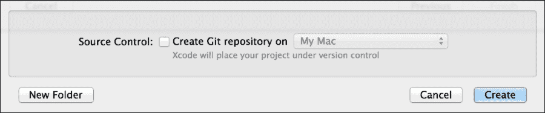

## 如何操作...

按照以下步骤在现有项目上创建本地仓库：

1.  从菜单栏中选择**源代码控制**菜单选项。

1.  选择**创建工作副本**来创建本地仓库。

1.  现在，你可以打开你的项目，并注意到 Xcode 已经识别了版本控制系统。如果你想确保这一点，修改一个文件，使用 *command* + *S* 保存它，并检查在你的项目导航器中文件的右侧是否有字母 *M*。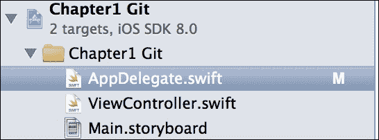

1.  一旦你对你的更改满意，你可以通过右键单击 `AppDelegate.swift`，然后转到 **源代码管理** 选项并选择 **提交 "AppDelegate.swift" …** 选项来交付它们。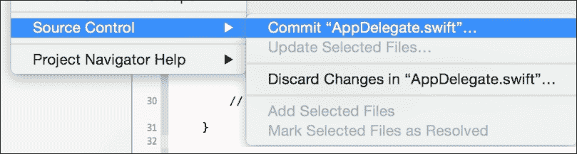

1.  然后，将出现一个要求描述的对话框；将你的修改作为注释写下来，然后点击 **提交 1 个文件**。

## 它是如何工作的…

不幸的是，如果你忘记将 Git 仓库添加到你的项目中，Xcode 不会提供任何机制来将其添加到你的项目中，因此你必须手动添加。打开命令行允许你从命令行使用 Git，Xcode 会检测到这一功能已被添加。某些版本的 Xcode 只有在你打开项目时才能检测到版本控制已被添加，所以如果你已经完成了所有步骤但 Xcode 没有检测到，请尝试关闭并重新打开 Xcode。

### 小贴士

Xcode 为你提供了一些与 Git 和 SVN 一起工作的功能，但它们非常有限。如果你需要更多来自你的版本控制系统的命令，你可以从命令行使用它们，或者使用外部工具。

## 还有更多…

即使你不会作为团队的一部分工作，我也建议你使用版本控制系统。当使用 Swift 或其他语言进行开发时，你有时需要回滚或比较当前代码与之前的版本，主要是在你遇到新错误时。

## 参见

+   如果你想了解更多关于这个主题的信息，请查看书籍 *Git 版本控制食谱*，*Packt 出版*
