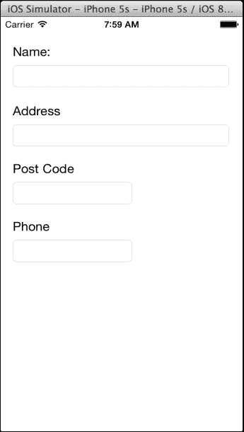
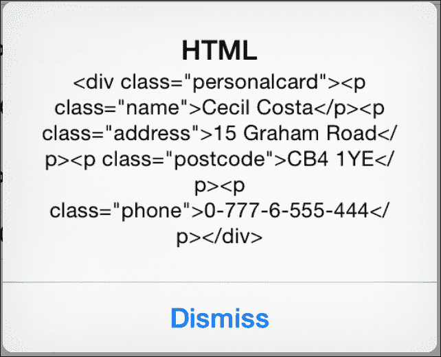
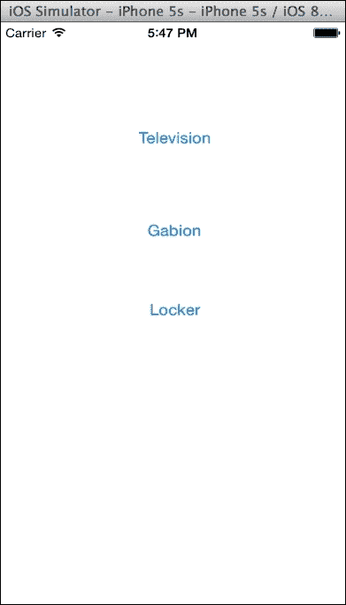
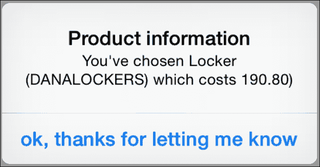
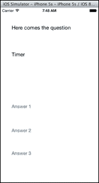
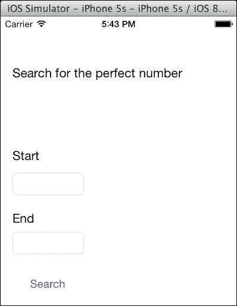
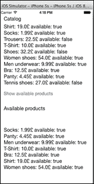
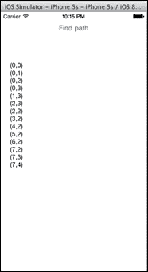
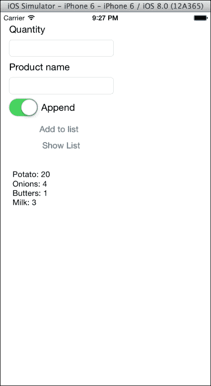

# 第二章. 标准库和集合

在本章中，我们将介绍以下食谱：

+   手动创建 HTML

+   打印你的对象描述

+   对用户进行测验

+   寻找完美数

+   对产品数组进行排序

+   寻找出路

+   创建你自己的集合

+   组织餐厅

# 简介

了解集合和标准库的使用很重要，尤其是对于来自 Objective-C 的人，因为这里有一些差异。

在本章中，我们将创建一些应用程序来使用这些功能。在这些食谱之后，你应该对 Swift 编程语言有一个很好的理解。

如前一章所述，我们的大部分食谱将在 iOS 上创建，但如果你愿意，也可以在 Mac OS X 上开发它们。

# 手动创建 HTML

HTML 最初是一种简单的网页和链接显示格式。如今，这种格式已经变得非常普遍，并且被广泛使用。甚至有像 PhoneGap 这样的框架，可以创建使用此文件类型的应用程序。

在这个食谱中，我们将仅使用字符串创建 HTML；主要思想是了解字符串操作。在这种情况下，我们将创建名片 HTML 代码。

## 准备工作

打开你的 Xcode，创建一个名为`Chapter2 HTML`的单视图项目。

## 如何操作…

让我们按照以下步骤手动创建 HTML：

1.  点击故事板并添加以下布局：

1.  然后，将文本框与视图控制器上的以下属性连接：

    ```swift
    @IBOutlet weak var nameTextField: UITextField!
    @IBOutlet weak var addressTextField: UITextField!
    @IBOutlet weak var postCodeTextField: UITextField!
    @IBOutlet weak var phoneTextField: UITextField!
    ```

1.  将这些属性与视图上的相应文本框相关联，在创建动作按钮之前，我们将使用以下代码创建一个`Card`类：

    ```swift
    class Card {
        private let TEMPLATE = "<div class=\"personalcard\">" + "<p class=\"name\">#name#</p>" + "<p class=\"address\">#address#</p>" + "<p class=\"postcode\">#postcode#</p>" + "<p class=\"phone\">#phone#</p>" + "</div"

        var name:String?
        var address:String?
        var postCode:String?
        var phone:String?

        init(){}
    }
    ```

    如你所见，我们正在创建一个与我们的应用程序具有相同信息的类。主要区别是我们有一个名为`TEMPLATE`的常量，它具有我们的 HTML 模型。

    ### 注意

    注意，这个常量是私有的，因为这是我们不应该看到的东西（例如，从视图控制器中）。此外，请注意，在需要继续到下一行的每一行末尾都有一个加号。原因是，我们不能像在 Objective-C 中使用操作符那样不使用操作符来连接字符串。

    Swift 在指令末尾不需要分号。然而，如果你有一行非常长的代码，你必须告诉编译器这一行将要继续，例如，使用加号，或者在下一条线上使用点操作符来表示它从上一行继续。

    如果你曾经使用 Objective-C 或 C++进行编程，你可能想知道为什么我们创建了一个空的初始化器。原因是：它不是必需的；理论上，因为我们只有常量和可选值。然而，某些 Swift 版本，出于任何原因，无法检测到它，并强制你创建一个空的初始化器。

    属性的初始值是什么？答案是*nil*。看看是否所有这些属性都是可选的；如果不是，我们将不得不将它们的值设置为某些内容。

    ### 小贴士

    避免使用空值，例如空字符串来初始化属性；最好使用可选属性。

1.  到目前为止，我们有了基本结构。现在我们需要创建按钮事件，所以将视图控制器上的触摸事件与以下动作链接：

    ```swift
    @IBAction func showHTML(sender: AnyObject) {
      var card = Card()

      card.name = nameTextField.text
      card.address = addressTextField.text
      card.postCode = postCodeTextField.text
      card.phone = phoneTextField.text

      let alert = UIAlertController(title: "HTML", message: card.toHtml(), preferredStyle:.Alert)
      self.presentViewController(alert, animated: true, completion: nil)
    }
    ```

1.  现在我们将看看这个动作是否非常清晰。我们将开始创建一个`card`对象，然后从我们的视图中获取所需的信息，最后显示它。

    ### 小贴士

    避免面条代码；不要创建一个巨大的动作，并尝试将其分解为类和方法。看看维基百科上的模型-视图-控制器模式。

1.  除了一个细节外，一切都很正常：`Card`类没有名为`toHtml`的方法。没问题，让我们实现它。回到我们的`Card`类，并添加以下方法：

    ```swift
    func toHtml() -> String{
      var html = TEMPLATE.stringByReplacingOccurrencesOfString("#name#", withString: self.name!)
      .stringByReplacingOccurrencesOfString("#address#", withString: self.address!)
      .stringByReplacingOccurrencesOfString("#postcode#", withString: self.postCode!)
      .stringByReplacingOccurrencesOfString("#phone#", withString: self.phone!)
      return html;
    }
    ```

1.  现在是时候测试它了；只需在 Xcode IDE 中按播放，填写字段并按按钮，你应该会看到一个像这里显示的消息：

## 它是如何工作的…

字符串有很多方法；其中一些用于修改当前字符串，而另一些仅返回值，还有一些基于原始字符串创建新的字符串。在我们的例子中，我们使用了`stringByReplacingOccurrencesOfString`，通过替换我们的标记`(#something#`)来生成一个新的字符串，对应于相应的属性。

我们可以将每个替换的结果链式调用，以进行下一个替换，防止每行重新赋值。

### 小贴士

现在，iPhone 和 iPad 拥有 1GB 或更多的 RAM，这对于大多数传统的 HTML 模板来说应该足够了。然而，如果你有一个非常大的模板，有很多替换，你可能需要寻找更优化的方法。在大型字符串变量上替换字符串会分配大量内存，你可能会得到较差的性能。

## 还有更多...

如果你查看这个方法文档，你会看到有两个额外的参数，一个叫做`options`，另一个叫做`range`。它们用于指定一个特殊的比较器来搜索我们的字符串标记，另一个则只使用我们字符串的一部分。由于我们不需要使用它们，它们是可选的，所以我们只是省略了它们；没有必要用 nil 值填充，就像我们以前在 Objective-C 中做的那样。

### 小贴士

如果你的项目中有需要创建 HTML、XML 或 JSON 代码的对象，你可以创建一个具有特定于相应类型转换的方法的基础对象，以实现标准化。

# 打印你的对象描述

这个菜谱的目的是看看使用变量值创建字符串的 Swift 方法。在 Objective-C 中，我们有一个名为`stringWithFormat`的类方法，但在 Swift 中，这个方法不像在 Objective-C 中那样频繁使用，因为现在我们有插值。在这个例子中，我们将创建一个应用程序，它将向用户展示三种可能的产品。当用户选择其中之一时，应用程序必须显示该产品的信息，如果有的话，还要显示其价格。

## 如何做...

1.  创建一个名为`Chapter2 Product Value`的新单视图项目。现在，让我们点击故事板并添加三个按钮，如图所示：

1.  完成此操作后，你可以添加一个名为`Product`的新 swift 文件。现在我们将创建一个包含产品名称、其价格和制造商名称的类。

    在这种情况下，唯一可以省略的信息是产品价格；其他属性是必需的。这意味着我们需要一个初始化器，至少包含产品名称和制造商名称。

1.  由于我们希望使用插值功能来使用我们的产品，我们需要实现`CustomStringConvertable`协议，这迫使我们实现一个名为`description`的属性。一旦我们有了这些信息，我们就可以使用以下代码实现我们的类：

    ```swift
    class Product: CustomStringConvertible{
      var price:Double?
      var name: String
      var manufacturer: String

      init(name: String, manufacturer: String){
        self.name = name
        self.manufacturer = manufacturer
      }

      var description:String {
        return "\(self.name) (\(self.manufacturer))"
      }
    }
    ```

1.  现在，我们可以转到视图控制器并创建三个产品作为属性；按照我们的示例，我们将创建`television`、`gabion`和`locker`。所以，让我们添加以下属性：

    ```swift
      private let television = Product(name: "Television", manufacturer: "Telefunken")
      private let gabion = Product(name: "Gabion", manufacturer: "Maccaferri")
      private let locker = Product(name: "Locker", manufacturer: "Danalockers")
    ```

1.  下一步是创建一个辅助函数，该函数将把双精度浮点数转换为具有两位精度的字符串。我将在视图控制器文件中创建此函数，但不在其类内部。如果在项目中你打算在多个文件中使用此函数，我建议你使用以下代码创建另一个文件：

    ```swift
    func doubleFormatter(value: Double) -> String{
      return String(format: "%.2f", value)
    ```

    ### 小贴士

    将一个或多个文件专门用于辅助函数和类扩展是一个好主意。这将使你的代码维护更容易。

1.  我们需要做的最后一件事是创建按钮动作。正如你所知，我们有三个按钮，它们都将执行相同的功能；唯一的区别是显示的产品。因此，我们将创建一个函数，并根据发送者区分产品。

    ### 小贴士

    避免重复代码，即使它们相邻或很小。这是因为当项目开始接收更改时，它将生成新的错误。

1.  我想提到的另一个细节是，在这个例子中，我将在添加增值税（20%）后显示产品价格。这是为了让你了解 Swift 字符串插值的强大功能：

    ```swift
    @IBAction func showDescription(sender: UIButton) {
      var message:String
      var product: Product

      if sender.titleLabel?.text == "Television"{
        product = television
      }else if sender.titleLabel?.text == "Gabion" {
        product = gabion
      }else if sender.titleLabel?.text == "Locker"{
        product = locker
      }else{
        return
      }
      message = "You've chosen \(product)"

      if let price = product.price {
        message += " which costs \(doubleFormatter(price * 1.20)))"
      }

        let alert = UIAlertController(title: "Product information", message: message, preferredStyle:.Alert)
                   self.presentViewController(alert, animated: true, completion: nil)
    ```

    ### 注意

    在这个示例中，我们使用了按钮的标题来知道选择的产品，但这是一种不好的做法。这样做只是为了创建一个专注于字符串插值的小示例。想象一下，你需要将你的程序翻译成其他语言，或者如果你需要向这个标签添加少量信息，这将使你修复大量的代码。

1.  现在我们的应用已经完成；尝试按下播放按钮，然后点击应用按钮。你应该看到一个类似于这样的警告视图：

## 工作原理...

Swift 最伟大的功能之一是字符串插值；它允许你拥有我们在计算包含增值税的价格时所做的表达式。这也允许你调用像`doubleFormatter`这样的函数，使我们的数字以两位数显示。这也允许我们打印一个对象。

如果我们愿意，甚至可以调用对象的方法或属性，例如。我们可以将制造商名称显示为大写，将我们的描述更改为`\(self.name) \(self.manufacturer.uppercaseString))`。

记住，如果你想打印自己的对象，它必须遵循`CustomStringConvertable`协议并实现名为`description`的属性。一些语言，例如 Java，在基类中有一个等效的方法（Java 中的`toString`），你只需要重写它。然而，Swift 如果没有指定基类，就没有基类，这就是为什么你必须在指定了`CustomStringConvertable`协议的使用后才能覆盖`description`属性。

要使用字符串插值，只需创建一个字符串，当你需要外部值时，只需将其用`\(`（反斜杠和左括号）和`)`（右括号）包裹起来，例如，`\(variable)`。

### 小贴士

如果表达式变得过于复杂，以至于难以使用，只需在字符串内部创建一个新的变量并设置其值。这在软件维护方面也是一种良好的实践。Objective-C 没有这个功能；你必须使用名为`stringWithFormat`的类方法创建一个新的字符串。我们使用了 Swift 的等效方法，现在是一个初始化器。

我还想指出，我们在`if`语句中创建了一个常量。在这种情况下，我们不是验证价格是否为真或是否大于零，我们只是检查它没有 nil 值。例如，对于价格为 0 的产品，它也会评估为真。

最后但同样重要的是，请注意，我们的`message`变量不是可选的，但它并没有在声明的地方初始化。原因是编译器会在读取和设置它之前检查它，并且没有未初始化的可能性。

这个变量的初始值取决于产品值，它不能为 nil；这就是我们被迫添加`else`语句和从我们的函数中退出的原因。否则，编译器会找到一个可能的方法将产品设置为 nil，并且由于我们的插值，它将失败。

## 还有更多...

我们为`doubleFormatter`函数提供的另一个良好解决方案是创建一个扩展。为此，只需将我们的格式化代码更改为以下代码：

```swift
extension Double {
    func precision(numDigits: Int) -> String {
        return NSString(format: "%.\(numDigits)f", self)
    }
}
```

这意味着我们现在为双精度类型添加了一个新方法，我们可以随时调用它。当然，我们还得改变使用我们的双精度值的插值。现在，我们可以使用类扩展，用以下一行替换相应的行：

```swift
message += " which costs \((price * 1.20).precision(2)))"Adding different characters
```

# 对用户进行测验

有时候，我们需要在我们的应用程序中添加一些图标，但根据您想要的图标，不一定需要添加图片；您可以使用 Unicode 字符。让我们创建一个仅使用字符串的测验应用。

这个应用的想法是创建一个应用，用户需要在 12 秒内回答一个问题。在测验结束后，应用将显示用户的得分，例如正确和错误问题的数量。

## 准备中

一旦我们了解了这个程序的概念，让我们创建一个新的项目，并将其命名为 `第二章 Unicode`。

## 如何操作...

要创建一个测验应用，请按照以下步骤操作：

1.  首先，让我们创建一个名为 `Quiz` 的新文件，并向其中添加一个带有问题、三个可能答案和正确答案的类，如下所示：

    ```swift
    class Quiz {
        var question:String
        // First possible answer
        var ①:String
        // second possible answer
        var ②:String
        // third possible answer
        var ③:String
        // Right answer
        var 👌:Int

        init(question:String, ①:String, ②:String, ③:String, 👌:Int){
            self.question = question
            self.① = ①
            self.② = ②
            self.③ = ③
            self.👌 = 👌
        }
    }
    ```

    ### 小贴士

    要将 Unicode 字符添加到您的代码中，您可以从网站复制或转到 **编辑** | **特殊字符**。

1.  现在我们已经拥有了这个愉快的类，我们需要创建另一个类来存储我们的测验并管理用户的答案：

    ```swift
    class QuizManager {
        private var quizzes:[Quiz] = []
        private var currentQuestion = 0
        // Total right answers
        private var 👍 = 0
        // Total wrong answers
        private var 👎 = 0

        func addQuiz(quiz:Quiz) {
            self.quizzes.append(quiz)
        }

        func getCurrentQuestion() -> Quiz? {
            if currentQuestion < quizzes.count {
                return self.quizzes[currentQuestion]
            }
            return nil
        }

        // Answer to the current question.
        // Returns true if it was the right answer
        func answer(questionNumber:Int) -> Bool{
            var rightAnswer:Bool
            if getCurrentQuestion()!.👌 == questionNumber {
                rightAnswer = true
                👍++
            }else {
                rightAnswer = false
                👎++
            }
            return rightAnswer
        }

        func get👍() -> Int {
            return 👍
        }

        func get👎() -> Int {
            return 👎
        }
    }
    ```

1.  下一步是添加一个用于问题的标签、三个用于可能答案的按钮和一个用于显示计时器的标签。如果您不想显示导航栏，别忘了将其隐藏。您的屏幕应该看起来类似于这个：

1.  现在是时候在我们的视图控制器上创建相应的属性并将它们链接起来。除了这些组件，我们还需要一个计时器和另一个变量来知道已经过去了多少时间。将这些属性命名为如下所示：

    ```swift
        @IBOutlet var questionLabel: UILabel!
        @IBOutlet var timerLabel: UILabel!
        @IBOutlet var answer①Button: UIButton!
        @IBOutlet var answer②Button: UIButton!
        @IBOutlet var answer③Button: UIButton!
        var quizTimer: NSTimer?
        var elapsedTime:Int
        var quizManager:QuizManager
    ```

1.  好的，现在是我们初始化这些组件的时候了。这就是我们为什么要创建一个初始化器的原因。在 Objective-C 中，我们曾经设置 `viewDidLoad` 方法，因为这个方法是在控制器的视图被加载到内存后调用的，但现在在 Swift 中，每个对象都必须初始化每个非可选属性。这就是我们要重写 `init` 方法的原因。不要担心每行代码的含义；很快就会解释：

    ```swift
        required init(coder: NSCoder) {
            self.elapsedTime = 0
            quizManager = QuizManager()
            super.init(coder: coder)
            setupQuizManager()

        }
    private func setupQuizManager(){
            quizManager.addQuiz(Quiz(question: "What's the capital of Australia?", ①: "Sidney", ②: "Melbourne", ③: "Canberra", 👌: 3))
            quizManager.addQuiz(Quiz(question: "What is the smallest planet in the solar system?", ①: "The moon", ②: "Mercury", ③: "The sun", 👌: 2))
            quizManager.addQuiz(Quiz(question: "In which year was Harley Davison founded?", ①: "1903", ②: "2013", ③: "80BC", 👌: 1))
        }
    ```

    您可能首先会问：为什么我们使用 `required` 而不是 `override`？这是因为初始化器在基类（`UIViewController`）中被定义为 `required`；在这种情况下，我们必须重新实现这个方法。

1.  下一步是设置 `elapsedTime`。我们现在不会使用它，但由于它不是可选的，我们必须在这里设置它。请注意，`elapsedTime` 和 `quizManager` 都在超类之前初始化。在初始化超类之后，我们可以将问题添加到测验管理器中；这就是为什么我们有 `setupQuizManager` 的调用。

1.  好的，现在我们可以将第一个问题显示在屏幕上了。为此，我们需要著名的 `viewDidLoad` 函数。我们无法在初始化器中做这件事，因为标签和按钮还没有被实例化。您还可以看到 `prepareNextQuestion` 方法，该方法验证是否有更多的问题。如果有，则显示下一个问题；如果没有，则显示您的得分：

    ```swift
        override func viewDidLoad() {
            super.viewDidLoad()
            prepareNextQuestion()
        }
        private func prepareNextQuestion(){
            if quizTimer != nil {
                quizTimer!.invalidate()
            }
            guard let quiz = quizManager.getCurrentQuestion() else {
                   let message = "Total \u{1F44D} \(quizManager.get👍())\nTotal \u{1F44E} \(quizManager.get👎())"
                    let alert = UIAlertController(title: "Product information", message: message, preferredStyle:.Alert)
                    self.presentViewController(alert, animated: true, completion: nil)
                    return
                }

                elapsedTime = 0
                questionLabel.text = quiz.question
                answer1Button.setTitle(quiz.1, forState:.Normal)
                answer2Button.setTitle(quiz.2, forState:.Normal)
                answer3Button.setTitle(quiz.3, forState:.Normal)
        }
    ```

    你会注意到我们正在使用 Swift 2.0 中引入的新`guard`关键字。使用`guard`将允许你在特定条件未满足时定义一个退出策略。这确实在解包可选值时非常有用；`guard`条件之后的代码将包含未包裹的值（无缩进和作用域问题）。

1.  还有一些东西是缺失的，那就是计时器回调。记住，我们希望向用户显示他还有多少时间来回答问题，然后我们必须跳到下一个问题。正如你在前面的方法中看到的那样，我们调用了一个名为`tick`的方法；这意味着每过一秒，我们必须增加`elapsedTime`的值，当计时器结束时，我们将认为问题被错误地回答了：

    ```swift
        func tick(){
            guard elapsedTime < 12 else {
                    quizManager.answer(0)
                    prepareNextQuestion()
            return
                }

               let baseCharCode = 0x1F550
               timerLabel.text = String(Character(UnicodeScalar(baseCharCode + elapsedTime)))
               elapsedTime++
        }
    ```

1.  如果你现在按播放，你可以看到应用程序正在运行，除了一个小细节。用户不能回答！注意，没有按钮动作，所以我们需要添加它，并且记住一旦用户按下按钮，它将跳到下一个问题：

    ```swift
        @IBAction func answer(sender: UIButton) {
            var userAnswer:Int
            switch(sender){
            case answer①Button:
                userAnswer = 1
            case answer②Button:
                userAnswer=2
            case answer③Button:
                userAnswer=3
            default:
                userAnswer = 0
            }
            quizManager.answer(userAnswer)
            prepareNextQuestion()   
        }
    ```

太棒了，现在我们的应用程序正在运行！

## 它是如何工作的…

在这个菜谱中，我们学习了一些使用 Unicode 表情字符的方法。现在你可以创建你自己的 WhatsApp-like 程序。我们看到了我们可以使用带有 Unicode 字符的变量名；如果你想，你可以用日语给你的变量命名！你也可以使用`String(Character(UnicodeScalar(UNICODE_VALUE)))`创建带有 Unicode 值的字符串，或者你也可以用它进行插值，如`Total \u{1F44D}`。

### 小贴士

使用 Unicode 字符时要小心；你可能会让其他团队成员的生活变得复杂。记住，并不是每个人都讲日语或中文，有时符号可能与其他符号相似。

我们还了解到，可以以十六进制形式编写整数；只需要添加前缀`0x`。

## 还有更多…

如果你想看到更多的 Unicode 符号，有一些页面可以帮助我们。我推荐[`unicode-table.com`](http://unicode-table.com)和[`www.alanwood.net/demos/wingdings.html`](http://www.alanwood.net/demos/wingdings.html)。

# 搜索完美数

信不信由你，计算机最初是作为大型计算器出现的，直到现在，它们的主要功能是进行强大的计算。让我们在我们的 Swift 项目中添加一点数学知识，创建一个应用程序来寻找第一个完美数并将其显示给用户。

你现在可能有的主要问题是：什么是完美数？完美数是一个正整数，它等于其因数的和。例如，6 是一个完美数，因为如果你将其因数相加（1 + 2 + 3），其结果是 6。

在这个菜谱中，我们将学习如何使用范围运算符。

## 准备工作

让我们从创建一个名为`Chapter2 Perfect Number`的新 Swift 项目开始。

## 如何操作…

按照以下步骤搜索完美数：

1.  点击故事板并创建一个类似于这里显示的布局：

1.  现在，让我们将文本字段与以下属性链接：

    ```swift
        @IBOutlet var startText: UITextField!
        @IBOutlet var endText: UITextField!
    ```

1.  好的，在我们创建按钮动作之前，我们将创建一个名为`isPerfect`的函数，该函数将检查作为参数传递的数字是否为完美数。之后，我们将创建按钮动作：

    ```swift
        func isPerfect(number:Int) -> Bool {
            var sum = 0
                  (1..<number).forEach { (i) -> () in
              if number % i == 0 {
                  sum += i
              }
           return sum == number
        }

        @IBAction func search(sender: UIButton) {
            var rangeStart:Int = startText.text.toInt()!
            var rangeEnd:Int = endText.text.toInt()!
            for i in rangeStart ... rangeEnd {
                if isPerfect(i){
                  let alert = UIAlertController(title: "Found", message: "\(i) is a perfect number"), preferredStyle:.Alert)
     self.presentViewController(alert, animated: true, completion: nil)

                  return
                }
            }

            let message = "No perfect  number found between \(rangeStart) and \(rangeEnd)"
     let alert = UIAlertController(title: "HTML", message: message, preferredStyle:.Alert)
     self.presentViewController(alert, animated: true, completion: nil)
        }
    ```

## 它是如何工作的...

如您所见，我们使用了两次`for`循环。第一次我们使用了闭区间运算符(`…`)，它用于包含最后一个数字(`rangeEnd`)，因为我们想检查用户输入的最后一个数字。

第二次我们使用了半开区间运算符(`..<`)来排除最后一个数字，因为我们不想将最后一个数字包含在总和内。

### 注意

Swift 的第一个版本中，半开区间运算符仅由两个点(`..`)组成。经过一些测试版本后，它被重命名为`..<`。因此，您可以在互联网上找到一些不再工作的代码。

您还可以在`switch`语句中使用这些运算符；有时它们非常方便，尤其是在您不想编写典型的 C 语言`for`循环时。

# 排序产品数组

在这个菜谱中，我们将学习如何在 Swift 中管理数组。在这里，我们将创建一个产品数组（非常典型），向其中添加产品，删除不可用的产品，并按价格排序数组。

## 准备工作

创建一个名为`Chapter 2 SortingProduct`的新 Swift 单视图项目。

## 如何做到这一点...

让我们按照以下步骤创建和排序产品数组：

1.  在我们开始视图部分之前，让我们创建应用程序的模型部分。在我们的例子中，我们将创建`Product`类。因此，创建一个名为`Product.swift`的新文件，并输入以下代码：

    ```swift
    class Product: CustomStringConvertable {
        var name:String
        var price:Double
        var available:Bool

        init(name:String, price:Double, available:Bool){
            self.name = name
            self.price = price
            self.available = available
        }

        var description: String {
            return "\(self.name): \(self.price)£ available: \(self.available)"
        }
    }
    ```

1.  如您所见，这个类的想法是创建具有其名称、价格和可用性的对象。我们还从`CustomStringConvertable`继承，以利用其`description`属性。

1.  现在，您可以在故事板中点击并添加两个标签，一个用于完整目录，这意味着它将按原始顺序显示每个产品，无论其价格如何或是否可用。

1.  另一个标签将显示相同的产品，但根据可用性进行过滤并按价格排序。因此，现在将您的标签与以下属性链接，并创建一个产品数组属性：

    ```swift
        var products:[Product] = [] // this is our catalog
        @IBOutlet var catalogLabel: UILabel!
        @IBOutlet var availableLabel: UILabel!
    ```

1.  如果您想了解它们的含义，可以创建额外的标签。我创建了一个标题为`Catalog`的标签，另一个标题为`Available Products`的标签。在`catalogLabel`和`availableLabel`上设置新的行数也很重要；否则，它将只显示第一个产品。

1.  下一步是创建初始化；在这里，我们只需要向我们的数组中添加一些产品。由于这是一个示例，产品将是硬编码的，但在实际应用程序中，我们应该从数据库或互联网上检索它们：

    ```swift
    required init(coder aDecoder: NSCoder) {
        super.init(coder: aDecoder)
        products.append(Product(name: "Shirt", price: 19, available: true))
        products.append(Product(name: "Socks", price: 1.99, available: true))
        products.append(Product(name: "Trousers", price: 22.50, available: false))
        products.append(Product(name: "T-Shirt", price: 10, available: true))
        products.append(Product(name: "Shoes", price: 32.20, available: false))
        products.append(Product(name: "Women shoes", price: 54, available: true))
        products.append(Product(name: "Men underwear", price: 9.99, available: true))
        products.append(Product(name: "Bra", price: 12.5, available: true))
        products.append(Product(name: "Panty", price: 4.45, available: true))
        products.append(Product(name: "Tennis shoes", price: 27, available: false))
    }
    ```

1.  在此之后，当视图加载完成后，我们可以显示我们的目录，这样我们就可以开始使用我们的`catalog`标签：

    ```swift
        override func viewDidLoad() {
            super.viewDidLoad()
      let descriptions = products.map{$0.description}
      let labelText = descriptions.joinWithSeperator("")
            catalogLabel.text = labelText
        }
    ```

1.  好的，现在是我们添加按钮并创建其动作的时候了：

    ```swift
        @IBAction func showAvailableProducts(sender: UIButton) {
            var availableProducts = products.filter { (product:Product) -> Bool in
                return product.available
            }
            availableProducts.sort(<) 
      let descriptions = availableProducts.map{$).description}
      let labelText = descriptions.joinWithSeperator(" ") 

            availableLabel.text = labelText
        }
    ```

应用程序已完成；一旦你点击按钮，你将看到类似于这里所示的结果：



## 它是如何工作的…

Swift 中的数组与 Objective-C 中的可变数组非常相似；它们可以添加对象、删除对象等等，但也有一些区别。在 Swift 编程语言中，你必须指定数组包含的对象类型，就像我们在括号中写类型时做的那样。

### 小贴士

你可以创建任何类型的对象数组，就像我们以前在 Objective-C 中做的那样，通过声明一个变量为`[AnyObject]`。然而，如果这不是必要的，应该避免这样做。还有使用`NSArray`而不是`Array`的可能性；在这种情况下，我们将拥有与 Objective-C 相同的函数。

你也可以在`viewDidLoad`方法中看到一些新的内容；我们调用了一个名为`map`的闭包，这是因为我们想要创建一个包含我们目录中每个产品的大字符串，每个产品由一个换行符（`\n`）分隔。为了做到这一点，我们必须将我们的`Product`数组转换为`String`数组。`map`函数帮助我们做到这一点，因为我们可以将一个函数作为参数传递，该函数将每个元素转换为所需的新类型。

另一个新函数是`filter`函数；这个函数接收另一个函数作为参数，该函数返回一个布尔值。如果返回的值是 true，这意味着当前元素是有效的，不应该被过滤；如果返回的值是 false，当然新的数组将不包含这个元素。

最后但同样重要的是，我们有`sort`函数。这个函数不会创建一个新的数组；它修改当前的数组。考虑这种情况，我们有一个我们自己的类数组，这是编译器不知道如何排序的。在这种情况下，我们必须告诉这个函数何时两个对象是有序的，何时不是。

### 小贴士

使用修改数组的函数时要小心；一旦完成，就无法回滚。

## 还有更多...

声明数组有两种方式，其中一种是我们使用括号的方式，另一种声明数组的方式是使用`Array<Product>`。它们没有区别；它们创建相同类型的对象。在两种情况下，你都不能从这个类型继承。

### 小贴士

Swift 中数组的声明最初是`Type[]`，然后被替换为`[Type]`。

有更多数组函数可以帮助我们操作数组，例如`reduce`、`reverse`或`removeRange`。如果你与 NoSQL 数据库合作过，你可能已经习惯了这类函数。你还可以创建一个数组扩展，以你自己的方式操作数组。

# 寻找出路的方法

在这个菜谱中，你将了解元组。这种新类型在 Objective-C 中不存在，在 Swift 中非常有用，尤其是在需要返回多个值时。例如，有很多函数需要返回一个值和一个错误代码。在其他语言中，我们通常返回值，而错误值作为参数返回。

你还将学习如何使用二维数组，在 Objective-C 中这要复杂得多。在这种情况下，我们将使用枚举类型的数组。

因此，这次我们将创建一个应用程序，它将找到迷宫的出口。当然，我们不会浪费时间设计迷宫；我们将结果展示在文本视图中。

## 准备工作

创建一个新的 Swift 单视图项目，命名为 `Chapter 2 Maze`。

## 如何操作...

1.  首先，让我们创建这个迷宫的模型部分。对我们来说，迷宫是一个有四种不同可能性的数组：我们不能穿过的墙壁，我们可以穿过的通道，我们的目标出口，以及已使用，这意味着我们已经使用过这条路径，所以不应该再次使用它；这将防止我们绕圈子走。所以，我们首先要做的是创建一个名为 `Maze` 的文件，并添加以下代码：

    ```swift
    enum BlockType{
        case AISLE,
             WALL,
             USED,
             WAYOUT
    }
    ```

1.  在我们开始实现 `maze` 类之前，我们知道我们需要一个类型来存储迷宫的一个坐标，另一个类型来知道路径是否找到，如果找到了，我们应该有找到的路径：

    ```swift
    typealias Position = (x: Int, y:Int)
    typealias Way = (found: Bool, way: [Position])
    ```

1.  好的，现在是我们创建我们的类的时候了；在这种情况下，我们需要一个二维数组来表示迷宫，另一个数组将包含通往出口的路径，以及两个属性来知道迷宫的宽度和高度：

    ```swift
    class Maze{
        private var maze:[[BlockType]] = []
        private lazy var stack:[Position] = []
        private var width: Int
        private var height: Int
    ```

1.  我们将要创建的第一个方法是初始化器；在这种情况下，我们需要创建一个指定其大小的迷宫。当我们创建二维数组时，我们将用 `AISLE` 填充它；为了创建墙壁，我们将使用稍后创建的另一个方法：

    ```swift
        init(width: Int, height: Int){
            self.width = width
            self.height = height
            for _ in 1...height{
                var row:[BlockType] = []
                for _ in 1...width{
                    row.append(.AISLE)
                }
                maze.append(row)
            }
        }
    ```

1.  现在我们需要创建创建墙壁和出口的方法。在更完整的情况下，我们应该检查位置是否有效，但在这个例子中，我们不会纠结于每一个细节。所以，这里有一些方法：

    ```swift
        func addWall(position: Position) {
            maze[position.y][position.x] = .WALL
        }

        func setWayout(position: Position){
            maze[position.y][position.x] = .WAYOUT
        }
    ```

1.  下一个操作是创建主方法，该方法将尝试找出一种从迷宫中退出的方法。在这种情况下，程序员不应该给出起点，因此这个方法将没有参数，但我们需要在迷宫中行走。然而，想法是创建一个递归函数，该函数将接收一个新的位置并寻找下一个位置，这就是为什么第二个函数是私有的：

    ```swift
        func findWayOut() -> Way{
            self.initStack()
            return self.next((0,0))
        }

        private func next(position: Position) -> Way {

            stack.append(position)
            if self.maze[position.y][position.x] == .WAYOUT {
                return (true, self.stack)
            }

            maze[position.y][position.x] = .USED

            // UP
            if position.y > 0 && (maze[position.y-1][position.x] == .AISLE || maze[position.y-1][position.x] == .WAYOUT)
            {
                let result = next((position.x, position.y-1))
                if result.found {
                    maze[position.y][position.x] = .AISLE
                    return result
                }
            }

            // LEFT
            if position.x > 0 && (maze[position.y][position.x-1] == .AISLE || maze[position.y][position.x-1] == .WAYOUT)
            {
                let result = next((position.x-1, position.y))
                if result.found {
                    maze[position.y][position.x] = .AISLE
                    return result
                }
            }

            // DOWN
            if position.y+1 < self.height && (maze[position.y+1][position.x] == .AISLE || maze[position.y+1][position.x] == .WAYOUT)
            {
                let result = next((position.x, position.y+1))
                if result.found {
                    maze[position.y][position.x] = .AISLE
                    return result
                }
            }

            // RIGHT
            if position.x+1 < self.width && (maze[position.y][position.x+1] == .AISLE || maze[position.y][position.x+1] == .WAYOUT)
            {
                let result = next((position.x+1, position.y))
                if result.found {
                    maze[position.y][position.x] = .AISLE
                    return result
                }
            }

            maze[position.y][position.x] = .AISLE
            stack.removeLast()

            return (false, [])
        }

        private func initStack(){
            stack = []
        }
    }
    ```

    ### 注意

    你可能已经注意到，Swift 有懒加载。这是一件好事，因为我们不必在检查位置是否在数组边界内时创建嵌套的 `if` 函数。

1.  现在是时候完成我们的示例了。转到故事板，并向其中添加一个文本视图和一个按钮。将文本视图与你的代码链接，命名为 `textView`。然后，为你的按钮创建一个动作，添加以下代码：

    ```swift
        @IBAction func findWayOut(sender: UIButton) {
            var resultString = ""
            var maze = Maze(width: 8, height: 5)
            maze.setWayout((7,4))
            maze.addWall((1,0))
            maze.addWall((1,1))
            maze.addWall((1,2))
            maze.addWall((1,4))
            maze.addWall((3,0))
            maze.addWall((3,1))
            maze.addWall((3,3))
            maze.addWall((4,3))
            maze.addWall((5,1))
            maze.addWall((5,3))
            maze.addWall((6,1))
            maze.addWall((6,3))
            maze.addWall((6,4))
            maze.addWall((7,1))
            let (found:Bool, way:[Position]) = maze.findWayOut()
            if found {
                for position in way {
                    resultString+= "(\(position.x),\(position.y)) \n"
                }
            }else{
                resultString+="No path found"
            }
            textView.text = resultString
        }
    ```

## 它是如何工作的…

许多代码需要一些解释。让我们从开始讲起。我们创建了一个包含四个可能值的枚举。使用枚举比使用整数或字符串更好，因为这样可以防止使用不存在的值。

在此之后，我们声明了两个类型别名；这个指令的想法是将类型重命名，就像我们之前对 `Position` 和 `Way` 做的那样。这不会创建一个新的类型，但有助于我们在软件维护方面；例如，如果你使用一个可能被更改为双精度浮点数数组的整数数组，使用 `typealias` 比替换每个声明为 `[Double]` 更好。这个特性与 C 编程语言中的 `typedef` 相当。

现在，让我们谈谈属性。第一个属性不是可选的，它位于双括号内，这意味着它是一个二维数组。通常，根据人类的定义，我们说数组的第一个维度是行，第二个是列。

当我们谈论位置时，例如，在笛卡尔平面上，我们将 `x` 称为列，将 `y` 称为行，这也是为什么你会看到 `y` 坐标在 `x` 前面的原因，例如 `maze[position.y][position.x+1] == .AISLE`。

栈也是一个非可选属性，因为我们不需要 nil 值，但这意味着我们必须用某些东西来初始化它。由于我们每次调用 `findWayOut` 时都会初始化它，第一次初始化将会两次：一次在初始化器中，另一次在函数内部。为了防止这种双重初始化，我们将添加 `lazy` 修饰符，这意味着它只应该在变量第一次被读取且之前未初始化时，使用声明中相同的值进行初始化。

### 注意

在 Swift 的第一个版本中，它曾经是 `@lazy` 而不是仅仅 `lazy`。

让我们谈谈初始化器；要创建一个迷宫，必须接收宽度和高度作为参数。由于参数与属性具有相同的名称，因此有必要区分它们。在这种情况下，属性被称为 `self.width` 和 `self.height`，而参数被称为 `width` 和 `height`。

下一步是通配符表达式，这意味着 `for` 循环的当前值没有被使用。在这种情况下，我们不是将其分配给一个变量，而是直接使用下划线。请注意，下划线在两个循环中都使用，并且内循环不会影响外循环，反之亦然。

创建数组还有另一种只在一行中完成的方法；这应该更加高效，因为当你创建具有容量的数组时，它与逐个添加每个元素是不同的。尝试用这行代码替换两个 `for` 循环：

```swift
maze = [[BlockType]](count: height, repeatedValue: BlockType)
```

接下来的两个方法非常相似，但一个有前缀 `add`，另一个有前缀 `set`。这只是为了软件维护；我们可以有很多墙壁，但只有一个出口。在这段代码中，我们没有检查它，但将来应该进行检查。在这种情况下，我们不是使用设置器，而是可以使用属性。

还有一点要补充的是，当属性被分配时，没有必要指定枚举类型，例如 `BlockType.WALL`，只需指定其值，例如，`.WALL`。原因是 Swift 知道分配的类型，并且可以省略。

然后，我们有将用于找到出口的方法。它只初始化栈以确保它是一个空数组，然后调用 `next` 函数。请注意，这看起来像我们有一个双圆括号函数，但事实并非如此，我们正在将一个元组作为参数传递。

元组类似于固定大小的数组。创建它时，使用圆括号而不是方括号。Swift 中元组的一个有趣特性是你可以像字典或对象一样命名值。因此，你可以选择将元组创建为 `(0,0)` 或 `(x:0, y:0)`。在像 `Way` 类型这样的情况下，其中元素有不同的含义，我建议你命名这些值；否则，如果有一个通往出口的路径，或者第二个元素代表路径本身，那么很难记住第一个位置上的元素代表什么。

还要注意，当 `findWayOut` 方法返回其值时，查看视图控制器。这看起来像它们被分配给一个元组，但事实并非如此，它们被分配给两个变量；这是我们在 C 或 Objective-C 上没有的特性。这意味着如果你想要交换两个变量的值，你只需使用一个语句，例如 `(var1, var2) = (var2, var1)`，而不需要创建任何辅助变量，就像我们在 Objective-C 上所做的那样。

在这个菜谱中，我们使用数组作为栈来存储我们已经走过的路径，并使用 `removeLast` 方法返回一步，就像我们有一些面包屑一样，这是找到出口的秘密。我们只需要遵循一条路径，如果我们迷路了，我们只需要收集面包屑并尝试另一条。

在找到目标后，用户将看到如下截图所示的路径：



## 还有更多...

Swift 中的元组可以用不同的方式使用；它们在某些 `switch` 情况下也非常有用；然而，不要尝试用元组替换字典或数组，每种类型都有自己的功能。

### 注意

Swift 1.2 引入了一种称为 `Set` 的本地类型，它执行这个菜谱所做的工作。

# 创建自己的集合

有时 Swift 中包含的集合类型不足以解决我们的问题，因此在这个菜谱中，我们将创建自己的集合。这个菜谱的目标不仅是展示如何创建自己的集合，还包括如何重载运算符。

对于这个菜谱，我们将创建一个简单的购物列表程序，用户可以写下他需要购买的产品及其数量。如果他尝试添加两次，产品不会出现两次，而是将数量加到现有产品上。

将会有一个开关按钮，当它被禁用时，意味着如果产品已经存在于购物列表中，用户将无法将其添加到购物列表中，当然，也会有一个按钮来显示我们的列表。

## 准备工作

如同往常，创建一个名为 `Chapter2 ShoppingList` 的新项目，然后创建一个名为 `ShoppingList` 的 Swift 文件。这里的想法是创建我们的容器以及它将存储的类型；在这种情况下，是 `Product` 类。

## 如何做…

产品是与我们的容器相关的东西；我们甚至可以说这是它的一部分。因此，在这种情况下，我们可以创建一个嵌套类来与之一起工作。在这个类中，我们只需要两个属性：它的名称和它的数量。按照以下步骤创建自己的集合：

1.  在这种情况下，我们将创建其描述，并实现 `Comparable` 协议。我们将使用这个协议来确定两个对象是否代表相同的产品。让我们开始编码：

    ```swift
    class ShoppingList: CustomStringConvertable {
        class Product: Comparable, CustomStringConvertable {
            var name:String
            lazy var quantity:Int = 1

            init(_ name:String){
                self.name = name
            }

            var description: String {
                return "\(name): \(quantity)"
            }
        }
    ```

1.  现在我们需要创建购物列表的属性。我们只需要一个数组来存储我们的产品：

    ```swift
    private var set:[Product] = []
    ```

1.  由于购物列表是一个集合，我们应该实现基本的方法。一个方法用于添加产品，另一个方法用于知道购物列表是否已经包含该产品。当然，我们还会添加 `description` 属性：

    ```swift
        func contains(product: Product)-> Bool{
            for currentProduct in set {
                if currentProduct == product {
                    return true
                }
            }
            return false
        }

        func add(product:Product){
            for currentProduct in set {
                if currentProduct == product {
                    currentProduct += product.quantity
                    return
                }
            }
            set.append(product)
        }

        var description: String {
      let descriptions = set.map{$0.description}
      return descriptions.joinWithString(" ")
        }
    }
    ```

    ### 注意

    注意，我们使用双等号运算符（`==`）比较了一个产品与另一个。主要问题是编译器是如何进行比较的？实际上，没有程序员的帮助，编译器无法进行这种比较。首先，正如你所看到的，我们在程序中使用了 `Comparable` 协议。这并不是必需的，但如果我们还需要使用产品与其他容器一起使用，实现这个协议是好的。

1.  即使它是一个比较，我们也必须实现一个函数，该函数将告诉运行时两个产品是否相等。这个函数必须命名为 `==`（是的，双等号），并且必须在全局范围内声明：在类和函数之外。因此，这里我们有相应的代码：

    ```swift
    func ==(leftProduct: ShoppingList.Product, rightProduct: ShoppingList.Product) -> Bool{
      return leftProduct.name.lowercaseString == rightProduct.name.lowercaseString
    }
    ```

1.  如果我们只实现 `Equatable` 协议，我们就不需要实现任何其他方法；然而，由于我们正在实现 `Comparable`，我们还需要实现运算符 `<`、`<=`、`>` 和 `>=`：

    ```swift
    func <=(leftProduct: ShoppingList.Product, rightProduct: ShoppingList.Product) -> Bool{
        return leftProduct.name <= rightProduct.name
    }
    func >=(leftProduct: ShoppingList.Product, rightProduct: ShoppingList.Product) -> Bool{
        return leftProduct.name >= rightProduct.name
    }
    func >(leftProduct: ShoppingList.Product, rightProduct: ShoppingList.Product) -> Bool{
        return leftProduct.name > rightProduct.name
    }
    func <(leftProduct: ShoppingList.Product, rightProduct: ShoppingList.Product) -> Bool{
        return leftProduct.name < rightProduct.name
    }
    ```

1.  由于我们正在创建一些运算符，让我们继续。让我们重载 `+=` 运算符两次，一次用于向产品添加更多单位，另一次用于将产品添加到购物列表中：

    ```swift
    func +=(shoppingList: ShoppingList, product: ShoppingList.Product) -> ShoppingList{
        shoppingList.add(product)
        return shoppingList
    }

    func +=(product: ShoppingList.Product, quantity: Int) -> ShoppingList.Product{
        product.quantity += quantity
        return product
    }
    ```

    ### 注意

    注意，重载这个操作符不需要实现任何协议，甚至之前的操作符也不需要，但实现`Comparable`协议以与其他函数或算法一起使用是一个好主意。

    ### 提示

    当你可以使用它与其他泛型对象一起时，实现`Comparable`或`Equatable`协议，例如，当你认为对象可以被排序时。

1.  Swift 的一个好特性是，你不需要仅重载现有操作符；你还可以创建新的操作符。在这种情况下，我们将创建两个新的操作符：`=>`，它将告诉我们一个产品是否在我们的购物清单中，以及`!=>`，这是相反的操作符。我将在稍后详细解释。在以下代码中使用这些操作符：

    ```swift
    infix operator => { associativity left precedence 140 }
    infix operator !=> { associativity left precedence 140 }

    func =>(product:ShoppingList.Product, shoppingList:ShoppingList)->Bool {
        return shoppingList.contains(product)
    }

    func !=>(product:ShoppingList.Product, shoppingList:ShoppingList)->Bool {
        return !shoppingList.contains(product)
    }
    ```

1.  现在模型已经完成，让我们创建视图。输入两个文本字段：一个用于产品名称，另一个用于数量；一个开关，允许添加产品或不添加；两个按钮，一个用于将产品添加到列表中，另一个用于显示列表；以及一个文本视图。让我们将它们连接起来，除了按钮具有以下属性：

    ```swift
        @IBOutlet var fieldQuantity: UITextField!
        @IBOutlet var fieldProduct: UITextField!
        @IBOutlet var appendSwitch: UISwitch!
        @IBOutlet var textResult: UITextView!
    ```

1.  添加一个表示应用程序购物清单的属性：

    ```swift
    var shoppingList: ShoppingList = ShoppingList()
    ```

1.  现在我们需要添加按钮动作。让我们从最容易的事情开始：显示按钮，它将购物清单的描述显示到文本视图中：

    ```swift
        @IBAction func showList(sender: UIButton) {
            textResult.text = shoppingList.description
        }
    ```

1.  现在我们必须创建添加按钮的动作。在这种情况下，将需要检查用户是否在数量文本字段中输入了数字，以及是否可能将产品添加到购物清单中：

    ```swift
        @IBAction func addToList(sender: UIButton) {
            var product = ShoppingList.Product(fieldProduct.text)
            if  let quantity = Int(fieldQuantity.text) {
                product.quantity = quantity
                if appendSwitch.on || product !=> shoppingList{
                    shoppingList += product
                }else {
                  let alert = UIAlertController(title: "Wrong Product", message: "This product is already on your list"), preferredStyle:.Alert)
                  self.presentViewController(alert, animated: true, completion: nil)
                }
              }else {

                let alert = UIAlertController(title: "Wrong Value", message: "Oops! I need a number on the quantity field"), preferredStyle:.Alert)
                self.presentViewController(alert, animated: true, completion: nil)

                fieldQuantity.text = ""
            }
            clear()
        }
    ```

    `clear`函数只是一个辅助方法，每次我们按下添加按钮时都会清空文本字段：

    ```swift
        private func clear(){
            fieldQuantity.text = ""
            fieldProduct.text = ""
            fieldQuantity.becomeFirstResponder()
        }
    ```

1.  现在你可以点击播放并添加一些产品，重复一些产品，并显示它们。你应该得到一个像这里显示的结果：

## 它是如何工作的…

在 Swift 中，重载操作符是非常常见的；你可以重载现有操作符，也可以创建你自己的操作符。如果你想创建自己的操作符，你必须首先报告一些关于你的操作符的属性。首先，你必须选择你想要的使用类型：

+   **中缀**：这意味着操作符用于两个对象之间；例如，在我们的示例中，我们创建了`!=>`操作符，用于在产品和集合之间使用。

+   **前缀**：这意味着操作符将只与它右边的对象一起操作。例如，让我们想象我们想要创建一个`!!!`操作符，这可能意味着我们想要清空购物清单；在这种情况下，我们应该将其用作`!!!shoppingList`。

+   **后缀**：这个操作符将只与它左边的对象一起操作，例如`shoppingList!!!`。

下一步是写下`operator`和为其选择的名字。之后，你必须在这个操作符的属性之间添加括号。结合值是左结合、右结合和无结合。如下所示：

+   **左关联性**：这意味着当有多个具有相同优先级的运算符时，最左边的一个将被首先评估

+   **右关联性**：正如您所想象的那样，这是左关联性的相反

+   **非关联性**：这意味着不允许有多个具有相同优先级的运算符

优先级就像优先级。优先级高的先被评估。

## 还有更多...

Swift 允许改变现有运算符的功能，例如，您可以声明以下函数：

```swift
func  + (i:Int, j:Int) -> Int {
    return 10
}
```

这将使每个整数求和运算符返回`10`。这很有趣，但在正常情况下我不会这样做。更糟糕的是，如果你创建递归调用，就像这样：

```swift
func  + (i:Int, j:Int) -> Int {
    if i == 1 && j == 1 {
    return 10
    }else {
        return i + j
    }
}
```

# 组织宴会厅

在这个菜谱中，我们将学习如何使用 Swift 编程语言的其他功能。我们将从数组中复制元素的范围，使用字典，下标，switch，并命名循环。

对于这个应用，我们将为一家公司举办一场晚宴。在这种情况下，这并不是一个婚礼餐桌，夫妻必须坐在一起，而是我们只需要同一组的人坐在同一张桌子上，可能是因为他们来自同一个团队或类似的原因。

我们将创建一个表示房间的类。要将新客人添加到这个房间，我们需要指定属于这个组的人的名字，这个人已经在房间里了。如果我们想添加到这个房间的人是第一个，我们将使用 nil 值作为属于这个组的人的名字。

如果要向已满的桌子添加某人，则必须将此桌上的一个人重新分配到另一张桌子上。当然，我们不会使用最优化算法，因为这不是我们的主要目标。

## 准备工作

创建一个新的 Swift 单视图项目，命名为`Chapter2 DinnerRoom`。

## 如何做到这一点...

如同往常，我们需要从模型部分的模型-视图-控制器开始。对于这段代码，我们需要一个表示房间的类，另一个表示存储坐在那里的人的座位和桌子，一个组，这是属于同一团队的桌子的人的范围，当然，我们还需要一个表示个人的类。

1.  让我们从`person`类开始；在这种情况下，我们只需要存储他的名字和他所属的组。由于有一个人可以没有任何组的时间段，这个属性应该是可选的。因此，创建一个新的 Swift 文件，命名为`person.swift`，并添加以下代码：

    ```swift
    class Person: Equatable {
        var name: String
        var group:Group?
        init(_ name: String){
            self.name = name
        }
    }
    ```

1.  如您所见，这个类继承自`Equatable`协议，这意味着我们必须实现`==`运算符，如下所示：

    ```swift
    func ==(person1:Person, person2:Person)->Bool{
        return person1.name == person2.name
    }
    ```

1.  好的，现在让我们创建`Group`类。记住，一个组没有名字；它只是坐在一起的人的范围。在这种情况下，我们需要存储范围开始的地方，结束的地方，以及它的桌子。正如您所想象的那样，我们需要创建一个名为`group.swift`的文件，并添加以下代码：

    ```swift
    class Group {
        unowned var table:Table
        var rangeStart: Int
        var rangeEnd:Int
        var size:Int {
            return rangeEnd - rangeStart + 1
        }

        init (table:Table, entryPoint:Int){
            self.table = table
            rangeStart = entryPoint
            rangeEnd = entryPoint
        }

        func shift(){
            rangeStart++
            rangeEnd++
        }

        func increase(){
            rangeEnd++
        }
    }
    ```

    ### 注意

    注意，`size`属性没有 setter，只有 getter，并且它与新属性无关；这就是所谓的`computed`属性。此外，注意我们不得不给`table`属性添加一个`unowned`修饰符；这是因为如果我们有一个 UML 类图，我们可以看到房间包含桌子，桌子上有属于一个知道其桌子的小组成员。正如你所看到的，我们有一个循环，默认情况下会阻止引用计数器达到零，因此会创建内存泄漏。添加`unowned`将帮助我们避免这个问题。

1.  下一个类是`Room`。这个类需要存储其桌子和已经进入房间的客人。第二个属性不是强制的，但计算机在字典中查找它比搜索它要快，对于程序员来说，这也更快，因为他将编写更少的代码。将`room.swift`添加到你的项目中，并开始添加以下代码：

    ```swift
    class Room: CustomStringConvertable {
        let STANDARD_TABLE_SIZE = 3
        var guests:[String: Person] = [String: Person] ()
        var tables = [Table]()

        func add(table:Table){
            tables.append(table)
        }

        func add(person:Person){
            guests[person.name] = person
        }

        var description:String {
      let descriptions = tables.map{$0.description}
      return descriptions.joinWithSeperator("Table: ")
        }
    ```

1.  现在，看看`guests`属性，因为我们有两个类型在括号内，并用冒号分隔；这意味着它不是一个数组，而是一个字典。或者，你也可以写成`Dictionary<String,Person>`而不是`[String: Person]`。与 Objective-C 到 Swift 的字典相比，有一个区别是你必须指定键和值类型。

    ### 注意

    当可能时，尽量使用字典而不是搜索元素，因为这样会有更好的性能。

    如果你是一个好的观察者，你会看到我们重复了`add`函数。区别在于参数类型。这意味着你可以在 Swift 中重载方法和函数。

1.  现在，为了检查某人是否已经在这个房间里，我们将使用方括号操作符，这样我们就可以编写类似`if room["Harry Potter"] == true {...}`的代码。为了在 Swift 中启用它，我们必须编写一种特殊函数，称为 subscript。在这种情况下，我们将编写一个只读的`subscript`：

    ```swift
        subscript(name:String)->Bool{
            get{
                if let guest = guests[name] {
                    return true
                }
                return false
            }
            // No setter
        }
    ```

1.  现在我们只需要使用相同的方法来添加一个人到房间中；记住，我们必须指定来自同一组的人的名字或当是第一个人时为 nil。按照这个想法，我们可以用类似`room["Harry Potter"] = Person("David Copperfield")`的代码添加一个人到房间中：

    ```swift
        subscript(name:String?)->Person{
            get{
                assertionFailure("Sorry, no subscript getter")
            }

            set(newValue){
                guests[newValue.name] = newValue
                // if the key is nil we will have to look for
                // the first table that is not null. If we
                // are not able to find it we have to create a new table
                if let personName = name {
                    if let guest = guests[personName]{
                        // now we need to find its table
                        var guestGroup = guest.group!
                        newValue.group = guestGroup
                        // now we have to check the group table is full
                        if guestGroup.table.full {
                        // the table is full, if we have only 1 group it is not possible to add
                        // any one to this table, otherwise the last group should move to another table
                          if guestGroup.table.size == guestGroup.size {
                            // The group is bigger than the supported size
                            assertionFailure("Group too big")
                            }else{
                              // the last table group should go to a new table

                              var lastGroup = guestGroup.table.getLastGroup()!
                              tables.append( guestGroup.table.transferGroup(lastGroup))
                              // now the guestGroup table has free space
                            }
                        }
                        guestGroup.table.add(newValue)
                        guestGroup.increase()
                    }else
                    {
                        assertionFailure("This guest should exists")
                    }

                }else {
                    // this person belongs to a new group
                    var table = freeTable()
                    var index = table.add(newValue)
                    var group = Group(table: table, entryPoint: index)
                    newValue.group = group
                }
            }
        }

        private func freeTable() -> Table {
            for table in tables {
                if !table.full {
                    return table
                }
            }
            var newTable = Table(STANDARD_TABLE_SIZE)
            tables.append(newTable)
            return newTable
        }
    ```

    正如你所看到的，我们在 subscript 的 getter 方法中添加了一个断言；原因是 subscripts 可以是只读的或读写，但不能是只写的。在这种情况下，请求返回值是没有意义的，所以我们唯一能做的就是创建一个断言来防止问题。

    ### 小贴士

    不要经常使用`assertionFailure`；尽量创建可以检测错误并继续工作的代码。

1.  创建一个名为`table.swift`的新文件。在我们开始编写`Table`类之前，我们需要知道一个桌子将有一个座位数组。我们可以有一个空座位或被占用的座位。如果它被占用，那么它是由某人占用的，因此我们需要知道谁占用了这个座位。对于这种情况，Swift 允许我们使用枚举：

    ```swift
    enum TableSeat {
        case FREE,
        OCCUPIED(Person)
    }
    ```

    枚举的唯一问题是我们需要多次使用`switch`分支，所以在这种情况下，当我们想知道一个座位是否空闲或被某人占用时，重载运算符`==`和`!=`是一个好主意：

    ```swift
    func == (seat1:TableSeat, seat2:TableSeat) -> Bool {
        switch(seat1,seat2){
        case (.FREE,.FREE):
            return true
        case (.OCCUPIED(let person1),.OCCUPIED(let person2)):
            return person1 == person2
        default:
            return false
        }
    }

    func != (seat1:TableSeat, seat2:TableSeat) -> Bool {
        return !(seat1 == seat2)
    }
    ```

1.  现在我们可以开始编写`Table`类了。基本上，我们需要存储一个座位数组，但我们可以有一些辅助的只读计算属性和方法，如下所示：

    ```swift
        private var seats:[TableSeat]

        init (_ size: Int){
            seats = TableSeat
        }

        var full:Bool {
            return seats.last! !=  .FREE
        }

        var freeSeats:Int {
            var total = 0
                for i in seats.reverse() {
                    if i == TableSeat.FREE {
                        ++total
                    }else{
                        break
                    }
                }
                return total
        }

        var nextFreeSeat:Int {
            return seats.count - self.freeSeats
        }

        var description:String {
            let takenSeats = seats.filter({ (seat) -> Bool in
            switch seat {
                case .FREE:
                    return false
                case .OCCUPIED:
                    return true
                }
            }).map({(seat) -> String in
                switch seat {
                    case .FREE:
                        assertionFailure("???")
                    case .OCCUPIED(let person):
                        return person.name
                }
            })

        return takenSeats.joinWithString(", ")

        private func shift(group:Group){
            seats[(group.rangeStart+1)...(group.rangeEnd+1)] = seats[group.rangeStart...group.rangeEnd]
            seats[group.rangeStart] = .FREE
            group.shift()
        }

        var size:Int {
            return seats.count
        }

        func getLastGroup() -> Group? {
            for seat in seats.reverse() {
                switch seat {
                case .OCCUPIED(let bySomeone):
                    return bySomeone.group
                case .FREE:
                    continue
                }
            }
            // no group
            return nil
        }

        func  transferGroup(group: Group)->Table{
            var newTable = Table(seats.count) // creating a new table with the same size
            newTable.seats[0..<(group.size)] = seats[group.rangeStart...group.rangeEnd]
            seats[group.rangeStart...group.rangeEnd] = TableSeat[0...(group.size-1)]
            group.table = newTable
            return newTable
        }

    func add(person:Person)->Int {
            var lastAllocatedSeat = self.nextFreeSeat-1
            // return -1 if it wasn't possible
            if self.full {
                return -1
            }
            var index = lastAllocatedSeat + 1
            if let group = person.group {
              // who we have to shift the groups until we find
                // the new person's group and them we keep
                // him (or her) on the array
                searching:
                    while lastAllocatedSeat>=0 {
                      // in this case the seat should be always occupied
                        // but as the compiler doesn't know we have to retrieve
                        // its value
                        switch seats[lastAllocatedSeat] {
                        case .FREE:
                            assertionFailure("shouldn't be any free seat here")
                        case .OCCUPIED(let groupPerson):
                            if groupPerson.group !== person.group {
                                // different groups, let's move the group to the right
                                lastAllocatedSeat = groupPerson.group!.rangeStart-1
                                shift(groupPerson.group!)

                            }else{
                                break searching
                            }
                        }
                }
                index = lastAllocatedSeat + 1

            }else{
                // if the person group is null means that it's a new group so
                // can add him on the first available seat
            }
            self.seats[index] = .OCCUPIED(person)
            return index
        }
    }
    ```

1.  在进行过多解释之前，我们将通过将`textView`添加到我们的视图控制器以及一些人员添加到`room.swift`中来测试之前的代码：

    ```swift
        @IBOutlet var textView: UITextView!
        var room:Room = Room()

        override func viewDidLoad() {
            super.viewDidLoad()

            room[nil] = Person("Mr Peter File")
            room[nil] = Person("Ms Mary Simpson")
            room["Mr Peter File"] = Person("Mr Taro Mashimoto")
            room[nil] = Person("Mr Stuart Johnson")
            room["Ms Mary Simpson"] = Person("Mr Scott Chesterford")

            self.textView.text = room.description
        }
    ```

## 它是如何工作的...

如你所见，我们在这里使用了一些新的特性。我们能够使用`…`运算符复制一系列座位，这是一个很棒的功能，可以节省我们编写大量执行相同操作的循环。

### 注意

注意，这个切片运算符（`…`），当与数组的一部分一起使用时，编译器可以为更好的性能创建一个良好的优化。

另一个很好的特性是能够与值组合使用的`switch`语句。看看`==`运算符，你会发现我们不需要为每个情况创建内部的 switch 分支。谈到等式运算符，看看我们使用的`add`方法：使用`!==`而不是`!=`。原因是当我们需要检查两个对象是否具有相同的实例时，我们必须使用运算符`===`或`!==`来检查它们是否不共享相同的实例。

我们还使用了一个标签来命名一个循环（搜索），这样做的原因是，默认情况下，`break`语句将退出`switch`，而不是我们的循环。我们可以通过一些布尔变量来控制这种情况，但我们可以通过`break searching`来避免它中断。

另一个很好的技巧是在我们的数组中以相反的顺序遍历。我们使用`reverse`方法做到了这一点。当然，我们知道我们有一个小数组；我无法想象一个有一百万人的表格。使用`reverse`处理大数组不是一个好主意，因为内部会创建一个新的数组。

## 还有更多...

你仍然可以使用旧的`NSDictionary`类，但我会遵循我们在`NSArray`中看到的相同规则。Swift 字典更安全，如果你需要一个字典，存储完全不同的对象类型。最好审查你的代码，因为这可能会非常痛苦地维护。

你刚刚开始学习断言，但在本书的后面部分，你将学习如何处理断言。

当你需要处理没有指定输入或输出类型的函数时，Swift 为你提供了泛型的功能。我们将在下一章中了解更多关于这个内容。
