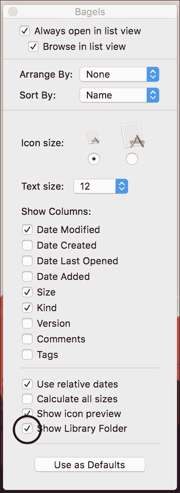
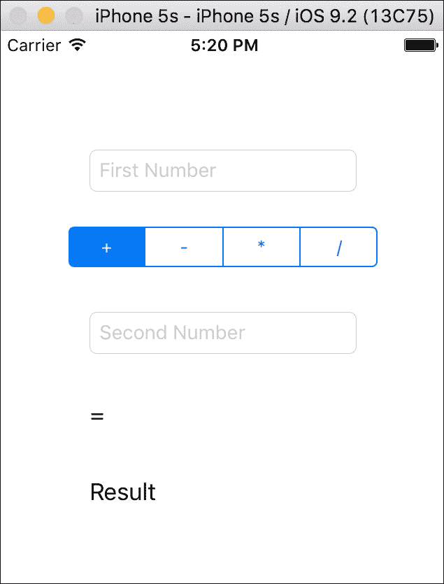
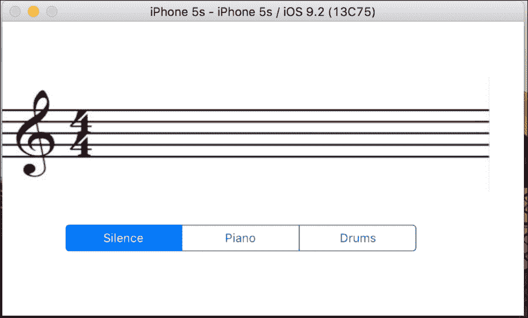
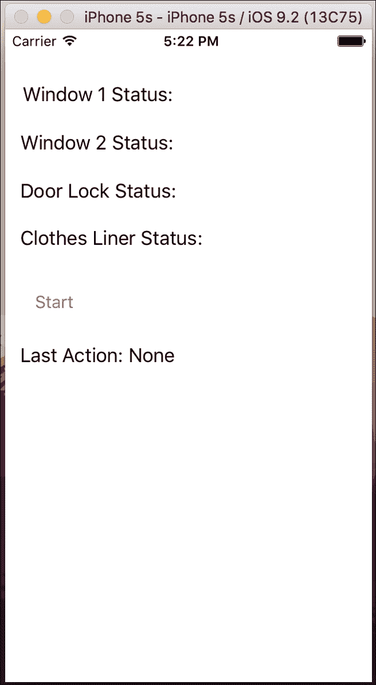
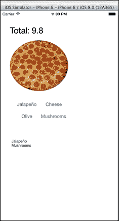

# 第四章. 使用 Swift 的设计模式

在本章中，我们将涵盖以下主题：

+   写入日志文件

+   创建音乐音符的工厂

+   模拟家庭自动化

+   递送一些披萨

+   协议导向编程

# 简介

当面向对象编程被引入时，开发者注意到有一些对象或类是按照相同的哲学编程的。

例如，施乐实验室在 70 年代引入了模型-视图-控制器模式，用于使用 SmallTalk 开发程序。施乐还引入了一些其他模式，但它们并没有被这样称呼。

当 1994 年出版了一本名为《设计模式》的书，作者是四人帮，它为常见的工程问题提供了解决方案。它表明软件开发成本的主要问题是维护；使用设计模式会在软件开发的第一阶段造成高昂的成本，但它会显著降低维护成本。

现在，设计模式如此重要，以至于在面试中谈论它们非常普遍。如果你在 Swift 或 Objective-C 方面有经验，你已经在不知不觉中使用了其中的一些模式。

在本章中，我们将介绍几个设计模式；如果可能的话，我们将查看这些模式在 Swift 中的常见示例。

### 注意

在我们开始之前，我想评论一下，如今设计模式非常值得怀疑；例如，本章“写入日志文件”的食谱中展示的单例模式被一些开发者批评，因为它非常容易实现，这也是一些程序员避免使用这种模式的原因。其他人并不这样认为，他们认为你可以使用它，但只有在正确的时候，正如作者在这篇 URL 中解释的那样：[`www.ibm.com/developerworks/library/co-single/`](http://www.ibm.com/developerworks/library/co-single/)。无论如何，关于这个话题的争论超出了本书的范围。我将向你展示一些模式，然后你可以决定是否使用它们以及何时使用。

我还想评论的另一个细节是，一些示例可能比没有模式的示例看起来更复杂。别忘了设计模式不是基于简单性，而是基于软件维护。

# 写入日志文件

这个食谱是关于一个非常简单但也很常见的模式设计：单例模式。这个模式的想法是只有一个实例的对象。你已经在使用 Swift 或 Objective-C 时使用过这个模式，例如，当你使用 UIDevice 或 UIApplication 时。

对于这个食谱，我们将创建一个对象，它将把日志写入文件。请注意，我们在应用程序代码中的位置无关紧要，我们应该只使用一个对象写入一个单独的文件。

## 准备就绪

由于我们将写入文件，你可能在运行应用程序后想查看其内容。在我们开始之前，让我们检查我们是否能够看到目标文件夹。

如果你使用模拟器，打开 Finder 窗口并转到你的主目录；你可以使用快捷键*command* + *shift* + *H*。如果你看不到名为`Library`的文件夹，你必须按*command* + *J*来显示视图选项。现在，检查**显示库文件夹**选项，如以下截图所示：



当然，如果你还没有运行应用程序，你就不会有这个应用程序，所以在你`viewDidLoad`方法中，粘贴代码`print(NSHomeDirectory())`以了解你的路径，然后你可以跟随它。

### 小贴士

打开应用程序文档文件夹的一个简单方法是打印主目录并复制它。然后，你可以转到**Finder**应用程序，按*command* + *shift* + *G*并粘贴你的路径。

## 如何做到这一点...

让我们创建一个小型计算器并记录用户操作。记住，我们每次使用日志时不需要实例化日志对象；因为它将是一个单例，你可以从任何地方调用它。所以，让我们开始吧。

1.  开始一个名为`Chapter 4 Log File`的项目，并创建一个名为`Log.swift`的文件。这里我们将定义我们的日志类。将以下代码复制到文件中：

    ```swift
    private var myLogInstance:Log = Log()
    class Log {
        private var handle:NSFileHandle

        class func getInstance() -> Log{
                return myLogInstance
        }

        private init(){
            var path:String = NSSearchPathForDirectoriesInDomains(.DocumentDirectory, .UserDomainMask, true)[0] as String
            let fullpath = path.stringByAppendingPathComponent("application.log")
            NSFileManager.defaultManager().createFileAtPath(fullpath, contents: nil, attributes: nil)
            self.handle=NSFileHandle(forWritingAtPath:fullpath)!
        }

        private func getCurrentTime() -> String{
            let date = NSDate()
            let calendar = NSCalendar.currentCalendar()
            let components = calendar.components(.CalendarUnitHour | .CalendarUnitMinute | .CalendarUnitSecond, fromDate: date)
            let hour:Int = components.hour
            let minutes = components.minute
            let seconds = components.second
            return String(format: "%02d:%02d:%02d",hour, minutes, seconds)
        }

        func info(message:String){
          let finalMessage = "INFO: \(self.getCurrentTime()):\(message)\n"
          handle.writeData(finalMessage.dataUsingEncoding (NSUTF8StringEncoding, allowLossyConversion: false)!)
            handle.synchronizeFile()
        }

        func error(message:String){
            let finalMessage = "ERROR:\(self.getCurrentTime()):\(message)\n"
            handle.writeData(message.dataUsingEncoding(NSUTF8StringEncoding, allowLossyConversion: false)!)
        }

        deinit{
            handle.closeFile()
        }
    }
    ```

1.  现在，当然，我们需要完成我们的应用程序以检查我们代码的使用。转到故事板，并添加两个文本字段（每个字段将代表一个数字）、一个表示当前操作符的分段控件、一个显示结果的按钮，以及一个显示结果的标签。你的布局应类似于以下之一：

1.  现在，让我们编写视图控制器。首先，让我们添加一些属性：

    ```swift
    var chosenOperator:Character = "+"
             @IBOutlet var firstNumber: UITextField!
    @IBOutlet var labelResult: UILabel!
    @IBOutlet var secondNumber: UITextField!
    ```

1.  不要忘记将每个图形组件与其属性链接。现在，是我们编写程序方法的时候了；在这种情况下，我们将开发一个保存所选操作符的方法，以及一个显示结果的方法：

    ```swift
    @IBAction func operatorChanged(sender: UISegmentedControl) {
            switch sender.selectedSegmentIndex {
            case 0:
                chosenOperator = "+"
            case 1:
                chosenOperator = "-"
            case 2:
                chosenOperator = "*"
            case 3:
                chosenOperator = "/"
            default:
                Log.getInstance().error("Invalid value \(sender.selectedSegmentIndex)")
                return
            }
            Log.getInstance().info("User has chosen the following operator: \(chosenOperator)")
        }

        @IBAction func displayResult(sender: UIButton)
        {
            var number1:Double?
            var number2:Double?
            number1=(firstNumber.text as NSString).doubleValue
            number2=(secondNumber.text as NSString).doubleValue

            switch chosenOperator{
            case "+":
                labelResult.text = "\(number1! + number2!)"
                Log.getInstance().info("\(number1!) + \(number2!) = \(number1! + number2!)")
            case "-":
                labelResult.text = "\(number1! - number2!)"
                Log.getInstance().info("\(number1!) - \(number2!) = \(number1! + number2!)")
            case "*":
                labelResult.text = "\(number1! * number2!)"
                Log.getInstance().info("\(number1!) * \(number2!) = \(number1! + number2!)")
            case "/":
                if number2! == 0.0 {
                    Log.getInstance().error("Trying to divide by zero")
                    let alert = UIAlertController(title: "Error", message: "Cant divide by zero", preferredStyle:.Alert)
                    self.presentViewController(alert, animated: true, completion: nil)
                }else {
                    labelResult.text = "\(number1!)/\(number2!)"
                    Log.getInstance().info("\(number1!) / \(number2!) = \(number1! + number2!)")
                }
            default:
                break;
            }   
        }
    ```

1.  为了完成我们的应用程序，我们应在应用程序代理上添加一些代码。填充这些事件将在用户打开应用程序、将应用程序置于后台以及返回到应用程序时注册。以下是代码：

    ```swift
    func application(application: UIApplication, didFinishLaunchingWithOptions launchOptions: [NSObject: AnyObject]?) -> Bool {
        print(NSHomeDirectory())
        Log.getInstance().info("Application has started")
        return true
    }
    func applicationDidEnterBackground(application: UIApplication) {
        Log.getInstance().info("Application has gone to background")
    }
    func applicationDidBecomeActive(application: UIApplication) {
        Log.getInstance().info("Application has become active")
    }
    ```

1.  现在，点击播放并测试程序；然后，按住主页按钮并返回到应用程序。完成操作后，前往应用程序文档文件夹，如开头所示，并打开文件`application.log`。请注意，所有操作都记录在同一个文件中；无论是应用程序代理还是视图控制器产生的事件，都没有关系。

## 它是如何工作的...

在这个菜谱中，我们将看到访问控制的介绍。Swift 有三个访问级别：

+   **公共**：在这个级别，对象、属性或全局变量可以从任何地方使用，甚至可以从另一个模块

+   **内部**：在这个级别，相应的实体可以从任何地方访问，除了另一个模块

+   **私有**：在这个级别，实体只能从当前文件访问，即使是同一个模块

如您所见，单例模式的思想是确保一个类只有一个实例。由于类的初始化器是私有的，它不能从任何地方调用，只能从当前文件中的方法或函数中调用。

因此，我们创建了一个名为`getInstance`的方法来访问我们拥有的唯一实例，然后我们可以访问对象方法。请注意，我们必须使用类；如果我们使用结构体，就会破坏只有一个对象的原则。

### 注意

有时，你会看到单例的实现接受 nil 值，例如`private var myLogInstance:Log?`，然后在`getInstance`方法中初始化它，例如：

```swift
if myLogInstance == nil { myLogInstance = Log() } return myLogInstance
```

原因是一些软件架构师认为，你不需要在启动应用程序时实例化每个单例对象，除非你打算使用它。有一些单例对象永远不会被调用，你不应该浪费这些内存。如果你注意到，这个类还有一个析构器。从技术上讲，如果你在 iOS 上运行应用程序，这个方法不会被调用，因为 iOS 应用程序通常不会结束。然而，在特定情况下，应用程序仍然可以结束，你可能会正确地关闭文件句柄。

现在，当我们谈论文件使用时，首先，我们必须知道应用程序文档文件夹的路径，因为这是我们选择写入日志文件的位置。有一个名为`NSSearchPathForDirectoriesInDomains`的函数，它返回请求文件夹的完整路径（实际上，它返回一个路径数组）。在调用此函数后，我们可以使用文件管理器创建文件，并使用`NSFileHandle`打开它。

### 小贴士

不要以这种方式通过连接家目录路径来使用路径：`NSHomeDirectory() + /Documents`。苹果可能会像在 iOS 8 中对捆绑包所做的那样，在未来版本中更改其路径。

如果这个类不是单例，你不会在这里打开这个文件；每次你需要写入消息时，你都会打开和关闭它，因为你必须避免为同一文件打开两个句柄。打开和关闭句柄是一个缓慢的操作；它可能会影响你的应用程序性能。

在高频率写入日志文件的情况下，你必须避免文件写入或打开时的冲突，但如果你有一个单例，这个问题就更容易控制。

要完成这个菜谱，我想评论一下，这个简单的日志系统是基于应用程序中使用的真实日志系统。通常，日志文件会尝试记录日志级别，如 info、error、warning 或 debug，以及时间。有了这些信息，当日志文件变大时，你可以过滤日志，并在应用程序崩溃时找出发生了什么。

## 还有更多…

我们为单例应用程序找到的解决方案是将对象实例保存在全局变量中；对于这种模式来说，理想的做法是将它保存在类变量中，也称为静态属性。Swift 2 引入了对静态属性的支持，所以我们不再需要担心这个问题。

# 创建音乐音符的工厂

使用计算机创作音乐现在是非常常见的。创建允许音乐家创作自己音乐的软件看起来很简单，但实际上并不简单，主要是因为每个音符都有很多可能性。

在这个食谱中，我们将使用 **抽象工厂** 模式。这个模式将允许我们更改我们想要创建的音符类型，并且它也会为我们初始化音符类型。

如你所知，有很多音符符号；如果你想了解更多，可以查看维基百科上的这个链接：[`en.wikipedia.org/wiki/List_of_musical_symbols`](http://en.wikipedia.org/wiki/List_of_musical_symbols)。

然而，对于这个食谱，我们将处理三种类型的音符：鼓的四分音符、钢琴的四分音符和四分休止符。当然，这只是一个例子；在一个真正的程序中，你可能需要完成它，比如添加连音等。

## 准备工作

创建一个名为 `Chapter 4 Musical Notes` 的项目；现在，从互联网上下载与此食谱对应的图片。在这种情况下，我们有这些图片：`staff.png`、`quarter_rest.png`、`cnote.png`、`dnote`、`cdrum.png` 和 `ddrum.png`。

我们还需要为这个食谱准备一些 MP3 声音。下载三个钢琴音符的声音和另外三个鼓点的声音；当然，对于其他音符我们不会有声音。

将下载的图片放入你的 `images.xcassets` 文件夹中。如果你愿意，你也可以添加不同分辨率的相同图片，以便在不同的分辨率设备（iPad 和 iPhone）上使用。

在你开始之前，我们只需要添加一个名为 `AVFoundation` 的框架。这将使我们的应用程序能够播放声音。为此，只需点击项目导航器，然后点击构建阶段。之后，展开 **链接二进制与库** 部分，然后点击加号按钮。选择 **AVFoundation** 并点击 **添加**。

## 如何做到这一点...

1.  如同往常，我们将从模型开始。首先，让我们创建一个音符协议，因为我们知道将来可能会有多种类型的音符，我们应该为此做好准备。因此，创建一个名为 `NoteProtocol.swift` 的新文件，并将以下代码放入其中：

    ```swift
    import Foundation
    import UIKit

    enum NoteStep {
        case NOTE_C,
        NOTE_D,
        NOTE_E
    }
    protocol NoteProtocol {
        var sound:String?{
            get set
        }
        var image:UIImage?{
            get set
        }
        var step: NoteStep {
            get set
        }
        var location:CGPoint {
            get set
        }
        func play()
    }
    ```

1.  下一步是创建这个协议的实现。创建一个名为 `MusicalNote.swift` 的文件，并将以下内容添加到其中：

    ```swift
    import Foundation
    import UIKit
    import AVFoundation

    class MusicalNote: NoteProtocol{
        lazy private var _player = AVAudioPlayer()
        private var _sound:String?
        var sound:String? {
            get { return _sound }
            set(newSound){ self._sound = newSound }
        }

        private var _image:UIImage?
        var image:UIImage?{
            get{ return _image}
            set(newImage){ self._image = newImage }
        }

        private var _step:NoteStep
        var step: NoteStep {
            get{ return _step }
            set(newStep){ self._step = newStep }
        }

        private var _location:CGPoint
        var location:CGPoint {
            get { return _location }
            set(newLocation){ self._location = newLocation }
        }

        func play(){
            if let mySound = _sound {
                var urlSound = NSURL(fileURLWithPath: NSBundle.mainBundle().pathForResource(mySound, ofType: "mp3")!)
                self._player = AVAudioPlayer(contentsOfURL: urlSound, error: nil)
                self._player.prepareToPlay()
                self._player.play()
            }
        }

        init(_ step:NoteStep = .NOTE_C){
            self._location = CGPointZero
            self._step = step
        }
    }
    ```

1.  现在我们已经实现了音符类，请确保这个音符不是针对钢琴或鼓的特定音符；我们只需要根据音符类型和步长以不同的方式构建它。因此，现在我们需要定义一个音符工厂。使用我们之前应用的相同逻辑，我们现在需要创建一个音符协议。

    我们将定义的唯一方法是`createNote`，它需要知道音符步长（C、D 或 E）及其在乐谱上的位置。是时候创建一个名为`AbstractNoteFactory.swift`的新文件，并输入以下代码：

    ```swift
    protocol AbstractNoteFactory {
        func createNote(noteStep:NoteStep, order:Int) -> NoteProtocol
    }
    ```

1.  一旦我们有了音符工厂的定义，我们就可以开始创建我们自己的工厂。让我们从最简单的一个开始：`SilenceFactory`；这个工厂将只创建一种音符，无论其步长如何。在名为`SilenceFactory.swift`的文件中输入以下代码：

    ```swift
    import UIKit
    class SilenceFactory: AbstractNoteFactory {
        func createNote(noteStep:NoteStep, order:Int) -> 
          NoteProtocol{
            var note = MusicalNote(noteStep)
            note.image = UIImage(named: "quarter_rest.png")
            note.sound = nil
            note.step = noteStep
            var x = CGFloat(120) + CGFloat(40 * order)
            note.location = CGPointMake(x, 25)
            return note
        }
    }
    ```

1.  使用这个类，我们将为创建新的静音笔记节省一些步骤。按照相同的逻辑，让我们创建钢琴工厂和鼓工厂。使用以下代码创建钢琴工厂：

    ```swift
    class PianoNoteFactory: AbstractNoteFactory {
        func createNote(noteStep:NoteStep, order:Int) -> NoteProtocol{
            var note = MusicalNote(noteStep)
            note.step = noteStep
            var x:CGFloat = CGFloat(120.0) + CGFloat(40.0) * CGFloat(order)

            switch noteStep {
            case .NOTE_C:
                note.image = UIImage(named: "cnote.png")
                note.location = CGPointMake( CGFloat(x), 57)
                note.sound = "piano_c"
            case .NOTE_D:
                note.image = UIImage(named: "dnote.png")
                note.location = CGPointMake( CGFloat(x), 44)
                note.sound = "piano_d"
            case .NOTE_E:
                note.image = UIImage(named: "dnote.png")
                note.location = CGPointMake( CGFloat(x), 36)
                note.sound = "piano_e"
            }
            return note
        }
    }
    ```

1.  现在，让我们创建鼓工厂：

    ```swift
    class DrumNoteFactory: AbstractNoteFactory {
        func createNote(noteStep:NoteStep, order:Int) -> NoteProtocol{
            var note = MusicalNote(noteStep)
            note.step = noteStep
            var x:CGFloat = CGFloat(120.0) + CGFloat(40.0) * CGFloat(order)

            switch noteStep {
            case .NOTE_C:
                note.image = UIImage(named: "cdrum.png")
                note.location = CGPointMake( CGFloat(x), 57)
                note.sound = "bighit"
            case .NOTE_D:
                note.image = UIImage(named: "ddrum.png")
                note.location = CGPointMake( CGFloat(x), 46)
                note.sound = "cymbal"
            case .NOTE_E:
                note.image = UIImage(named: "ddrum.png")
                note.location = CGPointMake( CGFloat(x), 38)
                note.sound = "hithat"
            }
            return note
        }
    }
    ```

1.  好的，现在是时候创建我们的布局了。对于这个食谱，我们需要添加一个乐谱（图像视图），这是音符将显示的地方，一个分段控制器，它将允许我们选择我们想要的音符工厂，以及一个在我们创建 10 个音符后出现的播放按钮，它将允许我们听到我们的音乐。

1.  在音乐完全创作完成之前，我们不会允许用户播放音乐。因此，播放按钮必须一开始是不可见的。要做到这一点，在故事板上将按钮添加到视图中后，点击它，转到属性检查器，并选择**隐藏**选项。

1.  正如您所知，我们现在必须将分段控制器和按钮与其属性链接。让我们也添加这个应用所需的其他属性：

    ```swift
        @IBOutlet var segmentedControl: UISegmentedControl!
        @IBOutlet var playButton: UIButton!
        @IBOutlet var staff: UIImageView!
        var notes = [NoteProtocol]()
        var factory:AbstractNoteFactory = SilenceFactory()
        var timer:NSTimer?
        var pos = 0
    ```

    ### 笔记

    在这种情况下，我们必须指定工厂类型为`AbstractNoteFactory`；如果不这样做，它将被声明为`SilenceFactory`，并且不允许我们更改工厂类型。

1.  让我们添加在乐谱上点击并添加音符的可能性。为此，我们将在`viewDidLoad`中添加以下代码：

    ```swift
        override func viewDidLoad() {
            super.viewDidLoad()
            let recognizer = UITapGestureRecognizer(target: self, action:Selector("handleTap:"))
            self.view.addGestureRecognizer(recognizer)
        }
    ```

1.  如您所见，每次我们点击屏幕时，我们都需要检查它是否在可以添加笔记的位置。让我们实现这个手势动作：

    ```swift
        func handleTap(recognizer:UITapGestureRecognizer) {
            let point = recognizer.locationInView(staff)
            var noteStep:NoteStep = .NOTE_C
            switch point.y {
            case 105...125:
                noteStep = .NOTE_C
            case 95...105:
                noteStep = .NOTE_D
            case 80...95:
                noteStep = .NOTE_E
            default:
                return
            }
            var note = factory.createNote(noteStep, order: notes.count)
            notes.append(note)
            var imageView = UIImageView(frame: CGRect(origin: note.location, size: note.image!.size))
            imageView.image = note.image
            staff.addSubview(imageView)
            if notes.count == 10 {
                self.segmentedControl.hidden = true
                self.playButton.hidden = false
            }
        }
    ```

1.  如您所见，当我们点击屏幕时，我们只是请求一个新的音符；当前是哪个工厂并不重要。现在，分段控制器将在用户想要时更改当前工厂：

    ```swift
        @IBAction func changeFactory(sender: UISegmentedControl) {
            switch sender.selectedSegmentIndex {
            case 0:
                factory = SilenceFactory()
            case 1:
                factory = PianoNoteFactory()
            case 2:
                factory = DrumNoteFactory()
            default:
                break;
            }
        }
    ```

1.  为了完成这个应用，我们必须为播放按钮创建一个事件。由于我们不会为每个音符按下按钮，我们将初始化计时器，并在半秒后创建一个播放每个音符的方法：

    ```swift
        @IBAction func playMusic(sender: UIButton) {
            playButton.enabled = false
            timer = NSTimer.scheduledTimerWithTimeInterval(0.5, target: self, selector: Selector("playNote"), userInfo: nil, repeats: true)
            timer?.fire()
        }
        func playNote(){
            notes[pos].play()
            pos++
            if pos >= notes.count {
                timer?.invalidate()
                pos = 0
                playButton.enabled = true
            }
        }
    ```

1.  现在，点击播放并创作你的音乐。

## 它是如何工作的…

抽象工厂模式使我们免于在实例化对象后执行许多步骤。作为程序员，我们不需要担心对象需要使用的类，只需要基类；在这种情况下，它创建了一个`NoteProtocol`类型的对象。

由于每个工厂都实现了相同的协议，我们不需要检查当前是哪个工厂。我们还可以创建新的工厂，代码更改也不会痛苦。

## 还有更多…

我们将创建另一个创建型模式，这将允许我们创建智能家居模拟器。

# 模拟智能家居

技术每天都在变得越来越受欢迎；很快我们甚至可以从手机上控制我们的门锁。然而，它是如何工作的呢？想象一下，当你走进客厅时，一个传感器可以检测到有人在，它会打开灯。此外，如果气压计检测到将要下雨，它可以关闭家里的窗户。这里提到的例子是改变状态并通知其他对象这一变化的对象的好样本。对于这种情况，我们将使用模式 **Observer**，也称为 **发布-订阅** 模式。

在这个菜谱中，我们将创建一个只有两个窗户、一个门锁和一个晾衣绳的家居样本。为了简化，应用程序将从文件中读取传感器信息。

当我们收到雷达信息时，可能有人正在接近你的家。在这种情况下，门锁必须上锁，窗户应该关闭，或者当这个人离开时，窗户可以再次打开。此外，当气压计检测到将要下雨时，窗户必须关闭，晾衣绳必须收集衣物。当雨停了，这些机器人可以执行相反的动作。

## 准备工作

让我们创建一个名为 `Chapter 4 Observer` 的新项目。我最初的想法是将动作列表创建到一个文件中，但随着几个动作的完成，这将是足够的；我们将创建一个包含动作的数组。

## 如何做…

1.  首先，让我们创建最简单的模型，在我们的例子中是门锁。基本上，我们在这里需要做的唯一一件事是存储其状态，可以是开启或关闭。因此，创建一个名为 `DoorLock.swift` 的文件，并添加以下代码：

    ```swift
    class DoorLock {
        enum Status {
            case OPENED, CLOSED
        }
        private var _status = Status.OPENED
        var status:Status {
            return _status
        }
        func open(){
            _status = .OPENED
        }
        func close(){
            _status = .CLOSED
        }
    }
    ```

1.  完成前面的代码后，我们可以对晾衣绳做类似的事情，所以将以下代码放入一个新文件 `ClothesLine.swift` 中：

    ```swift
    class ClothesLine {
        enum Status {
            case COLLECTED,
                LINED
        }
        private var _status = Status.LINED
        var status:Status {
            return _status
        }
        func collect(){
            _status = .COLLECTED
        }
        func line(){
            _status = .LINED
        }
    }
    ```

1.  好的，现在我们需要我们的最后一个配件，那就是窗户。在这种情况下，我们必须存储窗户关闭的次数。想象一下，两个人接近我们的房子，其中一个人离开了；我们必须保持窗户关闭，因为还有另一个人仍然靠近我们的房子。因此，创建一个名为 `Window.swift` 的文件，并添加以下代码：

    ```swift
    class Window {
        enum Status {
            case OPENED, CLOSED(times:Int)
        }
        private var _status = Status.OPENED
        var status:Status {
            return _status
        }
        func open(){
            switch _status{
            case .CLOSED(var times):
                times = times - 1
                if times == 0{
                    _status = .OPENED
                }else{
                    _status = .CLOSED(times:times)
                }
            default:
                _status = .OPENED
            }
        }
        func close(){
            switch _status{
            case .CLOSED(var times):
                times = times + 1
                _status = .CLOSED(times:times)
            default:
                _status = .CLOSED(times:1)
            }
        }
    }
    ```

1.  好的，现在是我们创建雷达的时候了。记住，雷达需要存储一些将通知状态变化的对象，所以我们将创建一个嵌套类 `RadarObserver`。开始将这个类添加到一个新文件 `Radar.swift` 中，如下所示：

    ```swift
    class Radar{
        class RadarObserver{
            var onSomeoneAproaches: ()->Void
            var onSomeoneHasGoneAway: () -> Void

            init(){
                self.onSomeoneAproaches = { () -> Void in
                }
                self.onSomeoneHasGoneAway = {() -> Void in
                }
            }
        }
    var observers = [RadarObserver]()
        func addObserver(observer: RadarObserver){
            observers.append(observer)
        }
    ```

1.  这个功能可以添加，因为我们正在创建一个嵌套类；Swift 不允许我们创建嵌套协议。现在，创建存储或删除观察者的方法。在这个菜谱中，我们不会删除任何观察者，但正如我之前告诉你的，总是为未来做好准备。

1.  这个类的最后一部分是改变对象状态的方法：

    ```swift
        func detectedSomeone(){
            for observer in observers {
                observer.onSomeoneAproaches()
            }
        }
        func someoneHasGoneAway(){
            for observer in observers {
                observer.onSomeoneHasGoneAway()
            }
        }
    }
    ```

1.  一旦我们理解了它，我们就可以根据我们在这里使用的哲学创建气压计：

    ```swift
    class Barometer{
        class BarometerObserver{
            var onItsGoingToRain:() -> Void
            var onRainHasFinished:() -> Void

            init() {
                self.onItsGoingToRain = { () -> Void in
                }
                self.onRainHasFinished = { () -> Void in
                }
            }
        }
        private var observers = [BarometerObserver]()
        func addObserver(observer: BarometerObserver){
            observers.append(observer)
        }
        func removeObserver(observer:BarometerObserver){
            var index: Int?
            for (i,object) in observers.enumerate(){
                if object === observer{
                    index = i
                    break
                }
            }
            if let indexFound = index{
                observers.removeAtIndex(indexFound)
            }
        }
        func detectedRain(){
            for observer in observers {
                observer.onItsGoingToRain()
            }
        }

        func detectedNoRain(){
            for observer in observers {
                observer.onRainHasFinished()
            }
        }
    }
    ```

1.  好的，现在我们可以创建我们的显示界面了。在这个菜谱中，我们将添加五个标签，每个标签对应一个配件，还有一个标签用于显示最后执行的动作。我们还需要一个按钮来开始模拟接收雷达和气压计事件。您将看到一个类似于以下视图的界面：

1.  现在，让我们将这些组件与相应的属性链接起来：

    ```swift
        @IBOutlet var labelWindow1: UILabel!
        @IBOutlet var labelWindow2: UILabel!
        @IBOutlet var labelDoorLock: UILabel!
        @IBOutlet var labelClothesLine: UILabel!
        @IBOutlet var labelLastAction: UILabel!
        @IBOutlet var buttonStart: UIButton!
    ```

1.  现在，让我们转到视图控制器，并开始完成属性。在这种情况下，我们需要一个雷达、一个气压计、两个窗户、一个门锁、一个晾衣绳、一个将要执行的动作列表和一个计时器，以便使模拟对眼睛更容易：

    ```swift
        var radar = Radar()
        var barometer = Barometer()
        var window1 = Window()
        var window2 = Window()
        var doorLock = DoorLock()
        var clothesLine = ClothesLine()
        var actions=[String]()
        var timer:NSTimer?
    ```

1.  现在，让我们创建一个私有函数来更新标签。这个函数是一个辅助函数，所以我们不需要在每个观察者动作中重复这段代码：

    ```swift
        private func updateLabels(){
            switch self.window1.status {
            case .CLOSED:
                self.labelWindow1.text = "Window 1 Status: CLOSED"
            default:
                self.labelWindow1.text = "Window 1 Status: OPENED"
            }

            switch self.window2.status {
            case .CLOSED:
                self.labelWindow2.text = "Window 2 Status: CLOSED"
            default:
                self.labelWindow2.text = "Window 2 Status: OPENED"
            }

            switch self.doorLock.status {
            case .CLOSED:
                self.labelDoorLock.text = "Door Lock Status: CLOSED"
            default:
                self.labelDoorLock.text = "Door Lock Status: OPENED"
            }

            switch self.clothesLine.status {
            case .COLLECTED:
                self.labelClothesLine.text = "Clothes Status: LINED"
            default:
                self.labelClothesLine.text = "Clothes Status: COLLECTED"
            }
        }
    ```

1.  接下来，在我们的`viewDidLoad`方法中，我们将添加观察者的代码。以下代码只创建了前两个观察者；您必须按照相同的规则完成它，因为展示所有这些会非常繁琐：

    ```swift
        override func viewDidLoad() {
            super.viewDidLoad()
            var radarObserver = Radar.RadarObserver()
            radarObserver.onSomeoneAproaches = { () -> Void in
                self.window1.close()
                self.updateLabels()
            }

            radarObserver.onSomeoneHasGoneAway = {
                () -> Void in
                self.window1.open()
                self.updateLabels()
            }
            radar.addObserver(radarObserver)

            radarObserver = Radar.RadarObserver()
            radarObserver.onSomeoneAproaches = { () -> Void in
                self.window2.close()
                self.updateLabels()
            }
            radarObserver.onSomeoneHasGoneAway = {
                () -> Void in
                self.window2.open()
                self.updateLabels()
            }
            radar.addObserver(radarObserver)
    }
    …
    ```

1.  现在，我们可以完成创建模拟器，按钮的事件，它将初始化动作和计时器，以及一个将被计时器调用并执行相应动作的函数：

    ```swift
        func tick(){
            var action = actions.first
            actions.removeAtIndex(0)
            if actions.count == 0 {
                buttonStart.enabled = true
                timer?.invalidate()
            }

            if action == "someoneapproches"{
                radar.detectedSomeone()
            }else if action == "someoneleaves"{
                radar.someoneHasGoneAway()
            }else if action == "startrainning" {
                barometer.detectedRain()
            }else if action == "rainfinishes" {
                barometer.detectedNoRain()
            }

            labelLastAction.text = action
        }

        @IBAction func start(sender: AnyObject) {
            buttonStart.enabled = false
            actions = ["someoneapproches","someoneleaves", "someoneapproches","someoneapproches", "startrainning","someoneleaves","someoneleaves", "rainfinishes"]
            timer = NSTimer.scheduledTimerWithTimeInterval(1, target: self, selector: Selector("tick"), userInfo: nil, repeats: true)
            timer!.fire()
        }
    ```

1.  现在完成了！点击播放并观看它的工作。

## 它是如何工作的…

如您所见，观察者的主要目标是执行一个动作，而为了做到这一点，我们使用了闭包。这个 Swift 特性在 Objective-C 中相当于 blocks，在 JavaScript 中相当于函数变量。闭包知道对象是在哪里创建的，即使它被存储在另一个对象中，也能访问其属性。

在我们的菜谱中，当雷达或气压计检测到不同的情况时，它将通知所有订阅了它的观察者。每个观察者都会对相应的配件（窗户、门锁或称为晾衣绳的东西）进行操作。请注意，如果我们想编写传统的对象方法，将需要创建新的类，这些类从同一个观察者继承，并存储它将要使用的属性。这不会是一个糟糕的实现，但使用闭包要容易得多，也更灵活。

如果您是 Martin Fowler 的粉丝，您可能已经注意到这里的一些代码与气压计观察者和雷达观察者非常相似。这就是 Mr. Martin 所说的代码的“味道”，意思是代码不需要在技术上出错，仍然可能很糟糕。

在这种情况下，这将是正确的，但这是一个例子。记住，在现实生活中，雷达可能需要通知您入侵者的位置，气压计需要通知您降水情况，这使得通知者的方法不兼容。

## 还有更多…

我们已经学习了行为模式和创建模式。在下一个菜谱中，我们将使用结构模式，基于新特性创建新的对象类型。

# 送一些披萨

假设您必须创建一个具有边框的新窗口类型；第一个想法是从一个窗口类借用的，创建一个名为 `BorderedWindow` 的新类。您可以用相同的方式处理滚动条；称之为 `ScrolledWindow`。现在，如果我们需要创建一个具有滚动和边框的窗口，我们必须创建一个名为 `ScrolledAndBorderedWindow` 的新类，但想象一下，我们现在需要添加双边框和三边框的窗口，这将有很多组合。

为了防止这类问题，有一个名为 **装饰器** 的模式；这个模式允许我们根据新特性创建新的对象类型。

## 准备工作

创建一个名为 `Chapter 4 Pizzas` 的新项目，并将披萨图片添加到 `Images.xcassets` 中。现在，让我们预热烤箱并准备一些披萨。

## 如何做…

让我们执行这些步骤来送披萨：

1.  首先，让我们创建一个基类，定义披萨，因此创建一个名为 `Pizza.swift` 的新文件，并创建以下类：

    ```swift
    class BasePizza {
        private var _price:Double
        var price:Double {
            get {
                return _price
            }
        }
        var name:String

        init(name:String, price:Double){
            self.name = name
            self._price = price
        }
    }
    ```

1.  如您所见，这个类存储价格和披萨或配料名称。现在，我们可以定义一些披萨及其价格：

    ```swift
    class SimplePizza : BasePizza{
        init() {
            super.init(name: "SimplePizza", price: 4.50)
        }
    }

    class Peperoni: BasePizza{
        init() {
            super.init(name: "Peperoni", price: 7.50)
        }
    }

    class ChickenFiesta:BasePizza {
        init() {
            super.init(name: "ChickenFiesta", price: 7.50)
        }
    }
    ```

1.  创建一个名为 `PizzaDecorators.swift` 的新文件；这是我们创建额外配料的地方。首先，我们需要创建一个定义披萨装饰器的类：

    ```swift
    class BasePizzaDecorator:BasePizza {
        var decoratedPizza:BasePizza?
        init(name:String, price:Double, decoratedPizza:BasePizza){
            self.decoratedPizza = decoratedPizza
            super.init(name: name, price: price)
        }

        override var price:Double {
            get {
                return super.price + decoratedPizza!.price
            }
        }
    }
    ```

1.  现在，让我们添加一些额外配料。在这种情况下，我们将有墨西哥辣椒、奶酪、蘑菇和橄榄：

    ```swift
    class Jalapeño:BasePizzaDecorator {
        init(decoratedPizza:BasePizza){
            super.init(name: "Jalapeño", price: 1.20, decoratedPizza: decoratedPizza)
        }
    }

    class Cheese:BasePizzaDecorator {
        init(decoratedPizza:BasePizza){
            super.init(name: "Cheese", price: 1.30, decoratedPizza: decoratedPizza)
        }
    }

    class Mushroom:BasePizzaDecorator {
        init(decoratedPizza:BasePizza){
            super.init(name: "Mushroom", price: 1.10, decoratedPizza: decoratedPizza)
        }
    }
    class Olive:BasePizzaDecorator {
        init(decoratedPizza:BasePizza){
            super.init(name: "Olive", price: 1.10, decoratedPizza: decoratedPizza)
        }
    }
    ```

1.  好的！完成这个任务后，我们可以创建视图。我们将添加一个标签来显示总数，四个按钮用于添加额外配料，一个文本视图来显示我们已添加到披萨中的配料，以及一个 Image View 来让我们的应用程序更愉快。最后，我们应该有一个类似于这里所示的布局：

1.  现在，我们可以创建视图控制器。让我们从属性开始：

    ```swift
        var myDeliciousPizza: BasePizza?
        @IBOutlet var totalLabel: UILabel!
        @IBOutlet var ingredientsList: UITextView!
    ```

1.  让我们要求用户选择他想要的披萨。在这种情况下，我们需要在 `viewDidAppear` 中做这件事，因为我们将通过操作表来做，这个组件在 `viewDidLoad` 方法中不起作用，因为视图还没有准备好显示操作表：

    ```swift
        override func viewDidAppear(animated: Bool) {
            var choosePizzaType = UIAlertController(title: "Pizza", message: "Choose your pizza", preferredStyle: .ActionSheet)
            choosePizzaType.addAction(UIAlertAction(title: "Simple", style: .Default, handler: { (action) in
                self.myDeliciousPizza = SimplePizza()
                self.refreshPrice()
            }))

            choosePizzaType.addAction(UIAlertAction(title: "Peperoni", style: .Default, handler: { (action) in
                self.myDeliciousPizza = Peperoni()
                self.refreshPrice()
            }))

            choosePizzaType.addAction(UIAlertAction(title: "Chicken Fiesta \u{1F389}", style: .Default, handler: { (action) in
                self.myDeliciousPizza = ChickenFiesta()
                self.refreshPrice()
            }))

            self.presentViewController(choosePizzaType, animated: true){   }
        }
    ```

1.  我们需要创建一个名为 `refreshPrice` 的方法；它就像这样简单：

    ```swift
        func refreshPrice(){
            self.totalLabel.text = "Total: \(myDeliciousPizza!.price)"
        }
    ```

1.  为了完成我们的应用程序，我们必须添加属于按钮的事件；别忘了将它们链接起来：

    ```swift
        @IBAction func addJalapeño(sender: UIButton) {
            myDeliciousPizza = Jalapeño(decoratedPizza: myDeliciousPizza!)
            self.ingredientsList.text = self.ingredientsList.text + "Jalapeño\n"
            self.refreshPrice()
        }

        @IBAction func addCheese(sender: UIButton) {
            myDeliciousPizza = Cheese(decoratedPizza: myDeliciousPizza!)
            self.ingredientsList.text = self.ingredientsList.text + "Cheese\n"
            self.refreshPrice()
        }

        @IBAction func addOlives(sender: UIButton) {
            myDeliciousPizza = Olive(decoratedPizza: myDeliciousPizza!)
            self.ingredientsList.text = self.ingredientsList.text + "Olive\n"
            self.refreshPrice()
        }

        @IBAction func addMushrooms(sender: UIButton) {
            myDeliciousPizza = Mushroom(decoratedPizza: myDeliciousPizza!)
            self.ingredientsList.text = self.ingredientsList.text + "Mushrooms\n"
            self.refreshPrice()
        }
    ```

1.  现在应用程序已经完成，按播放，选择披萨，添加一些配料，享受您的餐点。

## 它是如何工作的…

装饰器模式允许我们根据另一个对象创建新的对象，这对于防止基于特性组合创建无序数量的类非常有用。

## 参见

+   还有更多的模式。你可以在维基百科上查看它们（[`en.wikipedia.org/wiki/Software_design_pattern`](http://en.wikipedia.org/wiki/Software_design_pattern)）。检查哪些最适合你的项目。还有一个名为反模式的功能，它解释了常见的坏做法。在下一章中，我们将学习如何使用 Swift 处理并发代码，这在当今非常常见，尤其是如果你喜欢开发游戏。

# 面向协议编程

在 Swift 的第一个版本中，你可以使用扩展来扩展类、结构和枚举。这是一个非常强大的功能，允许开发者根据应用程序的需求对现有类型进行微调。使用 Swift 2.0，Apple 包含了一个新特性：协议扩展。很容易只把它看作是一个小特性；然而，它具有改变你编写代码方式的力量。Apple 将这种新范式称为面向协议编程。在这个食谱中，我们将学习如何利用这个新特性以及与面向对象编程相比的一些新模式。

## 准备工作

对于这个食谱，创建一个新的游乐场，命名为 `第四章 协议`。我们将只为这个食谱使用游乐场，所以不用担心任何项目设置。

## 如何做…

让我们先添加一些代码：

1.  首先，我们将创建两个协议和一个符合这两个协议的结构体，如下所示：

    ```swift
    protocol Flyable {
           var topSpeed: Int { get }
       }

       protocol Transportable {
           var seatCount: Int { get }
       }

       struct Plane: Flyable, Transportable {
           var topSpeed = 650
           var seatCount = 220
       }
    ```

1.  使用面向对象编程，我们可以在需要时创建一个包含所有属性的单个超类和子类。然而，这将导致超类更加复杂，每个子类都会包含它不需要的属性/功能。通过将 `Flyable` 和 `Transportable` 定义为协议，我们可以让自定义数据类型从多个来源继承，而不是单个超类。现在我们已经有一些基本的协议，是时候真正扩展它们了。让我们扩展 `Flyable` 协议来检查另一个 `Flyable` 对象是否更快。将以下代码添加到你的游乐场中：

    ```swift
    extension Flyable {
        func isFasterThan(item: Flyable) -> Bool {
            return self.topSpeed > item.topSpeed
        }
    }

    let commercialPlane = Plane()
    let jetPlane = Plane(topSpeed: 850, seatCount: 20)

    commercialPlane.isFasterThan(jetPlane)
    ```

    ### 注意

    另一个与协议扩展相关的新特性也很重要：默认行为。如果你查看我们之前的实现，你会注意到我们定义了一个方法而不是声明一个。标准协议要求符合的对象定义每个方法，但使用 Swift 2.0，我们可以提供一个默认实现，这样其他类就不必这样做。

1.  让我们创建另一个扩展，但仅针对也符合 Transportable 协议的类型。将以下代码添加到你的游乐场中：

    ```swift
    extension Flyable where Self: Transportable {
        func containsMorePassengers(item: Self) -> Bool {
            return self.seatCount > item.seatCount
        }
    }

    commercialPlane.containsMorePassengers(jetPlane)
    ```

    带有大写 `S` 的 `Self` 关键字表示符合协议的类或结构体。在这种情况下，它意味着 `Plane` 类。使用这个简单的组合，你可以看到协议扩展对于自定义类型是多么有用。协议扩展的真正力量来自于你扩展 Swift 标准库的能力。让我们看看。

    ### 注意

    使用协议扩展功能与 Swift 标准库一起，我们可以向现有的协议（如`Equatable`和`CollectionType`（数组和解构））添加功能。

1.  让我们给`CollectionType`添加功能，以获取数组中`Flyable`类型对象的平均速度。将以下代码添加到你的 playground 中：

    ```swift
    extension CollectionType where Self.Generator.Element: Flyable {
        func averageTopSpeed() -> Int {
            var total = 0, count = 0
            for item in self {
                total += item.topSpeed
                count++
            }
            return (total/count)
        }
    }

    let planes = [commercialPlane, jetPlane, Plane()]
    planes.averageTopSpeed()
    ```

这个协议扩展定义了`averageTopSpeed`方法。实现相当简单。我们定义了一个计数和总变量，然后遍历集合中的每个项目，并在增加计数的同时将其添加到总和中。我们必须手动增加计数，因为`CollectionType`的计数属性类型与`Int`不同。

## 它是如何工作的…

由于协议提供了更多的灵活性，你可以创建更精细的代码来满足每个应用程序的需求。为了获得最大的功能，利用自定义类型协议扩展以及扩展 Swift 标准库扩展。

注意我们是如何为`Plane`创建一个结构体而不是一个对象的。这突显了面向对象编程中涉及对象引用的一个问题。

想象我们有两个对象：A 和 B。A 创建了一些数据集，然后通过引用将此数据与对象 B 共享。这意味着两个不同的对象正在引用相同的数据对象。B 随后更改了这些数据中的一些。现在，对象 A 可能会发现一些它不知道如何处理的数据变化。这似乎是一个小问题，但可能会在简单应用中引起许多问题。

在 Swift 中，结构体是通过值传递而不是引用传递的。在我们的上一个例子中，对象 A 会复制数据而不是传递其引用，因此每个对象都会有自己的副本，不会干扰其他对象。

## 参见

+   如果你想了解更多或更好地理解为什么你想使用协议扩展和面向协议的编程，请查看 WWDC 2015 的视频，标题为*Swift 中的面向协议编程*([`developer.apple.com/videos/play/wwdc2015-408/`](https://developer.apple.com/videos/play/wwdc2015-408/))
