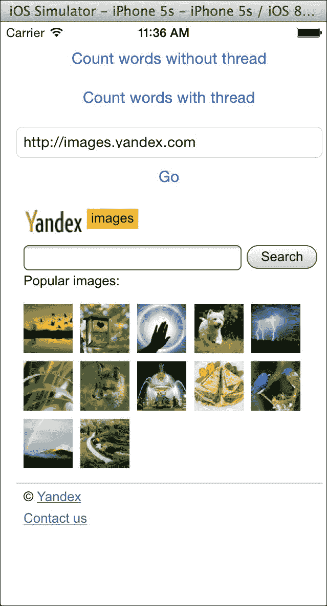

# 第五章. 在你的应用中进行并行处理

在本章中，我们将介绍以下食谱：

+   使用线程进行单词计数

+   创建一个 SEO 应用

+   创建 CycloneChecker 应用

+   检查我们网站的链接

# 简介

现在，并行处理非常普遍，因为一个应用程序可以同时做很多事情。如果我们有一个多核处理器，比如 iPhone 4S 或更新的型号，或者 iPad 2 或更新的型号，你甚至可以提高性能。当然，你不应该为所有事情都使用并行处理，因为不断地从一个任务切换到另一个任务可能会损害性能。

在本章中，我们将学习不同类型的并行处理以及何时应该使用每种类型。首先，我们将从线程开始，然后我们将看到 NSOperations，最后我们将了解如何使用 GCD。

# 使用线程进行单词计数

有时候，如果你不关注并行处理，可能会导致屏幕冻结。作为一个开发者，了解应用程序中发生的事情，我们可以等待，但作为一个对应用程序操作一无所知的用户，他们可能会认为他们的应用已经挂起，需要重新启动。

在这个食谱中，我们将创建另一个线程来防止这种情况。创建线程也可以是一种在不同轨道上划分任务的机制，使得调试更容易。

假设我们需要计算一个文档中的单词数量。我们将有两个按钮，一个将不使用线程来完成这个任务，另一个将使用线程来完成相同的任务。

## 准备工作

在你开始之前，你必须有一个文本文件。你可以使用任何你想要的文本文件，但要得到一个好的结果，你应该有一个很大的文件，比如超过 30K。一个建议是下载任何协议的 RFC。

因此，创建一个名为`Chapter 5 Thread`的新项目，添加一个名为`WordCounter.swift`的文件，然后让我们开始编码。

## 如何做到这一点...

在这个食谱中，我们将首先从互联网上下载一个文件，然后我们将按照以下步骤处理它：

1.  在你的电脑上打开你喜欢的网页浏览器，下载这个文本文件：[`www.ietf.org/rfc/rfc2821.txt`](https://www.ietf.org/rfc/rfc2821.txt)。

1.  将文档拖入你的项目，最好是拖入你的**支持文件**组。

1.  现在，点击`WordCounter.swift`文件，创建一个具有相同名称的类：

    ```swift
    class WordCounter:NSObject {
        private var file:String
        lazy private var _words = [String:Int]()
        var words:[String:Int] {
            return _words
        }
    ```

1.  现在，让我们创建一个初始化器；正如你所见，我们唯一需要初始化的属性是文件属性：

    ```swift
        init(file:String){
        super.init()
            self.file = file
        }
    ```

1.  下一步是编写执行方法。在这里，我们将打开我们的文件并计算单词数量。当然，你可以改进这个方法，但对我们来说现在应该足够了：

    ```swift
        func execute(){
            _words = [String:Int]()

            // First step opening the file
            var manager = NSFileManager.defaultManager()
            var data = manager.contentsAtPath(NSBundle.mainBundle().pathForResource(file, ofType: "txt")!)!
            var content = String(data: data, encoding:NSUTF8StringEnconding)!

            // spliting the documento into words
            var wordsArray = content.componentsSeparatedByString(" ")
            wordsArray = wordsArray.map({ (word) -> String in
                return word.stringByTrimmingCharactersInSet(NSCharacterSet.whitespaceCharacterSet())
            }) .map({ (word) -> String in
                return word.lowercaseString
            }) .filter({(word) -> Bool in
                 if let regex = try? NSRegularExpression(pattern: "\\w+(-\\w+)*", options: .CaseInsensitive) {
                   let matches = regex.matchesInString(word, options: nil, range: NSMakeRange(0, word.characters.count))
        return matches.count > 0
    }

            })

            // computing the results
            for word:String in wordsArray {
                if let tot = _words[word] {
                    _words[word] = tot + 1
                }else{
                    _words[word] = 1
                }
            }
        }
    }
    ```

1.  现在我们已经完成了模型部分，我们可以进行视图和控制器部分。打开你的 Storyboard，添加三个按钮：一个用于不使用线程计算文件单词，另一个用于使用线程，还有一个用于跳转到在文本字段中输入的网站。

    ### 注意

    在 iOS9 中，苹果引入了一个名为**App Transport Security**（**ATP**）的新安全功能。这阻止了所有非安全（HTTPS）URL 请求，包括`UIWebView`。

1.  对于这个菜谱，我们将禁用 ATP；然而，对于任何生产应用程序，建议你遵循适当的 ATS 程序。在你的`info.plist`文件中，添加一个新的键`NSAppTransportSecurity`并将其值设置为`NSAllowsArbitraryLoads`。这将允许所有 URL 无错误地加载。正如你可以想象的那样，你必须添加一个文本字段和一个网页视图。你应该有一个类似于这样的布局：

1.  现在让我们将文本字段和网页视图与相应的属性链接起来。我们还需要创建两个属性来知道我们开始计数单词的时间和完成操作的时间。所以，让我们用以下代码完成我们的视图控制器：

    ```swift
        @IBOutlet var textField: UITextField!
        @IBOutlet var webView: UIWebView!
        lazy private var start = CFAbsoluteTimeGetCurrent()
        lazy private var finish = CFAbsoluteTimeGetCurrent()
    ```

1.  一旦我们完成了这些属性，我们就可以从最简单的方法开始。在这种情况下，这个方法是`go`按钮事件，它在网页视图中加载网页：

    ```swift
        @IBAction func loadWeb(sender: UIButton) {
            let url = NSURL(string: textField.text!)
            let request = NSURLRequest(URL: url!)
            webView.loadRequest(request)
        }
    ```

1.  现在我们必须创建一个方法来调用单词计数器。这个方法应该是两个按钮共有的，无论是使用线程处理的按钮还是不使用线程处理的按钮，所以让我们现在创建一个不受任何按钮限制的方法：

    ```swift
        func countWords(file:String){
            let wordCounter = WordCounter(file: file)
            wordCounter.execute()
            finish = CFAbsoluteTimeGetCurrent()
            print("\(finish-start)")
            var result = ""
            for (total, word) in wordCounter.words.enumerate(){
                result += "\(word) -> \(total)\n"
            }
            UIAlertView(title: "Result", message: result, delegate: nil, cancelButtonTitle: "Ok").show()
        }
    ```

1.  为了完成应用程序，我们必须为每个按钮创建点击事件：

    ```swift
        @IBAction func countWordsWithoutThreads(sender: UIButton) {
            start = CFAbsoluteTimeGetCurrent()
            countWords("rfc2821")
        }

        @IBAction func countWordsWithThreads(sender: UIButton){
            start = CFAbsoluteTimeGetCurrent()
            let thread1 = NSThread(target: self, selector: Selector("countWords:"), object: "rfc2821")
            thread1.start()
        }
    ```

1.  现在是时候测试应用程序了；注意不同的行为。首先，按下处理单词而不使用线程的按钮，然后尝试在文本字段中输入任何内容。直到单词计数器完成，你将无法输入任何内容。一旦操作完成，按下使用线程工作的按钮，并尝试输入一个 URL 并导航。现在你可以在程序处理其他事情的同时进行导航。

## 它是如何工作的…

线程就像程序的轨道；即使你有大量的线程，你仍然共享全局变量或属性，就像我们与`start`属性所做的那样。人们过去常常将线程与性能提升联系起来；这并不完全正确。

如果你有一个 I/O 操作，比如读取文件，或者使用类似蓝牙的传感器，你可以因为处理器可以在 I/O 不发送回复时工作而获得良好的性能。

虽然你可以在使用我们的应用程序的 I/O 时获得性能上的收益，但你可能会因为使用线程而降低性能。为什么？这是因为程序需要浪费时间创建线程并在线程之间切换。

为什么我们在这个应用程序上创建线程时用户体验更好？原因是任何与用户界面相关的操作都是在主线程上完成的。如果你在这个线程上有大型的操作，就像我们处理单词计数一样，它将阻止程序渲染或回答事件，直到你的操作完成。

创建一个新的线程可以在你计数另一个线程上的单词时让应用程序响应用户界面。在这种情况下，我们没有获得或失去性能，但用户得到了更好的可用性。

在这个菜谱中，我们还可以看到正则表达式的使用，这是使一种叫做 Perl 的计算机语言变得非常著名的特性，其他语言如 JavaScript 也将此特性作为其语言的一部分。不幸的是，Swift（至少是这个版本）的情况并非如此。正则表达式对于查找模式和创建一些过滤器非常有用，例如验证电子邮件、产品代码或 URL。

## 还有更多…

不幸的是，`NSThread`并不像`posix`线程函数那样完整，因为我们没有例如`join`方法。如果你的线程函数是一个 C 函数，你仍然可以使用`pthread_create`和`pthread_join`等函数。

在下一个菜谱中，我们将学习关于 NSOperation 的内容，这是苹果推荐的。

# 创建一个 SEO 应用程序

如你所知，如今分析一个网站以在搜索引擎上获得更好的结果是非常常见的。统计网站上的单词是一个常见的任务，以了解搜索引擎如何从我们的网站上检索信息。因为我们已经从之前的菜谱中有了`WordCounter`类，我们将重用它并创建一个新的程序来统计网站的单词。

## 准备工作

首先，检查一些你想要统计单词的网站的 URL。可以是任何网站，但想法是检查使用很多单词的几个 URL。

为了知道任务已完成，我们将显示一个图标，你可以从书籍资源中下载它，或者你可以下载你自己的图标。

一旦你有了你的 URL 列表和你的图标准备就绪，让我们创建一个名为`Chapter 5 SEO`的项目，添加你的图标，然后开始编码。

## 如何做到这一点...

按照以下步骤创建一个 SEO 应用程序：

1.  首先，从其他之前的菜谱中复制`WordCounter.swift`。为此，只需将文件从查找窗口拖到你的项目中。当然，如果这个文件可以位于一个公共目录中会更好。

    ### 小贴士

    当你有可用于其他项目的文件时，将它们存储在公共目录中是个好主意。

1.  现在，点击这个文件，让我们改进这段代码。首先，让我们删除文件属性，因为我们将在初始化器中读取文件内容。其次，让我们创建一个新的字符串属性，称为`content`。

1.  下一步是修改当前的初始化器，只需将打开和读取文件的代码转移到初始化器中。你还需要创建一个新的初始化器，它接收内容而不是文件名。总结一下，现在你的`WordCounter`可能看起来像这样：

    ```swift
    class WordCounter:NSObject {
        lazy private var _words = [String:Int]()
        var words:[String:Int] {
            return _words
        }
        lazy private var content:String = ""

        init(file:String){
            super.init()
            let manager = NSFileManager.defaultManager()
            let data = manager.contentsAtPath(NSBundle.mainBundle().pathForResource(file, ofType: "txt")!)!
            content = NSString(data: data, encoding: NSUTF8StringEncoding) as! String
        }

        init(content:String){
            super.init()
            self.content = content
        }

        func execute(){
            _words = [String:Int]()

            // spliting the document into words
            var wordsArray = content.componentsSeparatedByString(" ")
            wordsArray = wordsArray.map({ (word) -> String in
                return word.stringByTrimmingCharactersInSet(NSCharacterSet.whitespaceCharacterSet())
            }) .map({ (word) -> String in
                return word.lowercaseString
            }) .filter({(word) -> Bool in
                if let regex = try? NSRegularExpression(pattern: "\\w+(-\\w+)*", options: .CaseInsensitive) {
                  let matches = regex.matchesInString(word, options: nil, range: NSMakeRange(0, word.characters.count))
        return matches.count > 0
    }        
    })

            // computing the results
            for word:String in wordsArray {
                if let tot = _words[word] {
                    _words[word] = tot + 1
                }else{
                    _words[word] = 1
                }
            }
        }
    }
    ```

1.  是时候创建应用程序界面了。在这种情况下，我们需要一个文本框让用户输入 URL，一个标签来显示消息，一个按钮来指示用户已完成 URL 的编写，以及一个表格视图，类似于以下截图：

1.  在继承`UITableViewDataSource`和`UITableViewDelegate`之后，将表格视图的数据源和委托与视图控制器链接。如果编译器抱怨一些缺失的函数，不要担心；我们将在稍后实现它们。

1.  现在，前往视图控制器并创建一个辅助结构体。这个结构体会帮助我们了解请求的网站评估是否完成以及结果。因此，在视图控制器类中添加以下代码：

    ```swift
        struct UrlInfo {
            var url:String
            var finished:Bool = false
            lazy var words = [String:Int]()
            init(url:String){
                self.url = url
            }
        }
    ```

1.  下一步是添加一些属性；在这种情况下，我们需要一个文本框来输入 URL，一个表格视图，一个`UrlInfo`数组，以及一个用于我们操作的对列：

    ```swift
    @IBOutlet let urlTextField: UITextField!
    @IBOutlet let urlsTables: UITableView!
    var urls = [UrlInfo]()
    let queue = NSOperationQueue()
    ```

1.  现在我们可以实现按钮事件，所以将按钮与名为`analyze`的方法链接，并编写其代码：

    ```swift
        @IBAction func analyze(sender: UIButton) {
            var url = urlTextField.text.stringByReplacingOccurrencesOfString(" ", withString: "", options: [], range: nil)
            if url == "" {
                return
            }

            let position = self.urls.count
            self.urls.append(UrlInfo(url: url))
            self.urlsTables.reloadData()

            queue.addOperationWithBlock(){
                var data = NSData(contentsOfURL: NSURL(string: url)!)
                var textResponse = NSString(data: data!, encoding: NSASCIIStringEncoding) as! String
                print(textResponse)
                let wordCounter = WordCounter(content: textResponse)
                wordCounter.execute()
                self.urls[position].words = wordCounter.words
                self.urls[position].finished = true

                NSOperationQueue.mainQueue().addOperationWithBlock({
                    self.urlsTables.reloadData()
                })
            }
        }
    ```

    ### 小贴士

    当编写这段代码时，我的 Xcode 已经更新，Swift API 也进行了更新，因此有必要修复其中的一些部分。当你在 Swift 中编码时，请考虑这种类型的变更。

1.  最后一步是实现表格视图的相应部分。首先，让我们标示当前表格视图的单元格数量：

    ```swift
        func tableView(tableView: UITableView, numberOfRowsInSection section: Int) -> Int{
            return urls.count
        }
    ```

1.  接下来，让我们为 URL 创建一个单元格。在这种情况下，当 URL 被计算后，我们将添加一个`OK`图标：

    ```swift
            func tableView(tableView: UITableView, cellForRowAtIndexPath indexPath: NSIndexPath) -> UITableViewCell{
            var cell = urlsTables.dequeueReusableCellWithIdentifier("url") if cell == nil {
              cell = UITableViewCell(style: .Default, reuseIdentifier: "url")
                cell?.textLabel?.text = urls[indexPath.row].url
            }

            if self.urls[indexPath.row].finished {
                cell?.imageView?.image = UIImage(named: "ok.png")
            }else {
                cell?.imageView?.image = nil
            }
            return cell!
        }
    ```

1.  当然，我们还需要在用户从表格视图中选择单元格时显示结果。这个结果只有在 URL 分析完成后才会显示：

    ```swift
        func tableView(tableView: UITableView, didHighlightRowAtIndexPath indexPath: NSIndexPath) {
            if urls[indexPath.row].finished {
                var result = ""
                for (total, word) in urls[indexPath.row].words.enumerate(){
                    result += "\(word) -> \(total)\n"
                }
                UIAlertView(title: "Result", message: result, delegate: nil, cancelButtonTitle: "Ok").show()   
            }
        }
    ```

1.  现在应用已经完成。尝试检查一个 URL 并查看其结果。

## 它是如何工作的…

NSOperation 是建立在**GCD（Grand Central Dispatch）**之上的，这是苹果实现多任务的方式。NSOperation 需要一个队列，这可以是由程序员创建的新队列，或者它可以是现有的一个。

如前所述，你必须考虑到与用户界面相关的操作，例如刷新表格视图内容，必须在主线程上完成。用 NSOperation 的话来说，它应该在主队列上完成。你也可以为那些不需要立即完成的任务创建一个低优先级队列。

关于 NSOperation 相对于线程的一个优点是它更优化于多核设备，这意味着在 Mac 电脑、新 iPhone 和 iPad 上能提供更好的性能。

## 还有更多…

当然，你可以同时使用线程和 NSOperation，但必须小心使用。例如，避免在 OS X 上使用 NSOperation 与 fork。在下一个菜谱中，我们将直接使用 GCD，这可能会给我们更多的灵活性。

# 创建 CycloneChecker 应用

有时候，我们的手机，甚至我们的电脑，能告诉我们天气预报是件好事，尤其是在某种灾害即将来临的时候，比如风暴、地震或飓风。为了做到这一点，应用程序必须持续在互联网上请求天气预报，但它不应该阻塞应用程序的操作。

在这个菜谱中，我们将开发一个每五分钟请求飓风预测的应用程序；如果找到飓风，它将记录用户可以检索有关找到的飓风信息的 URL。如果应用程序在后台运行，它将抛出一个通知。

在这里，我们将使用 **Grand Central Dispatch** 创建一个多任务，这是苹果推荐的方法。

## 准备工作

创建一个名为 `第五章 飓风` 的应用程序，并添加一个名为 `CycloneChecker.swift` 的文件，同时检查您的电脑或设备上是否有互联网连接。

## 如何做到这一点…

按照以下步骤创建 CycloneChecker 应用程序：

1.  首先，我们需要指定这个类（`CycloneChecker`）是 `XMLParserDelegate`，这迫使我们从 `NSObject` 继承：

    ```swift
    class CycloneChecker:NSObject, NSXMLParserDelegate{
    ```

1.  现在添加其属性。我们需要一个常量来表示应用程序将要检查飓风的频率，另一个常量包含应用程序可以检查飓风预测的 URL，一个属性来指示我们正在访问的当前网站，一个队列来添加我们的操作，一个属性来指示对象是否在工作，以及一个闭包，每次我们找到飓风时都会运行：

    ```swift
        private let interval = 300
        private let urls = ["http://www.nhc.noaa.gov/nhc_at1.xml",
        "http://www.nhc.noaa.gov/nhc_at2.xml",
        "http://www.nhc.noaa.gov/nhc_at3.xml",
        "http://www.nhc.noaa.gov/nhc_at4.xml",
        "http://www.nhc.noaa.gov/nhc_at5.xml"]
        private var position = 0
        private let queue = dispatch_queue_create("cyclone.queue",DISPATCH_QUEUE_SERIAL)
        private var started = false
        var action: (String) -> (Void) = {(url) -> Void in
        }
    ```

1.  我们将要实现的第一个两个方法是使对象工作或停止工作的方法：

    ```swift
        func start(){
            started = true
            initQueue()
        }
        func stop(){
            started = false
        }
    ```

1.  如您所见，我们需要一个名为 `initQueue,` 的方法，该方法将任务添加到对象队列中：

    ```swift
        private func initQueue(){
            self.position = 0
            for i in 1...urls.count {
                dispatch_async(queue, { () -> Void in
                  if self.started {
                      print("checking \(self.position)")
                      var xmlParser = NSXMLParser(contentsOfURL: NSURL(string: self.urls[self.position])!)
                      xmlParser?.delegate = self
                      xmlParser?.parse()
                  }
              })
          }
          dispatch_async(queue, { () -> Void in
              if self.started {
                  sleep(UInt32(self.interval))
                  self.initQueue()
              }
          })
      }
    ```

1.  一旦对象找到飓风，它需要通知用户：

    ```swift
        func parser(parser: NSXMLParser, didStartElement elementName: String, namespaceURI: String?, qualifiedName qName: String?, attributes attributeDict: [String : AnyObject]){
            if elementName == "cyclone"{
                self.action(self.urls[self.position])
            }
        }
    ```

1.  为了完成这个类，我们需要标记当前 XML 已被解析；下次，我们将需要解析下一个：

    ```swift
        func parserDidEndDocument(parser: NSXMLParser) {
            position += 1
        }
    ```

1.  飓风检查器已完成；下一步是创建视图，因此点击故事板，添加两个按钮（一个用于开始检查，另一个用于停止检查），一个标签来指示对象状态（运行或停止），以及一个文本框来显示即将到来的飓风文本。

1.  如您所想象，现在我们将编写属性，开始链接我们在故事板中添加的视图，并创建一个 `CycloneChecker` 对象：

    ```swift
        var cycloneChecker = CycloneChecker()
        @IBOutlet var buttonStart: UIButton!
        @IBOutlet var buttonStop: UIButton!
        @IBOutlet var textView: UITextView!
        @IBOutlet var labelStatus: UILabel!
    ```

1.  让我们在 `viewDidLoad` 方法中初始化应用程序，向 `CycloneChecker` 添加一个动作。在这种情况下，我们将将其添加到文本视图，并在应用程序在后台运行时发送用户通知：

    ```swift
        override func viewDidLoad() {
            super.viewDidLoad()
            cycloneChecker.action = {(url) -> Void in
                if UIApplication.sharedApplication().applicationState == .Background   {
                    var localNotification:UILocalNotification = UILocalNotification()
                    localNotification.alertAction = "Cyclone found"
                    localNotification.alertBody = "A cyclone was found. visit \(url) for more information"
                    localNotification.fireDate = NSDate(timeIntervalSinceNow: 10)
                    UIApplication.sharedApplication().scheduleLocalNotification(localNotification)
                }
                dispatch_async(dispatch_get_main_queue(), { () -> Void in
                    self.textView.text = "\(self.textView.text)\nA cyclone was found. visit \(url) for more information"
                })
            }
            self.textView.text = ""
            self.textView.layer.borderWidth = 0.5
        }
    ```

1.  现在我们可以完成视图控制器，添加 `start` 和 `stop` 事件：

    ```swift
        @IBAction func start(sender: AnyObject) {
            cycloneChecker.start()
            labelStatus.text = "Status: started"
            buttonStart.enabled = false
            buttonStop.enabled = true
        }
            @IBAction func stop(sender: AnyObject) {
            cycloneChecker.stop()
            labelStatus.text = "Status: stopped"
            buttonStart.enabled = true
            buttonStop.enabled = false
        }
    ```

1.  为了完成应用程序，您需要在应用程序代理中添加，最好是在 `didFinishLauchingWithOptions` 方法中。使用以下代码来使用通知：

    ```swift
        func application(application: UIApplication, didFinishLaunchingWithOptions launchOptions: [String: AnyObject]?) -> Bool {
            if UIApplication.instancesRespondToSelector(Selector("registerUserNotificationSettings:"))
                {

                application.registerUserNotificationSettings(UIUserNotificationSettings(forTypes: UIUserNotificationType.Sound | UIUserNotificationType.Alert |
                UIUserNotificationType.Badge, categories: nil))
                }
            return true
        }
    ```

1.  最后，你需要测试应用程序，所以按播放按钮检查你附近是否有旋风。希望没有。

    ### 注意

    如果你使用 iOS 8 或更高版本，别忘了允许通知。

1.  一旦应用程序启动，你应该会看到以下截图类似的内容。点击**确定**以允许通知，如图所示：

## 它是如何工作的……

此应用程序使用 Grand Central Dispatch，它将为运行分配的任务创建一个线程和一个队列。因为它创建了一个分离的线程，所以它不会阻塞用户界面，并且因为它不是为每个任务创建一个线程，所以应用程序不会因为线程切换而损失性能。

正如你在创建队列时看到的，我们必须指定我们想要一个串行队列，这意味着任务不会在之前的任务完成之前开始。我们还使用了一个名为 dispatch async 的函数，这意味着调用者不会等待任务完成，因此代码可以与队列任务并发运行。

当然，当我们找到旋风时，我们需要在文本视图中写下这些信息，这是在主线程上必需的，所以这就是为什么我们必须创建另一个任务将其添加到主队列中的原因。

另一个有趣的部分是，添加到我们的队列中的一个任务调用了`sleep`函数。正如你所知，新的队列在分离的线程上执行，下一个任务不会在当前任务完成之前运行，所以使用这个函数是完全可以的。

如果你之前没有在视图控制器上使用过通知，这里有一个示例。别忘了通知只能在 iOS 7 或更高版本上使用，并且在 iOS 8 上，用户必须接受发送通知的权限。

## 还有更多……

我们仍然有两个悬而未决的主题：第一个是使用并发队列，另一个是防止两个任务同时更改相同的对象。这两个主题都将在下一个菜谱中揭晓。

# 检查我们网站的链接

在本章中，我们创建了一个应用程序，可以帮助我们通过检查其单词频率来定位我们的网站，但正如你可能知道的，SEO 不仅仅是关于计数单词，它还涉及到网站链接。

在这个菜谱中，我们将检查网站的链接；在这种情况下，因为我们正在使用网络，所以我们可以并行执行任务。

## 准备工作

创建一个名为`Chapter 5 weblinks`的项目，并添加一个名为`LinkChecker.swift`的文件。检查你的模拟器或设备上是否有互联网连接。

## 如何操作……

一旦你确认你的设备或模拟器有互联网连接，请按照以下步骤创建 Link Checker 应用程序：

1.  在我们开始创建 `LinkChecker` 类之前，我们需要创建一个辅助类，它将存储 `LinkChecker` 类型对象之间的公共信息。这个类将被命名为 `UrlManager`，它需要存储队列、一个用于记录找到的 URL 的文件处理器、一个包含 URL 的数组以及一个表示我们想要的最大链接数量的常量（一些网站有很多链接）：

    ```swift
    private class UrlManager {
        enum UrlAddStatus {
            case OK, FULL, REPEATED, WRONG_URL
        }

        private var _queue = dispatch_queue_create("concurrentqueue", DISPATCH_QUEUE_CONCURRENT)
        var queue:dispatch_queue_t{
            return _queue
        }
        private var fileHandle:NSFileHandle?
        private lazy var _urls = [String]()
        let LIMIT = 10
    ```

1.  现在，让我们创建一些辅助函数来帮助这个对象知道一个 URL 是否应该被存储。其中之一将告诉它我们的列表中是否已经存储了该 URL，另一个将告诉我们列表是否已满，第三个将检查 URL 是否有效，最后一个将记录 URL 到文件中：

    ```swift
        func contains(url:String) -> Bool{
            objc_sync_enter(self._urls)
            for u in self._urls {
                if u == url {
                    objc_sync_exit(self._urls)
                    return true
                }
            }
            objc_sync_exit(self._urls)
            return false
        }

        var full:Bool {
            return self._urls.count >= self.LIMIT
        }

        private func validUrl(url:String) -> Bool{
            var error:NSError?
            var regex = NSRegularExpression(pattern:"^(https?:\\/\\/)?([\\da-z\\.-]+)\\.([a-z\\.]{2,6})([\\/\\w \\.-]*)*\\/?$", options: .CaseInsensitive, error: &error)
            let matches = regex?.matchesInString(url, options: nil, range: NSMakeRange(0, count(url)))
            return matches?.count > 0
        }

        private func writeMessage(message:String){
            objc_sync_enter(self.fileHandle)
            self.fileHandle?.writeData(message.dataUsingEncoding(NSUTF8StringEncoding, allowLossyConversion: false)!)
            objc_sync_exit(self.fileHandle)
        }
    ```

1.  现在，让我们编写初始化器；在这种情况下，我们只需要打开日志文件：

    ```swift
        init(){
            var path:String = NSSearchPathForDirectoriesInDomains(.DocumentDirectory, .UserDomainMask, true)[0] as! String
            let fullpath = (path as NSString).stringByAppendingPathComponent("application.log")
            NSFileManager.defaultManager().createFileAtPath(fullpath, contents: nil, attributes: nil)
            self.fileHandle=NSFileHandle(forWritingAtPath:fullpath)!
        }
    ```

1.  为了完成这个类，我们必须创建主方法，即 `addUrl`。这个函数将返回是否能够添加 URL：

    ```swift
        func addUrl(url:String) -> UrlAddStatus {
            if full {
                // WRITE FULL
                self.writeMessage("Couldn't store the url \(url). Buffer is full")
                return .FULL
            }
            if self.contains(url){
                self.writeMessage("Couldn't store the url \(url). Already on buffer")
                return .REPEATED
            }
            if !self.validUrl(url) {
                self.writeMessage("Couldn't store the url \(url). Invalid url")
                return .WRONG_URL
            }
            objc_sync_enter(self._urls)
            self._urls.append(url)
            objc_sync_exit(self._urls)
            self.writeMessage("Url \(url) successfully stored")
            return .OK
        }   
    } // Class end
    ```

1.  在同一个文件中，我们将创建一个名为 `LinkChecker` 的类。为了做到这一点，我们再次将使用 `XMLParser`。

    ### 小贴士

    在这个菜谱中，我们使用 `XMLParser` 是因为它建立在 Swift 标准库之上，但如果你想要一个更好的 HTML 解析器，你可以在互联网上搜索一个特定的库，例如 NDHpple，[`github.com/ndavidsson/NDHpple/`](https://github.com/ndavidsson/NDHpple/)。

1.  让我们从属性开始。对于这个类的实现，我们需要一个 `NSXMlParser`，一个 `UrlManager`，以及一个闭包，每次我们找到 URL 时都会执行：

    ```swift
    class LinkChecker:NSObject, NSXMLParserDelegate {
        private var xmlParser:NSXMLParser
        private var urlManager:UrlManager
        var foundAction: (String) -> (Void) = {
            (url) -> Void in
        }
    ```

1.  下一步是创建初始化器。在这种情况下，我们将开发两个初始化器。第一个是从外部（视图控制器）调用的那个，另一个是由同一个 `LinkChecker` 创建的，它接收作为参数的同一个 `UrlManager`，这就是为什么它是一个私有初始化器的原因：

    ```swift
        init(url:String) {
            self.xmlParser = NSXMLParser(contentsOfURL: NSURL(string: url)!)!
            self.urlManager = UrlManager()
            super.init()
            self.xmlParser.delegate = self
            self.urlManager.addUrl(url)
        }

        private init(url:String, urlManager:UrlManager) {
            self.xmlParser = NSXMLParser(contentsOfURL: NSURL(string: url)!)!
            self.urlManager = urlManager
            super.init()
            self.xmlParser.delegate = self
        }
    ```

1.  下一个函数是 `start` 方法，它将创建第一个任务：

    ```swift
        func start(){
            dispatch_async(urlManager.queue, { () -> Void in
                self.xmlParser.parse()
                return
            })
        }
    ```

1.  这个 `LinkChecker` 类的最后一个方法是 `NSXMLParserDelegate` 协议的解析函数。在这里，我们将检查是否找到了一个由 `a` HTML 标签表示的链接：

    ```swift
        func parser(parser: NSXMLParser, didStartElement elementName: String, namespaceURI: String?, qualifiedName qName: String?, attributes attributeDict: [NSObject : AnyObject]){
            if elementName.lowercaseString == "a" {
                let href = "href"
                var newUrl = attributeDict["href"] as! String
                if let  range = newUrl.rangeOfString("#", options: .CaseInsensitiveSearch, range: nil, locale: nil){
                    newUrl = newUrl.substringToIndex(range.startIndex)
                }

                print("found link \(newUrl)")
                if self.urlManager.addUrl(attributeDict[href] as! String) == .OK {
                    self.foundAction(attributeDict[href] as! String)
                    dispatch_async(urlManager.queue, { () -> Void in
                        self.xmlParser.parse()
                        return
                    })
                }
            }
        }
    } // class end
    ```

1.  现在，点击 storyboard 并创建一个带有文本字段来写入 URL、一个用于开始分析它的按钮以及一个用于显示结果的表格视图的屏幕。

1.  现在，从 `UIViewController` 继承 `UITableViewDataSource` 并添加文本字段、`tableview`、一个用于存储 URL 的字符串数组和一个 `LinkChecker` 作为属性：

    ```swift
    class ViewController: UIViewController, UITableViewDataSource {

        @IBOutlet let urlTextField: UITextField!
        @IBOutlet let tableView: UITableView!
        private var _urls = [String]()
        private var linkChecker:LinkChecker?
    ```

1.  一旦完成，我们可以在按钮上添加一个事件来开始分析 URL：

    ```swift
        @IBAction func analyze(sender: UIButton) {
            linkChecker = LinkChecker(url:self.urlTextField.text)
            self.linkChecker?.foundAction = {
                (url) -> Void in
                self._urls.append(url)
                dispatch_async(dispatch_get_main_queue(),
                    {() -> Void in
                        self.tableView.reloadData()
                })
            }
            linkChecker?.start()
            self.urlTextField.resignFirstResponder()
        }
    ```

1.  为了完成这个类，让我们实现 `tableview` 方法，这些方法将显示 `_urls` 属性的内容：

    ```swift
        func tableView(tableView: UITableView, numberOfRowsInSection section: Int) -> Int{
            return self._urls.count
        }

        func tableView(tableView: UITableView, cellForRowAtIndexPath indexPath: NSIndexPath) -> UITableViewCell{
            var cell = self.tableView.dequeueReusableCellWithIdentifier(_urls[indexPath.row]) as? UITableViewCell

            if cell == nil {
                cell = UITableViewCell(style: .Default, reuseIdentifier: _urls[indexPath.row])
                cell?.textLabel?.text = _urls[indexPath.row]
            }
            return cell!
        }
    ```

1.  现在应用程序已经完成，测试你的网站并看看你能从中获得多少链接。你应该看到类似以下的结果：

## 它是如何工作的…

从网络上请求某些东西将需要时间。然而，在此期间，应用程序可以处理下一个任务，因此在这种情况下，我们需要创建一个并发队列而不是串行队列。

考虑到这一点，我们在处理一些变量时必须小心，主要是因为当应用程序尚未完成对一个变量的处理时，它可以从一个任务切换到另一个任务。为了防止任务重叠相同的属性或变量，我们应该使用`objc_sync_enter`和`objc_sync_exit`来控制它。

### 注意

不幸的是，Swift 还没有某种互斥锁，因此它需要使用 Objective-C 的`@synchronize`，这也是这些函数前缀的原因。

## 还有更多...

正如你所见，有时与并发任务一起工作很困难，开发者需要考虑很多细节；修复问题也可能非常困难，因为有时很难重现它。

在下一章中，我们将学习如何在不需要运行整个应用程序的情况下测试我们的代码。
