# 第六章。使用 playground

在本章中，我们将介绍以下食谱：

+   创建第一个 playground

+   观看一些图形

+   观察颜色变化下的温度

+   调整图像大小

+   使用 pangrams 美化你的文本

+   接收 JSON

+   创建我们自己的类表示

+   丰富的文档

+   在 playground 中导航页面

# 简介

如果你曾经使用过 Python、Perl、Ruby 或 JavaScript 等解释型语言进行编程，你可能已经注意到这些语言与 C、Objective-C 或 C++ 等本地语言相比的一个优势是，可以在不添加额外代码到项目的情况下测试代码。

有时候开发者需要在将代码添加到项目之前对其进行测试，尤其是在学习 Swift 的工作方式时。即使你对 Swift 非常熟悉，也可能会遇到新的想法，你可能在将它们编码到项目中之前需要检查这些想法是否有效。

对于之前提到的情况，苹果推出了 playground，这是一个你可以在这里玩转代码、测试代码、可视化代码，并在将其添加到应用程序之前对代码做出决定的地方。

很令人印象深刻的是，Swift 是一种编译型语言，但你可以在 playground 中边编写边测试你的代码，就像在使用解释型语言一样，可以实时查看结果。

# 创建第一个 playground

在这个食谱中，你将熟悉**Xcode playground**，在这里你将学习这个 Xcode 功能的一些基础知识，然后你将能够使用这个新朋友测试你自己的代码。

## 准备中

打开你的 Xcode，但这次，你不需要创建一个新的项目，而是选择**使用 playground 开始**：

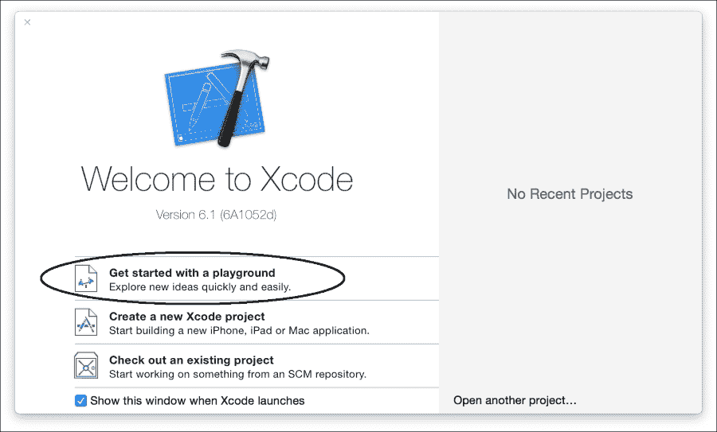

完成后，你会看到下一个对话框非常简单，只会询问项目名称和平台（iOS、Mac OS 或 tvOS）。命名为 `Chapter 6 First Playground` 并选择 **iOS**：


然后你会看到著名的对话框，询问你将应用程序存储在哪里。选择你想要的文件夹。如果有疑问，请选择文档文件夹。

在我们开始使用 playground 之前，打开保存项目的文件夹对应的**Finder**窗口，右键单击（或按住控制键单击）你的 playground 项目，并选择**显示包内容**。

现在你可以看到那里有三个文件：`contents.xcplayground`、`results.playgrounddata`和`section-1.swift`。现在你可以想象这些文件的作用，但我想要强调的是，随着 playground 的增长，文件的数量也会增加。记住，playground 有自己的包，你可以在其中添加图片和其他内容。

## 如何做到这一点...

按照以下步骤创建第一个 playground：

1.  回到你的 Xcode，看看你的游乐场。它开始导入 UIKit 和一个字符串变量，该变量显示**Hello, playground**。你还可以在右侧看到这个变量的结果。

1.  让我们开始定义另一个变量，称为`name`，在`str`变量之前，并将`str`变量更改为具有插值，就像以下代码：

    ```swift
    var name = "Cecil Costa"
    var str = "Hello, \(name)"
    ```

    现在你将看到在你的右侧你有处理过的两个变量：

    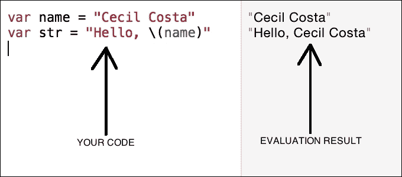

1.  一旦你理解了这一点，让我们用`if`语句来完成这个代码，所以在之前的代码之后，添加一个像这样的`if`语句：

    ```swift
    var myCity = "Cambridge"
    var yourCity = "New York"

    if myCity == yourCity {
        print("We live in the same city")
    }else {
        print("We live in different cities")
    }
    ```

1.  编写代码后，确保你有一个语句的结果，但没有另一个语句的结果：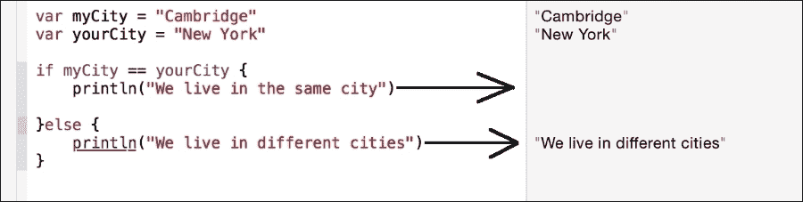

1.  是时候尝试一个循环了，让我们计算，例如，著名的斐波那契函数：

    ```swift
    var fib_n = 1
    var fib_n_1 = 1

    for i in 3...10 {
        var sum = fib_n + fib_n_1
        fib_n_1 = fib_n
        fib_n = sum
    }

    fib_n
    ```

    现在，你可以以不同的方式欣赏结果，而不是显示变量的值，你可以看到指令被执行的次数。如果你将鼠标指针移到每个指令的结果上，你会看到出现两个小图标。

1.  第一个，就像一只眼睛，是用来观察变量结果表示的，另一个是用来时间线的，它显示了每次循环迭代中分配给变量的值。我们将在后面的食谱“观看一些图形”和“使用 Pangrams 美化你的文本”中讨论这一点：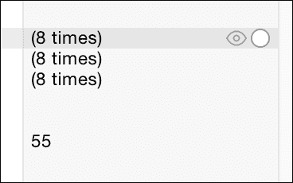

    我们在代码末尾单独写下变量`fib_n`的原因是因为这是你可以可视化变量最终值的方式，在这种情况下，我们可以看到代码的结果是**55**。

1.  现在我们可以将这段代码与等效的递归函数进行比较，然后我们可以决定在应用程序中使用哪种代码：

    ```swift
    func fib (n:Int) -> Int{
        if n == 1 || n == 2  {
            return 1
        }
        return fib(n-1) + fib(n-2)
    }

    fib(10)
    ```

1.  编写代码后，你可以检查两个重要的信息点；第一个是结果，与之前的代码相同。第二个是函数被调用的次数，正如你所见，在这个例子中，递归函数调用了 54 次，而交互式函数调用了 8 次。

## 它是如何工作的……

如你所见，每次你编写代码，它都会被重新编译和执行；优势是它给你关于代码的信息，你可以用它来比较不同的代码，还可以检查你心中的想法是否适合你的应用程序。

## 还有更多……

现在你已经对如何使用游乐场有了基本的了解。接下来我们要学习的是如何以图形方式可视化和跟踪信息及其进展。

# 观看一些图形

知道循环迭代 8 次而不是 54 次是可以的。这能给你一个好的选择最佳算法的思路，但有时我们需要在循环迭代过程中可视化变量的值。对于这种情况，苹果公司创建了时间线。

## 准备工作

您可以打开您的 Xcode 并点击**开始使用游乐场**，或者如果您已经打开了 Xcode，您可以点击文件菜单，然后点击**新建**选项，然后点击**游乐场**。

将您的项目命名为`第六章时间线`并将其保存在您的项目文件夹中。

## 如何操作…

1.  首先，让我们编写一段代码来打印一些输出，在这种情况下，我们将打印一个由星号组成的三角形：

    ```swift
    for i in 1...5 {
        for j in 1...i {
            print("*")
        }
        print()
    }
    ```

1.  一旦您输入了这段代码，您可能还不会欣赏到三角形。转到看起来像两个重叠圆圈的图标并点击它：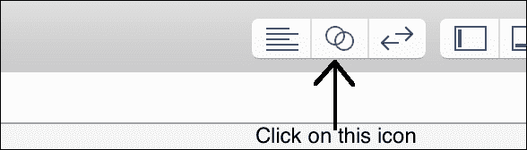

1.  看看 Xcode 如何分成两部分。右侧的新部分被称为时间线。现在您应该看到控制台输出，它应该类似于以下截图：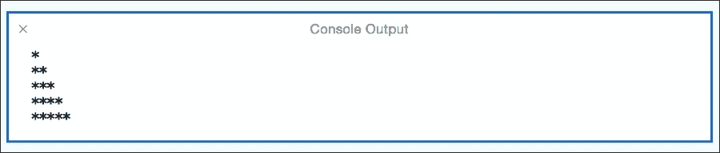

    ### 小贴士

    如果出于任何原因您关闭了控制台输出，您可以通过重新运行您的代码来重新打开它。

1.  现在，让我们看看变量的值；在这种情况下，我们没有很多选项，所以我们将检查`j`变量的值。要做到这一点，只需在打印指令后输入`j`，如下面的代码所示：

    ```swift
        for j in 1...i {
            print("*")
     j // ← Yes, only the letter "j"
        }
    ```

1.  现在点击与`j`变量同一级别的圆形图标：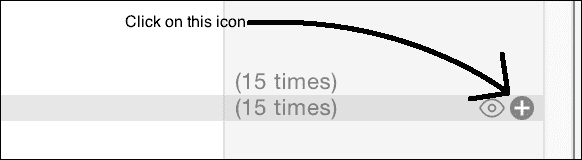

1.  现在，您可以在以下图形中看到`j`的值，根据迭代进行变化：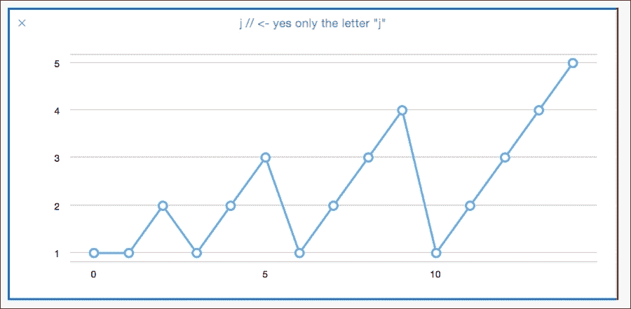

1.  如果您想更清楚地看到变量的值，您可以滑动位于 Xcode 屏幕底部的红色条：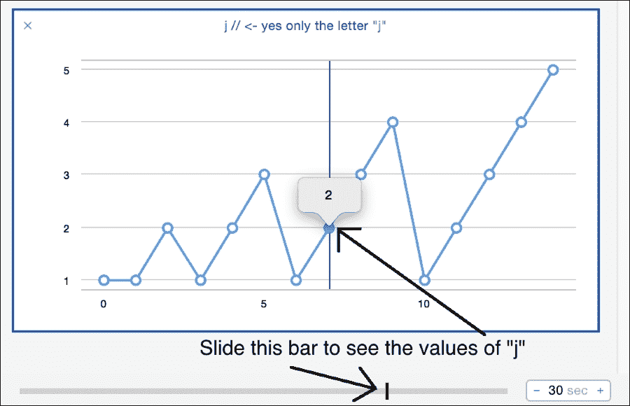

1.  如果出于任何原因您有很多图表，您可以关闭它们以节省空间，但如果您想保留一些图表，您可以双击它们的标题来折叠它们，当然您也可以通过再次双击来展开它们：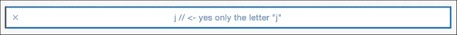

    如您所见，在这种情况下，您只有标题**j // <- 只是有字母"j"**而不是整个图表。

## 工作原理…

时间线有三个不同的编辑器：标准编辑器，它为我们提供了更多的空间来编写和查看我们的代码流程；辅助编辑器，它为我们提供了更多关于我们的代码执行的信息，以及版本编辑器，它显示了我们的游乐场所做的修改。

辅助编辑器为我们提供了关于变量演变及其值的更多准确性。使用图表有助于我们了解变量值是如何变化的。

控制台输出也很重要；请注意，如果您只尝试可视化打印指令，您将看到很多星号，每个星号都在不同的行上。这类信息对开发者来说并不有用。

## 更多内容…

游乐场不仅限于显示图形；您还可以添加一些颜色。在下一个菜谱中，您将在您的游乐场中处理颜色。

# 用颜色观察温度

当施乐工程师基于 Smalltalk 创建窗口系统时，他们为计算机世界带来了一个重大概念，即在数字设备（计算机）上的模拟表示（思想）。

这意味着对于我们人类来说，通过观察进度条而不是屏幕上的百分比来了解一个过程将花费多长时间更容易理解。这里我们将观察一些颜色而不是数字。

在这个菜谱中，我们将观察温度的颜色而不是观察它的值；这样你可以更好地了解寒冷。

## 准备工作

打开你的 Xcode，创建一个新的 playground，命名为`第六章 颜色`，移除`str`字符串但保留 UIKit 导入。

## 如何做…

1.  首先，让我们创建一个包含温度的数组，在这种情况下，温度是以摄氏度来衡量的：

    ```swift
    var temperatures = [15, 8, 3, -1, 2, 3, 3, 9, 14, 18, 23, 27, 30, 34, 20, 30, 35, 39, 41]
    ```

1.  下一步是遍历数组。对于每次迭代，我们将结果存储到一个名为 color 的变量中：

    ```swift
    for temp in temperatures {
        var color:UIColor
        if temp <= 0 {
            color = UIColor(red: 0.0, green: 0.0, blue: 1.0, alpha: 1.0)
        } else if temp >= 40 {
            color = UIColor(red: 1.0, green: 0.0, blue: 0.0, alpha: 1.0)
        }else {
            var proportional = CGFloat(temp) / CGFloat(40)
            color = UIColor(red: proportional, green: 0, blue: CGFloat(1) - proportional, alpha: 1.0)
        }
        color // Temperature representation
    }
    ```

1.  现在你必须将上一个循环句子中的颜色变量添加到时间线中；你可以看到以下类似的结果：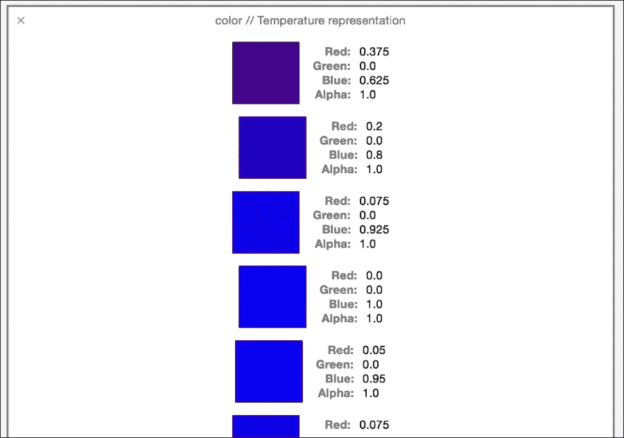

## 它是如何工作的…

时间线不仅关乎显示数字，还关乎提供信息，让我们能更好地理解代码。观察像 13 摄氏度这样的数字并不能很好地让我们了解温度，但观察颜色可以更好地告诉我们它是冷还是热，尤其是如果你使用华氏值的话。

如你所知，你的电脑屏幕使用三种原色：红色、绿色和蓝色。UIColor 还有一个第四个因素，即 alpha 因素，零表示透明，一表示不透明。

在这个菜谱中，我们始终将 alpha 设为 1，绿色设为 0，但对于寒冷的日子，我们假设我们需要高水平的蓝色和低水平的红色。对于温暖的日子，我们必须创建一个红色水平高、蓝色水平低的颜色。这意味着非常蓝色的颜色表示温度非常低，而非常红色的颜色表示温度非常高。

那中间的温度怎么办？在这种情况下，我们将有一个紫色，这是由 50%红色和 50%蓝色混合而成的颜色。

看看这种度量在 playground 中比在应用程序中使用更有用。大概在真实的应用程序中，你不会存储颜色，你会存储实际的温度，但在编码之前，你可以了解你拥有的值是否满意。

## 更多…

在这种情况下，我们使用了颜色来更好地了解我们的值，但我们还能用什么呢？在下一个菜谱中，你将学习如何使用图片。

# 展开图片

有时候，需要多个图片样本才能看到哪个比例是我们想要的。让我们想象一下，我们有一个消息，但我们不想展示给用户，我们只想让他知道有东西，应用程序稍后会显示正确的比例。

对于这种情况，你可以使用`UIImage`和`ImageView`，并在 playground 中可视化它。

## 准备工作

创建一个名为 `Chapter 6 Stretching Image` 的新游乐场，并且为这个食谱准备一张图片，我建议下载图片 `secret_message.png`，它包含在这本书的资源文件中。

## 如何操作…

1.  关闭 Xcode 并打开一个 **Finder** 窗口，转到你保存游乐场的文件夹，点击你创建的项目，然后右键（或按住控制键点击）它。在菜单中，选择我们在这章开头学到的 **Show Package Contents** 选项：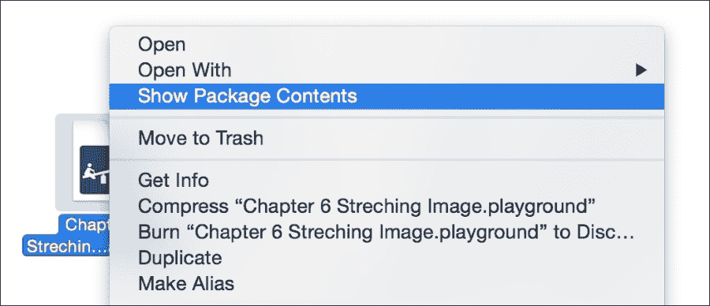

1.  现在，创建一个名为 `Resources` 的文件夹，并将你的图片文件复制进去。之后，重新打开你的游乐场。

1.  删除 `str` 变量，因为我们不会使用它。让我们创建一个新的类，其中包含 `ImageView`，其大小以及 `ImageView` 被拉伸的次数：

    ```swift
    class ImageStretcher{
        var imageView:UIImageView
        var times = 0
        var currentFrame:CGRect
        init(){
            let image = UIImage(named: "secret_message")!
            imageView = UIImageView(image: image)
            currentFrame = imageView.frame
        }

        func stretch(){
            currentFrame.size.height *=  CGFloat(1.1)
            currentFrame.size.width *=  CGFloat(0.9)
            imageView.frame = currentFrame
            times++
        }
    }
    ```

1.  一旦你编写了代码，我们需要创建这个类型的对象，所以请将以下内容添加到你的游乐场中：

    ```swift
    let imageStretcher = ImageStretcher()
    ```

1.  好的，现在你有一个对象了，但图片仍然是原始大小。如果你调用 `stretch` 方法，你会看到图片只被拉伸一次，所以让我们重复这个过程，以便更好地了解我们应该将图片拉伸多少：

    ```swift
    for i in 1...15 {
       imageStretcher.stretch()
    }
    ```

1.  为了可视化不同的结果，你可以点击值历史图标，然后你可以看到很多示例。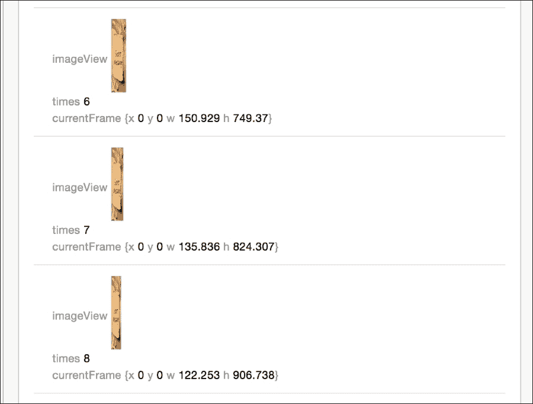

1.  为了更好地了解 `ImageView`，你可以点击样本行的右侧，那里有一个眼睛图标。例如，点击数字 **10**，看看你得到了什么：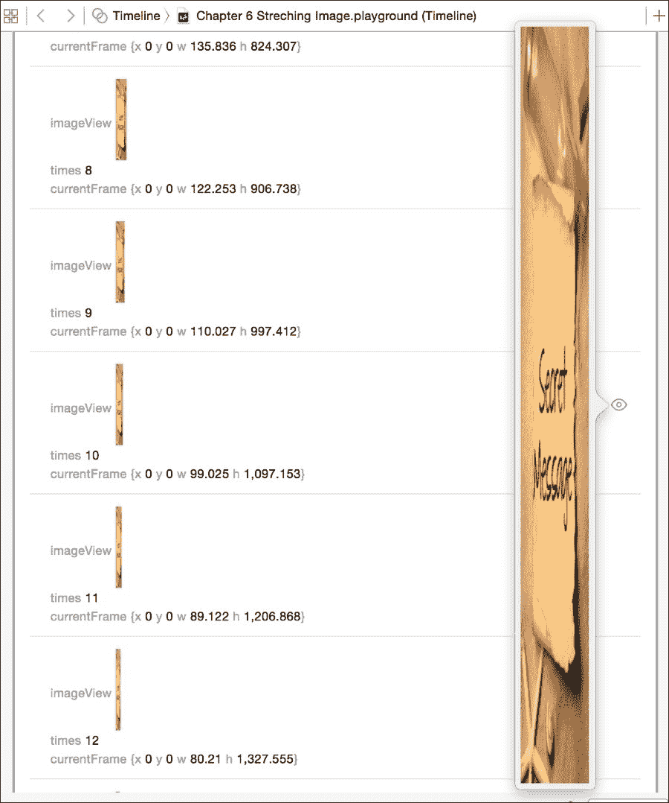

## 它是如何工作的…

视图可以在游乐场中使用；例如，你可以预先可视化你的 `UIImageView`、`UILabel`、`UITextField` 等将如何绘制。在这种情况下，我们不得不重复几次；这意味着只有 `ImageView` 不会给我们完整的信息。

最好的方法是创建我们自己的类，并存储我们需要的所有信息，例如我们拉伸 `ImageView` 的次数以及 `ImageView` 的当前大小。

在结果的右侧，正如你所看到的，有一个小眼睛图标（快速查看），它将显示视图在那个时刻的状态。

### 注意

当你想在图片上使用过滤器（如隐藏秘密信息）时，通常会使用一个名为 **CoreImage** 的框架，不幸的是，这个框架目前还不能与游乐场一起使用。

## 还有更多…

如果你需要将信息存储在你的游乐场中，你可能想打印出常量 `XCPSharedDataDirectoryPath`。它将显示游乐场存储这些信息的位置。

有时候我们可能想隐藏信息，有时候我们可能想让它更容易阅读。在下一个食谱中，我们将学习如何使用不同的字体预先可视化文本。

# 使用 Pangrams 美化你的文本

你有没有见过这样的短语“The quick brown fox jumps over the lazy dog”？为什么它这么有名？原因是它是一个英语 Pangram；这意味着一个包含字母表中每个字母的短语。

Pangrams 在你想要可视化字体属性时很有用，比如大小、颜色或粗体。在这个菜谱中，我们将使用`NSAttributedString`和游乐场来检查不同的字体。

## 准备工作

创建一个新的游乐场，命名为`第六章 文本`，并移除默认出现的字符串。

## 如何做到这一点…

1.  首先，让我们创建我们的属性字符串：

    ```swift
    let string = NSMutableAttributedString(string: "The quick brown fox jumps over the lazy dog")
    ```

1.  之后你将看到一个带有字母**a**的新图标出现。这意味着游乐场已经将其识别为属性字符串。点击快速查看图标，你会看到当前字符串及其属性：

1.  现在让我们为我们的文本选择一些字体大小和颜色：

    ```swift
    let fontSizes = [CGFloat(14.0), CGFloat(18.0), CGFloat(24.0)]
    let colors = [UIColor.blackColor(), UIColor.blueColor(), UIColor.redColor()]
    ```

1.  由于我们还想选择一些不同的字体，我们需要创建另一个数组；然而，它不能是一个简单的字符串数组，因为我们将要调用不同的方法。所以我们需要创建一个闭包数组：

    ```swift
    let fontSelectors = [
        {(size: CGFloat) -> Void in
            string.addAttribute(NSFontAttributeName , value: UIFont.systemFontOfSize(size), range: NSMakeRange(0, string.length))
        },
        {(size: CGFloat) -> Void in
            string.addAttribute(NSFontAttributeName , value: UIFont(name: "HelveticaNeue-Bold", size: size)!, range: NSMakeRange(0, string.length))
        },{(size: CGFloat) -> Void in
            string.addAttribute(NSFontAttributeName , value: UIFont(name: "HelveticaNeue-Italic", size: size)!, range: NSMakeRange(0, string.length))
        }
    ]
    ```

1.  一旦我们完成了，我们的游乐场就准备好了，可以执行主要部分。为了做到这一点，让我们创建三个嵌套循环，每个循环将遍历我们的数组之一：

    ```swift
    for fontSize in fontSizes {
      for color in colors {
        for selector in fontSelectors {
          string.addAttribute(NSForegroundColorAttributeName, value: color, range: NSMakeRange(0, string.length))
          selector(fontSize)

          string
        }
      }
    }
    ```

1.  如果你愿意，你不必使用`for`循环，你可以使用一种更快捷的方式来遍历数组，使用`map`闭包：

    ```swift
    fontSizes.map { (fontSize)-> Bool in
      colors.map { (color) -> Bool in
        fontSelectors.map { (selector) -> Bool in
          string.addAttribute(NSForegroundColorAttributeName, value: color, range: NSMakeRange(0, string.length))
          selector(fontSize)
          string
          return true
        }
        return true
      }
      return true
    }
    ```

1.  无论你选择了哪种程序，点击只包含单词`string`的行的值历史。现在你可以欣赏到属性字符串的样本。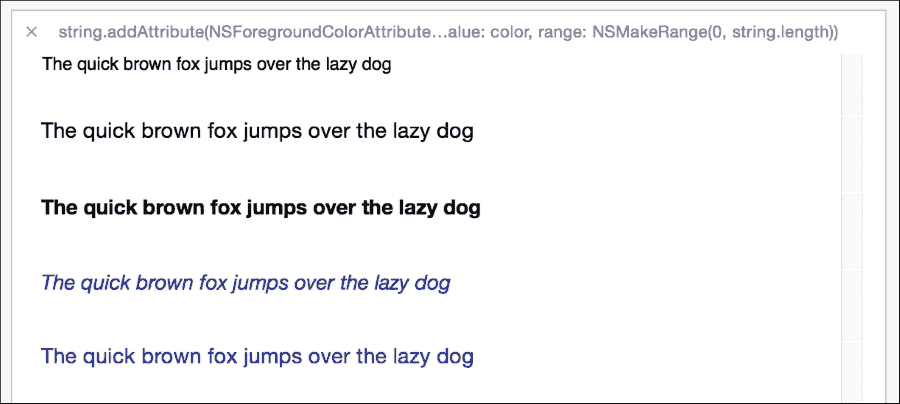

## 它是如何工作的…

属性字符串被游乐场接受，当你需要为你的应用程序选择配置而不运行完整应用程序时，这个程序非常有用。

如果我们使用 Objective-C 而不是 Swift，我们可能已经创建了一个选择器数组而不是闭包。然而，Swift 不再遵循这种哲学，现在`performSelector`函数要求一个延迟时间来启动。

使用块或闭包更加灵活，同时也使得代码更容易维护。你可以在这里看到的一个限制是，你不能从快速查看中复制函数数组。更好的说法是，你可以这样做，但你将要复制的唯一文本是“函数”，这并不太有用。

## 还有更多…

在这里我们有我们自己的文本，但如果我们需要从远程服务器获取一些文本怎么办？在接下来的菜谱中，我们将学习如何在游乐场中处理 HTTP 请求。

# 接收 JSONs

请求远程信息在今天是非常常见的。如果你的游乐场在你收到服务器响应之前就结束了，会发生什么？在这个菜谱中，我们将学习如何处理这个问题。

## 准备工作

创建一个新的游乐场，命名为`第六章 请求 JSONs`，并且以防万一，检查你的互联网连接。

## 如何做到这一点…

1.  首先，我们需要找到一个可以返回更多网站的 URL。在这种情况下，我们将使用这个 URL：[`api.github.com/users/mralexgray/repos`](https://api.github.com/users/mralexgray/repos)。

1.  创建一个包含之前提到的 URL 的常量：

    ```swift
    let url = NSURL(string: "https://api.github.com/users/mralexgray/repos")!
    ```

1.  点击快速查看图标并检查你是否收到了 JSON 响应。

    ### 小贴士

    你可以使用 NSURL 进行快速查看以检查网站。如果你正在测试修改网站的内容，你可以使用快速查看来检查新的网站外观。

1.  现在让我们为我们的 URL 创建一个请求：

    ```swift
    let request = NSURLRequest(URL: url)
    ```

1.  下一步是请求 URL 的内容：

    ```swift
    NSURLConnection.sendAsynchronousRequest(request, queue: NSOperationQueue(), completionHandler:{ (response: NSURLResponse!, data: NSData!, error: NSError!) -> Void in
        if error != nil {
            error.description
        }else {
            data
        }
    })
    ```

1.  检查沙盒的结果。不幸的是，沙盒在收到响应之前就结束了。回到你的沙盒开始处，添加以下行：

    ```swift
    import XCPlayground

    XCPSetExecutionShouldContinueIndefinitely(continueIndefinitely: true)
    ```

1.  现在我们将能够收到响应，然而正如你所看到的，响应并不是我们等待的那个。解决这个问题需要我们实现一个新的类并将其设置为`NSURLConnectionDelegate`。在发送异步请求之前放置以下代码：

    ```swift
    class HttpDelegate: NSObject, NSURLConnectionDelegate {

        func connection(connection: NSURLConnection, canAuthenticateAgainstProtectionSpace protectionSpace: NSURLProtectionSpace) -> Bool{
            return true
        }

        func connection(connection: NSURLConnection, didReceiveAuthenticationChallenge challenge: NSURLAuthenticationChallenge){
            challenge.sender.useCredential(NSURLCredential(trust: challenge.protectionSpace.serverTrust!), forAuthenticationChallenge: challenge)
        }
    }
    let delegate = HttpDelegate()
    var total = 0
    XCPCaptureValue("total",total)
    let connection = NSURLConnection(request: request, delegate: delegate, startImmediately: true)!
    ```

1.  `total`变量将在之后使用，现在你唯一需要做的就是检查我们是否能够按照预期收到响应。只有一个请求可能不足以进行基准测试，在这种情况下，我们需要转到检查`data`参数的行，并添加以下代码：

    ```swift
            total++
            XCPCaptureValue("total",total)
            var err: NSError?
            var firstResponse = NSJSONSerialization.JSONObjectWithData(data, options: NSJSONReadingOptions.MutableContainers, error: &err)  as [[String:AnyObject]]?

            for response in firstResponse!{
                for (key, value) in response{
                    if (key as NSString).containsString("_url") && value is String{
                        let valueString = value as String
                        if !(valueString as NSString).containsString("{"){
                            let _url = NSURL(string: value as String)!
                            let _request = NSURLRequest(URL: _url)
                            NSURLConnection.sendAsynchronousRequest(_request, queue: NSOperationQueue(), completionHandler: { (_response, _data, err) -> Void in
                                total = total + 1
                                total
                                XCPCaptureValue("total",total)
                            })
                        }
                    }
                }
            }
    ```

1.  好的，现在正如你所看到的，我们得到了一个更可接受的结果。如果你想为基准测试得到更好的结果，通过将右下角的秒数更改为**3**秒来减少沙盒的运行时间。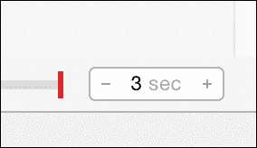

1.  现在检查你收到了多少次回复，这就是你的真实统计数据。

## 它是如何工作的…

沙盒有一个自己的框架，称为`XCPlayground`。它是为了根据你的测试需求添加一些功能而创建的。在这种情况下，我们开始使用函数`XCPSetExecutionShouldContinueIndefinitely`，它使沙盒即使在达到最后一行代码后也能继续运行。

`XCPlayground`框架还帮助我们使用了`XCPCaptureValue`函数。这个函数允许我们从代码的不同部分存储一个值，并为它创建一个单独的图表，就像我们对`total`变量所做的那样。

我们还必须解决一个关于连接的问题，它被 HTTPS 协议拒绝。在这种情况下，我们尝试创建连接，我们可以看到它被拒绝，这是在将代码编入你的应用之前使用沙盒的一个很好的理由，这样我们可以更快地解决这个问题。

最后，我们可以更改我们的沙盒执行时间限制，默认情况下它从 30 秒开始，但对于这种情况可能太长了。减少这个时间让我们能够更好地了解我们的应用每秒能处理多少请求。

## 还有更多…

如你所见，playground 有其自己的框架。它允许我们更好地控制 playground 并获取更好的结果。为了完成它，在下一个菜谱中，我们将学习如何创建个性化的快速查看。

# 创建我们自己的类表示

快速查看是一个很好的工具，它帮助我们可视化对象当前的状态，但有时当我们创建具有自己逻辑的自己的类时，快速查看可能无法在没有你的帮助的情况下绘制代表对象的任何东西。

在这个菜谱中，我们将学习如何创建我们自己的类表示，为此我们将创建一个代表国际象棋棋盘的类。

## 准备工作

创建一个新的名为`第六章国际象棋`的 playground，并选择 iOS 选项。如果你选择 Mac OS，请记住导入 Cocoa 并将一些类型替换为等效类型，例如用`NSBezierPath`代替`UIBezierPath`。

## 如何做到这一点…

1.  让我们开始创建一个从`NSObject`继承的类：

    ```swift
    class CheckersBoard:NSObject {
    ```

1.  在我们继续之前，我们需要定义每个方格的状态；正如你所知，它可能有一个黑子、一个白子，或者它可能是空的：

    ```swift
        enum BoardSpace {
            case FREE,
            WHITE,
            BLACK
        }
    ```

1.  现在让我们定义棋盘。在这种情况下，它是一个二维数组属性，并且每个方格的初始值必须是`.FREE`：

    ```swift
        var board = [[BoardSpace]](count:8 , repeatedValue:BoardSpace)
    ```

1.  由于我们永远不知道棋盘是否有正确的大小，我们将创建一个表示正方形大小的常量。如果你认为棋盘太大或太小，你可以更改这个值：

    ```swift
        let squareSize = 24
    ```

1.  下一步是创建一个名为`debugQuickLookObject`的方法。这个名字不是随意的，它必须这样命名：

    ```swift
        func debugQuickLookObject() -> AnyObject? {
    ```

    ### 小贴士

    在你的应用程序中使用`debugQuickLookObject`方法，Swift 和 Objective-C 调试器也使用这个方法来给你一个关于你对象的想法。

1.  开始创建一个与国际象棋棋盘大小相同的图像上下文：

    ```swift
            UIGraphicsBeginImageContext(CGSizeMake(CGFloat(squareSize * 8), CGFloat(squareSize * 8)))
    ```

1.  创建两个循环，将绘制棋盘的每个方格：

    ```swift
    for row in 0...7 {
      for col in 0...7 {
    ```

1.  在这些循环中，我们需要计算当前位置：

    ```swift
    let offsetx = CGFloat(col * squareSize)
                    let offsety = CGFloat(row * squareSize)
    ```

1.  之后，我们需要知道我们将绘制黑色方格还是白色方格。为此，`row`和`col`变量将帮助我们：

    ```swift
                    if col % 2 == row % 2 {
                        UIColor.grayColor().setFill()
                    }else {
                        UIColor.blackColor().setFill()
                    }
    ```

1.  现在，用当前颜色填充方格：

    ```swift
              var bezier = UIBezierPath(rect: CGRectMake(offsetx, offsety, CGFloat(squareSize), CGFloat(squareSize)))
              bezier.fill()
    ```

1.  一旦我们画好了方格，我们将画一个代表玩家棋子的圆圈：

    ```swift
    switch board[row][col] {
                    case .WHITE:
                        UIColor.whiteColor().setFill()
                    case .BLACK:
                        UIColor.brownColor().setFill()
                    default:
                        continue
                    }
                    bezier = UIBezierPath(arcCenter: CGPointMake(offsetx + CGFloat( squareSize / 2 ) , offsety + CGFloat(squareSize / 2)), radius: CGFloat(squareSize / 3), startAngle: CGFloat(0.0), endAngle: CGFloat(360), clockwise: true)
                    bezier.closePath()
                    bezier.fill()
    ```

1.  循环完成了，我们现在可以完成它们，返回图像，并完成棋盘类：

    ```swift
                }
            }

            let image = UIGraphicsGetImageFromCurrentImageContext()
            UIGraphicsEndImageContext()
            return image
        }
    }
    ```

1.  如你所想，我们需要通过实例化类、在棋盘上添加一些棋子并可视化它来测试我们的类：

    ```swift
    var board = CheckersBoard()

    board.board[2][5] = .WHITE
    board.board[2][3] = .BLACK
    board.board[4][3] = .WHITE
    board.board[2][1] = .BLACK
    board.board[0][5] = .WHITE
    board.board[1][0] = .BLACK
    board.board[7][6] = .WHITE
    board.board[5][6] = .BLACK

    board
    ```

1.  现在点击棋盘的快速查看（最后一行），你应该看到以下结果：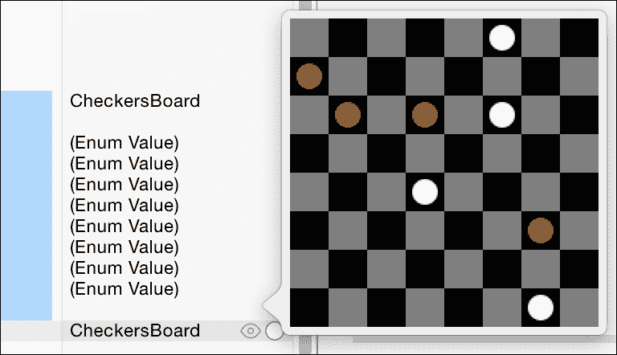

## 它是如何工作的…

为了显示自定义的快速查看，你必须创建一个从`NSObject`继承的类并实现`debugQuickLookObject`方法。尽管这个方法返回一个`AnyObject`类型的对象，但在其声明中，它应该返回 playground 可以表示的任何东西，例如颜色、贝塞尔路径、视图等等。

在这个示例中，我们使用了一个贝塞尔路径，它与传统视图有不同的坐标系。贝塞尔路径的初始点（`x = 0` 和 `y = 0`）位于左下角。由于我们只使用了正方形和圆形，这并没有影响我们，但请记住这个问题，因为可能会得到错误的结果。

`UIColor` 有一些方法可以指示在当前上下文中应使用的颜色来填充形状（`setFill`），以及绘制其边框（`setStroke`）。这些颜色将在调用相应的动作来使用它们时应用，例如 `bezier.fill()`。

## 还有更多...

有时候我们需要指示在游乐场中显示一个视图，为此我们有一个名为 `XCPShowView` 的函数，所以这是可视化对象的另一种方式。在下一章中，我们将学习如何调试我们的应用程序；当我们有太多代码且无法在游乐场中测试时，这非常有用。

# 丰富的文档

提供清晰简洁的文档将直接揭示代码的结构和功能。这对与你代码合作的同事以及你在回顾之前所写的代码时非常有帮助。此外，Xcode 可以利用这些文档，并在代码使用的任何地方提供即时快速查看信息，这样你就不必在多个文件之间切换以进行参考。

在这个示例中，我们将使用 Xcode 7 中 Swift 的新文档语法来对一个通用类声明进行文档化，并记录其方法和属性。

## 准备工作

创建一个新的游乐场，并将其命名为 `Documentation`。这个示例不需要项目文件，所以不用担心任何项目设置。

## 如何操作...

1.  将以下代码复制到你的游乐场中作为我们的起点：

    ```swift
    import UIKit

    class SomeSimpleClass: NSObject {

        var someVar: NSString?
        var someOtherVar: NSString?

        func doSomething() {
            print("Doing something...")
        }

        func doSomethingWithStuff(parameterOne: String, parameterTwo: Bool) -> String {
            print("This is parameter one: \(parameterOne)")
            print("This is parameter two: \(parameterTwo)")

            return "Some kind of string."
        }

    }
    ```

    如你所见，这个类包含几个变量和两个方法；一个带有参数和返回值，另一个则没有。

1.  首先，让我们给类本身添加文档。在类声明上方添加以下代码：

    ```swift
    /// A simple class that does some stuff you want it to do.
    ```

    ### 注意

    `///` 表示单行注释。这对于不需要任何参数或返回值的文档来说很方便。Xcode 会识别 `///` 并解析信息以供快速查看访问。

    为了测试它，按住选项键点击 `SomeSimpleClass`，你应该会看到以下截图：

    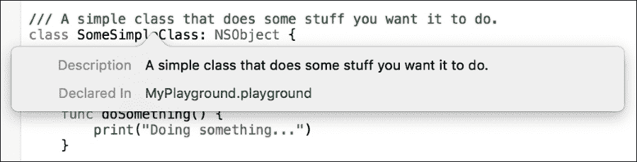

1.  在 `doSomething()` 方法正上方的一行添加以下代码，并按住选项键点击以验证其是否正常工作：

    ```swift
    /// Does something; in this case, prints out a message letting the user know that something is happening.
    ```

1.  现在我们已经覆盖了单行文档，让我们给 `doSomethingWithStuff()` 方法添加文档。在方法声明上方添加以下代码：

    ```swift
    /**
            This method does something, but accepts parameters and also return a String value. Lets add some explicit documentation for these items.

            - Parameter parameterOne: The first parameter to be passed in.
            - Parameter parameterTwo: The second parameter to be passed in.

            - Returns: A string value
         */
    ```

1.  对于多行文档，我们希望在`/** */`之间放置所有文档。Xcode 将相应地解析这些行以快速查看。此外，我们还可以显式地定义参数和返回类型。点击`doSomethingWithStuff()`方法的选项，可以看到以下快速查看视图：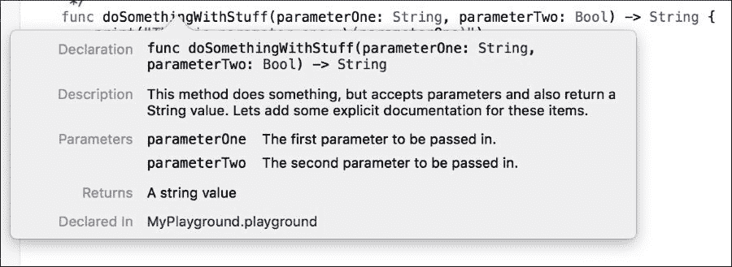

1.  将上一步中的代码块更新为以下代码：

    ```swift
    /**
            This method does something, but accepts parameters and also return a String value. Lets add some explicit documentation for these items.

            - Parameters: 
                - parameterOne: The first parameter to be passed in.
                - parameterTwo: The second parameter to be passed in.

            - Returns: A string value
         */
    ```

    当处理多个参数时，指定参数部分而不是每个单独的参数是一个好的做法（并且更容易阅读）。

1.  Swift 还允许添加额外的描述字段。将以下代码添加到`doSomethingWithStuff()`文档块中：

    ```swift
    - Author: Kyle Begeman

    - Version: 1.04

    - Note: This is a simple class

    - Warning: This class doesn't actually do anything!

    - ToDo: Add some actual functionality to this class
    ```

    您应该看到以下屏幕：

    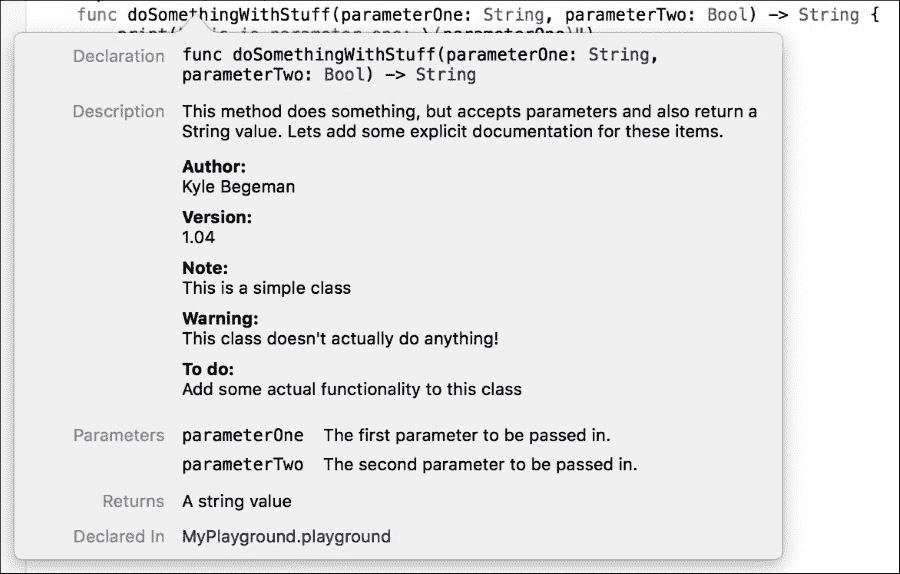

    ### 小贴士

    要查看可用的字段列表，请访问以下 Apple 文档：[`developer.apple.com/library/ios/documentation/Xcode/Reference/xcode_markup_formatting_ref/`](https://developer.apple.com/library/ios/documentation/Xcode/Reference/xcode_markup_formatting_ref/)

1.  Xcode 还允许使用标题、格式化和有序/无序列表。将以下代码添加到文档块中：

    ```swift
    # Lists

             You can apply *italic*, **bold**, or `code` inline styles to any text.

             ## Unordered Lists

             - Some item
             - Another item
             - The last item

             ## Ordered Lists

             1\. Some item
             2\. Another item
             3\. The last item
    ```

    Xcode 支持三种标题：`#`代表一级标题；`##`和`###`分别代表二级和三级标题：

    

## 它是如何工作的…

Xcode 将自动解析添加的文档，并根据文档块中使用的关键字对其进行组织。这不需要额外的设置，并且将在运行 Xcode 7 的任何计算机上工作。

## 更多内容…

有时文档可能需要以类似说明书的方式格式化，以便有多个页面以更好地组织。利用游乐场的功能，您可以提供具有多个页面的详细文档，并在它们之间建立链接以便于访问。这将在下一个食谱中介绍。

# 在游乐场中导航页面

游乐场正变得越来越强大，随着 Apple 不断添加功能。一个很棒的新特性是能够在单个游乐场中导航页面。这样做允许您以更组织化的方式格式化文档。此外，您甚至可以将文档和代码结构化得类似于数字书，并允许读者轻松导航。

## 准备工作

创建一个新的游乐场，并将其命名为`Paging`。本食谱不需要项目文件，因此请不用担心任何项目设置。接下来，选择**文件** | **新建** | **游乐场** **页面**。在右侧的导航器中，您应该看到两个页面：`未命名页面`和`未命名页面 2`。分别将它们重命名为`Intro`和`Start Now`。

## 如何操作…

1.  将以下代码添加到 Intro 页面的底部：

    ```swift
    //: Next
    ```

    Xcode 会将`//:`识别为类似于`///`的标记命令。页面之间的导航使用标准的格式 `链接标题`。在这个例子中，我们命名链接为`Next`，并使用标准的`@next`选项让 Xcode 知道要导航到下一页（基于项目顺序）。

1.  从顶部菜单选择**编辑器** | **显示渲染标记**。为了查看我们的导航，我们需要 Xcode 根据提供的标记进行渲染。您应该看到类似以下内容：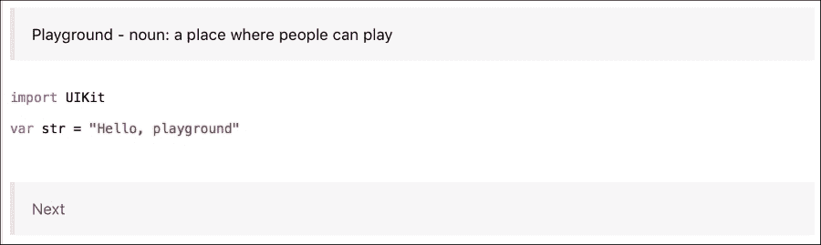

1.  选择下一个按钮将自动带您到之前创建的`Start`页面。您会注意到新页面的样板代码会自动生成其自己的上一页和下一页链接。选择**编辑器** | **显示原始标记**来查看代码。所有内容都是相同的，除了使用`@previous`作为上一页的链接位置。

1.  返回到`Intro`页面，并将以下代码添加到文件末尾：

    ```swift
    //: Start Page
    ```

    通过指定页面名称作为位置，我们可以直接导航到指定的页面。

    ### 注意

    注意，带有空格的页面名称需要使用`%20` ASCII 空格代码才能正常工作。

## 它是如何工作的…

就像所有其他文档和标记一样，Xcode 会自动将文本解析为正确的命令，并正确链接所有内容。

## 参见

+   虽然我们已经涵盖了所有基础知识，但苹果公司仍提供了额外的功能来处理文档和游乐场。更多信息，请访问此链接：[`developer.apple.com/library/ios/documentation/Xcode/Reference/xcode_markup_formatting_ref/`](https://developer.apple.com/library/ios/documentation/Xcode/Reference/xcode_markup_formatting_ref/)
