# 第八章。与 Objective-C 集成

在本章中，我们将涵盖以下菜谱：

+   叫车

+   租赁货车

+   将代码从一个语言移植到另一个语言

+   替换用户界面类

+   升级应用程序代理

+   创建你自己的自定义框架

# 简介

Swift 2 已经发布，我们可以看到它迟早会取代 Objective-C 在 iOS 开发中的应用，然而你应该如何迁移你的 Objective-C 应用程序？是否需要重新编写一切？

当然，你不必从头开始用 Swift 重新编写整个应用程序，你可以逐步迁移它。想象一下，一个由 10 个开发者开发的四岁应用程序，重新编写将花费很长时间。

实际上，你已经看到我们在这本书中使用的一些代码具有某种“旧的 Objective-C 风格”。原因是即使是苹果电脑也无法将整个 Objective-C 代码迁移到 Swift。

本章将帮助你逐步从 Objective-C 迁移到 Swift。

# 叫车

让我们想象一下，我们为一家出租车公司工作，该公司已经有一个应用程序，允许客户从该应用程序中叫出租车。正如你可能想象的那样，公司可以开始提供额外的服务，而不仅仅是使用传统的汽车，例如，让我们想象一下，现在他们想要为携带大量行李的人提供租赁货车的服务。

在这个菜谱中，我们将从一个纯 Objective-C 应用程序开始，然后我们将对其进行修改，以便为将来添加 Swift 代码做好准备。

## 准备就绪

让我们从创建一个名为 `Chapter 8 Cab` 的项目开始，但在这个案例中，选择 Objective-C 而不是 Swift 作为编程语言：

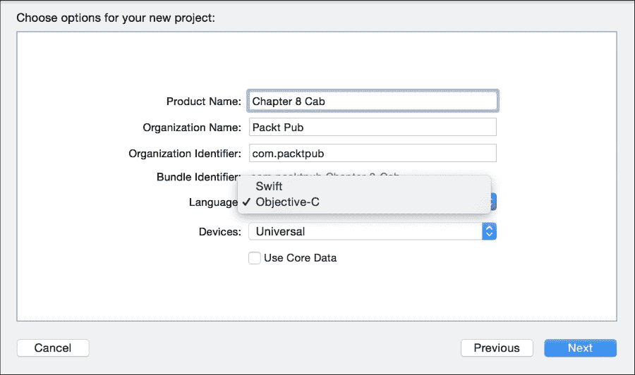

## 如何做到这一点…

1.  首先，在你的项目中创建一个新文件，选择右上角的 iOS 源中的 **Cocoa Touch Class**：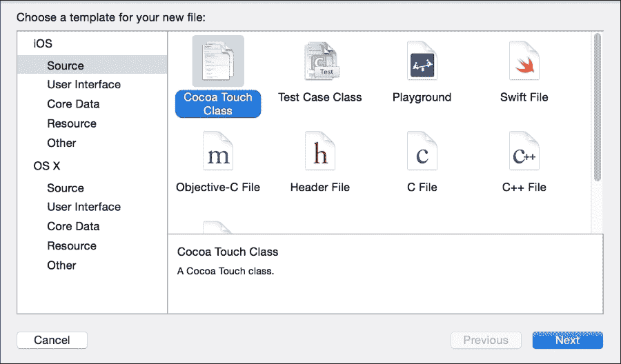

1.  然后创建一个名为 `Car` 的文件，它应该是 `NSObject` 的子类：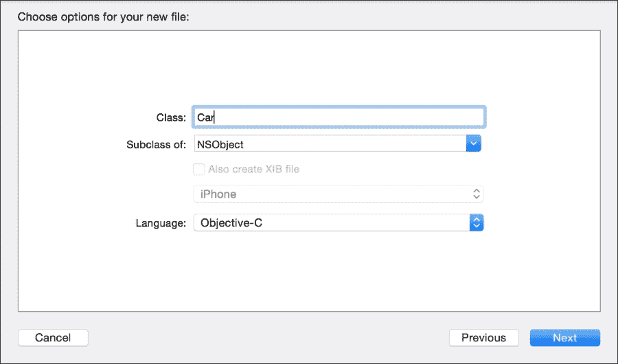

    你会看到创建了两个文件，一个是 `Car.h`，另一个是 `Car.m`。

1.  点击头文件（`Car.h`）并添加以下代码：

    ```swift
    #import <Foundation/Foundation.h>

    @interface Car : NSObject{
        float fare;
    }

    @property (assign) float distance;
    @property (assign) int pax;

    -(id) init;
    -(id) initWithFare:(float) fare;
    -(float) getFare;

    @end
    ```

1.  一旦创建了类接口，我们必须实现这个类，因此点击文件 `Car.m` 并输入以下代码：

    ```swift
    #import "Car.h"

    @implementation Car
    -(id) init{
        self = [super init];
        if(self){
            self->fare = 0.2;
            self.pax = 4;
            self.distance = 0;
        }
        return self;
    }

    -(id) initWithFare:(float) fare{
        self = [super init];
        if(self){
            self->fare = fare;
            self.pax = 4;
            self.distance = 0;
        }
        return self;
    }

    -(float) getFare{
        return self->fare;
    }
    @end
    ```

    模型部分已完成，现在我们需要创建视图部分。

1.  让我们做一些非常直接的事情，只需将一个表格视图添加到故事板中，然后将其与视图控制器作为属性、数据源和代理链接。

1.  由于你必须修改头文件（通常称为 `ViewController.h`），请添加一个名为 `vehicles` 的辅助属性，其类型为 `NSArray`：

    ```swift
    @interface ViewController : UIViewController <UITableViewDataSource, UITableViewDelegate>{
        NSArray * vehicles;
        IBOutlet UITableView *tableView;
    }
    @end
    ```

1.  要向此应用程序添加一些功能，请转到消息文件（通常称为 `ViewController.m`）。

    ### 小贴士

    从头文件切换到其实施或反之亦然可以使用 ** + *^* + 上箭头。

1.  首先，让我们导入 `Car.h` 文件：

    ```swift
    #import "Car.h"
    ```

1.  然后，添加数据源内容：

    ```swift
    - (NSInteger)tableView:(UITableView *)tableView numberOfRowsInSection:(NSInteger)section{
        return [vehicles count];
    }

    - (UITableViewCell *)tableView:(UITableView *)tableView cellForRowAtIndexPath:(NSIndexPath *)indexPath{
        UITableViewCell * cell;
        cell = [self->tableView dequeueReusableCellWithIdentifier:@"vehiclecell"];
        if(cell == nil) {
            cell = [[UITableViewCell alloc] initWithStyle:UITableViewCellStyleDefault reuseIdentifier:@"vehiclecell"];
        }
        Car * currentCar = [self->vehicles objectAtIndex:indexPath.row];
        cell.textLabel.text = [NSString stringWithFormat:@"Distance %.0f, pax: %d, fare: %.2f", currentCar.distance * 1000, currentCar.pax, [currentCar getFare] ];
        return cell;
    }
    ```

1.  现在，你必须初始化车辆的属性。当然，在这里，我们只是使用一些硬编码，否则我们会有一大堆代码：

    ```swift
    - (void)viewDidLoad {
        [super viewDidLoad];
        Car * car1 = [[Car alloc] init];
        car1.distance = 1.2;
        Car * car2 = [[Car alloc] init];
        car2.distance = 0.5;
        Car * car3 = [[Car alloc] init];
        car3.distance = 5;
        Car * car4 = [[Car alloc] initWithFare:0.25];
        car4.distance = 4;
        vehicles = @[car1, car2, car3, car4];
        [self->tableView reloadData];
    }
    ```

1.  我们最后需要做的是为用户创建一个事件，让他可以选择预订的汽车：

    ```swift
    - (void)tableView:(UITableView *)tableView didSelectRowAtIndexPath:(NSIndexPath *)indexPath{
        Car * currentCar = [self->vehicles objectAtIndex:indexPath.row];
        // let's suppose that the current traffic allows us to drive at 50 km/h
        float time = currentCar.distance / 50.0 * 60.0;
        [[[UIAlertView alloc] initWithTitle:@"Car booked" message:[NSString stringWithFormat:@"The car will arrive in %.0f minutes", time] delegate:nil cancelButtonTitle:@"OK" otherButtonTitles: nil] show];
    }
    ```

1.  现在测试这个应用程序，只是为了看看它是否在正常工作。下一步是为这个应用程序准备接收一些 Swift 代码。在我们添加任何 Swift 文件之前，我们需要更新这段代码；幸运的是，Xcode 提供了一个自动执行此操作的选项，所以点击 **编辑** 菜单，然后选择 **重构**，最后选择 **转换为现代 Objective-C 语法…**: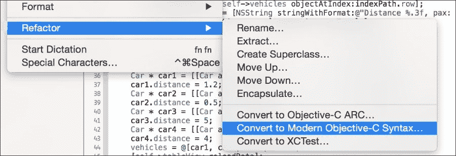

    ### 小贴士

    在开始更新你的代码之前，如果你使用版本控制系统，提交你的代码是一个好主意。

1.  当出现一个带有一些介绍文本的对话框时，按 **下一步**，然后在下一个对话框中检查出现的每个目标，通常它们是勾选的，但以防万一，请确保这一点。在下一个屏幕上，你会看到一些用于现代化你的 Objective-C 代码的选项，你可以保留所有选项的默认值，但更好的做法是确保每个选项都标记为“是”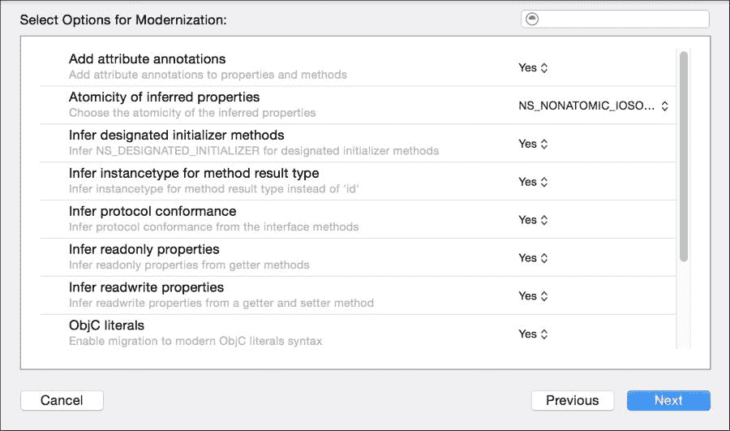

1.  之后，你会看到一个显示原始代码和将要更新的代码之间差异的另一个对话框。通过点击左侧的文件名来检查每个文件的差异：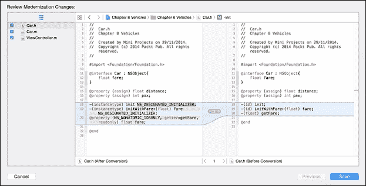

    ### 小贴士

    避免在不检查旧代码和新代码之间差异的情况下更新你的代码，有时你会发现一些概念上不正确的修改。

1.  按 **保存**，你将看到一个新对话框询问你是否想启用自动快照：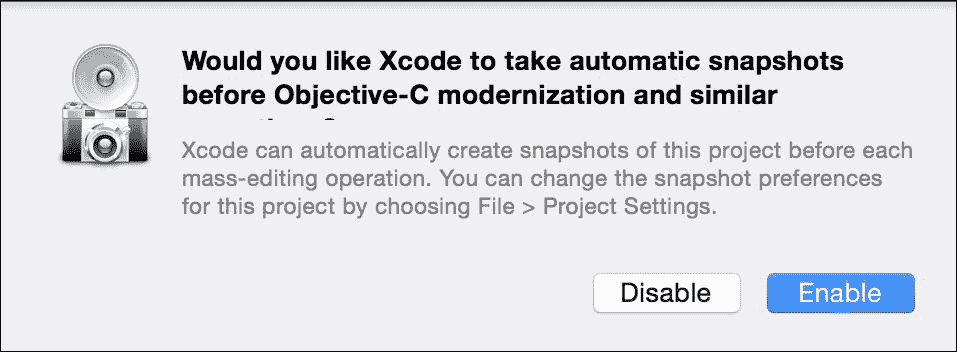

现在检查你的项目代码已更改，并且仍然像以前一样工作。

## 它是如何工作的…

当你将你的 Objective-C 应用程序迁移到 Swift 时，你需要做的第一件事是将你的代码转换为现代 Objective-C 语法。多亏了这一点，你的代码将准备好与 Swift 集成兼容。

你可以看到，在更新你的代码后，代码的这一部分被修改了，例如，ID 被替换为 `instancetype`，初始化器接收 `NS_DESIGNATED_INITIALIZER` 修饰符，并且一些函数被转换为属性，主要是那些以 get 或 set 开头的函数。

通常这种改变被认为是一次巨大的改变，这当然有需要回滚到之前状态的风险。这就是为什么 Xcode 建议你创建一个快照。

## 参考信息

+   在这个菜谱中，我们学习了如何获取现有的 Objective-C 应用程序并为其准备使用 Swift 代码。当然，有时你可以自动完成它，有时你必须手动更改它。查看现代 Objective-C 文档是个好主意。你可以通过访问以下网站来完成此操作：[`developer.apple.com/library/ios/releasenotes/ObjectiveC/ModernizationObjC/AdoptingModernObjective-C/AdoptingModernObjective-C.html`](https://developer.apple.com/library/ios/releasenotes/ObjectiveC/ModernizationObjC/AdoptingModernObjective-C/AdoptingModernObjective-C.html).

# 招聘一辆货车

在这个菜谱中，我们将为驾驶舱应用程序添加更多功能，在这种情况下，我们将假设应用程序不仅会调用汽车，还会提供货车服务。在这种情况下，货车需要指定其容量，因为我们正在更新代码，我们将使用 Swift 来完成。当然，你总是需要在 Objective-C 中输入一些代码，请记住这一点。

## 准备工作

在这个菜谱中，我们将继续使用之前的应用程序，所以复制之前的菜谱并打开项目副本。如果你想将应用程序从 `第八章 汽车` 重命名为 `第八章 车辆`，这将有助于区分它们。

## 如何操作…

1.  首先，点击项目导航器，然后点击包含源代码的组，添加一个名为 `Van.swift` 的新 Swift 文件。检查在尝试添加后，是否出现一个新对话框询问你是否想要创建一个桥接文件。点击 **是**，否则你将不得不自己创建一个头文件：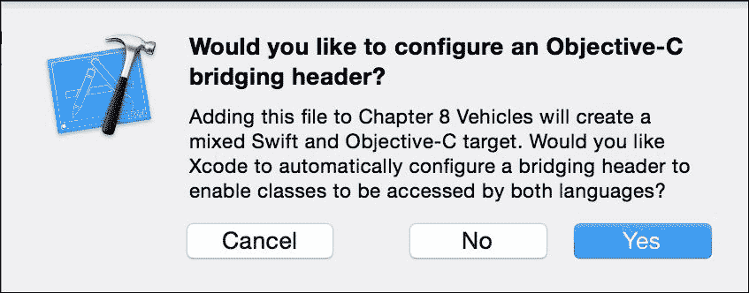

1.  一旦你接受了它，前往构建设置，在搜索字段中输入 `bridging` 并检查是否在选项 **Objective-C Bridging Header** 上设置了一个文件：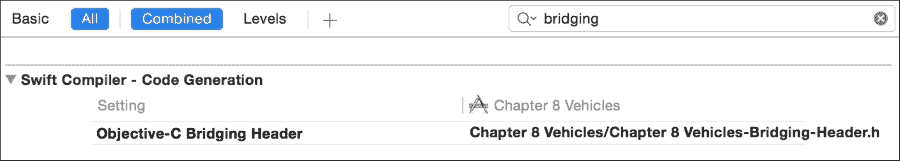

1.  之后，检查项目导航器上是否有一个名为 `Chapter 8 Vehicles-Bridge-Header.h` 的新文件，并且其内容基本上是空的（只有一些注释），所以让我们导入文件 `Car.h`：

    ```swift
    #import "Car.h"
    ```

1.  现在，点击 `Car.h` 并添加最后的修改，创建一个名为 `image` 的属性，这样我们就可以区分一辆汽车和一辆货车：

    ```swift
    @property (strong) UIImage * image;
    ```

1.  你将收到一个错误，因为 `Car.h` 没有导入 UIKit，所以请前往此文件顶部并添加以下导入指令：

    ```swift
    #import <UIKit/UIKit.h>
    ```

1.  之后，你必须点击 `Car.m` 来初始化这个新属性，所以在两个初始化器中添加以下代码：

    ```swift
    self.image = [UIImage imageNamed:@"car.png"];
    ```

1.  现在，我们可以点击回 Swift 文件并创建一个代表货车的类。在这种情况下，我们将添加一个名为 `capacity` 的属性，它将表示空间，以平方米为单位。正如你可能想象的那样，这个类将是汽车的一个子类：

    ```swift
    class Van: Car {
        var capacity:Int;

        override init(){
            self.capacity = 10
            super.init()
            self.image = UIImage(named: "van.png")
        }

        override init(fare: Float){
            self.capacity = 10
            super.init(fare: fare)
            self.image = UIImage(named: "van.png")
        }

    }
    ```

1.  正如你所见，我们需要两张图片来帮助用户可视化何时是汽车，何时是货车。将相应的图片从本书的 `Resources` 文件夹拖动到 **Supporting Files** 组中。

1.  很明显，我们不能止步于此，我们必须更改视图控制器，以便让新类能够以特定的信息表示。点击`ViewController.m`文件并做出以下更改：首先更改方法`cellForRowAtIndexPath`，它将以更完整的方式显示：

    ```swift
    - (UITableViewCell *)tableView:(UITableView *)tableView cellForRowAtIndexPath:(NSIndexPath *)indexPath{
        UITableViewCell * cell;
        cell = [self->tableView dequeueReusableCellWithIdentifier:@"vehiclecell"];
        if(cell == nil) {
            cell = [[UITableViewCell alloc] initWithStyle:UITableViewCellStyleSubtitle reuseIdentifier:@"vehiclecell"];
        cell.textLabel.numberOfLines = 1;
        }
        Car * currentCar = self->vehicles[indexPath.row];

        cell.textLabel.text = [NSString stringWithFormat:@"Distance %.3f meters", currentCar.distance];
        NSString * detailText = detailText = [NSString stringWithFormat:@"Pax: %d Fare: %.2f", currentCar.pax, [currentCar getFare] ];
        if ([currentCar isKindOfClass:[Van class]]) {
            detailText = [NSString stringWithFormat:@"%@, Volume: %ld",detailText, (long)[(Van*)currentCar capacity]];
        }
        cell.detailTextLabel.text = detailText;
        cell.imageView.image = currentCar.image;
        return cell;
    }
    ```

1.  现在编译器将会对`Van`类提出抱怨，原因是你需要导入它。我们如何在 Objective-C 中导入一个 Swift 文件？答案是极其简单，只需导入一个与你的项目名称相同并附加后缀`-Swift.h`的文件。如果你的项目名称中包含空格，请将其替换为下划线：

    ```swift
    #import "Chapter_8_Vehicles-Swift.h"
    ```

1.  然后你必须向车辆数组中添加一个额外的元素，所以前往`viewDidLoad`并在第 4 辆车之后添加一个货车对象：

    ```swift
    - (void)viewDidLoad {
        [super viewDidLoad];
        Car * car1 = [[Car alloc] init];
        car1.distance = 1.2;
        Car * car2 = [[Car alloc] init];
        car2.distance = 0.5;
        Car * car3 = [[Car alloc] init];
        car3.distance = 5;
        Car * car4 = [[Car alloc] initWithFare:0.25];
        car4.distance = 4;
     Van * van = [[Van alloc] initWithFare:0.32];
     van.distance = 3.8;
        vehicles = @[car1, car2, car3, car4, van];
        [self->tableView reloadData];
    }
    ```

1.  现在我们的第一次迁移已经完成，按播放键，你会看到你的应用程序仍然在运行，但有了雇佣货车的可能性：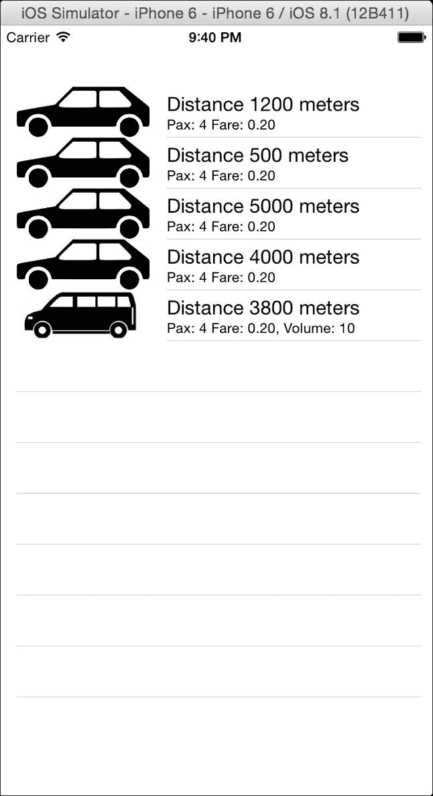

## 它是如何工作的…

当你混合 Swift 和 Objective-C 时，如果你在 Objective-C 部分使用 Swift 代码，你必须创建一个桥接文件。通常你将由向导引导，它会创建桥接文件并将其设置在构建设置中，但请记住，如果向导没有出现，你可能需要自己完成这项工作。

你必须导入你想要在 Swift 中使用的每个头文件。在这种情况下，你必须导入`Car.h`。

Swift 类可以继承自 Objective-C 类，然而，反之则不允许，这意味着如果你开始在项目中添加 Swift 代码，你需要确保你不会继续使用 Objective-C 开发类。

正如你所看到的，你可以将 Swift 类视为 Objective-C 类，即使你需要使用`isKindOfClass`等方法，而且 Objective-C 也被转换为 Swift，遵循其哲学，例如创建一个初始化器，如`init(fare:Float)`，在 Objective-C 中其原始名称是`initWithFare`。

# 将你的代码从一种语言迁移到另一种语言

在之前的食谱中，我们学习了如何将新代码添加到现有的 Objective-C 项目中，然而，你不仅应该添加新代码，而且尽可能地将你的旧代码迁移到新的 Swift 语言中。

如果你希望保持你的应用程序核心为 Objective-C，那没问题，但请记住，新的功能将被添加到 Swift 中，并且保持同一项目中的两种语言将变得困难。

在这个食谱中，我们将把部分代码从 Objective-C 迁移到 Swift。

## 准备工作

复制之前的食谱。如果你在使用任何版本控制系统，现在是提交你的更改的好时机。如果你没有使用版本控制系统，查看第一章，*使用 Xcode 和 Swift 入门*，了解如何将其添加到你的项目中。

## 如何操作…

1.  打开项目并添加一个名为 `Setup.swift` 的新文件，在这里我们将添加一个具有相同名称的新类（Setup）：

    ```swift
    class Setup {
        class func generate() -> [Car]{
            var result = [Car]()
            for distance in [1.2, 0.5, 5.0] {
                var car = Car()
                car.distance = Float(distance)
                result.append(car)
            }
            var car = Car()
            car.distance = 4
            var van = Van()
            van.distance = 3.8
            result += [car, van]
            return result
        }
    }
    ```

1.  现在我们有了这个汽车数组生成器，我们可以在 `viewDidLoad` 方法中调用它，替换之前的代码：

    ```swift
    - (void)viewDidLoad {
        [super viewDidLoad];
        vehicles = [Setup generate];
        [self->tableView reloadData];
    }
    ```

1.  再次，按播放并检查应用程序是否仍然工作。

## 它是如何工作的…

我们必须创建一个类而不是创建一个函数的原因是，你只能导出 Objective-C 类、协议、属性和索引。如果你在用两种语言开发时，请记住这一点。

如果你想要将类导出为 Objective-C，你有两种选择。第一个是继承自 `NSObject`，另一个是在你的类、协议、属性或索引之前添加 `@objc` 属性。

如果你注意到了，我们的方法返回的是一个转换成 NSArray 的 Swift 数组，但正如你可能知道的，它们是不同类型的数组。首先，因为 Swift 数组是可变的，而 NSArray 不是，另一个原因是它们的方法不同。

我们能否在 Swift 中使用 NSArray？答案是肯定的，但我建议避免使用它；想象一下，一旦完成迁移到 Swift，你的代码仍然遵循旧的方式，这将是一次另一次的迁移。

## 还有更多…

从 Objective-C 迁移是一件需要谨慎处理的事情。不要试图一次性改变整个应用程序，记住一些 Swift 对象的行为与 Objective-C 不同，例如，Swift 中的字典指定了键和值的类型，但在 Objective-C 中它们可以是任何类型。

# 替换用户界面类

到目前为止，你知道如何迁移应用程序的模型部分，然而在现实生活中，我们还需要替换图形类。这样做并不复杂，但可能会有些细节。

## 准备工作

继续使用之前的配方，复制它或只是提交你的更改，然后继续我们的迁移。

## 如何做到这一点…

1.  首先创建一个名为 `MainViewController.swift` 的新文件，并开始导入 UIKit：

    ```swift
    import UIKit
    ```

1.  下一步是创建一个名为 `MainViewController` 的类。这个类必须继承自 `UIViewController` 并实现 `UITableViewDataSource` 和 `UITableViewDelegate` 协议：

    ```swift
    class MainViewController:UIViewController,UITableViewDataSource, UITableViewDelegate {
    ```

1.  然后，添加我们在之前的视图控制器中拥有的属性，保持你之前使用的相同名称：

    ```swift
        private var vehicles = [Car]()
        @IBOutlet var tableView:UITableView!
    ```

1.  接下来，我们需要实现方法；让我们从表格视图数据源方法开始：

    ```swift
        func tableView(tableView: UITableView, numberOfRowsInSection section: Int) -> Int{
            return vehicles.count
        }

        func tableView(tableView: UITableView, cellForRowAtIndexPath indexPath: NSIndexPath) -> UITableViewCell{
            var cell:UITableViewCell? = self.tableView.dequeueReusableCellWithIdentifier("vehiclecell")
            if cell == nil {
                cell = UITableViewCell(style: .Subtitle, reuseIdentifier: "vehiclecell")
            }
            var currentCar = self.vehicles[indexPath.row]
            cell!.textLabel?.numberOfLines = 1
            cell!.textLabel?.text = "Distance \(currentCar.distance * 1000) meters"
            var detailText = "Pax: \(currentCar.pax) Fare: \(currentCar.fare)"
            if  currentCar is Van{
                detailText += ", Volume: \( (currentCar as Van).capacity)"
            }
            cell!.detailTextLabel?.text = detailText
            cell!.imageView?.image = currentCar.image
            return cell!
        }
    ```

    注意，这种转换并不完全等效。例如，费用不会以两位数的精度显示。稍后会有解释为什么我们现在不修复这个问题。

1.  下一步是添加事件；在这种情况下，我们必须在用户选择一辆车时执行操作：

    ```swift
        func tableView(tableView: UITableView, willSelectRowAtIndexPath indexPath: NSIndexPath) -> NSIndexPath? {
            var currentCar = self.vehicles[indexPath.row]
            var time = currentCar.distance / 50.0 * 60.0
            UIAlertView(title: "Car booked", message: "The car will arrive in \(time) minutes", delegate: nil, cancelButtonTitle: "OK").show()
            return indexPath
        }
    ```

    正如你所见，我们只需要再进行一步就可以完成我们的代码。在这种情况下，它是视图的 `didLoad` 方法。请注意，Objective-C 和 Swift 之间的另一个区别是，在 Swift 中你必须指定你正在重载一个现有方法：

    ```swift
        override func viewDidLoad() {
            super.viewDidLoad()
            vehicles = Setup.generate()
            self.tableView.reloadData()
        }
    } // end of class
    ```

1.  我们的代码已经完成，但当然我们的应用程序仍然在使用旧的代码。要完成这个操作，点击故事板；如果文档大纲没有显示，点击**编辑**菜单，然后点击**显示文档大纲**：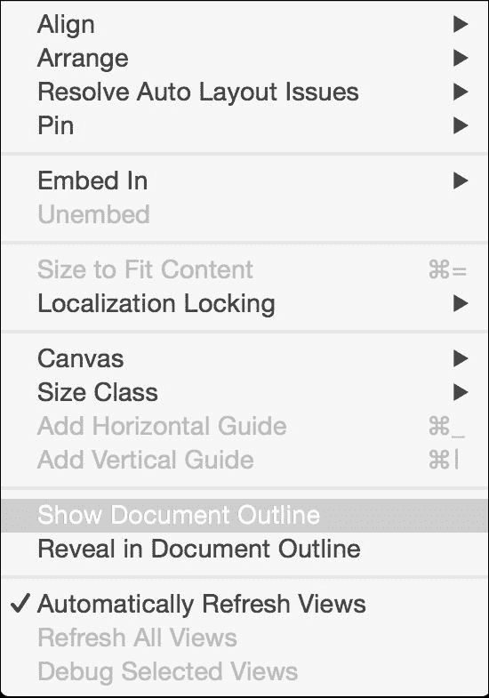

1.  现在你可以看到文档大纲了，点击旁边带有方形黄色圆圈的**视图控制器**：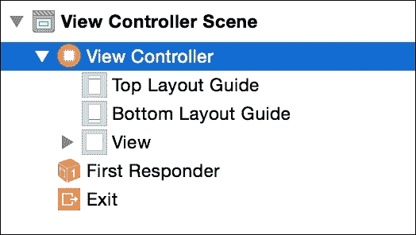

1.  然后在右侧，点击身份检查器，转到自定义类，将类的值从**ViewController**更改为**MainViewController**：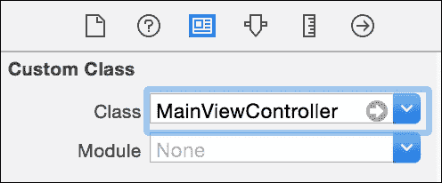

1.  然后，按播放并检查你的应用程序是否正在运行，选择一辆车，并检查它是否工作。确保它使用你的新 Swift 类工作，注意票价值，在这种情况下，它没有以两位数的精度显示。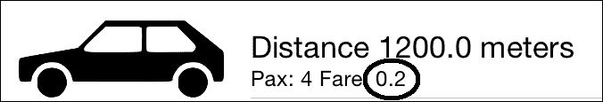

1.  事情都完成了吗？我会说还没有，现在是保存更改的好时机。最后，删除原始的 Objective-C 文件，因为你不再需要它们了。

## 它是如何工作的…

如你所见，用 Swift 替换旧的视图控制器并不难；你需要做的第一件事是创建一个新的视图控制器类及其协议。保持你旧代码中与`IBActions`链接的属性和方法相同的名称，这将使切换变得非常直接；否则，你可能需要重新链接。

请记住，你需要确保你的更改已经应用并且正在工作，但有时拥有不同的东西是个好主意，否则你的应用程序可能会继续使用旧的 Objective-C，而你却没有意识到这一点。

### 小贴士

尝试使用 Swift 的方式而不是旧的 Objective-C 风格来现代化你的代码，例如，现在使用插值而不是使用`stringWithFormat`更受欢迎。

我们还了解到，如果你保持相同的名称，你不需要重新链接任何操作或出口。如果你想更改任何东西的名称，你可能首先保留其原始名称，测试你的应用程序，然后你可以按照传统的分解步骤重构它。

### 小贴士

在你确信等效的 Swift 文件在所有功能上都能正常工作之前，不要删除原始的 Objective-C 文件。

## 还有更多…

这个应用程序只有一个视图控制器，然而应用程序通常有多个视图控制器。在这种情况下，最好的更新方式是逐个更新它们，而不是同时更新所有。

# 升级应用程序代理

如你所知，有一个控制应用程序事件的对象，这被称为应用程序代理。通常你这里不应该有太多代码，但你可能有一些。例如，当你的应用程序进入后台时，你可能需要禁用相机或 GPS 请求，当应用程序返回活动状态时，重新激活它们。

即使你在这个文件上没有添加任何新代码，更新这个文件也是一个好主意，这样将来就不会有问题。

## 准备工作

如果你使用版本控制系统，请从上一个菜谱提交你的更改，或者如果你更喜欢，只需复制你的应用程序。

## 如何操作…

1.  打开上一个应用程序菜谱，创建一个名为 `ApplicationDelegate.swift` 的新 Swift 文件，然后创建一个具有相同名称的类。

1.  就像我们之前的类一样，我们在应用程序代理中没有代码，所以我们可以通过在日志控制台上打印来区分它。在你的 Swift 文件中添加这个传统的应用程序代理：

    ```swift
    class ApplicationDelegate: UIResponder, UIApplicationDelegate {
        var window: UIWindow?

        func application(application: UIApplication, didFinishLaunchingWithOptions launchOptions: [NSObject: AnyObject]?) -> Bool {
            print("didFinishLaunchingWithOptions")
            return true
        }

        func applicationWillResignActive(application: UIApplication) {
            print("applicationWillResignActive")
        }

        func applicationDidEnterBackground(application: UIApplication) {
            print("applicationDidEnterBackground")
        }

        func applicationWillEnterForeground(application: UIApplication) {
            print("applicationWillEnterForeground")
        }

        func applicationDidBecomeActive(application: UIApplication) {
            print("applicationDidBecomeActive")
        }

        func applicationWillTerminate(application: UIApplication) {
            print("applicationWillTerminate")
        }
    }
    ```

1.  现在转到你的项目导航器，展开 **支持文件** 组。之后，点击 `main.m` 文件：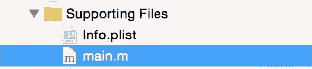

1.  在这个文件中，我们将导入魔法文件，Swift 头文件：

    ```swift
    #import "Chapter_8_Vehicles-Swift.h"
    ```

1.  之后，我们必须指定应用程序代理是我们拥有的新类，所以将 `UIApplicationMain` 调用中的 `AppDelegate` 类替换为 `ApplicationDelegate`。你的主函数应该是这样的：

    ```swift
    int main(int argc, char * argv[]) {
        @autoreleasepool {
            return UIApplicationMain(argc, argv, nil, NSStringFromClass([ApplicationDelegate class]));
        }
    }
    ```

1.  是时候按播放键检查应用程序是否正常工作了。按主页按钮，或者如果你使用的是模拟器，按 *shift* + *command* + *H* 组合键，然后再次打开你的应用程序。检查你的日志控制台是否有消息：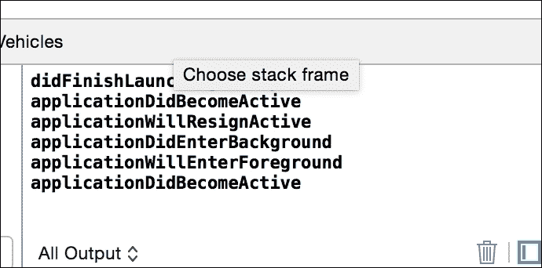

1.  现在你已经确认你的 Swift 代码正在工作，请从 `main.m` 中移除原始的应用程序代理及其导入。测试你的应用程序以确认无误。

1.  你可以考虑我们已经完成了这一部分，但实际上我们还有另一个步骤要做：移除 `main.m` 文件。现在，这非常简单：只需点击 `ApplicationDelegate.swift` 文件，在类声明之前添加属性 `@UIApplicationMain`，然后右键点击 `main.h` 并选择删除它。测试它，你的应用程序就完成了。

## 它是如何工作的…

应用程序代理类始终在应用程序开始时指定。在 Objective-C 中，它遵循 C 的起点，即一个名为 `main` 的函数。在 iOS 中，你可以指定你想要用作应用程序代理的类。

### 注意

如果你为 OS X 编程，程序不同；你必须转到你的 `nib` 文件，并将其类名更改为新的一个。

为什么我们必须更改主函数然后消除它？原因是你应该避免大规模的更改。如果出了问题，你不知道失败的具体步骤，所以你可能不得不再次回滚所有内容。如果你一步一步地进行迁移，确保它仍然工作，这意味着在发现错误的情况下，解决它将更容易。

### 提示

避免在项目中进行大规模更改；逐步更改将更容易解决问题。

## 还有更多…

在这个菜谱中，我们学习了如何将应用程序从 Objective-C 迁移到 Swift 代码的最后一步，然而我们必须记住，编程不仅仅是关于应用程序；你还可以有一个框架。在下一个菜谱中，我们将学习如何创建与 Swift 和 Objective-C 兼容的自定义框架。

# 创建你自己的自定义框架

如你所知，有时我们有一些需要在应用程序之间共享的代码，而最好的方式是通过创建一个框架。在这种情况下，我们将创建一个包含自定义视图的框架。

对于这个菜谱，我们只添加一个视图。这个视图将以渐变的形式绘制；这样你可以轻松地更改应用程序的背景。

## 准备中

创建一个名为`CustomViewsFramework`的新项目。要做到这一点，请点击**文件** | **新建** | **项目**，然后选择**框架和库**部分；之后选择**Cocoa Touch 框架**选项：

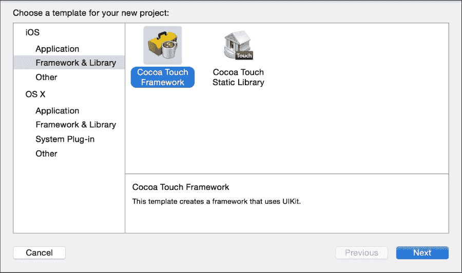

选择**Swift**作为项目语言。

## 如何操作…

1.  开始向你的项目中添加一个新文件，在这种情况下，你可以从**源**部分选择**Cocoa Touch 类**选项：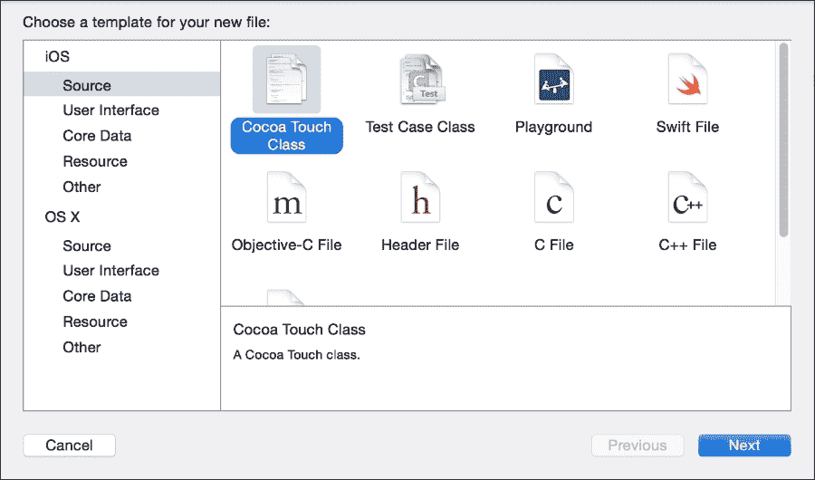

1.  之后，你必须编写新的类名；让我们称它为`CVGradientView`。同时，确保它被选为`UIView`的子类，并且其语言是 Swift：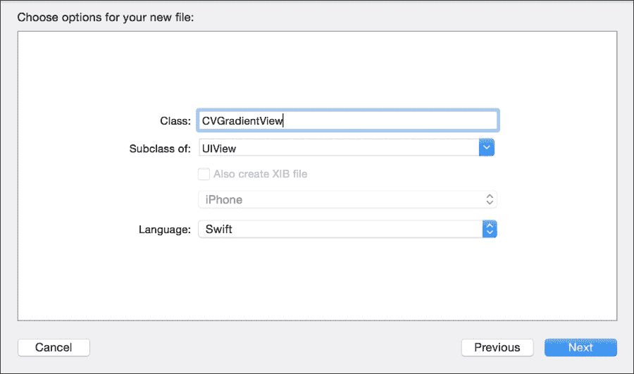

1.  文件创建并打开后，你可以移除默认的注释，然后必须在类声明之前添加属性`@IBDesignable`：

    ```swift
    @IBDesignable public class CVGradientView: UIView {
    ```

1.  现在我们需要添加一些属性；在这种情况下，我们将使用带有观察者的属性，每次属性发生变化时都会刷新渐变视图：

    ```swift
        @IBInspectable public var color1: UIColor = UIColor.redColor() {
            didSet{
                refresh()
            }
        }
        @IBInspectable public var color2: UIColor = UIColor.blackColor(){
            didSet{
                refresh()
            }
        }
        @IBInspectable public var roundCorners: CGFloat = 1.0 {
            didSet{
                refresh()
            }
        }
        @IBInspectable public var horizontal: Bool = false {
            didSet{
                refresh()
            }
        }
    ```

1.  正如你所注意到的，我们必须实现`refresh()`方法：

    ```swift
        private func refresh(){
            let colors:Array = [color1.CGColor, color2.CGColor]
            gradientLayer.colors = colors
            gradientLayer.cornerRadius = roundCorners
            if (horizontal){
                gradientLayer.endPoint = CGPoint(x: 1, y: 0)
            }else{
                gradientLayer.endPoint = CGPoint(x: 0, y: 1)
            }
            self.setNeedsDisplay()
        }
    ```

1.  然后，我们需要指定一些关于梯度层的信息；这些信息是按照核心动画框架进行的：

    ```swift
        var gradientLayer: CAGradientLayer {
            return layer as CAGradientLayer
        }  
        override public class func layerClass()->AnyClass{
            return CAGradientLayer.self
        }
    ```

1.  现在，我们需要这个方法的最后一部分，即初始化器：

    ```swift
        override init(frame: CGRect) {
            super.init(frame: frame)
            refresh()
        }

        required public init(coder aDecoder: NSCoder) {
            super.init(coder: aDecoder)
            refresh()
        }
    }
    ```

1.  完成后，我们需要通过访问我们的目标构建设置并搜索单词`module`来识别我们的模块。现在，将**模块标识符**更改为**CustomViewsFrameWork**：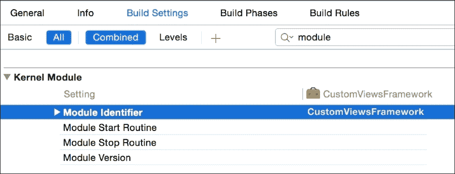

1.  类已经完成，所以使用** + *b*生成项目。现在，我们需要检查它是否正常工作，所以让我们创建另一个名为`Chapter 8 Testing Views`的项目。创建后，点击项目导航器，然后点击目标`Chapter 8 Testing Views`。

1.  在这里，你必须选择**构建设置**选项卡，并将字段**嵌入式内容包含 Swift 代码**更改为**是**：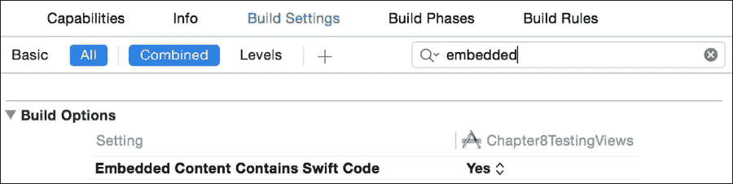

1.  接下来，选择**常规**选项卡，转到**嵌入的二进制文件**部分，点击加号按钮，当对话框出现时，只需点击带有短语**添加其他…**的按钮。在这里，它正在询问你的框架，所以转到你的框架的构建产品（它应该在名为`DerivedData/CustomsViewsFramework/Build/Products/Debug-iphonesimulator/`的文件夹中），选择它（名为`CustomsViewsFramework.framework`的文件），然后按**确定**。检查链接的框架部分也会显示它：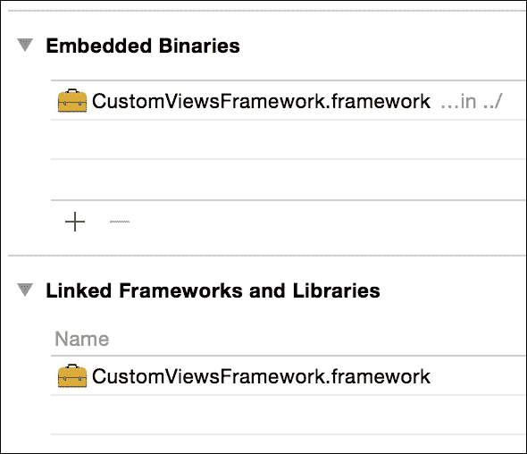

1.  现在既然你的应用已经了解了这个框架，你可以点击故事板，然后点击你拥有的唯一视图（不是视图控制器），转到身份检查器，将**类**名称字段更改为**CVGradientView**，并将其**模块**名称更改为**CustomViewsFramework**：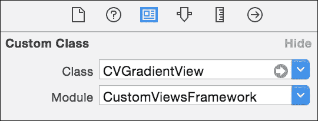

1.  按播放键并检查你的背景是否已更改。如果你想，甚至可以程序化地更改你的背景；只需点击视图控制器文件并开始导入你的框架：

    ```swift
    import CustomViewsFramework
    ```

1.  之后，例如，更改视图加载后的背景颜色：

    ```swift
        override func viewDidLoad() {
            super.viewDidLoad()
            (self.view as CVGradientView).color1 = UIColor.blueColor()
            (self.view as CVGradientView).color2 = UIColor.purpleColor()
        }
    ```

1.  再次按播放键，你会看到你的背景已经不同了。

## 它是如何工作的…

我们将这个项目命名为与其他项目不同的原因是因为框架的名称中不能有空格。在创建名称中包含空格的项目的情况下，你必须转到构建设置，并将产品名称更改为没有空格的名称。

属性`@IBDesignable`让界面构建器知道它应该直接在画布中渲染视图，但请记住，只有在你开发框架时才能使用此属性；它不会在传统应用上工作。

另一个属性（`@IBInspectable`）意味着这个属性可以通过界面构建器查看和设置。

注意，我们不得不将我们的类和一些属性和方法标记为公共的。原因是我们希望它们可以被外部模块访问。如果我们不这样做，这意味着只有我们的框架可以访问这个类。
