# 第九章。处理其他语言

在本章中，我们将涵盖：

+   使用我的旧地址簿

+   压缩信息

+   使用汇编代码与 Swift

+   与 Swift 共享 C++代码

# 简介

Swift 是在已经完成的库的世界中的新语言。有时你需要其他语言的帮助，否则你可能需要花费大量时间来创建你想要的功能。

如你所知，自 70 年代以来，C 一直是无论你想要在哪个平台上开发，默认的语言。有成千上万甚至数百万的库是用 C 编写的，你可以找到很多开源的，这使得它们更容易移植到你的 iOS 或 Mac OS 项目中。

在本章中，我们将学习如何在 Swift 项目中使用外部语言。在这里，我们将看到如何使用 C、C++甚至汇编代码。

# 使用我的旧地址簿

在这个菜谱中，我们将学习如何在 Swift 项目中使用 C 代码。在这种情况下，让我们假设我们想要回收一个用 C 编写的地址簿的链表，这样你就可以从设备地址簿中读取联系人并将它们存储在文件中。将结构存储在文件中的优点是，你可以使用没有 Swift 的其他平台打开相同的文件，例如 Linux 或 Windows。

## 准备工作

创建一个名为`Chapter 9 Address Book`的新项目；确保这个项目是一个 Swift 项目。

我们将检查在应用程序子文件夹内是否创建了一个新文件。正如你所知，没有使用第三方应用程序，我们无法看到任何设备应用程序文件夹。在这种情况下，我们将下载一个可以探索设备文件的应用程序，称为**iFunBox**。这个应用程序可以从[`www.i-funbox.com/`](http://www.i-funbox.com/)免费下载，但如果你更喜欢，还有其他免费应用程序和商业应用程序，如 iBrowser 和 iPad Folder。

### 小贴士

只有当你打算使用物理设备时，下载 iFunBox 才是必要的，如果你打算只使用模拟器，你可以使用传统的**Finder**窗口。

## 如何操作…

1.  我们需要采取的第一个步骤是添加一个新文件；在这种情况下，你应该选择一个 C 文件：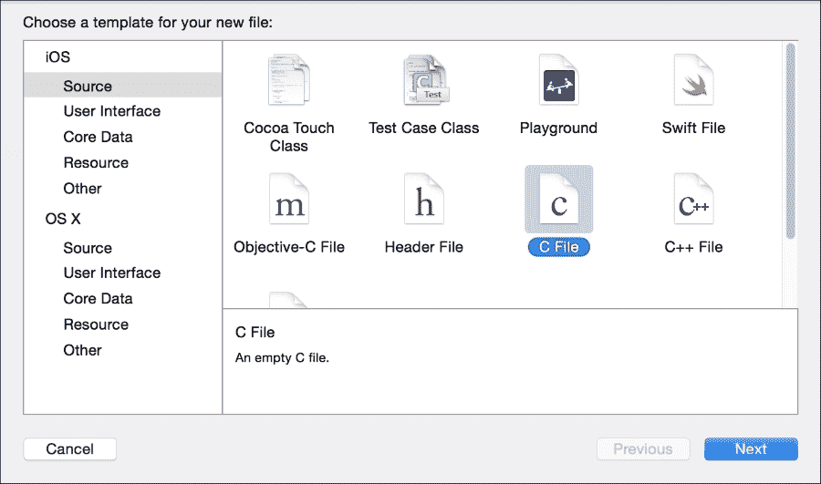

1.  然后，它会询问文件名；让我们称它为`AddressBook.c`并确保已选中**也创建一个头文件**选项：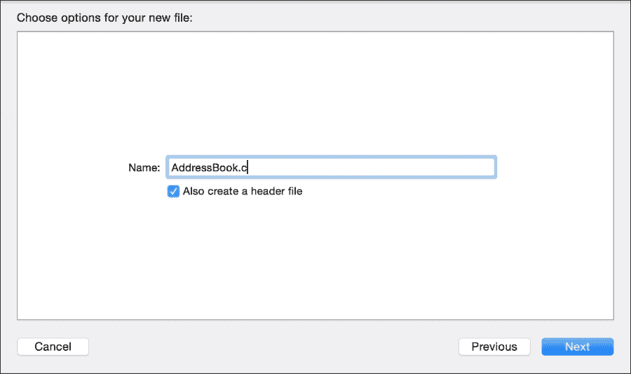

1.  选择与项目源代码存储相同的文件夹来存储这个新文件。之后，你会看到它会询问你是否要创建一个 Objective-C 桥接文件；点击**是**：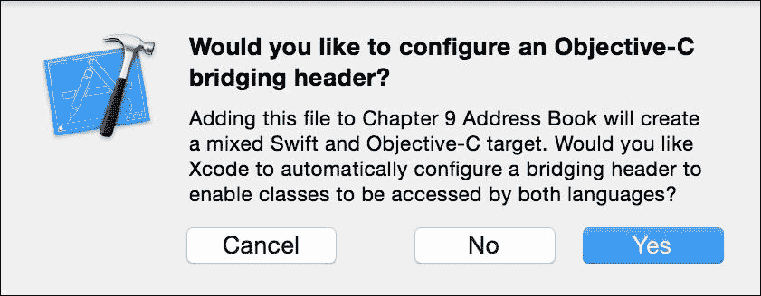

1.  现在，你可以看到有三个新的文件：`AddressBook.c`、`AddressBook.h`和`Chapter 9 Address Book-Bridging-Header.h`：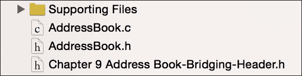

1.  在编码之前，首先点击桥接文件并导入`AddressBook.h`文件：

    ```swift
    #import "AddressBook.h"
    ```

1.  现在转到 `AddressBook.h`。在这里我们需要做的第一件事是移除 `stdio.h` 的包含。之后，您必须添加将在我们的应用程序中使用的结构体：

    ```swift
    struct Contact {
        char name[60];
        char phone[20];
        struct date {
            int day;
            int month;
            int year;
        } birthday;
    };

    struct ContactList {
        struct Contact contact;
        struct ContactList * next;
    };
    ```

1.  一旦定义了结构和其他类型，我们将添加可以对我们联系人列表执行的操作的函数头：创建一个新的联系人，初始化列表，销毁列表，添加一个新的联系人，并将联系人列表保存到文件中：

    ```swift
    struct Contact createContact();
    void initializeContactList(struct ContactList ** );
    void insertContact(struct ContactList **, struct Contact);
    void saveContactList(struct ContactList *, const char *);
    void destroyContactList(struct ContactList **);
    ```

1.  头文件已完成。如果您希望添加更多操作，例如在列表中查找联系人或删除联系人，请随意操作。现在让我们转到实现文件（`AddressBook.c`）并编写操作代码。如果您不理解这段代码，请不要担心；通常当您在 Swift 中使用 C 代码时，您只需要通过阅读其头文件来理解操作的功能：

    ```swift
    struct Contact createContact(){
        struct Contact newContact;
        strcpy(newContact.name, "");
        strcpy(newContact.phone, "");
        newContact.birthday.day = 0;
        newContact.birthday.month = 0;
        newContact.birthday.year = 0;
        return newContact;
    }

    void initializeContactList(struct ContactList ** contactList ){
        *contactList = NULL;
    }

    void insertContact(struct ContactList ** contactList, struct Contact contact){
        struct ContactList * newContactList = malloc(sizeof(struct ContactList));
        newContactList->next = *contactList;
        newContactList->contact = contact;
        *contactList = newContactList;
    }

    void saveContactList(struct ContactList * contactList, const char * filename){
        FILE * file = fopen(filename, "wb");
        if (file) {
            while (contactList) {
                fwrite(&contactList->contact, sizeof(struct Contact), 1, file);
                contactList = contactList->next;
            }
            fclose(file);
        }
    }

    void destroyContactList(struct ContactList ** contactList){
        struct ContactList * aux;
        while ((aux = *contactList)) {
            *contactList = (*contactList)->next;
            free(aux);
        }
    }
    ```

1.  C 部分已完成，现在您可以点击故事板并添加两个按钮来返回我们创建应用的方式；一个用于加载联系人，另一个用于将联系人保存到文件。将第一个按钮链接到名为 `fillContacts` 的函数，将第二个按钮链接到名为 `saveContacts` 的函数。目前不需要实现任何内容，我们很快将返回这些函数。

1.  由于我们需要从设备地址簿中读取联系人，我们需要将其添加到我们的项目中，因此点击项目导航器中的项目，确保目标 `Chapter 9 AddressBook` 的 **General Info** 选项卡被选中。在这里，您需要向下滚动到 **Linked Frameworks and Libraries** 并添加框架 **AddressBook**：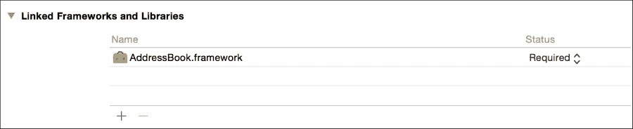

1.  返回到视图控制器，向上滚动到开头，并导入地址簿：

    ```swift
    import AddressBook
    ```

1.  在视图控制器类内部，我们将从属性开始，在这种情况下，我们只需要一个指向 `ContactList` 的列表：

    ```swift
    var list:UnsafeMutablePointer<ContactList> = nil
    ```

1.  即使我们已经通过分配 nil 值初始化了列表，我们仍然需要使用 C 特定的函数来初始化它，我们可以在 `viewDidLoad` 方法中这样做：

    ```swift
        override func viewDidLoad() {
            super.viewDidLoad()
            initializeContactList(&list)
        }
    ```

1.  如您可能已经注意到的，还有一个销毁列表的函数，这意味着我们需要在析构器中调用它：

    ```swift
        deinit{
            destroyContactList(&list)
        }
    ```

1.  现在我们可以实现按钮事件，让我们从从设备地址簿中加载联系人的按钮开始：

    ```swift
        @IBAction func fillContacts(sender: UIButton) {
            let status = ABAddressBookGetAuthorizationStatus()

            switch status {
            case .Authorized:
                // When the user has already authorized previously.
                self.readContacts()
            case .NotDetermined:
                // this case happens when it is the first time the user opens the app, so we have to request his permission
                var ok = false
                ABAddressBookRequestAccessWithCompletion(nil) {
                    (granted:Bool, err:CFError!) in
                    if granted {
                        self.readContacts()
                    }
                }
            case .Restricted:
                fallthrough
            case .Denied:
                // These cases are when for any reason the app can't access the contacts
                UIAlertView(title: "Not authorized", message: "This app isn't authorized for reading your contacts", delegate: nil, cancelButtonTitle: "OK").show()
            }
        }
    ```

    ### 注意

    记住，在 iOS 和 OS X 中，没有用户的许可，您不能读取地址簿。

1.  如您所见，有两个对方法 `readContacts` 的调用，所以这就是我们现在需要实现的方法：

    ```swift
        private func readContacts(){
            var err : Unmanaged<CFError>? = nil
            var myAddressBook: ABAddressBook = ABAddressBookCreateWithOptions(nil, &err).takeRetainedValue()
            let myContacts = ABAddressBookCopyArrayOfAllPeople(myAddressBook).takeRetainedValue() as NSArray as [ABRecord]

            for aContact in myContacts {
                var newContactRecord:Contact = createContact();

                // Retrieving name
                var nameString = ABRecordCopyCompositeName(aContact).takeRetainedValue() as String
                copyIntoCString(&newContactRecord.name, swiftString:nameString)

                // Retrieving phone
                var phones:ABMultiValue = ABRecordCopyValue(aContact, kABPersonPhoneProperty).takeRetainedValue() as ABMultiValue
                if(ABMultiValueGetCount(phones) > 0){
                    var phoneString = ABMultiValueCopyValueAtIndex(phones, 0).takeRetainedValue() as String
                    copyIntoCString(&newContactRecord.phone, swiftString:phoneString)
                }
                // Retrieving birthday
                if let date = ABRecordCopyValue(aContact, kABPersonBirthdayProperty).takeRetainedValue() as? NSDate {
                    var calendar = NSCalendar.currentCalendar().components([.Day, .Month, .Year], fromDate: date)
                    newContactRecord.birthday.day = Int32(calendar.day)
                    newContactRecord.birthday.month = Int32(calendar.month)
                    newContactRecord.birthday.year = Int32(calendar.year)
                }
                insertContact(&list, newContactRecord)
            }
            UIAlertView(title: nil, message: "The contacts were loaded", delegate: nil, cancelButtonTitle: "OK").show()
        }
    ```

1.  现在我们来实现保存联系人到文件的按钮；这个比较简单，因为我们只需要设置存储文件的完整路径并调用保存联系人的函数：

    ```swift
        @IBAction func saveContacts(sender: UIButton) {
            let documentDir:NSString = NSSearchPathForDirectoriesInDomains(.DocumentDirectory, .UserDomainMask, true)[0] as NSString
            var filename:NSString = documentDir.stringByAppendingPathComponent("contacts.dat") as NSString
            saveContactList(list, filename.UTF8String)
            UIAlertView(title: "Contacts saved", message: "contacts.dat was saved.", delegate: nil, cancelButtonTitle: "Ok").show()
        }
    ```

1.  应用程序看起来已经完成了，但是如果你尝试编译它，你会得到一个错误，因为缺少实现：函数 `copyIntoCString`。它是一个辅助函数，我们必须创建它。既然你可能需要在其他项目中使用它，让我们在新的文件中实现它。创建一个名为 `CstringUtils.swift` 的新文件，并添加以下代码：

    ```swift
    func copyIntoCString<T>(inout cstring: T, swiftString: String){
        withUnsafeMutablePointer(&cstring, { (cstr) -> Void in
            let fullSwinftString = swiftString + String(UnicodeScalar(0))
            let newCString = fullSwinftString.dataUsingEncoding(NSUTF8StringEncoding, allowLossyConversion: true)!
            newCString.getBytes(cstr, length: sizeofValue(cstring))
        })
    }
    ```

1.  好的，现在应用程序已经完成，但是你仍然需要测试它。按播放键，当请求时接受每个权限，并按按钮从地址簿检索联系人。当你收到联系人已加载的对话框时，你可以按保存按钮。在屏幕上，你可能只有如下对话框的结果：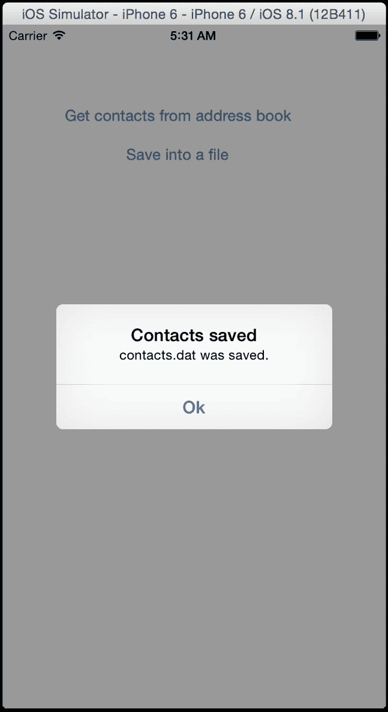

    如果你认为你没有获得很多视觉信息，你完全正确，因为这个应用程序不是为了做视觉上的事情而创建的；相反，它是为了生成文件。

1.  如果你正在使用物理设备，请打开您在食谱开始时下载的 iFunBox 应用程序（请注意，在撰写本文时，iFunBox 无法在 8.3 或更高版本上运行），展开 **用户应用程序** 部分，然后点击您的应用（**第九章 联系人簿**）。在右侧，双击文档文件夹，你应该会看到一个名为 `contacts.dat` 的文件：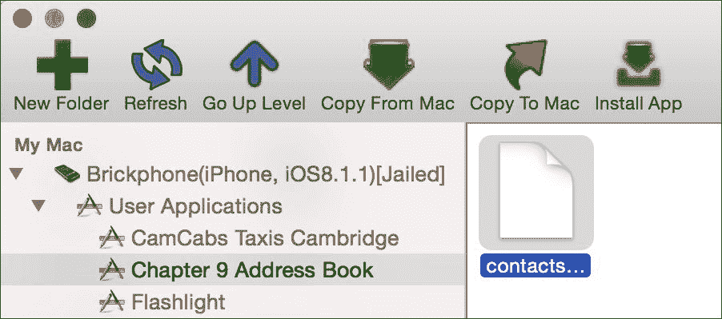

1.  如果你想要复制这个文件，你也可以通过在另一个平台上读取这个文件来进行相反的操作，但这个任务将留作作业。

## 它是如何工作的...

虽然 Xcode 会询问你是否要创建一个 Objective-C 桥接文件，但实际上它创建了一个也可以作为 C 桥接文件的文件。一旦你的 C 头文件被导入到这里，你就可以在 Swift 中使用它们。正如你可能已经注意到的，C 不与对象一起工作；你能做的唯一一件事是创建一个结构体（在 C 中没有方法）并通过一些函数将其作为参数传递。

C 类型在其名称前加上 `C` 前缀就有 Swift 中的等效类型，例如 `CChar`、`CInt`、`CFloat`，而结构体则保持其名称不变，不带 `struct` 这个词，就像你在 `ContactList` 和 `Contact` 中看到的那样。

另一个你必须考虑的特性是 C 使用指针。指针是一种信息引用，就像我们在联系人列表中拥有的那样。当你有 C 中的指针时，它们会被转换为 Swift 中的 `UnsafeMutablePointer`，双指针会被转换为 `UnsafeMutablePointer` 的 `UnsafeMutablePointer`，依此类推；这是 C 通过引用接收函数参数的风格。

当你想调用一个需要通过引用传递参数的 C 函数时，你必须使用 `&` 操作符。这意味着你正在发送该变量的内存地址。然而，Swift 声明通过引用传递参数的方式不同：你必须在参数名称之前添加 `inout` 属性。

在 Swift 中使用某些 C 类型有时需要一些技巧，例如，C 没有字符串类型；最相似的是字符数组，它有时被转换为`[CChar]`，有时被转换为`UInt8`的元组。如果你需要使用 C 变量而不通过获取其内存地址进行类型转换，你必须使用`withUnsafeMutablePointer`函数。

# 压缩消息

即使你只在一个内部项目中工作，你可能也需要使用库。有时它是一个 Swift 框架，但有时它是一个 C 库。使用 C 库现在非常普遍，主要是因为有很多这样的库。

对于这个菜谱，我们将使用一个非常有用的库：BCL。这个简单的库可以很容易地在 Xcode 中编译，并且每次你的项目需要压缩任何信息时，你都可以使用它。

## 准备工作

在我们开始编码这个项目之前，让我们下载 BCL 库。它可以在[`bcl.comli.eu/`](http://bcl.comli.eu/)找到，并且下载源代码是免费的。解压下载的文件并保持其查找窗口打开。

如果你打算将此应用安装到物理设备上，你需要下载之前提到的 iFunBox。

对于这个菜谱，不是创建项目，而是开始创建一个工作区，并将其命名为`Chapter 9 Compressing Workspace`。

## 如何操作…

1.  首先，你需要创建一个项目，但在这个情况下，不要创建单个视图应用，而是从**框架和库**部分选择**Cocoa Touch 静态库**并按**下一步**：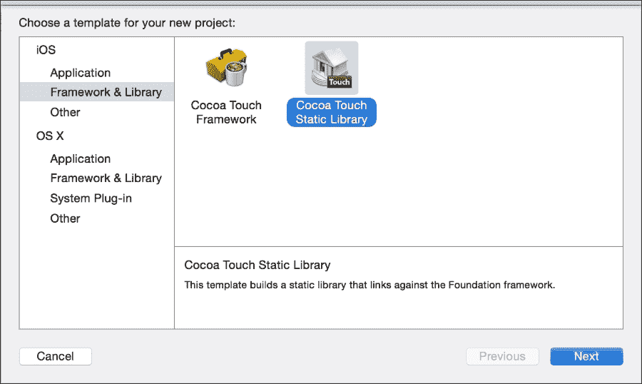

    ### 注意

    选择**Cocoa Touch 静态库**意味着以 C、C++或 Objective-C 进行开发。Swift 没有静态库。

1.  现在将你的项目命名为`Chapter 9 BCL`。注意，它并没有询问它是否是一个 Swift 项目：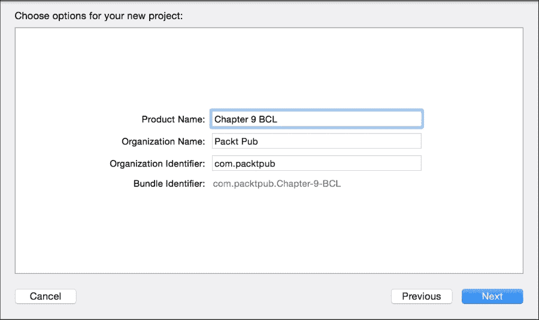

1.  在下一屏，你必须选择项目将要存储的目标文件夹，但在按下**创建**按钮之前，确保此项目属于你的工作区：

1.  确认此项目以两个源代码文件开始：`Chapter_9_BCL.h`和`Chapter_9_BCL.m`。删除它们，因为它们不是必需的。在删除时，你可以将它们移动到垃圾桶而不是仅仅删除引用：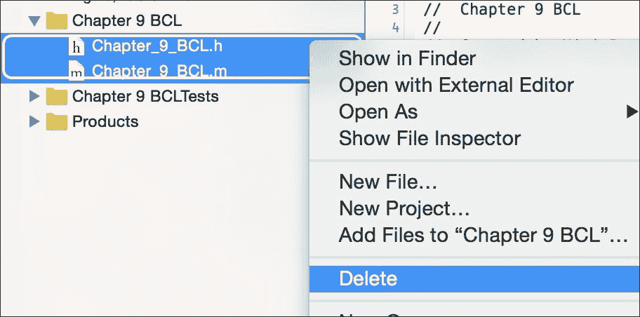

1.  现在将 BCL 库（位于`src`文件夹中）中以`.c`和`.h`结尾的文件拖到你的源代码组中：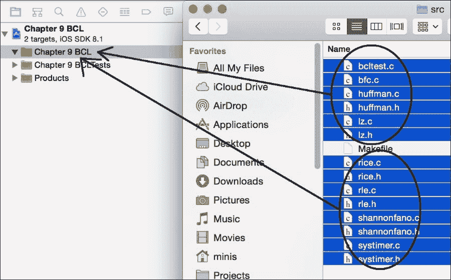

    ### 注意

    实际上，你不需要复制文件`bcltest.c`和`bcl.c`，因为它们属于 BCL 作为一个程序而不是作为库，但我们正在复制它们以简化操作。

1.  虽然您已经有了构建库所需的文件，但您仍然需要指示外部应使用的头文件。这是您每次构建用 C、C++或 Objective-C 编写的库时都必须执行的程序。要执行此操作，请从目标**Chapter 9 BCL**中选择**构建阶段**选项卡；之后，展开**复制文件**部分：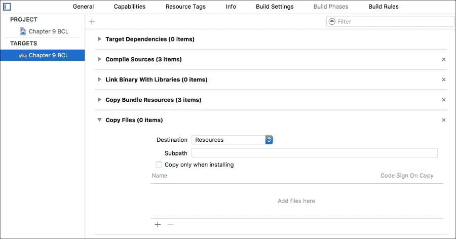

1.  现在，按此部分底部的加号键；将出现一个新对话框，显示可以导出的文件。仅选择头文件，如`huffman.h`、`shannonfano.h`和`rle.h`：

    ### 注意

    记住，您可以通过按住 command 键并单击文件来选择多个文件。

    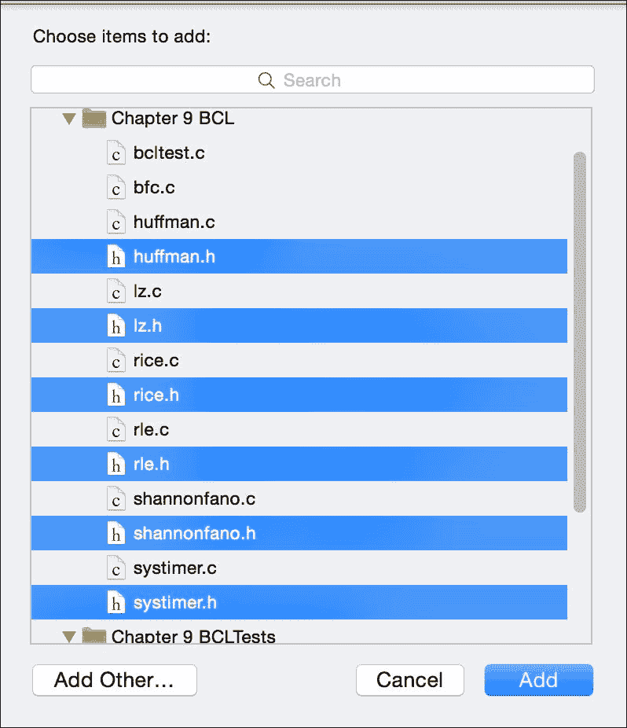

1.  库已完成，您需要通过按*command* + *b*来检查一切是否正常；您应该看到一个消息，表明构建已成功。

1.  本食谱的下一部分是创建一个压缩用户消息的应用。为此，不要关闭您的项目并创建一个新的项目；这次，不要选择静态库，而选择一个用 Swift 完成的单视图应用，并将其命名为`Chapter 9 BCLApp`。非常重要的一点是，您必须将此项目添加到工作区并分组为`Chapter 9 Compressing Workspace`。

1.  注意，现在我们有两个项目。确保通过单击它来选择应用，然后单击目标`Chapter 9 BCLApp`并选择常规信息选项卡。向下滚动到**链接框架和库**部分，如有必要展开它，然后按加号键。

1.  将会出现一个对话框，但这次将有一个新的组称为**工作区**；在这里，您必须选择**libChapter 9 BCL.a**：

    ### 注意

    静态库的名称总是以`lib`为前缀，并以`.a`为扩展名。

    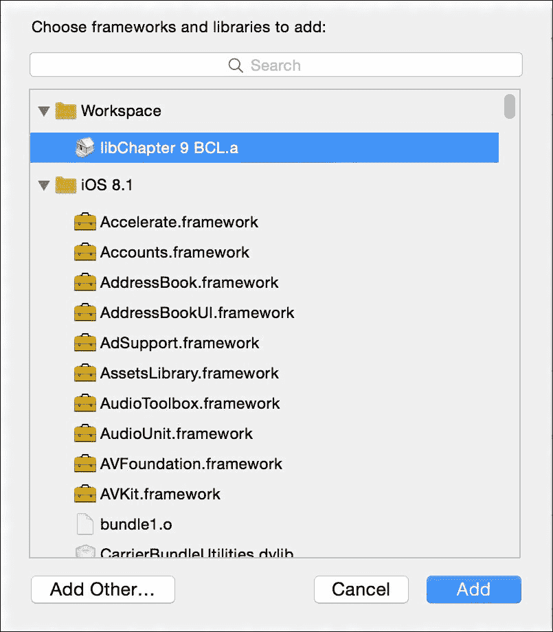

1.  一旦添加了库，您还需要向项目中添加一个新的头文件；让我们称这个文件为`BridgeHeader.h`。

1.  在我们开始编码此文件之前，让我们将此文件设置为应用的桥接文件；因此，您必须转到您应用的**构建设置**，在搜索框中输入**桥接**，一旦找到字段**Objective-C 桥接头**，请输入`Chapter 9 BCLApp/BridgeHeader.h`：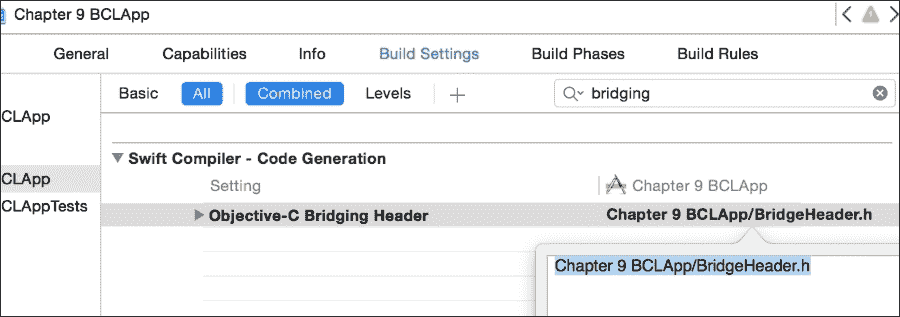

1.  让我们回到`BridgeHead.h`并添加一些包含语句以使用压缩库：

    ```swift
    #include <Chapter 9 BCL/huffman.h>
    #include <Chapter 9 BCL/lz.h>
    #include <Chapter 9 BCL/rice.h>
    #include <Chapter 9 BCL/rle.h>
    #include <Chapter 9 BCL/shannonfano.h>
    #include <Chapter 9 BCL/systimer.h>
    ```

1.  应用现在已链接到库，这意味着从现在起，您可以返回到 Swift 编程。转到故事板，添加一个文本视图和两个按钮。通常，文本视图默认带有文本；如果您想，您可以保留它，这样在测试时会更方便。将文本视图链接，命名为`textView`：

    ```swift
        @IBOutlet weak var textView: UITextView!
    ```

1.  之后，您必须添加按钮的动作。对于第一个按钮，将其标签更改为 Huffman，并链接到以下动作：

    ```swift
        @IBAction func huffman(sender: UIButton) {
            let text = self.textView.text
            let textIn:UnsafeMutablePointer<UInt8> = UnsafeMutablePointer<UInt8>((text as NSString).UTF8String)
            let textOut:UnsafeMutablePointer<UInt8> = UnsafeMutablePointer<UInt8>.alloc(countElements(text) * 101 / 100 + 320)
            let outsize = Huffman_Compress(textIn, textOut, UInt32( countElements(text)))
            save("huffman.dat", data: textOut, dataSize: Int(outsize))
        }
    ```

1.  使用第二个按钮，您可以执行相同的操作；将其标签更改为`lz`，并用以下类似代码进行链接：

    ```swift
        @IBAction func lz(sender: UIButton) {
            let text = self.textView.text
            let textIn:UnsafeMutablePointer<UInt8> = UnsafeMutablePointer<UInt8>((text as NSString).UTF8String)
            let textOut:UnsafeMutablePointer<UInt8> = UnsafeMutablePointer<UInt8>.alloc(countElements(text) * 257 / 256 + 1)
            let outsize = LZ_Compress(textIn, textOut, UInt32( countElements(text)))
            save("lz.dat", data: textOut, dataSize: Int(outsize))
        }
    ```

1.  如你所想，最后一步是实现保存功能，这可以通过以下代码轻松实现：

    ```swift
        private func save(filename: String, data: UnsafePointer<UInt8>, dataSize: Int){
            let nsData = NSData(bytes: data, length: dataSize)
            let path = NSSearchPathForDirectoriesInDomains(.DocumentDirectory, .UserDomainMask, true)[0] as String + "/\(filename)"
            NSFileManager.defaultManager().createFileAtPath(path, contents: nsData, attributes: nil)
        }
    ```

1.  应用程序已经完成，然而，仍然有必要对其进行测试。为此，你必须确保在方案组合中选择应用，否则当你按播放键时，什么都不会发生：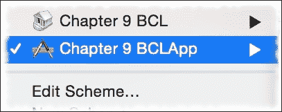

1.  现在按播放键，在文本字段中写一条消息，然后按`huffman`按钮，接着按`lz`按钮。与之前的食谱类似，你不会看到任何视觉上吸引人的东西，但如果你在 iFunBox 中展开应用并打开文档文件夹，你会看到文件大小。如果你不想复制文件就查看列表视图：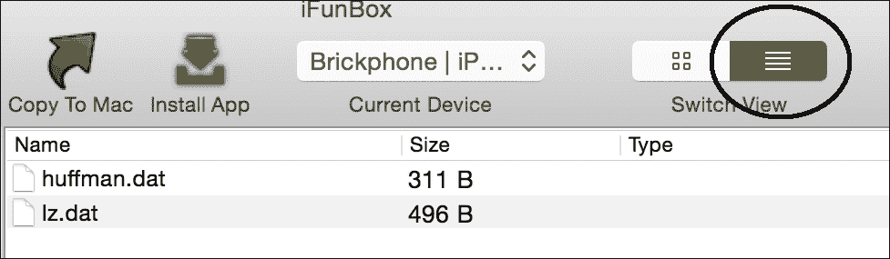

## 它是如何工作的…

当你有一个大项目时，你可以将其分解成小组件；为此，你可以将你的项目分解成小项目。这样做的一个好方法是创建工作区。

工作区就像项目之间的连接，使得将一个项目（在这个例子中是 BCL 静态库）的使用应用到另一个项目（在这个例子中是应用）变得更容易。

### 小贴士

避免创建一个巨大的项目，相反，尝试将其分解成小项目；这将使你的项目更容易维护，并简化问题解决方案的查找，甚至创建单元测试。

静态库是直接复制到你的项目中的东西，这意味着你的项目会增大，但你不会担心库更新可能会破坏你的应用。每次你创建一个静态库，你必须导出头文件，这些文件包含可以公开使用的函数。

记住，即使你有一个静态库在同一工作区，你仍然需要在你的项目中链接它并创建一个桥接文件。

你还可以看到我们使用了新的方法：`alloc`。`alloc`方法用于创建具有特定大小的 C 数组；记住，C 中的数组是不可调整大小的，如果你要在它们上存储任何东西，你必须为它分配足够的内存。

也有一种新的类型：`UnsafePointer`。这样做的原因是 C 函数可以接收常量或变量作为参数，例如，接收`const char *`与`char *`不同；第一个被认为是`UnsafePointer`，第二个是`UnsafeMutablePointer`。不安全的可变指针可以隐式地转换为不安全的指针，但反过来则不然。

### 还有更多…

如你所见，这个库中有更多压缩类型；你可以尝试使用其中几个，看看哪个是最好的。

在下一个食谱中，我们将学习如何使用汇编代码与 Swift 结合。如果你真的需要性能，这个特性非常有用。

# 使用汇编代码与 Swift

在这个菜谱中，我们将学习如何使用 Swift 与汇编代码。当然，如今没有人仅使用汇编代码进行开发，但在需要性能的部分使用汇编代码是非常常见的。例如，图像处理程序使用汇编代码，因为它在通过硬件处理某些内容时比通过软件要快得多。

显然，使用汇编语言编程有其缺点，第一个缺点是您可能需要为不同的处理器重写源代码，例如，如果您为旧款 iPhone（32 位 ARM 处理器）编写了汇编代码，您可能需要为新设备（64 位 ARM 处理器）重写它们，即使有了这两段代码，如果您希望看到您的应用程序在 iPhone 模拟器上运行（Intel 处理器），您可能还需要第三次编写代码。

这次我们将使用一个非常简单的代码，因为本书的范围不包括教授 ARM 架构。在这种情况下，我们将创建一个简单的变量交换函数。

## 准备工作

对于这个菜谱，建议使用物理设备，但这不是强制性的，因为您可以从命令行编译，指定您想要编译的架构。

创建一个名为 `Chapter 9 Assembly` 的新 Swift 单视图应用程序，添加一个名为 `AssemblyCode.c` 的新文件，当 Xcode 询问是否创建桥接文件时，点击 **是**。

## 如何操作…

1.  首先，您必须点击桥接头文件（`Chapter 9 Assembly-Bridging-Header.h`）并包含文件 `AssemblyCode.h`：

    ```swift
    #include "AssemblyCode.h"
    ```

1.  然后，转到 `AssemblyCode.h` 并添加以下头文件：

    ```swift
    void swap(int * firstnumber, int * secondnumber);
    ```

1.  定义完成后，您必须在 `AssemblyCode.c` 中编写实现代码。这里我们将使用一个非常简单的代码，它可以用于 32 位和 64 位，但请注意，在更复杂的代码中，您可能需要将它们分开：

    ```swift
    void swap(int * firstnumber, int * secondnumber){
    #if defined __arm64__ || defined __arm__
        asm volatile (
                      "EOR %[first],%[first], %[second] \n\t"
                      "EOR %[second],%[second], %[first] \n\t"
                      "EOR %[first],%[first], %[second] \n\t"
                      : /* outputs */ [first]"=r"(*firstnumber), [second]"=r"(*secondnumber)
                      : /* inputs */ [first]"r"(*firstnumber), [second]"r"(*secondnumber)
                      );
    #else
    #error "Architecture not allowed"
    #endif
    }
    ```

1.  汇编部分已完成；点击故事板并创建一个包含两个标签、两个文本字段和一个按钮的布局。将标签文本更改为 **第一个数字** 和 **第二个数字**；在文本字段中用一些示例数字替换占位符，并将按钮文本更改为 **交换数字**。最终结果应类似于以下内容：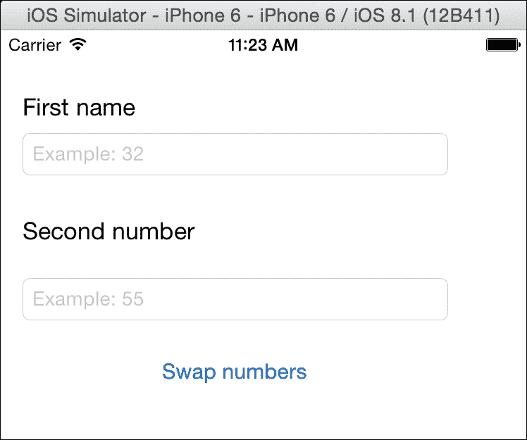

1.  点击故事板上的每个文本字段，并在属性检查器中将键盘类型更改为 **数字和标点符号**：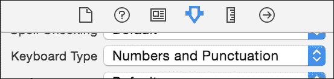

1.  在将用户视图放置到故事板后，您必须将文本字段与视图控制器链接，并命名为 `firstNumberTextField` 和 `secondNumberTextField`：

    ```swift
        @IBOutlet weak var firstNumberTextField: UITextField!
        @IBOutlet weak var secondNumberTextField: UITextField!
    ```

1.  然后，将按钮与以下操作链接：

    ```swift
        @IBAction func swapNumbers(sender: UIButton) {
            var number1 = Int32(Int(self.firstNumberTextField.text!))
            var number2 = Int32(Int(self.secondNumberTextField.text!))
            swap(&number1, &number2)
            self.firstNumberTextField.text = "\(number1)"
            self.secondNumberTextField.text = "\(number2)"
        }
    ```

1.  应用程序已完成，让我们测试它。首先，将设备切换到 **iPhone 6** 模拟器并按播放：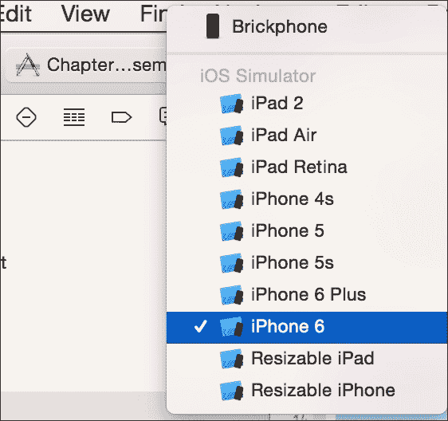

1.  如果收到错误消息，没关系。只需注意消息与您在 `AssemblyCode.c` 文件上写的内容相同：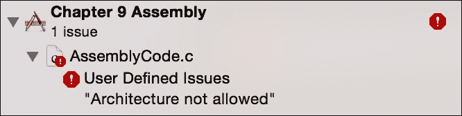

1.  现在将你的 Apple 设备连接到电脑上，在活动方案中选择它，然后再次按播放。你应该能看到应用，所以输入两个不同的数字（每个文本字段一个），然后按交换按钮。结果是它们交换了它们的文本字段。

## 它是如何工作的……

在 C 或 Objective-C 层编写汇编代码是你需要做的事情，这意味着你仍然需要知道这些语言是如何转换为 Swift 的。使用`as volatile`语句可以让你编写汇编代码。在这个语句内部，你有最多四个部分，由冒号分隔：

+   第一部分是一个字符串（只有一个）是你的汇编模板；我们没有写多个字符串。注意，在 C 和 Objective-C 中，如果你写两个常量字符串，它们被视为一个。在这里，你可以使用`%[assembly variable name]`或`%0, %1`等指定变量。

+   第二部分是输出变量；你可以通过使用方括号给你的汇编模板命名，并且在括号内你可以指定等效的 C 变量。

+   第三部分是输入变量，它们的工作方式与输出变量类似。

+   最后的部分（我们还没有使用）被称为“覆盖”。覆盖寄存器是指在汇编代码块中其值被修改的寄存器。编译器将知道不要期望保留旧的寄存器值。

    ### 小贴士

    注意编写大量的汇编代码，因为调试它可能非常困难。

如前所述，汇编代码是平台相关的，这意味着在不同的平台上使用时可能会有所不同，比如在模拟器上、在旧款 Apple 设备上，或者在使用新的 64 位设备上。为了区分它们，你可以使用宏`__arm__`用于 32 位设备，以及`__arm64__`用于新的 ARM 设备。

通常你会看到包含汇编代码的函数，并带有`inline`关键字。这样做是因为当性能真正需要时，汇编代码会被使用，程序员试图告诉编译器将函数代码复制到它被调用的地方，而不是跳转到函数实现。不幸的是，为了做到这一点，你必须在头文件中实现函数，而 Swift 不接受这种方式。

## 还有更多……

当你需要调试在发布配置下编译的应用程序时，汇编代码也是非常有趣的东西。有一个很好的网站可以学习 ARM 汇编代码：[`www.peter-cockerell.net/aalp/html/frames.html`](http://www.peter-cockerell.net/aalp/html/frames.html)。

你还可以研究 NEON 来了解如何处理向量、双字寄存器等，如果你还想了解更多，你可以研究内联函数，这些是调用 ARM 指令的 C 函数。

如果你自己在想，如果汇编代码非常复杂，那些需要高性能的游戏是如何开发的，答案是使用 C++。在下一个菜谱中，我们将使用它与 Swift 结合。

# 与 Swift 共享 C++代码

如果你有一些用 C++ 或 Objective-C++ 编写的代码或外部库，当你收到苹果的通知，说你不能像使用 C 或 Objective-C 一样直接在 Swift 中使用 C++，你可能会感到非常惊讶。

仍然有一个解决方案，那就是创建你自己的包装器。有一些尝试，比如 SwiftPP ([`github.com/sandym/swiftpp`](https://github.com/sandym/swiftpp))，但它们仍然非常不成熟。在这个菜谱中，我们将看到如何将你的 C++ 类包装起来以便在 Swift 中使用。

在这个菜谱中，我们将包装一个用于 Swift 的 C++ XML 创建器。如果你不知道 C++，不要担心，这个菜谱的目的是让你知道如何创建这种类型的代理类。

## 准备工作

对于这个菜谱，我们需要下载一个用于创建 XML 文件的纯 C++ 库；在这种情况下，选择的库是 `pugixml`。所以在我们开始之前，打开你的网络浏览器，转到 [`pugixml.org/`](http://pugixml.org/)（或者直接在 Google 中搜索 pugixml）并解压它。之后，创建一个新的 Swift 单视图项目，命名为 `第九章 Xml 包装器`。

## 如何操作…

1.  首先，我们将创建两个项目组，所以右键单击源代码组，选择 **新建组** 并将其命名为 `Pugi`。重复此操作，将第二个组命名为 `PugiWrapper`。

1.  现在返回到 **Pugi** 源代码查找器窗口。在这里，你需要打开 `src` 文件夹，然后使用快捷键 *command* + *a* 选择所有文件并将它们拖到 `Pugi` 组中。当需要创建桥接文件时接受创建：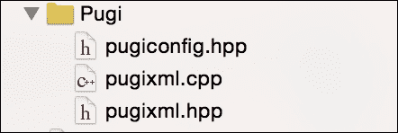

1.  现在转到 `PugiWrapper` 组，创建一个新文件；这次你必须从 **iOS 源** 部分选择 **Cocoa Touch Class**。这个文件应该命名为 `PugiBase`。它必须是 `NSObject` 的子类，并确保选择了 Objective-C 语言：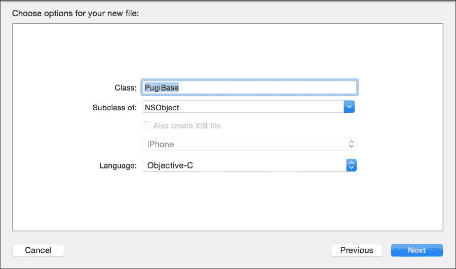

1.  点击刚刚创建的文件 `PugiBase.h`，开始将 `pugixml.hpp` 文件包含进来，以防它来自 C++ 文件：

    ```swift
    #ifdef __cplusplus
    #include "pugixml.hpp"
    #endif
    Now we can define this class with the following code.
    @interface PugiBase : NSObject
    @property (nonatomic, assign) void * element;
    -(instancetype) init;
    @end
    Once this class interface is defined we can implement it, in this case only the initializer is necessary by setting the property to NULL.
    @implementation PugiBase
    -(instancetype) init{
        self = [super init];
        if(self){
            self.element = NULL;
        }
        return self;
    }
    @end
    ```

    ### 小贴士

    现在你有了 MinGW 和 MSYS，你不再需要羡慕那些有 Linux 安装的用户了，因为他们已经在你的系统中实现了 Linux 开发环境的最重要部分。

1.  这个类已经完成了，所以下一步是创建一个将继承自 `PugiBase` 的类。为此，向 `PugiWrapper` 组添加一个新的 **Cocoa Touch Class** 并将其命名为 `PugiNodeAttribute`。对于这个类，我们将要创建的唯一方法是 `setValue`。了解这一点后，转到 `PugiNodeAttribute.h` 文件，并添加以下代码：

    ```swift
    #import "PugiBase.h"

    @interface PugiNodeAttribute : PugiBase
    -(void) setValue:(NSString *) value;
    @end
    ```

1.  实现这个类很简单，但是有一个重要的细节：这个类的实现将是 C++；这意味着在输入任何内容之前，将这个文件从 `PugiNoteAttribute.m` 重命名为 `PugiNodeAttribute.mm`（Objective-C++ 扩展）：

1.  点击重命名的文件，并使用以下代码完成类的实现：

    ```swift
    @implementation PugiNodeAttribute

    -(void) setValue:(NSString *) value{
        if(self.element){
            reinterpret_cast<pugi::xml_attribute *>(self.element)->set_value([value UTF8String]);
        }
    }

    @end
    ```

1.  现在属性已经完成，我们可以重复操作为节点（XML 标签），因此创建一个名为 `PugiNode` 的 Cocoa Touch 类文件，将 `.m` 重命名为 `.mm`，进入头文件并添加以下代码：

    ```swift
    #import "PugiBase.h"
    #import "PugiNodeAttribute.h"

    @interface PugiNode : PugiBase
    -(PugiNode*) appendChild:(NSString *) name;
    -(PugiNodeAttribute *) appendAttribute:(NSString *) name;
    @end
    For the implementation just add this code.
    #import "PugiNode.h"
    #import "PugiNodeAttribute.h"

    @implementation PugiNode

    -(PugiNode*) appendChild:(NSString *) name{
        if (self.element) {
            PugiNode * newNode = [PugiNode new];
            newNode.element = new pugi::xml_node(reinterpret_cast<pugi::xml_node*>(self.element)->append_child([name UTF8String]));
            return  newNode;
        }
        return nil;
    }
    -(PugiNodeAttribute *) appendAttribute:(NSString *) name{
        if (self.element){
            PugiNodeAttribute * newAttribute = [PugiNodeAttribute new];
            newAttribute.element = new pugi::xml_attribute(reinterpret_cast<pugi::xml_node*>(self.element)->append_attribute(name.UTF8String));
            return newAttribute;
        }
        return nil;
    }

    @end
    ```

1.  为了完成封装类，我们只需要创建另一个代表 XML 文档的类。再次创建一个新的 Cocoa Touch 类，这次命名为 `PugiDocument`。将实现文件从 `.m` 重命名为 `.mm`，并将以下代码添加到 `.h` 文件中：

    ```swift
    #import "PugiBase.h"
    #import "PugiNode.h"

    @interface PugiDocument : PugiBase

    -(instancetype) init;
    -(PugiNode *) appendChild:(NSString *) name;
    -(void) saveFile:(NSString *) path;

    @end
    On the implementation file (PugiDocument.mm) add the following code.
    @implementation PugiDocument

    -(instancetype) init{
        self = [super init];
        if(self){
            self.element = new pugi::xml_document;
        }
        return self;
    }

    -(PugiNode *) appendChild:(NSString *) name{
        if(self.element){
            PugiNode * newNode = [PugiNode new];
            newNode.element = new pugi::xml_node(reinterpret_cast<pugi::xml_document *>(self.element)->append_child([name UTF8String]));
            return newNode;
        }
        return nil;
    }

    -(void) saveFile:(NSString *) path{
        if (self.element) {
            reinterpret_cast<pugi::xml_document *>(self.element)->save_file(path.UTF8String);
        }
    }

    @end
    ```

1.  封装步骤已经完成，因此现在我们可以在我们的应用中使用这些类，但我们仍然需要创建另一个类，这个类将用于我们的应用并在创建 XML 文件之前存储用户信息。这个类将是一个纯 Swift 类，所以将一个名为 `Task.swift` 的新 Swift 文件添加到项目中，并添加以下代码：

    ```swift
    class Task {
        var description:String
        var important :Bool

        init(description:String, important: Bool){
            self.description = description
            self.important = important
        }
    }
    ```

1.  在我们开始编写视图控制器代码之前，别忘了你必须将封装类的头文件导入到桥接文件中。所以点击桥接文件（`Chapter 9 Xml Wrapper-Bridging-Header.h`）并添加以下行：

    ```swift
    #import "PugiDocument.h"
    #import "PugiNode.h"
    #import "PugiNodeAttribute.h"
    ```

1.  现在，通过点击故事板文件并添加三个标签、两个按钮、一个文本框和一个 UISwitch 来模拟我们的视图，就像以下图像所示：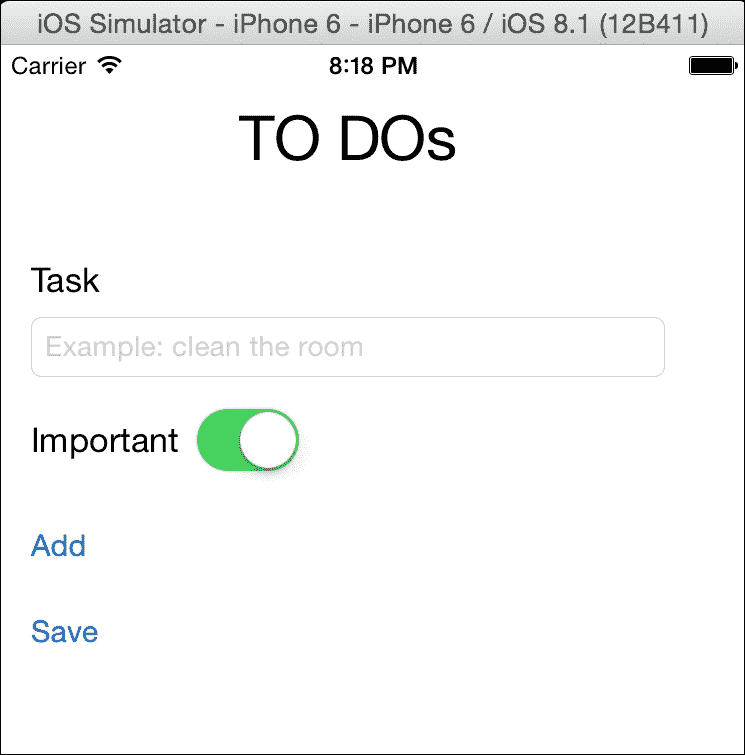

1.  现在，将文本框与视图控制器连接，并命名为 `taskTextField`，而 `UISwitch` 应该命名为 `importantSwitch`。生成的代码应该像这样：

    ```swift
        @IBOutlet var taskTextField: UITextField!
        @IBOutlet var importantSwitch: UISwitch!
    ```

1.  现在我们可以添加一个新的属性来存储用户任务：

    ```swift
        var tasks = [Task]()
    ```

1.  我们需要做的最后一件事是为按钮创建事件。将添加按钮与以下代码连接：

    ```swift
        @IBAction func addTask(sender: AnyObject) {
            tasks.append(Task(description: taskTextField.text, important: importantSwitch.on))
            taskTextField.text = ""
            importantSwitch.on = false
        }
    ```

1.  好的，现在我们可以通过以下操作将保存按钮最终化：

    ```swift
        @IBAction func saveXml(sender: AnyObject) {
            var document = PugiDocument()!
            var mainNode = document.appendChild("tasks")
            var path = (NSSearchPathForDirectoriesInDomains(.DocumentDirectory, .UserDomainMask, true)[0] as NSString).stringByAppendingPathComponent("tasks.xml") as String;
            for task in tasks {
                let node = mainNode.appendChild("task")
                let attributeDescription = node.appendAttribute("description")
                attributeDescription.setValue(task.description)
                let attributeImporant = node.appendAttribute("important")
                attributeImporant.setValue(task.important ? "yes" : "no")
            }
            document.saveFile(path)
        }
    ```

1.  恭喜，应用完成了！按播放键并添加一些任务，例如 **打扫房间** 或 **努力学习 Swift**。一旦完成，你可以按 **保存** 按钮。发生了什么？打开你的 iFunBox 或等效应用程序，检查应用的 `Documents` 文件夹。

## 它是如何工作的…

pugixml 是一个易于使用的极简 XML 库。在这种情况下，我们只封装了必要的最小代码，即标签属性、XML 标签（称为 **node**）以及完整的 XML 文档。当然，这个库中还有更多类，如果你想的话可以完成代码。

如前所述，C++ 不能直接在 Swift 中使用，但你可以创建一个调用 C++ 的 Objective-C 类。这里有一个重要的细节：你可以创建 Objective-C 类，但不能创建 Objective-C++ 类，这意味着类接口不能包含任何 C++ 对象。

我们如何解决这个问题？每个 C++ 对象（如属性或属性）都必须声明为 `void*`（指向任何内容的非安全指针）并且参数或返回值必须是另一个封装类。

### 提示

为了更好地兼容 Swift 和 Objective-C，尽量使用两种语言都通用的类型，而不是 C 或 C++ 类型，例如使用 `NSString` 而不是 `char*`。
