# 第十一章. 扩展、照片及其他

在本章中，我们将涵盖以下菜谱：

+   开发最酷的键盘

+   是时候服用你的药片了

+   为你的照片添加效果

+   成为电影评论家

+   留下痕迹

+   创建货币转换器应用程序

+   Swift 中的方法交换

+   Swift 中的关联对象

# 简介

这是本书的最后一章。在这里，我们将学习前几章未提及的不同主题，主要是 Xcode 6 的新功能。

# 开发最酷的键盘

应用扩展是一个新特性，其中应用程序可以附带一些插件，这些插件甚至可以与其他应用程序交互。

在这种情况下，我们将为极客开发一个键盘。这个键盘将只包含两个键：键 *0* 和键 *1*。当你输入八个键的组合时，你会得到一个新的字符。

## 准备工作

对于这个菜谱，请确保您有 iOS 8，无论您使用的是模拟器还是物理设备。自定义键盘功能仅在 iOS 8 上可用。

创建一个名为 `Chapter 11 Geekboard` 的新单视图应用程序，让我们开始编码。

## 如何操作…

1.  此菜谱的主要开发基于自定义键盘的应用扩展。然而，由于我们需要一个视图来测试我们的键盘，让我们先点击故事板，并在我们的视图中添加一个文本字段。将此文本字段与名为 `inputTextField` 的视图控制器链接：

    ```swift
        @IBOutlet weak var inputTextField: UITextField!
    ```

1.  现在，让我们使这个文本字段成为即将启动的应用程序的首个响应者。您不需要点击字段来显示键盘：

    ```swift
        override func viewDidLoad() {
            super.viewDidLoad()
            self.inputTextField.becomeFirstResponder()
        }
    ```

1.  这是我们必须使用此视图控制器编写的所有内容；其他所有内容都将由应用程序扩展完成。下一步是打开菜单，并向我们的项目添加一个新目标。在这种情况下，从 **应用程序扩展** 部分中选择 **自定义键盘**：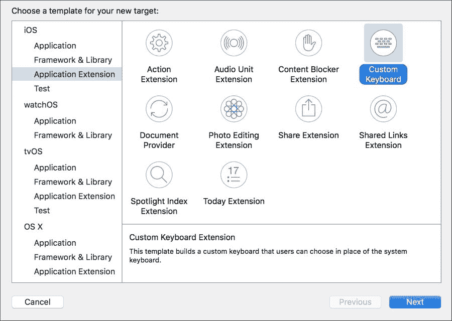

1.  将此目标命名为 `Geekboard`，当对话框询问激活 **Geekboard** 方案时按 **是**：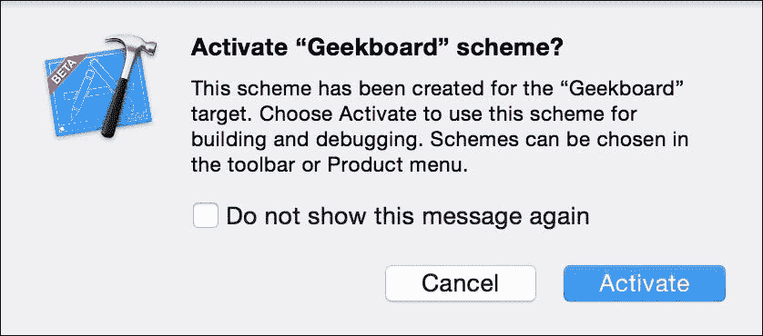

1.  在编码之前，让我们先向此目标添加一个新视图；因此，从菜单中选择新文件，并在 **用户界面** 部分中选择 **视图**：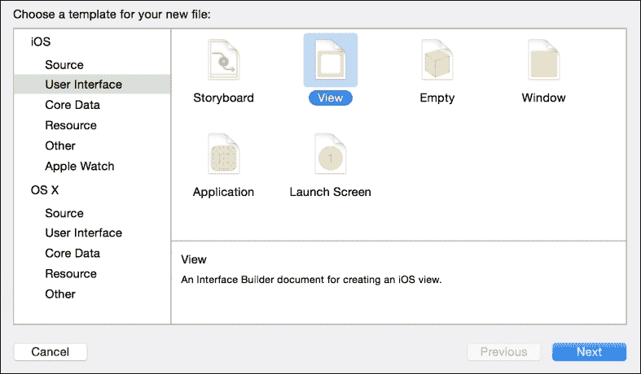

1.  将此视图命名为 `Geekboard`（再次），但在按下 **创建** 按钮之前，确保此文件属于扩展目标，如下面的截图所示：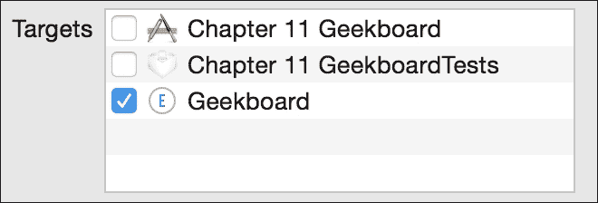

1.  创建完成后，点击新文件（`Geekboard.xib`），选择它拥有的唯一视图，然后通过点击 **属性检查器** 来更改一些属性。在这里，您需要将大小更改为 **自由形式**，状态栏更改为 **无**，背景颜色更改为银色：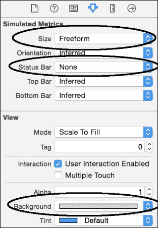

1.  太好了！之后，选择 **大小检查器**，将视图大小更改为 **320** x **160**：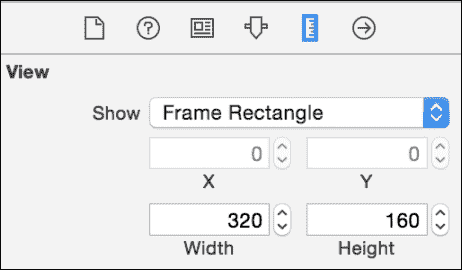

1.  视图属性已完成，现在我们需要设置文件的拥有者类。要做到这一点，请单击文件的拥有者图标（黄色立方体），选择身份检查器，并将类名更改为`KeyboardViewController`：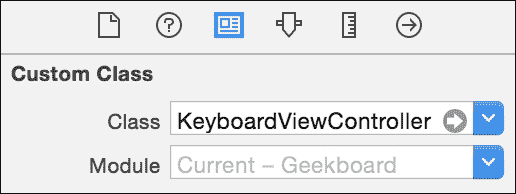

1.  在这个 XIB 文件中，我们还需要做一件事：我们必须为此布局添加一些组件。添加一个标签，让用户知道所制作的二进制组合，以及两个按钮：一个代表数字 0，另一个代表数字**1**。它应该看起来类似于以下截图：

1.  当然，标签将会被更改，按钮不需要不同的动作，因为唯一的区别是数字值；因此，我们将为两个按钮创建相同的动作并通过检查发送者来区分它们。总结一下，根据以下代码将标签和按钮与`KeyboardViewController`链接：

    ```swift
        @IBOutlet var button0: UIButton!
        @IBOutlet var button1: UIButton!
        @IBOutlet var label:UILabel!
    ```

    ### 注意

    不要删除`KeyboardViewController`上由 Xcode 完成的任何代码。如果需要删除任何代码，它将明确写出。

1.  将两个按钮与一个名为`addBit`的空动作链接。不用担心它的内容，我们稍后会开发它：

    ```swift
        @IBAction func addBit(sender: UIButton){
        }
    ```

1.  在`KeyboardViewController`中，我们还将添加两个用于控制当前键盘状态的属性：

    ```swift
        var currentBinaryText:String = ""
        var currentBinaryNumber:Int = 0
    ```

1.  现在我们需要设置视图，所以转到`viewDidLoad`方法，在`super.viewDidLoad`之后和苹果预编译代码之前添加一些代码行：

    ```swift
        override func viewDidLoad() {
            super.viewDidLoad()
            // Perform custom UI setup here
     var geekNib = UINib(nibName: "Geekboard", bundle: nil)
     self.view = geekNib.instantiateWithOwner(self, options: nil)[0] as UIView
     self.label.text = currentBinaryText
            self.nextKeyboardButton = UIButton.buttonWithType(.System) as UIButton
    …
    ```

1.  打完这些后，我们可以通过开发按钮事件来完成我们的应用程序：

    ```swift
        @IBAction func addBit(sender: UIButton){
            var number: Int
            switch sender{
            case button0:
                number = 0
            case button1:
                number = 1
            default:
                return
            }
            currentBinaryText += "\(number)"
            currentBinaryNumber = currentBinaryNumber * 2 + number
            if countElements(currentBinaryText) == 8 {
                var proxy = textDocumentProxy as UITextDocumentProxy
                proxy.insertText(String(UnicodeScalar(currentBinaryNumber)))

                currentBinaryNumber = 0
                currentBinaryText = ""
            }
            self.label.text = currentBinaryText
        }
    ```

1.  应用程序已经完成，让我们来测试它。按下播放键，当应用程序启动时，显示的键盘不是我们的键盘！！！发生了什么？原因是您必须以与在设备上添加另一种语言键盘相同的方式添加此键盘。

1.  考虑到这一点，按住主页按钮，进入设置，选择通用，然后键盘，然后键盘选项中的另一个选项，最后选择**添加新键盘...**。

1.  您应该会看到一些建议的键盘和另一个包含第三方键盘的部分。从该部分选择**Geekboard**：

1.  返回您的应用程序（**第十一章 Geekboard**），您将看到键盘还没有出现。因此，您必须轻触地球图标，直到您获得键盘，然后，哇！它开始工作了。例如，键入这个二进制消息：`01001000 01000101 01001100 01001100 01001111`，但如果您真的很酷，您可以去**邮件**应用程序，只用这个键盘写一封电子邮件。你接受挑战吗？

## 它是如何工作的…

自定义键盘是一个称为**应用扩展**的功能。它有一些限制，例如，它不能用于密码和其他文本字段类型，如电话联系人。它也不能在其顶部显示任何内容。

创建一个自定义键盘意味着创建一个 `UIInputViewController` 类型的控制器，这是一个继承自 `UIViewController` 的类，这意味着如果需要，你可以使用 `UIViewController` 的方法。

为了使键盘开发更简单，我们添加了一个新的 XIB 文件，这使得我们可以直观地创建布局。一些开发者认为，由于故事板被整合，XIB 文件已被从 Xcode 中移除，然而你可以看到这并不正确；你仍然可以使用 XIB 文件来定制一些视图，例如键盘或表格单元格。

将文本提交到文本字段非常简单：你只需要创建一个 `UITextDocumentProxy` 对象并使用 `insertText` 方法。它将神奇地知道活动文本字段。

## 还有更多…

自定义键盘的通信有点有限，因为它默认不能使用网络或与包含的应用程序共享任何文件。如果你希望使用这些功能，你必须进入它的 `Info.plist` 并将选项 `RequestsOpenAccess` 设置为 `yes`。

在下一个菜谱中，我们将学习一些不同的事情：我们将为 Apple Watch 开发。

# 现在是吃药的时候了

在这个世界上，谁从未生病过？让我们面对现实，迟早我们都会生病，我们必须遵循医生的处方。如果你像我一样，在吃药的时候经常看手表，也许我们需要的是一个可以告诉我们这个信息的应用程序，这次它将是一个 Apple Watch 应用程序。

## 准备工作

对于这个菜谱，你需要 Xcode 6.2 或更高版本，因为我们将要使用 WatchKit，这在之前的版本中不可用。

按照惯例，只需创建一个单独的视图 iOS 应用程序，并将其命名为 `第十一章 红丸`。

## 如何操作…

1.  我们需要做的第一步是创建一个新的目标，但这次你必须从 **WatchKit** 部分的 **WatchKit 应用** 中添加：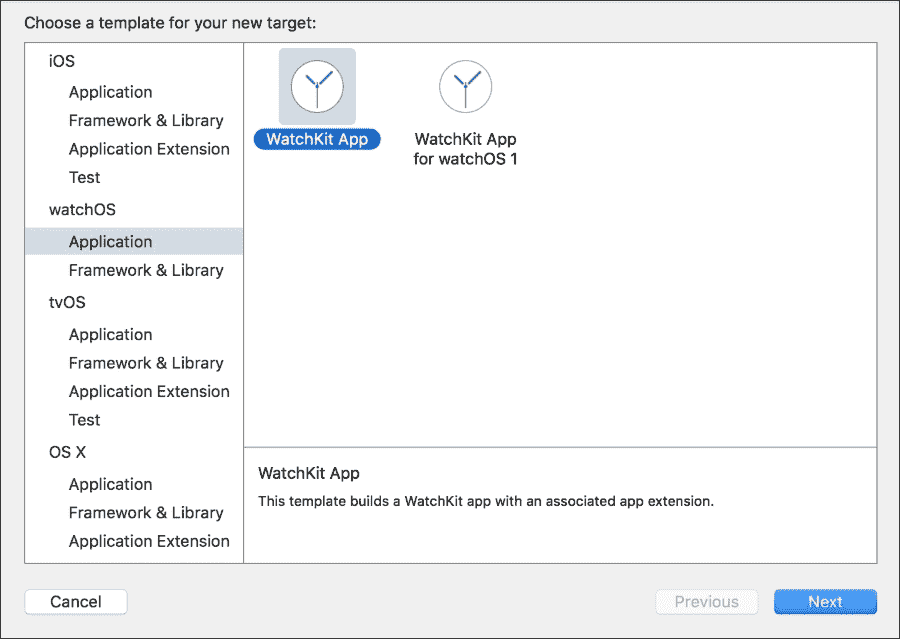

1.  在 **下一步** 对话框中取消选中通知、快速查看和复杂功能选项；这将使项目更简洁：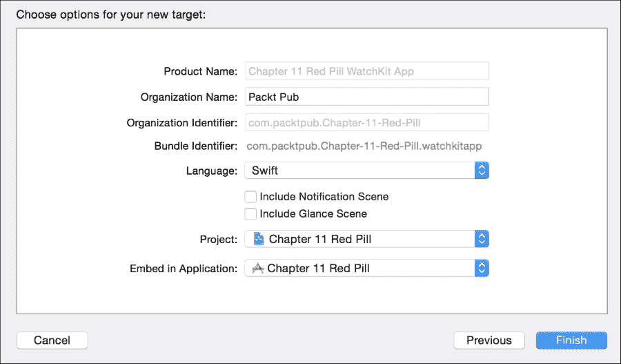

1.  之后，将出现一个请求激活 WatchKit 应用的对话框；通过按下 **激活** 按钮接受它：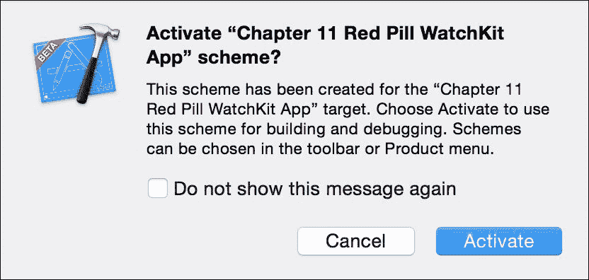

1.  你可以看到在你的项目中有两个新的组：一个用于 WatchKit 扩展，另一个用于 WatchKit 应用。打开你的扩展组，添加一个名为 `FrequencyData.swift` 的新 Swift 文件。这里你只需要输入以下简单的代码：

    ```swift
    class FrequencyData: CustomStringConvertable {
        var description: String {
            switch self.time {
            case 0 ..< 60:
                return "Every \(self.time) minutes"
            case 60 ..< (24 * 60):
                return "Every \(self.time/60) hours"
            default:
                return "Every \(self.time/60/24) days"
            }
        }

        var time:Int // minutes

        init(time:Int){
            self.time = time
        }   
    }
    ```

1.  现在转到你的 WatchKit 应用组，展开它，并点击故事板。这里你有一个类似于视图控制器的东西，但在这里它被称为界面。在你的界面中添加一个标签，并尝试让它适合整个屏幕。将其与界面控制器作为 IBOutlet 连接：

    ```swift
        @IBOutlet var label:WKInterfaceLabel!
    ```

1.  创建一个新的界面，放置另一个标签；你不必连接它，只需将其文本更改为 `现在是吃药的时候了`。如果它不适合，将标签的行数更改为两行。

1.  现在点击第一个界面，按住控制键并将其拖动到第二个界面。现在您的 Storyboard 可能看起来像以下这样：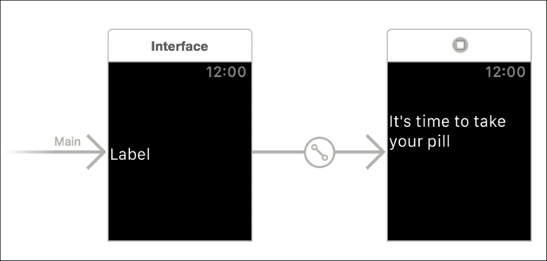

1.  选择第二个界面，并转到其属性检查器。将标识符设置为`its_time`：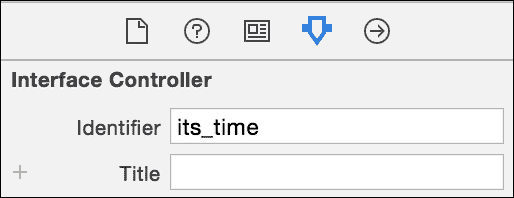

1.  返回到扩展组，并打开`InterfaceController`文件。像往常一样，我们将从添加必要的属性开始：

    ```swift
        var timer:NSTimer?
        var remainingTime:Int?
        var context:AnyObject?
        var options = [FrequencyData(time: 2), FrequencyData(time:4 * 60), FrequencyData(time: 8 * 60), FrequencyData(time: 24 * 60)]
    ```

1.  现在在`awakeWithContext`方法上初始化上下文：

    ```swift
        override func awakeWithContext(context: AnyObject?) {
            super.awakeWithContext(context)
            self.context = context
        }
    ```

1.  之后，我们必须请求用户选择他需要服用药片的时间。在`willActivate`方法中执行此操作：

    ```swift
        override func willActivate() {
            super.willActivate()
            let texts = options.map({ (freq) -> String in
                return freq.description
            })
            self.presentTextInputControllerWithSuggestions(texts, allowedInputMode: WKTextInputMode.Plain, completion: {
            selections in
               var index = find(texts, selections[0] as String)!
                var frequency = self.options[index]
                self.timer?.invalidate()
                self.remainingTime = frequency.time * 60
                self.timer = NSTimer.scheduledTimerWithTimeInterval(1, target: self, selector: Selector("tick"), userInfo: nil, repeats: true)
            })
        }
    ```

1.  如您所见，我们需要一个名为`tick`的方法，它将每秒被调用一次。按照这种方式编写代码：

    ```swift
        func tick(){
            var rt = remainingTime!
            let formatter = NSDateComponentsFormatter()
            formatter.unitsStyle = .Short
            let components = NSDateComponents()
            components.second = rt % 60
            rt = rt / 60
            components.minute = rt % 60
            rt = rt / 60
            components.hour = rt % 24
            rt = rt / 24
            components.day = rt
            if components.hour > 6 {
                label.setText("Still have time")
            }else if components.hour == 0 && components.minute == 0{
                label.setText("A few secs: \(components.second)")
            }else {
                label.setText( formatter.stringFromDateComponents(components))
            }
            remainingTime!--
            if(remainingTime == 0){

                presentControllerWithName("its_time", context: self.context)
                timer?.invalidate()
            }
        }
    ```

1.  应用程序已完成，让我们通过将当前方案更改为`第十一章红丸 WatchKit 应用程序`并按播放来测试它。您应该看到一个像以下这样的对话框：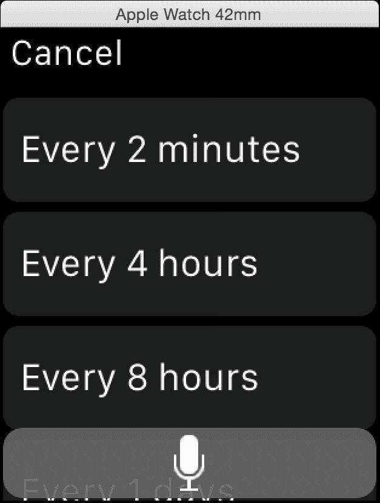

    ### 注意

    选择 2 分钟，这只是为了测试，等待直到您收到警报。

## 它是如何工作的...

如您所见，组件类不同；我们有的不是`UIViewController`，而是`WKInterfaceController`，我们有的不是`UILabel`，而是`WKInterfaceLabel`。一些方法也不同，例如，界面控制器在`awakeWithContext`方法上初始化其属性，而不是在`viewDidLoad`方法上。

## 还有更多...

有一个名为`WKInterfaceTimer`的组件，它的工作方式就像我们使用`NSTimer`一样。在这个菜谱中，我们使用了`WKInterfaceLabel`与`NSTimer`，因为它更灵活，您可以自定义组件上的文本。

### 注意

WatchKit 具有更多功能，如通知和快速查看。请尝试查看官方文档：[`developer.apple.com/library/ios/documentation/General/Conceptual/WatchKitProgrammingGuide/index.html#//apple_ref/doc/uid/TP40014969`](https://developer.apple.com/library/ios/documentation/General/Conceptual/WatchKitProgrammingGuide/index.html#//apple_ref/doc/uid/TP40014969)

在下一个菜谱中，我们将回到 iOS，学习如何使用相机拍照。

# 为您的照片添加效果

令人难以置信的是，手机已经取代了传统的照相机。我记得我们过去只会在特殊事件时携带相机，而现在我们的相机无处不在。我们可以这样说，手机已经更进一步：您可以在手机上拍照，编辑它，并与您的朋友和家人分享。

在这个菜谱中，我们将学习如何以非常简单的方式使用手机拍照并编辑它。

## 准备工作

由于我们将使用设备相机进行此菜谱，因此您需要一个物理设备来测试此应用程序。如果您使用的是图库中的照片，则可以更改它，但您还需要将一些图片上传到模拟器中。

创建一个名为`第十一章照片效果`的项目，然后继续前进。

## 如何操作…

1.  打开你的项目，点击目标配置的 **通用设置** 并添加一个名为 **CoreImage** 的框架。之后进入故事板，在其下添加一个图像视图和四个按钮。将按钮标签更改为 `Take photo`、`Sepia`、`Blur` 和 `Dots`。

1.  将图片与视图控制器作为属性连接并命名为 `imageView`。现在为每个按钮创建一个动作，分别命名为 `takePhoto`、`sepia`、`blur` 和 `dots`。现在不必担心它们的实现内容，我们稍后会填充它们：

    ```swift
        @IBOutlet var imageView: UIImageView!
        @IBAction func takePhoto(sender: UIButton) {
        }
        @IBAction func sepia(sender: AnyObject) {
        }
        @IBAction func blur(sender: AnyObject) {
        }
        @IBAction func dots(sender: AnyObject) {
        }
    ```

1.  点击视图控制器源代码，让我们通过添加一个名为 `image` 的可选类型 `UIImage` 的新属性来开始完善它：

    ```swift
        var image:UIImage?
    ```

1.  `UIImagePickerController` 需要一个代理，并且只接受也是导航控制器代理的对象，因此将这些协议附加到视图控制器定义中：

    ```swift
    class ViewController: UIViewController, UIImagePickerControllerDelegate, UINavigationControllerDelegate {
    ```

1.  几乎是时候开始编写函数了，但我们仍然需要添加一个细节：我们必须在文件顶部导入核心图像：

    ```swift
    import CoreImage
    ```

1.  好的，到目前为止，我们可以开始编写视图控制器方法。首先在 `viewDidLoad` 方法中检查你的设备是否有相机：

    ```swift
        override func viewDidLoad() {
            super.viewDidLoad()
            if !UIImagePickerController.isSourceTypeAvailable(.Camera){
                UIAlertView(title: "Error", message: "There is no camera", delegate: nil , cancelButtonTitle: "OK").show()
            }
        }
    ```

1.  下一步是完善 `takePhoto` 方法。此方法初始化图片选择器并调用相机视图：

    ```swift
        @IBAction func takePhoto(sender: UIButton) {
            let imagePicker = UIImagePickerController()
            imagePicker.delegate = self
            imagePicker.allowsEditing = true
            imagePicker.sourceType = .Camera
            self.presentViewController(imagePicker, animated: true, completion: nil)
        }
    ```

1.  如你所想，代理至少需要有一个方法；在这种情况下，我们需要一个方法来接收用户拍摄的图片，另一个方法是在取消的情况下：

    ```swift
        func imagePickerController(picker: UIImagePickerController, didFinishPickingMediaWithInfo info: [NSObject : AnyObject]){
            image = info[UIImagePickerControllerEditedImage] as? UIImage
            self.imageView.image = image;
            picker.dismissViewControllerAnimated(true, completion: nil)
        }
        func imagePickerControllerDidCancel(picker: UIImagePickerController){
            picker.dismissViewControllerAnimated(true, completion: nil)
        }
    ```

1.  一旦我们完成这些，我们只需要完善效果代码；它们非常相似但并不相同，所以这里它们是：

    ```swift
        @IBAction func sepia(sender: AnyObject) {
            if image != nil {
                var ciImage = CIImage(image: image)
                let filter = CIFilter(name: "CISepiaTone")
                filter.setValue(ciImage, forKey: kCIInputImageKey)
                filter.setValue(0.8, forKey: "inputIntensity")
                ciImage = filter.outputImage
                self.imageView.image = UIImage(CIImage: ciImage)
            }
        }
        @IBAction func dots(sender: AnyObject) {
            if image != nil {
                var ciImage = CIImage(image: image)
                let filter = CIFilter(name: "CIDotScreen")
                filter.setValue(ciImage, forKey: kCIInputImageKey)
                ciImage = filter.outputImage
                self.imageView.image = UIImage(CIImage: ciImage)
            }
        }
        @IBAction func blur(sender: AnyObject) {
            if image != nil {
                var ciImage = CIImage(image: image)
                let filter = CIFilter(name: "CIGaussianBlur")
                filter.setValue(ciImage, forKey: kCIInputImageKey)
                ciImage = filter.outputImage
                self.imageView.image = UIImage(CIImage: ciImage)
            }
        }
    ```

1.  应用程序已完成。现在按播放，拍照，并选择你最喜欢的效果。

## 它是如何工作的…

`UIImagePickerController` 是为了方便使用相机而创建的；这样我们就不必使用复杂的相机设置，也不必担心它的不同状态。要使用 `UIImagePickerController`，你需要一个代理，在其方法中你可以检索用户拍摄的图片作为 `UIImage`。

在接收到图片后，你可以使用 Core Image 添加一些效果；但是你需要将 `UIImage` 转换为 `CIImage`。如果你从本地文件加载了 `UIImage`，你可以通过调用一个属性 `CIImage` 来轻松转换；然而，这种情况并不适用，因为这张图片是从相机加载的，所以你需要创建一个新的对象并将你的 `UIImage` 作为参数传递。

现在你可以使用相应的值使用你想要的过滤器。当你使用 `CIFilter` 时，你必须检查它接受的属性；有时你可以使用默认值，有时你可能想更改它们。

在使用过滤器后，你可以使用 `outputImage` 属性检索你的图片，然后你可以使用生成的 `CIImage` 构造一个新的 `UIImage`。

## 参见

+   `CoreImage`有很多过滤器，所以现在没有必要寻找修改我们图片的库或算法。检查[`developer.apple.com/library/ios/documentation/GraphicsImaging/Reference/CoreImageFilterReference/index.html#//apple_ref/doc/uid/TP40004346`](https://developer.apple.com/library/ios/documentation/GraphicsImaging/Reference/CoreImageFilterReference/index.html#//apple_ref/doc/uid/TP40004346)上可用的过滤器，并用不同的属性测试它们。

+   在下一个菜谱中，我们将学习如何将信息从 iPhone 发送到我们的 Mac。

# 成为电影评论家

有时候，应用程序需要从您的设备传输信息到电脑，反之亦然；例如，您可能在回家的路上在 iPad 上观看电影（假设您不是司机），然后您将在电脑上继续观看。

对于这种类型的场景，苹果创造了一种名为**Handoff**的新技术。想法很简单：在另一台设备上继续您正在进行的任务。

在这个菜谱中，我们将创建一个应用程序，用户可以在一台设备上开始撰写他对电影的看法，并在 Mac 应用程序中查看。这个菜谱将被分成更小的部分，以便更容易消费。

## 准备中

Handoff 框架有软件和硬件要求。软件要求是 Xcode 6、iOS 8 和 OS X Yosemite（10.10）；因此请确保您的硬件能够使用所有这些软件版本（或更高版本）。不幸的是，Handoff 不能与模拟器一起使用。另一个软件要求是，两台设备（电脑和您的苹果移动设备）必须登录到同一个 iCloud 账户，并且它们必须配对。

硬件要求是它具有蓝牙 LE 4.0。检查您的 iPhone 或 iPad 是否可以使用此功能的简单方法是打开设置，进入通用，检查是否有名为**Handoff & Suggested Apps**的选项：

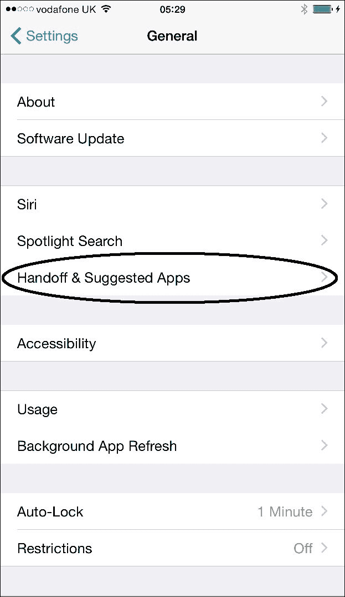

确保 Handoff 选项已开启，如下面的截图所示：

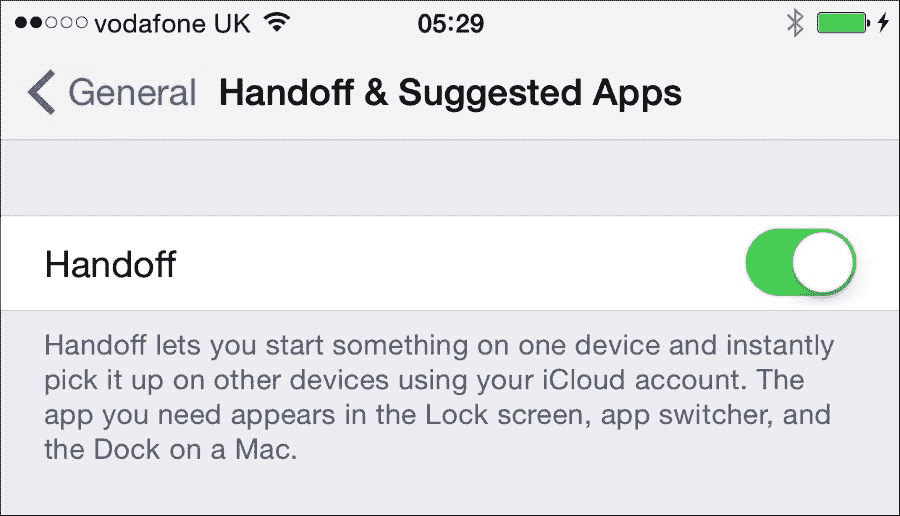

一旦您检查了设备要求，就是时候检查电脑是否符合要求了。在您的 Mac 电脑上，打开系统偏好设置，然后打开**通用选项**，确认 Handoff 选项已勾选：

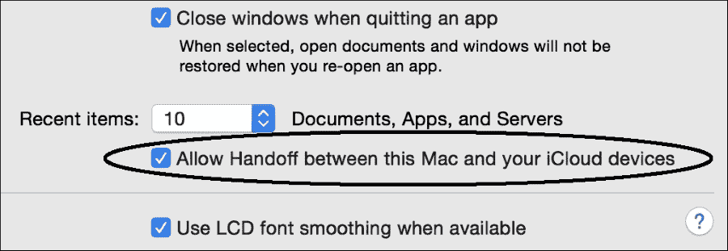

### 注意

在所有要求中，最复杂的是这项技术需要由团队（或开发者）签名的应用程序，这意味着需要在每个平台上的苹果开发计划中注册。这意味着如果您打算在移动设备和 mac 电脑之间使用这项技术，您需要两个订阅。

在这个菜谱中，我们将使用这两个平台，但如果您只有 iOS 订阅，将 Mac 应用更改为 iOS 应用非常简单。

现在我们可以开始编码项目；在这种情况下，开始创建一个名为 `Chapter 11 Films` 的工作空间。

## 如何做这件事...

我们将食谱分成三个小食谱，以便更好地理解。

### 创建工作空间

1.  在名为 `Common Code` 的组中创建工作空间；在这里，您需要添加一个名为 `FilmData.swift` 的新 Swift 文件，我们将添加以下简单的类：

    ```swift
    class FilmData {
        var name:String
        var year:Int?
        var director:String?
        var score:Int?
        var opinion = ""

        init(name:String){
            self.name = name
        }
    }
    ```

1.  让我们创建一个名为 `Chapter 11 Films iOS` 的新 iOS 项目。确保它将被添加到您的组合框中的工作空间：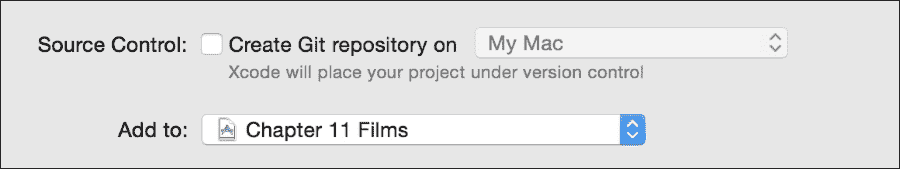

1.  使用名为 `Chapter 11 Films MacOSX` 的 Mac OS X Cocoa 应用程序重复此过程，但请注意，您必须将其添加到工作空间中，并且组也必须在工作空间中：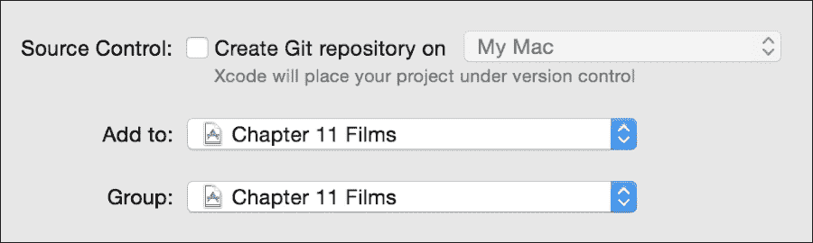

1.  一旦我们有了这两个项目，让我们将我们在本食谱开头创建的第一个文件（`FilmData.swift`）添加到它们中。这样我们就不必为每个项目重复代码：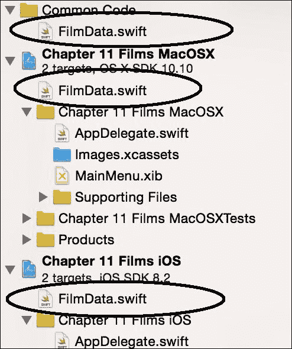

1.  一旦我们有了这些通用部分，我们将继续进行 Mac 应用程序的开发。因此，点击 Mac 项目，转到 **General Settings**，将签名部分更改为 **Developer ID**，并选择您的团队账户：

1.  现在点击位于 **Supporting Files** 组中的 `info.plist` 文件，添加一个名为 **NSUserActivityTypes** 的新键。将其类型更改为数组，尝试展开它，但如您所见，没有项目，因此点击加号并写入值 `com.packtpub.editingfilm`：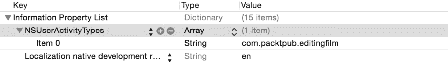

1.  下一步是点击 XIB 文件，并将五个标签添加到我们唯一的窗口中。将它们一个接一个地放置，然后从第一个开始连接到 `AppDelegate.swift`：

    ```swift
        @IBOutlet var titleLabel: NSTextField!
        @IBOutlet var directorLabel: NSTextField!
        @IBOutlet var yearLabel: NSTextField!
        @IBOutlet var scoreLabel: NSTextField!
        @IBOutlet var opinionLabel: NSTextField!
    ```

1.  之后，我们只需将以下代码添加到 `AppDelegate` 中：

    ```swift
    func application(application: NSApplication, willContinueUserActivityWithType userActivityType: String) -> Bool {
            return userActivityType == "com.packtpub.editingfilm"
        }

        func application(application: NSApplication, continueUserActivity userActivity: NSUserActivity, restorationHandler: ([AnyObject]!) -> Void) -> Bool {
            func setField (fieldName:String, uiField:NSTextField) {
                if let value = userActivity.userInfo![fieldName] as? String {
                    uiField.stringValue = value
                }else if let value = userActivity.userInfo![fieldName] as? Int {
                    uiField.stringValue = String(value)
                }
                else{
                    uiField.stringValue = "-"
                }
            }
            setField("title", titleLabel)
            setField("director", directorLabel)
            setField("year", yearLabel)
            setField("score", scoreLabel)
            setField("opinion", opinionLabel)

            return true
        }
    ```

1.  好的，Mac 应用程序已完成；在我们按播放之前，请记住您必须登录到 iCloud 才能这样做，因此您必须打开 **系统偏好设置**，然后转到 iCloud 并登录。

    ### 注意

    记住，这个账户必须与您将在移动设备上使用的账户相同。完成后，返回您的应用程序并按播放。您应该看到一个带有一些标签的窗口——现在不用担心它们，因为我们稍后会检查它们。

### 开发应用程序的 iOS 部分

1.  在这个时候，我们已经准备好开发应用程序的 iOS 部分。首先，您必须在主项目目标上设置您的团队，并在 `info.plist` 上添加键 `NSUserActivityTypes`。就像我们在 Mac 应用程序中所做的那样，将其类型更改为 Array，并添加值 `com.packtpub.editingfilm`，就像我们在 Mac 应用程序中所做的那样。

1.  点击故事板，就像往常一样，你可能只会看到一个视图控制器。点击它，进入**编辑器**菜单，向下移动到选项`嵌入`并选择**导航控制器**。正如你所预期的那样，我们稍后会添加第二个视图控制器。现在只需通过点击导航控制器，选择属性检查器，取消选择选项**显示导航栏**：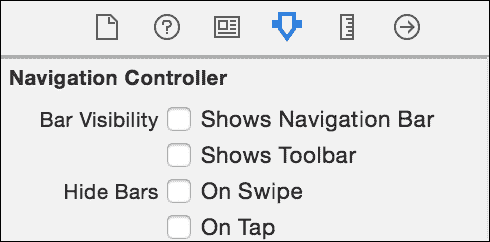

1.  现在返回到原始视图控制器，并在其中简单地添加一个表格视图。在这种情况下，我们需要显示一些带有内容的单元格，并且当它们被选中时还需要做一些事情。这意味着我们需要将视图控制器设置为`UITableViewDelegate`和`UITableViewDatasource`：

    ```swift
    class ViewController: UIViewController, UITableViewDataSource, UITableViewDelegate {
    ```

1.  之后，将表格视图与视图控制器作为数据源和代理绑定。作为数据源，我们需要一个`FilmData`数组的数组，它将是一个使用私有函数初始化的属性：

    ```swift
        let movies = createBasicMovieArray()
    ```

1.  当然，我们在这里会收到一个错误，因为我们需要实现这个函数，所以请在类外部实现它：

    ```swift
    private func createBasicMovieArray() -> [FilmData] {
        var movieArray = [FilmData]()

        var filmData = FilmData(name: "A Clockwork Orange")
        filmData.year = 1971
        filmData.director = "Stanley Kubrick"
        movieArray.append(filmData)

        filmData = FilmData(name: "Monty Python and the Holy Grail")
        filmData.year = 1975
        filmData.director = "Terry Gilliam"
        movieArray.append(filmData)

        filmData = FilmData(name: "Kill Bill")
        filmData.year = 2003
        filmData.director = "Quentin Tarantino"
        movieArray.append(filmData)

        filmData = FilmData(name: "Ghost Busters")
        filmData.year = 1984
        movieArray.append(filmData)

        return movieArray
    }
    ```

1.  之后，我们需要在视图控制器类中完成数据源方法：

    ```swift
    func tableView(tableView: UITableView, numberOfRowsInSection section: Int) -> Int{
            return movies.count
        }

        func tableView(tableView: UITableView, cellForRowAtIndexPath indexPath: NSIndexPath) -> UITableViewCell{
            var cell  = tableView.dequeueReusableCellWithIdentifier("filmcell") as? UITableViewCell

            if (cell == nil) {
                cell = UITableViewCell(style: UITableViewCellStyle.Subtitle, reuseIdentifier: "filmcell")
            }

            let currentFilm = movies[indexPath.row]
            cell!.textLabel?.text = currentFilm.name
            let unknown = "????"
            cell!.detailTextLabel?.text = "\(currentFilm.year != nil ? String(currentFilm.year!) : unknown) - \(currentFilm.director != nil ? currentFilm.director! : unknown)"

            return cell!
        }
    ```

1.  即使如此，应用还没有完成。你应该按播放并测试它，你会看到一个类似于以下视图。别忘了确保你已经选择了正确的模式；否则，它将重新启动应用：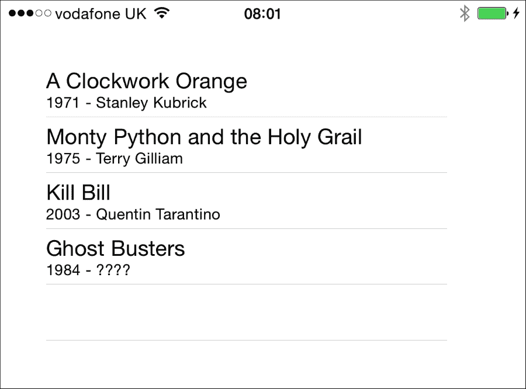

1.  一旦这个阶段完成，我们就可以回到我们的视图控制器并实现最后一个方法。当你得到一些编译器错误时，不要担心，它们很快就会被修复：

    ```swift
        func tableView(tableView: UITableView, didSelectRowAtIndexPath indexPath: NSIndexPath) {
            var filmDetailViewController = self.storyboard?.instantiateViewControllerWithIdentifier("film_detail") as FilmDetailViewController
            filmDetailViewController.film = movies[indexPath.row]
            self.navigationController?.pushViewController(filmDetailViewController, animated: true)
        }
    ```

1.  这个视图控制器已经完成，下一步是创建一个新的继承自`UIViewController`的 Cocoa Touch 类，称为`FilmDetailViewController`。取消选择**XIB**选项：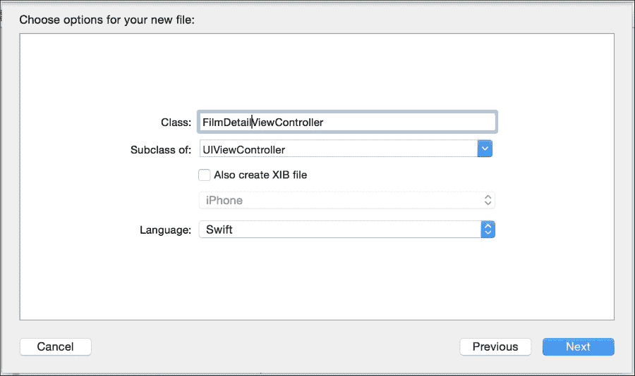

1.  一旦你有了新的 Swift 文件，你就可以回到故事板，添加一个新的视图控制器。在这个故事板中添加五个标签、一个步进器、一个文本视图和一个按钮。将文本视图的背景改为灰色。你应该有一个类似于以下布局：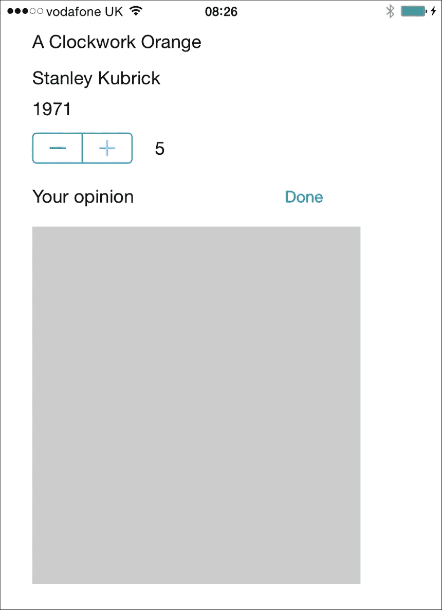

1.  新的视图控制器需要知道它的类不是默认视图控制器，因此选择视图控制器，进入其身份检查器，将其类更改为**FilmDetailViewController**。利用这一点，我们还应该将**Storyboard ID**设置为`film_detail`：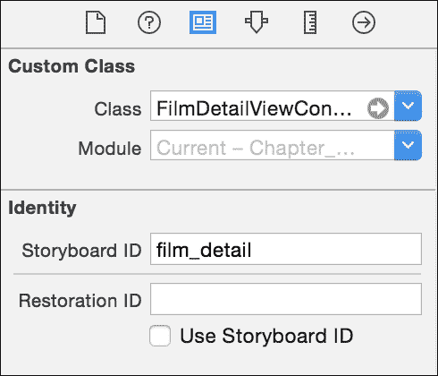

1.  现在将标签、步进器和文本视图与视图控制器链接起来：

    ```swift
        @IBOutlet var movieTitle: UILabel!
        @IBOutlet var director: UILabel!
        @IBOutlet var year: UILabel!
        @IBOutlet var score: UILabel!
        @IBOutlet var opinion: UITextView!
        @IBOutlet var stepper: UIStepper!
    ```

1.  一旦我们有了这些属性，我们就可以设置动作。唯一需要协议的是文本视图；然后开始向类头中添加`UITextViewDelegate`：

    ```swift
    class FilmDetailViewController: UIViewController, UITextViewDelegate {
    ```

1.  之后，我们可以将视图控制器作为文本视图代理连接起来，为按钮创建一个名为 done 的动作，并为步进器值变化事件创建一个名为`changeScore`的动作：

    ```swift
        @IBAction func done(sender: AnyObject) {
        }
        @IBAction func changeScore(sender: UIStepper) {
        }
    ```

### 编写类代码

1.  太好了，现在我们可以编写之前的类而不用担心故事板了。让我们从属性 `film` 开始，它将包含正在屏幕上的电影信息：

    ```swift
        var film:FilmData?
    ```

1.  然后，我们可以初始化屏幕上的视图以及一个继承属性 `userActivity`。记住，在这里我们假设属性 `film` 已经设置：

    ```swift
        override func viewDidLoad() {
            super.viewDidLoad()
            movieTitle.text = film?.name
            director.text = film?.director
            year.text = film?.year != nil ? "\(film!.year!)" : "???"
            if let score = film?.score {
                self.score.text = String(score)
                self.stepper.value = Double(score)
            }else {
                self.score.text = ""
                self.stepper.value = 1
            }
            self.opinion.text = film?.opinion
            self.userActivity = NSUserActivity(activityType: "com.packtpub.editingfilm")
            self.userActivity!.userInfo = [NSObject: AnyObject]()
        }
    ```

1.  然后，我们可以完成视图事件；这里我们将添加一个新的事件，称为 `textViewDidChange`，它属于 `UITextViewDelegate`：

    ```swift
        @IBAction func done(sender: AnyObject) {
            self.userActivity!.invalidate()
            self.navigationController?.popViewControllerAnimated(true)
        }
        @IBAction func changeScore(sender: UIStepper) {
            self.film?.score = Int(sender.value)
            self.score.text = String(self.film!.score!)
            self.updateUserActivityState(self.userActivity!)
        }
        func textViewDidChange(textView: UITextView) {
             film?.opinion = self.opinion.text
            self.updateUserActivityState(self.userActivity!)
        }
    ```

1.  代码的最后一部分是获取我们想要传输的所有信息并更新 `userActivity` 状态：

    ```swift
        override func updateUserActivityState(activity: NSUserActivity) {
            self.userActivity!.userInfo!["title"] = film?.name
            self.userActivity!.userInfo!["year"] = film?.year
            self.userActivity!.userInfo!["director"] = film?.director
            self.userActivity!.userInfo!["score"] = film?.score
            self.userActivity!.userInfo!["opinion"] = film?.opinion
            super.updateUserActivityState(activity)
        }
    ```

### 测试应用程序

1.  应用程序已经完成，正如你所知，我们必须对其进行测试。在按下播放按钮之前，确保已选择正确的模式，并且应用程序将被安装在你的移动设备上，而不是在模拟器上。

1.  按下播放按钮，选择你最喜欢（或最讨厌）的电影，为它设置评分，并写下你的评论。返回到你的 Mac（记住你没有停止 Mac 应用程序）并检查你的 dock 是否有一个新的图标。这意味着它检测到了可以读取的用户活动。点击此图标：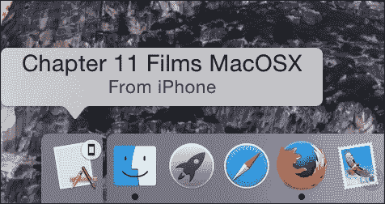

1.  你会看到你的 Mac 应用程序在前台，并且它会显示从你的设备接收到的信息：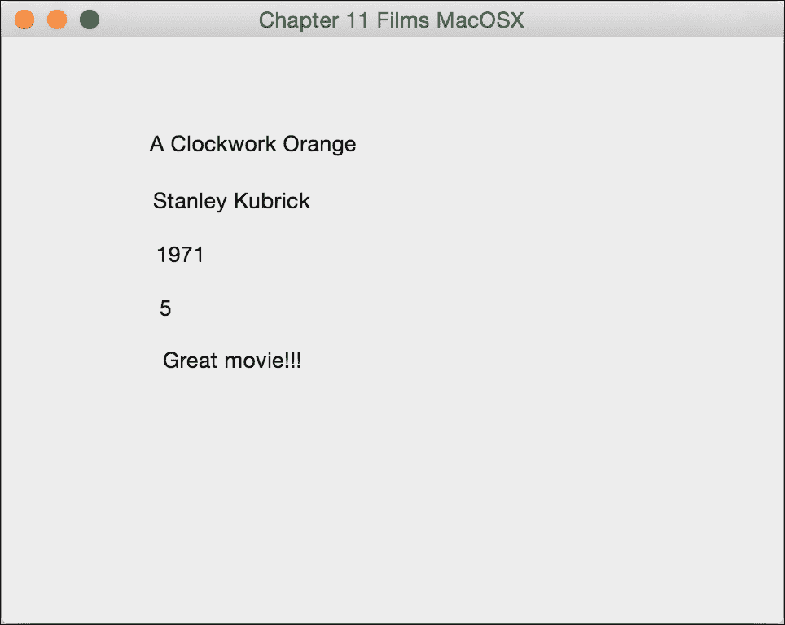

## 它是如何工作的…

Handoff 与一个名为 **Activity** 的功能一起工作。活动是关于用户当前正在做什么的一些信息，例如撰写电子邮件、编辑视频等等。

当使用 Handoff 时，你必须为你的活动规划三个阶段：创建活动、更新活动和销毁活动。我们在 `viewDidLoad` 方法中创建了它，每次用户更改分数或意见文本时都更新它，当用户按下完成按钮时销毁它。

如果你想在你的类中使用 Handoff，你必须添加一个 `NSUserActivity` 对象。这个类的一个好特点是它在 AppKit（OS X）和 UIKit（iOS）中都可以使用。一些类已经将这个对象作为属性，例如 `NSDocument`、`UIDocuments`、`NSResponder` 和 `UIResponder`。

由于 `UIViewController` 继承自 `UIResponder`，我们可以使用现有的属性 `userActivity`。每次我们认为活动需要更新时，都会调用 `updateUserActivityState` 方法。在这里，它应该设置应该传输的所有信息，即使信息没有变化，例如电影标题、导演或制作年份，因为更新状态后，`userInfo` 字典将会清空。

### 小贴士

不要过度加载用户信息字典；苹果建议存储最多 3k 的信息，超过这个量可能会影响应用程序性能。

接收所需信息需要两个步骤：第一步是通过在应用代理上实现方法 `willContinueUserActivityWithType` 来检查应用是否接受该时刻的活动；第二步是实现应用代理方法 `continueUserActivity` 以获取信息并将其发送到相应的视图或对象。

一个重要的细节是，Handoff 是用于同一公司或开发者之间的应用之间，并且仅与同一用户；这就是为什么你必须使用相同的团队签名，并且用户必须登录。

## 还有更多…

在这种情况下，我们创建了一个编辑你的电影观点的应用，另一个可以接收它的应用，然而你可以修改 Mac 应用程序，使其也可以编辑并将其重新传输到设备应用。试着作为家庭作业来做。

## 参考信息

+   苹果有一个关于如何使用 Handoff 与照片的示例；查看 [`developer.apple.com/library/ios/samplecode/PhotoHandoff/Listings/README_md.html`](https://developer.apple.com/library/ios/samplecode/PhotoHandoff/Listings/README_md.html) 下载它。

# 留下痕迹

你是否曾经去过某个地方，并开始怀疑你的路线是否最佳？有时，当我们到达目的地后，我们想要回顾我们的旅程。通常，当旅程非常漫长时，我们会这样做。在这个菜谱中，我们将创建一个用于记录我们步伐的应用，然后我们可以检查我们所走的路径。

## 准备中

创建一个名为 `Chapter 11 Breadcrumbs` 的新单视图应用，添加 `Core Location` 框架和 `Map Kit` 框架。你可以使用模拟器或物理设备来测试这个应用，然而如果你和我一样懒惰，使用模拟器会更好，这样你就不需要站起来走动来测试它：

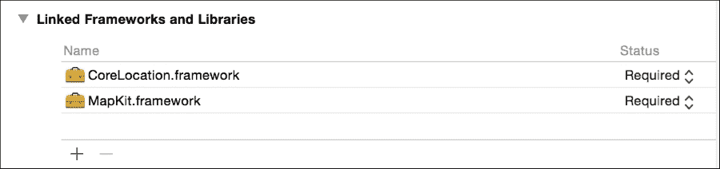

## 如何做…

一旦添加了框架，你只需遵循以下步骤来创建应用：

1.  打开故事板，在顶部添加一个标签，在其下方添加一个按钮，再在其下方添加一个地图视图。结果可以类似于以下截图：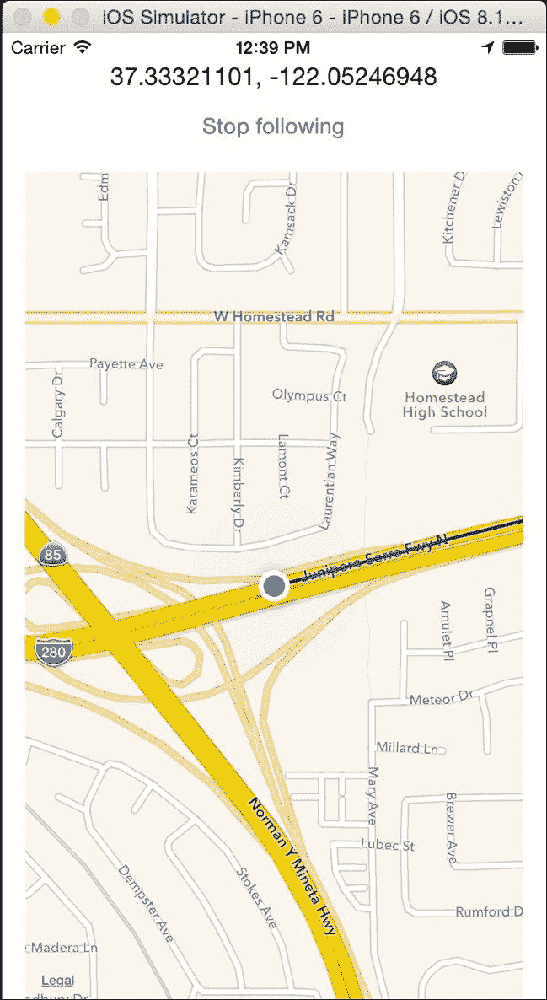

1.  如同往常，开始将标签和地图视图连接到视图控制器：

    ```swift
        @IBOutlet var mapView: MKMapView!
        @IBOutlet var positionLabel: UILabel!
    ```

1.  现在你可以点击视图控制器，并首先导入核心定位和地图框架，当然不要移除 UIKit：

    ```swift
    import UIKit
    import MapKit
    import CoreLocation
    ```

1.  之后，通过添加 `CLLocationManagerDelegate` 和 `MKMapViewDelegate` 协议来完成 `ViewController` 类，如下所示：

    ```swift
    class ViewController: UIViewController, CLLocationManagerDelegate, MKMapViewDelegate {
    ```

1.  下一步是添加视图控制器属性。在这种情况下，我们需要位置管理器来接收当前位置、我们经过的位置数组以及一个布尔属性来在地图上跟随用户：

    ```swift
        var manager = CLLocationManager()
        var locationsStack = [CLLocation]()
        var follow = true
    ```

1.  现在我们需要初始化管理属性和地图视图来完成它，所以我们将使用 `viewDidLoad` 方法：

    ```swift
        override func viewDidLoad() {
            super.viewDidLoad()

            manager.delegate = self
            manager.desiredAccuracy = kCLLocationAccuracyBest
            manager.requestAlwaysAuthorization()
            manager.startUpdatingLocation()

            mapView.delegate = self
            mapView.mapType = .Standard
            mapView.showsUserLocation = true
        }
    ```

1.  然后，我们需要在每次接收到新的位置时更新地图视图和 `locationStack`：

    ```swift
        func locationManager(manager:CLLocationManager, didUpdateLocations locations:[AnyObject]) {

            var currentLocation = locations[0] as CLLocation
            positionLabel.text = "\(currentLocation.coordinate.latitude), \(currentLocation.coordinate.longitude)"
            locationsStack.append(currentLocation)

            if follow {
                var currentRegion = MKCoordinateRegion(center: mapView.userLocation.coordinate, span: MKCoordinateSpanMake(0.01, 0.01))
                mapView.setRegion(currentRegion, animated: true)
            }

            if locationsStack.count > 1{
                var destination = locationsStack.count - 2
                let sourceCoord = locationsStack.last!.coordinate
                let destinationCoord = locationsStack[destination].coordinate
                var coords = [sourceCoord, destinationCoord]
                let polyline = MKPolyline(coordinates: &coords, count: coords.count)
                mapView.addOverlay(polyline)
            }

        }
    ```

1.  应用程序仍然没有显示路径；原因是我们需要通过编写地图视图方法`renderForOverlay`来绘制它：

    ```swift
        func mapView(mapView: MKMapView!, rendererForOverlay overlay: MKOverlay!) -> MKOverlayRenderer! {
            if overlay is MKPolyline {
                var polylineRenderer = MKPolylineRenderer(overlay: overlay)
                polylineRenderer.strokeColor = UIColor.blueColor()
                polylineRenderer.lineWidth = 3
                return polylineRenderer
            }
            return nil
        }
    ```

1.  现在应用程序正在运行；然而，检查我们的旅程可能相当困难，因为它总是在更新，所以是时候添加按钮事件了：

    ```swift
        @IBAction func followAction(sender: UIButton) {
            follow = !follow
            if  follow {
                sender.setTitle("Stop following", forState: .Normal)
            }else {
                sender.setTitle("Resume following", forState: .Normal)
            }
        }
    ```

1.  应用程序几乎完成了。还有一项细节需要你设置：iOS 9 上的权限。所以请前往你的`info.plist`文件，然后添加一个新的记录，键为**Required background modes**，在`Item 0`中写入字符串值**App registers for location updates**：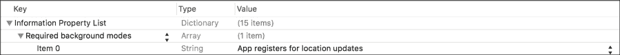

1.  现在应用程序已经完成，如果你使用的是物理设备，请按播放并四处走动；如果你使用的是模拟器，请点击**调试**，然后向下滚动到位置并选择高速公路驾驶。

## 它是如何工作的…

核心定位框架允许我们检索当前设备位置，但当然它需要一个代理；这就是我们为什么必须实现`CLLocationManagerDelegate`协议的原因。该协议通过`didUpdateLocations`方法接收位置。

一旦我们收到它，我们就可以将位置存储到`locationStack`数组中。实际上，如果你不想保留整个旅程的信息，你只需存储最后一个位置即可。

存储了新的位置后，我们可以创建一条折线，这就像是我们旅程的一部分。这些信息被提交到地图视图。

地图视图需要使用`MKMapViewDelegate`的`rendererForOverlay`方法来渲染它。这样做的原因是你可以自由地在地图上绘制你想要的任何内容，并且你可以创建圆形、正方形等形状来突出显示一个区域。

## 还有更多…

在地图视图中绘制路线是非常常见的，尤其是如果你想要使用方向。看看 MKDirections，它可能非常有用。

# 创建货币转换器应用程序

现在，我们的应用程序必须准备好在各个地方执行；因此，你的应用程序应该尽可能包含多种语言。考虑到国际化对于使用不同的语言或不同的数字格式非常重要。

在这个菜谱中，我们将创建一个应用程序，它将显示货币汇率，但更重要的是，它将适应当前位置。

## 准备工作

创建一个名为`Chapter 11 Currency Converter`的单视图应用程序，并将两张旗帜图片放在`images.xcassets`中。这些图片可以从书籍资源中下载。

## 如何操作…

按照以下步骤创建货币转换器应用程序：

1.  首先，点击**支持文件**组并添加一个新文件。在这种情况下，前往**资源**部分并选择**字符串文件**：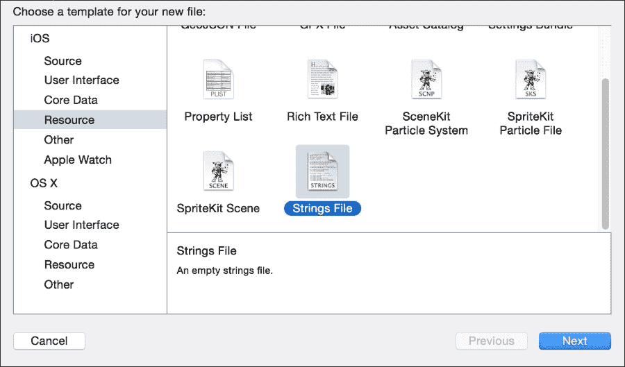

1.  在这个文件中，添加以下键及其对应值：

    ```swift
    "Rate" = "Rate: %@";
    "Total" = "Total: %@";
    "Choose Currency" = "Choose a currency";
    "flagicon" = "english";
    "Cancel" = "Cancel";
    ```

1.  现在，前往故事板并添加四个标签、两个按钮、一个文本框和一个图像视图在底部，类似于以下截图：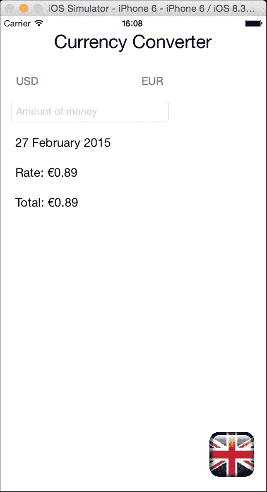

1.  一旦完成布局，请使用以下名称将 UI 组件（除了标题标签）与视图控制器连接：

    ```swift
        @IBOutlet var fromButton: UIButton!
        @IBOutlet var toButton: UIButton!
        @IBOutlet var amountTextField: UITextField!
        @IBOutlet var dateLabel: UILabel!
        @IBOutlet var rateLabel: UILabel!
        @IBOutlet var totalLabel: UILabel!
        @IBOutlet var flagImage: UIImageView!
    ```

1.  在属性检查器中将文本字段的**键盘类型**更改为**数字和标点符号**：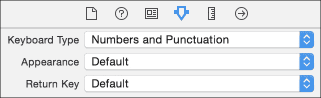

1.  将协议`UITextFieldDelegate`添加到视图控制器：

    ```swift
    class ViewController: UIViewController, UITextFieldDelegate {
    ```

1.  现在，将视图控制器设置为文本字段代理，并将`Amount of money`作为文本字段占位符写入。

1.  另一个重要操作是将视图类从`UIView`更改为`UIControl`，这样我们就可以轻松地隐藏键盘：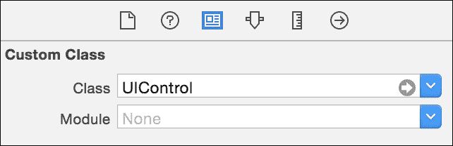

1.  前往视图控制器并添加以下属性：

    ```swift
        let currencies = ["AUD", "BGN", "BRL", "CAD", "CHF",
            "CNY", "CZK", "DKK", "EUR", "GBP", "HKD",
            "HRK", "HUF", "IDR", "ILS", "INR", "JPY", "KRW",
            "MXN", "MYR", "NOK", "NZD", "PHP", "PLN", "RON",
            "RUB", "SEK", "SGD", "THB", "TRY", "USD", "ZAR"]
        let baseurl = "http://api.fixer.io/latest"
        var fromCurrency = "USD"
        var toCurrency = "EUR"
    ```

1.  到目前为止，我们可以开始编写视图控制器方法；从开始我们将实现`viewDidLoad`方法：

    ```swift
        override func viewDidLoad() {
            super.viewDidLoad()
            flagImage.image = UIImage(named: NSLocalizedString("flagicon", comment: ""))
            setup()
        }
    ```

1.  如您所见，有一个名为`setup`的私有方法，我们现在将实现它。此方法负责从互联网检索货币汇率并计算用户输入的金额的价值：

    ```swift
        private func setup(){
            fromButton.setTitle(fromCurrency, forState: .Normal)
            toButton.setTitle(toCurrency, forState: .Normal)
            var session = NSURLSession.sharedSession()
            var url = NSURL(string: "\(baseurl)?base=\(fromCurrency)&symbols=\(toCurrency)")!

            session.dataTaskWithURL(url, completionHandler: { (data, response, error) -> Void in
            var json = {}
                do {
            json = try NSJSONSerialization.JSONObjectWithData(data, options: NSJSONReadingOptions.MutableContainers) as [String:AnyObject]
        } catch {
            let alert = UIAlertController(title: "Error", message: "Error parsing JSON", preferredStyle:.Alert)
            self.presentViewController(alert, animated: true, completion: nil)
        }
                let dateComponentsArray = (json["date"] as String).componentsSeparatedByString("-")
                let dateComponents = NSDateComponents()
                dateComponents.year   = dateComponentsArray[0].toInt()!
                dateComponents.month  = dateComponentsArray[1].toInt()!
                dateComponents.day    = dateComponentsArray[2].toInt()!

                let rates = json["rates"] as [String:Double]
                let date = NSCalendar.currentCalendar().dateFromComponents(dateComponents)
                let ratio = rates[self.toCurrency]
                let amount = self.amountTextField.text == "" ? 1.0 : (self.amountTextField.text as NSString).doubleValue

                NSOperationQueue.mainQueue().addOperationWithBlock({ () -> Void in
                    let dateFormatter = NSDateFormatter()
                    dateFormatter.dateStyle = .LongStyle
                    self.dateLabel.text = dateFormatter.stringFromDate(date!)

                    let currencyFormatter = NSNumberFormatter()
                    currencyFormatter.currencyCode = self.toCurrency
                    currencyFormatter.numberStyle = .CurrencyStyle
                    self.rateLabel.text = String(format: NSLocalizedString("Rate", comment: ""), arguments: [currencyFormatter.stringFromNumber(ratio!)!])
                    let total = amount * ratio!

                    self.totalLabel.text = String(format: NSLocalizedString("Total", comment: ""), arguments: [currencyFormatter.stringFromNumber(total)!])

                })
            }).resume()

        }
    ```

1.  我们将实现按钮的事件。这两个按钮的事件是相同的，因此将触摸事件与以下方法连接：

    ```swift
        @IBAction func chooseCurrency(sender: UIButton) {
            let alertController = UIAlertController(title: NSLocalizedString("Choose Currency", comment: ""), message: nil, preferredStyle: .ActionSheet)

            let cancelAction = UIAlertAction(title: NSLocalizedString("Cancel", comment: ""), style: .Cancel) { (action) in
            }
            alertController.addAction(cancelAction)

            for currency in currencies {
                let currAction = UIAlertAction(title: currency, style: .Default) { (action) in
                    if sender == self.fromButton {
                        self.fromCurrency = action.title
                    }else {
                        self.toCurrency = action.title
                    }
                    self.setup()
                }
                alertController.addAction(currAction)
            }

            self.presentViewController(alertController, animated: true, completion: nil)
        }
    ```

1.  将主视图（我们将其更改为`UIControl`）的触摸事件与视图控制器创建的名为`touchup`的方法连接：

    ```swift
        @IBAction func touchup(sender: UIControl) {
            self.amountTextField.resignFirstResponder()
            self.setup()
        }
    ```

1.  现在我们可以使用最后一个方法完成视图控制器，这个方法允许我们在按下回车键时隐藏键盘：

    ```swift
        func textFieldShouldReturn(textField: UITextField) -> Bool {
            self.touchup(self.view as UIControl)
            return true
        }
    ```

1.  应用程序基本上已经完成，然而我们只能说它已准备好本地化，但是除了货币格式外，我们可以说没有其他可以证明这一点的东西。因此，点击项目导航器中的项目，转到项目的**Info**标签页。确保你选择了项目而不是目标。滚动到**Locations**部分并点击加号。选择**Spanish**，一种新语言：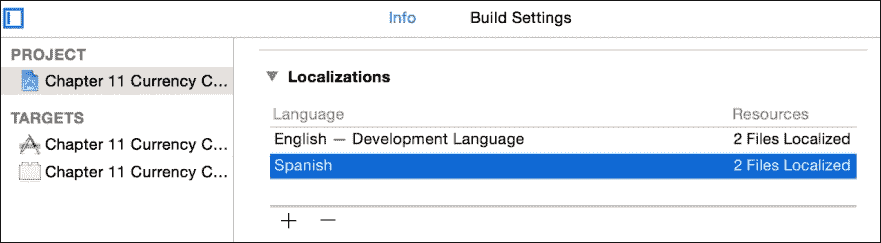

1.  现在展开你的故事板并选择**Main.strings (Spanish)**：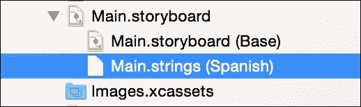

1.  将标题从`Currency Converter`更改为`Conversor de monedas`，并将文本字段占位符从`Amount of money`更改为`Cantidad de dinero`。修改后的行应类似于以下行：

    ```swift
    /* Class = "UILabel"; text = "Currency Converter"; ObjectID = "hFW-19-dID"; */
    "hFW-19-dID.text" = "Conversor de Monedas";

    /* Class = "UITextField"; placeholder = "Amount of money"; ObjectID = "vzh-tY-rr3"; */
    "vzh-tY-rr3.placeholder" = "Cantidad de dinero";
    ```

    ### 小贴士

    在将布局翻译成其他语言之前，尝试设计整个布局；有时向视图中添加组件会让你再次翻译一切。

1.  返回`Localizable.strings`，在文件检查器中点击位于**Localization**部分的**Localize…**按钮：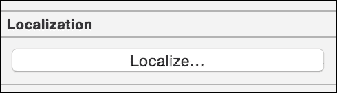

1.  将此文件移动到`lproj`文件夹的对话框将出现。选择基本语言：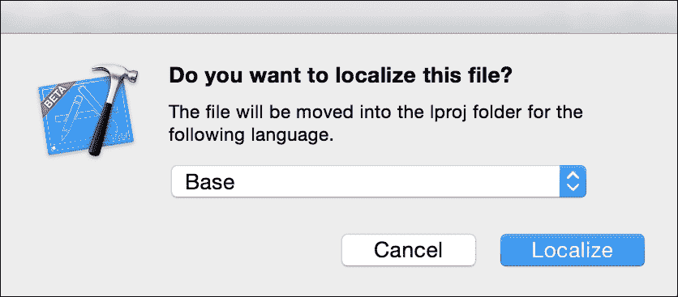

1.  如您所见，本地化部分已用一些语言选项替换了旧按钮；检查**Spanish**选项：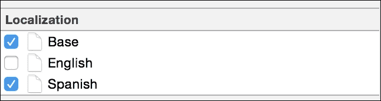

1.  展开`Localizable.strings`并点击西班牙语选项：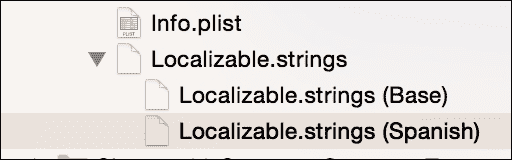

1.  现在更新值，将它们翻译成西班牙语，如下所示：

    ```swift
    "Rate" = "Tasa de conversión: %@";
    "Total" = "Total: %@";
    "Choose Currency" = "Elija la moneda";
    "flagicon" = "spanish";
    "Cancel" = "Cancelar";
    ```

1.  是时候测试我们的应用程序了，按播放并检查应用程序是否运行得很好，然后按主页按钮，进入**设置**，进入**通用**部分，点击（或单击）**语言与地区**，将地区更改为**西班牙**，语言更改为**西班牙语**。现在返回到你的应用程序，你应该看到它使用西班牙文文本；数字应以西班牙格式表示：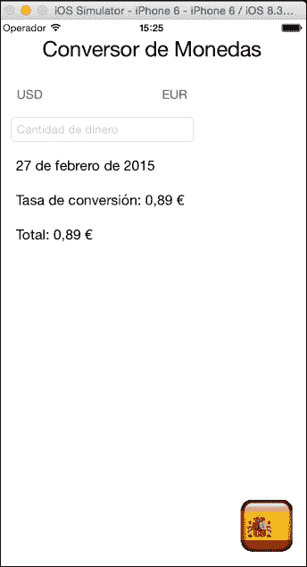

## 它是如何工作的…

当你想将你的应用程序翻译成其他语言时，你首先必须使用基础语言（默认语言）创建它，但请记住，每个文本都可以被翻译；因此，而不是使用硬编码的文本，你必须从`Localizable.strings`文件中检索它。

使用`NSLocalizedString`从本地化文件中检索字符串。你还可以获取格式字符串并在字符串格式初始化器中使用它们。

你也可以使用`NSDateFormatter`和`NSNumberFormatter`来使用日期和数字格式化；这样你就不必担心本地日期和数字了。

也可以翻译你的故事板，因此不需要在视图加载时设置标签和占位符。

## 更多…

你还可以翻译其他文件，例如启动屏幕和`Info.plist`。例如，你可以使用`Bundle display name`键（`CFBundleDisplayName`）根据语言更改应用程序名称。

`NSLocalizedString`有其他选项，允许你在复杂的应用程序中使用翻译。

# Swift 中的方法交换

方法交换是支持动态方法调度的编程语言中的一种常见做法。这在 Objective-C 中也非常常见。通过方法交换，你可以在运行时交换一个方法实现为另一个实现。建议谨慎使用方法交换，并且仅在没有替代方案（可能是协议或扩展）时使用。

## 准备工作

创建一个名为`Swizzling`的游乐场。我们在这个食谱中不会使用项目，所以不用担心项目设置。

## 如何做到这一点…

1.  我们将以`UIViewController`为例。将以下代码添加到你的游乐场中：

    ```swift
    extension UIViewController {
        public override static func initialize() {
            struct Static {
                static var token: dispatch_once_t = 0
            }

            dispatch_once(&Static.token) {
                let originalSelector = Selector("viewWillAppear:")
                let swizzledSelector = Selector("ViewWillDefinitelyAppear:")

                let originalMethod = class_getInstanceMethod(self, originalSelector)
                let swizzledMethod = class_getInstanceMethod(self, swizzledSelector)

                let didAddMethod = class_addMethod(self, originalSelector, method_getImplementation(swizzledMethod), method_getTypeEncoding(swizzledMethod))

                if didAddMethod {
                    class_replaceMethod(self, swizzledSelector, method_getImplementation(originalMethod), method_getTypeEncoding(originalMethod))
                } else {
                    method_exchangeImplementations(originalMethod, swizzledMethod);
                }
            }
        }
    }
    ```

1.  我们还想要确保当我们期望父类时，我们不会从子类中进行交换。在初始化静态结构后添加以下代码：

    ```swift
    // Verify this is not a subclass
    if self !== UIViewController.self {
        return
    }
    ```

## 它是如何工作的…

对于这个例子，我们希望为每个`UIViewController`执行额外的操作；然而，我们需要保留`viewWillAppear`的原始功能。这只能通过方法交换来完成。尽管 Swift 在方法调度方面采取了更静态的方法，但你仍然可以在运行时交换方法。

我们将每个调用包裹在 `dispatch_once` 块中，以确保这仅在运行时发生一次。我们定义每个选择器，包括现有的和新的一。一旦我们调用 `class_addMethod`，我们检查它是否成功，如果是，则交换实现（在运行时发生）。

如果你熟悉 Objective-C，你会注意到通常方法交换发生在加载方法中，这是在类定义加载时保证会被调用的。考虑到这是一个 Objective-C 方法，我们只在初始化方法中调用交换代码，这是在调用任何类方法之前发生的。

## 还有更多...

除了交换系统方法之外，你还可以交换自定义 Swift 类中创建的方法。然而，有一些额外的考虑。类必须扩展 `NSObject`，并且期望的方法定义中也必须包含动态属性。使用 `@objc` 会使你的代码通过 Objective-C 运行时运行（从而支持动态方法分发）；然而，它并不保证属性或方法的动态分发。

# Swift 中的关联对象

除了方法交换之外，我们还可以利用另一种称为关联对象的运行时过程。这与 Swift 中的扩展类似；然而，扩展不允许你向现有类添加新属性。让我们给所有 `UIViewControllers` 添加一个描述性名称属性。

## 准备工作

创建一个名为 `Associated Objects` 的游乐场。我们在这个食谱中不会使用项目，所以不用担心项目设置。如果你使用了之前的食谱，你可以继续使用相同的游乐场文件。

## 如何实现...

1.  将以下代码添加到您的游乐场文件中：

    ```swift
    extension UIViewController {

        private struct AssociatedKeys {
            static var DescriptiveName = "nsh_DescriptiveName"
        }

        var descriptiveName: String? {
            get {
                return objc_getAssociatedObject(self, &AssociatedKeys.DescriptiveName) as? String
            }

            set {
                if let newValue = newValue {
                    objc_setAssociatedObject(
                        self,
                        &AssociatedKeys.DescriptiveName,
                        newValue as NSString?,
                        .OBJC_ASSOCIATION_RETAIN_NONATOMIC
                    )
                }
            }
        }

    }
    ```

## 它是如何工作的...

首先，我们创建一个私有的静态结构体来存储引用我们的对象的键。在这种情况下，它将只包含 `DescriptiveName` 对象。现在我们为 `UIViewController` 定义一个新的变量，并在获取和设置方法中执行所需的方法。

我们使用 `objc_getAssociatedObject()` 来返回正确的对象，并将其转换为 String 对象。对于设置，我们调用 `objc_setAssociatedObject()` 方法。在这里，我们传递 `self` 以让运行时知道我们正在向 `UIViewController` 添加内容，然后引用我们静态结构体中的对象，我们想要将其与类关联。最后，我们设置属性以保留并设置为非原子。

结果是每个 `UIViewController` 都将包含一个新的属性，`DescriptiveName`，可以在代码的任何地方访问。
