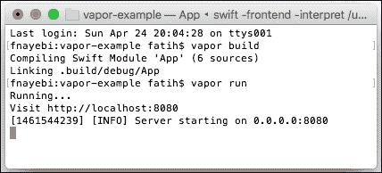
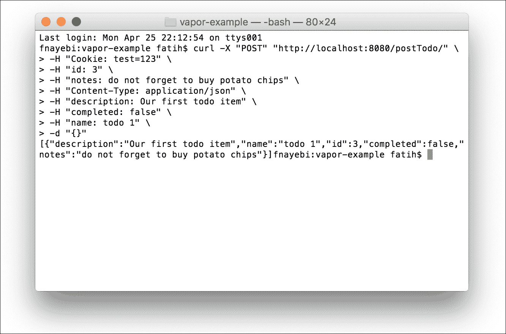
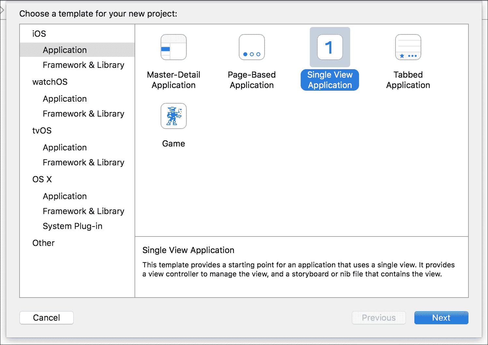
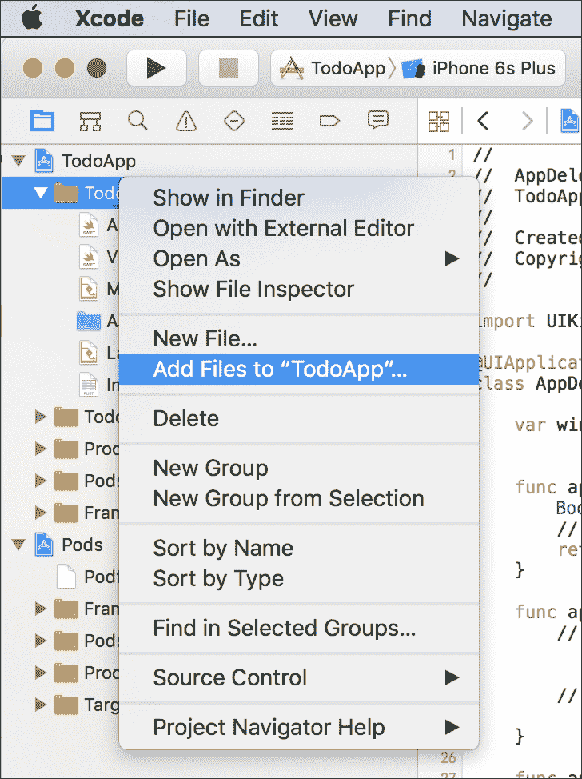
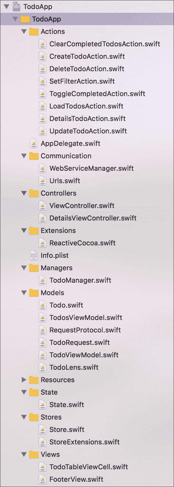
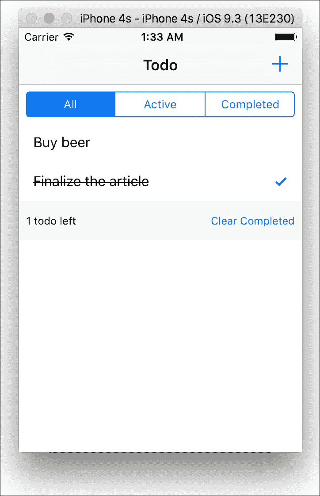
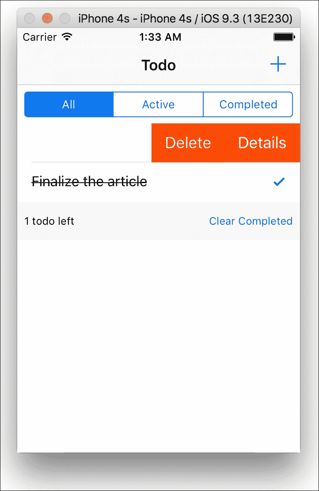
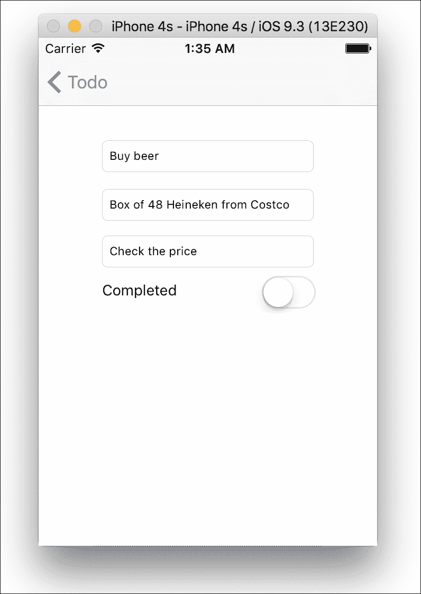
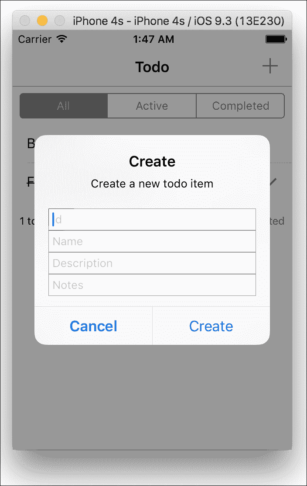

# 第十一章：案例研究 - 使用 FP 和 OOP 范式开发 iOS 应用程序

在前面的章节中，我们介绍了各种概念和技术。我们从 FP 范式开始，并详细探讨了相关主题。此外，在前一章中，我们还介绍了其他范式，如 OOP、FRP 和 POP，并将它们混合在一起。在本章中，我们将使用这些范式创建一个简单的应用程序。

大多数 iOS 应用程序需要一个后端来提供与其他系统集成的先进功能。在本章中，我们将使用 Swift 创建一个简单的后端，该后端将用作待办事项应用的 REST API。然后，我们将开发一个 iOS 应用程序，该应用程序将利用我们的后端并提供一些基本功能，例如列出和更新来自后端的后待办事项。此外，iOS 应用程序还将能够创建新的待办事项。我们的 iOS 应用程序开发将包括 FP、OOP、POP 和 FRP 范式。

本章将涵盖以下主题：

+   需求规范

+   高级设计

+   后端开发

    +   环境配置

    +   Swift 包管理器

    +   Vapor

    +   应用程序开发

+   前端开发

    +   CocoaPods 依赖管理配置

    +   第三方库

    +   后端通信

    +   JSON 解析和模型映射

    +   状态管理

    +   使用 UITableView 列出项目

    +   更新和创建项目

    +   过滤项目

# 要求

本节介绍了案例研究的需求。由于本书的重点不是需求工程，我们将定义非常简单的需求。本节不介绍需求工程的最佳实践。

iOS 应用程序用户的要求如下：

+   用户应能够列出待办事项

+   用户应能够查看每个项目的详细信息

+   用户应能够修改项目

+   用户应能够创建新项目

+   用户应能够根据其状态过滤项目

# 高级设计

本节解释了前端和后端的高级设计。

## 前端

应用程序设计遵循**模型-视图-控制器**（**MVC**）模式的一个略微不同的版本，增加了`Actions`、`Store`、`State`和`Communication`层以简化传统 iOS 应用程序 MVC 模式的控制器层。所有应用程序层将在以下各节中解释。

### 模型

简单的模型结构。这些模型没有任何逻辑，仅由属性组成。有四种类型的模型：

+   **TodoRequest**：这是一个用于后端请求调用并符合`RequestProtocol`的结构体

+   **待办事项**：这是一个表示待办事项数据的结构体，并使用**Argo**和**Curry**库从 JSON 解码对象

+   **TodoViewModel 和 TodosViewModel**：这些结构体表示数据，并在视图中使用，并展示给用户

+   **TodoLens**：这些透镜修改待办事项模型

所述所有模型都是不可变值类型。

### 视图

我们有两个视图子类：一个提供自定义的`UITableViewCell`，称为`TodoTableViewCell`，以及一个名为`FooterView`的`UIView`子类。

这两个视图都是 iOS SDK 提供的类的子类。除了这些类，我们还将有我们的`UIViewController`场景在 Storyboard 中。

### ViewController

`ViewController`是`UIViewController`或`UITableViewController`的子类，它将视图与逻辑连接起来：

+   **MasterViewController:** 这是一个`UITableViewController`的子类，用于展示待办事项

+   **DetailsViewController:** 这是一个`UIViewController`的子类，用于向用户展示每个待办事项的详细信息

要开发 iOS 应用程序，我们必须依赖于 iOS SDK 提供的类，如`UIViewController`和`UITableViewController`。在这种情况下，我们将只使用`ViewController`和`UIView`的子类。

### State

在 iOS 应用程序开发中，我们需要处理状态。我们使用 Delta 和 ReactiveCocoa 库来管理我们的待办事项应用程序的状态。

Delta 接受一个应用程序，该应用程序在所有`ViewControllers`中具有分散的自定义状态管理，并通过提供一个简单的接口来更改状态和订阅其变化来简化它。

ReactiveCocoa 是一个 FRP cocoa 框架，它提供了在时间上组合和转换值流的 API。

我们将实现一个`State`结构体，它将提供`可观察`属性。

### Store

我们的`Store`结构体会包装`State`结构体，并提供属性以观察其变化。`Store`遵循 Delta 库的`StoreType`协议，该协议定义了可观察状态的存储和修改它的分发方法。此外，`Store`使用 ReactiveCocoa 的`MutableProperty`值，并允许以线程安全的方式观察其变化。

### Actions

操作是遵循 Delta 库的`ActionType`协议的结构体。当我们要对存储的状态进行修改时使用`ActionType`。所有对存储的更改都通过此类型进行。

我们将在应用程序中开发以下操作：

+   `ClearCompletedTodosAction`: 用于从列表中删除已完成的待办事项

+   `CreateTodoAction`: 用于创建新的待办事项

+   `DeleteTodoAction`: 用于删除待办事项

+   `DetailsTodoAction`: 用于展示项目的详细信息

+   `LoadTodosAction`: 用于列出所有待办事项

+   `SetFilterAction`: 用于过滤待办事项

+   `ToggleCompletedAction`: 用于标记待办事项为完成

+   `UpdateTodoAction`: 用于更新待办事项

### 管理员

`TodoManager`提供全局函数来处理后端 API 调用和 JSON 有效负载映射。`TodoManager`使用`WebServiceManager`进行后端调用，并使用 Argo 库将 JSON 有效负载映射到`Todo`模型。此外，`TodoManager`将通过`Lenses`和`Action`更新`Store`中的`State`。

### Communication

通信层负责后端通信。它包括以下组件：

+   `WebServiceManager`：它提供了一个名为 `sendRequest` 的全局函数，该函数被 `TodoManager` 用于调用后端 API。它还使用 `configureHeaders` 来对请求进行反射，以获取其属性和相应的值。

+   `Urls`：这个枚举通过模式匹配和扩展提供了一个适当的 HTTP 请求方法和完整的 URL 地址。

+   `Alamofire`：这是一个库，由 `WebServiceManager` 用于 HTTP 请求处理。

+   `Argo`：这个库以功能方式将模型对象映射到 JSON。

### 层之间的通信

应用程序使用闭包和 `ReactiveCocoa` 信号进行层之间的通信。

### 第三方库

以下第三方库/框架被用于我们的 iOS 应用程序中：

+   **Alamofire**：这是一个用于调用和管理网络服务的框架

+   **Argo**：这是一个功能性的 JSON 解析库

+   **CocoaPods**：它负责依赖管理

+   **Delta**：这是一个状态管理库

+   **ReactiveCocoa**：这是一个用于处理信号和流的 **函数式响应式编程**（**FRP**）库

+   **Quick**：这是一个用于单元测试的行为驱动开发框架

### 跨切面关注点

本节解释了跨切面关注点，如错误管理、异常处理等。

#### 错误管理和异常处理

如本书前几章所讨论的。

#### 崩溃报告

我们将使用 **Crashlytics**，它是 Twitter 提供的 `fabric.io` 服务的一部分。

#### 分析

我们将使用 `fabric.io` **Answers** 来监控应用程序的使用情况。还有其他分析服务，如 **Google Analytics**、**Flurry** 和 Mixpanel，也可以用于本案例研究。为了简化，我们将使用 Answers。

### 工具

工具 我们将使用 Xcode 来开发我们的应用程序。JetBrains 的 AppCode 是另一个用于 iOS 应用程序开发的 IDE，它具有更好的重构功能，也可以用于本案例研究。

## 后端

对于 Swift，有各种网络框架和 HTTP 服务器，它们仍在开发中。**Kitura**、**Perfect** 和 Vapor 是其中最受欢迎的三个。它们都不是以函数式编程风格设计和开发的。在我们的示例中，我们将使用 Vapor 来提供一个可以被我们的前端应用程序利用的后端。

### Vapor

Vapor ([`github.com/qutheory/vapor`](https://github.com/qutheory/vapor)) 是一个流行的 Laravel/Lumen 启发的 MIT 许可的 Web 框架。它完全用 Swift 编写，并且是模块化的。

Vapor 提供了 CLI 工具来简化构建和运行 Vapor 应用程序。

`vapor new <project-name>` 可以用来创建一个新项目，`vapor build` 可以用来构建项目并下载依赖项，`vapor xcode` 可以用来创建 Xcode 项目，`vapor run` 可以用来运行项目。

Vapor 使用 **Swift Package Manager**（**SPM**）作为依赖管理器，使用 Vapor 启动应用程序就像导入 Vapor 并在 `main` 文件中添加以下行一样简单：

```swift
let app = Application()
app.start(port: 8080)

```

#### 路由

在 Vapor 中进行路由很简单：

```swift
app.get("welcome") { request in
    return "Hello, World"
}

```

将上述代码添加到主文件中，将使我们的 Web 应用程序对所有`localhost:8080/welcome`的`GET`请求响应字符串`Hello, World`。

#### JSON

以 JSON 形式响应很容易：

```swift
app.get("version") { request in
    return Json(["version": "0.1"])
}

```

上述代码响应了所有对`localhost:8080/version`的`GET`请求，返回 JSON 字典`{"version": "0.1"}`和`Content-Type: application/json`。

#### 请求数据

每个路由调用都会传递一个`request`对象，可以用来获取查询和路径参数。

以下示例展示了如何从请求中访问 JSON、查询和表单编码的数据：

```swift
app.post("hello") { request in
    guard let name = request.data["name"]?.string else {
        return "Please include a name"
    }

    return "Hello, \(name)!"
}

```

在这个例子中，我们读取请求数据并返回一个字符串。

Vapor 还提供了会话管理、数据库连接以及使用 HTML 或包含 HTML 模板的 Stencil 模板的视图响应的途径。有一个示例 Vapor 项目([`github.com/qutheory/vapor-example`](https://github.com/qutheory/vapor-example))，可以用于我们的目的并进行修改。由于 Vapor 仍在开发中，我们不会深入探讨 Vapor。

### SPM

SPM 是一个为 Swift 3.0 提供的开源构建和依赖管理工具。它与 Swift 构建系统集成，以自动化下载、编译和链接依赖项的过程。

Vapor 使用 SPM，要创建一个 Vapor 项目，我们需要在`Packages.swift`文件中添加以下依赖项：

```swift
.Package(url: "https://github.com/qutheory/vapor.git",
  majorVersion: xx, minor: x),
.Package(url: "https://github.com/qutheory/vapor-zewo-mustache.git",
  majorVersion: xx, minor: xx)
```

如*Vapor*部分所述，我们可以使用 Vapor CLI 工具，结合 SPM 来构建和运行应用程序。

建议阅读更多关于 Vapor 和 SPM 的内容，因为我们在这本书中没有涵盖大多数相关主题。在下一节中，我们将使用 Vapor 开发一个非常简单的后端。

# 后端开发

我们想为 Todo 应用程序开发一个非常简单的后端。

## 模型

我们将首先创建我们的模型。代码如下：

```swift
import Vapor

final class Todo {
    var id: Int
    var name: String
    var description: String
    var notes: String
    var completed: Bool
    var synced: Bool

    init(id: Int, name: String, description: String, notes: String,
      completed: Bool, synced: Bool) {
        self.id = id
        self.name = name
        self.description = description
        self.notes = notes
        self.completed = completed
        self.synced = synced
    }
}

```

这个类导入了 Vapor，并包含了一些与`Todo`相关的属性以及一个`init`方法。

为了能够将此模型传递到 JSON 数组和字典中，我们需要扩展一个名为`JsonRepresentable`的协议：

```swift
extension Todo: JSONRepresentable {
    func makeJson() -> JSON {

        return JSON([
            "id":id,
          "name": "\(name)",
   "description": "\(description)",
         "notes": "\(notes)",
     "completed": completed,
        "synced": synced
        ])
    }
}

```

## 存储

然后，我们想在内存中存储 Todo 项的列表。为了实现这一点，我们将创建一个新的类，称为`TodoStore`。代码如下：

```swift
import Vapor

final class TodoStore {

    static let sharedInstance = TodoStore()
    private var list: [Todo] = Array<Todo>()
    private init() {
    }
}

```

为了简化，我们将这个类设计为单例，存储一个 Todo 项的列表。同时，我们将`init`方法设置为`private`以避免非共享实例的初始化。

为了允许 Todo 实例被传递到 JSON 数组和中，就像它是原生 JSON 类型一样，我们需要通过遵循以下方式扩展我们的`TodoStore`以符合`JSONRepresentable`协议：

```swift
extension TodoStore: JSONRepresentable {
    func makeJson() -> JSON {
        return JSON([
            "list": "\(list)"
        ])
    }
}
```

接下来，我们添加以下方法：

```swift
func addtem(item: Todo) {
    self.list.append(item)
}

func listItems() -> [Todo] {
    return self.list
}

```

如其名称所示，这些方法将用于添加和列出项目。我们需要一个非常简单的查找方法，让我们来开发它：

```swift
func find(id: Int) -> Todo? {
    return self.list.index { $0.id == id }.map { self.list[$0] }
}

```

在这里，我们使用`index`和`map`高阶函数来查找索引并返回相应的数组元素。

然后，我们需要开发`update`和`delete`方法：

```swift
func delete(id: Int) -> String {
    if self.find(id: id) != nil {
        self.list = self.list.filter { $0.id != id }
        return "Item is deleted"
    }
    return "Item not found"
}

func deleteAll() -> String {
    if self.list.count > 0 {
        self.list.removeAll()
        return "All items were deleted"
    }
    return "List was empty"

}

func update(item: Todo) -> String {
    if let index = (self.list.index { $0.id == item.id }) {
        self.list[index] = item
        return "item is up to date"
    }
    return "item not found"
}

```

此外，我们还可以将添加和更新合并如下：

```swift
func addOrUpdateItem(item: Todo) {
    if self.find(item.id) != nil {
        update(item)
    } else {
        self.list.append(item)
    }
}

```

到目前为止，我们的`TodoStore`能够执行所有 CRUD 操作。

## 控制器

下一步将是开发路由、请求和响应处理。为了简单起见，我们将修改 Vapor 示例中的`main.swift`。

我们需要在以下定义之后进行更改：

```swift
let app = Application()

```

### 发布新的待办事项

第一步将是开发一个 POST 方法来创建待办事项，如下所示：

```swift
/// Post a todo item
app.post("postTodo") { request in
    guard let id = request.headers.headers["id"]?.values,
        name = request.headers.headers["name"]?.values,
        description = request.headers.headers["description"]?.values,
        notes = request.headers.headers["notes"]?.values,
        completed = request.headers.headers["completed"]?.values,
        synced = request.headers.headers["synced"]?.values
    else {
        return JSON(["message": "Please include mandatory parameters"])
    }

    let todoItem = Todo(id: Int(id[0])!,
                      name: name[0],
               description: description[0],
                     notes: notes[0],
                 completed: completed[0].toBool()!,
                    synced: synced[0].toBool()!)

    let todos = TodoStore.sharedInstance
    todos.addOrUpdateItem(item: todoItem)

    let json:[JSONRepresentable] = todos.listItems().map { $0 }
    return JSON(json)
}

```

前面的示例将创建一个待办事项。首先，我们使用保护表达式检查 API 用户是否提供了所有必要的 HTTP 标题，然后我们使用`TodoStore`类中的`addItem()`方法来添加该特定项。在前面的代码示例中，我们需要将`completed`从`Bool`转换为`String`，所以我们扩展了`String`函数如下，并在`completed`上调用`toBool()`：

```swift
extension String {
    func toBool() -> Bool? {
        switch self {
        case "True", "true", "yes", "1":
            return true
        case "False", "false", "no", "0":
            return false
        default:
            return nil
        }
    }
}

```

我们需要在终端应用程序中使用`vapor build`和`vapor run`指令来构建和运行我们的后端应用程序。此时，我们应该得到以下提示：



如果我们在网页浏览器中指向 localhost 8080，我们应该看到 Vapor 正在运行。此外，我们还可以使用**curl**工具在终端中通过复制和粘贴以下代码来测试我们的 POST 方法：

```swift
curl -X "POST" "http://localhost:8080/postTodo/" \
   -H "Cookie: test=123" \
   -H "id: 3" \
   -H "notes: do not forget to buy potato chips" \
   -H "Content-Type: application/json" \
   -H "description: Our first todo item" \
   -H "completed: false" \
   -H "name: todo 1" \
   -d "{}"

```

结果将类似于以下内容：



如从截图所示，我们收到了一个包含我们添加的待办事项的 JSON 响应。

### 获取待办事项列表

我们的 POST 调用返回项目列表。此外，我们还可以这样获取项目：

```swift
/// List todo items
app.get("todos") { request in

    let todos = TodoStore.sharedInstance
    let json:[JSONRepresentable] = todos.listItems().map { $0 }
    return JSON(json)
}

```

我们将再次使用 Vapor CLI 构建和运行我们的应用程序，并且我们可以这样测试这个 GET 请求：

```swift
curl -X "GET" "http://localhost:8080/todos" \
   -H "Cookie: test=123"

```

### 获取特定待办事项

前面的调用检索所有项。如果我们想获取特定项，我们也可以这样做：

```swift
/// Get a specific todo item
app.get("todo") { request in

    guard let id = request.headers.headers["id"]?.values else {
        return JSON(["message": "Please provide the id of todo item"])
    }

    let todos = TodoStore.sharedInstance.listItems()
    var json = [JSONRepresentable]()

    let item = todos.filter { $0.id == Int(id[0])! }
    if item.count > 0 {
        json.append(item[0])
    }

    return JSON(json)
}

```

在这里，我们检查是否存在标题，并使用我们的`TodoStore`类中的`listItems()`方法来检索特定项。我们可以在 curl 中通过在终端执行以下命令来测试它：

```swift
curl -X "GET" "http://localhost:8080/todo/" \
   -H "id: 1" \
   -H "Cookie: test=123"

```

### 删除单个事项和删除所有待办事项

我们需要实现的下一个操作是从我们的`TodoStore`中删除项。让我们实现`delete`和`deleteAll`方法：

```swift
/// Delete a specific todo item
app.delete("deleteTodo") { request in
    guard let id = request.headers.headers["id"]?.values else {
        return JSON(["message": "Please provide the id of todo item"])
    }

    let todos = TodoStore.sharedInstance
    todos.delete(id: Int(id[0])!)

    return JSON(["message": "Item is deleted"])
}

/// Delete all items
app.delete("deleteAll") { request in
    TodoStore.sharedInstance.deleteAll()

    return JSON(["message": "All items are deleted"])
}

```

要测试删除功能，我们可以在终端中执行以下命令：

```swift
curl -X "DELETE" "http://localhost:8080/deleteTodo/" \
   -H "id: 1" \
   -H "Cookie: test=123"

```

要测试`deleteAll`功能，我们可以在终端中执行以下命令：

```swift
curl -X "DELETE" "http://localhost:8080/deleteAll" \
   -H "Cookie: test=123"

```

### 更新待办事项

最后，我们希望能够更新待办事项列表中的项以完成它或添加一些笔记：

```swift
/// Update a specific todo item
app.post("updateTodo") { request in
    guard let id = request.headers.headers["id"]?.values,
        name = request.headers.headers["name"]?.values,
        description = request.headers.headers["description"]?.values,
        notes = request.headers.headers["notes"]?.values,
        completed = request.headers.headers["completed"]?.values,
        synced = request.headers.headers["synced"]?.values
    else {
        return JSON(["message": "Please include mandatory parameters"])
    }

    let todoItem = Todo(id: Int(id[0])!,
                      name: name[0],
               description: description[0],
                     notes: notes[0],
                 completed: completed[0].toBool()!,
                    synced: synced[0].toBool()!)

    let todos = TodoStore.sharedInstance
    todos.update(item: todoItem)
    return JSON(["message": "Item is updated"])
}

```

在这里，我们首先检查标题是否存在，如果存在，我们就在`TodoStore`中使用更新方法来更新存储中的特定项。我们可以这样测试：

```swift
curl -X "POST" "http://localhost:8080/updateTodo" \
   -H "Cookie: test=123" \
   -H "id: 3" \
   -H "notes: new note" \
   -H "name: updated name" \
   -H "description: updated description" \
   -H "completed : yes"

```

到目前为止，我们应该有一个简单的后端 API 来在内存中创建、列出、更新和删除待办事项。在下一节中，我们将开发一个 iOS 应用程序来利用这个 API。

# iOS 应用程序开发

到目前为止，我们探讨了需求，讨论了高级设计，并开发了一个简单的后端 API。现在，我们将开发一个利用后端的应用程序。

## 配置

我们将使用 CocoaPods ([`cocoapods.org/`](https://cocoapods.org/)) 开始我们的应用程序开发。我们可以在终端中执行以下命令来安装它：

```swift
sudo gem install cocoapods

```

然后，我们将使用 **Finder** 创建一个文件夹，或者在终端中简单地执行以下命令：

```swift
mkdir Frontend

```

接下来，我们将在 Xcode 中创建一个 **单视图应用程序** 项目：



我们将将其命名为 `TodoApp` 并提供组织名称和标识符。编程语言将是 **Swift**，**设备**将是 **通用**。现在，我们可以关闭项目并返回到终端。

在终端中，我们将执行以下代码：

```swift
cd Frontend/TodoApp
pod init

```

这将创建一个名为 `Podfile` 的文件。这是我们定义依赖项的地方。

取消注释第一行和第三行，使其变为如下所示：

```swift
platform :ios, '8.0'
use_frameworks!

target 'TodoApp' do

end

```

现在，我们需要为我们的目标定义依赖项。我们可以访问 [`cocoapods.org/`](https://cocoapods.org/) 并搜索任何依赖项，复制定义，并将其粘贴到我们的 `Podfile` 中：

```swift
platform :ios, '8.0'
use_frameworks!

target 'TodoApp' do
    pod 'Alamofire'
    pod 'Argo'
    pod 'Curry'
    pod 'ReactiveCocoa'
    pod 'Delta', :git => "https://github.com/thoughtbot/Delta.git"
end

```

现在，我们可以保存并关闭我们的 `Podfile`，然后转到终端应用程序。在终端应用程序中，我们将执行以下命令：

```swift
Pod install

```

此指令将创建一个工作区，下载所有依赖项，并将它们作为框架链接到我们的项目中。现在，我们可以使用 Xcode 打开 `TodoApp.xcworkspace`。

在工作区中，我们将看到两个项目：`TodoApp` 和 `Pods`。Pods 将包含所有依赖项。

接下来，让我们创建一个文件夹层次结构来组织我们的工作区。在工作区中，右键单击一个文件夹并选择 **在 Finder 中显示**。在这里，我们将创建以下文件夹和文件：

+   `动作`

+   `通信`

+   `控制器`

+   `扩展`

+   `管理人员`

+   `模型`

+   `资源`

+   `状态`

+   `视图`

接下来，我们将通过在 `TodoApp` 文件夹上右键单击并选择 **将文件添加到 "TodoApp"** 来将这些文件夹添加到我们的项目中，如下面的截图所示：



在这一点上，我们可以将 `ViewController` 移动到 `Controllers` 文件夹，并将任何图像移动到 `Resources` 文件夹。

当我们完成我们的应用程序后，文件夹和文件层次结构将如下所示：



由于我们的后端不符合苹果强制实行的安全策略，我们需要在 `.plist` 文件中的 `NSAppTransportSecurity` 字典下将 `NSAllowsArbitraryLoads` 键设置为 `YES`。

## 模型

显然，我们可以使用我们在后端示例中使用的 `Todo` 模型，但我们希望使我们的前端应用程序尽可能功能强大。有一个名为 Argo 的优秀功能 JSON 解析库，我们可以利用。让我们使用 Argo 定义我们的 `Todo` 模型：

```swift
import Argo
import Curry

enum TodoFilter: Int {
    case all
    case active
    case completed
    case notSyncedWithBackend
    case selected
}

struct Todo {
    let id: Int
    let name: String
    let description: String
    let notes: String?
    let completed: Bool
    let synced: Bool
    let selected: Bool?
}

extension Todo: Decodable {
    static func decode(json: JSON) -> Decoded<Todo> {
        return curry(Todo.init)
        <^> json <| "id"
        <*> json <| "name"
        <*> json <| "description"
        <*> json <|? "notes"
        <*> json <| "completed"
        <*> json <| "synced"
        <*> json <|? "selected"
    }
}

extension Todo: Equatable {}

func == (lhs: Todo, rhs: Todo) -> Bool {
    return lhs.id == rhs.id
}

```

首先，我们导入两个库：Argo 和 Curry。Curry 提供方便的 currying 功能。尽管 currying 将从 Swift 中移除，返回闭包将成为规范，但使用 Curry 库将是安全的。

我们的 `Todo` 模型变为一个 `struct`，然后我们通过遵守名为 `Decodable` 的 `protocol` 来扩展我们的 `struct`。为了遵守此协议，我们需要实现 `decode` 函数。此函数接受一个 `JSON` 负载数据并返回解码后的 `Todo` 对象。

在函数体中，我们将使用 currying 和自定义操作符。根据 Argo 文档，currying 允许我们在解码过程中部分应用 `init` 函数。这基本上意味着我们可以逐步构建 `init` 函数调用，每次添加一个参数，如果（并且仅当）Argo 成功解码它们。如果任何参数不符合我们的预期，Argo 将跳过 `init` 调用并返回一个特殊的失败状态。让我们检查 Curry 的语法：

```swift
public func curry<A, B, C, D, E, F>(function: (A, B, C, D, E) -> F) -> A
  -> B -> C -> D -> E -> F {
    return { (`a`: A) -> B -> C -> D -> E -> F in { (`b`: B) -> C -> D -> E
      -> F in { (`c`: C) -> D -> E -> F in { (`d`: D) -> E -> F in { (`e`:
      E) -> F in function(`a`, `b`, `c`, `d`, `e`) } } } } }
}

```

`curry` 函数接受一个具有五个参数 `A` 到 `E` 的函数并返回 `F`，即 `curry` 返回 *A -> B -> C -> D -> E -> F*。

这使我们能够部分应用我们的 `init` 方法。

### 操作符

现在我们将讨论不同的自定义中缀操作符：

+   `<^>` 用于有条件地将函数映射到值

+   `<*>` 用于将带有上下文的功能应用于带有上下文的值

+   `<|` 用于将特定键的值解码为请求的类型

+   `<|?` 用于将特定键的可选值解码为请求的类型

+   `<||` 用于将特定键的值数组解码为请求的类型

#### <^>

在解码过程中的第一个操作符 `<^>`，用于将我们的 curried `init` 方法映射到值。定义如下：

```swift
public func <^> <T, U>(@noescape f: T -> U, x: Decoded<T>) -> Decoded<U> {
    return x.map(f)
}
func map<U>(@noescape f: T -> U) -> Decoded<U> {
    switch self {
        case let .Success(value): return .Success(f(value))
        case let .Failure(error): return .Failure(error)
    }
}

```

#### <*>

`<*>` 操作符用于有条件地将其他参数应用于我们的 curried init 方法。定义如下：

```swift
public func <*> <T, U>(f: Decoded<T -> U>, x: Decoded<T>) -> Decoded<U> {
    return x.apply(f)
}
func apply<U>(f: Decoded<T -> U>) -> Decoded<U> {
    switch f {
        case let .Success(function): return self.map(function)
        case let .Failure(error): return .Failure(error)
    }
}

```

#### <|

`<|` 操作符用于将指定键路径的值解码为请求的类型。此操作符使用名为 `flatReduce` 的函数来减少和扁平化序列：

```swift
public func <| <A where A: Decodable, A == A.DecodedType>(json: JSON, keys:
  [String]) -> Decoded<A> {
    return flatReduce(keys, initial: json, combine: decodedJSON)
      >>- A.decode
}

```

#### <|?

`<|?` 操作符用于将指定键路径的可选值解码为请求的类型：

```swift
public func <|? <A where A: Decodable, A == A.DecodedType>(json: JSON, key:
  String) -> Decoded<A?> {
    return .optional(json <| [key])
}

```

#### <||

`<||` 操作符用于将特定键的值数组解码为请求的类型：

```swift
public func <|| <A where A: Decodable, A == A.DecodedType>(json: JSON,
  keys: [String]) -> Decoded<[A]> {
    return flatReduce(keys, initial: json, combine: decodedJSON) >>-
      Array<A>.decode
}

```

### 使用 Argo 模型

每当我们从后端接收到 JSON 负载数据时，我们将能够使用 `decode` 函数将我们的 `JSON` 负载数据解码到我们的模型：

```swift
let json: AnyObject? = try?NSJSONSerialization.JSONObjectWithData(data,
  options: [])

if let j: AnyObject = json {
    let todo: Todo? = decode(j)
}

```

我们可以看到 Argo 是一个优秀的 FP 库，可以作为掌握许多 FP 范例的示例。使用 Argo、Curry 和自定义操作符，我们能够声明性地解析和解码 JSON 负载数据到我们的模型对象。此外，我们的模型成为不可变值类型，我们可以在应用程序中使用它们而不用担心可变性。

此外，我们还定义了一个名为 `TodoFilter` 的 `enum`。我们将使用此 `enum` 来过滤项目。

### ViewModel

我们将有两个 `viewModel`，每个 `ViewController` 一个。

```swift
import ReactiveCocoa

struct TodosViewModel {
    let todos: [Todo]

    func todoForIndexPath(indexPath: NSIndexPath) -> Todo {
        return todos[indexPath.row]
    }
}

```

我们将使用`TodosViewModel`在我们的表格视图中列出`Todo`项。

```swift
struct TodoViewModel {
    let todo: Todo?
}

```

我们将使用`TodoViewModel`来展示每个`Todo`项的详细信息。

## 通信

到目前为止，我们有一个后端 API 可以用来 CRUD `Todo` 项，并且我们在 iOS 应用程序中有模型。让我们看看我们如何与后端通信并将接收到的有效载荷填充到我们的模型中。

### 请求协议

首先，我们需要为我们的请求模型定义一个协议：

```swift
protocol RequestProtocol {
    subscript(key: String) -> (String?, String?) { get }
}

extension RequestProtocol {
    func getPropertyNames()-> [String] {
        return Mirror(reflecting: self).children.filter {
$0.label !=
          nil }.map
        { $0.label! }}
}

```

在这里，我们定义了`protocol`，并扩展了该协议以能够反映对象并获取属性及其值。

此外，我们还向我们的协议中添加了`subscript`，任何想要遵守此协议的`struct`都应该实现它。

### 遵守请求协议

现在，让我们创建一个名为`TodoRequest`的请求模型：

```swift
struct TodoRequest: RequestProtocol {

    let id: Int
    let name: String
    let description: String
    let notes: String
    let completed: Bool
    let synced: Bool

    subscript(key: String) -> (String?, String?) {
        get {
            switch key {
            case "id": return (String(id), "id")
            case "name": return (name, "name")
            case "description": return (description, "description")
            case "notes": return (notes, "notes")
            case "completed": return (String(completed), "completed")
            case "synced": return (String(synced), "synced")
            default: return ("Cookie","test=123")
            }
        }
    }
}

```

如前所述的代码所示，此`struct`遵守`RequestProtocol`。你可能会想知道我们为什么这样做。首先，这是一个 POP 的例子，其次我们将在我们的后端服务调用中使用这个请求模型。

### WebServiceManager

我们将创建一个名为`WebServiceManager`的文件并在其中添加一个函数：

```swift
import Alamofire
func sendRequest(method: Alamofire.Method, request: RequestProtocol) {

    // Add Headers
    let headers = configureHeaders(request)

    // Fetch Request
    Alamofire.request(method, "http://localhost:8080/todo/",
      headers: headers, encoding: .JSON)
    .validate()
    .responseJSON { response in
        if (response.result.error == nil) {
            debugPrint("HTTP Response Body: \(response.data)")
        }
        else {
            debugPrint("HTTP Request failed: \(response.result.error)")
        }
    }
}

func configureHeaders(request: RequestProtocol) -> [String: String] {
    let listOfProperties = request.getPropertyNames()
    var configuredRequestHeaders = Dictionary<String, String>()
    for property in listOfProperties {
        let (propertyValue, propertyName) = request[property]
        if propertyName != nil {
            configuredRequestHeaders[propertyName!] = propertyValue
        }
    }
    return configuredRequestHeaders
}

```

我们的`sendRequest`函数接受两个参数。第一个是 HTTP 请求方法，第二个是`RequestProtocol`的类型。在这里，我们使用实现的协议函数`getPropertyNames`来准备头信息，并使用`Alamofire`向我们的后端发送请求。

到目前为止，我们已经有一个工作的通信层。在这个时候，我们需要开发管理器和`viewController`来处理逻辑并向用户展示结果。

我们将首先在我们的`MasterViewController`中测试我们的通信层，并将相应的代码移动到我们的`managers`中。

### 创建待办事项

要创建待办事项，我们可以在`MasterViewController viewDidLoad()`方法中调用`sendRequest`函数以确保其工作：

```swift
let newRequest = TodoRequest(id: 1,
                             name: "First request",
                             description:"description",
                             notes: "notes",
                             completed: "no")
    sendRequest(Alamofire.Method.POST, request: newRequest)

```

这应该在我们的后端添加一个新的`Todo`项。

我们的`sendRequest`方法是不完整的，它不提供回调来接收数据。让我们改进它：

```swift
func sendRequest(method: Alamofire.Method,
                 request: RequestProtocol,
                 completion:(responseData: AnyObject?, error: NSError?) -> Void) {

    // Add Headers 
    let headers = configureHeaders(request) 

    // Fetch Request
    Alamofire.request(method, "http://localhost:8080/todo/", 
      headers: headers, encoding: .JSON)
        .validate() 
        .responseJSON { response in 
        if (response.result.error == nil) { 
            debugPrint("HTTP Response Body: \(response.data)") 
            completion(responseData: response.result.value, error: nil) 
        } 
        else { 
            debugPrint("HTTP Request failed: \(response.result.error)") 
            completion(responseData: nil, error: response.result.error) 
        } 
    } 
}

```

我们将闭包作为函数参数添加，并在函数体中调用该闭包。为了测试它，我们将更新我们的`MasterViewController`中的调用：

```swift
let newRequest = TodoRequest(id: 1,
                             name: "First request",
                             description:"description",
                             notes: "notes", 
                             completed: "no")
sendRequest(Alamofire.Method.POST, request: newRequest) {
    (response, error) in
    if error == nil {
        let todos: [Todo]? = decode(response!)
        print("request was successful: \(todos)")
    } else {
        print("Error")
    }
}

```

在这里，我们在调用中传递一个尾随闭包；一旦它被调用，我们就收到响应或错误。通过导入和使用 Argo，我们可以将有效载荷映射到我们的模型。我们只调用此函数进行测试，我们需要将其移动到适当的位置。毕竟，我们的`MasterViewController`类中的任何类都无法直接调用此函数，它们必须通过其他对象。此外，我们还需要改进我们的`sendRequest`函数以接受正确的`url`：

```swift
import Alamofire

enum Urls {
    case postTodo
    case getTodos
    case getTodo
    case deleteTodo
    case deleteAll
    case update
}

extension Urls {
    func httpMethodUrl() -> (Alamofire.Method, String) {
        let baseUrl = "http://localhost:8080/"
        switch self {
        case .postTodo:
            return (.POST, "\(baseUrl)postTodo")
        case .getTodos:
            return (.GET, "\(baseUrl)todos")
        case .getTodo:
            return (.GET, "\(baseUrl)todo")
        case .deleteTodo:
            return (.DELETE, "\(baseUrl)deleteTodo")
        case .deleteAll:
            return (.DELETE, "\(baseUrl)deleteAll")
        case .update:
            return (.POST, "\(baseUrl)updateTodo")
        }
    }
}

```

在这里，我们定义了一个`enum`并扩展了它。在我们的`httpMethodUrl`函数中，我们执行模式匹配以返回一个由 HTTP 请求方法和完整的`url`组成的元组。我们需要将我们的`sendRequest`函数更改如下：

```swift
import Alamofire

func sendRequest(url: Urls,
             request: RequestProtocol,
          completion: (responseData: AnyObject?,
               error: NSError?) -> Void) {
    // Add headers
    let headers = configureHeaders(request)
    // Get request method and full url
    let (method, url) = url.httpMethodUrl()

    // Fetch request
    Alamofire.request(method, url, headers: headers, encoding: .JSON)
    .validate()
    .responseJSON { response in
        if (response.result.error == nil) {
            debugPrint("HTTP Response Body: \(response.data)")
            completion(responseData: response.result.value, error: nil)
        } else {
            debugPrint("HTTP Request failed: \(response.result.error)")
            completion(responseData: nil, error: response.result.error)
        }
    }
}

```

我们的功能调用应该如下更改：

```swift
let newRequest = TodoRequest(id: 1,
                           name: "First request",
                    description: "description",
                          notes: "notes",
                      completed: false)

sendRequest(Urls.postTodo, request: newRequest) { (response, error) in
    if error == nil {
        let todos: [Todo]? = decode(response!)
        print("request was successful: \(todos)")
    } else {
        print("Error")
    }
}

```

### 列出待办事项

要检索所有`Todo`项，与我们的 post 调用不同，我们不需要传递任何头参数，只需 cookie 信息。因此，我们添加以下`struct`来处理这种情况：

```swift
struct RequestModel: RequestProtocol {

    subscript(key: String) -> (String?, String?) {
        get {
            switch key {
                default: return ("Cookie","test=123")
            }
        }
    }
}

```

然后，我们可以使用以下代码检索`Todo`项的列表：

```swift
sendRequest(Urls.getTodos, request: RequestModel()) { (response, error) in
    if error == nil {
        let todos: [Todo]? = decode(response!)
        print("request was successful: \(todos)")
    } else {
        print("Error: \(error?.localizedDescription)")
    }
}

```

尽管我们添加了更好的错误打印，但我们还需要进一步改进它。

让我们提取前面的函数调用，创建一个名为`TodoManager`的 Swift 文件，并将这些函数放入其中：

```swift
import Alamofire
import Argo

func addTodo(completion:(responseData:[Todo]?, error: NSError?) -> Void) {
    let newRequest = TodoRequest(id: 1,
                               name: "Saturday Grocery",
                        description: "Bananas, Pineapple, Beer,
                          Orange juice, ...",
                              notes: "Cehck expiry date of orange juice",
                          completed: false,
                             synced: true)

    sendRequest(Urls.postTodo, request: newRequest) {
        (response, error) in
        if error == nil {
            let todos: [Todo]? = decode(response!)
            completion(responseData: todos, error: nil)
            print("request was successfull: \(todos)")
        } else {
            completion(responseData: nil, error: error)
            print("Error: \(error?.localizedDescription)")
        }
    }
}

func listTodos(completion:(responseData:[Todo]?, error: NSError?) -> Void) {
    sendRequest(Urls.getTodos, request: RequestModel()) {
        (response, error) in
        if error == nil {
            let todos: [Todo]? = decode(response!)
            completion(responseData: todos, error: nil)
            print("request was successfull: \(todos)")
        } else {
            completion(responseData: nil, error: error)
            print("Error: \(error?.localizedDescription)")
        }
    }
}

```

最后，我们将开发两个其他函数：一个用于添加或更新一个`Todo`项，另一个仅更新特定的`Todo`项。删除项也将很容易实现。代码如下：

```swift
func addOrUpdateTodo(todo: [Todo]?, completion:(responseData:[Todo]?, error: NSError?) -> Void) {
    if let todoItem = todo?.first {
        let newRequest = TodoRequest(id: todoItem.id,
                                   name: todoItem.name,
                            description: todoItem.description,
                                  notes: todoItem.notes!,
                              completed: todoItem.completed,
                                 synced: true)

        sendRequest(Urls.postTodo, request: newRequest) {
            (response, error) in
            if error == nil {
                let todos: [Todo]? = decode(response!)
                let newTodo = todoSyncedLens.set(true, todoItem)
                store.dispatch(UpdateTodoAction(todo: newTodo))
                completion(responseData: todos, error: nil)
                print("request was successfull: \(todos)")
            } else {
                completion(responseData: nil, error: error)
                print("Error: \(error?.localizedDescription)")
            }
        }
    }
}

func updateTodo(todo: [Todo]?, completion:(responseData:[Todo]?,
  error: NSError?) -> Void) {
    if let todoItem = todo?.first {
        let newRequest = TodoRequest(id: todoItem.id,
                                   name: todoItem.name,
                            description: todoItem.description,
                                  notes: todoItem.notes!,
                              completed: todoItem.completed,
                                 synced: true)

        sendRequest(Urls.update, request: newRequest) {
            (response, error) in
            if error == nil {
                let todos: [Todo]? = decode(response!)
                let newTodo = todoSyncedLens.set(true, todoItem)
                store.dispatch(UpdateTodoAction(todo: newTodo))
                completion(responseData: todos, error: nil)
                print("request was successfull: \(todos)")
            } else {   
                completion(responseData: nil, error: error)
                print("Error: \(error?.localizedDescription)")
            }
        }
    }
}

```

在这些函数中，有一些我们尚未详细讨论的概念：

+   `dispatch`：这个函数通过设置状态的值为其`reduce`方法的调用结果来分发一个动作（在这里，是`UpdateTodoAction`）。

+   `todoSyncedLens`：这是一个用于修改`todo`项同步属性的`Lens`。我们将在下一节中定义这些镜头。

+   `UpdateTodoAction`：这是一个符合`ActionType`的`struct`，当我们想要修改`Store`的`State`时使用。所有对`Store`的更改都通过此类型进行。我们将在下一节中定义我们的动作。

+   `State`：这是一个将用于管理`State`的`struct`。我们将在稍后定义它。

+   `Store`：正如其名所示，这是我们存储`State`的地方。我们将在稍后定义它。

## 镜头

我们将使用镜头来修改我们的`Todo`项。以下每个镜头都将用于修改`Todo`项的一部分：

```swift
struct Lens<Whole, Part> {
    let get: Whole -> Part
    let set: (Part, Whole) -> Whole
}

let todoNameLens: Lens<Todo, String> = Lens(
    get: { $0.name},
    set: {
        Todo(id: $1.id,
           name: $0,
    description: $1.description,
          notes: $1.notes,
      completed: $1.completed,
         synced: $1.synced,
       selected: $1.selected)
})

let todoDescriptionLens: Lens<Todo, String> = Lens(
    get: { $0.description},
    set: {
        Todo(id: $1.id,
           name: $1.name,
    description: $0,
          notes: $1.notes,
      completed: $1.completed,
         synced: $1.synced,
       selected: $1.selected)
})

let todoNotesLens: Lens<Todo, String> = Lens(
    get: { $0.notes!},
    set: {
        Todo(id: $1.id,
           name: $1.name,
    description: $1.description,
          notes: $0,
      completed: $1.completed,
         synced: $1.synced,
       selected: $1.selected)
})

let todoCompletedLens: Lens<Todo, Bool> = Lens(
    get: { $0.completed},
    set: {
        Todo(id: $1.id,
           name: $1.name,
    description: $1.description,
          notes: $1.notes,
      completed: $0,
         synced: $1.synced,
       selected: $1.selected)
})

let todoSyncedLens: Lens<Todo, Bool> = Lens(
    get: { $0.synced},
    set: {
        Todo(id: $1.id,
           name: $1.name,
    description: $1.description,
          notes: $1.notes,
      completed: $1.completed,
         synced: $0,
       selected: $1.selected)
})

```

## 状态

在我们的应用程序中，我们需要管理状态以使状态管理代码尽可能声明式。我们将使用一个名为`Delta`的库。

Delta 将与 ReactiveCocoa 一起用于管理状态和状态变化。代码如下：

```swift
import ReactiveCocoa
import Delta

extension MutableProperty: Delta.ObservablePropertyType {
    public typealias ValueType = Value
}

```

在前面的代码中，我们通过遵循`Delta.ObservablePropertyType`扩展了 ReactiveCocoa 库的`MutableProperty`。

`ObservablePropertyType`协议必须由`Store`持有的`State`实现。要使用自定义的`State`类型，必须在该对象上实现此协议。

`MutableProperty`创建一个可变属性，其类型为值，并允许以线程安全的方式观察其变化。

使用扩展的`MutableProperty`，我们的`State`对象变为以下：

```swift
import ReactiveCocoa

private let initialTodos: [Todo] = []

struct State {
    let todos = MutableProperty(initialTodos)
    let filter = MutableProperty(TodoFilter.all)
    let notSynced = MutableProperty(TodoFilter.notSyncedWithBackend)
    let selectedTodoItem = MutableProperty(TodoFilter.selected)
}

```

## 存储

我们将在我们的`Store`对象中存储状态：

```swift
import ReactiveCocoa
import Delta

struct Store: StoreType {
    var state: MutableProperty<State>

    init(state: State) {
        self.state = MutableProperty(state)
    }
}

var store = Store(state: State())

```

`Store`遵循在`Delta`库中声明的`StoreType`协议。`StoreType`协议定义了可观察状态的存储和修改它的分发方法。

这里，我们创建一个`MutableProperty`作为`state`并将其存储在`Store`中。

我们需要定义属性来正确地访问和修改我们的状态，因此我们按如下方式扩展我们的`Store`：

```swift
import ReactiveCocoa
import Result

// MARK: Properties
extension Store {
    var todos: MutableProperty<[Todo]> {
        return state.value.todos
    }

    var activeFilter: MutableProperty<TodoFilter> {
        return state.value.filter
    }

    var selectedTodoItem: MutableProperty<TodoFilter> {
        return state.value.selectedTodoItem
    }

}

// MARK: SignalProducers
extension Store {
    var activeTodos: SignalProducer<[Todo], NoError> {
        return activeFilter.producer.flatMap(.Latest) {
            filter -> SignalProducer<[Todo], NoError> in
                switch filter {
                case .all: return self.todos.producer
                case .active: return self.incompleteTodos
                case .completed: return self.completedTodos
                case .notSyncedWithBackend: return
                  self.notSyncedWithBackend
                case .selected: return self.selectedTodo
            }
        }
    }

    var completedTodos: SignalProducer<[Todo], NoError> {
        return todos.producer.map {
            todos in
            return todos.filter { $0.completed }
        }
    }

    var incompleteTodos: SignalProducer<[Todo], NoError> {
        return todos.producer.map {
            todos in
            return todos.filter { !$0.completed }
        }
    }

    var incompleteTodosCount: SignalProducer<Int, NoError> {
        return incompleteTodos.map { $0.count }
    }

    var allTodosCount: SignalProducer<Int, NoError> {
        return todos.producer.map { $0.count }
    }

    var todoStats: SignalProducer<(Int, Int), NoError> {
        return allTodosCount.zipWith(incompleteTodosCount)
    }

    var notSyncedWithBackend: SignalProducer<[Todo], NoError> {
        return todos.producer.map {
            todos in
            return todos.filter { !$0.synced }
        }
    }

    var selectedTodo: SignalProducer<[Todo], NoError> {
        return todos.producer.map {
            todos in
            return todos.filter {
                todo in
                if let selected = todo.selected {
                    return selected
                } else {
                    return false
                }
            }
        }
    }

    func producerForTodo(todo: Todo) -> SignalProducer<Todo, NoError> {
        return store.todos.producer.map {
            todos in
            return todos.filter { $0 == todo }.first
        }.ignoreNil()
    }
}

```

在我们的存储中，我们使用 ReactiveCocoa 的`SignalProducer`来创建可观察的信号。我们将在其他对象中观察这些信号并对信号变化做出反应。

## 动作

动作是符合 `Delta` 库中的 `ActionType` 协议的结构体。当我们要对存储的状态进行修改时使用 `ActionType`。所有对 `Store` 的更改都通过此类型进行。让我们看看一个例子：

```swift
import Delta

struct UpdateTodoAction: ActionType {
    let todo: Todo

    func reduce(state: State) -> State {
        state.todos.value = state.todos.value.map {
            todo in
            guard todo == self.todo else { return todo }

            return Todo(id: todo.id,
                      name: self.todo.name,
               description: self.todo.description,
                     notes: self.todo.notes,
                 completed: self.todo.completed,
                    synced: !todo.synced,
                  selected: todo.selected)
        }

        return state
    }
}

```

在我们的管理器中，我们有一个这样的调用：

```swift
store.dispatch(UpdateTodoAction(todo: newTodo))

```

在 `store` 上调用 `dispatch` 方法并传入 `UpdateTodoAction` 将会调用 `UpdateTodoAction` 的 `reduce` 方法。它还会对状态进行修改并返回一个新的状态版本。这是唯一允许修改 `State` 的地方；因此，任何对状态的修改都应该通过一个动作进行。

让我们定义其他动作：

```swift
import Delta

struct ClearCompletedTodosAction: DynamicActionType {
    func call() {
        let todos = store.completedTodos.first()?.value ?? []

        todos.forEach { todo in
            store.dispatch(DeleteTodoAction(todo: todo))
        }
    }
}

struct CreateTodoAction: ActionType {
    let id: Int
    let name: String
    let description: String
    let notes: String

    var todo: Todo {
        return Todo(id: id,
                  name: name,
           description: description,
                 notes: notes,
             completed: false,
                synced: false,
              selected: false)
    }

    func reduce(state: State) -> State {
        state.todos.value = state.todos.value + [todo]

        return state
    }
}

struct DeleteTodoAction: ActionType {
    let todo: Todo

    func reduce(state: State) -> State {
        state.todos.value = state.todos.value.filter { $0 != self.todo }

        return state
    }
}

struct DetailsTodoAction: ActionType {
    let todo: Todo

    func reduce(state: State) -> State {
        state.todos.value = state.todos.value.map { todo in
            guard todo == self.todo else {

                return Todo(id: todo.id,
                          name: todo.name,
                   description: todo.description,
                         notes: todo.notes,
                     completed: todo.completed,
                        synced: todo.synced,
                      selected: false)
            }

            return Todo(id: self.todo.id,
                      name: self.todo.name,
               description: self.todo.description,
                     notes: self.todo.notes,
                 completed: self.todo.completed,
                    synced: self.todo.synced,
                  selected: true)
        }

        return state
    }
}

struct LoadTodosAction: ActionType {
    let todos: [Todo]

    func reduce(state: State) -> State {
        state.todos.value = state.todos.value + todos
        return state
    }
}

struct SetFilterAction: ActionType {
    let filter: TodoFilter

    func reduce(state: State) -> State {
        state.filter.value = filter
        return state
    }
}

struct ToggleCompletedAction: ActionType {
    let todo: Todo

    func reduce(state: State) -> State {
        state.todos.value = state.todos.value.map {
            todo in
            guard todo == self.todo else { return todo }

            return Todo(id: todo.id,
                      name: todo.name,
               description: todo.description,
                     notes: todo.notes,
                 completed: !todo.completed,
                    synced: !todo.synced,
                  selected: todo.selected)
        }

        return state
    }
}

```

## 视图

用户将能够从后端列出 `Todo` 项目，切换以标记项目为完成，或向左滑动以访问如 **详情** 和 **删除** 等功能。

我们的应用程序将看起来像这样：



我们可以在故事板中设计这些屏幕。为了能够在表格视图中显示适当的数据，我们需要实现一个自定义的 `UITableViewCell`，如下所示：

```swift
class TodoTableViewCell: UITableViewCell {

    var todo: Todo? {
        didSet {
            updateUI()
        }
    }

    var attributedText: NSAttributedString {
        guard let todo = todo else { return NSAttributedString() }

        let attributes: [String : AnyObject]
        if todo.completed {
            attributes = [NSStrikethroughStyleAttributeName:
              NSUnderlineStyle.StyleSingle.rawValue]
        } else {
            attributes = [:]
        }

        return NSAttributedString(string: todo.name,
          attributes: attributes)
    }

    override func setSelected(selected: Bool, animated: Bool) {
        super.setSelected(selected, animated: animated)
    }

    func configure(todo: Todo) {
        store.producerForTodo(todo).startWithNext { nextTodo in
            self.todo = nextTodo
        }
    }

    func updateUI() {
        guard let todo = todo else { return }

        textLabel?.attributedText = attributedText
        accessoryType = todo.completed ? .Checkmark : .None
    }

}

```

这个类中唯一有趣的部分是 `configure` 方法。它将在我们的 `TableViewController` 的 `cellForRowAtIndexPath` 方法中被调用，以从生产者创建一个 `Signal`，然后添加一个精确的观察者到 `Signal` 中，当收到下一个事件时将调用给定的回调。

## ViewController

我们将有两个 ViewController 子类：

+   `MasterViewController`：这将列出 `Todo` 项目

+   `DetailViewController`：这将展示和修改每个项目的详情

### MasterViewController

我们将在 `MasterViewController` 中向用户展示项目列表：

```swift
import UIKit

class MasterViewController: UITableViewController {

    @IBOutlet weak var filterSegmentedControl: UISegmentedControl!

    var viewModel = TodosViewModel(todos: []) {
        didSet {
            tableView.reloadData()
        }
    }

    override func viewDidLoad() {
        super.viewDidLoad()

        listTodos() {
            (response, error) in
            if error == nil {
                store.dispatch(LoadTodosAction(todos: response!))
            } else {
                print("Error: \(error?.localizedDescription)")
            }
        }

        filterSegmentedControl.addTarget(self, action:
          #selector(ViewController.filterValueChanged),
          forControlEvents: .ValueChanged)

        store.activeFilter.producer.startWithNext {
            filter in
            self.filterSegmentedControl.selectedSegmentIndex =
              filter.rawValue
        }

        store.activeTodos.startWithNext {
            todos in
            self.viewModel = TodosViewModel(todos: todos)
        }

        store.notSyncedWithBackend.startWithNext {
            todos in
            addOrUpdateTodo(todos) { (response, error) in
                if error == nil {
                    print("Success")
                } else {
                    print("Error: \(error?.localizedDescription)")
                }
            }
        }
    }
}

```

我们有 `viewModel`，这是一个计算属性。在 `viewDidLoad` 中，我们从后端列出 `Todo` 项目并将它们存储在 `State` 中，使用 `LoadTodosAction`。然后，我们定义观察来更改我们的 `viewModel` 并与后端同步更改的项目。

#### IBActions

我们需要定义两个 `IBAction`，一个用于向列表添加新项目，另一个用于过滤项目：

```swift
// MARK: Actions
extension MasterViewController {
    @IBAction func addTapped(sender: UIBarButtonItem) {
        let alertController = UIAlertController(
          title: "Create",
        message: "Create a new todo item",
 preferredStyle: .Alert)

    alertController.addTextFieldWithConfigurationHandler() {
        textField in
        textField.placeholder = "Id"
    }

    alertController.addTextFieldWithConfigurationHandler() {
        textField in
        textField.placeholder = "Name"
    }

    alertController.addTextFieldWithConfigurationHandler() {
        textField in
        textField.placeholder = "Description"
    }

    alertController.addTextFieldWithConfigurationHandler() {
        textField in
        textField.placeholder = "Notes"
    }

    alertController.addAction(UIAlertAction(title: "Cancel",
      style: .Cancel) { _ in })

    alertController.addAction(UIAlertAction(title: "Create",
      style: .Default) { _ in
        guard let id = alertController.textFields?[0].text,
        name = alertController.textFields?[1].text,
        description = alertController.textFields?[2].text,
        notes = alertController.textFields?[3].text
        else { return }

        store.dispatch(CreateTodoAction(
          id: Int(id)!,
        name: name,
 description: description,
       notes: notes))
        })
        presentViewController(alertController, animated: false,
          completion: nil)
    }

    func filterValueChanged() {
        guard let newFilter = TodoFilter(rawValue:
          filterSegmentedControl.selectedSegmentIndex)
        else { return }

        store.dispatch(SetFilterAction(filter: newFilter))
    }
}

```

在 `addTapped` 方法中，我们使用 `createTodoAction` 将项目添加到列表中，并将 `completed` 和 `synced` 的值设置为 `false`。因此，`store.notSyncedWithBackend.startWithNext` 在 `viewDidLoad` 中会观察这个项目为未同步，并将其与后端同步。

#### TableView Delegates 和 DataSource

最后，我们需要为 `UITableViewController` 实现相应的 `delegates` 和 `datasource` 方法。代码如下：

```swift
// MARK: UITableViewController
extension MasterViewController {
    override func tableView(tableView: UITableView,
      numberOfRowsInSection section: Int) -> Int {
        return viewModel.todos.count
    }

    override func tableView(tableView: UITableView, cellForRowAtIndexPath
      indexPath: NSIndexPath) -> UITableViewCell {
        let cell = tableView.dequeueReusableCellWithIdentifier("todoCell",
          forIndexPath: indexPath) as! TodoTableViewCell
        let todo = viewModel.todoForIndexPath(indexPath)

        cell.configure(todo)

        return cell
    }

    override func tableView(tableView: UITableView, didSelectRowAtIndexPath
      indexPath: NSIndexPath) {
        let todo = viewModel.todoForIndexPath(indexPath)
        store.dispatch(ToggleCompletedAction(todo: todo))
        tableView.deselectRowAtIndexPath(indexPath, animated: true)
    }

    override func tableView(tableView: UITableView, commitEditingStyle
      editingStyle: UITableViewCellEditingStyle, forRowAtIndexPath
      indexPath: NSIndexPath) {

    }

    override func tableView(tableView: UITableView,
      editActionsForRowAtIndexPath indexPath: NSIndexPath)
      -> [UITableViewRowAction]? {
        let delete = UITableViewRowAction(style: .Normal, title: "Delete")
          { action, index in
            let todo = self.viewModel.todoForIndexPath(indexPath)
            store.dispatch(DeleteTodoAction(todo: todo))
        }
        delete.backgroundColor = UIColor.redColor()

        let details = UITableViewRowAction(style: .Normal,
          title: "Details") { action, index in
            let todo = self.viewModel.todoForIndexPath(indexPath)
            store.dispatch(DetailsTodoAction(todo: todo))

            self.performSegueWithIdentifier("segueShowDetails",
              sender: self)
        }
        details.backgroundColor = UIColor.orangeColor()

        return [details, delete]
    }

    override func tableView(tableView: UITableView, canEditRowAtIndexPath
      indexPath: NSIndexPath) -> Bool {
        // the cells you would like the actions to appear need to
          be editable
        return true
    }
}

```

在前面的代码中，我们使用 `DeleteTodoAction` 通过向左滑动并选择 **删除** 来删除一个项目。我们使用 `ToggleCompletedAction` 在我们点击列表中的任何项目时将其标记为完成，并使用 `DetailsTodoAction` 在我们向左滑动并选择 **详情** 时导航到详情页面。

### DetailsViewController

我们将使用 `viewController` 来展示和修改 `Todo` 项的详细信息。我们将有三个 `textField` 和一个开关。我们将观察 UI 的变化，并通过 `UpdateTodoAction` 修改 `State` 和后端。以下是代码：

```swift
import UIKit
import ReactiveCocoa

class DetailsViewController: UIViewController {

    @IBOutlet weak var txtFieldName: UITextField!
    @IBOutlet weak var txtFieldDescription: UITextField!
    @IBOutlet weak var txtFieldNotes: UITextField!
    @IBOutlet weak var switchCompleted: UISwitch!

    var viewModel = TodoViewModel(todo: nil)

    override func viewDidLoad() {
        super.viewDidLoad()
        store.selectedTodo.startWithNext { todos in
            let model = todos.first!
            self.txtFieldName.text = model.name
            self.txtFieldDescription.text = model.description
            self.txtFieldNotes.text = model.notes
            self.switchCompleted.on = model.completed
            self.viewModel = TodoViewModel(todo: model)
        }
        setupUpdateSignals()
    }

    func setupUpdateSignals() {
        txtFieldName.rac_textSignal().subscribeNext {
            (next: AnyObject!) -> () in
            if let newName = next as? String {
                let newTodo = todoNameLens.set(newName,
                  self.viewModel.todo!)
                store.dispatch(UpdateTodoAction(todo: newTodo))
            }
        }

        txtFieldDescription.rac_textSignal().subscribeNext {
            (next: AnyObject!) -> () in
            if let newDescription = next as? String {
                let newTodo = todoDescriptionLens.set(newDescription,
                  self.viewModel.todo!)
                store.dispatch(UpdateTodoAction(todo: newTodo))
            }
        }

        txtFieldNotes.rac_textSignal().subscribeNext {
            (next: AnyObject!) -> () in
            if let newNotes = next as? String {
                let newTodo = todoNotesLens.set(newNotes,
                  self.viewModel.todo!)
                store.dispatch(UpdateTodoAction(todo: newTodo))

            }
        }

        switchCompleted.rac_newOnChannel().subscribeNext {
            (next: AnyObject!) -> () in
            if let newCompleted = next as? Bool {
                let newTodo = todoCompletedLens.set(newCompleted,
                  self.viewModel.todo!)
                store.dispatch(UpdateTodoAction(todo: newTodo))

            }
        }
    }
}

```

在我们的 `viewDidLoad` 方法中，在导航到 `DetailsViewController` 之前，我们会在 `MasterViewController` 中查找选定的项。我们还将设置 `UITextField` 和 `UISwitch` 的初始值。我们将订阅 UI 的变化，使用 lenses 更新 `Todo` 项，并通过 `UpdateTodoAction` 改变状态。任何项目更改都会将同步设置为 false。由于这个属性在 `MasterViewController` 中被观察，`DetailsViewController` 中 UI 的任何更改都将与后端同步，无需额外努力。

# 摘要

在本章中，我们使用 Swift Vapor 库开发了一个后端，该后端处理 `Todo` 项目的 `POST`、`GET` 和 `DELETE` 操作。然后，我们开发了一个前端 iOS 应用程序，该应用程序利用函数式编程、响应式编程和状态管理技术进行声明式开发。我们首先以函数式风格开发我们的 `Todo` 模型，然后开发了 `Store` 及其扩展来处理 `State` 存储和 `Action` 以处理 `State` 变化。我们定义并使用了 `Lens` 来修改我们的属性，并使用反射技术创建了一个 `WebServiceManager` 来请求后端资源。

在这个案例研究中，我们能够使用 `struct` 和 `enum` 等值类型，并避免使用类。实际上，本案例研究中的四个类都与 iOS SDK 相关（`UIViewController`、`UITableViewController`、`UITableViewCell` 和 `UIView` 子类）。我们能够仅使用 `Action` 来更改 `Store` 中的 `State`，将所有状态突变集中到 `Store` 中。尽管我们没有开发任何单元测试用例，但建议您探索函数式编程单元测试库，如 **Quick**，以确保代码质量。
