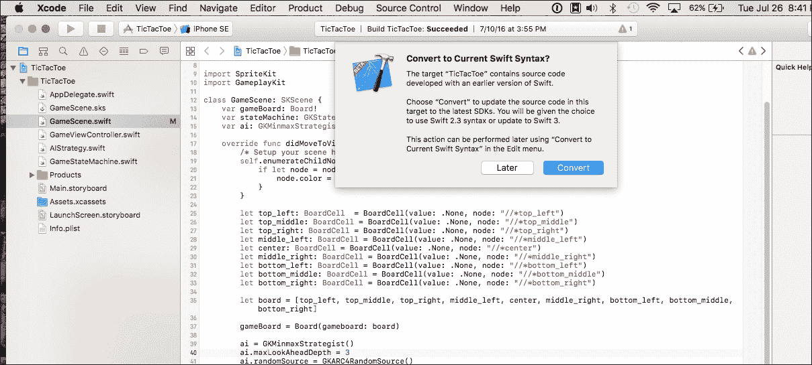
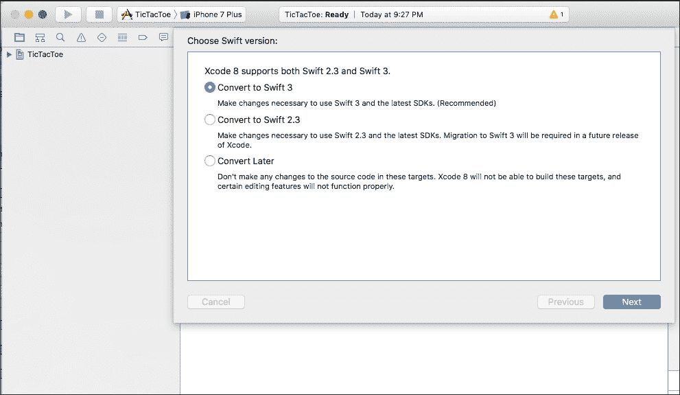
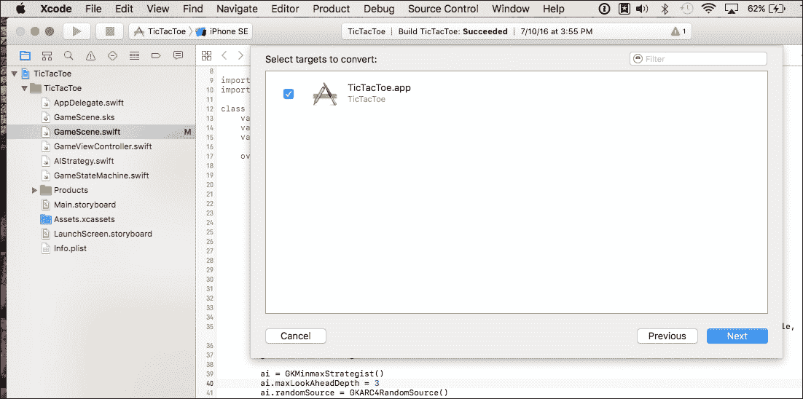
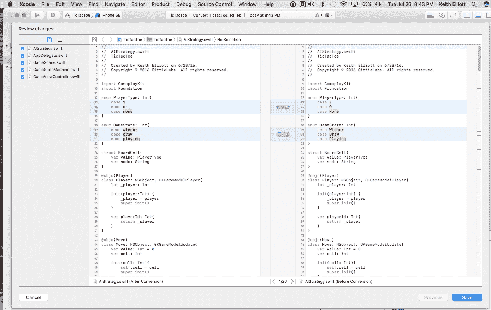
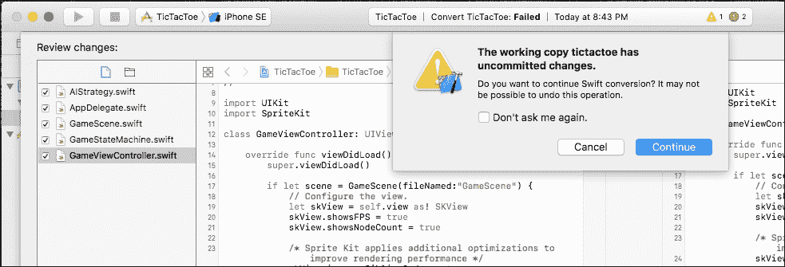
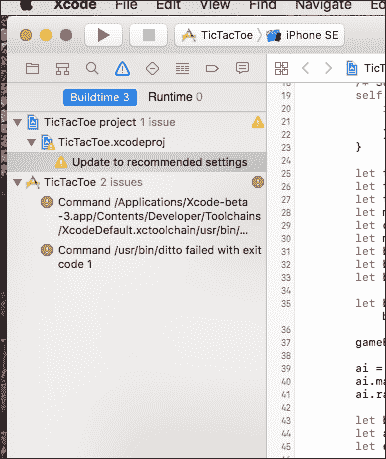

# 第三章。迁移到 Swift 3 以更 Swifty

如果你像我一样是一位 Swift 开发者，你可能有现有的 Swift 2.2 代码，你还不准备放弃。幸运的是，Xcode 8 和内置的 *Swift 迁移器* 将帮助你将 Swift 2.2 项目转换为 Swift 3。我们将使用一个示例项目来演示如何使用迁移器。我们还将讨论一些有用的策略，当迁移器未能正确转换所有代码时，你可以采用这些策略。

# 你如何迁移你的项目…

当你第一次在 Xcode 8 中打开 Swift 2.2 项目时，你会得到选择将项目迁移到 Swift 2.3 或 Swift 3 的选项，以便利用新的 SDK。然而，如果你决定现在还不是转换的最佳时机，你总是可以在以后进行。Swift 迁移器工具在 Xcode 8 的 **编辑** | **转换** | **转换为当前 Swift 语法…** 菜单下可用。

如果你想要使用适用于 iOS 10、macOS 10.12、watchOS 3 或 tvOS 10 的新 SDK，你需要转换你的代码。以下列出了迁移项目的两种选项：

## 选项 1 - 迁移到 Swift 3

如果你想要针对最新的 Swift 构建并使用 Xcode 8 的所有新功能，请选择迁移到 Swift 3 的选项。迁移器将修改你的源文件以符合新的 Swift 3 语法。

## 选项 2 - 迁移到 Swift 2.3

如果你只想使用新的 SDK，但还没有准备好或能够迁移到 Swift 的最新版本，那么请选择 Swift 2.3 选项。Swift 2.3 是 Swift 2.2 加上新的 SDK。在这种迁移场景中，迁移器将修改构建设置以使用遗留 Swift（Swift 2.2），同时进行选择性的源代码更改，以便你的项目可以针对新的 SDK 进行构建。

# 提前规划

让我们面对现实，Xcode 正在要求你勇敢地使用它的黑盒工具对你的项目进行不可逆的更改。虽然我是一个狂热的苹果粉丝，但我怀疑我是否会不假思索地按下那个闪亮的迁移按钮，而不考虑过程中可能出错的地方。我不从事废弃项目从头开始的工作。说实话，谁真的会呢？为了避免迁移器可能带来的糟糕体验，你真的应该在迁移项目之前考虑以下所有作为预工作：

1.  确保你的现有代码库正在使用版本控制系统，例如 Git ([`git-scm.com`](https://git-scm.com)) 或 Subversion ([`subversion.apache.org`](https://subversion.apache.org))。如果你运行迁移器，并且输出结果不符合预期（或者发生其他意外情况），你将可以安心地知道你总是可以回到原始版本。

1.  确保您的项目在最新版本的 Xcode（7.3 或 7.3.1）上可以编译。您想要确保包括测试在内的一切都在 Xcode 7 下按预期运行。如果您的项目不能作为 Swift 2.2 项目编译和运行，那么在此时使用迁移器只会给您带来麻烦。在迁移到 Swift 2.3 或 Swift 3 之前，请确保一切正常工作。您的目标是现在和迁移后测试都能通过。

1.  确保您想要转换的每个目标都使用活动方案进行构建。Swift 迁移器使用 Xcode 中的活动方案来确定它应该检查哪些源文件进行迁移。您可以通过使用“编辑方案”菜单查看方案设置来验证迁移器将考虑的目标。一旦进入，切换到方案的构建选项卡，并确保所有您想要迁移的目标都已勾选。

### 小贴士

您可以为项目添加一个新的方案，并包括所有目标。使用单独的方案进行迁移将确保您不会修改主方案中的设置。迁移完成后，您可以删除该方案。

如果您的项目使用 Carthage 或 CocoaPods，或者另一个不是与主项目一起构建的项目，那么您有两个选择：

+   **将外部项目整合到主项目中：**选择此选项意味着您打算将其他项目的源文件复制到现有的项目中。除非您真的非常了解项目的结构并打算继续维护它，否则我可能会犹豫这样做。一旦您复制了文件，您将无法连接到项目中正在进行的更新和持续工作。未来的更新将需要您每次都执行相同的复制、粘贴和配置操作。

+   **不采取任何行动，即您现在不进行转换：**选择此选项，您只需迁移您的代码，并继续链接到任何第三方项目而不进行迁移。这对于外部项目的所有者来说可能是一个值得考虑的好选项，因为所有者可能对如何迁移项目有更好的见解，但尚未这样做。如果不是您的项目，您可能最好等待项目所有者和维护者提供更新。有很大可能性，您可以继续使用第三方项目。开发者正在实施的一个最后趋势是创建 Swift 2.3 和 Swift 3 分支，以简化在 Xcode 8 测试版中开发时的后续转换。 

# 使用 Xcode 的 Swift 迁移工具进行迁移

在完成预工作后，是时候迁移您的代码了。为了我们的目的，我们将使用一个简单的井字棋项目，您可以从 Packt 网站下载：

1.  **启动 Xcode 8 并打开井字棋项目**：在首次启动时，Xcode 将询问您是否想要将您的 Swift 2.2 项目迁移到使用最新 SDK。选择“转换”以开始迁移。

1.  **选择 Swift 2.3 或 Swift 3**：在选择转换后，您将看到一个另一个屏幕，基本上告诉您 Xcode 将修改您的文件。您还被告知，一旦迁移完成，您将有一个选择接受更改或取消更改而不永久更改项目文件的选项。模态对话框还提供了一份免责声明，说明 Swift 迁移工具并不完美，迁移完成后您可能需要做出额外的更改。按**下一步**，然后选择 Swift 3。

1.  **选择要转换的目标**：如果您有一个具有多个目标的项目，您需要确保您已选择一个方案，该方案将构建您想要迁移到最新 Swift（或 Swift 2.3）的所有目标。在我们的例子中，只有一个目标需要转换，并且它应该已经勾选。如果您想跳过一个目标，只需取消选中其对应的复选框即可。

    ### 小贴士

    您可以在项目上多次运行迁移。如果您不想修改您的方案，您只需为要转换的每个方案运行迁移。只需将选定的方案设置为活动方案，然后开始迁移。

1.  **在预览屏幕上审查更改**：在选择目标并按**下一步**后，迁移工具将开始工作。一旦过程完成，您将看到一个预览屏幕，其中包含您要审查的更改前后的内容。Xcode 修改的每个源文件都将可在预览窗口中查看。强烈建议您检查每个文件，以确保您理解代码更改并同意推荐的更改，然后再接受它们。

1.  在审查更改时，您可以选择永久修改的内容。每个修改过的文件都有一个编号的更改列表，您可以选择丢弃或进一步修改。您可以通过展开单个突出显示的更改按钮并选择忽略操作来丢弃文件中的特定更改。在文件级别，您可以通过在左侧侧边栏视图中取消选中文件来丢弃对文件的更改。

1.  **保存您的更改**：在审查完更改后，按**S**ave**按钮。您将看到一个确认对话框，警告您更改将是最终的。一旦您允许 Swift 迁移工具应用所有更改，您将无法使用迁移工具撤回更改。点击**Continue**按钮以确认您确实想要接受更改。

保存更改后，迁移完成。Xcode 将尝试编译您的项目，并在存在任何构建问题时通知您。在我们的例子中，我们有一个警告和两个构建错误。警告告诉我们我们没有使用所有推荐的项目设置。继续双击警告，让 Xcode 将我们的项目设置更改为推荐设置。在这种情况下，Xcode 建议我们使用整个模块优化。

### 注意

整个模块优化是一个构建设置，允许编译器在执行代码的高级优化时考虑整个模块。当编译器对您的代码具有模块级别的可见性时，优化决策将基于更多关于受影响例程在整个模块中如何使用的信息，而不仅仅是单个文件内。更好的优化会导致代码运行更快。您可以通过观看 WWDC 2015 上的“优化 Swift 性能”讲座了解更多关于整个模块优化和优化 Swift 性能选项的信息 [`developer.apple.com/videos/play/wwdc2015/409/`](https://developer.apple.com/videos/play/wwdc2015/409/)。

剩余的构建错误可能或可能不会出现在您的机器上。在我的情况下，错误是由于我之前使用 Xcode 7.3.1 构建了项目。每次您构建项目时，Xcode 都会缓存编译的中间产品以提高未来的构建效率。如果您的代码的一部分没有更改，Xcode 将使用缓存的副产品来简化重新编译。这些缓存数据存储在 Xcode 用于未来构建的文件夹中。在我的情况下，衍生数据文件夹包含了一些对于项目迁移到 Swift 3 和 Xcode 8.0 后不再相关的代码。使用 Product > Clean 命令清理您的项目。现在，您的项目应该可以成功编译。

迁移过程中出现问题时进行故障排除

不幸的是，并非所有项目都能完美转换。[`swift.org`](https://swift.org) 网站维护了一个已知迁移器问题的列表，您可以参考（[`swift.org/migration-guide/`](https://swift.org/migration-guide/)）。例如，迁移器可能会在编辑器边缘建议如何通过 fixit 修复问题，而无需自动为您执行。您在这个例子中看到 fixit 的原因可能是您的项目可能具有多个共享某些形式依赖的目标，这可能会使迁移器困惑。这是一个已知问题，但在迁移后很容易处理。您只需点击 fixit 选择推荐的操作，Xcode 将完成剩余的工作。我们没有足够的时间涵盖所有已知的迁移问题，但我们将介绍一些更重要的问题。

我们可以将已知的迁移器问题分为三个一般领域：

1.  **标准库问题**：通常，这些问题涉及集合例程和类型

1.  **新的 SDK 问题**：这些问题涉及迁移器未能将旧类型和协议关联到新 SDK 中创建的新类型。你也可能会遇到与 Foundation 框架重整相关的问题。我们在第八章，*哇！看看 Foundation 框架的新功能*中涵盖了 Foundation 框架的主要变更。

1.  **Swift 3 语言变更**：这些迁移器问题与 Swift 3 语言变更有关。在函数或构造在 Swift 3 中不再可用的情况下，迁移器不会采取任何行动，你需要手动更改代码。

你需要结合使用在[`swift.org`](https://swift.org)网站上列出的已知问题页面以及生成的警告/错误消息来确定如何在迁移后修复出现的构建错误。如果编辑器边缘没有提供修复提示，你将需要手动纠正问题。

## 快速解决问题的策略

1.  **修复建议**：迁移完成后，检查警告/错误部分以查找修复操作。这些操作中的每一个都会为你提供有关如何修复相关代码的建议。只需选择操作，Xcode 就会应用代码更改。

1.  **迁移注释**：即使你的项目编译成功，仍然有可能在转换过程中，迁移器遗漏了一些无法处理的点。在这种情况下，迁移器会在你的代码中留下`/*Migrator FIXME: ...*/`注释。你将需要搜索这些注释，并在评估了代码块后决定是否需要手动进行更改。

1.  **使用新的 Foundation 框架值类型**：在检查你的项目代码时，你可能会看到 Swift 正在将类型转换为以"NS"为前缀的类型。在使用 Swift 3 时，你可能不希望使用遗留的 Foundation 类型。同样，迁移器在查找和纠正这些问题方面做得相当不错；然而，你仍然建议手动搜索"NS"前缀。如果你发现任何'NS'前缀的出现，你将有机会确定每个是否正确，或者是否应该使用不带"NS"前缀的新 Foundation 类型。在第八章，*哇！看看 Foundation 框架的新功能*中，我们将介绍 Foundation 框架的变更，包括新的值类型。

1.  **用户定义的集合类型可能会产生迁移问题：**在 Swift 3 中，集合需要处理在其项目集合中向前和向后移动。你需要采用新的 Collection 协议（[`developer.apple.com/reference/swift/collection`](https://developer.apple.com/reference/swift/collection)）函数来定义如何递增索引。如果你的集合支持递减，也有一个针对该功能的新的协议函数。最后，有一个协议函数允许你的集合支持随机访问一个项目。如果你看到与你的自定义集合不遵守 Collection 协议相关的错误，那么很可能你没有添加一个或多个以下的新协议函数：

    +   `func index(after: Index) -> Index`

    +   `func index(before: Index) -> Index`

    +   `func index(_: Index, offsetBy: Int) -> Index`

    +   `func distance(from: Index, to: Index) -> IndexDistance`

1.  **Swift 3 中移除的功能**：例如，C 风格的 for 循环已被从 Swift 3 中移除。你必须手动将其重写为 `for…in` 语句。

希望到这一点，你已经明白了迁移工具将处理你大多数日常使用场景。对于这些问题，你需要使用警告和错误消息来解析正在发生的事情。你应该首先检查 Swift.org 上的已知问题部分。

# 摘要

Swift 迁移工具是一个节省时间的优秀工具，当你需要将 Swift 2.2 项目迁移到 Swift 3（或 Swift 2.3）时，它会非常有用。我们了解到，为了充分利用 Xcode 8 提供的所有功能，我们必须将现有的 Swift 2.2 项目迁移到 Swift 3。我们还了解到，通过选择迁移到 Swift 2.3（Swift 2.2 加上新 SDKs），我们可以在不迁移到 Swift 3 的情况下使用新的 SDKs。在未来任何时候，我们都可以使用 **编辑** | **转换** | **转换为当前 Swift 语法...** 菜单来启动迁移工具。最后，我们了解到迁移工具并不完美，它可能无法转换所有内容。迁移完成后，我们可能需要手动做一些更改才能使一切正常工作。在下一章中，我们将开始介绍 Swift 3 的核心语言变化。
