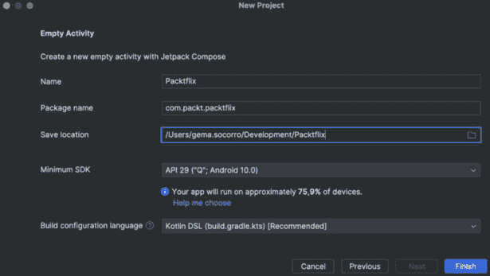
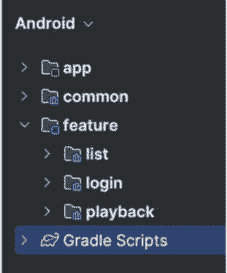
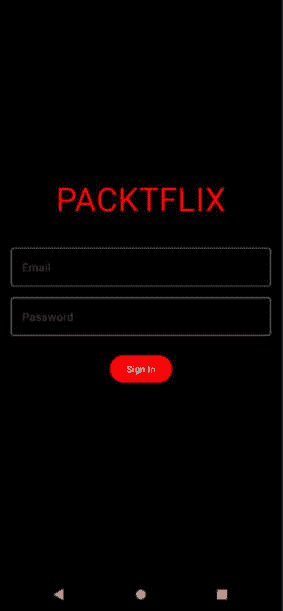
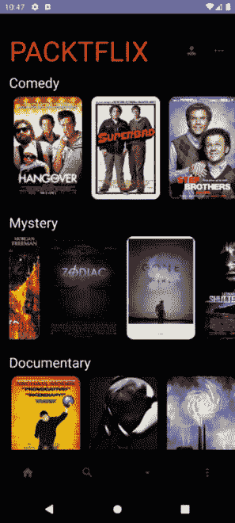
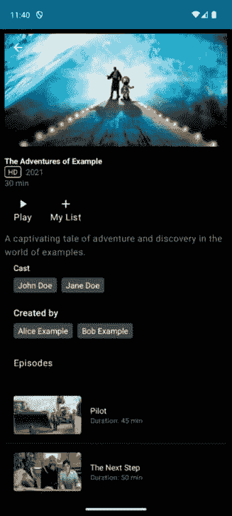

# 第七章：开始视频流应用程序并添加身份验证

在掌握了如何创建像 WhatsApp 和 Instagram 这样的引人入胜的社交应用程序之后，现在是时候进入视频流服务领域了。本章标志着我们第三个项目的开始：一个类似 Netflix 的应用程序。让我们称它为 Packtflix。在这里，我们将探索 Android 开发的另一个方面，重点是多媒体内容交付和用户身份验证，同时继续构建吸引人的用户界面。

我们的旅程将从为我们的流媒体应用程序打下基础开始。我们将从头开始，设置一个新的项目，并介绍应用程序的结构和模块。

在设置完成后，我们将深入探讨任何应用程序最关键的一个方面：验证用户身份。在当今这个数字时代，安全和隐私比以往任何时候都更加重要，因此您将学习如何使用 OAuth2 实现强大的身份验证机制。这将确保您的应用程序用户可以安全地访问他们的账户和个人偏好。

一旦我们的用户可以登录，我们将专注于向他们展示丰富的电影选择。我们将使用 Jetpack Compose 创建动态和响应式的列表，展示可用的内容。

最后，我们将深入了解细节。您应用程序中的每部电影或电视剧都应得到其应有的关注，您将使用 Jetpack Compose 为它们创建详细的界面。这将使用户能够获得他们决定观看下一部电影所需的所有信息。

因此，本章将涵盖以下主题：

+   创建应用程序的结构和模块

+   构建登录界面

+   验证应用程序的用户身份

+   创建您的电影列表

+   制作电影和电视剧详情界面

# 技术要求

如前一章所述，您需要安装 Android Studio（或您偏好的其他编辑器）。

本章我们将开始一个新的项目，因此没有必要下载前一章所做的更改。

您可以在本章节中找到我们将要构建的完整代码，它位于这个仓库中：[`github.com/PacktPublishing/Thriving-in-Android-Development-using-Kotlin/tree/main/Chapter-7`](https://github.com/PacktPublishing/Thriving-in-Android-Development-using-Kotlin/tree/main/Chapter-7).

# 创建应用程序的结构和模块

在本节中，我们将通过将 Packtflix 应用程序组织成功能模块来为其打下基础。正如我们之前所看到的，通过将应用程序划分为登录、列表和播放等模块，我们可以一次专注于一个功能，而不会影响其他功能，从而加快大型项目的构建过程。此外，我们还将为我们的依赖项设置版本目录，就像我们之前所做的那样，以简化对 Jetpack Compose、Dagger Hilt 和 Kotlin 等库的管理。

让我们开始创建项目。在 Android Studio 中，选择 **文件** | **新建** | **新建项目…**，然后选择 **空 Compose Activity**。然后，在 **新建项目** 面板中，填写 **名称**、**包名** 和 **保存位置**。对于 **最小 SDK** 选项，我们将再次选择 **API 29**，因为它在撰写时保证了最佳的兼容性百分比。



图 7.1：Packtflix 的新项目配置

*图 7.1* 中的选项是我们将在 Android Studio Iguana（版本 2023.2.1）中看到的，尽管它可能因版本不同而有所变化。例如，在其他之前的 Android Studio 版本中，我们还可以选择是否为依赖项使用版本目录。

现在，版本目录默认创建，因此我们将在项目中获得一个 `libs.versions.toml` 文件，其内容如下：

```java
[versions]
agp = "8.3.0-alpha18"
kotlin = "1.9.0"
coreKtx = "1.12.0"
junit = "4.13.2"
junitVersion = "1.1.5"
espressoCore = "3.5.1"
lifecycleRuntimeKtx = "2.7.0"
activityCompose = "1.8.2"
composeBom = "2023.08.00"
[libraries]
androidx-core-ktx = { group = "androidx.core", name = "core-ktx", version.ref = "coreKtx" }
junit = { group = "junit", name = "junit", version.ref = "junit" }
androidx-junit = { group = "androidx.test.ext", name = "junit", version.ref = "junitVersion" }
androidx-espresso-core = { group = "androidx.test.espresso", name = "espresso-core", version.ref = "espressoCore" }
androidx-lifecycle-runtime-ktx = { group = "androidx.lifecycle", name = "lifecycle-runtime-ktx", version.ref = "lifecycleRuntimeKtx" }
androidx-activity-compose = { group = "androidx.activity", name = "activity-compose", version.ref = "activityCompose" }
androidx-compose-bom = { group = "androidx.compose", name = "compose-bom", version.ref = "composeBom" }
androidx-ui = { group = "androidx.compose.ui", name = "ui" }
androidx-ui-graphics = { group = "androidx.compose.ui", name = "ui-graphics" }
androidx-ui-tooling = { group = "androidx.compose.ui", name = "ui-tooling" }
androidx-ui-tooling-preview = { group = "androidx.compose.ui", name = "ui-tooling-preview" }
androidx-ui-test-manifest = { group = "androidx.compose.ui", name = "ui-test-manifest" }
androidx-ui-test-junit4 = { group = "androidx.compose.ui", name = "ui-test-junit4" }
androidx-material3 = { group = "androidx.compose.material3", name = "material3" }
[plugins]
androidApplication = { id = "com.android.application", version.ref = "agp" }
jetbrainsKotlinAndroid = { id = "org.jetbrains.kotlin.android", version.ref = "kotlin" }
```

此代码向版本目录添加了基本的依赖项，以使用 Kotlin、Android 和 Jetpack Compose 构建应用程序。

下一步将是创建所需的模块。在这里，我们将创建三个功能模块：

+   **:feature:login**: 我们将使用此模块来包含登录功能

+   **:feature:list**: 在此模块中，我们将包括列表界面以及详情界面

+   **:feature:playback**: 在此模块中，我们将托管所有播放功能

我们还将创建以下通用模块：

+   **:app**: 此模块将包含我们应用程序的入口点

+   **:common**: 此模块将包含在多个模块中需要的通用功能

要创建这些模块，使用 **文件** | **新建** | **新建模块…** 选项，就像我们在前面的项目中做的那样。最终的项目结构应该看起来像这样：



图 7.2：项目模块结构

现在我们已经创建了我们的模块结构，是时候设置依赖注入框架了。

## 设置依赖注入框架

正如我们在前面的章节中看到的，可扩展性、性能优化和可测试性的需求使得在 Android 中使用依赖注入框架几乎成为必须。在这种情况下，我们将再次使用 Hilt（想了解更多，请参阅*第一章*，在那里我们对框架进行了全面审查并揭示了其主要优势）。

让我们从向我们的版本目录添加依赖项开始。打开我们的 `libs.versions.toml` 文件，并在 `versions`、`libraries` 和 `plugins` 块中添加 Hilt 依赖项，如下所示：

```java
[versions]
// ...
hiltVersion = "2.50"
[libraries]
// ...
androidxHilt = { module = "com.google.dagger:hilt-android", name = "hilt", version.ref = "hiltVersion" }
hiltCompiler = { module = "com.google.dagger:hilt-android-compiler", name = "hilt-compiler", version.ref = "hiltVersion" }
[plugins]
// ...
hilt = { id = "com.google.dagger.hilt.android", version.ref = "hiltVersion" }
```

然后，我们将插件添加到项目级别的 `build.gradle.kts`：

```java
plugins {
    ...
    alias(libs.plugins.hilt) apply false
}
```

接下来，在每一个模块的 `build.gradle.kts` 文件中，我们将必须应用插件并添加 Hilt 依赖项：

```java
plugins {
//...
    alias(libs.plugins.hilt)
}
dependencies {
//...
    implementation(libs.androidxHilt)
    kapt(libs.hiltCompiler)
}
```

现在，在 `:app` 模块中，我们可以创建 `PacktflixApp` 类，它将是 Hilt 配置的入口点：

```java
@HiltAndroidApp
class PacktflixApp: Application() {
}
```

通过这个注解，我们正在启用 Hilt 在底层生成必要的组件，这些组件将在我们的应用程序中用于依赖注入。

最后，我们应该在 `AndroidManifest.xml` 中包含 `PacktflixApp`，这样我们的应用程序就会使用它而不是默认的 `Application` 类：

```java
<?xml version="1.0" encoding="utf-8"?>
<manifest xmlns:android =
"http://schemas.android.com/apk/res/android"
    xmlns:tools = "http://schemas.android.com/tools">
    <application
        android:name = ".PacktflixApp"
        ...>
....
    </application>
</manifest>
```

现在，我们已经准备好开始构建我们的新项目了。第一步将是构建登录界面，因为我们希望用户使用他们的凭据进行身份验证。让我们开始工作吧！

# 构建登录界面

要构建登录界面，我们将开始创建一个 `LoginScreen` 可组合组件，使用 Jetpack Compose。我们必须包括应用程序的标志、输入电子邮件和密码的字段以及一个 **登录** 按钮。我们还可以包括一个文本来显示当用户尝试登录时是否有任何错误。

这个登录界面将有四种状态（`Idle`、`Loading`、`Success` 和 `Error`），所以让我们开始建模整体的 `ViewState`：

```java
sealed class LoginState {
    object Idle : LoginState()
    object Loading : LoginState()
    object Success : LoginState()
    data class Error(val message: String?) : LoginState()
}
```

现在，让我们创建 `LoginScreen` 可组合组件：

```java
@Composable
fun LoginScreen() {
    val loginViewModel: LoginViewModel = hiltViewModel()
    val loginState =
        loginViewModel.loginState.collectAsState().value
    var email by remember { mutableStateOf("") }
    var password by remember { mutableStateOf("") }
    var errorMessage by remember { mutableStateOf("") }
//...
}
```

我们通过 `hiltViewModel()` 获取 `LoginViewModel` 来开始可组合函数，这是通过 `hiltViewModel()` 访问的。这个 `ViewModel` 组件管理登录逻辑并通过 `StateFlow` 流暴露当前的登录状态。`collectAsState().value` 调用将异步的登录状态流转换为可组合友好的状态，当登录状态改变时触发重新组合。

该函数使用 `remember { mutableStateOf("") }` 来维护用户输入的电子邮件和密码在可组合组件的生命周期内的状态。这个状态是可变的和响应式的，意味着任何对输入字段（由 `onValueChange` 处理）的更改都会自动更新相应的变量，从而更新 UI。

让我们继续下一部分的可组合组件，这将包括应用程序的名称、`email` 和 `password` 字段以及 **登录** 按钮：

```java
Surface(color = Color.Black, modifier =
Modifier.fillMaxSize()) {
        Column(
            horizontalAlignment =
                Alignment.CenterHorizontally,
            verticalArrangement = Arrangement.Center,
            modifier = Modifier
                .padding(16.dp)
        ) {
            if (loginState is LoginState.Error) {
                Text(
                    text = loginState.message ?:
                        "Unknown error",
                    color = Color.Red,
                    modifier = Modifier
                        .padding(bottom = 16.dp)
                )
            }
            Text(
                text = "PACKTFLIX",
                color = Color.Red,
                fontSize = 36.sp,
                modifier = Modifier.padding(bottom = 32.dp)
            )
            OutlinedTextField(
                value = email,
                onValueChange = { email = it },
                label = { Text("Email") },
                colors = OutlinedTextFieldDefaults.colors(
                    focusedContainerColor =
                        Color.Transparent,
                    focusedTextColor = Color.White,
                    focusedBorderColor = Color.Gray,
                    unfocusedBorderColor = Color.Gray
                ),
                modifier = Modifier.fillMaxWidth()
            )
            Spacer(modifier = Modifier.height(8.dp))
            OutlinedTextField(
                value = password,
                onValueChange = { password = it },
                label = { Text("Password") },
                visualTransformation =
                    PasswordVisualTransformation(),
                colors = OutlinedTextFieldDefaults.colors(
                    focusedTextColor = Color.White,
                    focusedContainerColor =
                        Color.Transparent,
                    focusedBorderColor = Color.Gray,
                    unfocusedBorderColor = Color.Gray
                ),
                keyboardActions = KeyboardActions(
                    onDone = { loginViewModel.login(
                        email, password) }
                ),
                modifier = Modifier.fillMaxWidth()
            )
            Spacer(modifier = Modifier.height(24.dp))
            Button(
                onClick = { loginViewModel.login(email,
                    password) },
                colors = ButtonDefaults.buttonColors(
                    containerColor = Color.Gray)
            ) {
                Text("Sign In", color = Color.White)
            }
            Spacer(modifier = Modifier.height(24.dp))
            if (loginState is LoginState.Loading) {
                CircularProgressIndicator()
            }
        }
    }
    LaunchedEffect(loginState) {
        when (loginState) {
            is LoginState.Success -> {
                // Navigate to next screen or show success
                   message
            }
            is LoginState.Error -> {
                errorMessage = loginState.message ?:
                    "An error occurred"
            }
            else -> Unit // Handle other states if
                            necessary
        }
    }
```

UI 会根据当前的登录状态动态调整。例如，如果登录状态是 `LoginState.Error`，函数将渲染一个 `Text` 可组合组件来显示错误信息。这种条件渲染对于向用户提供反馈至关重要，例如指示登录失败或显示加载指示器（`CircularProgressIndicator`），当登录过程正在进行时。这种 UI 开发方法声明式，UI 的结构和内容直接映射到应用程序的状态。

`OutlinedTextField` 可组合组件用于捕获 `email` 和 `password` 的用户输入，然后当用户点击 `password` 字段（通过 `KeyboardActions`）时，这些输入被用来启动登录过程（`loginViewModel.login(email, password)`）。这展示了如何在可组合组件中处理用户动作和输入，触发 `ViewModel` 动作，最终导致状态变化。

最后，`LaunchedEffect`块监听登录状态的变化以执行副作用，例如在登录成功后进行导航或更新错误信息状态。这种模式将副作用与 UI 逻辑分离，确保导航或显示吐司等效果仅在响应状态变化时发生，而不是直接由用户操作的结果。

现在，让我们开始工作在`LoginViewModel`上：

```java
@HiltViewModel
class LoginViewModel @Inject constructor(
    private val loginUseCase: DoLoginUseCase
) : ViewModel() {
    private val _loginState =
        MutableStateFlow<LoginState>(LoginState.Idle)
    val loginState: StateFlow<LoginState> = _loginState
    fun login(email: String, password: String) {
        viewModelScope.launch {
            _loginState.value = LoginState.Loading
            val result = loginUseCase.doLogin(email,
                password)
            _loginState.value = when {
                result.isFailure -> LoginState.Error(
                    result.exceptionOrNull()?.message)
                else -> LoginState.Success
            }
        }
    }
}
```

在这里，我们开始处理依赖注入相关的内容：使用`@HiltViewModel`表示 Hilt 将负责`LoginViewModel`的实例化和提供。`@Inject`构造函数表示 Hilt 将向这个`ViewModel`实例注入必要的依赖，在这种情况下，是一个名为`DoLoginUseCase`的使用案例的实现（我们将在后面实现这个使用案例）。

`ViewModel`实例使用`MutableStateFlow<LoginState>`来管理登录状态。在这里，`_loginState`是一个私有的、可变的 state flow，它持有登录过程的当前状态，可以是`Idle`、`Loading`、`Success`或`Error`之一。不可变的`loginState`属性将这个状态以只读的`StateFlow`的形式暴露给 UI 层，确保状态更新能够安全且高效地传达给 UI。

登录函数体现了这个`ViewModel`类的核心功能。它通过将`_loginState`设置为`Loading`来启动登录过程，表示登录操作已经开始。然后，它继续调用提供的`loginUseCase`上的`doLogin`方法，并传递用户的电子邮件和密码。

在尝试登录后，函数评估结果。如果登录尝试失败（`result.isFailure`），`_loginState`会被更新为`Error`状态，并带有异常信息，提供登录失败的原因。如果登录成功，`_loginState`会被设置为`Success`，表示登录过程成功。这种条件处理确保 UI 能够适当地对登录过程的不同结果做出反应。

登录过程在`viewModelScope`中启动，这是一个与`ViewModel`生命周期绑定的协程作用域。这确保了如果`ViewModel`实例被清除（通常是在相关的 UI 组件被销毁时），任何正在进行的登录操作都会自动取消，从而防止内存泄漏和不必要的操作。

有了这个，我们的登录界面就准备好了。最后一步是设置 Hilt 模块并将`MainActivity`的内容设置为显示`LoginScreen`可组合界面：

```java
@AndroidEntryPoint
class MainActivity : ComponentActivity() {
    override fun onCreate(savedInstanceState: Bundle?) {
        super.onCreate(savedInstanceState)
        setContent {
            PacktflixTheme {
                LoginScreen()
            }
        }
    }
}
```

如果我们现在运行应用，我们应该看到以下屏幕：



图 7.3：Packtflix 登录界面

现在我们已经完成了我们的 UI，下一步将是验证用户。让我们学习如何做到这一点。

# 验证应用的用户

在移动应用程序中，身份验证在保护用户数据和个人信息免受未经授权的访问方面发挥着关键作用。由于移动设备通常作为通向各种服务的个人网关，并存储大量敏感数据，因此确保这些数据得到安全管理和访问比以往任何时候都更重要。验证用户的最受欢迎的方法之一是 OAuth2。

**OAuth2**是一个授权框架，允许第三方服务代表用户交换网络资源。它使用户能够授予网站或应用程序访问其他网站上的其信息的权限，而无需提供他们的密码。这对于提供使用 Google、Facebook 或其他社交媒体账户登录等功能特别有用。

以下列出了 OAuth2 最重要的功能：

+   **安全性**：它允许用户授权应用程序在不共享其凭据的情况下访问不同服务器上的资源，通常是通过使用涉及用户同意和安全令牌交换的过程授予的访问令牌。

    一个 OAuth **令牌**是代表授予应用程序的授权的凭证，允许它代表用户访问特定资源。这些令牌可以采用各种格式，如不透明令牌或**JSON Web Tokens**（**JWTs**）。不透明令牌是没有任何特定结构的简单字符串，而 JWTs 是由三个部分组成的结构化令牌——一个头部、一个负载和一个签名——所有这些都在 Base64 中进行编码。

+   **可扩展性**：它允许将用户身份验证委托给托管用户账户的服务，通过将安全身份验证和基础设施可扩展性的技术复杂性卸载到专用服务中。这些服务通常由负责确保和扩展身份验证过程的复杂且资源密集型任务的特定团队管理。

+   **灵活性**：它支持多种流程（基于授权类型，这将确定身份验证过程必须遵循的流程），适用于不同类型的客户端，包括移动应用、网站和服务器端应用程序。

+   **用户体验**：它使用户的登录体验更加顺畅，因为用户可以使用现有的账户登录到新的服务，而无需创建新的凭据。

在本质上，OAuth2 为在移动应用程序中实现身份验证提供了一种安全且高效的方法。它利用现有的用户账户，简化了用户的登录过程，并将管理用户凭据和会话的复杂性卸载到第三方服务中，从而提高了安全性和用户体验。

让我们在我们的应用中添加这个功能，首先添加所需的模型。

## 创建用户模型

首先，我们将定义一个简单的用户模型，它将保存我们在成功身份验证后收到的用户信息：

```java
data class User(
    val id: String,
    val name: String,
    val email: String,
    // Add other fields as necessary
)
```

在这段代码中，我们定义了存储用户信息所需的基本字段（根据您应用程序的要求，这些字段可能会有所不同）。

然后，为了构建我们将发送到后端以获取认证令牌的登录请求，我们需要另一个数据类来存储凭证：

```java
data class LoginRequest(val email: String, val password:
String)
```

在这里，我们包括了`email`和`password`字段，这些字段是登录用户所必需的。

一旦这个请求到达后端，如果凭证正确，后端将返回一个授权令牌，我们的应用程序将将其存储在安全的地方，并用于验证后续对后端的 API 调用。我们需要另一个模型来存储这个令牌信息：

```java
data class AuthToken(val token: String)
```

现在，让我们设置 Retrofit 来获取这个授权令牌。

## 使用 Retrofit 获取授权令牌

为了获取授权令牌，我们需要我们的应用程序在用户提供他们的凭证时请求它。为了将这个请求发送到后端，我们将使用 Retrofit。我们已经在*第四章*中使用了 Retrofit，所以让我们跳过介绍，直接从设置 Retrofit 将用于发送 HTTP 请求的接口开始：

```java
interface AuthService {
    @POST("auth/login")
    suspend fun login(@Body loginRequest: LoginRequest):
        Response<AuthToken>
}
```

这段代码定义了一个名为`AuthService`的接口，具有一个独特的登录功能。我们将传递一个包含请求所需数据的`LoginRequest`对象，然后获取一个`AuthToken`响应。

让我们构建这些模型。首先，我们将构建`LoginRequest`模型：

```java
data class LoginRequest(val email: String, val password:
String)
```

在这个模型中，我们将用户的凭证——他们的电子邮件和密码——发送到后端。

然后，如果登录成功，后端应该返回一个包含授权令牌的响应。我们将按照以下结构来构建这个响应：

```java
data class AuthToken(val token: String)
```

这个`AuthToken`模型将包括上述授权令牌。请注意，通常这些令牌有一个时间窗口，因此必须在它们过期之前更新。为了简单起见，我们将假设这个令牌不会过期。

现在，让我们创建我们的远程数据源以检索授权令牌：

```java
class LoginRemoteDataSource(
    private val authService: AuthService
) {
    suspend fun login(email: String, password: String):
    Result<String> {
        return authService.login(
            LoginRequest(
                email = email,
                password = password
            )
        ).run {
            val token = this.body()?.token
            if (this.isSuccessful && token != null) {
                Result.success(token)
            } else {
                Result.failure(getError(this))
            }
        }
    }
}
```

在这里，我们定义了`LoginRemoteDataSource`类，该类将作为数据源层，通过交互远程认证服务来处理登录功能。这个类将有一个单一的依赖项，即`authService`，它是一个接口（可能是 Retrofit 或类似的网络库），负责处理与认证相关的网络请求。在这个类中的主要功能`login`是一个挂起函数，它接受两个参数，`email`和`password`，这些参数用于构建一个`LoginRequest`对象。然后，这个对象被传递给`authService.login`方法，启动一个网络请求以登录用户。

在接收到 `authService.login` 的响应后，执行 `run` 块来处理响应。在这个块内部，检查响应以确定请求是否成功（`isSuccessful`）以及响应体是否包含非 `null` 令牌。如果这两个条件都满足，则返回 `Result.success(token)`，将令牌封装在成功的结果中。这表明登录成功，并向调用者提供令牌。相反，如果任一条件不满足——即请求失败或令牌为空——则通过调用 `Result.failure(getError(this))` 返回失败结果。`getError` 函数将分析 `Response<AuthToken>` 对象以确定失败的性质，并返回一个描述错误的适当 `Throwable` 对象。

到目前为止，让我们构建 `getError()` 函数：

```java
    private fun getError(response: Response<AuthToken>):
    Throwable {
        return when (response.code()) {
            401 -> LoginException.AuthenticationException(
                "Invalid email or password.")
            403 -> LoginException.AccessDeniedException(
                "Access denied.")
            404 -> LoginException.NotFoundException(
                "Login endpoint not found.")
            in 500..599 -> LoginException.ServerException(
                "Server error: ${response.message()}.")
            else -> LoginException.HttpException(
                response.code(),
                "HTTP error: ${response.code()}
                    ${response.message()}."
            )
        }
    }
```

在这个 `getError` 函数中，我们将响应的状态码的可能值映射到不同的错误。如果我们愿意，我们可以在以后处理这些错误，并相应地向用户显示消息。

让我们也定义那些错误，我们将它们定义为 `LoginException` 密封类的一部分，这是 Kotlin 中的一种特殊类型类，它将继承层次结构限制为特定的一组子类，提供详尽的 `when` 表达式，并确保处理了所有可能的错误类型：

```java
sealed class LoginException(loginErrorMessage: String, val
code: Int? = null) : Exception(loginErrorMessage) {
    class AuthenticationException(message: String) :
        LoginException(message)
    class AccessDeniedException(message: String) :
        LoginException(message)
    class NotFoundException(message: String) :
        LoginException(message)
    class ServerException(message: String) :
        LoginException(message)
    class HttpException(code: Int, message: String) :
        LoginException(message, code)
}
```

现在我们已经有了我们的 `LoginRemoteDataSource` 组件，是时候定义如何存储令牌了。

## 使用 DataStore 存储令牌

由谷歌推出，**DataStore** 是一种数据存储解决方案，它提供了一种高效、安全且异步的方式来持久化小块数据。它使用 Kotlin 协程和流式传输来异步存储数据，确保 UI 线程安全并提高性能。

DataStore 提供了几个功能，使其成为 Android 应用程序中首选的数据存储选项：

+   **默认异步**：DataStore 操作默认使用 Kotlin 协程异步执行，防止阻塞主线程并提高应用性能。

+   **安全和一致**：使用内置的事务性数据 API，DataStore 确保数据一致性和完整性，即使在写入操作期间应用程序进程被杀死也是如此。

+   **类型安全**：DataStore 提供了两种实现：偏好 DataStore，它存储和检索键值对，以及 Proto DataStore，它允许使用 Protocol Buffers 存储类型安全的对象。

+   **安全性**：DataStore 可以与加密机制集成，以安全地存储敏感信息。DataStore 可以与加密库（如 Tink）结合使用，在保存之前加密数据，使其成为处理用户凭据、令牌和其他敏感信息的更安全选项。

为什么我们会使用 DataStore 而不是 Room（我们之前用于我们的 WhatsPackt 消息传递项目）？虽然两者都是健壮的数据持久化库，但它们服务于不同的目的，并且具有不同的用例：

+   **适用用例**：DataStore 设计用于存储小型数据集合，例如设置、偏好或应用程序状态。它在处理结构简单的轻量级任务方面表现出色。**RoomDatabase** 是一个 SQLite 抽象，可以显著减少使用 SQLite 所需的样板代码量。它旨在满足更复杂的数据存储需求，例如存储大型数据集、关系数据或当我们需要执行复杂查询时。

+   **性能和复杂性**：DataStore 提供了一个更简单的 API 用于数据存储，设置最少，使其非常适合简单的任务。其性能针对小型数据集和简单的数据结构进行了优化。**RoomDatabase** 作为数据库，更适合复杂查询和大型数据集。它涉及更多的设置，比 DataStore 更重，但提供了更多功能和能力，用于全面的数据管理。

+   **数据安全**：DataStore，尤其是与 Proto DataStore 结合使用时，可以轻松集成加密机制以安全地存储数据，使其成为敏感信息的更安全选项。**RoomDatabase** 支持 SQLite 加密，但集成加密需要额外的设置，可能还需要第三方库。

由于我们只需要存储一个小的值（令牌）并且考虑到其安全特性，DataStore 是最佳选择。

因此，要开始使用它，首先，我们需要在我们的版本目录中设置 DataStore 依赖项及其版本：

```java
[versions]
datastore = "1.0.0"
[libraries]
datastore = { module = "androidx.datastore:datastore-
preferences", version.ref = "datastore" }
```

然后，需要将其添加到我们的模块的 `gradle.build.kts` 文件中：

```java
dependencies {
 ...
    implementation(libs.datastore)
}
```

使用此代码，我们只将其添加到需要使用依赖项的模块中 - 初始情况下，这将是 `:feature:login` 模块。

现在，我们可以开始使用 DataStore 库了。我们将构建一个 `LoginLocalDataSource` 组件，该组件将负责在 DataStore 中存储和检索令牌：

```java
val Context.dataStore by preferencesDataStore(name = "user_preferences")
class LoginLocalDataSource(private val context: Context) {
    companion object {
        val TOKEN_KEY = stringPreferencesKey("auth_token")
    }
    suspend fun saveAuthToken(token: String) {
        context.dataStore.edit { preferences ->
            preferences[TOKEN_KEY] = token
        }
    }
    suspend fun getAuthToken(): Result<String> {
        val preferences = context.dataStore.data.first()
        val token = preferences[TOKEN_KEY]
        return if (token != null) {
            Result.success(token)
        } else {
            Result.failure(TokenNotFoundError())
        }
    }
}
class TokenNotFoundError : Throwable("Auth token not
found")
```

在 `LoginLocalDataSource` 中，首先，我们利用 Kotlin 的属性委托功能来初始化 DataStore。通过定义 `val Context.dataStore` 为 `preferencesDataStore(name: "user_preferences")`，我们确保 DataStore 的单例实例是懒加载的，并且与应用程序的上下文相关联。这种方法优化了资源使用并简化了后续的数据操作。

在 `LoginLocalDataSource` 中，我们定义一个伴生对象来持有 `TOKEN_KEY`，这是一个用于从 DataStore 存储和检索认证令牌的键。此键使用 `stringPreferencesKey("auth_token")` 定义，表示我们打算存储的数据类型 - 在这种情况下，是一个 `String` 类型。

在`saveAuthToken`函数中，我们通过调用`edit`并传递一个 lambda 表达式，将提供的令牌赋值给`TOKEN_KEY`，在 DataStore 上执行写操作。这个操作是原子的且线程安全的，确保了数据的一致性。

为了检索认证令牌，`getAuthToken`还采用了挂起语义以促进异步执行。它将 DataStore 的数据作为流访问，立即使用`.data.first()`获取第一个发出的值。此操作挂起协程，有效地使数据检索感觉是同步的，同时保持异步执行的好处。然后函数检查令牌是否存在，并将其包装在`Result<String>`中返回，提供了一种简单处理成功和失败的方式。如果没有令牌，它返回带有自定义`TokenNotFoundError`的`Result.failure`，提供精确的错误处理。

现在，是时候实现`LoginRepository`了，它负责协调远程和本地数据源。我们将像往常一样，在领域层创建一个接口，在数据层创建实现。这是因为领域层不应该有任何来自数据层的显式依赖，以尊重整洁架构。因此，我们定义接口如下：

```java
interface LoginRepository {
    suspend fun getToken(): Result<String>
    suspend fun loginWithCredentials(email: String,
        password: String): Result<Unit>
}
```

在这里，该接口将有两个功能：一个用于获取令牌以便在其他地方使用（例如，对于获取后用于验证用户的后端请求）以及另一个用于执行登录并存储新获得的认证令牌。

现在，让我们来实现仓库：

```java
class LoginRepositoryImpl(
    private val localDataSource: LoginLocalDataSource,
    private val remoteDataSource: LoginRemoteDataSource
): LoginRepository {
    override suspend fun getToken(): Result<String> {
        return localDataSource.getAuthToken()
    }
    override suspend fun loginWithCredentials(email:
    String, password: String): Result<Unit> {
        return remoteDataSource.login(email, password)
            .fold(
                onSuccess = {
                    localDataSource.saveAuthToken(it)
                    Result.success(Unit)
                },
                onFailure = {
                    Result.failure(it)
                }
            )
    }
}
```

`LoginRepositoryImpl`类是`LoginRepository`接口的实现，它作为应用程序数据源和其用例或视图模型之间的中介。这个类抽象了数据检索和存储的细节，为认证过程提供了一个统一的 API。它依赖于两个主要的数据源：`localDataSource`用于本地数据存储和检索，以及`remoteDataSource`用于处理与用户认证相关的网络请求。

在`getToken`函数中，仓库直接委托调用`localDataSource.getAuthToken()`，从本地存储中获取认证令牌。此方法返回一个`Result<String>`对象，以类型安全的方式封装操作的结果。令牌检索对于检查用户的认证状态或进行需要令牌的后续认证 API 调用至关重要。

`loginWithCredentials` 函数实现了使用电子邮件和密码验证用户的流程。它首先尝试通过 `remoteDataSource.login(email, password)` 方法进行登录。在折叠的 `onSuccess` 分支指示登录成功后，它使用 `localDataSource.saveAuthToken(it)` 保存收到的授权令牌，然后通过 `Result.success(Unit)` 信号表示登录过程的完成。相反，如果远程登录尝试失败（`onFailure`），它将错误传播为 `Result.failure(it)`，允许调用代码适当地处理错误。这种设计有效地在本地和远程数据处理之间分离了关注点，确保仓库是应用程序中所有与认证相关的数据流唯一真相的来源。

现在，我们可以构建一个用例来执行登录，消耗这个 `LoginRepository` 组件：

```java
interface DoLoginUseCase {
    suspend fun doLogin(email: String, password: String):
        Result<Unit>
}
class DoLogin(
    private val loginRepository: LoginRepository
) : DoLoginUseCase {
    override suspend fun doLogin(email: String, password:
    String): Result<Unit> {
        return loginRepository.loginWithCredentials(email,
            password)
    }
}
```

`DoLogin` 类实现了 `DoLoginUseCase` 接口，封装了通过电子邮件和密码验证用户所需的逻辑。通过将认证过程委托给 `loginRepository`，它调用 `loginRepository.loginWithCredentials(email, password)` 来执行实际的登录操作。`DoLogin` 用例将用户认证过程简化为单个方法调用，确保登录执行的细节封装在仓库中，从而促进关注点的分离，使代码更容易维护和测试。

现在，我们已经准备好使用登录功能。接下来，让我们使用这些令牌来验证应用请求。

## 在请求中发送授权令牌

要完成用户认证：在请求中发送授权令牌，还有一件事我们必须做。我们获取这个认证令牌的原因是将其用于应用将要发送到后端的请求中，这样将保证请求是由哪个用户生成的真实性。为了在每次请求中包含令牌，我们将利用 Retrofit 拦截器。

Retrofit 的 **拦截器** 是 OkHttp（Retrofit 所使用的底层 HTTP 客户端）提供的一种强大机制，允许您拦截和操作请求和响应链。拦截器可以修改请求和响应，或在请求发送到服务器之前或响应被客户端接收之后执行诸如记录、添加头、处理认证等操作。

拦截器可以大致分为两种类型：

+   **应用程序拦截器**：这些拦截器在调用服务器时仅被调用一次。它们不需要担心网络特定的细节，如重试和重定向。应用程序拦截器非常适合添加公共头到所有请求、记录请求和响应体以供调试目的或管理应用程序级缓存等任务。

+   **网络拦截器**：这些拦截器可以在网络级别监控数据。它们可以观察和操作来自和发送到服务器的请求和响应，包括作为网络调用过程一部分发生的任何重试和重定向。

要将认证令牌添加到所有发出的请求中，我们将选择一个应用程序拦截器。在这个场景中，我们将选择应用程序拦截器，因为它们设计在应用层操作，直接在请求发送之前修改请求，并在收到响应后处理响应。这使得它们非常适合添加应包含在每个请求中的头信息，例如认证令牌。

因此，让我们编写我们的拦截器：

```java
class AuthInterceptor(private val loginRepository:
LoginRepository) : Interceptor {
    override fun intercept(chain: Interceptor.Chain):
    Response {
        val originalRequest = chain.request()
        val token = runBlocking {
            loginRepository.getToken().getOrNull() }
        val requestWithToken = originalRequest.newBuilder()
            .apply {
                if (token != null) {
                    header("Authorization",
                        "Bearer $token")
                }
            }
            .build()
        return chain.proceed(requestWithToken)
    }
}
```

这个类在丰富发出的 HTTP 请求的认证细节方面发挥着关键作用。它通过集成 `LoginRepository` 来实现这一点，从中检索当前用户的授权令牌。在拦截请求时，拦截器获取用户的认证：授权令牌，通过使用 `runBlocking`（一种允许将基于协程的异步令牌检索无缝集成到拦截器期望的同步流程中的机制）同步发送请求中的令牌。

如果存在令牌，它将作为 `Authorization` 头附加到请求中，遵循广泛接受的载体令牌格式（载体令牌格式是一种安全方案，其中客户端在请求头中发送令牌以进行身份验证，前缀为单词 `Bearer` 后跟一个空格和令牌本身），从而确保请求携带服务器进行认证所需的所有凭证。

在拦截器中使用 `runBlocking` 是一种实用方法，以适应 `intercept()` 方法的同步性质，允许令牌立即可用。然而，确保令牌检索操作高效且非阻塞至关重要，以避免性能瓶颈——理想情况下，通过从本地缓存或存储中获取令牌。

最后，在函数的末尾，我们返回 `chain.proceed(requestwithToken)`，这将允许 Retrofit 继续处理请求，包括拦截器更改（在这种情况下，添加认证头）。

现在，当我们构建 Retrofit 客户端时，应将 `AuthInterceptor` 作为拦截器包含在内：

```java
    @Provides
    @Singleton
    fun provideRetrofit(
        moshi: Moshi,
        authInterceptor: AuthInterceptor
    ): Retrofit {
        val okHttpClient = OkHttpClient.Builder()
            .addInterceptor(authInterceptor)
            .build()
        return Retrofit.Builder()
            .baseUrl("https://your.api.url/") // Replace
                                                 with your
                                                 actual
                                                 base URL
            .addConverterFactory(
                MoshiConverterFactory.create(moshi))
            .client(okHttpClient)
            .build()
    }
```

在这里，我们可以看到如何将我们创建的拦截器集成到我们的网络层设置中，具体是在 Retrofit 配置中。

在函数内部，创建并配置了一个 `OkHttpClient` 实例，通过 `addInterceptor` 方法包含 `authInterceptor` 实例。这种设置确保了该客户端发出的每个 HTTP 请求都将首先通过 `authInterceptor`，允许它在请求发送之前按需修改请求。

在配置`OkHttpClient`实例之后，构建 Retrofit 实例。配置的`OkHttpClient`实例被设置为 Retrofit 的客户端，将 HTTP 客户端及其拦截器链接到 Retrofit 实例。现在，使用此 Retrofit 实例的所有请求都将包含头部的身份验证令牌（如果存在）。

之后，我们处理了应用的身份验证：从获取令牌到存储令牌，并在每个请求中提供此令牌。”现在，是时候构建主屏幕了：电影和电视剧列表。

# 创建你的电影列表

我们 Packtflix 应用的一个目标是为用户提供自由探索和享受广泛的电影（或电视剧）范围，确保他们保持对我们应用的兴趣。为了实现这一点，我们必须以最吸引人的方式展示我们的电影目录。因此，在本节中，我们将专注于构建一个电影（或系列！）目录屏幕。

要开始构建我们流媒体应用的经典主屏幕，我们首先需要创建我们将用来表示信息的模型。

## 构建模型

首先，构建`Movie`模型：

```java
data class Movie(
    val id: Int,
    val title: String,
    val imageUrl: String,
)
```

这是将表示电影的模型 – 它包括电影标识（`id`）、标题以及电影图片的 URL。

通常，流媒体应用中的电影是按类型排列的，所以让我们也创建一个`Genre`模型：

```java
data class Genre(
    val name: String,
    val movies: List<Movie>
)
```

在这里，我们定义了类型的名称（需要将其渲染到屏幕上）以及包含在该类型中的电影列表。

最后，我们需要一个`MoviesViewState`类来表示电影列表屏幕状态：

```java
data class MoviesViewState(
    val genres: List<Genre>
)
```

在这个`MoviesViewState`类中，我们只包含一个属性`genres`，它将存储我们希望在流媒体应用列表中显示的类型列表。

现在，我们已准备好开始创建`MoviesScreen`可组合组件。

## 构建 MoviesScreen 可组合组件

要构建`MoviesScreen`可组合组件，请输入以下代码：

```java
@Composable
fun MoviesScreen(moviesViewState: MoviesViewState =
sampleMoviesScreen()) {
    Scaffold(
        containerColor = Color.Black,
        topBar = { PacktflixTopBar() },
        bottomBar = { PacktflixBottomBar() }
    ) { innerPadding ->
        GenreList(
            genres = moviesViewState.genres,
            modifier = Modifier.padding(innerPadding)
        )
    }
}
```

如我们所见，我们已经创建了我们的`MoviesScreen`可组合组件以及其内部的`Scaffold`。作为`Scaffold`的`topBar`组件，我们包括了一个新的可组合组件`PackflixTopBar`，然后作为`bottomBar`组件，我们包括另一个新的可组合组件`PacktflixBottomBar`。最后，在`Scaffold`的内容中，我们显示了一个`GenreList`可组合组件。

现在，让我们构建这三个可组合组件：`PacktflixTopBar`、`PacktflixBottomBar`和`GenreList`。

### PacktflixTopBar

这里是如何创建`PacktflixTopBar`可组合组件的：

```java
@Composable
fun PacktflixTopBar() {
    TopAppBar(
        title = {
            Text(
                text = "PACKTFLIX",
                color = Color.Red,
                fontSize = 48.sp,
                modifier = Modifier.padding(bottom = 32.dp)
            )
        },
        actions = {
            IconButton(onClick =
            { /* Handle profile action */ }) {
                Icon(
                    painter = painterResource(id =
                        R.drawable.ic_profile),
                    contentDescription = "Profile"
                )
            }
            IconButton(onClick = { /* Handle more action */ }) {
                Icon(
                    painter = painterResource(id =
                        R.drawable.ic_more),
                    contentDescription = "More"
                )
            }
        },
    )
}
```

在`TopAppBar`内部，有一个显示屏幕上**PACKTFLIX**文本的标题 – 文本将以红色显示，具有大字体和一些填充以创建一些空间。

```java
IconButton composable that contains an icon, and each icon gets its image from a resource file.
```

这就是`TopAppBar`的外观：


图 7.4：MoviesScreen 中的顶部栏

让我们继续构建底栏。

### PacktflixBottomBar

现在，让我们构建`PacktflixBottomBar`可组合组件：

```java
@Composable
fun PacktflixBottomBar() {
    NavigationBar (
        containerColor = Color.Black,
        contentColor = Color.White,
    ) {
        NavigationBarItem(
            icon = { Icon(Icons.Filled.Home,
                contentDescription = "Home") },
            selected = false,
            onClick = { /* Handle Home navigation */ }
        )
        NavigationBarItem(
            icon = { Icon(Icons.Filled.Search,
                contentDescription = "Search") },
            selected = false,
            onClick = { /* Handle Search navigation */ }
        )
        NavigationBarItem(
            icon = { Icon(Icons.Filled.ArrowDropDown,
                contentDescription = "Downloads") },
            selected = false,
            onClick = { /* Handle Downloads navigation */ }
        )
        NavigationBarItem(
            icon = { Icon(Icons.Filled.MoreVert,
                contentDescription = "More") },
            selected = false,
            onClick = { /* Handle More navigation */ }
        )
    }
}
```

这个导航栏采用光滑的黑色背景，白色图标照亮，提供了鲜明而时尚的对比。我们还引入了四个导航项，每个项都由一个独特的图标表示。我们选择了来自 Material Icons 收集的图标，为 **主页**、**搜索**、**下载** 和 **更多** 功能分配了具体且直观的符号。

对于 `NavigationBarItem` 内的每个导航项，我们都设置了一个图标以及一个 `onClick` 监听器。最初，所有这些项都没有被选中（`selected = false`），以表明它们的选中状态将通过用户交互或未来要实现的具体逻辑动态管理。这些部分的实现超出了本书的范围。

我们还将每个图标与 `contentDescription` 配对。这种方法通过为屏幕阅读器提供每个按钮功能的简洁说明，增强了应用程序的无障碍性。

一旦完成，`PacktflixBottomBar` 将看起来是这样的：


图 7.5：MoviesScreen 中的底部栏

现在，让我们继续下一步，通过实现电影列表来完成这个屏幕。

### GenreList

现在，让我们开始构建 `GenreList` 组合器。通常，流媒体应用程序中电影屏幕的内容由一系列类别组成，其中每个类别包含一系列电影。让我们使用我们之前定义的 `Genre` 模型，并创建这个列表的列表。我们将开始创建一个由行组成的垂直列表，其中每行将显示每个 `Genre` 实例的内容：

```java
@Composable
fun GenreList(genres: List<Genre>, modifier: Modifier =
Modifier) {
    LazyColumn(modifier = modifier) {
        items(genres.size) { index ->
            GenreRow(genre = genres[index])
        }
    }
}
```

为了有效地显示 `GenreList` 组合器，我们使用了 `LazyColumn`，这是因为它能够懒加载渲染项目——这意味着它只绘制屏幕上可见的项目，从而提高了性能，尤其是在长列表中。

在 `LazyColumn` 内部，我们遍历类别列表。对于每个类别，我们调用 `items`，指定我们的类别列表的大小以确定它应该准备显示的项目数量。

然后，对于每个项目（或在我们的上下文中，每个类别），我们调用 `GenreRow`，这是一个我们将稍后定义的自定义组合器函数。这个函数负责渲染列表中的单行，它代表一个类别。我们通过将 `genres[index]` 索引到我们的类别列表中，将每个类别传递给 `GenreRow`。

现在，让我们构建我们刚才提到的 `GenreRow` 组合器：

```java
@Composable
fun GenreRow(genre: Genre) {
    Column(modifier = Modifier.fillMaxWidth()) {
        Text(text = genre.name, style =
            MaterialTheme.typography.headlineSmall)
        LazyRow {
            items(genre.movies.size) { index ->
                MovieCard(movie = genre.movies[index])
            }
        }
    }
}
```

我们从一个垂直容器 `Column` 开始，该容器跨越整个屏幕的宽度。在这个容器的顶部，我们放置了该类别的名称，使用大号、易读的文本。这使得用户清楚地知道他们正在查看哪个类别。

在类别名称下方，我们设置了一个水平滚动区域，`LazyRow`，其中填充了电影卡片。每张卡片代表该类别的电影，用户可以水平滚动浏览它们。

对于该类别的每部电影，我们将创建一个 `MovieCard` 组合器，它将显示电影的缩略图和名称：

```java
@Composable
fun MovieCard(movie: Movie) {
    Card(
        modifier = Modifier
            .padding(8.dp)
            .size(120.dp, 180.dp)
    ) {
        Image(
            painter = rememberAsyncImagePainter(model =
                movie.imageUrl),
            contentDescription = movie.title,
            contentScale = ContentScale.Crop
        )
    }
}
```

我们首先使用一个提供 Material Design 卡片布局的`Card`可组合组件。这个卡片被赋予了特定的尺寸和填充，以确保它在整个应用中看起来整洁且统一。具体来说，我们将每个卡片设置为`120dp`宽和`180dp`高，周围填充`8dp`。这个尺寸对于显示电影海报来说非常理想，既不会占用太多屏幕空间，也不会显得过于拥挤。

在卡片内部，我们放置一个`Image`可组合组件来显示电影的海报。为了从 URL 加载图片（在这个案例中是电影的海报），我们使用`rememberAsyncImagePainter`，这是一个处理异步图像加载和缓存的便捷函数。这意味着我们的应用可以高效地从互联网上获取电影海报，并在它们可用时显示，而不会阻塞 UI 线程。

图片被设置为裁剪以适应卡片尺寸，确保即使原始图片的宽高比与卡片尺寸不完全匹配，海报的最重要视觉部分仍然可见。这种裁剪也保持了所有电影卡片的一致外观。

最后，我们为图片添加`contentDescription`，使用电影标题，以使我们的列表尽可能易于访问。

使用这个组件，我们已经完成了我们的电影屏幕（或剧集屏幕——您只需更改标题和内容即可！）现在我们可以使用`@Preview`注解和提供流派列表来测试它。

```java
@Preview(showBackground = true)
@Composable
fun DefaultPreview() {
    MoviesScreenUI(moviesViewState = sampleMoviesScreen())
}
```

在这里，我们使用 Jetpack Compose 的预览功能来查看我们的列表将呈现什么样子。我们需要创建一些示例内容，这正是`sampleMoviesScreen()`函数为我们所做的事情。例如，我们可以创建以下假的电影列表：

```java
fun sampleMoviesScreen(): MoviesViewState {
    return MoviesViewState(
        genres = listOf(
            Genre(
                name = "Comedy",
                movies = listOf(
                    Movie(
                        id = 1,
                        title = "The Hangover",
                        imageUrl = "https://upload.wikimedia.org/wikipedia/en/b/b9/Hangoverposter09.jpg"
                    ),
                    Movie(
                        id = 2,
                        title = "Superbad",
                        imageUrl = "https://upload.wikimedia.org/wikipedia/en/8/8b/Superbad_Poster.png"
                    ),
                    Movie(
                        id = 3,
                        title = "Step Brothers",
                        imageUrl = "https://upload.wikimedia.org/wikipedia/en/d/d9/StepbrothersMP08.jpg"
                    ),
                    Movie(
                        id = 4,
                        title = "Anchorman",
                        imageUrl = "https://upload.wikimedia.org/wikipedia/en/6/64/Movie_poster_Anchorman_The_Legend_of_Ron_Burgundy.jpg"
                    )
                )
            ),
            Genre(
                name = "Mystery",
                movies = listOf(
                    Movie(
                        id = 1,
                        title = "Se7en",
                        imageUrl = "https://upload.wikimedia.org/wikipedia/en/6/68/Seven_%28movie%29_poster.jpg"
                    ),
                    Movie(
                        id = 2,
                        title = "Zodiac",
                        imageUrl = "https://upload.wikimedia.org/wikipedia/en/3/3a/Zodiac2007Poster.jpg"
                    ),
                    Movie(
                        id = 3,
                        title = "Gone Girl",
                        imageUrl = "https://upload.wikimedia.org/wikipedia/en/0/05/Gone_Girl_Poster.jpg"
                    ),
                    Movie(
                        id = 4,
                        title = "Shutter Island",
                        imageUrl = "https://upload.wikimedia.org/wikipedia/en/7/76/Shutterislandposter.jpg"
                    )
                )
            ),
            Genre(
                name = "Documentary",
                movies = listOf(
                    Movie(
                        id = 1,
                        title = "March of the Penguins",
                        imageUrl = "https://upload.wikimedia.org/wikipedia/en/1/19/March_of_the_penguins_poster.jpg"
                    ),
                    Movie(
                        id = 2,
                        title = "Bowling for Columbine",
                        imageUrl = "https://upload.wikimedia.org/wikipedia/en/e/e7/Bowling_for_columbine.jpg"
                    ),
                    Movie(
                        id = 3,
                        title = "Blackfish",
                        imageUrl = "https://upload.wikimedia.org/wikipedia/en/b/bd/BLACKFISH_Film_Poster.jpg"
                    ),
                    Movie(
                        id = 4,
                        title = "An Inconvenient Truth",
                        imageUrl = "https://upload.wikimedia.org/wikipedia/en/1/19/An_Inconvenient_Truth_Film_Poster.jpg"
                    )
                )
            )
        )
```

在这里，我们创建假数据以使`MoviesScreen`的测试更容易。请注意，提供的 URL 不是实际的图片 URL，因此您需要将它们替换为实际的电影海报。

完成后，我们的列表屏幕应该看起来像这样：



图 7.6：电影列表屏幕

现在我们有了我们的流派和电影列表，让我们构建电影（或剧集）详情页面。

# 制作电影和剧集详细屏幕

在本节中，我们将创建详细屏幕，这是当用户从列表中点击电影或剧集时将显示的屏幕。该屏幕将包括剧情简介、演员阵容、上映年份等信息。

在构建必要的可组合组件之前，我们需要考虑我们需要哪些模型。让我们开始创建它们。

## 创建详细模型

为了定义模型，我们需要考虑在详细屏幕中想要展示的数据。由于我们希望为电影和剧集创建相同的模型，我们将构建一个`ItemDetail`模型，如下所示：

```java
data class ItemDetail(
    val type: Type,
    val title: String,
    val imageUrl: String,
    val rating: String,
    val year: String,
    val cast: List<String>,
    val description: String,
    val creators: List<String>,
    val episodes: List<Episode>,
    val movieUrl: String
) {
    enum class Type {
        MOVIE, SERIES
    }
}
```

如果`ItemDetail`代表一个流媒体剧集项目，我们也应该定义`Episode`模型：

```java
data class Episode(
    val title: String,
    val imageUrl: String,
    val duration: String,
    val episodeUrl: String
)
```

现在我们已经准备好了模型，我们可以开始构建`DetailScreen`可组合组件。

## 构建详细屏幕

正如我们在其他场合所做的那样，我们首先构建我们想要的屏幕结构：

```java
@Composable
fun ItemDetailScreen(item: ItemDetail =
createFakeItemDetail()) {
    val scrollState = rememberScrollState()
    Column(
        verticalArrangement = Arrangement.Top,
        modifier = Modifier
            .fillMaxSize()
            .background(Color.Black)
            .padding(all = 8.dp)
            .verticalScroll(scrollState)
    ) {
        ItemBannerImage(item.imageUrl)
        ItemTitleAndMetadata(item.title, item.isHD,
            item.year, item.duration)
        ItemActions(item.movieUrl)
        Text(text = item.description, color = Color.Gray)
        CastAndCreatorsList(item.cast, item.creators)
        AdditionalMovieDetails(item)
    }
}
```

在 `ItemDetailScreen` 中，所有包含的可组合组件都显示在一个垂直的 `Column` 中，这使得我们可以在添加新的可组合组件时逐步构建 UI。

现在，让我们开始构建所有这些可组合组件，从 `ItemBannerImage` 开始：

```java
@Composable
fun ItemBannerImage(imageUrl: String) {
    Box(modifier = Modifier.fillMaxWidth()) {
        Image(
            painter = rememberAsyncImagePainter(model =
                imageUrl),
            contentDescription = "Movie Banner",
            contentScale = ContentScale.Crop,
            modifier = Modifier
                .height(200.dp)
                .fillMaxWidth()
        )
        IconButton(
            onClick = {
                /* TODO: Handle back action */
            },
            modifier = Modifier
                .align(Alignment.TopStart)
                .padding(top = 32.dp, start = 16.dp)
        ) {
            Icon(
                imageVector = Icons.Default.ArrowBack,
                contentDescription = "Back",
                tint = Color.White
            )
        }
    }
}
```

这个可组合组件在屏幕顶部显示横幅图片，将其拉伸以填充屏幕宽度。它使用一个带有 `Modifier` 参数的 `Box` 可组合组件，确保它占据屏幕的全宽，并使用 `Image` 可组合组件通过 `rememberAsyncImagePainter` 函数从给定的 URL 加载图片。图片设置为 200 dp 高，并自动调整其宽度以适应屏幕，确保它被正确裁剪到分配的空间中。

在图片上方，有一个 `IconButton` 可组合组件，它旨在充当 **返回** 按钮。我们将这个按钮放置在左上角并添加一些填充。在这个按钮内部，有一个形状像箭头指向回的图标，暗示按下它应该带您回到上一个屏幕。这个图标是白色的，以确保它在横幅图片上可见。

现在，让我们构建 `ItemTitleAndMetadata` 可组合组件：

```java
@Composable
fun ItemTitleAndMetadata(
    title: String,
    isHD: Boolean,
    year: String,
    duration: String
) {
    Column {
        Text(
            text = title,
            style = MaterialTheme.typography.bodyMedium,
            fontWeight = FontWeight.Bold,
            color = Color.White
        )
        Row(verticalAlignment = Alignment.CenterVertically)
        {
            if (isHD) {
                Box(
                    modifier = Modifier
                        .border(BorderStroke(1.dp,
                            Color.White), shape =
                                RoundedCornerShape(4.dp))
                        .padding(horizontal = 6.dp,
                            vertical = 2.dp)
                ) {
                    Text(
                        text = "HD",
                        style =
                        MaterialTheme.typography.bodySmall,
                        color = Color.White
                    )
                }
                Spacer(modifier = Modifier.width(8.dp))
            }
            Text(
                text = year,
                style =
                    MaterialTheme.typography.bodyMedium,
                color = Color.Gray
            )
        }
        Text(
            text = duration,
            style = MaterialTheme.typography.bodyMedium,
            color = Color.Gray
        )
    }
}
```

我们首先创建一个 `Column` 布局，因为我们希望细节垂直堆叠。

在这个列中，我们将显示项目的标题。我们在这里选择 `bodyMedium` 从 Material 主题，确保它与应用程序的整体设计很好地匹配。

接下来，我们将我们的 HD 指示符和发布年份对齐在一行中，垂直居中以确保它们完美对齐。我们包含一个条件检查 - 只有当 `isHD` 为 `true` 时，我们才显示 **HD** 徽章。我们给这个徽章一个白色边框和一些填充，使其在背景上更加突出。

在一个小间隔之后，这个间隔在 **HD** 徽章和年份之间增加了一些空间，我们放置年份的文本。它的样式设计得比标题不那么突出，使用中等灰色颜色。

最后，在行下方，我们将显示项目的持续时间。它也是中等灰色，与年份匹配，并使用相同的 `bodyMedium` 风格以保持一致性。

下一步是创建 `ItemActions` 可组合组件：

```java
@Composable
fun ItemActions(
    itemUrl: String
) {
    Column(
        modifier = Modifier
            .fillMaxWidth()
            .padding(16.dp),
    ) {
        ActionButton(
            icon = Icons.Filled.PlayArrow,
            label = "Play",
            onClick = { /* TODO: Handle play action */ }
        )
        ActionButton(
            icon = Icons.Default.Add,
            label = "My List",
            onClick = {
                /* TODO: Handle add to list action */ }
        )
    }
}
@Composable
fun ActionButton(icon: ImageVector, label: String, onClick:
() -> Unit) {
    Column(
        horizontalAlignment = Alignment.CenterHorizontally,
        modifier = Modifier.clickable(onClick = onClick)
    ) {
        Icon(
            imageVector = icon,
            contentDescription = label
        )
        Text(text = label)
    }
}
```

我们首先以列格式排列这个函数，以便我们的操作按钮垂直堆叠 - 这个列将占据可用宽度，并且周围都有填充，以从屏幕边缘留出一些空间。

在这个列内部，我们放置两个操作按钮：一个用于播放项目，另一个用于将项目添加到用户的个人列表中。为了创建这些按钮，我们使用 `ActionButton` 可组合函数，它将图标和标签整齐地捆绑在一起，形成一个可点击的区域。对于 **播放** 操作，我们使用播放箭头图标，对于添加到列表，我们使用 **添加** 图标。

注意

我们在代码中留下了占位符，以便可以编写播放和添加到列表的动作。在下一章中，我们将实现**播放**按钮；然而，我将留给你自己添加添加到列表的功能。为此，一个解决方案是在按下**添加到列表**按钮时调用一个端点，以便后端可以将其存储在用户列表中（当然，假设我们有一个处理此功能的后端）。你可以参考*第四章*，了解我们如何将 Packtagram 与**新闻动态**连接起来。

现在，让我们继续下一个可组合组件，`CastAndCreatorsList`：

```java
@Composable
fun CastAndCreatorsList(cast: List<String>, creators:
List<String>) {
    Column(modifier = Modifier.fillMaxWidth()) {
        Text(
            text = "Cast",
            style = MaterialTheme.typography.titleSmall,
            color = Color.White,
            modifier = Modifier.padding(horizontal = 16.dp,
                vertical = 8.dp)
        )
        LazyRow(
            contentPadding = PaddingValues(horizontal =
                16.dp),
            horizontalArrangement =
                Arrangement.spacedBy(8.dp)
        ) {
            items(cast) { actorName ->
                Text(
                    text = actorName,
                    style =
                       MaterialTheme.typography.bodyMedium,
                    color = Color.White,
                    modifier = Modifier.background(
                        color = Color.DarkGray,
                        shape = RoundedCornerShape(4.dp)
                    ).padding(horizontal = 8.dp,
                        vertical = 4.dp)
                )
            }
        }
        Spacer(modifier = Modifier.height(16.dp))
        Text(
            text = "Created by",
            style = MaterialTheme.typography.titleMedium,
            color = Color.White,
            modifier = Modifier.padding(horizontal = 16.dp,
                vertical = 8.dp)
        )
        LazyRow(
            contentPadding = PaddingValues(horizontal =
                16.dp),
            horizontalArrangement =
                Arrangement.spacedBy(8.dp)
        ) {
            items(creators) { creatorName ->
                Text(
                    text = creatorName,
                    style =
                       MaterialTheme.typography.bodyMedium,
                    color = Color.White,
                    modifier = Modifier.background(
                        color = Color.DarkGray,
                        shape = RoundedCornerShape(4.dp)
                    ).padding(horizontal = 8.dp,
                        vertical = 4.dp)
                )
            }
        }
    }
}
```

我们从`Column`开始，它将垂直堆叠我们的元素。我们希望它占据可用的全部宽度，所以我们使用`Modifier.fillMaxWidth()`。

然后，我们在顶部放置一个标记为`Cast`的标题。我们使用`MaterialTheme.typography.titleSmall`来使这个文本突出，并将其颜色设置为白色。为了给它留出一些空间，我们在其周围添加填充。

接下来，我们引入一个`LazyRow`可组合组件来显示演员列表中的每个演员的名字，使用一个`Text`可组合组件。我们通过应用`MaterialTheme.typography.bodyMedium`并将文字颜色设置为白色来使名字在背景上突出。为了进一步区分每个名字，我们使用`RoundedCornerShape(4.dp)`给它们一个类似标签的外观，背景为深灰色，边缘为圆角。此外，我们在文字周围添加填充，以确保它不触及其灰色背景的边缘，从而增强可读性和视觉吸引力。

然后，我们使用一个`Spacer`可组合组件将演员与创作者分开。这只是在两个部分之间添加一点垂直空间，这样它们就不会相互碰撞。

对于创作者，设置几乎相同。我们有一个标记为`"Created by"`的标题，其样式与`Cast`标题类似，但使用`titleMedium`稍大一些。然后，我们在另一个`LazyRow`中列出创作者，给他们与演员相同的样式文本标签。

现在，是时候处理屏幕上的最后一个可组合组件，`AdditionalMovieDetails`：

```java
@Composable
fun AdditionalMovieDetails(item: ItemDetail) {
    Column(modifier = Modifier.fillMaxWidth()) {
        // Assuming item.episodes is a list of episodes
           with their details
        item.episodes.forEach { episode ->
            EpisodeItem(episode = episode)
        }
    }
}
@Composable
fun EpisodeItem(episode: Episode) {
    Row(
        modifier = Modifier
            .fillMaxWidth()
            .clickable {
                /* TODO: Handle episode playback */ }
            .padding(16.dp),
        verticalAlignment = Alignment.CenterVertically
    ) {
        // Episode image
        Image(
            painter = rememberAsyncImagePainter(model =
                episode.imageUrl),
            contentDescription = "Episode Thumbnail",
            modifier = Modifier
                .size(width = 120.dp, height = 68.dp)
                .clip(RoundedCornerShape(4.dp)),
            contentScale = ContentScale.Crop
        )
        // Space between image and text details
        Spacer(modifier = Modifier.width(16.dp))
        // Episode title and duration
        Column {
            Text(
                text = episode.title,
                style =
                    MaterialTheme.typography.bodyMedium,
                color = Color.White
            )
            Text(
                text = "Duration: ${episode.duration}",
                style = MaterialTheme.typography.bodySmall,
                color = Color.Gray
            )
        }
    }
    Divider(color = Color.Gray, thickness = 0.5.dp)
}
```

在`AdditionalMovieDetails`中，我们设置了一个列，它扩展到其父容器最大宽度。在这个列中，我们遍历`item.episodes`列表中的每个剧集，并为每个剧集调用`EpisodeItem`可组合组件来渲染该剧集的详细信息。

接下来，我们转向`EpisodeItem`可组合函数，这是放置每个剧集信息的地方。我们创建了一行，它横跨整个宽度，可以点击——这就是我们想要添加点击播放剧集代码的地方。我们还添加了一些填充来增加间距。

在这一行中，首先是剧集的图片。我们使用`rememberAsyncImagePainter`从剧集 URL 加载图片，并确保它被很好地圆角裁剪以适应特定的大小。这张图片将作为剧集的缩略图。

在图片旁边，我们添加了一个空白区域，为剧集的文字细节提供一些呼吸空间。随后是一个包含两段文字的列：剧集的标题，它更加突出，以及在其下方，剧集的时长，以较小的颜色和不太突出的方式呈现。

最后，在每个剧集项目之后，我们画一条细灰线，作为分隔符，以在视觉上区分各个剧集。这是一种常见的布局模式，有助于用户区分不同的内容。

使用这个组合组件，我们已经完成了详情屏幕和这一章。我们的详情屏幕应该看起来像这样：



图 7.7：详情屏幕

在下一章中，我们将通过实现播放功能，让那些电影和电视剧变得生动起来。

# 摘要

随着这一章的结束，我们为 Packtflix，我们的视频流应用，奠定了坚实的基础。我们首先构思了项目的结构和模块，为有序和可扩展的应用程序奠定了基础。这种结构对我们未来的旅程至关重要，随着我们添加更多功能，复杂性将会增长。

我们随后创建了登录屏幕，然后进入了用户认证的世界。通过整合 OAuth2，我们为 Packtflix 配备了一个安全的认证系统，尊重用户隐私，防止未经授权的访问，确保用户能够在一个值得信赖的环境中享受他们喜爱的内容。

我们的进展继续，我们制作了一个用户界面来显示精心挑选的电影列表，利用 Jetpack Compose 的力量创建了一个动态和吸引人的体验。这种在呈现内容时的细致入微将把新用户转变为 Packtflix 的忠实粉丝。

在下一章中，我们将学习如何实现播放功能，这样我们的用户不仅能看到电影和电视剧信息，还能播放他们的视频。
