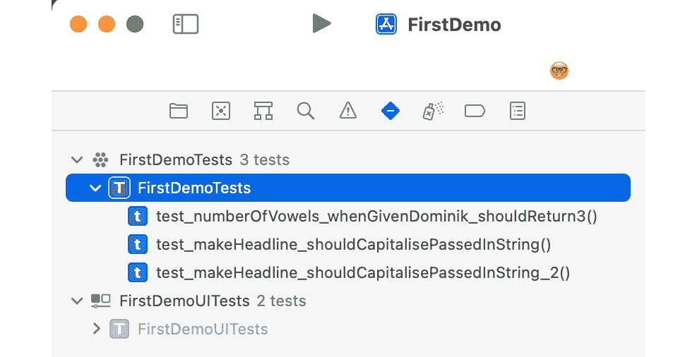
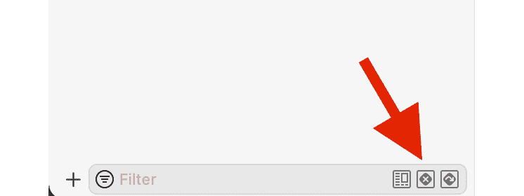
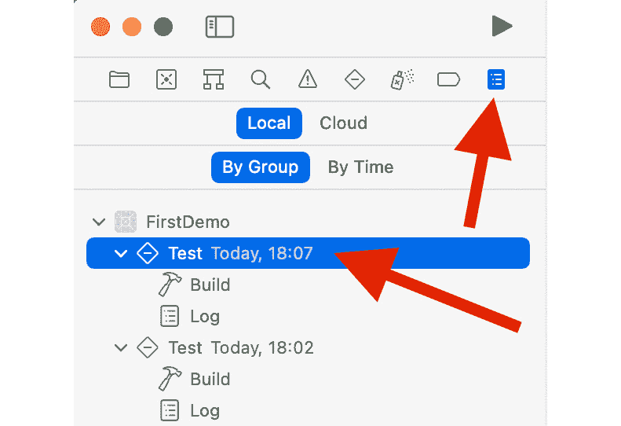
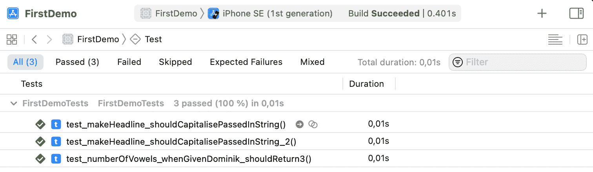
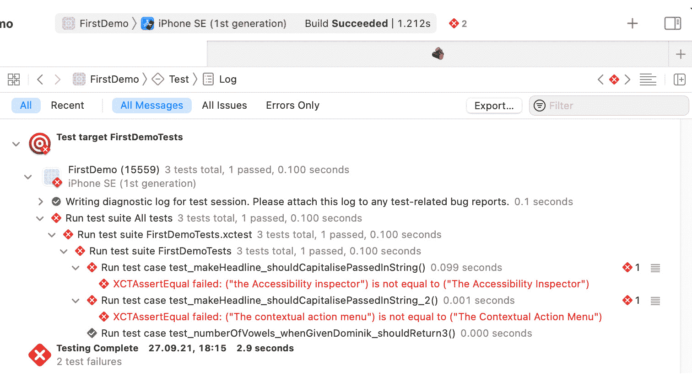
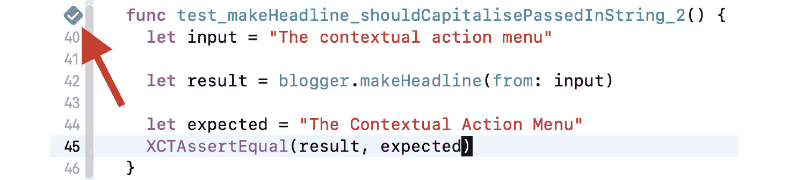
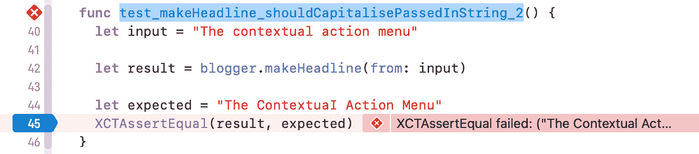
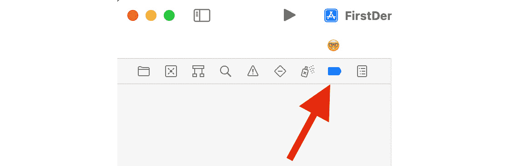
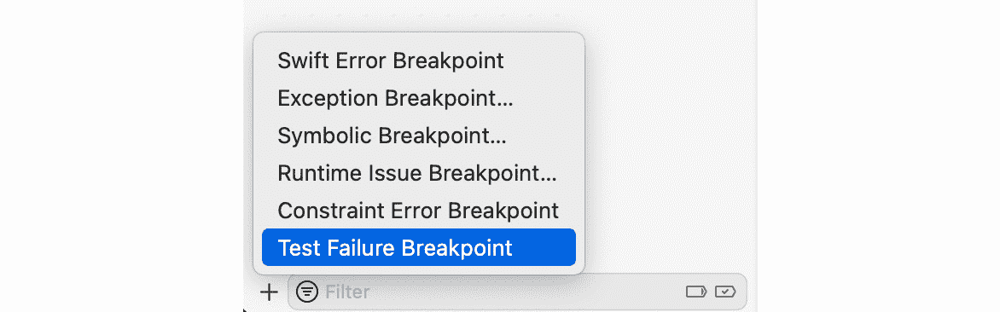

# 第三章：*第三章*：Xcode 中的测试驱动开发

对于**测试驱动开发**（**TDD**），我们需要一种编写和执行单元测试的方法。我们可以将测试写入 Xcode 项目的目标中，但这不太实际。我们必须以某种方式将测试代码与生产代码分开，并且我们需要编写一些脚本，这些脚本将执行测试代码并收集关于测试结果的反馈。

幸运的是，这一切都已经完成了。这一切始于 1998 年，当时瑞士公司 Sen:te 开发了 OCUnit，这是一个 Objective-C（因此有 OC 前缀）的测试框架。OCUnit 是 SUnit 的移植，SUnit 是 Kent Beck 在 1994 年为 Smalltalk 编写的测试框架。

在 Xcode 2.1 中，苹果公司将 OCUnit 添加到 Xcode 中。这一步骤的一个原因是他们在开发 Tiger 操作系统的同时开发了 Core Data，Core Data 就是与 Tiger 一起发布的。苹果工程师 Bill Bumgarner 在后来的博客文章中写道：

“Core Data 1.0 并不完美，但它是一个坚如磐石的产品，我为之感到无比自豪。所达到的质量和性能没有使用单元测试是无法实现的。此外，我们能够在开发周期的后期对代码库进行高度破坏性的操作。最终结果是性能大幅提升，代码库更加整洁，发布更加稳定。”

苹果意识到，在变化的环境中开发复杂系统时，单元测试是多么有价值。他们希望第三方开发者也能从单元测试中受益。在版本 2.1 之前，OCUnit 可以通过手动方式添加到 Xcode 中。但通过将其包含在**集成开发环境**（**IDE**）中，开始单元测试所需的时间投资大大减少，因此，更多的人开始编写测试。

在 2008 年，OCUnit 被集成到 iPhone SDK 2.2 中，以允许对 iPhone 应用程序进行单元测试。

最后，在 2013 年，随着 XCTest 的引入，单元测试在 Xcode 5 中成为了一等公民。通过 XCTest，苹果在 Xcode 中添加了特定的用户界面元素，这些元素有助于测试，允许运行特定的测试，快速找到失败的测试，并查看所有测试的概览。我们将在本章后面讨论 Xcode 中的测试用户界面。但首先，我们将看看使用 Xcode 进行 TDD 的实际操作。本章为我们开始使用 TDD 构建第一个应用程序奠定了基础。

这些是我们将在本章中涵盖的主要部分：

+   TDD 的一个示例

+   在 Xcode 中查找有关测试的信息

+   运行测试

+   设置和拆除

+   调试测试

# 技术要求

本章中所有的代码都已上传（完整形式）在此：

[`github.com/PacktPublishing/Test-Driven-iOS-Development-with-Swift-Fourth-Edition/tree/main/chapter03`](https://github.com/PacktPublishing/Test-Driven-iOS-Development-with-Swift-Fourth-Edition/tree/main/chapter03)

# TDD 的一个示例

对于这个 TDD 示例，我们将使用我们在*第一章*，*你的第一个单元测试*中创建的相同项目。在 Xcode 中打开 FirstDemo 项目，通过按*⌘**U*运行测试。我们编写的用于探索自定义断言功能的测试失败了。我们不再需要这个测试。删除它。

假设我们正在为博客平台构建一个应用程序。当编写新帖子时，用户会为帖子输入一个标题。标题中的所有单词都应该以大写字母开头。

要开始 TDD 工作流程，我们需要一个失败的测试。在编写测试时需要考虑以下问题：

+   **前提条件**：在我们调用方法之前，系统的状态是什么？

+   **调用**：方法签名应该如何？方法（如果有）的输入参数是什么？

+   **断言**：方法调用的预期结果是什么？

对于我们的博客应用示例，以下是一些可能的答案：

+   **前提条件**：无。

+   `makeHeadline`。

+   **断言**：结果字符串应该相同，但所有单词都应该以大写字母开头。

这就足够我们开始了。进入红色步骤。

## 标题首字母大写 – 红色

以下步骤将我们带到 TDD 旅程的第一个红色状态：

1.  打开`FirstDemoTests.swift`，并将以下代码添加到`FirstDemoTests`类中：

    ```swift
    // FirstDemoTests.swift
    func 
     test_makeHeadline_shouldCapitalisePassedInString() {
      let blogger = Blogger()
    }
    ```

这还不是完整的测试方法，因为我们实际上并没有测试任何东西。但我们必须在这个地方停止编写测试，因为编译器抱怨我们没有添加`Blogger`。

按照 TDD 工作流程，我们需要添加代码，直到编译器停止打印错误。记住，在测试中**代码无法编译**意味着“测试失败。”一个失败的测试意味着我们需要编写代码，直到测试不再失败。

1.  将 Swift 文件`Blogger.swift`添加到主目标中，并包含以下代码：

    ```swift
    // Blogger.swift
    import Foundation
    struct Blogger { 
    }
    ```

Xcode 将测试中的错误替换为警告，指出我们没有使用`blogger`变量。这是真的。所以让我们使用它。

1.  更改测试代码，使其看起来像这样：

    ```swift
    // FirstDemoTests.swift
    func
     test_makeHeadline_shouldCapitalisePassedInString() {
      let blogger = Blogger()
      let headline = blogger.makeHeadline(from: "the
        Accessibility inspector")
    }
    ```

测试仍然没有完成。但又一次，我们不得不停下来，因为编译器在抱怨，这次的信息是**类型'Blogger'没有成员'makeHeadline'**。所以，即使只有这几行代码，你也能看到测试是如何“驱动”开发的。一步一步地，我们向测试和生产代码中添加代码来实现我们试图构建的功能。

1.  由于测试目前失败（无法编译），我们需要切换回`Blogger`结构体并添加一些更多的代码：

    ```swift
    // Blogger.swift
    struct Blogger {
      func makeHeadline(from input: String) -> String {
        return ""
      }
    }
    ```

再次，这改变了测试代码中的错误，变成了警告，指出我们没有使用标题变量。这是真的。但我们还没有完成测试。

1.  我们将使用变量`next`。向测试方法添加以下断言：

    ```swift
    // FirstDemoTests.swift
    func 
     test_makeHeadline_shouldCapitalisePassedInString() {
      let blogger = Blogger()
      let headline = blogger.makeHeadline(from: "the 
        Accessibility inspector")
      XCTAssertEqual(headline, "The Accessibility 
        Inspector")
    }
    ```

这使得测试可以编译。使用键盘快捷键*⌘**U*运行测试。

我们刚刚添加的测试编译并失败。我们可以继续到 TDD 工作流程中的绿色阶段。

## 大写标题 – 绿色

测试失败是因为从`makeHeadline(from:)`返回的字符串只是一个空字符串。但该方法应该返回输入字符串`The Accessibility inspector`的大写版本。

按照 TDD 工作流程，我们需要回到实现部分并添加最简单的代码，使测试通过。在`Blogger.swift`中，修改`makeHeadline(from:)`的代码，使其看起来像这样：

```swift
func makeHeadline(from input: String) -> String {
  return "The Accessibility Inspector"
}
```

这段代码很愚蠢且错误，但它是最简单的使测试通过的代码。运行测试（*⌘* *U*）以确保这是实际情况。

尽管我们刚刚编写的代码对我们尝试实现的功能没有用处，但它对我们这些开发者来说仍然有价值。它告诉我们我们需要另一个测试。

## 大写标题 – 重构

在编写更多测试之前，我们需要重构现有的测试。在生产代码中，没有什么可以重构的。这段代码既简单又优雅。

但测试可以改进。目前，测试的相关信息有点无结构。这不是大问题，但也许我们可以通过以下步骤提高测试的可读性：

1.  将`test_makeHeadline_shouldCapitalisePassedInString()`测试方法替换为以下代码：

    ```swift
    func 
     test_makeHeadline_shouldCapitalisePassedInString() {
      let blogger = Blogger()
      let input = "the Accessibility inspector"
      let result = blogger.makeHeadline(from: input)
      let expected = "The Accessibility Inspector"
      XCTAssertEqual(result, expected)
    }
    ```

通过在测试中使用变量，我们使其更容易理解。变量的名称向测试的读者说明了这些值的用途。一个值是输入，一个是结果，另一个是预期值。

运行测试。所有测试都应该仍然通过。但我们如何知道测试是否仍然测试与之前相同的内容？在大多数情况下，我们在重构测试时所做的更改不需要再次测试。但是，有时（例如在这种情况下），确保测试仍然有效是很好的。这意味着我们需要另一个失败的测试。

1.  前往`makeHeadline(from:)`并更改返回的字符串如下：

    ```swift
    func makeHeadline(from input: String) -> String {
      return "The Accessibility"
    }
    ```

我们已经从返回的字符串中移除了最后一个单词。再次运行测试以确保测试现在失败。

1.  现在将返回的字符串改回`The Accessibility Inspector`以再次使测试通过。通过运行测试来确认所有测试再次通过。

通过故意使测试失败并在下一步修复它，我们已经证明测试可以失败。这很重要，因为编写总是通过测试的测试很容易发生。例如，如果你忘记添加`assert`函数，或者由于测试中的某些条件，`assert`函数从未被触及，测试总是报告为绿色。

注意

总是确认测试可以失败！

我们已经知道实现是不正确的。`makeHeadline(from:)` 方法总是返回相同的字符串，并忽略了传递给方法中的字符串。但我们所有的测试都通过了。当所有测试都通过，但我们知道我们还没有完成这个功能，这意味着我们需要另一个测试。在 TDD 中，我们总是从一个失败的测试开始。

## 大写标题 2 – 红色

我们编写的用于使之前的测试通过的生产代码仅适用于一个特定的标题。但我们想要实现的功能必须适用于所有可能的标题。将以下测试添加到 `FirstDemoTests.swift` 中：

```swift
// FirstDemoTests.swift
func test_makeHeadline_shouldCapitalisePassedInString_2() {
  let blogger = Blogger()
  let input = "The contextual action menu"

  let result = blogger.makeHeadline(from: input) 
  let expected = "The Contextual Action Menu"
  XCTAssertEqual(result, expected)
}
```

运行测试。这个新测试显然失败了。现在，休息一下。去散步或者准备一些饮料。说真的，离开电脑半小时左右。

让我们使测试通过。

## 大写标题 2 – 绿色

打开 `Blogger.swift`，将 `makeHeadline(from:)` 的实现替换为以下代码：

```swift
// Blogger.swift
func makeHeadline(from input: String) -> String {
  let words = input.components(separatedBy: " ")
  var headline = ""
  for var word in words {
    let firstCharacter = word.remove(at: word.startIndex)
    headline +=
      "\(String(firstCharacter).uppercased())\(word) "
  }
  headline.remove(at: headline.index(before:
    headline.endIndex))
  return headline
}
```

对于这个实现感到震惊是可以的。通过这段代码，我试图说明，在 TDD 的绿色步骤中，只要代码能让测试通过，任何代码都是好的。我们将在下一节中改进这段代码。

让我们一步一步地通过这个实现：

1.  将字符串拆分为单词。

1.  遍历单词，删除第一个字符并将其转换为大写。将更改后的字符添加到单词的开头。将带有尾随空格的此单词添加到标题字符串中。

1.  删除最后一个空格并返回字符串。

运行测试。所有测试都通过了。在 TDD 的工作流程中，接下来要执行的是重构。

小贴士

不要跳过重构。这一步与红色和绿色步骤一样重要。直到没有可以重构的内容，你才算完成。

## 大写标题 2 – 重构

让我们从测试开始重构：

1.  两个 `makeHeadline` 测试都以创建 `Blogger` 的实例开始。这是代码重复，是重构的好候选。

在 `FirstDemoTests` 类的开头添加以下属性：

```swift
// FirstDemoTests.swift
var blogger: Blogger!
```

1.  记住，`setUp()` 方法在每次测试执行之前被调用。因此，它是初始化 `blogger` 属性的完美位置：

    ```swift
    // FirstDemoTests.swift
    override func setUpWithError() throws {
      blogger = Blogger()
    }
    ```

1.  每个测试运行后都应该清理。因此，将以下代码添加到 `tearDownWithError()` 中：

    ```swift
    // FirstDemoTests.swift
    override func tearDownWithError() throws {
      blogger = nil
    }
    ```

1.  现在我们可以从标题测试中删除 `let blogger = Blogger()` 行。运行测试以确保它们仍然可以编译和运行。

1.  现在我们需要重构实现代码。我们目前拥有的实现看起来像是从 Objective-C 转换到 Swift（如果你还没有使用过 Objective-C，你必须相信我）。但是 Swift 是不同的，并且有许多概念使得可以编写更少的代码，这些代码更容易阅读。让我们使实现更加敏捷。将 `makeHeadline(from:)` 替换为以下代码：

    ```swift
    // Blogger.swift
    func makeHeadline(from input: String) -> String {
      return input.capitalized
    }
    ```

这有多酷？Swift 甚至在 `String` 类中提供了一个方法来做这件事。再次运行测试以确保我们没有在重构中破坏任何东西。所有测试都应该仍然通过。

## 回顾

在本节中，我们使用 TDD 工作流程向我们的项目添加了一个功能。我们从失败的测试开始。我们使测试通过。最后，我们对代码进行了重构以使其更简洁。您在这里看到的步骤似乎非常简单且微不足道，以至于您可能认为可以跳过一些测试而仍然做得很好。但那样就不再是 TDD 了。TDD 的美妙之处在于步骤非常简单，以至于您不必去思考。您只需记住下一步是什么。

因为步骤和规则如此简单，您不必浪费脑力去思考这些步骤的实际含义。您唯一需要记住的是红色、绿色和重构。因此，您可以专注于困难的部分：*编写测试*、*使测试通过*和*改进代码*。

现在我们知道了如何编写测试，让我们看看在 Xcode 中我们可以在哪里找到有关我们的测试的信息。

# 在 Xcode 中查找测试信息

在 Xcode 5 和 XCTest 的引入之后，单元测试被紧密集成到 Xcode 中。Apple 添加了许多 UI 元素来导航到测试、运行特定测试和查找有关失败的测试的信息。多年来，他们进一步改进了集成。这里的一个关键元素是**测试导航器**。

## 测试导航器

要打开测试导航器，点击导航面板中的带减号的菱形按钮或使用快捷键 *⌘* *6*：



图 3.1 – Xcode 中的测试导航器

测试导航器显示了打开的项目或工作区中的所有测试。在上面的屏幕截图中，您可以看到我们的演示项目的测试导航器。在该项目中，有两个测试目标，一个用于单元测试，一个用于 UI 测试。对于复杂的应用程序，拥有多个单元测试目标可能很有用，但这超出了本书的范围。测试的数量显示在测试目标的名称后面。在我们的例子中，单元测试目标中有三个测试。

在导航器的底部有一个过滤器控件，您可以使用它来过滤显示的测试。一旦您开始输入，显示的测试就会使用模糊匹配进行过滤。控件中有一个显示带交叉的菱形的按钮：



图 3.2 – 测试导航器中仅显示失败测试的按钮

如果选择此按钮，列表中仅显示失败的测试。通过右侧的按钮，您可以过滤所有跳过的测试。

## 测试概览

Xcode 还有一个测试概览，其中所有测试的结果都收集在一个地方。要打开它，在导航面板中选择**报告导航器**，然后选择列表中的最后一个测试：



图 3.3 – 在报告导航器中访问测试概览

如果你想要比较不同的测试运行，你还可以在列表中选择其他测试。在右侧的编辑器中，显示了所选测试运行中所有测试的概览：



图 3.4 – 上次测试运行中的测试概览

当你用鼠标指针悬停在某个测试上时，会出现一个带有向右箭头的圆圈。如果你点击箭头，Xcode 将在编辑器中打开测试。

在报告导航器中，还有一个**日志**项。它以树状结构显示所有测试。以下是一个示例：



图 3.5 – 测试报告日志

日志显示了测试用例（在这个例子中，一个测试用例）以及测试用例内的测试（在这个例子中，两个失败的和一个通过的测试）。此外，你还可以看到每个测试用例甚至每个测试需要执行的时间。

在 TDD 中，测试执行得快是很重要的。你希望能够在不到一秒的时间内执行整个测试套件。否则，整个工作流程将受测试执行的影响，测试可能会分散你的注意力和专注力。你不应该被诱惑切换到另一个应用程序（如 Safari），因为测试可能需要半分钟。

如果你注意到测试套件运行时间过长，不切实际，请打开日志并搜索那些减慢测试速度的测试，并尝试使测试更快。

现在我们已经看到了在哪里可以找到关于我们的测试的信息，在下一节中，我们将探讨运行测试的不同方法。

# 运行测试

Xcode 提供了许多不同的执行测试的方法。你已经看到了执行测试套件中所有测试的两种方法：转到**项目** | **测试**菜单项或使用 *⌘**U* 键盘快捷键。

## 运行一个特定的测试

在 TDD 中，你通常希望尽可能频繁地运行所有测试。运行测试可以让你有信心，代码在编写测试时确实做了你想要的事情。此外，你希望在新的代码破坏看似无关的功能时立即获得反馈（即，失败的测试）。立即反馈意味着你对破坏功能的更改的记忆是新鲜的，修复也是迅速进行的。

然而，有时你可能需要运行一个特定的测试，但不要让它成为一种习惯。要运行一个特定的测试，你可以点击在测试方法旁边可见的菱形：



图 3.6 – 通过点击侧边栏中测试方法的菱形来运行一个特定的测试

当您点击它时，生产代码将在模拟器或设备上编译并启动，并执行测试。

另一种执行特定测试的方法是。当您打开测试导航器并将鼠标悬停在某个测试上时，测试方法名旁边会显示一个带有播放图标的圆形：

![Figure 3.7 – 点击测试导航器中测试旁边的菱形以运行此测试]

![Figure 3.07_B18127.jpg]

![Figure 3.7 – 点击测试导航器中测试旁边的菱形以运行此测试]

再次，如果您点击此测试，它将单独运行。

测试框架通过方法名的前缀来识别测试。如果您想运行所有测试但排除一个，请从该测试方法名的开头移除 `test` 前缀。

## 在测试用例中运行所有测试

与运行特定测试相同，您也可以运行特定测试用例的所有测试。点击测试用例定义旁边的菱形，或者当您在测试导航器中将鼠标悬停在测试用例名称上时出现的播放按钮。

## 运行一组测试

您可以通过编辑构建方案来选择运行一组测试。要编辑构建方案，请点击 Xcode 工具栏中的方案，然后点击 **编辑方案...**：

![Figure 3.08 – 打开方案编辑器]

![Figure 3.08_B18127.jpg]

图 3.8 – 打开方案编辑器

然后，选择 **测试**，通过点击小三角形来展开测试套件。在右侧，有一个名为 **测试** 的列：

![Figure 3.09 – 方案编辑器中的测试设置]

![Figure 3.09_B18127.jpg]

![Figure 3.09 – 方案编辑器中的测试设置]

选择的方案仅运行已勾选的测试。默认情况下，所有测试都是勾选的，但您可以根据需要取消勾选某些测试。但别忘了在完成时再次勾选所有测试。

作为替代方案，您可以添加一个构建方案，用于运行一组您想要定期运行而无需运行所有测试的测试。

但如前所述，您应该尽可能经常运行完整的测试套件。

下一个部分将展示如何在每次测试调用前后添加代码。

# 设置和清理

我们在本章前面已经看到了 `setUpWithError()` 和 `tearDownWithError()` 实例方法。`setUpWithError()` 实例方法中的代码在每个测试调用之前运行。在我们的示例中，我们使用 `setUpWithError()` 来初始化我们想要测试的 `Blogger`。由于它在每个测试调用之前运行，每个测试都使用其自己的 `Blogger` 实例。我们对这个特定实例所做的更改不会影响其他测试。测试是相互独立执行的。

`tearDownWithError()` 实例方法在每个测试调用之后运行。使用 `tearDownWithError()` 来执行必要的清理工作。在示例中，我们在 `tearDownWithError()` 方法中将 `blogger` 设置为 `nil`。

除了实例方法之外，还有`setUp()`和`tearDown()`类方法。这些方法分别在测试用例的所有测试之前和之后运行。

# 调试测试

有时，但并不经常，你可能需要调试你的测试。与正常代码一样，你可以在测试代码中设置断点。然后，调试器会在该断点处停止代码执行。你还可以在将被测试的代码中设置断点，以检查你是否遗漏了某些内容，或者你想要测试的代码是否实际上被执行了。

为了了解这是如何工作的，让我们在先前的示例中向测试添加一个错误并对其进行调试：

1.  打开 `FirstDemoTests.swift` 并将测试方法 `test_makeHeadline_shouldCapitalisePassedInString_2()` 替换为以下代码：

    ```swift
    // FirstDemoTests.swift
    func 
     test_makeHeadline_shouldCapitalisePassedInString_2()
     { 
      let input = "The contextual action menu"  
      let result = blogger.makeHeadline(from: input)
      let expected = "The ContextuaI Action Menu"
      XCTAssertEqual(result, expected)
    }
    ```

你看到我们引入的错误了吗？期望字符串的值中有一个拼写错误。`Contextual`中的最后一个字符是大写“i”，而不是小写“l”。运行测试。测试失败，Xcode 会告诉你问题所在。

1.  但为了这个练习，让我们在`XCTAssertEqual()`函数所在的行设置一个断点。单击你想要设置断点的行的左侧区域。你必须单击红色菱形旁边的区域。结果，你的编辑器将看起来类似于以下：



图 3.10 – 在断言所在的行添加断点

1.  再次运行测试。测试执行在断点处停止。如果调试控制台尚未打开，请打开它（转到`(lldb)`并出现闪烁的光标。输入`po expected`并按*Enter*。`po`是“打印对象”命令。正如其名所示，它会打印对象的表示：

    ```swift
    (lldb) po expected
    "The ContextuaI Action Menu"
    ```

1.  现在打印结果值：

    ```swift
    (lldb) po result
    "The Contextual Action Menu"
    ```

因此，借助调试器，你可以找出发生了什么。

正如我们所见，当我们运行测试时，调试器会附加到正在运行的应用程序上。这意味着当运行测试时，生产代码中的断点也会被触发。

小贴士

要了解更多关于调试器的信息，请在 Apple 文档中搜索`lldb`。

目前，请将`expected`字符串常量中的拼写错误保留原样，但通过用鼠标将其从编辑器左侧的区域拖动来删除断点。

## 在测试失败时中断的断点

Xcode 内置了一个断点，当测试失败时触发。当设置此断点时，测试执行将停止，并且每当测试失败时，都会启动一个调试会话。

通常，这并不是你想要的，因为在 TDD 中，失败的测试是正常的，你不需要调试器来找出发生了什么。你明确地在 TDD 工作流程周期的开始处编写了测试以失败。

但如果你需要调试一个或多个失败的测试，了解如何激活此断点是有好处的。打开断点导航器：



图 3.11 – 断点导航器

在导航视图的底部有一个带有加号（+）的按钮。点击它，然后选择**测试失败断点**：



图 3.12 – 选择测试失败断点

正如其名所示，此断点在测试失败时停止测试的执行。在我们的例子中，我们仍然有一个失败的测试。运行测试以查看断点的作用。

调试器在断言所在的行停止，因为测试失败。就像前面的例子一样，你可以得到一个调试会话，以便你可以输入 `LLDB` 命令来找出测试失败的原因。

再次移除断点，因为在执行 TDD 时它不太实用。在 TDD 中，我们总是有失败的测试。测试失败断点会过多地干扰 TDD 流程。

## 测试再次功能

现在，让我们修复测试中的错误，并学习如何再次运行前面的测试。打开 `FirstDemoTests.swift` 并通过点击测试方法旁边的菱形符号来仅运行失败的测试。测试仍然失败。通过将 `ContextuaI` 中的最后一个字符在 `expected` 字符串常量中更改为 "l" 来修复它。然后，转到**产品** | **执行操作** | **再次测试 "test_makeHeadline_shouldCapitalisePassedInString_2()"**，或使用快捷键 *⌃⌥⌘**G* 再次运行前面的测试。快捷键在处理特定功能时特别有用，当你需要测试实现是否足够时。

# 摘要

在本章中，我们探讨了在 Xcode 中单元测试和 TDD 的工作方式。我们看到了真实的测试在测试真实的代码。通过使用 Xcode 的不同测试相关功能，我们学习了如何编写、运行和修复测试，以及如何找到与测试相关的信息。所有这些对于本书的其余部分都很重要。我们需要知道如何在执行 TDD 时使用 Xcode。

在下一章中，我们将通过测试驱动开发来确定我们将要构建的应用程序。

# 练习

1.  编写一个测试方法，该方法反转一个字符串。编写使测试通过的代码。

1.  编写一个测试方法，该方法接受一个标题并从中创建一个文件名。在文件名中，确保空格被替换为 `_`，并且它只包含小写字母。
