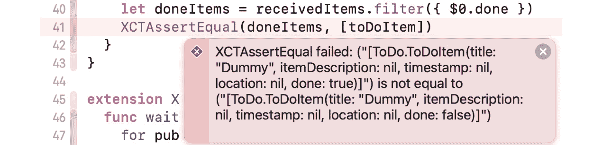
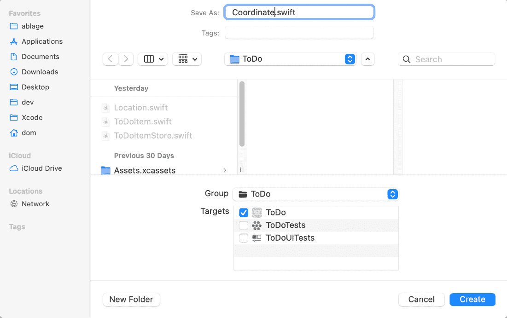

# 第六章：*第六章*：测试、加载数据和保存数据

目前，我们有结构来存储单个待办事项的信息。一个可用的待办事项应用必须显示和管理多个待办事项。此外，当用户关闭应用并再次打开时，他们期望待办事项仍然存在。

这意味着我们的应用需要能够存储和加载待办事项列表信息的结构。

在本章中，我们将添加一个类，用于将待办事项列表存储到 iOS 设备的文件系统中，并从中加载。我们将使用 JSON 格式，因为它在 iOS 开发中是一个常见的选择。它有一个很好的好处，那就是它既易于人类阅读，也易于计算机读取。

本章的结构如下：

+   使用 Combine 发布更改

+   检查项目

+   存储 `ToDoItem` 和加载

# 技术要求

本章的源代码在此处可用：[`github.com/PacktPublishing/Test-Driven-iOS-Development-with-Swift-Fourth-Edition/tree/main/chapter06`](https://github.com/PacktPublishing/Test-Driven-iOS-Development-with-Swift-Fourth-Edition/tree/main/chapter06).

# 使用 Combine 发布更改

在今天的 iOS 应用中，不同部分之间的通信通常使用苹果的 **Combine** 框架来实现。在 Combine 中，数据更改被发布并可以被订阅。这种设计模式有助于解耦代码并使其更容易维护。

我们将在 `ToDoItemStore` 中使用 Combine 来通知，例如，表格视图控制器有变化，用户界面应该使用新数据更新。

打开项目导航器并选择 `ToDoItemStoreTests`。导入 `ToDo` 模块 (`@testable import ToDo`) 并移除两个测试方法模板。

## 测试异步 Combine 代码

到目前为止，我们测试的所有代码都是同步代码。在 Combine 中发布值是异步的。为了能够测试 Combine 代码，我们需要一种方法来暂停测试并等待我们想要测试的代码执行。`XCTest` 提供了 `XCTestExpectation` 来完成这项任务。让我们看看它是如何工作的：

1.  将以下代码添加到 `ToDoItemStoreTests` 中：

    ```swift
    // ToDoItemStoreTests.swift
    func test_add_shouldPublishChange() {
      let sut = ToDoItemStore()
    }
    ```

`toDoItemStore`，但使用 `sut` 使其更容易阅读，并且它还允许我们在适当的时候将测试代码复制粘贴到其他测试中。

1.  测试尚未完成，但它已经失败了，因为 Xcode 在作用域中找不到 `ToDoItemStore`。再次打开项目导航器并选择 `ToDoItemStore.swift`。将以下类定义添加到 `ToDoItemStore.swift` 中：

    ```swift
    // ToDoItemStore.swift
    class ToDoItemStore {
    }
    ```

这足以使测试代码可编译。

1.  运行测试以确保它们全部通过，然后我们可以继续编写测试。将以下代码添加到 `test_add_shouldPublishChange()` 中：

    ```swift
    // ToDoItemStoreTests.swift
    func test_add_shouldPublishChange() {
      let sut = ToDoItemStore()
      let publisherExpectation = expectation(
        description: "Wait for publisher in \(#file)"
      )
      var receivedItems: [ToDoItem] = []
      let token = sut.itemPublisher
    }
    ```

首先，我们创建一个`ToDoItemStore`实例。接下来，我们需要一个期望来等待我们的 Combine 代码的异步执行。通过`description`，我们告知未来的自己为什么需要这个期望。为了确定`publisher`是否按预期工作，我们需要在测试中订阅它并检查发布值。我们将值存储在`receivedItems`变量中。

最后一行是订阅发布者的开始，但我们必须暂停，因为 Xcode 抱怨说**类型`ToDoItemStore`没有成员`itemPublisher`**。这意味着我们需要在主目标中编写一些代码，以便再次使测试可编译。

1.  首先，我们需要导入 Combine 框架。然后，我们可以添加发布者，如下所示：

    ```swift
    // ToDoItemStore.swift
    import Foundation
    import Combine

    class ToDoItemStore {
      var itemPublisher =
        CurrentValueSubject<[ToDoItem], Never>([])
    }
    ```

如果你还没有使用 Combine 或泛型，这个语法可能看起来有点奇怪。`<[ToDoItem], Never>`中的`[ToDoItem]`表示发布者发送`ToDoItems`数组。第二部分`Never`是此发布者的失败类型。`Never`表示此发布者不能失败。总之，`CurrentValueSubject<[ToDoItem], Never>([])`创建了一个发送`ToDoItems`数组的`CurrentValueSubject`发布者实例，这些数组永远不会失败。

这修复了静态分析器报告的错误。我们可以切换回测试代码。

1.  在现有导入语句下方导入 Combine，并更改`test_add_shouldPublishChange()`中的代码，使其看起来像这样：

    ```swift
    // ToDoItemStoreTests.swift
    import Combine
    // ...
    func test_add_shouldPublishChange() {
      let sut = ToDoItemStore()
      let publisherExpectation = expectation(
        description: "Wait for publisher in \(#file)"
      )
      var receivedItems: [ToDoItem] = []
      let token = sut.itemPublisher
        .dropFirst()
        .sink { items in
          receivedItems = items
          publisherExpectation.fulfill()
        }
      let toDoItem = ToDoItem(title: "Dummy")
      sut.add(toDoItem)
    }
    ```

这无法编译。但在我们切换回生产代码之前，让我们看看我们在这里添加了什么：

+   首先，我们使用`dropFirst()`从`itemPublisher`中丢弃第一个发布的值。我们这样做是因为`CurrentValueSubject`发布者在我们订阅它时立即发布第一个当前值。但在测试中，我们只想断言更改已被发布。

+   接下来，我们使用`sink(receiveValue:)`订阅发布者。发布的值传递到`receivedValue`参数中。你无法在代码中看到参数名称，因为我们正在使用尾随闭包语法，这在 iOS 开发中很常见。我们将接收到的值存储到`receivedItems`变量中。在这个时候，我们在测试中等待的异步代码已经完成。我们通过在期望上调用`fulfill()`来告诉测试运行器我们不再需要等待。

+   这段代码的最后两行是我们想要测试的方法的执行。我们假设`ToDoItemStore`有一个`add(_:)`方法，允许我们将待办事项添加到项目存储中。由于我们还没有编写这个方法，Xcode 在抱怨，我们必须切换回生产代码。按照下一步进行。

1.  将以下代码添加到`ToDoItemStore`中：

    ```swift
    // ToDoItemStore.swift
    func add(_ item: ToDoItem) {
    }
    ```

这使得测试再次可编译。

1.  切换回测试代码，并在以下代码中添加最后三行到`test_add_shouldPublishChange()`：

    ```swift
    // ToDoItemStoreTests.swift
    func test_add_shouldPublishChange() {
      // ... arrange ...
      let toDoItem = ToDoItem(title: "Dummy")
      sut.add(toDoItem)
      wait(for: [publisherExpectation], timeout: 1)
      token.cancel()
      XCTAssertEqual(receivedItems.first?.title,
        toDoItem.title)
    }
    ```

使用 `wait(for:timeout:)`，我们告诉测试运行器在此处等待，直到 `first` 参数中的所有期望都得到满足。如果超时后所有期望都没有得到满足，测试将失败。接下来，我们取消发布者的订阅。如果我们省略了这一行，编译器可能会删除订阅，因为它看起来在代码的任何地方都没有被使用。在最后一行，我们比较接收到的值与我们期望的值。

最后，我们可以运行测试。正如预期的那样，我们刚刚添加的测试失败了，因为发布者还没有发布任何内容。

我们希望使用这样的断言：`XCTAssertEqual(receivedItems, [toDoItem])`。但目前还不行，因为 `ToDoItem` 没有遵守 `Equatable` 协议，这告诉编译器如何处理两个实例之间的相等性。我们很快就会解决这个问题。但首先，我们需要让测试再次通过绿色。

1.  修改 `ToDoItemStore` 中的代码，使其看起来像这样：

    ```swift
    // ToDoItemStore.swift
    class ToDoItemStore {
      var itemPublisher =
        CurrentValueSubject<[ToDoItem], Never>([])
      private var items: [ToDoItem] = [] {
        didSet {
          itemPublisher.send(items)
        }
      }

      func add(_ item: ToDoItem) {
        items.append(item)
      }
    }
    ```

使用这段代码，我们在项目存储中添加了一个 `private` 属性来保存待办事项。每当这个属性发生变化（例如，当添加新项目时），它就会使用项目发布者进行发布。因此，在 `add(_:)` 方法中，我们只需要将项目追加到项目列表中。

1.  运行测试。所有测试通过。

现在让我们解决 `ToDoItem` 不具有相等性的问题。

## 使 ToDoItem 具有相等性

使 `ToDoItem` 具有相等性的步骤是一个重构步骤。到目前为止，代码在没有 `ToDoItem` 具有相等性的情况下也能工作。但如果我们可以直接在 `ToDoItems` 数组上使用 `XCTAssertEqual`，测试的可读性将大大提高。以下步骤展示了如何做到这一点：

1.  首先，将 `Equatable` 协议添加到 `ToDoItem` 声明中，如下所示：

    ```swift
    // ToDoItem.swift
    struct ToDoItem: Equatable {
      // ...
    }
    ```

1.  接下来，对 `Location` 结构体做同样的处理：

    ```swift
    // Location.swift
    struct Location: Equatable {
      // …
    }
    ```

1.  接下来，将以下方法添加到 `Location` 结构体中：

    ```swift
    // Location.swift
    static func == (lhs: Location, rhs: Location) -> Bool {
      if lhs.name != rhs.name {
        return false
      }
      if lhs.coordinate == nil, rhs.coordinate != nil {
        return false
      }
      if lhs.coordinate != nil, rhs.coordinate == nil {
        return false
      }
      if let lhsCoordinate = lhs.coordinate,
          let rhsCoordinate = rhs.coordinate {
        if abs(lhsCoordinate.longitude -
          rhsCoordinate.longitude) > 0.000_000_1 {
          return false
        }
        if abs(lhsCoordinate.latitude -
          rhsCoordinate.latitude) > 0.000_000_1 {
          return false
        }
      }
      return true
    }
    ```

如果 Swift 无法自动添加 `Equatable` 兼容性（例如，因为其中一个属性本身不是 `Equatable`），我们需要添加 `== (lhs:rhs:)` 类方法。这个方法看起来有点复杂，但这只是因为 `coordinate` 属性是可选的。因此，我们还需要考虑一个坐标为 nil 而另一个不为 nil 的情况。

1.  现在，回到 `test_add_shouldPublishChange()` 并将最后的断言调用替换为以下内容：

    ```swift
    // ToDoItemStoreTests.swift
    XCTAssertEqual(receivedItems, [toDoItem])
    ```

运行测试。所有测试通过。现在的断言看起来好多了，我们确实断言了我们期望测试的结果。但是测试仍然难以阅读。所有那些 Combine 代码都分散了测试的主要目标。

让我们在测试用例中添加一个辅助函数来改进测试代码：

1.  我们将要添加的辅助函数受到了一篇博客文章的启发（[`www.swiftbysundell.com/articles/unit-testing-combine-based-swift-code/`](https://www.swiftbysundell.com/articles/unit-testing-combine-based-swift-code/)）由 *John Sundell* 编写。在 `ToDoItemStoreTests.swift` 文件的末尾添加以下代码，但不要在 `ToDoItemStoreTests` 类内部：

    ```swift
    // ToDoItemStoreTests.swift
    extension XCTestCase {
      func wait<T: Publisher>(
        for publisher: T,
        afterChange change: () -> Void) throws
      -> T.Output where T.Failure == Never { 
        let publisherExpectation = expectation(
          description: "Wait for publisher in \(#file)"
        )
        var result: T.Output?
        let token = publisher
          .dropFirst()
          .sink { value in
            result = value
            publisherExpectation.fulfill()
          }

        change()
        wait(for: [publisherExpectation], timeout: 1)
        token.cancel() 
        let unwrappedResult = try XCTUnwrap(
          result,
          "Publisher did not publish any value"
        ) 
        return unwrappedResult
      }
    }
    ```

这段代码与我们之前在 `test_add_shouldPublishChange()` 中编写的代码类似。它经过一些修改，以便作为 `XCTestCase` 的扩展工作。

1.  现在，我们可以用以下代码替换测试代码：

    ```swift
    // ToDoItemStoreTests.swift
    func test_add_shouldPublishChange() throws {
      let sut = ToDoItemStore()
      let toDoItem = ToDoItem(title: "Dummy")
      let receivedItems = try wait(for: sut.itemPublisher)
     {
        sut.add(toDoItem)
      }
      XCTAssertEqual(receivedItems, [toDoItem])
    }
    ```

这个更改使得测试易于理解。再次运行测试。所有测试仍然通过。

注意

我们刚刚添加到 `XCTestCase` 的 `wait` 方法可以抛出错误。因此，我们不得不在方法的调用中添加 `try` 关键字。我们可以将调用包裹在 `do-catch` 块中，但有一个更好的方法。当我们将测试方法本身标记为 `throws` 时，测试调用期间抛出的错误会被测试运行器注册为测试失败。这再次使得测试更容易阅读和理解。在本书的整个过程中，我们将始终使用 `XCTest` 的这个功能，而不是在测试方法中编写 `do-catch` 块。

1.  但我们如何知道我们没有破坏测试？让我们确保测试仍然可以失败。转到 `ToDoItemStore` 并从 `add(_:)` 中删除 `items.append(item)` 行。运行测试以确保我们更改的测试现在失败。

1.  但现在有些奇怪。测试失败显示为灰色而不是红色。原因是失败出现在我们添加到 `XCTestCase` 的 `wait` 函数中。为了使测试失败在函数的调用位置被报告，我们需要将函数更改为以下形式（这里只显示相关行）：

    ```swift
    // ToDoItemStoreTests.swift
    extension XCTestCase {
      func wait<T: Publisher>(
        for publisher: T,
        afterChange change: () -> Void,
        file: StaticString = #file,
        line: Uint = #line) throws
      -> T.Output where T.Failure == Never {

        // …
        let unwrappedResult = try XCTUnwrap(
          result,
          "Publisher did not publish any value",
          file: file,
          line: line
        ) 
        return unwrappedResult
      }
    }
    ```

函数现在有两个额外的参数，`file` 和 `line`。它们分别设置为默认值 `#file` 和 `#line`。然后，这些参数被用于调用 `XCTUnwrap`。当 `XCTUnwrap` 现在失败时，Xcode 使用 `file` 和 `line` 参数来确定这个函数被调用的位置，并在调用位置报告失败。再次运行测试以查看差异。

1.  然后，通过添加你删除的行，再次使测试通过。

在下一节中，我们将实现一个待办事项应用的基本功能：*勾选项目*。

# 勾选项目

在待办事项应用中，用户需要能够将待办事项标记为已完成。这是待办事项应用的一个重要功能，因为人们使用此类应用的部分原因是在标记待办事项为已完成时获得的满足感。

因此，我们的应用也需要这个功能。由于构建此应用的过程是由测试驱动的，我们首先为这个功能编写一个新的测试。但在我们可以添加这个功能的测试之前，我们需要考虑如何在测试中断言这个功能是否工作。这意味着我们需要一种方法来获取所有已经完成的待办事项。区分已完成和尚未完成的待办事项的最简单方法是在待办事项本身中添加一个属性。这样，我们可以根据该属性的值过滤所有待办事项。

有了这个计划，我们可以开始编写测试：

1.  将以下方法添加到 `ToDoItemStoreTests.swift`：

    ```swift
    // ToDoItemStoreTests.swift
    func test_check_shouldPublishChangeInDoneItems()
     throws {
      let sut = ToDoItemStore()
      let toDoItem = ToDoItem(title: "Dummy")
      sut.add(toDoItem)
      sut.add(ToDoItem(title: "Dummy 2"))
      let receivedItems = try wait(for: sut.itemPublisher) {
        sut.check(toDoItem)
      }
    }
    ```

在这个测试的前四行中，我们使用两个待办事项设置`ToDoItemStore`。接下来，我们等待发布者并尝试检查待办事项。Xcode 告诉我们`check(_:)`方法缺失。由于测试代码现在无法编译，我们需要切换到生产代码并添加`check(_:)`方法。

1.  前往`ToDoItemStore.swift`并添加以下方法：

    ```swift
    // ToDoItemStore.swift
    func check(_ item: ToDoItem) {  
    }
    ```

1.  运行测试以使测试代码意识到这个变化。测试失败，因为我们调用`check(_:)`方法时，发布者没有发布任何内容。将`check`方法的代码更改为以下：

    ```swift
    // ToDoItemStore.swift
    func check(_ item: ToDoItem) {
      items.append(ToDoItem(title: ""))
    }
    ```

等一下！这个`check`方法不应该这样做。是的，你说得对。这只是使测试在这个阶段通过的最简单代码。在 TDD 中，你应该总是编写使测试通过的最简单代码。如果你知道代码是错误的，你需要添加更多测试，直到功能真正工作。

1.  运行测试以确认所有测试都通过。打开`ToDoItemStore.swift`并更改`test_check_shouldPublishChangeInDoneItems()`中的代码，使其看起来像这样：

    ```swift
    // ToDoItemStoreTests.swift
    func test_check_shouldPublishChangeInDoneItems()
     throws {
      let sut = ToDoItemStore()
      let toDoItem = ToDoItem(title: "Dummy")
      sut.add(toDoItem)
      sut.add(ToDoItem(title: "Dummy 2"))
      let receivedItems = try wait(for: sut.itemPublisher)
     {
        sut.check(toDoItem)
     }
      let doneItems = receivedItems.filter({ $0.done })
      XCTAssertEqual(doneItems, [toDoItem])
    }
    ```

在结束括号前的最后两行是新的。在这两行中，我们首先过滤所有完成的待办事项，然后断言结果是一个只包含我们检查的待办事项的数组。

1.  Xcode 的静态分析器告诉我们`ToDoItem`类型没有名为`done`的属性。打开`ToDoItem.swift`并添加此属性：

    ```swift
    // ToDoItem.swift
    struct ToDoItem: Equatable {
      let title: String
      let itemDescription: String?
      let timestamp: TimeInterval?
      let location: Location?
      var done = false

      init(title: String,
           itemDescription: String? = nil,
           timestamp: TimeInterval? = nil,
           location: Location? = nil) {

        self.title = title
        self.itemDescription = itemDescription
        self.timestamp = timestamp
        self.location = location
      }
    }
    ```

现在，代码可以编译了。运行测试。`test_check_shouldPublishChangeInDoneItems()`测试失败，因为过滤后的项目数组为空。这是预期的，因为我们在`check(_:)`中添加的代码没有检查任何项目。它只是添加了一个带有空标题的新项目。

1.  返回`ToDoItemStore.swift`。我们需要将数组中的待办事项替换为我们更改了`done`属性为`true`的那个。将`check`方法替换为以下代码：

    ```swift
    // ToDoItemStore.swift
    func check(_ item: ToDoItem) {
      var mutableItem = item
      mutableItem.done = true
      if let index = items.firstIndex(of: item) {
        items[index] = mutableItem
      }
    }
    ```

首先，我们获取项目的可变副本。然后，我们将`done`改为`true`，最后，我们将更改后的项目替换到项目数组中。

尽管这应该使测试通过，但它仍然失败了。点击失败信息旁边的红色菱形以展开它。仔细阅读信息。测试失败是因为两个数组不相同。结果数组中的待办事项在`done`属性中有一个不同的值。



图 6.1 – 扩展的失败信息告诉我们项目不同

这是有意义的。通过添加`done`属性，我们改变了 Swift 确定两个待办事项是否相同的方式。这不是我们想要的。待办事项应该有一个身份。

1.  让我们添加一个属性，为待办事项提供身份。打开`ToDoItem.swift`并将`ToDoItem`结构替换为以下代码：

    ```swift
    // ToDoItem.swift
    struct ToDoItem: Equatable {
      let id: UUID
      let title: String
      let itemDescription: String?
      let timestamp: TimeInterval?
      let location: Location?
      var done = false
      init(title: String,
           itemDescription: String? = nil,
           timestamp: TimeInterval? = nil,
           location: Location? = nil) {
        self.id = UUID()
        self.title = title
        self.itemDescription = itemDescription
        self.timestamp = timestamp
        self.location = location
      }
      static func == (lhs: ToDoItem, rhs: ToDoItem) ->
     Bool {
        return lhs.id == rhs.id
      }
    }
    ```

使用这段代码，我们添加了一个在创建项目时设置的 ID。此外，我们使用这个 `id` 属性来确定两个待办事项是否相同。

1.  运行测试。所有测试都通过。

1.  在我们继续之前，我们必须稍微清理一下测试。在测试的每一行的第一行，我们创建了一个系统测试（`sut`）。这段代码应该放入 `setUpWithError()` 中。首先，将以下属性添加到 `ToDoItemStoreTests`：

    ```swift
    // ToDoItemStoreTests.swift
    var sut: ToDoItemStore!
    ```

1.  接下来，将 `setUpWithError()` 和 `tearDownWithError()` 更改为以下内容：

    ```swift
    // ToDoItemStoreTests.swift
    override func setUpWithError() throws {
      sut = ToDoItemStore()
    }
    override func tearDownWithError() throws {
      sut = nil
    }
    ```

1.  现在，我们可以从每个测试中删除以下代码行：

    ```swift
    let sut = ToDoItemStore()
    ```

这使得测试更容易理解。

现在我们可以使用我们的 `ToDoItemStore` 添加和检查待办事项。但到目前为止，待办事项只会在应用程序运行期间保留在内存中。`ToDoItemStore` 需要将待办事项存储在某个地方，并在应用程序再次启动时立即将它们加载到内存中。在下一节中，我们将实现这一点。

# 存储和加载待办事项

要测试存储和加载待办事项，我们首先需要创建 `ToDoItemStore` 类的实例，添加一个待办事项，销毁该存储实例，然后创建一个新的实例。当我们第一次实例中添加待办事项时，所有项目都应存储在文件系统中。当创建第二个实例时，存储的项目应再次从文件系统中加载。这意味着当我们创建第二个实例后找到我们第一次实例中添加的项目时，存储和加载是有效的。

## 实现存储和加载

测试控制自身所需的环境是至关重要的。这意味着对于存储和加载待办事项，测试需要控制项目存储的位置。例如，如果我们使用 Core Data 来持久化待办事项，测试将负责设置一个仅用于测试的假 Core Data 存储。在我们的应用程序中，我们将待办事项存储在 JSON 文件中。因此，测试需要控制 JSON 文件存储的位置。让我们看看如何做到这一点：

1.  将以下测试方法代码添加到 `ToDoItemStore`：

    ```swift
    // ToDoItemStoreTests.swift
    func test_init_shouldLoadPreviousToDoItems() {
      var sut1: ToDoItemStore? = 
        ToDoItemStore(fileName: "dummy_store")
    }
    ```

在这个测试中，我们不使用 `setUpWithError()` 中创建的实例，因为我们需要传递要使用的存储的名称。Xcode 抱怨我们向一个不接受任何参数的调用传递了一个参数。这意味着我们必须暂停编写测试代码，并切换到生产代码。

1.  将以下初始化器添加到 `ToDoItemStore`：

    ```swift
    // ToDoItemStore.swift
    init(fileName: String = "todoitems") {
    }
    ```

这足以让测试再次编译。这个初始化器允许将 JSON 文件的文件名传递给 `ToDoItemStore`。`fileName` 参数有一个默认值，因为在生产代码中，`ToDoItemStore` 类应该控制文件存储的位置。

1.  现在我们可以编写测试代码的其余部分：

    ```swift
    // ToDoItemStoreTests.swift
    func test_init_shouldLoadPreviousToDoItems() {
      var sut1: ToDoItemStore? =
        ToDoItemStore(fileName: "dummy_store")
      let publisherExpectation = expectation(
        description: "Wait for publisher in \(#file)"
      )

      let toDoItem = ToDoItem(title: "Dummy Title")
      sut1?.add(toDoItem)
      sut1 = nil
      let sut2 = ToDoItemStore(fileName: "dummy_store")
      var result: [ToDoItem]?
      let token = sut2.itemPublisher
        .sink { value in
          result = value
          publisherExpectation.fulfill()
        }

      wait(for: [publisherExpectation], timeout: 1)
      token.cancel()
      XCTAssertEqual(result, [toDoItem])
    }
    ```

这段代码看起来有点令人畏惧，但它只包含我们已经覆盖过的概念。让我们一步一步地过一下这段代码：

1.  我们创建了一个 `ToDoItemStore` 的实例和一个测试期望。

1.  接下来，我们将一个项目添加到待办事项存储中，并通过将其设置为 nil 来销毁存储。

1.  然后，我们创建一个新的待办事项存储库并订阅其`itemPublisher`。但这次，我们不会丢弃发布者中的第一个发布值。因为发布者是一个`CurrentValueSubject`结构，订阅者一旦订阅发布者就会立即接收到当前值。

1.  最后，我们等待 Combine 代码的异步执行，并断言发布的物品数组包含我们添加到初始待办事项存储库中的物品。

运行测试。这个测试失败了，因为我们还没有实现存储和加载。让我们实现代码。

1.  我们需要在属性中存储文件名，并在存储和加载项目时访问它。添加以下属性并更改初始化器以设置该属性：

    ```swift
    // ToDoItemStore.swift
    private let fileName: String
    init(fileName: String = "todoitems") {
      self.fileName = fileName
    }
    ```

1.  下一步是将`ToDoItem`转换为 JSON 格式。如果类型的所有属性都可以转换为 JSON，Swift 可以为我们完成这个任务。我们作为开发者需要做的只是将`Codable`协议添加到类型中。更改`ToDoItem`的声明，使其看起来像这样：

    ```swift
    // ToDoItem.swift
    struct ToDoItem: Equatable, Codable {
    ```

1.  Xcode 抱怨 `Location` 属性还没有遵循 `Codable`。将 `Location` 的声明更改为以下内容：

    ```swift
    // Location.swift
    struct Location: Equatable, Codable {
    ```

现在 Xcode 告诉我们`Location`不遵循`Codable`。哦，糟糕！`CLLocationCoordinate2D`也不遵循`Codable`。我们可以自己实现这个遵循，但有一个更简单的方法。我们创建一个`Coordinate`结构，它具有相同的功能，但却是`Codable`的。使用*⌘**N*快捷键创建一个新的 Swift 文件，并将其命名为`Coordinate`。将**组**设置为**ToDo**，并确保它被添加到**ToDo**目标中。



图 6.2 – 为坐标结构创建文件

1.  将以下代码添加到新文件中：

    ```swift
    // Coordinate.swift
    struct Coordinate: Codable {
      let latitude: Double
      let longitude: Double
    }
    ```

由于 Double 是可编码的，只包含 Double 属性的架构也是可编码的。

1.  现在，我们可以用我们新的 Coordinate 类型替换 Location 中的 CLLocationCoordinate2D 类型：

    ```swift
    // Location.swift
    struct Location: Equatable, Codable {
      let name: String
      let coordinate: Coordinate?

      init(name: String,
           coordinate: Coordinate? = nil) {

        self.name = name
        self.coordinate = coordinate
      }
      // …
    }
    ```

通过这个更改，我们不再依赖于 Core Location，可以将其导入从`Location.swift`中移除。

我们已经更改了一些代码。我们如何确保我们之前实现的所有内容仍然有效？通过我们的测试！为了做到这一点，我们首先必须禁用当前失败的测试，因为存储和加载待办事项的不完整实现。我们知道这个测试仍然会失败，因为我们还没有完成实现。我们只想运行我们在开始实现存储和加载之前是绿色的测试。让我们开始吧：

1.  前往`ToDoItemStoreTests`并在测试的开头添加`XCTSkipIf(_:_:)`的调用。注意，你还需要将`throws`关键字添加到测试签名中：

    ```swift
    // ToDoItemStoreTests.swift
    func test_init_shouldLoadPreviousToDoItems() throws {
        try XCTSkipIf(true, "Just test Coordinate change")
        // …
    }
    ```

通过这个调用，我们告诉测试运行器它应该跳过这个测试。当我们完成坐标类型的更改后，我们只需移除这一行代码即可再次激活测试。

1.  运行测试以确定坐标更改是否成功或是否遗漏了某些内容。`test_init_setsCoordinate()`测试无法编译，因为我们更改了坐标类型。将`CLLocationCoordinate2D`类型替换为`Coordinate`并删除对`CoreLocation`的导入：

    ```swift
    // LocationTests.swift
    func test_init_setsCoordinate() throws {
      let coordinate = Coordinate(latitude: 1,
        longitude: 2)
      let location = Location(name: "",
        coordinate: coordinate)
      let resultCoordinate = try
     XCTUnwrap(location.coordinate)
      XCTAssertEqual(resultCoordinate.latitude, 1,
        accuracy: 0.000_001)
      XCTAssertEqual(resultCoordinate.longitude, 2,
        accuracy: 0.000_001)
    }
    ```

1.  再次运行测试。现在所有测试都通过了。

这太棒了！我们第一次使用单元测试使重构变得更容易。我们不必检查每个文件以查看是否使用了坐标属性以及是否需要适配类型。我们只需运行测试。现在想象一下我们正在处理一个有数十万行代码的代码库。一个好的测试套件可以让你在重构代码时充满信心。

返回到`ToDoItemStoreTests`并删除`XCTSkipIf(_:_:)`调用。运行测试以确认`test_init_shouldLoadPreviousToDoItems()`仍然失败。

现在，由于`ToDoItem`符合`Codable`协议，我们可以在 JSON 结构中存储待办事项列表：

1.  将以下方法添加到`ToDoItemStore`中：

    ```swift
    // ToDoItemStore.swift
    private func saveItems() {
      if let url = FileManager.default
          .urls(for: .documentDirectory,
                   in: .userDomainMask)
          .first?
          .appendingPathComponent(fileName) {
        do {
          let data = try JSONEncoder().encode(items)
          try data.write(to: url)
        } catch {
          print("error: \(error)")
        }
      }
    }
    ```

首先，我们获取一个文件 URL 来存储 JSON 文件。接下来，我们从待办事项中获取一个`Data`对象并将其写入文件 URL。由于将数据转换为 JSON 和写入文件 URL 可能会抛出错误，我们将这些调用嵌入到`do-catch`块中。

1.  每当待办事项列表中的任何内容发生变化时，都需要保存项目。修改`add(_:)`方法，使其看起来像这样：

    ```swift
    // ToDoItemStore.swift
    func add(_ item: ToDoItem) {
      items.append(item)
      saveItems()
    }
    ```

1.  当我们向存储中添加新项目时，我们将列表保存到文件系统中。我们还需要一个加载待办事项的方法。将以下方法添加到`ToDoItemStore`中：

    ```swift
    // ToDoItemStore.swift
    private func loadItems() {
      if let url = FileManager.default
          .urls(for: .documentDirectory,
                   in: .userDomainMask)
          .first?
          .appendingPathComponent(fileName) {
        do {
          let data = try Data(contentsOf: url)
          items = try JSONDecoder()
            .decode([ToDoItem].self, from: data)
        } catch {
          print("error: \(error)")
        }
      }
    }
    ```

这种方法与`saveItems`方法相反。一开始我们得到相同的文件 URL。然后，我们从文件系统中加载数据，并将其从 JSON 格式转换为待办事项列表。

1.  我们在`ToDoItemStore`的初始化器中调用此方法：

    ```swift
    // ToDoItemStore.swift
    init(fileName: String = "todoitems") {
      self.fileName = fileName
      loadItems()
    }
    ```

这应该会使我们的测试通过。运行测试以确认。

根据您的配置，您的测试可能确实是绿色的。但很可能是`ToDoItemStoreTests`中的某些测试会失败。在存储和加载待办事项时，测试现在依赖于之前运行的测试。这是不好的，应该避免。当测试依赖于它们执行的顺序时，测试套件是不可靠的。测试可能在某些计算机或某些环境中失败。我们需要修复这个问题：

1.  首先，所有测试都应该使用一个虚拟的 JSON 文件。因此，将`ToDoItemStoreTests`中的设置代码替换为以下内容：

    ```swift
    // ToDoItemStoreTests.swift
    override func setUpWithError() throws {
      sut = ToDoItemStore(fileName: "dummy_store")
    }
    ```

1.  其次，我们必须在每次测试执行后删除 JSON 文件：

    ```swift
    // ToDoItemStoreTests.swift
    override func tearDownWithError() throws {
      sut = nil
      if let url = FileManager.default
          .urls(for: .documentDirectory,
                   in: .userDomainMask)
          .first?
          .appendingPathComponent("dummy_store") {
        try? FileManager.default.removeItem(at: url)
      }
    }
    ```

我知道你在想什么。我们第三次使用了代码来获取 JSON 文件的文件 URL。我们应该清理一下。不用担心，我们将在下一步做这件事。

两次运行所有测试。在第二次运行中，所有测试都应该是绿色的。

## 清理代码

在软件开发中，我们应该遵循 DRY 原则。**DRY** 代表 **不要重复自己**。通过复制两次创建 JSON 文件 URL 的代码，我们违反了这一原则。让我们使这段代码可重用。

选择 `FileManagerExtension.swift` 并确保它已添加到我们项目的目标中。

按照以下步骤删除重复的代码：

1.  将此扩展添加到 `FileManagerExtension.swift`:

    ```swift
    // FileManagerExtension.swift
    extension FileManager {
      func documentsURL(name: String) -> URL {
        guard let documentsURL = urls(for:
          .documentDirectory,
        in: .userDomainMask).first else {
          fatalError()
        }
        return documentsURL.appendingPathComponent(name)
      }
    }
    ```

1.  打开 `ToDoItemStore.swift` 并将 `saveItems()` 替换为以下实现：

    ```swift
    // ToDoItemStore.swift
    private func saveItems() {
      let url = FileManager.default
        .documentsURL(name: fileName)
      do {
        let data = try JSONEncoder().encode(items)
        try data.write(to: url)
      } catch {
        print("error: \(error)")
      }
    }
    ```

    注意

    通常，你不会直接在这里使用 `FileManager` 单例。在实际代码中，你更愿意通过依赖注入将这种存储类型传递给 `ToDoItemStore`。我们采取上述方法是为了使本书尽可能简短，并且不分散本节主题的注意力。

1.  接下来，将 `loadItems()` 替换为以下代码：

    ```swift
    // ToDoItemStore.swift
    private func loadItems() {
      let url = FileManager.default
        .documentsURL(name: fileName)
      do {
        let data = try Data(contentsOf: url)
        items = try JSONDecoder()
          .decode([ToDoItem].self, from: data)
      } catch {
        print("error: \(error)")
      }
    }
    ```

1.  最后，将 `ToDoItemStoreTests.swift` 中的 `tearDownWithError()` 替换为以下代码：

    ```swift
    // ToDoItemStoreTests.swift
    override func tearDownWithError() throws {
      sut = nil  
      let url = FileManager.default
        .documentsURL(name: "dummy_store")
      try? FileManager.default.removeItem(at: url)
    }
    ```

运行所有测试以确保它们仍然通过。

1.  我们还没有完成。还缺少一个测试。当用户将待办事项标记为完成时，项目列表也应该写入文件系统。为了确保这一点，请将以下测试添加到 `ToDoItemStoreTests.swift`:

    ```swift
    func test_init_whenItemIsChecked_
     shouldLoadPreviousToDoItems() throws {
      var sut1: ToDoItemStore? =
      ToDoItemStore(fileName: "dummy_store")
      let publisherExpectation = expectation(
        description: "Wait for publisher in \(#file)"
      )

      let toDoItem = ToDoItem(title: "Dummy Title")
      sut1?.add(toDoItem)
      sut1?.check(toDoItem)
      sut1 = nil
      let sut2 = ToDoItemStore(fileName: "dummy_store")
      var result: [ToDoItem]?
      let token = sut2.itemPublisher
        .sink { value in
          result = value
          publisherExpectation.fulfill()
        }

      wait(for: [publisherExpectation], timeout: 1)
      token.cancel()
      XCTAssertEqual(result?.first?.done, true)
    }
    ```

这个测试看起来有点像 `test_init_shouldLoadPreviousToDoItems()`。但在这里，我们在销毁待办事项存储之前检查 `toDoItem`。此外，我们在最后断言加载的待办事项已被标记为完成。

1.  为了使这个测试通过，在 `check(_:)` 方法的 `if let` 条件中添加对 `saveItems()` 的调用：

    ```swift
    func check(_ item: ToDoItem) {
      var mutableItem = item
      mutableItem.done = true
      if let index = items.firstIndex(of: item) {
        items[index] = mutableItem
        saveItems()
      }
    }
    ```

在继续之前，请确保所有测试都通过。

# 摘要

在本章中，我们探讨了如何测试 Combine 代码。为了使测试更容易理解，我们引入了一个辅助方法并改进了其错误信息。我们弄清楚了如何创建一个 `Equatable` 类型以及这如何有助于单元测试。最后，我们学习了如何测试将 JSON 文件存储到和从 iOS 设备的文件系统中读取。

使用这些技能，你应该能够为各种不同的模型场景编写测试。

在下一章中，我们将开始构建用户界面。我们将从待办事项列表开始。

# 练习

1.  从测试 Combine 代码的测试中移除期望，并检查它们是否失败。

1.  考虑一下需要做什么来检查存储的文件是否确实为 JSON 格式。你认为这样的测试有任何用处吗？
