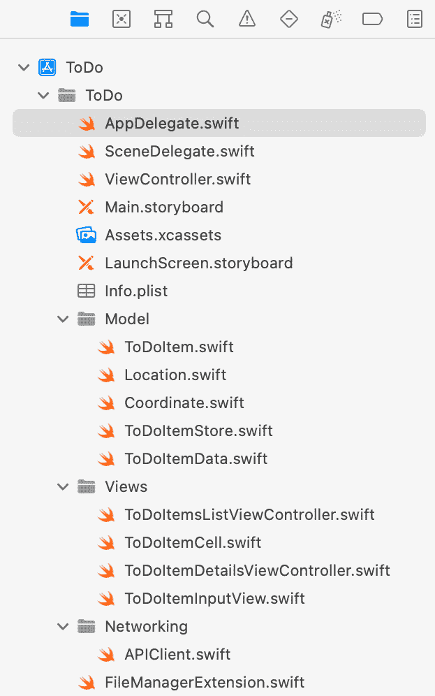

# 第十章：*第十章*：测试网络代码

几乎所有 iOS 应用程序都需要与某种服务器通信，以同步数据到其他设备或提供 iOS 设备本身无法实现的附加功能。由于服务器应用程序的代码与 iOS 应用程序的代码是分开的，因此 iOS 应用程序的单元测试不应测试服务器应用程序中实现的功能。iOS 应用程序的单元测试仅在 iOS 应用程序的代码有错误时才应失败。

为了实现这一点，单元测试需要独立于服务器应用程序。这种分离有几个优点。主要如下：

+   当单元测试不需要等待服务器的响应时，它们运行得更快。

+   单元测试不会因为服务器不可用而失败。

+   即使服务器应用程序尚未可用，也可以使用测试驱动开发来开发网络代码。

在本章中，我们将使用测试驱动开发和模拟对象实现两种不同类型的网络代码。在您完成本章后，您将能够为与`CLGeoCoder`通信的代码编写测试。您还将学习如何使用`URLSession`的新异步/等待 API 编写网络代码的测试。

本章的结构如下：

+   模拟`CLGeoCoder`

+   测试与`URLSession`实例通信的异步/等待代码

+   处理错误

编写网络代码的测试非常有趣，让我们开始吧。

# 模拟`CLGeoCoder`

`CLGeoCoder`是 Apple 提供的一个类，它可以帮助您从地址字符串获取坐标，反之亦然。`CLGeoCoder`中的方法基于完成闭包。在本章中，我们将探讨如何模拟和测试此类方法。

## 清理项目

在我们为本章编写第一个测试之前，让我们稍微清理一下项目。在项目导航器中添加部分，并根据您的结构方案将文件移动到这些部分。为了获得灵感，以下是我在主要目标中使用的结构：



图 10.1 – 在项目导航器中添加结构

您的结构可以完全不同。使用您在 iOS 项目中通常使用的结构。此外，将类似的结构添加到测试目标中的文件。

当您向项目中添加新文件时，您必须根据您应用的结构选择正确的文件夹。

## 测试准备

在我们为在*第九章*中添加的`APIClient`类编写测试之前，即*SwiftUI 中的测试驱动输入视图*，我们需要一个新的测试用例类。按照以下步骤添加它：

1.  将新的`APIClientTests`添加到测试目标中。删除两个测试模板方法。

1.  使用`@testable`关键字导入`ToDo`模块，并将设置和清理代码添加到`TestCase`类中：

    ```swift
    // APIClientTests.swift
    import XCTest
    @testable import ToDo

    class APIClientTests: XCTestCase {

      var sut: APIClient!

      override func setUpWithError() throws {
        sut = APIClient()
      }

      override func tearDownWithError() throws {
        sut = nil
      }
    }
    ```

## 创建第一个测试

准备就绪后，我们可以开始编写 `APIClient` 类的第一个测试。按照以下步骤添加一个用于使用 `CLGeoCoder` 实例获取地址坐标的测试，并使其通过：

1.  为了能够在 `APIClient` 类中将 `CLGeoCoder` 替换为模拟对象，我们需要在协议中定义我们期望的接口。将 `CoreLocation` 框架导入到 `APIClient.swift` 中，并在 `APIClient` 类实现之外添加以下协议定义到 `APIClient.swift`：

    ```swift
    // APIClient.swift
    protocol GeoCoderProtocol {
      func geocodeAddressString(
        _ addressString: String,
        completionHandler:
        @escaping CLGeocodeCompletionHandler)
    }
    ```

1.  接下来，我们需要告诉编译器 `CLGeoCoder` 已经符合该协议。它是这样做的，因为它已经实现了一个具有这个确切签名的方 法。在 `GeoCoderProtocol` 实现下方添加此行：

    ```swift
    // APIClient.swift
    extension CLGeocoder: GeoCoderProtocol {}
    ```

1.  现在，我们可以定义一个在测试中使用的模拟对象。向测试目标添加一个新的 Swift 文件，并将其命名为 `GeoCoderProtocolMock.swift`。用以下内容替换其内容：

    ```swift
    // GeoCoderProtocolMock.swift
    import Foundation
    @testable import ToDo
    import CoreLocation

    class GeoCoderProtocolMock: GeoCoderProtocol { 
      var geocodeAddressString: String?
      var completionHandler: CLGeocodeCompletionHandler?

      func geocodeAddressString(
        _ addressString: String,
        completionHandler:
        @escaping CLGeocodeCompletionHandler) { 
          geocodeAddressString = addressString
          self.completionHandler = completionHandler
      }
    }
    ```

1.  在测试中，我们想要调用 `geocodeAddressString(_:completionHandler:)` 方法，并将 `CLPlacemark` 实例传递到完成处理程序中。为了在测试中创建 `CLPlacemark` 实例，我们需要导入 `Intents` 和 `Contacts` 框架，因为所需的初始化器在 `Intents` 框架中定义，并使用来自 `Contacts` 框架的类（我从 StackOverflow 的答案中得到了这个提示，该答案可在 https://stackoverflow.com/a/52932708/498796/498796 找到）：

    ```swift
    // APIClientTests.swift
    import Intents
    import Contacts
    ```

1.  现在，我们可以开始编写测试。将以下测试片段添加到 `APIClientTests` 中：

    ```swift
    // APIClientTests.swift
    func test_coordinate_fetchesCoordinate() {
      let geoCoderMock = GeoCoderProtocolMock()
      sut.geoCoder = geoCoderMock
    }
    ```

Xcode 告诉我们，我们需要为 `geoCoder` 属性在 `APIClient` 中添加一个属性。

1.  前往 `APIClient` 类，并添加以下属性：

    ```swift
    // APIClient.swift
    lazy var geoCoder: GeoCoderProtocol
      = CLGeocoder()
    ```

`lazy` 关键字意味着初始化器是在属性第一次被访问时调用的。

1.  返回到测试，使其看起来像这样：

    ```swift
    // APIClientTests.swift
    func test_coordinate_fetchesCoordinate() {
      let geoCoderMock = GeoCoderProtocolMock()
      sut.geoCoder = geoCoderMock
      let location = CLLocation(latitude: 1,
        longitude: 2)
      let placemark = CLPlacemark(location: location,
        name: nil,
        postalAddress: nil)
      let expectedAddress = "dummy address"
      var result: Coordinate?
      sut.coordinate(for: expectedAddress) { coordinate in
        result = coordinate
      }
      geoCoderMock.completionHandler?([placemark], nil)
      XCTAssertEqual(geoCoderMock.geocodeAddressString,
        expectedAddress)
      XCTAssertEqual(result?.latitude,
        location.coordinate.latitude)
      XCTAssertEqual(result?.longitude,
        location.coordinate.longitude)
    }
    ```

在我们设置了 `geoCoderMock` 实例之后，我们创建虚拟变量并调用我们想要测试的方法。`GeoCoderProtocolMock` 类捕获了 `geocodeAddressString(_:completionHandler:)` 调用的完成处理程序。这允许我们使用我们创建的地点标记来调用这个完成处理程序。在测试断言中，我们检查方法是否使用我们提供的地址字符串被调用，以及坐标是否传递到了 `coordinate(for:completion:)` 方法的 `completion` 闭包中。

1.  将 `APIClient` 中的 `coordinate(for:completion:)` 方法的实现替换为以下实现：

    ```swift
    // APIClient.swift
    func coordinate(
      for address: String,
      completion: (Coordinate?) -> Void) {
        geoCoder.geocodeAddressString(
          address) { placemarks, error in
          }
    }
    ```

注意，我们为地址字符串参数添加了一个内部名称。

运行测试。新的测试仍然失败，但第一个断言不再失败。这告诉我们我们的测试做得太多。我们应该将这个测试拆分为两个测试：一个检查方法是否使用我们提供的地址字符串被调用，另一个检查坐标是否传递到了完成闭包中。

1.  我们应该始终只有一个失败的测试，所以将 `x_` 添加到 `test_coordinate_fetchesCoordinate` 方法的名称前：

    ```swift
    // APIClientTests.swift
    func x_test_coordinate_fetchesCoordinate() {
      // …
    ```

由于测试运行器正在搜索以单词 `test` 开头的方法，添加 `x_` 可以隐藏方法从测试运行器。为了确认这一点，再次运行所有测试。

1.  现在，向 `APIClientTests` 添加以下测试方法：

    ```swift
     // APIClientTests.swift
    func test_coordinate_shouldCallGeoCoderWithAddress() {
      let geoCoderMock = GeoCoderProtocolMock()
      sut.geoCoder = geoCoderMock
      let expectedAddress = "dummy address"
      sut.coordinate(for: expectedAddress) { _ in
      }
      XCTAssertEqual(geoCoderMock.geocodeAddressString,
        expectedAddress)
    }
    ```

1.  从 `APIClient` 中的 `coordinate(for:completion:)` 方法中删除我们添加的代码，并运行测试以查看这个新测试失败。

1.  再次添加代码并运行测试。现在所有测试都应该通过。

1.  现在，我们可以从 `test_coordinate_fetchesCoordinate()` 中删除对地址字符串的检查，因为它现在已在 `test_coordinate_shouldCallGeoCoderWithAddress()` 中断言：

    ```swift
    // APIClientTests.swift
    func test_coordinate_fetchesCoordinate() {
      let geoCoderMock = GeoCoderProtocolMock()
      sut.geoCoder = geoCoderMock
      let location = CLLocation(latitude: 1,
        longitude: 2)
      let placemark = CLPlacemark(location: location,
        name: nil,
        postalAddress: nil)
      var result: Coordinate?
      sut.coordinate(for: "") { coordinate in
        result = coordinate
      }
      geoCoderMock.completionHandler?([placemark], nil)
      XCTAssertEqual(result?.latitude,
        location.coordinate.latitude)
      XCTAssertEqual(result?.longitude,
        location.coordinate.longitude)
    }
    ```

运行所有测试以查看这个测试失败。

1.  为了使这个测试通过，我们需要从 `CLGeoCoder` 实例获取坐标并将其传递给完成处理程序。将 `coordinate(for:completion:)` 方法替换为以下实现：

    ```swift
    // APIClient.swift
    func coordinate(
      for address: String,
      completion: @escaping (Coordinate?) -> Void) {
        geoCoder.geocodeAddressString(address) { 
          placemarks, error in
          guard let clCoordinate =
            placemarks?.first?.location?.coordinate
          else {
            completion(nil)
            return
          }
          let coordinate = Coordinate(
            latitude: clCoordinate.latitude,
            longitude: clCoordinate.longitude)
          completion(coordinate)
        }
      }
    ```

现在，Xcode 抱怨 `@escaping` 关键字在 `APIClientProtocol` 协议中的 `completion` 参数。

1.  将 `APIClientProtocol` 定义替换为以下内容：

    ```swift
    // APIClient.swift
    protocol APIClientProtocol {
      func coordinate(
        for: String,
        completion: @escaping (Coordinate?) -> Void)
    }
    ```

1.  运行所有测试以确认现在所有测试都通过。

使用此实现，我们的应用现在可以获取地址字符串的坐标。此功能使用户能够将位置添加到待办事项中。

在下一节中，我们将实现从服务器获取待办事项。我们不需要实际的服务器来编写测试和实现此功能。这是测试驱动开发的优势之一。

# 测试与 URLSession 通信的 async/await 代码

2021 年，苹果在 Swift 中引入了 async/await。有了 async/await，异步代码（例如，从服务器获取信息）更容易编写和理解。在本节中，我们将学习如何使用 `URLSession` 类的 async/await API 实现从网络服务器获取数据；当然，我们将使用测试驱动开发来完成这项工作。

单元测试需要快速且可重复。这意味着我们不想在我们的单元测试中依赖于与真实服务器的连接。相反，我们将用模拟对象替换与服务器的通信。

按照以下步骤实现从服务器获取待办事项：

1.  在测试中，我们将使用 `URLSession` 类的模拟对象而不是真实的 `URLSession` 实例。为了能够用模拟对象替换真实的 `URLSession` 实例，我们需要一个定义我们想要替换的接口的协议。

1.  向 `APIClient.swift` 添加以下协议定义：

    ```swift
    // APIClient.swift
    protocol URLSessionProtocol {
      func data(for request: URLRequest,
        delegate: URLSessionTaskDelegate?)
      async throws -> (Data, URLResponse)
    }
    ```

1.  接下来，我们需要告诉编译器 `URLSession` 类已经符合此协议。将以下代码添加到 `APIClient.swift`：

    ```swift
    // APIClient.swift
    extension URLSession: URLSessionProtocol {}
    ```

1.  选择 `URLSessionProtocolMock`。将其内容替换为以下内容：

    ```swift
    // URLSessionProtoclMock.swift
    import Foundation
    @testable import ToDo

    class URLSessionProtocolMock: URLSessionProtocol { 
      var dataForDelegateReturnValue: (Data, URLResponse)?
      var dataForDelegateRequest: URLRequest?

      func data(for request: URLRequest,
        delegate: URLSessionTaskDelegate?)
      async throws -> (Data, URLResponse) {

        dataForDelegateRequest = request

        guard let dataForDelegateReturnValue =
          dataForDelegateReturnValue else {
            fatalError()
            }
        return dataForDelegateReturnValue
      }
    }
    ```

这个模拟对象允许我们在将要编写的测试中定义 `data(for:delegate:)` 的返回值。

1.  准备就绪后，我们可以开始编写测试。将以下测试方法的片段添加到`APIClientTests`：

    ```swift
    // APIClientTests.swift
    func test_toDoItems_shouldFetcheItems() async throws {
      let url = try XCTUnwrap
        (URL(string: "http://toodoo.app/items"))
      let urlSessionMock = URLSessionProtocolMock()
      let expected = [ToDoItem(title: "dummy title")]
      urlSessionMock.dataForDelegateReturnValue = (
        try JSONEncoder().encode(expected),
        HTTPURLResponse(url: url,
          statusCode: 200,
          httpVersion: "HTTP/1.1",
          headerFields: nil)!
      )
      sut.session = urlSessionMock
    }
    ```

在此代码中，我们定义了 URL 和用于模拟响应的数据。`urlSessionMock`类返回一个包含一个`ToDoItem`对象和一个带有预期 URL 和状态码`200`的`HTTPURLResponse`实例的 JSON 对象。

我们必须暂停编写测试，因为系统测试（`APIClient`类）还没有`session`属性。

1.  前往`APIClient`并添加如下属性：

    ```swift
    // APIClient.swift
    lazy var session: URLSessionProtocol
    = URLSession.shared
    ```

1.  切换回测试类并添加获取待办事项的调用：

    ```swift
    // APIClientTests.swift
    func test_toDoItems_shouldFetcheItems() async throws {
      let url = try XCTUnwrap
        (URL(string: "http://toodoo.app/items"))
      let urlSessionMock = URLSessionProtocolMock()
      let expected = [ToDoItem(title: "dummy title")]
      urlSessionMock.dataForDelegateReturnValue = (
        try JSONEncoder().encode(expected),
        HTTPURLResponse(url: url,
          statusCode: 200,
          httpVersion: "HTTP/1.1",
          headerFields: nil)!
      )
      sut.session = urlSessionMock
      let items = try await sut.toDoItems()
    }
    ```

再次，我们必须暂停，因为这个方法尚未定义。

1.  前往`APIClient`并添加最小实现以使测试编译：

    ```swift
    // APIClient.swift
    func toDoItems() async throws -> [ToDoItem] {
      return []
    }
    ```

1.  最后，我们可以完成测试。添加如代码片段所示的断言调用：

    ```swift
    // APIClientTests.swift
    func test_toDoItems_shouldFetcheItems() async throws {
      let url = try XCTUnwrap
        (URL(string: "http://toodoo.app/items"))
      let urlSessionMock = URLSessionProtocolMock()
      let expected = [ToDoItem(title: "dummy title")]
      urlSessionMock.dataForDelegateReturnValue = (
        try JSONEncoder().encode(expected),
        HTTPURLResponse(url: url,
          statusCode: 200,
          httpVersion: "HTTP/1.1",
          headerFields: nil)!
      )
      sut.session = urlSessionMock
      let items = try await sut.toDoItems()
      XCTAssertEqual(items, expected)
    }
    ```

运行测试以确认这个新测试失败。

1.  为了使测试通过，将`APIClient`类中的`toDoItems`方法替换为以下代码：

    ```swift
    // APIClient.swift
    func toDoItems() async throws -> [ToDoItem] {
      guard let url =
        URL(string: "dummy")
      else {
        return []
      }
      let request = URLRequest(url: url)
      let (data, _) = try await session.data(
        for: request,
          delegate: nil)
      let items = try JSONDecoder()
        .decode([ToDoItem].self, from: data)
      return items
    }
    ```

在此代码中，我们定义了 URL，创建了一个请求，在会话属性上调用`data(for:delegate:)`，并尝试将结果解码为`ToDoItems`数组。

运行测试以确认这段代码使测试通过。

但是，这段代码中有些奇怪。URL 是错误的。我们需要扩展测试以检查使用的 URL。

1.  将以下断言函数调用添加到`test_doToItems_shouldFetchesItems`的末尾：

    ```swift
    // APIClientTests.swift
    XCTAssertEqual(urlSessionMock.dataForDelegateRequest,
      URLRequest(url: url))
    ```

运行测试以确认测试现在失败，因为我们使用了错误的 URL。

1.  为了使测试通过，将`toDoItems`方法中的 URL 初始化替换为以下实现：

    ```swift
    // APIClient.swift
    guard let url =
      URL(string: "http://toodoo.app/items")
    else {
      return []
    }
    ```

运行测试以确认现在所有测试都通过。

当然，这个实现只是一个示例，帮助你开始测试网络调用。在实际应用中，你会在网络调用中添加授权，以确保用户只能访问他们的待办事项，而不能访问其他用户的待办事项。

从网络服务获取数据可能会出错。在以下部分，我们将测试`URLSession`实例的错误是否传递给了`toDoItems`的调用者。

# 错误处理

为了测试对网络服务`URLSession`调用的错误处理，我们首先需要增强`URLSessionProtocolMock`。按照以下步骤测试从`APIClient`实例调用中传递下来的数据获取错误：

1.  将以下属性添加到`URLSessionProtocolMock`：

    ```swift
    // URLSessionProtocolMock.swift
    var dataForDelegateError: Error?
    ```

1.  接下来，将以下错误处理添加到`data(for:delegate:)`的开始部分：

    ```swift
    // URLSessionProtocolMock.swift
    if let error = dataForDelegateError {
      throw error
    }
    ```

如果将错误设置到`dataForDelegateError`属性中，我们会在执行此方法中的其他任何操作之前抛出它。

1.  现在，我们准备好将测试方法添加到`APIClientTests`。

    ```swift
    // APIClientTests.swift
    func test_toDoItems_whenError_shouldPassError() async
     throws {
      let urlSessionMock = URLSessionProtocolMock()
      let expected = NSError(domain: "", code: 1234)
      urlSessionMock.dataForDelegateError = expected
      sut.session = urlSessionMock
      do {
        _ = try await sut.toDoItems()
        XCTFail()
      } catch {
        let nsError = try XCTUnwrap(error as NSError)
        XCTAssertEqual(nsError, expected)
      }
    }
    ```

在这段代码中，我们创建了一个错误并将其分配给`urlSessionMock`的`dataForDelegateError`属性。然后，我们在`do-catch`块中调用`sut.toDoItems()`以捕获我们期望从调用中得到的错误。如果没有从`toDoItems()`抛出错误，测试将因`XCTFail`而失败。否则，我们比较错误与期望的值。

再次运行测试。所有测试已经通过。这是不好的。正如你已经学到的，在测试驱动开发中，在我们将其变为绿色之前，我们需要看到测试失败。否则，我们无法确定测试是否可以失败。编写总是通过测试很容易。所以，让我们让这个测试失败。

1.  将`URLSessionProtocolMock`中的`data(for:delegate:)`的实现更改，使其看起来像这样：

    ```swift
    // URLSessionProtocolMock.swift
    func data(for request: URLRequest,
      delegate: URLSessionTaskDelegate?)
    async throws -> (Data, URLResponse) {
      throw NSError(domain: "dummy", code: 0)
      if let error = dataForDelegateError {
        throw error
      }
      dataForDelegateRequest = request
      guard let dataForDelegateReturnValue =
              dataForDelegateReturnValue else {
                fatalError()
              }
      return dataForDelegateReturnValue
    }
    ```

再次运行测试以确认这个更改导致新的测试失败。

1.  再次删除`throw NSError(domain: "dummy", code: 0)`行并运行测试以查看所有测试都通过。

通过这个测试，我们确认了从网络服务获取数据时出现的错误会被传递给`toDoItems()`的调用者。

但是，当网络服务的数据不是我们期望的格式时会发生什么？在这种情况下应该发生什么？按照以下步骤添加对这个情况的测试：

1.  将以下测试方法添加到`APIClientTests`中：

    ```swift
    // APIClientTests.swift
    func
     test_toDoItems_whenJSONIsWrong_shouldFetcheItems()
     async throws {
      let url = try XCTUnwrap(URL(string: "foo"))
      let urlSessionMock = URLSessionProtocolMock()
      urlSessionMock.dataForDelegateReturnValue = (
        try JSONEncoder().encode("dummy"),
        HTTPURLResponse(url: url,
          statusCode: 200,
          httpVersion: "HTTP/1.1",
          headerFields: nil)!
      )
      sut.session = urlSessionMock
      do {
        _ = try await sut.toDoItems()
        XCTFail()
      } catch {
        XCTAssertTrue(error is Swift.DecodingError)
      }
    }
    ```

当调用`urlSessionMock`的`toDoItems`时，我们返回的数据是`dummy`字符串的 JSON 对象。尝试将其解码为`ToDoItem`对象数组应导致`Swift.DecodingError`类型的错误。这是测试中的最后一个断言所断言的。

1.  再次运行测试。再次，所有测试都通过了。但是，我们还需要更改一些东西才能看到这个测试失败。

1.  前往`APIClient`并将`toDoItems()`替换为以下实现：

    ```swift
    // APIClient.swift
    func toDoItems() async throws -> [ToDoItem] {
      guard let url =
        URL(string: "http://toodoo.app/items")
      else {
        return []
      }
      let request = URLRequest(url: url)
      let (data, _) = try await session.data(
        for: request,
          delegate: nil)
      let items = try? JSONDecoder()
        .decode([ToDoItem].self, from: data)
      return items ?? []
    }
    ```

在这段代码中，我们更改了那个方法中的最后三行。当我们尝试从网络服务解码数据时，我们使用`try?`而不是`try`。当数据无法解码为`ToDoItem`数组时，结果是可选的，不会抛出错误。因此，我们还需要更改`return`值。当`items`属性的值为`nil`时，我们返回一个空数组。

运行测试。我们最近添加的测试现在失败了，并且我们已经确认它确实可能会失败。

1.  将`toDoItems()`的实现更改为之前的版本：

    ```swift
    // APIClient.swift
    func toDoItems() async throws -> [ToDoItem] {
      guard let url =
        URL(string: "http://toodoo.app/items")
      else {
        return []
      }
      let request = URLRequest(url: url)
      let (data, _) = try await session.data(
        for: request,
          delegate: nil)
      let items = try JSONDecoder()
        .decode([ToDoItem].self, from: data)
      return items
    }
    ```

再次运行测试以查看所有测试都通过。

对于这个网络服务调用的实现，还有许多更多的测试需要编写。例如，你应该也为网络服务以除`200`以外的 HTTP 状态码响应的情况编写测试。这些测试留给你作为练习。添加对这个 API 调用的测试，直到你确信这个功能在未来不会在未被发现的情况下破坏。

# 摘要

本章中，我们学习了如何编写对`CLGeoCoder`的调用测试，以及如何测试`URLSession`的异步/等待 REST API 调用。我们看到了在测试方法中需要做什么来测试异步/等待调用中是否抛出错误。此外，我们还学习了如何使我们的网络代码测试与服务器基础设施的实现独立。这样我们使测试变得快速且健壮。

您可以使用本章学到的技能来编写您应用完整网络层的测试。但您不必止步于此。本章中我们讨论的策略同样有助于编写各种异步/等待（async/await）API 的测试。

在下一章中，我们将把到目前为止编写的所有代码整合在一起，并最终在模拟器上运行应用程序。

# 练习

1.  我们使用`x_`前缀禁用了一个测试方法，以将其从测试运行器中隐藏。还有其他方法可以禁用单个测试。在网上做一些研究，找出这些方法。

1.  本章中，我们为`URLSession`的异步/等待 API 编写了测试。但是，`URLSession`还提供了一个使用代理模式（delegate pattern）的 API 和一个使用 Combine 的 API。在网上做一些研究，找出如何为这些 API 编写单元测试。确保这些测试在没有连接到服务器的情况下也能运行。
