# 第一章：使用 iOS 开始 UDK

> 现在，一切都将开始！在短短几页之内，您将迈出成为 UDK iOS 开发者第一步。但在我们一头扎进去之前，让我们花点时间了解 UDK 最初是如何产生的，并确保一切准备就绪，以使您的体验达到最佳。

在本章中，我们将：

+   了解 Unreal 引擎以及我们期望创建的内容

+   在我们的计算机上安装 UDK

+   概述 UDK 的目录结构

+   下载并安装 UDK Remote

+   将移动预览器设置与您的 iOS 设备匹配

+   描述我们将要创建的项目

现在我们已经对我们需要的内容有了坚实的基础，也对整本书的内容有了概览，让我们开始做第一件事，安装程序。

本章将专门从初学者的角度提供一个关于 UDK iOS 开发的精彩世界的简要概述。

在本章中，我们将详细介绍 UDK 是什么以及它是如何获得当前人气的，包括它从 Epic Games 的先前版本专有游戏开发软件中的演变。

此外，我们还将探讨如果您完成本书中展示的所有工作，不要期待什么。例如，如果您认为您将在手机上开发下一部《战争机器》游戏，那么恐怕您会有些惊讶！

我们还将探讨如何在您的机器上安装和运行 UDK，并确保您为 iOS 开发做好准备。这其中的关键部分是 UDK 提供的 Unreal Remote/Mobile Previewer 功能，我们将在本章中详细探讨。

最后，我们将探讨我们将要开发的名为 Urban Warrior 的原型游戏的基本概念，正如之前提到的，这并不是《战争机器》系列的下一部续作，但同时也将带有许多典型的第三人称射击游戏的特点，这是我们所有人都熟悉和喜爱的！

# 定义 UDK

**Unreal Development Kit**（**UDK**）是 Epic Games 的一个免费版本，是一个非常流行的 Unreal 游戏开发引擎。

该引擎最初于 1998 年开发，用于驱动原始的 Unreal 游戏，它基于 C++，已经从强到更强，不仅成为了知名游戏公司 Epic Games 的许多游戏（如非常受欢迎的《战争机器》系列）的支柱，而且还非常成功地授权给了第三方开发者。后续的游戏从《蝙蝠侠：阿卡姆城》到《质量效应 3》，其中许多游戏与母公司开发的游戏一样成功。

目前，虚幻引擎本身已经发展到第四代，被认为是顶级的可视化工具。它不仅用于游戏行业，还被用于任何需要实时计算机图形的工作。UDK 使用虚幻引擎 3，但本身就是一个强大的工具，完全能够在 iOS 软件上提供令人惊叹的体验。

UDK 作为一个概念，从 Epic Games 的早期虚幻游戏内容生成工具开始发展；这些工具证明能够孕育出一个非常健康且繁荣的修改（modding）社区。最初，像这样的工具，如 UnrealEd（用户可以使用它创建自己的游戏关卡编辑工具），对任何购买游戏的用户都是开放的。

然而，在 2009 年，Epic 通过使他们的工具对任何人都可用（无论他们是否拥有虚幻游戏），颠覆了这种逻辑。这证明是一个非常成功的举措，彻底扩大了虚幻开发者用户群。

最近，Epic Games 作为他们持续不断的 UDK 更新的一部分，增加了 iOS 功能（2010 年），确保 UDK 可以为苹果的 iPhone/iPad/iPod Touch 设备所引入的日益扩大的移动客户群提供游戏。这是通过一个名为*Epic 城堡*的现场技术演示首次向公众展示的；在 iTunes 商店上免费提供的下载，它就像是一个中世纪城镇的交互式导览。它吸引了创纪录的下载量，因为在当时，在移动设备上体验高质量实时图形确实是一项突破性的创新。请看以下截图：

实际上，尽管这不在本书的范围内，最近某些演示已经出现，突出了 UDK/Adobe Flash Player 管道的潜力，展示了这款游戏开发应用在多个不同平台上的令人印象深刻的渗透力。

当然，我们对 iOS 感兴趣，本书将从最基本的概念开始，逐步深入到一些更高级的概念。

那么，我们需要了解 UDK 及其移动 iOS 限制的什么？它有吗？

## 不要期待制作出*战争机器*

让我们从一条相当现实的说法开始；我们无法在 iOS 上使用 UDK 制作出像当代游戏机或 PC 上看到的 AAA 级游戏大作，例如*战争机器*！这是使用 UDK 进行移动开发的一般限制。

主要原因相当明显；我们无法访问相同的硬件。问题不在于软件！UDK 可以在 PC 或 iOS 设备上部署相同的游戏，但最终决定能否实时处理的是终端硬件规格。

在过去几年中，移动设备（当然包括 iOS 设备）取得了飞跃性的进步，经过许多尝试和失败，移动游戏如今在商业和技术上都是一个不容忽视的力量。然而，这仍然不能改变这样一个事实，即作为一个 iOS UDK 开发者，你将使用比例如 Xbox 360 平台开发者更受限的硬件。

让我们更详细地看看；以下是一些当前 iPhone 4S 的技术规格：

+   960 x 640 像素显示屏

+   16 GB，32 GB 或 64 GB 闪存驱动器

+   双核 1 GHz Cortex-A9PowerVRSGX543MP2GPU

+   512 MB RAM

2012 年初发布的最新的 iPad 具有以下规格：

+   2048 x 1056 像素显示屏

+   16 GB，32 GB 或 64 GB 闪存驱动器

+   四核 PowerVRSGX543MP4GPU

+   1 GB RAM

与过去的移动设备相比，以及我们谈论的实际上是一个口袋大小的设备这一事实，这些规格相当令人印象深刻，但它们真的无法与顶级游戏 PC 或当前一代游戏机的规格相提并论。

当然，这并不意味着我们只能用 UDK 开发质量差或二流的游戏。实际上，一些它的当代例子突显了它在提供 AAA 游戏体验方面具有巨大的潜力，即使在其当前的限制下，这些限制如前所述，源于移动设备的硬件限制。

最好的例子无疑是 Chair Entertainment 和 Epic Games 的*《无尽之剑》*，这是一款史诗般的第三人称剑斗游戏，于 2010 年底发布，被认为是 UDK 在苹果设备上技术实力的理想展示。

已经产生了续集，并且在其 iTunes Store 商业模式下取得了巨大的商业成功，*《无尽之剑》*不仅曾经是，现在也是所有希望使用虚幻引擎技术为 iOS 游戏带来非常现代的感觉和视觉效果的梦想游戏开发者的重要启示。

要了解 iOS 游戏有多强大，只需看看以下截图，这是一个很好的例子：

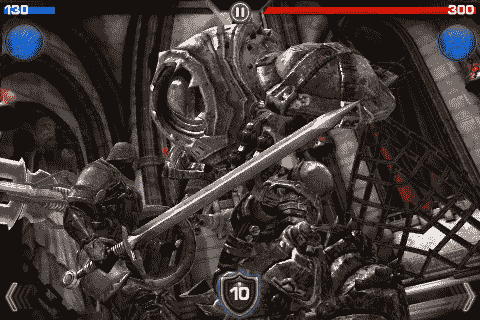

## 下载和安装 UDK

我们将在电脑上下载并安装 UDK 来开发游戏！

# 行动时间——在您的 PC 上安装 UDK

可以按照以下步骤安装 UDK。

1.  启动您选择的网络浏览器并访问 UDK 的网站，[`www.udk.com`](http://www.udk.com)。以下截图显示了这一过程：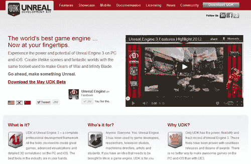

    我们将在下一步讨论如何下载 UDK，但对于那些刚开始使用 UDK 的用户，我也强烈建议您花些时间进一步探索这个网站。它对 UDK 及其功能有非常详尽的解释，定期更新的展示项目（包括商业可用游戏），有关许可的信息，简而言之，这是一个必须访问的网站（实际上，对于任何自重的 UDK 开发者来说，这是一个必须定期访问的网站），在这里您还可以找到适用于您的最新 UDK 版本。

    ### 备注

    Epic Games 作为其社区的一部分，也拥有一个非常活跃的论坛。对于那些像我们一样从事 iOS 开发的用户，也有专门为我们设立的社区论坛。您可以通过点击页面顶部的 **社区** 标签，或者选择 **iOS 开发**，或者直接访问 [`forums.epicgames.com/forums/396-iOS-Development`](http://forums.epicgames.com/forums/396-iOS-Development) 来找到它。

1.  点击页面右上角的蓝色 **下载 UDK** 按钮。这在上面的截图中有展示。

1.  通过右键单击左侧的最新版本并选择 **另存为...** 来下载它。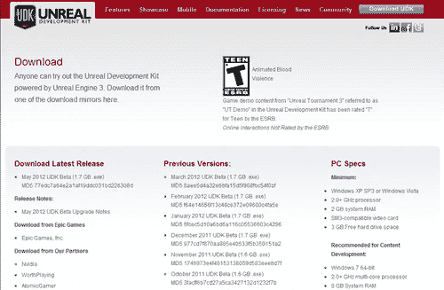

    首先，请记住，您现在正在安装完整的 UDK 应用程序，而不仅仅是面向 iOS 的版本。实际上并不存在这样的版本；UDK 在多平台开发方面采取了一种非常全面的方法。

    ### 备注

    记住，Epic Games 会定期发布 UDK 的更新。

    然而，由于可能存在与旧版和新版的不兼容性问题，他们已经将每个更新（其安装程序文件）与其发布日期清晰地列出，从最初发布的（2009 年 11 月）到当前的（2012 年 5 月）。

    请注意，2012 年 5 月的 UDK 测试版将是本书中我们将使用的版本，尽管本书中我们做的所有事情都应该与后续版本兼容，但 UDK 是不断发展的，在未来几个月中，引擎中可能会有某些问题无法工作，直到 Epic 在后续版本中修复它们。

1.  您很可能会收到一个提示，要求安装 Microsoft .NET，请也安装它。这不应该花的时间比 UDK 下载时间长（如以下截图所示）。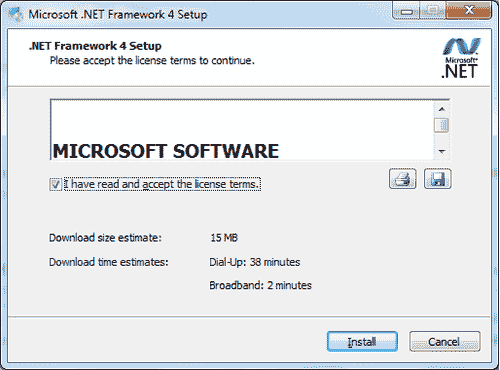

    然而，请注意，这一步也可能触发您电脑的重启，因此请事先在其他应用程序中保存您的作品。

1.  一旦 UDK 安装程序下载完成，打开文件并选择 **运行** 文件，如果出现安全警告，允许安装程序对您的电脑进行更改，如果您的电脑要求的话。

1.  在此阶段，安装程序将要求您签署 **最终用户许可协议**（**EULA**）。要继续安装程序，您必须通过点击 **我接受** 按钮同意条款。

    请注意，Epic Games 希望您在此阶段签署最终用户许可协议。

    通常情况下，尤其是对于从互联网下载的免费应用程序，人们往往会忽视这一点，不会仔细阅读，只是通过点击**我接受**按钮来签署。

    然而，我强烈建议您阅读此内容，尤其是如果您有成为专业 UDK 开发者的抱负。您需要理解您所签订的协议，原因有很多。

    通常情况下，使用 UDK 进行教育用途或非营利目的的大部分内容是完全免费的，但如果您打算为您的游戏收费或从中获得任何收益，您将不得不在游戏收入超过 50,000 美元之前一次性支付 Epic 99 美元，以及超过 50,000 美元后的收入百分比。有关许可的更多详细信息，请参阅第八章*商业化*部分**Chapter 8，*发布和盈利你的游戏*。

1.  接下来，将程序安装到您选择的目录中。我使用了默认位置。安装过程通常需要几分钟才能完成（记住您下载的可执行文件的大文件大小！）。

1.  安装完成后，您将可以选择**启动 UDK**。这样做，我们将在本章后面使用它。

1.  前往您安装 UDK 的目录（您在步骤 6 中选择的目录）。默认目录是`C:\UDK\UDK-2012-05`，如下截图所示：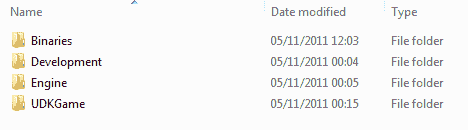

## 刚才发生了什么？

您现在已在您的计算机上安装了 UDK，并迈出了 UDK 开发的第一步。

# UDK 目录概览

Epic Games 提供了一些示例地图和文件，值得探索（包括移动设备上的），在开始开发自己的游戏之前。现在软件已安装，让我们看看我们创建的目录具体包含什么。

## Binaries

**Binaries**文件夹包含许多可执行文件，包括主要的 UDK 程序和用于艺术家和动画师的工具。除了 UDK 的可执行文件外，我们可能不会触及这里的其他任何内容，但我将简要介绍其他文件夹包含的内容。

+   **ActorX**：它包括用于从 3dsMax 或 Maya 导出模型的插件

+   **FaceFX 插件**：它包含用于角色面部动画的工具

+   **GFx**：它包含用于与 Flash 集成 Scaleform 的工具，用于游戏中的 HUD 或其他事物

+   **iPhone/Mac**：它包含用于将游戏导出至 iOS 或 Mac 平台的打包程序。这将在第八章（在 iOS 方面）详细讨论，*发布和盈利你的游戏*

+   **SpeedTreeModeler**：这是一种快速制作游戏关卡中漂亮树木和植被的方法

+   **Win32/Win64**: 它包含 UDK 的 32 位和 64 位版本以及运行它所需的全部库。

## Development

**开发** 包含了为游戏创建的不同类别的 UnrealScript 文件。我们在这本书中不会查看它，但你可以随时查看，以了解游戏玩法逻辑是如何工作的。对于那些熟悉编码的人来说，你可以自由地阅读和扩展已经创建的内容，但重要的是要提到，你永远不应该修改 Epic 的代码。

## Engine

**引擎** 是存放引擎文件、资源文件和配置文件的目录。我们在这本书中不会涉及它们，但特别需要注意的是 `iPhone` 文件夹，它可以用来为你的游戏设置特定的 iPhone 功能。

## UDKGame

UDKGame 将包含以下目录：

+   **自动保存**: 这个文件夹目前还不存在，因为我们还没有使用 UDK，但当你稍后工作在关卡上时，这个文件夹将会被创建，以便备份你正在工作的文件。这并不是替代你自己保存工作，但以防 UDK 突然关闭，你可能会有机会恢复大部分已完成的工作。

+   **构建**: 这个文件夹包含在不同平台上发布所需的资源。值得注意的是，`iPhone` 文件夹包含了我们将在书中稍后使用的资源，例如 App Store 的音乐和图形。

+   **配置**: 这个文件夹包含 `.ini` 文件，我们可以使用这些文件来更改游戏本身的功能。虽然我们在这本书中不会涉及，但我们会使用文件中包含的知识，例如 `DefaultInput.ini` 文件中找到的按键绑定。

+   **内容**: 这是我们将创建的所有资源将放入的文件夹。文件组织并不重要，只要对你有意义即可。只要它在这里，UDK 就能找到它。如果你进入 **UDKGame** 文件夹，然后在 **Content** | **Maps** | **Mobile** 中，你将能够找到许多针对 iOS 的关卡，包括前面提到的 *Epic Citadel*，还有一个他们最早游戏的一个非常酷的版本（在 UDK 上被深情地重新制作）；*Jazz the Jackrabbit*。这原本是一个 2D 平台游戏，看到它用现代工具 UDK 重新制作，是对 Epic Games 历史的一个很好的致敬。

+   **Flash**: 对于那些对将 Scaleform 集成到你的项目中感兴趣的人，这里有一些专门为此目的创建的文件示例。你需要有 Flash 才能打开这些文件，并且除非你正确设置，否则它们将无法工作。有关更多信息，请参阅 [`udn.epicgames.com/Three/SettingUpScaleformGFx.html`](http://udn.epicgames.com/Three/SettingUpScaleformGFx.html)。

+   **本地化**: 这个文件夹包含将你的游戏转换为其他语言的文件。

+   **日志**：UDK 会记录运行时的所有操作，所以如果发生错误，你可以确切地看到出了什么问题。这对于调试很有用，但你不需要它。

+   **电影**：如果你正在为 PC/Mac 开发，并希望使用任何剪辑场景电影，它们将被放置在这里。我们不会在 iOS 开发或本书中使用这个文件夹。

+   **脚本**：所有编译生成的源代码最终都会出现在这里。由于本书中没有任何编码，它对我们来说不会很有用。

+   **启动画面**：这个文件夹包含游戏启动时显示的图像，以及指向**Unreal 开发者网络**（**UDN**）和 Epic 论坛的链接。

# 使用 UDK 进行 iOS 开发的设置

在我们将 iPhone 与 UDK 交互之前，这里有一些简要的注意事项你应该知道。我们已经查看在 PC 上安装 UDK，但移动设备的要求是什么？

虽然我们将在后续的逐步和图解章节中详细介绍如何在实际设备上部署你的游戏以及涉及的所有问题，但在成为 UDK iOS 开发者方面，还有一些非常重要的初始话题需要澄清。

首先，根据 Epic Games 的说法，目前支持 UDK iOS 游戏制作的设备如下：

+   iPhone 3GS

+   iPhone 4/4S

+   iPad

+   iPad2

+   iPod Touch 第三代（除 8GB 容量的第三代设备外）

+   iPod Touch 第四代

如果你有一台较旧的 iOS 设备，那么很遗憾，你将无法为其执行 UDK 开发。值得注意的是，iPad 第三代目前可以通过使用 iPad 2 的系统设置在 UDK 中运行，并且在你拿到这本书的时候，它很可能将拥有自己的系统设置而得到全面支持。

此外，你需要在设备上运行 iOS 3.2 或更高版本，并在你的 PC 上安装 iTunes，以便进行 UDK 开发。然而，为了将你的游戏发布到 iOS App Store，你将需要使用 Macintosh 计算机，我们将在第八章 *发布和盈利你的游戏*中使用它。

如果你能够满足所有给定的要求，那么我们可以继续开发这一章和随后的章节。

然而，我们将在最后几章回到这个领域，涵盖如 Unreal 前端和 iOS 配置文件等主题，这些主题对于游戏后期制作、部署和最终分发至关重要。

## Unreal Remote 的指南

因此，在处理完这些实际问题之后，让我们来尝尝使用 UDK 为 iPhone 开发的感觉吧！

在本节和本章中，我们将进行的第一次尝试确实是一次小规模的尝试，但它仍然是 iOS 游戏开发使用 Unreal 引擎能力的良好展示，特别是在与玩家交互方面。

它使用了我们在本书后面将要利用的两个重要概念；UDK 远程和移动预览器。

UDK 远程是一个由 Epic Games 设计的应用程序，用于推送、触摸以及倾斜控制——基本上您需要控制 iPhone 或 iPad 游戏的所有操作——从移动设备传输到您的开发机器（PC）。

移动预览器是一个可以在主 UDK 可执行文件内部触发的选项，它可以用来在您的 PC 上运行移动 UDK 游戏。它是为了进行小规模测试而创建的，与在编辑器中直接玩游戏一样，也是主 UDK 可执行文件中的一个选项。想象一下，这个选项就像是模拟您游戏在特定移动设备上的外观。然而，这个选项并不完全完美，请记住，PC 上的图形处理单元会比您的 iOS 设备更强大，这可能导致渲染内容时速度更快。一些视觉效果的结果也可能不同，例如抗锯齿。一个好的做法是偶尔将游戏部署到移动设备上，以确保您没有超出其技术能力，并且一切看起来都如预期的那样。我们将在后面的章节中学习如何做到这一点。

这两个应用程序（UDK 远程和移动预览器）可以协同工作——正如我们将看到的！

本节中的示例在没有您的 PC 和 iOS 设备连接到 Wi-Fi 网络的情况下将无法工作；仅连接到 3G 网络是不够的。请确保您的设备已开启 Wi-Fi 设置，并且与同一网络连接，否则以下示例将无法工作。

本书的前两章将使用 iPhone 3GS 作为示例，而后续章节将使用 iPad 2。

# 操作时间——下载和安装 UDK 远程

1.  在做任何事情之前，启动 UDK 编辑器。然后，转到 iTunes Store，作为一个 iOS 用户，您应该已经相当熟悉了。在以下屏幕截图中输入`udk remote`：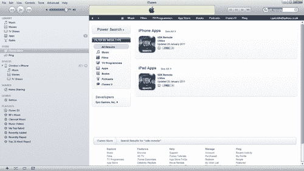

1.  点击**免费**按钮将其更改为**安装**。再次点击按钮以在您的 iOS 设备上安装 UDK 远程应用程序。

    Epic Games 实际上也将这个应用程序免费提供，就像 UDK 本身一样，所以它不会花费您任何费用。

    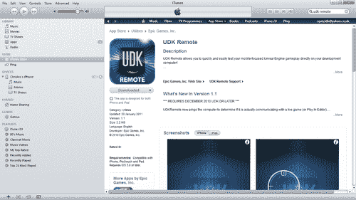

1.  使用新应用程序同步您的设备。确保您的 iOS 设备已经正确同步，通过断开连接并查看您的设备菜单，直到找到已安装的应用程序。

1.  通过点击图标启动 UDK 远程应用程序。您将被提示填写有关您机器的详细信息。

    为了让 UDK Remote 正常工作，您需要更改的唯一设置是输入您计算机的 IP 地址，以便您的 iOS 设备能够与其通信。现在我们先保留其他设置不变。

    然而，在我们解决 IP 地址问题之前，您可以快速点击您的 iOS 设备上的**完成**按钮来检查 UDK Remote。

    现在，您应该会进入 UDK Remote 的运行时屏幕，如您所见，它非常基础。

    当然，如果没有在这台计算机（您的计算机）和主机机之间设置通信，这是不可能工作的，正如您可以从错误信息中看到的。

1.  您可以通过点击屏幕右上角的**i**按钮回到设置，如以下屏幕截图所示：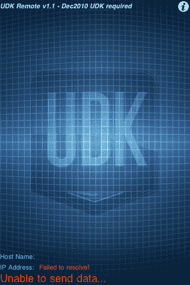

    那么，“我的 IP 地址是什么？”您可能会问。如果您不知道，有一个快速的方法可以找到它。

1.  在您的计算机上，点击**开始**菜单并选择**所有程序**|**附件**|**命令提示符**，如以下屏幕截图所示：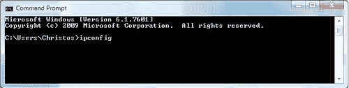

1.  当您到达命令提示符时，输入`ipconfig`并记下出现的 IPv4 地址。回到您 iPhone 上的 UDK Remote，点击**计算机地址**并输入命令提示符中显示的 IPv4 地址，然后点击**确定**按钮完成。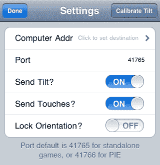

1.  返回到**设置**中的**UDK Remote**（如您所见，您可以使用多个计算机与该应用程序进行接口）并点击**完成**。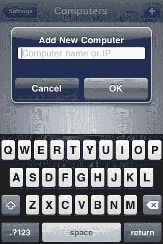

1.  现在，在您的 IP 地址和端口旁边，您将看到以下信息，如以下屏幕截图所示：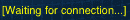

1.  您的 IP 地址和端口也将以黄色突出显示，这意味着您还没有与 UDK 连接，所以让我们接下来做这件事。

1.  打开我们在上一节中启动的 UDK 编辑器。在主工具栏上，您会在右上角看到一个看起来像 iPhone 的图标，旁边有一个播放按钮。这是**在移动预览器中播放**按钮。

1.  或者，您也可以从上面的菜单中选择**构建**|**在移动预览器中播放**。这在上面的屏幕截图中显示：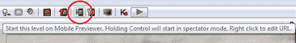

1.  等待它启动（即使是像默认场景这样非常基础的场景，也需要几分钟时间）然后查看您的 iPhone。之前提到的**等待连接...**将变为**连接到...**，如以下屏幕截图所示：

你将看到 UDK Remote 的设置（其中大部分都是相当直观的）。

## 发生了什么？

当你在 iPhone 上用手指拖动时，请看你的电脑屏幕，你现在可以通过无线网络使用你的 iPhone 在电脑上的三维空间中导航基本 UDK 场景！

使用多点触控功能来尝试这个功能，感受一下你可以用提供的交互做什么。

如以下截图所示，左侧的圆形触摸板可用于移动，而右侧的触摸板可用于侧滑。

如果你之前玩过 3D 游戏，特别是第一人称射击游戏（不一定是 iOS 平台上的），这将是一个非常熟悉的方式来控制场景中的玩家！

在 iOS 游戏开发的第一尝试上花些时间进行实验！

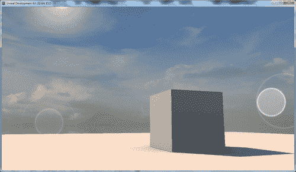

# 操作时间——匹配移动预览器设置与你的 iOS 设备

现在我们已经在 iOS 设备和我们的 PC 之间建立了交互，让我们确保它是为我们要使用的特定设备创建的。幸运的是，这样做非常简单。

1.  在我们继续之前，你应该知道你可以更改 Mobile Previewer 上的某些选项，实际上你也应该这样做，以便适应你的设备。点击以下截图所示的**编辑移动预览器设置**按钮：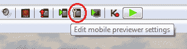

1.  由于在本章中我们使用的是 iPhone 3GS，我将其更改为允许这样做，如果你想的话，你也可以将显示方向从横幅更改为纵向。这完全取决于你正在开发的游戏类型。

    让我们保持横幅模式。这就像以下截图所示：

    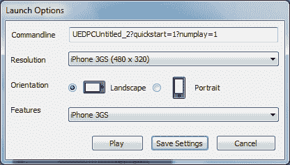

## 发生了什么？

无论你拥有哪种 iOS 设备，你现在都可以使用 UDK Remote 和 Mobile Previewer 来测试所有想法，并在后续章节中最终测试我们的原型游戏，所以我们已经迈出的这一步是非常重要的！

说到原型游戏，我们到底要开发什么？

# 描述《城市战士》的概念，一个第三人称射击游戏标题

我们之前讨论过《战争机器》以及尝试在 iOS 设备上以相同程度详细和复杂地重新创建它的难度，记住，《战争机器》是基于同一引擎开发的（UDK）。

那么，我们不妨试试看，看看我们能接近到什么程度？

与其试图用 UDK 制作一个更休闲、更基础的游戏，不如将本书中完成的工作视为创建你自己的 AAA 级游戏的小型构建块，这可能会更有趣！

我们将游戏（暂时且可能不是特别富有想象力）命名为**城市战士**，它将具有以下特点：

+   它是一个非常典型的单人第三人称射击游戏，非常类似于《战争机器》的风格

+   可玩 3D 环境将（主要是）一个大型开放式城市区域，将具有交互式元素，例如当你走近时门会打开

+   玩家将在游戏世界中穿越，根据他移动时选择的路径参与不同的场景

+   我们将为敌人创建自己的自定义 AI 系统

+   我们将添加我们自己的自定义资产，为玩家提供独特的体验

目前，尽管范围很广，但这份简报对我们来说已经足够好了，我们可以开始探索 UDK 的非常广泛的功能，以适应一些先前的目标，并逐步深入到游戏的一些更细微的细节。

我将在接下来的每一章中回到这个关键的游戏想法，讨论我们已经取得的进展，更重要的是，它是如何融合成一个连贯的游戏体验的。

## 快速问答

让我们看看你是否能回答这些问题，你应该只需阅读这一章的简介就能回答所有这些问题。

1.  以下哪些 iOS 设备不支持 UDK？

    a. iPad

    b. iPhone 2G

    c. iPad 2

    d. iPad（第三代）

1.  我们如何找到我们的 IP 地址？

    a. 它已经在 UDK Remote 中为我们提供了

    b. 我们从 ipconfig 输出中获得的 IPv4 地址

    c. 输入随机数字，直到它工作

    d. 使用命令提示符使用 Link-Local IPv6 地址

1.  我们在哪里以及如何找到 Epic Games 为我们提供的 UDK 中的示例/样本地图？

    a. Epic 不提供示例

    b. 在 UDK 网站上单独下载它们

    c. 查看 Epic Games 社区页面上的教程

    d. 它们位于我们的 UDK 安装中的“内容 | 地图 | 移动”文件夹中

1.  我们如何确保移动预览器已定制到我们的 iOS 设备或更改 iOS 游戏的屏幕方向？

    a. 当我们玩游戏时，它会自动完成，取决于它的握持方式

    b. 它是我们设置的 UDK Remote 应用程序上的设置

    c. 它位于“编辑移动预览器设置”中

    d. 我们无法更改使用的设备

# 摘要

希望你喜欢用 UDK 成为 iOS 游戏开发者的第一步！

尽管还有很多事情要做，但我们已经在本章中涵盖了以下内容：

+   了解 UDK 是什么

+   看到了使用示例可以/不能实现什么

+   探索了 Epic Games 的专用 UDK 网站，并下载和安装了应用程序

+   下载并安装了 UDK Remote

+   在 iOS 平台上使用 UDK 开发游戏的概述

+   将您的设备与 PC 上的 UDK 接口，并使用它进行与移动预览器的基本交互

+   讨论了我们将要在后续章节中探讨的基本原型游戏的简要概述/概念

在下一章中，我们将更深入地探讨使用 UDK 编辑器（以及做比仅仅玩 UDK 远程和移动预览器更多的事情！），从了解应用程序界面的基础知识到为你的第一个射击游戏添加基本构建模块。
