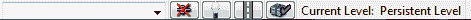

# 第二章. 开始成为城市战士，第三人称射击游戏

> 到目前为止，我们现在已经安装了 UDK，并且已经让 UDK 远程工作，这样我们就可以使用 iOS 设备的输入在 PC 上玩游戏了。这是一个很好的开始，但现在是我们动手开始构建东西的时候了。在本章中，我们将基于第一章的内容，迈出构建我们第一个级别的第一步。

在本章中，我们将：

+   了解 UDK 环境和您需要了解的界面方面

+   将画笔构建到我们的世界中，以创建室内空间

+   在该空间中添加纹理、照明和 3D 模型

那么，让我们开始吧！

# 开始

当开始使用 UDK 时，您可能会对编辑器初次看起来多么复杂或它可能不会按您想象的方式工作感到沮丧。为了帮助过渡到这些工具，我们将通过查看 UDK 的基本知识来逐步进行这个过程，从我们创建第一个级别时应该知道其存在的 UDK 界面的关键部分开始！

## UDK 界面的简要浏览

让我们先看看 UDK 界面，这是您启动应用程序并关闭欢迎菜单后看到的界面。虽然我们在上一章中只是简单地了解了所有菜单和按钮的功能，只是为了让移动预览器工作，但了解您可用的所有工具非常重要，因为游戏开发者可以做的最重要的事情之一就是知道如何使用某个工具来完成特定任务。这样您就可以在屏幕上实现您所想象的任何内容。

在一定程度上，这真的需要时间，尽管我肯定会推荐通过点击它们并尽可能多地实验它们（而不是在实际项目的最后阶段）来探索界面和截图中所显示的所有功能，这样界面的基础知识最终会变得像第二本能一样自然。我还应该指出，我不会涵盖所有界面；其中一些涉及我们现在不需要或由于我们创建 iOS 游戏的目标而无法使用的先进功能，尽管如果您想进行多平台开发，我会简要介绍一些由于它们在非 iOS 游戏中的重要性而没有使用到的功能。

## 工具箱侧边栏

我们将首先介绍您在左侧看到的图标。这是按**模式、画笔、CSG、体积、选择**和**转到**分类的工具箱，标签位于与它们相关的按钮上方。**模式**非常重要，所以让我们首先看看这些。

### 小贴士

如果您不记得某物是什么，如果您的鼠标光标在某个东西上停留一段时间，图标的名字/功能就会显示出来；这将非常方便使用以下指南并识别您所在的界面部分及其功能！

### 模式

**模式**包含与你的级别交互的所有不同方式。具体来说，它包含以下功能：

+   **相机模式**: 这是 UDK 的基本默认相机模式。你将在这个模式下工作很多！

+   **几何模式**: 这提供了编辑几何形状和特别是 CSG 刷子的基本工具。（对于与在应用程序中执行的操作类似的多方面操作，例如 Autodesk 的 3D Studio Max）。它允许我们做的其中一件好事是构建到网格中的对象，这使得在级别中不出现空洞变得更容易。我们将在第六章 *整合一切*中广泛使用它。

+   **地形编辑模式**: 此模式用于创建地形。

+   **纹理对齐模式**: 此模式用于在刷子上正确对齐纹理，例如旋转等操作。

+   **网格绘制模式**: 这是一个编辑器中的顶点颜色绘制工具。

+   **静态网格模式**: 这是一个工具，用于在级别中快速添加静态网格（通过加快其放置过程）。如果，例如，使用多个静态网格来填充场景，这将非常有用。

+   **景观模式**: 这是一个具有改变地形能力的景观创建工具。如果你熟悉高度图数据，你可以导入高度图数据。然而，iOS 系统上的 UDK 不支持地形，因此我们不会使用它。

+   **植被模式**: 这是一个用于创建植被的半自动工具。

请参考截图了解这些模式。

### 刷子

**刷子**是我们可以带入世界的几何形状。以下是我们可以创建的可能选项，我们将在讨论界面之后讨论几何形状实际上是什么以及它是如何工作的。刷子中可用的功能包括：

+   **立方体**: 这是一个立方体/盒子形状的刷构建器

+   **圆锥体**: 这是一个圆锥体形状的刷构建器

+   **曲线楼梯**: 这是一个曲线楼梯刷构建器

+   **圆柱体**: 这是一个圆柱体形状的刷构建器

+   **直线楼梯**: 这是一个标准的、直线的楼梯刷构建器

+   **平面**: 这是一个类似于二维平面的刷构建器（如果需要，也可以添加细分）

+   **螺旋楼梯**: 这是一种另一种曲线楼梯刷构建器，但这次在底座角度上没有限制（之前的曲线楼梯有一个限制，即 360 度，因此这个的名称是螺旋而不是曲线）

+   **四面体（球体）**: 这是一个类似于球体的 CSG 刷构建器

+   **卡片**: 这是一个刷构建器，由于其外观，可以用于使用纹理（例如使用两个纹理而不是模型来创建低成本树木）创建各种特殊/视觉效果

请参考截图了解这些选项：

工具箱的下一部分包含笔刷 CSG 操作（再次，有关术语的更详细解释，请参阅下一节“体积和选择”，但可以简单地说，这些是在将笔刷塑造成有意义的可玩水平中的关键）：

+   **添加**：这使用笔刷构建模式中的最后一个选择，并以此作为模板，在水平面上创建一个加法笔刷

+   **减去**：这与前面的选项使用方式相同，但这次会创建一个减法笔刷

+   **相交**：这将仅显示与其他相交笔刷重叠的部分，其余部分不可见

+   **去交**：这是先前操作的逆操作

这些工具在以下屏幕截图中显示：

### 体积和选择

**体积**和**选择**包括以下功能：

+   **添加特殊笔刷**：这有助于创建更复杂的笔刷。

+   **添加体积**：与点击 CSG 操作将创建一个新的笔刷类似，点击**添加体积**将创建一个具有特殊属性的几何体。体积是不可见的，但可用于所有 sorts of effects like creating water, lava, or triggering different events. Feel free to play around and see all of the kinds of things you can do. We will be using many different kinds of volumes in this book.

+   **仅显示所选内容**：这个功能（与其他三个选择按钮一样）在处理繁忙和/或杂乱的水平面上进行选择时非常有用；这是一个仅显示您编辑器/游戏水平中选定角色的工具。

+   **隐藏所选内容**：这是一个用于隐藏您水平面上选定角色的工具（与前一个功能的相反）。

+   **反转选择**：这是一个用于反转先前操作的工具。

+   **显示所有内容**：这是一个重置工具，用于选择操作，以便在编辑器中再次显示所有角色。

请参考屏幕截图了解这些功能：

### 转到并构建笔刷

最后，我们有**转到**（**演员**和**构建笔刷**），与前面的工具一样，它们是选择工具，用于帮助恢复到视口中的演员或笔刷。再次强调，这些工具可能非常有用，也许在本章中不是那么有用（因为在一个只有一间房的水平中很难找不到您的构建笔刷！）但一旦您的游戏开始扩展，您会发现您会越来越多地使用它们，以节省在日益复杂的 UDK 编辑器结构中查找时间。以下屏幕截图显示了此工具：

### 视口工具栏

现在让我们看看**视口**工具栏。您目前正在使用的每个视口上方都有一组图标，我们称之为视口工具栏。默认情况下，UDK 使用四个视口，就像大多数 3D 建模程序一样。然而，还有其他选项，我们将在第五章中讨论，即*城市战士的动作序列*。

我们有以下视口从左到右：

+   **视口选项**：这为您提供了许多选项，例如在视口中显示每秒帧数。应注意的是，许多选项可以打开和关闭（例如上述选项），但也可以作为图标（如下所述）使用。

+   **视口类型**：您可以在**透视、顶、前**和**侧**之间切换。

+   **实时预览**：这将显示游戏运行时的外观，打开音效和粒子系统。然而，这确实会影响编辑器的速度和性能，因此应谨慎使用，或仅在必要时使用。

+   下一个 11 个图标从**Brush Wireframe**到**Lighting Only with Texel Density**切换视口中的各种视图到用户所需的任何视图。

+   **游戏视图**：这展示了运行时将看到的可视化（例如，点击默认透视视图端口以查看所有线框消失）。

+   **锁定视口**：这在一定程度上是自解释的，但将锁定的是之前描述的**转到**动作，而不是视口本身。

+   **锁定选定的演员到相机**：这将“锁定”按钮/图标点击后的下一个演员选择到视口相机。然后您可以移动相机并再次点击此按钮，演员也会被移动。这实际上是一个在视口中非常快速地移动关卡/游戏部分的有用工具。

+   **级别流体积预览和后处理体积预览**：这将启用在给定/选定的视口中可视化流和后处理操作。后处理在 iOS 设备上的 UDK 中不起作用，并且由于我们没有使用多个关卡，我们没有必要使用级别流体积，因此我们将不会使用这些。

+   **相机移动速度**：这将允许您更改视口相机速度（提供四种设置/不同速度）。

+   **在视口中播放**：这将允许您在视口中播放游戏，这对于原型设计非常有用，但不会代表您在 iOS 上的游戏。

+   **拆分浮动副本**：这将取消连接给定的视口到四个视口模式。

+   **最大化视口**：这将最大化一个视口（暂时消除四个视口模式），再次点击时将恢复到原始状态，这对于快速缩放查看区域或特定视角非常有用。

请参考截图中的这些选项：

### 工具栏

现在让我们移到屏幕顶部，紧接在主菜单栏下方，探索工具栏中找到的所有图标：

+   **创建新关卡**: 这将创建一个新关卡，但在 UDK 询问你保存当前关卡之前不会创建

+   **打开现有文件**: 这将加载一个已保存的关卡；同样，前面的提示也适用于此

+   **下拉菜单**: 这是一个用于查找最近访问过的关卡的功能

+   **切换地图文件为收藏**: 这是一种将 UDK 关卡标记为收藏关卡的方式

+   **保存当前关卡**: 这将保存你的关卡

+   **保存所有关卡**: 这将保存多个关卡

+   **保存所有可写包**: 这将保存所有可写包

+   **撤销...**: 这相当自解释，但请记住，在关卡进行**构建...**过程之后，这将不起作用

+   **重做...**: 与前面的规则相同！

+   **选择模式**: 这是一个工具，只能选择关卡的部分，而不能以任何方式操作

+   **平移模式**: 这是一个工具，可以移动关卡的部分

+   **旋转模式**: 这是一个工具，可以旋转关卡的部分

+   **缩放模式**: 这是一个工具，可以均匀地缩放关卡的部分，在 X、Y 和 Z 轴上组合

+   **非均匀缩放模式**: 这是一个工具，可以非均匀地缩放关卡的部分，例如，在特定的一个轴上而不是三个轴上拉伸

+   **参考坐标系**: 世界和本地空间适用（两种可用模式）作为影响变换的坐标系

+   **查找演员**: 这是一个在包含许多不同演员的更复杂关卡中定位演员的有用工具

+   **打开内容浏览器**: 这将打开 UDK 的资产库窗口；我们将在本章后面查看它

+   **打开 Unreal Kismet**: 这将打开 Unreal Kismet，它是 UDK 用于脚本事件、序列和其他复杂任务的视觉脚本工具

+   **打开 Unreal Matinee**: 这将打开 Unreal Matinee，它是 UDK 创建电影场景以及涉及定向运动的其他许多事情的方式

参考以下截图：

沿着工具栏继续，我们有以下选项：

+   **到远裁剪平面的距离**: 这是一个远裁剪平面滑块，通常用于性能优化

+   **允许半透明选择**: 这是一个图标，有助于选择 UDK 关卡/游戏中的半透明部分

+   **包含到选择**: 这是一个自解释的选择工具

+   **低质量材质**: 这允许用户在允许的情况下在对象上显示低质量材质

+   **为可见关卡构建几何形状**: 这将为你在工作的关卡创建关卡几何形状

+   **构建照明**: 这将为你在工作的关卡创建照明

+   **构建路径**: 这将为你在工作的关卡创建路径

+   **构建覆盖节点**: 这将为你在工作的关卡创建覆盖节点

+   **构建所有**：这将创建上述所有内容。通常，当你正在制作关卡时，你不需要每次对游戏进行小改动时都使用此选项来查看游戏运行的效果。但记住，你不能撤销构建的内容。同样，对于较大的关卡，如果你只在工作照明上并且想要更新你的地图，你不需要构建所有内容，只需使用上述按钮即可。

+   **构建所有并提交到源控制**：这将构建所有内容，并使用版本控制，这对于跟踪特别是大型/团队项目非常有用。然而，这并不是默认选项。

+   **照明质量设置**：这些是照明设置；可用的选项有预览、中等、高和制作。

+   **全屏模式**：这会将编辑器本身切换到全屏模式。

+   **切换实时音频**：这是编辑器中的音频按钮，可以通过右键单击并使用结果滑块来调整音量。

+   **模拟移动功能**：这用于渲染模拟，将其更改为移动模拟，以更好地近似移动设备上的结果（从图形角度来看）。

+   **在 iOS 设备上安装**：这一点不言而喻，这是一个我们将在第八章 *发布和盈利你的游戏* 中使用的按钮。

+   **移动预览器**：我们已经使用过这个功能了，所以你应该知道它是什么！不用说，我们还会更多地使用它。

+   **编辑移动预览器设置**：我们已经使用过这个功能了，所以你应该知道它是什么。

+   **在 PC 上启动此关卡**：这启动了游戏/关卡的 PC 运行时，但由于我们只进行 iOS 开发，我们不会使用它，因为它不模拟移动输入或使用用于模拟移动渲染的 OpenGL 渲染器。

+   **启用 Kismet 调试**：这可以打开或关闭，有助于 Kismet 序列调试。

+   **在编辑器窗口中播放此关卡**：这一点不言而喻，对于快速原型设计非常有用，但它并不能代表 iOS 设备能够做到的事情。

参考以下截图：

## 探索主菜单栏

现在让我们转到屏幕顶部的工具栏。我将比之前的功能更快地介绍这一部分，因为大多数功能都是重复的（我们已经介绍过它们，并且在工具栏菜单的不同部分都有重复）并且其中一些功能较为高级，我希望避免在本书的这一章中使 UDK 的前几个步骤过于复杂。然而，快速浏览这些选项仍然是有价值的，因为这里也有很多有用的选项。

这些是主菜单栏选项：

### 文件

和大多数程序一样，在**文件**菜单下，你可以打开文件、保存它们，并创建新的文件。你有机会将文件导入到你的关卡中，或者将你的关卡导出为文件。菜单底部允许你轻松选择你最喜欢的关卡以及你最近打开的关卡。

注意，在 UDK 中**保存**没有快捷键，通过点击*Ctrl+S*你实际上是在创建一个减法刷子。确保通过选择**文件** | **保存**来保存你的关卡。

### 编辑

这是正常**撤销/重做**功能的位置，程序通常都有，以及访问我们之前讨论过的一些额外功能的方式，例如**平移、旋转**和**缩放**对象的能力。你还可以访问你关卡内对象的**剪切、复制、粘贴、复制**和**删除**功能。底部部分允许以不同的方式选择不同的对象，值得注意的是**查找演员**，它将带你到一个菜单，显示你关卡中的所有内容，这使得找到你正在寻找的特定内容变得容易。

### 查看

**视图**菜单提供了查看 UDK 内部所有窗口的能力。可以访问所有不同类型的浏览器窗口，以及演员、表面或关卡本身的属性。你可以调整关卡在拖动、缩放和旋转对象时的吸附属性。还有选项自定义你的 UDK 界面，例如更改你的视口或切换全屏模式的使用。

### 刷子

**刷子**菜单包含了我们之前在工具栏侧边栏中讨论的所有内容，并额外提供了导入或导出你创建的不同刷子的选项。

### 构建

**构建**下拉菜单包含各种关于重建你的关卡选项。该菜单还允许你只构建你更改的内容，使其运行更快；除非你之后有所更改，否则你不需要每次都重建你的光照，因为通常在大关卡中这需要很长时间。

### 播放

主菜单栏的**播放**部分提供了根据你创建的平台以不同方式播放你的游戏的选择。我们将在本书的大部分内容中使用移动预览器，但我们将展示如何在第八章中安装到 iOS 设备上，*发布和盈利你的游戏*。

### 工具

然而，**工具**菜单似乎包含了很多独家（非图标）内容，例如检查错误地图（编译它而不实际构建它）的能力，清理 BSP 以及其他功能，尽管目前这些对我们来说并不那么重要，因为它们不会显著影响初学者创建基本游戏的道路。所有这些选项都在下面的屏幕截图中显示：

### 预设

**偏好设置**工具栏，这是最长的工具栏，有许多不同的选项可以切换开启或关闭，以自定义您的 UDK 体验。也值得注意，很多初学者经常会在这里勾选或取消勾选某些选项，通常是通过使用键盘快捷键或意外操作，然后当某些功能无法正常工作或不可见时，会感到非常困惑！因此，了解这些选项是很有价值的，这样您可以尝试自己解决问题。以下截图显示了偏好设置中可用的选项：

### 帮助

最后，**帮助**部分包含有关在线帮助、论坛、正在使用的 Unreal 版本、启动提示以及 Swarm-UDK 为多核计算机提供的分发解决方案（这有助于加快照明计算速度）的信息。

## 控制台栏

在结束对界面的查看之前，让我们最后关注屏幕底部被称为**控制台栏**的部分。请参考以下截图：

在这部分，有一个命令行，您可以直接在 Unreal 编辑器中输入控制台命令。我们将在本书的后面部分使用控制台命令，但是在实际游戏而不是编辑器中，但这个选项是存在的。

此外，还有一个**源代码控制**图标（默认情况下未设置），一个照明和路径构建状态按钮以及一个包图标。

将鼠标光标移动到 UDK 编辑器这一部分的底部右端，您还可以获取鼠标光标位置（坐标）的信息，如果您已选择了一个对象，还可以获取该对象本身的信息。

此外，您还可以使用四个 DrawScale 文本框（**DrawScale**、**DrawScale3D X**、**DrawScale3D Y**和**DrawScale3D Z**）对项目执行手动操作。还有拖动、旋转和缩放网格，这在创建关卡时非常重要。如果禁用此选项，当项目被转换时，它可以被移动到任何位置，造成空洞。例如，如果您尝试通过在添加式笔刷上放置减式笔刷来创建门，如果笔刷偏移很小，未被笔刷覆盖的部分将形成一堵墙。在构建我们的实际游戏关卡时，我们将充分利用这一点。

最后，自动保存功能也在这里，如果 Unreal 崩溃或破坏了您的关卡，它将自动将地图保存到备份文件中。安全总比后悔好！以下截图显示了所有这些设置：

## 键盘快捷键

最后一点注意事项；键盘快捷键。

UDK，就像所有 3D 设计应用一样，大量使用了这些功能（正如您已经从截图中所见），您可以使用键盘随心所欲。不过，这里有一条建议；如果您使用其他 3D 应用（或者确实任何带有快捷键的应用），请注意，因为 UDK 是一个复杂的工具，您可能会像我之前提到的那样，不小心启动了某个功能或更改了您不想更改的设置，仅仅是因为您当时没有记住正确的键盘快捷键。

这是我们所有人都会遇到的情况，但如果我们能避免的话，最好还是避免。

话虽如此，随着本书的继续，除了展示如何从菜单中访问内容之外，我还会介绍我在使用该工具时经常使用的快捷键。

## 创建环境和关卡设计的基础

在我们深入探讨之前，利用之前描述的界面以及将到目前为止获得的知识应用于创建一个交互式关卡（您的第一个关卡！）之前，让我们先深入研究一些理论。

### CSG 笔刷

我们一直在使用“笔刷”和“CSG”这两个词，所以定义一下它们实际上是什么是个好主意。**构造实体几何**（**CSG**）是 UDK 中用于世界几何的一个术语，UDK 通过您在关卡中创建的笔刷来创建世界几何。另一方面，笔刷是用于定义空间的三个维度对象。我们以四种不同的方式定义这个空间：**添加、减去、相交**和**非相交**。

### 静态网格

**静态网格**，另一方面，是用于在 Unreal/UDK 中形成游戏关卡的多边形创建，这些网格在世界上不移动，但不用担心，我们也会在未来的章节中介绍如何创建移动对象。在本章中，我们将放置网格，让我们的环境除了墙壁之外还有其他东西可以看。

在本书的后面部分，我们将探讨如何从 3D 建模包中导入静态网格到 UDK 中，从而展示出该引擎在创建世界和世界网格方面的无限潜力，前提是开发者具备一些基本的 3D 资产创建技能。

### CSG 笔刷和静态网格之间的区别

那么，使用笔刷和/或静态网格之间的区别是什么呢？为什么使用其中一个而不是另一个？

您应该知道，在 UDK 中，静态网格现在实际上是专业人员在世界创建中的首选，有两个简单的原因：性能和美学。使用静态网格要快得多，并且（如果您使用的是高质量的网格！）它们看起来会比笔刷好得多。笔刷也导致了或导致了相当多的问题，如造成孔洞，而静态网格提供了解决此类低效问题的必要解决方案。

然而，刷子仍然有其位置。在游戏行业中，许多游戏设计师会使用刷子来勾勒出关卡，并确保脚本正确运行。这样设计师就能专注于使游戏有趣，并确保关卡的功能性完成，以确保一切都能正常工作。我们将在这个章节以及接下来的章节（直到第六章 Chapter 6，*整合一切*）中使用这种思维方式。关卡完成后，关卡设计师可以将关卡交给环境艺术家，然后艺术家将用他们创建的网格替换刷子，这就是我们在第七章 Chapter 7，*为城市战士的高级内容创建*中将要做的。话虽如此，每个工作室都是不同的，所以一个公司的流程可能与另一个公司完全不同。

### 在视口中移动

点击视口内部将为你提供访问该摄像机的权限。在本书的整个过程中，我们将使用各种视口进行工作，因此你将使用以下方法在关卡中高效导航：

+   按住**左鼠标按钮**（**LMB**）并向左或向右移动将使摄像机左右旋转，而向上或向下移动将使摄像机沿 X 轴前进或后退。

+   为了四处查看，使用**右鼠标按钮**（**RMB**）

+   左键（LMB）和右键（RMB）的组合会使你的摄像机在 Z 轴上下平移，或在 Y 轴的左右两侧移动。

鼠标的滚轮滚动将沿着摄像机的 X 轴平移，从而产生放大和缩小的效果。

## 在游戏中添加世界几何和纹理

现在我们已经完成了所有的基础工作，让我们开始从头创建我们自己的第一个关卡！

# 行动时间——创建一个基本房间

1.  首先，在**文件**下选择**新建**，然后从弹出的菜单中选择**空白地图**选项。此时，你应该能看到以下截图所示的内容：

1.  右键点击**立方体**刷子以打开**刷子构建器**对话框。在弹出的窗口中更改设置，如图所示（在**X**填充`1024`，在**Y**中输入`512`，在**Z**中填充`16`）。点击**构建**和**关闭**。现在你的构建刷子大小就是你想要的了！！行动时间——创建一个基本房间

1.  点击位于侧工具栏下**CSG**选项下的**CSG 添加**操作图标。你应该能看到你创建的第一个几何形状。行动时间——创建一个基本房间

1.  左键单击建造刷以选择对象。你应该在建造刷的某个地方看到三个箭头，它们各自面向不同的轴，并具有自己的颜色。这被称为**小部件**，但如果每个轴看起来都像箭头，那么它处于**平移**模式。如果不是这样，按*Space*键直到它看起来像以下截图中的样子。使用**平移**工具，设置为平移，将刷子向上拖动，然后再次点击**CSG 添加**按钮。因为我们只是展示工具，所以不必太担心高度，但尽量与截图匹配。你现在有了你的天花板几何形状。在这个阶段，你可能想要开始最大化视图（在这个例子中是**透视**），来回切换以获得更好的操作视图。

1.  选择**建造刷**后，点击**旋转**图标（或按*Space*键直到你看到下一张截图中的工具），在**前视图**中沿适当的轴旋转-90 度，直到得到以下截图所示的结果：

1.  将它移动到左侧墙的位置，然后在右侧轴上非均匀缩放以将其挤压到位。这一点很重要；现在它需要完美对接。正是在这一点上，你将不得不开始使用我们之前提到的底部右边的**拖动、旋转**和**缩放网格**对接工具。参考以下截图：

    这些会将你的变换对接到网格上，无论是移动、旋转还是缩放，从而为你提供一种更精确地将几何形状放置在精确位置的方法。

    真的非常重要，这些部分需要干净利落地对接，因为这是你需要习惯的练习。确保你的前两个部分（天花板和地板）也对接得很好，以及新创建的侧墙。

    要找到这个的正确设置需要一些练习，而且你经常会根据你正在做的事情（以及你所在的视图）改变你的对接设置，所以你现在需要习惯这一点。

    

1.  再次在左侧墙面上使用**CSG 添加**，然后按照同样的步骤对右侧墙、前墙和后墙进行处理，以创建一个封闭的房间。

    这与到目前为止我们所做的是相似的，应该不会出现问题。

    你现在正在逐渐习惯使用**建造刷**、移动、旋转和缩放变换、**CSG 添加**操作和对接工具。

    记住要在所有视图中工作，以确保你在三维空间中的操作能够很好地转换，并且正确地对接到网格上！

    一旦你完成了右侧墙壁以及前面和后面的墙壁，你应该会得到以下截图所示的结果，所有墙壁都干净利落地对齐到网格和彼此之间。

    

## 发生了什么？

我们现在已经在 UDK 中完成了第一个房间！现在它可能看起来不多，但我们很快就会解决这个问题。

现在这是你的房间，在这个阶段，我们完成了这一章的刷子工具，但我们将回到下一章使用它们。在我们继续之前，还有一件事要做。我们创建的房间是封闭的，但实际上它是空的，我们应该能够进去。要做到这一点，按住鼠标左键（LMB）并向前移动以向前移动，同时按住 LMB + RMB 以上下移动，以便将自己定位在你刚刚创建的空间内部，欣赏它。

现在看起来还可以，但我认为它还缺少一些东西才能真正实现真实感。墙壁都是一样的！幸运的是，我们可以使用纹理以非常简单的方式让墙壁生动起来，让我们更接近 AAA 级质量。

现在是应用纹理的时候了。

# 纹理级别的时间——纹理处理级别

1.  通过按住*Ctrl*键并左键单击选择所有侧面墙壁（如前一张截图所示，我有三个，确保你也选择了后面的那个），然后最大化你的**内容浏览器**（这是当你运行 UDK 时默认打开的，我已经最小化了。如果你已经关闭了它，那么点击下一张截图中的图标）。

    **内容浏览器**是 UDK 的资产库界面。

    我们将广泛使用它来完成许多操作，但现在让我们先了解一下基本流程，以便我们挑选出三种不同的现有纹理，我们可以在场景中使用。

1.  在**内容浏览器**顶部的**搜索**文本框中输入`brick`。为了帮助说明我的意思，这在下一张截图中被突出显示：

1.  左键单击并从结果中选择**M_NEC_Walls_BSP_Brick1**，然后点击出现的菜单中的**Fully Load**（如图所示）。然后最小化**内容浏览器**，因为我们现在想要应用我们的纹理。

1.  在选定的墙壁表面上的任何位置右键单击（它必须在那里，而不是在未选择的墙壁上）。在出现的菜单中，选择**应用材质：M_NEC_Walls_BSP_Brick1**。

    我们刚刚在 UDK 中完成了第一块几何体的纹理处理！

    我们将对它进行一点微调，但首先让我们也处理天花板和地板。

    

1.  使用**内容浏览器**和相同的过程，但对于天花板选择**M_NEC_Ceilings_SM_TURK182**（在命令行中输入`ceiling`后），对于地板**M_ASC_Floor_BSP_Tile01**（在命令行中输入`floor`后）。

    您将看到下一张截图：

    

    这看起来不错（而且比之前好得多），但可以进行许多细微的操作来使其看起来更好。一个可能的选择是在某个区域进一步平铺（乘以）纹理。这样，根据房间的尺寸，比例会变得更加逼真，而不是扭曲（这可能会破坏游戏中任何虚拟世界的幻觉）。您将在自己的游戏/关卡中做很多这样的操作。

1.  再次以相同的方式选择所有侧面墙壁，并在它们上右键单击。您将看到以下截图所示的菜单：

1.  选择**表面属性(4 个选中项)...**，然后在结果窗口中将**UTile**和**VTile**更改为`3`和`3`，然后点击**应用**。这如图所示：

## 刚才发生了什么？

我们现在已经迈出了在 UDK 中创建游戏关卡的第一步。我们现在有一个看起来确实像房间的房间，并且已经应用了适当的墙壁。现在我们有一个值得一看的房间，让我们完成最后几个步骤，以便我们可以在游戏中看到它！

## 为游戏创建照明

**点光源**是可添加的最简单类型的灯光。它们是向所有方向均匀传播光线的灯光，可以用来快速照亮场景，尤其是用于原型设计目的。

# 进行动作——照明关卡

然而，到目前为止，如果我们玩游戏，我们只会看到一片漆黑。这是因为游戏中没有灯光。现在让我们把它们放进去！

1.  在**透视**视图中，右键单击关卡的天花板方向，您应该仍然在那里，然后转到**添加演员** | **添加灯光（点光源）**。您将看到类似于下一张截图的内容：

    如您所见，灯光已被添加，场景的照明已经改变（顺便说一句，如果您愿意，可以将其向下移动一点，以免与天花板相交）。

1.  切换回四视口视图，并将此位置大致放在场景中间（在顶部视图中），如图所示：

1.  在任何视口中双击灯光。这将打开对象属性菜单。在弹出的窗口中，您将获得**灯光属性**部分。在该部分中，将**半径**的值设置为`512`，将**亮度**设置为`2`。

    这将给中间区域带来明亮的光线，而对立的前后墙壁周围则较暗（以获得更具有氛围的外观）。

    其他设置也可以更改，但到目前为止，这应该足以让你对照亮场景有一个初步的了解。

1.  现在是时候检查运行时看起来如何了。在我们这样做之前，UDK 需要知道玩家从哪里开始（否则我们无法进入运行时）。()在**透视**视图中房间的中间（大约）右键单击，然后选择**添加演员**|**添加玩家开始**。

    我们现在需要构建它，以便在运行时看到它。

1.  前往**构建 | 构建全部**。根据你的硬件，这可能需要一段时间。

1.  当这完成时，点击**移动预览器**图标。你应该能看到我们的关卡出现。

你可以通过使用*W, A, S*和*D*键或通过点击屏幕上出现的两个操纵杆来移动。如果你愿意，你可以使用你的 iOS 设备通过我们在上一章中设置的 UDK 远程来在场景中导航。以下截图显示了这一过程：

## 刚才发生了什么？

恭喜！我们已经从零开始使用 UDK 完成了一个非常基本的第一个游戏关卡，它可以在 iOS 设备上运行！

## 为游戏创建演员和静态网格

为了总结本章完成的工作，让我们看看如何通过静态网格来丰富关卡（静态网格演员具有从动画到声音和物理学的附加属性）。然而，添加基本静态网格的过程与添加具有附加属性的网格是相同的，我们将从这里开始，以便首先熟悉基础知识。

# 行动时刻——添加静态网格细节

1.  再次回到**内容浏览器**，在**搜索**栏中输入`barrel`。这如图所示：

1.  确保你右键单击并**完全加载**我们将使用的油桶（在这种情况下为**SM_Barrel_01**）。

1.  回到你的关卡，在地板上的任何位置右键单击。选择地板后，右键单击并选择**添加静态网格:E3_Demo_Meshes_SM_Barrel_01**。

    注意，这可以通过多种方式添加；请参考本节开头我对这一点的解释。

1.  双击油桶或按*F4*键以打开**对象属性**，并将**绘制比例**值更改为**0.7**。

这只是缩放对象的一种方式的示例。你还可以使用我们通常用于墙壁的图标变换或使用在**属性**中看到的**绘制比例 3D**值来缩放它们。在 UDK 中完成同一件事有很多方法。以下截图显示了这一步骤：

## 刚才发生了什么？

现在可以在等级中看到桶。你已经有了一个静态网格，但可以用这个概念做更多的事情，尤其是现在你已经掌握了第一个。

## 尝试英雄——添加多个静态网格以增加细节

现在尝试一些创意！在房间的不同部分添加一些这些元素。尝试保持它们结构外观的随机性。选择**编辑** | **复制**（或*Ctrl* + *D*），然后移动并旋转到合适的位置。

你将看到以下截图类似的内容：

在这个阶段，你已经有了技能来开始尝试添加其他静态网格/演员来进一步丰富场景。

为什么不查看**内容浏览器**并看看除了桶之外还有什么适合场景，以进行额外的练习？

## 城市战士的进度，到目前为止

信不信由你，在完成前面的任务后，我们现在已经掌握了组装不仅仅是城市战士，而是几乎所有类型的带有环境的游戏所需的大部分基本技能！

在这本书中（以及我怀疑你未来的许多项目）我们所做的一切（以及我怀疑你未来的许多项目）都取决于对前面概念的掌握，因此我们开始于最基本的东西是很重要的。

例如，我们等级内的所有建筑首先将使用画笔来构建，稍后我们将用静态网格替换其中一些，但我们仍将在其他区域使用它们，因为我们试图优化我们的游戏以适应 iOS 平台。

照明，尤其是照片级照明，现在是计算机图形学中最大的挑战之一。它如此重要，以至于一些公司有专门负责创建等级照明的员工。与 iOS 平台合作使我们的照明能力远低于 PC 版本，使我们大多数实现都坚持使用点光源。第六章, *整合一切*，简要介绍了如何在设计战斗场景中使用照明，因为照明往往可以决定一个等级的成功或失败。

最后，当我们向我们的游戏城市战士（或称为 Unreal 中的**机器人**）或任何类型的非活动、非交互式细节（如场景道具）添加敌人时，基本上与我们在早期通过使用**内容浏览器**添加对象的方式相同。

## 快速问答

1.  内容浏览器在哪里可以找到？

    a. 在浏览器窗口下的编辑菜单中

    b. 在命令提示符中输入内容浏览器

    c. 通过在工具箱中点击内容浏览器按钮

    d. a 和 c

1.  我们如何使点光源更亮？

    a. 重建我们的照明使一切变得更亮

    b. 使用缩放小部件

    c. 在灯光的对象属性中更改亮度属性

    d. b 和 c

1.  为了压扁一个对象、画笔或静态网格，小部件应该设置什么设置？

    a. 缩放

    b. 翻译

    c. 非均匀缩放

    d. 旋转

# 概述

希望你已经喜欢上了这一章，现在对 UDK 丰富的功能不再感到畏惧！

在我们的游戏实现之前，我们还有很长的路要走，但我们仍在稳步前进。到目前为止，在这一章中，我们已经涵盖了以下内容：

+   UDK 界面方面的基本概述，你需要了解的，特别是针对初学者/中级游戏设计师创建基本内容所需的功能

+   几何运算是如何工作的

+   如何使用上述几何运算来组合一个虚拟房间

+   如何为这个新创建的世界贴图

+   如何照亮和照亮这个世界

+   如何使用 UDK 仓库中的基本几何形状以外的 3D 模型来丰富它

在下一章中，我们将更深入地探讨 UDK 的使用，并开始更详细地规划游戏的基础，查看与本章所涵盖的内容相关和相连的更高级操作。我们还将了解这一点的具体影响/限制；在我们妥协游戏玩法的重要方面（如帧率）之前，我们能在多大程度上开始推动引擎的移动能力？
