# 第四章：使用 Kismet 和 Matinee

> 在前面的章节中，我们已经学习了 UDK 的基本界面如何工作以及如何构建基本环境。这些都是很好的，但到目前为止，我们只能在这个世界中四处走动并四处张望。难道我们不想在那里做些什么吗？
> 
> 在本章中，我们将探讨**Kismet**和**Matinee**，这两种在静态世界中创建动作最流行的方法之一。这应该有助于让我们的游戏世界充满活力。毕竟，行动比言语更有说服力。

在本章中，我们将：

+   了解 Kismet 是什么以及我们可以用它做什么

+   使用 Kismet 将我们的项目视角更改为第三人称视角

+   讨论 Kismet 及其使用的好处和坏处

+   了解 Matinee 编辑器

+   使用 Matinee 创建电影

+   使用 Kismet 和 Matinee 创建自动门

+   了解专为移动设备设计的序列对象

+   了解移动输入并为我们 iOS 游戏添加功能

在我们为游戏创建新事物之前，首先让我们了解 Kismet 究竟是什么以及它可以用于什么。

# 定义 Kismet

**Kismet**？是 UDK 中的视觉脚本系统，它使得人们能够影响游戏世界并设计游戏事件。对于没有程序员的团队来说，Kismet 可以是上帝的恩赐；它使得没有编程知识的人也能完成原本需要使用**UnrealScript**（Unreal 引擎使用的编程语言）才能完成的事情。

为了创建一系列事件，你必须将一系列序列对象连接起来。这样，当游戏运行时，就会生成代码，使其执行你所说的事情。我本可以写一本完全关于 Kismet 可以做什么的书，但鉴于我们计划为 iOS 创建第三人称射击游戏，我将避免偏离这个主题太远。然而，随着本书的进展，我们将讨论创建越来越复杂的序列。

# 创建你的第一个 Kismet 序列

现在我们已经了解了 Kismet 是什么以及它能为我们做什么，让我们看看它是如何在实际中使用的，以及获得结果有多容易！

# 行动时间——将级别更改为第三人称视角

UDK 给玩家的默认视角是第一人称。假设我们想将其更改为第三人称。由于 Epic 的控制台命令正好可以做到这一点，所以这将会非常容易。然而，为了尽可能简化 Kismet 的学习并练习我们在前面章节中学到的知识，我们将从一个全新的级别开始。

1.  首先，通过选择**文件** | **新建...**来创建一个新的地图，然后在顶部选择四个选项之一。我个人选择了**正午光照**。

    通过从 UDK 界面顶部的菜单栏选择**View** | **World Properties**来打开**World Properties**菜单。在**World Properties**菜单顶部的**Search**栏中输入`Game Type`，这将弹出**Game Type**菜单以及与我们相关的选项。从那里，将**Default Game Type**和**Game Type for PIE**的下拉菜单都更改为**UTDeathmatch**。当我们处于**Zone Info**部分时，在**KillZ**下设置值为`-1000`。

    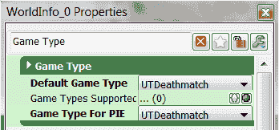

1.  现在，在我们进入 Kismet 之前，我想解释一下我们具体在做什么。使用**Play** | **InEditor**选项启动你的游戏。这样启动的游戏就像在 PC 上看到的那样，所以它不能代表项目在 iOS 设备上的外观，但它将更容易展示以下更改。当游戏出现时，按*Tab*键，你会在屏幕上看到一个黑色条出现。这是控制台窗口，可以用来执行 Unreal 内置的不同命令。我们现在要使用的是切换第一人称和第三人称模式的命令。控制台打开后，输入`behindview 1`并按*Enter*键：

    ### 小贴士

    你也可以按 tilde (`~`)键来访问控制台窗口，它将显示游戏过程中记录的所有内容以及你之前输入的命令。

    .jpg)

1.  如你所见，游戏将你的角色切换到第三人称模式。Kismet 的一个酷特点是我们可以为玩家调用这些命令，这正是我们在这次演示中要做的。

1.  通过点击 UDK 界面主工具栏顶部的**K**图标打开 Kismet 界面。你应该会看到一个新窗口弹出，可能看起来有点令人畏惧，但一旦你知道了所有内容，它就不会太糟糕。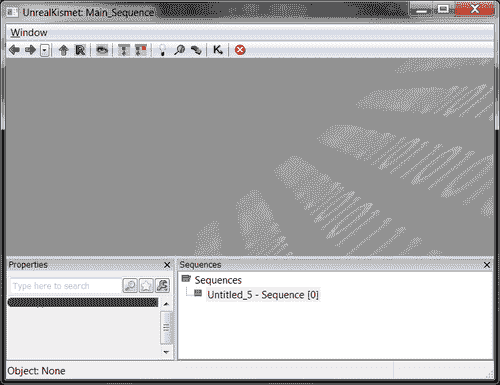

1.  在菜单栏下方，你会看到一个带有许多 1 和 0 的大区域。这是我们的工作区，我们将在这里放置我们创建的所有序列对象。

1.  底部两个栏是**Properties**和**Sequences**窗口。**Properties**窗口将保存我们将在创建的序列对象中设置的所有数据，可以通过左键单击它们来访问。我们这一章的所有工作都在同一个序列中，所以我们不需要使用**Sequences**窗口，但我们将会在第五章 *城市战士的动作序列*中介绍它。

1.  在界面上半部分的大区域中右键单击。从弹出的菜单中选择创建一个**Player Spawned**事件，选择**New Event** | **Player** | **Player Spawned**。

1.  左键单击 **玩家生成事件序列** 对象，以便弹出 **属性** 窗口，并将 **最大触发次数** 的值从 `1` 更改为 `0`。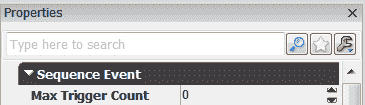

    值为 0 表示它可以被触发无限次。

1.  右键单击在触发器连接（紫色/粉色箭头）下，并选择 **创建新对象变量**。

1.  右键单击，通过从菜单中选择 **新建动作** | **杂项** | **控制台命令** 来创建一个 **控制台命令** 动作。

1.  在属性中，将 `behindview 1` 作为 **Commands[0]** 的值输入。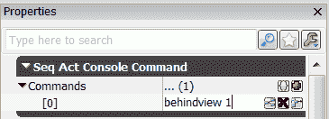

1.  通过单击 **玩家生成** 事件右侧的 **Out** 文本的方块，并拖动鼠标直到它到达 **In** 文本左侧的黑方块，将 **玩家生成** 事件的输出连接到 **控制台命令** 动作的输入。

1.  将 **触发者** 和 **目标** 的连接器连接到我们之前创建的 **对象** 变量。

    到目前为止，你的 Kismet 应该看起来与以下截图相似：

    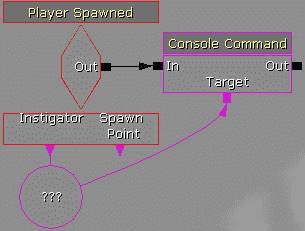

1.  现在通过点击主工具栏上的 **开始移动预览器** 按钮来开始你的游戏。? 你将看到以下截图：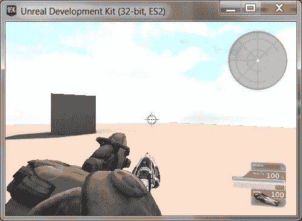

## 刚才发生了什么？

在游戏开始时，当玩家被生成（**玩家生成** 事件被激活）时，我们将视角更改为第三人称（调用 **控制台命令** 动作）。? 我们还学习了一些使用 Kismet 的基础知识，并理解了序列对象如何连接以创建不同的效果。仅使用两个序列对象就能做到这一点，已经很不错了。

# Kismet 入门

在使用 Kismet 的时候，一些术语一开始可能难以理解，所以我将快速概述一些 Kismet 的一般方面。

## 序列对象的部分

我们所工作的每个节点都称为 **序列对象**，因为它是一个序列内的对象。我们将在 第六章 *整合一切* 中更多地讨论序列，但现在让我们谈谈构成 Kismet 节点的部分。

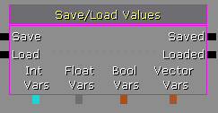

序列对象左侧被称为 **输入**；而右侧被称为 **输出**。以下是一些变量，它们要么是我们给出的值，要么是我们根据对象设置的值。

有四种不同的序列对象，其中三种我们将在这章中使用，我们将在第五章 *城市战士的动作序列* 中使用第四种。以下截图显示了序列对象：

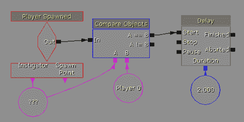

+   **事件**：这是所有其他序列对象被调用的地方。Kismet 中的代码只有在发生某些事情时才会被调用，比如当玩家在我们的级别中生成时调用的**玩家生成**事件。这些对象是红色的，形状像钻石。

+   **动作**：当事件被触发时，这些会执行一个定义的任务。这是最常用的项目，因此它是具有最多变化的对象。**控制台命令**动作，以及之前使用的**延迟**，是动作的例子。动作以矩形的形式呈现。

+   **变量**：这些是我们级别中保存信息的东西。如果另一个序列对象下面有方块，那么这是一个保存变量的位置。它们根据变量实际是什么而有所不同。在**玩家生成**事件中的**发起者**？是一个变量，当它被调用时，会填充我们的玩家信息，并且在之前的截图中的**延迟**变量下的**蓝色**数字是一个值为`2.0`的浮点变量。我们将在第六章 *整合一切* 中广泛使用变量。变量表示为圆形。

+   **条件**：这些动作在比较数字或对象时可以基于不同对象的值做不同的事情。它们用于控制序列中的事物流程。**比较对象**条件是一个条件的例子。条件传统上是蓝色的，并且是矩形的。

# 使用 Kismet 的优缺点

就像任何工作一样，使用适合的工具很重要。UDK 提供了三种给游戏世界添加交互性的方式：Kismet（我们正在讨论的），Matinee（我们将会讨论），以及 UnrealScript（这本书的范围之外，但在*Unreal Development Kit Game Programming with UnrealScript: Beginner's Guide*中得到了非常好的覆盖，作者是 Rachel Cordone，也可以从 Packt Publishing 购买）。三者都有特定的优点和缺点，但 Kismet 是我最常使用的一个。

在阅读这本书并扩展您对 UDK 的研究后，您可能会看到论坛帖子，有人询问如何在 Kismet 中做某事。很多人会回复建议他们学习 UnrealScript。虽然他们可能看起来很傲慢，但他们说使用那个工具的理由也有一些。我列出了 Kismet 的优缺点，这可能会在您决定它是否适合您正在做的工作时有所帮助。

## 使用 Kismet 的优点

Kismet 是一个非常好的工具，当你刚开始使用 UDK 时，它是一个很好的起点。与 Kismet 相关的一些其他好处包括：

+   **降低入门门槛**：无需编程知识，因此更容易开始，你现在就可以开始创建游戏了。

+   **非常适合原型设计游戏机制**：说一个机制会很有趣是一回事，但除非你能证明这一点，否则没有人会相信你。Kismet 使得快速搭建原型变得极其简单。作为一个设计师，有一件东西可以展示给程序员，这将使他们将想法转化为代码变得容易得多。

+   **非常适合一次性事件**：如果你的关卡需要特定的事件，比如爆炸，或者只在特定时间或关卡发生的事件，Kismet 是一个很好的工具。

+   **更容易看到事件流程**：如果你是一个更倾向于视觉思考的人，或者喜欢盯着某物看以了解整体情况，使用 Kismet 会容易得多。序列对象和颜色都代表特定的含义，使得辨别特定场景中发生的事情变得容易。

+   **易于与 UnrealScript 扩展**：了解 UnrealScript 的工作原理后，你可以创建自己的自定义序列对象，以创建你自己的动作。如果你的游戏有一个对话系统，在 Kismet 中创建一个自定义的**显示对话框**动作是可能的，这样就可以轻松地在 Kismet 中创建整个对话树。

## **缺点**

然而，Kismet 并不是 UDK 能做的一切事情的终极解决方案。以下是使用 Kismet 可能遇到的缺点：

+   **复杂性问题**：随着你对 Kismet 越来越熟悉，你可能会尝试用它做更多和更复杂的事情（我知道我就是这样）。如果你不小心，你可能会遇到阅读你的代码实际在做什么的问题。基本上，序列越复杂，阅读起来就越困难。

+   **重复使用**：在游戏中，很多时候你希望在与类似或相同的对象（如门）交互时发生相同的事情。如果你想在多个对象或多个关卡上实现相同的行为，你必须每次都粘贴它。这可能会导致序列对象数量迅速增加，如果用具有相同行为的 UnrealScript 文件编写，并使该对象使用该文件来执行其中的动作，就可以避免这种情况。

+   **特定于关卡**：与 Kismet 一样，它也仅限于创建它的关卡。例如，如果我们想在游戏中创建十个关卡，我们就必须在每个关卡中执行控制台命令事件。使用 UnrealScript，这将内置到游戏代码库中，并对所有关卡自动生效。

+   **Kismet 不能在游戏中做你想做的所有事情**：事实是，Unreal Engine 3 游戏引擎是为了制作**第一人称射击游戏**（**FPS**）而创建的，你偏离这条道路越远，创建你的游戏就会越困难。这并不是说 UDK 不能用来创建其他游戏。只是由于 Kismet 中的序列对象旨在创建 FPS，所以这将会更加困难。

+   **需要更多自定义行为时需要 UnrealScript**：继续前面的观点，大多数时候游戏会做一些 UDK 似乎不会做的事情（比如《蝙蝠侠：阿卡姆疯人院》中的稻草人 BOSS 战，“Plasmids”在《生化奇兵 1》和《2》中，或者《暗黑虚空》中的喷气背包）。这些例子可能使用了 UnrealScript 或 C++代码来实现预期的结果。

+   **Kismet 比 UnrealScript 慢**：虽然在我们现在创建的项目中这不会很重要，因为 Kismet 基本上是按照一定顺序执行的预写 UnrealScript，但 Kismet 比仅使用 UnrealScript 所能达到的速度要慢，而且游戏中持续使用的东西最好用 UnrealScript 来完成。

## 尝试一下英雄——Kismet

控制台命令可以执行很多不同的事情，让你可以访问很多预写的代码，包括打开其他地图（`open levelname`），以及退出游戏（`quit`）。

尝试在开始关卡时让游戏打开另一个地图。

# 定义 Matinee

**Matinee**工具是 Unreal Engine 中所有电影效果的动力源泉。它使用户能够在游戏中成为导演，控制摄像机、演员的动作、声音，以及不同的剪辑和动画效果。想想在 Unreal 游戏中你无法直接控制角色的任何时刻，比如场景。很可能那是在 Matinee 中完成的。然而，Matinee 可以用于许多其他事情，我们将在后面讨论。

为了创建 Matinee，我们将使用（恰如其名）Matinee 编辑器，它可以从 Kismet 菜单中访问。

# 创建您的第一个 Matinee 电影

在定义了 Matinee 的用途之后，让我们开始使用它。

# 行动时间——打开场景

按照现状，当游戏开始时，我们直接进入行动，没有任何预先警告。为了准备玩家并让他们了解他们所在的位置，让我们创建一个场景！

1.  前往**Actor Classes**浏览器**视图** | **浏览器窗口** | **Actor Classes**。从那里，您将看到我们可以放置在我们关卡中的类列表。左键单击**CameraActor**选择。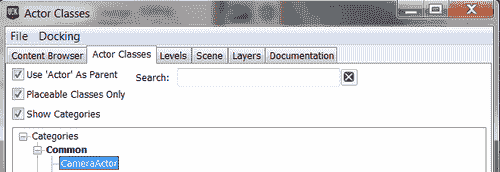

1.  关闭**演员类**浏览器，并在你的级别中任何地方右键单击。从弹出的菜单中选择**在此处创建 CameraActor**。这将创建一个演员在地面上，在你点击的位置。将相机定位在玩家上方并朝向玩家可能是个好主意。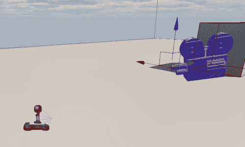

1.  如果它还没有打开，请通过点击 UDK 界面主工具栏顶部的**K**图标来打开 Kismet 编辑器。

1.  通过在界面上半部分的大区域内右键单击并选择**新建 Matinee**来创建一个新的 Matinee。你应该会看到一个橙色方块弹出，带有许多不同的输入和输出。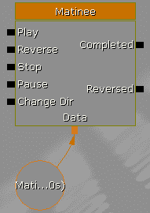

1.  双击对象进入 Matinee 编辑器，如图下所示：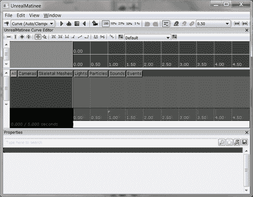

1.  最小化 Matinee 并选择主屏幕上的**CameraActor**，通过左键单击它并打开 Matinee。在**组列表**（位于所有标签下的深灰色列，在时间轴左侧）内右键单击。从出现的**上下文**菜单中，点击**添加新相机组**。当提示输入名称时，键入`Camera`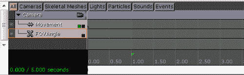

1.  如果你点击**相机**组左上角的相机图标，你会看到**透视**视口变为相机的视角。

1.  如果相机图标没有显示，这意味着相机没有连接到组。要修复此问题，在编辑器中左键单击您的相机，然后返回 Kismet。从那里，在创建的 Matinee 中**相机**文本下方右键单击，选择**使用 CameraActor_0 创建新对象变量**并将其连接到**相机**插槽。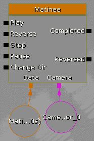

1.  点击**相机**上的**运动**轨道，然后点击时间轴中的第一个关键帧（红色三角形）。你会注意到**透视**视口的底部文本变为**调整关键帧运动 0**。现在，如果你在视口中移动，它将转移到我们创建的相机演员上。一旦你将相机移动到你想要的位置，请点击 Matinee 窗口中的关键帧外部。

1.  在**相机**下方右键单击并选择**添加新导演组**。

1.  左键单击**导演**轨道，然后点击位于**文件**菜单下方（如图下所示，用红色圆圈圈出）的第一个图标**添加关键帧**，以添加一个新关键帧，例如，我们想要在这个位置使用不同的相机。选择使用**切换到组相机**并点击**确定**。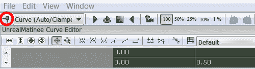

1.  再次在**移动**音轨上左键单击。将时间滑块从**0.00**拖动到**2.00**秒标记，到 Matinee 区域底部的灰色条上，那里有所有的数字。

1.  左键单击**添加关键帧**图标以向我们的电影添加一个新的关键帧。如果一切顺利，您应该会看到以下截图类似的内容：

1.  选择关键帧后，将摄像机拉近玩家。此时，如果您拖动时间滑块，您会注意到摄像机在两秒钟内创建的两个点之间移动。

1.  在时间轴上的其他位置左键单击以取消关键帧的焦点。将鼠标滚轮向下移动以从时间轴中缩出。您会注意到一个指向 5.00 标记的粉红色三角形。该对象标记了 Matinee 序列的结束，因此单击它并将其拖动到第二个标记。

1.  您也可以右键单击它，选择**移动到最长音轨端点**，它将自动吸附到添加的最后一个关键帧。

1.  关闭 Matinee，将 Kismet 重新调回。右键单击我们之前创建的**控制台命令**动作旁边，选择**新建动作** | **切换** | **切换电影模式**。

1.  在**切换电影模式**的属性中，禁用**隐藏玩家**选项。将**目标**连接到我们在上一个示例中创建的**玩家生成**事件的**施动者**。左键单击序列对象，并按*Ctrl* + *C*复制它。

1.  通过按*Ctrl* + *V*粘贴序列对象，并将创建的序列对象移动到 Matinee 的右侧，同时按住*Ctrl*键并拖动，当它被选中时。

1.  通过按住*Alt*键并点击**控制台命令**动作的**输入**和**输出**连接器来移除与**控制台命令**动作的连接。点击并按住*Ctrl*键，将动作拖动到第二个**切换电影模式**动作旁边。将**玩家生成**动作的**输出**连接到第一个**切换电影模式**的**启用**。将那个**输出**连接到 Matinee 的**播放**，将**完成**输出连接到第二个切换电影模式的**禁用**输入，最后，将**切换电影模式**的**输出**连接到**控制台命令**的输入。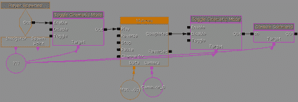

1.  保存您的项目（**文件** | **保存**），然后通过点击主工具栏上的**开始移动预览器**按钮来启动您的游戏。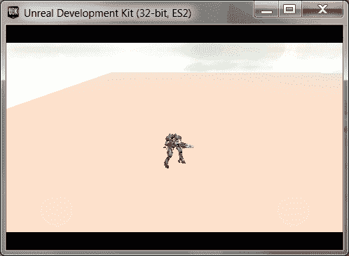

## 刚才发生了什么？

我们在虚幻引擎中创造了第一个电影时刻！现在当我们的游戏开始时，我们会将镜头拉近我们的角色，让玩家为即将到来的动作做好准备。虽然实现这样一个简单的动作可能有些麻烦，但很容易看出使用 Matinee 工具创造许多令人兴奋事物的巨大潜力！

## 英雄试炼——Matinee

你可以轻松地添加更多关键点到此开场戏，并延长其长度到你想要的任何长度。你还可以添加另一个**CameraActor**，在电影进行时切换相机。花些时间在你的关卡中滑行，也许在游戏开始时让玩家旋转。

# 我们的力量结合在一起...

现在我们已经学习了使用 Kismet 和 Matinee 的一些基础知识，让我们来做一些非平凡的例子，看看它们两者结合能做什么。

# 动作时间——创建自动门

如果你的游戏发生在人类居住的地方，那么你很可能会有一个门，作为玩家，我们会被它们吸引以继续关卡。考虑到这一点，让我们创建一个当有人靠近时会自动打开，空时关闭的门。

1.  返回主编辑器窗口，通过**视图** | **浏览器窗口** | **内容浏览器**访问**内容浏览器**。

1.  在**对象类型**选项卡中，勾选**静态网格**选项，因为我们只想看到静态网格。在顶部搜索栏中输入`doorway`。左键点击选定的网格并关闭**内容浏览器**。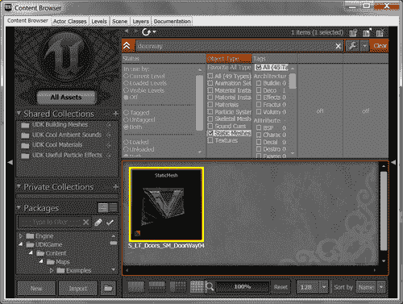

1.  在你的关卡中右键点击，选择**添加演员** | **加载静态网格：S_LT_Doors_SM_DoorWar04**。再次右键点击并选择**添加静态网格：S_LT_Doors_SM_DoorWar04**。

1.  右键点击放置的门并选择**转换** | **将静态网格演员转换为 Mover**。

1.  进入门的属性（*F4*）并在搜索栏中输入`collision`。将底部的**CollisionType**变量更改为**COLLIDE_BlockAll**。

1.  使用第二章*Beginning Urban Warrior; a First Person Shooter*中讨论的**Builder Brush**和**添加几何**，在门的两侧以及顶部创建一个覆盖整个门上方距离的画刷。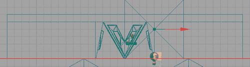

    注意画刷并没有延伸到门那里，如果我们让画刷更大，它将覆盖部分门。幸运的是，有一个简单的方法可以使墙壁与我们要使用的门对齐。

1.  使用**侧视图**并点击看起来像 3D 立方体的按钮进入**几何模式**。点击右侧的画刷并确保你处于平移模式，要么点击看起来像四个箭头交叉的菜单图标，要么按*空格键*直到你看到箭头以进行平移。点击左侧顶部的正方形将其变为红色以便选中，并将其拖动到门的边缘。对另一个画刷做相反的操作。

    我将在第六章“Bringing It All Together”中介绍**几何模式**及其如何用于创建游戏区域，并允许快速原型化游戏区域。

    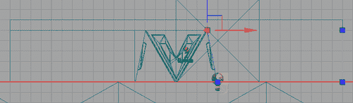

1.  使用**顶部**视口创建一个位于门中间的刷子，门的前后都有空间。右键单击该刷子并选择**Convert** | **ConverttoVolume** | **Trigger Volume?**将刷子转换为触发体积。之后，保存你的地图并点击**Build All**。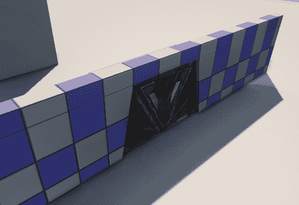

1.  点击我们创建的**触发体积**以选择它，并通过点击 UDK 界面主工具栏顶部的**K**图标打开 Kismet 编辑器。

1.  在界面上半部分的大区域中右键单击。通过从弹出的菜单中选择**New Event using TriggerVolume_0** | **Touch**来创建一个**触发体积触摸**事件。

1.  左键单击**TriggerVolume_0 Touch**事件对象，以便弹出属性窗口，并将**MaxTriggerCount**的值从`1`更改为`0`。

1.  我们希望在门打开和关闭时播放声音，所以使用**NewAction** | **Sound** | **PlaySound**创建两个**播放声音**动作。

1.  进入**内容浏览器**，将你要查找的对象类型更改为**SoundCue**，并将搜索更改为仅**door**。选择第一个 SoundCue **A_Door_Metal03_CloseStartCue**并返回 Kismet。

1.  选择底部的**播放声音**动作。在属性中，你应该看到一个看起来像绿色箭头指向左侧的图标，位于**PlaySound**属性旁边。点击该按钮，它应该将你在**内容浏览器**中选择的值填充到框中。

1.  使用**A_Door_Metal03_OpenStartCue**和顶部的**PlaySound**分别重复从步骤 13 到步骤 14。

1.  返回编辑器，点击门并返回到 Kismet。通过在**触摸事件**旁边右键单击并选择**NewMatinee**来创建一个新的 Matinee 对象。

1.  通过双击 Matinee 进入 Matinee 编辑器。在**组列表**内右键单击并点击**AddNewCameraGroup**。当提示输入名称时，键入`Door`。

1.  在`0.50`位置创建一个关键帧，并选择它后，在**透视**视图中左键单击门。将门移动到左侧，直到它完全离开开口，这样人们就可以通过。

1.  在 Matinee 序列的末尾（指向外的粉红色三角形）右键单击，并选择**MovetoLongestTrackEndpoint**。关闭 Matinee 并重新打开 Kismet。

1.  将两个**播放声音**动作的**目标**连接到我们的 Matinee 序列中的门，这样我们就能听到从门传来的声音。

1.  从 **TriggerVolume_0 Touch** 事件将 **Touched** 输出连接到顶部 **Play Sound** 事件的 **Play** 输入。然后，将 **Empty** 输出连接到底部 **Play Sound** 事件的 **Play** 输入。将顶部 **Play Sound** 的 **Out** 连接到 Matinee 序列的 **Play**。将底部 **Play Sound** 的 **Out** 连接到 Matinee 序列的 **Reverse** 输入。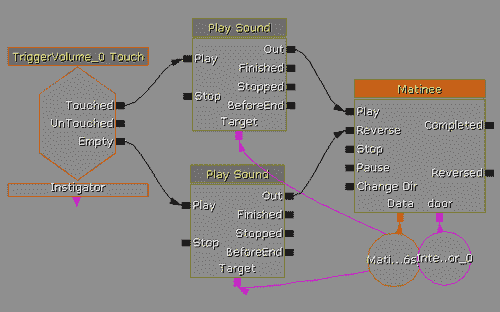

1.  保存你的项目（**文件** | **保存**），然后通过点击主工具栏上的 **开始移动预览器** 按钮来启动你的游戏。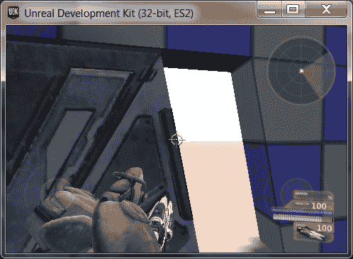

## 刚才发生了什么？

我们在游戏中创建了一个最常用的交互式对象：一扇门。有了这个基本想法，就可以做许多类似的事情，例如移动平台和电梯，以及像使用游戏引擎创建类似 *Rooster Teeth 的 Red versus Blue* 或 Epic 的 *Samaritan* 演示这样的复杂事物。Matinee 还有很多其他功能，但最好是自己探索，通过实验来发现。

# 移动设备上的 Kismet

我们所看到的所有示例都可以，并且已经在 UDK 的正常版本中使用，并且很好地转移到我们的移动 iOS 游戏中。只要游戏类型支持，Kismet 中的大多数事物在移动设备上也能正常工作。自从开始支持移动设备以来，UDK 已经提供了一套针对移动平台的目标序列对象。

# 移动 Kismet—操作

与需要更改 `.ini` 文件或编写 UnrealScript 以接受和响应用户输入的传统 UDK 游戏 不同，UDK 为移动开发者提供了直接在 Kismet 中按自己的意愿做事的能力。这使得开发者能够根据每个级别来更改输入。

## 添加输入区域

**添加输入区域** 在屏幕上显示一个额外的输入区域。区域需要有一个唯一的名称，当使用它们时，其他序列对象将通过它们的 **Zone Name** 属性来引用。我们将在本章后面使用此操作来添加按钮到我们的 UI 中，并学习如何创建不同类型的区域以用于我们的项目。

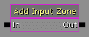

此操作位于 **NewAction** | **Mobile** | **AddInputZone**.

## 清除输入区域

此操作会移除在运行时创建或加载的所有区域。这基本上为你提供了一个干净的画布来构建自己的输入方案。如果你正在创建一个不需要移动或使用与提供的不同移动方式的游戏，这将非常棒。

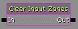

此操作位于 **NewAction** | **Mobile** | **ClearInputZones**.

### 注意

使用此操作也会移除**UberStickMoveZone**和**UberStickLookZone**摇杆输入，只留下**UberLookZoneInput**区域。如果你想在项目中使用它们，请务必将它们添加回来。然而，话虽如此，对于用户来说，最好避免在没有特定目的的情况下使用此事件。如果我们不希望所有级别的默认输入区域的部分都生效，最好修改`DefaultGameUDK.ini`文件的**RequiredMobileInputConfigs**以适应我们的需求。

## 移除输入区域

此操作允许你通过名称移除输入区域；如果你只想在游戏的一定时间点使交互可用，例如保存菜单或用于对话的**说话**按钮，这很有用。**区域名称**属性可以在序列对象的属性中找到。

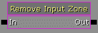

此操作位于**新建动作** | **移动** | **移除输入区域**。

## 保存/加载值

如其名所示，这是通过 Kismet 从硬盘保存或加载 Kismet 内部创建的变量。你可以将多个变量连接到同一操作，允许你拥有尽可能多的变量，但每个变量需要在**变量名称**属性中有一个名称才能保存。我建议你使用相同的操作来加载和保存相同的值。这样，变量的加载顺序将与保存时的顺序相同。如果你有十个整数连接到同一个**整型变量**容器，Kismet 不能保证它决定放置它们的顺序，而使用相同的操作可以节省你很多麻烦。

此操作位于**新建动作** | **移动** | **保存/加载值**。

# 移动 Kismet—事件

从输入区域获取输入，以及使用 iPod 自身的陀螺仪和设备，我们可以利用事件来启用某些功能，以及创建我们自己的**HUD**图形。

## 模拟输入

在 PC、控制台和移动设备上工作，**模拟输入**会在使用你设置的**输入名称**的模拟输入有值时触发。

你可以使用的一些值包括`MobileYaw`和`MobilePitch`，它们从设备的陀螺仪中获取值。这些值将在**浮点值**变量中给出。**DeviceAccelerometerRawData**将在**向量值**变量中返回一个包含`Roll, Portrait Pitch`和`Landscape Pitch`的向量。

重要的是要注意，除非你将**陷阱**输入设置为**FALSE**（通过取消选中它），否则其他任何东西都无法接收任何输入事件，包括触摸。

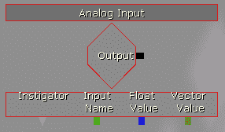

此操作位于**新建事件** | **输入** | **模拟输入**。

## 移动按钮访问

如果你不是引用从 `.ini` 文件中已创建的内容，你将使用 **移动按钮访问** 在 Kismet 中触发内容。这与之前展示的 **触摸** 事件类似。属性 **目标区域名称** 应包含已创建的输入区域的名称。你可以使用一些属性，例如 **仅触摸下发送按下**，它将在你点击按钮时仅调用 **Input Pressed 输出**，以及 **仅触摸上发送按下**，它将在你移除手指时被调用。否则，只要按钮被按下，就会调用该操作。

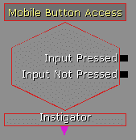

此操作位于 **新事件** | **输入** | **移动按钮访问**。

## 移动输入访问

当设置具有 **移动输入区域** 为 **ZoneType_Joystick** 的输入区域时，会使用 **移动输入访问** 动作。当摇杆被使用时，在每一帧都会调用 **Input Active**，而当摇杆被释放时，则使用 **Input Inactive**。为底部部分创建变量可以让你访问不同的值，你可以使用这些值来解释你打算如何使用数据。**X 轴** 和 **Y 轴** 提供介于 **-1.0** 和 **1.0** 之间的值，其中 **-1.0** 是完全向下或向左，而 **1.0** 是向上或向右。如果你希望更精确，其他四个值提供了摇杆中心和当前位置的像素值。

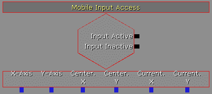

此操作位于 **新事件** | **输入** | **MobileInputAccess**。

## 移动外观

移动外观事件与 **移动输入访问** 事件极为相似，因为它们都具有相同类型的输出，并且与具有 **ZoneType_Joystick** 作为 **移动输入区域** 的输入区域一起使用。然而，**移动外观** 操作将数据转换为表示摇杆当前垂直和水平轴的向量，而不是可以轻松应用于使用 **新动作** | **演员** | **设置演员位置** 的单独值。**偏航?** 代表摇杆在 **Unreal Rotator** 单位中的移动方向，其中 **0** 是垂直向上，旋转按顺时针方向增加。**强度** 表示触摸当前位置到摇杆中心的像素距离。这对于俯视游戏非常有用。

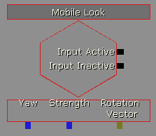

此操作位于 **新事件** | **输入** | **移动外观**。

## 移动对象选择器

**移动对象选择器**是一种简单的方法，用于检查目标对象是否被 **触摸** 输入所接触，前提是它距离玩家 **追踪距离** 内。除非您将 **触摸检查** 设置为 **TRUE**，否则它只会调用一次；然后它将每帧调用一次。像每帧执行动作的任何事物一样，建议设置一个 **重新触发延迟** 为某个值，例如 `0.2`，以减少对硬件的压力。

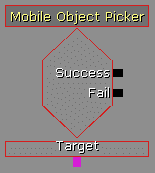

此操作位于 **新事件** | **输入** | **移动对象选择器**。

## 移动简单滑动

**移动简单滑动**事件提供了一种简单的滑动检测形式，根据滑动方向使用不同的输出。**容差**变量可以设置以允许在更直或更弯的线上发生滑动，而**最小距离**变量设置滑动需要多长才能被认为是滑动，以使动作更剧烈或更温和。紫色底部的**触摸演员列表**返回一个对象列表，其中包含在滑动过程中被触摸的所有具有碰撞的演员。

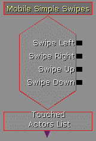

此操作位于 **新事件** | **输入** | **移动简单滑动**。

## 触摸输入

任何用户触摸屏幕时，都视为 **触摸** 事件。输入系统可以通过使用 **触摸索引** 与 **触摸板索引** 来跟踪同时发生的多个触摸，以引用您提供的输入区域值。**触摸 X** 和 **触摸 Y** 将给出它们在屏幕空间中的像素值，**发起者**将指代执行触摸的 **玩家控制器**。您可以选择使用 **按下** 来触发事件，使用 **重复** 来在触摸存在时继续，**释放** 将在玩家从 **触摸** 事件中移除手指时被调用。

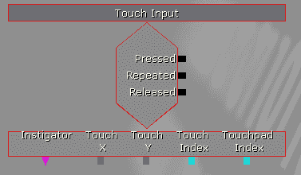

此操作位于 **新事件** | **输入** | **触摸输入**。

### 注意

除非您通过取消选中将其设置为 **FALSE** 来设置 **陷阱输入**，否则在使用此事件时，您将无法使用任何其他输入区域。

## 绘制图像

**绘制图像**操作将 **Texture2D** 图像显示在 **显示纹理** 中，作为某种形式的 **HUD**，供玩家在您的游戏中使用，只要 **激活/是否激活** 设置为 **TRUE**。**XL** 和 **YL** 值用于显示图像应该有多大以显示 **1.0** 表示在相应轴线上填充屏幕 100%。**U** 和 **L** 是要绘制的纹理的左上角的位置。**UL** 和 **VL** 是要绘制的纹理部分的水平和垂直宽度（以像素为单位）。请确保将 **显示颜色** 更改为白色，因为这是它将被调制的颜色。

存在一个名为**已发布全局缩放**的变量，它指定了内容所使用的显示缩放因子。`2.0`的值对于 iPhone 4S 和新 iPad 等高分辨率屏幕很有用，而`1.0`对于 iPad 和较旧的 iPhone/iPod Touch 等标准分辨率屏幕很有用。还值得注意的是，**输出**实际上并没有被调用。

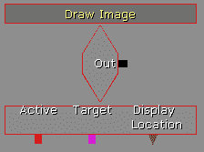

此操作位于**新事件** | **HUD** | **绘制图像**。

### 注意

这将不适用于**UTDeathmatch**游戏类型。我们将利用这一点来制作我们的主菜单，我们将在第七章，*城市战士的高级内容创作*中创建。

## 绘制文本

此事件将在屏幕上显示由**显示文本**提供的文本字符串。请确保使用**内容浏览器**中提供的字体之一设置**显示字体**的值。在屏幕上绘制文本的方式有两种**文本绘制方法**选择；**DRAW_CenterText**，它从**显示位置**变量水平居中文本，和**DRAW_WrapText**，它从**显示位置**开始绘制文本。只要**激活/是否激活**设置为**TRUE**，文本就会显示。**目标**是我们希望显示此信息的玩家，通常将是玩家。

与我们的**绘制图像**事件一样，有一个名为**已发布全局缩放**的变量，它指定了内容所使用的显示缩放因子。**2.0**的值对于 iPhone 4S 和新 iPad 等高分辨率屏幕很有用，而**1.0**对于 iPad 和较旧的 iPhone/iPod Touch 等标准分辨率屏幕很有用。还值得注意的是，**输出**实际上并没有被调用。

### 注意

这将不适用于**UTDeathmatch**游戏类型。我们将利用这一点来制作我们的主菜单，我们将在第七章，*城市战士的高级内容创作*中创建。

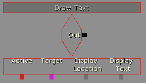

此操作位于**新事件** | **HUD** | **绘制文本**。

# 向该情况输入一些信息

在对不同的移动特定序列对象有了一个基本的概述之后，让我们将这项知识用于一些有用的地方。

# 行动时间——添加输入

目前在我们的游戏中，我们使用提供的两个摇杆来移动和环顾世界。如果你点击屏幕中央，枪会开火，但玩家还可以执行游戏类型中已经预先编写好的其他操作。我们将使用我们刚刚学到的几个新的 Kismet 序列对象，创建按钮，让玩家能够射击、使用替代射击和跳跃。

1.  通过按**K**按钮打开 Kismet 编辑器。

1.  通过右键单击并选择**新建动作** | **移动** | **添加输入区域**来创建一个**添加输入区域**动作。

1.  展开**序列动作移动添加输入区域**选项卡，并将**区域名称**的值设置为**AltFire**。

1.  点击**新区域**远端的蓝色三角形图标，然后点击**移动输入区域**以创建一个我们可以使用的新区域。

1.  展开**区域**选项卡，并将**标题**的值设置为**AltFire**。

1.  展开**输入**选项卡，并将**输入键**的值设置为`GBA_AltFire`。

1.  展开**边界**选项卡，并将**X**的值设置为**-100.0**，将**Y**的值设置为**-300**。

    边界框的**X**和**Y**值，如果为正数，将从屏幕的左上角移动。在任一轴上放置负数将导致**HUD**将显示移动到视口的右下角边缘，这是我们想要达到的效果。我们希望将**HUD**按钮放置在靠近用于扫视的摇杆的右下角，因此我们为每个轴使用负数。请注意，这些值是为 iPhone 设计的；在其他 iOS 设备上使用时需要调整。

1.  展开**渲染**选项卡，并点击**渲染颜色**。将其更改为在您的关卡中易于看到的一些值。我选择了蓝色用于这个关卡。

1.  复制**添加输入区域**动作，并在我们的 Kismet 工作区内部粘贴两个副本。在第一个副本中，将**区域名称**和**标题**变量更改为**跳跃**，并将**输入键**设置为**GBA_Jump**，在**边界**中的位置为（**-200**，**-350**）。对于第二个，将**区域名称**和**标题**变量更改为**开火**，并将**输入键**设置为**GBA_Fire**，在**边界**中的位置为（**-300**，**-300**）。

1.  从**控制台命令模式**的**Out**输出连接我们的**添加输入区域**序列对象，一个接一个。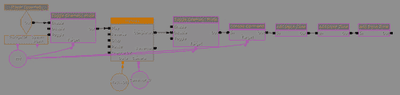

1.  保存您的项目（**文件** | **保存**），然后通过点击主工具栏上的**开始移动预览器**按钮来开始您的游戏。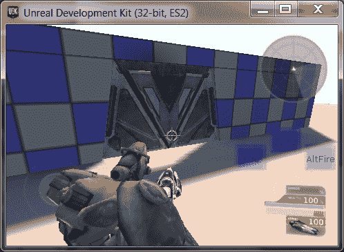

## 刚才发生了什么？

我们现在创建了自己的自定义输入按钮，允许我们跳跃、开火和射击替代开火，同时保留原始移动选项。当我们获得新的武器，如火箭发射器，或者如果我们想为我们的游戏提供某种平台跳跃时，这将非常有用。

## 英雄，尝试一下——移动序列对象/添加输入

使用之前描述的序列对象，创建许多不同类型的游戏将非常简单，包括一个隐藏对象游戏，其中你被给出两张几乎完全相同但略有不同的图像。当你触摸其中一个差异时，它将被隐藏，你将更接近找到所有差异。通过使用**移动对象选择器**事件和**切换隐藏**动作来隐藏我们创建的门对象，当你点击它时。

## 突击测验

1.  以下哪个不是 Kismet 对象类型？

    a. 事件

    b. 动作

    c. 控制台命令

    d. 条件

1.  将最大触发次数更改为 0 会产生什么效果？

    a. 事件将被无限次触发。

    b. 它不再使用，但存在以保持向后兼容性，所以没有效果。

    c. 告诉 UDK 在我们的级别中可能存在多少触发/触发体积。

    d. 事件将不会触发，直到其值更大。

1.  我将使用哪个 Kismet 事件来从 iOS 设备的陀螺仪获取信息？

    a. 触摸输入

    b. 模拟输入

    c. 移动输入访问

    d. 移动简单滑动

1.  我该如何移除我们游戏类型中包含的两个操纵杆？

    a. 清除输入区域

    b. 为每个操纵杆移除输入区域

    c. 修改 DefaultGameUDK.ini 中的 RequiredMobileInputConfigs

    d. 所有上述

1.  我们使用哪种 Actor 来改变玩家的视野？

    a. 玩家生成

    b. Matinee

    c. 视觉 Actor

    d. 摄像机 Actor

# 摘要

在本章中，我们关于 Unreal 引擎 Matinee 中 Kismet 的高级系统学到了很多。我们分别和一起实现了它们，以了解它们如何被用来在我们的游戏世界中创造更有趣和动态的体验。利用这些基本知识，你基本上可以创建任何你想要的类型游戏；可能性是无限的！

在这个短暂的时间内，我们设法覆盖了很多内容。我们具体学习了以下内容

+   什么是 Kismet 以及如何用它来创建基于级别的活动和原型设计

+   如何在运行时调用控制台命令，使我们能够改变到第三人称视角

+   Kismet 应该用于什么，以及为什么我们会或不会决定使用它

+   Matinee 是如何成为 Unreal 引擎的电影工具，并允许设计师在引擎中精确地指示事物的工作方式

+   如何创建一个介绍性场景，将玩家带入我们的世界

+   使用 Kismet 和 Matinee 的方面实现自动门的实现会是什么样子

+   Kismet 在移动平台上的不同之处以及我们从那里获得的额外功能

+   如何使用我们之前讨论的序列对象添加游戏类型中缺失的功能

现在我们已经了解了 Kismet 和 Matinee 的基础知识，我们准备好探索如何将我们对 Kismet 的了解提升到下一个层次，并开始朝着构建我们的 Urban Warrior 项目迈出更多步伐。

在下一章中，我们将通过创建更复杂的系统，如恢复生命值（控制台 FPS 的喜爱）和生成看起来尽可能真实的敌人的行为和位置，来创建一些动态的动作序列。
