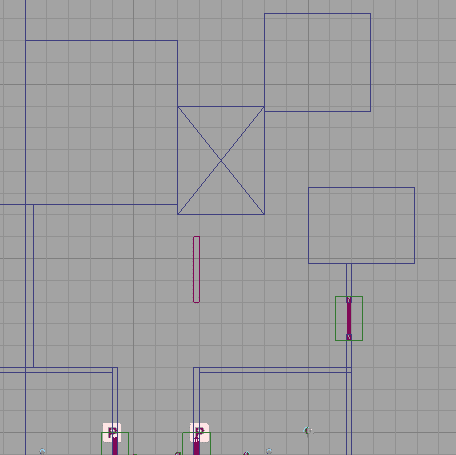

# 第六章.整合一切

> 在上一章中，我们创建了一系列序列和预制件，为我们创建不同类型的资产提供了坚实的基础，并让我们对使用 Kismet 有了更深入的了解，同时介绍了预制件以帮助我们。
> 
> 在本章中，我们将扩展前几章学到的内容，并将“一切整合”以创建我们的游戏，城市战士。

在本章中，我们将涵盖以下内容：

+   设置我们的房间，了解如何调整材质以满足关卡需求

+   学习使用参考和占位符刷子快速原型化关卡的最佳方法，以代替艺术作品

+   讨论使用**几何模式**创建关卡的可能工作流程

+   使用我们已构建的部件构建我们的关卡，复制我们已完成的工作以使构建更快、更流畅。

+   构建不同的战斗场景

因此，让我们开始吧！

# 开始工作流程

当我开始使用 Unreal 时，创建任何类型的新关卡都花费了我很多时间。我会不断放置静态网格来隐藏我遗漏的几何区域，或者添加阻挡体积，以便实际上能够通过某些地方。我遇到问题的关键原因之一是我没有意识到如何创建一个好的工作流程，而在 CSG 中轻松映射事物的关键是**几何模式**。在我们处理那个之前，让我们首先准备好我们的当前关卡。

# 行动时间——开始我们的关卡

我们现在正在从头开始构建我们的关卡，使用我们在前几章中构建的部件。既然我们已经有一个基础可以借鉴，让我们开始我们的游戏。我们可以这样开始我们的关卡：

1.  在编辑器中，选择我们的**PlayerStart**演员。使用平移模式将其移动到我们关卡中第一扇门左侧。

1.  使用**平移模式**将第一个敌人的出生点移动到门前面。演员上有一个小浅蓝色箭头。箭头表示演员面向的方向。考虑到这一点，在旋转模式下旋转敌人的位置，使其背对英雄。

1.  将**PathNode**移动，使第二个敌人正好在它进入的门前面出生（右侧的第二扇门）。

1.  在关卡当前楼层上左键单击，将其向下移动 32 个单位，通过按[*]和[*]键使用网格吸附，直到到达那里。

1.  通过选择**视图** | **世界属性**来更改**世界属性**，将**Kill Z**设置为**-64**，这样我们在碰到地板时就不会死亡。

1.  创建三堵墙来包围我们的英雄起始点，以及在他上方和下方宽度为**32**的屋顶和地板。创建第一堵墙，然后通过按住*Alt*并拖动墙到顶部视图中，将原始墙复制到另一侧。

1.  在门前，将地板沿轴向前移动 64 个单位以创建我们的地板副本。进入**几何模式**，按住 *Ctrl* + *Alt* 键并拖动，直到你在顶部视图中选择左侧的两个顶点。将地板拖动，使其面对门。选择顶部的两个顶点，将其向下拖动，直到它在门前，并对底部做同样的操作。此时，你应该在门前有一个盒子。

1.  右键点击侧面视口并选择**视口类型** | **正面**以将视图放置在正面模式。现在，我们的屏幕应该看起来像以下截图。

1.  在**几何模式**下，选择我们的盒子，并只点击右上角的顶点。从那里使用平移工具将其向左移动 64 度，使其到达顶部其他顶点的同一位置，如图所示：

1.  通过选择**构建** | **构建全部**来构建地图。你应该能看到我们创建的通往房间的斜坡。

1.  通过右键点击并选择**视口类型** | **侧面**来将视口返回到其之前的位置。

1.  在房间中央按下 *L* 键以创建光源。选择光源后，将其放置在房间的 X、Y 和 Z 轴的直中心。打开**点光源 actor**属性，将其半径更改为`512`，并将**衰减指数**设置为`16`。在**灯光组件**中，将灯光颜色设置为浅蓝色，并将亮度更改为`0.6`。按下 *Alt* + *3* 进入无光照模式，直到你准备好查看游戏的光照，但每次更改内容时你都需要重新构建才能正确查看。

    在创建新区域或游戏玩法时，一个好的参考非常重要。在虚幻引擎中，角色默认高度为 96 单位，虽然我们可以创建一个同样大小的盒子或右键点击以获取卷尺进行调整，但我们也可以在关卡中放置一个网格来给我们一个人体比例的概念。请注意，这是 Epic Games 角色的尺寸，但 UDK 并不限制你角色的尺寸。如果你希望创建自己的自定义角色，你可以这样做，但重要的是无论你做什么，都要保持一致性。

1.  进入**内容浏览器**，滚动你的**包**列，直到你可以点击**UDK 游戏**。选择它后，在搜索栏中输入`Iron`，同时在**对象类型**字段中检查**骨骼网格**选项。左键点击**IronGuard 骨骼网格**。在我们的关卡中右键点击，并将对象放置在关卡地面之上。请注意，你可能需要移动网格并调整网格间距以使其恰到好处。以下截图显示了此过程。

    有一个参考是件好事，尤其是如果你试图重现现实生活中的建筑，然而请注意，在游戏中，你通常需要根据游戏玩法和摄像机工作的不同来补偿世界的不同方面。例如，游戏中的走廊通常比实际大两到三倍，尤其是在可以多人玩的游戏中，如 *Left 4 Dead*。

1.  左键单击我们的新演员，并通过单击 *F4* 打开其属性。在搜索栏中输入 `Hidden` 并检查 **Hidden Game** 属性。

    由于我们自己在游戏中，我们不需要看到我们的参考，但是如果你想在准备好之前保留我们的新演员，那就请随意吧。

1.  通过在透视视图中左键单击它们来选择我们房间内的墙壁。

1.  选择房间内的其他墙壁，注意记住门有两个部分和一个顶部。你可以通过按住 *Ctrl* 并单击每个元素或右键单击并选择 **Select Adjacent Walls** 来完成此操作，但此选项也可能选择建筑外的墙壁。还要选择门的内部，按 *Alt* + *W* 隐藏静态网格以选择它们，完成后记得再次按 *Alt* + *W*。

1.  前往 **Content Browser** 并选择要使用的墙壁材质。我个人使用了 `M_LT_Walls_BSP_Recycle06b`，它位于 **LT_Walls** 包中。一旦你左键单击了你想要的材质，就在透视视图中右键单击选定的墙壁，并选择 **Add Material : M_LT_Walls_BSP_Recycle06b**。以下图像显示了已添加到墙壁上的材质：

    现在，你可能注意到材料在放置上可能看起来有点不对劲，它并不匹配；这是正常的，因为这是我们接下来要解决的问题。

1.  按 *F5* 进入 **Surface** 属性菜单。第一步也是最简单的一步是改变我们的对齐方式，以便刷子可以一起工作，这样我们就可以在刷子之间实现无缝过渡。要做到这一点，找到 **Alignment** 属性，点击 **Box** 选择并点击 **Apply**。由于我们的物体实际上形状类似于一个盒子，所以以这种方式应用材质是有意义的，如下面的屏幕截图所示：

    然而，我认为纹理对于我创建的房间来说太小了；这也是一个简单的修复。在 **Alignment** 框上方，还有一个属性区域，称为 **Scaling**。在 **Simple** 选项下选择 `2.0` 并单击 **Apply** 按钮。现在我们的纹理比之前大了一倍。**Scaling** 框在以下屏幕截图中显示：

    

1.  现在，我们已经走上了正确的道路，但我想要将图像向下和向右移动，直到我到达想要纹理所在的确切位置。平移材质就能做到这一点。通过点击按钮调整纹理的**U**和**V**位置，直到你得到你想要的材质位置。我个人将银色部分做成了一种房间的踢脚线。这在上面的截图中有展示：

1.  为你的房间选择一个天花板和地板材质。我个人使用**Material'LT_Floors.BSP.Materials.M_LT_Floors_BSP_Grate_Pipes'**作为天花板材质，**Material'LT_Floors.BSP.Materials.M_LT_Floors_BSP_Organic05b_TileBreak'**作为地板材质。

1.  现在我们已经完成了新的基础房间，点击右侧创建的门并将其删除，对生成的警告回答**是**。

1.  在顶部视图中，按住*Ctrl* + *Alt*键并拖动，直到你选择了我们创建的整个房间。转到**几何**模式，在右上角顶点处右击以改变平移工具的位置。按住*Alt*并拖动项目到右侧，使其位于之前门的位置。右击并选择**变换** | **镜像 Y 轴**，移动房间直到它在我们之前创建的房间前面创建一个房间。删除你可能创建的任何额外的**路径节点**或**玩家起始**演员。

1.  通过选择**构建** | **构建全部**来构建我们的游戏，完成后点击**关闭**。

1.  通过点击主工具栏上的**开始移动预览器**按钮来保存你的项目并开始游戏，当它询问你保存包时，请回答**是**。以下截图显示了我们的屏幕将如何显示：

## 刚才发生了什么？

采纳我们过去的建议，我们的非常简短的场景变得更加有指导性，我们的世界构建使游戏更接近于构建我们的真实游戏。考虑到这一点，我们将能够创建一个更大的环境并完成我们的示例关卡。

# 几何模式

在本书前面我们讨论了构建一个简单的房间，当我们创建第四章中的门时，*使用 Kismet 和 Matinee*，我们开始探索**几何模式**以及我们如何使用它。同样地，我们可以用它快速有效地创建游戏区域。

## 设置工作流程

你可能已经注意到，除了透视视图之外的所有视图中都存在某种网格。我们将使用网格作为创建我们水平面的指南，就像你可以用纸画出东西一样，这是我知道的一些关卡设计师用来获得区域总体感觉的方法。为了构建一个大致的区域，你需要提前计划好——比如你想要如何放置建筑，以及你想要如何引导玩家的移动。

如前所述，在编辑器中按 *[* 和 *]* 键会减少和增加网格吸附点，使你的画笔放置在水平上更详细或更少详细。就本书的目的而言，除非我特别说明，我的网格间距设置为 32。有些人可能想要使用更小的区域，但我认为当我们进行布局时，我们真正关心的是大局和区域的总体感觉。如果你的画笔没有对齐到网格上，你可以右键点击顶点，它会自动将其吸附到网格上。如果你注意到画笔上出现了一个 **X**，这是可以的，但建议你转到 **画笔属性** 并重新应用碰撞。这可以非常有用，尤其是在处理前几章讨论的内容时，以确保你的画笔与现在使用的网格对齐。与网格一起工作是确保你在创建水平时不会出现任何空隙和/或画笔重叠的基本方法。这是确保你的减法画笔按预期工作的另一种方法；然而，如果可能的话，我从不使用减法画笔。

使用 **几何** 模式时需要注意的一点是：在我们再次构建 BSP 画笔之前，你将看不到我们在 **几何** 模式中的任何更改。

### 小贴士

在所有的《虚幻竞技场》游戏（以及我们使用的类似 **UTDeathmatch** 游戏中），1 个虚幻单位等于 2 厘米。这意味着 96 个单位高的角色实际上有 6 英尺高！话虽如此，由于玩家的视野（FOV）原因，按比例建造的东西往往看起来比实际要小得多，但这是从现实生活出发建造时的一个很好的基础。

## 一些键盘技巧

同时按住 *Ctrl* + *Alt* 并拖动可以让你选择包含在内的所有对象。如果你处于 **几何** 模式，这将允许你选择单个/重叠的顶点，让你可以非常容易地增加或减少画笔的大小，这是我们将在下一节中创建建筑时使用的。

另一个有用的技巧是，如果你在视图中按住 *Ctrl* 并拖动鼠标左键，它将移动你从任何位置选定的刷子、演员和/或顶点。这是一种移动可能不在远处或当你不需要移动屏幕且不想使用通常由对象使用的工具的方式。

如果你只是在透视视图中左键点击一个刷子，它将选择物体的面。虽然这对于将材质应用到刷子上来说是可以的，但在其他视图中，它将选择刷子进行编辑。如果你按住 *Ctrl* + *Shift* 并在地图上左键点击，你会注意到你现在将选择你点击的刷子。然而，有时它可能无法选择你认为你选择的刷子，这就是为什么我主要使用顶部和/或侧面视口的原因。

## 看到双重

复制我们已创建的东西，如墙壁或建筑，是一种快速遮挡环境的有效方法。我们在之前的例子中通过复制我们创建的房间来做到这一点。我们最关心的是创建最佳的游戏玩法，所以我们不太关注细节，基本上只想遮挡一个区域，以便我们可以尽可能快地迭代。毕竟，你更愿意去掉一个巨大的盒子，而不是一个荒谬详细的公司大楼。

使用我们创建的刷子，我们可以将关卡交给你的团队的环境艺术家（或者如果你对 3D 建模知识有天赋，就是你），他将把 BSP 刷子转换为网格，放置在我们的关卡中，以赋予我们想要的视觉风格。

在我们的关卡中放置了一个刷子之后，你实际上不再需要建造刷子。除非你正在创建除了盒子之外的东西，你可以直接复制刷子并使用 **几何** 工具对其进行塑形，以快速塑造区域，这通常会使构建过程更快。如果你也觉得可以没有建造刷子，你可以按 *B* 键来切换建造刷子的开关。

# 构建我们的关卡

在了解如何开始工作流程之后，我们现在可以通过构建我们关卡的其他部分来应用这些知识！

# 动手实践——构建我们的关卡

现在我们关卡的开头已经完成，让我们添加简单的建筑和形状，我们可以用我们之前创建的脚本填充它们！这样做如下：

1.  从顶部视口复制我们之前制作的房间中的一个墙壁，通过左键点击它，按住 *Alt* 并将其拖动下来，将顶部端点放置，使墙壁覆盖两个门之间的缝隙。在 **几何** 模式下，抓住两个底部的顶点并将它们向下拖动以创建一个类似正方形的形状，然后在侧面视口中将顶点向上拖动以创建一个建筑。这就是我们的屏幕看起来会是什么样子。

1.  在创建了第一个建筑之后，我们可以轻松地构建其他建筑。通过拖动来复制它，创建三个不同大小的建筑，以形成一个引导玩家向左走的阻挡路径。以下截图显示了这一点。

1.  我们不仅可以扩展和修改刷子，还可以修改体积！通过选择这两个对象并将它们拖动出来，扩展我们的当前**Lightmass 重要性体积**和地板。

1.  左击我们创建的一个预制门，然后在玩家左转后稍远的地方创建另一个门，确保将门降低，使其与地面很好地契合。我们不希望门像之前创建的版本那样伸出去，所以选择顶部六个点并将门拖动过来，之后调整顶部两个点，以创建一个均匀的门。然而，门的 KActor 本身不会改变，所以右击预制门并选择**将 PrefabInstance 转换为普通演员**。从那里，你可以使用顶部和侧面视口作为指南移动门到正确的位置，并在必要时构建以帮助你可视化关卡的外观。

1.  复制建筑，改变高度，将一个放置在新增门北边，另一个放置在它北边，以为玩家打开一个小区域进行探索。这可以在以下顶视图截图中看到。

    注意，我故意在门持有者前面的建筑上做了标记，以向玩家展示有一条可以走的路径，给玩家一种在关卡中做出选择的感觉。

    在这个阶段，玩家可以选择两条路径之一，我们将它们汇聚到一个大区域。创建不同大小和形状的建筑来填充中心庭院，注意使最北边的建筑群中最低，因为那里是我们将引导玩家前往的地方。

    

1.  在庭院的中心，首先创建一个大约 32 单位高的盒子，然后构建地图，然后在透视视图中左击刷子的面。切换到缩放模式并缩小顶部面。如果你构建游戏，你会注意到现在刷子有倾斜。玩游戏以确保你可以在祭坛上上下走动，然后再继续前进。

    高地会吸引玩家到这个位置，而且我们稍后会在那里放置敌人，所以这是一个吸引注意力的好方法。

1.  以与我们为第一个房间创建斜坡相同的方式，为最远建筑物的顶部创建斜坡。我个人创建了一个向前延伸的斜坡，然后是一段直线，然后是另一个斜坡以实现左转。这可以作为一个消防梯，但我们基本上是想让玩家知道去这里，如下面的截图所示：

1.  通过选择顶部两个顶点并向北拖动，然后在右侧选择两个顶点并向东拖动，在北和东方向扩展你的地板和**光量重要性体积**。

1.  创建建筑以形成一个封闭区域，通向一个最终位置，你将保持该位置开放，并且在该位置的网格对齐点为 128 时，宽度为四个网格方格。

1.  在你创建的开放空间中心放置`StaticMesh'ASC_Floor2.SM.Mesh.S_ASC_Floor2_SM_Stairs_Simple_01'`。为其每一侧创建一个斜坡形状以覆盖其侧面。

1.  在你创建的两个斜坡上方创建两个垂直的大柱子。在柱子的顶部放置另一个倾斜的刷子。

1.  为我们创建的入口创建一个天花板和地板。

1.  将我们创建的两个长柱子复制到庙宇内部。

1.  在第二个柱子后面创建一个辅助楼梯和一条通往其升高路径的地板。

1.  在地板前方放置一堵墙，在庙宇的两侧放置墙壁。

1.  在第二段楼梯前放置一个`StaticMesh'NR_Deco.SM.Mesh.S_NR_Deco_SM_FountainTop03'`，在其上方放置`ParticleSystem'Castle_Assets.FX.P_FX_Fire_SubUV_01'`，再上方放置一个聚光灯（通过按*L*键并在视图中点击你想放置的位置），半径为`1024`，亮度为`.3`，颜色为深红色。在**光量**设置中，将光源更改为`32`，并将项目复制到楼梯的另一侧。

1.  现在通过使用`Material'LT_Floors.BSP.Materials.M_LT_Floors_BSP_Dark_TileBreak_02'`为墙壁和`Material'LT_Floors.BSP.Materials.M_LT_Floors_BSP_Organic05b_TileBreak'`为我们的庙宇的地板和天花板进行快速纹理处理。选择所有材料，并对其进行简单的缩放`4.0`。

1.  选择**主要方向光**演员，并将其光颜色更改为深蓝色。

1.  在玩家路径之外但仍在他们的视野内，放置一些`StaticMesh'LT_Mech.SM.Mesh.S_LT_Mech_SM_CityNoRing01'`演员来为我们的关卡创建场景。请注意，这个网格是为 PC 多人游戏《虚幻竞技场 3》创建的，并且根本没有针对移动游戏进行优化。话虽如此，不要在关卡中放置超过四个，否则在测试时游戏会真的开始变慢。下面的截图显示了完成后的关卡的样子：

## 刚才发生了什么？

我们的水平现在有一个清晰的开始、中间和结束。玩家需要前往的目标以及一些背景和灯光效果都是可见的。现在我们只需要添加我们的交互元素，我们的游戏就完成了！

## 尝试一下英雄——增益和武器拾取

级别设计师拥有的一个工具是奖励玩家走特定的路线。促进探索并为玩家提供出去的理由会使你的关卡更加有趣。在**Actor**类别的标签页中有一个名为**UTPickupFactory**的类，它有**健康**和**武器**拾取。试着在你的新创建的关卡中放置一些好东西。我个人在通往寺庙的区域放置了一个火箭发射器。

# 战斗场景

由于我们实际上在制作一款第三人称射击游戏，因此我们希望在游戏中拥有不同的战斗场景是有意义的。完成我们关卡布局后，我们现在将添加使我们的关卡生动起来的东西！我们在上一章中讨论了敌人的创建以及关于战斗场景的建议，所以现在我们将根据这些课程来创建我们自己的游戏。

# 行动时间——第一个战斗场景

我们将使用触发体积来生成敌人，并让他们在你的环境中互动。这可以按照以下步骤进行：

1.  在编辑器中，复制通向第二个区域的门的上半部分，并将其移动，使其前面与我们一起创建的分割建筑相连。右键单击演员，选择**转换** | **转换为体积** | **触发体积**。之后，转到侧面视口并调整底部顶点，使其接触到地板。提示：按下*Alt* + *W*将使之前放置的静态网格消失。下面的截图显示了这一点：

1.  复制我们刚刚创建的触发体积，并将其直接放置在这个体积的上方。这样，无论玩家选择哪个方向前进，都会发生一些事情。

1.  我们将在我们创建的两个路线的每个后面放置两个路径节点，以及在中间放置两个路径节点。我们将要做的是，当玩家触碰到这些触发器中的一个时，生成两个敌人，这两个敌人将沿着玩家最初选择的路径移动，如下面的截图所示：

    左键单击我们创建在顶部的触发体积，打开 Kismet。通过从弹出菜单中选择 **使用 TriggerVolume_5 新建事件** | **触摸** 创建一个 **触发体积触摸** 事件。

1.  左键单击我们创建在底部的触发体积，打开 Kismet。通过从弹出菜单中选择 **使用 TriggerVolume_6 新建事件** | **触摸** 创建一个 **触发体积触摸** 事件。

1.  通过右键单击并选择 **新建动作** | **切换** | **切换** 来创建一个 **切换** 动作。将 **事件** 链接连接到 **TriggerVolume_5 Touch** 动作的最顶部。将 **TriggerVolume_6 Touch** 动作的 **Out** 输出连接到这个切换动作的 **关闭** 输入。

1.  创建另一个切换动作，如果调用此动作，则关闭另一个动作。以下截图显示了到目前为止我们所做的工作：

1.  对于每条路径，通过选择 **新建动作** | **设置变量** | **对象** 创建两个设置 **对象** 动作。在 **值** 变量链接下放置我们创建的两个顶部路径节点到顶部触发器，底部两个到另一个。不用担心目标，我们将在后续步骤中处理。

1.  将我们之前创建的 **EnemyAI** 子序列复制粘贴两个副本，紧挨在一起。将第二个 **设置对象** 变量输出的 **Out** 连接到第一个 **EnemyAI** 对象的 **In**，第一个的 **Spawned** 输出连接到第二个的 **In**。为每个节点在 **Spawned** 链接下方创建一个对象变量，并将我们放置在玩家视线之外的路径节点作为两个对象的出生点。

1.  通过右键单击并选择 **新建动作** | **AI** | **移动到演员** 创建一个 **移动到演员** 动作。在 **目标** 变量链接下方连接我们创建的第一个已生成对象。在 **目的地** 创建一个 **对象** 变量并将其连接。将 **EnemyAI** 动作的 **Spawned** 输出连接到 **移动到演员** 动作的 **In** 输入。此外，在第五步中讨论的 **设置变量** 动作中，将每行第一个对象的 **目标** 变量链接连接到该对象。

1.  现在创建第二个 **移动到演员** 动作，使用第二个 **EnemyAI** 的 **Spawned** 变量链接作为 **目标**，并在 **目的地** 链接下创建一个新的 **对象** 变量，将其设置为每条路径中第二个 **设置对象** 的 **目标**。

    在这个教程的某个时候，您可能会在项目中看到问题或错误，内容大致如下：**SeqAct_ActorFactory_0 没有出生点！**在这种情况下，进入 Kismet，找到那个问题节点，双击以在编辑器中选择它，然后双击它包含的 **敌人 AI 序列**。在 **演员工厂** 动作中点击加号图标以向出生点列表添加新项目，如果尚未填写，请点击指向左边的箭头以使用我们选择的对象填写值。退出子序列，并将之前附加到它上的项目再次连接起来。下次运行您的游戏时，它应该会再次开始工作。

1.  通过选择 **构建** | **构建全部** 来构建我们的游戏，完成后点击 **关闭**。

1.  保存您的项目，然后通过在主工具栏上点击 **开始移动预览器** 按钮来开始您的游戏。游戏的预览应该看起来像以下截图：

## 刚才发生了什么？

只需一点努力，我们就可以轻松地在游戏中创建第二个战斗遭遇，它会根据玩家的行为进行调整。

## 尝试一下英雄——创建自己的战斗遭遇

下一个部分我将留作空白区域，供您创建一些自己的战斗遭遇。您可以放置一些掩体，或者交替使用武器。尽量想一些真正能让别人说“哇！”的东西。

# 行动时间——关卡结束

我们将使用触发体积来生成敌人，并让他们在您的环境中交互。

1.  在我们之前创建的寺庙前面放置一个触发体积。在寺庙后面以及第二个柱子后面，在玩家的视线两侧放置路径节点。这在上面的视口截图中有显示：

    这就是游戏中的样子。

    

    ### 注意

    按下 *P* 键以查看由路径节点创建的路径。如果您在两组节点之间看不到任何线条，您可能需要放置一个或两个额外的节点，以确保敌人的路径布局正确。

1.  在我们的触发体积上左键单击，并在 Kismet 中创建一个 **触发体积触摸** 事件。

1.  将前一个示例中的两个 **EnemyAI** 和 **移动到演员** 动作复制并粘贴，并将其连接到 **触发体积事件**。

1.  删除出生点链接，并用寺庙顶部的两个节点替换它们。删除 **移动到演员** 事件中的 **目的地** 链接，并让它们前往前方的路径节点。

1.  复制您的触发体积并将其放置在寺庙的山顶上。创建一个带有 **控制台命令** 事件的触摸事件，提示输入 **quit**。

1.  通过选择 **构建** | **构建全部** 来构建我们的游戏，完成后点击 **关闭**。

1.  通过点击主工具栏上的**开始移动预览器**按钮保存您的项目并开始游戏。

## 刚才发生了什么？

我们创建了一个新的战斗场景，其中敌人跑进掩护处，使自己变得脆弱，同时让玩家知道他们的位置。我们还创建了一个级别的终点，使我们能够完成游戏。以下截图显示了这一点：

## 突击测验

1.  在不使用网格吸附的情况下创建级别有哪些问题？

    a. 我们几何中的洞。

    b. 重叠笔刷。

    c. 确保减法笔刷能正确工作。

    d. 以上所有。

1.  你使用哪些键来增加或减少网格吸附？

    a. + 和 。

    b. 左右箭头键。

    c. [和]。

    d. （和）。

1.  是否有可能将事件的最大触发次数设置为 0（可以触发任意多次）而不再触发？如果可能，我该如何做？

    a. 错误，我们不能切换事件的开关。

    b. 错误，最大触发次数必须是正数。

    c. 正确，我们可以切换事件的开关。

    d. 正确，这是自动完成的。

# 摘要

我们现在已经到达了本书游戏开发部分的结尾。现在你有很大的空间来使你的项目变得独特，添加新级别，并探索虚幻引擎的不同方面；我们已经为真正令人惊叹的游戏奠定了基础。

在这短暂的时间内，我们设法覆盖了很多内容。我们特别学习了：

+   如何设置我们的房间，了解调整材质以适应级别需求

+   使用参考和占位符笔刷快速原型化级别的最佳方法，以代替艺术作品

+   使用**几何**模式创建级别的可能工作流程

+   如何使用我们已构建的部件来构建我们的级别，复制我们已完成的工作，以使构建更快、更流畅

+   不同战斗场景的实现

现在我们已经学会了如何构建级别并创建了所有的游戏部分，在下一章中，我将向您展示如何添加主菜单以及播放声音，将自定义内容集成到您的游戏中，讨论优化，并在我们将其上传到 App Store 之前尽可能多地调试您的 iOS 游戏项目！
