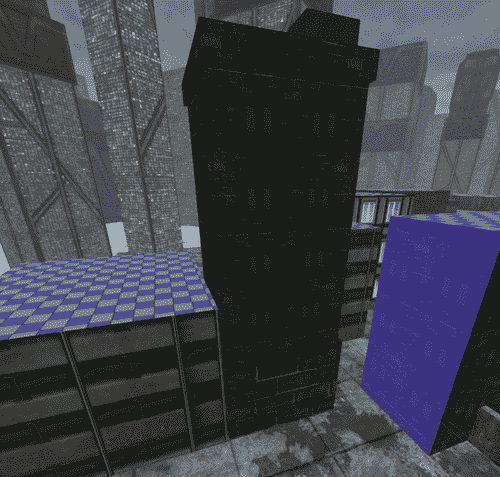

# 第七章。城市战士的高级内容创建

> 由于我们上一章完成的游戏关卡，我们现在有一个经过测试的关卡，我们知道它非常有趣。现在我们有一个很好的基础可以在此基础上构建，我们可以为我们的游戏创建自己的内容，以定制它并使游戏真正属于你自己。

在本章中，我们将讨论以下内容：

+   为我们的游戏创建带有输入的主菜单

+   在移动 UDK 上为我们的游戏添加音频

+   将自定义纹理导入我们的游戏

+   为 PC 和 iOS 创建材料

+   在移动 UDK 上为我们的游戏添加静态网格

+   关于 iOS 优化和调试的一些技巧

我将在本关卡中带入游戏中的资源将在 Packt Publishing 网站上提供，但根据本章提供的信息，应该相当容易创建你自己的资源并将其带入游戏。话虽如此，让我们开始吧！

### 小贴士

**下载示例代码**

你可以从你购买的所有 Packt 书籍的账户中下载示例代码文件。[`www.packtpub.com`](http://www.packtpub.com)。如果你在其他地方购买了这本书，你可以访问[`www.packtpub.com/support`](http://www.packtpub.com/support)并注册以直接将文件通过电子邮件发送给你。

# 主菜单环境创建

虽然直接进入游戏动作很方便，但大多数游戏都有某种类型的菜单。这也会是一个很好的方式来展示我们如何在做一些不同的事情之前使用我们已经覆盖过的方面。

# 构建主菜单背景的时间

当然，大多数游戏中的菜单看起来像是有特殊的东西，但实际上它们只是一个新关卡。要构建主菜单背景，请执行以下步骤：

1.  首先，让我们打开之前在第三章中使用的地图，“提升至新水平；内容丰富”。选择天空穹顶和创建的两个方向光源，通过按*Ctrl+C*复制它们，这在上面的截图中有展示：

1.  通过选择**文件** | **新建..**并选择**空白地图**模板来创建一个新的关卡。将对象粘贴到你的关卡中。

1.  右键单击左侧工具栏中**刷子**文本直接下方的**立方体**图标。在构建刷子的设置中勾选**空心**选项。这将创建一个空心立方体。点击**构建**按钮，然后通过点击我们之前在第二章中使用的**CSG_Add**选项或使用*Ctrl+A*将几何体添加到我们的关卡中。

1.  将相机移入盒子内部，通过右键单击并选择 **新建角色** | **新建玩家开始** 来创建一个 **玩家开始** 角色对象。如果对象上有红色 **X**，则移动对象，直到其四周都有足够的空间，以便在那里生成玩家：

1.  通过访问顶部菜单并选择 **查看** | **世界属性** 来访问 **WorldInfo 属性**。在 **游戏类型** 部分设置 **默认游戏类型** 和 PIE 的 **游戏类型** 为 **MobileMenuGame**。

1.  通过从实际游戏关卡复制粘贴或在内置浏览器中找到 `StaticMesh'LT_Mech.SM.Mesh.S_LT_Mech_SM_CityNoRing01`，以使它们在所有角度都有建筑物的样子，将两个对象放置到你的游戏世界中：

1.  通过选择 **查看** | **浏览器窗口** | **角色类** 来访问 **角色类** 选项卡。选择在 **通用** | **CameraActor** 中找到的 **CameraActor** 并退出建筑。通过右键单击并选择 **在此处添加相机角色** 来创建一个相机。将相机放置在区域中间，略微倾斜朝向天空。特别是要确保你看不到我们之前创建的空心盒子。如果你更容易将其移开，请随意操作。

1.  按下 *F4* 以访问相机角色的属性。在 **运动** 部分将 **物理** 属性更改为 **PHYS_Rotating**。选择 **旋转速率** 的 **偏航** 部分，并将其设置为 `20`。这种特殊的物理类型将使角色沿着旋转速率移动，但无法执行其他操作。这对于我们的主菜单来说会很棒，因为我们只想有一个漂亮的背景效果出现。这就是相机角色属性窗口的显示方式：

1.  在我们的关卡创建完毕且已选择 **CameraActor** 后，让我们进入 Kismet。创建一个 **关卡加载事件**（新建 **事件** | **关卡加载**）。在其右侧创建一个新的 Matinee，通过右键单击并选择 **新建 Matinee**。将 **关卡加载** 事件的 **已加载** 和 **可见** 输出连接到 **Matinee** 的 **播放** 动作，并双击 **Matinee** 进入 Matinee 编辑器。

1.  通过右键单击并选择 **添加新相机组** 来创建一个名为 `Turning Camera` 的相机轨迹。然后通过右键单击并选择 **添加新导演组** 来创建一个新的 **导演组**。在 Matinee 序列的开始处添加一个 **关键帧**，并在出现的 **切到组** 选项中选择 **Turning Camera**。关闭 Matinee 编辑器。

1.  在 Kismet 中返回，选择 Matinee 对象并确保已勾选 **循环** 选项。退出 Kismet。

1.  创建一个**光子重要性体积**来覆盖玩家周围的区域，包括建筑物。同时确保灯光不在任何建筑物内部，如果需要，请移动它们。

1.  通过选择**构建** | **构建全部**来构建我们的游戏，完成后点击**关闭**。

1.  通过点击**开始移动预览器**按钮保存您的项目并开始游戏。您的屏幕应该看起来像这样：

## 刚才发生了什么？

现在我们看到城市景观，随着摄像机以恒定速度移动。这将是我们标题屏幕的一个很好的背景，以此为基础，我们可以构建我们的主菜单。

# 导入纹理

移动图形硬件与不同的格式一起工作，并且与普通 PC 图形硬件处理纹理的方式不同。通过采取必要的预防措施并相应地创建纹理，可以避免许多障碍。现在，我绝不是艺术专家，但我会简要介绍一些如果你决定为 iOS 自己制作纹理时应该遵守的事情。

在创建自己的纹理时，重要的是使图像的大小为 2 的幂，例如 256、512、1024 和 2048。计算机为了效率的目的以“块”处理数据。在游戏内容创建中，尤其是在移动设备上，如果纹理不是 2 的幂，Unreal 将会浪费时间和处理资源来修复这个问题。实际上，2 的幂规则的本质是优化，尽可能高效和“轻量”，同时为用户提供适当的视觉体验。当与 iOS 一起工作时，硬件纹理的大小可以达到 2048 x 2048，但请谨慎使用。这对于针对低端设备（如 iPhone 3GS、iPad 1 和 iPod touch 第 4 代）的游戏尤其重要，这些设备只有 256MB 的 RAM。

支持以下纹理格式：`.bmp, .pcx, .png, .tga, .float`和`.psd`。

# 动手实践——完成主菜单

话虽如此，让我们将第一个纹理导入到游戏中：

1.  通过选择其图标或转到**视图**菜单并选择**视图** | **浏览器窗口** | **内容浏览器**来打开**内容浏览器**。在窗口底部的菜单中点击**导入**按钮。找到您想要导入到游戏中的图像并选择**打开**：

1.  将出现一个导入对话框。在**包**部分输入名称`UW-MainMenuPKG`并确认`logo`在**名称**部分。你应该会回到**内容浏览器**，在那里你会看到我们的新包，包含一个新文件：

1.  在左侧工具栏的**包**部分下方的**新包**选项中，右键点击我们刚刚创建的包，并选择**保存**以将包保存为文件。经常保存东西是很重要的，以确保你不会丢失你的工作：

    关闭**内容浏览器**并返回到 Kismet。通过右键点击并选择**新事件** | **HUD** | **绘制图像**来创建一个**绘制图像事件**。在其属性中，选择**显示颜色**为白色。在**显示位置**部分，将**X**值设置为`.25`。将**XL**和**YL**设置为`0.5`，将**UL**和**VL**设置为`512`。需要注意的是，这个 Kismet 事件没有提供进行适当缩放以适应不同宽高比选项，因此更复杂的标志可能会被压扁，所以请调整这些值直到找到适合你的设置。勾选**是否激活**复选框，并将**授权全局缩放**更改为`1.0`。转到**内容浏览器**，左键点击我们的标志图像。在**绘制图像**属性中，点击**显示纹理**选项旁边的绿色箭头，以便在世界上设置我们的标志图像。通过右键点击并在**目标**下方选择**新变量** | **玩家** | **玩家**来放置一个 Player 0 变量。在**玩家**变量中，取消勾选其属性中的**所有玩家**复选框。以下截图显示了我们所做的几个更改：

    

1.  通过点击**开始移动预览器**按钮保存你的项目并开始游戏。这就是预览将看起来像什么：

    现在我们有一个在游戏开始时跟随我们的标题，但到目前为止，没有任何动作发生，也没有正确开始游戏的方法。接下来我们要做的是在屏幕中间放置一些文字，上面写着“**点击任何地方开始**”，然后创建一个按钮，点击后可以打开我们的主游戏关卡。了解我们的计划后，我们现在就来做这件事！

1.  通过转到**视图**菜单并选择**视图** | **浏览器窗口** | **内容浏览器**来打开**内容浏览器**。在**对象类型**部分，将选项卡从**收藏夹**更改为**所有类型**，并勾选**字体**。在搜索栏中输入`36`，并左键点击底部特定的字体，即`Font'UI_Fonts.Fonts.UI_Fonts_Positec36'`。选择它后，打开 Kismet。

1.  返回 Kismet，通过在 **Draw Image** 事件旁边右键单击并选择 **New Event** | **HUD** | **Draw Text** 来创建一个 **Show Text** 事件。在 **Properties** 部分点击 **Display Font** 旁边的绿色箭头来设置我们将要使用的字体。将 **Display Color** 改为白色。在 **Display Location** 中将 **X** 设置为 `.5`，**Y** 设置为 `.75` 以直接位于我们的图像下方，**Z** 设置为 `0`。在 **Display Text** 部分键入 `Tap anywhere to begin!`。将 **Text Draw Method** 改为 **DRAW_CenterText** 并勾选 **Is Active** 复选框。将 **Authorized Global Scale** 改为 `1.0`。在 **Target** 下方通过右键单击并选择 **New Variable** | **Player** | **Player** 来放置一个 Player 0 变量，并在其属性中取消勾选 **All Players** 复选框。我们所做的几个更改在以下屏幕截图中可见：

1.  在 **Draw Text Event** 的 **Active** 部分下方创建一个布尔变量，通过在单词下方的方块上右键单击并选择 **Create New Bool Variable** 来实现。通过选择它及其相关对象，并按住 *Ctrl* 键拖动鼠标左键来移动我们刚刚创建的 Matinee Sequence 到 **Level Loaded** 事件中。在 **Level Loaded** 事件右侧通过右键单击并选择 **New Action** | **Toggle** | **Toggle** 来创建一个新的 **Toggle** 动作。将 **Loaded and Visible** 输出连接到 **Toggle** 的 **Toggle** 输入。将 **Toggle** 的 **Bool** 输入连接到我们的 **Draw Text** 动作的布尔值。将 **Toggle** 事件的 **Out** 连接到其 **Toggle** 输入，并在 **Out** 输出上右键单击，然后点击 **Set Activate Delay** 并将其值设置为 `0.1`，如以下屏幕截图所示：

1.  现在我们有了闪烁的文本提示玩家点击按钮，我们为什么不创建一个可以响应玩家触摸的按钮呢？断开 **Level Loaded** 事件的 **Loaded and Visible** 输出与 **Toggle** 事件的 **Toggle** 输入之间的连接，将其移到右侧，并通过右键单击并选择 **New Action** | **Mobile** | **Add Input Zone** 来创建一个 **Add Input Zone** 动作。将 **Zone Name** 设置为 `StartGame`。点击 **New Zone** 旁边的蓝色小三角形来创建一个新的 **MobileInputZone**。在您刚刚创建的 **Zone** 中，在 **Bounds** 部分将 **Authored Global Scale** 设置为 `1.0`，将 **Size X** 和 **Size Y** 设置为 `1.0`，并勾选 **Relative Size X** 和 **Relative Size Y** 复选框，如以下屏幕截图所示：

    现在我们已经创建了一个按钮（它是不可见的，所以你看不到它，但我向你保证它在那里），我们应该着手创建一些当它发生时的交互。

1.  通过右键点击并选择 **新建事件** | **输入** | **移动按钮访问** 来创建一个 **移动按钮访问** 事件。在 **目标区域名称** 下的 **Seq Event Mobile Zone Base** 属性中，放入我们之前创建的区域，`StartGame`。在 **序列事件** 部分将 **重新触发延迟** 改为 `1.0`。在 **序列对象** 属性下的 **Obj Comment** 中输入 `Pressed`，然后勾选 **输出对象注释到屏幕** 复选框。

    在 Unreal 编辑器内部，无法打开其他关卡，但在实际游戏中是可行的。这只是为了验证按钮确实对我们有效。

1.  通过右键点击并选择 **新建动作** | **杂项** | **控制台命令** 来创建一个 **控制台命令** 动作。在 **[0]** 下的 **命令** 部分输入 `open levelname`，其中 `levelname` 是你想要加载的关卡名称。在 **控制台命令** 的 **目标** 下方创建一个 **玩家 0** 变量。记住，当你准备好发布游戏时，请移除你创建的注释。

1.  保存你的项目，并点击 **开始移动预览器** 按钮来开始你的游戏。预览将类似于以下截图：

## 刚才发生了什么？

这样，我们就创建了一个主菜单，当我们点击屏幕时，会进入我们的游戏关卡，为我们的游戏创造一个专业的开始。

# 添加声音

许多人认为理所当然的事情，声音，当人们在玩你的游戏时，可以产生巨大的影响。为了让你体验一下将声音添加到游戏中的简单性，让我们在游戏开始时添加一个声音。

然而，尽管添加声音到我们的游戏中很简单，但在 iOS 设备上播放声音却相当困难——因为它需要大量的计算，因为 iOS 设备一次只能播放一个声音；这是因为播放的声音是不压缩的。这与你在电脑上听的音乐（除非你是音响发烧友）不同，音乐是以 MP3 等格式压缩的，它使用压缩算法来保持文件大小小。然而，不压缩的声音使得文件变得很大。在同一个帧中初始化多个声音可能会导致很多性能问题。如果你能帮忙的话，最好不要同时播放多个声音。话虽如此，你仍然希望将它们尽可能缩小。在 iOS 上使用 22 kHz 声音而不是 44 kHz 声音是一个简单的方法，可以获取到很多本应用于处理声音文件的性能。考虑到 iOS 设备的典型用途要么是通过设备上糟糕的扬声器，要么是通过糟糕的耳机，你可以通过最小的声音差异获得很多性能提升。

# 动作时间——播放音效

我们想让玩家知道我们已经理解了他/她点击开始游戏的行为。让我们播放一个声音来向他/她展示我们知道。我们可以这样做：

1.  通过选择其图标或转到**视图**菜单并选择**视图** | **浏览器窗口** | **内容浏览器**来打开**内容浏览器**。在窗口底部的菜单中单击**导入**按钮。找到你想要带入游戏的声音并选择**打开**。在弹出的窗口中设置与刚刚创建的包名相同的包，并在选项菜单中打开选项卡并勾选**自动创建提示**，然后单击**确定**，如果询问你是否导入整个包，请回答是。

1.  在**内容浏览器**的左侧右键单击包名，通过在菜单中选择**保存**来保存我们的包。左键单击**声音提示**对象并退出到 Kismet。

1.  在 Kismet 中，通过按住*Alt*并单击连接到**Mobile Button Access**事件的线条，将我们之前创建的**Console Command**动作断开连接，并按住*Ctrl*并拖动将其移动到右侧。在可用空间中，通过右键单击并选择**新建动作** | **声音** | **播放声音**来创建一个**播放声音**动作。在**播放声音**动作的属性中，单击**播放声音**属性中的绿色箭头将其设置为创建的声音。将**Mobile Button Access**事件的**Input Pressed**输出连接到**播放声音**动作的**播放**，并将**播放声音**动作的**Finished**连接到**Console Command**事件。你的屏幕应该看起来像以下截图：

1.  通过单击**开始移动预览器**按钮保存你的项目并开始你的游戏。

## 刚才发生了什么？

现在每次我们点击屏幕时，我们的菜单都会创建一个声音！

# 自定义声音

注意，我现在处理声音的方式并没有考虑到声音在空间中的位置。由于声音将直接在播放器处播放，所以这并不重要，但如果你想要的话，你可以通过在**内容浏览器**中右键单击**SoundCue**并选择**使用 SoundCue 编辑器编辑**来编辑**SoundCue**。

SoundCue 编辑器与 Kismet 非常相似，除了只有当它被播放时才会调用事件，这通过一个扬声器图标表示。**衰减**功能可以应用于事件，以便将给定的声音放入世界空间，而不是总是保持相同。然而，这仅适用于单声道声音。

一旦设置好，你就可以将 SoundCue 拖放到关卡中，进入游戏世界。所以如果你想在关卡中通过这种方式添加声音效果，欢迎尝试，当你绕着关卡走动时，声音会根据你在游戏世界中的位置而变得更响或改变位置。这里还有很多其他功能可以查看，例如随机化器，但我们在这里只播放一个简单的声音。在你自己的时间里尝试一下，或者查看 Epic 为 UDK 提供的 Sound Cues，看看你可以做些什么，比如添加调制和变化到声音中，就像枪声根据你在游戏世界中的位置而有所不同一样，当你开火时。享受这个过程吧！

# 添加音乐

与声音类似，在 iOS 上音乐的处理方式与在 PC 上略有不同。由于手机通常是媒体播放器，它们有专门用于高效播放音乐的硬件，但移动平台在功能上也有所限制。让我们首先在我们的关卡中添加一些音乐。

# 添加背景音乐轨道的时间——操作步骤

现在，移动设备有专门用于压缩声音的音效硬件。iOS 设备可以一次播放一个压缩流，几乎没有成本，所以我们的任务就是创建适合这种环境的音乐。然而，MP3 文件在 Unreal 的 PC 版本中既在编辑器中也在主游戏中都不适用，所以我将向你展示如何在编辑器中添加音乐。我们可以这样做：

1.  打开 Windows 资源管理器并打开你的 `UDKGame\Build\iPhone\Resources\Music` 文件夹。这个文件夹是你需要放置任何你希望在游戏中播放的 MP3 文件的地方。为了这个示例，我们将使用 UDK 中已包含的文件，但你可以随意放入你喜欢的任何 MP3 文件，并且每当我说 `Jazz_Menu_01` 时，请输入你文件的名称。音乐文件夹看起来如下截图所示：

1.  通过选择其图标或转到 **视图** 菜单并选择 **视图** | **浏览器窗口** | **内容浏览器** 来打开 **内容浏览器**。在 **内容浏览器** 中，将 **对象类型** 更改为 **声音提示** 并在窗口顶部的文本框中输入 `music`。左键单击第一个项目 `SoundCue'A_Music_GoDown.MusicSegments.A_Music_GoDown_Ambient01Cue'` 并进入 Kismet。以下截图显示了这一点：

    ### 注意

    注意，当这个文件在 iOS 设备上运行游戏时，它不会被用于游戏，但它会确保你知道声音正在播放。如果你有自己的音乐文件，你可以使用 Audacity ([`audacity.sourceforge.net/`](http://audacity.sourceforge.net/)) 导出它，并以与声音效果相同的方式导入它，但这是一个很好的个人练习。

1.  在 Kismet 中，删除**Level Loaded**事件上的**Loaded and Visible**输出与**Add Input Zone**动作的**In**部分之间的连接。通过按住*Ctrl*键并拖动将**Level Loaded**动作向左移动。在创建的空间中右键点击并创建一个**Play Music Track**动作，通过右键点击并选择**New Action** | **Sound** | **Play Music Track**。将**Level Loaded**事件的**Loaded and Visible**输出连接到**Play Music Track**的**In**，并将**Play Music Track**动作的**Out**连接到**Add Input Zone**动作的**In**。在**Play Music Track**动作的属性中扩展**Seq Act Play Music Track**部分。点击**Sound Cue**旁边的绿色箭头来设置要播放的 PC 版本音乐，然后在屏幕底部你会看到**MP3Filename**，在那里你会放置`Jazz_Menu_01.`

1.  保存你的项目，然后通过点击**开始移动预览器**按钮来开始你的游戏。

## 刚才发生了什么？

这样，我们就创建了一个主菜单，点击后会进入我们的游戏关卡创建，为我们的游戏提供了一个专业的外观。

# 自定义材质

材质是虚幻引擎用来将图像放置到我们创建的画笔或 3D 模型上的东西；现在，我们将在下一分钟内放入自定义模型，但首先我们需要放入材质，对于那些不知道如何使用 3D 建模程序的人来说，这将是他们能够做到的极限，而不需要学习另一个程序。还有一些仅使用材质和 BSP 以及最小网格的令人惊叹的专业质量地图，例如在[`holp.beyondunreal.com/index.html`](http://holp.beyondunreal.com/index.html)的*Hardcore Oldskool Low-Poly Map Pack*，所以如果你不想学习，你不必学习，但这有帮助。

# 行动时间——自定义画笔

在上一章中我们创建的关卡确实看起来不错，但如果我们能在关卡中加入实际的建筑会更好，所以让我们尝试通过添加一些自定义材质来使画笔更像建筑！

1.  通过选择其图标或转到**视图**菜单并选择**视图** | **浏览器窗口** | **内容浏览器**来打开**内容浏览器**。在窗口底部的菜单中点击**导入**按钮。通过点击一个文件，按住*Ctrl*键并选择另一个文件来选择`building03`和`building03_NRM`两个文件。选择后点击**打开**。你的屏幕将看起来像这样：

1.  将会出现一个导入对话框。在**包**部分输入名称`UW-GamePKG`并确认`building03`位于**名称**部分。在**选项**部分勾选**创建材质**复选框，然后点击**确定**。对于`building03_NRM`文件，取消勾选**创建材质**选项并点击**确定**。你应该会返回到**内容浏览器**，在那里你会看到我们新的包含三个新文件的新包，如下面的截图所示：

1.  双击`building03_Mat`材质以进入**材质编辑器**。一开始，**材质编辑器**可能看起来有些吓人，但就像声音编辑器一样，当你仔细观察时，它和 Kismet 非常相似。点击带有我们导入的纹理的**纹理样本**，并按住*Ctrl*键将其拖动到**漫反射**选项的右侧。

1.  前往**内容浏览器**，通过左键单击`building03_NRM`纹理并返回**材质编辑器**来选择它。按住*T*键并在**预览材质 _0**区域的**法线**部分附近屏幕上左键单击，你应该会看到一个新的纹理样本出现。你也可以从右侧的菜单中选择纹理样本并将其从**材质表达式**区域拖动并放置。将**预览材质 _0**的**法线**选项连接到新的**纹理样本**的黑色连接器。

    你会注意到我们的材质现在看起来有了深度。这是因为法线贴图是一种用于模拟凹凸光照的技术。它用于在不使用更多多边形的情况下添加细节，你现在看到的就是如果你在 PC 上玩游戏时的样子。当在 iOS 上玩游戏时，UDK 会尝试使用 PC 材质的法线贴图将其烘焙到由级别使用的光照贴图中，而高级效果则使用材质编辑器**移动**部分下的法线贴图槽。

    再次强调，在 UDK 的 PC 版本中，有许多其他选项你无法在 iOS 上使用。然而，对于那些想在 UDN 上创建自己的纹理的人来说，有一个非常好的指南，介绍了你可以在 UDN 上做的不同事情，链接为[`udn.epicgames.com/Three/MobileMaterialReference.html`](http://udn.epicgames.com/Three/MobileMaterialReference.html)。

1.  取消选择**纹理样本**，你应该会在屏幕底部看到材质的**属性**。通过点击**移动法线纹理**旁边的绿色箭头打开**移动**部分，以便将我们的法线贴图加载到游戏中。进入**内容浏览器**，选择我们的漫反射纹理，然后点击**移动基础纹理**的绿色箭头。**材质编辑器**窗口将看起来如下面的截图所示：

1.  在菜单中，点击顶部绿色的勾选标记以保存您所做的更改并关闭**材质编辑器**。通过右键单击包并从菜单中选择**保存**来保存您创建的包，并将包保存在您的计算机上的某个位置。

1.  重复步骤 1 到 6，对文件夹中的其他材质进行操作，因为我们稍后会使用它们。

1.  打开我们在上一章中创建的游戏关卡。找到之前为建筑物创建的大笔刷，左键单击以选择其中一个表面，然后右键单击并选择**选择表面** | **匹配笔刷**。转到**内容浏览器**，通过左键单击选择`building01_Mat`。在笔刷上右键单击并选择**应用材质 : building01_Mat**。您可以通过点击透视工具栏上的**不发光**按钮或按*Alt+3*来帮助您看到正在发生的事情。完成操作后，您可以按*Alt+4*返回到**发光**模式。

1.  我们现在可以看到使用这种材质如何使建筑物看起来更精致。幸运的是，我们可以轻松地解决这个问题，因为每个侧面似乎都在不同的坐标系中做自己的事情。

1.  通过按*F5*键或转到**视图** | **表面属性**并再次选择匹配的笔刷纹理来打开**表面属性**菜单。将**对齐**设置为**框**并点击**应用**。然后更改**简单**缩放值为`4.0`并再次点击**应用**。

1.  使用提供的材质或您自己的材质将纹理应用到您想要更改的建筑物上。请注意，由于玩家不会看到我们建筑物的屋顶，我们不需要为它们提供纹理。这可以在以下屏幕截图中看到：

1.  保存您的项目，然后通过点击**启动移动预览器**按钮开始您的游戏。

## 刚才发生了什么？

我们现在有一个看起来更精致的世界，因为我们自己的纹理填充了整个世界。在这里使用相同的基本概念，您可以随意绘制您的笔刷！

# 自定义网格

UDK 中包含的静态网格是好的，但如果你想要创建任何不同且详细的物体，很可能会需要导入你自己的自定义网格。

对于那些创建自己模型的人来说，互联网上有各种不同的教程供您参考，但通常情况下，将您的模型导出为 FBX 文件，并在导出时启用平滑组，并尽量保持您的模型低多边形。有关模型创建的更多信息，您可以访问：[`udn.epicgames.com/Three/DesigningForMobile.html`](http://udn.epicgames.com/Three/DesigningForMobile.html)。

# 操作时间—导入自定义对象

在我们的案例中，我们希望用我创建的一些简单静态网格替换我们在游戏中创建的一些 BSP 建筑物。我们可以这样做：

1.  通过选择其图标或转到**视图**菜单并选择**视图** | **浏览器窗口** | **内容浏览器**来打开**内容浏览器**。在窗口底部的菜单中点击**导入**按钮。找到两个建筑`.fbx`文件，选择它们然后点击**打开**。在弹出的窗口中设置与您之前创建的相同名称的包，并点击**确定**，如果询问您是否导入整个包，请回答是。这可以在以下屏幕截图中看到：

1.  在**内容浏览器**左侧的包名称上右键点击，并通过选择菜单中的**保存**来保存我们的包。双击第一个建筑物以进入其属性，如图所示：

1.  在打开的**静态网格编辑器**中，返回到**内容浏览器**，左键点击`building01_Mat`文件。在**材质**下的**LODInfo.[0].Elements.[0]**属性中，点击指向左边的绿色箭头以设置材质为我们选择的材质，如图所示：

1.  在**静态网格编辑器**顶部的菜单中点击**碰撞** | **6DOP 简化碰撞**，以便使建筑物与对象发生碰撞。

    ### 注意

    如果您想查看为对象生成的碰撞，可以点击屏幕顶部的面板中的图标，它看起来像周围有一个红色框。您还可以导入您在您喜欢的建模程序中创建的自定义碰撞。有关更多信息，请访问：[`udn.epicgames.com/Three/FBXStaticMeshPipeline.html#Collision`](http://udn.epicgames.com/Three/FBXStaticMeshPipeline.html#Collision)

1.  双击**building02**进入**静态网格编辑器**，并使用`building02_Mat`作为要使用的材质重复步骤 3 和 4。

1.  回到我们的级别，找到一个与**building01**形状相似的建筑物。删除该笔刷，在其位置右键点击并选择**添加静态网格：UWGamePKG.Building01**。将对象放大直到它适合您删除的对象的区域，并将其向下移动直到它适合地面或按*End*键，然后点击**重建所有**。

1.  对其他建筑物做同样的事情，并在随机的时间间隔内用建筑物替换笔刷，试图确保您在同一帧或区域内看不到它们的重复。

1.  在此阶段打开**模拟移动功能**以更好地感受游戏在设备上的外观。您可以通过点击位于**安装到 iOS 设备**按钮左侧的小图标（看起来像一部手机）来切换模式的开和关。

1.  通过点击**开始移动预览器**按钮保存您的项目并开始游戏。

## 刚才发生了什么？

您现在已经在游戏中添加了各种自定义功能，提供了一些很好的示例，如果您想添加自己的模型，您也可以自由地这样做！

# 优化

关于如何优化游戏有大量的资源，论坛上也有很多关于最佳实践方式的讨论。在接下来的章节中，我将讨论我用来优化游戏的不同方面。

## 控制台命令——统计数据

在移动设备方面，UDK 的一个新亮点是，通过同时按住屏幕上的四个手指，您可以打开控制台窗口。您可以在[`udn.epicgames.com/Three/ConsoleCommands.html`](http://udn.epicgames.com/Three/ConsoleCommands.html)找到 UDK 中可以使用的控制台命令列表。此外，请注意，您在 PC 上看到的值绝不是 iOS 设备上事物状态的指标，因此请确保通过使用四指操作或调用 Kismet 中的`Console Command`来进行测试。以下是我发现当调试项目时最有用的部分统计数据。

### stat fps

最容易理解我们为什么想要它的，就是 FPS 计数器告诉我们游戏每秒运行了多少帧。每秒 24 帧是动画成为可能的公认阈值，如果远低于这个数值，视觉效果看起来会参差不齐，或者我们的大脑可以判断出它们只是图像。在大多数 Unreal 游戏中，30 FPS 是一个公认的标准，尽管有些游戏已经能够达到 60 FPS。

### stat game

这显示了与运行游戏不同部分所需时间相关的统计数据，这可能会使您更容易通过复选标记的数量看到游戏哪些部分运行时间最长，以及执行某些事情（如 Kismet 和 UnrealScript）所需的时间。

### stat memory

这显示了游戏每个独立部分使用的内存量。内存越大，所需的处理能力就越多，您的游戏也会越大。苹果只允许通过 3G/4G 下载 50 MB 或更小的应用程序，因此具有大于此大小的应用程序将迫使它通过 WiFi 下载，这可能是由于 UDK 的大小，但仍然是一个保持内存占用低的好主意。

### stat es2

OpenGL ES2 是 iOS 渲染设备，在 Mobile Previewer 中运行 iOS 设备时可能会崩溃。你可以看到有关绘制调用次数以及其他有用统计数据的有用信息。尽量将绘制调用保持在尽可能低的水平，因为这可能是减慢你的游戏速度的最主要因素。

## 合并网格

说到绘制调用，我们在本章前面已经学习了如何在游戏项目中创建网格。当你想要优化你的游戏时，将具有相同纹理的相似网格组合在一起可能是个好主意，只要它们仍然是低多边形。减少网格的数量可以减少需要进行的绘制调用数量。同样地，减少单个对象上使用的材质数量，如果可能的话，将每个对象限制使用一个材质。在对象上使用多个材质至少会加倍计算和运行它所需的内存，这在尝试使你的游戏尽可能高效时并不是一个好现象。

## 预计算可见性

硬件遮挡查询在游戏中很有吸引力，因为它们可以在完全动态的场景中工作，但遗憾的是 iOS 设备不支持遮挡对象。通过遮挡对象，我的意思是如果玩家看不到一个对象，游戏可以跳过绘制该对象。虽然我们的小游戏运行得很好，但较大的项目将希望利用这个功能，因为它可以极大地提高运行时间。要了解如何在你的游戏中设置预计算可见性，请参阅：[`udn.epicgames.com/Three/PrecomputedVisibility.html`](http://udn.epicgames.com/Three/PrecomputedVisibility.html)。

## 流体积

虽然我们正在讨论更大的关卡，但在我看来，创建更大关卡的最佳方式是使用流体积。这基本上意味着当你进入世界的某个区域时，会加载一个关卡。然而，在关卡之间的转换过程中，可能会有一个时刻同时打开多个关卡，这将极大地降低你的帧率。我个人在较大的关卡之间创建小区域，这些区域包含两个关卡的部分，使得转换更加无缝，并且一次性减少对内存的占用。有关流体积及其设置的更多信息，请查看：[`udn.epicgames.com/Three/LevelStreamingVolumes.html`](http://udn.epicgames.com/Three/LevelStreamingVolumes.html)。

# 调试

能够调试你的游戏似乎并不那么重要，直到你的游戏中出现问题时。对了解游戏内部情况的方法有扎实的掌握，无疑会在你深入自己的项目时给你带来帮助。

## 注释你的代码

这是我上大学时被灌输的东西，也是我非常感激采纳的建议。很可能在你处理任何大型项目时，你不会每天都要接触 Kismet 中的特定序列。几周过去了，你可能会忘记为什么做了某些事情。这对 Kismet 来说同样适用，对任何其他编程语言来说也是如此，幸运的是，Unreal 给了我们一个简单地向他人说明情况的能力。选择多个对象，然后右键单击并选择**注释**，允许你输入一些内容，这可以提供关于一组 Kismet 节点用途的线索，例如这个重新设计的玩家生成事件：

我还在不同输入区域的末尾添加了对象注释，例如，我在放入按钮示例时就是这样做的，除了我没有在屏幕上触发输出。现在它被用来确保当我浏览代码时，我知道我在添加什么。在清理项目期间我们做的代码时，我得到了这个：

即使是匆匆一瞥，也比没有任何指导要好，这使得在任何一个我们创建的子序列中找到你想要的东西变得简单。你甚至可以将这个想法进一步扩展，为每个不同的项目创建子序列，但这更多的是找到你感到舒适的方式，并习惯你自己的做事风格。

## 船长的日志

现在，会有这么一个时刻，你确信一切都是正确的，所有的 Kismet 动作都被调用了。好吧，有一种方法可以确保某个值是正确的，那就是通过记录并显示运行时的数据。你可以通过进入**新建动作** | **杂项** | **日志**来创建一个**日志**动作。从那里，你可以右键单击对象并选择**暴露变量**，选择你想要获取值的类型。有了这个，如果你将**目标**设置为**玩家 0**，将其他项目设置为该类型的一些内容，当你玩游戏并且调用它时，游戏将显示它是什么。例如，当我向这个事件添加一个**日志**动作时：

`UTPawn_0`在日志中显示。这是我们放入日志动作对象变量链接中的对象的名称。

能够确保一个对象具有你认为它应该具有的值，是除了它根本未被调用之外，判断某事是否出错的最明显的方法之一。

# 摘要

我们的游戏现在实际上是我们自己的，或者至少正在朝着我们自己的方向发展。有了这个知识，我坚信你已经准备好构建你想要的大小游戏，并将各种自定义内容输入到游戏中。我们特别学习了如何：

+   为我们的游戏创建一个带有输入的主菜单

+   为我们的游戏在移动 UDK 上添加音频

+   将自定义纹理导入到我们的游戏中

+   为 PC 和 iOS 创建材料

+   在移动 UDK 上为我们的游戏添加静态网格

+   在 iOS 上优化和调试我们的游戏

现在我们已经学会了如何将所有您想要的定制内容导入到您的游戏中，我们接下来需要完成我们的主要游戏内容。在下一章中，我们将介绍如何将我们创建的游戏上传到 iTunes 商店，以及为了使您的游戏成功所需的步骤！
