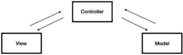
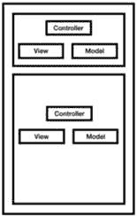
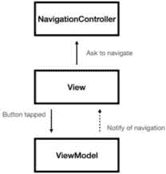
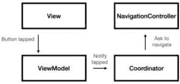

# 第十一章：解决复杂问题的设计模式

在前面的章节中，我们讨论了 iOS 开发的不同方面。我们涵盖了 UIKit、Swift、响应式编程、SwiftUI、Core Data 以及更多。这些构建块帮助我们达到下一个层次——设计模式。

设计模式就像工具。每一个都解决不同的问题或不同的需求，例如以下内容：

+   我们需要改变特定实例的行为吗？我们可以使用 **依赖** **注入**（**DI**）。

+   我们需要管理复杂的状态吗？我们可以使用 **模型-视图-视图模型**（**MVVM**）。

+   我们需要定义对象之间的通信吗？我们可以使用代理。

我们的设计模式工具箱越丰富，我们能解决的问题就越多。我们应该记住，设计模式本身并不是我们的目标——它们是完成我们任务的工具。我们应该记住，在面试中，我们可能需要选择一个特定的设计模式或讨论它。

在本章中，我们将介绍 iOS 开发中常用的一些设计模式。我们将做以下几件事：

+   讨论 **模型-视图-控制器**（**MVC**）和 MVVM，包括一些面试问题

+   使用依赖注入解耦我们的代码

+   通过代理改进通信

+   使用单例共享状态

+   使用并发改进性能

面试中最常问的话题之一是列表中的第一个——MVC 和 MVVM。所以，让我们直接进入正题。

# 使用 MVC/MVVM 构建用户界面

几种已知的设计模式可以帮助我们构建稳定且复杂的界面，但 MVC 和 MVVM 是最常见和最著名的设计模式。

就像许多开发领域一样，MVC 和 MVVM 的主题可能会受到个人偏好和观点的影响，并且可能并不总是与实际考虑相符。我们始终需要小心这一点，尤其是在求职面试时。让我解释一下我的意思。

## 使用 MVC 和 MVVM 解决不同的问题

我想讨论一下在与面试官或同事进行专业讨论时建议避免的几个句子：

+   “我的应用程序是使用 MVVM 架构构建的。”

+   “MVC 是过时的，是一种糟糕的架构。我从不使用它。”

+   “这不是 MVVM 的工作方式。让我给你演示一下。”

记住我在书中多次提到的一点——作为开发者，我们应该避免二分法思考。MVC 和 MVVM 解决不同的问题，我们应该将这两种模式视为解决各种问题的不同方案。

事实上，我们可以在同一个应用程序、同一个功能或同一个界面上使用不同的设计模式。

此外，实现 MVC 和 MVVM 的方法不止一种。更重要的是遵循不同的原则并解释它们。

让我们从更直接的模式——MVC 开始。

## 学习 MVC

MVC 代表模型-视图-控制器。当 iOS 开发时代开始时，苹果公司使用 MVC 来展示构建 UI 界面的最佳实践，并且它是构建应用程序的主要设计模式。

MVC 的基本原则是在*视图*和*模型*之间进行分离，*视图*是用户所见并与之交互的部分，而*模型*则代表业务逻辑和数据层。

在 MVC 中，视图和模型之间没有直接连接，所有数据流都是通过*控制器*完成的。

让我们看看一个经典的 MVC 模式（*图 11.1*）：



图 11.1 – MVC 设计模式

在*图 11.1*中，我们可以看到视图和模型通过控制器相互通信。这种分离使我们能够在项目的不同用例中重用每个组件。

我们如何在 iOS 世界中实现 MVC？让我们看看：

+   **视图**：视图代表屏幕上显示的 UI。因此，我们通常使用 UIKit 视图元素之一来实现它，例如按钮、标签和文本字段（我们将在下一节中讨论 SwiftUI）。

+   **模型**：模型是我们的数据和业务逻辑。我们使用数据结构、持久存储、不同的算法和网络请求来实现它。

+   **控制器**：在 iOS 开发中，控制器主要是**UIViewController**及其不同的子类，如**UITableViewController**和**UIAlertController**。

注意苹果如何在 iOS 中实现 MVC 模式。`UIViewController`并不像我们在*图 11.1*中看到的那样是一个纯粹的控制器。它有自己的视图，并负责用户交互。从某种意义上说，`UIViewController`是 UI 的一部分，而不仅仅是控制器。

在 SwiftUI 中，情况略有不同——SwiftUI 的模式更类似于 MVVM 而不是 MVC。当我们讨论到 MVVM 时，我们会更详细地考察这一点。

让我们看看如何在 iOS 中实现 MVC。以下是模型部分：

```swift
class Person {    var name: String
    var age: Int
    init(name: String, age: Int) {
        self.name = name
        self.age = age
    }
    func canVote() -> Bool {
        return age >= 18
    }
}
```

`Person`代表数据结构，并有一个逻辑函数（`canVote()`）。它没有任何对视图或控制器的引用。

下面是视图：

```swift
class PersonView: UIView {    var nameLabel: UILabel
    var ageLabel: UILabel
    var canVoteLabel: UILabel
    init(frame: CGRect) {
        super.init(frame: frame)
        nameLabel = UILabel()
        ageLabel = UILabel()
        canVoteLabel = UILabel()
    }
    func configure(with person: Person) {
        nameLabel.text = person.name
        ageLabel.text = "\(person.age)"
        canVoteLabel.text = person.canVote() ? "Can vote" :
            "Can't vote"
    }
}
```

我们可以看到`PersonView`类与逻辑无关，纯粹关注 UI 展示。这使得它可以与其他逻辑和模型一起重用。

注意`PersonView`有一个`configure(with person:Person)`函数。这种常见的做法有助于我们使用特定的模型来加载视图。我们可以将此代码移动到扩展中，以增加代码的分离。

现在，让我们转向控制器：

```swift
class PersonViewController: UIViewController {    var person: Person
    var personView: PersonView
    init(person: Person) {
        self.person = person
        personView = PersonView()
        super.init(nibName: nil, bundle: nil)
    }
    override func viewDidLoad() {
        super.viewDidLoad()
        view.addSubview(personView)
        personView.configure(with: person)
    }
    required init?(coder aDecoder: NSCoder) {
        fatalError("init(coder:) has not been implemented")
    }
}
```

`PersonViewController`对`Person`和`PersonView`都有引用，并负责在它们之间建立联系，并使用来自`Person`的数据加载视图。注意`PersonView`和`Person`之间没有引用——`PersonViewController`充当控制器，并在`viewDidLoad`函数中设置所需的内容。

之前，我们讨论了 MVC 如何改进我们的代码，使其可重用，因为我们可以在项目中重用模型和视图组件。在 iOS 开发中，我们还应该将 MVC 视为一个可以重用的自包含单元。

例如，我们可以有一个基于两个嵌入式视图控制器（每个都是一个 MVC 单元）的屏幕。看看**图 11.2**：



图 11.2 – 两个嵌入式 MVC 单元

MVC 单元不一定要是一个完整的屏幕——这种方法可以帮助我们重用屏幕的一部分并扩展我们项目的灵活性。

MVC 模式对于不需要复杂状态和数据操作的简单屏幕非常出色。在这种情况下，我们必须转向更复杂的模式——MVVM。

## 探索 MVVM

我认为这是本章（也许甚至是整本书）的一个关键检查点。开发者往往对特定的模式有很强的依赖性，尤其是与 UI 相关的。MVVM 并不比“MVC”更好，反之亦然。它们都是针对不同用例的模式，这在面试中至关重要。我们永远不应该被特定的技术或模式所束缚，尤其是在面试中。

我们说过 MVC 不是复杂状态和数据管理的最佳模式。但为什么呢？

复杂的屏幕需要状态管理——显示/隐藏某些 UI 元素、更新文本、更改颜色，并在屏幕上呈现动态信息。所有这些都可以使我们的视图控制器变得臃肿。

这也是为什么 iOS 开发者曾在 App Store 的第一个时代依赖 MVC，但很快转向了更合适的模式——MVVM。

MVVM 代表模型-视图-视图模型。其理念是视图通过**视图模型**连接到模型——另一个可以帮助我们管理状态和操作数据的组件。

看看**图 11.3**：


图 11.3 – MVVM 设计模式

在**图 11.3**中，我们可以看到视图模型像 MVC 模式中的控制器一样位于视图和模型之间。

但在 MVVM 中，不同组件的责任更加透明和直观。

现在我们来回顾一下不同的组件：

+   **视图**：视图负责展示信息和响应用户交互。它是唯一可以访问 UIKit 框架（我们很快会谈到 SwiftUI）的组件，这与我们之前讨论的 MVC 模式有显著的不同。

+   **视图模型**：视图模型处理状态并为展示准备数据。此外，视图模型决定用户交互并将请求向前推进到模型层。

+   **模型**：模型层是实际的业务逻辑，负责访问持久存储和执行网络请求。

注意到视图（View）和视图模型（ViewModel）是通过**数据绑定**进行通信的，这连接了输入字段到对应的数据模型。实际上，视图模型甚至没有视图的引用——视图观察视图模型的变化并相应地刷新自己。

这就是 SwiftUI 和 Combine 派上用场的地方。例如，在 SwiftUI 中，ViewModel 通常是从`@ObservableObject`类派生出来的，具有`@Published`属性。

忘记了 SwiftUI 和 Combine？

现在，是时候回到*第八章*并刷新一下关于 SwiftUI 和 Combine 的记忆。看起来苹果仔细研究了开发者如何开发屏幕，并为 MVVM 构建了一个专门的框架。

现在，让我们看看 MVVM 的实际应用。

### 查看一些代码示例

让我们看看 MVVM 设计模式的代码示例。在我们的例子中，我们有一个带有标签的屏幕，该标签显示加载请求的状态（**加载中…**，**就绪**或**错误**）。标签绑定到一个特定的 ViewModel，该 ViewModel 与 Model 通信并更新其视图。

让我们从 ViewModel 开始：

```swift
import Foundationimport Combine
class StatusViewModel {
    private let networkService: NetworkService
    private var cancellables = Set<AnyCancellable>()
    private let statusDidChange = PassthroughSubject
        <String, Never>()
    var status: String = "Loading..." {
        didSet {
            statusDidChange.send(status)
        }
    }
    init(networkService: NetworkService) {
        self.networkService = networkService
    }
    func fetchStatus() {
        networkService.fetchStatus()
            .sink { completion in
                switch completion {
                case .failure(let error):
                    self.status = "Error: \
                        (error.localizedDescription)"
                case .finished:
                    break
                }
            } receiveValue: { isReady in
                self.status = isReady ? "Ready" : "Not ready"
            }
            .store(in: &cancellables)
    }
```

现在，让我们观察状态变化：

```swift
    func observeStatusChange(handler: @escaping (String) ->        Void) {
        statusDidChange
            .receive(on: RunLoop.main)
            .sink { status in
                handler(status)
            }
            .store(in: &cancellables)
    }
}
```

代码示例有点长，但很容易理解。ViewModel 通过 Combine 模式观察网络请求-响应并更新其值。Combine 流从网络服务开始，并将结果转发到`status`属性，该属性可以被视图观察。请注意，ViewModel 不处理任何 UI 元素——那是视图的工作。

现在，让我们看看视图：

```swift
import UIKitclass StatusLabel: UILabel {
    var viewModel: StatusViewModel? {
        didSet {
            viewModel?.observeStatusChange { [weak self]
                status in
                self?.text = status
            }
            viewModel?.fetchStatus()
        }
    }
}
```

`StatusLabel`类有一个对 ViewModel 的直接引用，并观察变化以刷新自己。

剩下的唯一事情就是将视图与 ViewModel 连接起来，这就是在这个情况下视图控制器唯一的工作：

```swift
import UIKitclass ViewController: UIViewController {
    let networkService = NetworkService()
    let statusViewModel = StatusViewModel(networkService:
        NetworkService())
    let statusLabel = StatusLabel()
    override func viewDidLoad() {
        super.viewDidLoad()
        statusLabel.frame = CGRect(x: 50, y: 50, width:
            200, height: 50)
        statusLabel.textAlignment = .center
        view.addSubview(statusLabel)
        statusLabel.viewModel = statusViewModel
    }
}
```

`ViewController`将 ViewModel 注入到视图中，将`NetworkService`注入到 ViewModel 中。想象一下在 MVC 中这样做，有多个组件和复杂的数据操作；你会得到一个包含 3,000 行代码的视图控制器。

与 MVC 相比，MVVM 是一种现代的设计模式，可以帮助我们更有效地分离关注点，并处理更复杂的状态管理和数据操作。我们可以为每个我们认为需要 ViewModel 的视图创建一个 ViewModel，并按我们的意愿组织我们的展示逻辑。

现在，让我们继续讨论一些关于 MVC/MVVM 设计模式的问题。

## “如何在 MVVM 架构中实现导航，考虑到 ViewModel 不应该了解视图？”

*为什么这个问题很重要？*

在理论上学习 MVVM 很容易。将 ViewModel 属性绑定到 UI 元素是简单的，但将其应用于*现实世界问题才是真正的挑战*。iOS 和移动开发中最常见的现实世界问题之一是导航与状态和逻辑的结合。

当 ViewModel 缺乏对视图的直接引用，而视图又不能独立处理导航时，导航问题的解决方案是什么？

*答案是什么？*

当讨论导航时，我们需要决定三件事：

+   如何*触发*导航操作

+   如何*选择*导航位置

+   如何*导航*

这些是三种可以分离到各种组件中的不同责任。例如，我们可以决定 ViewModel 可以触发导航操作，并选择去哪里，而视图可以处理导航操作本身。

另一个选择是决定 ViewModel 触发导航。然而，去哪里可以是视图的一部分或另一个专门为此目的而明确创建的对象。

让我们看看*图 11.4*：



图 11.4 – 使用 MVVM 的简单导航模式

在*图 11.4*中，ViewModel 通过委托模式或**Combine**触发导航并通知视图。然后视图请求导航控制器导航到特定的目的地，这也是视图控制器有导航控制器引用的部分原因。这种简单的导航模式将导航责任放在了视图上。

下面是如何在代码中实现这一点。这是 ViewModel 的样子：

```swift
import Foundationimport Combine
class MyViewModel {
    private let navigationSubject = PassthroughSubject
        <Void, Never>()
    var navigation: AnyPublisher<Void, Never> {
        return navigationSubject.eraseToAnyPublisher()
    }
    func didTapButton() {
        navigationSubject.send(())
    }
}
```

我们可以看到 ViewModel 有一个`didTapButton()`方法，并决定使用`navigationSubject`发送消息。

现在，让我们回顾一下视图控制器：

```swift
import UIKitimport Combine
class MyViewController: UIViewController {
    var viewModel: MyViewModel!
    private var cancellables = Set<AnyCancellable>()
    let button = UIButton()
    override func viewDidLoad() {
        super.viewDidLoad()
        setupUI()
        viewModel.navigation
            .sink { [weak self] in
                self?.navigateToDetails()
            }
            .store(in: &cancellables)
    }
    private func setupUI() {
        button.addTarget(self, action: #selector
            (didTapButton), for: .touchUpInside)
    }
    @objc private func didTapButton() {
        viewModel.didTapButton()
    }
    private func navigateToDetails() {
        let detailsViewController = DetailsViewController()
        navigationController?.pushViewController
        (detailsViewController, animated: true)
    }
}
```

ViewModel 的导航主题根据其自己的逻辑触发导航，在这个例子中是点击按钮。

`ViewController`观察 ViewModel 的导航发布者，并使用导航控制器推送`detailsViewcontroller`。

如前所述，这个模式很简单，将很多责任放在了视图控制器上。如果我们想分离我们的代码，我们可以将导航责任委托给另一个类（**Coordinator**）。参见*图 11.5*：



图 11.5 – MVVM 和协调器模式

在协调器模式中，ViewModel 通知协调器关于一个导航意图，从而推送一个新的屏幕。看看 ViewModel 现在是什么样子：

```swift
import Foundationimport Combine
class MyViewModel {
    private let didTapButtonSubject = PassthroughSubject
        <Void, Never>()
    var didTapButtonPublisher: AnyPublisher<Void, Never> {
        return didTapButtonSubject.eraseToAnyPublisher()
    }
    func didTapButton() {
        didTapButtonSubject.send(())
    }
}
```

ViewModel 发送一个带有按钮点击的消息，协调器可以订阅它并做出响应。这是协调器的样子：

```swift
class MyMainCoordinator: MyCoordinator {    private var cancellables = Set<AnyCancellable>()
    func start() {
        let viewModel = MyViewModel()
        viewModel.didTapButtonPublisher
            .sink { [weak self] _ in self?.didTapButton()
            }
            .store(in: &cancellables)
        let viewController = MyViewController()
        viewController.viewModel = viewModel
        navigationController.pushViewController
            (viewController, animated: true)
    }
    func didTapButton() {
        let detailsViewController = DetailsViewController()
        navigationController.pushViewController
            (detailsViewController, animated: true)
    }
}
```

我们可以看到协调器创建了 ViewModel 和视图，然后将一切连接起来。在前面的例子中，视图控制器观察 ViewModel 事件并推送一个新的视图控制器。同样，在这种情况下，协调器观察`didTapButtonPublisher`并决定推送一个新的视图控制器 – `DetailsViewController`。视图和 ViewModel 对这个过渡一无所知，因为它完全由协调器管理。

通常，两种方式都有其优缺点。使用协调器是一个强大且复杂的模式。然而，对于更简单的情况，我们可以将导航控制器连接到视图控制器，这样开销很小。重要的是要理解导航原则并平衡责任。

## “为什么 MVVM 架构被认为在 iOS 应用开发中具有良好的可测试性？”

*为什么这个问题很重要？*

在近年来设计代码时，测试变得越来越重要。这不仅仅是能够测试代码，还关于编写高质量、结构良好且易于维护的代码。考虑到这一点，面试官希望我们在回答中考虑编写可测试代码的重要性。

*答案是什么？*

MVVM 设计模式适合测试，因为它以简单的方式分离了关注点。状态和数据操作代码，这是我们想要测试的最重要部分，是 ViewModel 的一部分。我们可以轻松设置 ViewModel，无需处理 UI，只需通过模拟 View 进行测试。

我们也可以测试 MVC 单元，但由于状态管理是 View Controller 或 View 的一部分，所以它比测试 MVVM 模式更复杂。

这里是一个如何测试 ViewModel 的代码示例。让我们从定义一个标准的 ViewModel 开始：

```swift
import Foundationimport Combine
class MyViewModel {
    let didTapButton = PassthroughSubject<Void, Never>()
    @Published var labelValue: String = ""
    private var cancellables = Set<AnyCancellable>()
    init() {
        didTapButton
            .map { "Ready" }
            .assign(to: \.labelValue, on: self)
            .store(in: &cancellables)
    }
}
```

我们创建了一个处理点击按钮并更新标签的 ViewModel。注意，这里没有 UIKit 相关的代码，所以它应该相对容易测试。现在，让我们看看测试本身：

```swift
import XCTestimport Combine
@testable import MyProject
class MyViewModelTests: XCTestCase {
    func testLabelValue() {
        let viewModel = MyViewModel()
        let labelValueExpectation = viewModel.$labelValue
            .dropFirst() // Ignore initial value
            .sink { labelValue in XCTAssertEqual(labelValue, "Ready")
            }
        viewModel.didTapButton.send(())
        labelValueExpectation.cancel()
    }
}
```

`testLabelValue()` 函数观察 ViewModel 的 `labelValue`，以查看在点击按钮时它是否等于 `"Ready"`。我们没有设置 View 就完成了所有这些，在这种情况下，View 只处理 UI 逻辑。

# 使用依赖注入解耦

DI 是一种强大的模式，帮助我们创建模块化和可测试的代码。它是我们工具箱中的另一个工具，可以帮助我们使代码灵活且解耦。

在 iOS 中实现依赖注入（DI）有几种方法，接下来将进行讨论。

## 使用构造函数注入

这是 iOS 中最常用的 DI 形式。在构造函数注入中，依赖项通过初始化器传递给对象。例如，如果我们有一个依赖于数据管理器的视图控制器，我们可以在视图控制器的初始化器中注入数据管理器。

在以下代码示例中，我们创建了一个自定义的 `init()` 函数和一个私有变量来保存注入的数据管理器：

```swift
class MyViewController: UIViewController {    private let dataManager: DataManager
    init(dataManager: DataManager) {
        self.dataManager = dataManager
        super.init(nibName: nil, bundle: nil)
    }
}
let viewController = MyViewController
    (dataManager: dataManager)
```

构造函数 DI 的主要优势是我们有一个清晰的接口，用于类所需的依赖项，因为我们必须在 `init()` 方法中传递它们。

## 使用设置器注入简化事情

在设置器注入中，设置器方法将依赖项传递给对象。对象将其依赖项声明为公共属性，DI 框架使用适当的依赖项设置这些属性。设置器注入不如构造函数注入常见，但在运行时更改对象的依赖项时可能很有帮助。

这里是一个设置器注入的代码示例：

```swift
// Define a view controller that depends on a data managerclass MyViewController: UIViewController {
    var dataManager: DataManager?
    }
}
let dataManager = ConcreteDataManager()
let viewController = MyViewController()
viewController.dataManager = dataManager
```

在这个例子中，我们没有更改视图控制器的 `init` 函数。在创建视图控制器后，我们使用内置的设置器属性方法传递了 `dataManager`。

使用设置器注入的主要优点是简单性；我们不需要修改 `init` 函数和解耦。另一方面，这种方法不适合所需的依赖项。

## 使用方法注入的纯函数

在方法注入中，依赖项作为参数传递给对象的函数。这与构造函数注入类似，但允许对何时以及如何注入依赖项有更精细的控制。

`fetchData()` 方法是一个纯函数的例子：

```swift
// Define a view controller that depends on a data managerclass MyViewController: UIViewController {
    func fetchData(dataManager: DataManager) {
        let data = dataManager.fetchData()
    }
}
let dataManager = ConcreteDataManager()
let viewController = MyViewController()
viewController.fetchData(dataManager: dataManager)
```

在这个代码示例中，我们拥有相同的视图控制器和数据管理器，但这次我们没有为数据管理器创建实例变量。我们将数据管理器作为 `fetchData` 方法的部分传入，从而使函数成为纯函数。

什么是纯函数？

纯函数是一个不依赖于实例变量或其作用域之外的任何状态，并且只操作其输入参数的函数。它对相同的输入产生相同的输出，并且对程序或环境没有副作用。纯函数可以依赖方法注入来使用外部依赖，其中依赖项作为参数传入，而不是依赖于全局或实例变量。

方法注入对于可测试性非常好，因为它增加了类与依赖项的解耦。它还使类与方法（这是我们讨论的“纯”定义的一部分）解耦，但它也要求我们的方法签名更复杂，并管理类外部的状态。

这三种依赖注入（DI）的方式都非常有助于提高解耦和可测试性。但我们可以使所有这些方式更加解耦。如何？简单，使用协议。

## 使用协议解耦我们的代码

当我们讨论 Swift 语言特性时，我们在 *第五章* 中讨论了协议。协议在设计模式中扮演着重要的角色，尤其是在依赖注入（DI）中。

只要它们符合协议接口，我们可以使用协议注入具有不同行为的不同对象。

这里是一个使用协议注入具有不同实现的不同对象的例子：

```swift
protocol DataManager {    func fetchData() -> [String]
}
class ConcreteDataManager: DataManager {
    func fetchData() -> [String] {
        return ["Item 1", "Item 2", "Item 3"]
    }
}
class OtherDataManager: DataManager {
    func fetchData() -> [String] {
        return ["Item A", "Item B", "Item C"]
    }
}
class MyViewController: UIViewController {
    let dataManager: DataManager
    init(dataManager: DataManager) {
        self.dataManager = dataManager
        super.init(nibName: nil, bundle: nil)
    }
}
let concreteDataManager = ConcreteDataManager()
let viewController1 = MyViewController
    (dataManager: concreteDataManager)
let otherDataManager = OtherDataManager()
let viewController2 = MyViewController
    (dataManager: otherDataManager)
```

在这个例子中，我们有 `MyViewController` 的两个实例。我们将 `concreteDataManager`，`DataManager` 协议的一个实例，注入到第一个实例中，并将 `otherDataManager`，另一个 `DataManager` 协议的实例，注入到第二个 `MyViewController` 实例中。它们具有相同的接口但不同的实现。在这种情况下，它们在 `fetchData()` 方法中返回不同的元素。这种技术使我们能够通过任何对象注入我们想要的任何实现。这对于测试特别强大，它帮助我们使用代码中的模拟。

总结依赖注入（DI），我们可以从提到的三种模式中选择任何一种——构造函数、设置器或方法——并使用协议扩展其功能。这完全取决于我们想要的简单性和耦合程度。

# 使用代理进行通信

委托是一种简单的模式，它允许对象通过松散耦合的接口相互通信。委托还基于一种协议，允许类与不同类型的对象进行通信。

让我们看看一个关于委托的小例子：

```swift
protocol MyViewDelegate: AnyObject {    func didTapButton()
}
class MyView: UIView {
    weak var delegate: MyViewDelegate?
    private let button = UIButton(type: .system)
    override init(frame: CGRect) {
        super.init(frame: frame)
        button.addTarget(self, action: #selector
            (buttonTapped), for: .touchUpInside)
        addSubview(button)
    }
    override func layoutSubviews() {
        super.layoutSubviews()
        button.frame = bounds
    }
    @objc private func buttonTapped() {
        delegate?.didTapButton()
    }
}
class MyViewController: UIViewController, MyViewDelegate {
    private let myView = MyView()
    override func viewDidLoad() {
        super.viewDidLoad()
        myView.delegate = self
        view.addSubview(myView)
    }
    func didTapButton() {
        print("Button tapped!")
    }
}
```

`MyViewController` 类有一个名为 `MyView` 的视图，并遵循一个名为 `MyViewDelegate` 的协议。这个协议有一个名为 `didTapButton()` 的方法。

`MyView` 需要与 `MyViewController` 进行通信，但它没有直接的引用。相反，它有一个 `MyViewDelegate` 类型的委托属性。这个委托属性在视图和它的视图控制器（它的“委托”）之间创建了一个松散耦合的接口。

从这个代码示例中，我们可以得到以下两点体会：

+   *我们需要创建一个委托属性*：与委托进行通信的对象需要有一个委托属性，而这个委托属性是从我们刚才声明的协议类型中获得的。这确保了一个松散耦合的关系；每个对象都可以遵循那个协议，即使是用于测试的模拟对象。

+   *我们必须将委托标记为弱引用*：这是一个关键点。根据我们的代码，视图控制器对视图有一个强引用，而视图通过委托属性对视图控制器有一个引用。这意味着委托属性必须是弱引用，这是许多开发者常见的错误。事实上，对委托属性的弱引用是面试中的常见话题，我们应该记住这一点。

尽管委托是一个广泛使用的模式，但与 Combine 等现代模式相比，它有一些缺点，许多开发者认为它有点过时。

首先，当使用委托在多个对象之间传递消息时，代码可能会变得繁琐且难以阅读。这尤其适用于每个对象都必须作为前一个对象的委托，因为它需要创建多个协议和委托属性。结果，代码可能会变得像样板代码一样，难以跟随和维护。

创建协议可以减少我们的耦合度，但我们的委托必须遵循一个特定的接口。在响应式编程中，订阅者观察更新而不被绑定到特定的接口，这使得通信更加松散耦合。

那么，选择委托而不是 Combine 的原因可能是什么？使用委托，我们可以定义一个清晰的接口，甚至是一个复杂的接口，这在 Combine 中并不总是成立。但不仅如此——委托明确地分离了关注点，帮助我们保持代码模块化和易于维护。

让我们回顾一个关于委托设计模式的常见面试问题。

## “在 Swift 中，委托模式与其他通信模式，如通知或闭包，有何不同？”

*为什么这个问题很重要？*

委托设计模式只是对象之间通信的一种方式。多年来，已经添加了新的通信方式——通知、闭包，当然还有 Combine 和 RxSwift 这样的响应式方法。

每个选项都有其优缺点，我们应该将模式与我们要解决的问题相匹配。因此，了解这些选项之间的实际差异非常重要。

*答案是什么？*

在几个关键方面，委托设计模式与通知、闭包和 Combine 不同：

+   *一对一通信关系*：虽然通知模式和 Combine 发布者可以向无限数量的实例发送消息，但委托模式通常与单个对象进行通信。这最初可能看起来像是一个缺点，但它也简化了需要更多控制代码耦合的复杂情况。

+   *形式化协议*：在委托模式中，由于使用了协议，与委托一起工作的接口是清晰的。协议形式化了通信，并为委托和所有者提供了明确的期望。当通信变得复杂时，这一点尤为重要——例如，需要实现多个参数的多个函数。

+   *更复杂设置*：当我们想在应用程序的不同层和组件之间传递值或事件时，使用委托模式变得更复杂。但这不仅仅是设置——跟踪数据流变得繁琐，因为你必须在不同协议实现之间跳转。这是灵活性与简单性用例的另一个例子。

总体而言，委托模式对于某些用例来说非常好，选择正确的通信选项取决于我们问题的具体要求。

至于面试问题，特别是与设计模式相关的问题，我们必须记住，“更好”取决于上下文。

我认为下一个主题完美地描述了这一点。

# 使用 Singleton 共享状态

面试官喜欢问的两个问题是：

+   “我们如何创建一个 Singleton？”

+   “在我们的应用程序中拥有单例是否好？”

第一个问题很技术性，但第二个问题很棘手。

让我们从 Singleton 的定义开始。

什么是 Singleton？

在 Singleton 设计模式中，只有一个类的实例可以被全局访问，通过一个 **静态** 属性。它通常用于管理程序中的共享资源或状态，其中多个实例可能导致同步或一致性方面的问题。为了实现 Singleton，一个类通常有一个私有的构造函数和一个静态方法或属性，它返回类的单个实例。

在 Swift 中，创建 Singleton 很简单。我们使用静态属性来完成这项任务：

```swift
final class MySingleton {    static let shared = MySingleton()
    private init() {}
    func doSomething() {
        print("Doing something...")
    }
}
MySingleton.shared.doSomething()
```

注意，Singleton 只用一行定义：

```swift
static let shared = Singleton()
```

关键是要始终使用`shared`属性来访问单例，正如前一个代码示例中所示。为了防止创建`MySingleton`类的另一个实例，我们可以将`init()`方法标记为私有，并确保只有一个实例。

但那只是一个简单的问题。真正的问题是——我们应该在我们的项目中使用单例吗？它被认为是合法的模式还是反模式？

有几个原因说明为什么单例对于许多开发者来说可能是一个反模式。让我们讨论其中的一些：

+   *拥有全局状态*：单例为应用提供了一个全局状态，多个应用组件可以操作这个全局状态。结果，很难追踪到这些更改是在哪里和什么时候进行的。从某种意义上说，当应用变得更大时，可以从代码的任何地方访问的全局状态的主要问题。

+   *耦合增加*：我们构建了一个模块化应用，代码分离做得很好。但一旦我们的不同应用组件访问共享实例（即单例），这些组件之间的耦合就会增加。随着程序中单例数量的增加，紧密耦合成为一个更大的问题。

+   *多线程挑战*：因为单例可以从任何地方访问，这也意味着我们可以从不同的线程修改和读取共享实例的值。这可能导致竞态条件和其他同步问题。

那么，答案是什么呢？嗯，有些情况下拥有一个单例（Singleton）是完全合法的。例如，在应用中应该只有一个特定对象的实例——比如配置管理器或数据库连接。

但我们应该尽可能避免使用单例。怎么做？让我们用一个面试问题来回答。

## “你将如何在代码中避免使用单例？你能描述一些你可能考虑的替代方法吗？”

*为什么这个问题很重要？*

到这个时候，我们应该已经熟悉了不同的设计模式，并且可以提出一个合适的替代方案。这正是问题的目标——测试你将经验和知识转化为良好、可接受解决方案的能力。

如果找到替代方案是可能的，关于单例的一般性指导原则是避免使用它们。

*答案是什么？*

避免单例最常见的方法是使用依赖注入（DI）来注入类或函数内部使用的服务。

我们可以不创建一个静态常量（单例），而是从`Client`类来处理`Service`实例：

```swift
class Service {    static let shared = Service()
    func doSomething() {}
}
class Client {
    func useService() {
        Service.shared.doSomething()
    }
}
```

我们可以创建一个实例并将其注入到`Client`类中：

```swift
class Service {    func doSomething() {}
}
class Client {
    let service: Service
    init(service: Service) {
        self.service = service
    }
    func useService() {
        service.doSomething()
    }
}
let service = Service()
let client = Client(service: service)
```

如果不需要全局状态，注入一个新的实例（或传递现有的实例）而不是使用单例会更好。

我们可以通过将`Service`转换为协议来改进这个例子：

```swift
protocol Service {    func doSomething()
}
class ServiceImpl: Service {
    func doSomething() {}
}
let service = ServiceImpl()
let client = Client(service: service)
```

现在，由于`Service`是一个协议，这使得我们的耦合更加松散。这是一个很好的代码修改，我们可以进行。

## “你能描述一下在多线程环境中使用单例可能遇到的问题，以及如何解决这些问题吗？”

*为什么这个问题很重要？*

当我们之前在本节中讨论单例的缺点时，我们简要提到了多线程问题。单例是一个共享资源，因此我们必须了解它在多线程环境中的位置。

*答案是什么？*

在多线程环境中，我们可能会遇到与单例相关的以下潜在问题：

+   *出现竞态条件*：如果有多个线程同时尝试访问和修改同一个单例实例，可能会导致竞态条件，这可能导致不可预测的行为和数据损坏

+   *遇到死锁*：如果有多个线程以不同的顺序尝试访问单例实例，可能会导致死锁，其中一个线程等待另一个线程释放对单例的锁

+   *状态不一致*：如果一个单例实例被一个线程修改，而另一个线程正在读取或使用它，可能会导致不稳定的状态和意外的行为

作为开发者，不可预测的行为是我们遇到的最具挑战性的问题之一，这使得调试和调查变得更加困难。

最简单的解决方案是假设单例不是一个线程安全的对象，并且只能从同一个线程访问。以下是一个示例：

```swift
MySingleton.shared.doSomething()DispatchQueue.global().async {
    DispatchQueue.main.async {
        MySingleton.shared.doSomething()
    }
}
```

在这个例子中，我们假设单例只能从主线程访问。我们使用**Grand Central Dispatch**（**GCD**）API 转移到主线程，以确保单例总是从主线程访问。

另一个选项是将单例变成线程安全的对象，通过使用**NSLock**来锁定访问：

```swift
class MySingleton {    static private var privateShared: MySingleton?
    static private let lock = NSLock()
    private init() {
        // Perform any necessary setup or initialization
    }
    static func threadSafeShared() -> MySingleton {
        lock.lock()
        defer {
            lock.unlock()
        }
        if privateShared == nil {
            privateShared = MySingleton()
        }
        return privateShared!
    }
    func doSomething() {
        // Perform some action or logic
    }
}
```

在这个例子中，我们将共享实例作为一个私有属性，并添加一个静态方法，确保在返回单例实例之前进行锁定和解锁。这是一种常见的做法，用于锁定对象并使其线程安全。

总结这个话题——在 iOS 开发者社区中有一个持续的辩论和讨论。一些开发者认为单例是一个有用的工具，可以简化状态和资源的共享，而另一些开发者则认为单例是一个可能导致问题的反模式。事实，就像往常一样，介于两者之间。

# 使用并发提高性能

并发是一个复杂的计算机科学话题，不仅在 iOS 开发中。糟糕的设计可能导致崩溃、竞态条件、死锁和延迟。

但别担心——你还记得我们在本章引言中提到的设计模式吗？它们就是为了解决我们的问题而存在的。所以，让我们回顾一些关于并发的设计模式和最佳实践，看看我们可以添加哪些工具到我们的工具箱中。

## 使用 GCD

GCD 是一个强大的并发框架，它能够高效且可扩展地执行任务。GCD 提供了一种简单的方法来创建任务队列并安排它们执行，而无需手动管理线程。这使得编写高效且响应迅速的代码变得容易，可以充分利用系统资源。

这里有一个如何使用 GCD 在后台异步下载图像的例子：

```swift
func downloadImage(url: URL, completion: @escaping    (UIImage?) -> Void) {
    let queue = DispatchQueue.global(qos: .background)
    queue.async {
        if let data = try? Data(contentsOf: url),
           let image = UIImage(data: data) {completion(image)
        } else {
            completion(nil)
        }
    }
}
```

在这个例子中，我们定义了一个函数 `downloadImage`，它接受一个 URL 和一个完成处理程序作为参数。该函数使用 `DispatchQueue.global` 方法创建一个全局后台队列，然后调用异步方法将任务添加到队列中。任务从 URL 下载图像数据，将其转换为图像，然后使用结果调用完成处理程序。因为任务在后台异步执行，所以它不会阻塞主线程，并允许应用程序保持响应。

## 使用 OperationQueue 创建高级队列

操作队列是一个高级并发机制，它管理任务并发执行，就像我们刚才讨论的 GCD API 一样。**OperationQueue** 提供了高级功能和简单的接口来管理队列。

`OperationQueue` 的基本单位是 `Operation`，它可以执行特定的任务。操作队列的任务是取一个操作并执行它，可以同时执行或依次执行。

我们只需继承 `Operation` 类并实现 `main()` 函数来创建一个操作。

这里是一个使用 Operation Queue 下载多个图像的例子：

```swift
class ImageDownloadOperation: Operation {    let url: URL
    var result: UIImage?
    init(url: URL) {
        self.url = url
    }
    override func main() {
        if let data = try? Data(contentsOf: url),
           let image = UIImage(data: data) {
            result = image
        }
    }
}
let urls: [URL] = // an array of image URLs
let queue = OperationQueue()
let downloadOperations = urls.map { url in
    ImageDownloadOperation(url: url)
}
queue.addOperations(downloadOperations,
    waitUntilFinished: true)
let images = downloadOperations.compactMap { $0.result }
```

在这个例子中，我们通过创建 `ImageDownloadOperation` 类来继承 `Operation`，该类有一个 `url` 属性并在其主方法中执行下载操作。

在此之后，我们创建了一个名为 `queue` 的操作队列和一个下载操作数组。我们将操作数组添加到我们创建的队列中，并通过调用 `result` 属性来收集它们。

Operation Queue 的最佳特性之一是能够配置其工作方式。如果我们想使队列同时执行最多三个操作，我们可以设置其 `maxConcurrentOperationCount` 的值：

```swift
queue.maxConcurrentOperationCount = 3
```

如果我们将该属性设置为 `1`，我们的队列将依次执行操作。

另一个令人兴奋的选项是 *在队列操作之间添加依赖关系* - 我们可以定义一个特定的操作在另一个操作结束之前不能开始。

这里有一个例子：

```swift
let downloadOp1 = ImageDownloadOperation(url: url1)let downloadOp2 = ImageDownloadOperation(url: url2)
downloadOp2.addDependency(downloadOp1)
```

在这个例子中，`downloadOp2` 在 `downloadOp1` 结束之前无法开始。

Operation Queue 通常提供高级功能和模式，以更精细地执行复杂的后台操作。

## 使用 NSLock 阻塞线程

`NSLock` 是一个用于在多线程环境中管理对共享资源访问的同步机制。`NSLock` 提供了一种简单的方法来阻塞尝试访问已锁定资源的线程，允许一次只有一个线程访问资源。

这里有一个如何使用 `NSLock` 来保护共享资源的示例：

```swift
class SharedResource {    private var count = 0
    private let lock = NSLock()
    func increment() {
        lock.lock()
        count += 1
        lock.unlock()
    }
    func getCount() -> Int {
        lock.lock()
        let result = count
        lock.unlock()
        return result
    }
}
```

假设 `SharedResource` 可以在不同的线程中使用。这可能导致在尝试同时访问和修改 `count` 变量时出现竞态条件和死锁。

为了处理这个问题，我们使用 `NSLock` “锁定”读取和写入访问权限——我们在读取/写入操作之前调用 `lock()`，并在之后通过调用 `unlock()` 释放它。

## 使用 Combine `Future` 发布者实现异步操作

我们之前已经讨论了 Combine *第八章*，但现在让我们讨论如何将异步操作集成到 Combine 流中。

对于任何值不会立即接收的动作的 `Future` 发布者。例如，`Future` 类型可以包括打开模态、选择项目以及关闭它。

但让我们看看我们如何使用 `Future` 来进行异步操作。

`Future` 发布者有一个带有 `promise` 参数的闭包，该参数根据操作结果具有成功或失败。

让我们看看一个示例：

```swift
func loadJSONFile() -> Future<Data, Error> {    return Future { promise in
        DispatchQueue.global().async {
            let fileURL = FileManager.default.urls(for:
                .libraryDirectory, in: .userDomainMask)[0].
                    appendingPathComponent("articles.json")
            do {
                let data = try Data(contentsOf: fileURL)
                promise(.success(data))
            } catch {
                promise(.failure(error))
            }
        }
    }
}
```

在这个示例中，`loadJSONFile` 函数返回一个 `Future` 发布者。在内部，它创建一个后台队列并加载一个大的 JSON 文件。如果一切顺利，它会调用带有成功和数据的结果。如果不顺利，它会发送失败和错误。

现在，让我们看看如何在 Combine 流中使用该函数：

```swift
let newArticles = loadJSONFile()    .decode(type: [Article].self, decoder: JSONDecoder())
    .map { articles -> [Article] in
        let lastUpdate = UserDefaults.standard.object(
         forKey: "lastUpdate") as? Date ?? Date.distantPast
        return articles.filter { $0.publishedAt > lastUpdate }
    }
    .eraseToAnyPublisher()
```

现在，我们可以将 JSON 加载操作整合到一行中，解码其数据，并将其映射和过滤，作为 Combine 流的一部分。

我们可以看到 `Future` 发布者如何使将异步操作整合到 Combine 流中变得非常容易。我们还可以通过结合 `OperationQueue` 和 `Future` 来在 Combine 中包含更复杂的异步操作。

## 探讨并发开发最佳实践

无论我们刚刚学到的不同技术如何，都有一些最佳实践我们应该遵循，以使我们的代码免受竞态条件和死锁的影响。

其中一些是从我们至今所学的内容中派生出来的。此外，这些最佳实践对于关于并发的面试讨论也非常出色：

+   *避免阻塞主线程*：主线程处理 UI 更新，因此阻塞它可能会导致应用无响应。为了避免阻塞主线程，请使用后台线程或操作队列来执行长时间运行或 CPU 密集型任务。

+   *使用结构体以确保安全*：结构体是值类型，这意味着它们默认是线程安全的。如果我们需要在线程或队列之间传递数据，使用结构体可以帮助防止竞态条件和其他并发问题。

+   *避免共享状态*：线程或队列之间的共享状态可能导致竞态条件和其他并发问题。相反，尝试将状态保持在每个线程或队列的本地，并使用消息传递或其他通信机制在它们之间共享数据。

+   *使用 Combine*：Combine 是 iOS 中响应式编程的一个强大框架，它可以通过允许你定义数据流及其操作来简化并发。通过使用 Combine，你可以避免复杂的线程管理和同步问题。

+   *始终在相同的线程中返回闭包*：在进行异步操作时，确保任何闭包或回调都在它们最初创建的相同线程或队列中执行是至关重要的。这有助于避免在跨多个线程执行代码时出现竞争条件和其他并发问题。

# 摘要

这章内容很长，这个主题本身就可以写成一本书。实际上，许多书籍只专注于设计模式，原因很明显——设计模式是我们进行 iOS 开发时所有工作的工具箱。

本章向我们介绍了 MVC/MVVM、依赖注入（DI）、代理、单例以及并发模式和工具。到目前为止，我们应该对 iOS 中的主要设计模式有了很好的理解。

这种对设计模式的知识是构建我们为下一章做准备的一个很好的基础，下一章将专注于应用程序架构和开发。
