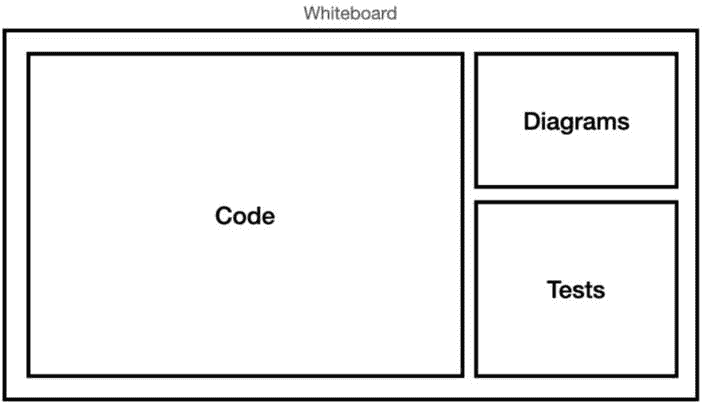

# 第十三章：如何在编码评估中取得优异成绩

在上一章中，我们深入讨论了架构。架构讨论往往非常理论化和方法论；同样可以说，设计模式讨论也是如此。

在本章中，我们将深入探讨实质内容——代码、使用 Xcode 以及玩转算法。我们将涵盖与编码面试任务相关的所有内容，例如以下内容：

+   如何在现场编码面试中取得成功，不同的测试，以及如何像专业人士一样编码

+   如何通过讨论不同的技能和复习家庭评估示例来在家评估中脱颖而出

+   如何避免在面试中可能引起红灯的失误

这将是最后一章！你将在本章结束时为你的第一次面试做好充分准备。现在，让我们直接进入现场编码面试的技巧。

# 现场编码的成功

现场编码面试可能是整个过程中最令人畏惧的。

很容易理解为什么——对于大多数开发者来说，这无论如何都是一个不舒服的情况。

首先，在大多数情况下，我们并不是在我们心爱的（对于一些人来说）Xcode 中工作。我们需要处理我们通常在日常生活中不会面对的任务，而且我们是在压力下完成的，而且有人在每一步都监视着我们。

我在本文节开头说“可能”和“大多数开发者”的原因是，这并不一定令人感到畏惧。当然，现场编码是一个压力很大的面试，但我们可以通过正确的方法让它变得有趣得多，也更加愉快。

怀疑？不要怀疑！在前面的 12 章中，我们已经观察到，适当的准备可以使任何事情变得可行。

在我们匆忙进入面试本身之前，让我们了解一下我们将工作的不同环境和不同类型的测试。

## 了解不同的现场编码测试

与其他面试阶段不同，现场编码面试通常有不同的形式和结构，这会极大地影响整个面试的感觉和外观。

有三种类型的现场编码面试——白板、在线和面对面。在这里，我们称之为现场编码，但每种都提供不同的体验和挑战。让我们从白板面试开始。

### 白板面试

如果我记得正确的话，这是我们第三次提到白板的重要性。第一次是在第二章，当时我们讨论了面试准备过程（在“准备筛选面试”部分）。第二次是在第十二章（在“架构设计面试”部分）讨论架构面试，现在，我们再次提到它，是在进入现场编码阶段时。

为什么白板在面试中如此重要？是什么让面试官高度重视白板，以及我们如何最大限度地利用它来为我们自身谋利？

好吧，白板有一个显著的优势——它促进了人与人之间的清晰沟通，并允许我们在解释一个想法时可视化我们的思考。这就是为什么大多数会议室都包括白板的原因。

现在，作为候选人，如果我们不习惯使用白板，有时很难使用它。而且，我们站在那里努力解决编码问题，这也不利于这种情况。

但它也可以是我们与面试官沟通的好工具，就像我们在上一章中所做的那样。

如果你认为沟通在面试中不是什么大问题，那就让我们进入在线面试，你将会明白为什么它是至关重要的。

### 在线面试

在线面试是通过使用 Zoom、FaceTime 或 Google Meet 等平台进行的视频会议。

你可能会认为在线面试的一个显著优势是使用**集成开发环境**（**IDE**）。但在大多数情况下，会议是在一个专门的网站上进行的，没有缩进、代码补全或语法高亮。

此外，在线编码面试还有一个我们在白板面试中没有的缺点：沟通。

我观察到，在多次面试中，与面试官的互动在面试成功中起着至关重要的作用。不可否认的是，与面对面会议相比，在线会议中的沟通更具挑战性。

然而，抱怨不是通往成功的道路。

我们需要寻找在线编码会议的其他优势。例如，我们是在电脑上编码的事实使我们能够在需要时编辑和向下推行代码。白板编辑要困难得多，并迫使我们规划将要写的内容。

此外，安排和准备在线编码面试相对简单。远程会议和使用电脑可能在我们舒适区内，因为 Covid-19 时代教会了我们如何有效地处理这些方面。

### 结合两个世界——面对面编码面试

“面对面”编码面试是在面试官面前的笔记本电脑上进行的。与之前两种方法（白板和远程）相比，这是一种独特的方法，而且有很好的理由。面对面编码面试在个人互动方面具有优势。然而，考虑到随之而来的后勤努力，这种优势通常并不足够强大。

因此，在讨论面对面会议时，白板编码面试更受欢迎。

话虽如此，面对面的编码面试通常发生在希望看到我们在自然工作环境中编码的公司。在某些情况下，面试官在我们编码时陪伴我们，而在其他情况下，我们被给予隐私，在房间里自己编码，面试官定期检查以评估我们的进度。这两种情况都可能对开发者造成压力，因为他们需要在有人观看的情况下编码。但有时，这可能是测试的一部分——看看我们在轻微的压力下如何执行复杂任务。

所有三种方式（白板、面对面和远程编码）都很常见，而且所有这些都可以是压力很大的体验。降低压力水平的最佳方法是练习并为此挑战做好准备。

## 为编码面试做好准备

我知道你可能认为，作为资深开发者，我们已经准备好编码面试，因为编码是我们几乎每天都在做的事情。但你在这一点上大错特错了——编码面试需要新的技能和技术才能成功通过。

我们已经回顾了不同的编码测试类型——白板、面对面和远程。我们将看到，为了通过这些测试，需要磨练一些技能。我们将从第一个和最重要的一个开始——在纯文本编辑器中编写代码。

### 使用纯文本编辑器

在大多数编码面试中，我们将使用一个**纯文本编辑器**。实际上，白板也是一个纯文本编辑器。

纯文本编辑器缺乏语法高亮、缩进和代码补全，为我们创造了一个不熟悉的环境。

在纯文本编辑器中声明一个函数可能很容易，没有任何问题，就像以下代码所示：

```swift
func foo() { print("foo") }
```

但这只是容易的部分！让我们看看挑战是什么，以及我们如何应对它们。

#### 识别语法错误

语法高亮帮助我们识别关键词和表达式，但它也帮助我们找到语法错误，例如缺少括号、方括号或分号。在文本编辑器中，有一个最佳实践是先输入开闭括号或括号，然后再写表达式。

然而，在白板上，我们不能使用那种技术。一个选择是**我们自己突出分隔符**并将它们用不同的颜色写出来。当然，这样做可能会减慢我们的速度，但会使我们的代码更加清晰和美观。另一个选择是**将分隔符画得更大**，这是另一种突出显示的方法。

#### 避免打字错误

虽然语法是 IDE 的一个方面，但代码补全是一个另一个关键特性。我们习惯于编写扩展描述性函数和变量名，依赖代码编辑器通过代码补全来处理它们。然而，在纯文本编辑器中并非如此。没有代码补全，打字错误可能会破坏我们的代码。尽管在白板编码面试中，打字错误可能比面对面或远程面试更可接受，但它们仍然看起来不好，不够专业。

为了帮助我们避免打字错误，我们可以为函数和变量使用清晰简短的名字。这可以加快编码速度，并帮助我们组织白板上的写作。

#### 掌握复杂的 Swift 表达式

我之前提到过在 Swift 中声明函数是多么简单。但 Swift 远不止函数和变量声明。因此，要掌握 Swift，我们需要对更复杂的表达式和函数有全面的知识，例如以下内容：

+   集合函数 – **filter**、**map** 和 **reduce**

+   闭包

+   高级类型系统特性 – 泛型和协议

+   元组与枚举

这个列表包含容易出错的特性，当我提到错误时，我不仅仅是指外观上的错误。例如，闭包格式有直接影响我们代码流程的关键组件。泛型和协议也是如此。

我们应该练习 Swift 的复杂表达式，并确保我们掌握了它们。

#### 维护代码组织

代码组织是一个关键话题，因为在使用纯文本编辑器时，这是一个真正的挑战。正如你所知，纯文本编辑器没有缩进，这通常有助于我们创建可读性和组织性强的代码。还记得闭包和过滤吗？在没有缩进的情况下尝试阅读这些 Swift 功能是复杂的，代码的可读性影响我们的成功机会。

当在白板上编码时，缩进变得尤为重要。至少在笔记本电脑上，我们可以使用制表符，而白板上没有这种功能。

我们现在明白，我们在纯文本编辑器编码中面临的许多挑战在白板上变得更加突出。别担心！还有时间来管理这些。

### 在白板上练习

对于我们大多数人来说，在白板上编码并不自然。考虑那些在电脑前编码了近 10,000 小时的开发者；转向在白板上编码可能是一个挑战。

当涉及到在白板上编码而不是在笔记本电脑上编码时，有几个挑战我们应该记住。例如，白板没有滚动功能，编辑或插入新行要困难得多，没有直线或字体大小，我们的画布只是一个没有网格的大白表面。

话虽如此，一些技巧可以帮助我们提高白板技能。让我们来看看它们：

+   *可视化我们的代码结构*：正如我说的，白板没有内置的滚动机制，它们的编码区域是固定的。因此，在白板上编码之前，我们应该可视化我们的答案结构。注意我写的是 *answer* 而不是 *code*。这是因为我们的答案远不止我们本应实现的函数——还有测试、图表，甚至可能还有我们需要考虑的笔记。我们应该将白板划分为区域，并为每个答案的组件分配空间。当然，这也适用于编码区域本身——尝试想象你的答案会有多长，并相应地选择字体大小。看看 *图 13**.1*：



图 13.1 – 将白板划分为空间

*图 13.1* 展示了如何为我们的答案的每一部分设置不同的空间。组织你的白板是展示清晰答案的关键。

+   *使用图表*：我们讨论了为图表分配特定空间。然而，图表绝不是白板的限制——绘制图表是我们笔记本电脑上没有的显著优势，尤其是在远程工作时。图表让我们能够可视化我们的算法、想法和思考，并将它们更好地传达给我们的面试官。在练习编码问题时，我们应该尝试说明我们的思考和答案。学习如何做到这一点最好的方式是观看互联网上解释如何解决不同算法的视频，并关注视觉部分。我们应该知道如何在白板上描述流程、数组、树和数据库模式。

+   *大声练习*：许多开发者面临的一个常见挑战是在白板上解决编码问题，同时有效地解释它。为什么？因为大多数开发者不习惯在白板上写下代码，并同时解释它。我们不仅应该练习在白板上写作，还应该练习在思考的同时展示我们的解决方案，无论是给自己还是给别人。

很少有开发者有很好的白板绘图技能，但练习是显著提高的有效方法。这些小贴士可以提高标准，并为我们提供更多技能。

现在，让我们继续进行实际的编码。我们该如何开始？

## 开始编码

现在我们已经了解了不同的面试选项，我们可以开始真正的乐趣——编码。你能猜到当我面对与 iOS、Swift 或一般编码无关的编码问题时有什么建议吗？

### 慢慢来

我们首先需要放松，退后一步，分析我们的任务。即使我们（认为）已经知道答案，立即开始编码是一个常见的错误。

首先，当然，你可能知道答案，或者至少知道如何接近这个问题。但花上一两分钟重新思考你将做什么。也许找到一个更有效的方法来解决这个题目，或者一个更有吸引力的方式来展示答案。如果你有时间，为什么不利用它呢？

此外，花时间并不是面试官眼中的坏信号。相反，这是真的。你之所以不急于编码，是因为你行动前先思考，想要专注于规划和研究。在上一章中，我们提到面试官在架构面试中寻找软技能。然而，软技能在各个地方都会被测试，包括在编码面试中。规划和批判性思维，这些基本的软技能，在面试过程中也会被评估。

### 从测试开始

我们是在做**测试驱动开发**（**TDD**）吗？嗯，不是的。编码面试和架构面试之间最明显的区别之一是，在编码面试中，我们必须从一开始就理解所有约束和指南。我们不能在面试过程中发现它们。

在编码面试中，会话开始于我们向面试官询问完成任务的必要信息。

但我们如何知道要问什么？

最好的方法是**写下我们将要编写的函数的测试用例**。

看看以下编码问题：

编写一个 Swift 函数，该函数接受一个整数数组作为输入，并返回数组中任意两个元素之间的最大差值。最大差值应通过从最大元素中减去最小元素来计算。

现在，让我们写下我们的测试用例：

```swift
Input: [1, 2, 3, 4, 5] | Expected Output: 4Input: [7, 2, 9, 5, 1] | Expected Output: 8
Input: [10, 3, 5, 2, 8] | Expected Output: 8
Input: [6, 5] | Expected Output: 1
Input: [6] | Expected Output: 0
Input: [] | Expected Output: 0
Input: [-10, -5] | Expected Output: -5
```

这些测试用例对我们提供良好答案至关重要。首先，它们回答了我们的所有问题——如果我们有负数怎么办？如果输入只有一个元素或没有元素怎么办？

测试用例不仅可以帮助我们确定需要编写的算法，而且在整个会话中充当检查清单。如果我们想确保我们已经完成了编码并覆盖了所有情况，我们可以查看列表并检查我们的代码。

### 开门见山——不要害怕使用暴力法

在面试过程中，我们脑海中回响的一件事是我们需要提供一个在空间和时间复杂度方面优化的解决方案。

这一点是正确的——提供有效的解决方案是我们需要接受考验的事情之一。但是，作为一个起点，我们需要专注于完成任务，然后才能进行优化。换句话说，我们应该从**暴力法**开始。

什么是暴力法？

术语**暴力法**指的是一种直接解决问题的方法，涉及基本算法，而不考虑优化和效率。由于空间和时间复杂度较高，暴力法在实际场景中不切实际。

如果暴力法在现实场景中不实用，为什么我建议从它开始？

当我们收到一个任务时，我们首先想要提供一个可行的解决方案。可行的解决方案证明我们理解了问题，并且是优化的良好起点。我们可以开始测量时间和空间复杂度，并执行增量更新。

也就是说，暴力法是我们想要进行的进一步更改的锚点，为我们提供了灵活性，以便在出现问题时可以回退并找到另一条路径。

让我们来看一个例子：

找到一个整数数组中子数组的最大和。

暴力法的解决方案是使用两个嵌套循环遍历数组，同时维护一个`maxSum`变量：

```swift
func maxSubarraySum(_ nums: [Int]) -> Int {    var maxSum = Int.min
    for i in 0..<nums.count {
        var currentSum = 0
        for j in i..<nums.count {
            currentSum += nums[j]
            maxSum = max(maxSum, currentSum)
        }
    }
    return maxSum
}
```

在第一个循环中，我们遍历数组中的所有元素，并且对于每次迭代，我们创建另一个从当前元素开始到数组末尾的循环。在这种方法中，我们覆盖了所有不同的子数组组合，并尝试使用`maxSum`数组找到最大和。

这个解决方案是有效的！但我们理解使用嵌套数组使我们的算法在时间复杂度为 O(n²)的情况下变得低效。

那么，我们如何改进它呢？

我们说过暴力解法是优化的一个很好的起点。有两个嵌套循环可能会引起担忧——我们理解我们的时间复杂度太高了。通常，时间与空间的权衡。在这种情况下，我们可以有一个数组迭代，并保留当前和在一个特定的变量中。

让我们看看代码的优化版本：

```swift
func maxSubarraySum(_ nums: [Int]) -> Int {    var maxSum = nums[0]
    var currentSum = nums[0]
    for i in 1..<nums.count {
        currentSum = max(nums[i], currentSum + nums[i])
        maxSum = max(maxSum, currentSum)
    }
    return maxSum
}
```

上述算法被称为**Kadane 算法**，它是一种高效解决该问题的方法。在 Kadane 算法中，我们通过使用前一个索引的子数组计算来计算以特定索引结束的最大子数组。

感到困惑？让我们在一个随机数组上测试它：

```swift
[2, -3, 5, -1, 6]Iteration 1: currentSum = 2, maxSum = 2
Iteration 2: currentSum = -1, maxSum = 2
Iteration 3: currentSum = 5, maxSum = 5
Iteration 4: currentSum = 4, maxSum = 5
Iteration 5: currentSum = 10, maxSum = 10
```

Kadane 算法是一个巧妙的算法，它提供了一个高效且直接解决复杂问题的方法。如果你之前没有遇到过这个算法，你不会期望能够使用它。但这里的重点是，我们有我们的答案的两个版本，除非最优解突然出现在我们的脑海中，否则我们应该从暴力方法开始，然后继续解决问题。

## 专业的编码

那么，我们如何像专业人士一样编写代码？我们已经知道我们成功通过编码面试的机会与我们在家练习和解决算法问题有很大关系。但练习只是解决方案的一部分。在会话期间，我们应该遵循一些关键因素。

让我们从两个关键因素——时间和空间复杂度——开始。

### 使用“时间复杂度”和“空间复杂度”这两个术语

我们在本章中多次提到时间和空间复杂度，这是有充分理由的。我们知道与面试官的有效沟通至关重要，而且应该使用适当的术语。

在我们完成暴力解法（尽可能快）之后，我们需要对其进行优化并使用正确的术语。这一点非常重要，因为时间和空间复杂度是评估我们代码效率的客观方法。

例如，说“*嵌套循环不是一种高效的方法*”并不是描述算法的专业方式。正确的方式应该是，“*这个算法的时间复杂度为 O(N²)，但我认为我们可以将其改进到 O(N)*。”

那么，时间复杂度是什么？以下信息框提供了一个定义。

什么是时间复杂度？

时间复杂度指的是随着输入规模的增加，算法运行所需的时间。我们描述输入规模为**N**，并用大 O 符号表示复杂度。

时间复杂度有几个应用场景：

+   *常数时间复杂度，“O(1)”*：访问数组中的特定索引或执行基本算术运算

+   *线性时间复杂度，“O(n)”*：迭代大小为 **n** 的数组或链表

+   *二次时间复杂度，“O(n²)”*：使用嵌套循环或冒泡排序

+   *对数时间复杂度，“O(log n)”*：二分查找

我不想过多地讨论时间和空间复杂度，但在面试讨论复杂度时，有两件事需要记住：

+   *复杂度计算*：这是一个我们在面试开始前应该解决的问题，而且比我们想象的要广泛。首先，我们应该计算代码中的不同操作，并定义每个操作的复杂度。然后，我们需要将它们加起来，最后确定不同输入的复杂度——最佳、最坏和平均情况。

+   *理解对数时间复杂度*：我之前提到的大多数用例都很直接，但 O(log n) 是让许多开发者感到困惑的一个。这种复杂度描述了一个算法，其运行时间随着输入大小的增加呈非线性（**对数**）增长。增长速度比 O(n) 和 O(n²) 慢，使其更有效。

让我们来看看下面的 `findElement` 函数，并尝试计算其时间复杂度：

```swift
func findElement(_ array: [Int], target: Int) -> Bool {    for element in array {
        if element == target {
            return true
        }
    }
    return false
}
```

算法很简单——我们在数组中迭代，检查每个元素是否与目标函数参数相等。如果我们找到一个具有相同值的元素，我们返回 `true`。否则，我们返回 `false`。

为了计算函数的时间复杂度，我们需要列出我们的操作，并分别描述它们的复杂度。我们有一个时间复杂度为 O(n) 的 `for` 循环和一个时间复杂度为 O(1) 的 `if` 语句。

在这种情况下，函数的整体时间复杂度是 O(n)，它由线性主导操作决定。

那么关于 **空间复杂度** 呢？

什么是空间复杂度？

空间复杂度指的是算法在输入大小增加时所需的内存或存储。我们将输入大小表示为 **N**，并用大-O 符号表示其复杂度。

空间复杂度通常是时间复杂度的权衡。当我们优化算法时，我们需要考虑它消耗的内存量和执行算法所需的时间之间的平衡。

我们以类似的方式测量空间复杂度，就像我们测量时间复杂度一样。例如，让我们看看以下代码：

```swift
func printNumbers(n: Int) {    var numbers = [Int]()  // Array to store numbers
    for i in 1...n {
        numbers.append(i)  // Adding numbers to the array
    }
    for number in numbers {
        print(number)  // Printing each number
    }
}
```

`printNumbers()` 函数接收 `n` 作为输入，并创建一个数组来存储从 1 到 `n` 的数字。这个函数的空间复杂度是 O(n)，因为数字的大小与输入 `n` 线性增长。

使用时间和空间复杂度的主要目标是不仅与面试官进行专业沟通，而且能够评估我们的解决方案，以便我们能够提供优化的答案。

### 带着一套工具

永远不要在没有武器或弹药的情况下进入战场——这对编码面试和合适的工具集也是一样的。如果我们准备了一份技术列表来帮助我们，每个面试问题或挑战都可以得到解决。

例如，我们可以有一个关于链表的复杂问题。为了解决这个问题，我们必须掌握链表的基本知识——如何遍历列表、删除/添加元素，或者将列表转换为数组以及相反。在我们到达面试之前，我们应该知道如何做这些事情。

熟练掌握基本数据结构可以帮助我们专注于真正的挑战，即算法本身。在前一章中，我们讨论了应用架构，并说设计模式是架构的构建块。在这里，我们也有构建块。我们首先从数据结构开始，然后了解操纵这些数据结构的基本设计模式，最后是建立在这些模式之上的算法。

### 为测试留出时间

不进行测试是许多候选人在编码面试中犯的常见错误。当我们讨论如何开始编码面试时，我们讨论了测试作为理解问题的关键。最终，编码面试围绕着测试展开——它们是理解问题的关键，但它们也是我们的清单，确保我们的答案满足面试官的要求。

但不仅仅是留出时间进行测试——假设你的测试会失败，你需要修复它们，所以你还需要留出时间来修复错误，这类似于现实世界的部署过程。

在这本书中，我旨在通过陪伴你每一步，指导你解决复杂的面试挑战。架构面试（在第*第十二章*中讨论）和编码面试是针对你的开发技能从不同角度进行的单独面试。家庭评估是结合了你大部分技能的面试。

# 在家庭评估中表现出色

**家庭评估**是许多公司用来检查候选人处理现实世界问题技能的常见面试任务。家庭评估要求我们规划、设计、编码、测试和部署，有时涉及到我们不熟悉的 iOS 主题。

让我们从分析什么是家庭评估开始。

## 家庭评估是什么样的？

正常家庭评估的框架不会让你感到惊讶。然而，仍然值得回顾它，这样我们就可以在流程上达成一致：

1.  *任务分配*：这是初始阶段，我们接收任务，包括要求和说明。

1.  *理解*：在这个阶段，我们仔细阅读说明并分析要求。这也是我们向面试官询问任何不清楚的问题并澄清我们必须做什么的阶段。

1.  *执行*: 这是当前作业的实现，通常是在远程进行。然而，也有可能在招聘公司的办公室进行。这一步骤包括规划和编写我们的任务，如果在家进行，执行阶段可能持续几天。

1.  *测试*: 一旦实现完成，我们就测试我们的解决方案。这包括运行测试用例和解决错误和问题。

1.  *提交*: 在测试之后，我们必须将作业提交给面试官。在大多数情况下，提交是通过 Git 来方便完成的。

1.  *交付后讨论*: 在许多公司，面试之后会有一场讨论或另一场面试，面试官会与你一起回顾评估，以了解在家庭评估过程中所采取的不同决策和做法。

不同的公司和评估可能有不同的具体结构，但这个框架为我们提供了对过程中涉及的重要步骤的理解。

现在我们已经了解了家庭评估的样子，让我们来理解为什么公司愿意花费他们的时间和我们的时间在这类任务上。

## 家庭评估中测试的不同技能

家庭评估检查了一些在其他面试阶段难以测试的技能，主要是开发端到端应用程序的能力。

家庭评估所需的技能既有软技能也有硬技能，代表了 iOS 开发者在实际情况下所需具备的技能。

大多数技能都是我们在前面的章节中讨论过的，但让我们在这里列出它们，以便我们能够明确面试官对我们有什么期望：

+   *技术熟练度*: 我们正在接受对我们技术技能的测试——Swift、框架、Xcode 和其他工具都是测试中需要掌握的技能的一部分。

+   *问题解决*: 家庭评估检查我们解决问题的能力，并在使用我们的经验和创造力将问题分解成更小、更易于管理的步骤时，这些技能是必不可少的。架构和应用程序设计是这些技能的一部分，在这些类型的测试中至关重要。

+   *算法设计*: 这可能不如编码测试那样高级，但它也是家庭评估的一部分。请注意，我们有一个项目，可能是一个小程序，需要开发。能够选择合适的数据结构和编写高效的算法可能是解决复杂问题并展示我们知识所必需的。

+   *注重细节*: 与其他面试步骤不同，在家庭评估中，我们有时间。有多少时间？足够的时间来提供一个好、准确且无错误的解决方案。所以，你看，时间越多，对我们期望就越高，我们也会被测试是否能够处理边缘情况并完成代码。

+   *代码质量*：我们的家庭评估方法在代码质量方面需要类似于完整项目的样子。这意味着我们需要使用注释来记录代码，进行测试和质量保证，选择合适的命名约定，并拥有有组织的文件结构。我知道，对于一个面试来说，这是一个*小*项目。但这里有一个秘密——在这个阶段，面试官已经知道我们能够构建表格视图并设置单例。实现的质量才是最重要的。

+   *独立性*：家庭评估的最好之处之一是它们允许我们展示从项目设置、编码、测试到部署的端到端完成任务的能力，同时受到观察。

话虽如此，所需的不同技能取决于我们申请的具体职位和公司。在这个阶段，我们应该已经了解公司的文化以及对我们有什么期望。

现在，让我们回顾一些家庭评估中可能遇到的项目常见示例。

## 检查示例

在继续之前，简要说明如何阅读这些示例。你可能不会在面试中遇到这些示例之一，这完全正常，因为那不是我的意图。提供这些示例的目的是加强你的技能，让你为未知做好准备。与 iOS 面试问题不同，那里的知识很重要，而家庭评估关注的是技能和技术。这就是为什么我要强调技能列表和家庭评估过程。

每个示例都可以教会我们家庭评估的不同方面，而快速构建一个小型应用并提供简短解释的能力对于这项任务至关重要。

让我们回顾一下示例，并注意哪些是重要的：

+   *构建待办事项应用*：家庭评估侧重于表格视图、本地数据存储和状态管理。此外，典型的待办事项应用通常支持离线工作并提供流畅的用户体验。

+   *构建一个具有吸引人的用户界面和反应式 API 更新的天气应用*：在这个类型的应用中集成 Combine 框架很重要，以优雅的设计模式向用户提供更新信息。

+   *构建照片库应用*：照片库应用需要与**PhotoKit**（iOS SDK 的照片框架）紧密合作，同时优化其快速加载和缓存性能。此外，内存管理能力对于处理大量数据至关重要。

+   *创建社交媒体动态*：社交媒体动态通常结合表格视图和分页模式工作。提供有效的内存管理、用户交互（如点赞和评论）以及作为动态一部分的图片加载是至关重要的。

+   *构建日历应用*：日历应用需要管理事件列表，并与**EventKit**框架（帮助我们连接到日历的 Apple 框架）紧密集成，包括具有分页设计模式的表格视图。

每个这样的评估都需要我们面对不同的挑战，实现各种设计模式，并调整架构以创建一个有组织的项目。尝试思考不同的解决方案和架构是一项很好的脑力锻炼，可以提高你在测试中成功的机会。

尽管我们的代码结果极其重要，但重要的是要理解我们的面试官正在关注我们工作的其他方面——红旗。

# 避免红旗

现在我们已经了解了现场编码面试和家庭评估是什么，让我们简要讨论一下完美。我们是否必须提供一个完美的解决方案才能通过面试？面试官在寻找什么？

这不是一个简单的问题，因为它可能因不同的面试官和公司而异。

但所有面试官都会寻找的是：红旗。我们没有提供优化解决方案或不知道特定的 Swift 功能这一事实，许多面试官可以接受——在大多数情况下，他们寻找的是我们处理、思考和编码方式中不健康信号的迹象。

有一些红旗我们应该避免，即使它们在面试过程中可能看起来微不足道。现在让我们简要回顾一些。

## 无法解释或捍卫解决方案

这是一个红旗，它包含了两个关键缺失的技能。第一个是*深入思考和代码/设计理解*。许多开发者只是依靠记忆来重复解决方案，而不理解为什么以及它们是如何工作的。通过面试问题是不够的；我们还应该理解我们为什么这样做。现在我们到了书的结尾，回到过去并验证我们是否完全理解了不同的答案和解决方案是至关重要的。

第二个技能是*沟通和解释能力*。有时很难找到合适的词语来描述我们为什么做出某些决定，这可以转化为沟通技巧。但这就是这本书的目的——帮助你表达你的知识，并为你准备面试。

## 二分法思维

许多面试问题，尤其是设计、架构和编码问题，需要权衡和考虑多种方法。如果不解释替代解决方案，就没有黑白分明的思维空间。我们应该始终灵活，并理解并非总是只有一个正确答案。

## 错误处理有限

虽然这可能听起来微不足道，但忽视错误处理可能会被面试官视为红旗，表明可能存在不健康的方法。专注于快乐流程表明缺乏对细节的关注和非常浅薄的开发水平。处理可能产生错误和意外结果的代码流程是重要的。

## 代码质量差

我们的代码是我们的艺术品，它应该看起来很好，并表达我们作为开发者的专业能力和技能。但这究竟意味着什么？这意味着我们应该编写结构化和有组织的代码，包括注释和文档在内的清晰命名约定。尽量避免使用过短且不清晰的名字，并在你的代码中添加缩进和空格。

此外，良好的分离、简短的功能和文件夹组织可以极大地帮助我们改善代码的外观和清晰度。在这个阶段，基础知识确实很重要。

# 摘要

就这样！我们已经到达了这本书的终点，这是一段多么激动人心的旅程！

在这一章的结尾，我们深入探讨了现场编码、家庭评估和避免红旗。我们学习了如何应对白板任务，编码时应关注什么，以及如何处理这个过程的重要阶段。此时，你应该感到准备充分，去应对面试过程中最实验性的阶段：编码评估。

虽然这本书可能已经结束，但我们的实践和努力之旅才刚刚开始。iOS 开发的世界广阔无垠，总有更多东西可以学习和探索。每一章、每一节和每一个问题都为你打开了一扇通往众多可以帮助你提升的话题的大门。

所以，现在不要停下来；你才刚刚开始。拥抱持续学习，并在你的 iOS 开发职业生涯中追求卓越。
