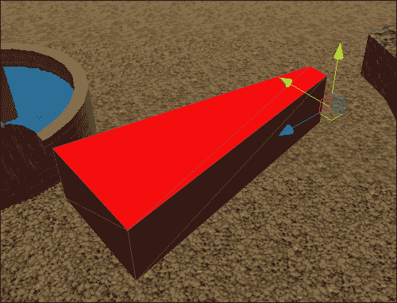
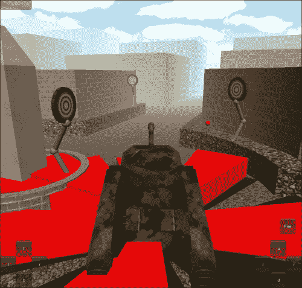
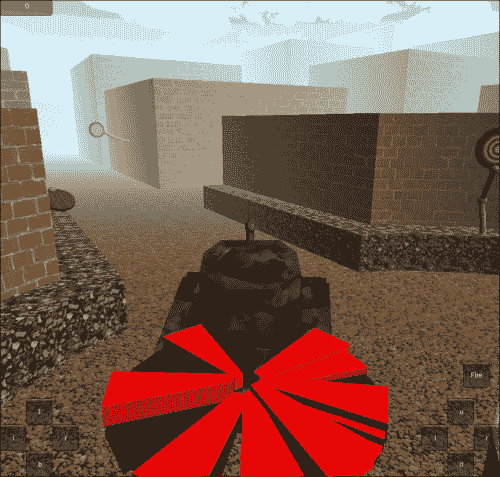
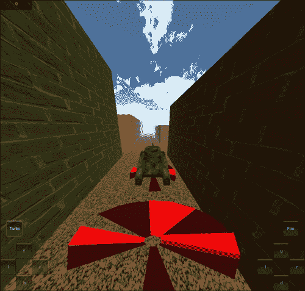
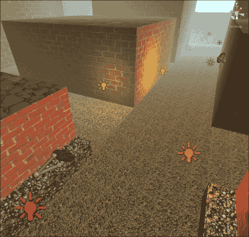
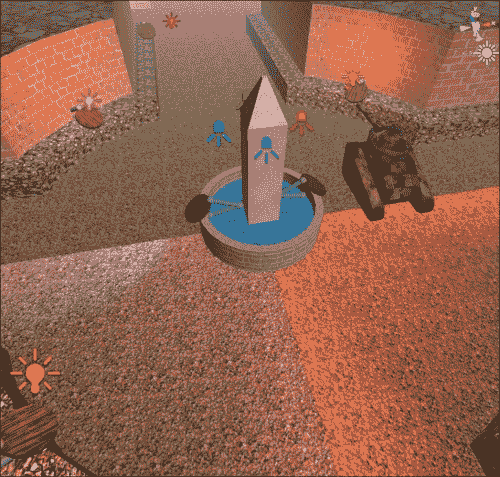
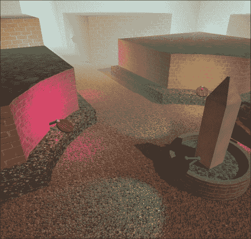
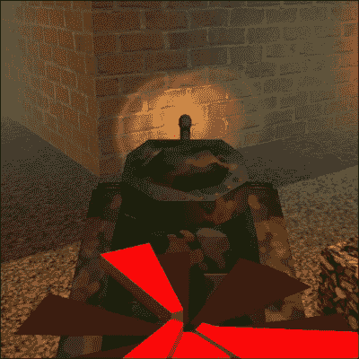
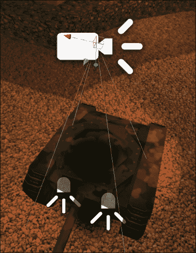
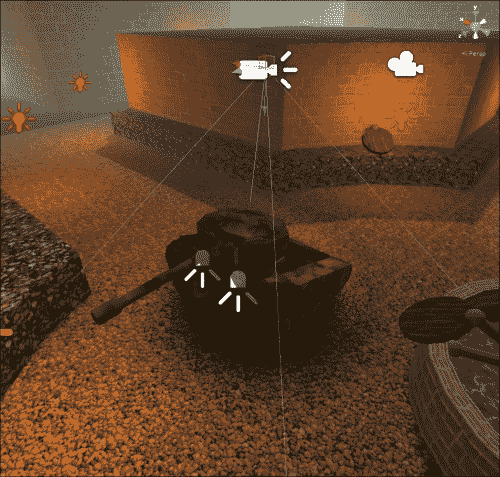

# 第四章。搭建舞台 – 摄像头效果和照明

*在上一章中，你学习了任何游戏的基本构建块：网格、材质和动画。我们创建了一个利用所有这些块的坦克大战游戏。*

*在本章中，我们将扩展坦克大战游戏。我们将从添加天空盒和距离雾开始。通过使用第二个摄像头，继续探索摄像头效果，并添加一个坦克的涡轮加速效果，以完善我们对摄像头效果的观察。继续观察照明，我们将通过添加光照贴图和阴影来完成坦克环境的设置。*

在本章中，我们将涵盖以下主题：

+   天空盒

+   距离雾

+   使用多个摄像头

+   调整视野

+   添加灯光

+   创建光照贴图

+   添加饼干

我们将直接利用第三章的项目，即《任何游戏的骨架 – 网格、材质和动画》。因此，在 Unity 中打开它，我们就可以开始了。

# 摄像头效果

有许多优秀的摄像头效果你应该添加，以给你的游戏带来最后的完美触感。在本章中，我们将介绍一些易于添加的选项。这些也将使我们的坦克游戏看起来非常完美。

## 天空盒和距离雾

当摄像头渲染游戏的帧时，它首先会清除屏幕。默认情况下，Unity 中的摄像头通过将一切染成纯蓝色来完成这一操作。然后，所有的游戏网格都会绘制在这个空白屏幕上。对于一场激动人心的坦克大战来说，蓝色相当无聊。所以，幸运的是，Unity 允许我们更改颜色。但是，粉红色并不比蓝色好，所以我们必须改变清除屏幕的方法。这就是天空盒的用武之地。天空盒只是指形成任何游戏背景天空的一系列图像。距离雾与天空盒协同工作，通过简化模型和背景之间的视觉过渡。

# 行动时间 – 添加天空盒和距离雾

我们首先需要的是一个天空盒，这是显而易见的。我们可以自己创建一个；然而，Unity 为我们提供了几个非常出色的天空盒，它们完全可以满足我们的需求。

1.  在 Unity 编辑器的顶部，选择**资产**然后选择**导入包**。在这个列表大约一半的位置，选择**天空盒**。

1.  经过一点处理，一个新窗口将弹出。在 Unity 中，一个包只是一个已经设置好的资产的压缩组。这个窗口显示了内容，并允许我们选择性地导入它们。我们想要所有这些，所以只需点击窗口右下角的**导入**按钮。

1.  在 **Project** 窗口中将添加一个新的文件夹，`Standard Assets`。这个文件夹包含一个名为 `Skyboxes` 的文件夹，其中包含各种天空盒材质。选择其中任何一个。你可以在 **Inspector** 窗口中看到它们是使用 Skybox 着色器的普通材质。每个都有六个图像，每个方向一个。

1.  要将你选择的天空盒添加到游戏中，首先确保你已加载了正确的场景。如果没有，只需在 **Inspector** 窗口中双击它。这是必要的，因为我们即将更改的设置是针对每个场景特定的。

1.  前往 Unity 编辑器的顶部，选择 **Edit**，然后选择 **Render Settings**。新的设置组将出现在 **Inspector** 窗口中。

1.  目前我们关注的是从底部起的第五个值，**Skybox Material**。只需将天空盒材质拖放到 **Skybox Material** 槽中，它将自动更新。变化可以在 **Game** 窗口中查看。

1.  要添加距离雾，我们也在 **Render Settings** 中进行调整。要启用它，只需点击 **Fog** 复选框。

1.  下一个设置，**Fog Color**，允许我们为雾选择一个颜色。选择一个接近天空盒一般颜色的颜色是好的。

1.  **Fog Mode** 是一个下拉列表，用于指定 Unity 将使用哪种方法来计算距离雾。对于几乎所有情况，默认的 **Exp2** 都很合适。

1.  接下来的三个设置，**Fog Density**、**Linear Fog Start** 和 **Linear Fog End**，都决定了雾的密度和开始距离。**Fog Density** 用于 **Exponential** 和 **Exp2** 雾模式，而其他用于 **Linear** 雾模式。将雾置于视线边缘的设置通常很好。添加天空盒和距离雾的时间 - 添加天空盒和距离雾

## *刚才发生了什么？*

我们导入了几个天空盒并将它们添加到场景中。距离雾设置也被打开并调整。现在，我们的场景开始看起来像一款真正的游戏。

## 目标指示器

另一个相当有趣的游戏摄像机效果是使用多个摄像机。第二个摄像机可以用来制作 3D GUI、小地图，或者可能是弹出式安全摄像头。在接下来的这一节中，我们将创建一个指向附近目标的系统。使用第二个摄像机，我们将使其出现在玩家的坦克上方。

# 添加指针的时间 - 创建指针

我们将首先创建一个指向目标的物体。我们将制作一个可以重复使用的预制件。然而，你需要一个玩家可以看到的模型。我们将使用一种饼状类型的网格。大小并不特别重要；我们稍后会调整其比例。让我们执行以下步骤来创建指针：

1.  一旦你创建并导入你的网格，将其添加到场景中。

1.  创建一个空的 `GameObject` 并将其重命名为 `IndicatorSlice`。

1.  将你的网格设置为`IndicatorSlice`的子对象，并定位它，使其沿着 GameObject 的 z 轴指向。`IndicatorSlice`将位于我们的指示器中心。每个创建的切片都将使其 z 轴指向目标的方向。

1.  现在，我们需要创建一个新的脚本，用来控制我们的指示器。在**项目**窗口中创建一个名为**TargetIndicator**的新脚本。

1.  我们从这个脚本开始，定义一对变量。第一个变量将保存对目标对象的引用，该指示器组件将指向这个目标。指示器的大小将根据目标距离的远近而增长或缩小。第二个变量将控制指示器开始增长的距离。

    ```java
    public Transform target;
    public float range = 25;
    ```

1.  下一个函数将用于在创建指示器组件时设置`target`变量。

    ```java
    public void SetTarget(Transform newTarget) {
      target = newTarget;
    }
    ```

1.  最后一段代码放在`LateUpdate`函数中。`LateUpdate`函数用于确保在`Update`函数中坦克移动之后，指示器组件可以指向目标。函数开始时，我们检查目标变量是否有值。如果它是 null，则销毁指示器切片。`Destroy`函数可以用来从游戏中移除任何存在的对象。`gameObject`变量由`MonoBehaviour`类自动提供，并持有与脚本组件附加的`GameObject`的引用。销毁它也将销毁其所有子对象（或附加对象）。

    ```java
    public void LateUpdate() {
      if(target == null) {
        Destroy(gameObject);
        return;
      }
    ```

1.  下面的代码块设置了指示器切片的缩放比例。正如你在下面的代码片段中可以看到，第一行代码使用`Vector3.Distance`来确定两个位置之间的距离。下一行代码确定了切片的垂直缩放，即 y 轴。这是通过一些精心应用的数学和`Mathf.Clamp01`函数来实现的。这个函数将提供的值限制在零和一之间。最后一行代码设置了指示器切片的本地缩放。通过调整本地缩放，我们可以通过仅更改父对象的缩放来轻松控制整个指示器的大小。

    ```java
    float distance = Vector3.Distance(transform.position, target.position);
    float yScale = Mathf.Clamp01((range - distance) / range);
    transform.localScale = new Vector3(1, yScale, 1);
    ```

1.  最后，这段代码用于此脚本。`transform.LookAt`函数是一种自动旋转`GameObject`以使其 z 轴指向世界中的特定位置的高级方式。然而，我们希望所有指示器切片都平铺在地面上，而不是指向可能在我们上面的任何目标。因此，我们收集目标的位置。通过将变量的 Y 值设置为切片的位置，我们确保切片保持平铺。当然，最后一行关闭了`LateUpdate`函数。

    ```java
    Vector3 lookAt = target.position;
    lookAt.y = transform.position.y;
    transform.LookAt(lookAt);
    }
    ```

1.  这就是此脚本的最后一部分代码。返回 Unity，并将`TargetIndicator`脚本添加到场景中的`IndicatorSlice`对象。

1.  为了完成指示器的创建，创建一个它的预制件。

1.  最后，从场景中删除`IndicatorSlice`对象。游戏开始时我们将动态创建切片。这需要预制件，但不是场景中的那个。

## *刚才发生了什么？*

我们创建了一个我们将用来指示目标方向的物体的预制件。附加的脚本将旋转预制件的每个实例以指向目标。它还将调整比例以指示目标与玩家之间的距离。

# 行动时间 - 控制指示器

现在，我们需要创建一个控制指示切片的脚本。这包括在需要时创建新的切片。此外，它附加到的`GameObject`将作为我们刚刚创建的指示切片的中心点，围绕它旋转。

1.  创建一个新的脚本并将其命名为`IndicatorControl`。

1.  我们从这个脚本开始，有一对变量。第一个将保存对刚刚创建的预制件的引用。这将允许我们随时生成其实例。第二个是静态变量，这意味着它可以很容易地被访问，而无需对场景中存在的组件的引用。游戏开始时，它将填充场景中此脚本实例的引用。

    ```java
    public GameObject indicatorPrefab;
    private static IndicatorControl control;
    ```

1.  下一个函数将由目标使用。很快，我们将更新目标的脚本，使其在游戏开始时调用此函数。该函数是静态的，就像变量一样，首先检查其中是否有对任何对象的引用。如果它是空的，等于 null，则使用`Object.FindObjectOfType`尝试填充变量。通过告诉它我们想要找到的对象类型，它将在游戏中搜索并尝试找到。这是一个相对较慢的过程，不应经常使用，但我们使用这个过程和变量，以确保系统总能找到脚本。`CreateSlice`函数的第二部分检查确保我们的静态变量不为空。如果是这样，它就会告诉实例创建一个新的指示切片并将其传递给目标。

    ```java
    public static void CreateSlice(Transform target) {
      if(control == null) {
        control = Object.FindObjectOfType(typeof(IndicatorControl)) as IndicatorControl;
      }

      if(control != null) {
        control.NewSlice(target);
      }
    }
    ```

1.  为此脚本添加一个额外的函数。`NewSlice`函数正如其名所示，在调用时创建新的指示切片。它是通过首先使用`Instantiate`函数创建传递给它的`GameObject`的副本来完成的。函数的第二行使新的切片成为控制变换的子对象。下一行将新切片的局部位置归零。这样，在创建后它将正确居中。最后一行使用切片的`SendMessage`函数调用我们之前创建的`SetTarget`函数，并传递所需的靶对象。

    ```java
    public void NewSlice(Transform target) {
      GameObject slice = Instantiate(indicatorPrefab) as GameObject;
      slice.transform.parent = transform;
      slice.transform.localPosition = Vector3.zero;
      slice.SendMessage("SetTarget", target);
    }
    ```

1.  脚本创建好了，我们需要使用它。创建一个空的`GameObject`并将其命名为`IndicatorControl`。

1.  新的`GameObject`需要成为你的坦克的子对象，然后将其在每个轴上的位置设置为零。

1.  将我们刚刚创建的脚本添加到`IndicatorControl`中。

1.  最后，选择`GameObject`后，添加对`IndicatorSlice`预设件的引用。通过将预设件从**项目**窗口拖动到**检查器**窗口的正确槽位来完成此操作。

## *发生了什么？*

我们创建了一个脚本，用于控制目标指示切片的生成。我们创建的`GameObject`也将使我们能够轻松地控制整个指示器的大小。我们几乎完成了目标指示器的制作。

# 是时候行动了——使用第二个相机

如果你现在开始玩游戏，它看起来仍然没有不同。这是因为目标还没有调用创建指示切片。我们将在完成目标指示器后，在本节中添加第二个相机。

1.  首先，打开`Target`脚本，并在`Awake`函数的末尾添加以下代码行。这一行告诉`IndicatorControl`脚本为这个目标创建一个新的指示切片。

    ```java
    IndicatorControl.CreateSlice(transform);
    ```

    

1.  现在玩游戏时，你可以看到指示器正在起作用。然而，它可能太大，并且显然出现在坦克内部。一个不好的解决方案是将`IndicatorControl`对象移动，直到整个指示器都出现在坦克上方。然而，当爆炸发生，东西开始在空中飞舞时，它们将再次遮挡目标指示器。一个更好的解决方案是添加一个第二个相机。现在通过从 Unity 编辑器的顶部选择**GameObject**，然后选择**创建其他**，最后选择**相机**来完成此操作。

1.  此外，将相机设置为`Main Camera`的子对象。确保将新相机的位置和旋转值设置为零。

1.  默认情况下，Unity 中的每个相机都配备了各种组件：**相机**、**光晕层**、**GUI 层**和**音频监听器**。除了**相机**组件外，其他组件对每个相机通常都不重要，整个场景中应该只有一个**音频监听器**组件。从相机中移除多余的组件，只留下**相机**组件。

1.  在我们对相机进行任何其他操作之前，我们需要更改`IndicatorSlice`预设件所在的层。层用于在对象之间引起选择性的交互。它们主要用于物理和渲染。首先在**项目**窗口中选择预设件。

1.  在**检查器**窗口的顶部是带有下拉列表的**层**标签，列表中显示为**默认**。点击下拉列表，从列表中选择**添加层...**。

1.  现在将出现在**检查器**窗口中一个层的列表。这些都是游戏中使用的层。前几个是为 Unity 保留的；因此，它们被灰色显示。其余的是供我们使用的。点击**用户层 8**的右侧，将其命名为**指示器**。

1.  再次选择`IndicatorSlice`预设件。这次从**层**下拉列表中选择新的**指示器**层。

1.  Unity 会询问我们是否想要更改所有子对象所在的层。我们希望整个对象都渲染在这个层上，因此选择**是，更改子对象**，我们就可以这样做。

1.  现在，回到我们的第二个相机。选择它，并在**检查器**窗口中查看。

1.  **相机**组件的第一个属性是**清除标志**。此选项列表决定了相机在绘制游戏中的所有模型之前将填充背景的内容。第二个相机不会阻挡第一个相机绘制的内容。我们从**清除标志**下拉列表中选择**深度仅**。这意味着，而不是在背景中放置天空盒，它将保留已经渲染的内容，并在其上绘制新内容。

1.  下一个属性，**裁剪遮罩**，控制相机渲染哪些层。前两个选项，**无**和**所有**，用于取消选择和快速选择所有层。对于这个相机，取消选择所有其他层，以便只有**指示器**层旁边有勾选。

1.  最后要做的事情是调整`IndicatorControl`的缩放比例，以确保目标指示器的大小适中。

## *刚才发生了什么？*

我们创建了一个系统来指示潜在目标的方位。为此，我们使用了第二个相机。通过调整**裁剪遮罩**属性中的层，我们可以使相机只渲染场景的一部分。此外，通过将**清除标志**属性更改为**深度仅**，第二个相机可以在第一个相机绘制的内容之上绘制。

## 尝试一下英雄 - 调整位置

通过移动相机，可以改变指示器的绘制位置。如果你移动`IndicatorControl`对象，它将改变目标距离和方向的计算方式。移动并调整第二个相机，以便获得更令人愉悦的目标指示器视图。

当你移动第二个相机或使用下一节中的加速功能时，你可能注意到目标指示器仍然可以在坦克中看到。调整主相机，使其不渲染目标指示器。这和我们在第二个相机上只渲染目标指示器的方式非常相似。

## 涡轮加速

本章我们将探讨的最后一种相机效果是涡轮加速。它将在屏幕上显示一个按钮，玩家按下后会快速向前推进一段时间。相机效果之所以重要，是因为对**视野**属性的简单调整可以使我们看起来移动得更快。电影中通常使用类似的方法来使汽车追逐看起来更快。

# 行动时间 - 使用加速效果

在本节中，我们只将编写一个脚本。它将以与我们在上一章中创建的`ChassisControls`脚本类似的方式移动坦克。不同之处在于，我们不需要按住按钮来使加速功能生效。让我们开始吧。

1.  首先，创建一个新的脚本，并将其命名为`TurboBoost`。

1.  要启动脚本，我们需要四个变量。第一个是`CharacterController`的引用。我们需要这个来移动坦克。第二个是我们加速时的移动速度。第三个是我们将加速多长时间，以秒为单位。最后一个用于内部判断我们是否可以加速以及何时应该停止。

    ```java
    public CharacterController controller;
    public float boostSpeed = 50;
    public float boostLength = 5;
    public float startTime = -1;
    ```

1.  接下来的代码返回到我们熟悉的朋友`OnGUI`函数。在这里，我们只是在屏幕上绘制一个按钮，就像我们之前多次做的那样。如果按钮被按下，它将调用我们即将编写的`StartBoost`函数。

    ```java
    public void OnGUI() {
      Rect turboRect = new Rect(10, Screen.height – 220, 75, 75);
      if(GUI.Button(turboRect, "Turbo"))
        StartBoost();
    }
    ```

1.  `StartBoost`函数相当简单。它检查`startTime`变量是否小于零。如果是，变量被设置为`Time.time`提供的当前时间。小于零意味着我们目前没有在加速。

    ```java
    public void StartBoost() {
      if(startTime < 0)
        startTime = Time.time;
    }
    ```

1.  我们将要使用的最后一个函数是`Update`函数。它从检查`startTime`是否正在加速开始。如果我们没有在加速，函数会提前退出。下一行代码检查我们是否有了`CharacterController`引用。如果变量为空，那么我们无法使坦克移动。

    ```java
    public void Update() {
      if(startTime < 0) return;
      if(controller == null) return;
    ```

1.  下一行代码看起来应该很熟悉。这是使坦克移动的行。

    ```java
    controller.Move(controller.transform.forward * boostSpeed * Time.deltaTime);
    ```

1.  以下几行代码实际上应用了相机效果。首先是一个检查，看看我们是否处于加速的前半秒。如果是，我们通过调整`fieldOfView`值来过渡相机。`Camera.main`值是 Unity 提供的对场景中使用的主相机的引用。`Mathf.Lerp`函数根据介于零和一之间的第三个值将起始值移动到目标值。使用这个函数，相机的`fieldOfView`在半秒内移动到目标值。这组代码的第二部分检查我们加速的最后半秒，并使用相同的方法将`fieldOfView`值过渡回默认值。

    ```java
    if(Time.time – startTime < 0.5f)
      Camera.main.fieldOfView = Mathf.Lerp(Camera.main.fieldOfView, 130, (Time.time - startTime) * 2);
    else if(Time.time – startTime > boostLength - 0.5f)
      Camera.main.fieldOfView = Mathf.Lerp(Camera.main.fieldOfView, 60, (Time.time – startTime – boostLength + 0.5f) * 2);
    ```

1.  最后一段代码检查我们是否已经完成加速。如果是，`startTime`被设置为负一，以表示我们可以开始另一个加速。当然，最后一个花括号关闭了`Update`函数。

    ```java
    if(Time.time > startTime + boostLength)
      startTime = -1;
    }
    ```

1.  我们几乎完成了。将脚本添加到坦克中，并连接`CharacterController`引用。

1.  尝试一下。

## *发生了什么？*

我们创建了一个涡轮增压。与上一章中使用的相同移动方法在这里移动坦克。通过调整相机的**视野**属性，我们让坦克看起来移动得更快。

## 尝试一下英雄级操作——风格和控制

这里的简单挑战是设计按钮样式。为了增加趣味性，尝试将其改为在加速时有标签，在不加速时有按钮。标签和按钮可以各自有不同的样式。

在玩游戏时，你可能还会注意到，你可以在加速的同时转向。尝试向`ChassisControls`脚本添加一个检查，以锁定控制，如果我们正在加速。你需要添加对`TurboBoost`脚本的引用。

为了增加额外的挑战，尝试为加速添加冷却时间。让玩家不能持续使用加速。此外，尝试在坦克撞到东西时取消加速。这是一个很大的问题，所以你将从一个提示开始：查看`OnControllerColliderHit`。

# 光源

Unity 提供了各种光源类型来照亮游戏世界。它们是**方向光源**、**聚光灯**、**点光源**和**区域光源**。每种光源都以不同的方式投射光线，以下将详细解释：

+   **方向光源**：这非常像太阳。它将所有光线投射到单一方向。光源的位置并不重要，只有旋转。光线以单一方向投射到场景的整个区域。这使得它非常适合最初向场景添加光线。

+   **聚光灯**：这就像舞台上的聚光灯一样工作。光线以锥形形状向特定方向投射。正因为如此，它也是系统计算中最复杂的光源类型。Unity 在计算光线方面做出了重大改进，但应避免过度使用这些光源。

+   **点光源**：这是你游戏中将使用的主要光源类型。它向所有方向发射光线。这就像一个灯泡一样工作。

+   **区域光源**：这是一种特殊用途的光源。它从平面以单一方向发射光线。想象一下，它就像用来宣传酒店或餐厅的大型霓虹灯招牌。由于它们的复杂性，这些光源只能在烘焙阴影时使用。当游戏运行时，由于计算量太大，它们无法使用。

当谈到光线时，下一个明显的问题就是阴影，尤其是实时阴影。虽然实时阴影可以为场景增添很多效果，并且在技术上任何平台都可行，但它们非常昂贵。此外，它们是 Unity Pro 的功能。总的来说，这使得它们对于普通移动游戏来说有点过于复杂。

另一方面，有一些完全可行的替代方案，成本远低于实时阴影，而且通常看起来比实时阴影更真实。第一个是针对你的环境。一般来说，游戏中的环境永远不会移动，也不会在特定场景中改变。为此，我们有光照贴图。这些是包含阴影数据的额外纹理。使用 Unity，你可以在制作游戏时创建这些纹理。然后，当游戏运行时，它们会自动应用，你的阴影就会出现。然而，这并不适用于动态对象（任何移动的物体）。

对于动态对象，我们有饼干。这些不是你祖母的饼干。在照明中，饼干是一种黑白图像，它被投射到游戏中的网格上。这类似于影子戏。影子戏使用剪影来遮挡光线的一部分，而饼干使用黑白图像来告诉光线它可以投射到哪些地方。

饼干也可以用来创建其他一些很棒的效果，无论是静态的还是动态的，比如云层在场景中移动的效果。也许是从笼子里投射出的光线。或者，你可以用它们来制作手电筒不均匀的焦点。

# 现在是时候添加更多灯光了

向场景添加额外的灯光相当简单。此外，只要坚持使用点光源，渲染它们的成本就会保持较低。

1.  在 Unity 编辑器的顶部，选择**GameObject**，然后选择**Create Other**，最后选择**Point Light**。

1.  在选择新的灯光后，在**Inspector**窗口中我们关注几个属性。

    +   **范围**：这是光线从物体发出的距离。从这个点发出的光线在中心最亮，随着达到范围的极限而逐渐变暗。范围在**场景**视图中还以黄色线球的形式表示。

    +   **颜色**：这仅仅是光线的颜色。默认情况下，它是白色的；然而，这里可以使用任何颜色。这个设置在所有灯光类型之间共享。

    +   **强度**：这是光线的亮度。光线的强度越大，光线中心的亮度就越高。这个设置在所有灯光类型之间共享。

1.  创建并放置更多灯光，沿着街道排列，以增加环境的趣味性。

1.  使用*Ctrl* + *D*可以复制选定的对象。这可以大大加快创建过程。

1.  在添加这些灯光时，你可能注意到了它们的一个主要缺点。实时影响表面的灯光数量是有限的。通过使用更复杂的网格，可以在一定程度上绕过这一点。更好的选择是使用光照贴图，我们将在下一节中看到。

1.  再次在 Unity 编辑器的顶部，选择**GameObject**，然后选择**Create Other**，这次选择**Spotlight**。

1.  再次选择新的灯光，并在**Inspector**窗口中查看它。

    +   **聚光角度**：这是此类灯光的独特之处。它决定了光线发出的锥形范围有多宽。与**范围**一起，它在**场景**视图中以黄色线锥的形式表示。

1.  在我们坦克战斗城市中心的喷泉周围添加几个聚光灯。

1.  场景中有这么多对象开始使**层次结构**窗口变得杂乱，难以找到任何东西。为了组织它们，你可以使用空的`GameObject`。创建一个并命名为`PointLights`。

1.  通过使所有点光源成为这个空`GameObject`的子对象，**层次结构**窗口变得明显更加整洁。

## *发生了什么？*

我们向游戏中添加了几个光源。通过改变灯光的颜色，我们使场景看起来更加有趣，玩起来也更加吸引人。然而，照明系统的缺点也被揭露了。我们使用的城市非常简单，一次能影响平面的灯光数量有限。虽然我们的场景外观得到了改善，但大部分的震撼效果都被这个缺点所削弱。

## 光照贴图

光照贴图非常适合复杂的照明设置，这些设置在运行时可能过于昂贵或根本无法实现。它们还允许你在不使用实时阴影的情况下，为游戏世界添加详细的阴影。然而，它只适用于在整个游戏过程中不移动的对象。

# 行动时间——创建光照贴图

光照贴图是任何游戏环境的绝佳效果，但我们需要明确告诉 Unity 哪些对象不会移动，然后使用光照贴图。

1.  首件事是使我们的环境网格静态。为此，首先选择你城市的一部分。

1.  在对象名称字段右侧的**检查器**窗口的右上角有一个复选框和一个**静态**标签。勾选此框将使对象变为静态。

1.  使整个城市的网格都变为静态。

    ### 小贴士

    如果你有任何类型的分组（就像我们刚才对灯光所做的），这个步骤可以完成得更快。

    1.  选择你城市的根对象，即所有城市部分、建筑和街道的父对象。

    1.  现在去选择**静态**复选框。

    1.  在新的弹出窗口中，选择**是，更改子对象**以使所有子对象也变为静态。

1.  任何未展开或 UV 位置超出归一化 UV 空间的网格在 Unity 生成光照贴图时将被跳过。在**模型导入设置**窗口中，有一个选项可以让 Unity 自动生成光照贴图坐标，**生成光照贴图**。如果你正在使用`TankBattleCity`作为你的环境，现在应该打开此选项。

1.  前往 Unity 编辑器的顶部，选择**窗口**然后选择**光照贴图**，位于底部附近。

1.  你大部分时间都会花在**烘焙**页面上查看这个窗口。在窗口顶部选择**烘焙**以切换到该页面。

1.  **模式**决定了系统将渲染哪些类型的光照贴图。为了节省处理速度和文件大小，从右侧的**模式**下拉列表中选择**单光照贴图**。这意味着只创建**远**光照贴图集，而不是**近**和**远**。使用**双光照贴图**还需要特殊的着色器，您在大多数情况下都不会使用。

1.  **品质**是一组预设，决定了光照贴图看起来有多好。**高**显然是最好的，而**低**是处理速度最快的。对于我们的目的，**低**看起来已经足够好，应该被选中。

1.  **分辨率**决定了对象在单个光照贴图上占据的空间大小。在输入字段右侧，它显示为每世界单位 texels。texel 是一种用于光照贴图的高级像素类型。它是世界空间中单个单位空间在光照贴图上占据的像素数。这里的 30 设置将保持所需的品质水平，同时使整个过程运行得更快。

1.  在页面底部有一个**烘焙场景**按钮。点击此按钮将开始渲染过程。Unity 右下角将出现一个加载条，以便您可以监控进度。

    1.  如果您仍在调整灯光和设置，并希望看到游戏的一部分外观，请先选择您希望看到的网格。

    1.  接下来，点击**烘焙场景**按钮右侧的小箭头。

    1.  从新的下拉列表中选择**烘焙所选**。这将运行与**烘焙场景**相同的过程，但它只针对所选对象而不是整个场景。

        ### 小贴士

        警告，这个过程可能需要一段时间。特别是随着环境和灯光数量的增加，运行时间会越来越长。而且，除非您有一台性能优越的电脑，否则在它运行时在 Unity 中您几乎无法做什么。

1.  如果您点击了按钮并意识到自己犯了一个错误，不要担心。在**烘焙场景**被选中后，按钮将变为**取消**。此时您可以选中它并停止进程继续。然而，一旦纹理被创建并且 Unity 开始导入它们，就无法停止了。

1.  在**烘焙场景**左侧是**清除**。这个按钮是删除和移除场景中当前使用的所有光照贴图最快、最简单的方法。这无法撤销。

1.  为了给您的建筑添加阴影，在场景中选择**方向光**，并查看**检查器**窗口。

1.  从**阴影类型**下拉列表中选择**软阴影**。这将为这个灯光打开阴影。如果您使用 Unity Pro，它还会打开这个灯光的实时阴影。打开阴影的灯光越多，渲染成本就越高。

1.  当你的所有灯光和设置都符合你的期望时，选择**烘焙场景**，并惊奇地凝视现在在你面前的美丽场景。

## *发生了什么？*

我们向游戏世界中添加了光照贴图。仅处理这一步骤所需的时间就使得进行细微调整变得困难。然而，通过几次点击，我们的照明得到了极大的改善。在此之前，灯光被网格破坏，我们现在有了平滑的颜色和灯光区域。

## 尝试一下英雄 – 理由和速度

在玩游戏时，人们不会质疑的唯一光源是太阳。如果看不到光源，其他任何灯光看起来都很奇怪。创建一个网格并将其添加到游戏中，为使用的灯光提供一个理由。这可能是火炬、路灯，甚至是发光的外星粘液球。无论它们最终变成什么，拥有它们都会增加那种完整性，使游戏从一般的外观变得出色。

作为第二个挑战，看看你的光照贴图的质量。玩一下我们讨论的各种质量设置，看看有什么区别。同时，找出在出现像素化之前分辨率可以降低多少。当在较小的移动设备屏幕上运行时，设置可以进一步降低吗？去找出答案。

## Cookies

Cookies 是给你的游戏中的灯光增加兴趣的绝佳方式。它们使用纹理来调整光线的发射方式。这种效果可以覆盖从闪耀的晶体到笼子工业灯光的广泛用途，在我们的案例中，是车头灯。

# 行动时间 – 应用车头灯

通过给我们的坦克添加车头灯，我们给玩家提供了控制他们世界中灯光的能力。使用 cookie，我们可以使它们比光圈更有趣。

1.  首先，创建一个**聚光灯**。

1.  将灯光放置在坦克前方，并指向远离的方向。

1.  在**检查器**窗口中，将**强度**属性值增加到三。这将使我们的车头灯像真实的车头灯一样明亮。

1.  现在我们需要一些 cookie 纹理。在 Unity 编辑器的顶部，选择**资产**，然后选择**导入包**，最后选择**Light Cookies**。

1.  在新窗口中，选择**导入**并等待加载条完成。

1.  我们现在有几个选项可供选择。在`Standard Assets`文件夹内，创建了一个新的文件夹，`Light Cookies`，其中包含新的纹理。从**项目**窗口中拖动`Flashlight`并将其放置在**检查器**窗口中**Cookie**字段上的**聚光灯**。添加 cookie 到灯光就这么简单。

1.  为了完成它，复制第二个车头灯的光源，并使它们都成为坦克的孩子。如果没有和我们一起，车头灯有什么用呢？

## *发生了什么？*

我们使用饼干为我们的坦克创建了一对车头灯。这正是许多其他游戏，尤其是恐怖游戏，创建手电筒效果的方式。

## 尝试一下英雄 - 添加开关

尝试编写一个脚本，允许玩家打开和关闭车头灯。它应该是一个简单的按钮，用于切换灯光。查看作为灯光一部分提供的 enabled 变量。

作为一项更简单的挑战，创建一个位于坦克炮塔上的灯。给它也加上灯光。这样，玩家就可以将灯光指向他们射击的方向，而不仅仅是坦克指向的方向。

# Blob 阴影

Blob 阴影是给角色添加阴影的一种更简单、更经济的办法。它们自时间之初就存在。正常阴影是一个物体在另一个表面上形成的固态、深色的投影。阴影的轮廓与物体的轮廓完全一致。当角色开始随机移动时，这会变得计算成本高昂。

Blob 阴影是位于角色或物体下方的黑色纹理块。它通常没有明确可定义的形状，并且永远不会与它打算成为阴影的物体的轮廓相匹配。Blob 阴影通常也不会改变大小。这使得它计算起来显著更容易，因此成为许多代视频游戏的首选阴影。这也意味着它对于我们的移动设备来说是一个更好的选择，因为在移动设备上处理速度可能会迅速成为一个问题。

# 行动时间 - 带阴影的坦克

我们将给我们的坦克添加一个 Blob 阴影。Unity 已经为我们做了大部分工作；我们只需要将其添加到坦克上。

1.  我们首先通过导入 Unity 的 Blob 阴影开始。在 Unity 编辑器的顶部，选择**资产**，**导入包**，最后选择**投影器**。

1.  在新窗口中选择**导入**，并在**项目**窗口中查看在`Standard Assets`下创建的新文件夹`Projectors`。

1.  将`Blob 阴影投影器`预制体从**项目**窗口拖到场景中，并将其放置在坦克上方。

1.  不幸的是，阴影出现在我们的坦克上方。为了解决这个问题，我们需要再次利用层。因此，选择坦克。

1.  从**层**下拉列表中选择**添加层...**。

1.  点击**用户层 9**的右侧，并将其命名为`PlayerTank`。

1.  再次选择你的坦克，但这次从**层**下拉列表中选择`PlayerTank`。

1.  当新窗口弹出时，务必选择**是，更改子项**以更改整个坦克的层。如果不这样做，Blob 阴影可能会出现在坦克的一些部分上，而不会出现在其他部分上。

1.  现在，从**层次结构**窗口中选择`Blob 阴影投影器`。

    ### 小贴士

    阴影是由**投影器**组件创建的。这个组件的功能与**摄像头**组件类似。然而，它将图像放在世界上，而不是将世界变成图像并显示在屏幕上。

1.  看一下**检查器**窗口。我们现在关心的是**忽略图层**的值。目前它设置为**无**。

1.  点击**无**，然后从**图层**下拉列表中选择`PlayerTank`。这将使投影仪忽略坦克，并且只在它下面显示阴影。

1.  下一步是将阴影的大小调整到与坦克大小大致匹配。调整**视野**属性的值，直到大小看起来大致合适。大约 70 的值似乎是一个不错的起点。

1.  最后一步是将**Blob Shadow Projector**设置为坦克的子对象。我们需要能够带着我们的阴影一起移动；我们不希望丢失它。

## *刚才发生了什么？*

我们给我们的坦克添加了阴影。阴影非常适合让物体，尤其是角色，看起来像它们实际上是在接触地面。我们使用的阴影比实时阴影更好，因为它处理得更快。

## 尝试一下英雄 – 让它变得方形

随着阴影一起提供的纹理是圆形的，但我们的坦克主要是方形的。尝试为阴影创建自己的纹理并使用它。某种矩形形状应该会很好。

如果你成功地为阴影添加了自己的纹理，那么不妨看看那个大炮？大炮从我们的坦克中伸出，破坏了它原本的方形轮廓。使用一个附加在炮塔上的第二个阴影，为大炮投射阴影。它的纹理也将需要是矩形形状。

# 概述

到目前为止，你应该已经非常熟悉摄像头效果和灯光了。

在本章中，我们首先探讨了使用多个摄像头。然后我们尝试了涡轮增压摄像头效果。本章继续讲述了我们城市的照明。当我们使用光照贴图时，灯光得到了极大的改善。我们通过查看用于特殊照明效果的 cookie 和阴影来结束本章。

在下一章中，我们将看到为我们的游戏创建敌人。我们将使用 Unity 的路径查找系统让它们移动并追逐玩家。之后，如果玩家希望保持他们的分数，他们需要变得更加活跃。
