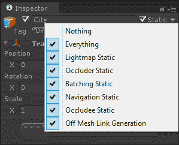
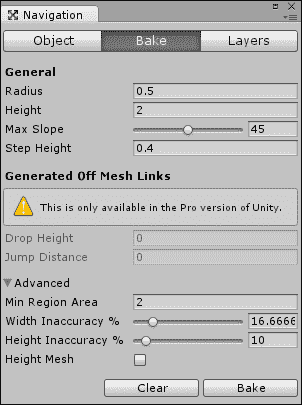
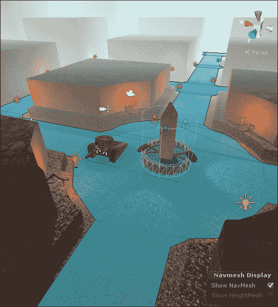
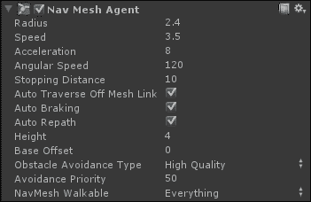
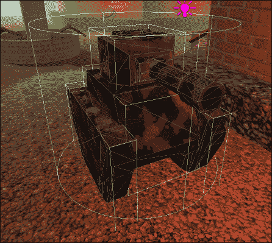
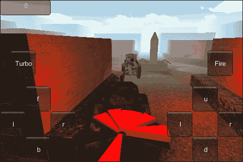
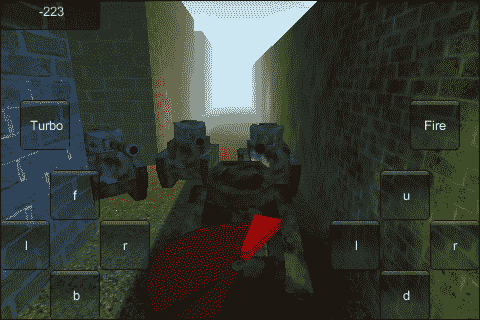

# 第五章。四处走动 – 寻路和人工智能

*在前一章中，我们学习了关于摄像机和照明效果的知识。我们在坦克大战游戏中添加了天空盒、灯光和阴影。我们创建了光照贴图来使场景动态。我们通过给坦克添加车头灯来查看饼干。我们还通过为坦克创建一个阴影来查看投影仪。还为坦克创建了一个涡轮增压。通过调整摄像机的观看角度，我们能够使坦克看起来比实际速度快得多。当我们完成时，我们有一个动态且看起来很刺激的场景。*

*本章全部关于敌人。玩家将不再能够只坐在一个地方来收集分数。我们将向游戏中添加一个敌方坦克。通过使用 Unity 的 NavMesh 系统，坦克将能够进行寻路并追逐玩家。一旦被发现，坦克就会开火并减少玩家的分数。*

在本章中，我们将涵盖以下主题：

+   NavMesh

+   NaveMeshAgent

+   寻路

+   追击和攻击人工智能

+   生成点

我们将对第四章中的坦克大战游戏进行修改，第四章，*搭建舞台 – 摄像机效果和照明*，所以请打开它，我们可以开始。

# 理解人工智能和寻路

**人工智能**正如你可能猜到的，是**人工智能**。在广义上，这是任何非生命物体可能做的事情，以看起来像是在做决策。你可能最熟悉这个概念来自视频游戏。当一个角色，不是由玩家控制的，选择一个武器和一个目标来使用，这就是人工智能。

在其最复杂的形式中，人工智能试图模仿完整的人类智能。然而，仍有太多事情发生得非常快，以至于这很难真正成功。视频游戏不需要达到这种程度。我们主要关注的是让我们的角色看起来聪明，但仍然可以被我们的玩家征服。通常，这意味着不让角色根据比真实玩家可能拥有的更多信息来行动。调整角色拥有的信息和可以采取行动的信息量是调整游戏难度的好方法。

**寻路**是人工智能的一个子集。我们经常使用它，尽管你可能从未意识到这一点。正如其词义所示，寻路就是找到一条路径。每次你需要在你和任何两个点之间找到路径时，你就是在进行寻路。就我们的角色而言，最简单的寻路形式是沿着直线到目标点。显然，这种方法在开阔平原上效果最好，但如果有任何障碍物，这种方法就会失败。另一种方法是使用网格覆盖游戏。使用网格，我们可以找到一条绕过任何障碍物并达到目标的路径。

路径查找的另一种方法，也许是最常选择的方法，是使用一个特殊的导航网格，或称为 NavMesh。这是一个玩家永远不会看到的特殊模型，但它覆盖了计算机角色可以移动的所有区域。然后以类似网格的方式导航，区别在于使用网格的三角形而不是网格的方形。这是我们将在 Unity 中使用的方法。Unity 提供了一套很好的工具来创建 NavMesh 并利用它。

# NavMesh

在 Unity 中创建导航网格非常简单。这个过程与我们制作光照贴图的过程类似。我们只需标记一些网格用于使用，在一个特殊窗口中调整一些设置，然后点击一个按钮。所以，如果你还没有这样做，请加载 Unity 中的坦克战斗游戏，我们就可以开始了。

# 时间行动 - 创建 NavMesh

Unity 可以自动从场景中存在的任何网格生成 NavMesh。为此，网格必须首先被标记为静态，就像我们对光照贴图所做的那样。然而，我们不想或不需要能够导航我们城市的屋顶，因此我们使用一组特殊的设置来指定每个对象将是什么类型的静态：

1.  从 **Hierarchy** 窗口中选择城市，然后在 **Inspector** 窗口中点击 **Static** 右侧的向下箭头，我们可以查看静态对象可用的选项如下：

    +   **Nothing**: 此选项用于快速取消选择所有其他选项。如果所有其他选项都被取消勾选，则此选项将被勾选。

    +   **Everything**: 使用此选项，您可以快速选择所有其他选项。当所有这些选项都被勾选时，此选项也会被勾选。**Inspector** 窗口中 **Static** 标签旁边的复选框执行与勾选和取消勾选 **Everything** 复选框相同的操作。

    +   **Lightmap Static**: 在使用光照贴图时，需要勾选此选项，以便它们能够正常工作。任何未勾选此选项的网格将不会进行光照贴图处理。

    +   **Occluder Static**: 这是一个用于处理遮挡的选项。**Occlusion** 是一种运行时优化方法，它只渲染实际上可以看到的对象，无论它们是否在摄像机的视图空间内。**Occluder** 是一个将阻止其他对象被看到的对象。它与 **Occludee Static** 选项协同工作。此选项的最佳对象选择是大型且坚固的。

    +   **Batching Static**: 这是另一种运行时优化的选项。批处理是在渲染之前将对象分组的行为。它大大提高了游戏的整体渲染速度。

    +   **Navigation Static**: 这是目前我们主要关注的选项。任何勾选了此选项的网格将在计算 NavMesh 时使用。

    +   **被遮挡物静态**: 如前所述，此选项与**遮挡物静态**结合使用，以利于遮挡。被遮挡物是指将被其他物体遮挡的物体。当被遮挡物遮挡时，此物体将不会绘制。

    +   **离网链接生成**: 此选项也与 NavMesh 计算一起工作。离网链接是 NavMesh 两个物理上未连接的部分之间的连接，例如屋顶和街道。通过在**导航**窗口中使用一些设置和此选项，链接将自动生成。

1.  为了使 NavMesh 正常工作，我们需要更改设置，以便只有城市的街道可以导航。你上次看到坦克跳到或从建筑物的屋顶上下来是什么时候？因此，我们需要更改**静态**选项，以便只有街道有**导航静态**被选中。这可以通过以下两种方式之一完成：

    +   第一种方法是逐一取消我们想要更改的每个对象的选项。

    +   第二种方法是取消**层次结构**窗口中顶级对象的**导航静态**选项，当 Unity 询问我们是否要为所有子对象进行更改时，回答“是”。然后，仅针对我们想要导航的对象重新选中此选项。

1.  现在，通过访问 Unity 的工具栏并点击**窗口**，然后点击菜单底部的**导航**来打开**导航**窗口。以下截图显示了制作 NavMesh 的所有工作的窗口：

1.  此窗口由三个页面和各种设置组成：

    +   当选择一个对象时，设置将出现在**对象**页面上。两个复选框直接对应于我们刚才设置的相同名称的**静态**选项。**导航层**下拉列表让我们可以为 NavMesh 的不同部分使用不同的层。这些层可以用来影响路径查找计算。例如，可以将汽车设置为仅在道路层上行驶，而人类可以跟随人行道层。

    +   **烘焙**页面是我们感兴趣的一个页面；它充满了更改 NavMesh 生成方式的选项。

        **半径**: 这应该设置为平均角色的尺寸。它用于防止角色走得太靠近墙壁。

        **高度**: 这是角色的身高。使用此设置，Unity 可以计算并移除角色无法通过的区域。任何低于此值的区域都被认为是太小了。

        **最大坡度**: 在计算 NavMesh 时，任何比此值更陡峭的物体都将被忽略。

        **步高**: 当使用楼梯时，必须使用此值。这是角色可以踩上的楼梯的最大高度。

        **下落高度**: 这是指角色可以坠落的高度。有了这个设置，路径将包括从边缘跳下的情况，如果这样做更快的话。从截图可以看出，这是一个 Unity Pro 独有的功能。

        **跳跃距离**: 使用这个值，角色可以在 NavMesh 中跳过间隙。这个值代表可以跳过的最长距离。从截图可以看出，这是一个 Unity Pro 独有的功能。

        **最小区域面积**: 如果 NavMesh 的部分区域太小，小于这个值的任何区域将不会被用于最终的 NavMesh 中。

        **宽度误差百分比**: 在进行 NavMesh 计算时，Unity 使用了许多近似值。这并不完全准确，但速度很快。这个值代表水平方向允许的误差量。

        **高度误差百分比**: 这与之前的设置相同，区别在于它适用于垂直方向。

        **高度网格**: 如果选中这个选项，原始的高度信息将保留在 NavMesh 中。除非你有特殊需求，否则这个选项应该保持关闭状态。它需要更长的时间来计算，并且需要更多的内存来存储。

    +   第三页，**层**，允许我们调整每个层的移动成本。基本上，移动通过我们游戏世界的不同部分有多难。对于汽车，我们可以调整层，使它们在田野中移动的成本是沿路的两倍。

        在窗口底部，我们有两个按钮：

        **清除**: 这个按钮删除之前创建的 NavMesh。使用此按钮后，您需要重新烘焙 NavMesh，然后才能再次使用路径查找。

        **烘焙**: 这个按钮开始工作并创建 NavMesh。

1.  我们的城市非常简单，所以默认值将足够适合我们。点击**烘焙**并观察右下角的进度条。一旦完成，会出现一个蓝色网格。这就是 NavMesh，当然，代表了一个角色可以移动通过的所有区域。

1.  我们还需要做最后一件事。我们的 NavMesh 恰到好处，但如果仔细观察，它会穿过城市中心的喷泉。如果敌方坦克开始开进喷泉，那就太不合适了。为了修复这个问题，首先选择形成喷泉周围墙壁的网格。

1.  在 Unity 的工具栏中，点击**组件**，然后是**导航**，最后是**NavMeshObstacle**。这仅仅是一个组件，它告诉导航系统在寻找路径时绕行。因为我们已经选择了墙壁，所以新的组件已经调整大小以适应。你可以在**场景**视图中看到它表示为一个线框圆柱体。

## *发生了什么？*

我们创建了 NavMesh。我们使用了**导航**窗口和**静态**选项来告诉 Unity 在计算 NavMesh 时使用哪些网格。Unity 团队为此过程投入了大量工作，使其变得快速且简单。

## 英雄试炼——创建额外障碍

记住，在第三章中，*任何游戏的骨架——网格、材质和动画*，当挑战是为玩家创建障碍时，你被鼓励创建额外的网格，例如坦克陷阱和碎石。让敌方坦克通过这些障碍是个坏主意。所以，尝试将这些转换为导航系统的障碍。这将与喷泉的做法一样。

# NavMeshAgent 组件

你可能会想，我们有了 NavMesh，但没有角色可以导航它。在本节中，我们将开始创建我们的敌方坦克。

# 行动时间——创建敌方坦克

在进行任何 AI 类型编程之前，我们需要导入并设置第二个坦克：

1.  从章节的起始资源中选择`Tanks_Type03.png`和`Tanks_Type03.blend`，并将它们导入到`Models`文件夹下的`Tanks`文件夹中。

1.  一旦 Unity 完成导入，请在**项目**窗口中选择新的坦克，并在**检查器**窗口中查看它。

1.  这辆坦克没有动画，因此可以将**动画类型**设置为**无**，并分别从**骨架**和**动画**页面取消勾选**导入动画**。

1.  将坦克从**项目**窗口拖到**场景**窗口；任何清晰的街道区域都行。

1.  首先，将**场景**视图中的模型重命名为`EnemyTank`。

1.  现在，我们需要更改坦克的父级，以便炮塔可以旋转，炮管可以跟随，就像我们对玩家的坦克所做的那样。为此，创建一个空的**GameObject**并将其重命名为`TurretPivot`。

1.  将`TurretPivot`定位在炮塔的底部。

1.  在**层次结构**窗口中，将`TurretPivot`拖放到`EnemyTank`上，使`EnemyTank`成为父对象。

1.  仍然在**层次结构**窗口中，将炮管和炮塔网格对象设置为`TurretPivot`的子对象。当 Unity 询问你是否确定要断开预制件连接时，请确保点击**是**。

1.  坦克有点大，所以需要在**检查器**窗口中调整坦克的导入设置中的**缩放因子**为`0.6`，以得到大约与玩家大小相当的坦克。

1.  为了让坦克能够导航我们的新 NavMesh，我们需要添加一个**NavMeshAgent**组件。首先，在**层次结构**窗口中选择`EnemyTank`，然后转到 Unity 的工具栏；点击**组件**，然后点击**导航**，接着点击**NavMeshAgent**。在**检查器**窗口中，我们可以看到新的组件及其相关设置，如下面的截图所示：

    +   **半径**：这仅仅是代理的大小。与我们在**导航**窗口中设置的**半径**值一起工作，这可以防止对象部分地走进墙壁。

    +   **速度**：当**NavMeshAgent**组件有路径时，它会自动移动连接的对象。此值决定了以每秒多少单位速度跟随路径。

    +   **加速度**：这是代理将加速到的最大速度。

    +   **角速度**：这是代理每秒可以转动的度数。人会有很高的角速度，而汽车的角速度会很低。

    +   **停止距离**：这是代理开始减速并停止距离目标目的地有多远。

    +   **自动穿越离网链接**：勾选此复选框后，代理在路径查找时将使用离网链接，例如跳跃缺口和从边缘掉落。

    +   **自动制动**：勾选此复选框后，代理一到达目的地就会停止，而不是因为不规则的帧率而超过去。

    +   **自动重新规划路径**：如果找到的路径因任何原因不完整，此复选框允许 Unity 自动尝试找到一个新的路径。

    +   **高度**：此设置影响编辑器中出现的围绕代理的圆柱体。它只是设置了该圆柱体的高度。

    +   **基础偏移**：这是附加到代理上的碰撞器的垂直偏移。

    +   **障碍物避免类型**：这是代理在寻找绕过障碍物的平滑路径时将投入多少努力。质量越高，工作越多。

    +   **避免优先级**：此值决定了谁有通行权。值高的代理会绕过值低的代理。

    +   **NavMesh 可通行**：还记得之前在讨论**导航**窗口时提到的那些层吗？这就是我们可以设置代理能够穿越的层的地方。只有在这个列表中勾选的层才会用于路径查找。

1.  现在我们已经了解了设置，让我们来使用它们。对于敌方坦克，**半径**设置为`2.4`，**高度**设置为`4`将工作得很好。你应该能在**场景**窗口中看到另一个线形圆柱体，这次是在我们的敌方坦克周围。

1.  最后要做的就是将`EnemyTank`转换为预制体。就像我们处理目标一样做，通过从**层次结构**窗口拖动它，并将其放置在**项目**窗口中的`Prefabs`文件夹上。

## *刚才发生了什么？*

我们创建了一个敌人坦克。我们还了解了**NavMeshAgent**组件的设置。然而，如果你现在尝试玩游戏，什么都不会发生。这是因为**NavMeshAgent**组件没有被赋予一个目的地。我们将在下一节解决这个问题。

# 追逐

我们接下来的任务是让我们的敌人坦克追逐玩家。我们需要两个脚本。第一个脚本将简单地广播玩家的当前位置。第二个脚本将使用那个位置和我们之前设置的**NavMeshAgent**组件来找到通往玩家的路径。

# 行动时间 – 玩家在这里

通过一个非常短的脚本，我们可以轻松地让所有敌人知道玩家的位置：

1.  首先在**项目**窗口的`Scripts`文件夹中创建一个新的脚本。命名为`PlayerPosition`。

1.  这个脚本将从单个静态变量开始。这个变量将简单地保存玩家的当前位置。因为它是一个静态变量，所以我们可以轻松地从我们的其他脚本中访问它。

    ```java
    public static Vector3 position = Vector3.zero;
    ```

1.  对于接下来的代码行，我们使用`Start`函数。当场景首次加载时，这个函数会自动被调用。我们使用它来确保`position`变量可以在游戏开始时立即填充并使用。

    ```java
    public void Start() {
      position = transform.position;
    }
    ```

1.  代码的最后一段只是将`position`变量在每一帧更新为玩家的当前位置。我们也在`LateUpdate`函数中这样做，以确保在玩家移动之后完成。`LateUpdate`函数在每个帧的末尾被调用。这样，玩家就可以在`OnGUI`和`Update`函数期间移动，并且他们的位置稍后会被更新。

    ```java
    public void LateUpdate() {
      position = transform.position;
    }
    ```

1.  使用这个脚本的最后一步是将它添加到玩家的坦克上。所以，回到 Unity，从项目窗口拖放脚本到坦克上，就像我们之前对所有的其他脚本所做的那样，添加它作为一个组件。

## *刚才发生了什么？*

我们为追逐 AI 创建了第一个必要的脚本。这个脚本只是更新一个变量，该变量包含玩家的当前位置。我们将在下一个脚本中使用它，我们将让敌人坦克四处移动。

# 行动时间 – 追逐玩家

我们接下来的脚本将控制我们的简单追逐 AI。因为我们正在使用**NavMesh**和**NavMeshAgent**组件，我们可以将路径查找的大部分困难部分留给 Unity：

1.  再次创建一个新的脚本。这次给它命名为`ChasePlayer`。

1.  这个脚本的第一个代码行只是保存了我们之前设置的**NavMeshAgent**组件的引用。我们需要访问这个组件来移动敌人。

    ```java
    public NavMeshAgent agent;
    ```

1.  代码的最后部分首先确保我们有了**NavMeshAgent**引用，然后更新我们的目标目的地。它使用之前设置的`PlayerPosition`脚本变量和**NavMeshAgent**的`SetDestination`函数。一旦我们告诉函数去哪里，**NavMeshAgent**组件就会做所有艰难的工作，带我们到那里。我们在`FixedUpdate`函数中更新目标目的地，因为我们不需要在每一帧都更新目的地。更新太频繁可能会导致严重的延迟，如果有很多敌人。`FixedUpdate`函数以固定间隔调用，比帧率慢，所以它很完美。

    ```java
    public void FixedUpdate() {
      if(agent == null) return;

      agent.SetDestination(PlayerPosition.position);
    }
    ```

1.  我们现在需要将脚本添加到我们的敌人坦克中。在**项目**窗口中选择`prefab`，并将脚本拖放到**检查器**面板中，位于**NavMeshAgent**组件下方。

1.  一定要连接引用，就像我们之前做的那样。将**NavMeshAgent**组件拖到**检查器**窗口中的**代理**值。

1.  现在玩游戏来尝试一下。无论敌人从哪里开始，它都会绕过所有建筑并到达玩家的位置。当你驾驶时，你可以观察敌人跟随。然而，敌人坦克最终穿过了我们的坦克。而且，我们也可以穿过它。

1.  修复这个问题的第一步是添加一些碰撞器。从**组件**菜单下的**物理**中添加一个**盒子碰撞器**组件到炮塔、底盘以及每个**履带箱**对象。大炮和履带不需要碰撞器。履带箱已经覆盖了履带的区域，而大炮的目标太小，无法被正确射击。

    ### 注意

    如果你正在**场景**视图中进行任何这些更改，请确保在**检查器**窗口中点击**应用**按钮来更新根预制对象。

1.  最后要更改的是**NavMeshAgent**组件上的**停止距离**属性。当坦克战斗时，它们进入射程并开始射击。它们不会试图占据与敌人相同的空间，除非那个敌人很小且柔软。通过将**停止距离**设置为`10`，我们能够复制这种行为。

## *发生了什么？*

在本节中，我们创建了一个脚本，使**NavMeshAgent**组件，在这种情况下是我们的敌人坦克，去追逐玩家。我们添加了碰撞器以阻止我们穿过敌人。我们还调整了**停止距离**以获得更好的坦克行为。

## 尝试英雄般的动作 – 添加阴影

尝试给敌人坦克添加一个阴影。这将给它一个更好的视觉上的接地感。你可以直接复制为玩家坦克制作的那个。

# 被攻击

没有冲突的游戏有什么乐趣；那令人烦恼的选择，那场殊死搏斗，那宇宙的末日？每个游戏都需要某种形式的冲突来驱使玩家寻求解决方案。我们的游戏将变成一场争夺分数的战斗。在此之前，它只是射击一些目标并获得一些分数。

现在，我们将让敌方坦克射击玩家。每次敌人击中，我们将减少玩家几分。

# 行动时间 - 准备射击

敌人将以与玩家射击相似的方式射击，但我们将使用一些基本的 AI 来控制方向和射击速度，以替换玩家的输入控制：

1.  我们将从这个名为 `ShootAtPlayer` 的新脚本开始。在 `Scripts` 文件夹中创建它。

1.  就像我们所有的其他脚本一样，我们从这个脚本开始时有两个变量。第一个变量将保存敌方坦克的最后位置。如果坦克在移动，它将不会射击，因此我们需要存储那个最后位置以查看我们是否移动了。第二个变量将是我们可以移动和射击的最大速度。如果坦克移动得比这个速度快，它将不会开火。

    ```java
    private Vector3 lastPosition = Vector3.zero;
    public float maxSpeed = 1f;
    ```

1.  下两个变量决定了坦克准备射击所需的时间。在每一帧都射击玩家是不现实的。因此，我们使用第一个变量来调整准备射击所需的时间长度，第二个变量来存储射击何时准备就绪。

    ```java
    public float readyLength = 2f;
    private float readyTime = -1;
    ```

1.  下一个变量是炮塔旋转的速度。当坦克准备射击时，炮塔不会旋转指向玩家。这给了玩家一个移动避开的机会。然而，我们需要一个速度来防止炮塔在射击后立即转向面对玩家。

    ```java
    public float turretSpeed = 45f;
    ```

1.  这里最后两个变量持有坦克其他部分的引用。`turretPivot` 变量当然是我们要旋转的炮塔的旋转点。`muzzlePoint` 变量将用作我们的炮火发射点。这些将按照与玩家坦克相同的模式使用。

    ```java
    public Transform turretPivot;
    public Transform muzzlePoint;
    ```

1.  对于脚本的第一个功能，我们将使用 `Update` 函数。它首先调用一个函数来检查是否可以发射炮火。如果我们能发射，我们会对我们的 `readyTime` 变量进行一些检查。如果它小于零，我们还没有开始准备射击，并调用一个函数来这样做。否则，如果它小于当前时间，我们已经完成了准备，并调用一个函数来发射炮火。如果我们不能发射，我们首先调用一个函数来清除任何准备，然后旋转炮塔面对玩家。

    ```java
    public void Update() {
      if(CheckCanFire()) {
        if(readyTime < 0) {
          PrepareFire();
        }
        else if(readyTime <= Time.time) {
          Fire();
        }
      }
      else {
        ClearFire();
        RotateTurret();
      }
    }
    ```

1.  接下来，我们将创建我们的`CheckCanFire`函数。代码的第一部分检查我们是否移动得太快。首先，我们使用`Vector3.Distance`来查看自上一帧以来我们移动了多远。通过将距离除以帧的长度，我们能够确定我们移动的速度。然后，我们使用当前的位置更新我们的`lastPosition`变量，以便它为下一帧做好准备。最后，我们将当前速度与`maxSpeed`进行比较。如果我们在这帧中移动得太快，我们就无法射击并返回一个`false`的结果。

    ```java
    public bool CheckCanFire() {
      float move = Vector3.Distance(lastPosition, transform.position);
      float speed = move / Time.deltaTime;

      lastPosition = transform.position;

      if(speed > maxSpeed) return false;
    ```

1.  对于`CheckCanFire`函数的第二部分，我们检查炮塔是否指向玩家。首先，我们找到指向玩家的方向。给定空间中的任何点，从它减去第二个点的位置，将给出从第二个点到第一个点的方向向量。然后，我们通过将`y`值设置为`0`来简化方向。这是因为在玩家上下看时我们不想这样做。然后，我们使用`Vector3.Angle`来找到指向玩家方向和我们的炮塔前进方向之间的角度。最后，我们将角度与一个低值进行比较，以确定我们是否在看着玩家，并返回结果。

    ```java
      Vector3 targetDir = PlayerPosition.position – turretPivot.position;
      targetDir.y = 0;

      float angle = Vector3.Angle(targetDir, turretPivot.forward);

      return angle < 0.1f;
    }
    ```

1.  `PrepareFire`函数简单快捷。它只是将我们的`readyTime`变量设置为坦克完成射击准备的未来时间。

    ```java
    public void PrepareFire() {
      readyTime = Time.time + readyLength;
    }
    ```

1.  `Fire`函数首先确保我们有一个可以从中射击的`muzzlePoint`引用。

    ```java
    public void Fire() {
      if(muzzlePoint == null) return;
    ```

1.  函数继续创建一个`RaycastHit`变量来存储射击结果。我们使用`Physics.Raycast`和`SendMessage`，就像我们在`FireControls`脚本中做的那样，射击任何东西并告诉它我们击中了它。

    ```java
    RaycastHit hit;
    if(Physics.Raycast(muzzlePoint.position, muzzlePoint.forward, out hit)) {
      hit.transform.gameObject.SendMessage("RemovePoints", 3, SendMessageOptions.DontRequireReceiver);
    }
    ```

1.  `Fire`函数通过清除射击准备来完成。

    ```java
      ClearFire();
    }
    ```

1.  `ClearFire`函数是另一个快速函数。它将我们的`readyTime`变量设置为小于零，表示坦克没有准备射击。

    ```java
    public void ClearFire() {
      readyTime = -1;
    }
    ```

1.  脚本中的最后一个函数是`RotateTurret`。它首先检查`turretPivot`变量，如果引用缺失则取消函数。接着，它找到指向玩家的平面方向，就像我们之前做的那样。然后，我们创建`step`变量来保存这一帧我们可以移动的距离。我们使用`Vector3.RotateTowards`找到一个比当前前进方向更接近指向目标的向量。最后，我们使用`Quaternion.LookRotation`创建一个特殊的旋转，使炮塔指向新的方向。

    ```java
    public void RotateTurret() {
      if(turretPivot == null) return;

      Vector3 targetDir = PlayerPosition.position – turretPivot.position;
      targetDir.y = 0;

      float step = turretSpeed * Time.deltaTime;

      Vector3 rotateDir = Vector3.RotateTowards(turretPivot.forward, targetDir, step, 0);
      turretPivot.rotation = Quaternion.LookRotation(rotateDir);
    }
    ```

1.  现在，回到 Unity 中，创建一个空的**GameObject**并将其重命名为`MuzzlePoint`。

1.  将`MuzzlePoint`的位置设置为我们为玩家所做的，在炮管末端。

1.  将`MuzzlePoint`设置为炮管的子对象，并在**Inspector**窗口中将其任何**Y**旋转归零。

1.  接下来，将我们的新`ShootAtPlayer`脚本添加到敌方坦克上。此外，连接到`TurretPivot`和`MuzzlePoint`变量的引用。

1.  最后，对于敌人坦克，在**检查器**窗口中点击**应用**按钮以更新预制体。

1.  如果你现在玩游戏，你会看到敌人旋转指向你，但你的分数从未减少。这是因为两个问题。首先，坦克略微漂浮。无论你在世界的哪个地方放置它，在玩游戏时，坦克都会略微漂浮。这是因为 NavMeshAgent 组件的工作方式。修复方法是简单的，只需在**检查器**窗口中将**基础偏移**设置为`-0.3`。这会让系统上当，并将坦克放在地面上。

1.  第二个原因是分数没有变化是因为玩家缺少一个函数。打开`ScoreCounter`脚本。

1.  我们将添加`RemovePoints`函数。给定一个数值，这个函数简单地从玩家的分数中减去这么多分数。

    ```java
    public void RemovePoints(int amount) {
      score -= amount;
    }
    ```

    

## *刚才发生了什么？*

我们赋予了敌人攻击玩家的能力。新的`ShootAtPlayer`脚本首先检查坦克是否减速以及大炮是否对准了玩家。如果是这样，它将对玩家进行常规射击以减少他们的分数。如果玩家希望在游戏结束时保留任何分数，他们需要不断移动并快速瞄准目标。

## 英雄尝试——玩家反馈

除非你密切关注你的分数，否则很难判断你是否正在被射击。我们将在未来的章节中处理爆炸，即使如此，玩家也需要一些反馈来了解发生了什么。大多数游戏会在玩家被击中时在屏幕上闪烁红色纹理，无论是否有爆炸。尝试创建一个简单的纹理，并在玩家被击中时在屏幕上绘制半秒钟。

# 攻击敌人

当面对无法与之战斗的敌人时，玩家往往会很快感到沮丧。因此，我们将赋予玩家伤害和摧毁敌人坦克的能力。这将以类似于射击目标的方式工作。

# 行动起来——赋予它弱点

让我们的敌人变弱的最简单方法是为它们提供一些生命值，当它们被射击时会减少，当生命值耗尽时摧毁它们：

1.  我们首先创建一个新的脚本，并将其命名为`Health`。

1.  这个脚本相当简短，并且从一个单一变量开始。这个变量将跟踪坦克剩余的生命值。通过将默认值设置为`3`，坦克在被摧毁之前能够承受三次攻击。

    ```java
    public int health = 3;
    ```

1.  这个脚本也只包含一个函数，`Hit`。就像目标的情况一样，当玩家射击它时，这个函数由`BroadcastMessage`函数调用。函数的第一行将`health`减少一点。下一行检查`health`是否低于零。如果是，通过调用`Destroy`函数并传递`gameObject`变量来销毁坦克。我们还给玩家一些分数。

    ```java
    public void Hit() {
      health--;
      if(health <= 0) {
        Destroy(gameObject);
        ScoreCounter.score += 5;
      }
    }
    ```

1.  真的是这样简单。现在，将新脚本添加到**项目**窗口中的`EnemyTank`预制体，它将更新场景中当前所有的敌方坦克。

1.  尝试一下。在场景中添加几个额外的敌方坦克，并观察它们围绕你移动，在你射击它们时消失。

## *发生了什么？*

我们给敌方坦克一个弱点，即生命值。通过创建一个简短的脚本，坦克能够跟踪其生命值并检测它是否被射击。一旦坦克的生命值耗尽，它将从游戏中移除。

## 尝试一下英雄般的操作——为敌人着色

我们现在有两个射击目标：动画目标和坦克。然而，它们都由红色切片指示。尝试使指向坦克的切片颜色不同。你将需要复制`IndicatorSlice`预制体并修改`IndicatorControl`脚本，以便在调用`CreateSlice`和`NewSlice`函数时能够指定使用哪种类型的切片。

作为进一步的挑战，当我们给一个生物一些生命值时，玩家希望能够看到他们对其造成的伤害量。你可以有两种方法来做这件事。首先，你可以在坦克上方放置一个立方体簇。然后，每次坦克失去生命值时，就删除一个立方体。第二种选项稍微复杂一些，在 GUI 中绘制条形并根据剩余的生命值改变其大小。为了使条形在摄像机移动时保持在坦克上方，请查看文档中的`Camera.WorldToScreenPoint`。

# 生成

在游戏开始时，游戏中的敌人数量有限并不适合我们的游戏以保持持久的乐趣。因此，我们需要创建一些生成点。随着坦克被摧毁，这些生成点将产生新的坦克，以保持玩家保持警惕。

# 行动时间——创建生成点

在本节中我们将创建的脚本将保持我们的游戏世界充满玩家可能想要摧毁的所有敌人：

1.  我们需要为这部分创建另一个新的脚本。一旦创建，将其命名为`SpawnPoint`。

1.  这个脚本简单地开始，定义了几个变量。第一个变量将保存对`EnemyTank`预制体的引用。我们需要它来生成副本。

    ```java
    public GameObject tankPrefab;
    ```

1.  第二个变量跟踪生成的坦克。当它被销毁时，我们将创建一个新的坦克。使用这个变量，我们防止游戏被敌人淹没。坦克的数量将和生成点一样多。

    ```java
    private GameObject currentTank;
    ```

1.  第三个变量用于设置玩家距离，以防止在玩家上方生成坦克。如果玩家在这个距离之外，可以生成一个新的坦克。如果他们在里面，则不会生成新的坦克。

    ```java
    public float minPlayerDistance = 10;
    ```

1.  我们将使用第一个函数是`FixedUpdate`。它将首先检查一个函数，看是否需要生成一个新的坦克。如果需要，它将调用`SpawnTank`函数来生成。

    ```java
    public void FixedUpdate() {
      if(CanSpawn())
        SpawnTank();
    }
    ```

1.  接下来，我们创建`CanSpawn`函数。函数的第一行检查我们是否已经有了坦克，如果有，则返回`false`。第二行使用`Vector3.Distance`来确定玩家当前的距离。最后一行将这个距离与玩家需要到达的最小距离进行比较，以确定我们是否可以生成任何东西，并返回结果。

    ```java
    public bool CanSpawn() {
      if(current != null) return false;

      float currentDistance = Vector3.Distance(PlayerPosition.position, transform.position);
      return currentDistance > minPlayerDistance;
    }
    ```

1.  最后一个函数，`SpawnTank`，首先检查确保`tankPrefab`引用已经被连接。如果没有东西可以生成，它将无法继续。第二行使用`Instantiate`函数创建预制体的副本。为了将其存储在我们的变量中，我们使用`as GameObject`使其成为正确的类型。最后一行将新坦克移动到生成点的位置。我们不希望坦克出现在随机的位置。

    ```java
    public void SpawnTank() {
      if(tankPrefab == null) return;

      currentTank = Instantiate(tankPrefab) as GameObject;
      currentTank.transform.position = transform.position;
    }
    ```

1.  返回 Unity，创建一个空的**GameObject**，并将其重命名为`SpawnPoint`。

1.  将我们刚刚创建的`SpawnPoint`脚本添加到其中。

1.  接下来，选择生成点，通过从`Prefabs`文件夹中将`EnemyTank`预制体拖动并放置在适当的值上，连接预制体引用。

1.  现在，通过从**Hierarchy**窗口拖动并放置到`Prefabs`文件夹中，将`SpawnPoint`对象转换为预制体。

1.  最后，用新的点填充城市。在每个角落放置一个点将工作得很好。

## *发生了什么？*

我们为游戏创建了生成点。每个点都会生成一个新的坦克。当一个坦克被摧毁时，在生成点处会创建一个新的坦克。你可以自由地构建游戏并在你的设备上尝试它。本节和本章现在已完成，准备总结。

## 英雄试炼 - 一对二

每个坦克有一个生成点很好，直到我们想要很多坦克。或者，我们希望它们都在同一个位置生成。这里的挑战是让一个生成点跟踪多个坦克。如果任何一个坦克被摧毁，应该创建一个新的。你肯定需要一个数组来跟踪所有的坦克。还要实现一个生成延迟。我们不希望它一次生成多个坦克。

现在你已经拥有了所有需要的知识和工具，作为一个进一步的挑战，尝试创建其他类型的敌方坦克。实验一下大小和速度。它们也可以有不同的强度，或者在摧毁时获得更多分数。也许有一种坦克在玩家射击它们时会给玩家加分。玩一玩，享受其中的乐趣。

## 快速问答 - 理解敌人

Q1. 在游戏中，最常见的行为可能是使用枪支射击。我们已经做过几次了。你还记得我们用来确定子弹可能击中哪里和什么的函数吗？

1.  `Input.mousePosition`

1.  `Transform.position`

1.  `Physics.Raycast`

Q2. 我们需要许多敌人四处奔跑，以便我们可以射击它们。你还记得我们用来让它们在 NavMesh 上移动的函数吗？

1.  `CharacterController.Move`

1.  `NavMeshAgent.SetDestination`

1.  `NavMesh.CalculatePath`

Q3. 最后，所有这些敌人将不得不一次又一次地被生成。你还记得我们用来生成这些敌人的函数吗？

1.  `Instantiate`

1.  `Destroy`

1.  `Start`

# 摘要

在本章中，我们学习了 NavMesh 和路径查找。我们还做了一些与 AI 相关的工作。这可能是最简单的 AI 类型之一，但追逐行为对所有类型的游戏都至关重要。为了利用所有这些，我们创建了一个敌方坦克。它追逐玩家并向他们射击以减少他们的分数。为了给玩家一些优势，我们给敌方坦克增加了生命值。现在，玩家可以射击敌方坦克以及目标以获得分数。但是，我们也创建了一些生成点。每次坦克被摧毁时，都会创建一个新的坦克。从一般游戏玩法来看，我们的坦克大战游戏几乎已经完成。

在下一章中，我们将创建一个新的游戏。为了探索移动平台的一些特殊功能，我们将创建一个太空战斗机游戏。几乎所有的按钮都将从屏幕上移除，以支持新的控制方法。我们将把设备的倾斜传感器转换成我们的转向方法。而且，我们必须触摸敌人来射击它们。我们还将探讨不同的生成方法，为玩家提供无尽的飞行空间。
