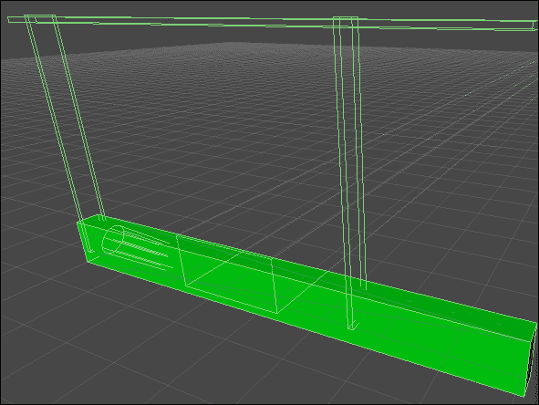
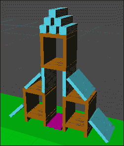
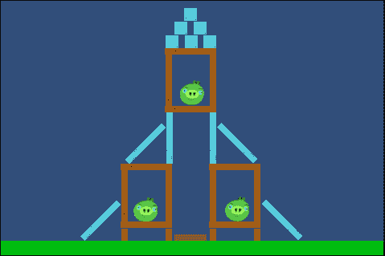
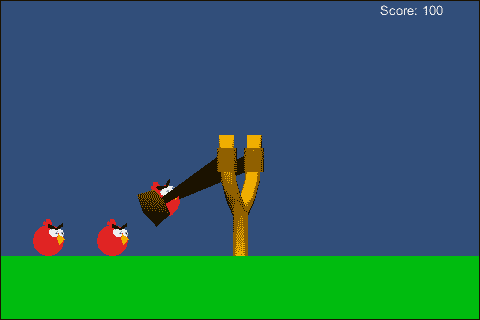
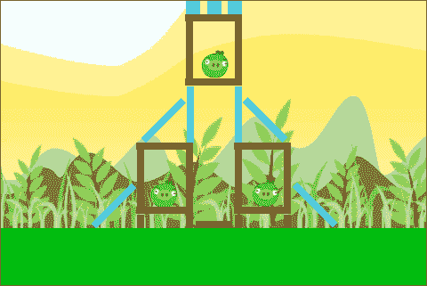
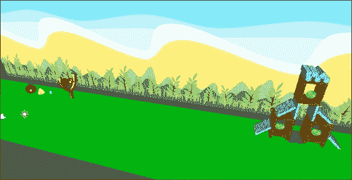

# 第七章. 摆脱重量 - 物理和 2D 相机

*在前一章中，我们学习了移动设备的特殊功能以及如何创建触摸和倾斜控制。我们还创建了一个太空战斗机游戏来使用这些新控制。飞船的操控是通过倾斜设备，而射击是通过触摸屏幕完成的。使用一些特殊的移动技巧，我们给了玩家无限的飞行空间和敌人来战斗。*

*在本章中，我们暂时从太空战斗机游戏中休息一下，来探索 Unity 的物理引擎。我们还将查看创建 2D 游戏体验的选项。为了完成所有这些，我们将重新创建市场上最受欢迎的移动游戏之一，愤怒的小鸟。我们将使用物理来投掷小鸟并摧毁结构。我们还将查看创建级别选择屏幕的过程。*

在本章中，我们将涵盖以下主题：

+   Unity 物理

+   垂直滚动

+   等距相机

+   级别选择

我们将为本章创建一个新项目，所以启动 Unity，让我们开始吧！

# 3D 世界中的 2D 游戏

在开发游戏时，可能最未被充分认识到的一点是，在像 Unity 这样的 3D 游戏引擎中可以创建 2D 风格的游戏。与其他事物一样，它有其自身的优点和缺点，但为了生成令人愉悦的游戏体验，这种选择可能是值得的。最主要的优点是，可以为游戏使用 3D 资源。这允许动态光照和阴影轻松地被包含在内。然而，如果使用 2D 引擎，任何阴影都需要直接绘制到资源中，而且很难使其动态化。在缺点方面，2D 资源在 3D 世界中的使用。完全有可能使用它们，但为了达到所需的细节并避免出现像素化，需要大文件大小。然而，大多数 2D 引擎都使用矢量艺术，这将在图像缩放和缩小时会保持线条平滑。此外，可以使用正常动画为 3D 资源，但对于任何 2D 资源通常需要逐帧动画。总的来说，对于许多开发者来说，优点已经超过了缺点，创造出了大量外观出色的 2D 游戏，你可能从未意识到这些游戏实际上是在 3D 游戏引擎中制作的。现在，我们将通过重新创建广受欢迎的愤怒的小鸟游戏来设计另一款游戏。

# 行动时间 - 准备世界

让我们开始为愤怒的小鸟游戏准备世界：

1.  要开始这一切，我们需要在 Unity 中创建一个新项目。将其命名为`Ch7_AngryBirds`将是一个不错的选择。确保将目标平台更改为**Android**，并将**包标识符**设置为适当的值。

1.  接下来，导入本章的起始资源并创建一些文件夹以保持一切井然有序。

1.  在 Unity 中，将游戏从 3D 转换为 2D 非常简单。只需选择默认存在于每个新场景中的**主摄像头**对象，找到**投影**值，然后从下拉列表中选择**正交**。

    ### 小贴士

    每个摄像头都有两种渲染游戏的方式。**透视**渲染利用摄像头与物体之间的距离，模仿现实世界；距离摄像头较远的物体比距离较近的物体绘制得小。**正交**渲染不考虑这一点；物体不会根据其与摄像头的距离进行缩放。

1.  初始时，摄像头所看到的场景范围过大。要改变这一点，将**大小**值设置为`5`。这将减少摄像头渲染的空间量。这个值将帮助我们专注于游戏中的动作。

1.  要使摄像头能够正确使用，将其**位置**设置为**X**轴的`10`，**Y**轴的`3`，**Z**轴的`0`。此外，将其**旋转**的**Y**轴设置为`-90`。所有东西都将沿着 z 轴定位，因此我们的摄像头需要设置为观察轴，并且足够远，以便它不在动作中。

1.  接下来，我们需要一个地面。因此，前往 Unity 的菜单栏，点击**GameObject**，然后点击**Create Other**，最后点击**Cube**。这足以作为一个简单的地面。

1.  为了让它看起来更像地面，创建一个绿色材质并将其应用到**Cube**上。

1.  地面立方体需要足够大，以覆盖我们的整个游戏区域。为此，将其**缩放**设置为**X**轴的`5`，**Y**轴的`10`，**Z**轴的`100`。此外，将其**位置**设置为**X**和**Y**轴的`0`，**Z**轴的`30`。由于 x 轴上没有物体移动，地面只需要足够大，以便其他将在场景中的物体可以着陆。然而，它确实需要足够宽和高，以防止摄像头看到边缘。

1.  目前，由于缺乏光源，地面看起来相当暗。从 Unity 的菜单栏点击**GameObject**，然后点击**Create Other**，最后点击**Directional Light**来为场景增加一些亮度。它应该被放置在照亮面对摄像头的立方体侧面的位置。

1.  接下来，我们需要防止场景中所有将要飞行的对象跑得太远并造成问题。为此，我们需要创建一些触发体积。最简单的方法是创建三个更多的立方体。将一个放置在地面对象的每个末端，最后一个立方体大约在 50 个单位的高度。然后，调整它们以形成一个与地面相同的盒子。每个立方体应该没有比单个单位更厚，并且它们需要深入五单位，与地面相同。接下来，移除它们的**Mesh Renderer**和**Mesh Filter**组件。这将移除可见的盒子，同时留下碰撞体积。要将它们更改为触发体积，请在每个**Box Collider**组件上勾选**Is Trigger**复选框。

1.  要使体积实际上阻止对象跑得太远，我们需要创建一个新的脚本。创建它并将其命名为`GoneTooFar`。

1.  此脚本有一个单一、简短的功能，`OnTriggerEnter`。我们使用它来销毁可能进入体积的任何对象。此函数由 Unity 的物理系统用于检测对象何时进入触发体积。我们将在稍后详细介绍，但在此阶段，要知道两个对象中的一个是体积或进入它的对象，需要有一个**Rigidbody**组件。在我们的情况下，当它们进入触发体积时，我们可能想要移除的所有内容都将有一个**Rigidbody**组件。

    ```java
    public void OnTriggerEnter(Collider other) {
      Destroy(other.gameObject);
    }
    ```

1.  最后，返回 Unity 并将脚本添加到三个触发体积对象上。

## *刚才发生了什么？*

我们为我们的 2D 游戏完成了初始设置。通过将我们的摄像机视图更改为**Orthographic**，视图从 3D 游戏切换到 2D 游戏。我们还为场景创建了一个地面和一些触发体积。这些一起将防止我们的鸟和其他任何东西跑得太远。

# 物理

在 Unity 中，物理模拟主要关注使用**Rigidbody**组件。当**Rigidbody**组件附加到任何对象上时，它将被物理引擎接管。该对象将在重力作用下下落，并撞击任何具有碰撞器的对象。在我们的脚本中，要使用`OnCollision`函数和`OnTrigger`函数，至少需要将**Rigidbody**组件附加到两个交互对象中的至少一个上。然而，**Rigidbody**组件可能会干扰我们可能使对象采取的任何特定运动。不过，每个**Rigidbody**都可以标记为运动学，这意味着物理引擎不会移动它。我们用于坦克的**CharacterController**组件是一个特殊、修改过的**Rigidbody**。在本章中，我们将大量使用**Rigidbody**组件，将所有的鸟、方块和猪与物理引擎联系起来。

## 构成要素

对于我们的第一个物理对象，我们将创建猪城堡所用的块。我们将创建三种类型的块：木头、玻璃和橡胶。凭借这些简单的块，我们将能够轻松地创建大量不同级别和结构，供小鸟摧毁。

# 是时候行动了——创建木板

我们将要创建的每个块都将非常相似：

1.  首先，我们将创建一块木板。为此，我们需要另一个立方体。将其重命名为`Plank_Wood`。

1.  将木板的**Scale**设置为**X**和**Y**轴为`2`，**Z**轴为`0.25`。它在 y 和 z 轴上的缩放定义了玩家看到的尺寸。x 轴上的缩放确保它将被场景中的其他物理对象击中。

1.  接下来，创建一个新的材质，使用`plank_wood`纹理，并将其应用到立方体上。

1.  要将这个新的木板转换为物理对象，请添加一个**Rigidbody**组件。确保选择木板，然后转到 Unity 的菜单栏，点击**Component**，然后点击**Physics**；最后，点击**Rigidbody**。

1.  我们需要防止木板沿着 x 轴移动，并与我们的其他物理对象对齐，同时防止它旋转以向玩家展示其另一面。为此，我们利用**Rigidbody**组件上的**Constraints**组中的复选框。在**Freeze Position**旁边勾选**X**轴的复选框，并在**Freeze Rotation**旁边勾选**Y**和**Z**轴的复选框。这将防止对象以我们不希望的方式移动。

1.  为了使木板在我们的游戏中正常工作，我们需要创建一个新的脚本，并将其命名为`Plank`。

1.  这个脚本从一系列变量开始。前两个变量用于跟踪长板的健康状况。我们需要将总健康量与当前健康量分开，这样我们就能检测到对象健康量减少到一半的情况。在那个时刻，我们将利用接下来的三个变量将对象的材料更改为显示损坏的材料。最后一个变量用于对象耗尽健康量并被摧毁时。我们将用它来增加玩家的分数。

    ```java
    public float totalHealth = 100f;
    private float health = 100f;

    public Material damageMaterial;
    public Renderer plankRenderer;
    private bool didSwap = false;

    public int scoreValue = 100;
    ```

1.  对于脚本的第一个函数，我们使用`Awake`进行初始化。我们确保对象的当前健康量与其总健康量相同，并确保`didSwap`标志设置为`false`。

    ```java
    public void Awake() {
      health = totalHealth;
      didSwap = false;}
    ```

1.  接下来，我们利用 `OnCollisionEnter` 函数。这是一个特殊的函数，由 **Rigidbody** 组件触发，它提供了关于物体碰撞了什么以及如何碰撞的信息。我们使用这些信息来找到 `collision.relativeVelocity.magnitude`。这是物体碰撞的速度，我们将其用作伤害来减少当前的健康值。接下来，函数检查健康值是否减少到一半，如果已经减少，则调用 `SwapToDamaged` 函数。通过使用 `didSwap` 标志，我们确保函数只会被调用一次。最后，对于该函数，它检查健康值是否下降到零以下。如果是，则销毁对象，并调用我们即将制作的 `LevelTracker` 脚本，以增加玩家的得分。

    ```java
    public void OnCollisionEnter(Collision collision) {
      health -= collision.relativeVelocity.magnitude;

      if(!didSwap && health < totalHealth / 2f) {
        SwapToDamaged();
      }

      if(health <= 0) {
        Destroy(gameObject);
        LevelTracker.AddScore(scoreValue);
      }
    }
    ```

1.  最后，对于脚本，我们有 `SwapToDamaged` 函数。它首先将 `didSwap` 标志设置为 `true`。接下来，它检查确保 `plankRenderer` 和 `damageMaterial` 变量有对其他对象的引用。最终，它使用 `plankRenderer.sharedMaterial` 值来切换到损坏的外观材质。

    ```java
    public void SwapToDamaged() {
      didSwap = true;
      if(plankRenderer == null) return;
      if(damageMaterial == null) return;

      plankRenderer.sharedMaterial = damageMaterial;
    }
    ```

1.  在我们能够将 `Plank` 脚本添加到我们的对象之前，我们需要创建之前提到的 `LevelTracker` 脚本。现在就创建它。

1.  这个脚本相当简短，从单个变量开始。该变量将跟踪关卡中玩家的得分，并且是 `static` 的，这样就可以在对象被销毁以获得分数时轻松更改。

    ```java
    private static int score = 0;
    ```

1.  接下来，我们使用 `Awake` 函数确保玩家在开始关卡时从零开始。

    ```java
    public void Awake() {
      score = 0;
    }
    ```

1.  最后，对于脚本，我们添加了 `AddScore` 函数。这个函数简单地接受传递给它的分数数量，并增加玩家的得分。它也是 `static` 的，这样就可以在场景中的任何对象上调用它，而无需引用脚本。

    ```java
    public static void AddScore(int amount) {
      score += amount;
    }
    ```

1.  在 Unity 中，我们需要使用 `plank_wood_damaged` 纹理创建一个新的材质。这将是在脚本中切换到的材质。

1.  将 `Plank` 脚本添加到我们的 `Plank_Wood` 对象中。将 **Damaged Material** 引用连接到新材料，将 **Plank Renderer** 引用连接到对象的 **Mesh Renderer** 组件。

1.  当我们创建不同类型的木板时，我们可以调整 **Total Health** 值以赋予它们不同的强度。对于木制木板，`25` 的值效果相当不错。

1.  接下来，创建一个空的 **GameObject** 并将其重命名为 `LevelTracker`。

1.  将 `LevelTracker` 脚本添加到对象中，它将开始跟踪玩家的得分。

1.  如果你想看到木板的实际效果，将其放置在地面上方并点击播放按钮。游戏开始后，Unity 的物理引擎将接管并让木板在重力作用下落下。如果它开始时的高度足够高，你将能够看到它随着健康值的降低而切换纹理。

1.  为了制作我们需要的另外两个木板，选择 `Plank_Wood` 对象并按 *Ctrl* + *D* 两次来复制它。将一个重命名为 `Plank_Glass`，另一个重命名为 `Plank_Rubber`。

1.  接下来，创建三种新材料。其中一种应该是紫色，用于橡胶板；另一种应使用`plank_glass`纹理用于玻璃板；最后一种材料应使用`plank_glass_damaged`纹理，用于玻璃板损坏时。将新材料应用到新板的适当位置。

1.  至于新板的健康值，玻璃板的值为`15`，橡胶板的值为`100`将非常合适。

1.  最后，将你的三块板转换为预制体，并使用它们为我们构建一个要摧毁的结构。你可以自由地调整它们的大小，但请保持 x 轴不变。此外，所有块应该在 x 轴上的值为零，你的结构应该在大约`30`的 z 轴上居中。

## *发生了什么事？*

我们创建了游戏中将要被摧毁的结构所需的基本块。我们使用了一个**刚体**组件将它们与物理引擎连接起来。此外，我们还创建了一个脚本，用于跟踪它们的健康值，并在健康值降至一半以下时更换材料。

## 英雄尝试 – 创建石块

木材和玻璃作为基本块效果很好。但是，如果我们打算制作更难的关卡，我们需要一些更坚固的材料。尝试制作一个石块。为它创建两个纹理和材料，以展示其原始和损坏状态。

## 物理材料

物理材料是特殊类型的材料，它们会具体告诉物理引擎两个物体应该如何交互。这不会影响物体的外观。它定义了碰撞体的摩擦和弹性。我们将使用它们给我们的橡胶板一些弹性，给玻璃板一些滑动性。

# 行动时间 – 滑动和反弹

物理材料实现起来足够快，将使我们能够用四个简短的步骤完成这一部分：

1.  物理材料就像其他所有内容一样，在**项目**面板中创建。在**项目**面板内右键单击，然后点击**创建** | **物理材料**。创建两个物理材料，一个命名为`Glass`，另一个命名为`Rubber`。

1.  选择其中一个，并在**检查器**窗口中查看它。目前，我们只关心前三个值。其他值用于更复杂的情况。

    +   **动态摩擦**：这个属性是在物体移动时使用的摩擦量。零表示没有摩擦，例如冰，而一表示很多摩擦，例如橡胶。

    +   **静态摩擦**：这个属性与**动态摩擦**功能相同，区别在于它是在物体不移动时使用的。

    +   **弹性**：这个属性是当物体撞击某物或被某物撞击时，其能量反射的程度。零表示没有能量反射，而一表示全部反射。

1.  对于`Glass`材质，将两个摩擦值设置为`0.1`，**弹性**设置为`0`。对于`Rubber`材质，将两个摩擦值设置为`1`，**弹性**设置为`0.8`。

1.  接下来，选择你的`Plank_Glass`预制体，并查看其**Box Collider**组件。要应用你的新物理材质，只需从**Project**拖放到**Material**槽中。对`Plank_Rubber`预制体也做同样操作，任何时间一个对象撞击它们，就会使用这些材质来控制它们的交互。

## **发生了什么？**

我们创建了一对物理材质。它们控制两个碰撞体相互碰撞时的交互方式。使用它们，我们可以控制任何碰撞体所具有的摩擦力和弹性。

# 角色

拥有一堆通用块只是这个游戏的开始。接下来，我们将创建一些角色，为游戏增添一些活力。我们需要一些邪恶的猪来摧毁，和一些善良的鸟来投掷它们。

## 敌人

我们的第一个角色将是敌人猪。单独来看，它们实际上并没有做什么。所以，它们实际上只是我们之前制作的看起来像猪的木块。然而，为了让它们的摧毁成为游戏的目标，我们将扩展我们的`LevelTracker`脚本以监视它们，如果它们全部被摧毁，则触发游戏结束事件。我们还将扩展它以在屏幕上绘制分数并保存分数以供以后使用。为了展示在 3D 环境中使用 2D 资产，猪也被创建为平面纹理。

# 行动时间 - 创建猪

让我们开始创建愤怒的小鸟游戏中的猪：

1.  猪的创建方式与木板的创建方式类似。首先创建一个空的**GameObject**，并将其命名为`Pig`。

1.  接下来，创建一个平面，将其设置为`Pig`对象的子对象，并移除其**Mesh Collider**组件。我们这样做是因为平面需要面向摄像机时的旋转。作为一个空**GameObject**的子对象，允许我们在处理猪时忽略那个旋转。

1.  将平面的本地**位置**在每个轴上设置为`0`，将其**旋转**设置为**X**轴上的`90`，**Y**轴上的`270`，以及**Z**轴上的`0`。这将使平面面向摄像机。

1.  现在，创建两个材质。将一个命名为`Pig_Fresh`，另一个命名为`Pig_Damage`。从它们的**着色器**下拉列表中，选择**透明**，然后是**剪影**，最后是**软边缘不发光**。这允许我们利用纹理的 alpha 通道并提供一些透明度。

1.  通过向它们添加`pig_damage`和`pig_fresh`纹理来完成材质。

1.  向`Pig`对象添加**Sphere Collider**组件、**Rigidbody**组件和`Plank`脚本。我们使用**Sphere Collider**组件，而不是平面自带**Mesh Collider**组件，因为平面没有厚度，因此将与其他对象发生许多碰撞问题。

1.  为了完成猪的创建，将你的材质应用到平面上，并在`Plank`脚本中连接引用。最后，就像我们对其他木板所做的那样，在**刚体**组件上设置**约束**参数。

1.  现在，将猪转换成预制体，并将其添加到你的结构中。记住，在 x 轴上保持它们为零，但你可以自由调整它们的大小、生命值和分数值，以增加它们的多样性。

1.  接下来，我们需要扩展`LevelTracker`脚本。打开它，我们可以添加一些更多的代码。

1.  首先，我们在脚本的开头添加一些变量。第一个，正如其名称所暗示的，将保存场景中所有猪的列表。接下来是一个标志，用于指示游戏是否结束。最后，一个字符串，用于告诉玩家游戏结束的原因。

    ```java
    public Transform[] pigs = new Transform[0];

    private static gameOver = false;
    private static string message = "";
    ```

1.  接下来，我们需要在`Awake`函数中添加一行代码。这仅仅确保当关卡开始时`gameOver`标志为`false`。

    ```java
    gameOver = false;
    ```

1.  我们使用`OnGUI`函数在游戏结束时绘制游戏结束屏幕，或者如果游戏仍在继续，绘制当前的分数。

    ```java
    public void OnGUI() {
      if(gameOver)
        DrawGameOver();
      else
        DrawScore();}
    ```

1.  `DrawScore`函数接受当前的分数，并使用`GUI.Label`在屏幕的右上角绘制它。

    ```java
    private void DrawScore() {
      Rect scoreRect = new Rect(Screen.width – 100, 0, 100, 30);
      GUI.Label(scoreRect, "Score: " + score);
    }
    ```

1.  `DrawGameOver`函数首先使用`GUI.Box`函数在屏幕上绘制一个覆盖整个屏幕的深色框，同时绘制“游戏结束”消息在屏幕上。接下来，它在屏幕中间绘制玩家的最终分数。下面，它绘制了一个按钮。这个按钮将保存玩家的当前分数并加载我们稍后创建的水平选择屏幕。使用`Application.LoadLevel`函数来加载游戏中的任何其他场景。你打算加载的所有场景都必须添加到**文件**菜单中找到的**构建设置**窗口，并且可以使用它们的名称或索引来加载，就像这里使用的那样：

    ```java
    private void DrawGameOver() {
      Rect boxRect =  new Rect(0, 0, Screen.width, Screen.height);
      GUI.Box(boxRect, "Game Over\n" + message);

      Rect scoreRect = new Rect(0, Screen.height / 2, Screen.width, 30);
      GUI.Label(scoreRect, "Score: " + score);

      Rect exitRect = new Rect(0, Screen.height / 2 + 50, Screen.width, 50);
      if(GUI.Button(exitRect, "Return to Level Select")) {
        Application.LoadLevel(0);
        SaveScore();
      }
    }
    ```

1.  在`LateUpdate`函数中，我们调用另一个函数来检查如果游戏尚未结束，是否所有猪都被摧毁了。

    ```java
    public void LateUpdate() {
      if(!gameOver)
        CheckPigs();
    }
    ```

1.  接下来，我们添加`CheckPigs`函数。这个函数会遍历猪的列表，查看它们是否全部被摧毁。如果找到一只仍然存在的猪，它会退出函数。否则，游戏会被标记为结束，并且会设置一条消息通知玩家他们成功摧毁了所有的猪。

    ```java
    private void CheckPigs() {
      for(int i=0;i<pigs.Length;i++) {
        if(pigs[i] != null) return;
      }

      gameOver = true;
      message = "You destroyed the pigs!";
    }
    ```

1.  `OutOfBirds`函数将在我们稍后创建的弹弓中调用，当玩家用完可以发射到猪身上的鸟时。如果游戏尚未结束，该函数将结束游戏并为玩家设置一条适当的消息。

    ```java
    public static void OutOfBirds() {
      if(gameOver) return;

      gameOver = true;
      message = "You ran out of birds!";
    }
    ```

1.  最后，我们有`SaveScore`函数。在这里，我们使用`PlayerPrefs`类。它让我们能够轻松地存储和检索少量数据，非常适合我们的当前需求。我们只需要提供一个唯一的键来保存数据。为此，我们使用一个简短的字符串与由`Application.loadedLevel`提供的关卡索引相结合。接下来，我们使用`PlayerPrefs.GetInt`检索最后保存的分数。如果没有，函数中传递的零将作为默认值返回。最后，我们比较新分数和旧分数，如果新分数更高，则使用`PlayerPrefs.SetInt`保存新分数。

    ```java
    private void SaveScore() {
      string key = "LevelScore" + Application.loadedLevel;
      int previousScore = PlayerPrefs.GetInt(key, 0);
      if(previousScore < score) 
        PlayerPrefs.SetInt(key, score);
    }
    ```

1.  在 Unity 中，需要将猪添加到`LevelTracker`脚本的列表中。选择`LevelTracker`脚本后，将每个猪拖放到**检查器**窗口中的`Pigs`值以添加它们。

## *刚才发生了什么？*

我们创建了猪并更新了我们的`LevelTracker`脚本以跟踪它们。猪实际上就像木板的形状，但它们是球体而不是盒子。更新的`LevelTracker`脚本会监视所有猪被摧毁的实例，并在它们被摧毁时触发游戏结束屏幕。它还处理游戏进行时的分数绘制以及在关卡结束时保存该分数。

## 同盟

接下来，我们需要一些东西去扔向猪和它们的防御工事。在这里，我们将创建最简单的鸟。红色的鸟本质上只是一个石头。他没有特殊的能力，代码中也没有什么特别之处，除了健康。你也会注意到这只鸟是一个 3D 模型，它有猪所缺少的阴影。

# 行动时间 – 创建红色鸟

让我们开始创建红色的鸟：

1.  虽然红色鸟模型是 3D 的，但它的设置方式与猪类似。创建一个空的**游戏对象**，命名为`Bird_Red`，并从`birds`模型中添加适当的模型作为子对象，将其位置归零。模型应该旋转以沿 z 轴对齐。如果稍微朝向摄像机转动，玩家就能看到鸟的脸，同时仍然给人一种向下看田野的印象。

1.  接下来，给它添加一个**球体碰撞器**组件和一个**刚体**组件，并设置**约束**参数。

1.  现在，我们需要创建一个新的脚本名为`Bird`。这个脚本将成为我们所有鸟的基础，跟踪它们的生命值并在适当的时候触发它们的特殊能力。

1.  它从两个变量开始。第一个将跟踪鸟当前的健康状况。第二个是一个标志，这样鸟就只会使用一次它的特殊能力。它被标记为`protected`，这样扩展此脚本的类可以使用它，同时防止来自类外部的干扰。

    ```java
    public float health = 50;
    protected bool didSpecial = false;
    ```

1.  `Update` 函数在激活鸟的特殊能力之前进行三项检查。首先，检查它是否已经完成，然后检查屏幕是否被触摸，最后检查鸟是否有 **Rigidbody** 组件，并且它不是由另一个脚本控制的。

    ```java
    public void Update() {
      if(didSpecial)
        return;
      if(!Input.GetMouseButtonDown(0))
        return;
      if(rigidbody == null || rigidbody.isKinematic)
        return;

      DoSpecial();
    }
    ```

1.  在红色鸟的情况下，`DoSpecial` 函数仅将其标志设置为 `true`。它被标记为 `virtual`，这样我们就可以为其他鸟重写该函数，让它们做一些更复杂的事情。

    ```java
    protected virtual void DoSpecial() {
      didSpecial = true;
    }
    ```

1.  `OnCollisionEnter` 函数与板子的函数类似，根据碰撞的强度减去健康值，如果健康值耗尽，则销毁鸟。

    ```java
    public void OnCollisionEnter(Collision collision) {
      health -= collision.relativeVelocity.magnitude;
      if(health < 0)
        Destroy(gameObject);
    }
    ```

1.  返回 Unity 并将脚本添加到 `Bird_Red` 对象。

1.  通过将其转换为预制件并将其从场景中删除来完成鸟的创建。我们即将创建的弹弓将在游戏开始时处理鸟的创建。

## *刚才发生了什么？*

我们创建了红色鸟。它的设置就像我们的其他物理对象一样。我们还创建了一个脚本来处理鸟的健康状况，这个脚本在稍后创建其他鸟时会被扩展。

# 控制

接下来，我们将给玩家提供与游戏交互的能力。首先，我们将创建一个弹弓来投掷鸟。随后将是创建相机控制。我们甚至将创建一个漂亮的背景效果，以完善我们游戏的外观。

## 攻击

要攻击猪堡垒，我们有基本的鸟弹。我们需要创建一个弹弓来将弹药投向猪。它还将处理游戏开始时鸟的生成，并在使用鸟时自动重新装填。当弹弓的鸟用完时，它将通知 `LevelTracker` 脚本，游戏将结束。最后，我们将创建一个脚本，以防止物理模拟进行得太久。我们不希望玩家被迫坐着看猪慢慢地滚过屏幕。因此，脚本会在一段时间后开始减慢 **Rigidbody** 组件的运动，使它们停止而不是继续滚动。

# 是时候行动起来——创建弹弓

弹弓的大部分外观实际上是一种视觉错觉：

1.  要开始创建弹弓，将 `slingshot` 模型添加到场景中，并将其定位在原点。将浅棕色材料应用到 `Fork` 模型上，深棕色材料应用到 `Pouch` 模型上。

1.  接下来，我们需要四个空白的 **GameObject**。将它们都设置为 `Slingshot` 对象的子对象。

    +   将第一个命名为 `FocalPoint` 并将其中心对准弹弓的叉子之间。这将是我们发射所有鸟的点。

    +   第二个是 `Pouch`。将 `pouch` 模型设置为该对象的子对象，将其位置设置为 **X** 轴上的 `0.5`，**Y** 和 **Z** 轴上的 `0`。这将使口袋出现在当前鸟的前面，而无需制作完整的口袋模型。

    +   第三是 `BirdPoint`；这将定位被发射的鸟。将其设置为 `Pouch` 点的子项，并将其在 **X** 和 **Y** 轴上的位置设置为 `0`，在 **Z** 轴上设置为 `0.3`。

    +   最后是 `WaitPoint`；等待发射的鸟将被定位在这个点后面。将 **X** 轴的位置设置为 `0`，**Y** 轴的位置设置为 `0.5`，**Z** 轴的位置设置为 `-4`。

1.  接下来，旋转 `Fork` 模型，以便我们可以看到叉子的两个叉。对于 **X** 轴的 `270`，**Y** 轴的 `25`，**Z** 轴的 `0` 将工作得很好。

1.  `Slingshot` 脚本将为玩家提供大部分交互。现在创建它。

1.  我们从一组变量开始。第一个将保留之前提到的阻尼器的引用。第二个组跟踪将在关卡中使用的鸟。接下来是一组变量，将跟踪当前准备好发射的鸟。第四，我们有几个变量来保存我们刚才创建的点的引用。`maxRange` 变量是从焦点到玩家可以拖动 pouch 的距离。最后两个变量定义了鸟将被发射的力度。

    ```java
    public RigidbodyDamper rigidbodyDamper;

    public GameObject[] levelBirds = new GameObject[0];
    private GameObject[] currentBirds;
    private int nextIndex = 0;
    public Transform waitPoint;
    public Transform toFireBird;
    public bool didFire = false;
    public bool isAiming = false;

    public Transform pouch;
    public Transform focalPoint;
    public Transform pouchBirdPoint;

    public float maxRange = 3;

    public float maxFireStrength = 25;
    public float minFireStrength = 5;
    ```

1.  与我们其他的脚本一样，我们使用 `Awake` 函数进行初始化。`levelBirds` 变量将保存将在关卡中使用的所有 `bird` 预制体的引用。我们首先创建每个实例并将它们存储在 `currentBirds` 变量中。将每个鸟的 **Rigidbody** 上的 `isKinematic` 变量设置为 `true`，这样当它未被使用时就不会移动。接下来，它准备好第一只待发射的鸟，最后，将剩余的鸟定位在 `waitPoint` 后面。

    ```java
    public void Awake() {
      currentBirds = new GameObject[levelBirds.Length];
      for(int i=0;i<levelBirds.Length;i++) {
        GameObject nextBird = Instantiate(levelBirds[i]) as GameObject;
        nextBird.rigidbody.isKinematic = true;
        currentBirds[i] = nextBird;
      }

      ReadyNextBird();
      SetWaitPositions();
    }
    ```

1.  `ReadyNextBird` 函数首先检查我们是否已经用完了鸟。如果是这样，它调用 `LevelTracker` 脚本来触发游戏结束事件。`nextIndex` 变量跟踪列表中鸟的当前位置，以便向玩家发射。接下来，函数检查下一个槽位实际上是否有鸟，如果没有，则增加索引并尝试获取新的鸟。如果有可用的鸟，它将被存储在 `toFireBird` 变量中，并成为我们创建的 `BirdPoint` 对象的子项；其位置和旋转被设置为 `0`。最后，重置发射和瞄准标志。

    ```java
    public void ReadyNextBird() {
      if(currentBirds.Length <= nextIndex) {
        LevelTracker.OutOfBirds();
        return;
      }

      if(currentBirds[nextIndex] == null) {
        nextIndex++;
        ReadyNextBird();
        return;
      }

      toFireBird = currentBirds[nextIndex].transform;
      nextIndex++;

      toFireBird.parent = pouchBirdPoint;
      toFireBird.localPosition = Vector3.zero;
      toFireBird.localRotation = Quaternion.identity;

      didFire = false;
      isAiming = false;
    }
    ```

1.  `SetWaitingPositions` 函数使用 `waitPoint` 的位置来定位所有剩余的鸟在弹弓后面。

    ```java
    public void SetWaitingPositions() {
      for(int i=nextIndex;i<currentBirds.Length;i++) {
        if(currentBirds[i] == null) continue;
        Vector3 offset = Vector3.forward * (i – nextIndex) * 2;
        currentBirds[i].transform.position = waitPoint.position – offset;
      }
    }
    ```

1.  `Update` 函数首先检查玩家是否发射了鸟，并观察 `rigidbodyDamper.allSleeping` 变量以查看是否所有物理对象都已停止移动。一旦它们停止移动，下一只鸟就准备好发射。如果我们还没有发射，则检查瞄准标志并调用 `DoAiming` 函数来处理瞄准。如果玩家既没有瞄准也没有刚刚发射了一只鸟，我们检查触摸输入，如果玩家触摸到足够接近焦点的地方，我们标记玩家已经开始瞄准。

    ```java
    public void Update() {
      if(didFire) {
        if(rigidbodyDamper.allSleeping) {
          ReadyNextBird();
          SetWaitingPositions();
        }
        return;
      }
      else if(isAiming) {
        DoAiming();}
      else {
        if(Input.touchCount <= 0) return;
        Vector3 touchPoint = GetTouchPoint();
        isAiming = Vector3.Distance(touchPoint, focalPoint.position) < maxRange / 2;
      }
    }
    ```

1.  `DoAiming`函数检查玩家是否停止触摸屏幕，如果他们停止触摸，则发射当前小鸟。如果他们没有停止，我们将袋子放置在当前触摸点上。最后，限制袋子的位置以保持其在最大范围内。

    ```java
    private void DoAiming() {
      if(Input.touchCount <= 0) {
        FireBird();
        return;
      }

      Vector3 touchPoint = GetTouchPoint();

      pouch.position = touchPoint;
      pouch.LookAt(focalPoint);

      float distance = Vector3.Distance(focalPoint.position, pouch.position);
      if(distance > maxRange) {
        pouch.position = focalPoint.position – (pouch.forward * maxRange);
      }
    }
    ```

1.  `GetTouchPoint`函数使用`ScreenPointToRay`来确定玩家在 3D 空间中的触摸位置。这就像我们射击小行星时一样，但由于这个游戏是 2D 的，我们只需查看射线的起点并将其 x 轴值设置为 0 返回。

    ```java
    private Vector3 GetTouchPoint() {
      Ray touchRay = Camera.main.ScreenPointToRay(Input.GetTouch(0).position);
      Vector3 touchPoint = touchRay.origin;
      touchPoint.x = 0;
      return touchPoint;
    }
    ```

1.  最后，对于此脚本，我们还有`FireBird`函数。此函数首先将我们的`didFire`标志设置为`true`。接下来，它通过找到从袋子位置到`focalPoint`的方向来确定发射方向。它还使用它们之间的距离来确定用多大的力量发射小鸟，将其限制在我们的最小和最大强度之间。然后，通过清除其父对象并设置其`isKinematic`标志为`false`来释放小鸟。为了发射它，我们使用`rigidbody.AddForce`函数并将方向乘以力量传递给它。`ForceMode.Impulse`也被传递以使施加的力一次性并立即生效。接下来，袋子被放置在`focalPoint`处，就像它实际上处于紧张状态一样。最后，我们调用`rigidbodyDamper.ReadyDamp`以开始`Rigidbody`运动的阻尼。

    ```java
    private void FireBird() {
      didFire = true;

      Vector3 direction = (focalPoint.position – pouch.position).normalized;
      float distance = Vector3.Distance(focalPoint.position, pouch.position);
    float power = distance <= 0 ? 0 : distance / maxRange;
      power *= maxFireStrength;
      power = Mathf.Clamp(power, minFireStrength, maxFireStrength);

      toFireBird.parent = null;
      toFireBird.rigidbody.isKinematic = false;
      toFireBird.rigidbody.AddForce(direction * power, ForceMode.Impulse);

      pouch.position = focalPoint.position;

      rigidbodyDamper.ReadyDamp();
    }
    ```

1.  在我们可以使用`Slingshot`脚本之前，我们需要创建`RigidbodyDamper`脚本。

1.  此脚本以六个变量开始。前两个变量定义了在阻尼运动之前等待多长时间以及阻尼的程度。接下来的两个变量跟踪是否可以应用阻尼以及何时开始。接下来是一个变量，它将填充当前场景中所有刚体的列表。最后，它有一个`allSleeping`标志，当运动停止时将设置为`true`。

    ```java
    public float dampWaitLength = 10f;
    public float dampAmount = 0.9f;
    private float dampTime = -1;
    private bool canDamp = false;
    private Rigidbody[] rigidbodies = new Rigidbody[0];

    public bool allSleeping = false;
    ```

1.  `ReadyDamp`函数首先使用`FindObjectsOfType`将所有刚体填充到列表中。它将开始阻尼的时间设置为当前时间加上等待长度。它标记脚本可以进行阻尼并重置`allSleeping`标志。最后，它使用`StartCoroutine`调用`CheckSleepingRigidbodies`函数。这是一种特殊的调用函数的方式，使它们在后台运行而不阻塞游戏的其余部分。

    ```java
    public void ReadyDamp() {
      rigidbodies = FindObjectsOfType(typeof(Rigidbody)) as Rigidbody[];
      dampTime = Time.time + dampWaitLength;
      canDamp = true;
      allSleeping = false;

      StartCoroutine(CheckSleepingRigidbodies());
    }
    ```

1.  在`FixedUpdate`函数中，我们首先检查是否可以阻尼运动以及是否是进行阻尼的时间。如果是，我们遍历所有刚体，对每个刚体的角速度和线速度应用我们的阻尼。那些是运动学、由脚本控制并且已经停止移动的（即它们停止了移动）的刚体将被跳过。

    ```java
    public void FixedUpdate() {
      if(!canDamp || dampTime > Time.time) return;

      foreach(Rigidbody next in rigidbodies) {
        if(next != null && !next.isKinematic && !next.IsSleeping()) {
          next.angularVelocity *= dampAmount;
          next.velocity *= dampAmount;
        }
      }
    }
    ```

1.  `CheckSleepingRigidbodies` 函数是特殊的，它将在后台运行。这是通过函数开头处的 `IEnumerator` 标志和中间的 `yield return null` 行实现的。这两个结合允许函数定期暂停，以免在等待函数完成时冻结游戏的其余部分。该函数首先创建一个检查标志并使用它来检查所有刚体是否已停止移动。如果找到一个仍在移动的刚体，则将标志设置为 `false` 并暂停函数，直到下一帧，届时它将再次尝试。当它到达末尾时，因为所有刚体都处于睡眠状态，它将 `allSleeping` 标志设置为 `true`，以便弹弓可以准备下一只鸟。它还阻止自己在玩家准备发射下一只鸟时进行阻尼。

    ```java
    private IEnumerator CheckSleepingRigidbodies() {
      bool sleepCheck = false;

      while(!sleepCheck) {
        sleepCheck = true;

        foreach(Rigidbody next in rigidbodies) {
          if(next != null && !next.isKinematic && !next.IsSleeping()) {
            sleepCheck = false;
            yield return null;
            break;
          }
        }
      }

      allSleeping = true;
      canDamp = false;
    }
    ```

1.  最后，我们有 `AddBodiesToCheck` 函数。这个函数将在玩家发射鸟之后，由任何生成新物理对象的东西使用。它首先创建一个临时列表并扩展当前列表。接下来，它将临时列表中的所有值添加到扩展列表中。最后，在临时列表之后添加刚体列表。

    ```java
    public void AddBodiesToCheck(Rigidbody[] toAdd) {
      Rigidbody[] temp = rigidbodies;
      rigidbodies = new Rigidbody[temp.Length + toAdd.Length];

      for(int i=0;i<temp.Length;i++) {
        rigidbodies[i] = temp[i];
      }
      for(int i=0;i<toAdd.Length;i++) {
        rigidbodies[i + temp.Length] = toAdd[i];
      }
    }
    ```

1.  返回 Unity 并将两个脚本添加到 `Slingshot` 对象中。在 `Slingshot` 脚本组件中，连接到 **Rigidbody Damper** 组件和每个点。同时，将 **Level Birds** 列表中添加尽可能多的红色鸟的引用，以适应该关卡。

1.  为了防止物体在弹弓中滚动回滚，创建一个 **Box Collider** 组件并将其放置在 `Fork` 模型的枪托上。

1.  为了完成弹弓的外观，我们需要创建将袋子系在叉子上的弹性带。我们将通过首先创建 `SlingshotBand` 脚本来完成这项工作。

1.  脚本开始时有两个变量。一个用于弹性带结束的点，另一个用于引用将绘制它的 `LineRenderer`。

    ```java
    public Transform endPoint;
    public LineRenderer lineRenderer;
    ```

1.  `Awake` 函数确保 `lineRenderer` 变量只有两个点，并设置它们的初始位置。

    ```java
    public void Awake() {
      if(lineRenderer == null) return;
      if(endPoint == null) return;

      lineRenderer.SetVertexCount(2);
      lineRenderer.SetPosition(0, transform.position);
      lineRenderer.SetPosition(1, endPoint.position);
    }
    ```

1.  在 `LateUpdate` 函数中，我们将 `lineRenderer` 变量的结束位置设置为 `endPoint` 值。这个点将随着袋子移动，因此我们需要不断更新渲染器。

    ```java
    public void LateUpdate() {
      if(endPoint == null) return;
      if(lineRenderer == null) return;

      lineRenderer.SetPosition(1, endPoint.position);
    }
    ```

1.  返回 Unity 并创建一个空的 **GameObject**。将其命名为 `Band_Near` 并使其成为 `Slingshot` 对象的子对象。

1.  作为新点的子对象，创建一个圆柱体和第二个空的 **GameObject**，命名为 `Band`。

1.  给圆柱体一个棕色材质并将其放置在弹弓叉子的尖端附近。

1.  将 **Line Renderer** 组件添加到 `Band` 对象中，该组件位于 **Component** 菜单下的 **Effects** 中。在将其定位在圆柱体的中心后，将 `SlingshotBand` 脚本添加到对象中。

1.  在**材质**下的**Line Renderer**中，你可以将你的棕色材质放入槽中，以着色带子。在**参数**中，将**起始宽度**设置为`0.5`，将**结束宽度**设置为`0.2`，以设置线的尺寸。

1.  接下来，创建一个额外的空**GameObject**，并将其命名为`BandEnd_Near`。将其设置为`Pouch`对象的子对象，并将其放置在包内。

1.  现在，将脚本的引用连接到其线渲染器和终点。

1.  要创建第二个带子，复制我们刚刚创建的四个对象，并将它们放置在叉子尖端远处。这个带子的终点可以沿着 x 轴移动，以保持它不在鸟类的路上。

1.  最后，将整个系统转换成一个预制件，以便可以在其他关卡中轻松重用。

## *刚才发生了什么？*

我们创建了将用于发射鸟类的弹弓。我们使用了在前一章中学到的技术来处理触摸输入，并在玩家瞄准和射击时跟踪玩家的手指。如果你保存场景并将相机定位到观察弹弓，你会注意到它已经完成，尽管可能不完全可玩。可以朝向猪堡垒发射鸟类，尽管我们只能从 Unity 的**场景**视图中看到破坏。

## 观察

在这个阶段，游戏在技术上是可以玩的，但看不清楚发生了什么。接下来，我们将创建一个控制系统来控制相机。这将允许玩家左右拖动相机，当鸟类被发射时跟随鸟类，并在一切停止移动时返回弹弓。同时，也会有一套限制，以防止相机移动得太远，看到我们不希望玩家看到的东西。

# 行动时间 - 控制相机

我们只需要一个相对简短的脚本就能控制和管理工作中的相机：

1.  为了开始并保持一切井然有序，创建一个新的空**GameObject**，并将其命名为`CameraRig`。为了简化，将其在每个轴上的位置设置为零。

1.  接下来，创建三个更多的空**GameObject**，并将它们命名为`LeftPoint`、`RightPoint`和`TopPoint`。将它们的**X**轴位置设置为`5`。将`LeftPoint`放置在弹弓前方，并在**Y**轴上设置为`3`。`RightPoint`需要放置在你创建的`pig`结构前方。`TopPoint`可以位于弹弓上方，但需要在**Y**轴上设置为`8`。这三个点将定义相机在被拖动和跟随鸟类时可以移动的范围。

1.  将所有三个点和`Main Camera`对象设置为`CameraRig`对象的子对象。

1.  现在，我们创建`CameraControl`脚本。这个脚本将控制所有与相机的移动和交互。

1.  这个脚本的变量从对弹弓的引用开始；我们需要这个引用以便在发射当前鸟时跟随它。接下来是引用我们刚刚创建的点。下一组变量控制相机在没有输入的情况下会坐多久然后返回查看弹弓，以及返回的速度有多快。`dragScale` 变量控制玩家在屏幕上拖动手指时相机实际移动的速度，使我们能够保持场景随着手指移动。最后一组变量用于控制相机是否可以跟随当前鸟以及它跟随的速度有多快。

    ```java
    public Slingshot slingshot;

    public Transform rightPoint;
    public Transform leftPoint;
    public Transform topPoint;

    public float waitTime = 3f;
    private float headBackTime = -1;
    private Vector3 waitPosition;
    public float headBackDuration = 3f;

    public float dragScale = 0.075f;

    private bool followBird = false;
    private Vector3 followVelocity = Vector3.zero;
    public float followSmoothTime = 0.1f;
    ```

1.  在 `Awake` 函数中，我们首先确保相机没有跟随鸟，并在前往查看弹弓之前让它等待。这允许我们在关卡开始时将相机指向猪堡垒，并在给玩家机会看到他们面对什么之后移动到弹弓。

    ```java
    public void Awake() {
      followBird = false;
      StartWait();
    }
    ```

1.  `StartWait` 函数设置开始返回弹弓的时间，并记录它返回的位置。这允许我们创建一个平滑的过渡。

    ```java
    public void StartWait() {
      headBackTime = Time.time + waitTime;
      waitPosition = transform.position;
    }
    ```

1.  接下来，我们有 `Update` 函数。这个函数首先检查弹弓是否已经发射。如果没有，它检查玩家是否开始瞄准，这表示应该跟随鸟，如果他们已经瞄准，则将速度归零。如果没有，则清除 `followBird` 标志。接下来，函数检查是否应该跟随，如果应该跟随，则执行跟随操作，并在鸟被销毁的帧中调用 `StartWait` 函数。如果不应该跟随鸟，它检查触摸输入，并在找到任何输入时拖动相机。如果玩家在这个帧中移除手指，则再次开始等待。最后，它检查弹弓是否已经完成当前鸟的发射，以及是否是返回的时间。如果两者都为真，则相机返回指向弹弓。

    ```java
    public void Update() {
      if(!slingshot.didFire) {
        if(slingshot.isAiming) {
          followBird = true;
          followVelocity = Vector3.zero;
        }
        else {
          followBird = false;
        }
      }

      if(followBird) {
        FollowBird();
        StartWait();
      }
      else if(Input.touchCount > 0) {
        DragCamera();
        StartWait();
      }

      if(!slingshot.didFire && headBackTime < Time.time) {
        BackToLeft();
      }
    }
    ```

1.  `FollowBird` 函数首先确保有一个鸟需要跟随，通过检查 `Slingshot` 脚本中的 `toFireBird` 变量，如果找不到鸟则停止跟随。如果存在鸟，函数随后确定一个新位置移动到那里，以便直接看向鸟。然后它使用 `Vector3.SmoothDamp` 函数平滑地跟随鸟。这个函数的工作原理类似于弹簧——它离目标位置越远，移动物体的速度就越快。`followVelocity` 变量用于保持其平滑移动。最后，它调用另一个函数来限制相机在之前设置的边界点内的位置。

    ```java
    private void FollowBird() {
      if(slingshot.toFireBird == null) {
        followBird = false;
        return;
      }

      Vector3 targetPoint = slingshot.toFireBird.position;
      targetPoint.x = transform.position.x;

      transform.position = Vector3.SmoothDamp(transform.position, targetPoint, ref followVelocity, followSmoothTime);
      ClampPosition();
    }
    ```

1.  在 `DragCamera` 函数中，我们使用当前触摸的 `deltaPosition` 值来确定自上一帧以来它移动了多远。通过缩放这个值并从相机的位置减去向量，该函数在玩家在屏幕上拖动时移动相机。此函数还调用了限制相机位置的函数。

    ```java
    private void DragCamera() {
      transform.position -= new Vector3(0, 0, Input.GetTouch(0).deltaPosition.x * dragScale);
      ClampPosition();
    }
    ```

1.  `ClampPosition` 函数首先获取摄像机的当前位置。然后，它将 z 位置限制在 `leftPoint` 和 `rightPoint` 变量的 `z` 位置之间。接下来，`y` 位置被限制在 `leftPoint` 和 `topPoint` 变量的位置之间。最后，新的位置被重新应用到摄像机的变换中。

    ```java
    private void ClampPosition() {
      Vector3 clamped = transform.position;
      clamped.z = Mathf.Clamp(clamped.z, leftPoint.position.z, rightPoint.position.z);
      clamped.y = Mathf.Clamp(clamped.y, leftPoint.position.y, topPoint.position.y);
      transform.position = clamped;
    }
    ```

1.  最后，我们有 `BackToLeft` 函数。它首先使用时间和我们的持续时间变量来确定摄像机返回弹弓的进度。它记录摄像机的当前位置，并在 z 和 y 轴上使用 `Mathf.SmoothStep` 找到一个新的位置，这个位置是 `waitPosition` 变量和 `leftPoint` 变量之间适当距离的位置。最后，应用新的位置。

    ```java
    private void BackToLeft() {
      float progress = (Time.time – headBackTime) / headBackDuration;
      Vector3 newPosition = transform.position;
      newPosition.z = Mathf.SmoothStep(waitPosition.z, leftPoint.position.z, progress);
      newPosition.y = Mathf.SmoothStep(waitPosition.y, leftPoint.position.y, progress);
      transform.position = newPosition;
    }
    ```

1.  接下来，回到 Unity 并将新脚本添加到 `Main Camera` 对象中。连接到弹弓和每个点的引用以完成设置。

1.  将摄像机定位指向你的猪堡垒，并将整个装置转换成预制件。

## *刚才发生了什么？*

我们创建了一个摄像机装置，让玩家在玩游戏时观看所有的动作。现在，摄像机将跟随从弹弓发射出的鸟，并且现在可以被玩家拖动。通过几个物体的位置来锁定这个动作，以防止玩家看到我们不希望他们看到的东西。如果摄像机闲置时间足够长，它也会返回到观察弹弓的位置。

## 尝试一下英雄 - 更多关卡

现在我们有了制作完整关卡所需的所有部件，我们需要更多关卡。我们需要至少两个更多关卡。你可以使用方块和猪来创建你想要的任何关卡。保持猪结构在 `Z` 轴大约 `30` 处是不错的选择。同时，在制作关卡时要考虑难度，这样你就可以得到简单、中等和困难关卡。

# 更好的背景

许多 2D 游戏的一个出色功能是透视滚动背景。这仅仅意味着背景是在不同速度下滚动的层中创建的。想象一下，就像从你的汽车窗户向外看。远处的物体几乎不动，而近处的物体则快速移动。在 2D 游戏中，这会产生深度错觉，并为游戏的外观增添美感。对于这个背景，我们将在单个平面上叠加几个材质。

# 行动起来 - 创建透视背景

有一种创建和利用第二个摄像机的替代方法，但我们的方法将使用一个额外的脚本，该脚本还允许我们控制每个层的速度：

1.  我们将从这个部分的创建 `ParallaxScroll` 脚本开始。

1.  这个脚本从三个变量开始。前两个跟踪每个材质及其滚动速度。第三个跟踪摄像机的最后位置，这样我们就可以跟踪它在每一帧中移动的距离。

    ```java
    public Material[] materials = new Material[0];
    public float[] speeds = new float[0];

    private Vector3 lastPosition = Vector3.zero;
    ```

1.  在`Start`函数中，我们记录相机的初始位置。我们在这里使用`Start`而不是`Awake`，以防相机需要在游戏开始时进行任何特殊移动。

    ```java
    public void Start() {
      lastPosition = Camera.main.transform.position;
    }
    ```

1.  接下来，我们使用`LateUpdate`函数在相机移动后进行更改。它首先找到相机的新的位置，并比较 z 轴的值以确定它移动了多远。然后，它遍历材质列表。循环首先使用`mainTextureOffset`收集其纹理的当前偏移量。然后，从偏移量的 x 轴中减去相机移动乘以材质的速度，以找到新的水平位置。然后，将新的偏移量应用到材质上。最后，该函数记录相机在下一帧的最后位置。

    ```java
    public void LateUpdate() {
      Vector3 newPosition = Camera.main.transform.position;
      float move = newPosition.z – lastPosition.z;

      for(int i=0;i<materials.Length;i++) {
        Vector2 offset = materials[i].mainTextureOffset;
        offset.x -= move * speeds[i];
        materials[i].mainTextureOffset = offset;
      }

      lastPosition = newPosition;
    }
    ```

1.  返回 Unity 并创建六个新的材质。每个背景纹理一个：`sky`、`hills_tall`、`hills_short`、`grass_light`、`grass_dark`和`fronds`。除了天空之外的所有材质，都需要在**着色器**下拉列表中的**透明**下的**漫反射**着色器中使用。如果不这样做，当它们分层时，我们将无法看到所有纹理。

1.  我们还需要调整这些新材料的**平铺**。对于所有这些，将**Y**轴保留为`1`。对于**X**轴，将`5`设置为`sky`，`6`设置为`hills_tall`，`7`设置为`hills_short`，`8`设置为`grass_dark`，`9`设置为`fronds`，`10`设置为`grass_light`。这将使纹理的所有特征偏移，这样在长距离平移时不会看到特征有规律地排列。

1.  接下来，创建一个新的平面。将其命名为`Background`并移除其**网格碰撞器**组件。

1.  在**X**轴上将其定位为`-5`，在**Y**轴上为`7`，在**Z**轴上为`30`。将**X**轴的旋转设置为`90`，将**Y**轴的旋转设置为`90`，将**Z**轴的旋转设置为`0`。此外，将**X**轴的缩放设置为`10`，将**Y**轴的缩放设置为`1`，将**Z**轴的缩放设置为`1.5`。总的来说，这些位置将平面定位为面向相机并填充背景。

1.  在平面的**网格渲染器**组件中，展开**材质**列表并将**大小**设置为`6`。按`sky`、`hills_tall`、`hills_short`、`grass_dark`、`fronds`、`grass_light`的顺序将我们的新材料添加到列表槽中。同样，在**视差滚动**脚本组件中的**材质**列表中也进行相同的操作。

1.  最后，在**视差滚动**脚本组件中，将**速度**列表的**大小**设置为`6`，并按以下顺序输入以下值：`0.03`、`0.024`、`0.018`、`0.012`、`0.006`、`0`。这些值将使材料平稳均匀地移动。

1.  在这个阶段，将背景转换为预制件，将便于稍后重用。

## *刚才发生了什么？*

我们创建了一个视差滚动效果。此效果将平移一系列背景纹理，给我们的 2D 游戏带来深度感。为了更容易看到它的效果，按播放并抓取**场景**视图中的相机，沿着 z 轴移动以查看背景变化。

## 英雄尝试——夜晚的黑暗

我们还有两个其他关卡需要添加背景。你的挑战是创建自己的背景。使用你在本节中学到的技术创建一个夜幕风格的背景。它可以包括一个静止的月亮，而其他所有东西都在镜头中滚动。为了增加技巧，创建一个云层，它以缓慢的速度在屏幕上以及与相机和其他背景一起移动。

# 群体多样性

我们还需要为我们的关卡创建最后一组资产，即其他鸟。我们将创建另外三只鸟，每只鸟都有独特的特殊能力：一只加速的黄色鸟，一只分裂成多只鸟的蓝色鸟，以及一只爆炸的黑色鸟。有了这些，我们的鸟群就完整了。

为了使这些鸟的创建更容易，我们将利用一个称为**继承**的概念。继承允许脚本在不重写它们的情况下扩展它继承的功能。如果使用得当，这将非常强大，在我们的案例中，将有助于快速创建大量相似的角色。

## 黄色鸟

首先，我们将创建黄色鸟。基本上，这只鸟的功能与红色鸟完全相同。然而，当玩家触摸屏幕时，鸟的速度会增加。通过扩展我们之前创建的`Bird`脚本，这只鸟的创建变得相当简单。

# 行动时间——创建黄色鸟

由于继承的力量，我们在这里创建的脚本只有几行代码：

1.  首先，以与红色鸟相同的方式创建黄色鸟，使用`YellowBird`模型。

1.  我们将不使用`Bird`脚本，而是创建`YellowBird`脚本。

1.  此脚本需要扩展`Bird`脚本，因此需要在第四行将`MonoBehaviour`替换为`Bird`。它应该看起来类似于以下代码片段：

    ```java
    public class YellowBird : Bird {
    ```

1.  此脚本添加了一个单变量，它将被用来乘以鸟的当前速度。

    ```java
    public float multiplier = 2f;
    ```

1.  接下来，我们重写`DoSpecial`函数，并在调用时乘以鸟的`rigidbody.velocity`：

    ```java
    protected override void DoSpecial() {
      didSpecial = true;
      rigidbody.velocity *= multiplier;
    }
    ```

1.  返回 Unity，将脚本添加到你的新鸟中，并将其转换为预制体。将其添加到弹弓上的列表中，以便在关卡中使用这只鸟。

## *刚才发生了什么？*

我们创建了黄色鸟。这只鸟很简单。它直接修改其速度，在玩家触摸屏幕时突然获得速度提升。正如你很快就会看到的，我们使用这种相同的脚本创建风格来创建我们所有的鸟。

## 蓝色鸟

接下来，我们创建蓝色鸟。当玩家触摸屏幕时，这只鸟会分裂成三只鸟。它也将扩展`Bird`脚本。

# 行动时间——创建蓝色鸟

蓝色鸟将再次利用继承，减少创建鸟时需要编写的代码量：

1.  再次，以与前面两个相同的方式开始构建你的蓝色鸟，替换适当的模型。你还应该调整**Sphere Collider**组件的**Radius**，以便与这只鸟较小的尺寸相匹配。

1.  接下来，我们创建`BlueBird`脚本。

1.  再次调整第四行，使脚本扩展到`Bird`而不是`MonoBehaviour`。

    ```java
    public class BlueBird : Bird {
    ```

1.  这个脚本有三个变量。第一个是在鸟分裂时生成预制体的列表。接下来是每个新发射的鸟之间的角度差。最后是一个值，用于在当前位置前方生成鸟，以防止它们互相卡住。

    ```java
    public GameObject[] splitBirds = new GameObject[0];
    public float launchAngle = 15f;
    public float spawnLead = 0.5f;
    ```

1.  接下来，我们重写`DoSpecial`函数，并像其他人一样，标记我们已经做出了特殊动作。接下来，它计算要生成的鸟的数量的一半，并为存储新生成的鸟的刚体创建一个空列表。

    ```java
    protected override void DoSpecial() {
      didSpecial = true;

      int halfLength = splitBirds.Length / 2;
      Rigidbody[] newBodies = new Rigidbody[splitBirds.Length];
    ```

1.  函数继续通过鸟的列表进行循环，跳过空槽位。它在当前位置生成新鸟，如果缺少**Rigidbody**组件，则继续到下一个。然后，新的**Rigidbody**组件被存储在列表中。

    ```java
      for(int i=0;i<splitBirds.Length;i++) {
        if(splitBirds[i] == null) continue;

        GameObject next = Instantiate(splitBirds[i], transform.position, transform.rotation) as GameObject;
        if(next.rigidbody == null) continue;

        newBodies[i] = next.rigidbody;
    ```

1.  使用`Quaternion.Euler`创建一个新的旋转，这将使新鸟沿着从主路径分叉的路径旋转。新鸟的速度被设置为当前鸟旋转后的速度。然后它沿着新路径向前移动，以避开正在生成的其他鸟。

    ```java
        Quaternion rotate = Quaternion.Euler(launchAngle * (i – halfLength), 0, 0);
        next.rigidbody.velocity = rotate * rigidbody.velocity;
        next.transform.position += next.rigidbody.velocity.normalized * spawnLead;
      }
    ```

1.  循环结束后，函数使用`FindObjectOfType`在场景中找到当前存在的弹弓。如果找到，它将改变以跟踪第一个新生成的鸟作为被发射的鸟。新的刚体列表也被设置为`rigidbodyDamper`变量，以便添加到其刚体列表中。最后，脚本销毁其附加的鸟，完成鸟分裂的幻觉。

    ```java
      Slingshot slingshot = FindObjectOfType(typeof(Slingshot)) as Slingshot;
      if(slingshot != null) {
        slingshot.toFireBird = newBodies[0].transform;
      slingshot.rigidbodyDamper.AddBodiesToCheck(newBodies);
      }

      Destroy(gameObject);
    }
    ```

1.  在将脚本添加到你的新鸟之前，我们实际上需要两只蓝色鸟：一只负责分裂，另一只不分裂。复制你的鸟，将一个命名为`Bird_Blue_Split`，另一个命名为`Bird_Blue_Normal`。将新脚本添加到分裂的鸟上，将`Bird`脚本添加到正常的鸟上。

1.  将两只鸟都转换为预制体，并将正常的鸟添加到另一只鸟的分裂鸟列表中。

## *刚才发生了什么？*

我们创建了蓝色鸟。当用户点击屏幕时，这只鸟会分裂成多只鸟。实际上，这个效果需要两只看起来完全相同的鸟。一只负责分裂，另一只被分裂但没有任何特殊动作。

## 尝试一下英雄——创建彩虹鸟

实际上，我们可以将任何我们想要生成的物品添加到蓝色鸟的分裂物品列表中。这里的挑战是创建一只彩虹鸟。这只鸟可以分裂成不同类型的鸟，而不仅仅是蓝色鸟。或者，也许它是一只石头鸟，分裂成石头块。作为一个更高级的挑战，创建一只神秘鸟，当它分裂时，会从其列表中随机选择一只鸟。

## 黑色鸟

最后，我们有黑色鸟。当玩家触摸屏幕时，这只鸟会爆炸。和之前讨论的所有鸟一样，它将扩展`Bird`脚本。

# 是时候行动了——创建黑色鸟

和之前讨论的两只鸟一样，从红色鸟继承使得黑色鸟的创建变得容易得多：

1.  和其他鸟一样，这只鸟最初是以与红色鸟相同的方式创建的，重新调整**半径**以适应其增大的尺寸。

1.  再次，我们创建一个新的脚本以扩展`Bird`脚本。这次它被称为`BlackBird`。

1.  不要忘记调整第四行，以扩展`Bird`脚本而不是`MonoBehaviour`。

    ```java
    public class BlackBird : Bird {
    ```

1.  这个脚本有两个变量。第一个是爆炸的大小，第二个是它的强度。

    ```java
    public float radius = 2.5f;
    public float power = 25f;
    ```

1.  再次，我们重写了`DoSpecial`函数，首先标记我们已经做了。接下来，我们使用`Physics.OverlapSphere`获取所有在鸟的爆炸范围内的对象的列表。该函数然后遍历列表，跳过任何空槽位和没有刚体组件的对象。如果对象确实存在并且附加了**Rigidbody**组件，我们调用`AddExplosionForce`来模拟爆炸的强度随着距离的增加而减少。我们给函数提供爆炸的强度，然后是鸟的位置和半径。值`3`是一个垂直修正器。它不会干扰对象与爆炸的距离，而是调整爆炸击中对象的角度。这个`3`将力量移动到对象的下方，因为将碎片抛向天空的爆炸比将其推出去的爆炸更酷。再次使用`ForceMode.Impulse`来立即应用力量。最后，该函数销毁爆炸的鸟。

    ```java
    protected override void DoSpecial() {
      didSpecial = true;

      Collider[] colliders = Physics.OverlapSphere(transform.position, radius);

      foreach(Collider hit in colliders) {
        if(hit == null) continue;
        if(hit.rigidbody != null)
          hit.rigidbody.AddExplosionForce(power, transform.position, radius, 3, ForceMode.Impulse);
      }

      Destroy(gameObject);
    }
    ```

1.  和前两只一样，将你的新脚本应用到你的新鸟上，并将其转换为预制体。你现在有四只鸟可供选择，当选择每个级别的弹弓武器库时。

## *刚才发生了什么？*

我们创建了我们的第四只也是最后一只鸟，黑色鸟。当用户触摸屏幕时，这只鸟会爆炸，将附近的所有东西都抛向天空。这是一只很有趣的鸟，可以用来玩耍，并且对于摧毁你的猪堡非常有效。

## 尝试一下英雄——爆炸方块

现在你已经知道如何引发爆炸，我们又有了一个新的挑战。创建一个爆炸箱。扩展`Plank`脚本以制作它。当对箱子的伤害足够时，触发爆炸。作为一个额外的挑战，而不是让箱子爆炸，配置它抛出几颗炸弹，当它们撞击到某物时会爆炸。



# 关卡选择

最后，我们需要创建我们的关卡选择。从这个场景，我们将能够访问并开始玩我们之前创建的所有关卡。我们还将显示每个关卡当前的最高分。

# 行动时间 – 创建关卡选择

一个新的场景和单个脚本将很好地帮助我们管理关卡选择：

1.  这最后一部分首先保存你的当前场景，然后按*Ctrl* + *N*创建一个新的场景，命名为`LevelSelect`。

1.  对于这个场景，我们需要创建一个单独的、简短的脚本，也命名为`LevelSelect`。

1.  第一个且唯一的变量定义了将出现在屏幕上的按钮大小。

    ```java
    public int buttonSize = 100;
    ```

1.  唯一的功能是`OnGUI`函数。这个函数从一个循环开始。它将循环三次，对应于我们之前应该创建的三个关卡。创建了一个`Rect`变量并将其初始化为`buttonSize`。然后设置 x 和 y 值以将按钮排成一行，居中在屏幕上。接下来，使用`PlayerPrefs.GetInt`和我们在`LevelTracker`脚本中使用的相同键创建方法检索当前关卡的最高分。然后，函数创建一个字符串来保存将出现在按钮上的消息。最后，绘制按钮，当点击时，使用`Application.LoadLevel`加载场景并开始用户玩该关卡。

    ```java
    public void OnGUI() {
      for(int i=0;i<3;i++) {
        Rect next = new Rect(0,0, buttonSize, buttonSize);
        next.x = (Screen.width / 2) – (buttonSize * 1.5f) + (buttonSize * i);
        next.y = (Screen.height / 2) – (buttonSize / 2f);

        int levelScore = PlayerPrefs.GetInt("LevelScore" + (i + 1), 0);
        string text = "Level " + (i + 1) + "\nScore: " + levelScore;

        if(GUI.Button(next, text)) {
          Application.LoadLevel(i + 1);
        }
      }
    }
    ```

1.  返回 Unity 并将脚本添加到`Main Camera`对象。

1.  最后，打开**构建设置**并将你的场景添加到**构建中的场景**列表中。在列表中点击并拖动场景可以重新排列它们。确保你的**LevelSelect**场景排在第一位，并且它的索引为零。其余的场景可以按照你希望的任何顺序出现。但请注意，它们将与按钮以相同的顺序关联。

## *刚才发生了什么？*

我们创建了一个关卡选择屏幕。它使用循环创建与游戏中的关卡关联的按钮列表。当按下按钮时，`Application.LoadLevel`启动该关卡。我们还使用了`PlayerPrefs.GetInt`来检索每个关卡的最高分。

## 英雄试炼 – 添加一些风格

在这里，挑战是使用 GUI 样式使屏幕看起来很棒。一个标志和背景会有很大帮助。此外，如果你有超过三个关卡，请查看`GUI.BeginScrollView`。这个函数将使用户能够滚动查看一个关卡列表，其大小远大于屏幕上容易看到的。

# 摘要

在本章中，我们学习了在 Unity 中使用物理知识，并重新制作了广受欢迎的移动游戏《愤怒的小鸟》。通过使用 Unity 的物理系统，我们能够制作出我们想要玩的所有关卡。在这个游戏中，我们还探索了在 3D 环境中创建 2D 游戏的可能性。我们的鸟和弹弓是 3D 资产，这使得我们能够对它们进行光照和阴影处理。然而，猪和背景是 2D 图像，这减少了我们的光照选项，但可以在资产中提供一些更详细的细节。2D 图像在创建背景的视差滚动效果中也至关重要。最后，建筑块看起来是 2D 的，但实际上是 3D 块。我们还创建了一个关卡选择屏幕。从那里，玩家可以看到他们的高分，并选择我们创建的任何关卡来玩。

在下一章中，我们将回到上一章开始的空间战斗机游戏。我们将创建并添加所有完成游戏的特殊效果。我们将添加每个太空游戏都需要的开火和爆炸音效。我们还将添加各种粒子效果。当船只被射击时，它们实际上会爆炸，而不仅仅是消失。
