# 第一章. Unity 是什么，我为什么应该关心？

> 欢迎来到 Unity 的世界！在这本书中，我们将从头到尾探索如何利用移动设备上最激动人心和易于访问的游戏开发技术之一来开发游戏。
> 
> 在本章中，你将学习使用 Unity Technologies 的游戏开发产品 Unity 的基本操作。我们将一起探索如何利用这个开发平台在 iOS 设备上发布游戏。

在本章中，我们将：

+   了解 Unity 作为开发平台的价值

+   安装 Unity

+   学习如何配置 Apple 开发者门户以支持开发和发布

+   配置我们的开发环境以发布到 iOS 设备

+   将示例应用程序发布到我们的 iOS 设备

这可能听起来并不多，但在 iOS 开发中，有很多事情你可能会做错，这会导致与 Unity 一起工作时遇到困难。我们不会假设你一切都会做对，我们将一步一步地讲解，以确保你可以把时间花在构建游戏上，而不是试图解读神秘的错误信息。

那么，让我们开始吧...

# 重要预备知识

本章假设你已经安装了 XCode 和 Apple iOS SDK 4.x 或更高版本。如果你没有安装这些工具，你可以从[`developer.apple.com`](http://developer.apple.com)获取它们。

此外，假设你已经从[`www.unity3d.com`](http://www.unity3d.com)下载并安装了 Unity。

本章还假设你已经在位于[`developer.apple.com`](http://developer.apple.com)的 iOS Dev Center 上设置了一个账户。由于 iOS 应用程序在发布到应用商店或分发到设备之前必须进行签名，你必须设置一个账户并在你的机器上安装必要的证书。Dev Center 网站上有很多视频，可以帮助你设置证书。

还请注意，书中展示的截图代表的是 Unity 的 Mac OSX 版本，因为 OSX 平台是 iPhone 应用程序的官方开发环境。

# Unity 是什么？

想象一下，你想要为 iPhone 构建一个游戏，并且想要利用所有平台的功能，但你不知道 Objective-C，你也不想构建一个 3D 引擎。市场上有很多用于开发可在 iOS 上运行的应用程序的解决方案——包括创建 Objective-C 项目并使用 OpenGL ES 编写专门针对你内容的游戏引擎的经过验证的方法。

考虑到这些事实，Unity 是什么，你为什么应该关心？

随着数亿台移动设备掌握在消费者手中，并且每天都有更多设备出现，很明显，移动设备已经成为游戏开发者增长最快的领域之一。虽然拥有如此庞大的受众的前景令人兴奋，但存在许多操作系统、视频技术、触摸界面、蜂窝网络技术、3D 加速器等等，这些都使得在没有某种机制来抽象平台差异并允许你专注于重要的事情——提供出色的游戏体验的情况下，真正有利可图地向如此庞大的受众提供吸引人的内容变得困难。

此外，还有大量方法可以将游戏的各种方面传递给最终用户。暂时考虑一下，提供声音、音乐、3D 艺术作品、物理、网络，甚至游戏中的力反馈等可用的技术数量。进一步考虑，要有一个可以快速构建和测试想法的环境需要多大的努力。

要真正在这个新的多屏幕市场中取得成功，你需要一个环境，让你能够集中精力创造出色的体验，而不是游戏将在其上运行的各个硬件平台的繁琐细节，或者游戏如何将体验传递给最终用户的机制。这正是 Unity 为你提供的——这就是你为什么应该关心它的原因！

# 在设备上运行真实的应用程序

为了说明使用 Unity3d 可以制作的内容类型，我们将从在设备上运行一个真实的应用程序开始。为了正确完成这项工作，你必须执行一系列步骤，特别是如果你是 iOS 平台的新开发者，所以我将花些时间确保你理解正在发生的事情。如果你没有正确地做事，iOS 开发可能会非常苛刻——但一旦你走过几次，它就会变得自然而然。

我们将逐步讲解制作适用于 Unity3 的、可以部署到 iOS 设备上的商业内容的每个必要步骤：

+   加载项目

+   选择 iOS 作为目标平台

+   将应用程序发布到我们的设备上

+   在设备上播放我们的内容

# 行动时间——加载项目

第一步是点击**Unity IDE**图标来启动 Unity 开发环境。

如果你熟悉 Unity 2 版本，重要的是要注意，现在不再有单独的 Unity iPhone 应用程序。Unity 3 的新特性之一是，不再为每个部署目标提供不同的环境——你有一个 IDE 可以处理所有事情。这带来了一系列好处，正如我们将在本书的整个过程中看到的那样。

当环境启动时，您首先会看到项目向导。在本章中，我们只是简单地加载和部署现有项目，以便我们可以遍历为发布到 iOS 设备而设置所有内容的流程。

1.  选择**打开其他...**按钮，导航到您安装书籍资产的位置，并选择`Chapter 1`文件夹。

1.  Unity 将加载此项目，您将看到标准的 Unity 界面：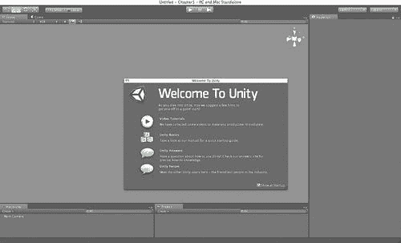

1.  如果您注意到，在上一个截图的中间，您将看到应用程序标题栏中的标准 VCR 控件。

1.  如果您点击**播放**按钮，游戏将在您的机器上启动，您将能够在 Unity IDE 中玩转游戏。花点时间玩一下，因为您想要对应用程序在常规 iOS 设备上安装后的外观和行为有一个大致的了解。

## 刚才发生了什么？

我们已经在 Unity 环境中加载了示例游戏项目并在我们的开发机上运行了它。在正常的开发生命周期中，您会发现您将在您的机器上执行代码-调试-测试周期，并将其导出到您的设备上以确保性能足够或测试设备特定的功能。

# 行动时间 — 选择 iPhone 作为目标平台

在我们有机会了解游戏在 iOS 设备上的外观和玩法后，是时候将应用程序部署到我们的目标 iOS 设备上了。在 Unity IDE 中，您通过更改项目的构建设置来完成此操作：

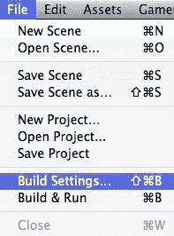

接下来，让我们检查项目的**构建设置**对话框：

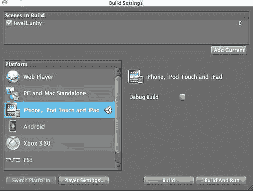

在**构建设置**对话框中，有一些活动我们要执行：

1.  首先，我们想要确保我们的游戏世界中有些内容。由于您正在加载现有项目，您应该已经拥有构建中的场景。如果由于某种原因您没有，您可以按**添加当前**按钮。这告诉 Unity，您一直在玩的游戏场景是您想要包含在 iOS 游戏中的场景。

1.  接下来，我们想要确保我们正在针对正确的平台。在平台列表中，您可以通过查找旁边带有 Unity 标志的平台来确定正在针对哪个平台。在我们的例子中，我们确保它位于“iOS”旁边。

我知道您此时强烈想要点击**构建并运行**按钮。然而，请记住，iOS 应用程序在部署到设备或销售在苹果应用商店之前必须进行签名。由于我们还没有告诉 Unity 它应该为哪个开发者配置文件和应用程序标识符进行发布，它将无法将应用程序发布到设备。因此，如果您真的这样做，当您尝试为设备**构建并运行**时，您将看到以下对话框：

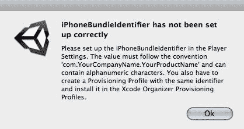

## 刚才发生了什么？

我们刚刚选择了我们的游戏发布目标。由于 Unity 可以发布到多个平台，您将针对您想要的目标平台执行此步骤。因此，如果您针对 Android、网络或甚至游戏机，您只需在对话框中选择该平台，Unity 就会生成在该平台上运行的发行版。

### 小贴士

在撰写本文时，Unity 提供了对其他平台（如 Android、Xbox360、PS3 和任天堂 Wii）的发布支持，还有许多其他平台正在开发中。这些附加平台将需要购买 Unity 的 Pro 版本，以及发布到特定平台所需的任何费用。

# 行动时间——将内容发布到我们的设备

要将内容发布到我们的设备，我们必须为 Unity 提供捆绑标识符。要创建一个，我们必须在 iOS 配置文件门户中提供它。该门户位于可访问的 iOS 开发者中心内，网址为[`developer.apple.com`](http://developer.apple.com)。

在 iOS 开发者程序的首页，您将找到一个链接，点击后会带您进入**iOS 配置文件门户**。此外，您还会看到指向用于发布您的产品以及获取销售和市场表现信息的**iTunes Connect**门户的链接：

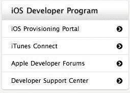

1.  在**iOS 配置文件门户**中，您将选择**App ID**设置，以便您可以创建一个新的应用程序 ID（这与 Unity 正在寻找的捆绑标识符相同）：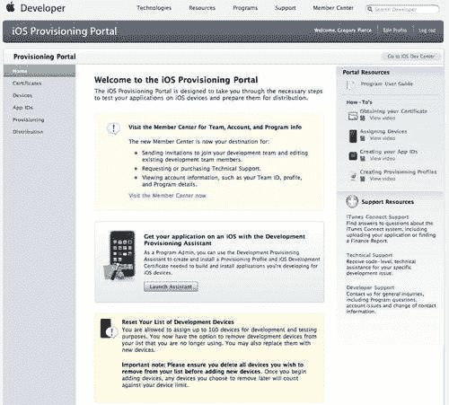

    +   让我们看看我们如何为我们的应用程序创建**App ID**：

    

    +   对于 iOS 应用程序来说，**App ID**非常重要，因为它是应用程序通过 Game Center、应用内购买、推送通知以及在 Unity 开发环境中被唯一识别的机制：

    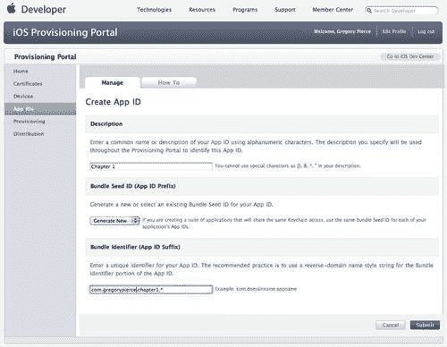

    +   应用标识符有一个描述、一个前缀和一个后缀。前缀是一组随机字符，用于保证唯一性，后缀代表应用的唯一标识符。当 Unity 提到**包标识符**时，它仅指后缀。

        创建您的**App ID**时，请给出一个清晰的应用描述，以便以后容易找到它。这很重要，因为随着时间的推移，您将拥有大量为所有您将要创建的游戏生成的**App ID**。对于种子 ID 本身，只需将其设置为**生成新 ID**。

        对于**包标识符**，使用标准的反向域名表示法来为您的应用生成标识符。一旦创建，我们只需要一种方法将此移动到我们的开发环境中。

    ### 注意

    对于包标识符，请确保不要在末尾附加通配符字符，因为这将在您寻求添加更高级功能时限制您。

1.  我们现在需要将此应用 ID 与配置文件关联起来。如果您已经有了配置文件，您可以修改现有的配置文件并更改它所代表的**App ID**。如果您没有，或者不想修改现有的配置文件，请进入**iOS 配置文件门户**的**配置**部分：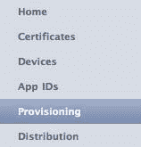

1.  一旦进入，为这个**App ID**创建一个新的配置文件，并填写所有字段，确保在下拉列表框中选择适当的**App ID**：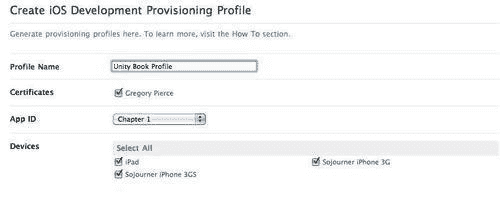

    ### 小贴士

    您可能没有注意到，但这个例子说明了当您遵循不给出非常描述性的名称的**App ID**的坏习惯时会发生什么。虽然在这个例子中我知道我想要**第一章**，但如果我在开发多本书 — 我将无法识别这个 App ID 代表的是哪一章。

    +   注意，我已经选择了所有我希望为此应用配置的设备。如果您在这里没有选择设备，您将无法将该应用部署到该设备。

1.  您的配置文件已创建，现在您需要点击**下载**，以便将其下载到您的开发环境中：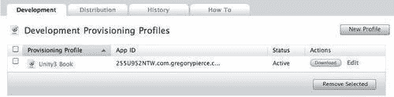

1.  下载后（您应该有一个`.mobileprovision`文件），在您的机器上双击该文件。由于这是一个 XCode 的注册文件类型，它应该会为您将其安装到 XCode 中。

    如果由于某种原因它没有安装，您可以在 XCode 中打开组织者（**窗口 | 组织者**），在组织者中选择**配置文件**条目。XCode 然后将安装配置文件，并将其同步到所有可以接受配置文件的设备：

    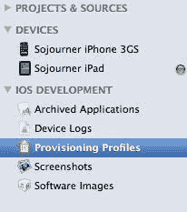

    +   XCode 有能力自动配置在 XCode 中配置的 iOS 开发者门户中的设备。这使得确保您的配置文件添加到目标设备变得容易。为此，请确保已勾选**自动设备配置**复选框：

    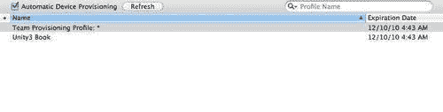

    +   一旦执行，XCode 将与 iOS 开发者门户通信并下载所有配置的设备，并在组织者中显示它们：

    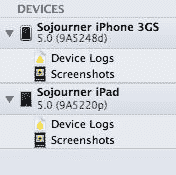

1.  现在我们能够配置 Unity 将内容发布到我们的目标设备上的这个应用 ID。我们通过输入**包标识符**并设置我们应用的**应用 ID**后缀来完成这个操作。在我们的例子中，它将是 `com.gregorypierce.chapter1:`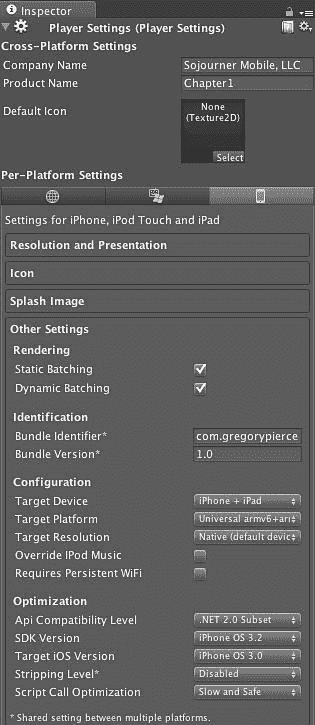

    +   完成这一步后，为 Unity 构建游戏最困难的部分就结束了！

1.  通过从文件菜单中选择**构建和运行**选项（文件 | **构建和运行**）来运行此应用程序。这次当您选择“构建和运行”时，Unity 将为您的内容构建一个播放器，并将应用程序部署到连接到机器的 iOS 设备上。

    当您看到 XCode 打开并开始构建应用程序时，不要感到惊讶，因为这表明过程正在运行，并且很快您应该会在您的设备上看到示例应用程序开始运行。

## 刚才发生了什么？

Unity 在幕后所做的是，从 Unity IDE 中获取所有资源和脚本，并组装一个播放器，该播放器能够根据用户的输入回放内容及其所有场景。这是一个非常重要的概念，因为 Unity IDE 中的内容在很大程度上是平台无关的，并且可以在 Unity 环境中简单重新编译后轻松重新部署。这个播放器就是实际部署到 iOS 设备上的应用程序。

我们在 iOS 开发者门户中创建了一些工件，花费了大量步骤。这些工件包括：证书、应用 ID 和配置文件。这些工件在开发者、苹果公司和开发者及消费者手中的 iOS 设备之间形成了一个信任圈。

证书是在苹果环境中创建的凭证，允许内容由开发者专门签名，从而清楚地表明谁创建了内容。如果没有证书，可能有人声称自己是开发者，并以他的名义签名应用程序。

应用 ID 是一个唯一的标识符，允许 iOS 设备和苹果服务明确知道，哪个应用程序正在尝试执行某些操作。最后，配置文件定义了。

配置文件将证书、设备和应用程序 ID 关联起来。如果没有在您的机器上安装配置文件，您将无法对设备或应用商店进行签名或部署应用程序。

一旦我们向 Unity 提供了 App ID，它就能与 XCode 通信，并告诉 XCode 应该使用哪个配置文件和证书来签名我们的应用程序并将其部署到 iOS 设备上。在设备本身上，当 XCode 部署应用程序时，它会将配置文件传输到设备，这样 iOS 设备就能识别出这是一个应该运行的设备，即使苹果应用商店没有提供它。

我们刚刚完成了设置开发环境和发布内容到 Unity 所需的所有步骤。此外，我们使用 Unity Remote 建立了自己的小型测试实验室，这样我们就可以在我们的设备上使用它，同时在开发环境中调试游戏。这是一个关键里程碑，因为我们现在可以完全专注于定制 Unity 和构建游戏。

## 快速问答 - 基础知识

1.  以下哪个平台 Unity 无法发布内容？

    +   a. 网络

    +   b. 控制台

    +   c. iOS 设备

    +   d. 安卓设备

    +   e. Linux

1.  你可以去哪里设置你的 iOS 设备的应用 ID？

    +   a. 苹果开发者论坛

    +   b. XCode 组织者

    +   c. iTunes Connect

    +   d. iOS Provisioning Portal

    +   e. XCode SDK

1.  关于 Unity 开发的应用程序是否可以在苹果的服务条款内发布到 iOS 设备上，仍然存在不确定性？（是/否）

1.  如果您有以下 App ID 255U952NTW.com.gregorypierce.chapter1，您应该向 Unity 提供什么作为您的 Bundle Identifier？

    +   a. 第一章

    +   b. com.gregorypierce.chapter1

    +   c. 255U952NTW

    +   d. 255U952NTW.com.gregorypierce.chapter1

    +   e. 255U952NTW.com.gregorypierce.chapter1.*

1.  你可以不创建开发者账户就发布 iOS 应用程序吗？（是/否）

# 摘要

在本章中，我们学习了如何为发布到 iOS 设备设置所有内容。

具体来说，我们涵盖了：

+   如何加载 Unity 并打开一个新项目

+   如何创建用于签名和发布应用程序的应用程序 ID

+   如何将应用程序部署到 iOS 设备

现在我们已经了解了如何设置我们的开发平台，我们准备好真正深入 Unity 并探索其功能——这是下一章的主题。
