# 第二章 启动和运行

> 在本章中，我们将详细检查 Unity 界面，探索其所有视图和工具，同时根据我们的特定开发风格进行个性化设置，并使用 Unity Remote 配置我们的环境以进行远程调试。在本章中，我们将完成构建应用程序的基础建设，并探索我们需要的所有 Unity 选项。

在本章中我们应当：

+   探索 Unity 用户界面

+   使用新自定义布局自定义我们的界面

+   配置和部署 Unity Remote 进行调试

+   使用 Unity Remote 和我们的新自定义布局测试我们的应用程序

那我们就开始吧...

# 欢迎回家

如果您曾经使用过 3D 建模工具或使用任何现代软件开发 IDE 编写过应用程序，您会发现 Unity 3 非常熟悉且相当直观。Unity 的界面由一个工具栏区域组成，该区域包含 5 个基本控制组以及可以包含视图的多个用户可自定义区域。

## 变换工具

变换工具与场景视图一起使用，允许您操纵场景中的对象。我们将花点时间来介绍这些工具，因为我们的大部分时间都将花费在使用它们上。


从左到右工作，第一个工具是一个多用途工具，用于在场景中操纵相机。您正在移动的相机是您对场景的视图，它与游戏中实际显示的内容没有关系。

在默认模式下，**手形**工具将简单地沿相机周围平移。按下鼠标左键并拖动将沿相机的 X 轴平移。如果您有鼠标滚轮，滚动该滚轮将沿 Z 轴移动相机。


按住*Alt*键或右鼠标按钮将使手形光标变为眼睛形。在此模式下，您可以在场景中围绕当前轴点旋转相机。场景视图左上角的场景 Gizmo 反映了这一点。当您旋转相机时，Gizmo 将更新以反映当前相机的轴点。


按住*控制*键允许您在场景中移动鼠标时缩放相机。如果您需要靠近某个关键动作发生的地方，这特别有用。

## 变换 Gizmo 开关

有两个 Gizmo 决定了使用变换 Gizmo 更新对象时将如何影响对象。变换 Gizmo 正如其名，它出现在场景视图中，允许我们更改对象的位置或旋转。这些开关决定了 Gizmo 将出现在哪里。


第一个切换按钮是**位置**切换按钮。如果设置为**居中**，变换 Gizmo 将出现在你想要变换的对象边界中心。在大多数情况下，如果你在场景中布局对象，这通常是你要做的。然而，如果你想根据对象的轴点改变对象的位置，请选择切换按钮的**轴点**设置。

第二个切换按钮是**旋转**切换按钮。在这里，你将确定旋转是否相对于对象的本地坐标系，还是基于全局或世界空间坐标系。

## VCR 控制按钮

下一个控制按钮组用于在游戏视图中驱动游戏玩法。这些控制按钮的视觉表示非常常见，几乎不需要解释。


**播放**控制会使游戏开始播放。如果你想停止并查看某些内容，请按下**暂停**按钮。当按下**暂停**按钮时，Unity 将切换到**场景**视图（除非已经显示），这样你就可以检查场景的细节。再次按下**暂停**按钮将使游戏从上次停止的地方继续。如果在暂停状态下，你想确定下一个循环将发生什么，可以按下**步骤**按钮。在游戏播放时按下**步骤**按钮将使游戏进入暂停状态。

### 小贴士

如果**场景视图**在单独的标签页上，你将能够同时看到两个视图。

## 层下拉菜单

在你开发应用程序时，你将在**场景视图**中创建层，这些层代表你希望在视图中显示的游戏对象组。这有助于在非常复杂的场景中减少显示的杂乱。


在**层**下拉菜单中，你可以选择你想看到哪些层以及你想隐藏哪些层。隐藏的对象仍然存在，并在游戏下次运行时在游戏视图中显示。

## 布局下拉菜单

在创建游戏的过程中，你会发现一些工具在某些场景中很有用，而在其他场景中则没有用。自定义布局允许你定义一组视图，以及它们的定位和配置，同时为布局提供一个独特的名称，这样你可以在以后切换到它。


**布局**下拉菜单将显示所有可切换的布局，允许你快速在多个 IDE 安排之间切换，以便在你需要时拥有重要的工具。

## 项目视图

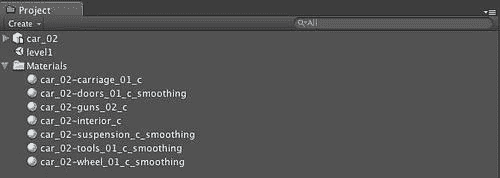

**项目**视图是管理你项目中所有资产的地方。然而，如果那些文件夹中的文件被更新（即，你在其他工具中更改了对象的网格），这些更新也会在 Unity 中更改。

### 小贴士

此视图对应于您项目的资产文件夹，但您绝对不应该直接修改项目文件夹，您应该在 Unity 项目视图中进行修改。

您可以通过简单地从桌面或文件系统浏览器拖动它们到项目视图中来向项目中添加新资产，Unity 将导入内容以供使用。在幕后，Unity 还将资产移动到项目的 Assets 文件夹中。

## 层级视图

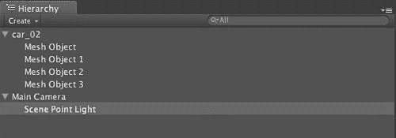

**层级**视图是**项目**视图的紧密伙伴。**项目**视图负责管理可用于您沙盒的资产——**场景**视图，而**层级**视图用于管理场景中的对象以及这些对象的父子关系。例如，您可能有一个场景中的车辆对象，它有一个灯连接到它。在**层级**视图中，这些对象将具有父子关系，这样灯就会是车辆对象的子对象。结果是，当父对象通过变换、旋转或其他操作改变时，子对象也会受到影响。

在大型项目中，**层级**视图中将有大量对象。为了更容易找到特定的对象或对象类型，Unity 在**层级**视图中提供了搜索框。当您输入对象名称时，Unity 将过滤**场景**视图，使得您输入的对象在视图中清晰可见，而其他对象则被灰色显示。例如，假设您正在尝试查找由大量游戏对象组成的场景中的方向盘组件。如果您在搜索框中输入**方向盘**，它将只提供纹理、颜色等，以便于查找。同样，如果您在搜索框中输入对象类型，如**灯**，场景将只突出显示场景中的灯——即使“灯”这个词不在游戏对象名称中。

## 场景视图

**场景**视图是您将花费大部分时间的地方。您将在场景视图中构建游戏、放置相机、更改环境设置、观察遮挡级别等：

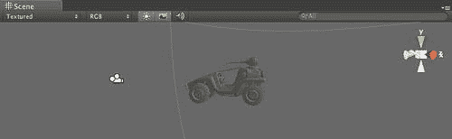

## 游戏视图

**游戏**视图是动作发生的地方。每次您在 VCR 控件中按下**播放**时，此视图将使用场景中的活动相机并将该相机看到的渲染到**游戏**视图中：

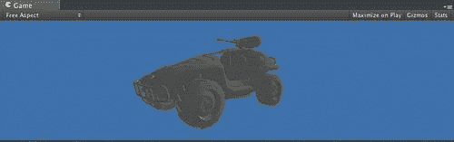

**控制栏**位于**游戏**视图中，包含用于调整游戏视图以提供有助于渲染更接近实际目标显示的**游戏**视图的有用控件：


**控制栏**中的第一个工具是**自由纵横比**下拉菜单，允许您将**游戏**视图的纵横比更改为不同的值。这对于 iOS 开发尤为重要，因为您可以选择目标设备的纵横比，并更好地了解内容在适当视角下的外观。

下一个工具是**播放时最大化**切换按钮，当启用时，将显示**游戏**视图的全屏。在这种情况下，如果**游戏**视图的分辨率与屏幕不同，您将注意到**游戏**视图最大化以覆盖整个显示，但仅以您在**自由纵横比**下拉菜单中设置的分辨率/纵横比渲染场景。

下一个控件是** Gizmos**控件。这将强制 Unity 在**游戏**视图中渲染**场景**视图中存在的所有 Gizmos。

最后一个控件是**统计**控件。当启用时，它将在**游戏**视图上显示渲染统计窗口。这是一个非常有用的控件，因为它可以在玩游戏时获得对应用程序在高级别上的性能洞察，而无需深入**分析器**视图。

## 检查器

**检查器**视图包含所选游戏对象的所有属性。检查器显示的属性完全基于所选游戏对象而上下文敏感：

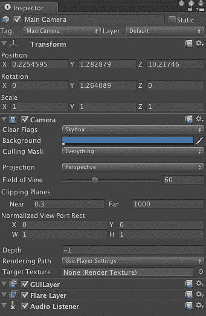

由于 Unity 中的游戏对象由网格、脚本、变换等组件组成，因此构成游戏对象的每个组件都将在其**检查器**中显示编辑器。例如，在我们的示例**检查器**中，我们已选择场景中的相机。如您所见，变换、相机等每个都有为该游戏对象显示的编辑器。

## 控制台视图

**控制台**视图显示了来自您游戏的所有消息。这些消息可能来自 Unity 引擎，也可能代表您使用脚本命令（如`Debug.Log()`）发送到**控制台**视图的消息。如果您双击**控制台**视图中出现的消息，您将被直接带到导致消息的脚本：

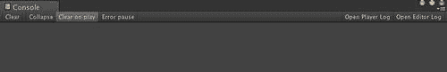

## 分析视图

Unity 分析器是您使用 Unity 构建游戏时的最佳伙伴，尤其是在为 iOS 设备开发时。虽然此工具仅适用于 Unity 的专业版，但它值得特别关注，因为它提供了比**游戏**视图中的渲染统计窗口多得多的信息：

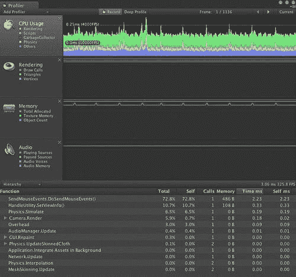

顶部是性能分析工具，提供有关 CPU 使用率、渲染、内存和音频统计信息。每个性能分析工具旁边都有一个直方图，表示从每个帧的仪器化过程中检索到的值。您可以通过点击并拖动鼠标跨过直方图，查看多个性能分析工具的结果，这有助于将特定的性能问题与其他在应用程序中发生的事件相关联：

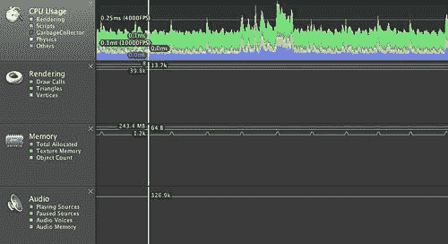

底部提供有关应用程序正在执行的功能调用的信息。这是通过代码的仪器化和确定函数被调用的频率来完成的。这有助于确定应用程序中的热点区域，以便您可以集中注意力，并在目标平台上使游戏表现良好：

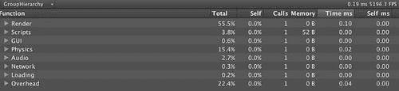

# 时间行动 - 创建新布局

尽管 Unity 环境有很多功能和选项，但可能会被数据量完全淹没，或者没有意识到某些事情出了问题。我们将探讨为我们的环境构建一个简单的自定义设置，其中包含我们需要的视图，以及一些默认情况下不会出现在界面中的视图，以便为测试应用程序做好准备。如果您熟悉 Eclipse 开发环境，您可能会认为 Unity 会根据您执行的操作打开视图，但 Unity 并不这样做。然而，我们将通过创建一个适合性能分析应用程序的新布局来模拟一些这种功能。

1.  创建新布局的第一步是从一个基本布局开始并对其进行自定义。Unity 有几种默认布局可供选择，但就我们的目的而言，我们将选择宽布局。在**窗口**菜单中，选择**宽**布局：

1.  创建我们布局的下一步是决定哪些视图对于完成任务最重要。由于我们计划进行性能分析，因此将**性能分析**视图引入我们的环境是有意义的。选择**窗口**菜单并选择性能分析将显示新视图。然而，您会注意到它是一个独立窗口，而不是连接到环境的其余部分。Unity 不需要所有视图都生活在与其他视图相同的窗口中。实际上，这使用户拥有多个屏幕时更容易，因为您可以在不同的屏幕上拥有不同的视图分组。然而，就我们的目的而言，我们将假设我们只有一个屏幕可以工作。

1.  要将分析器定位到我们的界面中，请选择**分析器**标签并拖动它。这将导致在界面中显示一个灰色的标签版本。当您将这个灰色的版本移动到可以停靠的位置时，它将改变形状以说明如果将其停靠在该位置将看起来如何。现在让我们将其释放到**层次**视图和**项目**视图的上方：

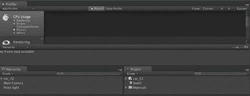

由于我们正在分析我们的应用程序，我们可能并不真的需要了解太多关于项目布局的信息，因此我们可以从布局中移除**项目**视图。为了完成这个任务，我们需要选择视图右上角出现的**菜单**下拉菜单，并选择**关闭**标签。一旦完成，**项目**视图将不再在布局中。不用担心，如果您需要将其恢复，您总是可以通过进入**窗口**菜单并以我们介绍**分析器**视图相同的方式将其停靠。

现在我们可能还想要控制台消息，因为它们代表了我们的游戏会话的反馈。我们将通过选择**窗口 | 控制台**来介绍控制台。当控制台菜单出现时，我们将将其拖到**层次**标签的旁边，使其与**层次**标签在同一行显示为一个标签。这代表了 Unity 提供的另一种布局选项，即具有视图标签行的布局：


## 刚才发生了什么？

我们创建了一个专门用于分析应用程序的新布局并将其保存，这样我们就可以在准备深入调试和应用程序分析时简单地切换到它，而无需在仅仅设计游戏时使我们的环境变得杂乱。这对生产力有很大的影响，因为界面可以根据特定目的进行设置，例如关卡编辑、脚本编写或测试，并且您可以专注于具体需要的环境。虽然现在这可能看起来不是一个很大的细节，但随着您的项目变得越来越大，您会为这种灵活性的存在而感到高兴。

# 行动时间 — 保存新布局

1.  现在我们已经创建了新的布局，我们需要保存它，以便以后可以重用。在**窗口**菜单中选择**布局 | 保存布局**：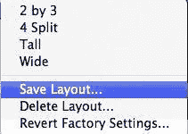

1.  您将看到一个简单的对话框，它会要求您输入布局的名称。在文本框中输入**分析器**并按**保存**：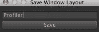

1.  现在您的布局已经保存，您可以通过选择**窗口 | 布局**并选择您的布局来随时切换：

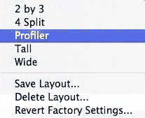

## 刚才发生了什么？

我们刚刚保存了布局，以便我们可以在开发过程中稍后引用它。此外，我们可以通过给他们 Unity 存储的布局文件来与其他开发者共享我们的布局。

布局存储在以下文件夹中，使用.wlt 扩展名：

1.  在 Mac OSx 上：

    ```swift
    Users/username/Library/Preference/Unity/Editor/Layouts/

    ```

1.  在 Windows 7 上

    Unity 3:

    ```swift
    c:\users\username\AppData\Roaming\Unity\Editor-3.x\Preferences\Layouts

    ```

    Unity 2.x:

    ```swift
    C:\users\username\AppData\Roaming\Unity\Editor\Preferences\Layouts

    ```

1.  在 Windows XP 上

    Unity 3

    ```swift
    C:\Documents and Settings\username\Application Data\Unity\Editor-3.x\Preferences\Layouts

    ```

    Unity 2.x

    ```swift
    C:\Documents and Settings\username\Application Data\Unity\Editor\Preferences\Layouts

    ```

最好的方法是部署一个真实的应用程序，从两个不同的布局中查看它，以了解它将如何改变你与环境交互的方式。这也是安装 Unity Remote 的好时机，因为我们希望在快速原型设计时使用它。

# 行动时间 — 部署 Unity Remote

在为 iOS 设备构建应用程序时，最难的事情之一是能够从设备获得一些实时反馈，同时仍然拥有丰富的开发环境来工作。Unity 通过 Unity Remote 应用程序解决了这个问题，它允许你在 Unity 中播放测试你的应用程序，同时使用 iOS 设备作为控制器。Unity Remote 通过通过 WiFi 将游戏流式传输到 iOS 设备，并从设备收集输入动作并将它们注入到 Unity 环境中来实现这一点。使用 Unity Remote，你可以避免每次更改时都必须构建和部署你的应用程序到你的设备。

当测试我们的应用程序时，Unity Remote 只有一个问题——我们需要为我们的设备专门构建它。

### 注意

记住，所有 iOS 应用程序在安装到设备之前都必须进行签名。

我们将逐步介绍生成可用于部署到 iOS 设备的 Unity 3 商业内容的必要步骤：

1.  第一步是打开 Unity Remote 项目在 XCode 环境中。Unity Remote 源项目不在 Unity 的发行版中，需要从 Unity 网站下载。Unity Remote 是网站上的官方 Unity 扩展，可以在[`unity3d.com/support/resources/unity-extensions/unity-remote`](http://unity3d.com/support/resources/unity-extensions/unity-remote)下载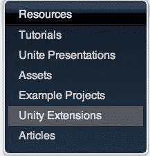

1.  一旦下载了此项目，请选择**UnityRemote.xcodeproj**以在 XCode 中打开此项目。正如我们在上一章中所做的那样，我们需要在**iOS Provisioning Portal**中为 Unity Remote 创建一个**App ID**：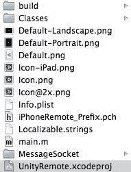

1.  在创建了我们的**App ID**之后，我们需要将此**App ID**输入到 XCode 项目中，以便应用程序将使用该**App ID**构建并部署到我们的 iPhone。虽然 Unity 会为我们处理这些步骤，但我们需要自己为 Unity Remote 执行这些步骤，因为这是一个常规的 XCode 应用程序。

    ### 注意

    别担心，一旦我们安装了 Unity Remote，就不再需要这样做。

1.  使用 XCode 中的**项目**菜单中的**编辑项目设置**打开项目设置。这将显示 XCode 将用于构建和部署您的应用程序的所有设置：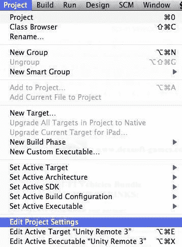

    +   对于这个项目，我们关注两组设置：架构和代码签名。

1.  在架构部分，我们想确保我们已经将项目的 Base SDK 设置为适合我们设备的适当版本。例如，如果我们的设备正在运行 iOS 4.0，我们想确保基础 SDK 没有设置为为 iOS 4.2 构建。只需选择 Base SDK 行上的下拉列表，XCode 就会告诉您配置的有效选项。如果 XCode 在这里没有显示 SDK，那是因为它没有正确安装，XCode 将无法使用它来构建。

1.  在代码签名部分，您将在代码签名标识项下选择**任何 iOS**条目。当您选择此项目的下拉列表时，它将显示此项目的所有可能的代码签名选项。只需选择与您在 iOS 配置文件中创建的 App ID 相对应的选项即可。

1.  更新了 App ID 和设备上的这些设置后，您现在可以从 XCode 的构建菜单中选择构建和运行来构建项目。这将使用 XCode 构建 Unity Remote 应用程序并将其部署到您的设备上。

1.  确保在运行此命令时您的目标设备已连接，否则 XCode 会频繁地抱怨：

### 小贴士

如果您没有运行 Unity Remote 项目期望的标准 iOS 4.0 SDK，您将遇到特定的错误。

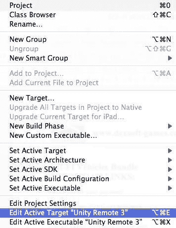

这个错误表示 Unity Remote 期望 iphoneos4.0 作为 SDK 已安装。这在工具栏中以及构建配置下拉菜单中的**基础 SDK 缺失**都有表示。根据您何时开始 iOS 开发，iphoneos4.0 可能已经是一个遥远的记忆。为了解决这个问题，您将不得不通过编辑 Unity Remote 的 Active Target 来调整项目的设置以匹配您已安装的 SDK：


### 小贴士

在**架构**部分，您可以更改基础 SDK 为所需的任何 SDK。通常，最佳选项是将此设置为**最新版 iOS**，除非您有特殊原因需要更改。更改此设置后，您会发现工具栏上的**基础 SDK 缺失**错误消失了，并且当您构建项目时，它将成功安装到您的设备上。

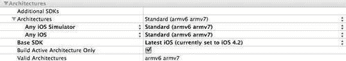

## 刚才发生了什么？

我们刚刚构建并部署了 Unity Remote 到我们的设备。这使我们能够将 iOS 设备作为游戏的输入，并从 iOS 设备上测试游戏的行为，而无需在设备上部署应用程序。这很有用，因为它将加快开发过程，并减少我们必须执行的代码-编译-部署循环的数量。

# 行动时间——使用 Unity Remote 测试我们的应用程序

现在我们已经部署了 Unity Remote，我们就可以开始使用我们的 iOS 设备作为游戏开发环境中的控制器了：

1.  在你的设备上运行 Unity Remote，将出现一个列表，列出了准备好为 Unity Remote 提供数据的机器。如果你因为特定的 DNS 或 Bonjour 安全设置而无法出现，你可以通过选择左下角的按钮来输入你想要控制的机器的 IP 地址。如果你不关心在 iOS 设备上模拟游戏的视觉界面，你可以将**显示图片**单选按钮更改为**关闭**，这样游戏帧就不会显示在你的设备上，但你仍然可以使用 iOS 设备作为控制器在 Unity 中控制游戏：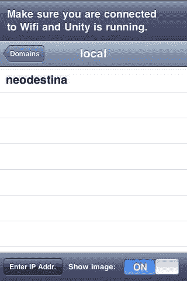

1.  在 Unity 工具栏中按**播放**。这将作为 Unity 和 Unity Remote 开始交换数据的信号。**游戏**视图中的内容将开始出现在 iOS 设备上，尽管你第一次看到它时可能会认为有问题，因为它看起来像是你的游戏的一个分辨率更低的版本：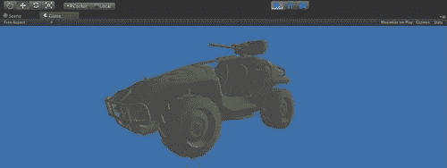

    Unity 中游戏的视图表示

    +   如果你还记得，我提到 Unity 会将游戏流式传输到 iOS 设备。IDE 实际上正在将游戏中的视频流式传输到你的设备，所以你会看到各种压缩伪影，这取决于你的 Wi-Fi 连接速度和其他因素：

    

    Unity Remote 上的游戏视图

1.  这是 Unity Remote 的正常行为（也是选择“显示图片”单选按钮的原因之一），它不应该以任何方式影响你进行测试的能力。记住，这纯粹是一个测试工具，用于加速开发，因此视觉保真度不是必要的。如果你真的需要知道它将如何看起来，你可以将游戏部署到设备上——但请将这一章节作为书签，因为你会发现，经过一段时间，了解你的内容在设备上的外观所带来的好处将微不足道，与使用 Unity Remote 提高生产力的好处相比。

## 发生了什么？

Unity Remote 在幕后所做的是获取应用程序的帧缓冲区，将其压缩成视频流，并将其流式传输到 iOS 设备。然后，通过 iOS 设备收集的任何设备输入都会通过 Wi-Fi 传输到 Unity IDE，并用于指导环境中的对象。每当你在**编辑器**中的**播放**模式下时，你的设备将成为测试游戏的遥控器。

虽然这种方法对于快速应用开发非常有用，但重要的是要注意，使用这种方法的效果最多只能近似估计，你仍然需要不时在设备上构建和运行应用程序，以确认性能和游戏体验符合预期。同样，重要的是要注意，这种方法非常依赖于你的 Wi-Fi 连接。如果你的设备没有显示完整的 Wi-Fi 信号，你可以预期会有显著的性能影响。

我们刚刚完成了设置开发环境和发布内容到 Unity 所需的所有步骤。此外，我们使用 Unity Remote 建立了一个自己的小型测试实验室，这样我们就可以利用我们的设备，同时在开发环境中调试游戏。这是一个关键的里程碑，因为我们现在可以完全专注于定制 Unity 和构建游戏。

关于 Unity Remote 的最后一点值得注意，虽然我让你自己构建远程应用程序，但实际上你可以在 App Store 中下载它。考虑到这一点，你可能想知道为什么让我构建它？作为一个 iOS 开发者，即使是使用 Unity 的开发者，你会在很多情况下发现自己需要调试 XCode 底层的操作。此外，你可能希望集成 iOS 中 Unity 不支持的一些原生功能。在所有这些场景中，你都会发现自己需要挖掘底层的 XCode 项目，因此现在似乎是熟悉这些事情的最佳时机。

Unity Remote 链接：

1.  Unity Remote 3 for iPhone :

    +   [`itunes.apple.com/fr/app/unity-remote-3/id394632904?mt=8`](http://itunes.apple.com/fr/app/unity-remote-3/id394632904?mt=8)

1.  Unity Remote 3 for iPad:

    +   [`itunes.apple.com/fr/app/unity-remote-3/id394632904?mt=8`](http://itunes.apple.com/fr/app/unity-remote-3/id394632904?mt=8)

1.  Unity Remote < 3 for iPhone:

    +   [`itunes.apple.com/fr/app/unity-remote/id305967442?mt=8`](http://itunes.apple.com/fr/app/unity-remote/id305967442?mt=8)

## 快速问答 - 做这件事

1.  Unity 视图可以在哪里显示？

    +   a. 工具栏

    +   b. 在不同屏幕上未分离

    +   c. 在标签页中

    +   d. 在 iOS 设备上远程操作

    +   e. 在其他 Unity 机器上

1.  你可以去哪里设置 iOS 设备的应用程序 ID？

    +   a. 苹果开发者论坛

    +   b. XCode 组织者

    +   c. iTunes Connect

    +   d. iOS 配置文件门户

    +   e. XCode SDK

1.  Unity 界面只能为一位用户和用例进行定制？（是/否）

1.  Unity Remote 是否可以通过 3G 连接工作？（是/否）

1.  您必须构建 Unity Remote 才能进行远程调试吗？（是/否）

# 摘要

在本章中，我们探讨了 Unity 环境并学习了如何针对特定目的进行自定义。

具体来说，我们涵盖了以下内容：

+   自定义 Unity 界面

+   自定义 iOS 部署

+   部署 Unity Remote

+   使用自定义布局和 Unity Remote 测试应用程序

虽然我们花了一些时间来回顾 Unity 界面，但我们是在相对较高的层面上进行的。为了更深入地了解 Unity 界面及其选项，建议您阅读 Unity 文档。

在掌握前两章内容后，我们现在可以告别预构建的项目，开始从头开始构建游戏，这正是下一章的主题——Hello World。
