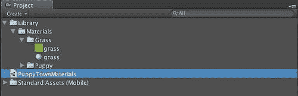

# 第四章：Unity 概念

> 现在我们已经构建了我们的第一个应用程序，并且对 Unity 的能力有了初步的了解，是时候学习 Unity 的核心概念了，这样我们才能构建更加复杂和引人入胜的游戏。我们已经简要讨论了一些核心概念，但为了构建引人入胜的内容，有必要更深入地理解 Unity 如何使用这些概念。

在本章中，我们将：

+   学习 Unity 的核心概念

+   在工具内创建核心组件

# Unity 开发的基本概念

在学习一门外语时，您将花一些时间沉浸在其名词和动词中，以便理解概念并开始构建句子。

## 资产

资产代表通过它可以构建 Unity 场景的原子 Unity。您将带入环境中的任何东西都被视为资产，包括声音文件、纹理、模型、脚本等等。

您可以通过从桌面拖放它们到**项目**视图，或者使用**导入新资产**菜单（**资产 | 导入新资产**）将资产导入 Unity 项目。一旦在**项目**视图中，资产就是可以在您的游戏中使用的资源。将**项目**视图想象成您的调色板，您将从其中绘制您的世界。

Unity 通过文件系统管理资产。如果您进入您的项目文件夹并查看`Assets`目录，您将找到项目中所有的资产。当 Unity 导入您的资产时，它将在这里存储导入的资产及其所有元数据。

### 注意

重要提示：您绝对不应该尝试直接管理此文件夹中的资产。

虽然您可以使用各种工具更改纹理、音频、模型等，但您绝对不应该移动它们，因为这会破坏资产与 Unity 元数据之间的链接。实际上，Unity 将表现得好像您刚刚第一次将此资产带入 Unity，任何关系、设置等等都需要重新创建。

# 行动时间 — 导出资产包

有时候，您可能希望与团队中的其他用户或社区中的其他用户共享一组资产。Unity 通过提供一个简单的机制，称为包，来简化这一过程。**包**只是将资产捆绑在一起的单个文件。

在这个练习中，我们将探讨如何从现有项目中与其他开发者共享资产：

1.  打开本章的项目**HelloWorld2**。在其中，您将找到一个包含一些额外资产的原始 Hello World 演示版本。

1.  选择您想要作为包一部分导出的资产：

    +   在上面的图中，**项目**中的**材质**元素已被选中。有**小狗**和**草地**材质，它们是**材质**元素的子元素，并将被捆绑在包中。如果您只想共享**小狗**材质，您只需选择**小狗**元素，只有那些材质会被打包。

1.  接下来，让我们使用**导出包**菜单**（资源 | 导出包）**创建一个包。当选择时，这将创建一个从**项目**视图中选定的项目开始的包，以及任何是该元素子元素的内容。

1.  Unity 将显示一个对话框，其中包含所有将要导出的资源。如果您想删除某些资源，取消选中其复选框：

    +   此外，还有一个标记为**包含依赖项**的复选框。如果您的资源依赖于其他资源，例如脚本，保持此复选框选中状态将告诉 Unity 将这些资源包含在包中。

1.  选择**导出**按钮，然后在随后的文件对话框中为 Unity 包文件提供名称。Unity 将创建并压缩资源到一个扩展名为`.unitypackage`的文件中：

## 刚才发生了什么？

我们创建了一个 Unity 包，其中包含了我们选定的所有资源。这是与您的团队共享资源的理想方式，因为当这些资源被导入时，任何设置、层次结构等都将被保留。

# 操作时间 — 导入资源包

越来越多的第三方公司正在为 Unity 开发者提供专门为 Unity 打包的资源，包括可以从 Unity 产品内部访问的 Unity 资源商店。所有这些解决方案都通过在“操作时间 — 导出资源包”部分描述的相同`.unitypackage`格式提供内容。使用 Unity 资源商店的资源，将资源包含到您的项目中的过程是自动的。然而，有时您可能从其他人那里收到了资源，需要自己将它们导入到项目中。

1.  在 Unity 中创建一个新的项目，命名为**项目导入**。

1.  使用从“操作时间 — 导出资源”构建的`.unitypackage`文件，通过将`.unitypackage`文件拖放到您项目层次结构中希望它们存储的位置的**项目**视图中，或者通过使用**导入资源**菜单**（资源 | 导入资源）：**

1.  一旦执行，你会发现 Unity 已经将`.unitypackage`文件导入到**项目**视图中，但它并没有将资产展开成我们之前熟悉的层次结构。Unity 不知道你是否想要包中的所有资产，它给你提供了选择的机会，而不是用一个未知的资产列表污染你的项目。

1.  双击`.unitypackage`文件，让 Unity 将其展开成其组成部分。

    你将看到一个对话框，列出了包中的所有内容，以及一条注释，告诉你资产是否为新资产。这在跨项目共享资产时很有用，特别是当资产可能具有相同名称时。

1.  选择**全部**按钮，让 Unity 包含包中的所有资产：

1.  观察**项目**视图，你会发现你选择的全部资产都已包含在项目中，并且资产的层次结构已被保留：

    ### 注意

    尽管我们的包中没有库元素，或者在我们的 Puppy Test 项目中没有，Unity 还是创建了这种层次结构，并相应地导入了资产。这种信息以及与之相关的设置，如果手动管理`Assets`文件夹，将会丢失。

1.  由于我们已经提取了我们感兴趣的资产，所以从项目层次结构中删除`unityproject`文件。

## 刚才发生了什么？

我们刚刚将资产导入到一个新项目中，保留了从原始项目中资产的原有层次结构。

虽然我们选择了从`unityproject`导入所有资产，但这并不是必须的。你可以预览你想要导入的资产，并取消选中那些你不想包含在项目中的资产。

## 游戏对象

通常当你想到游戏对象时，你会想到一个动画士兵、粒子系统或游戏中的精灵。然而，游戏对象更是一个抽象的概念，是一个没有行为或功能的基础对象。游戏对象通过添加行为来获得执行功能的能力。实现这一点的途径是**装饰器**设计模式，它允许向某个基础类添加任意数量的行为。这些行为，在 Unity 术语中被称为**组件**，是赋予游戏对象真正意义和定义的东西。正是通过组件，游戏对象才能够在场景中存在，并具有位置、旋转和缩放。

## 组件

组件是 Game Object 的装饰器，为资产提供额外的行为和配置。渲染、物理、音频、照明等许多核心原则都是通过向对象添加组件来实现的。因此，我们将涵盖的许多 Unity 概念都有计算机图形学定义和组件，当它们附加到 Game Object 上时提供行为。通过一些示例来展示这个概念是最好的方法。

你可能会认为拥有光的最简单方法就是有一个在系统中定义的具体光类型。然而，假设你想要一个普通对象，比如一艘星际飞船的引擎，具有发光的能力？当然，你可以创建一个光对象并将其与引擎模型关联，但假设你还想让它冒烟并受到物理影响，以及播放声音？你立刻就会注意到你的场景会被一些与游戏无关的对象污染——尽管它们会出现在你的层次结构中，你还得管理它们。更优雅的方法是说明你有一个星际飞船引擎，并且它具有某些行为。这些行为是我们将与对象关联的组件。

即使是我们的标准 Game Object，也是通过变换组件获得位置、缩放和旋转的能力。在 Unity 的检查器视图中，你实际上看到的是应用在这个 Game Object 上的组件堆栈。

让我们再举一个例子。

# 行动时间 — 向游戏对象添加组件

1.  在 Unity 中创建一个空的游戏对象：

    +   现在我们给这个 Game Object 添加一些组件。

1.  在**组件**菜单中，你可以找到可以添加到这个 Game Object 的所有组件。在**渲染子菜单**中，选择**光**选项：

## 刚才发生了什么？

在 Unity 中，你会注意到你的 Game Object 现在有一个与之关联的光行为：

如果你从**层次结构**菜单创建一个常规光对象，你会发现这两个对象是相同的。这是因为**光**Game Object 只是一个带有**光**组件的空 Game Object——简单地根据你想要创建的光的类型进行了适当的配置。如果你探索一下，你会发现你可以像库存光对象一样配置你的光。

所有这些都应该向你展示出你所拥有的可能性。你并不受限于 Unity 开发者任意构建的对象。实际上，你也可以创建自己的自定义组件，并将这些组件添加到任何你想要的 Game Object 中。

## 变换

变换是三维空间中某物的基概念。它表示对象的定位、旋转和比例尺，并且可以包含对层次结构中子对象的链接。场景中的每个对象都有一个这样的变换，即使没有任何内容被渲染。**变换组件**是每个游戏对象都具有的基本组件，也是您不能移除的，因为它是对象存在于三维空间中所需的：

# 行动时间 — 定位、旋转和缩放游戏对象

1.  创建一个立方体游戏对象。

1.  通过将**变换组件**的 X 值更改为**10**来更改立方体的位置。

    您会注意到场景中立方体的位置反映了这个新位置。

1.  将立方体沿 X 轴的旋转更改为**45**。

    您现在已将立方体绕 X 轴旋转了 45 度。

1.  将立方体的**变换组件**的 X 轴比例尺更改为**10**。

    您尚未沿 X 轴缩放对象。

## 发生了什么？

您可以通过更改对象的**位置**属性来细化场景中对象的位置。这些属性表示该对象在世界空间坐标中的位置 — 场景本身的坐标系。此外，您可以通过调整对象的**旋转**属性来改变对象的朝向。最后，您可以通过更新**缩放**属性来为对象定义一个任意比例尺：

## 相机

**相机**提供了用户可以通过它查看场景内内容的视口。相机将捕获其视锥体内的所有内容，并将这些内容投影到帧缓冲区，以便在 2D 显示上进行光栅化。视锥体定义了一个几何形状，用于在场景中裁剪游戏对象。如果一个游戏对象不在视锥体内，**相机**会假设它对用户不可见，并且不会浪费周期去尝试绘制它。这个概念很重要，在我们稍后讨论遮挡剔除时将变得更加重要。现在，只需注意，近裁剪面、远裁剪面和**视野**定义了这个对象的形状，并且所有这些设置都可以在**相机**组件中轻松配置：

### 相机属性

相机组件有几个属性定义了当场景渲染时用户将能看到多少世界。

#### 近裁剪面

近裁剪面定义了一个平面，使得靠近相机的对象不再显示。此设置通常将近裁剪面放置得相当靠近相机，以便对象可以靠近'观众'而不会被裁剪。

#### 远裁剪面

远裁剪平面定义了一个平面，使得距离这个平面以外的物体太远，不应该被绘制。你为这个设置的选择将对游戏性能产生相当大的影响。虽然你可能能够将这个设置延伸到很远的距离，但请意识到那些远处的物体正在被渲染并消耗资源，就像它们更近一样。所以如果你将远裁剪延伸到你的虚拟地平线，那里有一个城市，但城市的大小只有几个像素，你仍然会绘制出这个城市的全部辉煌，并为此付出性能上的代价，尽管它几乎看不见。

#### 视野（FOV）

视野定义了视口沿 Y 轴的宽度。这将影响物体透视的计算，并导致物体根据此设置变得更高/更胖：

### 相机投影类型

你可以将任何 Unity 相机设置为两种投影类型之一：正交投影和透视投影。这些投影决定了相机所看到的世界的渲染方式。

#### 正交投影

正交投影的相机从相机视图中移除了透视校正，并确保无论物体距离相机有多远，其距离都保持不变。当我们构建传统的二维用户界面时，正交相机将非常重要，对于二维游戏尤其重要。

#### 透视投影

透视相机考虑了游戏对象与观察者之间的距离，并据此应用透视校正，使得远离观察者的物体看起来比实际更小。对于大多数游戏来说，这是绘制内容的主要机制。

需要注意的是，在 Unity 中没有限制要求你在场景中使用一种相机投影类型而不是另一种。实际上，使用多个相机用于不同目的相当常见。例如，你可以有一个负责绘制用户界面元素的正交相机和一个负责常规场景元素的透视相机。

## 灯光

灯光在概念上很简单。它们照亮场景中的物体，以便它们可以被看到。没有灯光，物体看起来会显得黑暗和没有生机。有了灯光，你可以为场景增添氛围，并通过它们投射的阴影为世界增加深度。Unity 中有三种主要类型的灯光：方向光、点光源和聚光灯。

### 方向光

方向光是一种与场景距离无限远的灯光。虽然你可以在 Unity 中定位它，但场景中物体的照明仅使用光的方向来确定。方向光是你可以在场景中使用的最便宜的灯光。这是进行全局场景照明的最快方式，因为灯光的位置不会影响场景中某个物体的照明程度，只有光的方向。

### 点光源

与方向光不同，点光源是一种在场景中具有位置但没有方向的光源——在所有方向上均匀地发射光线。这种光具有平均的计算复杂度，通常用于游戏中大多数效果。

### 聚光灯

最昂贵的灯光类型，聚光灯模拟了你从手电筒中得到的效果——一个光锥。这个锥形也有衰减，使得锥形中心的灯光比锥形边缘的灯光更亮。虽然可能有一些情况下你可能想使用聚光灯，但在 iOS 设备上这样做的高成本使得这变得非常具有威慑力。

### 光照贴图

虽然你可以通过接近真实照明的灯光完成许多事情，但要这样做需要非凡的计算能力。在考虑移动设备的计算和图形能力时，实时计算灯光是确保我们的游戏和应用性能不佳的可靠方法。这可以通过使用光照贴图来纠正。

光照贴图最好描述为照亮场景并烘焙这些灯光对场景的影响。由于与材质纹理混合光照贴图在计算上更便宜，我们可以通过光照贴图实现通常需要更昂贵灯光的功能。幸运的是，Unity 通过行业领先野兽光照贴图系统内置了对光照贴图的支持。

使用野兽，你将能够像通常一样在场景中放置灯光，野兽将计算这些灯光对场景中纹理的影响，并为我们创建光照贴图。我们可以快速且低成本地获得卓越的结果。

灯光和野兽光照贴图将在光照章节中更详细地介绍。

## 声音

声音是游戏中经常被忽视的部分，有助于为玩家设定氛围。观看你最喜欢的电影（不是无声电影），关闭声音。你会发现，当声音打开时，体验并不像声音关闭时那么吸引人，如果你非常了解这部电影——你会发现你的大脑试图通过从记忆中恢复电影中的对话和音乐来填补空白。声音对于参与度至关重要，Unity 拥有一系列音频功能，涵盖了整个频谱。

### 音频监听器

在现实世界中，声音必须被听到，如果你离声音的发射源太远，你就听不到任何声音。Unity 通过音频监听器处理这种听到声音的概念。这个游戏对象通常附着在玩家的头像、角色或其他场景中的表示上。音频监听器在游戏世界中充当麦克风，它所听到的任何声音——玩家通过扬声器听到。

默认情况下，音频监听器放置在场景中的主摄像机上。如果你想用户从其他对象的视角听到声音，只需将音频监听器从主摄像机移除，并将其附加到你希望代表用户听觉中心的游戏对象上。在 Unity 中，你不能同时激活多个音频监听器。虽然音频监听器是一个组件，但它没有任何可配置的属性。

### 音频源

音频源代表游戏世界中制造噪音的事物。你可以通过选择游戏对象并选择**组件 | 音频 | 音频源**来向游戏对象添加音频源。这将向你的游戏对象添加**音频源**组件：

你还会看到在**场景**视图中，你的游戏对象上有一个扬声器图标。这表示这个游戏对象上有一个音频源组件，并生成声音：

### 音频剪辑

虽然我们已经创建了一个音频源，但我们还没有将其与实际的声音关联起来。这个声音就是 Unity 所说的音频剪辑。Unity 支持几乎所有可以编码声音的格式，包括`.aif, .wav, .mp3, .ogg`，甚至还有`.xm, .mod, .it`和`.s3m`这样的跟踪器格式。

# 添加音频剪辑的时间

1.  从`第四章`的项目文件夹中选择`dog_1.mp3`文件，并将其拖动到**项目**视图中。

1.  音频剪辑将被导入 Unity，并出现在带有扬声器图标的**项目**视图中：

1.  在**项目**视图中选择**音频剪辑**。**检查器**将填充所有**音频剪辑**的设置：

1.  创建一个立方体游戏对象。

1.  将一个**音频源**添加到立方体游戏对象上。

1.  在音频源游戏对象中，选择**循环**复选框以指定我们希望这个声音无限期地播放。

1.  在**音频源**属性右侧有一个小圆按钮。按下它以打开**资产浏览器**。

1.  从浏览器中选择**dog_1**资产：

## 刚才发生了什么？

你刚刚给一个对象添加了声音。现在当你播放场景时，如果你足够接近那个游戏对象，你将听到声音。如果你遇到麻烦，请确保在**音频源**中勾选了**唤醒时播放**。

## 脚本

当你在 Unity 中创建一个脚本时，你正在创建一个新的行为，该行为将被附加到一个游戏对象上，并且当 Unity 在渲染管线阶段与游戏对象通信时，该行为将被调用。Unity 随带了一些预定义的脚本，用于执行基本操作，如 FPS 控制、iOS 游戏手柄控制等。然而，你会发现，对于你想要做的许多事情，你将需要自己创建脚本。

Unity 支持使用 Javascript、C# 和 Boo 作为主要脚本语言进行脚本编写，但鉴于 Mono 可以与任何 .Net 语言一起工作，你完全可以使用 F# 或甚至 Java 来编写脚本。然而，你可能发现，由于这些路径没有得到官方支持，自支持自定义路径的成本可能不值得付出努力。

在内部，Unity 使用 Mono/.Net 编译路径来编译你项目中的所有脚本。Unity 框架中 C# 和 Javascript 脚本的基础语言实现都是扩展了 Boo 的功能。你会发现创建新的脚本、从 .Net 程序集导入功能，甚至通过直接与构建阶段生成的 **抽象语法树 (AST)** 接口来扩展语言都非常容易。在构建阶段，Unity 将导致所有脚本被静态编译，嵌入到你的应用程序中，并部署到设备上。

### 编辑器

对于使用 Unity 进行脚本编写，有两个可用的编辑器：Unitron 和 MonoDevelop。

**Unitron** 是随 Unity 一起提供的原始脚本编辑器，默认情况下会处于激活状态。它轻量且快速，但缺乏传统 IDE 的所有现代便利功能。随着你的项目变得越来越复杂，你会发现拥有一个强大的 IDE 是必不可少的，并且可能想要迁移到一个更专业的编辑器：

**MonoDevelop** 在 Unity3 中被引入，作为开发者所需的一种更高生产力的选项，它支持诸如代码补全、更好的键绑定支持、插件、重构、度量等功能。**MonoDevelop** 是一个与 Mono 一样历史悠久且开源的解决方案，由于它在 Unity 所使用的所有平台上都得到支持，因此它成为开发的一个理想选择：

要更改你使用的编辑器，进入 **Unity 首选项**（**Unity | 首选项**），然后在 **常规** 选项卡中将 **外部脚本编辑器**更改为你选择的编辑器。如果你想使用 **MonoDevelop**，你可以在 `/Applications/Unity` 文件夹中找到它。选择它后，当你双击 Unity 任何语言中的一个脚本时，编辑器将启动并允许你更新脚本。你对脚本所做的更改和保存将立即对 Unity 可用，并且脚本中的任何错误将立即在 **Unity 控制台**视图中显示：

我们将在下一章中更详细地介绍脚本。

## 预制体

预制体是一组可重复使用的网格、脚本、动画等，你希望在场景中使用。预制体是任何 Unity 项目的核心组件，但在开始时，可能并不立即清楚为什么你想采用它们。

让我们假装这是我们热门卖家“红色方块必须死”中的敌人，我们需要添加更多的红色方块。我们不想走所有步骤来尝试再次创建这个方块。你的第一个想法可能是复制/粘贴方块，这会起作用。但现在你决定，与其是红色，你想要红色火焰纹理。你会回到场景中的所有方块并更改纹理吗？这可能适用于少量对象，但想象一下在一个复杂的场景中这样做。

更糟糕的是，假设你刚刚导入了大量网格数据，并在你的横版游戏中为僵尸设置了纹理。你将其缩放到适合你的场景，并确保所有动画都能正常工作。然而，这只是你计划放入这个关卡中的许多僵尸之一。当然，你不想为游戏中每个将要出现的僵尸都这样做。

# 动手实践 — 创建预制体

1.  通过选择**文件 | 新场景**在项目中创建一个新的场景。

1.  保存场景。

1.  创建一个方块预制体。

1.  通过在**资产**菜单中选择**资产 | 创建 | 材质**创建一个新的**材质**。

1.  在**项目视图**中选择**材质**。

1.  在**检查器**中，选择**主颜色**选择器，并将材料的颜色设置为**红色**。

1.  通过将材料拖动到**层次结构**视图中的方块上，将材料分配给方块：

1.  通过选择**创建 | 预制体**在**项目视图**中创建一个新的**预制体**：

1.  让我们将其重命名为**EvilBox**，这样我们就可以知道当我们使用这个**预制体**时，我们正在创建必须死的红色方块：

1.  接下来，我们将把之前创建的红色方块拖动到**EvilBox**预制体上。当你这样做时，你会注意到方块和**EvilBox**预制体都高亮显示为蓝色。这表示预制体现在具有原始对象的全部设置：

1.  从**层次结构视图**中删除原始方块。

1.  将**EvilBox**预制体拖入场景几次，你会在**层次结构**视图中注意到创建了新的对象。这些新的**游戏对象**是原始预制体模板的实例：

## 刚才发生了什么？

我们已经为我们的游戏创建了一个可重复使用的预制对象。这个预制对象具有定义良好的外观和行为，可以重复使用。更重要的是，如果您需要更改**EvilBox**，因为有人告诉您真正邪恶的是蓝色的盒子，您可以选择**预制件**并更改其设置，所有实例都将相应地更改，因为预制件的每个实例都与其模板属性相关联。

如果出于某种原因，您以某种方式更改了预制实例的一个实例，该实例将从蓝色变为默认的灰色颜色。这表示预制件不再代表实例。但假设您想将实例的设置用作新的默认设置？要完成此操作，将您更改的子实例从层次结构拖动到预制件上，您将看到预制件的设置已更新为实例的设置，并且实例本身现在再次与预制件链接。

## 场景

场景是所有动作发生的地方。从 Unity 的角度来看，场景和级别这两个词是同义的，有时工具会交替使用这两个术语。您可以从**文件**菜单创建新的场景：

创建并保存后，场景将在**项目**视图中显示，并在其旁边有一个 Unity 图标。如果您在寻找场景，可以在项目的`Assets`文件夹中找到它，文件扩展名为`.unity`。

# 摘要

在本章中，我们学会了用 Unity 的语言说话。您现在掌握了所有核心概念及其使用方法，因此我们可以从新手立方体示例毕业，承担更复杂的项目。

现在我们已经了解了核心概念，我们准备构建我们的第一个真正复杂的应用程序，该应用程序将利用我们在脚本中涵盖的所有概念，这是下一章的主题。
