# 第八章. 多媒体

> 现在我们已经花了一些时间探索游戏的游戏玩法组件并构建控制系统，我们需要花一些时间检查游戏中的视频和音频组件。例如，背景音乐、敌人的声音以及播放电影都是我们游戏需要的重要部分。

在本章中，我们将：

+   学习播放背景音乐

+   学习如何添加环境声音

+   学习如何在应用程序中播放嵌入的电影

+   学习如何从远程位置流式传输电影

那么，让我们继续吧...

# 重要预备事项

本章假设您对压缩音频格式（如 MP3 和 OGG）以及视频格式（如 MP4）有所了解。此外，它还假设您知道如何使用您喜欢的工具创建这些内容。

# 音频功能

我们的游戏现在非常安静。尽管我们可以看到玩家的动作，但我们无法听到玩家在做什么——也无法感受到环境本身。我们希望添加一些存在于环境中的声音，并在游戏发生事件时提供一些反馈。

## 播放声音

如在 Unity 基础知识中讨论的那样，所有播放的音频都是从 AudioListener 的角度进行的。因此，如果我们想让游戏中的某个东西发出声音，我们只需向该 GameObject 添加一个 AudioSource，我们就会得到声音。在我们的设计中，我们要求环境中有环境声音。

# 行动时间——添加环境声音

当我们在我们的城镇时，我们希望它听起来像森林中的城镇。为了实现这一点，我们应该有一些低音量的环境声音，它只是与环境融合。Creative Commons 许可的音频的一个好来源是 Freesound 项目，可以在[`www.freesound.org`](http://www.freesound.org)找到。网站上有很多好的候选者，我已经从用户 reinsamba 那里挑选了一个用于这个测试。您可以在项目的资产文件夹中找到一个名为`evening in the forest.wav`的副本。

1.  为了保持您的资产组织有序，在您的项目中创建一个`环境音频`文件夹。

1.  简单地将资产拖动到项目中，在本例中是`evening in the forest.wav`文件，Unity 将执行必要的转换：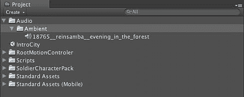

    +   现在您有一个可用的 AudioSource，可以添加到场景中的其他 GameObject 中。但请记住，Unity 不会扭曲资产，除非我们通过更改原始音频文件的一些属性来告诉它。我们引入了一个相当大的 AudioSource 作为`.wav`文件。

1.  告诉 Unity 压缩这个资产，从**音频格式**选项中选择**压缩**，这样文件就不会占用太多空间。此外，勾选**硬件解码**复选框，以便 Unity 将使用 iOS 设备内置的 iOS 硬件：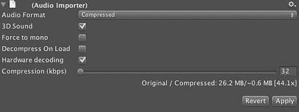

    +   如果没有可用硬件，Unity 将自动回退到软件解码。在我们的例子中，我们是从 26.2MB 的 Wav 文件转换到 0.6MB 的压缩 MP3 文件。如果您想要更高品质的样本，可以将压缩滑块调整到更高的值，但在这个例子中，这只是一个简单的环境噪音，所以我们不需要过度的保真度。

        现在我们已经创建了 AudioSource，需要将其附加到一个 GameObject 上，以便它能够播放。由于这是环境声音，我们可以将其附加到玩家将行走的地面。

1.  简单地将 Audio source 拖动到**场景视图**中的地面，或者拖动到**层次结构视图**中的地面。两种方式都会在地面添加一个 AudioSource 组件。

1.  通过在**检查器**的**Audio Source 属性**中选择**循环**选项，确保音频持续播放：

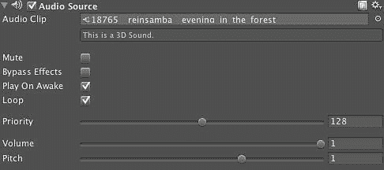

我们已经告诉这个 AudioSource 循环其音频，所以我们应该在整个游戏过程中，在这个地面 GameObject 上听到这个音频剪辑。关于 iOS 中压缩音频的一个特殊说明是，压缩过程可能会调整您的音频数据的开始或结束，因此您在压缩后应该听一下，以确保它仍然可以正确循环。

我们并不一定需要将声音附加到地面上，我们也可以将其附加到不同的对象上。例如，如果我们想给市场添加市场嘈杂的声音，我们可以直接将其附加到代表市场的 GameObject 上，当玩家离开它时，声音会减弱。

## 刚才发生了什么？

我们刚刚为我们的世界创建了一个环境声音轨道。通过导入.wav 文件并压缩它，我们整合了一个适合在移动平台上使用的资产，并且可以使用 iOS 设备硬件来解压缩音频流。由于我们已经将这个 AudioSource 附加到我们世界的地面上，我们可以确信，当我们穿过环境时，它将是可听见的。通过这种方式，我们为我们的世界创造了一些氛围，并给这个世界的这个区域赋予了个性。

# 行动时间 — 为动作添加声音

虽然我们已经创建了一些背景环境声音，但我们还没有为游戏中发生的行为添加任何声音。例如，如果我们使用我们的远程攻击滑动手势并投掷某物，我们的玩家在投掷动画过程中应该发出一些声音，而投掷的物体如果击中地面——或者其他物体，也应该发出声音。

让我们导入一个简单的声音，当玩家要进行远程攻击时，我们会播放这个声音。我再次使用了来自[www.freesound.org](http://www.freesound.org)的 Creative Commons 许可的声音。这个声音的作者是 Sruddi1，我已经采样了这个声音，包含一个单一的咆哮声，这将是我们的角色在执行远程攻击时发出的声音。我已经将这个声音压缩得类似于导入环境声音时的步骤：

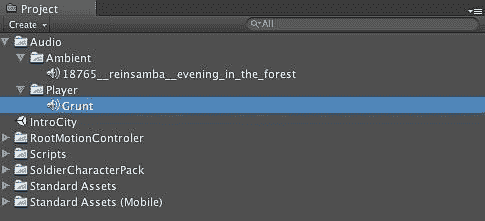

现在我们需要做的就是将这个咆哮声与一个脚本动作关联起来，这个动作是用户扔东西。完成这个任务是对我们在书中早期学到的某些技能的简单扩展。记住，从脚本部分我们知道我们可以将变量传递给脚本，并且这些对象可以是 Unity 中的事物引用。我们需要创建一个简单的脚本来表示这个动作，并公开一个将包含声音的变量。

```swift
using UnityEngine;
using System.Collections;
public class ThrowSomething : MonoBehavior {
public AudioClip audioClip;
// Update is called once per frame
void Update () {
// perform the animation for throwing
animation.Play("throw", AnimationPlayMode.Mix);
// play the audio clip one time
//
audio.PlayOneShot( audioClip );
}
}

```

这个脚本现在会在被调用时播放所需的`AudioClip`。你所要做的就是将一个`AudioClip`拖放到你附加此脚本的组件上，这就是将要播放的内容：

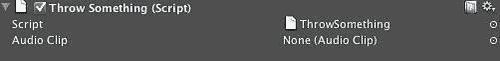

重要的一点是，你不必一定将`AudioClip`附加到游戏中的对象上才能播放声音。当你想要播放`AudioClip`时，可以即时创建一个`GameObject`。实际上，如果你想要在检测到某些事件时即时创建声音，这非常有用。

```swift
using UnityEngine;
using System.Collections;
public class AudioEngine
{
public AudioEngine ()
{
}
public AudioSource Play( AudioClip clip, Transform position )
{
return Play( clip, position, 1f, 1f );
}
public AudioSource Play(AudioClip clip, Vector3 point, float volume, float pitch)
{
//Create an empty game object
GameObject go = new GameObject("Audio: " + clip.name);
go.transform.position = point;
soundadding, to actions//Create the source
//
AudioSource source = go.AddComponent<AudioSource>();
source.clip = clip;
source.volume = volume;
source.pitch = pitch;
source.Play();
Destroy(go, clip.length);
return source;
}
}

```

因此，如果我们已经将这个`AudioEngine`安装到场景中的`GameObject`上，我们就可以简单地引用它，并告诉它播放我们想要播放的特定`AudioClip`，并告诉它声音的位置。

## 刚才发生了什么？

我们创建了一个声音，当用户执行远程攻击手势时就会播放。通过更新我们的脚本，该脚本在检测到远程攻击手势时对玩家进行动画处理，我们已经在脚本中指定了一个新的`AudioClip`，我们可以通过简单的脚本调用来播放它。现在，当玩家挥剑、击中敌人等时，我们也可以执行类似操作。我们只需要在这些脚本中公开一个`AudioClip`变量，并传递我们想要播放的声音。

## 播放音乐

在 Unity 中播放音乐有一些特定的细微差别，以确保其正常工作。虽然音乐就像任何其他声音一样，只是它与玩家在场景中的位置有关。

# 行动时间 — 音乐的声音

在我们的应用程序中，我们希望音乐持续播放。我们可以通过将`GameObject`附加到玩家或相机对象，并从那里播放音乐来实现这一点。如果您尝试这样做，您的声音系统将很好地播放音乐，直到场景改变。因此，播放声音和构建音乐系统的主要区别在于确保音乐继续播放。

1.  创建一个名为`Music`的文件夹。

1.  将您喜欢的`.mp3`文件导入游戏项目。在项目的示例文件中，您可以找到 basematic 创作的 Orc March 曲目。您可以在[`www.ccmixter.org/:`](http://www.ccmixter.org/)找到其他创意共享音乐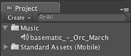

1.  创建一个名为**MusicPlayer**的空游戏对象，并将其设置为**主相机**的子对象：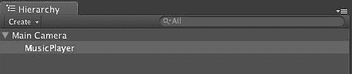

1.  将**音频源**组件添加到**MusicPlayer**游戏对象。

1.  接下来，我们需要确保我们的**MusicPlayer**对象在场景间移动时不会被销毁，通过在 Unity 中创建一个附加到下一个场景的脚本来实现。为此，在游戏中创建一个名为`scene_2`的第二个场景。

1.  创建一个名为`MusicPreserver`的脚本，并填充以下代码：

    ```swift
    function Awake()
    {
    // find the music player object
    var musicObject : GameObject = GameObject.Find("MusicPlayer");
    // make sure we survive going to different scenes
    DontDestroyOnLoad(musicObject);
    }

    ```

1.  将 MusicPreserver 脚本附加到新场景。

## 刚才发生了什么？

现在，我们可以在游戏中播放音乐，并在场景间移动时保持音乐播放。这将使我们能够为游戏中的区域设置情绪，同时保持更改场景数据时的灵活性。

默认情况下，当 Unity 加载新级别或场景时，前一个场景中的所有对象都会被销毁（这通常会停止我们的音乐）。保留音乐的关键是`DontDestroyOnLoad`方法，它将告诉 Unity 在处理原始场景的对象时不要动这个游戏对象。现在我们可以拥有跨越整个游戏的真实音乐音轨。

# 视频功能

iOS 设备对 H.264 编码的视频具有标准的硬件加速播放。Apple 通过 SDK 中的`MPMoviePlayerController`类公开接口来播放此内容。这个类允许用户播放位于设备上的电影，或者播放位于互联网上某个任意 URL 的电影。Unity 通过`iPhoneUtils`中的`PlayMovie`或`PlayMovieURL`方法公开这两种方法。

无论您是在 WebKit 网络浏览器中使用 UIWebView 流式传输视频，还是在 Unity 中这样做，iOS 设备的视频编码都非常具体。视频必须使用以下压缩标准进行压缩：

+   H.264 基线配置文件级别 3.0 视频

+   支持高达 640x480 分辨率，30fps 的分辨率

+   基线配置文件不支持 B 帧

+   MPEG-4 Part 2 视频（简单配置文件）

如果您需要一些工具来帮助您创建与 iOS 设备兼容的视频，您可以检查 Quicktime Player 本身及其视频导出选项，以及 Handbrake。Handbrake（[`www.handbrake.fr`](http://www.handbrake.fr)）为 iOS 平台设备提供了特定的编码视频配置文件。

# 行动时间 — 播放嵌入视频

对于我们的应用程序设计，我们应在应用程序首次启动时播放一个介绍电影。这个视频通常是某个动画标志或类似内容，在我们的案例中将是 Sojourner Mobile 介绍电影（有时被称为插页）。

我将假设您不是视频工程师，对 MPEG-4、H.264 或 B 帧不太了解，但您有一些想要添加到 iOS 项目中的内容。这给许多新开发者带来了很多麻烦，并导致视频在设备上无法显示。

我们可以通过使用专为为 iOS 设备制作内容而设计的工具来避免所有这些麻烦。您可以用于此目的的一个这样的工具是 iMovie。它具有导出 iOS 设备兼容视频的功能，您可以使用它来处理您的项目。

1.  将您的内容导入 iMovie，并使用**共享**菜单导出：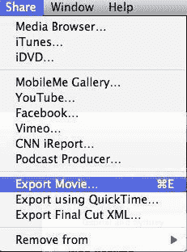

1.  当提示选择要导出的视频类型时，请选择移动尺寸并按**导出**按钮：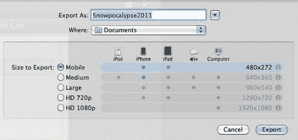

    +   注意，您也可以选择中等尺寸，但由于这是将被嵌入到我们游戏中的媒体，并且将计入我们的最大应用大小限制，因此最好将此内容保持尽可能小，以便您可以为其他事物（如游戏资源）保留空间。

1.  接下来，我们需要将视频移动到名为`StreamingAssets`的特殊 Unity 资源文件夹中。Unity 将复制此目录中的文件到我们的应用程序包中，并将它们放在设备上的适当位置，以便我们可以在运行时播放它们：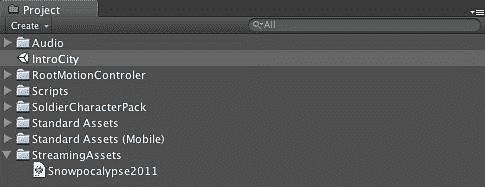

    +   现在我们已经在游戏中有了资产，我们需要播放它。最好的方法是有一个场景，除了显示我们的电影外，不做任何其他事情，然后加载 IntroCity 场景。

1.  让我们创建一个名为**GameIntro**的新场景，它将为此目的服务：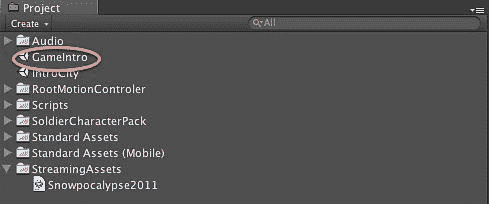

1.  现在我们有了**GameIntro**场景，我们可以创建一个空的**GameObject**，并将其脚本附加到它上面，该脚本将播放我们的电影，并在电影结束后加载下一级。

1.  现在，我们只需要一个简单的脚本，我们可以将其附加到这个**GameObject**上，并在脚本的`Start()`方法中启动。我们需要使用 C#的`Start()`方法的协程版本，而不是我们通常的版本。

    ```swift
    using UnityEngine;
    using System.Collections;
    public class PlayIntroMovie : MonoBehaviour {
    // Use this for initialization
    IEnumerator Start () {
    iPhoneUtils.PlayMovie("Snowpocalypse2011.m4v", Color.black, iPhoneMovieControlMode. CancelOnTouch, iPhoneMovieScalingMode.AspectFill );
    yield return null;
    Application.LoadLevel("IntroCity");
    }
    }

    ```

1.  通过将此脚本附加到我们的空**GameObject**，我们现在拥有了一个完整的介绍电影系统，当我们开始游戏时，我们将看到我们公司的插页广告。

## 刚才发生了什么？

我们通过播放电影来展示我们的工作室介绍电影，然后加载我们一直在工作的关卡，即开始城镇关卡，从而完成了我们的介绍场景。现在我们的内容开始感觉像我们在 App Store 中找到的内容。

# 行动时间 — 流式传输视频

我们需要做的第一件事是确保互联网连接可用。一旦我们知道互联网可用，我们就可以开始流式传输我们的视频。我们需要检查网络连接，因为我们想尊重用户可能为了节省电池寿命而关闭网络连接以进入飞行模式，或者因为我们的设备可能不在网络连接区域。

我们可以通过使用 iPhoneSettings 的`internetReachability`类变量来确定 iOS 设备是否可以连接到网络。这将随着网络状态的变化而更新，并也会告诉您您可用的互联网连接类型。对于我们的目的，我们只需要检查是否有任何类型的连接。我们可以通过简单的条件检查来解决这个问题：

```swift
if ( iPhoneSettings.internetReachability != iPhoneNetworkReachability.NotReachable )
{
}

```

执行此互联网连接检查非常重要。如果您的应用程序尝试连接到互联网但失败，并且您没有优雅地处理这种情况，无论是显示用户可见的错误还是不执行需要网络访问的功能，苹果公司将拒绝该应用程序。您应该准备好在仅限飞行模式的情况下测试您的游戏，以了解在没有网络连接的情况下它是否会表现正常。

现在我们知道我们可以连接到互联网，我们希望将一些视频流式传输到设备上。我已经在网上存储了一个 iOS 设备可以从我们的服务器流式传输的视频：

```swift
if ( iPhoneSettings.internetReachability != iPhoneNetworkReachability.NotReachable )
{
iPhoneUtils.PlayMovieURL(http://www.sojournermobile.com/assets/unitybook/commercial.m4v, Color.black, iPhoneMovieControlMode.Hidden )
}

```

如您所见，这与播放设备上存储的内容并没有太大不同。因为我们希望它像商业广告一样表现，我们希望移除播放器取消此视频或跳过它的能力，所以我们使用`iPhoneMovieControlMode.Hidden`枚举来确保播放器必须观看这部电影。

## 刚才发生了什么？

我们已经执行了网络检测来确定互联网连接是否可用。在确认网络连接可用后，我们连接到互联网上的一个流并开始播放我们的商业广告。

# 摘要

在本章中，我们执行了处理项目中多媒体所需的所有步骤。我们通过提供人们已经期待在游戏中看到的视频和音频环境提示，给我们的游戏增添了更多的灵魂，使我们的游戏看起来像 App Store 中已有的专业游戏。

具体来说，我们涵盖了：

+   如何向环境中添加环境声音

+   如何为游戏添加背景音乐

+   如何根据脚本中的动作播放声音

+   如何播放 Unity 项目中嵌入的视频

+   如何检测我们的网络连接是否活跃

+   如何播放托管在外部网站上的视频

现在我们已经了解了这些并形成了游戏的核心，是时候退后一步，开始考虑如何检查性能问题并调试我们的应用程序了。
