# 第九章。用户界面

> 虽然可能看起来我们已经创建了游戏的大部分内容，但还有一个非常重要的东西仍然缺失——**用户界面**（UI）。创建 UI 非常重要，因为这将是您的游戏对用户呈现的真实外观和感觉。如果您有一个通用的界面，无论您的模型看起来如何，游戏都会显得很普通。您可以在 Unity 中设计 UI 的许多方法，但其中大多数是为桌面应用程序设计的，在移动设备上表现不佳。我们将检查标准的 Unity 库设施来构建我们的 UI，并使用 Prime31 UIToolkit 构建一个 UI。

在本章中，我们将：

+   使用原生的 Unity 界面系统

+   探索流行的第三方 Prime31 UIToolkit 方法来生成界面

在我们完成这一章之后，我们将拥有创建几乎所有我们想要创建的游戏所需的所有工具。

那么让我们开始吧...

# 重要预备要点

本章假设您已经理解了诸如 GIMP 和 Photoshop 等工具的基本概念，包括图层、蒙版和填充。虽然本章中的屏幕将主要关注 Photoshop，但这里使用的所有概念都很容易转移到其他软件。

# 翻译设计

战吼用户界面设计的草图应该能够显示一些简单的资产，用于显示玩家的当前健康、游戏的分数、摇杆和动作按钮。

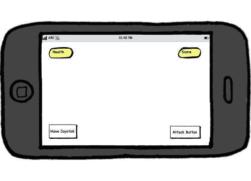

我们在“输入”章节中已经涵盖了摇杆和动作按钮，因此我们可以专注于健康显示和显示分数。我们需要一个漂亮的字体来显示文本，以及一些图像来显示健康。此外，我们还想为游戏构建一个主菜单，它将包括一个开始游戏的按钮和一个显示信用额的按钮。

## 即时模式游戏用户界面

Unity 游戏引擎为开发者提供了一个完整的集成系统，用于游戏用户界面（GUI）开发。这些 GUI 是通过即时模式方法来定义 GUI 并响应其事件构建的。对于大多数游戏来说，这不会成为问题，并且将是您将 HUD 和简单控制放置在屏幕上最容易的方式之一。然而，由于它是一个即时模式 API，开发者非常接近 UI 操作的机制。

例如，我们可以看看如何构建一个简单的 GUI，在屏幕上显示一个按钮。正如你可能猜到的，由于没有工具，并且我们处于即时模式，我们必须手动指定屏幕上组件的布局。

```swift
function OnGUI () {
if (GUI.Button (Rect (10,10,150,100), "I am a button")) {
print ("You clicked the button!");
}
}

```

尽管这可能与跳入 Flash、Photoshop、Objective-C 或你最喜欢的 GUI 框架的感觉不同，但即时模式 GUI 并不是什么新鲜事物。在传统的 GUI 框架中，你会在各种类中设置你的 GUI 组件，然后设置回调和消息系统，以便事件循环可以将数据从组件传递到处理事件的实际应用程序逻辑。那么，这有什么问题吗？你可能想知道。最终你会发现，你的应用程序到处都是代码——特别是如果你真的试图做到面向对象，并且为重用设计你的应用程序的话。

虽然这对于可能需要根据用户类型、屏幕分辨率或使用的数据动态更改布局的复杂商业应用程序来说是有意义的，但这并不是我们试图通过我们的游戏解决的问题。你会发现即时模式 GUI 非常紧凑，所有使你的游戏工作的逻辑通常都在少数几个地方。任何必要的状态数据都会提供给所有界面组件，无需查询或传递数据。这使得应用程序更容易跟踪，并且对性能非常友好。

# 行动时间 — 创建菜单背景

我们需要做的第一件事是为我们游戏的主菜单创建一个背景。这将给我们一个机会看到如何设置 Unity GUI 组件。为了使事情简单，最初我们将从主菜单开始。

1.  创建一个名为**MainMenu**的新场景。

1.  由于这是一个军事风格的游戏，我们可以为我们的主菜单背景使用简单的迷彩纹理。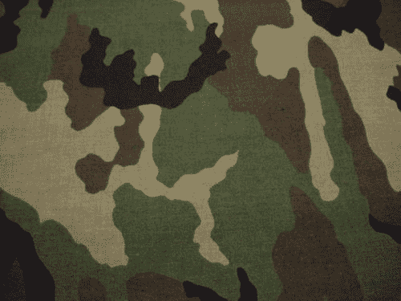

    在此之上，我们将显示我们游戏的按钮。虽然我们可以修改现有的**GameIntro**场景以处理主菜单，但从设计角度来看，最好创建一个独立的主菜单场景。这将有助于开发工作流程，因为内容创作者可以独立地工作在这个场景上。

    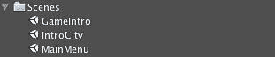

1.  在添加我们的**MainMenu**场景后，我们需要对`PlayIntroMovie`脚本进行修改，使其加载**MainMenu**场景而不是直接进入游戏。

    ```swift
    using UnityEngine;
    using System.Collections;
    public class PlayIntroMovie : MonoBehaviour {
    // Use this for initialization
    IEnumerator Start () {
    iPhoneUtils.PlayMovie("Snowpocalypse2011.m4v", Color.black, iPhoneMovieControlMode.CancelOnTouch, iPhoneMovieScalingMode.AspectFill );
    yield return null;
    Application.LoadLevel("MainMenu"); 
    }
    }

    ```

1.  下一步是将我们要用于背景的纹理导入。在本章的项目文件夹中，你可以找到资产`army_camo.jpg`。如果你将其拖入 Unity 中，它将被导入并准备好使用。然而，对于我们的 iOS 发布版本，我们不想仅仅作为背景使用如此大的纹理。如果你显示该资产的**检查器**设置，你会发现它是以 1024x1024 的分辨率导入的。然而，对于我们的 iOS 游戏，我们不想使用如此大的纹理作为背景。

1.  通过选择 iPhone 图标并勾选覆盖 iPhone 设置的复选框，为我们的 iOS 设备覆盖此纹理的设置。将此纹理的**最大尺寸**设置为**512**，然后点击**应用**按钮。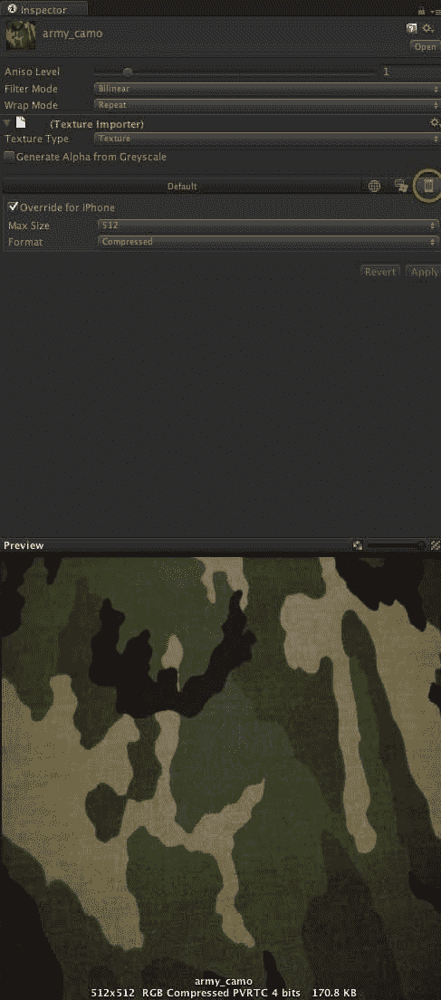

    现在我们为 iOS 的纹理将只有 512x512，而其他平台可以是 1024x1024。从工作流程的角度来看，这一点很重要，因为你将想要覆盖你部署到平台的资源，而不为每个平台创建全新的资源。

1.  我们接下来的步骤是将此图像设置为场景的背景。在**项目**视图中选择我们刚刚导入的纹理，并创建一个**GUI Texture**。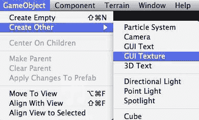

1.  将我们的背景纹理的缩放比例更改为(1,1,1)，以便它填充整个屏幕。由于**GUITexture**是 Unity UI 构建的专门用于 UI 元素的构造，因此其位置和缩放都是在屏幕空间中完成的，而不是在世界空间中。通过将所有维度设置为**1**，我们告诉 Unity 用我们的**GUITexture**填充屏幕。在这个情况下，Z 轴与之前章节相同。如果你需要在背景之前绘制其他项目，它们只需要具有比背景更低的 Z 值。

    ### 注意

    我们不需要将**GUITexture**作为相机的子对象来实现这一点。

    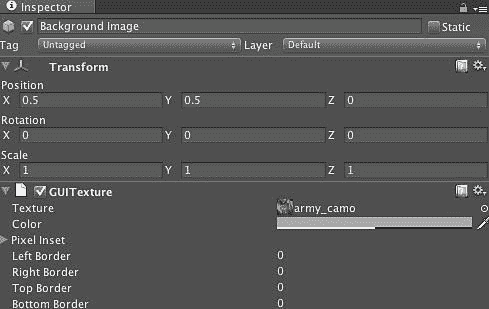

1.  运行项目，你将看到一个填充整个屏幕的迷彩纹理。

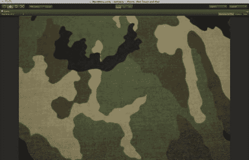

# 刚才发生了什么？

我们刚刚为主菜单场景创建了一个背景。正如你所注意到的，此项目没有成为场景任何部分的子对象，并且将不考虑场景中的其他项目而显示。现在我们可以继续向菜单中添加按钮。

## 将菜单显示在屏幕上

要使即时模式 GUI 与 Unity 协同工作，我们只需在脚本中提供一个函数，即`OnGUI`。就像任何其他脚本一样，我们将把我们的 UI 脚本附加到场景中位于某个位置的**GameObject**上，Unity 会每帧调用它以确保处理该帧期间发生的任何 GUI 事件。一个明显的警告是，这意味着你的 GUI 循环应该是紧凑的循环并且高度优化；你不应该在 GUI 代码中执行复杂且耗时的计算。

如果我们回顾一下我们的主菜单示例，我们知道我们有两个简单的按钮，当点击时需要执行非常特定的操作。因此，从伪代码的角度来看，我们知道我们的应用程序只需要一个基本的 if/else 条件来检查我们正在使用的两个控件。

```swift
// Use this for initialization
if ( MainMenuButton( control_x, control_y, width, height) )
{
loadMainGameScene();
}
else if ( CreditsMenuButton( control_x, control_y, width, height) )
{
loadCreditsScreen();
}

```

在这个例子中，`MainMenuButton`和`CreditsMenuButton`代表我们将要在脚本中定义的两个 GUI 控件，分别用于打开主场景或信用场景。

# 添加按钮到 GUI 的行动时间

1.  从资源文件夹中导入两个纹理`BTN_StartGame`和`BTN_Credits`。这些纹理将用于构建我们的主菜单。

    你还会注意到这些纹理比包含的按钮要大一些。这是因为在默认情况下，Unity 会期望你的纹理是 2 的幂。我们将在稍后解决这个问题。

    

1.  创建一个名为**Menu Object**的空游戏对象。

    回到我们最初的脚本探索，我们知道我们需要在场景中有一个游戏对象，以便我们的脚本能够运行。由于这个对象不需要显示，或具有任何特定的游戏功能，我们只需将一个空游戏对象插入场景，并将我们的脚本附加到该对象。

    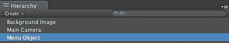

1.  由于我们将构建即时模式的 GUI，因此我们可以推断出我们将需要一些脚本来驱动 GUI 的显示。创建一个名为`MainMenu`的脚本并将其附加到**MenuObject**游戏对象。

1.  在`MainMenu`脚本中定义两个公共变量，这将允许我们指定主菜单命令的按钮纹理。

    当我们最初导入按钮纹理时，Unity 将它们导入为 Texture2D。如果我们配置我们的脚本以接受 Texture2D，我们可以使用 Unity GUI 配置我们想要显示的纹理，而不是在代码中硬编码此值。我们可以通过在定义脚本的类中定义公共属性来实现这一点。

    ```swift
    public Texture2D mainMenuButton;
    public Texture2D creditsMenuButton;

    ```

1.  接下来，我们需要更新我们的`OnGUI`方法以显示主菜单的按钮。我们希望之前导入的 Texture2D 作为按钮显示在我们的界面中，因此我们需要使用 Unity GUI 系统将它们渲染为按钮。

    Unity 有一个易于使用的`GUI.Button`类，它执行此功能。`GUI.Button`允许我们在界面中创建一个按钮，其坐标位于屏幕空间中。我们通过定义一个矩形`(Rect)`来实现，其中按钮将被绘制在屏幕上的位置作为前两个参数，宽度和高度作为后两个组件。

    ```swift
    Rect( x, y, width, height )

    ```

    当与正常的`GUI.Button()`方法调用结合时，我们得到以下结果：

    ```swift
    void OnGUI()
    {
    GUI.Button( new Rect ( 0, 0, 256, 256 ), mainMenuButton );
    }

    ```

    在这里，我们正在创建一个位于屏幕左上角、大小为 256x256 的新按钮，并将`mainMenuButton`定义为应该绘制在这个按钮中的 Texture2D。

    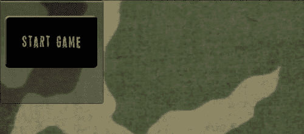

1.  接下来，我们需要告诉 Unity GUI 在有人按下该按钮时执行操作。正如伪代码所示，这涉及到将按钮包裹在一个 if 语句中——该语句将在`OnGUI`中评估。

1.  添加`creditsMenuButton`并将按钮居中，通过更新原始`GUI.Buttons`的 Rects 来实现。

    ```swift
    using UnityEngine;
    using System.Collections;
    public class MainMenu : MonoBehaviour {
    public Texture2D mainMenuButton;
    public Texture2D creditsMenuButton;
    // Process the GUI
    void OnGUI () {
    int componentWidth = 256;
    int componentHeight = 256;
    int interfaceOrigin = 0;
    if (GUI.Button( new Rect ( Screen.width / 2 - componentWidth/2, interfaceOrigin, componentWidth, componentHeight ), mainMenuButton) )
    {
    Debug.Log("You clicked the start button ");
    }
    else if (GUI.Button( new Rect ( Screen.width / 2 - componentWidth/2, interfaceOrigin + componentHeight, componentWidth, componentHeight ), creditsMenuButton) )
    {
    Debug.Log("You clicked the credits button ");
    }
    }
    }

    ```

    虽然在 Unity 中使用 GUI 组还有其他方法来做这件事，但这种方法更适合作为教学工具。如果我们现在渲染场景，我们会发现两个包含我们的按钮纹理的按钮：

    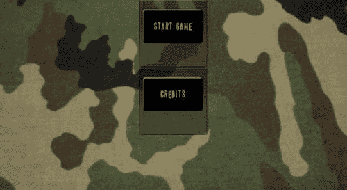

    按压这些按钮将在控制台显示一些调试文本：

    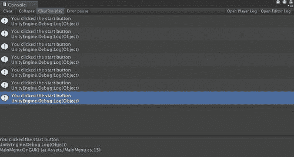

    虽然这允许我们的按钮被渲染，但渲染的 GUI 按钮比我们想要的要多。Unity GUI 在其`GUIStyle`中定义了自己的样式引擎，它决定了按钮应该如何绘制。由于我们已经将按钮的外观和感觉烘焙到纹理本身中，我们不需要 Unity 显示任何这种样式。

1.  更新`GUI.Button`的`GUIStyle`，使其没有关联的样式。

    ```swift
    if (GUI.Button( new Rect ( Screen.width / 2 - componentWidth/2, interfaceOrigin, componentWidth, componentHeight ), startButton, GUIStyle.none) )
    {
    Debug.Log("You clicked the start button ");
    }

    ```

    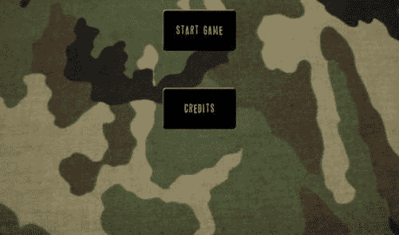

    通过进行这个简单的更改，我们将能够以我们期望的方式渲染 GUI。

1.  更新脚本以在按钮按下时加载 Unity 级别。

    ```swift
    if (GUI.Button( new Rect ( Screen.width / 2 - componentWidth/2, interfaceOrigin, componentWidth, componentHeight ), startButton, GUIStyle.none) ))
    {
    Debug.Log("You clicked the start button ");
    Application.LoadLevel("IntroCity");
    }

    ```

通过像之前那样调用`Application.LoadLevel`，我们现在有一个机制，即通过界面按下按钮，Unity 加载特定的场景。

## 刚才发生了什么？

我们刚刚构建了一个简单的即时模式 GUI，用于显示我们游戏的主菜单。我们通过使用 Unity GUI 系统和构建一个渲染我们的 GUI 的脚本来实现这一点。在幕后，Unity 正在根据脚本每帧绘制我们的场景。重要的是要注意，如果你更改脚本，使其程序性地根据某些设置或每三帧显示某些内容，Unity 会这样做，因为它会每帧处理 UI 脚本。因此，在`OnGUI`方法中执行任何非常复杂的操作都可能导致性能显著下降。

## 更好的方法 — UIToolkit

Unity GUI 库当前实现的一个问题是，它是为 PC 用户设计的，没有考虑到移动设备的任何限制。虽然在某些情况下性能足够好，但在大多数情况下，它生成的绘制调用数量足以破坏你游戏的性能。

在我们之前的例子中，由于我们没有进行任何足够强烈的渲染来影响帧率，因此无法真正看到性能下降的影响。由于我们的场景相当静态，因此无法直观地测量结果。然而，如果我们查看我们的统计数据，我们可以看到，即使是这个非常简单的 GUI，我们也正在使用三个绘制调用——每个 GUI 组件一个。

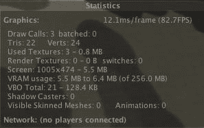

现在可能看起来并不多，但随着你在优化章节中学到更多，这是 iOS 设备正在做的大量工作。那么如果我们能在单个 draw call 中完成同样多的工作会怎样？如果我们能不管我们绘制多少 GUI 元素都只有一个 draw call 会怎样？Prime31 的 UIToolkit 就出现了。

# 执行时间 — Prime31 UIToolkit

1.  通过访问网站：[`github.com/prime31/UIToolkit`](http://https://github.com/prime31/UIToolkit)下载**code'n'web TexturePackerPro**基本功能。

1.  从下载列表中选择 TexturePacker 的最新可用版本并安装 TexturePacker：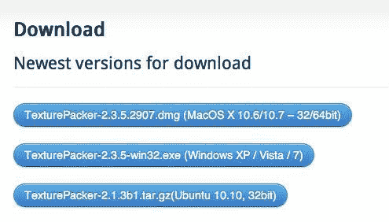

1.  接下来，将信用菜单和开始游戏菜单的 UI 按钮拖入界面。你可以通过将图像拖入界面右侧的 Sprites 菜单来完成此操作：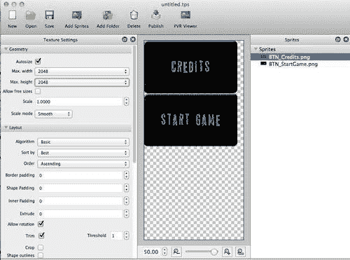

1.  我们希望使用尽可能少的纹理内存，所以将**最大宽度**和**最大高度**设置为可能的最小 2 的幂次。你的纹理仍然需要是正方形，所以你在寻找可以同时设置盒子的宽度和高度的 smallest number。在我们的例子中是 512。如果**TexturePacker**找不到将你的纹理放入该大小的方法，它将把文本变成红色。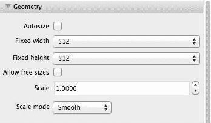

    在这个阶段你可能还没有注意到的一个好处是，在我们之前创建纹理时，我们是以 2 的幂次大的纹理来创建的，这样 Unity 才能接受它们。在这里，TexturePacker 正在识别纹理中的空白区域，并优化每个纹理所占用的空间。在这种情况下，我们实际上有额外的空间，如果我们需要的话，可以打包更多的纹理。

1.  在**输出设置**（滚动左侧面板到底部）中将**数据格式**设置为**JSON**（JavaScript 对象表示法）并将目录设置为项目的`Assets`文件夹。将文件名设置为`gui`并将`.json`文件的扩展名更改为`.txt`，因为 Unity 期望文本资源以`.txt`扩展名结尾。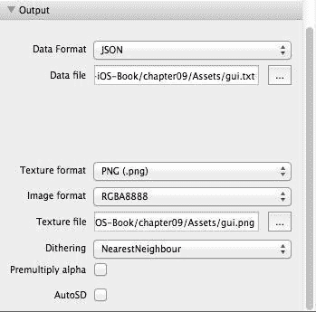

1.  在工具栏中按下**发布**按钮，将在你的`Assets`文件夹中创建适当的文件。

    现在我们已经完成了从 TexturePacker 需要的所有事情。

1.  通过访问[`github.com/prime31/UIToolkit`](http://https://github.com/prime31/UIToolkit)网站下载 UIToolkit 库。

1.  选择下载并选择.unitypackage 选项：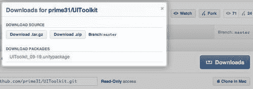

1.  下载完成后，安装 Unity 包，导入其中的所有项目：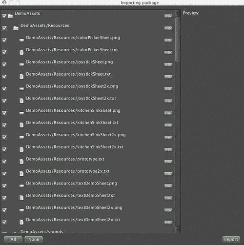

1.  为了分别检查渲染 GUI 的两种不同方法，为这种方法创建一个新的场景，并将其命名为 UIToolkit。

1.  为了确保我们的 UI 组件与场景中的其他部分分离，我们希望在 Unity 中将其放置在特定的层上。层是一组组件的集合，可以作为一个集合进行访问或操作。如果你熟悉 Photoshop，这个概念是相似的。

1.  在 Unity 中，通过访问**编辑 | 项目设置** | **标签**来创建一个新的层，以便我们的 GUI 可以绘制：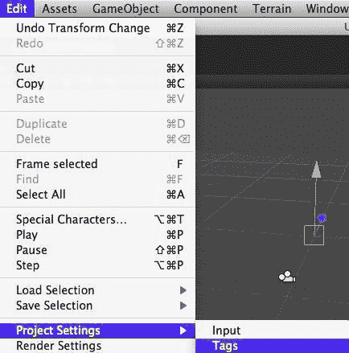

1.  选择**用户层 8**，并将层名称设置为**UI 层**：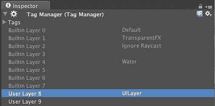

1.  创建一个空的游戏对象，命名为**GUIObject**，并将其位置设置为 0,0,0：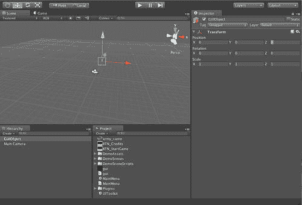

1.  在**项目**视图中展开`插件`文件夹，你将找到**UIToolkit 库**。展开 UIToolkit，并将 UI 脚本拖放到**GUIObject:**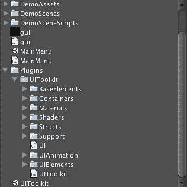

1.  在**层次结构**视图中选择**MainCamera**对象，并从**裁剪遮罩**中移除**UILayer**，以确保 UI 不会绘制两次：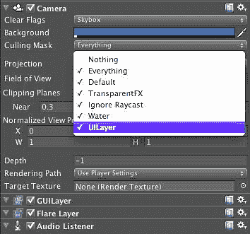

1.  一旦选择**UILayer**，**裁剪遮罩**应显示为**混合**，如下截图所示：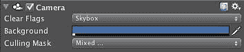

1.  创建一个新的空游戏对象，命名为**UIToolkit**，并将其设置为之前创建的包含 UI 脚本的**GUIObject**的子对象：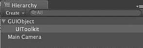

1.  将`UIToolkit plugins`文件夹中的**UIToolkit**脚本拖放到**层次结构**视图中的 UIToolkit 游戏对象上：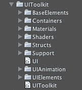

1.  在**层次结构**视图中选择**GUIObject**节点，以显示其检查器。告诉它我们希望 UI 在**UILayer**上绘制，通过选择**UILayer**条目旁边的下拉菜单并选择 UI 要绘制的层——我们也将它命名为**UILayer**：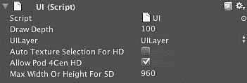

1.  为了完成我们的配置，我们需要告诉**UIToolkit**我们正在使用哪个 TexturePacker 配置。在**层次结构**视图中选择**UIToolkit**节点以显示其检查器。在**Texture Packer Config Name**中输入我们保存的配置名称，在本例中为**gui**：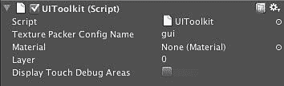

    现在我们准备使用在 Texture Packer 中使用的纹理来创建我们的 GUI。

1.  创建一个名为 `UIToolkitGUI` 的脚本，并使用这种新方法在屏幕上添加一个按钮：

    ```swift
    using UnityEngine;
    using System.Collections;
    public class UIToolkitGUI : MonoBehaviour {
    // Use this for initialization
    void Start () {
    var mainMenuButton = UIButton.create("BTN_StartGame.png", "BTN_StartGame.png", 0 , 0 );
    }
    }

    ```

    注意，UIToolkit 按钮类接受一个正常按钮状态和一个按下按钮状态。由于我们没有两者，所以我们只是使用了相同的纹理。最后两个参数是我们希望在屏幕上显示此按钮的位置。

1.  按下播放，我们的按钮将显示在屏幕上。

## 刚才发生了什么？

我们刚刚使用 Prime31 的开源免费库 UIToolkit 创建了我们的 GUI。我们实现了与原始菜单相同的功能，但只需要一个绘制调用。虽然我们也可以使用 UnityGUI 实现类似的功能，但随着用户界面的越来越复杂，性能会逐渐下降，因为每个控件的增加和每个 GUIStyle 的渲染都会导致另一个绘制调用。

此外，我们还提出了一种更优化的方法来将纹理放入 UI。默认情况下，Unity 不允许您使用非 2 的幂纹理进行渲染，这将导致每个纹理都有大量的浪费纹理内存。使用这种方法，我们可以将大量纹理打包到一个更大的纹理中，这本身就更高效，并且可以渲染形状迥异的纹理，而不会在纹理内存效率上牺牲太多。

# 摘要

在本章中，我们学习了如何为我们的游戏构建 UI。我们探讨了使用 Unity GUI API 设置 UI，以及使用领先的第三方插件 Prime31 UIToolkit 设置 UI。

具体来说，我们涵盖了：

+   如何使用标准 GUI 库构建即时模式 GUI

+   如何使用 Prime31 UIToolkit 构建 GUI

+   关于 GUI 性能的一些担忧

现在我们已经完成了 UI 的组装，我们需要为我们的游戏处理更复杂的游戏脚本——这是我们下一章的重点。
