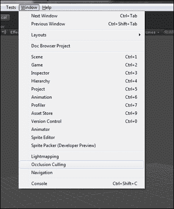
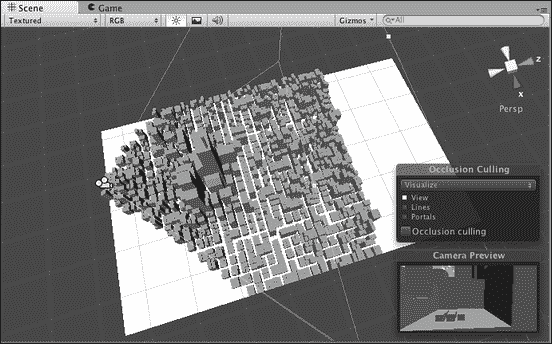
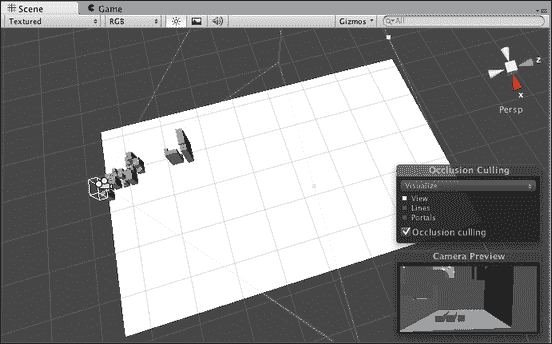

# 第六章。优化和转换技术

本章将向你介绍**遮挡剔除**（**OC**）和细节级别在优化技术中的使用。此外，你将学习如何优化 Unity C#和 Unity JS 代码。最后，你将看到如何将 Unity C#代码转换为 Unity JavaScript 代码，反之亦然。

本章将涵盖以下主题：

+   遮挡剔除和优化技术中的细节级别

+   Unity C#和 Unity JS 优化技巧和窍门

+   将 Unity C#代码转换为 Unity JavaScript 代码，反之亦然

# 遮挡剔除和优化技术中的细节级别

让我们更仔细地看看 Unity 中遮挡剔除的基本原理（仅限 Pro 许可证）以及如何在项目中使用它们以实现出色的性能。

你可以从 Unity 菜单中打开遮挡剔除编辑器，如以下截图所示：



遮挡剔除机制的主要目的是筛选和过滤掉相机区域中不可见的对象，以提高优化效果。这主要意味着对象只有在必要时才会使用资源，从而帮助你创建一个运行速度更快的游戏或应用。

棱锥剔除与遮挡剔除不同，因为它禁用了相机视图外的渲染器，但不会禁用与其他渲染器重叠的渲染器；例如，如果一堵墙遮挡了一个对象，它对相机将是不可见的。使用遮挡剔除，你可以自动利用棱锥剔除的优势。通过使用视觉遮挡剔除技术，我们可以在以下两张截图中的两个示例中看到：



在这里显示的截图中，你可以看到遮挡剔除的效果：



Unity 中的遮挡剔除过程使用一个虚拟相机来扫描整个场景，并创建一组可能可见的对象的层次结构。然后，这些信息将在你的游戏或应用中实时使用，以减少绘制调用次数并提高性能。

为了使用遮挡剔除，你需要为场景中要处理的每个对象设置**遮挡静态**标签。此外，你还可以使用另一个对象的标签，称为**被遮挡静态**，如下一张截图所示。被遮挡的对象可能被其他对象遮挡，并在类似情况下被禁用以提高性能，但这些对象不能与其他对象重叠。因此，它们将提高你整个项目的性能。


### 注意

在相机将要渲染对象的地方创建遮挡剔除区域也非常重要。

我们刚刚介绍了通过遮挡剔除方法进行优化的基本和关键方面。我们无法在本章中描述所有设置和功能的细节。以下章节将描述各种想法、方法、方法和优化和改进性能的方式。下一节的目的是指引你走上提高性能的正确道路。你将使用本章中描述的所需优化技术，如果需要，你可以从网络上找到有关方法、实现和定制的更详细信息。现在让我们考虑另一种称为**细节级别**（**LOD**）的优化技术。

## 通过 LOD 进行优化

LOD 优化技术是一种通过减少场景中总的多边形、纹理和其他资源数量来降低帧渲染复杂性的方法，总体上降低其复杂性。一个简单的例子是，主要角色模型由 10,000 个多边形组成。在处理阶段靠近相机的情况下，使用所有多边形很重要。然而，在远离相机的地方，在最终图像中，它只占用几个像素；处理所有 10,000 个多边形是没有意义的。也许在这种情况下，几百个多边形，甚至几块和纹理，专门为大约相同的显示模型准备，就足够了。相应地，在中等距离处，使用由比最简单模型多、比最复杂模型少的三角形组成的模型是有意义的。

LOD 方法通常用于使用多个难度级别（几何或其他）来建模和渲染三维场景，这些难度级别与对象与相机之间的距离成比例。改变复杂性，尤其是在模型中的三角形数量，可以自动进行，基于最高复杂性的三维模型，但也可以基于几个预定义的具有不同细节级别的模式。使用具有较少细节的模型在不同距离处，你可以减少渲染设计复杂性，几乎不会影响整体图像的细节。

当场景中的对象数量很大，并且它们位于与相机不同距离的位置时，这种方法特别有效。例如，考虑一个体育游戏，如足球游戏或冰球模拟器。当角色远离相机时，使用低多边形角色模型，但当它靠近时，模型被大量多边形所取代。这个例子非常简单，它表明该方法的核心是基于模型的两个细节级别，但没有人费心创建多个细节级别。为了产生变化，LOD 级别不应过于明显，因此对象细节逐渐增加。

考虑以下影响细节级别技术水平的因素：屏幕上对象的总数（当画面中有一个或两个角色时，使用复杂模型，而当有 10-20 个角色时，切换到更简单的模型）或帧率（预定的有限帧率值，随着细节级别的变化而变化，例如帧率低于 30 会降低屏幕上模型的复杂性，而 60 帧则提高复杂性）。影响细节级别水平的其他可能因素如下：对象移动的速度（例如，对于正在移动的火箭，你看到它快速移动，但蜗牛则缓慢移动），从游戏的角度来看角色的重要性（例如，在足球中，你看到最接近且最常使用的玩家模型通常使用更复杂的几何和纹理）。这都取决于特定开发者的愿望和能力。最重要的是不要过度；频繁且明显的细节级别变化会令人烦恼。

我们想提醒您，细节级别不一定仅指几何形状。此方法还可以用于节省其他资源：纹理（尽管 GPU 使用米派映射，但有时在动态地改变纹理以保持某些细节方面是有意义的），照明技术（靠近的对象使用复杂算法，而远处的对象使用主照明），以及纹理技术。

# Unity C#和 Unity JS 优化技巧和窍门

首先，我们将考虑与 JavaScript 编程语言相关的优化方面的某些方面。尽量在 JavaScript 中避免使用动态类型。无疑，对性能最好的解决方案是静态类型。变量的动态类型使用会在执行代码时消耗，以找到特定变量的适当数据类型，这在原则上可以也应该通过指定所有变量的数据类型来避免。不良和良好的示例如下：

```java
// Dynamic Typing, BAD FOR YOUR PERFORMANCE
var yourVariableName = 23;

// Static Typing, GOOD FOR YOUR PERFORMANCE
var myGo : GameObject = null;
```

以下示例展示了如果你想要提高性能，你不应该做什么。这个例子使用动态类型来定义我们的变量`yourVariableName`，这反过来又以负面方式影响了整个系统的性能。在调用此对象任何函数之前，都会花费时间搜索正确的对象类型并检查被调用的函数是否可访问。不良的示例如下：

```java
function Start() {
  var yourVariableName = GetComponent(YourScriptName);
  yourVariableName.YourFunctionName();
}
```

为了避免在不必要的开销上浪费 CPU 时间，你应该始终为所有变量使用静态类型以提高性能：

```java
function Start() {
  var yourVariableName : YourScriptName = GetComponent(YourScriptName);
  yourVariableName.YourFunctionName();
}
```

### 小贴士

**尽可能使用静态类型而不是动态类型**

你可以使用`#pragma`严格预处理器指令来帮助你记住在 JavaScript 脚本中始终使用静态类型而不是动态类型。你应该在脚本顶部，在任意代码之前写入此指令。如果在脚本中使用了`#pragma`严格和动态类型，编译器将抛出错误。因此，这个预处理器指令强制你只使用静态类型。

我们还想提及其他优化代码的技术。其中之一是缓存组件或变量的技术。在优化过程中，你首先需要关注代码中经常执行的功能，特别是像`Update`和`FixedUpdate`这样的回调函数，以及每帧或几乎每帧都会调用的类似函数。换句话说，这些函数每秒会被调用很多次。因此，在这些高风险函数中对任何组件或变量的引用取决于具体情况。当然，对于整体系统性能来说，有些情况下这些操作对性能影响不大，而有些情况下，由于许多不必要的开销，性能几乎会降到零。在这些函数中，最好每次不要调用 Unity 方法`GetComponent`，因为这会非常频繁地查找组件或其他 Unity 库中的类似函数来查找对象等。相反，你可以在需要获取所需组件或对象（s）时调用所需的功能，并将它们存储在局部变量或数组中，就像你喜欢的样子。以下示例展示了这一点：

```java
// BAD for your performance
void Update() {
  transform.position = new Vector3(0.0f, 1.0f, -1.0f);
}

// Second example:
// GOOD for your performance
private Transform _t;
void Start() {
  _t = transform;
}

void Update() {
  _t.position = new Vector3(0.0f, 1.0f, -1.0f);
}
```

第二个示例中显示的代码比第一个示例中的相应代码快得多，因为 Unity 不会在每次`Update`周期或每帧查找 transform 组件。

### 小贴士

你应该只在必要时调用函数，不多也不少，正好在需要的时候。

对你的代码和整个系统来说，最好的优化是代码尽可能小，或者说根本不执行任何不必要的操作。不必要的计算会导致不必要的开销；对于移动设备来说，这个问题通常是最尖锐的。以下示例展示了一个小优化示例，但这并不是你性能的最佳解决方案。在每一帧之后，检查两点之间的距离会消耗你宝贵的时间：

```java
private Transform yourTransform:
void Update() {
  if (Vector3.Distance(yourTransform.position, transform.position) > 200) {
    return;
  }
  // your next code may be here ...
}
```

为了不浪费时间去纠正不必要的错误，你应该使用`OnBecameInvisible`和`OnBecameVisible`回调。有了这些回调，Unity 会在没有相机能看到（对于`OnBecameInvisible`）或至少有一个相机能看到（对于`OnBecameVisible`）你的渲染器的事件中调用。当然，这些回调在某些情况下很有用，在其他情况下则不然。例如，如果你的对象不包含渲染器组件，那么你需要想出一个方法来相应地启用或禁用代码的执行。这两个回调的一个简单示例如下：

```java
void OnBecameVisible() {
  enabled = true;
}

void OnBecameInvisible() {
  enabled = false;
}
```

为了达到所需的性能，你需要在代码中注意许多细节，以及本书中讨论的其他许多细节。在大多数情况下，代码优化会阻碍可读性，从而阻碍对代码的理解。请记住这一点，或者至少不要忘记。就像生活中的其他事情一样，我们需要找到一个平衡点，换句话说，就是质量和性能之间的黄金平衡。

让我们看看静态函数的行为以及我们需要多少时间来处理它们，因为与调用非静态函数相比，使用这些函数可以显著减少函数调用的时间。如果我们检查编译代码时静态函数会发生什么的问题，然而，这并不是什么秘密，所有的代码都会被转换成机器代码或汇编代码，这是最低的编程级别。如果我们考虑调用静态函数的汇编指令，我们会看到它需要的机器指令比调用非静态函数少，因此 CPU 时间也更少。

在调用中，每个通过值传递参数的函数都需要内存复制。如前所述，这可能会影响你的性能。因此，最好通过引用而不是值来调用函数。解决这个问题很容易。提高性能的最好方法是使用在函数中使用的类或对象的局部变量。你可以在函数内部创建一组变量，这反过来又会显著增加具有许多变量的函数调用对内存和 CPU 时间的消耗。函数必须在栈上记住，以便有进一步操作这些变量的机会。即使这些变量在函数中没有使用，它们仍然在栈上，并且会占用内存空间。

以下讨论将集中在常量上。常量不需要 RAM 分配，因为它们的值直接嵌入到指令流中。使用常量而不是创建大量局部或全局变量可以显著提高软件的性能，避免内存和 CPU 时间的开销。

静态变量（类的变量）以及静态函数（类的方法）需要的 CPU 时间较少，因为静态变量属于整个类，而不是属于此类的一个对象。用于搜索资源的时间正在减少，这在优化中具有明显的优势。对于任何对象的变量或函数，机器指令将被执行以定位它们所属的适当对象，这显然需要 CPU 时间和内存的开销。

`if` 和 `switch` 语句可以很容易地相互替换；例如，为了提高代码的可理解和可读性，或者优化所有相同的代码。如果你通过任何反汇编器查看编译后的机器指令和方向，你可以看到这两个表达式的区别。例如，`switch` 语句在编译后成为 ago-to 机制，这反过来又使得在转换表中通过机器指令进行跳转。它首先需要找到所需的转换，然后是那些前往命令汇编的部分。如果构造的行为在低位不同，它将像在高级编程语言中一样表现为正常分支；例如，在我们的案例中，C# 语言。在某些情况下，某些 `switch` 设计可能比相同的 `if`/`else if`/`else` 设计执行得更快。这些两种结构的性能完全取决于它们的正确应用，换句话说，正确的使用。例如，让我们考虑两个简单的案例，其中第一个案例将会有更快更有效的 `switch`，而在第二种情况下，`if` 设计在性能上优于 `switch` 解决方案，如下面的代码示例所示：

```java
using UnityEngine;
using System.Diagnostics;

public class IfSwitchTestFirstCase : MonoBehaviour {
  public const int CYCLES_COUNTER = 100000000;

  bool IfTest(int yourIntegerExample)
  {
    if (yourIntegerExample == 0 || yourIntegerExample == 1) {
      return true;
    }

    if (yourIntegerExample == 2 || yourIntegerExample == 3) {
      return false;
    }

    if (yourIntegerExample == 4 || yourIntegerExample == 5) {
      return true;
    }

    return false;
  }

  bool SwitchTest(int yourIntegerExample)
  {
    switch (yourIntegerExample)
    {
      case 0:
      case 1:
        return true;

      case 2:
      case 3:
        return false;

      case 4:
      case 5:
        return true;

      default:
        return false;
    }
  }

  void Start() {
    Stopwatch ifTimer = Stopwatch.StartNew();
    for (int i = 0; i < CYCLES_COUNTER; i++)
    {
      IfTest(i);
    }
    ifTimer.Stop();

    Stopwatch switchTimer = Stopwatch.StartNew();
    for (int i = 0; i < CYCLES_COUNTER; i++)
    {
      SwitchTest(i);
    }
    switchTimer.Stop();

    UnityEngine.Debug.Log(
      "IF time = " +
      (
(double)(ifTimer.Elapsed.TotalMilliseconds * 1000 * 1000) / CYCLES_COUNTER
      ).ToString("0.00 nanoseconds average per cycle")
    );

    UnityEngine.Debug.Log(
      "Switch time = " +
      (
(double)(switchTimer.Elapsed.TotalMilliseconds * 1000 * 1000) / CYCLES_COUNTER
      ).ToString("0.00 nanoseconds average per cycle")
    );
  }
}
```

在 Mac OS X，Intel Core i5 2.7 GHz 系统上，在 Unity 编辑器中测试第一个示例后，结果如下：

```java
IF time = 11.54 nanoseconds average per cycle
Switch time = 8.76 nanoseconds average per cycle
```

基于前面的结果，我们可以说 `switch` 的设计对性能的影响更好，但这并不总是正确的。现在让我们考虑第二种情况，其中 `if` 结构证明是优化设计的最佳解决方案，如下面的代码示例所示：

```java
using UnityEngine;
using System.Diagnostics;

public class IfSwitchTestSecondCase : MonoBehaviour {
  public const int CYCLES_COUNTER = 100000000;

  int SwitchTest(int yourIntegerExample)
  {
    switch (yourIntegerExample)
    {
      case 0:
      {
        return 11;
      }

      case 1:
      {
        return 22;
      }

      default:
      {
        return -11;
      }
    }
  }

  int IfTest(int yourIntegerExample)
  {
    if (0 == yourIntegerExample)
    {
      return 11;
    }

    if (1 == yourIntegerExample)
    {
      return 22;
    }

    return -11;
  }

  void Start() {
    Stopwatch switchTimer = Stopwatch.StartNew();
    for (int i = 0; i < CYCLES_COUNTER; i++)
    {
      SwitchTest(0);
      SwitchTest(0);
      SwitchTest(0);
      SwitchTest(0);
      SwitchTest(0);
      SwitchTest(0);
      SwitchTest(1);
      SwitchTest(1);
      SwitchTest(1);
      SwitchTest(1);
    }
    switchTimer.Stop();

    Stopwatch ifTimer = Stopwatch.StartNew();
    for (int i = 0; i < CYCLES_COUNTER; i++)
    {
      IfTest(0);
      IfTest(0);
      IfTest(0);
      IfTest(0);
      IfTest(0);
      IfTest(0);
      IfTest(1);
      IfTest(1);
      IfTest(1);
      IfTest(1);
    }
    ifTimer.Stop();

    UnityEngine.Debug.Log(
      "IF time = " +
      (
(double)(ifTimer.Elapsed.TotalMilliseconds * 1000 * 1000) / CYCLES_COUNTER
      ).ToString("0.00 nanoseconds average per cycle")
    );

    UnityEngine.Debug.Log(
      "Switch time = " +
      (
(double)(switchTimer.Elapsed.TotalMilliseconds * 1000 * 1000) / CYCLES_COUNTER
      ).ToString("0.00 nanoseconds average per cycle")
    );
  }
}
```

在 Mac OS X，Intel Core i5 2.7 GHz 系统上，在 Unity 编辑器中测试第二个示例后，结果如下：

```java
IF time = 54.46 nanoseconds average per cycle
Switch time = 64.24 nanoseconds average per cycle
```

由于不同的情况需要不同的设计，最重要的事情是你在编译代码后要理解在建筑机器中发生的事情的真正含义。然后，你将更容易做出正确的选择来改进和提升你的性能。在前面讨论的两个例子中，我们看到了在不同的情境下，看似完全等价的`if`和`switch`设计，在性能方面可能会有速度和效率上的差异。我们也看到，不同的情境会因不同的设计而获得性能优势，尽管它们具有相同的语义，或者说，以不同形式设计的相同算法。然而，当处理任何问题时，意义不会改变，除了我们已经考虑过的执行时间。

以下二维数组可以用单维数组的形式使用，这将提高你的性能。例如，我们有一个具有**N**行和**M**列的二维数组：表格大小是 N × M：

```java
// [i, j] from float 2D array (table)
// 0 ≤ i ≤ N - 1
// 0 ≤ j ≤ M - 1
float2Darray[i, j] = 123.321f;
```

在将二维数组优化为单维数组的情况下，我们可以这样引用我们大小为 N × M 的表格中的元素(i, j)：

```java
// [i, j] from float 1D array
// 0 ≤ i ≤ N - 1
// 0 ≤ j ≤ M - 1
float1Darray[(i * M) + j] = 123.321f;
```

下面是一个完整的 Unity C#示例代码，如下所示：

```java
using UnityEngine;
using System.Diagnostics;

public class Array2Dvs1D : MonoBehaviour {
  public const int N = 1000, M = 1500;

  float[,] float2Darray;
  float[] float1Darray;

  void Start() {
    float2Darray = new float[N, M];
    float1Darray = new float[N * M];

    Stopwatch array2DTimer = Stopwatch.StartNew();
    for (int i = 0; i < N; i++)
    {
      for (int j = 0; j < M; j++)
      {
        // [i, j] from float 2D array
        // 0 ≤ i ≤ N - 1
        // 0 ≤ j ≤ M - 1
        float2Darray[i, j] = 123.321f;
      }
    }
    array2DTimer.Stop();

    Stopwatch array1DTimer = Stopwatch.StartNew();
    for (int i = 0; i < N; i++)
    {
      for (int j = 0; j < M; j++)
      {
        // [i, j] from float 1D array
        // 0 ≤ i ≤ N - 1
        // 0 ≤ j ≤ M - 1
        float1Darray[(i * M) + j] = 123.321f;
      }
    }
    array1DTimer.Stop();

    UnityEngine.Debug.Log(
      "Array 1D time = " +
      (
(double)(array1DTimer.Elapsed.TotalMilliseconds * 1000 * 1000) / (N * M)
      ).ToString("0.00 nanoseconds average per cycle")
    );

    UnityEngine.Debug.Log(
      "Array 2D time = " +
      (
(double)(array2DTimer.Elapsed.TotalMilliseconds * 1000 * 1000) / (N * M)
      ).ToString("0.00 nanoseconds average per cycle")
    );
  }
}
```

在 Mac OS X 上，Intel Core i5 2.7 GHz，在 Unity 编辑器中测试此示例后，得到了以下结果：

```java
Array 1D time = 3.24 nanoseconds average per cycle
Array 2D time = 7.87 nanoseconds average per cycle
```

如我们所见，相同思想的实现存在差异，但形式不同，如二维数组和单维数组。也考虑以下简单的示例代码，如下所示，它展示了与单维数组相比的两级数组在执行速度上的比较：

```java
using UnityEngine;
using System.Diagnostics;

public class LeveledArray2Dvs1D : MonoBehaviour {
  public const int N = 1000, M = 1500;

  float[][] float2Darray;
  float[] float1Darray;

  void Start() {
    float2Darray = new float[N][];
    float1Darray = new float[N * M];

    for (int i = 0; i < N; i++)
    {
      float2Darray[i] = new float[M];
    }

    Stopwatch array2DTimer = Stopwatch.StartNew();
    for (int i = 0; i < N; i++)
    {
      for (int j = 0; j < M; j++)
      {
        // [i][j] from float 2D array
        // 0 ≤ i ≤ N - 1
        // 0 ≤ j ≤ M - 1
        float2Darray[i][j] = 123.321f;
      }
    }
    array2DTimer.Stop();

    Stopwatch array1DTimer = Stopwatch.StartNew();
    for (int i = 0; i < N; i++)
    {
      for (int j = 0; j < M; j++)
      {
        // [i, j] from float 1D array
        // 0 ≤ i ≤ N - 1
        // 0 ≤ j ≤ M - 1
        float1Darray[(i * M) + j] = 123.321f;
      }
    }
    array1DTimer.Stop();

    UnityEngine.Debug.Log(
      "Leveled Array 1D time = " +
      (
(double)(array1DTimer.Elapsed.TotalMilliseconds * 1000 * 1000) / (N * M)
      ).ToString("0.00 nanoseconds average per cycle")
    );

    UnityEngine.Debug.Log(
      "Leveled Array 2D time = " +
      (
(double)(array2DTimer.Elapsed.TotalMilliseconds * 1000 * 1000) / (N * M)
      ).ToString("0.00 nanoseconds average per cycle")
    );
  }
}
```

在 Mac OS X 上，Intel Core i5 2.7 GHz，在 Unity 编辑器中测试此示例后，得到了以下结果：

```java
Leveled Array 1D time = 3.23 nanoseconds average per cycle
Leveled Array 2D time = 3.36 nanoseconds average per cycle
```

为了方便起见，如果你对它的性能满意，你可以使用两级数组。你需要从你的任务开始做出正确的决定，不要忘记代码的可读性和性能之间的平衡点。

至于字符串和字符数组，让我们看看它们中哪一个更快、更高效。在下面的代码示例中，我们展示了两个变量之间的测试性能：

```java
using UnityEngine;
using System.Diagnostics;

public class StringCharArray : MonoBehaviour {
  public const int LENGTH = 1000;

  string str;
  char[] charArray;

  void Start() {
    charArray = new char[LENGTH];

    Stopwatch charArrayTimer = Stopwatch.StartNew();
    for (int i = 0; i < LENGTH; i++)
    {
      charArray[i] = (i % 10).ToString()[0];
    }
    charArrayTimer.Stop();

    str = string.Empty;
    Stopwatch stringTimer = Stopwatch.StartNew();
    for (int i = 0; i < LENGTH; i++)
    {
      str += (i % 10).ToString();
    }
    stringTimer.Stop();

    UnityEngine.Debug.Log(
      "String time = " +
      (
(double)(stringTimer.Elapsed.TotalMilliseconds * 1000 * 1000) / LENGTH
      ).ToString("0.00 nanoseconds average per cycle")
    );

    UnityEngine.Debug.Log(
      "Char Array time = " +
      (
(double)(charArrayTimer.Elapsed.TotalMilliseconds * 1000 * 1000) / LENGTH
      ).ToString("0.00 nanoseconds average per cycle")
    );
  }
}
```

在 Mac OS X 上，Intel Core i5 2.7 GHz，在 Unity 编辑器中测试此示例后，得到了以下结果：

```java
String time = 1274.00 nanoseconds average per cycle
Char Array time = 369.00 nanoseconds average per cycle
```

差异很明显，但这个优化的可读性迅速下降。就像生活中的一切都需要一个强大的资产负债表，或者说，黄金法则。下面是另一个例子，其中我们比较了`StringBuilder`和字符数组的表现，如下所示：

```java
using UnityEngine;
using System.Text;
using System.Diagnostics;

public class StringBuilderCharArray : MonoBehaviour {
  public const int LENGTH = 1000;

  StringBuilder str;
  char[] charArray;

  void Start() {
    charArray = new char[LENGTH];

    Stopwatch charArrayTimer = Stopwatch.StartNew();
    for (int i = 0; i < LENGTH; i++)
    {
      charArray[i] = (i % 10).ToString()[0];
    }
    charArrayTimer.Stop();

    str = new StringBuilder();
    Stopwatch stringBuilderTimer = Stopwatch.StartNew();
    for (int i = 0; i < LENGTH; i++)
    {
      str.Append((i % 10).ToString());
    }
    stringBuilderTimer.Stop();

    UnityEngine.Debug.Log(
      "String Builder time = " +
      (
(double)(stringBuilderTimer.Elapsed.TotalMilliseconds * 1000 * 1000) / LENGTH
      ).ToString("0.00 nanoseconds average per cycle")
    );

    UnityEngine.Debug.Log(
      "Char Array time = " +
      (
(double)(charArrayTimer.Elapsed.TotalMilliseconds * 1000 * 1000) / LENGTH
      ).ToString("0.00 nanoseconds average per cycle")
    );
  }
}
```

在 Mac OS X 上，Intel Core i5 2.7 GHz，在 Unity 编辑器中测试此示例后，得到了以下结果：

```java
String Builder time = 463.00 nanoseconds average per cycle
Char Array time = 370.00 nanoseconds average per cycle
```

`StringBuilder`的性能略逊于字符数组。然而，不要忘记，对于垃圾回收器来说，`StringBuilder`进行了非常好的优化，并且不会因为大量数据而产生内存泄漏。在软件开发过程中，你必须解决各种问题。如果你对每一个决定都充满信心并坚定地接受任何批评，那么成功就不会太远。你绝对应该优先考虑你的任务，让所有人都看到你需要在哪里做出妥协。

在下一步中，我们将检查和研究 C# 中集合的性能。在某些情况下，集合非常有用，但你始终要记住，它是对普通数组的包装。当使用大量数据时，集合可能会利用大量的处理时间成本，这反过来又会对你的代码的整体性能产生负面影响。在以下代码示例中，列表集合的执行速度与传统的单维数组进行了比较：

```java
using UnityEngine;
using System.Collections.Generic;
using System.Diagnostics;

public class ListVsArray : MonoBehaviour {
  public const int LENGTH = 1000000;

  List<int> intList;
  int[] intArray;

  int tmpInt;

  void Start() {
    intList = new List<int>();
    intArray = new int[LENGTH];

    Stopwatch intArrayTimer = Stopwatch.StartNew();
    for (int i = 0; i < LENGTH; i++)
    {
      intArray[i] = i;
      tmpInt = intArray[i]++;
    }
    intArrayTimer.Stop();

    Stopwatch listTimer = Stopwatch.StartNew();
    for (int i = 0; i < LENGTH; i++)
    {
      intList.Add(i);
      tmpInt = intList[intList.Count - 1]++;
    }
    listTimer.Stop();

    UnityEngine.Debug.Log(
      "Integer List time = " +
      (
(double)(listTimer.Elapsed.TotalMilliseconds * 1000 * 1000) / LENGTH
      ).ToString("0.00 nanoseconds average per cycle")
    );

    UnityEngine.Debug.Log(
      "Integer Array time = " +
      (
(double)(intArrayTimer.Elapsed.TotalMilliseconds * 1000 * 1000) / LENGTH
      ).ToString("0.00 nanoseconds average per cycle")
    );
  }
}
```

在 Mac OS X，Intel Core i5 2.7 GHz 上，在 Unity 编辑器中测试此示例后，得到了以下结果：

```java
Integer List time = 36.68 nanoseconds average per cycle
Integer Array time = 5.54 nanoseconds average per cycle
```

如前文所述的结果所示，与简单的单维数组相比，列表集合在性能上明显较差。接下来，如下面的代码示例所示，`ArrayList`类的性能与相同的简单单维数组进行了比较：

```java
using UnityEngine;
using System.Collections;
using System.Diagnostics;

public class ArrayListVsArray : MonoBehaviour {
  public const int LENGTH = 1000000;

  ArrayList intArrayList;
  int[] intArray;

  int tmpInt;

  void Start() {
    intArrayList = new ArrayList();
    intArray = new int[LENGTH];

    Stopwatch intArrayTimer = Stopwatch.StartNew();
    for (int i = 0; i < LENGTH; i++)
    {
      intArray[i] = i;
      tmpInt = intArray[i] + 23;
    }
    intArrayTimer.Stop();

    Stopwatch arrayListTimer = Stopwatch.StartNew();
    for (int i = 0; i < LENGTH; i++)
    {
      intArrayList.Add(i);
      tmpInt = (int)intArrayList[intArrayList.Count - 1] + 23;
    }
    arrayListTimer.Stop();

    UnityEngine.Debug.Log(
      "Integer Array List time = " +
      (
(double)(arrayListTimer.Elapsed.TotalMilliseconds * 1000 * 1000) / LENGTH
      ).ToString("0.00 nanoseconds average per cycle")
    );

    UnityEngine.Debug.Log(
      "Integer Array time = " +
      (
(double)(intArrayTimer.Elapsed.TotalMilliseconds * 1000 * 1000) / LENGTH
      ).ToString("0.00 nanoseconds average per cycle")
    );
  }
}
```

在 Mac OS X，Intel Core i5 2.7 GHz 上，在 Unity 编辑器中测试此示例后，得到了以下结果：

```java
Integer Array List time = 183.36 nanoseconds average per cycle
Integer Array time = 4.78 nanoseconds average per cycle
```

与前一个示例相比，差异惊人，并且在使用`List`类时更为明显。因此，我们展示了简单单维数组与集合相比的明显优势，当处理大量数据时，这可能会极大地破坏你的性能。对于简单单维数组来说，不能说的就是它们是各种集合的构建块。一如既往，选择权在你。最重要的是不要忘记优化决策中的基本公理。让我们看看另一个示例，这里以`Dictionary`类为例，如代码示例所示：

```java
using UnityEngine;
using System.Collections.Generic;
using System.Diagnostics;

public class DictionaryVsArray : MonoBehaviour {
  public const int CYCLES = 1000000;

  Dictionary<int, int> dictionary;
  int[] intArray;

  int tmpInt;

  void Start() {
    dictionary = new Dictionary<int, int>();
    intArray = new int[CYCLES];

    Stopwatch intArrayTimer = Stopwatch.StartNew();
    for (int i = 0; i < CYCLES; i++)
    {
      intArray[i] = i + 117;
      tmpInt = intArray[i] + 23;
    }
    intArrayTimer.Stop();

    Stopwatch dictionaryTimer = Stopwatch.StartNew();
    for (int i = 0; i < CYCLES; i++)
    {
      dictionary.Add(i, i + 117);
      tmpInt = (int)dictionary[dictionary.Count - 1] + 23;
    }
    dictionaryTimer.Stop();

    UnityEngine.Debug.Log(
      "Integer Dictionary time = " +
      (
(double)(dictionaryTimer.Elapsed.TotalMilliseconds * 1000 * 1000) / CYCLES
      ).ToString("0.00 nanoseconds average per cycle")
    );

    UnityEngine.Debug.Log(
      "Integer Array time = " +
      (
(double)(intArrayTimer.Elapsed.TotalMilliseconds * 1000 * 1000) / CYCLES
      ).ToString("0.00 nanoseconds average per cycle")
    );
  }
}
```

在 Mac OS X，Intel Core i5 2.7 GHz 上，在 Unity 编辑器中测试此示例后，得到了以下结果：

```java
Integer Dictionary time = 132.75 nanoseconds average per cycle
Integer Array time = 4.63 nanoseconds average per cycle
```

此外，我还想向你展示以下使用`Hashtable`集合进行性能测试的代码示例，如代码示例所示：

```java
using UnityEngine;
using System.Collections;
using System.Diagnostics;

public class HashtableVsArray : MonoBehaviour {
  public const int CYCLES = 1000000;

  Hashtable hashtable;
  int[] intArray;

  int tmpInt;

  void Start() {
    hashtable = new Hashtable();
    intArray = new int[CYCLES];

    Stopwatch intArrayTimer = Stopwatch.StartNew();
    for (int i = 0; i < CYCLES; i++)
    {
      intArray[i] = i + 117;
      tmpInt = intArray[i] + 23;
    }
    intArrayTimer.Stop();

    Stopwatch hashtableTimer = Stopwatch.StartNew();
    for (int i = 0; i < CYCLES; i++)
    {
      hashtable.Add(i, i + 117);
      tmpInt = (int)hashtable[hashtable.Count - 1] + 23;
    }
    hashtableTimer.Stop();

    UnityEngine.Debug.Log(
      "Integer Hashtable time = " +
      (
(double)(hashtableTimer.Elapsed.TotalMilliseconds * 1000 * 1000) / CYCLES
      ).ToString("0.00 nanoseconds average per cycle")
    );

    UnityEngine.Debug.Log(
      "Integer Array time = " +
      (
(double)(intArrayTimer.Elapsed.TotalMilliseconds * 1000 * 1000) / CYCLES
      ).ToString("0.00 nanoseconds average per cycle")
    );
  }
}
```

在 Mac OS X，Intel Core i5 2.7 GHz 上，在 Unity 编辑器中测试此示例后，得到了以下结果：

```java
Integer Hashtable time = 539.59 nanoseconds average per cycle
Integer Array time = 4.52 nanoseconds average per cycle
```

如你所见，所有集合在性能上都显著劣于简单的一维数组，但在许多情况下，由于代码的可读性更好，因此具有优势。然而，你将失去大量的 CPU 时间和内存，并不得不牺牲代码的清晰度。对于其他集合和所有其他你感兴趣的结构，你可以很容易地根据前面讨论的示例对你的系统性能进行自己的测试。

我们不会忽略在代码分支结构中经常使用的循环。与 `foreach` 等其他循环相比，`for`、`while` 和 `do`-`while` 循环是最快的。使用循环时的另一个技巧是，我们可以像这里的代码示例所示的那样减少循环的迭代次数：

```java
using UnityEngine;
using System.Diagnostics;

public class LoopsTest : MonoBehaviour {
  public const int CYCLES = 1000000;

  int [] tmpInt;
  int i, _optimizedCycles;

  void Start() {
    tmpInt = new int[CYCLES];

    Stopwatch doWhileLoopTimer = Stopwatch.StartNew();
    i = 0;
    do
    {
      // do while loop test
      tmpInt[i] = i + 123;
      i++;
    } while (i < CYCLES);
    doWhileLoopTimer.Stop();

    Stopwatch whileLoopTimer = Stopwatch.StartNew();
    i = 0;
    while (i < CYCLES)
    {
      // while loop test
      tmpInt[i] = i + 123;
      i++;
    }
    whileLoopTimer.Stop();

    Stopwatch forLoopTimer = Stopwatch.StartNew();
    for (i = 0; i < CYCLES; i++)
    {
      // for loop test
      tmpInt[i] = i + 123;
    }
    forLoopTimer.Stop();

    _optimizedCycles = Mathf.CeilToInt(CYCLES / 5);
    Stopwatch optimizedTimer = Stopwatch.StartNew();
    for (i = 0; i < _optimizedCycles; i++)
    {
      // optimized for loop test
      tmpInt[i*5] = i*5 + 123;
      if (CYCLES > i*5+1) tmpInt[i*5+1] = i*5 + 124;
      if (CYCLES > i*5+2) tmpInt[i*5+2] = i*5 + 125;
      if (CYCLES > i*5+3) tmpInt[i*5+3] = i*5 + 126;
      if (CYCLES > i*5+4) tmpInt[i*5+4] = i*5 + 127;
    }
    optimizedTimer.Stop();

    Stopwatch foreachTimer = Stopwatch.StartNew();
    i = tmpInt.Length - 1;
    foreach (int intElement in tmpInt)
    {
      // foreach test
      tmpInt[i] = intElement;
      i--;
    }
    foreachTimer.Stop();

    UnityEngine.Debug.Log(
      "Optimized For loop time = " +
      (
(double)(optimizedTimer.Elapsed.TotalMilliseconds * 1000 * 1000) / CYCLES
      ).ToString("0.00 nanoseconds average per cycle")
    );

    UnityEngine.Debug.Log(
      "For loop time = " +
      (
(double)(forLoopTimer.Elapsed.TotalMilliseconds * 1000 * 1000) / CYCLES
      ).ToString("0.00 nanoseconds average per cycle")
    );

    UnityEngine.Debug.Log(
      "While loop time = " +
      (
(double)(whileLoopTimer.Elapsed.TotalMilliseconds * 1000 * 1000) / CYCLES
      ).ToString("0.00 nanoseconds average per cycle")
    );

    UnityEngine.Debug.Log(
      "Do While loop time = " +
      (
(double)(doWhileLoopTimer.Elapsed.TotalMilliseconds * 1000 * 1000) / CYCLES
      ).ToString("0.00 nanoseconds average per cycle")
    );

    UnityEngine.Debug.Log(
      "Foreach time = " +
      (
(double)(foreachTimer.Elapsed.TotalMilliseconds * 1000 * 1000) / CYCLES
      ).ToString("0.00 nanoseconds average per cycle")
    );
  }
}
```

在 Mac OS X 上，Intel Core i5 2.7 GHz，在 Unity 编辑器中测试此示例后，得到了以下结果：

```java
Optimized For loop time = 2.89 nanoseconds average per cycle
For loop time = 3.63 nanoseconds average per cycle
While loop time = 3.72 nanoseconds average per cycle
Do While loop time = 3.72 nanoseconds average per cycle
Foreach time = 5.62 nanoseconds average per cycle
```

结果不言而喻。因此，不要忘记优化你的循环。第一步是关注那些有大量迭代的循环，因为它们可能会降低你的性能几个数量级。在优化任何东西之前，你需要找到你代码中的瓶颈，然后才能决定你更喜欢或需要的优化技术。

至于 `foreach` 循环，我们建议你只在特殊情况下使用这个循环。让我们看看每个循环的小样本代码，以及它如何转换成完全不同的代码循环。下一个示例展示了一个简单的 `foreach` 循环：

```java
foreach (YourType yt in yourCollection) 
{
  yt.YourAction();
}
```

接下来，让我们看看 `foreach` 循环中的一段代码会发生什么。正如我们在这里的代码示例中所看到的，我们的循环在使用了枚举对象后变成了一个 `while` 循环。代码如下：

```java
using (YourType.Enumerator e = this.yourCollection.GetEnumerator()) 
{
  while (e.MoveNext())
  {
    YourType yt = (YourType)e.Current;
    yt.YourAction();
  }
}
```

至于字符，最好使用单个字符而不是由单个字符组成的字符串。符号是按值传递的，并且只需要两个字节的内存，而一个字符的字符串则需要超过 20 字节的内存，因为字符串是按引用传递的。

我还想提到 `ToString` 函数，它最好只在必要时使用，否则你可能会降低你的性能。例如，对于字符使用此函数并不总是精确的：很少有合理的决定。一般来说，你应该记住代码优化的一个简单而最重要的公理——执行的代码越少，使用的 CPU 时间和内存就越少，这会显著提高你的生产力。让我们看看这里展示的一个简单的代码示例，它涵盖了优化整数到字符串转换的简单选项之一：

```java
using UnityEngine;
using System.Diagnostics;

public class IntegerToStringTest : MonoBehaviour {
  public const int CYCLES = 1000;

  string str;

  void Start() {
    str = "";
    Stopwatch toStringTimer = Stopwatch.StartNew();
    for (int i = 0; i < CYCLES; i++)
    {
      str += i.ToString();
    }
    toStringTimer.Stop();

    str = "";
    Stopwatch optimizedToStringTimer = Stopwatch.StartNew();
    for (int i = 0; i < CYCLES; i++)
    {
      str += string.Empty + i;
    }
    optimizedToStringTimer.Stop();

    UnityEngine.Debug.Log(
      "ToString time = " +
      (
(double)(toStringTimer.Elapsed.TotalMilliseconds * 1000 * 1000) / CYCLES
      ).ToString("0.00 nanoseconds average per cycle")
    );

    UnityEngine.Debug.Log(
      "Optimized ToString time = " +
      (
(double)(optimizedToStringTimer.Elapsed.TotalMilliseconds * 1000 * 1000) / CYCLES
      ).ToString("0.00 nanoseconds average per cycle")
    );
  }
}
```

在 Mac OS X 上，Intel Core i5 2.7 GHz，在 Unity 编辑器中测试此示例后，我得到了以下结果：

```java
ToString time = 18229.00 nanoseconds average per cycle
Optimized ToString time = 13576.00 nanoseconds average per cycle
```

尝试根据前面的示例为你的函数构建自己的测试。在优化过程中，你应该经常依赖自己的直觉来找到所有问题的原因，但要做出正确的决定，你需要依赖测试的结果，即纯粹数学和明确的数字。

# 将 Unity C# 代码转换为 Unity JavaScript 代码以及相反

以下是一个示例，说明了如何轻松地将你的 Unity C# 代码转换为 Unity JavaScript 代码以及相反。你可以在网上找到很多不同的免费自动工具，你可以使用这些工具尽早完成 Unity 脚本之间的转换。例如，你可以在 [`www.m2h.nl/files/js_to_c.php`](http://www.m2h.nl/files/js_to_c.php) 将 Unity JS 转换为 Unity C#。

## JavaScript 变量和类型

默认情况下，Unity JS 代码中的变量是公共的，在 Unity 检查器中可见。为了将你的变量从 Unity 检查器或其他类中隐藏，你应该使用 `private` 关键字标记所有这些变量，如下面的简单示例所示：

```java
// private variables are invisible in Unity Inspector
private var length : float = 2.9;

// visible in Unity Inspector
var title : String = "Title";

// visible in Unity Inspector
var isLoop : boolean = false;
```

## C# 变量和类型

在 C# 中，浮点值必须在末尾有一个小写 **f** 或大写 **F**。否则，它将被视为双精度值。另外，注意在 JS 代码中，字符串类型应该用首字母大写。然而，在 C# 代码中，你可以用小写字母看到我们这里的简单示例：

```java
// public variables are visible in Unity Inspector
public float length = 2.9f;

// is invisible in Unity Inspector
string title = "Title";

// is invisible in Unity Inspector
private bool isLoop = false;
```

默认情况下，在 Unity C# 代码中，变量是私有的，在 Unity 检查器中不可见。为了在 Unity 检查器中显示你的变量，你应该使用 `public` 关键字标记所有这些变量，就像我们之前的简单示例中所示。

## 在 Unity JS 中转换类型

你可以使用以下代码在 Unity JS 中转换类型：

```java
var length : float = 0.08; // variable with float type
var number : int = length; // converting float to integer
print(number); // prints "0" in Unity console
```

## 在 Unity C# 中转换类型

你可以使用以下代码在 Unity C# 中转换类型：

```java
float length = 0.08f; // variable with float type
int number = (int)length; // converting float to integer
Debug.Log(number); // prints "0" in Unity console
```

## Unity JS 函数与 Unity C# 函数

以下代码片段显示了在 Unity JS 和 Unity C# 中编写的代码的语法：

```java
// Unity JS Function
function YourFunctionName (yourStringVarName : String) {
    print(yourStringVarName);
}

// Unity C# Function
public void YourFunctionName (string yourStringVarName) {
    Debug.Log(yourStringVarName);
}
```

## Unity JS 返回与 Unity C# 返回

在 Unity JS 中，你不需要声明返回类型，就像这里简单函数示例中所示：

```java
function JSReturnString() {
    return "Hello World !";
}
```

在 Unity C# 中，你必须始终声明一个 `return` 类型：

```java
public string CSharpReturnString() {
    return "Hello World !";
}
```

## Unity JS 中的 yield 与 Unity C# 中的 yield

在 JS 中，yield 语句非常简单，就像 `return` 关键字一样。你可以直接使用 yield 语句，无需任何声明，就像这里简单示例中所示：

```java
function Start() {
    yield YourFunc();
    yield new WaitForSeconds(1.7);
    print("[Start] FINISH");
}

function YourFunc() {
    print("[YourFunc] START");
    yield new WaitForSeconds(0.8);
    print("[YourFunc] FINISH");
}

//Output will be similar as shown below:
// [YourFunc] START
// [YourFunc] FINISH
// [Start] FINISH
```

在 C# 代码中，你应该在你的方法声明中声明 `IEnumerator` 类型，如下面的示例所示：

```java
IEnumerator Start() { 
    yield return StartCoroutine(YourMethod());
    yield return new WaitForSeconds(1.7f);
    Debug.Log("[Start] FINISH");
}

IEnumerator YourMethod() {
    Debug.Log("[YourMethod] START");
    yield return new WaitForSeconds(0.8f);
    Debug.Log("[YourMethod] FINISH");
}

//Output will be similar as shown below:
// [YourMethod] START
// [YourMethod] FINISH
// [Start] FINISH
```

## Unity JS 指令与 Unity C# 指令

Unity 有许多 **脚本指令**，例如 `AddComponentMenu`。语法差异如下面的代码所示：

```java
// Unity JS example
@script AddComponentMenu ("Your Company Name/Your Action Name")
class YourFunctionName extends MonoBehaviour {}

// Unity C# example
[AddComponentMenu("Your Scope Name/Your Action Name")]
public class YourMethodName : MonoBehaviour {}
```

# 摘要

本章介绍了关于遮挡剔除和 LOD 优化技术的不同细节。此外，本章展示了如何优化 Unity C# 和 Unity JS 代码。最后，你看到了 Unity C# 和 Unity JS 代码之间的主要语法差异，并学习了如何轻松地在它们之间转换。

在下一章中，你将探索如何使用不同的技术，如基于物理的着色器和 Unity 5 中的全局照明，来提高游戏和应用程序的质量。本章结束时，你将了解如何优化任何着色器代码。
